# 2D-PDM

### Zero-Shot Probability Distribution Mapping for Occluded Object Search in Cluttered Drawers

> **Research in progress**  
> RGB-D 관측으로 가려진 target object의 위치를 추론하고, 탐색 행동을 위한 pixel-wise probability map 생성

---

## Overview

사람의 물체 탐색에 사용되는 세 단서인 유사도, 가림 가능성, 장면 복잡도를 독립적인 probability stream으로 모델링함.

| Stream | 핵심 질문 | 출력 |
|---|---|---|
| **Similarity** | 타겟과 시각적·의미적으로 관련된 물체는 어디에 있는가? | Similarity feature `F_S` |
| **Occlusion** | 타겟이 다른 물체 아래에 물리적으로 가려질 수 있는가? | Occlusion feature `F_O` |
| **Complexity** | 해당 영역의 물체 더미가 얼마나 조밀하고 복잡한가? | Complexity feature `F_C` |

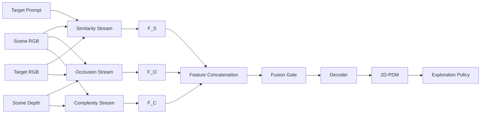

```text
F_fuse = FusionGate(Concat(F_S, F_O, F_C))
P_2D   = Sigmoid(Decoder(F_fuse))
```

최종 `P_2D`는 target이 존재할 확률이 높은 영역을 나타내며, DRL이 확률이 높은 영역부터 우선 탐색할 수 있도록 사용됨.

### 이 문서의 tensor 표기는 어떻게 읽는가?

`68-D`, `768-D`에서 **D는 depth가 아니라 dimension, 즉 벡터를 구성하는 숫자의 개수**를 뜻함. 예를 들어 `768-D feature`는 한 patch를 768개의 실수로 표현한다는 뜻이며, 768개 값에 사람이 정한 768개 물리 속성이 하나씩 대응한다는 뜻은 아님. 여러 값이 함께 형상·색·질감·문맥을 분산해서 표현함.

| 표기 | 의미 | 이 프로젝트의 예시 |
|---|---|---|
| `B` | 한 번에 처리하는 sample 수인 batch size | `B=16`이면 scene 16장을 동시에 처리 |
| `C` | Feature channel 수, 즉 위치 하나를 표현하는 숫자의 개수 | DINOv3 ViT-B/16은 patch마다 `C=768` |
| `H, W` | 입력 영상의 세로·가로 pixel 수 | 기본 scene은 `H=480, W=640` |
| `Hₚ, Wₚ` | Patch grid의 세로·가로 위치 수 | 16×16 patch를 쓰므로 `480×640 → 30×40` |
| `ℓ` | 여러 backbone layer 중 하나 | DINOv3 layer `2, 5, 8, 11` |
| `(u,v)` | Patch grid 안의 한 공간 위치 | `(u,v)`마다 서로 다른 확률을 출력 |

따라서 `B × 768 × 30 × 40`은 **scene B장 각각에 대해 30×40개의 위치가 있고, 위치마다 768개의 feature 값이 있다**는 뜻임.

| 용어 | 코드에서 실제로 하는 일 |
|---|---|
| Feature / embedding / latent vector | 입력을 여러 숫자로 바꾼 내부 표현. 각 축의 개별 의미보다 벡터 사이의 관계를 사용 |
| Patch / token | 영상을 작은 영역으로 나눈 단위. ViT-B/16의 한 patch는 입력의 `16×16 pixel` |
| Pooling | 여러 위치의 vector를 평균 또는 가중 평균하여 대표 vector 하나로 요약 |
| Projection / Linear | `W x + b`로 vector 길이와 좌표계를 학습 가능하게 변환 |
| Broadcast | 위치가 없는 target vector 하나를 scene의 모든 `(u,v)` 위치에 동일하게 복제 |
| Concat | 같은 `(u,v)`의 여러 vector를 channel 방향으로 이어 붙임. 공간 위치는 섞지 않음 |
| `3×3 Conv` | 현재 patch와 주변 8개 patch를 함께 보며 공간 문맥을 처리 |
| `1×1 Conv` | 각 위치를 유지한 채 그 위치의 channel만 혼합 |
| Logit | Sigmoid를 적용하기 전의 제한 없는 실수 출력 |
| Sigmoid | Logit을 `0–1` 값으로 변환하는 함수 `σ(z)=1/(1+e^{-z})` |
| Frozen / Trainable | 가중치를 고정하여 feature만 추출 / loss의 gradient로 가중치를 갱신 |

Overview의 `F_S, F_O, F_C`는 stream마다 숫자 하나가 아니라 위치를 유지한 spatial feature map임. 개념적인 shape는 각각 `B × C_i × Hₚ × Wₚ`이며, `Concat`은 세 map의 같은 위치를 channel 방향으로 결합함. 최종 `P_2D`는 `B × 1 × H × W`의 한 장짜리 확률 map임. 현재 Similarity와 Occlusion stream은 구현 중이지만 Complexity·세 stream fusion·DRL 연결은 제안 단계이므로, `C_i`와 최종 decoder 구조는 아직 확정된 구현값이 아님.

---

## From Shelf Search to Drawer Search

기존 선반 환경 연구를 비정형 drawer 환경으로 확장함.

> H. Jeon et al., *A study on deep reinforcement learning-based exploration intelligence for occluded object search*, Engineering Applications of Artificial Intelligence, 2026.

기존 연구는 similarity와 occlusion 기반 column-wise distribution을 사용함. 물체 유사도를 수동 정의한 category score에 의존했기 때문에, 학습에 없던 물체로 확장되는 zero-shot 탐색 성능을 확인하지 못했음.

주요 확장:

- 정규적인 shelf column에서 **비정형 cluttered drawer**로 확장
- Column-wise distribution에서 **pixel-wise 2D-PDM**으로 확장
- DINOv3의 dense appearance와 SigLIP의 language-aligned semantics 결합
- 학습하지 않은 target instance를 입력할 수 있는 zero-shot target conditioning
- Similarity와 Occlusion에 scene-level **Complexity stream** 추가

---

## Similarity Stream

> **Status: Implemented · qualitative zero-shot activation confirmed · quantitative held-out benchmark pending**

Similarity stream은 target 및 의미적으로 관련된 물체 영역을 활성화함. DINOv3의 dense appearance와 SigLIP의 image/text semantics를 결합하여 instance-level 외형과 category-level 의미를 함께 표현함.

### Design Rationale

| Component | 담당 정보 | 필요한 이유 |
|---|---|---|
| **DINOv3 Scene Encoder** | 위치가 보존된 dense visual feature | Scene의 어느 patch에 어떤 형상·질감·appearance가 있는지 표현 |
| **DINOv3 Target Encoder** | Target-specific appearance | “이 물체가 어떻게 생겼는가?”를 layer별 query로 표현 |
| **SigLIP Vision Encoder** | Target image semantics | 외형을 넘어선 open-vocabulary 개념 표현 |
| **SigLIP Text Encoder** | Instance name + category semantics | 이미지가 모호해도 구체적인 물체 이름과 category 정보로 의미를 보완 |
| **Matching Head** | Scene–target spatial relation | Appearance, semantics, cosine cue를 함께 해석해 normalized similarity score map 생성 |

### Architecture

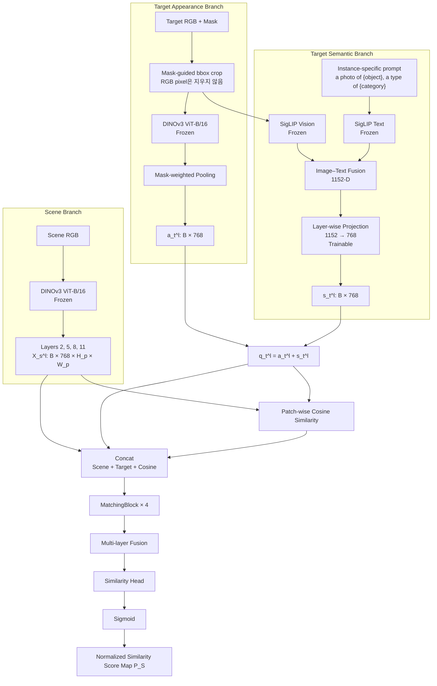

### Similarity tensor flow: 각 숫자는 어디서 오는가?

`DINOv3 ViT-B/16`에서 모델 이름의 `B`는 **Base 크기 모델**, tensor shape의 `B`는 **batch size**로 같은 글자일 뿐 서로 무관함. `/16`은 한 patch의 한 변이 16 pixel이라는 뜻임. 이 backbone은 12개 transformer block과 768-D embedding을 사용함. 현재 코드는 전체 12개 출력을 모두 concat하지 않고 layer `2, 5, 8, 11`의 네 중간 출력을 사용하여 서로 다른 처리 단계의 정보를 보존함.

`SigLIP SO400M patch14-384`의 `patch14`는 vision encoder의 내부 patch 한 변 크기, `384`는 이 checkpoint가 기대하는 image 입력 크기임. `SO400M`은 model-family 이름이며 400-D feature라는 뜻이 아님. DINO target의 `224`와 SigLIP의 `384`가 다른 이유는 같은 crop을 각 사전학습 encoder의 입력 규격에 맞춰 별도로 resize하기 때문임. 선택한 SigLIP checkpoint의 image/text pooler 출력 길이는 1152로 정해져 있음. 따라서 `768`과 `1152`는 임의로 붙인 물리 feature 수가 아니라 각 backbone이 정한 embedding width임.

Target 전처리의 `mask-guided crop`은 RGB 물체 바깥을 검게 지우는 처리가 아님. Mask에서 bounding box를 찾고 높이·너비의 25% 여백을 더한 뒤 **같은 RGB 영역과 mask를 함께 자름**. RGB crop은 DINOv3용 `224×224`, SigLIP용 `384×384`로 각각 resize함. Mask는 DINO appearance pooling의 가중치로만 사용하고, SigLIP vision encoder에는 잘라낸 RGB 전체를 입력함.

| 순서 | 실제 tensor 변화 | 숫자의 의미 |
|---:|---|---|
| 1 | Scene RGB `B×3×480×640` | `3`은 RGB channel |
| 2 | DINOv3 scene output `4 × (B×768×30×40)` | 네 layer 각각 1,200개 patch 위치, 위치마다 768-D |
| 3 | Target crop `B×3×224×224` → DINOv3 `4 × (B×768×14×14)` | 224/16=14이므로 target view마다 196개 patch. 최신 경로는 CLS token을 사용하지 않음 |
| 4 | Mask-weighted pooling → `a_t^ℓ: B×768` | 196개 target patch를 물체 포함 비율로 가중 평균하여 layer별 vector 하나 생성 |
| 5 | RGB crop `B×3×384×384`와 prompt → SigLIP image/text 각각 `B×1152` | Target의 전역 image concept와 instance·category 문장 concept |
| 6 | Image/text 평균·정규화 → `s: B×1152` | 같은 SigLIP 공간의 두 concept를 target semantic vector 하나로 결합 |
| 7 | Layer별 `Linear(1152,768)` → `4 × (B×768)` | SigLIP 좌표를 네 DINO layer query에 사용할 수 있도록 각각 학습 변환 |
| 8 | `q_t^ℓ=a_t^ℓ+s_t^ℓ` → `4 × (B×768)` | Appearance와 semantic 보정이 결합된 raw 검색 query. 이 단계에서는 다시 정규화하지 않음 |
| 9 | Target broadcast → `B×768×30×40` | 같은 query를 scene의 1,200개 위치에 복제 |
| 10 | Patch-wise cosine → `B×1×30×40` | 위치마다 query와의 직접 유사도 한 개 |
| 11 | Concat → `B×1537×30×40` | `768 scene + 768 target + 1 cosine = 1537` |
| 12 | MatchingBlock 네 개 → 각각 `B×64×30×40` | 1537개 입력 channel을 공간 문맥이 반영된 64개 task feature로 압축 |
| 13 | 네 출력 concat → `B×256×30×40` | `4 layers × 64 channels = 256` |
| 14 | Fusion `1×1 Conv` → `B×64×30×40` | 네 layer 정보를 위치별로 다시 64개 channel에 혼합 |
| 15 | Head `1×1 Conv` → logit `B×1×30×40` → sigmoid | Patch마다 normalized similarity score 한 개 |
| 16 | Bilinear interpolation → `B×1×480×640` | 이웃 네 patch score의 거리 가중 평균으로 부드럽게 확대. Patch 안의 새 세부 정보를 복원하는 decoder는 아님 |

Target appearance pooling도 단순히 “mask 안을 평균”한다고 끝나는 과정이 아님. 224×224 pixel mask를 `16×16` 영역별로 평균내면 `14×14` patch 각각이 target을 몇 % 포함하는지 `0–1` weight가 됨. Weight 합을 1로 만든 뒤 DINO patch vector에 곱해 더하므로, 물체 중심 patch는 크게 반영되고 경계 patch는 포함 비율만큼 반영됨. 마지막 L2 normalization은 vector 길이를 1로 맞춰 cosine이 feature 크기가 아니라 방향을 비교하게 함.

```text
224×224 target mask
    → 16×16 average pooling
    → 14×14 soft weights (196개)
    → weighted average of 196 DINO patch vectors
    → one 768-D target appearance vector per layer
```

`64 channels`는 64개의 사전 정의된 유사도 종류가 아님. Matching head의 계산량과 표현력을 정하는 설계값 `hidden_ch=64`이며, 각 channel이 어떤 조합에 반응할지는 similarity-map loss가 학습함. `GroupNorm(8,64)`은 이 64개 channel을 8개 group으로 나누어 sample 내부에서 값의 scale을 안정화하고, ReLU는 음수 반응을 0으로 바꾸는 비선형 함수임.

Projection `Linear(1152,768)`의 출력 하나는 SigLIP 좌표 하나를 복사한 값이 아니라 1152개 입력의 학습된 가중합임. 네 DINO layer마다 서로 다른 `W^ℓ,b^ℓ`를 사용함.

$$
s_{t,k}^{\ell}=\sum_{j=1}^{1152}W_{kj}^{\ell}s_j+b_k^{\ell},
\qquad W^{\ell}\in\mathbb{R}^{768\times1152}
$$

SigLIP image/text vector는 각각 L2 정규화하고, 평균낸 1152-D vector도 다시 정규화함. 반면 projection output `s_t^ℓ`와 합산 query `q_t^ℓ`는 정규화하지 않음. Cosine을 계산할 때만 `q_t^ℓ`의 길이를 1로 맞추며, MatchingBlock에는 정규화 전 raw query를 broadcast함. 따라서 projection이 만든 **방향은 cosine에**, 방향과 크기는 **MatchingBlock에** 전달됨.

### Model Specification

| Stage | Module | Input | Operation | Output | State |
|---:|---|---|---|---|---|
| 1 | Target preprocessing | Target RGB, mask | Mask bbox + 25% padding; RGB/mask 함께 crop | DINO `224×224`, SigLIP `384×384` | No parameters |
| 2 | Scene encoder | Scene RGB | DINOv3 ViT-B/16 layers `2, 5, 8, 11` | `X_s^l: B × 768 × H_p × W_p` | Frozen |
| 3 | Target encoder | Target crop, mask | DINOv3 + mask-weighted pooling | `a_t^l: B × 768` | Frozen |
| 4 | SigLIP vision | Target crop | Image encoding, L2 normalization | `s_img: B × 1152` | Frozen |
| 5 | SigLIP text | Instance name + category prompt | Text encoding, L2 normalization | `s_text: B × 1152` | Frozen |
| 6 | Semantic fusion | `s_img`, `s_text` | Average fusion, L2 normalization | `s: B × 1152` | No parameters |
| 7 | Semantic adapter | `s` | Independent `Linear(1152, 768)` per layer | `s_t^l: B × 768` | **Trainable** |
| 8 | Target fusion | `a_t^l`, `s_t^l` | Element-wise addition | `q_t^l: B × 768` | No parameters; gradient flows to projection |
| 9 | Cosine matching | `X_s^l`, `q_t^l` | Patch-wise cosine, range shift | `c_hat^l: B × 1 × H_p × W_p` | No parameters; differentiable |
| 10 | Interaction | Scene, target, cosine | Channel concatenation | `Z^l: B × 1537 × H_p × W_p` | No parameters; differentiable |
| 11 | MatchingBlock | `Z^l` | `3×3 Conv → GN → ReLU → 1×1 Conv → GN → ReLU` | `F_l: B × 64 × H_p × W_p` | **Trainable** |
| 12 | Layer fusion | Four `F_l` tensors | Concat + 1×1 convolution | `F_S: B × 64 × H_p × W_p` | **Trainable** |
| 13 | Output head | `F_S` | 1×1 convolution + sigmoid | `P_S: B × 1 × H_p × W_p` | **Trainable** |
| 14 | Reconstruction | `P_S` | Bilinear interpolation | Full-resolution similarity score map | No parameters |

### Target Representation

Mask가 포함된 patch를 포함 비율에 따라 pooling하여 target appearance를 계산함. `M(x,y)`가 pixel mask라면 먼저 각 `16×16` patch에서 target pixel 비율 `r_ij`를 구하고, 전체 합이 1이 되도록 `w_ij`로 정규화함.

$$
r_{ij}=\frac{1}{16^2}\sum_{(x,y)\in\mathrm{patch}(i,j)}M(x,y),
\qquad
w_{ij}=\frac{r_{ij}}{\sum_{p,q}r_{pq}+\epsilon}
$$

$$
a_t^{\ell}=\mathrm{L2Norm}\!\left(
\sum_{i,j}w_{ij}T_t^{\ell}(:,i,j)
\right)\in\mathbb{R}^{768}
$$

`r_ij=1`이면 그 patch 전체가 target이고, `r_ij=0.5`이면 절반만 target이라는 뜻임. `T_t^ℓ(:,i,j)`는 target의 layer `ℓ`, 위치 `(i,j)`에 있는 768-D DINO patch vector임. 196개 patch를 가중 평균한 결과가 layer별 768-D `a_t^ℓ` 하나가 됨. 최신 Similarity 경로는 DINO CLS token을 사용하지 않음.

SigLIP image/text embedding을 동일한 semantic space에서 결합. 현재 최종 경로는 과거의 DINOv3 CLS category prototype을 사용하지 않으며, SigLIP의 language-aligned embedding을 semantic condition으로 사용함.

```text
s_img  = L2Norm(SigLIP_Vision(target_crop))
s_text = L2Norm(SigLIP_Text(
    "a photo of {instance_name}, a type of {category}"
))
s      = L2Norm((s_img + s_text) / 2)
s_t^l  = W_l · s + b_l
```

Appearance와 semantics를 합산하여 최종 target query 생성.

```text
q_t^l = a_t^l + s_t^l
```

| Vector | 의미 |
|---|---|
| `a_t^l` | Target crop의 DINO contextual visual representation |
| `s_t^l` | SigLIP image와 instance/category prompt를 결합한 global multimodal vector의 layer별 projection |
| `q_t^l` | 두 정보를 결합하여 scene을 검색하는 hybrid query |

> **Semantic fusion을 더하는 이유**
>
> DINOv3와 SigLIP은 서로 다른 feature space를 사용하므로 SigLIP 1152-D vector를 바로 더하지 않음. 학습 가능한 layer-wise projection `Linear(1152, 768)`이 SigLIP semantics를 DINOv3 target feature에 활용할 수 있는 형태로 변환함. 결합된 `q_t^l`는 순수 appearance vector가 아니라, **target의 외형과 의미를 함께 담은 검색 query**임. 단, 이 정렬은 차원을 맞춘 것만으로 보장되지 않으며 similarity-map loss를 통해 간접적으로 학습됨.

### Scene–Target Interaction

Scene의 **각 patch**와 target query의 cosine similarity를 계산한 뒤 `[0, 1]`로 변환. Scene 전체를 하나의 숫자로 압축하는 것이 아니라, `480×640` scene에서는 1,200개 위치를 각각 비교하여 `30×40` cosine map을 만듦.

$$
c^{\ell}(u,v)=
\frac{X_s^{\ell}(:,u,v)^{\mathsf T}q_t^{\ell}}
{\lVert X_s^{\ell}(:,u,v)\rVert_2\lVert q_t^{\ell}\rVert_2},
\qquad
\widehat c^{\ell}(u,v)=\frac{c^{\ell}(u,v)+1}{2}
$$

`c`는 `-1–1`, `ĉ`는 `0–1` 범위임. 범위 이동은 순서를 바꾸지 않으며, `ĉ` 자체가 최종 probability는 아님. MatchingBlock에 넣는 명시적 similarity cue임.

#### Cosine Similarity vs. MatchingBlock

| 구분 | Patch-wise cosine | MatchingBlock |
|---|---|---|
| 핵심 질문 | “이 위치가 target과 얼마나 비슷한가?” | “이 유사도를 최종 map에서 어떻게 해석할 것인가?” |
| 계산 | 각 scene patch와 target query의 고정된 cosine 수식 | 학습되는 `3×3/1×1` CNN |
| 입력 | Scene patch, target query | Scene feature, target query, cosine map |
| 출력 | 위치별 1개 유사도, `1 × H_p × W_p` | 위치별 64-D feature, `64 × H_p × W_p` |
| 주변 문맥 | Cosine 연산이 이웃 grid cell을 추가로 합치지는 않음 | `3×3 Conv`로 주변 8개 grid cell까지 명시적으로 함께 해석 |

Cosine map만으로도 기본적인 zero-shot similarity map을 만들 수 있음. 다만 768-D scene–target 관계가 위치별 숫자 하나로 압축되므로, 같은 cosine 값이 외형·의미·배경 중 어떤 이유로 나왔는지는 알 수 없음. MatchingBlock은 원본 scene/target feature와 cosine cue, 주변 공간 문맥을 함께 보고 우연한 고유사도를 억제하거나 일관된 물체 영역을 강화하는 역할을 학습함.

여기서 DINO patch token 자체는 Transformer self-attention을 거쳐 이미 넓은 scene 문맥을 포함함. “Cosine이 주변 문맥을 추가로 보지 않는다”는 것은 **cosine 수식이 인접 grid cell을 다시 합산하지 않는다**는 뜻이며, DINO token이 오직 16×16 원시 pixel만 본다는 뜻은 아님.

```text
Patch-wise cosine = 위치별 유사도를 측정하는 “측정기”
MatchingBlock       = 측정값과 원본 feature를 해석하는 “학습된 보정기”
```

MatchingBlock은 target patch와 scene patch 사이의 cross-attention이나 patch correspondence를 다시 계산하지 않음. 현재 구조에서 직접적인 벡터 유사도 비교는 patch-wise cosine이 담당하고, MatchingBlock은 그 결과를 학습적으로 보정함.

Scalar cosine score의 정보 손실을 보완하기 위해 scene feature와 target query를 함께 concat.

```text
Z^l(u,v) = Concat[
    X_s^l(:,u,v),   # scene appearance: 768 channels
    q_t^l,          # target condition: 768 channels
    c_hat^l(u,v)    # explicit matching cue: 1 channel
]
```

```text
768 scene channels
+768 target-query channels
+  1 shifted-cosine channel
=1537 input channels at each scene position
```

`q_t^ℓ`는 위치가 없는 vector이므로 30×40 모든 위치에 같은 값으로 복제되고, scene feature와 cosine만 위치마다 달라짐. 이 concat이 cosine에서 사라진 정보를 수학적으로 완전히 복원하는 것은 아님. Head가 **현재 위치의 scene pattern, 찾는 target condition, 직접 유사도**를 서로 다른 증거로 함께 볼 수 있게 하는 입력임. 현재 최종 `train_similarity_v2.py`는 `category_dim=0`이므로 과거 CLS-category probability channel은 1537개에 포함되지 않음.

MatchingBlock 하나의 내부 shape는 다음과 같음.

```text
B×1537×30×40
    → 3×3 Conv, 1537→64 : 현재 위치와 주변 8개 위치의 입력을 학습 가중합
    → GroupNorm(8,64)    : 64 channel을 8 group, group당 8 channel로 정규화
    → ReLU               : 음수 반응을 0으로 만드는 비선형 함수
    → 1×1 Conv, 64→64    : 공간 위치는 유지하고 같은 위치의 channel만 재조합
    → GroupNorm + ReLU
    → B×64×30×40
```

첫 `3×3 Conv`의 output channel 하나는 1537개 입력과 이웃 patch를 서로 다른 가중치로 합친 **학습된 evidence map**임. `64`는 category 64개나 물리 속성 64개를 뜻하지 않고 중간 표현 용량을 정한 hyperparameter임. 네 DINO layer의 MatchingBlock은 구조만 같고 가중치는 공유하지 않음.

각 DINOv3 layer를 독립적인 MatchingBlock으로 처리한 뒤 channel 방향으로 결합.

```text
F_l     = MatchingBlock_l(Z^l)
F_S     = Fuse(Concat[F_2, F_5, F_8, F_11])
L_head  = Head(F_S)
P_S     = Sigmoid(L_head)
```

네 layer의 `64` channel을 합치면 `256=4×64` channel이 됨. Fusion의 `1×1 Conv`는 같은 위치에서 이 256개 evidence를 64개로 혼합하고, head의 `1×1 Conv`가 최종 logit 한 개를 만듦. 이때의 `256`은 Occlusion depth encoder의 256 channel과 숫자만 같을 뿐 서로 다른 tensor임.

### Trainable Parameters

DINOv3와 SigLIP은 고정하고 semantic adapter와 matching head만 학습.

| Module | Parameters | State |
|---|---:|---|
| DINOv3 ViT-B/16 | Backbone parameters | Frozen |
| SigLIP SO400M | Encoder parameters | Frozen |
| Semantic projection `Linear(1152, 768) × 4` | 3,542,016 | **Trainable** |
| MatchingBlock × 4 | 3,559,168 | **Trainable** |
| Multi-layer fusion | 16,576 | **Trainable** |
| Similarity head | 65 | **Trainable** |
| **Total trainable** | **7,117,825** | |

Checkpoint에는 task-specific layer만 저장하며, frozen backbone은 별도로 로드.

Parameter 수는 표에 붙인 임의 숫자가 아니라 tensor 폭에서 계산됨. Semantic projection 하나는 `1152×768` weight와 `768` bias를 가지므로 `885,504`개이고, 네 layer를 합치면 `3,542,016`개임. MatchingBlock 하나는 `1537→64`의 `3×3 Conv`, 두 GroupNorm, `64→64`의 `1×1 Conv`를 합쳐 `889,792`개이며, 네 개가 `3,559,168`개임.

---

## Ground-Truth Similarity Map

Similarity GT는 scene segmentation과 asset category로 생성. 기존 연구와의 비교를 위해 명시적인 category relation 유지.

| Target–scene relation | Score |
|---|---:|
| Exact target instance | `1.0` |
| Same category | `0.8` |
| Related category | `0.5` |
| Other category | `0.2` |
| Background / unknown | `0.0` |

Category-level score:

| Target ↓ / Scene → | Book | Toy | Fruit | Packaged food |
|---|---:|---:|---:|---:|
| **Book** | 0.8 | 0.5 | 0.2 | 0.2 |
| **Toy** | 0.5 | 0.8 | 0.2 | 0.2 |
| **Fruit** | 0.2 | 0.2 | 0.8 | 0.5 |
| **Packaged food** | 0.2 | 0.2 | 0.5 | 0.8 |

Precomputed grayscale GT를 우선 사용하며, cache가 없으면 segmentation과 scene mapping으로 생성. 학습 시 DINOv3 patch resolution으로 average pooling.

```text
Y_patch = AvgPool2D(Y_full, kernel=16, stride=16)
L_sim   = MSE(P_S, Y_patch)
```

$$
Y_{\mathrm{patch}}(i,j)=\frac{1}{256}
\sum_{(x,y)\in16\times16\ \mathrm{patch}}Y_{\mathrm{full}}(x,y),
\qquad
L_{\mathrm{sim}}=\frac{1}{BH_pW_p}
\sum_{b,i,j}\left(P_S-Y_{\mathrm{patch}}\right)^2
$$

예를 들어 한 `16×16` patch의 절반이 exact target score `1.0`, 나머지 절반이 background `0`이면 patch GT는 `0.5`가 됨. Loss는 bilinear로 확대한 그림이 아니라 `30×40` patch output에서 계산함. 따라서 `P_S`는 sigmoid로 `0–1` 범위이지만, 통계적으로 보정된 “target 존재 확률”이라기보다 사람이 정의한 `1.0/0.8/0.5/0.2/0.0` 관계를 근사한 **normalized similarity score map**임.

> 학습 GT의 category relation과 zero-shot evaluation은 별개임. Unseen target은 DINOv3와 SigLIP으로 직접 인코딩되며 해당 instance는 학습에서 제외.

---

## Similarity Training Protocol

### Data Split

동일 scene의 여러 camera view가 train/validation에 섞이지 않도록 `scene_id` 단위로 분할.

| Setting | Value |
|---|---|
| Train / validation | `80% / 20%` per target |
| Scene cameras | center, top, left, right, bottom |
| Target cameras | center, top, left, right, bottom |
| Environment stride | `10`: env `0,10,…,290` 사용 |
| Split seed | 기본 `None`: 실행마다 random seed를 만들고 실제 값을 log에 기록; 재현 시 그 값을 설정 |
| DINOv3 layers | `2, 5, 8, 11` |
| Batch size | `128` |
| Epochs | `100` |
| Optimizer | AdamW, default weight decay `0.01` |
| Initial learning rate | `1e-3` |
| Scheduler | CosineAnnealingLR |
| Early stopping | patience `5`, relative improvement `5%` |
| Objective | Patch-resolution MSE |

### Cached and Trainable Paths

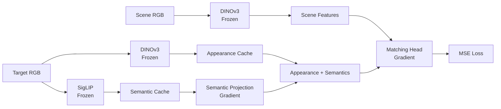

- Target별 5개 camera view의 DINOv3 appearance를 사전 계산
- 학습 시 sample마다 target camera 한 개를 무작위 선택
- Validation 시 동일 scene에 대해 target camera 5개를 모두 순회하고 각각 loss/metric에 포함
- Target별 SigLIP은 center RGB 한 장과 instance/category prompt로 1152-D semantic vector를 계산해 caching
- Frozen scene DINOv3는 scene batch마다 forward
- Gradient 유지를 위해 semantic projection은 training step 내부에서 적용

### Evaluation and Checkpoints

| 지표 | 현재 코드의 계산 | 해석 |
|---|---|---|
| MSE | 모든 patch의 `(prediction-GT)²` 평균 | Graded relation score 자체의 오차. 낮을수록 좋음 |
| Pixel accuracy | `|prediction-GT| < 13/255 ≈ 0.051`인 전체 patch 비율 | 허용 오차 안에 들어온 위치 비율 |
| Balanced accuracy | GT-positive와 GT-negative 각각의 tolerance accuracy를 구한 뒤 평균 | 배경이 많은 map에서 전체 accuracy가 쉽게 높아지는 문제를 완화 |
| Tolerance IoU-like | `close ∩ GT-positive`를 `GT-positive ∪ predicted-positive`로 나눈 값 | 일반적인 binary-mask IoU와 다른 현재 프로젝트의 보조 지표 |

여기서 `GT-positive`는 `GT > 25.5/255 = 0.1`임. Object relation의 최소 score가 `0.2`이므로 exact target만이 아니라 same/related/other-category 물체도 모두 positive에 포함됨. 따라서 현재 IoU-like 값을 “exact target 위치 IoU”로 해석하면 안 되며, graded similarity 품질의 주 지표는 MSE임.

Checkpoint에는 trainable module만 저장.

```python
{
    "model_state": similarity_model.state_dict(),
    "semantic_proj_state": semantic_projection.state_dict(),
}
```

---

## Zero-Shot Target Conditioning

Target image를 query로 직접 인코딩하므로 학습하지 않은 object도 **같은 입력 규격으로 표현할 수 있음**. 다만 frozen encoder가 vector를 만들 수 있다는 사실과 trainable head가 실제로 zero-shot 일반화한다는 주장은 다르므로, 정량 object-held-out 검증 전에는 가능성으로 구분함.

| Mode | 실제 필요한 입력 | 현재 상태 |
|---|---|---|
| **현재 학습 경로** | Target RGB + target mask/bbox + instance/category prompt | DINO appearance와 SigLIP image/text semantics를 모두 사용 |
| **Image-only 지원 함수** | Target RGB + target mask/bbox | `text_embed=None` 계산은 가능하지만 별도 학습·held-out 평가가 필요한 mode |

현재 instance-specific prompt 사용:

```text
a photo of {instance_name}, a type of {category}
```

새 instance 이름이 `TARGET_LABELS`에 없으면 category prompt로 fallback하므로 이 경우 category 정보는 외부에서 필요함. 또한 현재 preprocessing은 crop과 appearance pooling에 target mask를 사용하므로 “RGB 한 장만 넣으면 곧바로 동작함”으로 해석하면 안 됨.

### Qualitative Similarity Maps


### Unseen Target Results

학습에 포함되지 않은 banana 입력 시 fruit 영역 활성화 확인. 학습에 포함되지 않은 packaged-food target에서도 same-category 영역 활성화 확인.


- DINOv3: target–scene dense appearance
- SigLIP: banana–fruit open-vocabulary semantics

> Banana 및 `packaged_food_5` 결과는 qualitative evidence임. 최종 zero-shot 주장은 object-held-out, category-held-out, DINOv3-only, SigLIP-only, image-only, image+text ablation으로 별도 검증할 예정.

---

## Similarity Stream: Four Questions

Similarity stream의 핵심은 **DINOv3 appearance로 외형을 찾고, SigLIP semantics로 category 의미를 보완한 뒤, 위치별 유사도를 학습적으로 보정**하는 것임.

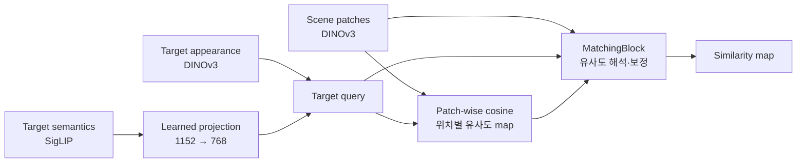

### Q1. 서로 다른 DINOv3와 SigLIP vector를 그냥 더해도 되는가?

**원본 vector끼리 바로 더하는 것은 아님.** DINOv3 appearance는 768-D, SigLIP multimodal vector는 1152-D이며, 두 모델의 feature 축은 서로 다른 의미를 가짐. 현재 코드는 SigLIP vector를 layer별 학습 가능한 projection으로 변환한 뒤 DINOv3 appearance와 더함. 따라서 frozen DINO appearance 자체나 scene feature가 바뀌는 것이 아니라, 이후 검색에 쓰는 hybrid target query가 의도적으로 바뀜.

```text
DINOv3 appearance aˡ : 768-D  ───────────┐
                                          ├─→ qˡ = aˡ + (Wˡs + bˡ)
SigLIP condition s    : 1152-D → Wˡ,bˡ → 768-D ─┘
```

Projection `Wˡ,bˡ`은 차원만 줄이는 고정 변환이 아니라, similarity-map loss가 작아지도록 학습되는 adapter임. 결합 후 `qˡ`은 순수한 DINOv3 appearance가 아니라 **외형과 multimodal 의미가 함께 반영된 검색 query**가 됨.

쉽게 말하면, feature vector는 latent space 안의 **하나의 위치**로 볼 수 있음. DINOv3 appearance `aˡ`가 “노란색·곡선·표면 질감”에 가까운 위치를 표현한다면, projection된 semantic `Wˡs`를 더하는 것은 그 위치를 “banana·fruit” 개념 방향으로 이동시키는 것과 같음.

```text
개념적인 latent space (실제는 768-D)

                     orange •
                            \
             fruit 방향 ↗  • qˡ = appearance + semantics
                          /
       appearance aˡ •
                    \
                     • yellow toy
```

즉 semantic은 DINOv3 출력을 삭제하는 것이 아니라, target query가 scene에서 외형적으로 비슷한 물체뿐 아니라 의미적으로 관련된 물체에도 가까워지도록 위치를 보정하는 역할을 함.

### Q2. Cosine map이 이미 있는데 scene·target feature를 다시 concat하는 이유는?

Cosine은 scene 전체를 숫자 하나로 만드는 것이 아님. Scene이 `30 × 40` patch라면 **1,200개 위치 각각에 cosine scalar 하나**가 계산되어 `1 × 30 × 40` map이 됨.

Target은 patch 하나를 사용하는 것이 아니라, target 영역의 여러 DINOv3 patch를 pooling한 768-D appearance vector `aˡ`로 먼저 요약됨. 여기에 projection된 SigLIP condition `s_t^ℓ`를 더한 `qˡ=aˡ+s_t^ℓ`가 최종 target query이며, 이 query를 scene의 모든 patch와 각각 비교함.

```text
Scene patches                         Cosine map

F(1,1) F(1,2) F(1,3) F(1,4)          0.10  0.18  0.74  0.81
F(2,1) F(2,2) F(2,3) F(2,4)   →      0.09  0.21  0.86  0.79
F(3,1) F(3,2) F(3,3) F(3,4)          0.05  0.13  0.32  0.20
```

공간 위치는 보존되지만, 각 위치의 768-D scene–target 관계는 cosine 숫자 하나로 압축됨.

| Scene의 한 patch | Target: banana와의 cosine | Cosine만으로 알 수 있는 것 |
|---|---:|---|
| Banana 영역 | `0.88` | Target과 매우 비슷함 |
| Orange 영역 | `0.63` | Banana보다 외형은 다르지만 일부 특징이 비슷함 |
| Yellow toy 영역 | `0.85` | 노란색·질감 때문에 높은지, 의미까지 맞는지는 알 수 없음 |

위 값은 구조를 설명하기 위한 가상 수치임. 이처럼 banana patch와 yellow toy patch가 모두 높은 scalar를 가지거나, 같은 fruit인 orange가 더 낮은 scalar를 가질 수 있음. Cosine scalar만으로는 **어떤 feature로 인해 그 점수가 나왔는지** 구분하기 어려움.

그래서 다음 정보를 함께 유지함.

```text
Zˡ(u,v) = Concat[
    scene feature 768-D,   # 이 위치가 실제로 무엇인지
    target query  768-D,   # 무엇을 찾고 있는지
    cosine          1-D    # 두 vector의 직접적인 유사도
]
```

중복 정보를 의도적으로 제공하는 구조이며, cosine은 명시적 matching cue, raw feature는 cosine에서 손실된 세부 관계를 담당함. 다만 실제 이득은 `cosine-only` 대비 ablation으로 입증해야 함.

### Q3. SigLIP과 DINOv3 latent vector의 의미를 어떻게 알 수 있는가?

Latent vector의 각 차원에 `17번=과일`, `325번=노란색`과 같은 고정 의미가 붙어 있는 것은 아님. 개념은 여러 차원에 **분산 표현**되므로, 논문에서는 각 좌표를 억지로 해석하지 않고 벡터가 보존하는 관계를 실험으로 검증함.

| 확인 방법 | 알 수 있는 것 |
|---|---|
| Text retrieval | Banana image가 `fruit`, `toy`, `book` 중 어느 text와 가까운지 |
| Nearest neighbor | Banana vector 주변에 apple/orange가 있는지, 노란 장난감이 있는지 |
| Prompt swap | 같은 target에 `fruit` 대신 `toy` prompt를 줄 때 map이 변하는지 |
| Linear probe | Frozen vector에 category 정보가 선형적으로 추출 가능한지 |
| Layer-wise map | DINOv3 각 layer가 질감·형태·물체 구분에 어떻게 반응하는지 |

SigLIP semantic vector는 target crop의 image embedding과 instance/category prompt의 text embedding을 결합한 **전역 multimodal concept representation**임. DINOv3 patch token은 해당 위치뿐 아니라 self-attention을 통해 주변과 전체 scene 문맥이 반영된 **위치별 contextual visual representation**임.

### Q4. Patch-wise cosine과 MatchingBlock은 같은 matching을 두 번 하는 것 아닌가?

둘 다 scene patch 위치를 유지하지만 역할은 다름.

| 구분 | Patch-wise cosine | MatchingBlock |
|---|---|---|
| 비유 | 유사도를 재는 **측정기** | 측정값을 판단하는 **학습된 보정기** |
| 방법 | 고정된 cosine 수식 | 학습되는 `3×3 Conv → 1×1 Conv` |
| 출력 | 위치별 숫자 1개 | 위치별 64-D feature |
| 주변 patch | Cosine 수식은 이웃 cell을 추가로 합치지 않음 | `3×3 Conv`로 이웃 cell을 명시적으로 함께 봄 |

예를 들어 중앙 patch의 cosine이 모두 `0.91`이어도 주변 모양은 다를 수 있음. 아래 값은 설명용 가상 수치임.

```text
고립된 고유사도                 물체 영역으로 이어진 고유사도

0.10  0.12  0.09                 0.71  0.78  0.74
0.11  0.91  0.13                 0.80  0.91  0.82
0.08  0.10  0.12                 0.72  0.79  0.75

Cosine: 중앙은 둘 다 0.91          MatchingBlock: 주변 문맥으로 두 경우를 다르게 해석 가능
```

MatchingBlock은 cosine을 다시 계산하지 않으며, target patch–scene patch cross-attention이나 correspondence 탐색도 수행하지 않음. 이미 계산된 cosine, 원본 feature, 주변 문맥을 이용해 최종 활성화를 보정함.

> **핵심 구분:** Patch-wise cosine이 “얼마나 비슷한가”를 계산하고, MatchingBlock이 “그 비슷함을 믿을 것인가”를 학습함. MatchingBlock의 실제 필요성은 cosine-only 대비 held-out ablation으로 검증해야 함.

---

## Occlusion Stream

> **Status: Mesh-based probability GT와 clean52 multi-scale benchmark 완료 · BatchNorm 통계를 고정한 저학습률 common-anchor + scale-paired seed-0 모델이 train-only 기준 통과 · 학습하지 않은 4개 development target과 고정 5-camera 평가에서도 개선 확인 · exact 3D extent는 아직 simulation oracle이며 최종 untouched-target 평가는 미수행**
>
> 최신 oracle conditioning은 “정확한 target 크기를 알면 unseen instance에도 크기 효과를 전달할 수 있는가”를 확인하는 연구용 상한선임. 공개 `occlusion_model.py` class는 generic 68-D geometry를 받으며, 현재 deployment reference는 별도 inference 전처리에서 RGB·mask 기반 `[area,bbox_h,bbox_w,0×65]`를 구성함. Exact extent를 RGB/mask에서 얻는 전처리가 검증되기 전에는 oracle checkpoint를 최종 모델로 부르지 않음.

Occlusion stream이 답하려는 질문은 **“Target이 물체 더미에 의해 어느 위치에서 가려질 수 있는가?”**임. 현재 보이는 target을 찾는 Similarity stream과 달리, RGB-D에서 물체 더미의 구조를 읽고 target의 크기를 고려하여 가려질 수 있는 위치의 확률 `P_O`를 예측함. 이 map은 target의 실제 위치를 확정하는 답이 아니라, DRL이 확률이 높은 영역부터 탐색하도록 제공하는 prior임.

학습용 GT 생성과 실제 추론은 분리되어 있음. Mesh와 GT는 학습 데이터를 준비할 때만 필요하고, 배포 시에는 관측 영상만 모델에 입력함.

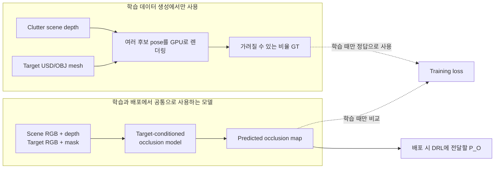

| 정보 | 모델에 필요한 이유 | 처리 방법 |
|---|---|---|
| Scene RGB | 어떤 물체와 경계가 쌓여 있는지 파악 | Frozen DINOv3의 일반 visual feature 사용 |
| Scene depth + valid mask | 틈의 깊이, 적층 높이, 빈 공간의 3D 구조 파악 | Trainable ResNet-18 depth encoder 사용 |
| Target RGB | scene 물체와 target의 외형 관계 파악 | 같은 frozen DINOv3 공간에서 비교 |
| Target mask | 새 target이 영상에서 차지하는 크기 계산 | `area`, `bbox height`, `bbox width`를 결정적으로 추출 |
| Target USD/OBJ | 모든 위치를 실제 촬영하지 않고 GT 생성 | Release baseline에서는 GT 생성에만 사용. Exact-extent oracle 진단에서는 3D 크기 condition의 출처로도 사용 |

ResNet-18을 사용하는 이유는 DINOv3를 대체하기 위해서가 아님. DINOv3는 RGB의 일반적인 외형 표현을 제공하고, ResNet-18은 depth와 valid-mask에서 이 task에 필요한 공간 구조를 처음부터 학습함. 두 feature를 합치면 “무엇이 쌓여 있는가”와 “그 아래 공간이 target 크기에 맞는가”를 함께 판단할 수 있음.

### Occlusion 영역과 metric은 어떻게 읽는가?

한 숫자만 비교하면 “어디가 좋아졌는가”를 알 수 없으므로, 서랍을 물리적 의미가 다른 영역으로 나누어 평가함.

| 용어 | 정확한 정의 | 왜 따로 보는가 |
|---|---|---|
| Candidate pose | Target을 가상으로 놓아 보는 `(x,y,z,yaw)` 한 조합 | GT의 한 번의 배치 가설 |
| Workspace | Camera calibration으로 투영한, camera에서 보이는 drawer 내부 | 서랍 밖의 무의미한 pixel을 평가에서 제외 |
| Coverage | 현재 target·scale의 유효 candidate footprint가 한 번이라도 닿은 pixel, 즉 `N_candidate(u,v)>0` | Target이 물체 더미에 의해 가려질 가능성을 계산할 수 있는 영역 |
| Noncoverage | Workspace 중 **현재 scale** coverage 바깥 | 현재 크기의 target이 닿지 않는데 밝아지는 leakage 확인 |
| All-scale noncoverage | 비교하는 모든 scale의 coverage 합집합 바깥 workspace | 어느 scale에서도 target이 닿지 않는 공통 0 영역이므로 common anchor에 사용 |
| Scale-exclusive | 모든 scale coverage의 합집합 안이지만 현재 scale coverage 바깥 | Target 크기가 바뀔 때 경계가 실제로 이동하는지 확인 |
| Leakage | GT가 0인 noncoverage에서 prediction이 양수로 밝아지는 현상 | DRL이 target과 무관한 위치를 먼저 탐색하게 만들 수 있음 |
| Local gate `G(u,v)` | 해당 위치에서 target geometry 보정을 얼마나 적용할지 정하는 `0–1` 값 | Global FiLM 보정이 workspace 전체에 퍼지는 문제를 줄이기 위함 |

| Metric | 수식과 단위 | 읽는 방법 |
|---|---|---|
| Region MAE | `MAE_R = mean_(u,v∈R) |P(u,v)-G(u,v)|` | 낮을수록 좋음. `0.05`이면 해당 영역에서 위치당 평균 5 percentage-point 차이 |
| Signed bias | `Bias_R = mean_(u,v∈R) (P-G)` | 양수이면 전반적 과대활성화, 음수이면 과소활성화. MAE와 함께 봐야 방향을 알 수 있음 |
| Silhouette IoU | `intersection / union` | 두 renderer의 target 외곽이 겹치는 정도. Thresholded mask 지표이므로 depth 오차는 별도 확인 |
| Correlation | 두 map의 상대적인 공간 패턴 유사성 | Offset이나 전체 밝기 차이가 있어도 높을 수 있으므로 MAE를 함께 봄 |
| 70% decision agreement | 두 renderer가 `occlusion ratio≥0.7` 여부를 동일하게 판단한 pose 비율 | 작은 depth 차이가 최종 가려짐/비가려짐 판정을 뒤집는지 확인 |

Scale-response `S`는 두 scale `s_1,s_2` 사이에서 prediction 변화량 `ΔP=P_{s_2}-P_{s_1}`이 GT 변화량 `ΔG=G_{s_2}-G_{s_1}`을 얼마나 재현하는지 평가함. 분자와 분모는 두 scale coverage 합집합과 workspace의 교집합에서 pixel을 합산함.

$$
S=1-\frac{\sum |\Delta P-\Delta G|}
{\sum |\Delta G|}
$$

평가 코드는 `Σ|ΔG|>0`을 먼저 확인하며, GT 변화가 전혀 없어 분모가 0인 조건은 score를 임의로 만들지 않고 오류로 처리함.

- `S=1`: Scale 변화에 따른 map 변화를 완전히 재현함.
- `S=0`: Prediction이 scale에 전혀 반응하지 않는 `ΔP=0` 기준과 같은 변화량 오차임.
- `S<0`: Scale에 반응하지 않는 것보다 변화량이 더 부정확함.

따라서 단순히 `S>0`인지만 보지 않고 MAE, signed bias, target별·camera별 `S`를 함께 확인함.

### Occlusion GT Generation

**목적:** 새 target과 scale을 추가할 때마다 수십만 장을 다시 촬영·저장하지 않고도, 서로 비교 가능한 확률 GT를 만드는 것임.

학습 GT는 target을 모든 pose에서 직접 촬영하는 대신 USD/OBJ mesh로 target depth를 계산하여 생성함. 해상도는 기존 데이터와 동일한 `640 × 480`을 유지하고, 기존 pose grid와 `70%` occlusion 판정 기준을 적용함. 렌더링된 개별 RGB·depth·mask는 저장하지 않고 scene depth와 즉시 비교하여 필요한 누적값만 저장함. Mesh를 쓰는 이유는 target의 실제 크기와 회전을 유지하면서 촬영 시간과 저장 용량을 줄일 수 있기 때문임.

```text
Target mesh + scale + candidate pose
                ↓
        Rendered target depth
                ↓
Empty-drawer depth로 valid pixel 계산
                ↓
Compare with cluttered scene depth
                ↓
Valid target pixel의 occlusion ratio ≥ 0.7
                ↓
Legacy GT + probability GT
```

기존 코드의 ratio는 clutter occlusion이 적용된 픽셀을 target 전체 픽셀 수로 나눔. 이 방식은 empty drawer에서 서랍 구조물에 가려지는 픽셀을 분자에서는 제외하면서 분모에는 남기는 불일치가 있음. 기존 결과 재현용 `legacy_ratio`와 학습용 `corrected_ratio`를 분리함.

```text
legacy_ratio    = N_occluded_valid / N_target_all
corrected_ratio = N_occluded_valid / (N_valid + epsilon)

is_occluded = corrected_ratio >= 0.7
```

확률 GT는 해당 위치를 target이 덮는 유효 후보 pose 중 target의 관측 가능한 부분이 `70%` 이상 가려지는 pose의 비율로 정의함. 따라서 `0.8`은 scene마다 임의로 밝아진 값이 아니라, 그 위치를 덮는 유효 후보 중 약 `80%`가 실제로 가려졌다는 공통 의미를 가짐. Scene별 min–max normalization을 사용하지 않는 이유는 target이 물체 더미에 의해 가려질 수 있는 영역이 거의 없는 scene도 가장 밝은 pixel이 강제로 `1`이 되는 문제를 피하기 위해서임. Visible-target 강조는 현재 보이는 물체를 담당하는 Similarity stream과 역할이 겹치므로 새 probability GT에는 넣지 않음.

```text
P_O(u,v) = N_occluded(u,v) / (N_candidate(u,v) + epsilon)
```

<details>
<summary><strong>GT 검증 수치와 구현 근거 펼쳐보기</strong></summary>

#### Mesh-Based GT Reproduction Pilot

`packaged_food_2`, scale `1.0`에서 전체 `44,100`개 candidate pose를 GPU로 처리함. Mesh 기반 target depth로 Legacy GT를 재현하고, 동일한 실행에서 corrected probability GT를 함께 생성함.

기존 GT의 visible-target 후처리도 코드 기준으로 복원함. Scene에서 보이는 target pixel이 camera별 reference의 `30%` 이상이면 Legacy map 전체에 `0.7`을 곱하고 visible target 영역을 `255`로 설정함. 이 규칙은 기존 결과 재현용 Legacy GT에만 적용하며, 새 probability GT에는 적용하지 않음.

```text
visibility_ratio >= 0.3
    → legacy_map = legacy_map × 0.7
    → legacy_map[target_mask] = 255
```

기존 GT 3,000 scene × 5 camera의 visible-target ON/OFF 경계를 분석하고, mesh 전체 pose grid에서 camera별 최대 footprint를 직접 계산하여 정수 reference pixel 수를 확정함.

| Camera | Mesh reference pixels | Inferred legacy range | Decision agreement |
|---|---:|---:|---:|
| center | `2324` | `2324–2330` | `100%` |
| left | `2335` | `2334–2340` | `100%` |
| right | `2336` | `2327–2336` | `100%` |
| top | `2336` | `2324–2336` | `100%` |
| bottom | `2335` | `2334–2336` | `100%` |

최종 정수 reference를 사용해 20 scene × 5 camera의 100개 사례를 재검증함.

| Metric | Mean | Worst |
|---|---:|---:|
| Old GT vs Legacy MAE | `0.0000379` | `0.0000959` |
| Old GT vs Legacy correlation | `0.9999956` | `0.9999919` |

이는 완전한 byte-identical 결과는 아니지만, mesh 기반 Legacy GT가 기존 Isaac Sim GT를 사실상 동일하게 재현함을 보여줌. Corrected probability GT는 valid footprint를 분모로 사용하며 Legacy visibility 후처리를 적용하지 않음.

#### Mesh-Depth Validation

USD mesh 계산이 Isaac Sim target capture를 재현하는지 4개 asset, 9개 pose, 5개 camera의 총 180개 조건에서 검증함.

| Metric | Result |
|---|---:|
| Resolution | `640 × 480` |
| Evaluated cases | `180` |
| Median silhouette IoU | `1.0000` |
| Cases with IoU `0.9993–1.0000` | `176 / 180` |
| Median depth MAE | `0.75 μm` |
| Lowest IoU | `0.8723` |

낮은 IoU 4건은 모두 `book_1`이 서랍 경계에 있고 외측 camera에서 관측된 조건임. Mesh-only renderer는 target 전체를 계산하지만 Isaac Sim reference에서는 서랍 벽이 target 일부를 가림. 최종 GT generator에서는 empty-drawer depth로 해당 영역을 제외하여 동일한 관측 조건을 구성함.

CPU reference 이후 nvdiffrast 기반 GPU rasterizer로 동일한 검증을 확장함. 원본 4개 asset의 `180`개 조건과 `toy_3` 10k simplified mesh의 `45`개 조건을 포함한 총 `225`개 target–pose–camera 조합을 평가함. `book_1` 경계 4건은 drawer wall visibility 차이로 분리되며, 나머지 asset은 사전 기준을 통과함.

| Asset | Cases | Median silhouette IoU | Worst IoU | Median depth MAE |
|---|---:|---:|---:|---:|
| `packaged_food_2` | `45` | `0.9991` | `0.9908` | `0.00245 mm` |
| `fruit_1` | `45` | `0.9993` | `0.9966` | `0.00239 mm` |
| `toy_3` original | `45` | `0.9989` | `0.9959` | `0.12545 mm` |
| `toy_3` 10k | `45` | `0.9971` | `0.9945` | `0.29095 mm` |

#### Automatic Mesh Simplification

초기 CPU reference rasterizer는 triangle별 Python loop를 사용하여 mesh 복잡도에 따라 실행 시간이 급증함.

| Asset | Triangles | Mean render time |
|---|---:|---:|
| `book_1` | `732` | `0.23 s` |
| `fruit_1` | `12,602` | `3.91 s` |
| `packaged_food_2` | `16,384` | `5.22 s` |
| `toy_3` | `2,029,960` | `577.72 s` |

`toy_3`은 2,029,960 triangles에서 10k mesh로 단순화함. GPU 원본–단순화 직접 비교 결과 45개 조건에서 median IoU `0.9970`, worst IoU `0.9938`, median depth MAE `0.3781 mm`를 기록함. 현재 generator는 50k faces를 초과한 asset을 10k faces로 단순화하고 cache함. 새 asset의 원본–단순화 full-resolution 검증과 최종 mesh 승인은 별도 단계로 남겨둠.

```text
New USD/OBJ
    → world-scale mesh extraction
    → complexity check
    → 10k simplification and cache when required
    → original/simplified validation
    → approved mesh for GT generation
```

단순화 검증에는 silhouette와 depth뿐 아니라 실제 GT 판정의 안정성을 포함함.

| Validation | Criterion |
|---|---:|
| Silhouette IoU | `≥ 0.98` |
| Depth MAE | `≤ 1 mm` |
| Area error | `≤ 2%` |
| 70% occlusion decision agreement | `≥ 99%` |

단순화는 asset별 한 번만 수행하고 cache함. nvdiffrast 기반 V2 generator는 pose·camera·scene을 GPU에서 vectorize하고 확률 accumulator에 바로 누적함. V1/V2는 1,024 pose 회귀검사에서 출력을 교차검증함. 실제 zero-shot 배포에서는 mesh가 필요하지 않음.

#### Corrected Occlusion Decision Pilot

20개 clutter scene, 9개 target pose, 5개 camera를 사용하여 Isaac target depth, GPU 원본 mesh, GPU simplified mesh의 `70%` 판정을 비교함.

| Target | Comparison | Cases | Ratio MAE | Decision agreement | Boundary agreement (`0.65–0.75`) |
|---|---|---:|---:|---:|---:|
| `packaged_food_2` | Isaac vs GPU original | `900` | `0.0003` | `100.00%` | `100.00%` |
| `toy_3` | Isaac vs GPU original | `900` | `0.0006` | `99.78%` | `97.70%` |
| `toy_3` | GPU original vs 10k | `900` | `0.0010` | `99.67%` | `96.59%` |

`book_1` 경계 pose 4개와 clutter scene 20개를 사용한 별도 검사에서는 drawer wall이 target pixel의 `10.01–12.77%`를 제외함. Corrected ratio는 80개 조건 모두 legacy ratio 이상이었으며, `6/80`개 조건에서 `0.7` 판정이 변경됨. 따라서 새 학습 GT는 corrected denominator를 사용하고 legacy ratio는 비교용으로만 보존함.

#### Reproducible Clutter Capture

Clutter capture는 물리 낙하가 끝난 뒤 `world.render()`만 사용하여 5개 camera를 촬영함. 캡처 전후 pose 비교에서 위치 변화 `0 mm`, 회전 변화 최대 `0.000002°`, quaternion component 변화 `0`을 확인함.

각 run과 scene에는 다음 정보를 저장함.

- Seed, run ID, scene 시작·종료 번호와 완료 상태
- Camera intrinsics/extrinsics와 `640 × 480` 해상도
- 모든 object의 최종 position, orientation, category와 target 여부
- `color_bgr`, 실제 RGB 순서의 `color_rgb`, legacy color
- Existing scene 자동 이어쓰기와 atomic JSON 저장
- Drawer 내부 actual mesh-vertex QC

10k mesh의 full-grid 최종 승인은 V1/V2 동등성 검사와 별개로 관리함. 새 고복잡도 asset은 원본–단순화 geometry와 `70%` 판정 안정성을 확인한 뒤 production GT에 사용함.

</details>

### Occlusion GT Generation Protocol

| Setting | Value |
|---|---|
| Output resolution | `640 × 480` |
| XY range | `-0.17–0.17 m` |
| XY interval | `0.01 m` |
| XY positions | `35 × 35` |
| Yaw | `0–330°`, interval `30°` |
| Height levels | Target-specific `BASE_Z` + `0.03 m × {0,1,2}` |
| Candidate poses | `44,100` per target |
| Cameras | center, top, left, right, bottom |
| Occlusion threshold | Valid target pixels의 `70%` |

```text
1. USD/OBJ를 meter 단위 world mesh로 변환
2. 50k faces 초과 mesh는 10k로 단순화·cache하고 별도 full-resolution 승인
3. Mesh scale과 학습에 제공할 size condition의 scale label을 일치
4. Candidate pose와 camera를 batch로 target depth 렌더링
5. Empty-drawer depth로 drawer structure에 가려지는 pixel 제외
6. Cluttered scene depth가 target depth보다 가까운 pixel 계산
7. Corrected occlusion ratio가 0.7 이상인 pose만 occluded pose로 인정
8. N_candidate와 N_occluded를 즉시 누적하고 개별 depth는 저장하지 않음
9. Legacy GT와 probability GT를 함께 출력
```

```text
valid        = (D_empty == 0) or (D_empty >= D_target)
occluded     = valid and (D_scene != 0) and (D_scene < D_target)
ratio        = Sum(occluded) / (Sum(valid) + epsilon)
accept_pose  = ratio >= 0.7
P_O          = N_occluded / (N_candidate + epsilon)
```

기존 `distribution_map_GPU.py`는 legacy 결과 재현용으로 보존함. 분모가 다른 corrected ratio, scene 간 비교 가능한 probability normalization, mesh simplification과 batch accumulation은 새 GT generator에만 구현함.

### Production GT Dataset

Scale `1.0` 기준으로 14개 target 전체에 대해 동일한 150개 clutter scene과 5개 camera의 corrected probability GT 생성을 완료함.

| Item | Value |
|---|---:|
| Targets | `14` |
| Shared clutter scenes | `150` |
| Cameras per scene | `5` |
| Scene-camera maps per target | `750` |
| Candidate poses per target | `44,100` |
| Output resolution | `640 × 480` |
| Occlusion threshold | `70%` of valid target pixels |

모든 target이 동일한 scene-key 집합을 사용함. 따라서 모델이 target별로 서로 다른 scene 분포를 외우는 target/scene confound를 제거하고, 같은 scene에서 target condition만 바뀔 때 GT가 어떻게 달라지는지 학습할 수 있음.

```text
Same scene S + target T_book  -> occlusion GT G_book
Same scene S + target T_fruit -> occlusion GT G_fruit
Same scene S + target T_toy   -> occlusion GT G_toy
```

Train/held-out target은 결과 확인 전에 고정함.

| Split | Targets |
|---|---|
| Train | `book_1/2/3`, `fruit_1/2/3`, `toy_2/3`, `packaged_food_2/3` |
| Held-out | `book_4`, `fruit_4`, `toy_4`, `packaged_food_4` |

신규 10개 target은 center camera에서 pose를 한 번만 결정하고 나머지 camera에서는 재탐색하지 않는 single-pose Gate-1 검증을 수행함. 다섯 camera 전체에서 silhouette IoU `0.982–1.000`, depth MAE `≤ 0.08 mm`를 기록함. `book_3` center의 IoU `0.9824`는 누락 geometry 없이 1-pixel boundary rasterization 차이로 확인함.

Generator는 실행 manifest에 없는 `scene*` 디렉터리가 남아 있으면 자동 삭제하거나 무시하지 않고 중단함. Pilot과 production run의 scene 집합이 섞이는 문제를 방지하기 위한 invariant임.

### Multi-Scale Controlled Study

후속 size-effect 실험은 clean scene 52개를 train 36 / validation 16으로 고정함. Train target은 scale `0.7`, `1.0`, `1.3`, training-heldout target은 개발용 scale `0.85`, `1.0`, `1.15`로 평가함. 두 모델의 학습량은 16 epoch, epoch당 5,400 sample, 총 5,408 optimizer update로 동일하게 맞춤.

| Split | Targets | Scales | Maps |
|---|---:|---|---:|
| Train | `10` | `0.7 / 1.0 / 1.3` | `7,800` |
| Training-heldout, development-seen | `4` | `0.85 / 1.0 / 1.15` | `960` |

Multi-scale GT는 mesh를 실제 크기에 맞게 scale함. Controlled analytic-conditioning 실험에서는 target appearance를 고정하고, 실제 target mask에서 얻은 `area`, `bbox_h`, `bbox_w`만 `area × s²`, `h × s`, `w × s`로 변환하여 size effect만 분리해 비교함. 실제 추론에서는 관측된 target mask로부터 같은 크기 정보를 계산함.

`book_1/2/3 × 1.3`은 서랍 밖이나 벽을 관통하는 candidate pose를 1 mm containment filter로 제외한 `physical_corrected` GT를 사용함. 여기서 `physical_corrected`는 **서랍 경계 containment를 보정했다는 이름**이며, clutter 충돌과 지지 안정성까지 모두 검사한 완전한 물리 시뮬레이션을 뜻하지 않음. 나머지 조합은 corrected GT를 사용함. Camera별 workspace mask v4는 현재 고정된 5-camera rig에서 서랍 외부 예측을 제거하는 데 사용하며, 임의 camera 일반화를 의미하지 않음.


위 예시는 기존 corrected GT의 공간 패턴을 유지하면서, 서랍 안에서 물리적으로 유효하지 않은 candidate pose를 제외했을 때 확률이 어떻게 보정되는지 보여줌.

### New Asset Protocol

새 학습 asset의 USD/OBJ가 추가되면 다음 과정을 수행함.

```text
Asset discovery
    → unit and transform validation
    → triangle-count check
    → 50k faces 초과 시 10k simplification + cache
    → original/simplified full-resolution approval
    → multi-scale GT generation
```

단순화와 cache는 자동이지만, 새 asset의 원본–단순화 검증과 최종 승인은 아직 별도 절차임. Zero-shot test 및 실제 배포 target은 RGB reference와 mask를 사용하므로 GT용 mesh 전처리는 필요하지 않음.

### Target-Conditioned Occlusion Model — Zero-Shot Goal

**목적:** 같은 scene이라도 작은 book과 큰 toy가 물체 더미에 의해 완전히 가려질 수 있는 위치는 다름. 따라서 scene RGB-D만으로 하나의 고정 map을 만드는 대신, target reference가 바뀌면 map도 함께 바뀌는 조건부 모델을 학습함. 여기서 zero-shot은 물체 이름을 맞히는 것이 아니라, 학습하지 않은 target에도 `외형·크기와 local RGB-D 구조의 관계`를 적용하는 것을 뜻함.

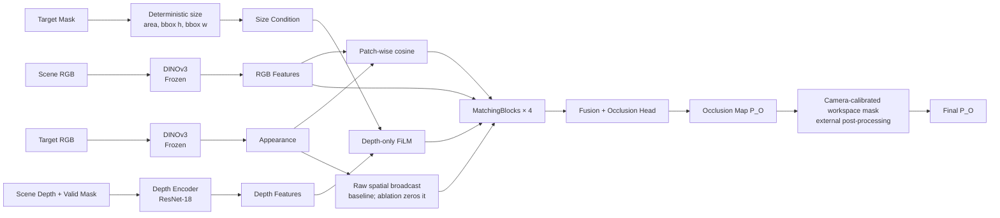

### Occlusion tensor flow: 입력 네 가지가 어디서 합쳐지는가?

아래 1–17단계는 **현재 size-only release baseline의 Global FiLM 흐름**을 ViT-B/16과 `480×640` 입력 한 batch 기준으로 적은 것임. 최신 footprint–height oracle은 뒤에서 설명하는 것처럼 7–9단계에서 같은 FiLM을 `g_F`, `g_H`, `0`에 세 번 적용한 뒤 local gate residual을 사용함. 같은 `64`나 `256`이 반복되더라도 서로 같은 정보라는 뜻은 아님.

`ResNet-18`의 `18`은 이 architecture에서 세는 weighted layer 수이며 18-D feature라는 뜻이 아님. Residual connection으로 앞 feature를 뒤 layer에 더해 depth network를 안정적으로 학습하는 비교적 작은 CNN임. 표의 stride `8/16/32`는 feature 한 칸이 입력에서 각각 8/16/32 pixel 간격으로 이동한다는 뜻이므로, stride가 커질수록 map은 작아지고 더 넓은 depth 문맥을 요약함.

| 단계 | 실제 tensor | 무엇을 담는가 |
|---:|---|---|
| 1 | Scene RGB `B×3×480×640` | RGB 세 channel |
| 2 | Frozen DINOv3 네 layer → 각각 `B×768×30×40` | 1,200개 scene patch마다 768-D contextual appearance |
| 3 | Target RGB → 네 layer 각각 `B×768×30×40` → spatial mean `B×768` | Target **전체 reference frame**의 layer별 appearance. Similarity stream과 달리 crop/mask pooling을 하지 않음 |
| 4 | Scene depth input `B×2×480×640` | Channel 0은 `clip((D-2.5)/(3.5-2.5),0,1)`이고 invalid depth는 0, channel 1은 `D>0` valid mask |
| 5 | ResNet-18 raw depth feature | Stride 8: `B×128×60×80`, stride 16: `B×256×30×40`, stride 32: `B×512×15×20` |
| 6 | `1×1 Conv` projection + resize → 세 map 각각 `B×256×30×40` | 서로 다른 depth scale을 DINO patch grid와 공통 channel 수로 맞춤 |
| 7 | Target geometry `g: B×68` → FiLM hidden `B×64` | Target 크기·형태 입력을 channel 조절값으로 바꾸는 중간 code |
| 8 | FiLM output | 네 branch마다 `γ,β: B×256×1×1`; 총 `4×2×256=2,048`개 조절값 |
| 9 | FiLM depth `B×256×30×40` | `γ×depth+β`로 target 조건이 반영된 local depth feature |
| 10 | Appearance cosine `B×1×30×40` | 각 scene patch와 target 768-D vector의 외형 유사도 한 개. `[-1,1]→[0,1]`로 이동 |
| 11 | Target broadcast `B×768×30×40` | 같은 target vector를 모든 위치에 복제해 “무엇을 찾는가”를 각 위치에 제공 |
| 12 | Concat `B×1793×30×40` | `768 RGB + 256 FiLM-depth + 768 target + 1 cosine = 1,793` |
| 13 | MatchingBlock 네 개 → 각각 `B×64×30×40` | RGB-D, target, cosine과 이웃 patch를 함께 해석한 learned evidence |
| 14 | 네 출력 concat `B×256×30×40` → fuse `B×64×30×40` | `4×64=256` layer evidence를 같은 위치에서 혼합 |
| 15 | Head → logit `B×1×30×40` → sigmoid | Patch마다 `0–1` occlusion score 한 개 |
| 16 | Bilinear upsample `B×1×480×640` | 주변 네 patch 값을 거리 가중 평균해 확대하며 새 pixel-level 세부 정보를 생성하지는 않음 |
| 17 | Camera별 workspace mask 곱셈 | 현재 고정 rig에서 drawer 밖 값을 0으로 만드는 **모델 외부 후처리** |

수식으로 한 DINO layer `ℓ`의 MatchingBlock 입력을 쓰면 다음과 같음.

$$
Z^{\ell}(u,v)=\mathrm{Concat}\left[
X_{\mathrm{rgb}}^{\ell}(u,v)_{768},\;
\mathrm{FiLM}(D^{\ell}(u,v);g)_{256},\;
q_t^{\ell}{}_{768},\;
\widehat c^{\ell}(u,v)_{1}
\right]\in\mathbb{R}^{1793}
$$

$$
M^{\ell}=\mathrm{MatchingBlock}_{\ell}(Z^{\ell})\in
\mathbb{R}^{64\times30\times40},
\qquad
P_O=\sigma\!\left(\mathrm{Head}\left(
\mathrm{Fuse}(\mathrm{Concat}_{\ell}M^{\ell})
\right)\right)
$$

Cosine은 output에 직접 더하는 shortcut이 아니라 1,793개 MatchingBlock 입력 channel 중 **한 channel의 단서**로만 사용됨. DINO branch는 네 개지만 depth encoder가 만드는 scale은 세 개이므로 layer `2/5/8` branch가 세 depth map을 순서대로 사용하고 layer `11` branch는 가장 깊은 세 번째 map을 재사용함.

현재 5-camera 평가는 scene camera마다 같은 방향에서 촬영한 target reference view를 짝지음. 즉 center scene에는 center target, left scene에는 left target을 사용함. 한 장의 target RGB만으로 임의 view scene에 배포하는 조건은 아직 별도 검증 전임. Target mask는 geometry `g`를 계산하는 데 사용하고 Occlusion DINO appearance에는 곱하지 않음.

#### Q. 68-D target geometry는 정확히 68개의 무엇인가?

`68-D`는 **숫자 68개가 들어가는 고정 폭 입력 상자**를 뜻함. 원형 mask descriptor는 사람이 계산식을 정한 4개 값과 `8×8=64`개 silhouette 값으로 구성됨.

| 원형 index | 개수 | 계산 | 의미 |
|---|---:|---|---|
| `g[0]` | 1 | `mask pixel 수 / (H×W)` | 전체 target frame에서 물체가 차지하는 면적 비율 |
| `g[1]` | 1 | `bbox height / H` | 세로 bounding-box 비율 |
| `g[2]` | 1 | `bbox width / W` | 가로 bounding-box 비율 |
| `g[3]` | 1 | `log(bbox width / bbox height)` | 가로로 긴지 세로로 긴지를 나타내는 log aspect ratio |
| `g[4:68]` | 64 | Mask bbox를 `8×8`로 축소한 뒤 행 순서로 펼침 | 거친 silhouette. 각 값은 해당 cell을 target mask가 차지한 비율 `0–1` |

```text
Target mask → mask bounding box crop → 8×8 soft occupancy

0.0 0.1 0.8 1.0 1.0 0.8 0.1 0.0
0.0 0.7 1.0 1.0 1.0 1.0 0.7 0.0
... 8 rows ...
        ↓ row-major flatten
g[4], g[5], ..., g[67]  (64개)
```

`0.7` 같은 중간값은 새로운 class가 아니라 그 coarse cell의 약 70%가 mask라는 뜻임. 예를 들어 설명용 `480×640` frame에서 mask가 3,072 pixel이고 bbox가 `96×64`이면 `g[0]=0.01`, `g[1]=0.20`, `g[2]=0.10`, `g[3]=log(64/96)≈-0.405`가 됨.

다만 **모든 checkpoint가 이 원형 68개를 그대로 쓰는 것은 아님.** 모델의 첫 layer `Linear(68,64)`와 parameter 수를 고정한 채 어떤 geometry 정보가 필요한지 비교하기 위해 실험별로 active slot을 다르게 구성함.

| Geometry schema | 실제 68칸 구성 | 사용 목적 |
|---|---|---|
| Native full descriptor | `[area, bbox_h, bbox_w, log_aspect, silhouette 64개]` | Mask의 크기와 형태를 모두 넣는 원형 표현 |
| Release size-only | `[area, bbox_h, bbox_w, 0×65]` | 현재 배포 가능한 baseline. Target 세부 silhouette를 외울 가능성을 줄이고 관측 mask 크기만 사용 |
| Exact-extent oracle | `[area, bbox_h, bbox_w, z_short, z_long, z_height, 0×62]` | 2D mask에 없는 실제 짧은 수평 길이·긴 수평 길이·높이의 유용성을 확인하는 simulation-only 상한선 |

Controlled scale `s` 실험에서 size-only 값은 `[area×s², bbox_h×s, bbox_w×s]`로 바뀜. 길이가 `s`배이면 면적은 `s²`배가 되기 때문임. 실제 배포에서는 임의의 `s`를 입력하는 대신 관측된 target mask에서 세 값을 직접 계산함.

Oracle의 extent는 meter 원값을 바로 넣지 않고 **학습 target만으로** 표준화함.

$$
z=\frac{x-\mu_{\mathrm{train}}}{\sigma_{\mathrm{train}}}
$$

`z=0`은 학습 target 평균 크기, `z=+1`은 평균보다 표준편차 하나만큼 큰 값, `z=-1`은 그만큼 작은 값임. Held-out target은 `μ_train,σ_train` 계산에 사용하지 않음. Oracle에서는 기존 container의 `g[3:6]` 칸을 extent용으로 재할당하므로, 이때 `g[3]`은 더 이상 log aspect가 아니며 `g[4],g[5]`도 silhouette cell이 아님.

나머지 칸의 `0`은 “특성을 알 수 없다”는 별도 의미가 아니라 **이 실험에서 그 정보를 사용하지 않는 빈 칸**임. 68칸을 유지해야 모델 크기·초기화를 같게 두고 입력 정보만 통제해 비교할 수 있음. `occlusion_model.py`의 model class는 generic 68-D input을 받을 뿐 자동으로 size-only를 만들지 않으므로, checkpoint를 사용할 때 반드시 학습 당시 geometry schema와 같은 전처리를 적용해야 함.

#### Q. 반복해서 나오는 64와 256은 각각 무엇인가?

| 위치 | 숫자의 실제 의미 |
|---|---|
| FiLM hidden `64-D` | 68개 geometry 값을 2,048개 `γ,β`로 변환하기 위한 학습된 bottleneck. 축별 물리 이름은 없음 |
| Depth feature `256 channels` | ResNet의 `128/256/512` channel을 세 개의 `1×1 Conv`로 각각 256에 맞춘 local depth representation |
| MatchingBlock output `64 channels` | 1,793개 입력을 map loss에 유용한 evidence로 압축한 중간 표현. FiLM hidden 64와 다른 tensor |
| Four-block concat `256 channels` | 네 MatchingBlock의 `64` channel을 이어 붙인 `4×64`. Depth 256과 숫자만 같음 |

`GroupNorm(8,64)`의 `8`도 camera 수가 아님. 64 channel을 8개 group, group당 8 channel로 나누어 sample 내부에서 scale을 안정화함. ReLU는 음수 값을 0으로 만들고 명시적인 비선형성을 추가하여 더 복잡한 관계를 표현하게 함.

현재 size-only baseline checkpoint를 사용할 때는 inference에서 `[area,bbox_h,bbox_w,0×65]` 전처리를 적용함. 최신 common-anchor + scale-paired oracle 후보는 development gate를 통과했지만 exact USD extent가 필요하므로 배포 가능한 최종 모델이 아님. 이전 local-gate 단독 실험의 실패와 최신 low-learning-rate 후속 실험의 통과를 구분하여 기록함.

| 구성 요소 | 단순한 역할 | 이 구성이 필요한 이유 |
|---|---|---|
| Frozen DINOv3 | Scene과 target을 같은 visual feature 공간에 배치 | 학습하지 않은 물체도 기존 foundation feature로 표현하기 위함 |
| Patch-wise cosine | 각 scene 위치와 target 외형의 직접 유사도 한 개를 제공 | MatchingBlock이 처음부터 모든 관계를 다시 추론해야 하는 부담을 줄임 |
| Trainable ResNet-18 | Depth와 valid mask를 local 3D pattern으로 변환 | RGB foundation model이 직접 제공하지 않는 틈·높이·적층 구조를 학습하기 위함 |
| FiLM | Target geometry로 만든 `γ`는 depth channel을 곱해서 조절하고 `β`는 기준값을 이동 | 같은 공간도 작은 물체에는 충분하고 큰 물체에는 부족할 수 있기 때문 |
| MatchingBlocks | RGB, depth, target appearance, cosine을 함께 해석 | 단순 cosine만으로는 “외형이 비슷함”과 “물체 더미에 의해 가려질 수 있음”을 구분하기 어렵기 때문 |
| Workspace mask | 서랍 밖의 확률을 0으로 제한 | 현재 고정 camera rig에서 물리적으로 불가능한 외부 leakage를 제거하기 위함 |

#### Q. FiLM은 target 정보로 depth feature를 정확히 어떻게 바꾸는가?

FiLM은 **Feature-wise Linear Modulation**의 약자임. “FiLM이 depth channel의 중요도를 조절한다”는 말은, 실제로는 **target마다 다른 곱셈값 `γ`와 덧셈값 `β`를 만들어 depth feature에 적용한다**는 뜻임. FiLM 자체가 occlusion 확률을 바로 출력하는 것은 아니며, target에 맞게 바뀐 depth feature를 다음 MatchingBlock에 전달함.

먼저 ResNet-18 depth encoder는 scene의 각 위치를 256개 값으로 표현함. 한 위치 `(u,v)`의 depth vector가 아래와 같다고 생각할 수 있음.

```text
한 scene patch의 depth feature

[channel 1, channel 2, ..., channel 256]
     0.12       0.60             -0.08
```

각 channel은 사람이 미리 “틈”, “높이”라고 이름 붙인 값이 아니라, 학습 과정에서 서로 다른 depth pattern에 반응하도록 만들어지는 latent feature임. Target geometry `g`는 별도의 MLP를 통과해 이 256개 channel 각각에 적용할 `γ`와 `β`를 만듦.

```text
68-D target geometry
    → Linear(68 → 64) → ReLU
    → Linear(64 → 4 layers × 2 parameters × 256 channels)
    → layer마다 gamma 256개와 beta 256개
```

$$
\mathbf{h}=\mathrm{ReLU}(W_1\mathbf{g}+\mathbf{b}_1),
\qquad
[\boldsymbol{\gamma}^{\ell},\boldsymbol{\beta}^{\ell}]
=W_2^{\ell}\mathbf{h}+\mathbf{b}_2^{\ell}
$$

$$
F'^{\ell}_{c}(u,v)
=\gamma^{\ell}_{c}(\mathbf{g})F^{\ell}_{c}(u,v)
+\beta^{\ell}_{c}(\mathbf{g})
$$

| 기호 | 실제 shape | 의미 |
|---|---|---|
| `g` | `B × 68` | Target geometry를 담는 고정 크기 입력. `g[0:3]`은 `area ratio, bbox height, bbox width`임. 최신 oracle 후보는 `g[3:6]`에 학습 target 기준으로 표준화한 `짧은 수평 길이, 긴 수평 길이, 높이`를 추가하고 나머지는 0으로 둠 |
| `h` | `B × 64` | MLP가 학습한 중간 code. 64개 축에 사람이 정한 개별 의미는 없음 |
| `Fˡ` | `B × 256 × Hₚ × Wₚ` | Layer `ℓ`의 scene depth feature. 각 patch가 256-D vector를 가짐 |
| `γˡ, βˡ` | 각각 `B × 256 × 1 × 1` | Layer별·channel별 조절값. `1 × 1`이므로 Global FiLM에서는 같은 target의 모든 위치에 같은 값이 broadcast됨 |

여기서 `B`는 batch 안의 sample 수, `ℓ`은 feature layer, `c`는 256개 channel 중 하나, `(u,v)`는 scene patch의 공간 위치임.

구현상 DINOv3/FiLM/MatchingBlock branch는 4개이지만 ResNet-18 depth encoder가 만드는 공간 scale은 3개임. 앞의 세 branch는 서로 다른 depth scale을 사용하고, 네 번째 branch는 가장 깊은 세 번째 depth feature를 한 번 더 사용함. 따라서 `γˡ,βˡ`는 네 묶음이지만 서로 완전히 다른 ResNet feature map이 네 장 생성되는 것은 아님.

`γ`와 `β`의 작용은 다음과 같음.

| 값 | 한 channel에 일어나는 일 |
|---|---|
| `γ=1, β=0` | 원래 depth feature를 그대로 유지 |
| `0<γ<1` | 기존 반응의 절댓값을 작게 만듦 |
| `γ>1` | 기존 반응의 절댓값을 크게 만듦 |
| `γ=0` | 기존 반응을 제거하고 `β`만 남김 |
| `γ<0` | 기존 반응의 부호를 뒤집을 수 있음 |
| `β>0 / β<0` | 해당 channel의 기준값을 위/아래로 이동 |

가상의 숫자로 보면 원리가 더 명확함. 어떤 위치에서 한 depth channel 값이 `F=0.60`이라고 가정함.

```text
작은 target: gamma=0.50, beta=-0.10  →  F' = 0.50×0.60-0.10 = 0.20
큰 target:   gamma=1.40, beta= 0.05  →  F' = 1.40×0.60+0.05 = 0.89
```

Scene depth는 같아도 target이 달라지면 MatchingBlock에 전달되는 값이 `0.20` 또는 `0.89`로 달라짐. 이것이 “같은 공간을 target 크기에 따라 다르게 해석한다”는 말의 수학적 의미임. 위 숫자는 설명을 위한 예시이며, 실제 어떤 channel이 어떤 depth pattern을 담당하고 `γ,β`가 얼마가 되는지는 occlusion-map loss로 학습됨.

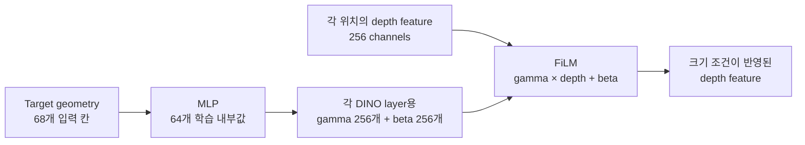

FiLM의 마지막 linear layer는 처음에 `γ=1, β=0`이 되도록 초기화함. 따라서 학습 시작 시에는 `F'=F`인 항등변환이고, 처음부터 depth feature를 임의로 망가뜨리지 않음. 이후 최종 occlusion-map loss의 gradient가 ResNet-18, FiLM MLP, MatchingBlocks에 함께 전달되면서 어떤 target geometry에서 어떤 channel을 얼마나 바꿀지 하나의 모델 안에서 학습함. FiLM은 학습할 때만 쓰는 장치가 아니므로 추론 때도 항상 같은 계산을 수행함.

**왜 Global FiLM만으로는 부족할 수 있는가?** `γ,β`는 target마다 달라지지만 Global FiLM에서는 모든 위치 `(u,v)`에 동일하게 적용됨. 위치마다 원래 depth feature `F(u,v)`가 다르므로 결과 map의 공간 정보가 사라지는 것은 아니지만, target 보정이 drawer 전체에 퍼져 target이 물체 더미에 의해 가려질 후보가 아닌 위치도 함께 밝아질 수 있음.

최신 oracle 후보는 이를 줄이기 위해 위치별 gate `G(u,v)`를 추가한 bounded residual 형태를 사용함. 먼저 geometry를 다음처럼 나눔.

```text
g_F = zeros(68); g_F[0:5] = g[0:5]  # 화면상 area·bbox 크기 + 실제 짧은/긴 수평 길이
g_H = zeros(68); g_H[5]   = g[5]    # 실제 높이만 남기고 나머지는 0
```

같은 FiLM MLP에 footprint-only, height-only, zero geometry를 각각 넣어 세 parameter 묶음을 만들고, 공통 bias가 두 번 더해지지 않도록 zero 결과를 한 번 뺌.

$$
(\gamma_F,\beta_F)=\mathrm{FiLM}(g_F),\qquad
(\gamma_H,\beta_H)=\mathrm{FiLM}(g_H),\qquad
(\gamma_0,\beta_0)=\mathrm{FiLM}(\mathbf 0)
$$

$$
\gamma_C=\gamma_F+\gamma_H-\gamma_0,qquad
\beta_C=\beta_F+\beta_H-\beta_0
$$

각 위치의 depth vector는 channel 방향만 비교할 수 있도록 정규화함.

$$
\widetilde F(u,v)=\tanh\!\left(\mathrm{LayerNorm}_{\mathrm{channel}}(F(u,v))\right),
\qquad
\widehat d(u,v)=\frac{\widetilde F(u,v)}{\lVert\widetilde F(u,v)\rVert_2}
$$

Footprint geometry가 만든 query와 local depth 방향의 alignment로 gate를 계산함. `C=256`은 depth channel 수임.

$$
q_F=\tanh(\gamma_F-1)+\tanh(\beta_F)
$$

$$
G(u,v)=\frac{1}{2}\left[
1+\mathrm{clamp}\!\left(
\frac{\widehat d(u,v)\cdot q_F}{\sqrt{\lVert q_F\rVert_2^2+C}},-1,1
\right)
\right]
$$

일반 cosine과 비슷하지만 `q_F`를 단순 L2 정규화하지 않고 분모에 `C`를 더해, query 크기가 작을 때 우연한 방향 일치가 과도한 gate가 되지 않도록 제한한 **regularized alignment**임. 최종 보정은 아래와 같음.

$$
F_{\mathrm{local}}(u,v)
=F(u,v)+0.25\,G(u,v)
\left[
\tanh(\gamma_C-1)\odot F(u,v)
+\tanh(\beta_C)\odot\widetilde{F}(u,v)
\right]
$$

- `G(u,v)∈[0,1]`은 해당 위치의 local depth pattern과 target footprint 조건이 얼마나 맞는지 나타냄.
- `G≈0`이면 FiLM 보정을 거의 적용하지 않고, `G≈1`이면 그 위치에서만 target 조건을 강하게 반영함.
- `tanh`와 계수 `0.25`는 한 번의 보정이 기존 depth feature를 지나치게 바꾸지 않도록 범위를 제한함.
- Gate `G`는 `q_F`, 즉 footprint parameter만 사용하고, height parameter는 최종 `γ_C,β_C`에만 들어감. 따라서 target height만으로 새로운 위치의 gate를 열 수 없고, footprint와 맞는 위치 안에서 보정 강도만 바꿀 수 있음.

배포 가능한 size-only 경로의 `g[0:3]`은 target mask만 있으면 계산되지만, 최신 oracle 후보의 `g[3:6]`은 USD의 exact 3D extent를 사용함. 두 경우 모두 zero-shot 가설은 물체 ID별 `γ,β`를 표처럼 저장하는 것이 아니라, 하나의 MLP가 **새 target의 연속적인 크기·형태값 `g_new`를 `γ_new,β_new`로 변환하는 함수**를 학습한다는 데 있음. 따라서 학습하지 않은 target도 같은 입력 규격으로 계산할 수 있음. 다만 이것만으로 일반화가 보장되지는 않으며, 학습 target과 분리한 target-heldout 평가가 필요함. 특히 RGB/mask만 사용하는 실제 배포 zero-shot은 exact extent를 추정값으로 교체한 뒤 별도로 검증해야 함.

Target appearance를 MatchingBlock에 전달하는 방법도 통제 실험으로 비교함.

| 변경 | 왜 시도했는가 | 확인된 결과 | 현재 판단 |
|---|---|---|---|
| Raw target broadcast 제거 | 모델이 target vector 자체를 calibration shortcut처럼 외우는지 확인 | Held-out coverage MAE와 크기 반응이 크게 악화 | Target 정보를 너무 많이 제거하므로 현재 구조에는 사용하지 않음 |
| Channel-wise scene–target relation | Absolute target code 대신 위치별 관계만 전달하려는 목적 | No-broadcast보다 크기 반응은 회복했지만 coverage 오차 증가 | Raw baseline을 대체할 정도로 안정적이지 않아 후속 seed를 진행하지 않음 |
| Exact 3D extent + global FiLM | 2D mask에 없는 실제 바닥 크기와 높이 정보가 필요한지 확인 | 가능한 영역은 개선됐지만 모든 위치에 같은 보정이 퍼짐 | 3D 크기 정보는 유효하지만 공간 제어 방식의 수정이 필요함 |
| Local gate + strict supervision | 위치마다 크기 보정을 열고 닫아 불가능한 영역의 활성화를 줄이려는 목적 | Oracle coverage 기준 gate 차이가 `0.005–0.014 → 0.580–0.695`로 증가 | 평균 leakage는 줄었지만 book scale 기준을 충족하지 못해 아직 연구 후보로만 유지 |
| Train-only scale-paired loss | 같은 scene에서 target 크기가 달라질 때 map의 변화량까지 직접 학습 | BN 통계를 고정하면 5-camera의 두 scale 구간에서 반응이 개선됐지만, scale과 무관하게 함께 밝아지는 오차가 남음 | 변화량만 비교하면 공통 오차가 상쇄되므로 별도 anchor가 필요함 |
| Strict common-mode anchor | 세 scale 어디에서도 target이 덮지 않는 서랍 내부의 공통 출력을 0에 가깝게 감독 | Scale 경계를 건드리지 않으면서 noncoverage leakage를 크게 줄임 | Paired loss와 함께 사용하되 작은 learning rate로 기존 공간 map을 보존함 |
| Low-LR common + paired | Phase 26에서 BN running statistics를 고정하고 한 epoch만 `1e-4`로 이어 학습 | Train-only 기준과 4-target·5-camera development 기준을 통과 | Exact extent oracle 상한선으로 동결하고 RGB/mask 기반 extent 교체를 준비함 |

Fresh broadcast-on 재학습은 과거 baseline의 학습 trajectory와 최종 model tensor를 정확히 재현함. 동일 seed·초기화·sample order를 사용한 controlled seed-0 비교 안에서는 위 차이를 code/data drift보다 target-conditioning 방식의 차이로 해석할 수 있음. 최신 oracle 후보는 고정 기준을 통과했지만 exact mesh extent가 필요하므로, 현재 공개 baseline은 deployable RGB/mask 입력만 사용하는 raw broadcast 구조를 유지함.

DINOv3는 frozen으로 유지하고 depth encoder, FiLM generator, MatchingBlocks와 output head는 하나의 loss로 함께 학습함. Training-heldout 4개 target은 이미 모델 선택과 진단에 반복 사용했으므로 최종 zero-shot test가 아니라 development benchmark로 구분함.


`S`는 target scale이 바뀔 때 예측 map도 GT가 요구하는 방향으로 반응하는지를 나타내며, 양수이면 최소한 변화 방향이 맞다는 뜻임. `size-only`는 3-seed 개발 평가에서 training-heldout MAE를 `0.11082 → 0.08535`, pooled `S`를 `0.1477 → 0.2224`로 개선함. Positive camera cell은 `target × scale transition × camera × seed` 조합 중 `S > 0`인 경우임. 다만 `packaged_food_4`의 underprediction과 seed별 편차가 남아 있어 최종 구조로 확정하지 않음.

후속 실험에서는 같은 scene의 scale별 **변화량**을 직접 맞히는 paired loss와, 세 scale 모두에서 target footprint가 없는 서랍 내부의 공통 출력을 억제하는 anchor를 분리함. BatchNorm running statistics를 고정하고 Phase 26에서 한 epoch만 이어 학습한 결과, learning rate `1e-3`은 coverage map을 지나치게 바꿨지만 `1e-4`는 기존 공간 map을 보존하면서 scale 반응과 leakage를 함께 개선함.

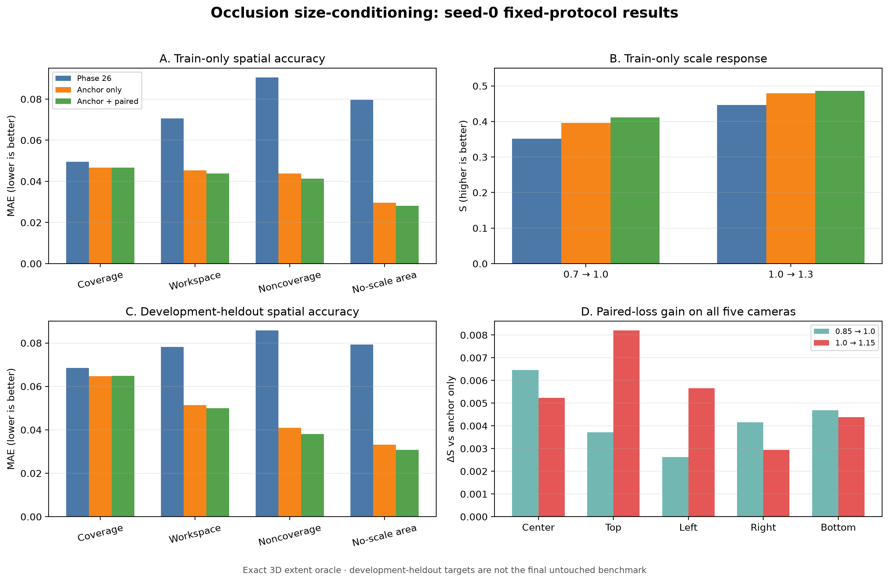

위 그림에서 MAE는 낮을수록 공간 확률이 GT에 가깝고, `S`는 높을수록 target 크기가 바뀔 때 예측 map도 GT와 비슷하게 변한다는 뜻임. 최종 seed-0 후보는 Phase 26보다 train-only coverage MAE를 `5.74%`, workspace MAE를 `37.78%`, all-scale noncoverage MAE를 `64.75%` 낮추고 두 scale 구간의 `S`를 모두 높임. 학습하지 않은 development target에서도 5개 camera × 2개 scale 구간의 `10/10` 조건과 target × camera × 구간의 `40/40` 조건에서 scale response가 anchor-only보다 높았음.

다만 paired loss의 추가 이득은 작고 trade-off가 있음. Anchor-only 대비 최종 후보의 workspace·noncoverage MAE는 각각 `2.90%`, `6.81%` 낮고 `S`는 `+0.0044`, `+0.0053` 높았지만, 전체 coverage MAE는 `0.24%` 증가함. 세부 target–camera–scale 60개 coverage 조건 중 36개도 `0–1.62%` 범위에서 증가함. 사전에 정한 전체 허용선 `2%` 안에는 들었지만, 모든 위치가 일괄 개선됐다는 뜻은 아님.

#### 실제 scene과 예측 map으로 확인한 변화

막대그래프는 960개 map의 평균을 보여주지만, 어떤 위치의 오류가 줄었는지는 보여주지 못함. 아래 사례는 모델 출력을 보고 잘 나온 frame을 고른 것이 아님. 학습에 사용하지 않은 4개 development target과 16개 scene의 `64개 target–scene` 조합을 GT만으로 정렬하고, scale `1.0`의 coverage 내부 평균 확률이 정확히 중간에 가까운 조합을 선택함. 그 결과 `book_4 / scene00009_env0171`이 선택됨.

그림은 각 camera마다 `실제 scene → 실제 target 입력 → GT → Phase 26 → common anchor → common + paired` 순서로 읽으면 됨.

- Heatmap이 밝을수록 해당 위치에서 target이 물체 더미에 의해 가려질 확률을 높게 예측한 것임.
- Target RGB의 노란 선은 target mask임. DINOv3 appearance branch는 선 안쪽만 자르지 않고 전체 RGB frame을 보며, mask는 화면에서 차지하는 크기와 형태를 계산하는 geometry branch에 사용함.
- 모든 GT와 예측은 동일한 `0–1` 범위를 사용함. 그림마다 대비를 다시 늘리는 min–max 정규화는 사용하지 않음.
- 빨간 선은 모델이 확률을 출력할 수 있는 drawer workspace, 청록색 선은 scale `1.0` target의 coverage, 주황색 선은 세 scale의 coverage 합집합임.
- 빨간 workspace 안이면서 주황색 선 밖인 곳은 세 scale 모두 target footprint가 닿지 않는 영역임. 이곳의 GT는 `0`이므로 밝게 예측할수록 잘못된 탐색 prior가 됨.
- 각 예측 아래 `coverage MAE`와 `outside-candidate MAE`는 낮을수록 GT에 가까움.

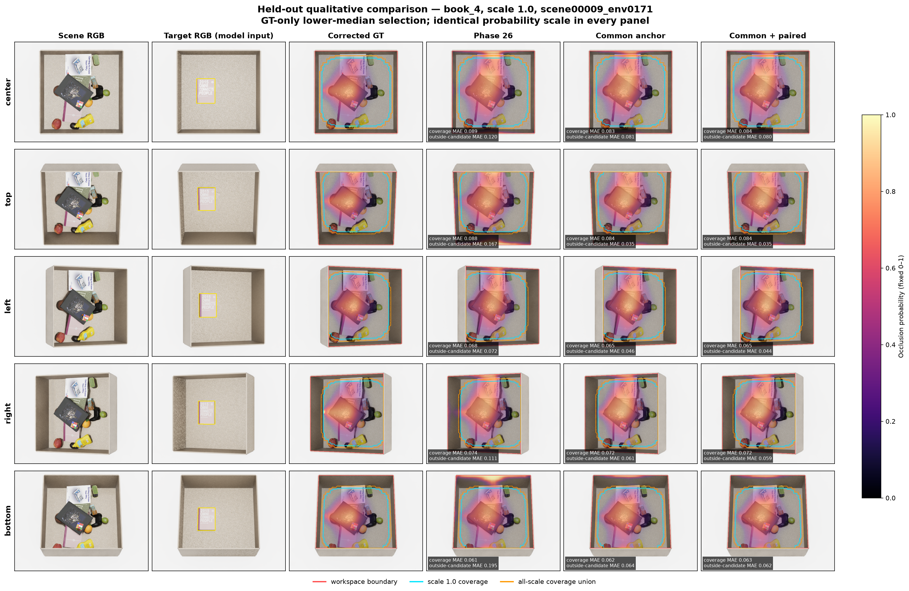

Phase 26은 특히 top과 bottom camera에서 주황색 선 밖까지 밝기가 넓게 남음. 이 영역은 GT가 모두 `0`이므로 `outside-candidate MAE=0.167`은 잘못 예측한 확률이 위치당 평균 `16.7%`라는 뜻임. Common anchor 이후 top은 `16.7% → 3.5%`, bottom은 `19.5% → 6.4%`로 감소하고, 최종 common + paired 모델은 각각 `3.5%`, `6.2%`를 보임. 즉 표의 noncoverage 개선은 단순한 숫자 변화가 아니라, **target이 가려질 후보가 아닌 위치를 먼저 탐색하게 만드는 잘못된 밝기가 줄었다는 뜻**임. 반면 bottom coverage MAE는 Phase 26의 `0.061`에서 최종 `0.063`으로 소폭 증가하여, 앞서 기록한 작은 coverage trade-off도 실제 map에서 확인됨.

아래 그림은 같은 target·scene·center camera에서 target scale만 `0.85 / 1.0 / 1.15`로 바꾼 결과임. 행이 바뀔 때 청록색 coverage와 GT가 달라지므로, 모델도 단순히 전체 map을 함께 밝히는 것이 아니라 target 크기에 맞춰 공간 분포를 바꿔야 함.

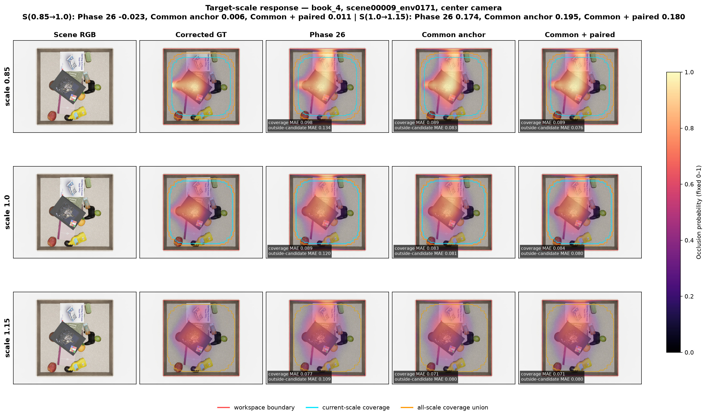

그림 상단의 `S`는 scale을 바꿨을 때 생긴 **예측 map의 변화량**이 GT 변화량과 얼마나 같은지를 나타냄. 높을수록 좋고 `1`이면 변화량을 완전히 재현한 것임. 이 GT-only 대표 scene에서는 final이 anchor-only보다 `0.85→1.0` 구간은 높지만 `1.0→1.15` 구간은 낮음. 따라서 한 장의 그림을 모든 frame의 성공 증거로 사용하지 않으며, 전체 판단은 위의 5-camera 집계와 함께 수행함. 이 비교의 목적은 common anchor가 제거한 오류와 scale-paired loss가 학습하려는 변화를 실제 scene 좌표에서 이해하기 쉽게 보여주는 것임.

### Deployment Inputs

현재 release prototype 추론 입력은 scene RGB, scene depth, target RGB와 target mask 또는 segmentation임. 지금 검증된 고정-rig protocol은 다섯 scene camera 각각에 같은 방향의 target RGB/mask view를 대응시키므로 target별 5-view reference set을 사용함. Target 한 장만으로 다섯 camera에 적용하는 조건은 아직 검증하지 않음. Empty-background reference를 이용한 자동 target mask 생성도 아직 구현되지 않은 deployment 전처리 과제임. 최신 oracle 후보는 여기에 USD mesh에서 얻은 exact 3D extent 세 값을 추가로 사용하므로, 그대로는 RGB-only 배포 모델이 아님.

| 구분 | 필요 정보 |
|---|---|
| 현재 검증된 매-view 입력 | Scene RGB, scene depth, 해당 scene camera에 대응하는 target RGB와 target mask/segmentation |
| Target reference 자산 | 고정 rig의 center/top/left/right/bottom 5-view RGB·mask set |
| 고정 시스템 자산 | Camera calibration, camera별 workspace mask |
| Release GT 생성에만 사용 | Target USD/OBJ, mesh scale, occlusion GT |
| Exact-extent oracle에서만 추가 | USD mesh에서 얻은 3D extent 세 값 |

현재 target reference는 물체마다 촬영 위치가 일정하지 않고, `target_capture.py`도 camera calibration을 target 결과와 함께 저장하지 않음. 따라서 다음 Step에서는 동일 위치·거리의 5-view target 촬영과 calibration 저장을 먼저 고정하고, RGB/mask silhouette로 `[짧은 가로 길이, 긴 가로 길이, 높이]`를 추정함. 같은 checkpoint에서 `mesh oracle / RGB-mask 추정값 / extent 없음` 세 조건을 비교하여, USD 없이도 oracle 개선이 유지되는지 확인함.

Zero-shot 성능은 frozen encoder만으로 가정하지 않음. 최종 평가는 개발 중 사용하지 않은 새 target instance와 scale을 별도로 고정하여 수행해야 함. Camera pose가 바뀌면 workspace mask도 calibration에서 다시 생성해야 하므로 camera-free 일반화는 후속 과제임.

---

## Complexity Stream

> **Status: Formulation in progress**

Complexity stream은 object density, overlap, depth irregularity를 표현하는 target-independent scene prior.

| Cue | 의미 |
|---|---|
| Local object density | 단위 면적에 포함된 instance 수 |
| Local depth variance | 물체의 높이와 적층 변화 |
| Depth discontinuity | 물체 경계와 급격한 깊이 변화 |
| Overlap structure | 물체 간 가림과 적층 정도 |

```text
Y_C = lambda_n · ObjectDensity
    + lambda_d · LocalDepthVariance
    + lambda_e · DepthEdgeDensity
```

Fusion gate에서 Similarity·Occlusion evidence와 함께 Complexity의 상대적 중요도 조절.

---

## Project Status

| Component | Status |
|---|---|
| Drawer RGB-D and target-reference dataset | Complete |
| DINOv3 ViT-B/16 dense similarity baseline | Complete |
| DINOv3 + SigLIP Similarity stream | Implementation complete; qualitative unseen result confirmed, quantitative benchmark pending |
| Unseen banana qualitative test | Complete |
| Cosine shortcut ablation | Evaluated and excluded |
| Object/category-held-out benchmark | Planned |
| Occlusion mesh extraction and camera projection | Validated |
| Full-resolution mesh-depth pilot | CPU `180` + GPU/simplified `225` cases evaluated |
| nvdiffrast GPU depth rasterizer | Validated |
| `toy_3` 10k mesh simplification | Geometry/decision pilot validated; new-asset approval remains separate |
| Corrected 70% occlusion decision | Validated on standard and drawer-edge poses |
| Legacy visible-target reference recovery | `15,000` cases, `100%` decision agreement |
| Mesh-based Legacy GT reproduction | `100` cases, worst correlation `0.9999919` |
| Reproducible clutter capture | Implemented and validated |
| V1/V2 vectorized GT regression | `1,024` effective poses, output equivalence checked |
| Probability-map GT accumulator | Pose/camera/scene-vectorized V2 implemented and validated |
| 14-target production Occlusion GT | Complete: `150 scenes × 5 cameras` per target |
| Occlusion model ablation | Complete: target-agnostic / appearance-only / geometry-only / full, 3 seeds |
| Clean52 multi-scale GT | Complete: train 10 / development-heldout 4 targets, 5 cameras |
| 3D workspace and physical-corrected GT | Complete for `book_1/2/3 × 1.3`; original GT preserved |
| Size-only conditioning | 3-seed development benchmark complete; current release baseline |
| Five-camera development evaluation | `target × scale transition × camera × seed` 120개 중 119개가 기대한 크기 변화 방향을 보임 |
| Controlled target-conditioning studies | Broadcast 제거·relation interaction·global/local extent 경로를 동일 seed-0 조건에서 비교; 자세한 원인과 결과는 Development Log에 기록 |
| Strict local-gate research candidate | Oracle coverage 기준 영역 분리는 크게 개선했으나 book scale 기준을 충족하지 못해 release에는 미반영 |
| Train-only scale-paired objective | 동일 scene의 `0.7/1.0/1.3` map 변화량을 학습; BN-frozen one-epoch 비교에서 10/10 camera-transition 개선 확인 |
| Strict common-mode anchor | 세 scale 모두 coverage가 없는 workspace를 직접 감독; scale 경계를 제외한 leakage 제어 구현·검증 |
| Low-LR oracle candidate | Phase 26에서 `1e-4`, 338 update로 이어 학습; train-only 공간 정확도·scale-response 기준 통과 |
| Five-camera development-heldout oracle check | 학습에 사용하지 않은 4개 development instances × 3 scales × 16 scenes × 5 cameras의 960 samples/model 평가; anchor-only 대비 camera-transition `10/10`, target-camera-transition `40/40` 개선 |
| BatchNorm diagnostic | BN 재계산과 BN-frozen 비교로 stored-statistics 영향과 paired objective 영향을 분리 |
| Deployable 3D extent estimation | Pending; 현재 oracle candidate는 target mask 크기와 USD mesh extent를 함께 사용 |
| Final zero-shot benchmark | Pending with untouched target instances/scales |
| Camera-pose generalization | Pending; current workspace mask is tied to the fixed 5-camera rig |
| Occlusion stream training | Refinement in progress |
| Complexity stream training | Planned |
| Three-stream fusion | Planned |
| Exploration policy integration | Planned |
| Sim-to-real drawer experiment | Planned |

### Core Files

| File | Purpose |
|---|---|
| `backbone.py` | Frozen DINOv3 multi-layer feature extractor |
| `target_utils.py` | Target crop, mask alignment, masked feature pooling |
| `similarity_model.py` | Scene–target interaction, MatchingBlocks, similarity head |
| `train_similarity_v2.py` | Multi-target DINOv3 + SigLIP training pipeline |
| `train_common.py` | Scene split, target caches, metrics, early stopping |
| `gt_similarity.py` | Category-based similarity-map generation |
| `precompute_gt.py` | Precomputed similarity GT cache |
| `paths_config.py` | Model, asset, dataset path configuration |
| `target_capture.py` | Five-camera target RGB/depth/segmentation capture for zero-shot inference |
| `occlusion_model.py` | RGB-D target conditioning, geometry-FiLM and Occlusion map head |
| `occlusion_dataset.py` | Corrected probability GT and coverage-aware RGB-D dataset |
| `train_occlusion.py` | Occlusion ablation, scene split, checkpoint and camera/target evaluation |
| `generate_occlusion_gt_batched_v2.py` | Pose/scene-vectorized production probability GT generator |
| `mesh_utils.py` | USD mesh extraction, world-unit conversion, pose and scale transform |
| `mesh_cache.py` | Asset complexity check and automatic 10k simplified-mesh cache |
| `depth_rasterizer.py` | Full-resolution mesh-depth accuracy reference |
| `depth_rasterizer_gpu.py` | nvdiffrast-based full-resolution GPU depth renderer |
| `experiments/occlusion_gt_pilot/target_catalog_manifest.py` | Pre-registered train/held-out target catalog |
| `experiments/occlusion_gt_pilot/verify_new_target_mesh_accuracy.py` | Single-pose five-camera mesh/depth Gate-1 verification |
| `scene_generator/occlusion_gt_pilot_capture.py` | Isaac Sim reference capture for occlusion GT validation |
| `scene_generator/vectorized_scene_v2.py` | Physics-based clutter generation and reproducible RGB-D capture |
| `scene_generator/object_spawner.py` | USD asset discovery and object placement used by the scene generator |

---

## Roadmap

- [x] Drawer scene and target RGB-D acquisition
- [x] Multi-layer DINOv3 ViT-B/16 representation
- [x] SigLIP image/text semantic fusion
- [x] Pixel-wise Similarity map training
- [x] Unseen target qualitative evaluation
- [x] Cosine shortcut evaluation and removal
- [x] Reproducible scene-level split seed
- [x] USD mesh extraction and unit conversion validation
- [x] `640 × 480` mesh-depth validation across 180 conditions
- [x] Empty-drawer mesh-depth valid-pixel integration
- [x] nvdiffrast hardware GPU rasterizer validation
- [x] `toy_3` 10k simplification pilot
- [x] Legacy/corrected denominator comparison
- [x] Camera-specific integer visibility reference recovery
- [x] `packaged_food_2` multi-scene Legacy GT reproduction
- [x] Reproducible render-only clutter capture and metadata
- [x] V1/V2 vectorized GT regression on 1,024 effective poses
- [x] Automatic 10k simplification cache for high-complexity assets
- [ ] Original–simplified approval protocol for each new asset
- [x] Pose/camera batched probability accumulator pilot
- [x] Full-grid Legacy and probability GT pilot (`44,100` poses × 5 cameras)
- [x] Multi-target and multi-scene production GT generation
- [x] 14-target shared-scene GT (`150` scenes × `5` cameras)
- [x] Five-camera single-pose mesh/depth Gate-1 validation
- [x] Scale `1.0` Occlusion Dataset and 4-model ablation baseline
- [x] Train 10 / held-out 4 target catalog fixed before evaluation
- [x] Clean52 multi-scale development GT (`36` train / `16` validation scenes)
- [x] Workspace-mask v4 and physical-corrected `book_1/2/3 × 1.3` GT
- [x] Training-heldout instance seed-0 smoke test and wrong-target diagnostics
- [x] Five-camera development diagnostics
- [x] Three-seed analytic-full vs size-only development benchmark
- [x] Multi-scale development evaluation
- [x] Reproduce the release baseline under matched seed, initialization, sample order and update count
- [x] Compare broadcast, relation, global extent and local extent conditioning under controlled seed-0 settings
- [x] Supervise the local gate with oracle coverage — localization improved; book scale criterion remains unmet
- [x] Separate horizontal footprint and height conditioning in one controlled seed-0 run
- [x] Add and evaluate a train-only scale-paired objective without changing the model architecture
- [x] Separate stored BatchNorm-statistics effects with 180 train-only depth frames
- [x] Phase 26 checkpoint에서 BatchNorm 통계를 고정한 1-epoch paired comparison
- [x] Scale 경계를 제외한 strict common-mode anchor 추가 및 train-only gate 확인
- [x] Low-LR common-anchor + paired candidate의 5-camera development-heldout oracle 평가
- [ ] 다음 Step: 동일 pose·거리의 5-view target capture와 camera calibration 저장 protocol 고정
- [ ] RGB/mask 기반 3D extent를 추정하고 `mesh oracle / 추정 extent / extent 없음` 비교
- [ ] Confirm an accepted conditioning method with seeds 1–2
- [ ] Final evaluation on untouched target instances and scales
- [ ] Camera-pose augmentation and calibration-derived workspace masks
- [ ] Complexity stream
- [ ] Learned three-stream fusion
- [ ] DRL-based exploration policy
- [ ] Sim-to-real validation

---

## Development Log

Similarity와 Occlusion stream이 현재 구조에 도달한 이유를 시간순으로 기록함. 각 Phase는 단순 모델 목록이 아니라 **왜 문제가 되었는지 → 무엇만 바꿨는지 → 결과가 무엇을 뜻하는지 → 다음 Step은 무엇인지**를 설명함.

### 전체 연구 흐름

| 단계 | 처음 문제 | 선택한 방향과 이유 | 현재까지의 결론 |
|---|---|---|---|
| Similarity의 zero-shot 확장 | DINOv3만으로는 외형이 비슷한 물체는 찾지만 category 의미가 부족했음 | Language와 정렬된 SigLIP 의미를 DINOv3의 위치 feature에 결합 | Unseen packaged-food 사례에서 category activation을 관찰했으며, 정량 unseen benchmark는 남아 있음 |
| Occlusion GT 재설계 | Target마다 수십만 장을 촬영하고 scene별 min–max를 쓰면 시간·용량이 크고 scene 간 값의 의미가 달라짐 | USD/OBJ mesh를 GPU로 렌더링하고 `가려진 pose / 전체 유효 pose` 확률을 계산 | 기존 GT를 거의 동일하게 재현하면서 비교 가능한 probability GT를 생성함 |
| 공정한 학습 조건 확립 | Target마다 다른 scene을 쓰면 모델이 target 대신 scene 분포를 외울 수 있음 | 모든 target이 같은 scene을 공유하고 target·scale·camera·update 수를 고정 | 이후 모델 차이를 target conditioning 차이로 비교할 수 있게 됨 |
| Target 크기 조건 추가 | 같은 물체 더미에서도 target 크기에 따라 완전히 가려질 수 있는 영역이 달라짐 | Target mask의 크기로 depth feature를 조절하는 FiLM을 사용 | Size-only가 강한 baseline이 되었지만 2D 크기만으로 남는 target 차이가 있음 |
| 3D 크기의 공간적 사용 | Exact 3D 크기는 유용했지만 모든 위치에 같은 보정을 주면 가려질 후보가 없는 곳도 밝아짐 | Global FiLM → local gate → 포화 방지 → strict gate supervision → footprint/height 역할 분리 순으로 한 요소씩 수정 | Gate 위치 분리는 확인했고 평균 leakage도 감소했지만, book에서는 열린 영역 안의 보정 방향·크기가 아직 부정확함 |
| Scale 반응과 leakage 분리 | Scale 차이만 학습하면 모든 scale에 공통으로 남는 잘못된 출력은 보이지 않음 | Paired loss는 변화량, strict common anchor는 어떤 scale도 덮지 않는 영역을 담당하도록 분리 | Low-LR seed-0가 train-only와 5-camera development oracle 기준을 통과했으며, 다음은 exact extent를 RGB/mask 추정값으로 교체하는 단계임 |

### 지표와 범위 읽는 법

- `MAE`: 예측 map과 GT의 평균 절대 오차로, 낮을수록 좋음.
- `Coverage`: 해당 target의 유효 pose가 실제로 덮을 수 있는 영역.
- `Workspace`: 현재 camera에서 보이는 서랍 내부 영역.
- `Impossible-workspace` 또는 `noncoverage`: 서랍 안이지만 해당 target이 물체 더미에 의해 가려질 후보가 없어 GT가 0인 영역. 이곳이 밝아지는 현상을 `leakage`라고 부름.
- `S`: target scale 변화에 예측이 GT가 요구하는 방향으로 반응하는 정도. `S > 0`은 방향이 맞다는 최소 조건임.
- `Training-heldout` 4개 target은 구조 선택에 반복 사용한 development set이며 최종 zero-shot test가 아님.
- Exact 3D extent와 coverage label은 simulation에서 얻은 oracle임. Oracle 실험은 정보와 구조의 가능성을 확인하는 단계이며, target RGB만 사용하는 실제 배포 성능을 뜻하지 않음.
- 사전 평가 기준을 만족하지 못했다는 기록은 해당 가설이 불가능하다는 뜻이 아니라, **그 구성으로 후속 seed를 확대하지 않고 원인을 먼저 분리했다는 뜻**임.

### 2026-07-21 · Phase 1 — DINOv3 Appearance Matching

**Reference:** `code_260721/train_similarity.py`

**가설:** Frozen DINOv3 feature 비교만으로 unseen target의 zero-shot similarity map 생성 가능.

```text
Scene RGB  → DINOv3 patch features X_s^l
Target RGB → DINOv3 masked-pooled vector a_t^l

c_hat^l = ShiftTo01(CosineSimilarity(X_s^l, a_t^l))
Z^l     = Concat[X_s^l, a_t^l, c_hat^l]
P_S     = CNN_Head(Z^l)
```

**결과:** 색상·재질·형상 등 appearance가 유사한 영역은 탐지했으나, category-level semantic relation은 표현하지 못함.

**의미와 다음 Step:** 해당 구성에서는 dense appearance matching만으로 target–category–scene의 의미 관계를 충분히 표현하지 못했음. 다음 Step에서는 DINOv3의 image-level CLS가 category 정보를 보완할 수 있는지 확인함.

---

### 2026-07-27 · Phase 2 — CLS Prototype Category Conditioning

**Reference:** `code_260727/train_similarity.py`, `code_260727/train_common.py`

**가설:** Image-level CLS token을 category prototype으로 사용하면 patch feature보다 추상적인 category 정보 제공 가능.

Category별 CLS vector 평균으로 네 개의 prototype을 구성하고 unseen target CLS와 cosine similarity 계산.

```text
prototype_k = L2Norm(Mean[CLS(target_i) | category_i = k])

category_prob = Softmax(
    CosineSimilarity(CLS(unseen_target), prototype_k) / temperature
)
```

정답 누설 방지를 위해 leave-one-out prototype 사용. Category 확률을 spatial location에 broadcast한 뒤 interaction feature에 concat.

```text
Z^l = Concat[
    scene patch,
    target appearance,
    patch-wise cosine,
    category probability
]
```

**결과:** Category prior는 제공했으나 prototype도 DINOv3 appearance history의 평균이므로 외부 semantic grounding이 없음. 기존 prototype과 외형 차이가 큰 unseen object에서 category 추론 불안정.

**의미와 다음 Step:** 해당 네 category prototype은 학습 물체의 DINOv3 외형 이력을 요약한 값이므로, 외형이 달라지는 unseen target까지 안정적으로 설명하지 못했음. 외부 language semantics와 정렬된 VLM을 추가하는 방향으로 이동함.

---

### 2026-07-28 · Phase 3 — DINOv3 + SigLIP Semantic Fusion

**Reference:** `code_260728_ver2/train_similarity_v2.py`

**수정:** DINOv3의 dense spatial representation을 유지하고, SigLIP의 language-aligned semantics를 target query에 추가.

```text
DINO appearance : a_t^l ∈ R^768
SigLIP semantics: s ∈ R^1152
Projection      : s_t^l = W_l · s + b_l
Target query    : q_t^l = a_t^l + s_t^l
```

SigLIP image/text embedding을 평균하고 layer별 projection으로 DINOv3 차원에 정렬. 두 backbone은 frozen으로 유지하고 projection과 matching head만 학습.

**결과:** 학습에 포함되지 않은 packaged-food target에서 same-category 영역 활성화 확인.


**의미와 범위:** 학습에 없던 packaged-food target의 정성 사례에서 같은 category 영역이 활성화되는 것을 관찰함. 이는 SigLIP 의미 정보의 가능성을 보여주는 사례이며, 여러 unseen instance에 대한 정량 zero-shot 성능은 최종 benchmark에서 별도로 확인해야 함.

---

### 2026-07-28–29 · Phase 4 — Exact-Instance Shortcut Evaluation

**문제:** SigLIP 결합 후 unseen packaged-food 사례에서 category-level activation을 관찰했으나, visible exact target이 same-category object보다 높게 출력되지 않는 사례도 확인함.

**실험:** DINOv3 cosine을 output logit에 직접 더하는 residual shortcut과 layer `2 + 5` 선택 방식을 평가. Global pooling, raw appearance cosine, visibility, patch matching도 함께 분석.

**결과:** 공통 held-out scene에서 no-shortcut과 shortcut의 exact-target positive ranking은 각각 `29.0%`, `29.7%`로 거의 동일. Median gap은 소폭 개선됐지만 두 모델 모두 instance-level ranking을 충분히 달성하지 못함. 공간 구조를 사용하지 않는 patch matching도 competitor score를 함께 높여 문제를 해결하지 못함.

**결론:** Shortcut은 계산 비용보다 구조와 해석의 복잡성을 늘리는 반면 실질적인 개선이 제한적이므로 최종 Similarity stream에서 제거. 현재 모델은 DINOv3–SigLIP interaction과 learned matching head만 사용함.

추가로 target별로 서로 다른 무작위 split seed가 생성되던 문제를 수정. 실행마다 seed를 한 번만 확정하여 모든 target의 scene-level train/validation split을 재현할 수 있도록 정리.

---

### 2026-08-04 · Phase 5 — Zero-Shot Occlusion Pipeline Design

**문제:** 기존 방식은 target당 `44,100`개 pose와 5개 camera를 촬영하여 중간 RGB·depth·mask를 대량 저장함. 최종 GT도 유효 pose의 depth-weighted occupancy를 scene별 min–max로 정규화하므로 서로 다른 scene에서 흰색의 절대적 의미가 일정하지 않음.

**GT 설계:** Target을 물리적으로 반복 촬영하는 과정을 USD/OBJ mesh depth 계산으로 대체. 기존 pose grid와 `70%` occlusion 판정은 legacy 재현에 유지하고, 실제 학습용 GT는 다음 확률로 별도 생성함.

```text
P_O(u,v) = N_occluded(u,v) / (N_candidate(u,v) + epsilon)
```

Legacy GT와 probability GT를 동시에 출력하여 기존 방식 재현 여부와 새 정규화 효과를 분리해 평가. Visible-target 강조는 Similarity stream과 역할이 겹치므로 Occlusion GT에서 제외함.

**Scale conditioning:** Mesh scale과 target RGB·mask scale을 반드시 동일하게 구성. 동일한 target 입력에 서로 다른 scale GT를 주면 모델이 scale별 정답의 평균으로 수렴하므로 size-effect를 학습할 수 없음. Pilot은 `0.7`, `1.0`, `1.3`으로 시작함.

**모델 설계:** Scene RGB는 frozen DINOv3, scene depth와 valid mask는 ResNet-18로 처리. Target mask에서 추출한 size·silhouette condition으로 depth feature에만 FiLM을 적용하고, target appearance는 MatchingBlock에서 별도로 결합함. 검증되지 않은 cosine shortcut은 baseline에서 제외함.

**배포 조건:** 현재 prototype은 scene RGB, scene depth, target RGB와 target mask/segmentation을 입력으로 사용함. 고정 촬영 환경의 empty-background reference로 mask를 자동 생성하는 전처리는 후속 구현 항목이며, USD/OBJ와 scale 정보는 GT 생성에만 사용함.

**Zero-shot 검증:** Frozen encoder 사용만으로 zero-shot을 가정하지 않고, 학습에서 제외한 target instance와 unseen intermediate scale을 별도 test split으로 평가함.

**다음 Step:** `packaged_food_2`, center camera, scale `1.0`의 mesh-depth 재현 pilot을 수행한 뒤 multi-asset·pose·camera 조건으로 확장함.

---

### 2026-08-04–06 · Phase 6 — Mesh-Depth Validation and GT Refinement

**Reference:** `mesh_utils.py`, `depth_rasterizer.py`, `scene_generator/occlusion_gt_pilot_capture.py`, `experiments/occlusion_gt_pilot/validate_rasterizer.py`

**검증:** `packaged_food_2`, `book_1`, `fruit_1`, `toy_3`을 대상으로 9개 pose와 5개 camera를 조합한 180개 조건에서 USD mesh depth와 Isaac Sim reference를 `640 × 480`으로 비교함.

**수정:** Segmentation reference를 `depth > 0`으로 계산하면 drawer와 background가 포함되는 오류를 확인하고 target segmentation color 기반 mask로 교체. `metersPerUnit=0.01` asset의 자동 unit-compensation scale이 transform 초기화 과정에서 제거되는 문제도 수정함.

**결과:** 176개 조건에서 silhouette IoU `0.9993–1.0000`, 전체 중앙값 `1.0000`, depth MAE 중앙값 `0.75 μm` 확인. 나머지 4개는 서랍 경계에서 drawer wall이 target 일부를 가린 조건으로, mesh projection 오류가 아니라 empty-drawer visibility 처리 차이로 확인함.

**기존 GT 문제:** 기존 `distribution_map_GPU.py`는 occluded pixel에 `valid_pos`를 적용하지만 ratio 분모에는 target 전체 pixel을 사용함. 기존 결과 재현용 `legacy_ratio`는 보존하고, 새 학습 GT는 valid pixel을 분모로 사용하는 `corrected_ratio`와 `70%` threshold를 적용하기로 결정함.

**성능 병목:** 검증용 rasterizer가 triangle별 Python loop를 사용하여 `toy_3`의 2,029,960 triangles에서 평균 `577.72 s/image` 소요. 새 asset에도 적용 가능한 자동 mesh 단순화, full-resolution 정확도 검사, hardware GPU rasterization, pose/camera batch 누적 구조가 필요함.

**결정:** 해상도는 기존과 동일한 `640 × 480`으로 유지. 기존 `distribution_map_GPU.py`는 legacy reference로 수정하지 않으며, corrected ratio와 probability normalization은 새 GT generator에 구현함. 실제 배포에서는 mesh 단순화를 수행하지 않고 scene RGB, scene depth, target RGB와 target mask/segmentation을 입력함.

**다음 Step:** Empty-drawer valid-pixel 처리를 검증에 반영하고, `toy_3`의 단순화 후보를 원본 mesh와 비교하여 자동 선택 기준을 확정한 뒤 batched GPU GT generator를 구현함.

---

### 2026-08-06 · Phase 7 — GPU Rasterization, Corrected Ratio, and Capture Reliability

**Reference:** `depth_rasterizer_gpu.py`, `experiments/occlusion_gt_pilot/validate_rasterizer_gpu.py`, `experiments/occlusion_gt_pilot/occlusion_ratio_pilot.py`, `scene_generator/vectorized_scene_v2.py`

**GPU rasterization:** nvdiffrast 기반 `640 × 480` depth renderer를 구현함. 원본 4개 asset과 `toy_3` 10k simplified mesh를 포함한 225개 조건에서 silhouette과 depth를 검증함. `toy_3` 10k mesh는 원본 대비 worst IoU `0.9938`, median depth MAE `0.3781 mm`를 기록함.

**70% decision:** 20개 clutter scene과 9개 pose, 5개 camera에서 원본·GPU·단순화 mesh를 비교함. `toy_3` 원본–10k 판정 일치율은 전체 `99.67%`, `0.65–0.75` 경계 구간 `96.59%`임.

**Corrected denominator:** Drawer wall이 target 일부를 가리는 `book_1` 경계 조건에서 valid pixel이 `10.01–12.77%` 감소함. Corrected ratio 적용 시 `6/80`개 조건의 `0.7` 판정이 변경되어 기존 분모 불일치가 실제 결과에 영향을 주는 것을 확인함.

**Clutter capture:** 물리 안정화 이후 카메라 촬영을 `world.step()`에서 render-only `world.render()`로 변경함. 캡처 전후 위치·회전 불변성을 직접 확인하고, run/scene/object pose, camera metadata, seed와 완료 상태를 저장하도록 구성함. 실제 transformed mesh vertex 기준 drawer 내부 QC도 추가함.

**후속 결과:** nvdiffrast V2 generator에 pose·camera·scene vectorization과 probability accumulator를 결합했고, V1/V2를 1,024 effective poses에서 교차검증함. 새 asset의 원본–단순화 최종 승인은 별도 절차로 유지함.

**의미와 다음 Step:** GPU rasterization과 mesh 단순화를 결합하면 기존 `640 × 480` 해상도를 유지하면서 전체 pose grid를 처리할 수 있음. 또한 corrected denominator가 실제 `70%` 판정을 바꾸는 사례를 확인했으므로, 기존 GT 재현에는 legacy ratio를 남기고 새 학습 GT에는 corrected ratio를 사용하기로 함. 다음 Step은 전체 `44,100` pose에서 legacy 재현도와 새 probability map을 동시에 확인하는 것임.

---

### 2026-08-07 · Phase 8 — Mesh-Based Legacy and Probability GT Generation

**구현:** `packaged_food_2`, scale `1.0`에서 `44,100`개 pose 전체를 nvdiffrast로 처리함. Target depth를 파일로 저장하지 않고 scene depth와 즉시 비교하여 Legacy GT와 corrected probability GT를 동시에 누적함.

**Legacy 재현:** 기존 코드를 확인하여 visible ratio가 `0.3` 이상일 때 map 전체를 `0.7`배로 낮추고 visible target mask를 `255`로 설정하는 후처리를 복원함. 대표 target frame 한 장의 pixel 수를 reference로 사용하면 threshold 경계 사례가 잘못 분류되는 문제를 확인함.

**Reference 복원:** 기존 GT 3,000 scene × 5 camera의 후처리 ON/OFF 경계를 분석하고, `44,100`개 mesh pose에서 camera별 최대 footprint를 직접 계산함. 최종 정수 reference는 center `2324`, left `2335`, right `2336`, top `2336`, bottom `2335`이며, 15,000개 기존 사례의 ON/OFF 판정을 모두 재현함.

**다중 scene 검증:** 최종 reference로 20 scene × 5 camera의 100개 사례를 재검증함. Old GT 대비 Legacy GT의 MAE는 평균 `0.0000379`, 최댓값 `0.0000959`이며, correlation은 평균 `0.9999956`, 최저 `0.9999919`임.

**분리 원칙:** Visible-target 강조는 기존 GT 재현용 Legacy map에만 적용함. 학습용 Corrected Probability GT는 `N_occluded / N_candidate`의 절대적 의미를 유지하기 위해 scene별 min–max 정규화와 visible-target 강조를 적용하지 않음.

**결과물:** Scene RGB, Target RGB, 기존 GT, mesh 기반 Legacy GT, Corrected Probability GT와 차이 map을 6-panel 이미지로 저장함. Raw/final Legacy map, Corrected Probability map, camera별 metric과 실행 설정도 로컬 실험 결과로 보존함.

Visible-target 규칙이 적용된 사례:


Visibility threshold 바로 아래에서 후처리가 적용되지 않은 사례:


**다음 Step:** 검증 스크립트를 target-independent하게 정리한 뒤 `book_1`과 `toy_3`을 각각 5–10 scene에서 확인함. 두 target이 통과하면 GT 검증을 종료하고, corrected probability GT를 사용하는 scale `1.0` Occlusion Dataset과 학습 baseline을 구현함.

---

### 2026-08-10 · Phase 9 — Occlusion Conditioning Ablation

**문제:** 초기 학습은 target별 scene pool이 달라 모델이 target condition 대신 scene 분포를 외울 수 있었음. Shuffled-target 평가도 target별로 연속된 validation batch 내부에서만 이름을 섞어 사실상 같은 target끼리 교환되는 no-op이었음.

**수정:** 4개 target이 동일한 150개 scene을 사용하도록 구성하고, scene을 train/validation/test `100/20/30`으로 분리함. Coverage-aware patch pooling, 실제 최소 validation loss checkpoint, early stopping, 100% 다른 target을 넣는 confusion matrix와 `shift=0 == main test` invariant를 추가함.

```text
GT_patch = AvgPool(GT × Coverage) / (AvgPool(Coverage) + epsilon)
```

Target appearance와 geometry-FiLM의 기여를 분리하기 위해 네 모델을 3개 seed로 평가함.

| Variant | Test IoU mean ± std |
|---|---:|
| Appearance-only | `0.4065 ± 0.0554` |
| Geometry-only | `0.3732 ± 0.0552` |
| Full | `0.4147 ± 0.0331` |

Full은 평균 성능이 가장 높고 seed 간 변동이 가장 작았으나 Appearance-only 대비 차이는 작음. Geometry-only는 세 seed 모두 Appearance-only보다 낮음. 따라서 Full을 잠정 기본 모델로 유지하되, FiLM의 추가 이득은 unseen-scale 평가에서 최종 판단함.

---

### 2026-08-11–12 · Phase 10 — Shared-Scene Production GT and Five-Camera Validation

**목표:** Unseen-instance/seen-category 조건을 분리하기 위해 category마다 여러 instance를 확보하고, 모든 target에 동일한 clutter scene의 GT를 생성함.

**구성:** Train 10개와 held-out 4개 target을 결과 확인 전에 고정하고, 14개 target 각각에 `150 shared scenes × 5 cameras`의 scale `1.0` corrected probability GT를 생성함. 전체 target의 scene-key 집합이 동일함을 확인함.

같은 scene을 모든 target에 재사용하는 이유는 scene 외형을 통제한 상태에서 **target만 바뀌면 GT가 어떻게 달라져야 하는지** 학습시키기 위해서임. 다섯 camera는 특정 view 한 곳에서만 맞는 구조를 고르는 것을 막기 위한 현재 고정 rig의 다중-view 검사이며, 임의 camera pose 일반화를 뜻하지 않음.

**검증:** 신규 target은 center에서 찾은 단일 pose를 다섯 camera에 고정하여 실측 Isaac Sim depth/segmentation과 비교함. Camera별 pose 재탐색으로 calibration 오차를 가릴 수 없도록 구성했으며, 다섯 camera 모두 silhouette과 depth 기준을 통과함.

**발견 및 수정:**

- `toy_1`은 실제 캡처에서는 정상 크기지만 standalone mesh extraction에서 composed-stage scale을 재현하지 못해 catalog에서 제외함.
- `book_3` center의 낮은 raw IoU는 geometry 누락이 아니라 1-pixel boundary 차이로 확인함.
- 15-scene pilot 잔여 파일이 150-scene production 폴더에 섞이는 문제를 발견하고 비파괴적으로 분리함.
- 이후 generator는 manifest 밖의 scene 디렉터리를 감지하면 즉시 중단하도록 변경함.

**당시 다음 Step:** Category-balanced sampling과 camera별 평가를 포함한 held-out 1-seed smoke test로 이동함. 이후 결과는 아래 Phase 11–15에 기록함.

---

### 2026-08-13 · Phase 11 — Multi-Scale GT and Controlled Protocol

**문제:** 초기 비교는 target 수, scene pool, optimizer update 수가 달라 어떤 변경이 성능 차이를 만들었는지 분리하기 어려웠음.

**수정:** Clean scene 52개를 train 36 / validation 16으로 고정하고 category-balanced sampling을 적용함. 모든 모델을 16 epoch, epoch당 5,400 sample, 총 5,408 update로 통일함. Update 수를 맞춘 이유는 더 오래 학습한 모델이 구조 때문에 좋아진 것처럼 보이는 혼선을 제거하기 위해서임.

**결과:** Train 10 target은 차이가 분명한 scale `0.7/1.0/1.3`을 사용해 크기 효과를 학습시키고, training-heldout 4 target은 중간 scale `0.85/1.0/1.15`로 구성해 학습 scale을 그대로 반복하지 않는 반응을 확인함. 총 8,760개의 5-camera GT map을 생성함.

**판단:** 이후 size-effect 실험의 공통 비교 조건을 확립함. Held-out 4개 target은 이후 진단에 반복 사용했으므로 최종 zero-shot test가 아니라 development set으로 취급함.

---

### 2026-08-14–18 · Phase 12 — 3D Workspace and Physical-Corrected GT

**문제:** 큰 book target의 일부 candidate pose가 서랍 밖에 있거나 벽을 관통하여, 실제로는 놓을 수 없는 위치가 GT 분모에 포함됨.

**수정:** Camera ray와 drawer AABB를 이용한 3D workspace mask, 1 mm containment filter를 추가함. 기존 legacy/corrected GT는 보존하고 `physical_corrected`를 별도 생성함. 이 버전은 drawer-bound containment만 보정하며, clutter 충돌·낙하 안정성까지 포함한 완전한 physics feasibility GT는 아님.

| Target | Valid poses | MAE vs corrected | Correlation | Relative mean-probability change |
|---|---:|---:|---:|---:|
| `book_1 × 1.3` | `28,764 / 44,100` | `0.01438` | `0.9490` | `+6.8%` |
| `book_2 × 1.3` | `38,124 / 44,100` | `0.00846` | `0.9805` | `+4.0%` |
| `book_3 × 1.3` | `38,124 / 44,100` | `0.00856` | `0.9811` | `+4.0%` |

전체 `3 targets × 52 scenes × 5 cameras = 780` map에서 파일 존재, finite 범위, `N_occ ≤ N_all`, workspace containment를 확인함.

**판단:** 공간 패턴은 대체로 유지하면서 invalid pose로 낮아졌던 확률을 보정함. 각 target-scale 조합에는 하나의 GT만 사용하며, `book_1/2/3 × 1.3`은 physical-corrected, 나머지는 corrected로 routing함.

---

### 2026-08-19–20 · Phase 13 — Workspace Leakage and Ring-Loss Check

**문제:** 예측 확률 질량의 `57–78%`가 서랍 외부에 남는 leakage를 확인함. 이는 target size 학습 문제와 별개로 고정 camera에서 drawer support를 구분하지 못한 결과임.

**수정:** 현재 5-camera calibration에서 만든 workspace mask v4를 출력에 적용함. Coverage 밖 safe-ring을 억제하는 loss도 `λ = 0.01/0.02/0.05`로 비교하고 sampler와 loader RNG를 분리함.

**결과:** Hard mask 적용 후 full-image MAE가 `75–85%` 감소했으나 이는 현재 rig의 기하 후처리 효과임. Ring loss는 held-out scale-response를 일관되게 보존하지 못했고, `λ=0.05`는 `toy_4`의 5개 camera를 모두 악화시킴.

**판단:** `ring_weight=0 + hard workspace mask`를 유지함. Camera 위치가 바뀌면 calibration으로 mask를 다시 생성해야 하며, camera-free 일반화로 해석하지 않음.

---

### 2026-08-20–21 · Phase 14 — Analytic Geometry and Size-Only Conditioning

**문제:** Native scale은 실제 target mask, non-native scale은 mesh render에서 geometry를 추출하여 scale 변화와 입력 source 변화가 섞였음. 68-D silhouette descriptor는 target별 세부 형상을 외우는 경로가 될 가능성도 있었음.

**수정:** 실제 target mask의 `area`, `bbox_h`, `bbox_w`를 scale에 따라 수학적으로 변환함. 이어 모델 shape와 초기화는 유지하고 이 세 값만 활성화한 `size_only_padded`를 3 seed로 비교함.

| 3-seed development metric | Analytic full 68-D | Size-only: 3 active values in 68-D |
|---|---:|---:|
| Training-heldout MAE | `0.11082` | `0.08535` |
| Pooled scale-response `S` | `0.1477` | `0.2224` |
| Positive camera cells | `89 / 120` | `119 / 120` |

Log+z-score geometry는 seed 0에서 pooled `S 0.2407 → 0.2069`, positive camera `40/40 → 36/40`로 악화되어 보류함.

**판단:** Raw size-only를 현재 working baseline으로 채택함. 다만 seed 1에서는 pooled `S`가 소폭 하락했고 `packaged_food_4` underprediction이 남아 있어 최종 구조나 zero-shot 증거로 확정하지 않음.

---

### 2026-08-21 · Phase 15 — Target-Conditioning Path Diagnosis

**문제:** `packaged_food_4` 오차가 DINOv3, ResNet-18, FiLM, target appearance 중 어느 경로에서 발생하는지 분리되지 않았음.

**진단:** Frozen size-only 모델에서 same-category donor를 넣어 경로를 나눠 확인함. 예측 확률의 평균 절대 변화인 output sensitivity는 cosine-only에서 약 `10⁻⁶`, raw target broadcast에서 `0.014–0.081`로 나타남. Broadcast 변화는 주로 vector norm보다 direction을 통해 전달됨. 하지만 donor에 따라 MAE가 `+0.0114` 또는 `−0.0412`로 반대 방향을 보여, frozen swap만으로 broadcast 제거가 개선된다고 결론 내릴 수 없음.

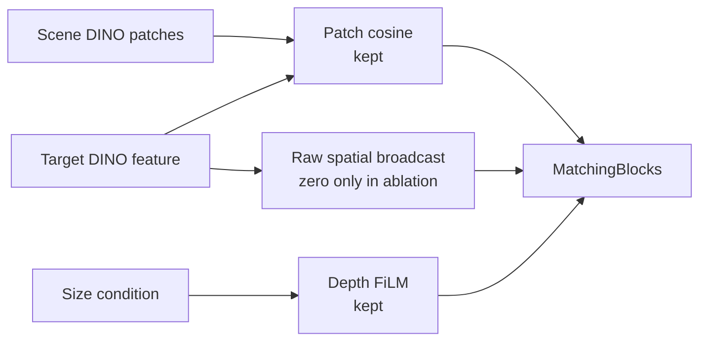

**수정:** Parameter shape와 cosine/FiLM 경로를 유지하고 raw target broadcast만 0으로 고정하는 controlled model을 구현함. 현재 코드에서 같은 seed로 생성한 raw-broadcast와 zero-broadcast 모델의 parameter shape와 초기 state가 동일함을 확인했으며 SHA-256은 `d8c3122c…f8c0`임.

**Controlled retrain 결과:** 16 epoch와 5,408 update를 모두 완료한 final checkpoint를 동일 seed의 broadcast-on reference와 비교함.

| Seed-0 fixed-update metric | Broadcast ON | No broadcast | Change |
|---|---:|---:|---:|
| Seen coverage MAE | `0.05155` | `0.08100` | `+57.1%` |
| Training-heldout coverage MAE | `0.07725` | `0.11494` | `+48.8%` |
| Heldout pooled `S > 0` | `8 / 8` | `0 / 8` | 기준 미충족 |
| Heldout camera `S > 0` | `40 / 40` | `2 / 40` | 기준 미충족 |
| `packaged_food_4` native MAE | `0.09802` | `0.22229` | `+126.8%` |
| `packaged_food_4` native bias | `−0.08694` | `−0.22058` | Underprediction 증가 |

CSV 1,680행의 composite key가 모두 고유하고, 두 checkpoint는 seed 0, epoch 15, 5,400 samples/epoch, 5,408 cumulative batches 조건을 만족함.

**판단:** No-broadcast 구성은 사전 broad gate를 만족하지 못해 seeds 1–2 확대를 진행하지 않음. 현 architecture에서 scalar cosine과 size-FiLM만 남기는 방식은 target conditioning을 충분히 유지하지 못했음. 다음 실험은 target 정보를 없애지 않으면서 absolute target code 의존을 줄이는 relation-aware interaction으로 제한함.

---

### 2026-08-21 · Phase 16 — Fresh Paired Reproducibility Gate

**문제:** 기존 broadcast-on checkpoint에는 최초 initialization과 sample-order hash가 없어, no-broadcast 성능 저하가 target 경로 제거 때문인지 과거 실행과의 차이 때문인지 완전히 분리되지 않았음.

**검증:** 현재 코드에서 broadcast-on seed 0을 `16 epoch`, `5,408 update`로 다시 학습함. 초기 state SHA-256은 `d8c3122c…f8c0`, 첫 epoch sample-order SHA-256은 `26e6843b…303b`로 기록함.

| Reproducibility check | Result |
|---|---|
| Epoch 0–15 train/validation metrics | 기존 accepted run과 전부 일치 |
| Final model-state SHA-256 | 두 모델 모두 `6354241b…55d7a` |
| State tensors | `168 / 168` bitwise identical |
| Compared parameters | `15,716,309`개 원소, mismatch `0` |
| Maximum absolute difference | `0.0` |

Checkpoint 파일 해시는 provenance metadata 추가로 서로 다르지만, 실제 추론에 쓰이는 모든 model tensor는 동일함.

**판단:** Fresh broadcast-on 재현 gate가 통과했으므로 동일 seed·초기화·sample order의 seed-0 비교에서 나타난 no-broadcast의 MAE 증가와 scale-response 약화는 code/data drift보다 raw target broadcast 제거의 영향으로 판단함. 단순 제거 실험은 종료하고, 다음 Step에서는 scene과 target의 채널별 관계를 보존하는 interaction을 동일 조건으로 비교함.

---

### 2026-08-21 · Phase 17 — Relation-Aware Target Interaction

**문제:** Scalar cosine과 size-FiLM만 남긴 no-broadcast 모델은 target 정보를 충분히 전달하지 못했음. Raw target vector를 다시 넣지 않으면서 cosine 합산 전의 채널별 관계를 보존할 방법이 필요했음.

**수정:** 기존 target 768채널 자리를 normalized channelwise product로 교체함. Scene RGB, depth FiLM, shifted cosine, MatchingBlock, parameter 수와 초기화는 그대로 유지함.

```text
q(x) = Normalize(scene_patch(x)) × Normalize(target)
r(x) = sqrt(C) × Normalize(q(x))

MatchingBlock input = [scene patch, FiLM depth, r(x), shifted cosine]
```

초기 state SHA와 sample-order SHA는 fresh raw 기준과 일치했고, parameter `15,706,689`개와 `5,408` update를 동일하게 유지함.

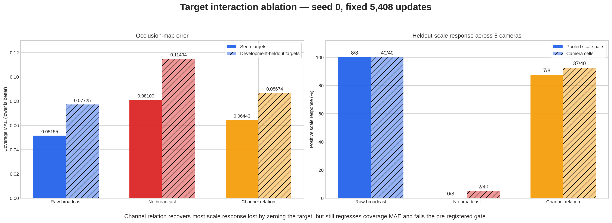

| Seed-0 fixed-update metric | Raw broadcast | No broadcast | Channel relation |
|---|---:|---:|---:|
| Final validation loss | `0.30448` | `0.34033` | `0.32434` |
| Final validation IoU | `0.393` | `0.250` | `0.308` |
| Seen coverage MAE | `0.05155` | `0.08100` | `0.06443` |
| Training-heldout coverage MAE | `0.07725` | `0.11494` | `0.08674` |
| Heldout pooled `S > 0` | `8 / 8` | `0 / 8` | `7 / 8` |
| Heldout camera `S > 0` | `40 / 40` | `2 / 40` | `37 / 40` |
| `packaged_food_4` native MAE | `0.09802` | `0.22229` | `0.11708` |
| `packaged_food_4` native bias | `−0.08694` | `−0.22058` | `−0.10623` |

Workspace 전체 MAE는 relation 모델에서 감소했지만, coverage 내부 MAE와 underprediction은 증가함. Workspace에는 GT가 0인 픽셀이 많아 출력을 전반적으로 낮추는 것만으로도 오차가 줄 수 있으므로 채택 근거로 사용하지 않음.

**판단:** Channel relation은 no-broadcast보다 target 조건을 많이 회복했지만 사전 safety gate와 `packaged_food_4` 개선 gate를 모두 통과하지 못함. Seeds 1–2는 실행하지 않고 raw broadcast baseline을 유지함. 이번 결과는 추가 L2 normalization까지 포함한 relation 표현 전체의 결과이므로, 다음 Step에서는 낮은 유사도의 patch도 동일한 relation energy를 갖게 되는 정규화 효과부터 분리 진단함.

---

### 2026-08-21 · Phase 18 — Relation Magnitude Diagnostic

**문제:** Phase 17의 L2 normalization은 채널별 관계 방향은 남기지만 `‖q‖`를 제거함. 이 때문에 target과 약하게 대응하는 patch도 강하게 대응하는 patch와 같은 크기의 relation feature를 받음.

쉽게 말하면 `q`는 scene과 target의 768개 channel이 위치별로 얼마나 같은 방향으로 반응했는지를 담은 목록임. `‖q‖`는 그 목록 전체의 반응 세기인데, 완전히 정규화하면 “매우 비슷함”과 “조금 비슷함”의 세기 차이가 사라질 수 있어 이 정보가 GT 설명에 도움이 되는지 먼저 확인함.

**검증:** Held-out target과 validation scene은 사용하지 않고, 학습용 10 target·36 scene·5 camera만 분석함. 같은 scene·camera·patch에서 target 평균을 제거한 뒤, cubic cosine 12개만 사용한 기준과 cosine으로 설명되지 않는 `log‖q‖` 4개를 추가한 경우를 scene 단위 6-fold로 비교함. Target 가중치는 실제 학습 sampler와 동일하게 category-balanced로 설정함.

```text
q_l(x) = Normalize(scene_l(x)) × Normalize(target_l)
r_l(x) = sqrt(C) × q_l(x) / (m_l + epsilon)
```

`m_l`은 학습 target의 실제 coverage 영역에서 계산한 layer별 `‖q_l‖` 중앙값이며, 추론 시 다시 계산하지 않는 고정값임.


| Train-only diagnostic | Result |
|---|---:|
| Coverage MAE: cubic cosine only | `0.08829` |
| Coverage MAE: + residual `log‖q‖` | `0.08583` |
| Relative improvement | `2.78%` |
| Improved scene folds | `6 / 6` |
| Scene-bootstrap 95% interval | `+2.01% – +3.46%` |
| Cosine-independent DINO layers | `4 / 4` |
| Uncalibrated `C·q` scale gate | `0 / 40` — 기준 미충족 |
| Train-median calibrated scale gate | `40 / 40` — pass |

**판단:** `‖q‖`에는 cubic cosine만으로 설명되지 않는 target-dependent GT 신호가 남아 있음. 단순 `C·q`는 feature 크기가 지나치게 커 사전 기준을 만족하지 못했으며, 대신 train-only 중앙값으로 크기만 고정한 relation을 동일 초기화·동일 sample order의 seed 0 한 번으로 평가함. 이 진단은 다음 실험을 수행할 근거이며 zero-shot 성능 증명은 아님. Seed 0이 사전 held-out 5-camera gate를 통과하기 전에는 seeds 1–2를 실행하지 않음.

---

### 2026-08-22 · Phase 19 — Magnitude-Calibrated Relation Evaluation

**문제:** Phase 18의 train-only 진단에서 relation 크기 `‖q‖`가 GT와 관련된 신호를 보였지만, 이 신호가 전체 비선형 모델의 학습·일반화까지 개선하는지는 확인되지 않았음.

**실험:** 학습 target에서 미리 계산한 layer별 중앙값 `m_l`을 고정하고, 추론 시 held-out target으로 재보정하지 않음. Raw baseline과 초기 state, sample order, `16 epoch`, `5,408 update`, dataset을 동일하게 맞춰 seed 0을 학습함.

```text
r_l(x) = sqrt(C) × q_l(x) / (m_l + epsilon)
```

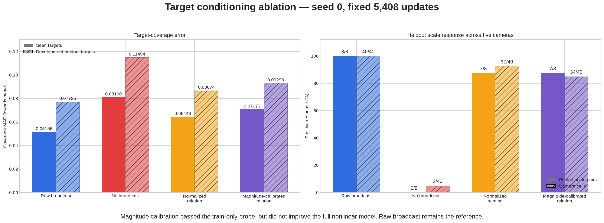

| Seed-0 fixed-update metric | Raw broadcast | No broadcast | Normalized relation | Magnitude-calibrated relation |
|---|---:|---:|---:|---:|
| Seen coverage MAE | `0.05155` | `0.08100` | `0.06443` | `0.07073` |
| Training-heldout coverage MAE | `0.07725` | `0.11494` | `0.08674` | `0.09298` |
| Heldout pooled `S > 0` | `8 / 8` | `0 / 8` | `7 / 8` | `7 / 8` |
| Heldout camera `S > 0` | `40 / 40` | `2 / 40` | `37 / 40` | `34 / 40` |
| `packaged_food_4` native MAE | `0.09802` | `0.22229` | `0.11708` | `0.12220` |
| `packaged_food_4` native bias | `−0.08694` | `−0.22058` | `−0.10623` | `−0.10706` |

Magnitude-calibrated relation은 raw baseline 대비 seen coverage MAE `+37.20%`, heldout coverage MAE `+20.35%`로 악화됨. `packaged_food_4`도 5개 camera 모두에서 MAE와 bias가 개선되지 않음. Workspace MAE는 낮아졌지만, target coverage에서 underprediction이 커졌으므로 예측값 전체가 낮아진 효과로 판단함.

**판단:** Train-only 진단은 실험 후보를 거르는 용도였지만, 전체 모델의 성능 개선을 보장하지 않았음. Magnitude-calibrated seeds 1–2는 실행하지 않고 appearance interaction 변형은 종료함. Fresh raw size-only를 현재 기준 모델로 유지하며, 다음 후보는 target mask에서 계산할 수 있는 소수의 물리적 크기·형상 descriptor로 제한함.

---

### 2026-08-22 · Phase 20 — Compact Physical Shape Descriptor Gate

**문제:** Size-only의 `area·bbox_h·bbox_w`는 target의 전체 크기는 나타내지만, 같은 크기에서 모양과 질량 분포가 다른 물체를 구분하지 못함.

**수정:** Target mask에서 길쭉함 `eta`와 moment compactness `kappa` 두 값만 추가하는 후보를 설계함. 초기 구현에서 bbox를 `8 × 8` 정사각형으로 변환하며 물체의 길쭉함이 사라지는 문제를 발견함. 원래 mask 좌표계의 bbox 크기를 복원해 moment를 계산하도록 수정한 후 재검증함.

```text
eta   = (lambda_max - lambda_min) / (lambda_max + lambda_min)
kappa = mask_area / (2*pi*(lambda_max + lambda_min))
```

이 단계는 full model 학습이 아니라 descriptor가 다음 학습 후보로서 가치가 있는지 저렴하게 확인하는 train-only screening임. 학습 10 target·36 scene·3 scale·5 camera만 사용하고, target 하나를 donor에서 완전히 제외한 leave-one-target-out 비교를 수행함. Held-out 4 target과 validation scene은 사용하지 않았으며, shape를 같은 category의 다른 target과 바꾸는 64개 대조 조건도 같이 계산함.


| Train-only gate | Result | Required |
|---|---:|---:|
| Pooled coverage MAE | `0.09114 → 0.07748` (`14.99%` 개선) | `≥ 2%` 개선 |
| Improved targets | `5 / 10` | `≥ 8 / 10` |
| Improved categories | `2 / 4` | `4 / 4` |
| Improved cameras | `5 / 5` | `5 / 5` |
| Improved target-camera cells | `27 / 50` | `≥ 40 / 50` |
| Improved target-camera-scale cells | `78 / 150` | `≥ 120 / 150` |
| Worst scale-cell regression | `+320.67%` | `≤ +5%` |

Fruit은 category MAE `17.20%`, toy는 `43.84%` 개선됐지만 book은 `7.78%`, packaged food는 `13.22%` 악화됨. 전체 평균 개선은 특정 category의 큰 이득이 만든 결과이며, 새 target에 공통으로 적용되는 물리 규칙으로 보기 어려움.

**판단:** `eta·kappa`는 category별 결과가 일관되지 않아 full-model 후보에서 제외함. Seed 0–2는 실행하지 않고 fresh raw size-only를 기준 모델로 유지함. 다음에는 2D mask descriptor를 더 늘리지 않고, 3D target extent가 잔여 target effect를 설명할 수 있는지 oracle 진단으로 먼저 확인함.

---

### 2026-08-22 · Phase 21 — Exact 3D Extent Diagnostic

**문제:** 2D mask의 면적과 bbox는 camera에 보이는 크기만 나타냄. 같은 투영 크기라도 실제 높이와 바닥 면적이 다르면 물체 더미에 의해 완전히 가려질 수 있는 위치가 달라지므로, 이 3D 차이가 남은 target 오차의 원인인지 확인할 필요가 있었음.

**검증:** GT 생성에 실제 사용한 mesh에서 `가로 최소 길이·가로 최대 길이·높이`를 추출함. 이 단계도 full model 학습 전에 “실제 3D 크기를 알면 비슷한 train target의 GT 차이를 더 잘 설명할 수 있는가?”를 묻는 screening임. 이 값은 최종 배포 입력이 아니라 정보 유효성만 확인하는 진단용 oracle임. 학습 10 target·36 scene·3 scale·5 camera만 사용했으며, query target을 donor와 정규화 통계에서 완전히 제외함.

```text
extent3(s) = s × [min(dx, dy), max(dx, dy), dz]
```

같은 category의 다른 target extent를 넣는 64개 wrong-extent 대조 조건도 함께 계산함.


| Train-only diagnostic | 2D shape | Exact 3D extent |
|---|---:|---:|
| Pooled coverage MAE | `0.09114 → 0.07748` | `0.09114 → 0.06927` |
| Relative improvement | `14.99%` | `23.99%` |
| Improved targets | `5 / 10` | `9 / 10` |
| Improved categories | `2 / 4` | `4 / 4` |
| Improved cameras | `5 / 5` | `5 / 5` |
| Improved target-camera cells | `27 / 50` | `36 / 50` |
| Improved target-camera-scale cells | `78 / 150` | `100 / 150` |
| Meaningful worst regression | `+320.67%` | `없음` |

3D extent의 scene-bootstrap 95% interval은 `+23.12% – +24.80%`였고, wrong-extent 대조 조건의 최대 개선은 `1.17%`에 그침. 따라서 실제 3D 크기에 target별 GT를 설명하는 정보가 있음을 확인함.

다만 사전에 고정한 cell 개선 수 기준 `40/50`, `120/150`에는 각각 `36/50`, `100/150`으로 미달함. 남은 cell은 악화가 아니라 hard 3-NN에서 donor 구성이 바뀌지 않아 생긴 동률이지만, 결과를 본 뒤 기준을 바꾸지 않고 사전 기준 미충족으로 기록함.

**판단:** 이 결과를 zero-shot 성능이나 최종 구조의 통과로 해석하지 않음. 다음 Step은 raw size-only와 구조·초기값·sample order·update 수를 같게 유지한 seed-0 모델에서 exact extent 3개만 추가하는 controlled oracle ablation임. 이 모델이 기존 5-camera coverage·scale-response gate를 통과할 때만 RGB/multi-view 기반 3D 크기 추정 방법을 개발함.

---

### 2026-08-22 · Phase 22 — Exact 3D Extent Controlled Model

**문제:** Phase 21은 3D 크기 정보가 GT 차이를 설명할 수 있다는 진단이었으며, 실제 모델이 그 정보를 올바르게 사용하는지는 확인하지 못함.

**통제 실험:** Target mesh의 exact extent를 geometry conditioning에 추가함.

```text
extent3(s) = s × [min(dx, dy), max(dx, dy), dz]
F_depth'   = gamma(extent3) × F_depth + beta(extent3)
```

Raw size-only 기준 모델과 seed·초기 가중치·sample 순서·학습 횟수(`5,408` update)를 동일하게 유지함. Train 10 target의 통계만 이용해 정규화하고, fixed epoch 15에서 14 target·16 validation scene·5 camera를 비교함. Exact extent는 정보 유효성을 확인하기 위한 simulation oracle이며 실제 배포 입력은 아님.

| 평가 영역 | Raw size-only | Exact extent + global FiLM | 변화 |
|---|---:|---:|---:|
| 전체 target coverage MAE | `0.05838` | `0.05803` | `0.60%` 개선 |
| 전체 workspace MAE | `0.13745` | `0.15581` | `13.36%` 악화 |
| Train target coverage MAE | `0.05155` | `0.05587` | `8.38%` 악화 |
| Held-out target coverage MAE | `0.07725` | `0.06399` | `17.16%` 개선 |
| Held-out target workspace MAE | `0.16094` | `0.17477` | `8.59%` 악화 |

Held-out target의 scale-response 방향은 `8/8` target-scale과 `40/40` camera에서 양수였음. 이는 변화 방향이 맞다는 뜻이며 raw보다 더 좋아졌다는 뜻은 아님. Coverage와 workspace를 함께 보는 사전 평가 기준은 충족하지 못함.

**원인 분리:** 같은 checkpoint에서 scene RGB-D·target RGB·2D 크기·camera·scale·GT를 고정하고, exact extent 세 값만 같은 category의 다른 target 값으로 교체함. 모델 재학습은 수행하지 않음.

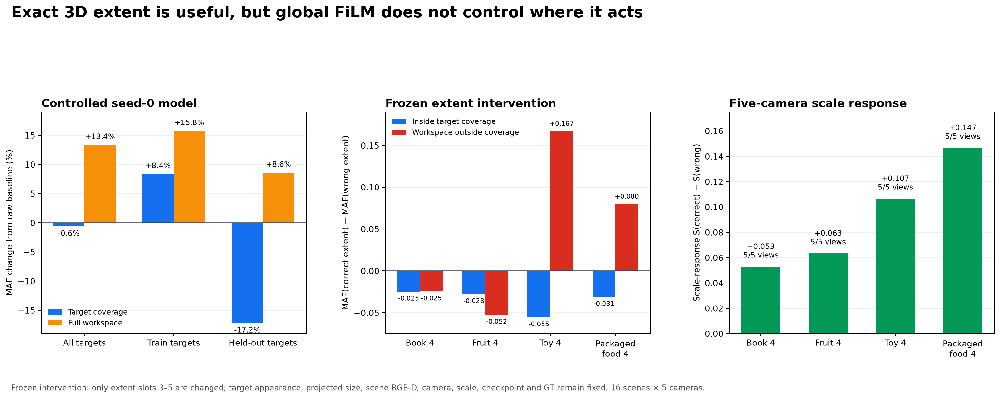

| Frozen intervention, held-out target | Correct extent − wrong extent | 결과 |
|---|---:|---|
| Target coverage MAE | `-0.03468` | Target-camera 평균 `20/20`에서 correct extent 우세 |
| Scale-response `S` | `+0.09249` | Target-camera 평균 `20/20`에서 correct extent 우세 |
| Workspace 안·coverage 밖 MAE | `+0.04232` | Target-camera 평균 개선 `10/20` |

Correct extent는 held-out target에서도 coverage 예측과 크기 변화 반응을 일관되게 개선함. 따라서 모델이 3D 크기 정보를 실제로 사용한다는 점은 확인됨. 반면 `book_4·fruit_4`는 coverage 밖 오차도 감소했지만, `toy_4·packaged_food_4`는 5개 camera 모두 증가함. 가장 가까운 wrong extent만 사용한 비교에서도 같은 경향이 남아 극단적인 교체값 때문으로 보기 어려움.

**판단:** 이번 exact-extent 경로에서 관찰된 leakage는 하나의 extent vector로 전체 depth feature에 같은 `gamma·beta`를 적용하는 global FiLM과 연결되어 있었음. Target이 물체 더미에 의해 가려질 수 있는 영역은 개선했지만, workspace 안에서도 해당 target이 존재할 수 없어 GT가 0인 위치까지 함께 활성화함. 이 실험만으로 DINOv3 정보가 충분하다고 결론 내리지는 않음.

현재 global-FiLM 구성은 후속 seed로 확대하지 않고, RGB 기반 3D 크기 추정기 개발도 보류함. 다음 실험에서는 exact extent를 계속 oracle로 사용하되, `local depth feature × extent`로 patch별 bounded residual을 만들고 residual을 0으로 초기화해 raw baseline에서 시작함. 동일한 seed-0 조건에서 coverage·coverage 밖 오차·scale-response·현재 고정 rig의 5-camera 결과가 함께 개선될 때만 다음 Step으로 진행함.

---

### 2026-08-24 · Phase 23 — Local Bounded Extent Interaction

**문제:** Global FiLM은 target 크기로 만든 같은 조절값을 모든 scene patch에 적용함. Target이 물체 더미에 의해 가려질 수 있는 영역은 찾았지만, 서랍 안에서 해당 target이 가려질 후보가 없는 위치도 함께 밝아지는 leakage가 발생함.

**방법:** Exact extent와 각 위치의 depth feature를 함께 보고 위치별 gate를 계산하도록 변경함.

```text
Global: target extent ─────────────→ 모든 위치에 같은 gamma, beta
Local : target extent + D(x,y) ───→ 위치별 gate g(x,y) ─→ bounded residual

D'(x,y) = D(x,y) + 0.25 × g(x,y) × learned_correction(x,y)
```

`g(x,y)`는 현재 위치의 depth 구조가 target 크기와 맞는 정도를 `0–1`로 나타냄. `0.25`는 depth feature를 수정하는 residual branch의 세기를 제한하는 값이며, 최종 occlusion probability를 25%로 제한한다는 뜻은 아님. Residual은 0에서 시작하므로 학습 전 출력은 raw baseline과 정확히 같음. Seed·초기 가중치·sample 순서·`5,408` update와 exact extent 입력은 Phase 22와 동일하게 유지함.

아래 MAE는 예측 map과 GT의 평균 절대 차이이며 `0`에 가까울수록 좋음. `Coverage`는 target이 물체 더미에 의해 가려질 수 있는 영역의 정확도, `Impossible-to-occupy workspace`는 target이 가려질 후보가 없는 위치의 잘못된 활성화, `Whole workspace`는 두 영역을 함께 평가함.


| 전체 14 target | Raw size-only | Exact extent + global FiLM | Exact extent + local bounded |
|---|---:|---:|---:|
| Coverage MAE | `0.05838` | `0.05803` (`0.60%` 개선) | `0.05741` (`1.67%` 개선) |
| Whole-workspace MAE | `0.13745` | `0.15581` (`13.36%` 악화) | `0.13077` (`4.86%` 개선) |
| Impossible-workspace MAE | `0.20853` | `0.24371` (`16.87%` 악화) | `0.19671` (`5.67%` 개선) |

Local 방식은 global FiLM의 평균 leakage를 줄이고 raw보다도 세 영역 모두 개선함. Training-heldout 4개 target 평균에서도 coverage `13.33%`, workspace `9.13%`, impossible-workspace `8.01%` 개선함. 크기 변화에 출력이 같은 방향으로 반응하는지는 `8/8` target-scale과 `40/40` camera에서 유지되어, 현재 고정 rig의 다섯 view에서 같은 방향의 신호를 확인함. 이 수치는 raw 대비 개선이 아니라 scale 변화 방향이 양수였다는 뜻임.

**판단:** 평균 개선만으로 모델을 채택하지 않음. Raw 대비 `book_4` scale-response가 `-0.062`, `-0.054` 감소하여 사전 기준 `-0.05`를 넘었고, `packaged_food_4`의 impossible-workspace MAE는 `30.29%` 악화함. Seen-target coverage도 `4.65%` 악화하여 seed-0 사전 기준을 만족하지 못함.

따라서 local interaction이 global 방식보다 평균적인 공간 제어를 개선할 가능성은 확인했지만, target별 사전 기준을 만족하지 못해 이 상태로 seed를 확대하지 않음. RGB 기반 extent estimator도 아직 실행하지 않음. 다음 Step은 같은 frozen checkpoint에서 extent만 올바른 값과 같은 category의 다른 값으로 교체해 원인을 분리하고, gate와 residual이 coverage 안팎을 실제로 구분하는지 확인하는 것임.

**Frozen 후속 진단:** 재학습 없이 scene RGB-D·target appearance·GT를 고정하고 extent만 교체함. Held-out 평균에서 correct extent는 wrong extent보다 coverage MAE를 `0.03267` 낮추고 scale-response를 `0.12590` 높였지만, impossible-workspace MAE는 `0.02811` 높였음. 즉 3D 크기 정보는 실제로 사용되지만 유용한 영역과 잘못된 영역을 동시에 활성화함.

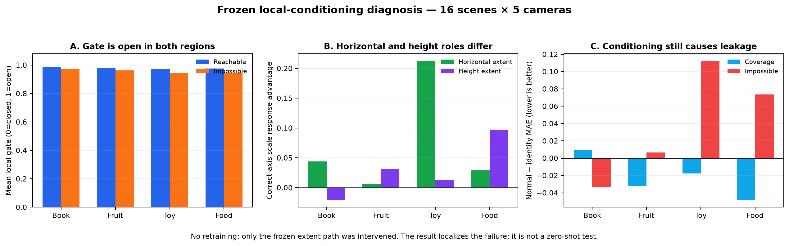

Gate가 위치를 실제로 거르는지 확인하기 위해 target이 도달 가능한 patch와 불가능한 patch를 분리함. 네 held-out target의 평균 gate는 가능한 영역 `0.974–0.988`, 불가능한 영역도 `0.943–0.972`였음. `0`이면 닫힘, `1`이면 완전히 열림이므로 두 영역에서 거의 항상 열린 상태임. 따라서 residual 크기는 제한됐지만, 공간을 선택하는 gate는 충분히 작동하지 않았음.

축별 교체에서는 `book_4`의 올바른 높이 값이 scale-response를 `0.021` 낮추고, `toy_4`의 수평 크기는 scale-response를 `0.213` 높이는 대신 impossible-workspace MAE를 `0.081` 높였음. 하나의 벡터에서 수평 크기와 높이를 함께 처리하면서 역할이 얽힌 것도 확인함.

**다음 Step:** Noncoverage loss를 바로 추가하면 이전 ring-loss처럼 크기 변화 반응까지 억제할 수 있어 보류함. 먼저 parameter 수와 초기 출력을 유지한 채, 포화되는 sigmoid dot-product를 channel-normalized local similarity로 교체하는 seed-0 실험을 수행함. 이 변경으로 leakage가 줄어도 `book_4` 역반응이 남으면 수평 크기와 높이 conditioning을 분리함.

---

### 2026-08-24 · Phase 24 — Regularized Local-Confidence Gate

**왜 이 실험을 했는가:** Phase 23의 gate는 target이 물체 더미에 의해 가려질 수 있는 patch뿐 아니라 가려질 후보가 없는 patch에서도 거의 `1`이었음. 문이 항상 열려 있으므로 local interaction이라는 이름과 달리 target 크기 보정이 서랍 전체로 퍼졌음. 이번 실험은 모델을 더 크게 만드는 대신, gate가 쉽게 포화되지 않도록 계산 방식만 바꿔 원인을 분리함.

각 scene patch의 depth encoder 출력 `D(x,y)`는 `256`개 숫자로 된 특징임. 이 숫자들은 각각 높이·모서리처럼 사람이 미리 의미를 정한 값이 아니라, ResNet-18이 함께 학습한 local depth pattern 반응임. Target의 exact 3D extent도 작은 network를 거쳐 같은 길이의 보정 방향 `q`로 바뀜. 두 벡터가 같은 방향인지 비교하여 위치별 gate를 계산함.

```text
한 scene patch의 depth 특징 D(x,y): 256개 숫자
target 크기가 요구하는 보정 방향 q: 256개 숫자

D(x,y)와 q의 방향 비교 ─→ local confidence g(x,y)
                              0: 보정하지 않음
                              1: target 크기 보정을 강하게 사용

D'(x,y) = D(x,y) + 0.25 × g(x,y) × size_correction(x,y)
```

이는 표준 cosine이 아니라 **regularized cosine-like confidence**임. Target 보정 벡터가 커지는 것만으로 gate가 `1`에 붙지 않도록 채널 수 `C=256`을 분모에 포함함. `sqrt(C)`는 256개 채널의 평균 크기가 약 `1`일 때를 기준으로 삼는 고정값이며, held-out 결과를 보고 조정한 hyperparameter가 아님. Seed·초기 가중치·sample 순서·loss·`5,408` update는 이전 실험과 같고, automated assertions로 초기 상태와 sample 순서도 확인하여 gate 계산만 비교함.

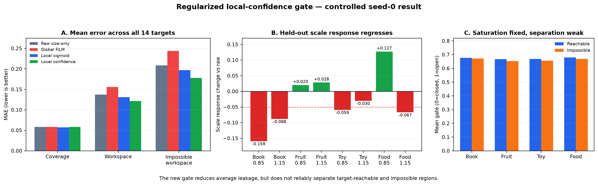

| 전체 14 target | Raw size-only | Local sigmoid | Local confidence | 해석 |
|---|---:|---:|---:|---|
| Coverage MAE | `0.05838` | `0.05741` | `0.05840` | Target이 물체 더미에 의해 가려질 수 있는 영역은 raw와 사실상 같음 |
| Whole-workspace MAE | `0.13745` | `0.13077` | `0.12122` | 서랍 전체의 평균 오차는 raw보다 `11.81%` 감소 |
| Impossible-workspace MAE | `0.20853` | `0.19671` | `0.17768` | 가려질 후보가 없는 위치의 잘못된 활성화는 평균 `14.79%` 감소 |

평균 leakage는 줄었지만, 이것만으로 새 구조를 채택하지 않음. Held-out `book_4`의 두 scale-response는 raw보다 `0.159`, `0.088` 감소했고, `packaged_food_4`는 coverage가 좋아지는 대신 whole-workspace와 impossible-workspace 오차가 각각 `22.04%`, `44.61%` 증가함. 즉 일부 target의 큰 개선이 전체 평균을 낮췄으며, 반복 사용한 네 development-heldout target에서도 일관된 개선을 확인하지 못함.

Frozen 진단에서 gate의 `0.95` 초과 비율은 기존 `66–97%`에서 `0%`로 줄어 구조적 포화는 크게 감소함. 그러나 도달 가능한 patch와 불가능한 patch의 평균 gate 차이는 target별 `0.005–0.014`에 불과했음. Gate 값은 안정됐지만 **어디를 열고 닫아야 하는지 학습하지 못한 것**이 남은 핵심 문제임. 해당 frozen correct/wrong-extent intervention에서 toy와 packaged food의 extent 입력은 coverage 오차를 줄이는 동시에 impossible-workspace 오차를 각각 약 `0.108`, `0.117` 높이는 방향에 직접 관여함.

Exact extent는 물체 이름이 아니라 실제 크기이므로 원리상 unseen target에도 적용 가능한 정보임. 다만 현재 값은 mesh에서 얻은 진단용 oracle이므로 이 결과는 zero-shot 성능을 증명하지 않음. Oracle 구조가 먼저 모든 target에서 안정적으로 작동한 뒤에만 target RGB/mask로 크기를 추정하는 배포 입력으로 교체함.

**판단 및 다음 Step:** Seed 0의 사전 기준을 만족하지 못해 seed 1–2 확대는 진행하지 않음. 다음 실험은 최종 probability map을 직접 누르는 ring loss가 아니라 gate 자체만 감독함. Target이 물체 더미에 의해 가려질 수 있는 순수 patch에는 gate가 열리고, workspace 안이지만 가려질 후보가 없는 순수 patch에는 닫히도록 balanced auxiliary loss를 추가함. 경계가 섞인 patch는 제외하고 `lambda_gate=0.05`의 단일 seed-0 통제 실험만 수행함. 이 방식은 occlusion 확률을 맞히는 본래 head의 역할을 유지하면서, gate에 부족했던 공간적 역할만 명시함.

---

### 2026-08-24 · Phase 25 — Strict Gate-Localization Supervision

**왜 이 방법을 사용했는가:** Phase 24의 gate 값은 안정됐지만 열어야 할 곳과 닫아야 할 곳을 구분하지 못했음. 최종 probability map의 loss만 사용하면 뒤쪽 MatchingBlock이 오차를 대신 줄일 수 있어 gate가 의도한 역할을 배우지 않아도 됨. 따라서 최종 출력을 직접 0으로 누르는 기존 ring loss 대신, gate에만 위치 역할을 알려주는 보조 loss를 사용함.

```text
Target이 물체 더미에 의해 가려질 수 있는 순수 patch → gate를 1에 가깝게 학습
서랍 안이지만 가려질 후보가 없는 순수 patch          → gate를 0에 가깝게 학습
두 영역이 섞인 경계 patch              → 보조 loss에서 제외

전체 loss = 기존 probability-map loss + 0.05 × balanced gate loss
```

두 영역의 patch 수가 달라도 한쪽이 loss를 지배하지 않도록 각각 평균한 뒤 `1:1`로 합침. `0.05`는 결과를 보고 고른 값이 아니라 실험 전에 고정했으며, validation과 checkpoint 선택은 기존 probability-map loss만 사용함. Seed·초기 state·sample 순서·`5,408` update와 exact-extent oracle 입력도 이전 실험과 같게 유지함.

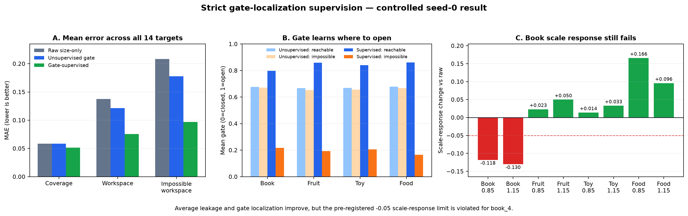

| 전체 14 target | Raw size-only | Gate supervision | 의미 |
|---|---:|---:|---|
| Coverage MAE | `0.05838` | `0.05153` | Target이 물체 더미에 의해 가려질 수 있는 영역의 오차 `11.73%` 감소 |
| Whole-workspace MAE | `0.13745` | `0.07538` | 서랍 전체 오차 `45.16%` 감소 |
| Impossible-workspace MAE | `0.20853` | `0.09682` | 잘못 밝아지는 leakage `53.57%` 감소 |

보조 loss가 없는 동일 gate 모델과 비교해도 coverage·workspace·impossible-workspace MAE가 각각 `11.76%`, `37.81%`, `45.51%` 감소함. 동일 seed·초기 state·sample order의 controlled seed-0 비교에서는 gate localization supervision 추가와 평균 개선이 함께 나타남. 다중 seed 일반화는 아직 확인하지 않음.

Frozen 진단에서도 변화가 확인됨. 보조 loss가 없을 때 가능한 영역과 불가능한 영역의 gate 차이는 `0.005–0.014`였지만, 학습 후에는 target별 `0.580–0.695`로 커짐. 가능한 영역의 평균 gate는 `0.797–0.860`, 불가능한 영역은 `0.166–0.217`이므로 현재 oracle coverage 정의와 고정 rig의 development target에서 gate가 위치 분리를 학습했음을 확인함.

**남은 문제:** 평균 결과는 크게 좋아졌지만 사전에 정한 모든 기준을 통과하지는 못함. 현재 고정 rig의 다섯 camera에서 scale-response 자체는 `40/40` 모두 양수였으나, `book_4`의 `0.85/1.15` scale 반응은 raw보다 각각 `0.118`, `0.130` 약해져 허용선 `-0.05`를 넘음. 결과를 본 뒤 기준을 완화하지 않고 seed-0 사전 기준 미충족으로 기록함.

축별 frozen intervention에서 book의 수평 크기 축을 교체했을 때 scale-response 변화는 `+0.005`로 거의 중립이었지만, 높이 축 교체는 `-0.131`의 변화를 만들었음. 반대로 높이 축은 coverage와 impossible-workspace MAE를 각각 약 `0.016`, `0.031` 줄여 단순히 제거할 정보도 아님. 즉 현재 하나의 FiLM/gate가 수평 footprint와 높이의 서로 다른 역할을 함께 처리하는 것이 남은 병목임.

Exact extent와 coverage label은 USD/GT에서 얻은 simulation oracle임. 물체 category 이름을 gate에 주지는 않으므로 크기와 local depth의 관계를 배우는 zero-shot 가설에는 맞지만, 아직 target RGB만 사용하는 배포형 zero-shot을 증명한 결과는 아님.

**판단 및 다음 Step:** 평균 개선과 gate localization은 유지할 가치가 있지만, 현 모델을 최종 candidate로 확정하지 않음. Seeds 1–2와 RGB extent estimator는 계속 보류함. 수평 footprint는 물체가 차지할 바닥 면적에, 높이는 위쪽 공간과 가려짐 깊이에 주로 영향을 주므로 다음에는 두 값을 별도 conditioning 경로로 분리함. 동일 gate supervision을 유지한 seed-0 실험 하나에서 book 반응을 확인하고, 회복되지 않으면 architecture 확장을 중단한 뒤 scale-paired objective 또는 GT의 book-height 정의를 다시 검토함.

---

### 2026-08-24 · Phase 26 — Footprint Gate / Height Residual Separation

**왜 이 실험을 했는가:** Phase 25는 gate의 위치 분리를 학습했지만, 얇고 넓은 `book_4`의 scale 반응은 여전히 약했음. 하나의 exact-extent 벡터가 “어디에서 target이 물체 더미에 의해 가려질 수 있는가”와 “그 안에서 높이 차이를 얼마나 반영할 것인가”를 동시에 결정한 것이 원인인지 확인함.

68개 입력 칸 중 실제로 사용하는 여섯 값의 역할을 다음처럼 나눔.

```text
area, bbox h/w, 짧은·긴 가로 길이 ─→ footprint gate g_F(x,y)
높이                                  ─→ 열린 영역 안의 보정 강도

D'(x,y) = D(x,y) + 0.25 × g_F(x,y) × height-aware correction
```

Footprint는 target이 영상에서 차지하는 크기와 바닥 방향 길이를 나타내므로 gate의 위치를 정함. 높이는 gate를 새로 열 수 없고, footprint gate가 허용한 위치 안에서만 depth 보정량에 관여함. 새 network를 추가하면 모델 크기 차이가 결과에 섞이므로 기존 `GeometryFiLM` 하나를 세 번 공유해 footprint·height·zero 입력을 분리함. 그 결과 파라미터 수, state key, 초기 가중치, 첫 epoch sample 순서와 총 `5,408` update는 Phase 25와 동일함. 자동 테스트로 높이를 바꿔도 gate가 bitwise 동일하고, footprint를 바꾸면 gate가 변하며, 사용하지 않는 62개 칸은 출력에 영향을 주지 않음을 확인함.


| 전체 14 target | Raw size-only | Phase 25 | Phase 26 | 의미 |
|---|---:|---:|---:|---|
| Coverage MAE | `0.05838` | `0.05153` | `0.05461` | Raw보다 `6.45%` 낮지만 Phase 25보다는 높음 |
| Whole-workspace MAE | `0.13745` | `0.07538` | `0.07276` | Raw보다 `47.07%`, Phase 25보다 `3.48%` 낮음 |
| Impossible-workspace MAE | `0.20853` | `0.09682` | `0.08907` | Raw보다 `57.29%`, Phase 25보다 `8.00%` 낮음 |

Gate 역할 분리는 실제 checkpoint에서도 유지됨. 네 development-heldout target에서 target이 물체 더미에 의해 가려질 수 있는 순수 영역의 평균 gate는 `0.798–0.865`, 가려질 후보가 없는 영역은 `0.128–0.183`이었음. 모든 scale과 다섯 camera에서 예측 반응 방향은 `40/40` 양수였음.

그러나 핵심 사전 기준은 충족하지 못함. `book_4 ×0.85/×1.15`의 raw 대비 `ΔS`는 Phase 25의 `-0.118/-0.130`에서 `-0.094/-0.052`로 회복됐지만, 두 값 모두 허용선 `-0.05`를 넘지 못함. Held-out median `ΔS=-0.010`과 다른 held-out target의 native coverage 안전 기준도 충족하지 못했으며, `book_4` native coverage MAE는 raw보다 `10.3%` 높았음. 결과를 본 뒤 기준을 완화하지 않고 seed-0 사전 기준 미충족으로 기록함.

Frozen identity 진단에서는 Phase 26의 local residual을 끄면 `book_4` coverage MAE가 평균 `0.0128` 낮아졌음. 즉 현재 남은 문제는 gate가 잘못된 위치를 여는 것이 아니라, 올바르게 열린 영역 안에서 book의 크기 변화에 적용하는 보정 방향과 크기가 부정확한 것임.

**판단 및 다음 Step:** Seeds 1–2와 RGB 기반 extent estimator는 계속 보류하고, 구조를 더 키우지 않음. 현재 loss는 각 scale의 map을 따로 맞히므로 평균 오차를 낮추면서도 같은 scene에서 scale에 따른 변화량을 충분히 보존하지 못할 수 있음. 다음에는 train target의 동일 scene·camera에서 두 scale을 짝지어 `예측 map 변화량`과 `GT map 변화량`을 직접 비교하는 scale-paired loss를 추가함. Held-out target은 loss 설계나 가중치 선택에 사용하지 않음.

---

### 2026-08-24 · Phase 27 — Train-Only Scale-Paired Loss and BatchNorm Diagnosis

**왜 이 실험을 했는가:** 기존 loss는 scale `0.7`, `1.0`, `1.3`의 probability map을 각각 맞히지만, 같은 scene에서 target 크기가 바뀔 때 map이 **어떻게 달라져야 하는지**는 직접 비교하지 않음. 이 때문에 평균 map 오차를 낮추면서도 크기 변화가 예측에 충분히 반영되지 않을 가능성을 확인하고자 함.

같은 `target–scene–camera`의 세 scale을 한 묶음으로 불러오고, 인접한 두 scale의 예측 변화와 GT 변화를 비교함.

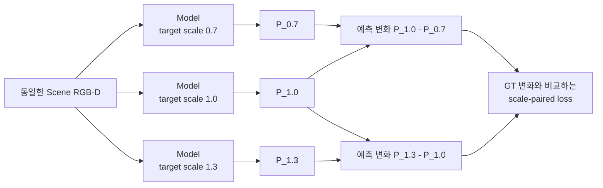

```text
ΔP = P(s₂) - P(s₁)                 예측 map이 scale에 따라 변한 양
ΔG = G(s₂) - G(s₁)                 GT map이 scale에 따라 변해야 하는 양

L_pair = Σ|ΔP - ΔG| / (Σ|ΔG| + ε)
L_total = L_map + 0.05 L_gate + 0.008902 L_pair

S = 1 - L_pair
```

`S=1`이면 scale에 따른 공간 변화가 GT와 같고, `S=0`이면 예측이 scale 변화를 사실상 무시한 수준임. 음수이면 변화를 넣지 않은 것보다 오차가 더 큼. `0.008902`는 held-out 결과를 보고 고른 값이 아니라, train target의 gradient에서 paired 항의 크기가 기존 loss의 약 `10%`가 되도록 한 번 계산해 고정함.

#### 첫 통제 실험

Phase 26, paired loader만 사용한 `λ=0` control, paired loss를 추가한 candidate를 같은 seed·초기화·16 epoch·`5,408` update로 비교함. 개발용 held-out 4 target은 읽지 않고, 학습에 사용한 10 target과 학습에 사용하지 않은 validation scene 16개만 다섯 camera에서 평가함.

| Fixed epoch 15 | Coverage MAE ↓ | Workspace MAE ↓ | Noncoverage MAE ↓ | `S` 0.7→1.0 ↑ | `S` 1.0→1.3 ↑ |
|---|---:|---:|---:|---:|---:|
| Phase 26 | `0.04956` | `0.07058` | `0.09052` | `0.3517` | `0.4466` |
| Paired-loader control | `0.06429` | `0.07958` | `0.09409` | `0.3332` | `0.4067` |
| Scale-paired candidate | `0.07764` | `0.07335` | `0.06929` | `0.3018` | `0.3546` |

Candidate의 train paired error는 낮아졌지만 validation scene에서는 두 `S`가 모두 감소했고, center/top/left/right/bottom 전체에서 같은 경향을 보임. 따라서 특정 camera 문제가 아님. 또한 loss가 없는 paired-loader control도 Phase 26보다 나빠져, paired loss뿐 아니라 batch 구성이 함께 영향을 준다는 점을 확인함.

```text
기존 batch          : 서로 독립적인 depth frame 16개
scale-paired batch  : 서로 다른 depth frame 5~6개 × 같은 frame의 scale 조건 3개
                      └─ ResNet-18 BatchNorm에는 같은 scene depth가 세 번 반복됨
```

BatchNorm은 학습 중 depth feature의 평균과 분산을 저장하고, 추론 때 그 값으로 feature 범위를 맞춤. Scale-paired batch는 실제 tensor 수가 15–18개여도 서로 다른 depth는 5–6개뿐이므로, 기존 batch와 다른 통계가 저장될 수 있음.

#### BatchNorm 통계만 분리한 진단

모델 가중치는 그대로 두고 `36 train scenes × 5 cameras = 180`개의 고유 depth frame으로 ResNet-18의 BatchNorm 평균·분산만 공통 재계산함. Validation scene, held-out target, GT는 사용하지 않았으며, 자동 검사에서 학습 파라미터는 바뀌지 않고 BatchNorm buffer 60개만 변경됨.

| BN 재계산 후 fixed checkpoint | Coverage MAE ↓ | Workspace MAE ↓ | Noncoverage MAE ↓ | `S` 0.7→1.0 ↑ | `S` 1.0→1.3 ↑ |
|---|---:|---:|---:|---:|---:|
| Phase 26 | `0.04772` | `0.06833` | `0.08789` | `0.3585` | `0.4542` |
| Paired-loader control | `0.05432` | `0.07487` | `0.09435` | `0.3651` | `0.4443` |
| Scale-paired candidate | `0.05252` | `0.06403` | `0.07494` | `0.3888` | `0.4613` |

BN 통계를 맞추자 candidate는 Phase 26보다 두 scale 구간의 `S`가 높아지고, 전체 10개 `scale transition × camera` 비교 중 9개에서 개선됨. Workspace와 noncoverage MAE도 각각 약 `6.3%`, `14.7%` 낮아짐. 즉 paired loss의 scale 신호는 일부 존재하며, 처음 관측한 후반 악화의 큰 부분은 반복 scene으로 만들어진 BN 통계와 관련 있음.

그러나 coverage MAE는 `0.04772 → 0.05252`로 약 `10.1%` 증가하여 사전 허용선 `2%`를 충족하지 못함. Coverage 평균 예측은 `0.2514`, 평균 GT는 `0.2485`로 전역 bias가 작았음. 평균값은 맞는데 MAE가 높다는 것은 단순히 map 전체가 너무 밝거나 어두운 문제가 아니라, **coverage 안에서 높은 확률과 낮은 확률을 배치하는 공간 패턴이 더 부정확해졌다는 뜻**임. 따라서 output bias나 threshold만 조절해서 해결할 수 없음.

Validation loss가 가장 낮은 checkpoint도 별도 민감도 분석을 수행했지만, fixed epoch 결과를 사후에 교체하는 근거로 사용하지 않음. 최종 untouched target은 계속 열지 않았으며, seed 1–2 확대와 `λ` sweep도 진행하지 않음.

**판단 및 다음 Step:** Scale-paired loss가 전혀 작동하지 않는 것은 아니지만, 현재 학습 방식은 scale 반응을 얻는 대신 coverage 내부 공간 정확도를 일부 희생함. 다음에는 Phase 26 checkpoint에서 정확히 한 epoch만 이어 학습하고, BatchNorm의 running mean/variance를 고정한 상태에서 `λ=0`과 `λ=0.008902`를 같은 `338` update로 비교함. 이 최소 실험으로 training-time BN 영향과 paired loss 자체의 공간 trade-off를 분리함. 두 scale 구간의 `S`가 모두 개선되고 coverage MAE 증가가 `2%` 이내일 때만 더 긴 재학습으로 확장함.

---

### 2026-08-25 · Phase 28 — BatchNorm-Frozen One-Epoch Comparison

**왜 이 실험을 했는가:** Phase 27의 BN 재계산은 학습이 끝난 모델의 통계까지 다시 바꿨으므로, paired loss 자체의 효과와 training-time BatchNorm 효과가 완전히 분리되지 않았음. Phase 26의 동일 checkpoint에서 fresh Adam으로 한 epoch만 이어 학습하고, 두 모델 모두 BN의 running mean/variance를 고정함. BN의 학습 가능한 scale·bias는 유지하고 sample 순서와 `338` update도 같게 맞춤.

| Phase 26에서 1 epoch 연장 | Coverage MAE ↓ | Workspace MAE ↓ | Noncoverage MAE ↓ | `S` 0.7→1.0 ↑ | `S` 1.0→1.3 ↑ |
|---|---:|---:|---:|---:|---:|
| Paired loss 없음 | `0.06077` | `0.07547` | `0.08942` | `0.3431` | `0.4106` |
| Paired loss 사용 | `0.05727` | `0.07772` | `0.09712` | `0.3626` | `0.4405` |

Paired loss를 사용하면 5개 camera × 2개 scale 구간의 `10/10`에서 `S`가 높아졌지만, paired loss가 없는 control보다 noncoverage MAE가 `8.61%` 증가함. 두 checkpoint의 BN buffer는 동일하므로 이 leakage는 저장된 BN 통계 차이로 설명되지 않음.

원인은 paired loss가 **scale 사이의 차이**만 본다는 점임. 세 출력에 같은 잘못된 값 `c`가 더해져도 `c`는 서로 상쇄됨.

```text
(P_1.0 + c) - (P_0.7 + c) = P_1.0 - P_0.7
```

기존 map loss도 target coverage 안에서만 계산하므로, 어떤 scale에서도 target이 덮지 않는 workspace의 공통 출력을 직접 감독하지 않았음.

**다음 Step:** Scale 변화가 생기는 footprint와 경계는 건드리지 않고, 모든 scale에서 coverage가 없는 순수 workspace의 공통 출력만 0에 가깝게 만드는 anchor를 추가함.

---

### 2026-08-25 · Phase 29 — Strict Common-Mode Anchor and Low-LR Continuation

**왜 이 방법을 사용했는가:** Paired loss는 `scale별 차이`를 학습하고, common-mode anchor는 `세 scale에 공통으로 남는 잘못된 밝기`를 제거함. 두 loss가 서로 다른 문제를 담당하도록 영역을 엄격히 분리함.

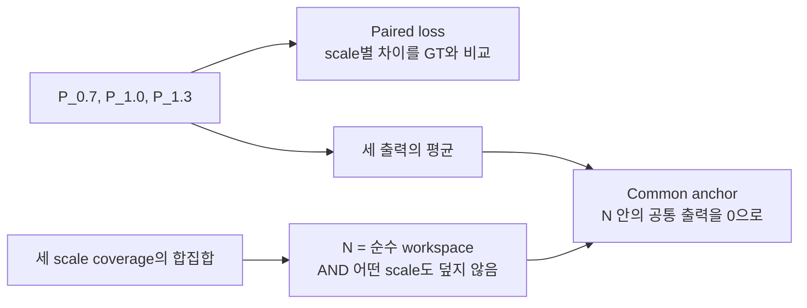

```text
N = pure_workspace AND no_coverage_at_any_scale
L_common = mean over N of |(P_0.7 + P_1.0 + P_1.3) / 3|
```

한 scale이라도 target footprint가 닿는 patch는 `N`에서 제외함. 따라서 크기가 달라지며 이동하는 경계를 억제했던 과거의 per-scale ring 방식과 다름. Loss weight는 validation이나 held-out 결과를 보지 않고 train-only 8개 batch의 gradient 크기로 한 번 고정함.

Learning rate `1e-3`에서는 leakage와 `S`가 개선됐지만 Phase 26 대비 coverage MAE가 `6.38%` 증가해 사전 허용선 `2%`를 충족하지 못함. Loss와 weight는 그대로 두고 learning rate만 `1e-4`로 낮춰, 기존 공간 map을 크게 바꾸지 않는 작은 보정을 수행함.

| Train-only, seed 0 | Coverage MAE ↓ | Workspace MAE ↓ | Noncoverage MAE ↓ | All-scale noncoverage ↓ | `S` 0.7→1.0 ↑ | `S` 1.0→1.3 ↑ |
|---|---:|---:|---:|---:|---:|---:|
| Phase 26 | `0.04956` | `0.07058` | `0.09052` | `0.07974` | `0.3517` | `0.4466` |
| Common anchor only | `0.04675` | `0.04528` | `0.04390` | `0.02962` | `0.3962` | `0.4791` |
| Common + paired | `0.04671` | `0.04391` | `0.04126` | `0.02811` | `0.4111` | `0.4862` |

최종 후보는 Phase 26보다 coverage `5.74%`, workspace `37.78%`, noncoverage `54.42%`, all-scale noncoverage `64.75%` 낮았음. 세 scale 각각의 coverage MAE와 5-camera의 두 scale 구간 `10/10`도 모두 개선되어 train-only gate를 통과함.

**다음 Step:** 이 시점까지 학습에 사용하지 않은 4개 target을 고정된 5-camera protocol에서 한 번 평가함. Common anchor만 사용한 모델도 함께 비교하여 paired loss의 추가 효과를 분리함.

---

### 2026-08-25 · Phase 30 — Five-Camera Development-Heldout Oracle Check

**평가 범위:** `book_4`, `fruit_4`, `toy_4`, `packaged_food_4`와 scale `0.85/1.0/1.15`, validation scene 16개, center/top/left/right/bottom 5개 camera를 고정함. 모델당 `4 × 3 × 16 × 5 = 960`개 map을 평가함. Target RGB는 해당 held-out instance의 실제 reference를 사용했지만, 3D extent는 USD mesh의 정확한 값을 사용함.

| Development-heldout, seed 0 | Coverage MAE ↓ | Workspace MAE ↓ | Noncoverage MAE ↓ | All-scale noncoverage ↓ | `S` 0.85→1.0 ↑ | `S` 1.0→1.15 ↑ |
|---|---:|---:|---:|---:|---:|---:|
| Phase 26 | `0.06857` | `0.07818` | `0.08573` | `0.07931` | `0.2150` | `0.2432` |
| Common anchor only | `0.06473` | `0.05139` | `0.04091` | `0.03318` | `0.2427` | `0.2860` |
| Common + paired | `0.06489` | `0.04990` | `0.03813` | `0.03086` | `0.2471` | `0.2913` |

최종 후보는 Phase 26보다 coverage `5.37%`, workspace `36.17%`, noncoverage `55.53%`, all-scale noncoverage `61.09%` 낮았음. Anchor-only와 비교해도 두 scale 구간의 `S`가 5개 camera 모두에서 높았고, target × camera × 구간의 `40/40` 조건에서도 같은 방향을 보임. 사전 기준인 `10/10 camera scale-response 개선`과 `coverage MAE 증가 2% 이내`를 모두 만족함.

냉정하게 보면 paired loss의 추가 이득은 작음. Anchor-only보다 전체 coverage MAE가 `0.24%` 높고, 세부 coverage 60개 조건 중 36개에서 최대 `1.62%` 증가함. 반면 workspace·noncoverage·all-scale noncoverage는 각각 `2.90%`, `6.81%`, `7.01%` 낮고, scale-response 40개 조건은 모두 개선됨. 따라서 작은 coverage trade-off 안에서 크기 반응과 leakage를 함께 개선한 seed-0 oracle 후보로 해석함.

**실제 map 확인:** Occlusion Stream의 5-camera 정성 그림은 모델 결과와 무관한 GT-only 중간 사례를 사용함. Phase 26에서 drawer 내부의 비후보 영역까지 퍼진 밝기가 common anchor 이후 줄어드는 모습을 확인함. Scale별 그림에서는 paired loss의 효과가 개별 scene마다 동일하지 않다는 점도 함께 기록하여 평균 수치만으로 결과를 과장하지 않음.

이 결과는 아직 최종 zero-shot 증명이 아님.

- 네 target은 학습에는 사용하지 않았지만 이전 개발 진단에서 이미 관찰한 instance임.
- Scene은 학습에 쓰지 않았지만 모델 선택에 사용한 동일 validation scene임.
- Target mask에서 얻은 2D 크기와 USD mesh의 exact 3D extent를 함께 사용함.
- Scale `0.85/1.0/1.15`는 학습 범위 `0.7–1.3` 안의 interpolation이며 seed 0만 평가함.
- 현재 5개 camera는 calibration이 고정된 rig이며 임의 camera pose 일반화를 뜻하지 않음.
- `S=0.247/0.291`은 Phase 26보다 높지만 `S=1`의 완전한 scale 변화 재현과는 거리가 있음.

**다음 Step:** 이 checkpoint를 exact-size oracle 상한선으로 동결함. 동일 pose·거리의 5-view target reference와 camera calibration 저장 protocol을 먼저 고정한 뒤, RGB/mask silhouette에서 3D extent를 추정함. 같은 960개 조건에서 `mesh oracle / RGB-mask 추정 extent / extent 없음`만 바꾸어 비교하고, 개선이 유지될 때 seeds 1–2와 최종 untouched-target 평가로 이동함.

---

### 2026-08-27 · Phase 31 — Target-specific GT Coverage Check

**확인하려는 문제:** 기존 GT는 모든 target을 동일한 `x/y = ±0.17 m` 범위에서 이동시켜 생성함. 이 범위는 회전할 때 서랍 벽을 통과할 수 있는 큰 책을 기준으로 정한 값이므로, Peach처럼 작은 물체에는 지나치게 좁음. 그 결과 실제로 target이 가려질 수 있는 위치가 GT coverage 밖에 남고, 모델이 그 위치를 예측하면 잘못된 활성화처럼 평가될 수 있음.

이를 확인하기 위해 학습에 사용하지 않은 Peach 하나에서 다음 두 GT만 비교함.

| 고정한 조건 | 내용 |
|---|---|
| Model output | GT를 보기 전에 저장한 동일 checkpoint의 동일 예측 |
| Scene / camera | 동일한 8개 scene과 `center/top/left/right/bottom` 5개 view |
| Target geometry | 동일한 Peach 원본 mesh `524,288` faces |
| 가림 판정 | 물체의 유효 pixel 중 `70%` 이상이 scene 물체보다 뒤에 있을 때 해당 pose를 가려질 수 있는 pose로 집계 |
| Probability | 각 pixel에서 `N_occ / N_all` 계산 |
| 바꾼 조건 | 기존 고정 pose grid와 물체 크기·회전각에 따라 범위를 계산한 adaptive pose grid |

```text
Legacy fixed GT
  x/y = ±0.17 m, 모든 물체에 동일
  44,100 poses

Adaptive GT
  각 yaw에서 회전된 target mesh의 끝점을 계산
  서랍 내부에 들어가는 중심 위치만 1 cm 간격으로 생성
  Peach: 146,688 poses
```

10k 단순화 mesh도 70% 가림 판정을 `99.966%` 재현했지만, 서랍 경계의 매우 작은 footprint 한 건에서 사전에 정한 silhouette 기준을 충족하지 못함. 기준을 결과 확인 후 완화하지 않고, 이번 비교 GT는 원본 mesh로 다시 생성함.

| 8 scenes × 5 views | 결과 | 의미 |
|---|---:|---|
| Fixed coverage | `266,222 px` | 기존 고정 범위가 기록한 영역 |
| Adaptive coverage | `560,896 px` | 물체 크기와 회전에 맞춰 기록한 영역 |
| Coverage 증가 | `+110.69%` | 기존보다 약 `2.11배` 넓은 영역을 확인 |
| Adaptive에서만 추가된 영역 | `294,674 px` | 기존 GT가 누락한 영역 |
| 추가 영역의 adaptive GT 평균 | `0.03808` | 누락 영역에도 실제 가림 확률이 존재 |
| 기존 모델 오차 — adaptive GT 기준 | `0.01145` | 모델 예측이 새 GT와 비교적 가까움 |
| 기존 모델 오차 — 해당 영역을 0으로 간주 | `0.03801` | 누락 영역을 정답 없음으로 보면 오차가 커짐 |

아래 그림은 실제 scene, 두 GT, frozen model 예측을 함께 나타냄. 첫째 줄에서 adaptive GT가 fixed GT보다 넓게 이어지고, 둘째 줄에서 같은 예측을 fixed GT와 비교할 때 오른쪽 경계가 큰 오차로 나타나는 것을 확인할 수 있음. 셋째 줄의 초록색은 두 GT가 모두 다루는 영역, 빨간색은 adaptive GT에서 새로 포함된 영역임.

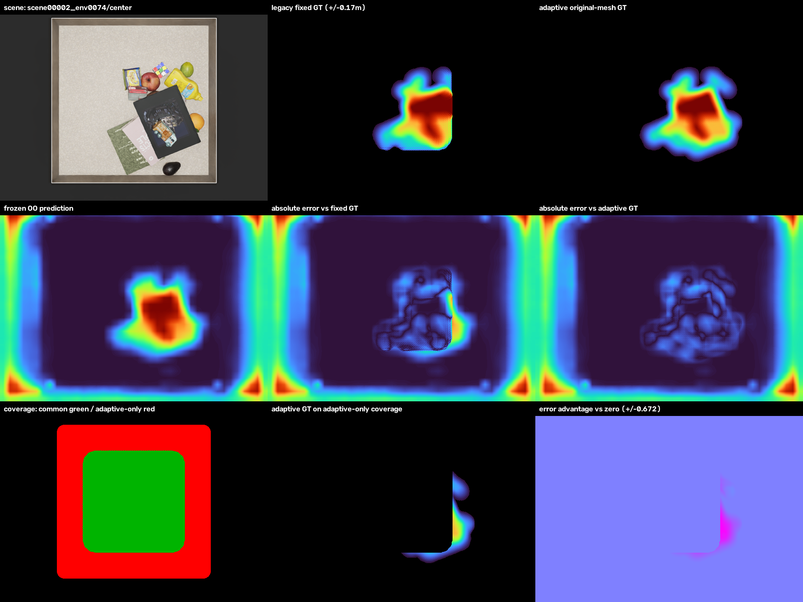

이 결과는 **Peach에서 기존 고정 pose 범위가 정상적인 예측 일부를 오류처럼 보이게 만들었다는 가설을 지지함**. 반면 모든 target의 zero-shot 성능이나 Occlusion Stream의 최종 구조가 검증된 것은 아님. Target 입력을 더 복잡하게 바꾼 조건도 기존 입력 대비 MAE `0.00029`, soft-IoU `0.00020`만 개선했고 8-scene bootstrap 구간이 0을 포함했으므로, 현재 단계에서는 모델 구조를 더 확장하지 않음.

**다음 Step:** Small/medium/large 대표 target의 adaptive GT를 먼저 생성하고, 복잡한 추가 구조 없이 기존 baseline을 재학습하여 5개 camera와 unseen target에서 확인함. 같은 방향이 재현되면 전체 target·scale GT를 갱신하고, 그 최종 결과를 기준으로 Occlusion Stream 본문과 Development Log의 후속 실험을 전반적으로 정리함.
