# 2D-PDM

### Zero-Shot Probability Distribution Mapping for Occluded Object Search in Cluttered Drawers

> **Research in progress**  
> RGB-D 관측으로 가려진 target object의 위치를 추론하고, 탐색 행동을 위한 pixel-wise probability map 생성

---

## Overview

이 연구는 서랍 속 더미에 가려진 target을 찾기 위해 **유사도·가림 가능성·장면 구조**를 서로 다른 feature로 표현하고, 이를 결합한 2D-PDM을 탐색 정책에 제공하려는 연구임. 세 stream이 각각 푸는 문제와 현재 검증 수준은 다름.

| Stream | 목적 | 현재 구현과 검증 범위 |
|---|---|---|
| [Similarity](#similarity-stream) | Target과 외형·의미가 관련된 가시 영역 찾기 | DINOv3 + SigLIP 구현, unseen target 정성 결과; 정량 일반화 평가 남음 |
| [Occlusion](#occlusion-stream) | 해당 target이 가려질 수 있는 위치 추론 | Adaptive GT로 full16 baseline 학습, 외부 target 1개 평가 |
| [Complexity](#complexity-stream) | 더미 내부 물체 간 구조 차이 표현 | Density pilot과 표현 진단 완료; 최종 구조·GT는 미확정 |

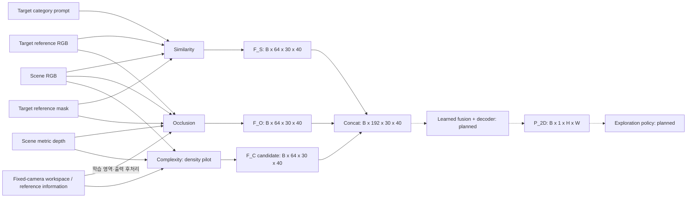

Target reference는 찾을 물체를 별도로 촬영한 입력임. Scene의 가려진 target을 segmentation해서 입력한다는 뜻이 아님. 현재 Similarity의 masked pooling과 Occlusion의 target geometry에는 reference mask가 필요함. Occlusion geometry는 고정 촬영 규격을 가정하며, camera별 workspace는 network 입력이 아니라 학습 영역 설정과 출력 후처리에 사용함. 각 본문에서 모델 입력·GT 전용 정보·외부 처리를 구분해 설명함.

세 feature를 같은 위치에서 channel 방향으로 연결하면 `64+64+64=192`개 값이 됨. 이 값을 어떤 방식으로 결합하고 학습할지는 아직 구현하지 않았음. 아래 식은 연결 계획이며 최종 fusion 구조가 확정됐다는 뜻이 아님.

```text
F_fuse = Fusion(Concat(F_S, F_O, F_C))       # planned
P_2D   = Sigmoid(Decoder(F_fuse))           # planned
```

**각 stream의 보조 출력은 최종 target 존재 확률과 다름.** Similarity는 관련성 점수, Occlusion은 정해진 pose 표집 조건의 가림 가능성, 현재 Complexity pilot은 가시 label 수와 점유율을 학습함. 이를 결합한 최종 위치 확률과 탐색 효용은 후속 검증 대상임.

각 본문은 **목적·입출력 → 구조 → 내부 모듈 → GT와 학습 → 핵심 설계 과정 → FAQ** 순서로 읽도록 구성함. 개별 실험 조건과 시행착오는 [Development Log](#development-log)에 보존함.

### 처음 읽는 사람을 위한 한 장면의 예

찾을 물체가 바나나이고, 현재 서랍에는 책·과일·포장식품이 겹쳐 있다고 가정해 보자. 로봇이 받는 **scene RGB**는 현재 camera에 보이는 색 영상이고, **scene depth**는 각 pixel에 보이는 표면의 깊이를 담은 영상이다. 별도로 준비한 **target reference RGB**는 “이 바나나를 찾아라”라고 알려 주는 사진이다. Target reference가 있다는 것이 현재 서랍에서 바나나의 위치를 이미 안다는 뜻은 아니다.

이때 세 stream은 같은 장면을 서로 다른 질문으로 해석한다.

| Stream | 이 예에서 묻는 질문 | 제공하려는 정보 | 이 출력만으로 알 수 없는 것 |
|---|---|---|---|
| Similarity | 바나나와 외형 또는 의미가 관련된 보이는 영역은 어디인가? | 과일처럼 target과 관련된 가시 영역의 단서 | 그 과일 아래에 실제 바나나가 있다는 사실 |
| Occlusion | 이 target 크기·형태라면 현재 더미의 어느 위치에서 가려질 수 있는가? | 관측 표면과 target 조건에 따른 가림 가능성의 단서 | 그곳에 target이 실제로 존재한다는 사실 |
| Complexity | 더미의 어느 부분에서 물체 구성·관계가 서로 다른가? | Target에 의존하지 않는 scene 구조의 단서 | 현재 pilot만으로 검증된 최종 복잡도 점수 |

이 표는 각 stream의 **목표 역할**을 설명한 예다. 세 모델이 이 예를 모두 해결했다는 실험 결과가 아니다. 특히 Complexity의 최종 정의와 세 stream을 결합하는 모델은 아직 완성되지 않았다. 현재 결과로 확인한 부분과 연구 목표는 각 본문에서 구분한다.

```text
Scene RGB + Target RGB/mask/text
    → Similarity → F_S ──────┐
                             │
Scene RGB-D + Target RGB/mask │
    → Occlusion  → F_O ──────┼──→ Fusion + decoder (계획) → P_2D → 탐색 정책 (계획)
                             │
Scene RGB-D + 고정 reference   │
    → Complexity → F_C ──────┘
                   (현재는 density pilot의 후보 feature)
```

위 target 자료 중 text prompt는 Similarity에서만 사용한다. Occlusion은 target RGB와 mask를 사용하며 Complexity는 target 정보를 받지 않는다. Target mask는 reference 사진에서 물체가 차지하는 pixel을 표시한 자료다. Scene 안의 숨겨진 target mask가 아니다. 또한 depth는 현재 보이는 표면만 알려 준다. 앞 물체 뒤에 무엇이 몇 개 있는지를 센서가 직접 보여 주는 입력이 아니다.

### 입력·정답·출력은 서로 다른 자료다

처음 볼 때 가장 혼동하기 쉬운 것은 “GT를 만들 때 사용한 정보가 추론에도 들어가는가?”이다. **GT(Ground Truth)는 학습할 목표값**이고, 모델 입력과 구분해야 한다. 이 프로젝트의 GT에는 시뮬레이션 정보와 연구자가 정한 규칙이 사용된다. 따라서 GT라는 이름이 붙었다고 정의의 타당성과 모든 label의 정확성이 자동으로 보장되는 것은 아니다.

| 자료 | 담고 있는 것 | 사용하는 단계 |
|---|---|---|
| Scene RGB | 현재 보이는 표면의 색·질감·외형 | 세 stream의 관측 입력 |
| Scene depth | 각 pixel에서 현재 보이는 표면의 깊이 | Occlusion과 Complexity 관측 입력 |
| Target RGB | 찾을 물체를 별도로 촬영한 사진 | Similarity·Occlusion의 검색 조건 |
| Target mask | Target reference에서의 물체 윤곽 | Similarity의 crop/pooling, Occlusion의 geometry 계산 |
| Target text | 사람이 제공한 이름·category 등의 설명 | Similarity의 SigLIP 의미 조건 |
| Empty depth / workspace | 빈 서랍의 깊이, camera에서 보이는 관심 영역 | Stream별 전처리·GT·학습 영역·후처리. 아래 각 stream에서 역할을 구분 |
| Scene segmentation / target mesh | 물체별 pixel label 또는 target의 시뮬레이션 형상 | 해당 GT와 일부 진단 생성. 학습 모델의 scene 입력과 구분 |
| GT map | 정의한 규칙에 따라 원하는 출력값을 배치한 지도 | Loss 계산과 평가 |
| Prediction map | 모델이 입력으로부터 계산한 값 | GT와 비교하거나 후속 탐색 입력으로 사용 |

학습과 추론의 차이는 다음과 같다. **학습**에서는 예측이 GT와 얼마나 다른지를 계산하여 일부 weight를 수정한다. **추론**에서는 학습된 weight를 그대로 두고 새 입력의 출력을 계산한다.

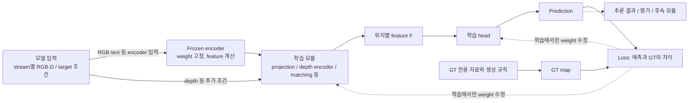

이 그림은 한 stream을 학습하는 일반적인 흐름이다. 현재 세 stream을 하나의 loss로 함께 학습한 것은 아니다. 점선의 weight 수정은 **trainable 부분에만** 적용된다. Frozen encoder에도 매번 새 이미지를 넣어 새 feature를 계산하지만 그 encoder의 weight는 바꾸지 않는다. “Frozen”은 같은 숫자만 내보낸다는 뜻이 아니다. 학습 가능한 부분은 고정된 표현을 현재 과제에 맞게 읽고 조합하는 방법을 배운다.

### 이미지가 feature map으로 바뀐다는 뜻

RGB 영상은 세 색 channel을 가진 숫자 배열이다. 한 sample이 `3×480×640`이면 빨강·초록·파랑의 세 배열이 각각 480행, 640열을 가진다. Depth의 한 channel은 색 밝기가 아니라 깊이값을 담는다. 모델 안에서 이 숫자는 여러 층의 계산을 거쳐 **feature**, 즉 과제에 사용할 내부 표현으로 바뀐다.

DINOv3 ViT-B/16은 입력을 한 변이 16px인 patch 단위로 처리한다. 여기서 **patch**는 영상의 작은 공간 구역, **token**은 그 구역을 모델 안에서 나타내는 vector다. 기본 scene은 `480×640`이므로 patch grid는 `30×40`이고 총 1,200개 위치가 생긴다.

```text
원본 영상                         Feature grid
480행 × 640열                     30행 × 40열
┌────┬────┬────┐                 ┌──────────┬──────────┬─────┐
│16px│16px│ ...│                 │768개 숫자  │768개 숫자  │ ... │
├────┼────┼────┤  encoder 계산 →  ├──────────┼──────────┼─────┤
│ ...│ ...│ ...│                 │768개 숫자  │768개 숫자  │ ... │
└────┴────┴────┘                 └──────────┴──────────┴─────┘

한 위치의 vector: [f_1, f_2, ... , f_768]
전체 배열: B × 768 × 30 × 40
```

그림의 칸 수는 설명용으로 줄였다. 실제로는 30×40개 위치가 있다. 중요한 것은 **공간 위치 수와 위치마다 들어 있는 숫자 수가 다르다**는 점이다. `30×40`은 어디인지를, `768`은 그 위치를 몇 개 숫자로 표현하는지를 나타낸다. `768`개 물체를 찾는다는 뜻이 아니다.

또한 transformer는 token끼리 정보를 주고받기 때문에, 한 위치의 feature에도 다른 위치의 문맥이 반영된다. Patch 간격이 16px라고 해서 해당 feature가 그 16×16 pixel만 보고 계산됐다고 해석하면 안 된다. Feature의 개별 축에 “책”, “높이”, “빨강” 같은 사람이 정한 이름이 자동으로 붙는 것도 아니다.

**Encoder 안에서는 무엇이 일어나는가?** ViT는 Vision Transformer의 약자다. 큰 흐름은 patch를 vector로 바꾸고, attention으로 여러 token의 정보를 교환하고, 각 token을 MLP로 변환하는 계산을 여러 block에서 반복하는 것이다. Attention은 입력에 따라 어떤 token의 정보를 얼마나 참고할지 계산하는 장치다. 그것만으로 물체별 segmentation이나 사람의 의미 이해를 완성한다는 뜻은 아니다.

```text
RGB patch의 pixel 값
      ↓ 학습된 patch embedding
위치별 token vector
      ↓ attention: 다른 token의 정보도 참고
      ↓ MLP: 각 token의 표현 변환
      ↓ 이런 block을 반복
중간 block에서 꺼낸 위치별 feature
```

DINOv3 ViT-B/16의 768-D는 이 backbone이 정한 표현 폭이다. `16×16×3=768`이라는 원래 RGB patch의 숫자 개수와 이 모델의 embedding 길이가 우연히 같아도, 출력이 원래 pixel 값을 그대로 펼쳐 놓은 vector라는 뜻은 아니다. Learned embedding과 여러 transformer block을 거쳐 값과 의미가 바뀐다. 다른 크기의 ViT는 다른 embedding 길이를 사용할 수 있다.

**사전학습(pretraining)**은 우리 GT를 학습하기 전에 다른 학습 과정에서 이미 weight를 얻었다는 뜻이다. 현재 프로젝트는 그 DINOv3·SigLIP weight를 고정하고, 그 출력으로 우리 map을 만드는 모듈을 학습한다. 예를 들어 “DINO layer 11을 사용한다”는 것은 12번째 block의 출력을 가져온다는 뜻이지 11-D vector라는 뜻이 아니다. 네 중간 layer를 사용해도 encoder 네 개를 새로 학습하는 것은 아니다.

### 이 문서의 tensor 표기는 어떻게 읽는가?

**Tensor**는 숫자를 여러 축으로 배열한 자료를 뜻한다. Vector는 축이 하나인 tensor이고, 영상과 feature map은 공간·channel 축을 함께 가진 tensor다. PyTorch의 이 코드에서는 영상·feature map을 주로 `B×C×H×W` 순서로 적는다.

| 표기 | 의미 | 이 프로젝트의 예시 |
|---|---|---|
| `B` | 한 번에 처리하는 sample 수, batch size | `B=16`이면 입력 sample 16개 |
| `C` | 한 공간 위치를 표현하는 숫자의 개수, channel 수 | DINO scene feature에서 `C=768` |
| `H,W` | 영상의 세로·가로 pixel 수 | 기본 scene `480×640` |
| `H_p,W_p` | Feature grid의 세로·가로 위치 수 | `30×40` |
| `ℓ` 또는 `l` | Backbone의 어느 중간 layer 출력인지 나타내는 index | DINO block index `2,5,8,11` |
| `(u,v)` | 영상 또는 feature grid의 한 위치 | 식마다 어느 grid인지 함께 설명 |
| `D` in `768-D` | Dimension, vector 길이 | Depth라는 뜻이 아님 |
| `B` in `ViT-B` | Backbone의 Base 모델 명칭 | Batch size `B`와 다른 표기 |

`B×768×30×40`과 `B×64×30×40`은 **같은 공간 격자에서 표현의 폭만 다른 것**이다. `1×1 Conv 768→64`가 이 변환을 수행할 수 있다. 반면 `30×40→480×640` 보간은 공간 격자를 늘리는 연산이다. 두 변화를 모두 “차원을 늘린다/줄인다”라고만 말하면 무엇이 바뀌는지 혼동하기 쉽다.

### 자주 나오는 연산을 숫자로 이해하기

아래는 각 모듈을 읽기 위한 공통 설명이다. 숫자 예시는 원리 설명용이며 실제 학습된 feature의 관측값이 아니다.

| 용어 | 무엇을 하는가? | 왜 쓰는가? |
|---|---|---|
| Encoder / backbone | 이미지 같은 원래 입력을 feature로 변환하는 앞부분 | 색 pixel 자체보다 현재 과제에 활용하기 쉬운 표현을 얻기 위함 |
| Head | Feature를 학습 목표의 출력으로 바꾸는 뒷부분 | 예를 들어 64개 feature를 유사도 점수 1개로 읽음 |
| Layer | 이전 표현을 다음 표현으로 바꾸는 한 단계 | 중간 layer마다 서로 다른 계산 단계의 정보를 얻을 수 있음 |
| Linear / projection | `y=Wx+b`로 입력 vector를 학습된 좌표로 변환 | Vector 길이를 맞추거나 다른 표현을 결합할 수 있도록 학습 |
| Pooling | 여러 위치의 값을 평균·가중 평균하여 요약 | Target 사진 전체를 대표하는 vector 하나를 만들 때 사용 |
| Broadcast | 같은 vector를 여러 공간 위치에 반복 | Scene의 모든 위치가 어떤 target을 찾는지 알게 함 |
| Concat | Vector들을 이어 붙임 | 서로 다른 단서를 버리지 않고 다음 모듈에 함께 전달 |
| Convolution, Conv | 같은 학습 가중치로 위치마다 channel 또는 이웃 관계를 계산 | 공간 위치를 유지하면서 표현을 변환 |
| MLP | Linear와 비선형 함수를 차례로 연결한 network | Geometry vector에서 FiLM 조절값처럼 새 vector를 계산 |
| Activation | ReLU·GELU 같은 비선형 변환 | Linear 연산만으로 표현하기 어려운 관계를 학습하게 함 |
| GroupNorm | Sample마다 channel을 그룹으로 나누고 각 그룹의 channel·공간 값으로 정규화 | 중간 feature의 수치 scale을 조절 |
| Logit / sigmoid | 제한 없는 출력 `z`를 `σ(z)=1/(1+exp(−z))`로 바꿈 | Auxiliary map을 `0–1` 범위로 출력 |
| Loss / gradient | 예측 오차를 숫자로 만들고 weight 수정 방향을 계산 | Trainable 모듈이 GT를 더 잘 예측하게 학습 |

**Projection은 “앞의 숫자 몇 개만 남기는 것”이 아니다.** 예를 들어 두 입력을 세 출력으로 바꾸는 `Linear(2,3)`에서는 출력 3개 각각이 입력 2개 전체의 다른 가중합이다. `W`의 모양은 `3×2`, `b`의 길이는 3이다. 이를 일반화한 것이 Similarity의 `1152→768` semantic projection이다.

**Normalization은 어느 값을 정규화하는지에 따라 다르다.** RGB를 `/255` 하고 mean/std로 바꾸는 것은 pixel 입력의 scale 조정이다. Vector의 **L2 normalization**은 vector 길이를 1로 맞추는 연산이다. 예를 들어 `(3,4)`의 길이는 5이므로 정규화하면 `(0.6,0.8)`이다. 방향은 유지되고 길이 정보는 제거된다. GroupNorm은 중간 feature의 그룹 통계로 정규화하는 다른 연산이다.

**Cosine similarity**는 두 vector의 방향이 얼마나 비슷한지 계산한다. 두 vector를 L2 정규화한 뒤 같은 좌표끼리 곱해 더하면 cosine이 된다. 예를 들어 `(1,0)`과 `(0.8,0.6)`은 모두 길이가 1이므로 cosine은 `1×0.8+0×0.6=0.8`이다. 이 수식은 두 vector를 같은 좌표 표현으로 비교할 때 의미가 있다. 서로 다른 encoder의 원본 vector를 길이만 맞춰 무조건 비교해도 된다는 뜻은 아니다.

**Broadcast·concat·덧셈은 서로 다르다.**

```text
Target vector: [a,b]               Scene의 각 위치: [x,y,z]

Broadcast: 모든 위치에 [a,b] 반복
Concat:    [x,y,z] + [a,b]를 이어 붙임 → [x,y,z,a,b], 길이 5
Add:       [x,y] + [a,b]             → [x+a,y+b], 길이 2
```

표기의 `+`가 무엇을 뜻하는지 확인해야 한다. Concat은 정보를 별도 channel로 남기고, 덧셈은 같은 길이의 좌표를 합친다. Similarity에서 semantic과 appearance를 더하는 것, scene과 query를 concat하는 것은 목적과 결과가 다른 단계다.

**`1×1 Conv`와 `3×3 Conv`도 다르다.** `1×1`은 같은 위치의 channel만 섞는다. `3×3`은 현재 위치와 주변 여덟 위치를 함께 사용한다. 현재 30×40 격자의 한 칸은 원 영상에서 16px 간격이지만, Conv 전에 backbone이 이미 넓은 문맥을 사용했으므로 이 숫자만으로 전체 receptive field를 정할 수는 없다.

```text
3×3 Conv가 함께 읽는 feature 위치
┌───┬───┬───┐
│ ↘ │ ↓ │ ↙ │
├───┼───┼───┤
│ → │ ● │ ← │   ● 위치의 출력을 계산
├───┼───┼───┤
│ ↗ │ ↑ │ ↖ │
└───┴───┴───┘
```

### Feature 64개와 확률 map 한 장은 왜 따로 나오는가?

각 stream은 위치마다 **64개의 내부 feature**를 만들고, 자체 학습용 head가 이를 한 개 또는 여러 개의 점수로 바꾼다. 여러 정보를 한 숫자로 압축하기 전의 표현을 다른 stream과 결합할 여지를 남기기 위한 구성이다. 현재 이 결합의 효용까지 검증한 것은 아니다.

| 출력 | Shape | 실제 의미 |
|---|---|---|
| `F_S` | `B×64×30×40` | Similarity GT를 예측하도록 학습한 중간 표현 |
| `P_S` | `B×1×30×40` | Target과 scene의 정의된 관계 점수 |
| `F_O` | `B×64×30×40` | Occlusion GT를 예측하도록 학습한 중간 표현 |
| `P_O` | `B×1×30×40` | 정해진 candidate pose 분포의 가림 비율 GT를 근사한 값 |
| 현재 `F_C` | `B×64×30×40` | Density pilot의 학습 feature 55개 + 직접 depth cue 9개 |
| Complexity auxiliary maps | `B×4×30×40` | Count score 3개와 occupancy 1개 |

**0–1이라는 범위만으로 같은 뜻의 확률이 되는 것은 아니다.** Similarity의 0.8은 정한 관계 점수일 수 있고, Occlusion GT의 0.8은 해당 pixel을 덮는 pose 중 가림 조건을 만족한 비율이며, occupancy의 0.8은 유효 영역의 80%가 물체 pixel이라는 뜻이다. 이 값들을 단순히 곱하거나 평균하면 최종 target 존재 확률이 된다는 규칙은 아직 정하지 않았다.

Sigmoid는 각 위치를 독립적으로 0–1 범위에 넣는다. 두 위치가 각각 0.7과 0.8일 수도 있으므로 map 전체의 합이 1인 확률 분포를 만드는 연산은 아니다. 최종 2D-PDM의 GT·loss·해석과 calibration은 fusion 설계에서 별도로 정해야 한다.

공간 격자가 같은 세 feature를 concat하면 `64+64+64=192` channels가 된다. **같은 shape를 맞춘 것은 연결할 수 있는 형식을 맞춘 것이며, 각 stream의 feature 의미가 자동으로 정렬됐다는 뜻은 아니다.** 최종 fusion network와 decoder는 이 결합을 어떻게 사용할지 학습해야 하고, 현재는 그 단계가 미구현이다.

---

## From Shelf Search to Drawer Search

기존 선반 환경 연구를 비정형 drawer 환경으로 확장함.

> H. Jeon et al., *A study on deep reinforcement learning-based exploration intelligence for occluded object search*, Engineering Applications of Artificial Intelligence, 2026.

기존 연구는 similarity와 occlusion 기반 column-wise distribution을 사용함. 물체 유사도를 수동 정의한 category score에 의존했기 때문에, 학습에 없던 물체로 확장되는 zero-shot 탐색 성능을 확인하지 못했음.

주요 확장:

- 정규적인 shelf column에서 **비정형 cluttered drawer**로 확장
- Column-wise distribution에서 **pixel-wise 2D-PDM**으로 확장
- DINOv3의 dense appearance와 SigLIP의 language-aligned semantics 결합
- 학습하지 않은 target instance를 입력할 수 있는 zero-shot target conditioning
- Similarity와 Occlusion에 scene-level **Complexity stream** 추가

---

## Similarity Stream

> **현재 상태:** DINOv3–SigLIP no-shortcut 구조 구현, unseen target의 정성 활성화 확인. 공식 final checkpoint 지정과 정량 object-held-out benchmark는 남아 있음.

### 1. 목적과 입출력

Similarity stream은 **“Scene의 어느 위치에 target 자체 또는 의미적으로 관련된 물체가 보이는가?”**를 표현함. DINOv3의 위치별 visual feature에 target의 외형과 SigLIP의 image/text 의미 표현을 결합하고, 학습한 head로 위치별 similarity score를 예측함. 이는 보이는 영역의 관계를 표현하는 stream이며, target이 더미 뒤에서 가려질 수 있는 위치는 [Occlusion Stream](#occlusion-stream)이 담당함.

#### Banana를 찾는 상황에서 시작하기

서랍 사진에는 사과, 오렌지, 노란 장난감, 책이 보이고, 우리가 찾으려는 물체는 별도의 사진으로 주어진 Banana라고 생각해 보자. Scene는 **검색할 서랍 전체의 사진**, target reference는 **무엇을 찾는지 알려 주는 물체 사진**임. 두 사진은 역할이 다르므로 target을 scene에 붙여 하나의 이미지로 만드는 방식이 아님.

가장 단순하게 노란색만 찾으면 노란 장난감도 높은 점수를 받을 수 있음. 반대로 바나나와 색·모양이 다른 사과는 낮게 나올 수 있음. 이 연구의 Similarity는 exact target뿐 아니라 같은 category 및 지정한 관련 category도 함께 표현하려 하므로, 물체의 외형과 의미를 동시에 이용할 필요가 있음. 그렇다고 fruit라는 단어만 쓰면 어느 위치에 물체가 있는지 알 수 없으므로 scene의 위치별 feature도 필요함.

```text
찾을 물체: Banana reference image         검색할 관측: Drawer RGB
         + target mask                    사과 / 오렌지 / 노란 toy / 책
         + 선택한 text 조건                           │
                  │                                   │
            무엇을 찾는가?                      어디에 무엇이 보이는가?
                  └──────── 위치별로 함께 비교 ────────┘
                                      │
                         scene의 위치별 similarity score
```

이 예는 입력과 계산을 따라가기 위한 설명임. Banana는 기존 16개 training target 중 하나가 아니며, 뒤에서 사용하는 작은 vector·cosine·score 숫자는 별도로 표시한 **가상 계산 예제**임. 실제 보존된 Banana 결과와 그 증거 범위는 정성 결과 부분에서 구분함.

#### 먼저 알아둘 용어

| 용어 | 이 문서에서 뜻하는 것 | Banana 예에서의 역할 |
|---|---|---|
| Encoder / 인코더 | 이미지나 문장을 신경망으로 처리하여 숫자 표현으로 바꾸는 모듈 | Banana 사진을 그대로 비교하는 대신 계산 가능한 feature를 만듦 |
| Feature / embedding / vector | 입력의 특징을 담은 실수들의 배열. `768-D vector`는 실수 768개를 순서대로 모은 것 | Banana의 외형·문맥을 여러 좌표에 나누어 표현. 좌표마다 고정된 자연어 이름이 붙지는 않음 |
| Backbone | 여러 task에서 재사용하는 기본 특징 추출 신경망 | DINOv3가 scene와 target의 visual feature를 제공 |
| Frozen | 기존 parameter를 고정하여 이번 학습에서 바꾸지 않는 상태 | 사진이 바뀌면 feature는 달라지지만, DINOv3/SigLIP의 가중치는 갱신하지 않음 |
| Layer / block | 신경망이 입력을 단계적으로 변환하는 계산 단계 | DINOv3의 서로 다른 네 처리 단계에서 feature를 꺼냄. 서로 다른 camera나 물리적 깊이를 뜻하지 않음 |
| Patch / token | 이미지를 나눈 격자 단위와, 그 위치를 나타내는 vector | Scene의 `16×16` pixel 구역마다 대응하는 DINO vector가 있음 |
| Query / 검색 조건 | Scene와 비교할 target의 숫자 표현 | Banana의 appearance와 semantic 정보를 합쳐 만든 vector |
| Mask | 관심 있는 pixel은 1, 나머지는 0인 지도 | Target reference에서 Banana가 차지한 부분을 표시. 현재 입력에서 제공받는 정보 |
| Head | Backbone feature를 이번 task의 출력으로 바꾸는 학습 모듈 | Scene/target feature를 받아 similarity map을 만듦 |
| Tensor / channel | 여러 축을 갖는 숫자 배열 / 같은 위치에 놓인 feature 성분 축 | `768×30×40`은 30행×40열의 각 위치에 숫자 768개가 있다는 뜻 |

RGB 입력의 `3 channels`는 red·green·blue라는 알려진 의미가 있음. 그러나 DINO 출력의 `768 channels`는 그처럼 사람이 정한 768개 물체 속성 목록이 아님. Pixel의 단위는 영상의 격자 위치이고, embedding 좌표와 similarity score는 meter 같은 물리 단위를 갖지 않음.

| 구분 | 현재 구현의 입력·출력 | 의미 |
|---|---|---|
| Scene 입력 | RGB `B×3×480×640` | 검색할 scene. Similarity에는 scene depth나 scene segmentation을 입력하지 않음 |
| Target 입력 | Reference RGB, target mask, 물체 설명·category prompt | Mask로 물체 crop과 appearance pooling 범위를 정하고, image/text로 검색 조건을 구성 |
| 학습 feature `F_S` | `B×64×30×40` | 이후 fusion에 제공하려는 위치별 표현. 현재 model의 `fused` 반환값 |
| Score map `P_S` | `B×1×30×40`, 필요시 `B×1×480×640`로 확대 | Target–scene 관계 GT를 회귀한 `0–1` score. 보정된 target 존재 확률은 아님 |

Tensor의 `B`는 batch size이며, `ViT-B`의 `B`는 backbone의 Base 모델 크기를 뜻함. 현재 target reference loader는 `target_dir/rgb`, `target_dir/seg`, `mapping.json`을 읽음. 따라서 raw target RGB 한 장만으로 crop과 mask를 자동 생성하는 배포 경로까지 구현된 상태는 아님.

### 2. 전체 모델 구조

먼저 어느 모듈이 무엇을 맡는지 읽고, 아래 전체 구조도에서 그 정보가 어디서 합쳐지는지 따라가면 됨. **DINOv3는 scene 위치와 target 외형을, SigLIP은 target의 image/text 의미 조건을 제공**하며, 두 정보를 실제 GT score에 연결하는 부분은 학습되는 projection과 matching head임.

| Component | 실제로 받는 입력 | 제공하는 정보 | 필요한 이유와 다음 단계 |
|---|---|---|---|
| DINOv3 Scene Encoder | 서랍의 RGB 전체 영상 | 위치가 보존된 네 layer의 dense visual feature | 검색 결과를 scene의 어느 위치에 놓을지 유지하며, 각 위치를 target query와 비교할 수 있게 함 |
| DINOv3 Target Encoder | Mask로 정한 RGB crop | Target view의 네 layer별 appearance | 찾는 물체의 실제 모습이 query에 남도록 함. Mask pooling으로 한 vector씩 요약 |
| SigLIP Vision Encoder | Target RGB crop 전체 | Target image의 전역 semantic representation | 외형 특징 외에 사전학습 image/text 공간의 정보를 query에 제공 |
| SigLIP Text Encoder | 물체 설명과 category 문장 | 언어로 주어진 semantic condition | 사진만으로 모호할 수 있는 의미 조건을 추가. 위치를 직접 예측하지는 않음 |
| Layer-wise semantic projection | Image/text를 결합한 1152-D vector | DINO query에 합산할 네 개의 768-D vector | 서로 다른 표현을 사용할 수 있도록 학습되는 변환. 단순 자르기·0 채우기가 아님 |
| Scene–target interaction | Scene vector, hybrid query | Raw feature 둘과 명시적인 cosine cue | Head에 “현재 위치의 특징 / 찾는 조건 / 직접 유사도”를 동시에 제공 |
| MatchingBlock ×4 | 각 layer의 interaction map | 위치별 64-D 학습 feature | 이웃 위치까지 함께 읽고 GT relation을 예측하는 데 필요한 조합을 학습 |
| Layer fusion + score head | 네 MatchingBlock 출력 | `F_S`와 score map `P_S` | 네 처리 단계의 정보를 섞은 뒤 한 위치당 최종 score 하나로 읽어 냄 |

여기서 dense라는 말은 scene 전체를 vector 하나로 요약하지 않고 여러 공간 위치에 vector를 유지한다는 뜻임. Target branch는 물체 하나를 query로 표현하는 목적이므로 마지막에 공간 위치를 pooling하지만, scene branch는 답을 놓을 위치가 필요하므로 `30×40` grid를 유지함.

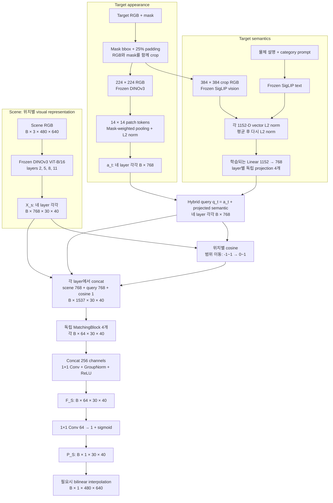

기준 코드는 [backbone.py](backbone.py), [target_utils.py](target_utils.py), [similarity_model.py](similarity_model.py), [train_similarity_v2.py](train_similarity_v2.py)임. Scene와 target appearance는 같은 frozen DINOv3 backbone을 사용함. SigLIP은 target 조건을 만들 때만 사용하며, scene를 SigLIP으로 다시 인코딩하지 않음.

| 단계 | Tensor 변화 | 차원과 계산의 의미 |
|---:|---|---|
| 1 | Scene RGB → layer별 `B×768×30×40` | `480/16=30`, `640/16=40`: 총 1,200개 위치에 768-D DINO token |
| 2 | Target crop `B×3×224×224` → layer별 `B×768×14×14` | `224/16=14`: 196개 patch를 물체 mask의 포함 비율로 pooling |
| 3 | Pooling → layer별 `a_t^ℓ: B×768` | Target view 하나를 나타내는 L2-normalized appearance vector |
| 4 | SigLIP image/text 각각 `B×1152` → `s: B×1152` | 두 vector를 각각 정규화하고 평균한 뒤 다시 정규화 |
| 5 | 독립 `Linear(1152,768)` 4개 → layer별 `s_t^ℓ: B×768` | 각 DINO layer에서 사용할 semantic condition으로 학습 변환 |
| 6 | `q_t^ℓ=a_t^ℓ+s_t^ℓ` → `B×768` | 합산 후에는 다시 정규화하지 않는 hybrid query |
| 7 | Query broadcast + patch cosine → `B×1537×30×40` | Raw scene `768` + raw query `768` + shifted cosine `1` |
| 8 | MatchingBlock → 네 개의 `B×64×30×40` | Layer별 입력을 주변 문맥과 함께 해석 |
| 9 | Concat `B×256×30×40` → fusion → `F_S: B×64×30×40` | `256=4×64`; `1×1 Conv`로 네 layer의 정보를 혼합 |
| 10 | Head → logit `B×1×30×40` → sigmoid | 위치별 similarity score. Full-resolution 표시는 bilinear 확대 |

#### Banana 예를 입력부터 출력까지 한 번 따라가기

1. **Scene RGB를 읽음.** 한 장이면 `B=1`이고 입력은 `1×3×480×640`임. DINOv3는 1,200개 위치마다 768개 숫자를 출력하며, 이 지도를 layer 2/5/8/11에서 각각 하나씩 얻음. 아직 Banana를 찾는 조건은 scene encoder에 들어가지 않았음.
2. **Target RGB와 mask를 준비함.** Banana reference의 mask에서 bounding box를 구하고 여백을 포함해 crop함. Crop을 `224×224`로 만든 뒤 같은 DINOv3에 넣으면 `14×14` 위치의 target feature가 나옴. Mask가 많이 포함된 patch에 더 큰 weight를 주어 layer별 768-D appearance vector 하나로 요약함.
3. **Target의 의미 조건을 만듦.** Crop RGB를 SigLIP 규격 `384×384`로 별도 resize하고, 사용할 text가 있으면 문장도 인코딩함. Image와 text에서 얻은 1152-D vector를 각각 정규화하고 평균하여 하나의 semantic vector로 만듦. Image-only mode에서는 text를 합산하지 않음.
4. **네 hybrid query를 만듦.** 같은 semantic vector를 네 개의 독립 projection에 통과시킴. Layer 2에서는 layer 2 appearance에 해당 projection을 더하고, 다른 layer에서도 같은 방식으로 각각 query를 만듦. Query는 모든 scene에 고정된 일반 category vector가 아니라 이번 target 입력으로 만든 검색 조건임.
5. **위치마다 비교함.** Scene의 왼쪽 위부터 오른쪽 아래까지 1,200개 patch에 같은 query를 대입하여 cosine을 계산함. 동시에 그 위치의 raw scene feature와 query도 남겨 1,537-channel interaction을 만듦.
6. **이웃과 여러 layer를 함께 읽음.** 각 MatchingBlock이 `3×3` 이웃의 interaction을 처리하여 64개 feature를 만들고, 네 결과를 합쳐 최종 64-channel `F_S`를 얻음. “한 곳만 비슷한가, 주변에도 관련된 feature가 이어지는가”를 구분할 수 있는 계산 경로가 여기 있음.
7. **Score map으로 읽음.** 마지막 head가 각 위치의 64개 feature를 logit 하나로 바꾸고 sigmoid로 `0–1` 범위에 넣음. 이것이 `30×40` score map임. 사람에게 보여 줄 때만 `480×640`으로 확대함. 사과·오렌지·장난감의 실제 출력 순서는 학습 결과와 입력에 달려 있으며, 이 설명 순서가 성공을 보장하지는 않음.

이 과정에서 scene encoder를 target마다 다시 학습하는 것이 아님. Frozen scene feature를 얻은 뒤 어떤 query와 비교하는지에 따라 interaction과 head 출력이 달라짐. 현재 trainer가 같은 scene의 feature를 target별로 영구 cache하는지 여부는 별개의 실행 구현 문제이며, 실제 cache 경로는 아래에 명시함.

### 3. 내부 모듈과 선택 이유

#### 1. DINOv3: 위치별 scene 표현과 target 외형

DINOv3 ViT-B/16은 12개 transformer block과 768-D embedding을 사용함. 코드의 layer index `2, 5, 8, 11` 네 중간 출력을 `norm=True`로 받아 서로 다른 처리 단계의 정보를 유지함. 초기 layer는 형태, 후기 layer는 의미만 담당한다고 고정할 수는 없으며, 네 layer를 쓰는 선택의 개별 효과는 ablation으로 확인해야 함.

Layer index는 0부터 시작하므로 `2,5,8,11`은 12개 block 중 3·6·9·12번째 처리 단계에 해당함. 한 사진에서 여러 layer를 꺼내는 것은 서로 다른 사진 네 장을 넣는 것과 다름. 앞 단계에서 계산한 표현을 다음 단계가 계속 변환하는 동안, 중간 결과 네 개를 관찰하는 방식임.

```text
한 장의 RGB
  → patch embedding → block 0 → block 1 → block 2 → ... → block 5 → ... → block 8 → ... → block 11
                                           │                │                │                 │
                                   feature map 2     feature map 5     feature map 8      feature map 11
                                   모두 768-D, scene에서는 같은 30×40 공간 격자
```

768이라는 길이는 선택한 backbone의 embedding 폭임. 사람이 그중 일부를 “노란색”, 일부를 “과일”로 배정한 것이 아님. 사전학습이 만든 좌표를 그대로 이용하면서, 이 task에서는 어떤 조합이 유용한지 작은 head가 학습함.

Target은 mask의 bounding box에서 높이·너비 각각의 25%를 양쪽에 padding하고 이미지 경계에서 잘라냄. **RGB 바깥을 검게 지우는 방식이 아니라 RGB와 mask를 같은 영역으로 crop**함. DINO 입력 RGB는 `224×224`로 bilinear resize하고 mask는 nearest-neighbor resize함. Scene와 target RGB에는 같은 ImageNet normalization을 적용함.

예를 들어 Banana mask의 bbox가 가로 80px, 세로 120px라면 경계에 걸리지 않는 경우 좌우 각각 20px, 위아래 각각 30px를 더해 `120×180` crop을 만듦. 이를 현재 코드는 종횡비를 유지한 padding이 아니라 `224×224` 정사각형으로 직접 resize함. Mask는 이 crop에서 Banana가 있던 위치를 함께 옮기기 위한 입력임. RGB를 mask로 지우지 않으므로 crop의 배경도 encoder의 문맥에 들어갈 수 있으며, 뒤의 pooling만으로 이런 영향이 완전히 없어지는 것은 아님.

Pixel mask `M`을 `16×16` average pooling하면 각 target patch가 물체를 포함하는 비율 `r_ij`가 됨. 이를 합이 1인 weight로 바꾸고 196개 patch vector를 가중 평균함.

$$
r_{ij}=\frac{1}{256}\sum_{(x,y)\in\mathrm{patch}(i,j)}M(x,y),
\qquad
w_{ij}=\frac{r_{ij}}{\sum_{p,q}r_{pq}},
\qquad
a_t^{\ell}=\mathrm{L2Norm}\!\left(\sum_{i,j}w_{ij}T_t^{\ell}(:,i,j)\right).
$$

예를 들어 물체가 patch의 절반을 차지하면 `r_ij=0.5`이므로 경계 patch도 포함 비율만큼 기여함. Mask가 사실상 비어 있으면 코드에서는 전체 patch의 균등 pooling으로 fallback함. 이 pooling은 target의 공간 배치를 vector 하나로 요약하므로, target–scene의 세밀한 patch correspondence를 보존하는 방법은 아님.

**Mask-weighted pooling**은 여러 위치의 vector를 mask 비율에 따라 하나로 모으는 연산임. 아래는 196개 patch 대신 세 개만 남긴 설명용 예임.

```text
Target patch                 A             B             C
Mask 포함 비율 r            1.0           0.5           0.0
합이 1인 weight w           2/3           1/3           0

정규화 전 target vector = (2/3)×T_A + (1/3)×T_B + 0×T_C
```

`T_A`, `T_B`, `T_C`는 각각 768개 숫자를 가진 vector임. 첫 번째 좌표끼리 가중 평균하고, 두 번째 좌표끼리 가중 평균하는 일을 768번 수행하므로 출력 길이는 768로 유지됨. Patch 수 196이 embedding 길이 768에 더해지거나 곱해지는 것이 아님.

그다음 **L2 normalization**은 vector의 방향을 유지하면서 길이를 1로 만드는 연산임. 2-D 예로 `[3,4]`의 길이는 `sqrt(3²+4²)=5`이므로 정규화하면 `[0.6,0.8]`임. `[6,8]`도 같은 방향이므로 같은 결과를 얻음.

$$
\mathrm{L2Norm}(v)=\frac{v}{\max(\lVert v\rVert_2,\epsilon)},
\qquad \lVert v\rVert_2=\sqrt{\sum_k v_k^2}.
$$

이것은 각 좌표를 `0–1`로 만드는 min–max 정규화가 아님. 음수 좌표는 남을 수 있음. 또한 DINO 중간 출력을 받을 때의 `norm=True`는 backbone의 LayerNorm 적용을 뜻하며, 여기의 “vector 길이를 1로 만드는 L2 normalization”과 별개 연산임.

DINO token에는 self-attention을 통한 주변·전체 문맥이 이미 반영됨. 따라서 위치가 `16×16` patch grid에 대응한다고 해서 그 token이 해당 256 pixel만 보고 만들어졌다는 뜻은 아님. Backbone은 CLS token도 반환하지만 현재 Similarity head와 target appearance pooling에서는 사용하지 않음.

#### 2. SigLIP: 외형만으로 부족했던 의미 조건 보완

초기 DINO appearance matching과 CLS category prototype에서 외형이 다른 unseen target의 category 관계가 불안정했기 때문에, language와 정렬된 SigLIP image/text 표현을 추가함. 여기서 SigLIP은 similarity 정답 숫자를 생성하는 모델이 아니라 **target query를 보완하는 frozen encoder**임.

사용 checkpoint는 `google/siglip-so400m-patch14-384`이며, 현재 코드가 사용하는 image/text `pooler_output`은 각각 1152-D임. `patch14`는 SigLIP vision encoder의 patch 크기, `384`는 이미지 입력 크기이고 `SO400M`은 400-D feature라는 뜻이 아님. 같은 crop을 DINO는 `224×224`, SigLIP은 `384×384`로 따로 resize하는 이유는 각각의 입력 규격이 다르기 때문임. SigLIP RGB는 mean/std `0.5/0.5`로 정규화하며, mask로 pixel을 지우지 않은 crop 전체를 입력함.

학습에서는 target별 center reference image 한 장과 다음 형식의 text를 사용함.

```text
a photo of {object_description}, a type of {category}

예: a photo of an apple, a type of fruit
```

`TARGET_LABELS`의 설명은 사람이 지정함. 설명이 없는 target은 category 문장으로 fallback하며, 책 네 개처럼 서로 같은 설명을 쓰는 경우도 있으므로 text가 항상 instance identity를 구별해 주는 것은 아님. 현재 학습 경로에서 category 정보는 외부 조건임.

$$
s_{\mathrm{img}}=\mathrm{L2Norm}(\mathrm{SigLIP}_{\mathrm{image}}(I_t)),
\qquad s_{\mathrm{text}}=\mathrm{L2Norm}(\mathrm{SigLIP}_{\mathrm{text}}(p_t)),
$$
$$
s=\mathrm{L2Norm}\!\left(\frac{s_{\mathrm{img}}+s_{\mathrm{text}}}{2}\right),
\qquad s_t^{\ell}=W^{\ell}s+b^{\ell},
\qquad q_t^{\ell}=a_t^{\ell}+s_t^{\ell}.
$$

네 projection은 각각 `Linear(1152,768)`이며 가중치를 공유하지 않음. 출력 좌표 하나도 1152개 입력의 학습된 가중합임. 이 변환은 차원을 맞추면서 semantic 정보를 head가 활용하도록 학습하는 경로이며, 차원이 같아졌다는 사실만으로 두 latent space가 완전히 정렬됐다고 주장하지 않음. 정렬을 직접 감독하는 별도 loss 없이 최종 similarity-map MSE를 통해 학습됨.

`Linear`는 입력 vector를 weight 행렬로 곱하고 bias를 더하는 연산임. Layer별 projection의 `W^ℓ`는 `768×1152`, `b^ℓ`는 768개 숫자임. 예를 들어 출력의 k번째 좌표는 다음처럼 만들어짐.

$$
s_{t,k}^{\ell}=\sum_{j=1}^{1152}W_{kj}^{\ell}s_j+b_k^{\ell}.
$$

입력 1152개 중 앞의 768개만 고르는 연산이 아니라, 각 출력 좌표가 입력 전체를 서로 다른 weight로 조합함. 그래서 DINO layer마다 필요한 semantic 변환이 다를 가능성을 표현할 수 있음. 다만 독립 projection 네 개가 공유 projection 하나보다 좋다는 주장은 별도 비교가 필요함.

```text
SigLIP image vector: 1152개 ── L2 norm ─┐
                                      ├─ 좌표별 평균 ─ L2 norm ─ s: 1152개
SigLIP text vector : 1152개 ── L2 norm ─┘                           │
                                  ┌───────────────┬───────────────┼───────────────┐
                              Linear_2        Linear_5        Linear_8        Linear_11
                              1152→768        1152→768        1152→768        1152→768
                                  │               │               │               │
                         + DINO a_2      + DINO a_5      + DINO a_8      + DINO a_11
                                  │               │               │               │
                                 q_2             q_5             q_8             q_11
```

Image/text 평균은 같은 SigLIP 모델의 두 표현을 결합하는 선택임. DINO와 SigLIP을 곧바로 평균하는 것이 아님. 같은 SigLIP 공간이라도 두 정보가 항상 동일하거나 단순 평균이 최적이라는 뜻은 아니므로 image-only, text 조건 변화, image+text를 통제해 비교할 필요가 있음.

`s_t^ℓ`와 합산 query `q_t^ℓ`는 정규화하지 않음. Cosine 경로에서만 query의 L2 norm을 맞추고, MatchingBlock에는 raw query를 전달함. 따라서 query의 방향은 cosine에, 방향과 크기는 raw interaction 입력에 반영됨. Center image 하나가 semantic 조건을 대표한다는 선택도 viewpoint invariance가 실험적으로 보장됐다는 뜻은 아님.

#### 3. Scene–target interaction: 직접 유사도와 원본 feature 함께 제공

각 layer에서 scene의 1,200개 위치마다 hybrid target query와 cosine을 계산함. Scene 전체를 scalar 하나로 압축하지 않음.

$$
c^{\ell}(u,v)=\frac{X_s^{\ell}(:,u,v)^{\mathsf T}q_t^{\ell}}
{\lVert X_s^{\ell}(:,u,v)\rVert_2\lVert q_t^{\ell}\rVert_2},
\qquad \widehat c^{\ell}(u,v)=\frac{c^{\ell}(u,v)+1}{2}.
$$

`c`는 `−1–1`, shifted cosine `ĉ`는 `0–1` 범위임. 이 범위 이동은 순위를 바꾸지 않으며 `ĉ` 자체를 target 존재 확률로 만들지도 않음. 각 위치에 같은 query를 broadcast하고 다음과 같이 concat함.

Cosine은 두 vector가 향하는 **방향**을 비교함. 2-D 설명용 예에서 target query가 `[1,0]`이면 scene vector `[1,0]`과의 cosine은 1, `[0,1]`과는 0, `[-1,0]`과는 −1임. 현재 head에 넣는 shifted cosine은 각각 `1`, `0.5`, `0`이 됨. 따라서 shifted score `0.5`는 cosine상 직교라는 뜻이지, 실제 target일 확률 50%라는 뜻이 아님.

**Broadcast**는 query의 값을 바꾸지 않고 scene의 모든 위치에서 같은 vector를 사용할 수 있게 펼치는 것임. **Concat**은 서로 다른 vector를 더하지 않고 좌표 목록의 뒤에 이어 붙이는 연산임. 두 연산의 차이는 아래 작은 예에서 볼 수 있음.

```text
설명용 3-D scene vector x = [2, 3, 4]
설명용 3-D target query q = [5, 6, 7]
위 두 vector의 shifted cosine cue c ≈ [0.99575]

덧셈 x+q       = [7, 9, 11]                 → 길이 3, 각 좌표를 합침
Concat[x,q,c] ≈ [2,3,4, 5,6,7, 0.99575]       → 길이 7, 원본 정보를 별도 좌표로 유지

실제 구현은 768 + 768 + 1 = 1537 channels
```

```text
Z^ℓ(u,v) = Concat[raw scene feature, raw target query, shifted cosine]
channels =              768       +       768      +       1       = 1537
```

Cosine 한 개는 768-D vector 관계를 요약한 값이므로, 서로 다른 scene feature가 같은 cosine을 가질 수 있음. Raw scene와 query도 주면 head가 무엇을 찾는지, 현재 위치에 어떤 feature가 있는지, 직접 유사도가 얼마인지를 함께 이용할 수 있음. 이는 배경의 우연한 고유사도를 줄이거나 관련 영역을 강화하도록 학습할 여지를 주는 설계이며, 각 입력의 기여가 독립 ablation으로 모두 입증된 상태는 아님. 현재 trainer는 `category_dim=0`을 사용하므로 과거 CLS category probability channel은 1537개에 포함되지 않음.

같은 query가 모든 위치에 들어가더라도 출력이 전부 같아지지는 않음. 오른쪽의 orange patch와 왼쪽의 book patch에서는 scene vector가 다르고 cosine도 달라짐. Head는 같은 검색 조건을 서로 다른 위치의 관측과 결합하여 각각의 score를 계산함.

```text
동일한 query만 공간 위치마다 복사하여 사용:

q: 768개 ──┬→ Concat[X(0,0),   q, c(0,0)]   → Z(0,0):   1537개
           ├→ Concat[X(0,1),   q, c(0,1)]   → Z(0,1):   1537개
           │                     ...
           └→ Concat[X(29,39), q, c(29,39)] → Z(29,39): 1537개

X(u,v)는 해당 위치의 scene feature 768개만 사용함.
c(u,v)는 그 X(u,v)와 q로 계산한 shifted cosine cue 1개임.
```

#### 4. MatchingBlock, multi-layer fusion과 score head

```text
각 layer의 Z^ℓ: B×1537×30×40
    → Conv 3×3, 1537→64, padding=1
    → GroupNorm(8,64) → ReLU
    → Conv 1×1, 64→64
    → GroupNorm(8,64) → ReLU
    → F_ℓ: B×64×30×40

Concat[F_2,F_5,F_8,F_11]: B×256×30×40
    → Conv 1×1, 256→64 → GroupNorm(8,64) → ReLU
    → F_S: B×64×30×40
    → Conv 1×1, 64→1 → sigmoid
    → P_S: B×1×30×40
```

첫 `3×3 Conv`는 현재 patch와 주변 8개 grid cell의 입력을 학습 가중합하여 local 문맥을 추가함. `1×1 Conv`는 공간 위치를 유지하면서 channel을 재조합함. `GroupNorm(8,64)`은 sample 내부에서 64 channel을 8개 group으로 정규화하고, ReLU는 음수 반응을 0으로 만드는 비선형 함수임. 네 MatchingBlock은 구조만 같고 가중치는 각각 다름.

**CNN(Convolutional Neural Network)**은 격자 위에서 같은 학습 filter를 이동시키며 계산하는 신경망임. 여기서 `3×3`은 원본 RGB의 3 pixel이 아니라 **30×40 feature grid의 3칸×3칸**을 뜻함. 격자상으로는 원본 48×48px 폭에 대응하지만 각 DINO token 자체가 더 넓은 문맥을 포함하므로 전체 영향 범위를 48×48px로 제한했다고 해석하지 않음.

첫 Conv의 output channel 하나는 한 위치에서 `1537×3×3=13,833`개 입력값에 학습 weight를 곱해 합산하고 bias를 더함. 이런 filter 64개로 64-channel 출력을 만듦. `padding=1`로 경계에 0 padding을 넣어 출력 격자 `30×40`을 유지함. 다음 `1×1 Conv`는 그 위치의 64개 channel을 다시 조합하므로 새로운 이웃 위치를 추가하지 않음. GroupNorm은 group의 channel과 공간 값들을 함께 정규화하므로 block 전체를 순수한 local filter 하나와 동일시하지 않음.

| 비교 항목 | Patch-wise cosine | MatchingBlock |
|---|---|---|
| 묻는 질문 | 이 위치의 scene vector와 query는 어느 정도 같은 방향인가? | 이 관측·query·직접 유사도·이웃 정보로 어떤 task feature를 만들 것인가? |
| 계산 규칙 | L2 normalization 후 내적이라는 고정 수식 | 학습되는 `3×3 Conv → GN → ReLU → 1×1 Conv → GN → ReLU` |
| 입력 | Scene vector 768개, query 768개 | Scene 768 + query 768 + cosine 1, 주변 grid 위치 |
| 출력 | 위치별 숫자 1개 | 위치별 숫자 64개 |
| 위치 처리 | 현재 위치의 두 vector를 비교 | 격자를 유지하면서 3×3 이웃을 추가로 혼합 |
| 학습 parameter | Cosine 연산 자체에는 없음. Query projection에는 gradient가 흐름 | Conv와 GroupNorm의 parameter를 학습 |
| 수행하지 않는 것 | 물체 boundary나 관계의 이유를 명시적으로 분류하지 않음 | Target patch별 탐색, cross-attention, 독립적인 correspondence 계산이 아님 |

Cosine은 측정기, MatchingBlock은 측정값과 추가 증거를 이용하는 학습된 해석기로 비유할 수 있음. 이 비유는 head가 항상 오류를 올바르게 교정한다는 보장이 아님. 실제 개선 여부는 같은 평가 조건에서 cosine-only와 비교해야 함.

`64`는 category 수나 미리 정한 유사도 종류 수가 아니라 head의 표현 용량 `hidden_ch=64`임. Fusion 입력 `256`도 `4 layers×64 channels`에서 나온 수이며 Occlusion depth encoder의 256-D 표현과는 별개임.

MatchingBlock은 cross-attention이나 target patch별 correspondence를 다시 계산하는 모듈이 아님. Patch-wise cosine은 **명시적인 위치별 비교값**을 제공하고, MatchingBlock은 **원본 feature·query·cosine과 이웃 위치를 이용한 비선형 예측**을 학습함. CNN 선택의 이유는 이런 local 공간 연산이며, 모든 MLP가 반드시 공간 정보를 잃는다는 뜻은 아님.

최종 score는 head의 logit에 sigmoid를 적용한 값임. **현재 출력에는 raw DINO cosine을 직접 더하는 residual shortcut이 없음.** Cosine은 위의 interaction channel로만 전달됨. Full-resolution 출력은 sigmoid 이후 bilinear interpolation(`align_corners=False`)으로 만들며, 새 경계 세부 정보를 복원하는 decoder는 아님.

Logit은 아직 `0–1`로 제한하지 않은 실수 score임. 마지막 `1×1 Conv`는 위치별 `F_S`의 64개 값을 가중합하여 logit `z` 하나를 만들고, sigmoid `1/(1+exp(−z))`가 이를 bounded score로 바꿈. 예를 들어 `z=0`이면 `0.5`, `z≈1.386`이면 약 `0.8`임. 이는 함수의 계산 예이며 특정 물체에서 실제로 측정한 출력이 아님.

```text
한 위치의 F_S: [f1, f2, ... , f64]
          → z = h1*f1 + h2*f2 + ... + h64*f64 + bias
          → sigmoid(z)
          → 그 위치의 P_S 하나
```

`F_S`는 숫자 64개를 유지하므로 최종 map 한 값보다 풍부한 중간 표현을 후속 fusion에 전달할 여지가 있음. 반면 `P_S`는 이 feature를 현재 relation GT로 감독하기 위한 한 개의 readout임. 아직 구현되지 않은 최종 fusion에서 `F_S`가 유용한 관계를 충분히 보존하는지는 별도 검증 대상임.

#### 5. 학습되는 parameter와 cache

| Module | Trainable parameters | 계산 근거 |
|---|---:|---|
| Semantic projection 4개 | 3,542,016 | `4×(1152×768+768)` |
| MatchingBlock 4개 | 3,559,168 | Block당 `889,792`: 두 Conv의 weight/bias와 두 GroupNorm의 affine parameter |
| Multi-layer fusion | 16,576 | `256×64+64+2×64` |
| Score head | 65 | `64×1+1` |
| **합계** | **7,117,825** | DINOv3와 SigLIP의 frozen parameter 제외 |

DINOv3와 SigLIP은 `eval`과 gradient 비활성 상태로 사용함. 현재 trainer는 target별 다섯 camera의 DINO appearance와 center RGB/text의 SigLIP semantic을 미리 cache함. Scene RGB는 dataset에서 읽어 **매 batch마다 frozen DINO forward**를 수행하며, 전체 scene feature를 사전 저장해 읽는 training 경로는 아님. Semantic projection은 gradient가 필요하므로 학습 step 안에서 적용함. 과거 버전의 cache·VRAM 관련 명칭이나 주석 대신 현재 호출 경로를 기준으로 읽어야 함.

Cache는 같은 고정 입력을 frozen encoder에 반복해서 넣는 비용을 줄이기 위해 계산 결과를 보관하는 것임. Target 사진과 encoder weight가 같으면 같은 appearance를 얻으므로 재사용할 수 있음. 그러나 projection weight는 학습 중 바뀌므로 projection 이후의 query를 처음 한 번 계산해 고정해 두면 현재 학습을 구현한 것이 아니게 됨.

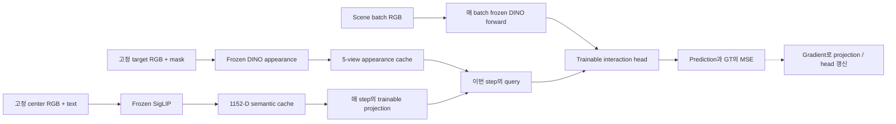

Backward 또는 역전파는 출력 오차가 parameter 변화에 얼마나 민감한지 계산하는 과정임. 이번 training에서는 그 gradient로 projection과 head의 weight를 바꾸지만, frozen DINOv3/SigLIP의 weight는 바꾸지 않음. “Frozen이므로 계산하지 않는다”가 아니라 “필요한 forward는 수행하되 이번 loss로 encoder를 업데이트하지 않는다”는 뜻임.

### 4. GT 생성과 학습

#### Relation score GT와 loss

[gt_similarity.py](gt_similarity.py)는 scene segmentation의 asset mapping과 category를 사용하여 다음 GT를 구성함. 이 category 관계는 연구에서 정한 supervision이며, SigLIP이 자동으로 정한 similarity 정답이 아님.

| Target–scene 관계 | Pixel GT score |
|---|---:|
| 동일 target asset label | `1.0` |
| 같은 category | `0.8` |
| 관련 category: book↔toy, fruit↔packaged_food | `0.5` |
| 그 외 알려진 category 물체 | `0.2` |
| 배경·unknown | `0.0` |

| Target ↓ / Scene → | Book | Toy | Fruit | Packaged food |
|---|---:|---:|---:|---:|
| Book | 0.8 | 0.5 | 0.2 | 0.2 |
| Toy | 0.5 | 0.8 | 0.2 | 0.2 |
| Fruit | 0.2 | 0.2 | 0.8 | 0.5 |
| Packaged food | 0.2 | 0.2 | 0.5 | 0.8 |

표는 색 mapping이 유일할 때의 GT 규칙이며, 동일 target asset에는 category 점수보다 우선하여 `1.0`을 부여함. 현재 생성 함수는 BGR 색을 dictionary key로 사용하므로 서로 다른 asset의 색이 충돌하면 뒤 asset의 점수가 앞 값을 덮을 수 있음. Dataset은 `paths_config.GT_DIR`의 precomputed grayscale GT를 우선 읽고 `/255`로 변환하며, 파일이 없을 때 segmentation과 mapping으로 생성함. **기존 Similarity GT에 대한 색 충돌 영향의 소급 정량 audit은 수행하지 않았음.** Scene segmentation은 GT 생성용이며 model 입력은 아님.

**GT(Ground Truth)**는 학습에서 예측과 비교할 정답을 뜻함. 여기서는 target이 실제로 존재할 통계적 확률을 관측해 만든 정답이 아니라, mapping으로 확인한 물체 관계에 사람이 정한 score를 부여한 정답임. Segmentation의 색은 물체 영역을 식별하기 위한 표식이며, 빨간색 자체에 “fruit” 같은 의미가 있는 것이 아님. Mapping이 그 색과 asset 이름을 연결하고 asset category가 위 점수를 결정함.

Banana를 target으로 삼는다고 가정한 **규칙 설명용 GT**는 다음과 같음. 이는 external Banana로 실제 학습하거나 새 GT를 생성했다는 뜻은 아님.

```text
Scene의 물체        동일 Banana    Orange    Packaged food    Book/Toy    배경
Target과 관계       exact          fruit     related          other       unknown/background
이 규칙의 점수      1.0            0.8       0.5              0.2         0.0
```

Target mask와 scene segmentation도 구분해야 함. Target mask는 reference에서 무엇을 query로 만들지 정하는 **추론 입력의 일부**임. Scene segmentation은 검색할 scene의 물체 정보를 알고 만드는 **학습 GT 도구**임. 학습 중 GT 생성에 scene segmentation을 사용한다고 해서 추론 때 scene의 정답 물체 위치를 head에 제공하는 것은 아님.

색 충돌이 있으면 이 연결부터 모호해질 수 있음. 예를 들어 target asset과 다른 category asset이 같은 BGR key를 가지면 dictionary에 둘의 독립적인 score를 동시에 저장할 수 없음. 이것이 과거 결과를 곧바로 무효화한다는 뜻은 아니지만, 결과의 GT 품질을 평가하려면 충돌 범위와 실제 map 영향을 따로 audit해야 함. 여기서는 이를 완료한 것으로 보고하지 않음.

$$
Y_{\mathrm{patch}}=\mathrm{AvgPool}_{16\times16}(Y_{\mathrm{full}}),
\qquad
L_{\mathrm{sim}}=\frac{1}{BH_pW_p}\sum_{b,i,j}
\left(P_S(b,i,j)-Y_{\mathrm{patch}}(b,i,j)\right)^2.
$$

Loss는 확대된 시각화가 아닌 `30×40` patch grid에서 계산함. 한 patch의 절반이 exact target(`1.0`), 나머지가 배경(`0`)이면 GT가 `0.5`가 됨. 동일한 score가 서로 다른 관계·면적 혼합에서 나올 수 있으므로 밝은 영역을 exact target segmentation이나 존재 확률로 바로 해석하지 않음.

**MSE(Mean Squared Error)**는 예측과 정답의 차이를 제곱한 뒤 평균하는 loss임. 어떤 patch의 GT가 `0.8`이고 모델이 `0.6`을 예측했다면 그 위치의 squared error는 `(0.6−0.8)²=0.04`임. 다른 patch의 GT가 `0.2`이고 예측이 `0.3`이면 `0.01`임. 두 patch만 있다고 가정하면 평균은 `0.025`이고, 실제 코드는 batch의 모든 `30×40` 위치를 평균함.

```text
Scene RGB + target condition ── model ── prediction P_S
                                                │
Scene segmentation + relation rule ── GT Y ─────┤ 차이의 제곱을 평균
                                                ↓
                                             MSE loss
                                                ↓
                                  projection / head weight 갱신
```

이 loss는 같은 category와 다른 category를 단순히 0/1로 나누는 classification loss가 아님. `0.8`, `0.5`, `0.2`와 경계에서 생긴 중간값까지 회귀함. 따라서 어떤 물체를 찾았는지의 성공률이나 exact target의 ranking을 MSE 하나만으로 대신하지 않음. 넓은 배경도 평균에 포함되므로 foreground의 작은 오류가 전체 MSE에서 작아 보일 가능성도 고려해야 함.

#### 데이터와 현재 training protocol

기존 book·fruit·packaged_food·toy 각 4개, **16개 target 모두를 training pool에 유지**함. 새로운 target의 zero-shot 평가는 별도 external asset으로 수행함. Source의 “15 targets / packaged_food_1 제외” 주석은 오래된 설명이며 실제 `TARGETS`와 현재 데이터는 16개임.

| 항목 | 현재 설정 |
|---|---|
| Scene split | Target별 10 scene ID를 8 train / 2 validation으로 분리. 같은 scene ID의 environment와 camera는 같은 split |
| Scene camera | center, top, left, right, bottom |
| Environment sampling | `ENV_STRIDE=10`: `0,10,…,290`, scene ID당 30개 |
| 현재 데이터의 sample 수 | Train `16×8×30×5=19,200`; validation scene sample `16×2×30×5=4,800` |
| Target camera 사용 | Train은 sample마다 5개 중 무작위 하나, validation은 5개를 모두 순회하여 총 24,000 scene–reference 비교 |
| Semantic 조건 | Target당 center image 한 장 + 물체 설명/category text. Target appearance camera를 바꿔도 semantic은 고정 |
| Optimizer | AdamW, learning rate `1e-3`, default weight decay `0.01` |
| Batch / schedule | Batch `128`, 최대 `100` epochs, CosineAnnealingLR |
| Checkpoint 갱신 / early stopping | 이전 best MSE보다 **5% 초과 개선** 시 best 저장; 개선 없이 `5` epochs면 종료 |
| Split seed | 기본 `None`; 실행 시작 시 seed 하나를 정해 모든 target에 사용 |

현재 코드는 seed와 실제 split 목록을 stdout에 출력하지만 `train_log.txt`와 checkpoint에 자동 보존하지 않음. 과거 no-shortcut snapshot에는 target마다 seed가 새로 생성되던 split 문제가 있었고 이후 수정됨. 따라서 현재 코드의 분할 절차가 과거 run에 그대로 적용됐다고 가정하거나, 같은 checkpoint shape만으로 정확한 학습 재현성이 확보됐다고 해석하면 안 됨.

**Train과 validation을 나누는 이유**는 학습에 쓰지 않은 scene에서 같은 규칙을 예측할 수 있는지 확인하기 위함임. 같은 물체 배치를 top/left camera로 본 영상은 서로 밀접하게 관련되므로, 이들을 무작위 image 단위로 나누면 이미 본 배치의 다른 view를 새 scene처럼 평가하게 될 수 있음. 현재는 scene ID를 먼저 나누고 그 ID의 environment와 다섯 view를 함께 이동시킴.

다만 이 split은 **새 scene에 대한 평가**이지 **새 target 물체에 대한 평가**가 아님. 기존 16개 target은 모두 training pool에 남음. Validation의 4,800 scene image에 target reference 5개를 각각 대입하므로 24,000번의 비교를 하지만, 이를 서로 독립인 24,000개 scene으로 세지 않음. 같은 scene를 여러 query view로 재평가한 것임.

학습의 한 step을 계산 관점에서 정리하면 다음과 같음.

1. Scene RGB와 해당 target 이름, relation GT를 batch로 읽고 scene DINO feature를 계산함.
2. Target 이름으로 appearance/semantic cache를 조회하고, train에서는 appearance camera 하나를 sample마다 고름.
3. 현재 projection weight로 semantic을 변환한 뒤 appearance에 더하여 query를 만듦.
4. Interaction, MatchingBlock, fusion, head를 거쳐 patch prediction을 얻음.
5. Patch GT와 MSE를 계산하고 projection/head에 대해 역전파함.
6. AdamW가 이 parameter를 갱신함. Validation에서는 갱신하지 않고 다섯 target camera를 모두 평가함.

이 순서에서 GT는 loss를 계산할 때만 prediction과 비교함. GT의 category score를 inference query나 scene feature에 붙여 넣는 경로는 없음. 다만 target text에 주어지는 물체 설명·category는 명시적인 입력 조건이므로 image-only model로 소개해서는 안 됨.

#### 지표와 checkpoint의 해석

| 지표 | 실제 계산 | 읽는 방법 |
|---|---|---|
| MSE | 전체 patch에서 `(prediction−GT)²` 평균 | Graded relation score 오차; 작을수록 좋음 |
| Tolerance accuracy | `abs(prediction−GT)<13/255`인 patch 비율 | 허용 오차 안에 들어온 비율. 기존 log 명칭은 `acc` |
| Balanced tolerance accuracy | GT-positive와 GT-negative의 tolerance accuracy 평균 | 배경 비중의 영향을 줄인 보조 지표 |
| Tolerance IoU-like | `close ∩ GT-positive` 수 / `GT-positive ∪ predicted-positive` 수 | 일반 binary-mask IoU와 다른 프로젝트 전용 지표 |

Positive 기준은 `GT>0.1`, `prediction>0.1`임. `0.2`인 다른 category 물체도 positive에 포함되므로 이 IoU-like 값을 exact target 위치 IoU라고 부르지 않음. 구체적 계산은 [train_common.py](train_common.py)의 `batch_accuracy_counts()`와 `accuracy_scores_from_counts()`를 따름.

보존된 no-shortcut 후보 `multi_target_20260728_114403_siglip/similarity_head_best.pt`는 현재 head/projection 구조와 호환됨. 해당 `train_log.txt`의 **마지막 best 저장 epoch 21**에는 validation MSE `0.00027`, tolerance IoU-like `0.8588`이 기록돼 있음. 이는 같은 asset library의 scene validation 기록이며 external target 정량 성능이 아님. MSE는 log의 반올림 값이고, best 저장 규칙은 5% 개선 기준이므로 저장된 best를 모든 epoch의 정확한 최소 MSE와 동일시하지 않음.

Checkpoint에는 `model_state`와 `semantic_proj_state`만 저장하고 frozen backbone은 별도로 로드함. **공식 final checkpoint를 지정한 manifest는 아직 없음.** 일부 후속 run은 출력 cosine shortcut을 포함하여 현재 no-shortcut 모델과 그대로 호환되지 않음. 단순히 날짜가 최신인 파일을 선택하지 않으며, 모델 구조·backbone·전처리·split·prompt provenance를 함께 확인해야 함.

#### 정성 결과와 현재까지의 증거

아래는 보존한 정성 결과이며, 현재 final checkpoint를 확정해 동일 조건으로 재생성한 benchmark가 아님. Heatmap의 활성화는 실제 예측 예시로 보되, 모든 unseen instance에서의 성공이나 구성요소의 독립 효과로 확대하지 않음.

**Unseen Banana:** 아래 세 그림의 target은 모두 banana임. 파일명에 있는 Book/Avocado/Orange는 scene pool을 나타내며 target 이름이 아님. Fruit 영역에 반응하는 사례와 함께 다른 물체 영역의 활성화도 관찰됨.


**Unseen packaged_food_5:** 외형이 다른 external packaged-food query에서 같은 category 영역이 활성화된 사례임. 다음 두 그림은 각각 image-only와 image+text로 보존된 결과이지만 **scene도 서로 다르므로 paired ablation이나 text 효과의 정량 증거로 비교하지 않음.**


현재 필요한 검증은 여러 external target을 이용한 object-held-out 정량 평가와 DINO-only/SigLIP-only, image-only/image+text, prompt swap의 통제 비교임. Category-held-out 일반화는 이보다 별도 범위의 주장임. 현재의 frozen encoder 입력 가능성과 위 정성 사례만으로 head의 일반적인 zero-shot 성능까지 확정하지 않음.

### 5. 핵심 설계 과정과 검증 결과

| 단계 | 가정과 시도 | 관측된 한계·변화 |
|---|---|---|
| [Phase 1: DINO appearance](#2026-07-21--phase-1--dinov3-appearance-matching) | Frozen patch feature와 target appearance의 비교로 유사도 지도를 학습 | 색·재질·형상에 반응했지만 해당 구성에서는 category 관계가 충분하지 않았음. DINO 전체에 의미 정보가 없다는 증명은 아님 |
| [Phase 2: CLS prototype](#2026-07-27--phase-2--cls-prototype-category-conditioning) | Target CLS를 category별로 평균하고 category prior를 interaction에 추가 | 기존 물체 표현의 평균만으로 외형 차이가 큰 unseen target을 안정적으로 설명하지 못해 language-aligned 의미 표현을 검토 |
| [Phase 3: SigLIP 결합](#2026-07-28--phase-3--dinov3--siglip-semantic-fusion) | Target image/text semantics를 layer별 projection으로 appearance query에 합산 | Unseen packaged-food에서 same-category 정성 활성화 관찰. Projection·image·text 각각의 기여와 정량 일반화는 추가 검증 필요 |
| [Phase 4: shortcut 제거](#2026-07-2829--phase-4--exact-instance-shortcut-evaluation) | Exact instance를 더 높이려 raw DINO cosine을 output logit에 직접 추가하고 여러 matching 변형 진단 | 비교한 설정에서 exact-vs-same-category 분리가 거의 개선되지 않고 competitor도 활성화됨. 출력 shortcut을 제거하고 learned interaction head 유지 |

세부 설정과 실패 사례는 위 Development Log에 보존함. 현재 구조는 이 관측을 반영한 구현 선택이며, 정확한 instance 우선순위와 모든 semantic 관계를 해결했다는 결론은 아님.

### 6. 질문과 답변

#### Q1. 서로 다른 DINOv3와 SigLIP vector를 그냥 더해도 되는가? 원래 외형 정보가 바뀌는 것 아닌가?

**원본 vector끼리 바로 더하지 않음.** DINO appearance는 768-D이고 SigLIP semantic은 1152-D이므로 원래 길이부터 다름. 코드에서는 SigLIP vector를 **학습 가능한 1152→768 projection**에 통과시킨 다음 DINO appearance와 더하여 새로운 hybrid query를 만듦. Frozen DINO의 원본 출력과 parameter를 덮어쓰는 것은 아님.

```text
DINO target appearance a^ℓ: [a1, a2, ... , a768] ─────────────────┐
                                                               │ 좌표별 덧셈
SigLIP semantic s: [s1, s2, ... , s1152]                          ├──→ q^ℓ: 768개
         │                                                     │
         └── 학습되는 W^ℓ(768×1152), b^ℓ(768) ──→ 768개 ──────────┘

                 q^ℓ = a^ℓ + (W^ℓ s + b^ℓ)

원본 a^ℓ: 그대로 보존               새 q^ℓ: 외형과 의미 조건을 함께 쓸 검색 query
```

왜 차원만 잘라 맞추지 않고 **학습하는 adapter**를 두는가? DINO의 17번째 좌표와 SigLIP의 17번째 좌표가 같은 것을 뜻한다는 보장이 없기 때문임. 길이를 둘 다 768로 만들기만 하면 같은 좌표계가 되는 것은 아님. 서로 다른 기준으로 작성한 두 종류의 기술서를 한 계산에 사용하려면, 두 번째 기술서의 어떤 내용이 첫 번째 표현과 함께 유용한지 변환 규칙을 배워야 한다는 비유로 이해할 수 있음.

이 adapter는 사람이 “fruit 좌표”를 지정하여 복사하는 장치가 아님. 각 `W^ℓ`가 SigLIP의 1152개 숫자를 조합하고, 그 결과로 만든 query를 head가 사용했을 때 similarity GT와의 오차가 줄어드는 방향으로 weight를 갱신함. 예를 들어 같은-category GT가 높은 영역의 예측이 너무 낮다면, projection과 head가 함께 그 오차를 줄일 수 있도록 학습됨. DINOv3/SigLIP의 사전학습 weight 자체는 고정됨.

**Latent space 비유:** vector를 고차원 공간의 한 점 또는 원점에서 그 점으로 향하는 화살표로 생각할 수 있음. `a^ℓ`가 target 외형으로 만든 위치라면, `W^ℓs+b^ℓ`를 더해 다른 검색 위치 `q^ℓ`로 옮기는 셈임.

```text
개념도: 실제 768-D 공간을 설명용 2-D 종이에 그린 것

    표시용 축 v
         ↑
         │                         • q^ℓ = a^ℓ + semantic 보정
         │                       ↗
         │           • a^ℓ ────╱  W^ℓs+b^ℓ
         │
         └──────────────────────────────────→ 표시용 축 u

의도: Banana의 외형 query에 image/text semantic 정보를 함께 반영
```

“외형 위치를 banana·fruit 방향으로 보정한다”는 표현은 **이 설계의 의도를 설명하는 개념 비유**임. 위 축이나 화살표를 실제 feature에서 측정한 것이 아니며, DINO 공간에 고정된 banana 축·fruit 축이 있다는 뜻도 아님. 실제 계산에는 그런 이름표가 없고, addition이 특정 물체와의 cosine을 반드시 높인다는 보장도 없음.

합산한 `q^ℓ`는 더 이상 순수 DINO appearance라고 부를 수 없음. 또한 projection 출력의 크기가 크면 appearance보다 semantic이 강하게 작용할 수 있고, image/text 조건이 부정확하면 잘못된 query를 만들 수 있음. 현재 코드는 별도의 고정 혼합 비율이나 projection 정렬 loss 없이 end-to-end task loss로 이 결합을 학습함. **차원 일치, 유용한 의미 정렬, unseen 일반화는 서로 다른 주장**이며 마지막 두 주장은 통제 평가가 필요함.

#### Q2. Cosine map이 이미 있는데 scene·target feature를 다시 concat하는 이유는?

**Cosine은 각 위치에 숫자 하나만 남기므로, head가 원본 feature도 함께 볼 수 있게 하기 위함임.** Scene 전체를 scalar 하나로 만드는 것은 아님. `30×40` scene에서는 1,200개 위치 각각의 scalar가 남아 공간은 보존되지만, 각 위치의 768-D vector가 제공하던 정보는 한 개의 방향 유사도로 요약됨.

Target도 patch 하나와 비교하는 것이 아님. Target의 `14×14` patch들을 mask-weighted pooling하여 layer별 768-D appearance를 만들고, semantic projection을 더한 query를 모든 scene patch와 비교함. 그래서 아래 그림의 `F(i,j)`는 scene 위치마다 다른 vector이고 target query는 모든 위치에 동일함.

```text
Scene feature grid                             Shifted cosine map

F(1,1) F(1,2) F(1,3) F(1,4)                   0.10  0.18  0.74  0.81
F(2,1) F(2,2) F(2,3) F(2,4)  + 같은 query →   0.09  0.21  0.86  0.79
F(3,1) F(3,2) F(3,3) F(3,4)                   0.05  0.13  0.32  0.20

왼쪽 한 칸 = 숫자 768개                        오른쪽 한 칸 = 숫자 1개
위 수치는 연산의 모양을 보여 주는 가상 예제이며 실제 예측이 아님.
```

정보가 요약된다는 말은 간단한 수학 예로 확인할 수 있음. 2-D query `q=[1,0]`과 길이가 1인 두 scene vector `x_A=[0.8,0.6]`, `x_B=[0.8,−0.6]`를 비교하면 둘의 cosine은 모두 `0.8`, shifted cosine은 모두 `0.9`임. 두 scene vector의 두 번째 성분은 다르지만 scalar만 받는 모듈은 그 차이를 알 수 없음. Raw scene vector를 함께 받으면 그 차이를 이용할 여지가 남음.

Banana 검색에서도 다음과 같은 상황을 생각할 수 있음. 아래 값은 **hybrid query와의 shifted cosine을 가정한 설명용 수치**이며, 해당 물체에서 실제 측정하거나 색의 효과를 분리한 값이 아님.

| Scene patch | Shifted cosine cue 가상값 | Scalar만으로 판단하기 어려운 부분 |
|---|---:|---|
| Banana 영역 | 0.88 | 높은 값이 exact identity를 입증하는가? |
| Orange 영역 | 0.63 | 낮은 값이어도 같은 fruit 관계를 높은 GT로 표현해야 하는가? |
| 노란 toy 영역 | 0.85 | 어떤 외형·문맥·semantic 조합 때문에 높아졌는가? |

이를 위해 입력을 다음처럼 세 부분으로 유지함.

```text
한 scene 위치 (u,v)

  X_s^ℓ(:,u,v) : 768개  ── 이 위치의 contextual visual feature ──┐
  q_t^ℓ        : 768개  ── 이번에 찾을 target의 query ───────────┼─ Concat → 1537개
  ĉ^ℓ(u,v)     :   1개  ── 위 둘의 명시적인 방향 유사도 ────────┘
```

Concat은 cosine에서 잃은 정보를 역으로 복원하는 연산이 아님. Scalar로 압축하기 **전의 입력을 별도로 함께 전달**하는 연산임. 또한 raw feature와 cosine은 독립적인 세 센서가 아니라 일부 정보가 중복되는 입력임. Cosine은 직접적인 비교값을 미리 계산해 주는 cue, raw feature는 그 scalar만으로 표현되지 않는 패턴을 head가 사용할 수 있게 하는 조건으로 구분함.

이 설계만으로 “노란 toy를 항상 억제하고 orange를 반드시 높인다”고 결론내릴 수는 없음. 그 구분에 필요한 정보가 feature에 있어야 하고, 학습한 head가 새로운 scene에서도 이를 활용해야 함. 현재 구조의 필요성과 각 입력의 효과는 **cosine-only, raw feature-only, 둘의 결합을 같은 held-out 조건에서 비교**해야 입증됨.

#### Q3. SigLIP과 DINOv3 latent vector의 의미를 어떻게 알 수 있는가?

**각 좌표에 자연어 이름을 붙여 바로 읽을 수는 없음.** `17번=fruit`, `325번=노란색`처럼 정해진 사전이 있는 것이 아니라, 여러 성분의 조합에 정보가 분산되어 표현됨. “768-D feature”라는 shape를 알아도 그 안에서 category나 instance 정보가 얼마나 잘 읽히는지는 별도 질문임.

비유하면 RGB의 세 축에는 red·green·blue라는 명시적인 정의가 있지만, encoder가 만든 feature의 축에는 그런 사람이 정한 의미표가 없음. 서로 다른 encoder는 같은 입력을 서로 다른 좌표계로 표현할 수 있음. 두 vector의 좌표 번호가 같거나 길이가 같아도 그 성분을 같은 의미로 취급할 수 없는 이유임.

그렇다고 아무것도 설명할 수 없는 것은 아님. **무엇을 입력했고 어떤 학습 배경의 encoder를 거쳐 어디에 쓰는지**는 코드로 확인할 수 있음.

| 표현 | 이 프로젝트의 입력·출력 | 계산 경로로 말할 수 있는 것 | 바로 단정할 수 없는 것 |
|---|---|---|---|
| DINO scene token | Scene RGB → 위치별 768-D | 공간 위치를 유지하는 contextual visual representation | 한 좌표의 의미, 모든 물체 경계나 관계의 완전한 표현 |
| DINO target appearance | Target RGB → mask-pooled 768-D | Reference 외형을 대표하도록 위치를 가중 평균한 표현 | 모든 viewpoint·가림에 불변인 instance ID |
| SigLIP semantic | Target crop/text → 결합한 1152-D | Image/text 사전학습 공간을 사용하는 전역 조건 | 현재 이미지의 자동 category 정답, scene의 위치 정보 |
| Projected hybrid query | DINO appearance + projected semantic | GT map prediction에 사용하도록 학습된 검색 조건 | “fruit 방향” 등 해석 가능한 고정 semantic 축 |

정보가 실제로 표현에 있는지 확인하려면 입력이나 readout을 통제한 실험이 필요함. 예를 들어 다음 검증은 각각 다른 질문에 답함.

| 확인 방법 | 구체적 예 | 알 수 있는 범위와 주의점 |
|---|---|---|
| Image–text retrieval | Banana image가 `fruit`, `toy`, `book` 문장 중 어디와 가까운가? | 같은 SigLIP 공간에서 관계를 검사. Prompt 선택과 후보 목록에 영향을 받음 |
| Nearest neighbor | 여러 target feature 중 Banana 주변에 어떤 물체가 놓이는가? | 현재 표본 집합의 유사도 구조를 관찰. 축 하나의 의미를 증명하지는 않음 |
| Prompt swap | 같은 RGB에 fruit/toy text만 바꾸면 map이 어떻게 달라지는가? | Text 조건에 대한 민감도를 분리. Map이 바뀐다는 사실과 정확도가 높아진다는 사실은 다름 |
| Linear probe | Frozen vector에 작은 선형 분류기를 붙여 category를 예측할 수 있는가? | 선형적으로 읽히는 정보의 정도를 검사. 새로운 물체·scene split이 필요 |
| Layer-wise map | Layer 2/5/8/11의 대응 반응을 같은 입력에서 비교 | Layer별 관측 차이를 볼 수 있음. “초기=색, 후기=의미”라고 미리 확정하지 않음 |
| Controlled ablation | DINO-only/SigLIP-only/image-only/image+text를 동일 조건에서 비교 | 최종 task 성능에 주는 추가 기여를 검사. 학습량·평가 입력 조건을 맞춰야 함 |

위 표는 검증 방법을 설명한 것이며 모든 실험을 이미 완료했다는 뜻은 아님. 현재 Similarity에는 정성 unseen 사례가 있지만 이를 모두 포함한 정량 ablation은 남아 있음. 특히 “DINO만 사용한 초기 구성에서 의미 관계가 부족했다”는 관측을 **DINO feature에는 어떤 semantic 정보도 없다**는 일반 명제로 바꾸지 않음.

#### Q4. Patch-wise cosine과 MatchingBlock은 같은 matching을 두 번 하는 것 아닌가?

**같은 계산을 반복하는 것이 아님.** Cosine은 정해진 수식으로 현재 위치의 vector와 query 사이 방향 유사도 하나를 계산함. MatchingBlock은 그 수치와 raw feature, query, 이웃 위치를 받아 학습된 convolution으로 64-D task feature를 만듦. 이름에 matching이 들어가지만 cosine을 재계산하거나 target patch를 하나씩 다시 찾아 대응시키는 모듈은 아님.

| 구분 | Patch-wise cosine | MatchingBlock |
|---|---|---|
| 쉬운 비유 | 유사도를 재는 측정기 | 측정값과 주변 증거를 함께 읽는 학습 모듈 |
| 방법 | 두 vector를 정규화한 내적 | 학습되는 3×3/1×1 Conv와 정규화·비선형 함수 |
| 위치 하나의 출력 | Score cue 1개 | Feature 64개 |
| 주변 grid cell | Cosine 수식이 추가로 합치지 않음 | 3×3 Conv에서 명시적으로 함께 합침 |
| 다음 단계 | Raw 입력과 함께 MatchingBlock에 전달 | 다른 layer 출력과 fusion한 뒤 score head로 전달 |

중앙 cosine이 같아도 이웃 분포는 다를 수 있음. 아래는 **shifted cosine의 가상 예**임.

```text
고립된 높은 cue                    여러 위치에 이어진 높은 cue

0.10   0.12   0.09                  0.71   0.78   0.74
0.11  [0.91]  0.13                  0.80  [0.91]  0.82
0.08   0.10   0.12                  0.72   0.79   0.75

중앙 cosine만 읽으면 두 경우 모두 0.91임.
3×3 입력을 읽는 filter는 서로 다른 이웃 패턴을 받음.
실제 MatchingBlock은 이 cue뿐 아니라 raw scene/query channels도 함께 읽음.
```

따라서 모델은 고립된 반응과 주변에 이어진 반응을 다르게 처리할 **계산상의 가능성**을 가짐. 하지만 실제 작은 물체는 한 patch에만 보일 수도 있으므로, “고립되면 거짓, 넓으면 참”이라는 규칙을 미리 넣은 것은 아님. 어떤 경우를 강화하거나 억제할지는 GT와 학습한 weight에 달려 있음.

여기서 “cosine은 이웃을 추가로 보지 않는다”는 말도 한정해서 읽어야 함. Cosine에 넣는 DINO patch token은 이미 self-attention으로 다른 위치의 문맥을 포함할 수 있음. 비교하는 것은 **contextual token 두 개의 cosine**과 **그 token/cue들을 격자에서 다시 혼합하는 CNN**임. DINO가 context를 전혀 보지 않는다는 대비가 아님.

또한 현재 MatchingBlock 뒤에는 별도의 `1×1` fusion과 head가 있음. Block의 64개 output을 곧바로 최종 score로 해석하지 않고, 네 layer가 만든 표현을 합쳐 마지막 logit 하나로 읽음. 출력에 raw cosine을 직접 더하는 shortcut은 제거되어 있으므로 최종 map은 이 학습 경로를 거침.

이 구조가 cosine-only보다 실제로 필요한지, 어느 이웃 패턴에 어떻게 반응하는지는 held-out ablation과 오류 분석으로 확인해야 함. 설계 역할과 정확한 연산은 코드로 확인할 수 있지만, 역할 설명 자체가 성능 개선의 증거는 아님.

#### Q5. 새 target에 image-only 추론이 가능한가? Zero-shot은 무엇까지 의미하는가?

**현재 CLI에서 text를 생략하는 image-only 계산은 가능하지만, raw target RGB만으로 모든 전처리를 해결하는 것은 아님.** [inference_zeroshot.py](inference_zeroshot.py)는 `--label`을 생략하면 SigLIP image semantic만 사용함. Target appearance를 만들 crop·pooling을 위해 reference mask와 mapping은 여전히 읽음.

```text
공통 입력: Scene RGB + Target RGB + Target mask/mapping

--label 없음  → DINO appearance + projected SigLIP image semantic
--label 있음  → DINO appearance + projected normalized mean(image, text)
```

Label을 주면 현재 inference prompt는 `a photo of a {label}`임. 예를 들어 `--label banana`이면 `a photo of a banana`가 됨. 학습의 `a photo of {object_description}, a type of {category}`와 정확히 같은 문장 형식은 아님. 또 학습 semantic은 center reference로 고정되지만 inference는 선택한 target camera를 사용함. 따라서 label 유무, 실제 문장, target camera를 기록해야 서로 같은 조건의 결과인지 판단할 수 있음.

Zero-shot을 이해할 때 다음 세 수준을 나눠야 함.

| 수준 | 의미 | 현재 주장할 수 있는 범위 |
|---|---|---|
| 새 입력을 encoder에 넣을 수 있음 | Banana가 16개 training target 목록에 없어도 vector를 계산할 수 있음 | 입력 규격상 가능 |
| 정성 사례에서 관련 영역이 반응함 | 보존된 Banana/packaged_food_5 그림에서 관련 물체 영역 활성화 관찰 | 해당 사례의 정성 증거 |
| 새로운 target 전체에서 좋은 성능을 냄 | 여러 외부 물체와 scene에서 정량적으로 일반화 | Object-held-out benchmark와 반복 평가가 필요 |

Image+text로 학습한 head에서 text를 제거하면 입력 조건이 달라짐. 기존 image-only 그림이 있다는 사실은 기능 경로의 사례를 보여 주지만, image-only가 image+text와 동등하거나 더 낫다는 증거는 아님. 특히 보존한 두 packaged-food 그림은 scene도 달라 직접적인 text 효과 비교가 불가능함. 새로운 target의 category까지 학습에서 제외하는 category-held-out 평가는 또 다른 범위임.

#### Q6. 밝은 값은 target 존재 확률인가? Similarity가 정확하면 최종 탐색도 해결되는가?

**현재 `P_S`는 정해 둔 관계 score의 예측값이며, target 존재의 보정된 확률이 아님.** Sigmoid 때문에 숫자가 `0–1` 범위라고 해도 통계적 probability의 의미가 자동으로 생기지는 않음. 현재 정답부터 exact=1.0, same-category=0.8, related=0.5, other=0.2라는 규칙으로 정의했기 때문임.

예를 들어 Banana query에서 orange 영역에 `0.8`이 나오면 같은-category 관계를 높은 값으로 표현하는 것일 수 있음. “그 orange 자리에 Banana가 있을 확률이 80%”라는 뜻이 아님. 반대로 patch의 절반만 exact target이고 나머지가 배경이면 GT가 `0.5`이므로, 그 값만 보고 related category인지 부분적으로 보이는 exact target인지 구별할 수 없음.

| 같은 숫자가 나올 수 있는 상황 | 현재 GT의 값 | 숫자 하나만으로 구분되지 않는 이유 |
|---|---:|---|
| Patch 전체가 related-category 물체 | 0.5 | 관계 score 자체가 0.5 |
| Patch 절반이 exact target, 절반이 배경 | 0.5 | 16×16 GT average pooling의 결과 |
| 모델이 불확실하거나 틀려서 0.5를 출력 | 예측 0.5 | 모델 출력은 정답의 원인을 보증하지 않음 |

그래서 Similarity map은 target 및 관련된 가시 영역에 대한 한 가지 정보로 사용하고, 가려질 수 있는 위치나 scene 구조와는 역할을 구분함. `F_S`를 Occlusion·Complexity feature와 결합할 때 탐색 순서, 성공률, 필요한 행동 수에 실제 도움이 되는지도 검증해야 함. 현재의 낮은 relation MSE나 보기 좋은 heatmap만으로 최종 2D-PDM과 DRL 탐색의 효용이 입증됐다고 말하지 않음.

---

## Occlusion Stream

> **현재 기준:** Adaptive GT 240,000장 생성 완료. 기존 16개 target을 모두 사용하는 `native 68-D geometry + raw target broadcast + global FiLM` baseline을 전체 scene key의 10%로 학습함. Seen-target scene-heldout 평가와 외부 `packaged_food_5` 한 개의 합성 평가를 완료했으며, 현재 checkpoint를 보존함. 아래 설명은 이 baseline의 실제 계산을 기준으로 함.

### 1. 목적과 입출력

#### 같은 더미에서도 찾는 물체에 따라 가림 후보가 달라지는 이유

서랍 중앙에 책과 포장식품이 겹쳐 있다고 가정함. 찾는 물체가 작은 과일이면 더미의 비교적 좁은 부분에서도 그 과일의 상당 부분이 가려질 수 있음. 찾는 물체가 넓은 책이면 같은 부분이 책 전체를 충분히 덮지 못할 수 있음. 반대로 넓게 겹친 물체 아래에서는 큰 책도 가려질 후보가 될 수 있음. 따라서 scene만 보고 모든 target에 같은 map을 내는 것으로는 이 차이를 표현하기 어려움.

Occlusion이 답하려는 질문은 **“이 target이 현재 물체 더미에 의해 어느 위치에서 가려질 수 있는가?”**임. Scene에서 target과 닮은 pixel을 찾는 문제와 구분됨. 찾는 target이 완전히 보이지 않더라도, 현재 보이는 더미의 구조와 target reference를 함께 보고 가림 후보 영역을 제시하려는 목적임.

이때 입력마다 주는 정보가 다름. RGB에는 물체 외형과 경계·질감의 문맥이 있고, depth에는 camera가 실제로 관측한 표면까지의 거리가 있음. Target RGB는 무엇을 찾는지에 대한 외형 정보를 주며, target mask는 규격이 고정된 reference 영상에서 그 물체가 얼마나 크고 어떤 윤곽을 갖는지 계산하는 데 사용함. Scene RGB-D가 같더라도 target reference가 바뀌면 출력도 그 조건에 맞게 바뀔 수 있도록 설계함.

위 예는 **입력을 함께 사용하는 이유**를 설명하는 예임. 모델 안에 “작은 물체는 항상 높은 확률, 큰 물체는 항상 낮은 확률”이라는 규칙을 넣은 것은 아님. 실제 GT도 물체 크기·회전·후보 위치에 따라 분자와 분모가 함께 바뀌므로, 모든 pixel에서 크기에 따른 단조 관계가 보장되지는 않음.

#### 모델이 받는 것과 내보내는 것

| 구분 | 실제 자료와 단위 | Model에서 만드는 형태 | 역할 |
|---|---|---|---|
| Scene RGB | 현재 더미의 `480×640` RGB 영상 | `B×3×480×640` | 관측 물체의 외형·공간 문맥 |
| Scene depth | RGB에 대응하는 미터 단위 depth. 0은 무효값 | 정규화 depth와 valid mask를 합친 `B×2×480×640` | 관측 표면의 거리·공간 변화 |
| Target reference RGB | Target을 따로 촬영한 center/top-down `480×640` 영상 한 장 | DINO layer마다 `B×768` vector | 찾는 물체의 appearance 조건 |
| Target mask | 위 reference에서 target인 pixel만 1인 이진 mask | 크기·윤곽 descriptor `g: B×68` | 찾는 물체의 영상상 크기·형태 조건 |
| 중간 출력 `F_O` | 학습된 위치별 feature, 물리 단위 없음 | `B×64×30×40` | 향후 stream fusion에 전달할 가림 관련 표현 |
| Map 출력 `P_O` | 각 patch의 가림 GT 예측값, `0–1` | `B×1×30×40` | 현재 학습·평가에 사용하는 한 channel map |

`B`는 한 번에 처리하는 sample 수임. `B×64×30×40`은 sample마다 세로 30칸·가로 40칸의 map이 있고, 각 칸에 숫자 64개가 있다는 뜻임. 이 64개 값 각각이 확률인 것은 아님. 마지막 head가 이를 하나의 값으로 합친 뒤 sigmoid를 적용한 `P_O`가 `0–1` 범위를 가짐.

**Target mask는 scene에서 target을 찾아 만든 mask가 아님.** Target만 따로 촬영한 reference의 silhouette임. 현재 학습·외부 평가에서는 합성 segmentation으로 정확한 mask를 얻음. Scene segmentation이나 실제 target의 scene 위치는 network 입력으로 제공하지 않음.

#### Network 입력과 고정 자료, 학습 정답의 구분

| 정보 | 학습 때 | 추론 때 |
|---|---|---|
| Scene RGB-D, target RGB와 mask | Network가 예측을 만드는 입력 | 같은 규격으로 필요 |
| Target mesh, candidate poses, empty-drawer depth와 camera calibration | Offline GT 생성에 사용 | Network forward에는 필요하지 않음 |
| GT와 target별 coverage | Loss·정량 평가에 사용 | Network forward에는 필요하지 않음 |
| Camera별 workspace mask | Safe-ring 보조 감독 영역을 정함 | 표시용 map에서 drawer 밖을 제거하는 후처리에 사용 가능 |

Camera workspace는 target 정답에서 뽑는 mask가 아니라 고정 rig의 drawer 내부 영역임. 반면 coverage는 GT generator가 어떤 target pose를 실제로 표본화했는지에 의존하는 감독 자료임. 둘의 용도는 뒤에서 따로 설명함.

학습 정답은 **가상 target pose의 유효 투영 면적 중 70% 이상이 현재 scene depth 뒤에 있는 경우**를 집계하여 만듦. `P_O`는 그 GT의 수치를 근사함. 실제 target의 위치가 이미 알려졌다는 뜻도, map 전체의 합이 1인 위치 사후확률이라는 뜻도 아님. Similarity·Complexity와 결합한 최종 탐색 prior, 실제 제거 action과 DRL 효용은 아직 검증하지 않음.

### 2. 전체 모델 구조

#### 먼저 따라갈 네 가지 정보의 흐름

전체 계산은 다음 순서로 읽으면 됨. Scene RGB는 위치별 feature map으로 유지하고, target RGB는 한 물체를 조건으로 제공하기 위해 vector로 요약함. Scene depth는 별도 CNN으로 변환하고, target mask에서 계산한 geometry로 그 depth feature를 조절함. 이후 같은 patch 위치의 네 묶음 정보를 합쳐 학습 가능한 convolution에 넣음.

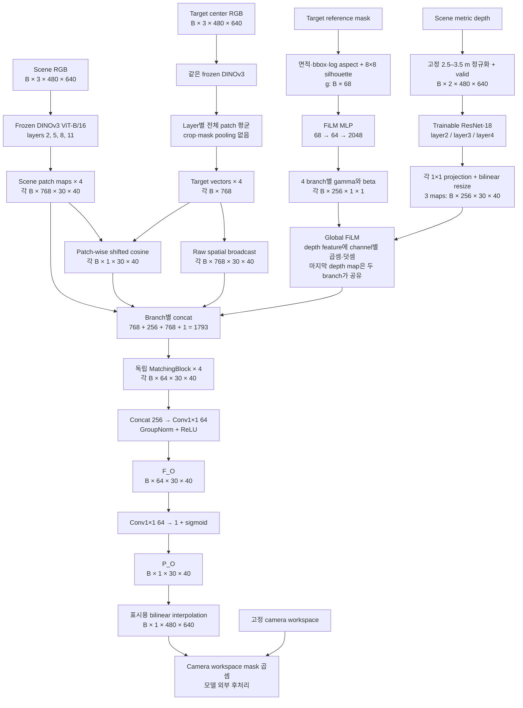

DINO는 scene용·target용으로 서로 다른 weight를 학습하는 구조가 아님. 같은 frozen backbone을 두 입력에 사용함. Layer index `2/5/8/11`은 하나의 DINO에서 꺼내는 네 중간 출력이며, 네 개의 DINO 모델을 뜻하지 않음.

ViT-B/16의 patch 크기는 `16×16px`임. 입력 높이 480을 16으로 나누면 30, 너비 640을 16으로 나누면 40이므로 공간 grid는 `30×40`, 총 1,200칸임. **이 16은 학습 target이 16개라는 숫자와 무관함.** 또한 DINO의 attention으로 다른 위치의 문맥도 반영되므로 feature 한 칸이 해당 16×16 pixel만 독립적으로 본다는 뜻은 아님.

#### 각 부품이 맡는 정보와 다음 단계에 필요한 이유

| 구성 | 받는 정보 → 내보내는 정보 | 왜 필요한가? | 다음 연결 |
|---|---|---|---|
| Frozen DINO | RGB → 768-channel contextual feature | 물체마다 새 encoder를 학습하지 않고 RGB 표현을 공통 사용 | Scene map 유지, target은 평균 vector로 요약 |
| Geometry 계산 | Target mask → 크기 4개와 silhouette 64개 | 전체 RGB 평균만으로 크기·윤곽이 충분히 전달된다고 가정하지 않음 | FiLM이 target 조건을 계산 |
| Depth ResNet | Depth·valid → 세 scale의 학습된 depth map | RGB feature와 별도로 거리 패턴을 처리 | Channel·해상도를 맞춘 뒤 FiLM 적용 |
| FiLM | Geometry + depth feature → 조건이 반영된 depth feature | 같은 더미를 찾는 물체의 크기·형태에 맞게 해석할 경로 제공 | MatchingBlock의 depth 입력 |
| Raw broadcast | Target vector → 모든 위치에 같은 vector | 각 위치에 target의 상세한 appearance 조건 전달 | Scene·depth·cosine과 concat |
| Cosine | Scene patch와 target vector → 유사도 한 개 | 외형 대응의 직접 단서를 제공 | 최종 답이 아니라 MatchingBlock의 한 입력 channel |
| MatchingBlock | 네 묶음 정보와 주변 patch → 64-channel map | 단서를 함께 해석하여 GT에 필요한 표현으로 변환 | 네 layer 결과를 concat |
| Fusion/head | 네 표현 → `F_O` → 한 channel `P_O` | 서로 다른 layer의 정보를 통합하고 감독 가능한 map 생성 | Loss·평가 또는 향후 stream fusion |
| Workspace 후처리 | Raw map + camera 영역 → 외곽이 제거된 map | 현재 고정 drawer 밖의 값을 표시·사용에서 제한 | Network 성능과 구분하여 해석 |

이 표는 **설계가 각 부품에 맡긴 역할**임. 예를 들어 depth feature의 특정 channel이 물체 높이를 정확히 측정한다는 뜻은 아님. 각 모듈의 단독 효과를 모두 분리한 실험도 아니며, 검증한 전체 모델의 결과와 설계 의도는 5절에서 구분함.

### 3. 내부 모듈과 선택 이유

#### 1. RGB에서 scene map과 target vector를 만드는 과정

먼저 RGB pixel 값을 `[0,1]`로 바꾸고 ImageNet mean/std로 정규화함. 이것은 DINO가 받는 입력의 수치 범위를 맞추는 전처리이며, RGB의 밝기를 scene마다 임의로 늘리는 min–max 정규화가 아님. DINO는 evaluation mode로 두고 weight를 고정하며, gradient를 계산하지 않음.

Scene 입력에서는 네 layer의 `B×768×30×40` map을 그대로 유지함. 어디에 어떤 feature가 있는지가 필요하기 때문임. 한 위치의 768개 값은 학습된 표현이며, 사람이 “빨강”, “책”, “높이”라는 이름을 하나씩 지정한 768개 물리량이 아님.

Target 입력에도 같은 DINO를 적용하면 같은 크기의 patch map이 생김. 현재 Occlusion은 target의 위치별 patch를 유지하는 대신 **전체 1,200개 patch vector를 평균**하여 layer별 vector 하나를 만듦.

$$
q_l=\frac{1}{H_pW_p}\sum_{u=1}^{H_p}\sum_{v=1}^{W_p}X_{t,l}(u,v)
$$

여기서 `l`은 선택한 DINO layer, `X_{t,l}(u,v)`는 target reference의 해당 위치에 있는 768-D vector임. `H_p=30`, `W_p=40`은 patch grid의 높이·너비이며, 합을 1,200으로 나눈 결과 `q_l`도 768-D임. Batch를 포함하면 `q_l`의 tensor는 `B×768`임. Backbone이 함께 반환하는 CLS token은 이 interaction에 사용하지 않음.

이 평균에는 target 주변의 배경 patch도 포함됨. Target reference를 bbox로 자르거나 224×224로 확대하지 않고, mask로 가중 평균하지도 않음. 이는 crop·mask pooling을 쓰는 Similarity와 다른 현재 구현임. Reference의 전체 모습을 유지하면서 target 정보를 제공하되, 영상에서 차지하는 크기를 평균 vector가 알아서 완벽히 담는다고 가정하지 않아 별도의 geometry 경로를 둠.

결과적으로 다음 단계는 target RGB에서 나온 `q_l`과 mask에서 계산한 `g`라는 **서로 다른 두 조건**을 받음. 전자는 appearance 관계를 표현하고, 후자는 크기·윤곽을 명시적으로 제공함. 같은 촬영 규격을 전제로 하므로 target reference의 거리·화각·배경을 임의로 바꾸어도 같게 동작한다고 보장하지 않음.

#### 2. Native 68-D geometry를 실제 mask에서 계산하는 과정

여기서 descriptor는 “긴 mask를 고정 개수의 숫자로 요약한 것”을 뜻함. `extract_target_geometry()`는 target reference mask에서 **크기 관련 4개 값과 거친 silhouette 64개 값**을 계산함. 계산식이 정해진 전처리이므로 이 단계에 학습할 weight는 없음.

Reference frame 높이·너비를 `H,W`, foreground mask pixel 수를 `A`라고 함. Mask의 가장 위·아래·왼쪽·오른쪽 pixel을 감싸는 최소 사각형이 bounding box, 줄여서 bbox임. Bbox 높이·너비를 `h,w`라고 하면 첫 네 값은 다음과 같음.

| Index | 계산 | 단위·범위와 해석 |
|---|---|---|
| `g[0]` | `A/(H×W)` | 단위 없는 면적 비율. Frame 전체 중 target의 비율 |
| `g[1]` | `h/H` | 단위 없는 높이 비율 |
| `g[2]` | `w/W` | 단위 없는 너비 비율 |
| `g[3]` | `log(w/h)` | 자연로그 종횡비. 세로가 길면 음수, 같으면 0, 가로가 길면 양수 |

나머지 `g[4:68]`은 bbox 안의 mask를 OpenCV `INTER_AREA`로 `8×8`에 맞춘 뒤 첫 행부터 차례로 펼친 64개 값임. 각 cell 값은 그 구역이 얼마나 foreground로 채워졌는지를 나타내는 soft occupancy임. 0은 비어 있음, 1은 채워져 있음, 중간값은 일부만 채워짐을 나타냄.

```text
Reference frame 전체: 480×640
          │
          ├─ foreground 면적 / 전체 면적         → 1개
          ├─ bbox 높이 / 480, bbox 너비 / 640    → 2개
          ├─ log(bbox 너비 / bbox 높이)          → 1개
          │
          └─ bbox 안의 mask → 8×8 soft grid
                0.0  0.2  0.8  ...
                0.1  0.9  1.0  ...
                ... 8개 행 ...
                         ↓ 한 줄로 펼침          → 64개

전체 descriptor: 4 + 64 = 68개 숫자
```

숫자로 보면, 설명용 reference에서 `A=3,072px`, `h=96px`, `w=64px`일 때 첫 네 값은 다음과 같음.

```text
면적 비율   3072 / (480×640) = 0.01
높이 비율     96 / 480       = 0.20
너비 비율     64 / 640       = 0.10
log aspect   log(64/96)      ≈ -0.405
```

같은 윤곽이 영상에서 가로·세로 모두 2배가 된 설명용 경우에는 면적이 4배이므로 `[0.04, 0.40, 0.20, -0.405]`가 됨. Bbox 안에서 정규화한 8×8 윤곽은 거의 같을 수 있지만 앞의 면적·높이·너비가 크기 차이를 남김. 이 예는 descriptor 계산을 설명하며, 현재 모델의 2배 scale 일반화가 검증되었다는 뜻은 아님.

Bbox를 정사각형 8×8로 만들면 원래 종횡비는 압축 과정에서 변함. 따라서 높이·너비·aspect를 별도로 함께 제공함. 반대로 8×8의 64개 값은 bbox만으로 구별하기 어려운 거친 윤곽 차이를 남김. 예를 들어 bbox가 같아도 안이 꽉 찬 사각형과 둥근 물체는 corner cell의 occupancy가 다를 수 있음.

**이 숫자들은 centimeter 단위의 실제 3D 크기가 아님.** 같은 capture 거리·화각에서는 영상상 크기가 실제 크기 차이와 관련되지만, 물체를 camera에 가까이 가져오면 같은 물체도 크게 보임. Single mask만으로 실제 길이·높이를 일반적으로 확정할 수 없으며, 현재 descriptor에는 target depth나 USD의 3D extent가 들어 있지 않음.

`Native 68-D`는 위의 원래 68개 값을 모두 그대로 사용한다는 의미임. 과거 size-only·exact-extent oracle는 일부 slot을 0으로 만들거나 다른 값으로 대체한 실험이지만 현재 baseline의 전처리가 아님. 다음 FiLM은 **이 native 68개를 받도록 학습된 함수**이므로 숫자 개수만 같게 유지하고 뜻을 바꾸면 같은 입력 계약이 아님.

#### 3. Depth 전처리: 거리와 무효값을 분리하는 이유

Scene depth는 RGB와 대응하는 영상 위치마다 관측한 거리값임. 현재 사용하는 camera depth는 미터 단위이며, 숫자 자체가 drawer 바닥에서 물체까지의 높이라는 뜻은 아님. Network는 depth를 3D point cloud로 역투영하거나 숨겨진 표면을 복원하는 대신, 영상 격자 위의 2-channel 입력으로 처리함.

첫 channel은 고정된 `[2.5,3.5] m` 범위를 `[0,1]`로 옮긴 depth, 둘째는 `depth>0`인 곳을 1로 표시한 valid mask임.

$$
V(u,v)=[D_s(u,v)>0]
$$

$$
\bar D_s(u,v)=
\begin{cases}
\mathrm{clip}((D_s(u,v)-2.5)/(3.5-2.5),0,1),&V(u,v)=1\\
0,&V(u,v)=0
\end{cases}
$$

여기서 `(u,v)`는 원본 영상의 pixel 위치, `D_s`는 scene depth, `V`는 유효성, `clip`은 범위 밖 값을 가까운 끝값으로 제한하는 연산임. 실제 입력은 `Concat(\bar D_s,V)`이므로 `B×2×480×640`이 됨.

예를 들어 유효 depth `3.0m`는 `[0.5,1]`, 유효 depth `2.5m`는 `[0,1]`, 무효 depth `0`은 `[0,0]`으로 들어감. 첫 channel만 보면 마지막 두 경우가 모두 0이지만 valid channel이 둘을 구별함. 이 전처리는 무효값의 위치를 알려줄 뿐, 결측 depth의 실제 거리를 복원하는 것은 아님.

Scene마다 가장 가까운 곳과 먼 곳을 다시 0과 1로 맞추면 같은 `3.0m`도 장면마다 다른 숫자가 됨. 현재는 camera와 drawer의 배치가 고정돼 있어 모든 scene에 같은 범위를 적용함. 이 범위를 벗어나는 새로운 camera 배치에서는 clipping과 입력 분포가 달라질 수 있으므로 임의 camera 일반화와 구분해야 함.

#### 4. ResNet-18과 세 depth scale

Depth는 DINO의 RGB 입력에 추가하는 방식이 아니라 별도 `SceneDepthEncoder`에 넣음. 현재 encoder는 ImageNet weight를 가져오지 않은 `weights=None`의 ResNet-18이며, 첫 convolution을 2-channel 입력에 맞춰 처음부터 학습함. RGB feature와 다른 수치·유효성 구조를 갖는 depth를 독립된 경로에서 가림 GT에 맞게 변환하려는 선택임.

입력에서 깊은 layer로 갈수록 해상도는 줄고 channel 수는 늘어남. Stride는 입력 pixel을 기준으로 feature 위치가 얼마나 떨어져 있는지를 나타냄. 예를 들어 stride 8인 grid는 입력의 8px 간격, stride 32인 grid는 32px 간격에 대응함. 실제 receptive field는 convolution이 겹쳐 적용되므로 그 간격보다 넓음.

| 위치 | 공간 해상도와 channel | 역할 |
|---|---|---|
| 입력 | `B×2×480×640` | 정규화 depth와 valid |
| 첫 `7×7` convolution, stride 2 | `B×64×240×320` | 주변 depth·valid 패턴을 첫 feature로 변환 |
| Max-pool와 `layer1` 이후 | `B×64×120×160` | 이후 scale들을 만드는 공통 앞단 |
| `layer2`, stride 8 | `B×128×60×80` | 비교적 촘촘한 depth 표현 |
| `layer3`, stride 16 | `B×256×30×40` | DINO와 같은 위치 간격의 표현 |
| `layer4`, stride 32 | `B×512×15×20` | 더 넓은 주변을 요약한 표현 |

ResNet의 residual connection은 앞 feature에 convolution이 만든 변화량을 더하는 방식임. 블록이 처음부터 모든 정보를 다시 만드는 대신 기존 표현을 수정하는 경로를 갖게 함. 이를 network를 학습하기 쉬운 구조로 사용하지만, 현재 task에서 residual 유무만 바꿔 효과를 분리한 결과는 없음. `ResNet-18`의 18은 architecture의 layer 명칭이며 출력이 18차원이라는 뜻이 아님.

이 세 출력은 channel 수와 공간 해상도가 달라 바로 RGB map과 붙일 수 없음. 따라서 각 scale에 독립적인 `1×1 Conv`를 적용해 256 channels로 맞추고, bilinear interpolation으로 모두 `30×40` grid에 맞춤.

```text
128×60×80  → 1×1 Conv 128→256 → resize → 256×30×40
256×30×40  → 1×1 Conv 256→256 → resize → 256×30×40
512×15×20  → 1×1 Conv 512→256 → resize → 256×30×40
```

`1×1`은 한 위치에서 여러 channel을 섞는 학습 연산임. “1 pixel만 처리하므로 문맥이 없다”는 뜻은 아님. 이미 그 위치의 입력 feature에 이전 convolution의 문맥이 담겨 있음. Resize는 `align_corners=False`인 bilinear 보간으로 위치 수를 맞추며, 작은 15×20 feature를 확대한다고 새로운 세부 관측을 얻는 것은 아님.

이렇게 만든 세 depth map을 DINO branch `2/5/8`에 차례로 연결함. 네 번째 DINO branch인 layer 11에는 가장 깊은 세 번째 depth map을 다시 사용함. 즉 **RGB branch는 네 개, 서로 다른 depth scale은 세 개**임. 마지막 두 branch는 같은 depth map을 받아도 이후 FiLM과 MatchingBlock의 parameter가 달라 서로 다른 결과를 만들 수 있음.

세 scale을 쓰는 이유는 촘촘한 주변 변화와 더 넓은 더미 문맥을 함께 제공하기 위함임. 256개 channel을 “높이 1개+틈새 1개+…”로 해석하지 않음. 관측 depth로부터 학습한 latent representation이며 각 channel의 물리적 역할은 따로 이름 붙이거나 검증하지 않았음.

#### 5. FiLM: target에 따라 depth channel의 반응을 조절

앞 단계까지의 depth feature는 scene이 같으면 target이 바뀌어도 같음. 그러나 같은 더미가 작은 target과 큰 target을 가릴 수 있는 정도는 다를 수 있음. FiLM은 **target geometry를 보고 depth feature를 어떻게 읽을지 조절하는 경로**를 제공함.

FiLM은 Feature-wise Linear Modulation의 약자임. 여러 feature channel을 가진 장치의 channel별 gain과 기준값을 조절하는 것에 비유할 수 있음. Gamma는 각 channel의 반응을 곱해서 조절하고, beta는 해당 channel의 기준을 더해서 이동함. 다만 물리적 센서의 보정값을 정한 것은 아니며, 조절 대상도 미터 단위 raw depth가 아니라 ResNet과 projection이 만든 feature임.

**Geometry에서 gamma·beta까지.** Geometry `g: B×68`을 shared MLP에 넣음. MLP는 숫자 vector를 여러 Linear layer와 비선형 함수로 변환하는 작은 network임.

$$
a=\mathrm{ReLU}(W_1g+b_1),\qquad z=W_2a+b_2
$$

Sample 하나를 기준으로 `g`는 68개 입력, `a`는 64개 중간값, `z`는 2,048개 출력임. `W_1`의 크기는 `64×68`, `b_1`은 64개이며, `W_2`는 `2048×64`, `b_2`는 2,048개임. `W`와 `b`는 학습하는 weight와 bias이고, ReLU는 음수값을 0으로 만드는 비선형 함수임. `a`의 64개 축에도 사람이 붙인 물리적 이름은 없음.

```text
g: B×68
   ↓ Linear(68,64) + ReLU
a: B×64
   ↓ Linear(64,2048)
z: B×2048
   ↓ reshape
B×4×2×256
  │ │  └─ depth channel
  │ └──── gamma / beta
  └────── DINO branch 네 개

Branch 하나: gamma 256개 + beta 256개
Branch 네 개: 4 × 2 × 256 = 2,048개
```

**어디에 적용하는가?** Depth map의 channel 수·해상도를 맞춘 뒤, RGB/target/cosine과 concat하기 직전에 적용함. 한 sample에서 branch `l`, channel `c`, patch 위치 `(u,v)`의 계산은 다음과 같음.

$$
E'_{l,c}(u,v)=\gamma_{l,c}(g)E_{l,c}(u,v)+\beta_{l,c}(g)
$$

`E`는 FiLM 전의 256-channel depth feature, `E'`는 FiLM 이후 feature임. `l`은 네 branch 중 하나, `c`는 256개 channel 중 하나이며, `(u,v)`는 30×40 grid의 위치임. `gamma,beta`는 위 MLP가 target `g`에서 만든 값이고 실제 tensor는 각각 `B×256×1×1`임. 마지막 두 축이 1×1이어서 모든 위치로 broadcast됨.

**같은 depth, 서로 다른 target의 설명용 숫자 예.** 아래는 원리를 보여주는 가상 값이며 학습된 실제 channel 측정치가 아님.

```text
같은 scene의 한 depth feature channel

                     위치 A       위치 B
원래 feature E         0.60         0.20
                         │            │
Target 작은 물체 ── g ── FiLM MLP: gamma=0.50, beta=-0.10
                         ↓            ↓
E' = 0.50×E-0.10        0.20         0.00

Target 큰 물체   ── g ── FiLM MLP: gamma=1.40, beta= 0.05
                         ↓            ↓
E' = 1.40×E+0.05        0.89         0.33

각 E'는 이후 RGB·target·cosine과 함께 MatchingBlock으로 전달됨
```

두 target이 같은 scene feature에 다른 조절값을 적용할 수 있고, 같은 조절값을 적용해도 A·B는 원래 feature가 달라 서로 다른 결과를 유지함. **위 예의 0.89는 가림 확률이 아님.** 아직 중간 channel 값이며 이후 학습된 convolution과 sigmoid를 거쳐 map을 만듦. 또한 큰 target이면 gamma가 반드시 커진다는 규칙이나, 그 channel 값이 커지면 최종 확률도 반드시 커진다는 규칙은 없음.

| 조절값 | 한 channel에서의 작용 |
|---|---|
| `gamma=1, beta=0` | 기존 feature를 그대로 통과 |
| `0<gamma<1, beta=0` | 기존 반응의 절댓값을 줄임 |
| `gamma>1, beta=0` | 기존 반응의 절댓값을 키움 |
| `gamma=0` | 기존 공간 반응 대신 beta만 남김 |
| `gamma<0, beta=0` | 0이 아닌 기존 반응의 부호를 뒤집음 |
| `beta>0` 또는 `<0` | 해당 channel의 기준값을 위·아래로 이동 |

이것이 **global FiLM**인 이유는 target·branch·channel별 조절값이 공간 전체에 공통이기 때문임. Target마다 다른 spatial gate map을 직접 만들지는 않음. 공간적으로 같은 확률을 출력한다는 뜻도 아니며, 입력 `E(u,v)`와 이후 RGB·이웃 문맥이 공간 차이를 유지함.

**처음에는 무엇을 하는가?** 마지막 `Linear(64,2048)`의 weight를 0으로, bias의 gamma 부분을 1·beta 부분을 0으로 초기화함. 따라서 학습 시작에는 어떤 `g`라도 `E'=E`임. 처음부터 임의의 target 보정으로 depth feature를 바꾸지 않고, 최종 GT loss의 gradient를 통해 필요한 조절을 학습함. FiLM은 loss를 계산할 때만 쓰는 장치가 아니라 forward의 일부이므로 추론에서도 항상 적용함.

#### 6. FiLM, 단순 concat, attention, 과거 local gate의 차이

Target 정보를 feature에 넣는 방법은 여러 가지임. 현재 방식의 의미를 이해하려면 “모두 target을 사용한다”는 공통점보다 **어느 값에 어떤 연산을 하는지**를 구분하는 것이 중요함.

| 방법 | Target 조건을 쓰는 방식 | 공간·channel에 생기는 차이 | 현재 상태 |
|---|---|---|---|
| Geometry 단순 concat | Geometry 숫자를 위치마다 복제해 depth feature 옆에 붙임 | 후속 network가 두 입력의 관계를 학습함. Concat 자체는 depth를 바꾸지 않음 | 현재 full16에서 FiLM 대신 비교한 최종 ablation은 없음 |
| Global FiLM | Geometry에서 channel별 gamma·beta를 만들고 depth feature에 곱하고 더함 | Target에 따른 곱셈 상호작용을 명시하며 한 channel의 조절값은 모든 위치에 공통 | **현재 baseline** |
| Spatial/cross-attention | Query와 key의 관계로 위치·token의 가중치를 만들어 정보를 모음 | 어떤 위치나 token을 참조할지 학습할 수 있으나 구체적 동작은 attention 설계에 따라 다름 | 현재 Occlusion head에 target–scene cross-attention은 없음 |
| 과거 local residual gate | 위치별 gate로 target 보정의 적용 강도를 조절하고 기존 depth에 변화량을 더함 | Target 보정을 위치마다 제한하려는 목적 | 과거 연구용 mode. 현재 baseline에 적용하지 않음 |

단순 concat도 충분한 후속 비선형 network가 있으면 복잡한 관계를 학습할 수 있음. 따라서 이 표는 FiLM이 언제나 더 우수하다는 주장으로 읽지 않음. 현재는 target geometry가 depth feature 해석에 영향을 주는 경로를 명확히 만드는 선택이며, 단순 concat·attention 대비 우월성을 현재 full16 조건에서 따로 입증하지 않았음.

DINO backbone 내부에는 transformer attention이 있지만, 그것과 **새로운 target–scene cross-attention을 Occlusion head에 넣는 것**은 다름. 현재 target은 layer마다 하나의 평균 vector로 요약되고, scene 각 위치와 cosine·broadcast로 만남. 과거 local gate의 식과 결과는 [Phase 23–30](#2026-08-24--phase-23--local-bounded-extent-interaction)에 남기며 현재 설명의 gamma·beta 계산과 혼합하지 않음.

#### 7. Interaction: 한 위치에 네 종류의 정보를 함께 제공

이제 각 branch에서 scene RGB map, 조건이 반영된 depth map, target vector가 준비됨. MatchingBlock에 넣기 전에 target appearance를 두 형태로 제공함.

첫째는 **raw broadcast**임. `q_l: B×768`을 `B×768×1×1`로 보고 공간축을 30×40으로 확장함. 각 위치에 똑같은 target vector를 전달하여 “이 scene에서 무엇을 찾는가”를 알려줌. 이 경로에는 추가 L2 정규화를 하지 않으므로 vector 방향과 크기를 함께 유지함. 복제 자체는 위치 차이를 만들지 않고, 각 위치의 scene·depth feature와 함께 사용될 때 다른 결과를 만들 수 있음.

둘째는 **patch-wise cosine**임. 각 위치의 scene 768-D vector와 target 768-D vector를 비교해 외형 유사도를 숫자 하나로 요약함.

$$
\widehat c_l(u,v)=\frac{1}{2}\left(1+
\frac{X_l(u,v)\cdot q_l}{\lVert X_l(u,v)\rVert_2\lVert q_l\rVert_2}
\right)
$$

`X_l(u,v)`는 scene의 해당 위치 vector, `q_l`은 target 평균 vector이며 `·`는 내적, `|| ||_2`는 vector 길이임. 구현은 각각 L2 normalize한 뒤 곱해서 합하고, 정규화 연산의 epsilon으로 0에 가까운 vector를 처리함. 원래 cosine의 `[-1,1]` 범위를 `(cos+1)/2`로 이동하므로 출력은 `B×1×30×40`임. 예를 들어 cosine `0.6`은 shifted 값 `0.8`, cosine `0`은 `0.5`가 됨. 이 0.8도 아직 가림 확률이 아님.

한 위치에서 concat하는 순서는 다음과 같음. Concat은 같은 위치의 숫자 목록을 이어 붙이는 연산이며 평균하거나 더하는 연산이 아님.

| 묶음 | Channel 수 | MatchingBlock에 전달하는 것 |
|---|---:|---|
| Scene DINO | 768 | 현재 위치의 RGB 표현과 문맥 |
| FiLM depth | 256 | Target geometry에 맞게 조절한 관측 depth 표현 |
| Raw target | 768 | Cosine 한 값으로 압축되기 전 target vector |
| Shifted cosine | 1 | Scene–target 외형 대응의 직접 단서 |
| 합계 | **1,793** | 위치마다 1,793개 숫자, 전체 `B×1793×30×40` |

왜 cosine 외에 raw feature도 필요하다고 보았는가? 서로 다른 두 scene patch가 우연히 같은 cosine 값을 가질 수 있기 때문임. 그 하나의 값만 남기면 색·형상·문맥의 어떤 차이에서 유사도가 생겼는지 후속 network가 알기 어려움. 원본 scene·target vector와 depth를 함께 제공하면 이 관계를 더 풍부하게 해석할 여지를 남김.

#### 8. MatchingBlock: 네 단서와 이웃 patch를 함께 학습

네 DINO branch 각각에 독립적인 MatchingBlock이 있음. 한 block의 실제 순서는 다음과 같음.

```text
B×1793×30×40
  ↓ Conv3×3(1793→64, padding=1)
B×64×30×40
  ↓ GroupNorm(8 groups) → ReLU
  ↓ Conv1×1(64→64)
B×64×30×40
  ↓ GroupNorm(8 groups) → ReLU
B×64×30×40
```

첫 `3×3` convolution은 현재 patch뿐 아니라 주변 8개 patch의 입력을 함께 사용함. 예를 들어 한 patch의 RGB 유사도는 높더라도 주변 depth가 넓은 더미인지 얇은 외곽인지 다른 문맥을 가질 수 있음. 그런 차이를 GT loss에 맞게 활용할 수 있도록 공간 연산을 둠. `padding=1`은 경계를 채워 출력 grid를 30×40으로 유지하기 위한 설정임.

`GroupNorm(8,64)`는 sample 안의 64 channels를 8개 group으로 나누고 각 group의 channel·공간 값을 정규화함. 여기서 8은 camera나 object 수가 아님. ReLU는 음수 반응을 0으로 만들어 비선형성을 추가함. 뒤의 `1×1` convolution은 같은 위치의 64개 channel을 다시 섞음.

MatchingBlock은 cosine을 다시 계산하거나 두 영상의 모든 patch 조합을 검색하는 대응 알고리즘이 아님. 이미 제공된 네 종류의 정보와 이웃 문맥을 **가림 GT 예측에 유용한 64-channel 표현**으로 바꾸는 학습 가능한 CNN임. 네 block의 구조는 같지만 weight는 서로 다름.

Cosine을 최종 logit에 바로 더하는 shortcut은 현재 없음. 외형이 닮았다는 이유만으로 가림 map을 직접 올리는 고정 경로를 두지 않기 위함임. 그렇더라도 network가 RGB를 우회적으로 강하게 사용할 수 있으므로, shortcut 제거만으로 depth 의존성이나 각 입력의 필요성이 입증되는 것은 아님.

#### 9. 네 branch를 합쳐 `F_O`와 `P_O` 출력

네 MatchingBlock의 결과는 각각 `B×64×30×40`임. Channel 방향으로 이어 붙이면 `B×256×30×40`이 되고, `Conv1×1(256→64) → GroupNorm(8) → ReLU`로 통합한 결과가 `F_O`임. 여기서 256은 **네 64-channel 결과의 합계**이며, depth feature의 256 channels와 숫자만 같음.

마지막 auxiliary head는 `Conv1×1(64→1)`임. 위치마다 64개 feature를 학습한 weight로 합쳐 하나의 logit을 만들고 sigmoid로 `0–1`에 옮김.

$$
z_O(u,v)=b_O+\sum_{c=1}^{64}w_{O,c}F_{O,c}(u,v),
\qquad
P_O(u,v)=\frac{1}{1+\exp(-z_O(u,v))}
$$

`F_{O,c}`는 `F_O`의 c번째 channel, `w_{O,c},b_O`는 head의 학습 parameter이며, `z_O`는 범위가 제한되지 않은 logit임. 예를 들어 logit 0은 sigmoid 후 0.5가 됨. 최종 loss는 이 `P_O`를 GT와 비교하면서 그 앞의 학습 가능한 모듈을 함께 갱신함. `Auxiliary`라고 부르는 것은 이 head가 `F_O`에 가림 정보를 학습시키는 감독 출구라는 뜻이며, 현재는 이 map 자체도 평가함.

표시용으로 `30×40` map을 `480×640`으로 bilinear 보간함. 이것은 이웃 patch 값을 부드럽게 이어 주는 확대이며 16px보다 작은 물체 경계를 새로 복원하는 과정은 아님. Camera workspace mask를 곱하는 작업은 그 이후의 모델 외부 후처리임. Raw prediction과 후처리 결과를 모두 보여주는 이유도 이 차이를 확인하기 위해서임.

| 학습 가능한 구성 | Parameter 수 |
|---|---:|
| Depth encoder와 projection | 11,403,520 |
| Geometry FiLM | 137,536 |
| MatchingBlock 네 개 | 4,148,992 |
| Fusion과 map head | 16,641 |
| 합계, frozen DINO 제외 | **15,706,689** |

여기서 얻은 `F_O`를 향후 Similarity·Complexity feature와 합칠 수 있도록 공간 크기와 64-channel 폭을 맞추었음. 현재 이 feature를 준비했다는 사실과, three-stream fusion 또는 DRL에서 실제로 성능을 높였다는 주장은 구분함.

### 4. GT 생성과 학습

#### 1. 정답 생성, forward, backpropagation, 추론은 서로 다른 단계

GT, 즉 Ground Truth는 이 연구가 정한 규칙에 따라 만드는 학습 목표임. 실제 target의 위치를 표시한 segmentation 정답이 아니라, 가상의 target pose들을 관측 depth와 비교해 얻은 가림 통계임. 이 GT 생성에는 mesh가 필요하지만, 만들어진 GT를 학습하는 network forward에는 mesh를 넣지 않음.

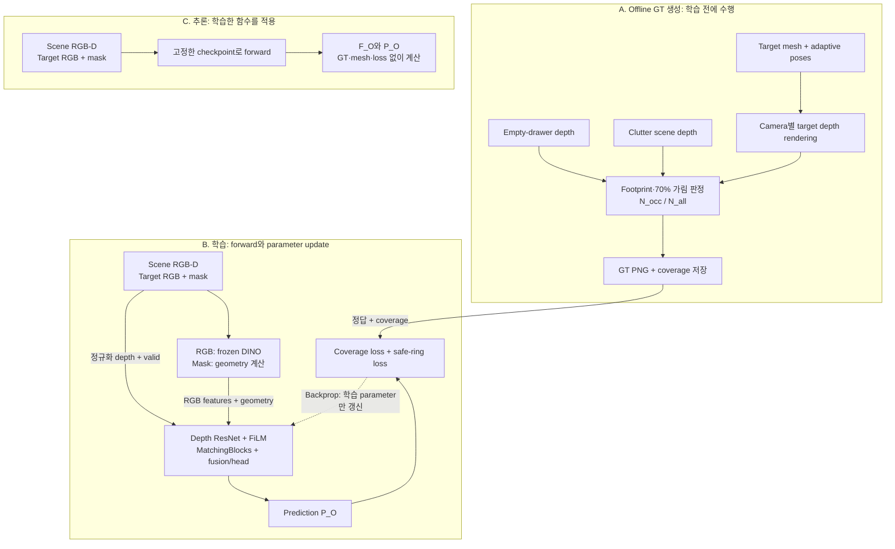

Forward는 입력에서 예측을 계산하는 과정임. Backpropagation은 예측과 GT의 차이가 줄어들도록 학습 가능한 weight에 gradient를 전달하는 과정임. 여기서는 depth encoder·FiLM·MatchingBlocks·fusion/head가 갱신되고, DINO와 정해진 mask descriptor 계산은 학습하지 않음. GT renderer를 이 loss로 수정하거나 test GT를 추론 입력으로 주는 구조가 아님.

추론에서는 같은 입력 전처리와 network 계산을 수행하지만, GT 비교와 weight 갱신을 하지 않음. Mesh 없이 예측할 수 있도록 학습한다는 뜻이지, GT 생성에 사용한 모든 물리 정보를 RGB-D만으로 정확히 복원했다는 뜻은 아님.

#### 2. Adaptive candidate pose: 어디에 target을 가상으로 놓는가?

Candidate pose 하나는 target의 위치 `(x,y,z)`와 yaw 회전각을 정한 한 배치 가설임. Target mesh를 그곳에 놓았다고 가정하여 camera에서 보이는 depth를 렌더링함. 현재는 yaw만 바꾸며 임의 roll/pitch와 연속적인 모든 높이를 탐색하는 방식은 아님.

모든 target에 같은 좁은 중심 범위를 주면 작은 target이 벽 근처에서 가려질 수 있는 후보를 놓칠 수 있음. 반대로 큰 target에 지나치게 넓은 중심 범위를 주면 일부 mesh가 drawer 밖으로 나감. 따라서 각 target·yaw의 **원본 mesh XY 끝점**을 계산하고, 전체 mesh가 drawer XY 경계 안에 들어오는 중심 위치만 1cm 간격으로 열거함.

| 설정 | 현재 production 값 |
|---|---|
| Render 해상도 | 높이 480 × 너비 640 |
| Drawer XY bounds | 각 축 `[-0.35,0.35] m` |
| Wall clearance | `1 mm` |
| XY sampling | World origin에 정렬한 `1 cm` lattice |
| Yaw | `0°,30°,…,330°`, 총 12개 |
| 높이 | Target별 `BASE_Z + {0,0.03,0.06} m` |
| Target scale | Native `1.0` |
| Candidate 수 | Target별 `53,412–143,640`, 16개 합계 `1,783,176` |
| GT inventory | `16 targets × 3,000 scene keys × 5 cameras = 240,000 maps` |

`1cm` 간격, `30°` yaw 간격, 세 높이와 `70%` 가림 기준은 현재 GT가 사용하는 표집·판정 설정임. 모든 실제 target 배치를 빠짐없이 나타내는 물리 법칙이나, 이 간격과 threshold가 최적임을 입증한 결과가 아님. 이 설정을 바꾸면 표본 pose와 통과 비율이 달라져 GT도 달라질 수 있음.

예를 들어 회전한 mesh의 X 좌표가 `[x_min,x_max]`에 있으면 중심의 허용 범위는 `[-0.35+0.001−x_min, 0.35−0.001−x_max]`임. `0.001m`가 벽 여유이며, 이 구간 안에 들어오는 world-zero 기준 1cm 위치만 선택함. Y도 같은 계산을 함. 이때 좌표와 크기는 GT용 mesh의 미터 값으로 계산하며, network 입력의 mask 비율에서 실제 크기를 복원하여 grid를 만드는 것은 아님.

원본 unsimplified mesh는 후보 범위의 기준으로 유지함. Render mesh는 50k faces를 넘으면 약 10k faces로 단순화해 GPU rasterization에 사용하지만, 단순화된 작은 bbox를 이유로 후보 범위를 넓히지 않음. Pose별 depth는 batch로 만들어 scene depth 여러 장과 비교한 뒤 누적값을 저장함. 모든 pose의 RGB·depth 영상을 개별 파일로 저장할 필요가 없어짐.

Mesh 단위·camera depth 대응·단순화의 판정 안정성은 [Phase 6–8](#2026-08-0406--phase-6--mesh-depth-validation-and-gt-refinement)에 기록함. 여기서 “유효 pose”는 **drawer XY containment와 camera 투영에 대한 현재 규칙을 통과한 후보**라는 뜻임. Clutter mesh와의 충돌, 지지면, 낙하 후 안정성, 관측 뒤에 숨은 scene geometry를 모두 검사한 실제 배치 가능성 정답은 아님.

#### 3. Pose 하나가 70% 이상 가려졌는지 계산

가상 target pose `k`의 depth를 `D_t^k`, 빈 drawer의 depth를 `D_e`, 현재 clutter scene의 depth를 `D_s`라고 함. 모두 같은 camera·해상도·depth 규약에서 비교함. Pixel `(u,v)`에서 작은 유효 depth는 더 가까운 표면을 뜻하고, 0은 그 위치의 유효 depth가 없는 값임.

먼저 **유효 footprint** `F_k`를 계산함. Footprint는 가상 target이 image 위에 투영되어 차지하는 영역이고, 여기서는 그중 drawer 구조 자체에 가려지지 않는 부분만 남김.

$$
F_k(u,v)=[D_t^k(u,v)>0]\,[D_e(u,v)=0\ \lor\ D_e(u,v)\ge D_t^k(u,v)]
$$

대괄호 `[조건]`은 참이면 1, 거짓이면 0인 indicator임. `∨` 기호는 “또는”을 뜻함. 첫 조건은 target이 실제로 렌더링된 pixel인지 확인함. 둘째는 empty drawer가 target보다 앞에 있지 않거나 해당 empty depth가 없는 경우를 남김. 두 indicator를 곱했으므로 두 조건을 모두 만족해야 `F_k=1`임.

그 footprint 안에서 clutter 표면이 가상 target보다 앞에 있으면 occluded pixel `O_k`로 셈.

$$
O_k(u,v)=F_k(u,v)[D_s(u,v)\ne0][D_s(u,v)<D_t^k(u,v)]
$$

여기서 `O_k`는 pixel별 0/1 판정이고, `F_k`는 비교할 유효 target pixel의 영역임. Pose 전체의 가림 비율 `r_k`는 다음과 같음.

$$
r_k=\frac{\sum_{u,v}O_k(u,v)}{\sum_{u,v}F_k(u,v)}
$$

분자는 scene에 가려진 유효 target pixel 수, 분모는 유효 target pixel 수임. 예를 들어 유효 footprint 100px 중 75px 앞에 scene 표면이 있으면 `r_k=0.75`여서 `r_k≥0.7` 조건을 통과함. 65px이면 0.65여서 통과하지 못함. 유효 footprint가 0인 pose는 이 판정을 만들지 않고 제외함.

따라서 현재 GT의 accepted pose는 **100% 완전히 보이지 않는 경우만을 뜻하지 않음.** 유효 footprint의 30%까지 보일 수 있는 부분 가림도 포함함. 연구 목표에 완전히 가려진 target 탐색이 들어 있더라도, 현재 Occlusion 학습 목표의 수치적 기준은 그보다 넓은 `70% 이상 가림`임.

Drawer 벽 자체가 target을 가린 pixel은 왜 분모에서도 빼는가? Clutter에 의한 가림을 비교하면서 분자에서는 drawer 영향을 제외하고 분모에는 남기면 두 영역의 기준이 달라지기 때문임. 예를 들어 target 전체 120px 중 drawer에 가려진 20px을 제외하고 남은 100px에서 75px이 clutter에 가려졌다면 corrected ratio는 `75/100=0.75`임. `75/120=0.625`로 계산하면 다른 질문의 비율이 됨. 이 corrected denominator가 현재 정의임.

#### 4. Pose 판정 여러 개를 pixel map으로 바꾸기

Pose별 70% 판정은 target 전체에 대한 0/1 결과임. 이를 image map으로 바꿀 때는 각 pixel을 덮는 pose들만 모음. 어떤 pixel은 많은 pose가 덮고, 어떤 pixel은 일부 pose만 덮기 때문에 pixel마다 분모가 달라짐.

$$
N_{\mathrm{all}}(u,v)=\sum_kF_k(u,v)
$$

$$
N_{\mathrm{occ}}(u,v)=\sum_k[r_k\ge0.7]F_k(u,v)
$$

`N_all`은 해당 pixel을 유효 footprint로 덮은 모든 후보 수임. `N_occ`는 그 후보 중 pose 전체가 70% 가림 조건을 통과한 수임. `k`는 후보 pose index이고 합은 생성한 후보들에 대해 수행함. 최종 GT `G_O`는 다음 비율임.

$$
G_O(u,v)=\frac{N_{\mathrm{occ}}(u,v)}{N_{\mathrm{all}}(u,v)}
\quad\text{when }N_{\mathrm{all}}(u,v)>0
$$

**설명용 예: 한 pixel을 5개 pose가 덮었을 때.**

| 해당 pixel을 덮는 pose | Pose 전체의 가림 비율 `r_k` | 70% 기준 통과 | 그 pixel의 `N_occ`에 더하는 값 |
|---|---:|---|---:|
| A | 0.90 | 예 | 1 |
| B | 0.80 | 예 | 1 |
| C | 0.70 | 예 | 1 |
| D | 0.60 | 아니오 | 0 |
| E | 0.20 | 아니오 | 0 |

이 pixel에서는 `N_all=5`, `N_occ=3`이므로 GT는 `3/5=0.6`임. 뜻은 “이 pixel을 덮는 표본 pose의 60%가 전체 유효 면적의 70% 이상 가려졌다”임. 여기서 **70%는 pose를 통과시키는 기준이고 60%는 통과한 pose들의 비율**이므로 서로 다른 값임.

Accepted pose는 실제 가려진 `O_k` 부분만이 아니라 유효 footprint `F_k` 전체를 `N_occ`에 더함. 따라서 위 pixel 자체가 각 pose에서 몇 번 가려졌는지를 센 map과 다름. Target 중심 좌표만 찍는 map도 아님. 한 accepted pose의 넓은 footprint가 여러 pixel에 동시에 기여하므로 image 전체 합이 1이 될 이유가 없음.

후보가 한 번도 덮지 않은 곳, 즉 `N_all=0`에서는 이 비율을 정의할 표본이 없음. 이를 구분하는 mask가 `coverage = [N_all>0]`임. 저장할 때는 편의상 coverage 밖 GT를 0으로 채우지만, 물리적으로 어떤 pose에서도 절대 가림이 불가능하다는 의미로 확대하지 않음.

모든 GT는 `floor(255×G_O+0.5)`로 uint8 PNG에 저장하고 로드할 때 255로 나눔. 예시의 0.6은 153이 됨. Scene마다 min–max를 늘리거나 visible target을 255로 덧칠하거나 Similarity score를 섞지 않음. 따라서 동일한 밝기 값이 같은 candidate-acceptance 비율을 뜻함. 학습한 prediction의 실제 존재 확률 calibration이 검증됐다는 의미는 아님.

#### 5. Coverage를 고려해 16×16 pixel을 한 patch 정답으로 요약

GT는 원본 `480×640`이고 prediction은 `30×40`임. 두 값을 비교하려면 원본의 16×16 pixel, 총 256개를 하나의 patch 값으로 요약해야 함. 그런데 coverage 경계 patch는 표본이 있는 pixel과 저장용 0만 있는 pixel이 섞여 있음.

GT 평균을 단순히 256개 pixel 전체에서 내면 표본이 없는 영역의 0 때문에 경계 정답이 작아짐. 그래서 먼저 coverage 안의 값만 합하고, 실제 포함된 coverage 비율로 나누어 **관측된 GT 평균과 감독 가중치**를 분리함.

$$
w_j=\mathrm{AvgPool}_{16}(C)_j,\qquad
y_j=\frac{\mathrm{AvgPool}_{16}(G_OC)_j}{w_j+\epsilon}
$$

`j`는 30×40 grid의 patch index, `C`는 원본 pixel의 binary coverage, `AvgPool_16`은 서로 겹치지 않는 16×16 영역의 평균임. `w_j`는 patch 안의 coverage 비율, `y_j`는 그 coverage 안의 GT 평균이며, 작은 `epsilon`은 0으로 나누는 것을 막음.

```text
한 16×16 patch: 전체 256 pixel

128 pixel: coverage 안, GT가 모두 0.8
128 pixel: coverage 밖, 파일에는 0으로 저장

w = 128/256 = 0.5
AvgPool(GT×coverage) = (128×0.8)/256 = 0.4
y = 0.4/0.5 ≈ 0.8

학습 정답은 약 0.8, 이 patch의 loss 가중치는 0.5
```

즉 “coverage가 절반이니 확률 정답도 절반인 0.4”로 만들지 않음. Coverage가 전혀 없으면 primary loss 가중치가 0이 됨. 이 coverage는 GT 생성에서 얻은 **감독·평가 영역**이고, network가 예측을 만들 때 받는 입력 channel이 아님.

#### 6. Soft-label BCE와 SmoothL1으로 map을 학습

GT는 0/1 class label만이 아니라 0.6, 0.8 같은 확률 비율임. 이를 soft label로 두고 probability-form Binary Cross Entropy(BCE)를 계산함.

$$
\mathrm{BCE}(p,y)=-y\log p-(1-y)\log(1-p)
$$

`p`는 sigmoid 이후 예측, `y`는 위에서 구한 patch GT, log는 자연로그임. GT가 0.8이면 앞 항에 0.8, 뒤 항에 0.2의 비중이 걸림. 따라서 예측을 무조건 1로 올리는 것이 아니라 `p=0.8`에 맞추는 것이 BCE를 최소화함. 실제 계산에서는 log의 수치 안정성을 위해 `p`를 `[epsilon,1−epsilon]`으로 제한함.

| 설명용 GT `y=0.8` | 예측 `p` | BCE | 해석 |
|---|---:|---:|---|
| 과소 예측 | 0.4 | 약 0.8352 | GT보다 낮음 |
| GT와 같은 예측 | 0.8 | 약 0.5004 | 이 soft label에서 BCE가 최소 |
| 지나치게 높은 예측 | 0.99 | 약 0.9291 | 거의 확실하다고 잘못 예측하여 오차가 커짐 |

`p=y`인데 BCE가 0이 아닌 것은 오류가 아님. Soft label에는 0과 1의 비율이 함께 있으므로 최솟값 자체가 0보다 클 수 있음. Loss 숫자와 MAE를 같은 단위로 해석하면 안 되는 이유임.

여기에 확률 차이를 직접 회귀하는 SmoothL1 항을 더함. 현재 기본 `beta=1`이므로 `p,y∈[0,1]`인 범위에서는 `SmoothL1(p,y)=0.5×(p−y)²`와 같음. GT가 큰 patch를 더 중요하게 보려고 이 항에 `1+3y`를 곱함.

$$
L_{\mathrm{coverage}}=
\frac{\sum_j w_j\left[\mathrm{BCE}(p_j,y_j)+(1+3y_j)\mathrm{SmoothL1}(p_j,y_j)\right]}
{\max(\sum_jw_j,1)}
$$

`p_j,y_j,w_j`는 각각 patch 예측·GT·coverage 비율임. 합은 현재 batch의 patch들에 대해 수행하며, 분모의 `max`는 coverage 합이 너무 작을 때 0으로 나누지 않게 함. `y=0`이면 SmoothL1 가중치는 1, `y=1`이면 4임. 예를 들어 `y=0.8,p=0.4`라면 SmoothL1은 `0.5×0.4²=0.08`, 가중 후에는 `3.4×0.08=0.272`임. 이 예는 loss 계산의 설명이며 특정 학습 sample 결과가 아님.

이 조합은 낮은 값의 배경뿐 아니라 가림 GT가 높은 영역도 잘 맞히도록 하려는 선택임. BCE나 SmoothL1 중 하나를 제거한 현재 full16 ablation을 수행한 것은 아니므로, 각 항의 독립적 효과나 이 조합의 최적성을 주장하지 않음.

#### 7. Safe ring: coverage 밖의 제한된 보조 감독

Coverage 밖은 primary loss에 들어가지 않음. 그렇다고 그 전체를 무조건 0 정답으로 학습시키면 표본화가 누락한 후보까지 지울 위험이 있음. 현재는 adaptive coverage가 거의 없으면서 **고정 workspace 안에 충분히 들어온 patch만** 보조 영역으로 선택함.

```text
R_j = (coverage_fraction ≤ 0.0001)
      AND (workspace_fraction ≥ 0.95)

L_ring = Sum(R_j × BCE(p_j, 0)) / max(Sum(R_j), 1)
L_total = L_coverage + 0.0436912877 × L_ring
```

`R_j`는 조건을 만족하면 1인 선택 mask, `workspace_fraction`은 해당 16×16 patch 중 고정 drawer 내부인 비율임. `L_ring`은 선택한 patch에서 0을 예측하도록 하는 BCE의 평균임. Coverage loss와 각각 평균을 낸 뒤 작은 계수로 더하므로, 두 영역의 pixel 수를 그대로 합쳐 동일하게 취급하는 방식과 다름.

`0.0436912877`은 현재 protocol에 고정된 보조 loss weight임. 가림 threshold나 확률값, 물리 법칙에서 나온 상수가 아니며 최적성을 검증한 값도 아님. 또한 계수가 약 0.044라고 해서 전체 gradient의 정확히 4.4%가 ring에서 나온다는 뜻은 아님. 두 loss의 실제 값과 gradient가 함께 영향을 줌.

이 규칙은 현재 adaptive pose와 workspace를 전제로 한 약한 보조 감독임. 실제 충돌·지지 검사로 만든 “절대 불가능 영역”이 아니며, 모든 coverage 밖이나 image 외곽을 감독하지 않음. 학습 중 raw prediction에 workspace를 강제로 곱하는 연산도 아니므로, 아래 결과처럼 raw 외곽 반응이 남을 수 있음.

#### 8. 현재 학습 split과 checkpoint 선택

학습에는 `book_1–4`, `fruit_1–4`, `packaged_food_1–4`, `toy_1–4`의 기존 16개 target을 모두 사용함. 총 3,000개 scene key를 train/validation/test `2,400/300/300`으로 먼저 나누고, `scene_stride=10`으로 각 split에서 10%를 선택함.

| Split | Scene keys | Target pool 수 | Key당 cameras | 실제 samples |
|---|---:|---:|---:|---:|
| Train | 240 | 16 | 5 | 19,200 |
| Validation | 30 | 16 | 5 | 2,400 |
| Test | 30 | 16 | 5 | 2,400 |

한 scene의 center/top/left/right/bottom은 같은 물체 배치의 다른 관측임. 이 중 일부를 train, 일부를 test에 넣으면 같은 더미를 다른 각도에서 이미 학습한 결과를 새 scene 성능으로 오해할 수 있으므로, 다섯 view를 scene key와 함께 이동시킴. 같은 key는 모든 target pool에서도 같은 split에 둠.

다만 서로 다른 target pool의 같은 key가 동일한 실제 더미라는 뜻은 아님. 현재 데이터는 `target T ↔ scene/T`의 해당 clutter pool로 구성됨. 모든 target을 모든 clutter scene과 교차시킨 Cartesian dataset이 아니므로, target identity와 scene 분포의 상관은 남아 있음. Wrong-target 교체 실험이 이 모든 상관을 제거해 주지는 않음.

Batch 16, AdamW `lr=1e−3`, weight decay `1e−4`, BF16, seed 0으로 학습함. 최대 12 epoch·patience 3 조건에서 validation total loss가 가장 낮은 **epoch 3**을 best checkpoint로 선택했고 epoch 6에서 종료함. Test를 최소화하는 checkpoint를 고른 것이 아님.

현재 결과는 전체 GT를 생성한 뒤 그중 10% 조건으로 수행한 baseline 학습임. 생성 완료 240,000장을 전부 학습했다는 뜻이나 다중 seed의 안정성까지 확인했다는 뜻은 아님. Frozen DINO를 제외한 약 15.71M parameter를 같은 loss로 함께 갱신한 한 seed의 결과임.

### 5. 핵심 설계 과정과 검증 결과

#### 1. 왜 현재 baseline으로 돌아왔는가?

초기에는 target condition이나 local geometry 적용을 더 복잡하게 바꾸면 coverage 경계 오류를 해결할 수 있을 것으로 보았음. 그러나 “정답이 어느 후보 위치를 실제로 계산했는가?”를 확인하면서 중요한 원인을 발견함. 모든 target에 같은 좁은 XY grid를 적용한 GT가 작은 target의 가능한 후보 영역을 누락했음.

Peach에서 기존 fixed grid와 target/yaw별 adaptive grid를 비교하자 coverage가 110.69% 넓어졌고, 추가 영역에도 가림 확률이 존재했음. 같은 예측을 그대로 두고 GT만 바꿔 확인한 결과이므로 모델 변화와 구분할 수 있었음. Coverage 밖의 반응 일부를 곧바로 network 오류로 해석하면 잘못된 문제를 고치게 될 수 있다는 교훈임. 그렇다고 모든 외곽 반응이 올바르다는 뜻은 아니며, 현재 raw 결과에도 실제 한계가 남아 있음.

GT를 adaptive 방식으로 바꾼 뒤 native 68-D·raw broadcast·global FiLM의 비교적 단순한 baseline을 다시 학습함. 이 모델이 현재 합성 평가 범위에서 좋은 결과를 보여, 더 복잡한 oracle 구조로 계속 확장하기보다 현재 checkpoint를 보존하는 판단을 함.

| 연구 질문·가정 | 확인한 사실과 현재 선택 | 상세 이력 |
|---|---|---|
| Scene마다 밝기 기준이 다른 GT로 가림을 학습해도 되는가? | Corrected footprint의 `N_occ/N_all`을 공통 정의로 사용하고 scene별 min–max·visible overlay를 분리함 | [Phase 7](#2026-08-06--phase-7--gpu-rasterization-corrected-ratio-and-capture-reliability), [Phase 8](#2026-08-07--phase-8--mesh-based-legacy-and-probability-gt-generation) |
| Raw target vector를 없애면 일반화에 유리한가? | 당시 통제 실험에서 제거 시 악화됐고 재현 검사에서도 확인하여 raw broadcast 유지 | [Phase 15](#2026-08-21--phase-15--target-conditioning-path-diagnosis), [Phase 16](#2026-08-21--phase-16--fresh-paired-reproducibility-gate) |
| Exact 3D extent·local gate가 필요하지 않은가? | 상한선과 공간 적용 문제를 진단했으나 입력 계약 차이·trade-off가 남음. 현재 full16에 합치지 않음 | [Phase 21](#2026-08-22--phase-21--exact-3d-extent-diagnostic)–[Phase 30](#2026-08-25--phase-30--five-camera-development-heldout-oracle-check) |
| Coverage 밖이면 항상 잘못된 활성화인가? | Peach의 fixed grid가 후보를 누락함을 확인하여 adaptive grid로 변경 | [Phase 31](#2026-08-27--phase-31--target-specific-gt-coverage-check) |
| GT를 고친 뒤에도 복잡한 oracle 구조를 계속 추가해야 하는가? | Native 68-D·global FiLM으로 full16과 외부 1-target 결과를 확인해 baseline 보존 | [Phase 32](#2026-08-28--phase-32--full16-baseline-and-external-zero-shot-evaluation) |

과거 fixed grid·14-target split·multi-scale oracle·local residual gate는 당시 가설을 검사한 이력임. 본문의 현재 방법은 **16-target adaptive/native-geometry/global-FiLM baseline**이며, 다른 GT·split에서 얻은 과거 수치를 같은 모델의 성능표로 합치지 않음.

#### 2. 무엇을 입증했고 무엇은 설계 의도인가?

| 구성 | 기대하는 효과 | 현재 확인한 범위 |
|---|---|---|
| Frozen DINO와 target reference | 새 target을 같은 feature 규격으로 처리 | 외부 target 한 개의 전체 모델 평가. Frozen이라는 이유만으로 모든 새 target 일반화를 보장하지 않음 |
| Depth encoder와 geometry FiLM | 관측 depth를 target 크기·형태에 맞게 해석 | 전체 target 조건 교체 시 성능 저하. FiLM만의 기여나 RGB/depth 각각의 기여를 분리한 최종 실험은 아님 |
| Raw broadcast | Cosine에 압축되지 않은 target 정보 보존 | 이전 통제 실험의 제거 비교를 근거로 유지. 그 수치를 adaptive full16 ablation으로 간주하지 않음 |
| 여러 layer와 MatchingBlock | RGB-D·target·주변 문맥 통합 | 전체 구조의 GT 회귀 성능 확인. Layer 수나 각 convolution의 개별 최적성은 미입증 |
| Safe ring·workspace 후처리 | 제한된 비후보 영역 감독·외곽 출력 제한 | 현재 loss와 raw/masked 그림의 효과 확인. Raw 외곽 문제 자체가 해결된 것은 아님 |

#### 3. 평가 숫자는 어떤 영역과 해상도에서 계산했는가?

아래 수치는 **raw `30×40` prediction을 GT coverage 안에서 계산**함. 그림처럼 `480×640`으로 확대하고 workspace mask를 곱한 결과의 점수가 아님. 따라서 정량 범위와 마지막 masked 그림의 범위가 다르다는 점을 먼저 알아야 함.

다음 표의 `p`는 patch 예측, `y`는 coverage-aware patch GT, `w`는 patch의 coverage 비율임. `Sum`은 평가에 포함된 sample·patch의 합임.

| Metric | 현재 계산 | 숫자의 뜻 |
|---|---|---|
| Coverage-weighted MAE ↓ | `Sum(w×abs(p−y))/Sum(w)` | Coverage를 반영한 평균 절대 확률 오차 |
| Soft-IoU ↑ | `Sum(w×min(p,y))/Sum(w×max(p,y))` | Threshold 이전 확률 map의 겹침 |
| Pearson r ↑ | Fractional coverage로 가중한 상관 | 높은 곳·낮은 곳의 공간적 변화가 함께 움직이는 정도 |
| Binary IoU micro ↑ | `w≥0.5`인 patch에서 `p≥0.5`, `y≥0.5`의 전체 intersection / union | 모든 sample의 positive 영역을 합쳐 본 겹침 |
| Binary IoU macro ↑ | 같은 조건의 sample별 IoU를 nonempty union에서 평균 | Sample마다 한 번씩 반영한 겹침 |

예를 들어 MAE 0.014는 이 평가 영역에서 평균 약 1.4 percentage-point 차이라는 뜻임. 정확도가 98.6%라는 뜻은 아님. Soft-IoU는 확률값을 그대로 비교하고, binary IoU는 0.5 기준을 넘었는지만 보므로 값이 다를 수 있음. Pearson이 높아도 전체 밝기가 조금 치우칠 수 있어 MAE를 함께 봄.

표의 MAE·Soft-IoU·Pearson은 전체 coverage를 합친 집계임. Sample별 MAE를 먼저 평균하는 training summary와는 평균 순서가 달라 숫자를 섞지 않음. Coverage 밖의 raw activation은 이 지표에 포함되지 않으므로 **낮은 MAE를 영상 전체의 정확도로 해석하지 않음**.

#### 4. 기존 16개 target, 새로운 scene에서의 결과

30개 held-out scene keys ×16 targets×5 cameras, **2,400 samples**로 평가함. 모든 target identity는 학습 pool에 있었으므로 seen-target 평가이고, 이 scene keys는 학습에서 제외했으므로 scene-heldout 평가임.

Wrong-target 대조에서는 scene·정답·평가 coverage를 유지한 채 target의 RGB-derived vector와 geometry를 함께 다음 target으로 순환 교체함. 같은 scene에서 올바른 조건을 준 경우와 잘못된 조건을 준 경우의 차이를 보는 것임.

| 입력 조건 | MAE ↓ | Soft-IoU ↑ | Pearson r ↑ | Binary IoU micro ↑ | Binary IoU macro ↑ |
|---|---:|---:|---:|---:|---:|
| 올바른 target | 0.013997 | 0.868371 | 0.987379 | 0.812560 | 0.731591 |
| Cyclic wrong target | 0.047323 | 0.619694 | 0.863847 | 0.480352 | 0.408389 |

Wrong target을 주면 MAE가 커지고 겹침이 줄어 전체 모델이 target 조건을 실제로 사용한다는 근거가 됨. 그러나 appearance와 geometry를 동시에 바꿨으므로 FiLM만으로 생긴 효과는 아님. Target과 scene pool의 상관, 모듈별 기여까지 이 비교 하나로 해결했다고 보지 않음.

Macro의 nonempty sample 수는 correct 2,159개·wrong 2,307개로 다름. Prediction까지 포함한 union이 비어 있지 않은 조건을 평균하기 때문임. 전체 평균만 보면 target별 편차를 놓칠 수 있으며, seen-target micro IoU가 가장 낮은 target은 `book_1`, 약 `0.572`였음.

아래 그림은 **현재 epoch-3 checkpoint, `book_1`, test key `scene00010_env0279`**의 결과임. 평가 코드가 test inventory의 마지막 key를 선택한 사례이며 가장 좋은 결과나 평균에 해당하는 장면을 골랐다는 뜻은 아님.

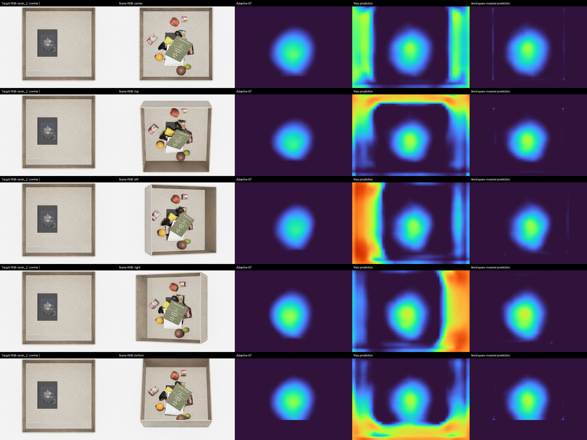

위에서 아래로 center/top/left/right/bottom camera임. 각 행을 왼쪽부터 읽으면 **공통 target RGB → scene RGB → adaptive GT → raw prediction → workspace-masked prediction**임. 왼쪽 reference는 scene camera가 바뀌어도 같은 center 사진임. 실제 prediction에는 scene depth도 들어가지만 이 패널의 scene 열은 RGB만 보여줌.

GT와 prediction은 모두 고정 `0–1` 범위의 Turbo colormap을 사용함. 낮은 값은 어두운 보라·파랑, 높은 값은 노랑·빨강으로 표시하며 scene별 min–max 확대는 하지 않음. GT와 raw prediction의 중앙 반응은 비슷한 위치에 있지만 크기·강도의 차이가 남음. Raw prediction에는 서랍 외곽의 강한 반응도 보이며, 마지막 열은 workspace 후처리로 그것을 제거한 결과임.

마지막 열이 깔끔해졌다고 raw network가 외곽을 스스로 해결한 것은 아님. Workspace는 중앙 확률의 과대·과소 예측을 수정하지도 않음. 또한 GT의 coverage 밖 어두운 값은 저장용 0을 포함하므로, 어두운 모든 pixel을 확률 0이 입증된 정답으로 읽지 않음.

#### 5. 외부 `packaged_food_5`에서의 결과

`packaged_food_5`는 이 Occlusion 모델 학습에 포함되지 않은 added target임. 이 target의 mesh로 adaptive GT를 새로 만들고, 기존 `packaged_food_1` clutter pool의 학습에 쓰지 않은 **30 scene keys ×5 views =150 samples**를 평가함.

외부인 것은 target identity임. Scene의 물체·환경 분포와 camera rig는 기존 합성 조건에 속하며, 다섯 view는 같은 scene의 상관된 관측임. 이를 새로운 환경 150개나 실제 로봇 영상 평가로 확대하지 않음.

| 넣은 target reference | MAE ↓ | Soft-IoU ↑ | Binary IoU micro ↑ |
|---|---:|---:|---:|
| **올바른 `packaged_food_5`** | **0.017998** | **0.811968** | **0.722825** |
| Wrong `book_1` | 0.096812 | 0.432128 | 0.291051 |
| Wrong `fruit_1` | 0.037533 | 0.529928 | 0.424924 |
| Wrong `toy_1` | 0.028164 | 0.736090 | 0.574839 |
| Wrong `packaged_food_1` | 0.015996 | 0.825885 | 0.725331 |

크기·형태가 다른 세 대조군은 correct보다 오차가 크고 map의 겹침이 낮았음. 다만 `packaged_food_1`은 일부 수치에서 correct보다 근소하게 좋았음. 두 target의 GT 자체가 매우 비슷하기 때문에 이 pair는 target 조건을 구별하는 대조로서 정보가 적음. 이 결과를 숨기거나, correct input이 모든 wrong input보다 항상 우수했다고 설명하지 않음. 관련 해석은 [Phase 32](#2026-08-28--phase-32--full16-baseline-and-external-zero-shot-evaluation)에 기록함.

| Camera | center | top | left | right | bottom |
|---|---:|---:|---:|---:|---:|
| Correct-target binary IoU micro | 0.777 | 0.716 | 0.722 | 0.650 | 0.753 |

아래는 같은 epoch-3 checkpoint로 외부 target과 test key `scene00010_env0279`를 평가한 그림임. 위 seen-target 그림과 행·열·색 범위가 같음.


작은 external reference를 조건으로 주었을 때 camera별 GT 공간 패턴을 대체로 따라감. 동시에 raw 외곽 반응과 GT 대비 강도 차이가 남아 있으므로, 다섯 camera의 공간 패턴 재현과 영상 전체의 완벽한 예측을 구분해야 함. 마지막 열 역시 workspace 후처리 결과임.

#### 6. 현재 결론과 남아 있는 범위

현재 evidence는 **고정 five-camera rig, native scale, 정확한 합성 target mask, 한 seed에서의 full16 baseline과 외부 target 한 개 평가**임. GT의 후보 범위 문제를 수정한 뒤 단순 baseline을 보존하고 다음 stream을 검토할 근거는 얻었지만, Occlusion의 모든 일반화 문제가 해결됐다는 결론은 아님.

남은 범위는 여러 external target, target mask 추출 오차, reference 거리·화각·방향 변화, 새로운 scene camera, sim-to-real, target scale 일반화임. GT 자체도 관측 depth의 가림 통계이지 충돌·지지·낙하 안정성을 포함한 완전한 실제 배치 정답이 아님. 각 모듈의 개별 기여와 최종 fusion·DRL 탐색 효용도 별도 검증이 필요함.

### 6. 질문과 답변

#### Q1. Scene depth가 있으면 가림 map을 직접 계산할 수 있는데, 왜 학습하는가?

**Target mesh와 camera 조건이 있으면 현재 GT 규칙의 map을 직접 계산할 수 있음.** 실제로 GT generator가 그렇게 동작함. 다만 target을 수만 개 pose에 놓아 렌더링하고 scene depth와 비교해야 하며, 새로운 target마다 mesh가 필요함.

현재 network의 목적은 그 계산을 매번 직접 수행하는 대신, **scene RGB-D와 target RGB·mask를 받아 GT map을 근사하는 함수**를 학습하는 것임. 예를 들어 GT 생성에서는 target에 따라 53,412–143,640개의 pose를 사용하지만, 학습한 모델의 한 forward에서는 그런 pose 목록이나 target mesh를 받지 않음.

여기서 학습으로 보이지 않는 내부 구조의 정답을 알아냈다고 해석하면 안 됨. Depth는 보이는 표면만 제공하고 GT도 그 관측과 제한된 후보 규칙에서 만들어짐. Model prediction은 이 정의와 입력 분포 안의 근사이며, 실제 물리적 배치 가능성을 완전히 판단하는 도구는 아님.

#### Q2. 실제 입력은 RGB 하나인가? Mask가 있으면 이미 target을 찾은 것 아닌가?

**현재 검증된 입력은 scene RGB-D와 따로 찍은 target RGB·mask임.** RGB 한 장만으로 실행한 전체 pipeline이 아님. Target mask는 더미 안에서 찾는 target의 위치를 가리키지 않고, reference 사진 속 단독 target의 윤곽을 가리킴.

예를 들어 찾을 책을 먼저 단독으로 촬영해 그 mask의 bbox가 96×64px임을 계산할 수 있음. 그 뒤 실제 더미 사진에서 책이 전혀 보이지 않아도 같은 reference vector와 geometry를 조건으로 줌. Reference mask를 안다는 사실은 더미 속 어느 위치에 책이 있는지 안다는 것과 다름.

현재는 이 reference mask를 합성 segmentation으로 정확히 얻음. 실환경에서 RGB 배경 차분이나 별도 segmentation으로 mask를 얻는 단계의 안정성은 아직 검증 과제임. Target mesh·GT가 forward 입력에 없다는 것과 실제 RGB-only capture pipeline이 완성됐다는 주장은 구분함.

#### Q3. 68-D geometry를 쓰면 target의 실제 가로·세로·높이를 아는가?

**현재 68-D descriptor는 영상상 크기·윤곽이며 미터 단위 3D 치수가 아님.** 면적·bbox 비율 3개, log aspect 1개, bbox 안의 8×8 silhouette 64개임.

예를 들어 너비 비율 0.1은 640px 영상에서 bbox가 64px라는 뜻임. Camera와 촬영 거리를 바꾸면 같은 물체도 32px나 128px로 보일 수 있음. Reference 촬영 규격이 고정돼 있을 때 이 비율이 크기 차이를 전달할 수 있지만, 비율 하나를 임의의 실제 길이로 바꿀 수는 없음. 두 물체의 위에서 본 silhouette가 같아도 실제 높이는 다를 수 있음.

과거 exact-extent oracle는 이 정보 부족을 진단하기 위해 실제 3D 길이를 제공한 다른 입력 계약임. 현재 native68의 일부 칸에 그 길이를 넣으면 숫자 폭은 같아도 학습한 뜻이 달라지므로 동일한 baseline 입력이 아님.

#### Q4. FiLM은 target마다 별도 모델이나 gamma·beta 표를 저장하는가?

**하나의 공유 MLP가 입력 geometry에서 gamma·beta를 계산함.** Target 이름을 key로 미리 저장한 조절값 표를 고르는 구조가 아님. 학습 중에는 이 MLP의 weight가 모든 target에서 공유됨.

예를 들어 새로운 mask에서 새 68-D vector를 만들면 같은 `68→64→2048` 함수에 넣어 네 branch용 조절값을 계산할 수 있음. 이때 2,048개는 `4 branches×2 kinds×256 channels`이며, target 종류 2,048개를 뜻하지 않음. 추론에서는 계산한 조절값을 같은 forward 안의 depth feature에 적용함.

새 입력을 계산할 수 있다는 것과 그 입력에서 정확하다는 것은 다름. 연속 vector를 받는 MLP도 기존 16개 target에 특화될 수 있음. 현재는 외부 target 한 개의 제한된 평가 근거가 있으며, 이를 모든 새 물체 일반화로 확장하지 않음.

#### Q5. Global FiLM이면 모든 위치에 같은 값이 적용되는데, 위치별 map이 어떻게 생기는가?

**같은 것은 channel별 gamma·beta이고, 조절 대상 feature는 위치마다 다름.** 따라서 같은 식을 적용해도 결과가 모두 같은 값으로 바뀌지는 않음.

한 channel에서 위치 A·B의 값이 0.6·0.2이고 `gamma=0.5,beta=-0.1`이면 결과는 각각 0.2·0.0임. Geometry가 바뀌면 조절값이 바뀔 수 있지만, 같은 geometry에서도 A·B의 공간 차이가 남음. 이후 MatchingBlock은 각 위치의 RGB feature와 주변 patch도 함께 사용함.

Global FiLM이 위치별로 보정의 적용 여부를 직접 결정하지 않는다는 한계는 있음. 이를 연구하려고 과거 local gate를 시험했지만 현재 baseline에는 포함하지 않음. Gamma·beta가 특정 물리량을 정확히 조절한다거나 “큰 target일수록 전체 map이 올라간다”는 고정 의미도 부여하지 않음.

#### Q6. FiLM은 attention인가? ResNet의 residual과 같은 것인가?

**현재 FiLM은 channel별 곱셈·덧셈이고, target–scene attention이나 별도 local residual gate와 다른 연산임.** Target geometry에서 만든 gamma·beta로 `E'=gamma×E+beta`를 계산함.

Attention은 설계에 따라 위치·token의 관계로 가중치를 만들어 정보를 모으는 방식임. 현재 head는 target의 전체 patch를 query로 두고 scene patch들에 attention을 수행하지 않음. DINO 내부에 attention이 있다는 사실과 head에서 target–scene cross-attention을 한다는 것은 다른 이야기임. ResNet residual은 depth encoder 내부에서 기존 feature에 convolution 결과를 더하는 연결 구조임.

Global FiLM을 식으로 `E+((gamma−1)E+beta)`라고 다시 쓸 수는 있지만, 그렇다고 과거의 위치별 gate·bounded residual이 현재 구현에 들어갔다는 뜻은 아님. 단순 concat·attention 대비 FiLM의 성능 우월성도 현재 full16 실험으로 따로 확정하지 않았음.

#### Q7. Target을 평균하면 부위 정보가 없어지는데, 왜 raw vector와 cosine을 둘 다 쓰는가?

**현재 모델은 target의 부위별 대응을 유지하는 대신 평균 appearance 조건을 사용함.** Raw vector와 cosine을 함께 주는 것은 그 평균 조건을 서로 다른 정보량으로 제공하는 방법임.

Cosine은 scene–target 관계를 위치마다 숫자 하나로 압축함. 서로 다른 scene feature가 같은 0.6 cosine을 가질 수 있으므로, 그 숫자만으로는 어떤 외형 차이에서 유사도가 생겼는지 알기 어려움. Raw scene·target vector를 함께 주면 MatchingBlock이 cosine에 남지 않은 feature 차이도 사용할 여지가 있음. Depth 역시 함께 들어가 외형 유사도와 관측 구조를 결합함.

다만 이 경로가 target의 각 부위를 scene에서 정확히 대응시키는 알고리즘은 아님. 평균 과정에서 target의 명시적인 공간 배치는 요약되며, raw broadcast를 넣는다고 부위별 patch matching이 복구되지는 않음. 현재 평가는 전체 가림 map의 GT 근사 성능임.

#### Q8. Map 값 0.8이면 그 위치에 target이 있을 확률이 80%인가?

**아님. GT의 0.8은 해당 pixel을 덮는 후보 pose 중 80%가 전체 유효 footprint의 70% 이상 가려졌다는 뜻임.** 실제 target 존재나 위치의 사후확률을 직접 감독한 값이 아님.

한 pixel을 덮는 후보가 5개이고 그중 4개가 pose 가림 기준을 통과하면 GT는 0.8임. 이때 후보가 scene에 실제로 존재한다는 증거를 4번 관측한 것이 아니라, target을 가상으로 놓은 조건들을 계산한 것임. Accepted pose는 footprint의 여러 pixel에 기여하므로 map 전체 합은 1이 아님.

또한 prediction의 0.8은 이 GT를 회귀한 값이며 통계적 calibration까지 완료했다는 뜻은 아님. 가장 높은 pixel이 곧 실제 target 위치나 최선의 제거 action이라고 보장하지 않음. 그 활용은 다른 stream과 action policy를 결합한 후 평가해야 함.

#### Q9. Coverage와 workspace는 같은 mask인가? GT mask를 주면 답이 새는 것 아닌가?

**두 mask는 다르고, target별 coverage는 network forward 입력이 아님.** Coverage는 현재 candidate pose가 한 번이라도 덮은 영역이고, workspace는 고정 camera에서 drawer 내부로 정한 영역임.

예를 들어 한 patch의 절반만 candidate footprint가 닿으면 coverage fraction은 0.5일 수 있지만, patch 전체가 drawer 안이면 workspace fraction은 1일 수 있음. Coverage는 이 patch의 GT 평균·loss·metric을 어디까지 유효하게 계산할지 정함. Workspace는 safe ring을 고르거나 출력의 drawer 외곽을 제거하는 데 사용함.

학습에서 정답의 유효 영역을 정하는 것과, inference에 target별 정답 map을 넣는 것은 구분해야 함. 현재 모델은 RGB-D·reference에서 먼저 raw 예측을 만들고 그 결과를 GT coverage에서 평가함. Coverage 밖의 성능은 그 지표가 말해 주지 않으며, 그곳에 저장된 0을 일반적인 물리 불가능 정답으로 해석하지도 않음.

#### Q10. MAE는 0.014로 낮은데 raw 그림의 서랍 벽이 왜 강하게 반응하는가?

**보고한 MAE가 GT coverage 안의 raw patch prediction만 평가하기 때문임.** Coverage 밖 외곽 반응이 크더라도 그 영역은 해당 MAE에 들어가지 않음. 낮은 숫자와 raw 외곽 오류는 동시에 존재할 수 있음.

Full16 그림의 네 번째 열이 raw prediction이고 다섯 번째 열이 workspace-masked prediction임. 마지막 열은 고정 mask를 곱해 외곽을 0으로 만든 결과이므로, 이를 raw 모델 자체의 개선으로 설명하면 안 됨. 또한 MAE 0.014는 평가된 확률의 평균 절대 오차 1.4 percentage points이며 image 전체의 98.6% 정확도가 아님.

현재 baseline을 사용할 때는 정량 점수의 영역과 후처리 의존성을 함께 확인해야 함. Workspace mask는 camera가 바뀌면 다시 맞아야 하며, 중앙의 과대·과소 예측이나 보이지 않는 구조의 불확실성을 해결하지 않음.

#### Q11. 기존 16개를 모두 학습했는데 무엇이 zero-shot이고, 무엇이 아직 검증되지 않았는가?

**기존 16개 결과는 seen-target scene-heldout이고, `packaged_food_5` 결과가 외부 target 평가임.** 기존 target을 학습에서 빼서 zero-shot을 만든 것이 아니라, 16개를 유지한 채 추가 asset을 평가함.

Full16 test는 30 held-out keys×16 targets×5 cameras의 2,400 samples임. External test는 학습에 없던 `packaged_food_5`와 기존 scene pool의 held-out 30 keys×5 cameras, 150 samples임. 같은 scene의 다섯 camera는 서로 독립된 새 scene이 아니라 상관된 관측임.

이 외부 결과도 합성 mask·고정 reference·native scale·기존 camera rig 조건임. 여러 unseen target, 실제 RGB에서의 mask 추출, 임의 camera·FOV, 다른 scene 물체 분포, sim-to-real을 모두 검증한 것이 아님. Frozen backbone을 사용했다는 사실만으로 이러한 일반화가 자동으로 따라오지 않음.

#### Q12. 30×40 map을 확대하면 pixel 단위 예측이 되고, 높은 곳의 물체를 바로 치우면 되는가?

**확대는 표시 해상도를 늘리는 보간이고, 제거할 물체를 정하는 action 모델은 아직 아님.** 실제 감독·예측의 기본 grid는 16px 간격의 30×40임. 각 feature가 더 넓은 문맥을 보더라도 출력 칸 수 자체가 늘어나는 것은 아님.

예를 들어 두 이웃 patch 값이 0.2와 0.8이면 확대 과정은 그 사이를 중간값으로 부드럽게 연결함. 그 중간 pixel의 물체 경계를 새로 관측하거나 target 위치 정답을 복원한 것이 아님. 또한 높은 위치가 여러 물체의 겹침 영역이라면 어떤 물체를 어떻게 집을지는 별도의 표현과 policy가 필요함.

현재 `F_O`는 향후 fusion의 입력으로 준비했고 `P_O`는 가림 GT를 잘 근사하는지 평가함. Similarity·Complexity와 합친 결과가 S+O만 쓸 때보다 좋은지, DRL이 더 빨리 target을 찾는지는 아직 별도 검증 전임.

#### Q13. 현재 full16 checkpoint를 `inference_occlusion.py`로 바로 실행할 수 있는가?

**현재 기존 standalone `inference_occlusion.py`를 full16 checkpoint에 그대로 연결하면 안 됨.** Full16은 `train_occlusion.py`와 `evaluate_occlusion_checkpoint.py`의 native 68-D 경로로 검증한 모델임.

기존 standalone script는 과거 exact-extent `A_XYZ_RING` checkpoint의 별도 target capture·geometry 계약을 사용함. 같은 68-D tensor를 받더라도 앞 칸들의 의미와 전처리가 다르면 호환되는 입력이 아님. 이 README에서 설명한 것은 center RGB와 mask의 native descriptor이며, 과거 3D extent 입력으로 대체하는 방식이 아님.

최신 full16 입력 규격의 standalone 배포 CLI는 아직 정리되지 않음. 공개 clone의 모든 파일이 최신 로컬 학습·평가 pipeline과 자동 동기화된 것도 아니므로, 재현 시 코드·checkpoint·geometry schema·depth 정규화·camera 조건을 함께 확인해야 함. 이 실행 경로의 공백을 모델의 실제 평가 결과와 혼동하지 않음.

---

## Complexity Stream

> **현재 상태:** RGB-D density pilot은 실행 가능하다. 최종 구조적 Complexity의 GT는 미확정이다. Frozen-DINO 표현 진단은 A만 완료했으며, 물체 묶음 B와 추가 공간 표현 C의 효과는 아직 측정하지 않았다.

### 1. 목적과 입출력

#### 먼저 구분할 네 가지 용어

이 절에서 **scene**은 여러 물체가 들어 있는 서랍 영상이고, **stream**은 그 영상에서 특정 종류의 정보를 만드는 처리 경로다. **Feature**는 다른 계산에 사용할 숫자 묶음이며, **GT(ground truth)**는 학습·평가에서 정답으로 정한 값이다. Feature를 64개 만든다는 말과 64개의 정답 항목이 있다는 말은 다르다.

**Density pilot**은 “현재 입력으로 가시 개수와 점유율을 예측할 수 있는가?”를 확인한 초기 모델이라는 뜻이다. 이때의 정답을 잘 맞혔다는 사실은 확인할 수 있지만, 그 정답이 더미 구조의 모든 차이를 담는지는 또 다른 질문이다. 아래에서는 먼저 실행되는 모델을 설명한 다음, 그 모델로 확인한 범위와 아직 정의하지 않은 최종 Complexity를 구분한다.

Complexity는 target identity와 무관하게 **물체 더미 내부의 국소 구성과 물체 간 관계 차이**를 표현하려는 stream이다. Similarity가 보이는 물체와 target의 외형·의미 관계를, Occlusion이 해당 target이 가려질 수 있는 위치를 다루는 동안, Complexity는 scene 자체의 구조를 보완하려 한다.

예를 들어 넓은 책 한 권과 여러 물체가 빽빽하게 섞인 영역은 모두 높은 점유율을 가질 수 있다. 비스듬한 책 한 권은 depth 변화가 크고, 같은 높이의 여러 물체는 depth 변화가 작을 수 있다. 따라서 점유율·개수·depth 변화 중 하나를 그대로 최종 복잡도라고 정하기 어렵다. RGB의 물체 외형·문맥과 depth의 관측 기하를 함께 다루되, 무엇을 복잡도의 정답으로 삼을지는 별도로 검증해야 한다.

다음 두 예는 RGB와 depth의 역할을 구분하기 위한 가상 장면이다. 어느 장면이 “더 복잡하다”는 정답을 미리 붙이는 예가 아니다.

| 가상 장면 | Depth만 보았을 때 | RGB가 보완할 수 있는 정보 | 여전히 모르는 것 |
|---|---|---|---|
| 같은 높이에 책·상자·장난감이 나란히 놓임 | 물체 윗면이 비슷한 깊이라 넓은 한 표면처럼 보일 수 있음 | 색·무늬·윤곽·문맥이 서로 다른 영역임을 구분하는 단서 | 같은 높이라고 접촉·지지 관계가 같은지는 알 수 없음 |
| 큰 책 한 권이 기울어져 있음 | 영상의 한쪽에서 다른 쪽으로 깊이가 크게 변함 | 변화가 하나의 책 내부에서 이어진다는 단서 | 책 아래에 보이지 않는 물체가 몇 개 있는지는 알 수 없음 |

```text
가상 예 A: 같은 높이의 여러 물체          가상 예 B: 기울어진 책 한 권
RGB 영역: [책 A] [상자 B] [장난감 C]      RGB 영역: [        책 A        ]
depth 예: 2.90    2.90      2.90 m         depth 예: 2.85 → 2.90 → 2.95 m

낮은 depth 변화 ≠ 한 물체                 높은 depth 변화 ≠ 여러 물체
```

현재 구현은 이 연구 목표를 완성한 모델이 아니라, **관측 가능한 가시 label-group 개수와 점유율을 학습하는 density pilot**이다. 이 모델로 RGB의 추가 효과와 공통 feature 규격을 확인했다. 이후의 근접도·정적 제거·표현 진단은 기존 목표가 놓치는 능력을 확인하기 위한 실험이며, 서로를 대체하는 확정 Complexity GT가 아니다.

#### 현재 실행 가능한 입력과 출력

현재 pilot은 고정 five-camera rig의 한 시점씩 처리한다. 다른 camera의 영상을 한 번에 합치거나 숨겨진 물체를 복원하는 모델은 아니다.

| 항목 | 규격 | 의미 |
|---|---|---|
| Scene RGB | `B×3×480×640` | target image·category text 없이 scene 외형과 문맥 입력 |
| Scene depth | `B×1×480×640`, meter | 현재 데이터의 image-plane **axial-Z depth**; camera에서의 유클리드 ray distance와 구분 |
| Camera별 고정 reference | workspace mask와 empty-drawer depth, 각각 `480×640` | 관심 영역과 물체가 없는 고정 배경을 정의; 현재 scene의 GT segmentation이 아님 |
| Auxiliary prediction | `B×4×30×40` | 48/96/160px count score 3개와 patch occupancy 1개 |
| Stream feature `F_C` | `B×64×30×40` | 학습한 RGB-D feature 55개와 직접 depth cue 9개; 향후 fusion용 중간 표현 |

`B`는 한 번에 처리하는 영상 수다. 공간 격자 `30×40`은 `480/16 × 640/16`에서 나온다. `F_C`의 64 channels는 64개 물체나 64종 복잡도 등급이 아니라 각 patch 위치의 feature 성분이다. 최종 `F_C` 자체에는 sigmoid를 적용하지 않으며, 4개 auxiliary map에만 sigmoid를 적용한다.

예를 들어 영상 한 장이면 `B=1`이다. `1×64×30×40`은 30행×40열의 각 위치에 숫자 64개가 놓여 있다는 뜻이다. 이를 channel별로 펼치면 작은 영상 64장처럼 볼 수 있지만, 학습한 55개 channel 각각에 “물체 수”, “접촉”, “가림”이라는 이름이 사전에 붙어 있는 것은 아니다. 나머지 직접 cue 9개만 아래에서 설명하는 고정 계산 의미를 갖는다.

Workspace mask는 “이 camera에서 어느 pixel을 서랍 관심 영역으로 볼 것인가”를 고정한 지도다. Empty depth는 같은 서랍을 비웠을 때의 깊이 영상이다. 둘 다 매 scene의 물체 정답을 알려 주는 segmentation과 다르다. 현재 구현은 이 reference가 있는 rig를 전제로 하므로 RGB-D camera만 임의의 장소로 옮기면 그대로 쓸 수 있다는 뜻은 아니다.

추론 시 segmentation·asset 이름·target reference는 입력하지 않는다. 학습 정답은 저장된 segmentation으로 만들지만, 모델이 사용하는 scene 관측은 RGB-D와 고정 reference다. 별도의 Phase 34–35 GT-label 기반 진단과 이 추론 경로를 구분한다.

### 2. 전체 모델 구조

전체 계산에는 두 종류의 경로가 있다. RGB는 사전학습한 DINO와 작은 학습 모듈을 거치고, depth는 먼저 사람이 정한 식으로 9개 cue를 만든 뒤 작은 학습 모듈을 거친다. 두 결과를 합쳐 학습 feature 55개를 만들고, 원래의 직접 depth cue 9개를 다시 붙인다. 마지막 작은 head는 이렇게 얻은 64개 숫자를 네 가지 감독값으로 읽어 낸다.

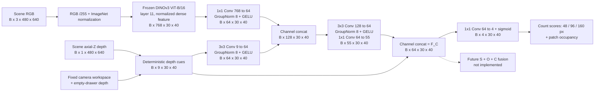

#### 영상 한 장의 한 위치를 따라가기

한 RGB-D 영상을 넣으면 모든 격자 위치에서 아래 계산이 동시에 진행된다. 다음은 그중 한 위치만 골라 차원을 표시한 것이다.

```text
한 위치 p에서:
  RGB 경로:   DINO 숫자 768개 → 학습 projection → 숫자 64개
  Depth 경로: 직접 cue 9개    → 학습 projection → 숫자 64개
                                               └─ 둘을 이어 붙임: 128개
  128개 + 주변 격자 문맥 → 학습 fusion → 숫자 55개
  학습한 55개 + 원래 depth cue 9개     → F_C의 숫자 64개
  F_C의 64개 → auxiliary head          → 예측 숫자 4개

각 위치 p를 30×40=1,200곳에 놓으면 위 tensor 전체가 된다.
```

여기서 `concat`은 64와 64를 더해 같은 자리의 숫자 64개를 만드는 연산이 아니다. 두 목록을 뒤에 이어 붙여 128개로 만드는 연산이다. 그다음 convolution이 학습한 가중치로 이 128개를 섞는다. 반면 직접 cue를 붙이는 마지막 `55+9`는 55개에 9개를 이어 붙여 최종 폭을 64개로 맞추는 것이다.

### 3. 내부 모듈과 선택 이유

| 연산 | 역할과 선택 이유 | 확인한 범위 |
|---|---|---|
| Frozen DINOv3 layer11 | 1,200개 patch마다 768-D 외형·문맥 feature를 제공한다. Backbone을 고정하여 작은 RGB-D head의 효과를 비교한다 | Layer11을 사용한 pilot이며 layer 선택의 독립 ablation은 아님 |
| RGB `1×1 Conv` | 각 위치의 768개 feature를 64개로 압축하여 depth branch와 결합하기 쉽게 한다 | RGB branch 자체는 공간 해상도를 변경하지 않음 |
| Depth `3×3 Conv` | 9개 직접 cue를 64개로 변환하면서 feature 격자의 이웃 정보를 혼합한다 | Image-space 이웃 연산이며 3D 물체 그래프 연산은 아님 |
| `Concat → 3×3 Conv → 1×1 Conv` | RGB와 depth를 함께 보고 55개 feature를 학습한다 | 어떤 물체 관계가 저장되는지를 별도 검증해야 함 |
| GroupNorm 8 + GELU | Channels를 8개 그룹으로 정규화하고 비선형 변환을 추가한다 | 정규화 방식·폭의 최적성을 별도 입증한 것은 아님 |
| 직접 cue 9개를 다시 concat | 계산 가능한 기하 정보를 학습 bottleneck 뒤에도 남겨 `55+9=64`를 만든다 | 현재 S/O feature와 같은 규격을 맞춘 설계; 최적 채널 배분이라는 증거는 없음 |
| `1×1 Conv 64→4 + sigmoid` | 각 위치를 세 count score와 occupancy로 읽어 학습 신호를 제공한다 | 4개 map은 target 존재 확률도 최종 scalar Complexity도 아님 |

DINO는 freeze하고 RGB/depth projection, fusion convolution과 auxiliary head만 학습한다. Feature의 형식을 `64×30×40`으로 맞췄다고 세 stream의 의미가 자동으로 정렬되거나 fusion 효용이 검증되는 것은 아니다.

#### RGB 모듈: pixel 색에서 위치별 feature까지

입력 RGB의 각 pixel에는 빨강·초록·파랑 값이 있다. 이를 255로 나누고 ImageNet의 mean `(0.485,0.456,0.406)`와 std `(0.229,0.224,0.225)`로 channel별 정규화하여 DINO에 넣는다. 이는 사전학습 encoder가 기대하는 입력 scale을 맞추는 전처리이며, 밝은 pixel을 복잡한 pixel로 바꾸는 규칙이 아니다.

DINOv3 ViT-B/16은 입력을 16×16 단위로 읽고 transformer를 거쳐 각 위치의 768-D token을 만든다. 현재는 0부터 센 index 11, 즉 마지막 12번째 block의 dense 출력을 사용한다. `norm=True`는 backbone의 LayerNorm을 적용한다는 뜻이다. 이 density pilot에서 DINO token을 매번 길이 1의 vector로 만드는 별도 L2 normalization을 하는 것은 아니다. 뒤에서 설명할 Phase 36 pair probe는 비교를 위해 L2 normalization을 별도로 적용한다.

16×16×3의 원본 RGB 값 수도 우연히 768이지만, DINO의 768-D token이 그 pixel 값을 그대로 펼친 것은 아니다. 학습한 projection과 여러 attention block을 통과하여 주변·전체 영상 문맥이 섞인 결과다. 그래서 같은 색의 pixel이라도 책 위인지 바닥인지에 따라 feature가 달라질 수 있다. 다만 각 channel이 어떤 개념을 담당하는지 고정된 사전을 갖는 것은 아니다.

`1×1 Conv 768→64`는 한 위치의 768개 숫자를 서로 다른 64개의 가중합으로 바꾼다. 공간 위치는 유지하고 channel 수만 줄인다. 예를 들어 출력 channel 하나는 768개 feature에 각기 다른 학습 가중치를 곱해 더한 값이다. 다음 GroupNorm/GELU를 거쳐 depth branch와 결합할 64개 표현이 된다. 이 압축이 적절한지는 downstream 예측으로 확인하며, 64가 이론적으로 정해진 최적 폭은 아니다.

#### Depth 입력: 동일 pixel의 빈 서랍과 현재 장면 비교

Depth는 RGB와 달리 색이 아니라 거리값을 갖는다. 현재 원본 데이터는 camera의 optical axis 방향 깊이인 axial-Z를 meter로 저장한다. 화면 가장자리 pixel까지의 비스듬한 ray 길이와는 다른 양이다. 본 pilot은 이 값에서 아래 image-space cue를 계산하며, 모든 cue를 3D 표면 곡률로 해석하지 않는다.

#### Depth branch의 9개 직접 cue

Depth cue는 segmentation 없이 계산한다. Scene depth $d$와 동일 camera의 empty depth $d_0$가 모두 유한한 양수이고 workspace 안에 있는 pixel만 유효하다. 빈 서랍과 scene의 차이를 다음처럼 둔다.

$$
\Delta(u,v)=d_0(u,v)-d(u,v).
$$

양수는 빈 배경보다 camera 쪽으로 나온 표면이라는 뜻이다. 거칠기 계산 전에는 음수를 0으로 자르지 않는다. 각 patch 중심에서 다음 9개 map을 만든다.

다음은 계산 방향을 보여 주는 가상 meter 값이며 실제 실험 수치가 아니다.

| 같은 pixel의 empty depth `d₀` | 현재 depth `d` | `Δ=d₀−d` | 계산에서의 취급 |
|---:|---:|---:|---|
| 3.00m | 2.90m | +0.10m = +100mm | 빈 배경보다 앞선 표면. 15mm보다 크므로 직접 foreground 조건 만족 |
| 3.00m | 2.99m | +0.01m = +10mm | 앞쪽이지만 고정 15mm threshold에는 못 미침 |
| 3.00m | 3.02m | −0.02m = −20mm | 거칠기 계산에서는 부호를 보존. 직접 foreground는 아님 |
| 3.00m | 0 | 계산에서 제외 | Invalid depth를 “3m 앞에 물체가 있다”는 관측으로 해석하지 않음 |

음수 차이는 reference 정합이나 관측 차이 등으로 생길 수 있다. 이를 곧바로 물체의 수나 특정 물리 상태로 해석하지 않는다. 부호를 보존하는 이유는 0에서 인위적으로 잘린 신호의 모서리를 만들지 않기 위해서다.

| Channel | 실제 계산 | 의미와 주의점 |
|---|---|---|
| 1. Normalized depth | 유효 patch depth 평균을 `(mean−2.5m)/(3.5m−2.5m)`로 변환 후 `[0,1]` 제한 | 절대 깊이 단서이며 값이 크다고 더 복잡한 것은 아님 |
| 2. Direct foreground occupancy | 유효 pixel 중 `Δ>15mm`인 비율 | Empty reference보다 충분히 앞선 표면 비율; segmentation occupancy와 정의가 다름 |
| 3. Depth validity | Patch 256px 중 scene/empty depth와 workspace가 모두 유효한 비율 | Invalid 0-depth를 실제 표면으로 해석하지 않기 위한 지원 정보 |
| 4–6. Plane residual RMS | 48/96/160px window에서 `Δ`에 affine plane을 최소제곱 적합한 잔차 RMS를 `30mm`로 나누고 `[0,1]` 제한 | 단순 image-space 기울기를 제거한 잔차; 물체 수나 metric 곡률이 아님 |
| 7–9. Gradient variation | 각 window에서 유효 인접 pixel 사이의 수평·수직 `Δ` 차분 분산 합의 제곱근을 `20mm`로 나누고 `[0,1]` 제한 | 일정한 기울기보다 국소 변화에 반응; first difference는 1px 간격 |

**첫 세 channel은 16×16 patch를 요약한다.** 평균 depth가 2.90m라면 normalized depth는 `(2.90−2.50)/(3.50−2.50)=0.40`이다. Patch 256px 중 유효 pixel이 224개이고 그중 168개가 `Δ>15mm`이면 직접 occupancy는 `168/224=0.75`, validity는 `224/256=0.875`다. 두 값의 분모가 다른 이유는 occupancy가 “관측한 부분 중 얼마나 물체인가”, validity가 “patch 전체 중 얼마나 관측했는가”를 나타내기 때문이다. 유효 pixel이 하나도 없으면 평균·occupancy·validity를 모두 0으로 둔다.

**다음 세 channel은 기울어진 평면을 빼고 남은 차이를 본다.** `Δ`가 한 방향으로 `0,10,20,30mm`처럼 일정하게 증가하면 기울어진 plane으로 설명할 수 있다. 깊이 범위는 크더라도 plane을 맞춘 뒤 잔차는 0이다. 반대로 window 안의 여러 면·단차·곡률 때문에 하나의 plane으로 설명하기 어려우면 잔차가 생긴다. 하지만 단일 곡면 물체도 잔차를 만들 수 있으므로 잔차와 물체 수를 동일시하지 않는다.

**마지막 세 channel은 이웃 간 변화량이 일정한지 본다.** `Δ`가 매 pixel마다 10mm씩 증가하면 first difference가 모두 10mm여서 그 분산은 0이다. 반면 차분이 `0,30,0mm`처럼 달라지면 변화량의 분산이 양수가 된다. Plane residual이 window 전체를 하나의 기울어진 면으로 설명하는 오차라면, gradient variation은 인접 pixel 사이 변화량의 불균일성을 요약한다. 계산 경로가 다르지만 완전히 독립된 정보를 담는다는 ablation 증거는 없다.

Plane residual은 window의 유효 pixel에서 다음 연산에 해당한다. 좌표 $x,y$는 영상 크기로 나눈 image-space 좌표다.

$$
(a_s,b_s,c_s)=\arg\min_{a,b,c}\sum_{q\in V_s(p)}
\left[\Delta(q)-(ax_q+by_q+c)\right]^2,
$$

$$
r_s(p)=\sqrt{\frac{1}{|V_s(p)|}\sum_{q\in V_s(p)}
\left[\Delta(q)-(a_sx_q+b_sy_q+c_s)\right]^2}.
$$

여기서 `V_s(p)`는 해당 window의 유효 pixel 집합이다. `a_s,b_s,c_s`는 정답 label이나 학습 network parameter가 아니라, 그 window의 현재 depth 값에 가장 잘 맞도록 즉시 구한 plane 계수다. 각 pixel에서 “관측 Δ − plane이 설명한 Δ”를 구하고, 제곱 평균의 제곱근으로 음·양 잔차가 서로 상쇄되지 않는 크기를 얻는다.

가령 실제 계산된 residual RMS가 6mm라면 channel 값은 `6/30=0.20`, 45mm라면 `45/30=1.5`를 1로 제한한다. Gradient variation이 4mm라면 `4/20=0.20`이다. 이 30mm/20mm는 입력 scale을 맞추는 고정 정규화 기준이다. “30mm 이상이면 복잡하다”는 승인된 물리적 기준이나 최적 threshold가 아니다.

Gradient variation은 유효 인접 쌍의 first difference $g_x,g_y$에 대해 $\sqrt{\mathrm{Var}(g_x)+\mathrm{Var}(g_y)}$다. 일정한 선형 기울기라면 두 roughness cue는 0이 된다. Plane 계산은 전체 window 면적의 유효 비율 ≥25%, 유효 pixel ≥6, 비퇴화 좌표 조건을 요구한다. 조건이 부족한 roughness는 0으로 두고 workspace 밖에는 cue를 만들지 않는다. 따라서 지원이 부족한 위치의 0을 평탄함의 확정 판정으로 쓰지 않는다.

**왜 empty reference를 빼는가?** 초기 raw-depth cue는 빈 서랍의 벽·곡면에도 반응했다. 단순 plane 제거만으로 고정 배경의 비평면 구조까지 사라지지는 않았다. 현재 V2는 `roughness_reference="empty_difference"`로 위 여섯 roughness channel을 계산한다. `scene_depth=empty_depth`이면 굽거나 단차가 있는 빈 배경도 `Δ=0`이 되어 거칠기 0이 된다. 앞의 normalized depth·occupancy·validity 정의는 그대로다. 함수의 호환성 기본값은 과거 `scene`이므로 **실제 실행은 checkpoint protocol의 V2 설정을 사용해야 한다.**

이 보정은 고정 camera/empty scene의 정합을 가정한다. Camera/FOV·drawer 위치·depth calibration이 바뀌면 reference도 다시 검증해야 하며, 다른 rig와 실제 sensor에서의 강건성은 검증하지 않았다.

#### Depth projection과 RGB-D fusion: 계산한 cue를 학습에 연결

직접 cue 9개는 각각 `30×40` map이므로 한 위치에 숫자 9개가 모인다. `3×3 Conv 9→64`는 그 위치와 주변 8개 격자 위치의 cue를 함께 읽어 64개 channel을 만든다. 한 출력 channel이 참고하는 값은 일반적인 내부 위치에서 `3×3×9=81`개다. Padding 1을 사용해 map 크기는 30×40으로 유지한다. 이는 영상 격자의 이웃을 보는 계산이며, 어떤 격자가 같은 물체인지 직접 지정하는 graph 연산은 아니다.

RGB projection의 64개와 depth projection의 64개를 이어 붙이면 128개다. `3×3 Conv 128→64`가 두 정보를 주변 위치와 함께 혼합하고, `1×1 Conv 64→55`가 학습 feature 55개를 만든다. 예를 들어 RGB는 다른 물체의 경계를 시사하지만 depth 차이가 작은 경우와, RGB로 같은 책 내부인데 depth 기울기만 큰 경우를 다르게 표현하도록 학습할 여지가 있다. 실제로 모든 이런 관계를 구분한다는 보장은 count/occupancy loss만으로 얻어지지 않는다.

GroupNorm은 각 sample 안에서 64 channels를 8개 group, 즉 group당 8 channels로 나누어 공간 위치와 함께 정규화한다. 다른 영상이 batch에 어떤 비율로 들어왔는지에 의존하는 batch 통계를 쓰지 않는다. GELU는 가중합을 그대로 반복하는 대신 값에 따라 다른 비선형 반응을 추가한다. 두 연산 모두 trainable branch의 표현을 만드는 부품이며 별도의 Complexity 규칙은 아니다.

#### 왜 학습한 55개 뒤에 원래 depth cue 9개를 다시 붙이는가?

학습 branch만 남기면 depth cue가 여러 convolution을 지나며 다른 feature와 섞인다. 현재 설계는 이때도 원래 계산한 기하값을 뒤의 head가 직접 참고할 수 있도록 우회 경로를 남긴다. 예를 들어 학습 feature가 RGB 문맥을 강조하더라도 현재 위치의 유효 depth 비율 자체는 직접 읽을 수 있다.

```text
geometry9 ──→ 학습 depth projection ──→ RGB와 fusion ──→ learned55 ──┐
     └──────────────── 같은 9개 값을 그대로 유지 ──────────────────┤
                                                               F_C64
```

“직접 유지”는 cue마다 최종 출력에 얼마를 기여할지 고정한다는 뜻은 아니다. Auxiliary head는 이 9개에도 학습 weight를 적용할 수 있고 유용하지 않은 channel의 기여를 줄일 수 있다. 다만 cue 값 자체를 만드는 depth 수식은 학습하지 않는다. `55+9`는 최종 64-channel 규격 안에서 직접 cue를 보존하려고 정한 배분이며, 다른 배분보다 우수한지는 아직 독립 비교하지 않았다.

#### 왜 `F_C64`와 sigmoid를 거친 4개 map을 따로 반환하는가?

`F_C64`는 풍부한 중간 표현이고 4개 map은 학습 중 정답과 비교할 수 있도록 그것을 읽은 결과다. 한 위치에서 head는 64개 feature의 가중합과 bias로 logit 4개를 만든 다음 각각 sigmoid를 적용한다.

$$
z_k(p)=\sum_{c=1}^{64}w_{kc}F_{C,c}(p)+b_k,
\qquad \hat y_k(p)=\frac{1}{1+e^{-z_k(p)}},\quad k=1,2,3,4.
$$

예를 들어 logit 0의 sigmoid는 0.5다. 첫 count channel에서 0.5는 학습 정규화상 약 `0.5×16=8`개 label-group을 뜻하고, occupancy channel에서 0.5는 알려진 영역의 절반이라는 뜻이다. 같은 0.5여도 감독한 항목에 따라 의미가 다르다. 어느 channel에서도 “target이 있을 확률 50%”를 뜻하지 않는다.

F_C 전체를 sigmoid로 자르면 학습한 55개 표현을 불필요하게 0–1로 제한하게 된다. 현재는 중간 feature의 값을 그대로 보존하고, bounded GT를 읽는 마지막 head에만 sigmoid를 적용한다. 최종 탐색용 fusion이 4개의 이미 압축된 숫자보다 어떤 중간 표현을 필요로 하는지는 후속 검증 대상이다.

### 4. GT 생성과 학습

#### 학습 때의 정답 경로와 추론 때의 관측 경로

학습에서는 이미 저장된 scene segmentation을 읽어 “이 색 그룹이 어느 pixel에 보이는가”를 안다. 이 정보로 count/occupancy 정답을 만든다. 하지만 RGB-D 모델에는 이 segmentation을 전달하지 않는다. 정답을 보면서 prediction의 오차를 줄이는 것과, 정답을 입력 feature로 넘기는 것은 다르다.

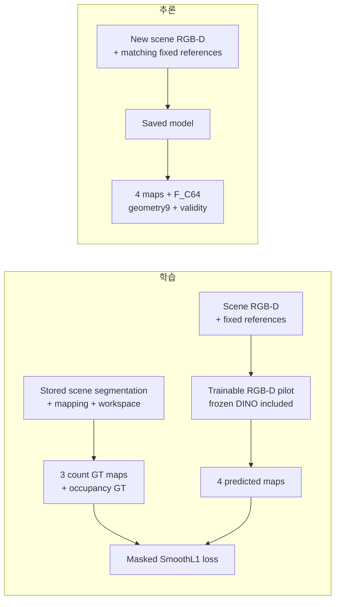

위 그림의 GT 경로는 학습·평가용이다. 새 scene의 count를 예측하려고 그 scene의 segmentation 정답을 먼저 얻는 구조가 아니다. 다만 GT segmentation으로 계산한 Phase 34–35 근접도 진단과, GT로 순수 patch를 골랐던 Phase 36 평가는 다른 조건이므로 각각의 범위를 따로 설명한다.

#### 가시 segmentation label-group count

저장 mapping은 asset 이름에 색을 연결하지만 영속적인 physical instance ID는 아니다. 서로 다른 asset이 동일한 색을 공유하는 충돌이 있고, 동일 asset을 여러 번 배치해도 색이 합쳐질 수 있다. Pilot은 **서로 다른 색 그룹을 각각 한 번** 센다. 같은 색의 조각이 영상에서 떨어져 있어도 하나로 센다.

Workspace pixel 집합을 $\Omega$, mapping에서 알려진 색 그룹을 $g$, 해당 그룹의 workspace 내 가시 pixel을 $A_g$라 하자. Patch 중심 $p$의 한 변 길이 $s$인 정사각 pixel window를 $W_s(p)$라 하면:

$$
n_s(p)=\sum_g
\mathbf{1}[|A_g|\geq32]\,
\mathbf{1}[|A_g\cap W_s(p)|\geq16],
\qquad s\in\{48,96,160\}.
$$

$$
y_s(p)=\min\left(1,\frac{n_s(p)}{16}\right).
$$

즉 전체 workspace에서 최소 32px 보이는 그룹 중, 해당 window와 최소 16px 겹치는 그룹을 센다. 작은 흔적을 무조건 하나의 물체로 세지 않기 위한 고정 threshold이며, 이 threshold가 모든 물체 크기·camera에서 최적이라는 검증은 하지 않았다.

여기에 등장하는 `16`은 역할이 서로 다르다.

| 숫자 | 뜻 | 서로 대체할 수 없는 이유 |
|---|---|---|
| `16×16` patch | DINO ViT-B/16의 공간 sampling 단위 | 480×640 입력이 30×40 feature 격자가 되는 이유 |
| Window와 겹치는 `16 pixels` | count에 포함할 최소 가시 증거 면적 | Patch 한 변이나 label 개수와 다른 면적 threshold |
| `count ÷16` | 원본 library의 16개 asset을 기준으로 한 고정 정규화 | Count score를 bounded scale로 학습하기 위한 값; patch 크기와 무관 |

다음 도식은 같은 출력 위치에서 이 세 개념이 어떻게 만나는지 보여 준다. 행·열은 0부터 세며 pixel 구간의 끝은 포함하지 않는 표기다.

```text
원본 영상: 높이 480 × 너비 640
  16×16 pixel씩 나눔 → 30행 ×40열 =1,200개 출력 위치

예: patch (행12, 열20)
  patch 자체: y=[192,208), x=[320,336) → 16×16=256 pixels
  코드에서 사용하는 window 중심: (y=200, x=328)

  count48:  y=[176,224), x=[304,352) →  48×48= 2,304 pixels 조사
  count96:  y=[152,248), x=[280,376) →  96×96= 9,216 pixels 조사
  count160: y=[120,280), x=[248,408) →160×160=25,600 pixels 조사

  가상 count:  1개         3개         5개 label-groups
  학습 정답:   1/16       3/16       5/16
              0.0625     0.1875     0.3125

결과 저장은 모두 같은 patch 위치 한 곳에 한다:
  y_count[:,12,20] = [0.0625, 0.1875, 0.3125]
```

즉 “출력을 어디에 기록하는가”는 patch grid가 정하고, “그 위치 주변에서 얼마나 넓게 세는가”는 window가 정한다. 마지막으로 “센 개수를 어떤 숫자 scale로 학습하는가”는 `÷16`이 정한다. 96px window를 썼다고 출력 격자가 96px 간격으로 바뀌거나 정답을 96으로 나누는 것이 아니다.

Pixel 최소 면적 조건도 count와 다르다. 예를 들어 그룹 A가 workspace 전체에서 100px 보이고 window 안에 20px 들어오면 `100≥32`, `20≥16`이므로 1을 더한다. 그룹 B가 전체에서 100px 보여도 window에 12px만 들어오면 그 window에는 더하지 않는다. 그룹 C가 전체에서 20px만 보이면 해당 작은 흔적이 window 안에 전부 들어와도 count에서는 제외한다. 다만 C가 알려진 mapping 색이면 아래 occupancy의 foreground에는 포함된다.

예를 들어 유효 window에 세 그룹이 포함되면 정답은 `3/16=0.1875`다. 영상별 min–max 정규화는 하지 않으며 16을 넘는 count의 clipping 비율은 별도로 기록한다. 색 충돌로 실제 3개 물체가 2개 색 그룹으로 보이면 현재 GT는 2를 센다. **Phase 36에서 충돌을 확인했지만 과거 density GT·checkpoint·수치는 소급 수정하지 않았다.**

48/96/160px은 가까운 영역부터 더 넓은 문맥까지 보기 위한 **세 가지 image-space window 가설**이다. 한 변 길이는 3/6/10 patch 폭에 해당하지만 count는 원본 pixel window에서 계산한다. 특정 물체의 metric 크기, 접촉 거리, grasp 범위를 뜻하지 않는다. Window 수·크기의 독립 ablation도 없으므로 이 조합이 최적이라고 주장하지 않는다. 큰 window의 count가 커질 수 있으며, `count/16`은 서로 다른 scale 사이의 물리 면적당 density가 아니다.

Count supervision의 유효 mask는 다음 두 조건을 모두 요구한다.

- **전체 정사각 window 면적의 ≥95%**가 workspace에 포함된다. 영상 밖으로 잘린 부분도 전체 면적 분모에 포함하므로 drawer 경계에서 작은 window인 것처럼 유리해지지 않는다.
- Window의 workspace 안에 mapping에 없는 nonblack pixel이 없다. Unknown을 빈 배경으로 가정하여 count를 낮추지 않는다.

예를 들어 96×96 window의 전체 면적은 9,216px이다. 그중 workspace가 9,000px이면 `9000/9216≈97.66%`로 면적 조건을 만족하지만, 8,600px이면 약 93.32%여서 해당 count supervision을 제외한다. 면적 조건을 만족해도 workspace 안에 unknown nonblack pixel이 들어 있으면 count mask는 0이다. “값이 작다”와 “정답을 신뢰할 수 없어 제외했다”를 구분하기 위한 장치다.

Pilot에서 mapping에 알려진 동일색 alias는 한 그룹으로 유지한다. Phase 36 대응 진단에서는 asset identity가 모호한 **충돌 색 자체를 unknown으로 제외**했으므로 두 실험의 label 처리와 metric을 혼동하지 않는다.

#### Patch occupancy

Occupancy는 더 큰 count window가 아니라 **16×16 patch 자체**의 면적 비율이다. $F$를 알려진 foreground pixel, $U$를 workspace 내 unknown nonblack pixel, $P(p)$를 해당 patch라 하면:

$$
y_{\mathrm{occ}}(p)=
\frac{|P(p)\cap F|}{|P(p)\cap(\Omega\setminus U)|}.
$$

분모가 0인 patch는 정답을 0으로 두고 loss weight도 0으로 둔다. Occupancy loss weight는 `알려진 workspace pixel 수 /256`이다. Count의 최소 면적 조건을 통과하지 못한 작은 **알려진** 색 그룹도 occupancy에서는 foreground다.

구체적인 가상 patch를 보자. 총 256px 중 16px이 workspace 밖이고, workspace 안의 240px 중 40px이 unknown이라고 하자. 알려진 영역 200px 중 물체가 150px, 배경이 50px이면:

```text
Patch 전체 256px
├─ Workspace 밖: 16px                    → 분자·분모에서 제외
└─ Workspace 안: 240px
   ├─ Unknown: 40px                      → 분자·분모에서 제외
   └─ 알려진 영역: 200px                  → occupancy 분모
      ├─ 알려진 foreground: 150px        → occupancy 분자
      └─ 알려진 background:  50px

Occupancy GT =150/200=0.75
Loss weight  =200/256=0.78125
```

`150/256`을 정답으로 쓰면 관심 영역 밖과 unknown을 모두 빈 배경처럼 세어 occupancy를 낮추게 된다. 현재 계산은 알려진 영역 안의 비율로 정답을 만들고, patch 전체 중 알려진 비율을 loss weight로 남긴다. 이 occupancy weight는 count window의 binary ≥95% 규칙과 다르다. 위 예의 patch occupancy는 유효한 정보 비율만큼 학습에 기여할 수 있다.

Occupancy가 1이라는 것은 알려진 workspace가 물체로 덮였다는 뜻이다. 넓은 한 물체와 여러 물체의 밀집 영역을 구분하지 못하므로 구조적 복잡도의 정답으로 채택하지 않는다.

#### Loss와 추론: auxiliary task가 feature를 만드는 방법

정답과 예측의 channel 순서는 `[count48/16, count96/16, count160/16, occupancy]`다. Count의 binary validity 3개와 occupancy의 알려진 workspace 비율 1개를 각각 loss weight $M_c$로 사용한다.

$$
\mathcal{L}=\frac{1}{4}\sum_{c=1}^{4}
\frac{\sum_{b,p}M_c(b,p)\,\ell_{0.05}(\hat y_c(b,p)-y_c(b,p))}
{\max\left(1,\sum_{b,p}M_c(b,p)\right)},
$$

$$
\ell_\beta(e)=
\begin{cases}
e^2/(2\beta),& |e|<\beta,\\
|e|-\beta/2,& |e|\geq\beta.
\end{cases}
$$

네 channel은 유효 영역의 크기로 각각 정규화한 뒤 동일 가중 평균한다. 즉 넓은 window가 유효 pixel 수 때문에 loss를 독점하지 않는다. **학습에는 count=0인 유효 window도 포함**한다. 주 평가·checkpoint 선택의 count MAE는 별도로 **GT count>0인 유효 window**에서 계산하여 빈 영역으로 오차를 희석하지 않는다.

SmoothL1은 작은 오차에는 제곱 오차처럼, 큰 오차에는 절댓값 오차처럼 반응한다. 예를 들어 count GT가 `3/16=0.1875`인데 모델이 `4/16=0.25`를 내면 오차는 `0.0625`다. 이는 `β=0.05`보다 크므로 이 위치의 가중치 적용 전 loss는 `0.0625−0.05/2=0.0375`다. 더 작은 오차 `0.02`이면 `0.02²/(2×0.05)=0.004`다. 이 값을 validity와 곱하고 channel별 유효 weight 합으로 나눈 뒤 네 channel을 평균한다.

#### 4개 정답으로 어떻게 55개 feature를 학습하는가?

55개 feature 각각의 정답 영상을 만드는 것은 아니다. 예측 map이 틀렸을 때 loss의 gradient가 head에서 feature를 만든 앞쪽 convolution으로 전달된다. 그러면 다음번 같은 입력에서 4개 GT를 더 잘 예측하도록 내부 feature와 head의 가중치가 함께 바뀐다. 이를 auxiliary supervision이라고 부른다. 중간 feature를 만드는 목적을 작은 예측 과제로 감독하는 방식이다.

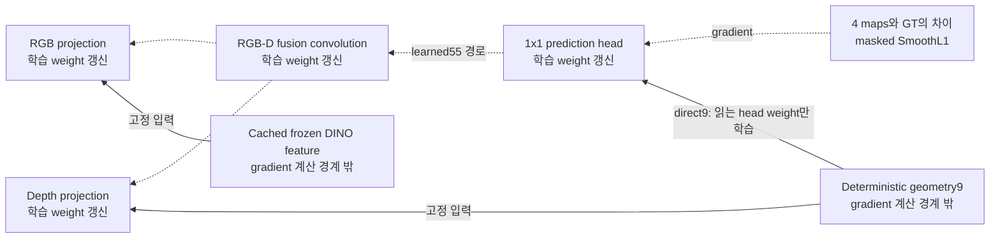

그림의 점선은 gradient가 학습 모듈로 전달되는 방향이고, 실선은 고정 feature를 읽는 입력 경로다. Cached DINO feature와 직접 depth 수식은 이 학습의 gradient 계산 경계 밖에 있다. Direct 9개 값은 바뀌지 않아도 그것을 읽는 head의 weight는 학습된다.

이 과정이 보장하는 것은 **4개 auxiliary GT를 예측하는 데 유용한 표현을 찾도록 학습한다**는 것이다. Count/occupancy가 구분하지 못하는 두 구조에 대해 내부 feature가 반드시 다른 관계 정보를 유지할 필요는 없다. 이것이 좋은 count 성능만으로 최종 구조 이해를 주장할 수 없는 이유다.

Frozen RGB feature를 cache하고 작은 head를 AdamW로 학습한다. RGB-D/depth-only 비교는 같은 architecture·초기값·sample 순서를 사용하며 depth-only는 DINO feature를 0으로 만든다. 따라서 head 크기가 다른 두 모델의 비교가 아니다. Validation occupied-window count MAE로 checkpoint를 고른 뒤 test를 평가한다.

추론에서는 `inference_complexity.py`가 checkpoint protocol, DINO weight와 고정 reference의 hash를 확인하고 RGB-D만으로 `maps(4,30,40)`, `features(64,30,40)`, `geometry(9,30,40)`, `validity(1,30,40)`를 반환한다. 학습 GT의 segmentation mask는 이 경로에 없다. 예측 count score에 16을 곱하면 가시 label-group 개수 단위로 해석할 수 있지만, 연속 추정치이며 정수 물체 수나 hidden count는 아니다.

Hash 확인은 파일 내용의 식별값을 비교하여 학습 때 사용한 weight·reference와 다른 파일이 섞이지 않았는지 검사하는 것이다. 같은 이미지 크기라는 이유만으로 camera 정합을 보장하지는 않는다. 또한 추론에서 반환하는 `validity`는 관측 depth의 유효 비율이지, segmentation을 사용한 모든 GT count mask가 다시 만들어졌다는 뜻은 아니다.

구현은 [`complexity_cues.py`](complexity_cues.py), [`complexity_model.py`](complexity_model.py), [`run_complexity_pilot.py`](run_complexity_pilot.py), [`inference_complexity.py`](inference_complexity.py)에 있다. 상세 실행법은 [density pilot 문서](docs/complexity_results/README.md)를 따른다.

### 5. 핵심 설계 과정과 검증 결과

실험은 count 예측을 시작으로, 그 목표가 놓치는 물체 관계와 표현의 능력을 순서대로 점검했다. 각 단계의 성공은 그 단계의 질문에 한정한다.

| 단계와 질문 | 주요 결과 | 현재 판단 |
|---|---|---|
| **Phase 33 — RGB가 count 예측에 도움이 되는가?** | All16 source pools·5 views, train/val/test `3,840/960/960`, 3 seeds에서 count MAE depth **0.8327 → RGB-D 0.6414**, **22.97% 감소** | Density 예측에는 RGB의 추가 효과가 있다. 간격·가림·접촉 구조나 탐색 효용을 검증한 것은 아님 |
| **Phase 34 — 다른 물체와 가까운 표면을 국소화할 수 있는가?** | GT label+depth의 근접도는 가까운 접경에 반응하고 단독 물체는 0. 하지만 투영 면적 편차 **3.1746%>사전 3%**로 통제 실패 | 관측 표면 근접도 후보로만 보존. 숨겨진 접촉·전체 적층·Complexity GT를 설명하지 못함 |
| **Phase 35 — 물체 평균 근접도가 제거 효과를 예측하는가?** | 실제 asset 10 layouts 재현 후 공통 **701조건/49 views**에서 새 노출 비율과 평균 Spearman **0.078**, visible area **0.387**, count **0.291** | 30mm 근접도의 물체 평균을 제거 순위 점수나 GT로 채택할 근거가 부족함. 근접 feature 전체의 무용함을 뜻하지 않음 |
| **Phase 36 — 기존 DINO에 물체 대응 정보가 없는가?** | 같은 category의 가시 asset 대응에서 DINO+position AUROC **0.998953**, depth+position **0.773882**, RGB-D+position **0.998908**, raw cosine **0.925424** | 순수 patch 내부 대응은 기존 feature에서 잘 읽힌다. 경계·다중 물체 관계나 최종 Complexity를 해결한 결과가 아님 |

#### Phase 33–35: 숫자가 잘 맞는 것과 구조를 설명하는 것은 다르다

Phase 33은 정해 둔 count GT를 RGB가 더 잘 예측하게 돕는지 물었다. Phase 34는 그 GT에 직접 들어 있지 않은 “다른 물체와 가까운 표면”을 따로 계산해 보았다. Phase 35는 그런 표면 점수를 물체 하나의 평균으로 요약했을 때 정적 제거 효과와 연결되는지 확인했다. 질문이 바뀌었으므로 앞 단계의 낮은 MAE를 다음 단계의 관계 이해 성능으로 옮겨 읽을 수 없다.

Phase 34의 근접도는 RGB edge detector가 아니다. 정답 label로 물체를 나눈 뒤 depth에서 복원한 관측 표면 사이의 거리를 계산한다. 서로 다른 두 물체의 가까운 표면에는 값이 생기지만, 물체 하나의 내부 무늬 때문에 값이 생기지는 않는다. 이 성질은 수식이 의도대로 동작한다는 근거이며, 그 점수가 모든 적층·가림을 대표한다는 근거는 아니다. 실제로 보이지 않는 표면의 관계는 관측된 거리만으로 계산할 수 없다.

Phase 35의 제거 효과도 행동 성공률과 다르다. 다른 물체를 그대로 두고 물체 하나만 지운 재렌더 영상에서 “새로 보인 다른 물체 영역”을 측정했다. 실제로 집을 수 있는지, 주변 물체가 떨어지거나 움직이는지, target을 찾았는지는 포함하지 않는다. 이 제한된 효과와도 물체 평균 근접도의 상관이 약했으므로, 근접도 평균을 곧바로 선택 정책의 정답으로 승격하지 않았다.

Phase 33의 count MAE는 세 window에서 유효한 occupied 위치의 오차를 계산하고 영상·scale·seed를 평균한 **가시 segmentation label-group 개수 단위**다. RGB-D는 5/5 camera에서 개선됐으며, 12개 test scene-key cluster를 함께 재표집한 개선량 95% 구간은 `[0.1790,0.2054]` 그룹이었다. RGB-D occupancy MAE는 `0.00854`, depth-only learned head는 `0.01524`, 직접 depth occupancy는 `0.00981`이다. 수치상 이득이 있어도 occupancy가 넓은 단일 물체와 다물체 밀집을 구분하지 못한다는 한계는 남는다.

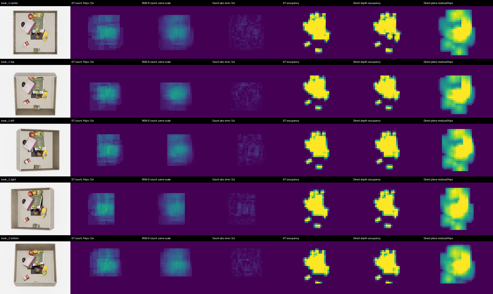

열은 scene RGB / 96px count GT / RGB-D prediction / 절대 오차 / occupancy GT / 직접 depth occupancy / depth plane residual이다. Count의 GT-valid window만 표시하므로 표시 밖의 0을 물체가 없다는 판정으로 읽지 않는다. Empty-reference 수정과 평가 조건은 [Phase 33](#2026-09-07--phase-33--rgb-d-complexity-pilot)에 있다.

Phase 34–35는 **GT label을 계산 입력으로 쓴 teacher 진단**이다. Phase 35의 pose가 보존된 추가 capture는 원본 16개에 `World1`을 더한 17-asset 데이터이며, 원본 `260714_data`와 별도다. 먼저 50/50 views의 원본 label/depth 정합을 확인한 다음, 다른 물체를 고정하고 하나만 지웠을 때 새로 보이는 다른 물체 면적을 계산했다. 이는 실제 grasp·재정착·target 발견 실험이 아니다. 사진·통제 실패·공통 표본 집계는 [Phase 34](#2026-09-08--phase-34--observed-surface-proximity-diagnostic), [Phase 35](#2026-09-16--phase-35--cluttered-scene-static-removal-diagnostic)에서 확인한다.

#### Phase 36의 A probe: feature 안에 어떤 정보가 이미 있는가?

**Probe**는 이미 만들어진 feature에서 원하는 정보를 읽을 수 있는지 확인하는 작은 예측기다. 비유하면 encoder가 쓴 숫자 묶음을 작은 번역기로 읽어 보는 것이다. 이번에는 최종 Complexity 점수의 정답을 만든 것이 아니라, DINO가 같은 가시 asset 내부의 두 patch를 구분할 단서를 갖고 있는지 확인했다. Density CNN의 4-map head와 별개의 진단이며 DINO 자체를 새로 학습하지 않았다.

먼저 한 영상에서 두 patch를 골라 하나의 pair를 만든다. 둘 다 같은 asset label이면 positive, 다른 label이면 negative다. Negative는 두 종류를 나누어 평가했다.

```text
한 영상 안의 patch 두 개를 비교:

Positive:                    Negative, 같은 category:
  책 A의 표지 [p]              책 A의 표지 [p]
  책 A의 다른 부분 [q]         책 B의 표지 [q]
  → 같은 asset label          → 다른 asset, 둘 다 book

Negative, 다른 category:
  책 A의 표지 [p]
  사과의 표면 [q]
  → 다른 asset, book과 fruit
```

주 평가는 같은 category 안의 negative를 구분하는 것이다. 단순히 “둘 다 책처럼 보인다”만으로 positive를 맞히면 책 A와 책 B를 혼동하므로, 다른 category를 구분하는 것보다 asset 대응에 가까운 질문이다. 그래도 같은 asset의 복제 두 개를 서로 구분하는 physical-instance 문제는 아니다.

두 patch 사이의 거리나 depth 차이만 보고 label을 쉽게 추측하지 못하도록 positive와 negative의 정확한 XY offset, anchor category, depth 차이 구간을 맞췄다. 이는 비교 조건의 차이를 줄이기 위한 표집이다. 모든 위치·depth shortcut이 없어졌다고 보장하는 것은 아니므로 위치만 사용하는 모델과 depth-only 모델도 함께 비교했다.

각 patch의 768-D DINO feature를 L2 정규화한 뒤 두 vector의 절댓값 차이와 원소별 곱을 이어 붙이면 `768+768=1536`개다. Depth는 직접 cue 9개와 16개 subblock 평균·16개 유효 비율로 patch당 41개를 만들고, pair의 평균/절댓값 차이로 `41×2=82`개가 된다. 여기에 두 patch의 평균 위치와 절댓값 위치 차이 4개를 붙여 **1,622개 입력**을 만든다. 이를 `1622→64→16→1`의 작은 MLP가 읽어 같은 label의 pair인지 예측한다. Category 이름이나 GT label 번호는 이 1,622개 입력에 넣지 않는다.

```text
GT segmentation → 순수 patch 조건과 pair 위치 선택 → p, q
                                                    │ 위치만 사용
전체 scene RGB-D → frozen feature와 depth descriptor │
                         └──────────┬───────────────┘
                                    ↓
                       p, q의 pair feature 1,622개
                                    ↓
                        작은 MLP → same-label score ──┐
                                                      ├→ loss / 평가
GT segmentation → 선택한 pair의 정답 1/0 ──────────────┘
```

학습 모델들은 같은 MLP 크기·초기값·sample 순서를 사용하고 비교에서 제외할 feature branch만 0으로 만든다. 예를 들어 DINO-only 비교에도 공통 위치 정보는 있으므로 표에서는 정확히 `DINO+position`으로 적는다. Raw cosine은 이 MLP를 학습하지 않고 두 정규화 DINO vector의 내적만 쓰는 별도 baseline이다.

Phase 36은 all16 seen assets, 사전 선택한 train/val/test `8/4/8 scene keys ×16 pools ×5 views`에서 A 진단만 수행했다. GT가 patch의 ≥90%, workspace·valid depth가 각각 ≥95%인 위치에 한정하고, positive/negative의 정확한 XY offset·anchor category·depth 차이 구간을 맞췄다. GT/category는 감독·표집 전용이다. 주 평가의 **80,024 pairs/604 views/8 scene keys**에서 view별 AUROC → key별 pool/view 평균 → 8 keys 동일 평균 → 3 seeds 평균을 사용했다. 전체 test는 150,690 pairs/640 views이며 pair와 view를 독립 scene 수로 세지 않는다.

여기서 **순수 patch**는 전체 256px의 90% 이상이 같은 알려진 label인 patch다. 최소 231px이 같은 label이어야 이 조건을 만족한다. 물체 두 개가 반씩 섞인 경계 patch는 애초에 이 질문에서 제외된다. GT가 이 위치를 골라 주므로 높은 점수는 “어디가 순수한 물체 내부인지 모르는 상태에서 영상 전체를 분할했다”는 결과와 다르다. 같은 label에 속하는지 정답을 입력에 직접 준 것은 아니지만, 평가할 위치의 품질 조건은 GT를 이용했다.

**AUROC는 정답을 맞힌 pair의 비율인 accuracy와 다르다.** 한 view의 positive pair 하나와 negative pair 하나를 비교했을 때 positive에 더 높은 score를 주는 경향을 측정한다. 동점은 절반 기여로 처리하며 이상적인 순위는 1, 무작위 순위는 대략 0.5다. Score 0.5를 문턱으로 삼아 맞고 틀림을 세는 정확도나, 실제 장면에서 같은 물체일 확률의 보정 정도를 나타내지 않는다. 따라서 AUROC 0.998953을 “영상 pixel의 99.8953%를 정확히 분할했다”로 바꾸어 말할 수 없다.


Test의 알려진 foreground 128,380 patches 중 적격은 54,429개, **42.40%**였다. Unknown/색 충돌은 이 분모에서 제외된다. 경계·작은 물체·심한 가림의 상당 부분과 동일 asset 복제 구분을 평가하지 않았으므로, 이 높은 AUROC를 전체 영상의 instance segmentation 정확도로 해석하지 않는다. 자료와 큰 오차 pair 그림은 [Phase 36](#2026-09-16--phase-36--frozen-dino-visible-asset-representation-probe)에 있다.

### 6. 질문과 답변

#### Q1. 왜 Complexity를 count/occupancy로 바로 정의하지 않는가?

두 정답은 보이는 물체 영역의 양과 label-group 수를 감독한다. 같은 수의 물체라도 배치·분리·가림 관계는 다를 수 있다. 반대로 높은 occupancy가 여러 물체를 뜻하지도 않는다. Pilot의 예측 오차가 낮다는 것과 구조적 Complexity의 정의가 적절하다는 것은 별개 질문이다.

예를 들어 patch의 알려진 영역 200px이 전부 큰 책 하나라면 occupancy는 1이다. 같은 200px을 서로 다른 여러 물체가 빈틈없이 채워도 occupancy는 1이다. Count를 추가하면 서로 다른 색 그룹 수는 구분할 수 있지만, 그 물체들이 떨어져 있는지, 겹쳤는지, 어떤 물체가 다른 물체를 가리는지는 같은 count로도 달라진다.

```text
같은 occupancy=1           같은 count=3
[       책 A       ]      [A] [B] [C]      또는      서로 겹친 A/B/C
[ A ][ B ][ C ][ D ]       3개라는 수는 같아도 배치 관계는 다를 수 있음
```

그래서 count와 occupancy는 관측량을 예측하는 보조 목표로 보존한다. 이를 구조적 Complexity의 최종 정답으로 채택하려면 어떤 관계 차이를 구분해야 하는지와 최종 탐색에 왜 필요한지를 먼저 정해야 한다. 기존 수치가 잘 나왔다는 이유로 그 질문이 해결된 것은 아니다.

#### Q2. Depth의 거칠기를 그대로 복잡도라고 하면 안 되는가?

단일 물체의 기울기·곡면과 고정 서랍 구조가 depth 변화에 영향을 준다. Empty-reference 보정과 plane/gradient 처리로 일부 반례는 줄였지만, 남은 잔차가 물체 관계를 뜻한다고 입증하지 않았다. 그래서 depth cue는 `F_C`의 입력·보조 정보로 보존한다.

원래의 raw depth variance만 쓰면 한 권의 기울어진 책도 큰 값을 만들 수 있다. 현재 plane residual은 일정한 기울기를 설명한 뒤 남는 오차를 보므로 이 경우 일부 반응을 줄인다. 그러나 구부러진 단일 물체, sensor 오차, 여러 물체의 경계가 모두 residual을 만들 수 있다. 하나의 숫자만 보고 그 원인을 구분할 수는 없다.

반대 사례도 있다. 여러 물체의 윗면이 같은 깊이에 있으면 depth 변화가 작을 수 있지만 RGB에는 물체별 다른 외형 단서가 남는다. 이 때문에 두 입력을 함께 사용한다. 동시에 RGB-D의 결합이 실제 물체 관계를 얼마나 해결하는지는 별도의 관계 평가가 필요하다. Depth cue의 30mm 정규화 상수와 관측 근접도 실험의 30mm 탐색 반경도 역할이 다른 값이다.

#### Q3. 다른 물체와 가까운 가장자리만 찾아서 그 물체를 선택하면 되지 않는가?

**가장자리의 국소 관계를 찾는 것과 제거할 물체 하나를 선택하는 것은 서로 다른 단계다.** 가까운 다른 표면이 있다는 신호는 어느 접경이 눈에 띄는지 알려 줄 수 있다. 그러나 그 pixel이 속한 전체 물체를 찾아야 하고, 그 물체의 어느 부분을 요약할지, 선택했을 때 무엇이 좋아져야 할지를 추가로 정해야 한다.

첫째, 가장자리만으로 물체 전체의 소속을 자동으로 알 수는 없다. 영상에서 보이는 두 조각이 같은 물체인지, 서로 다른 물체인지 잘못 묶으면 선택 단위 자체가 달라진다. Phase 34–35에서는 이를 GT label로 알려 주었으므로, segmentation 없는 추론에서 이 문제를 해결했다는 결과가 아니다.

둘째, pixel score를 물체 score로 바꾸는 방법에 따라 의미가 달라진다. 가상 물체 A에서 가까운 가장자리 10%만 score 1이고 내부 90%가 0이면 평균은 0.1이다. 작은 물체 B는 보이는 면적 대부분이 접경이라 평균이 더 높을 수 있다. 평균은 넓은 내부에 의해 희석되고, 최댓값만 쓰면 아주 작은 noisy 접경 하나에 민감해진다. 어느 요약이 선택 목적에 적절한지는 결과로 검증해야 한다.

```text
국소 표면의 관계 map
        ↓ 물체별 소속을 알아야 함
물체 A / B / C의 관측 영역
        ↓ 평균·합·최댓값 등 요약의 의미를 정해야 함
물체별 점수
        ↓ 어떤 선택 결과를 좋다고 볼지 검증해야 함
물체 선택
```

셋째, 관측 표면끼리 가까운 것과 그 물체가 가리고 있는 넓은 영역은 다를 수 있다. 큰 책이 뒤의 물체를 많이 가려도, 현재 보이는 다른 표면과의 거리는 커서 근접도는 작을 수 있다. Phase 35에서 실제로 검사한 **30mm 근접도의 물체 평균**은 정적 새 노출 비율과 평균 순위 상관이 0.078로 약했다. 따라서 “접경에 반응한다”에서 “그 물체를 치우면 좋다”로 바로 넘어가지 않는다. 이 결과가 모든 edge·관계 feature가 무용하다는 뜻도 아니다.

#### Q4. 물체 대응을 거의 완벽하게 구분했으면 Complexity도 해결된 것인가?

Phase 36은 GT가 골라 준 순수 내부 patch의 **가시 asset label 대응** 문제였다. 경계를 찾고 물체 전체를 묶거나, 여러 물체의 겹침·구성 관계를 읽는 과제는 아니다. 서로 다른 목표를 대신하는 성능 지표로 사용하지 않는다.

예를 들어 책 A 표지의 두 내부 patch를 같은 label이라고 판단하는 것과, 다른 물체에 가려져 두 조각으로 보이는 책 A의 전체 영역을 연결하는 것은 같은 문제가 아니다. 더 나아가 책 A와 상자 B 중 어느 쪽이 어떤 영역을 가리는지도 별개의 관계다. 현재 실험은 첫 번째 과제를 잘 풀 수 있는 정보를 DINO에서 읽어 낸 것이다.

GT로 purity ≥90%인 patch만 고른 덕분에 물체 경계와 mixed patch의 어려움이 상당 부분 빠졌다. 알려진 foreground patch 중 적격이 42.40%였다는 coverage를 성능과 함께 보는 이유다. 같은 asset 복제나 unseen asset에 대한 판별 능력도 이 실험으로 확인하지 않았다.

따라서 현재 결과는 “DINO에 물체 구분 정보가 전혀 없으니 반드시 다른 encoder가 필요하다”는 가정을 약하게 만든다. 반면 구조적 관계까지 충분히 표현한다는 가정은 새로 입증하지 않는다. 둘 사이를 구분하는 것이 다음 평가의 목적이다.

#### Q5. Similarity의 SigLIP처럼 별도 모델을 추가하는가?

현재 계획은 `A: DINO+depth → B: 예측한 물체/영역 묶음 추가 → C: 사전학습 공간 관계 표현 추가`다. **A만 완료했고 B/C는 미실행**이다. 이번 순수 patch 이진 진단이 거의 포화되어 B/C의 추가 효과를 검증하기 어려우므로, 이 과제를 이유로 모델을 바로 추가하지 않는다. SAM/VLM이 일반적으로 불필요하다는 결론도 아니다.

별도 모델을 추가할 이유는 모델이 크거나 공간 관련 문장을 출력한다는 사실이 아니라, 현재 표현에서 구체적으로 빠진 정보를 보완한다는 증거여야 한다. Similarity의 SigLIP 결합도 외형이 다른 물체 사이의 의미 관계를 보완하려는 목적이 있었다. Complexity에서도 먼저 “어떤 경계·소속·다물체 관계를 지금 읽지 못하는가”를 특정해야 한다.

B와 C를 나누는 이유도 여기에 있다. 물체별로 feature를 묶기만 해도 성능이 좋아질 수 있다. 이때 C의 공간 사전학습 표현까지 한꺼번에 넣으면, 개선이 grouping 덕분인지 새로운 표현 덕분인지 알기 어렵다. 따라서 B/C는 같은 입력 region과 평가 조건을 공유하고 C가 제공한 추가 정보의 효과를 비교해야 한다. GT region으로 얻은 결과라면 실제 region 예측 오차를 포함한 end-to-end 성능과 구분한다.

```text
A: 원래 RGB-D feature                  → 무엇을 이미 읽을 수 있는가?
B: A + 예측한 물체/영역 단위 묶음       → 나누어 읽는 것만으로 개선되는가?
C: B + 사전학습 공간 관계 feature       → 같은 영역에서 새 정보가 추가되는가?
```

또한 질문에 문장으로 답하는 VLM의 능력이 곧바로 위치별 `30×40` feature의 유용성을 보장하지 않는다. 어떤 token을 어떤 위치·물체와 연결할지, 보이지 않는 관계를 근거 없이 추론하지 않는지, 추가 계산량에 비해 어떤 평가가 개선되는지를 확인해야 한다. 모델의 문장이나 scalar 출력을 그대로 Complexity GT로 사용하는 계획은 아니다. 현재는 이런 추가 효과를 측정하지 않았으므로 특정 모델을 도입했다고 설명하지 않는다.

#### Q6. 학습에서 GT segmentation을 쓰면서 추론은 RGB-D만 쓴다는 것이 모순인가?

**모순이 아니다.** 감독학습은 정답으로 예측의 오차를 계산하지만, 그 정답을 예측기에 입력해야 하는 것은 아니다. 예를 들어 density pilot의 CNN은 RGB-D에서 세 count score와 occupancy를 만들고, 학습 프로그램만 segmentation으로 만든 네 GT map과 비교한다. 저장된 weight로 추론할 때는 이 비교를 하지 않으므로 scene segmentation이 필요 없다.

다만 모든 실험이 이 조건을 공유하는 것은 아니다. Phase 34–35 근접도는 물체마다 다른 관측 표면을 구분하려고 GT label을 계산 입력으로 직접 사용했다. 그 결과는 teacher 진단이며 segmentation 없는 모델 prediction이 아니다. Phase 36은 feature 입력에는 segmentation이 없지만, GT가 순수 patch와 pair 정답을 지정한 조건부 평가다.

```text
Density inference: RGB-D + fixed reference → prediction       (scene GT 필요 없음)
Proximity teacher: RGB-D + GT object labels → diagnostic       (GT를 계산에 사용)
A probe evaluation: RGB-D feature + GT가 정한 평가 pair → score (평가 위치를 GT로 선별)
```

따라서 “추론에 GT가 없다”는 설명을 density pilot의 실제 실행 경로에 한정하고, 그보다 유리한 GT 조건의 진단 결과를 완성된 RGB-D perception 성능처럼 섞지 않는다.

#### Q7. 64개 feature가 있는데 왜 출력은 4개이며, 0–1이면 확률이 아닌가?

**64개는 중간 표현의 폭이고, 4개는 현재 학습 목표의 수다.** 55개 학습 channel과 9개 직접 depth channel을 통해 scene을 표현한 다음, auxiliary head가 그 숫자를 읽어 세 scale의 count와 하나의 occupancy로 압축한다. 64개 feature 각각에 별도의 정답을 붙이지는 않는다.

출력 범위 0–1은 sigmoid가 보장하지만, 값의 의미는 학습 GT가 정한다. Count channel의 0.25는 `0.25×16=4` label-groups에 해당하는 추정치다. Occupancy channel의 0.25는 알려진 영역의 약 4분의 1이다. 둘 다 target이 있을 확률 25%라는 사건을 감독한 적이 없다.

같은 이유로 feature를 64개 만든다는 것은 64가지 물체 관계를 각각 해결했다는 뜻이 아니다. Count/occupancy에 도움이 되는 내부 표현이라는 것이 현재 감독의 직접 범위다. 최종 fusion이 어떤 관계 정보를 필요로 하는지와 그 정보가 `F_C`에 남는지는 후속 평가가 필요하다.

#### Q8. 다음 Step은 무엇인가?

실제 더미의 **경계·분리된 가시 조각의 소속·다중 물체 관계**에서 기존 표현이 구체적으로 놓치는 능력과 관측 가능한 label을 먼저 분리한다. 그 평가를 사전 고정한 뒤 같은 region 조건에서 B/C의 추가 정보를 비교한다. GT mask로 region을 제공한 결과는 oracle로 구분해야 한다. 새 scalar나 최소 제거 횟수를 Complexity GT로 대체하지 않는다.

현재 A 지표를 그대로 유지하고 큰 모델을 추가하면 이미 1에 가까운 점수의 미세한 변화만 보게 된다. 이것으로 새 모델이 더미 구조를 더 잘 이해하는지 판단하기 어렵다. 먼저 어떤 실패를 보고 싶은지 정하고, 그 실패가 실제 관측에서 정답을 확인할 수 있는 문제인지 검토해야 한다.

예를 들어 분리된 가시 조각의 소속을 평가한다면 현재 두 내부 patch의 구분과 무엇이 다른지, 경계 평가라면 purity 조건으로 제외했던 mixed patch를 어떻게 다룰지 명확해야 한다. 이러한 예가 즉시 채택된 새 GT라는 뜻은 아니다. 현재 부족한 능력을 구체화하여 표현 보완의 필요성을 판별하려는 다음 단계다.

#### Q9. 이 feature로 최종 2D-PDM을 만들 수 있는가?

형식상 `Concat(F_S,F_O,F_C)`는 `B×192×30×40`이지만 fusion network·학습 GT·loss·DRL 통합은 아직 미구현이다. 최종 필요성은 Similarity+Occlusion 대비 Similarity+Occlusion+Complexity가 탐색 결과에 주는 추가 효용으로 검증해야 한다. 현재 density pilot과 A probe만으로 그 결론을 대신하지 않는다.

세 feature의 행·열과 channel 수가 맞는다는 것은 결합 코드를 만들 수 있는 형식상의 조건이다. 같은 위치의 feature가 어떤 정보를 담당하는지, 어떤 stream을 어떤 상황에서 믿을지, 가려진 target 탐색과 어떻게 연결할지는 별도의 학습·평가 문제다. 세 map을 단순히 더하거나 밝은 값을 Complexity 확률로 쓰는 구현이 이미 확정된 것도 아니다.

또한 다른 물체가 새로 보이는 정적 제거 효과와 실제 target 발견 효율은 다르다. 후자의 향상을 주장하려면 동일한 탐색 조건에서 S+O와 S+O+C를 비교해야 한다. 현재 공개된 결과는 그 최종 비교를 수행하기 전의 구성요소 검증이다.

#### Q10. Camera나 서랍이 달라져도 같은 숫자 기준을 사용하면 되는가?

현재 pilot에서는 **그대로 일반화됐다고 할 수 없다.** Workspace mask와 empty depth가 camera별로 고정되어 있고, 48/96/160px window는 pixel 단위이기 때문이다. Camera가 가까워지면 같은 물체가 더 많은 pixel을 차지하며, 같은 96px window가 포함하는 실제 면적도 달라진다.

예를 들어 camera 위치가 바뀌었는데 예전 empty depth를 그대로 빼면 고정 배경의 정합 오차가 `Δ`에 남을 수 있다. Hash 확인은 예전 파일과 같은지를 검사할 뿐 실제 새 camera가 그 파일과 맞는지를 측정하지 않는다. 마찬가지로 15mm foreground threshold와 30/20mm 정규화 scale이 새 sensor noise와 물체 크기에도 적절한지는 별도 검증해야 한다.

따라서 현재 수치는 원본 asset library와 고정 five-camera rig의 결과로 읽는다. 실제 RGB-D sensor, 새로운 물체·camera/FOV, reference 오차에 대한 강건성은 남은 검증 범위다.

---

## Project Status

현재 결과와 구현 상태를 요약함. 과거 중간 모델의 수치·검증은 아래 Development Log에서 해당 Phase를 확인함.

| 구성 | 현재 기준 | 남은 검증 |
|---|---|---|
| Similarity | Frozen DINOv3 + SigLIP, shortcut 없는 학습 head | 공식 기준 checkpoint 지정, 정량 object/category-held-out 평가 |
| Occlusion GT | Target/yaw별 adaptive pose grid, full16 240,000 maps 생성 | 새 target별 geometry 검증과 실제 관측 조건 확장 |
| Occlusion model | Native 68-D geometry + raw target broadcast + global FiLM; full16 10% baseline | 여러 external targets, reference mask 추정과 camera 일반화 |
| External Occlusion | 학습하지 않은 `packaged_food_5`, 새 30 scenes × 5 views에서 MAE 0.0180 / Soft-IoU 0.812 / IoU 0.723 | 한 target의 합성 평가 범위를 넘는 일반화 |
| Complexity pilot | RGB-D visible-density 학습·추론 구현; 구조적 Complexity GT로 채택하지 않음 | 구체적인 물체·관계 표현의 부족과 보완 효과 |
| Complexity 표현 진단 | 순수 내부 patch의 seen-asset 대응 A probe 완료 | 경계·다중 물체 관계 및 추가 모델 B/C 비교 |
| Three-stream fusion | 후보 입력 규격 `B×192×30×40` | 최종 GT·loss·구조·통합 학습·ablation |
| Exploration / deployment | 탐색 prior로 연결할 계획 | DRL 탐색 효용, 실제 RGB-D와 sim-to-real |

### Core Files

아래 파일명은 현재 연구 구현을 찾아가기 위한 안내임. 공개 clone의 일부 Occlusion 실행 코드는 로컬 개발 기준보다 오래됐거나 누락되어 있으므로, 본문의 현재 실험을 공개 clone만으로 모두 재현할 수 있다는 뜻은 아님. 이번 문서 정리는 미검증 코드를 추가로 게시하지 않음.

| 기능 | 구현 파일 | 역할 |
|---|---|---|
| 공통 RGB backbone | `backbone.py` | Frozen DINOv3 patch feature 추출 |
| Target reference | `target_utils.py`, `train_common.py` | Crop/mask 정렬, masked pooling, target cache와 데이터 분리 |
| Similarity 모델 | `similarity_model.py` | 의미 결합, scene–target interaction, MatchingBlock, map head |
| Similarity GT·학습 | `gt_similarity.py`, `precompute_gt.py`, `train_similarity_v2.py` | Category 기반 GT와 관련성 map 학습 |
| Occlusion 모델 | `occlusion_model.py` | Scene RGB-D와 target geometry의 FiLM 결합 |
| Occlusion GT | `generate_occlusion_map.py`, `generate_occlusion_gt_batched_v2.py` | Adaptive pose 표집, depth 비교, probability/coverage 누적 |
| Occlusion 기하 | `mesh_utils.py`, `mesh_cache.py`, `depth_rasterizer_gpu.py` | Mesh 좌표 변환·단순화와 GPU depth 렌더링 |
| Occlusion 학습·평가 | `occlusion_dataset.py`, `train_occlusion.py`, `evaluate_occlusion_checkpoint.py` | Coverage를 반영한 학습과 저장 split·external target 평가 |
| Complexity GT·depth | `complexity_cues.py` | Window count, occupancy와 empty-reference 보정 geometry |
| Complexity 모델 | `complexity_model.py` | RGB-D feature 55개와 직접 geometry 9개의 결합 |
| Complexity 실행 | `run_complexity_pilot.py`, `inference_complexity.py` | Frozen feature cache, 비교 학습, segmentation 없는 pilot 추론 |

---

## Roadmap

현재 기준 모델을 계속 확장하기보다, 아직 확인하지 않은 질문을 우선함. 완료된 세부 실험 목록은 Development Log에 있음.

- [ ] Similarity 기준 checkpoint와 재현 설정을 확정하고 정량 unseen target 평가 수행
- [ ] Occlusion을 여러 외부 target과 실제 reference mask 추정 조건에서 평가
- [ ] 고정 camera reference에 대한 의존성과 camera/환경 변화의 영향을 검증
- [ ] 실제 더미에서 Complexity의 경계·다중 물체 관계 능력 진단을 정의
- [ ] 부족한 능력이 확인된 조건에서 물체 묶음·공간 사전학습 표현을 공정하게 비교
- [ ] Complexity의 출력 의미와 GT 타당성을 확정
- [ ] Fusion의 GT·loss·decoder를 정의하고 S+O 대비 S+O+C를 비교
- [ ] DRL 탐색 효용과 실제 RGB-D 환경을 검증

---

## Development Log

Similarity·Occlusion·Complexity 연구가 현재 상태에 도달한 이유를 시간순으로 기록함. 각 Phase는 단순 모델 목록이 아니라 **왜 문제가 되었는지 → 무엇만 바꿨는지 → 결과가 무엇을 뜻하는지 → 다음 Step은 무엇인지**를 설명함.

### 전체 연구 흐름

이 표는 아래 상세 이력을 현재 관점에서 연결한 색인임. 중간 모델의 성공을 현재 모델의 직접 비교 결과로 해석하지 않음.

| 단계 | 핵심 문제와 시도 | 현재까지의 결론 | 상세 기록 |
|---|---|---|---|
| Similarity 의미 보완 | DINO 외형 대응 → CLS category prototype → SigLIP 의미 결합 → cosine shortcut 점검 | 현재는 DINO+SigLIP의 shortcut 없는 head; 정량 unseen 검증은 남음 | Phase 1–4 |
| Occlusion GT 계산 | 촬영 기반 GT를 mesh depth와 pose별 가림 비율 계산으로 전환 | GPU probability GT 생성과 렌더링 정합을 확인 | Phase 5–8 |
| Target conditioning 진단 | 공정한 split에서 외형·크기·shape와 global/local 조절을 비교 | Target geometry의 역할과 각 실험의 한계를 확인; oracle gate는 현재 baseline이 아님 | Phase 9–30 |
| Occlusion 기준 모델 확정 | Fixed grid의 target별 pose 누락을 확인하고 adaptive GT로 수정 | Full16 native68 global FiLM baseline과 external target 1개 평가 완료 | Phase 31–32 |
| Complexity 정의 점검 | Count/occupancy → 관측 근접도 → 실제 더미의 정적 제거 효과 | Density 학습은 가능하지만 해당 scalar를 구조적 Complexity GT로 채택할 근거는 부족 | Phase 33–35 |
| Complexity 표현 진단 | 기존 feature의 정보 부족과 학습 목표의 한계를 구분 | DINO의 순수 patch 대응은 거의 포화; 다음은 경계·관계 능력과 보완 표현의 검증 | Phase 36 |

### 지표와 범위 읽는 법

- `MAE`: 예측 map과 GT의 평균 절대 오차로, 낮을수록 좋음.
- `Coverage`: 해당 target의 유효 pose가 실제로 덮을 수 있는 영역.
- `Workspace`: 현재 camera에서 보이는 서랍 내부 영역.
- `Impossible-workspace` 또는 `noncoverage`: 과거 실험에서 coverage 밖의 workspace를 부르던 명칭. 해당 GT 설정의 표본 pose가 덮지 않는 영역이며 저장값은 0임. 모든 pose에서 물리적으로 가림이 불가능하다는 뜻은 아님. 이 영역의 activation을 당시 지표에서 `leakage`로 측정했음.
- `S`: target scale 변화에 예측이 GT가 요구하는 방향으로 반응하는 정도. `S > 0`은 방향이 맞다는 최소 조건임.
- `Training-heldout` 4개 target은 구조 선택에 반복 사용한 development set이며 최종 zero-shot test가 아님.
- Exact 3D extent와 coverage label은 simulation에서 얻은 oracle임. Oracle 실험은 정보와 구조의 가능성을 확인하는 단계이며, target RGB만 사용하는 실제 배포 성능을 뜻하지 않음.
- 사전 평가 기준을 만족하지 못했다는 기록은 해당 가설이 불가능하다는 뜻이 아니라, **그 구성으로 후속 seed를 확대하지 않고 원인을 먼저 분리했다는 뜻**임.

### 2026-07-21 · Phase 1 — DINOv3 Appearance Matching

**Reference:** `code_260721/train_similarity.py`

**가설:** Frozen DINOv3 feature 비교만으로 unseen target의 zero-shot similarity map 생성 가능.

```text
Scene RGB  → DINOv3 patch features X_s^l
Target RGB → DINOv3 masked-pooled vector a_t^l

c_hat^l = ShiftTo01(CosineSimilarity(X_s^l, a_t^l))
Z^l     = Concat[X_s^l, a_t^l, c_hat^l]
P_S     = CNN_Head(Z^l)
```

**결과:** 색상·재질·형상 등 appearance가 유사한 영역은 탐지했으나, category-level semantic relation은 표현하지 못함.

**의미와 다음 Step:** 해당 구성에서는 dense appearance matching만으로 target–category–scene의 의미 관계를 충분히 표현하지 못했음. 다음 Step에서는 DINOv3의 image-level CLS가 category 정보를 보완할 수 있는지 확인함.

---

### 2026-07-27 · Phase 2 — CLS Prototype Category Conditioning

**Reference:** `code_260727/train_similarity.py`, `code_260727/train_common.py`

**가설:** Image-level CLS token을 category prototype으로 사용하면 patch feature보다 추상적인 category 정보 제공 가능.

Category별 CLS vector 평균으로 네 개의 prototype을 구성하고 unseen target CLS와 cosine similarity 계산.

```text
prototype_k = L2Norm(Mean[CLS(target_i) | category_i = k])

category_prob = Softmax(
    CosineSimilarity(CLS(unseen_target), prototype_k) / temperature
)
```

정답 누설 방지를 위해 leave-one-out prototype 사용. Category 확률을 spatial location에 broadcast한 뒤 interaction feature에 concat.

```text
Z^l = Concat[
    scene patch,
    target appearance,
    patch-wise cosine,
    category probability
]
```

**결과:** Category prior는 제공했으나 prototype도 DINOv3 appearance history의 평균이므로 외부 semantic grounding이 없음. 기존 prototype과 외형 차이가 큰 unseen object에서 category 추론 불안정.

**의미와 다음 Step:** 해당 네 category prototype은 학습 물체의 DINOv3 외형 이력을 요약한 값이므로, 외형이 달라지는 unseen target까지 안정적으로 설명하지 못했음. 외부 language semantics와 정렬된 VLM을 추가하는 방향으로 이동함.

---

### 2026-07-28 · Phase 3 — DINOv3 + SigLIP Semantic Fusion

**Reference:** `code_260728_ver2/train_similarity_v2.py`

**수정:** DINOv3의 dense spatial representation을 유지하고, SigLIP의 language-aligned semantics를 target query에 추가.

```text
DINO appearance : a_t^l ∈ R^768
SigLIP semantics: s ∈ R^1152
Projection      : s_t^l = W_l · s + b_l
Target query    : q_t^l = a_t^l + s_t^l
```

SigLIP image/text embedding을 평균하고 layer별 projection으로 DINOv3 차원에 정렬. 두 backbone은 frozen으로 유지하고 projection과 matching head만 학습.

**결과:** 학습에 포함되지 않은 packaged-food target에서 same-category 영역 활성화 확인.


**의미와 범위:** 학습에 없던 packaged-food target의 정성 사례에서 같은 category 영역이 활성화되는 것을 관찰함. 이는 SigLIP 의미 정보의 가능성을 보여주는 사례이며, 여러 unseen instance에 대한 정량 zero-shot 성능은 최종 benchmark에서 별도로 확인해야 함.

---

### 2026-07-28–29 · Phase 4 — Exact-Instance Shortcut Evaluation

**문제:** SigLIP 결합 후 unseen packaged-food 사례에서 category-level activation을 관찰했으나, visible exact target이 same-category object보다 높게 출력되지 않는 사례도 확인함.

**실험:** DINOv3 cosine을 output logit에 직접 더하는 residual shortcut과 layer `2 + 5` 선택 방식을 평가. Global pooling, raw appearance cosine, visibility, patch matching도 함께 분석.

**결과:** 공통 held-out scene에서 no-shortcut과 shortcut의 exact-target positive ranking은 각각 `29.0%`, `29.7%`로 거의 동일. Median gap은 소폭 개선됐지만 두 모델 모두 instance-level ranking을 충분히 달성하지 못함. 공간 구조를 사용하지 않는 patch matching도 competitor score를 함께 높여 문제를 해결하지 못함.

**결론:** Shortcut은 계산 비용보다 구조와 해석의 복잡성을 늘리는 반면 실질적인 개선이 제한적이므로 최종 Similarity stream에서 제거. 현재 모델은 DINOv3–SigLIP interaction과 learned matching head만 사용함.

추가로 target별로 서로 다른 무작위 split seed가 생성되던 문제를 수정. 실행마다 seed를 한 번만 확정하여 모든 target의 scene-level train/validation split을 재현할 수 있도록 정리.

---

### 2026-08-04 · Phase 5 — Zero-Shot Occlusion Pipeline Design

**문제:** 기존 방식은 target당 `44,100`개 pose와 5개 camera를 촬영하여 중간 RGB·depth·mask를 대량 저장함. 최종 GT도 유효 pose의 depth-weighted occupancy를 scene별 min–max로 정규화하므로 서로 다른 scene에서 흰색의 절대적 의미가 일정하지 않음.

**GT 설계:** Target을 물리적으로 반복 촬영하는 과정을 USD/OBJ mesh depth 계산으로 대체. 기존 pose grid와 `70%` occlusion 판정은 legacy 재현에 유지하고, 실제 학습용 GT는 다음 확률로 별도 생성함.

```text
P_O(u,v) = N_occluded(u,v) / (N_candidate(u,v) + epsilon)
```

Legacy GT와 probability GT를 동시에 출력하여 기존 방식 재현 여부와 새 정규화 효과를 분리해 평가. Visible-target 강조는 Similarity stream과 역할이 겹치므로 Occlusion GT에서 제외함.

**Scale conditioning:** Mesh scale과 target RGB·mask scale을 반드시 동일하게 구성. 동일한 target 입력에 서로 다른 scale GT를 주면 모델이 scale별 정답의 평균으로 수렴하므로 size-effect를 학습할 수 없음. Pilot은 `0.7`, `1.0`, `1.3`으로 시작함.

**모델 설계:** Scene RGB는 frozen DINOv3, scene depth와 valid mask는 ResNet-18로 처리. Target mask에서 추출한 size·silhouette condition으로 depth feature에만 FiLM을 적용하고, target appearance는 MatchingBlock에서 별도로 결합함. 검증되지 않은 cosine shortcut은 baseline에서 제외함.

**배포 조건:** 현재 prototype은 scene RGB, scene depth, target RGB와 target mask/segmentation을 입력으로 사용함. 고정 촬영 환경의 empty-background reference로 mask를 자동 생성하는 전처리는 후속 구현 항목이며, USD/OBJ와 scale 정보는 GT 생성에만 사용함.

**Zero-shot 검증:** Frozen encoder 사용만으로 zero-shot을 가정하지 않고, 학습에서 제외한 target instance와 unseen intermediate scale을 별도 test split으로 평가함.

**다음 Step:** `packaged_food_2`, center camera, scale `1.0`의 mesh-depth 재현 pilot을 수행한 뒤 multi-asset·pose·camera 조건으로 확장함.

---

### 2026-08-04–06 · Phase 6 — Mesh-Depth Validation and GT Refinement

**Reference:** `mesh_utils.py`, `depth_rasterizer.py`, `scene_generator/occlusion_gt_pilot_capture.py`, `experiments/occlusion_gt_pilot/validate_rasterizer.py`

**검증:** `packaged_food_2`, `book_1`, `fruit_1`, `toy_3`을 대상으로 9개 pose와 5개 camera를 조합한 180개 조건에서 USD mesh depth와 Isaac Sim reference를 `640 × 480`으로 비교함.

**수정:** Segmentation reference를 `depth > 0`으로 계산하면 drawer와 background가 포함되는 오류를 확인하고 target segmentation color 기반 mask로 교체. `metersPerUnit=0.01` asset의 자동 unit-compensation scale이 transform 초기화 과정에서 제거되는 문제도 수정함.

**결과:** 176개 조건에서 silhouette IoU `0.9993–1.0000`, 전체 중앙값 `1.0000`, depth MAE 중앙값 `0.75 μm` 확인. 나머지 4개는 서랍 경계에서 drawer wall이 target 일부를 가린 조건으로, mesh projection 오류가 아니라 empty-drawer visibility 처리 차이로 확인함.

**기존 GT 문제:** 기존 `distribution_map_GPU.py`는 occluded pixel에 `valid_pos`를 적용하지만 ratio 분모에는 target 전체 pixel을 사용함. 기존 결과 재현용 `legacy_ratio`는 보존하고, 새 학습 GT는 valid pixel을 분모로 사용하는 `corrected_ratio`와 `70%` threshold를 적용하기로 결정함.

**성능 병목:** 검증용 rasterizer가 triangle별 Python loop를 사용하여 `toy_3`의 2,029,960 triangles에서 평균 `577.72 s/image` 소요. 새 asset에도 적용 가능한 자동 mesh 단순화, full-resolution 정확도 검사, hardware GPU rasterization, pose/camera batch 누적 구조가 필요함.

**결정:** 해상도는 기존과 동일한 `640 × 480`으로 유지. 기존 `distribution_map_GPU.py`는 legacy reference로 수정하지 않으며, corrected ratio와 probability normalization은 새 GT generator에 구현함. 실제 배포에서는 mesh 단순화를 수행하지 않고 scene RGB, scene depth, target RGB와 target mask/segmentation을 입력함.

**다음 Step:** Empty-drawer valid-pixel 처리를 검증에 반영하고, `toy_3`의 단순화 후보를 원본 mesh와 비교하여 자동 선택 기준을 확정한 뒤 batched GPU GT generator를 구현함.

---

### 2026-08-06 · Phase 7 — GPU Rasterization, Corrected Ratio, and Capture Reliability

**Reference:** `depth_rasterizer_gpu.py`, `experiments/occlusion_gt_pilot/validate_rasterizer_gpu.py`, `experiments/occlusion_gt_pilot/occlusion_ratio_pilot.py`, `scene_generator/vectorized_scene_v2.py`

**GPU rasterization:** nvdiffrast 기반 `640 × 480` depth renderer를 구현함. 원본 4개 asset과 `toy_3` 10k simplified mesh를 포함한 225개 조건에서 silhouette과 depth를 검증함. `toy_3` 10k mesh는 원본 대비 worst IoU `0.9938`, median depth MAE `0.3781 mm`를 기록함.

**70% decision:** 20개 clutter scene과 9개 pose, 5개 camera에서 원본·GPU·단순화 mesh를 비교함. `toy_3` 원본–10k 판정 일치율은 전체 `99.67%`, `0.65–0.75` 경계 구간 `96.59%`임.

**Corrected denominator:** Drawer wall이 target 일부를 가리는 `book_1` 경계 조건에서 valid pixel이 `10.01–12.77%` 감소함. Corrected ratio 적용 시 `6/80`개 조건의 `0.7` 판정이 변경되어 기존 분모 불일치가 실제 결과에 영향을 주는 것을 확인함.

**Clutter capture:** 물리 안정화 이후 카메라 촬영을 `world.step()`에서 render-only `world.render()`로 변경함. 캡처 전후 위치·회전 불변성을 직접 확인하고, run/scene/object pose, camera metadata, seed와 완료 상태를 저장하도록 구성함. 실제 transformed mesh vertex 기준 drawer 내부 QC도 추가함.

**후속 결과:** nvdiffrast V2 generator에 pose·camera·scene vectorization과 probability accumulator를 결합했고, V1/V2를 1,024 effective poses에서 교차검증함. 새 asset의 원본–단순화 최종 승인은 별도 절차로 유지함.

**의미와 다음 Step:** GPU rasterization과 mesh 단순화를 결합하면 기존 `640 × 480` 해상도를 유지하면서 전체 pose grid를 처리할 수 있음. 또한 corrected denominator가 실제 `70%` 판정을 바꾸는 사례를 확인했으므로, 기존 GT 재현에는 legacy ratio를 남기고 새 학습 GT에는 corrected ratio를 사용하기로 함. 다음 Step은 전체 `44,100` pose에서 legacy 재현도와 새 probability map을 동시에 확인하는 것임.

---

### 2026-08-07 · Phase 8 — Mesh-Based Legacy and Probability GT Generation

**구현:** `packaged_food_2`, scale `1.0`에서 `44,100`개 pose 전체를 nvdiffrast로 처리함. Target depth를 파일로 저장하지 않고 scene depth와 즉시 비교하여 Legacy GT와 corrected probability GT를 동시에 누적함.

**Legacy 재현:** 기존 코드를 확인하여 visible ratio가 `0.3` 이상일 때 map 전체를 `0.7`배로 낮추고 visible target mask를 `255`로 설정하는 후처리를 복원함. 대표 target frame 한 장의 pixel 수를 reference로 사용하면 threshold 경계 사례가 잘못 분류되는 문제를 확인함.

**Reference 복원:** 기존 GT 3,000 scene × 5 camera의 후처리 ON/OFF 경계를 분석하고, `44,100`개 mesh pose에서 camera별 최대 footprint를 직접 계산함. 최종 정수 reference는 center `2324`, left `2335`, right `2336`, top `2336`, bottom `2335`이며, 15,000개 기존 사례의 ON/OFF 판정을 모두 재현함.

**다중 scene 검증:** 최종 reference로 20 scene × 5 camera의 100개 사례를 재검증함. Old GT 대비 Legacy GT의 MAE는 평균 `0.0000379`, 최댓값 `0.0000959`이며, correlation은 평균 `0.9999956`, 최저 `0.9999919`임.

**분리 원칙:** Visible-target 강조는 기존 GT 재현용 Legacy map에만 적용함. 학습용 Corrected Probability GT는 `N_occluded / N_candidate`의 절대적 의미를 유지하기 위해 scene별 min–max 정규화와 visible-target 강조를 적용하지 않음.

**결과물:** Scene RGB, Target RGB, 기존 GT, mesh 기반 Legacy GT, Corrected Probability GT와 차이 map을 6-panel 이미지로 저장함. Raw/final Legacy map, Corrected Probability map, camera별 metric과 실행 설정도 로컬 실험 결과로 보존함.

Visible-target 규칙이 적용된 사례:


Visibility threshold 바로 아래에서 후처리가 적용되지 않은 사례:


**다음 Step:** 검증 스크립트를 target-independent하게 정리한 뒤 `book_1`과 `toy_3`을 각각 5–10 scene에서 확인함. 두 target이 통과하면 GT 검증을 종료하고, corrected probability GT를 사용하는 scale `1.0` Occlusion Dataset과 학습 baseline을 구현함.

---

### 2026-08-10 · Phase 9 — Occlusion Conditioning Ablation

**문제:** 초기 학습은 target별 scene pool이 달라 모델이 target condition 대신 scene 분포를 외울 수 있었음. Shuffled-target 평가도 target별로 연속된 validation batch 내부에서만 이름을 섞어 사실상 같은 target끼리 교환되는 no-op이었음.

**수정:** 4개 target이 동일한 150개 scene을 사용하도록 구성하고, scene을 train/validation/test `100/20/30`으로 분리함. Coverage-aware patch pooling, 실제 최소 validation loss checkpoint, early stopping, 100% 다른 target을 넣는 confusion matrix와 `shift=0 == main test` invariant를 추가함.

```text
GT_patch = AvgPool(GT × Coverage) / (AvgPool(Coverage) + epsilon)
```

Target appearance와 geometry-FiLM의 기여를 분리하기 위해 네 모델을 3개 seed로 평가함.

| Variant | Test IoU mean ± std |
|---|---:|
| Appearance-only | `0.4065 ± 0.0554` |
| Geometry-only | `0.3732 ± 0.0552` |
| Full | `0.4147 ± 0.0331` |

Full은 평균 성능이 가장 높고 seed 간 변동이 가장 작았으나 Appearance-only 대비 차이는 작음. Geometry-only는 세 seed 모두 Appearance-only보다 낮음. 따라서 Full을 잠정 기본 모델로 유지하되, FiLM의 추가 이득은 unseen-scale 평가에서 최종 판단함.

---

### 2026-08-11–12 · Phase 10 — Shared-Scene Production GT and Five-Camera Validation

**목표:** Unseen-instance/seen-category 조건을 분리하기 위해 category마다 여러 instance를 확보하고, 모든 target에 동일한 clutter scene의 GT를 생성함.

**구성:** Train 10개와 held-out 4개 target을 결과 확인 전에 고정하고, 14개 target 각각에 `150 shared scenes × 5 cameras`의 scale `1.0` corrected probability GT를 생성함. 전체 target의 scene-key 집합이 동일함을 확인함.

같은 scene을 모든 target에 재사용하는 이유는 scene 외형을 통제한 상태에서 **target만 바뀌면 GT가 어떻게 달라져야 하는지** 학습시키기 위해서임. 다섯 camera는 특정 view 한 곳에서만 맞는 구조를 고르는 것을 막기 위한 현재 고정 rig의 다중-view 검사이며, 임의 camera pose 일반화를 뜻하지 않음.

**검증:** 신규 target은 center에서 찾은 단일 pose를 다섯 camera에 고정하여 실측 Isaac Sim depth/segmentation과 비교함. Camera별 pose 재탐색으로 calibration 오차를 가릴 수 없도록 구성했으며, 다섯 camera 모두 silhouette과 depth 기준을 통과함.

**발견 및 수정:**

- `toy_1`은 실제 캡처에서는 정상 크기지만 standalone mesh extraction에서 composed-stage scale을 재현하지 못해 catalog에서 제외함.
- `book_3` center의 낮은 raw IoU는 geometry 누락이 아니라 1-pixel boundary 차이로 확인함.
- 15-scene pilot 잔여 파일이 150-scene production 폴더에 섞이는 문제를 발견하고 비파괴적으로 분리함.
- 이후 generator는 manifest 밖의 scene 디렉터리를 감지하면 즉시 중단하도록 변경함.

**당시 다음 Step:** Category-balanced sampling과 camera별 평가를 포함한 held-out 1-seed smoke test로 이동함. 이후 결과는 아래 Phase 11–15에 기록함.

---

### 2026-08-13 · Phase 11 — Multi-Scale GT and Controlled Protocol

**문제:** 초기 비교는 target 수, scene pool, optimizer update 수가 달라 어떤 변경이 성능 차이를 만들었는지 분리하기 어려웠음.

**수정:** Clean scene 52개를 train 36 / validation 16으로 고정하고 category-balanced sampling을 적용함. 모든 모델을 16 epoch, epoch당 5,400 sample, 총 5,408 update로 통일함. Update 수를 맞춘 이유는 더 오래 학습한 모델이 구조 때문에 좋아진 것처럼 보이는 혼선을 제거하기 위해서임.

**결과:** Train 10 target은 차이가 분명한 scale `0.7/1.0/1.3`을 사용해 크기 효과를 학습시키고, training-heldout 4 target은 중간 scale `0.85/1.0/1.15`로 구성해 학습 scale을 그대로 반복하지 않는 반응을 확인함. 총 8,760개의 5-camera GT map을 생성함.

**판단:** 이후 size-effect 실험의 공통 비교 조건을 확립함. Held-out 4개 target은 이후 진단에 반복 사용했으므로 최종 zero-shot test가 아니라 development set으로 취급함.

---

### 2026-08-14–18 · Phase 12 — 3D Workspace and Physical-Corrected GT

**문제:** 큰 book target의 일부 candidate pose가 서랍 밖에 있거나 벽을 관통하여, 실제로는 놓을 수 없는 위치가 GT 분모에 포함됨.

**수정:** Camera ray와 drawer AABB를 이용한 3D workspace mask, 1 mm containment filter를 추가함. 기존 legacy/corrected GT는 보존하고 `physical_corrected`를 별도 생성함. 이 버전은 drawer-bound containment만 보정하며, clutter 충돌·낙하 안정성까지 포함한 완전한 physics feasibility GT는 아님.

| Target | Valid poses | MAE vs corrected | Correlation | Relative mean-probability change |
|---|---:|---:|---:|---:|
| `book_1 × 1.3` | `28,764 / 44,100` | `0.01438` | `0.9490` | `+6.8%` |
| `book_2 × 1.3` | `38,124 / 44,100` | `0.00846` | `0.9805` | `+4.0%` |
| `book_3 × 1.3` | `38,124 / 44,100` | `0.00856` | `0.9811` | `+4.0%` |

전체 `3 targets × 52 scenes × 5 cameras = 780` map에서 파일 존재, finite 범위, `N_occ ≤ N_all`, workspace containment를 확인함.

**판단:** 공간 패턴은 대체로 유지하면서 invalid pose로 낮아졌던 확률을 보정함. 각 target-scale 조합에는 하나의 GT만 사용하며, `book_1/2/3 × 1.3`은 physical-corrected, 나머지는 corrected로 routing함.

---

### 2026-08-19–20 · Phase 13 — Workspace Leakage and Ring-Loss Check

**문제:** 예측 확률 질량의 `57–78%`가 서랍 외부에 남는 leakage를 확인함. 이는 target size 학습 문제와 별개로 고정 camera에서 drawer support를 구분하지 못한 결과임.

**수정:** 현재 5-camera calibration에서 만든 workspace mask v4를 출력에 적용함. Coverage 밖 safe-ring을 억제하는 loss도 `λ = 0.01/0.02/0.05`로 비교하고 sampler와 loader RNG를 분리함.

**결과:** Hard mask 적용 후 full-image MAE가 `75–85%` 감소했으나 이는 현재 rig의 기하 후처리 효과임. Ring loss는 held-out scale-response를 일관되게 보존하지 못했고, `λ=0.05`는 `toy_4`의 5개 camera를 모두 악화시킴.

**판단:** `ring_weight=0 + hard workspace mask`를 유지함. Camera 위치가 바뀌면 calibration으로 mask를 다시 생성해야 하며, camera-free 일반화로 해석하지 않음.

---

### 2026-08-20–21 · Phase 14 — Analytic Geometry and Size-Only Conditioning

**문제:** Native scale은 실제 target mask, non-native scale은 mesh render에서 geometry를 추출하여 scale 변화와 입력 source 변화가 섞였음. 68-D silhouette descriptor는 target별 세부 형상을 외우는 경로가 될 가능성도 있었음.

**수정:** 실제 target mask의 `area`, `bbox_h`, `bbox_w`를 scale에 따라 수학적으로 변환함. 이어 모델 shape와 초기화는 유지하고 이 세 값만 활성화한 `size_only_padded`를 3 seed로 비교함.

| 3-seed development metric | Analytic full 68-D | Size-only: 3 active values in 68-D |
|---|---:|---:|
| Training-heldout MAE | `0.11082` | `0.08535` |
| Pooled scale-response `S` | `0.1477` | `0.2224` |
| Positive camera cells | `89 / 120` | `119 / 120` |

Log+z-score geometry는 seed 0에서 pooled `S 0.2407 → 0.2069`, positive camera `40/40 → 36/40`로 악화되어 보류함.

**판단:** Raw size-only를 현재 working baseline으로 채택함. 다만 seed 1에서는 pooled `S`가 소폭 하락했고 `packaged_food_4` underprediction이 남아 있어 최종 구조나 zero-shot 증거로 확정하지 않음.

---

### 2026-08-21 · Phase 15 — Target-Conditioning Path Diagnosis

**문제:** `packaged_food_4` 오차가 DINOv3, ResNet-18, FiLM, target appearance 중 어느 경로에서 발생하는지 분리되지 않았음.

**진단:** Frozen size-only 모델에서 same-category donor를 넣어 경로를 나눠 확인함. 예측 확률의 평균 절대 변화인 output sensitivity는 cosine-only에서 약 `10⁻⁶`, raw target broadcast에서 `0.014–0.081`로 나타남. Broadcast 변화는 주로 vector norm보다 direction을 통해 전달됨. 하지만 donor에 따라 MAE가 `+0.0114` 또는 `−0.0412`로 반대 방향을 보여, frozen swap만으로 broadcast 제거가 개선된다고 결론 내릴 수 없음.

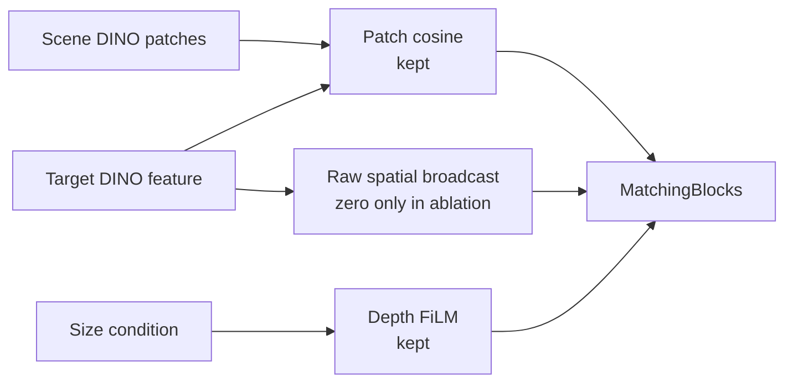

**수정:** Parameter shape와 cosine/FiLM 경로를 유지하고 raw target broadcast만 0으로 고정하는 controlled model을 구현함. 현재 코드에서 같은 seed로 생성한 raw-broadcast와 zero-broadcast 모델의 parameter shape와 초기 state가 동일함을 확인했으며 SHA-256은 `d8c3122c…f8c0`임.

**Controlled retrain 결과:** 16 epoch와 5,408 update를 모두 완료한 final checkpoint를 동일 seed의 broadcast-on reference와 비교함.

| Seed-0 fixed-update metric | Broadcast ON | No broadcast | Change |
|---|---:|---:|---:|
| Seen coverage MAE | `0.05155` | `0.08100` | `+57.1%` |
| Training-heldout coverage MAE | `0.07725` | `0.11494` | `+48.8%` |
| Heldout pooled `S > 0` | `8 / 8` | `0 / 8` | 기준 미충족 |
| Heldout camera `S > 0` | `40 / 40` | `2 / 40` | 기준 미충족 |
| `packaged_food_4` native MAE | `0.09802` | `0.22229` | `+126.8%` |
| `packaged_food_4` native bias | `−0.08694` | `−0.22058` | Underprediction 증가 |

CSV 1,680행의 composite key가 모두 고유하고, 두 checkpoint는 seed 0, epoch 15, 5,400 samples/epoch, 5,408 cumulative batches 조건을 만족함.

**판단:** No-broadcast 구성은 사전 broad gate를 만족하지 못해 seeds 1–2 확대를 진행하지 않음. 현 architecture에서 scalar cosine과 size-FiLM만 남기는 방식은 target conditioning을 충분히 유지하지 못했음. 다음 실험은 target 정보를 없애지 않으면서 absolute target code 의존을 줄이는 relation-aware interaction으로 제한함.

---

### 2026-08-21 · Phase 16 — Fresh Paired Reproducibility Gate

**문제:** 기존 broadcast-on checkpoint에는 최초 initialization과 sample-order hash가 없어, no-broadcast 성능 저하가 target 경로 제거 때문인지 과거 실행과의 차이 때문인지 완전히 분리되지 않았음.

**검증:** 현재 코드에서 broadcast-on seed 0을 `16 epoch`, `5,408 update`로 다시 학습함. 초기 state SHA-256은 `d8c3122c…f8c0`, 첫 epoch sample-order SHA-256은 `26e6843b…303b`로 기록함.

| Reproducibility check | Result |
|---|---|
| Epoch 0–15 train/validation metrics | 기존 accepted run과 전부 일치 |
| Final model-state SHA-256 | 두 모델 모두 `6354241b…55d7a` |
| State tensors | `168 / 168` bitwise identical |
| Compared parameters | `15,716,309`개 원소, mismatch `0` |
| Maximum absolute difference | `0.0` |

Checkpoint 파일 해시는 provenance metadata 추가로 서로 다르지만, 실제 추론에 쓰이는 모든 model tensor는 동일함.

**판단:** Fresh broadcast-on 재현 gate가 통과했으므로 동일 seed·초기화·sample order의 seed-0 비교에서 나타난 no-broadcast의 MAE 증가와 scale-response 약화는 code/data drift보다 raw target broadcast 제거의 영향으로 판단함. 단순 제거 실험은 종료하고, 다음 Step에서는 scene과 target의 채널별 관계를 보존하는 interaction을 동일 조건으로 비교함.

---

### 2026-08-21 · Phase 17 — Relation-Aware Target Interaction

**문제:** Scalar cosine과 size-FiLM만 남긴 no-broadcast 모델은 target 정보를 충분히 전달하지 못했음. Raw target vector를 다시 넣지 않으면서 cosine 합산 전의 채널별 관계를 보존할 방법이 필요했음.

**수정:** 기존 target 768채널 자리를 normalized channelwise product로 교체함. Scene RGB, depth FiLM, shifted cosine, MatchingBlock, parameter 수와 초기화는 그대로 유지함.

```text
q(x) = Normalize(scene_patch(x)) × Normalize(target)
r(x) = sqrt(C) × Normalize(q(x))

MatchingBlock input = [scene patch, FiLM depth, r(x), shifted cosine]
```

초기 state SHA와 sample-order SHA는 fresh raw 기준과 일치했고, parameter `15,706,689`개와 `5,408` update를 동일하게 유지함.


| Seed-0 fixed-update metric | Raw broadcast | No broadcast | Channel relation |
|---|---:|---:|---:|
| Final validation loss | `0.30448` | `0.34033` | `0.32434` |
| Final validation IoU | `0.393` | `0.250` | `0.308` |
| Seen coverage MAE | `0.05155` | `0.08100` | `0.06443` |
| Training-heldout coverage MAE | `0.07725` | `0.11494` | `0.08674` |
| Heldout pooled `S > 0` | `8 / 8` | `0 / 8` | `7 / 8` |
| Heldout camera `S > 0` | `40 / 40` | `2 / 40` | `37 / 40` |
| `packaged_food_4` native MAE | `0.09802` | `0.22229` | `0.11708` |
| `packaged_food_4` native bias | `−0.08694` | `−0.22058` | `−0.10623` |

Workspace 전체 MAE는 relation 모델에서 감소했지만, coverage 내부 MAE와 underprediction은 증가함. Workspace에는 GT가 0인 픽셀이 많아 출력을 전반적으로 낮추는 것만으로도 오차가 줄 수 있으므로 채택 근거로 사용하지 않음.

**판단:** Channel relation은 no-broadcast보다 target 조건을 많이 회복했지만 사전 safety gate와 `packaged_food_4` 개선 gate를 모두 통과하지 못함. Seeds 1–2는 실행하지 않고 raw broadcast baseline을 유지함. 이번 결과는 추가 L2 normalization까지 포함한 relation 표현 전체의 결과이므로, 다음 Step에서는 낮은 유사도의 patch도 동일한 relation energy를 갖게 되는 정규화 효과부터 분리 진단함.

---

### 2026-08-21 · Phase 18 — Relation Magnitude Diagnostic

**문제:** Phase 17의 L2 normalization은 채널별 관계 방향은 남기지만 `‖q‖`를 제거함. 이 때문에 target과 약하게 대응하는 patch도 강하게 대응하는 patch와 같은 크기의 relation feature를 받음.

쉽게 말하면 `q`는 scene과 target의 768개 channel이 위치별로 얼마나 같은 방향으로 반응했는지를 담은 목록임. `‖q‖`는 그 목록 전체의 반응 세기인데, 완전히 정규화하면 “매우 비슷함”과 “조금 비슷함”의 세기 차이가 사라질 수 있어 이 정보가 GT 설명에 도움이 되는지 먼저 확인함.

**검증:** Held-out target과 validation scene은 사용하지 않고, 학습용 10 target·36 scene·5 camera만 분석함. 같은 scene·camera·patch에서 target 평균을 제거한 뒤, cubic cosine 12개만 사용한 기준과 cosine으로 설명되지 않는 `log‖q‖` 4개를 추가한 경우를 scene 단위 6-fold로 비교함. Target 가중치는 실제 학습 sampler와 동일하게 category-balanced로 설정함.

```text
q_l(x) = Normalize(scene_l(x)) × Normalize(target_l)
r_l(x) = sqrt(C) × q_l(x) / (m_l + epsilon)
```

`m_l`은 학습 target의 실제 coverage 영역에서 계산한 layer별 `‖q_l‖` 중앙값이며, 추론 시 다시 계산하지 않는 고정값임.


| Train-only diagnostic | Result |
|---|---:|
| Coverage MAE: cubic cosine only | `0.08829` |
| Coverage MAE: + residual `log‖q‖` | `0.08583` |
| Relative improvement | `2.78%` |
| Improved scene folds | `6 / 6` |
| Scene-bootstrap 95% interval | `+2.01% – +3.46%` |
| Cosine-independent DINO layers | `4 / 4` |
| Uncalibrated `C·q` scale gate | `0 / 40` — 기준 미충족 |
| Train-median calibrated scale gate | `40 / 40` — pass |

**판단:** `‖q‖`에는 cubic cosine만으로 설명되지 않는 target-dependent GT 신호가 남아 있음. 단순 `C·q`는 feature 크기가 지나치게 커 사전 기준을 만족하지 못했으며, 대신 train-only 중앙값으로 크기만 고정한 relation을 동일 초기화·동일 sample order의 seed 0 한 번으로 평가함. 이 진단은 다음 실험을 수행할 근거이며 zero-shot 성능 증명은 아님. Seed 0이 사전 held-out 5-camera gate를 통과하기 전에는 seeds 1–2를 실행하지 않음.

---

### 2026-08-22 · Phase 19 — Magnitude-Calibrated Relation Evaluation

**문제:** Phase 18의 train-only 진단에서 relation 크기 `‖q‖`가 GT와 관련된 신호를 보였지만, 이 신호가 전체 비선형 모델의 학습·일반화까지 개선하는지는 확인되지 않았음.

**실험:** 학습 target에서 미리 계산한 layer별 중앙값 `m_l`을 고정하고, 추론 시 held-out target으로 재보정하지 않음. Raw baseline과 초기 state, sample order, `16 epoch`, `5,408 update`, dataset을 동일하게 맞춰 seed 0을 학습함.

```text
r_l(x) = sqrt(C) × q_l(x) / (m_l + epsilon)
```


| Seed-0 fixed-update metric | Raw broadcast | No broadcast | Normalized relation | Magnitude-calibrated relation |
|---|---:|---:|---:|---:|
| Seen coverage MAE | `0.05155` | `0.08100` | `0.06443` | `0.07073` |
| Training-heldout coverage MAE | `0.07725` | `0.11494` | `0.08674` | `0.09298` |
| Heldout pooled `S > 0` | `8 / 8` | `0 / 8` | `7 / 8` | `7 / 8` |
| Heldout camera `S > 0` | `40 / 40` | `2 / 40` | `37 / 40` | `34 / 40` |
| `packaged_food_4` native MAE | `0.09802` | `0.22229` | `0.11708` | `0.12220` |
| `packaged_food_4` native bias | `−0.08694` | `−0.22058` | `−0.10623` | `−0.10706` |

Magnitude-calibrated relation은 raw baseline 대비 seen coverage MAE `+37.20%`, heldout coverage MAE `+20.35%`로 악화됨. `packaged_food_4`도 5개 camera 모두에서 MAE와 bias가 개선되지 않음. Workspace MAE는 낮아졌지만, target coverage에서 underprediction이 커졌으므로 예측값 전체가 낮아진 효과로 판단함.

**판단:** Train-only 진단은 실험 후보를 거르는 용도였지만, 전체 모델의 성능 개선을 보장하지 않았음. Magnitude-calibrated seeds 1–2는 실행하지 않고 appearance interaction 변형은 종료함. Fresh raw size-only를 현재 기준 모델로 유지하며, 다음 후보는 target mask에서 계산할 수 있는 소수의 물리적 크기·형상 descriptor로 제한함.

---

### 2026-08-22 · Phase 20 — Compact Physical Shape Descriptor Gate

**문제:** Size-only의 `area·bbox_h·bbox_w`는 target의 전체 크기는 나타내지만, 같은 크기에서 모양과 질량 분포가 다른 물체를 구분하지 못함.

**수정:** Target mask에서 길쭉함 `eta`와 moment compactness `kappa` 두 값만 추가하는 후보를 설계함. 초기 구현에서 bbox를 `8 × 8` 정사각형으로 변환하며 물체의 길쭉함이 사라지는 문제를 발견함. 원래 mask 좌표계의 bbox 크기를 복원해 moment를 계산하도록 수정한 후 재검증함.

```text
eta   = (lambda_max - lambda_min) / (lambda_max + lambda_min)
kappa = mask_area / (2*pi*(lambda_max + lambda_min))
```

이 단계는 full model 학습이 아니라 descriptor가 다음 학습 후보로서 가치가 있는지 저렴하게 확인하는 train-only screening임. 학습 10 target·36 scene·3 scale·5 camera만 사용하고, target 하나를 donor에서 완전히 제외한 leave-one-target-out 비교를 수행함. Held-out 4 target과 validation scene은 사용하지 않았으며, shape를 같은 category의 다른 target과 바꾸는 64개 대조 조건도 같이 계산함.


| Train-only gate | Result | Required |
|---|---:|---:|
| Pooled coverage MAE | `0.09114 → 0.07748` (`14.99%` 개선) | `≥ 2%` 개선 |
| Improved targets | `5 / 10` | `≥ 8 / 10` |
| Improved categories | `2 / 4` | `4 / 4` |
| Improved cameras | `5 / 5` | `5 / 5` |
| Improved target-camera cells | `27 / 50` | `≥ 40 / 50` |
| Improved target-camera-scale cells | `78 / 150` | `≥ 120 / 150` |
| Worst scale-cell regression | `+320.67%` | `≤ +5%` |

Fruit은 category MAE `17.20%`, toy는 `43.84%` 개선됐지만 book은 `7.78%`, packaged food는 `13.22%` 악화됨. 전체 평균 개선은 특정 category의 큰 이득이 만든 결과이며, 새 target에 공통으로 적용되는 물리 규칙으로 보기 어려움.

**판단:** `eta·kappa`는 category별 결과가 일관되지 않아 full-model 후보에서 제외함. Seed 0–2는 실행하지 않고 fresh raw size-only를 기준 모델로 유지함. 다음에는 2D mask descriptor를 더 늘리지 않고, 3D target extent가 잔여 target effect를 설명할 수 있는지 oracle 진단으로 먼저 확인함.

---

### 2026-08-22 · Phase 21 — Exact 3D Extent Diagnostic

**문제:** 2D mask의 면적과 bbox는 camera에 보이는 크기만 나타냄. 같은 투영 크기라도 실제 높이와 바닥 면적이 다르면 물체 더미에 의해 완전히 가려질 수 있는 위치가 달라지므로, 이 3D 차이가 남은 target 오차의 원인인지 확인할 필요가 있었음.

**검증:** GT 생성에 실제 사용한 mesh에서 `가로 최소 길이·가로 최대 길이·높이`를 추출함. 이 단계도 full model 학습 전에 “실제 3D 크기를 알면 비슷한 train target의 GT 차이를 더 잘 설명할 수 있는가?”를 묻는 screening임. 이 값은 최종 배포 입력이 아니라 정보 유효성만 확인하는 진단용 oracle임. 학습 10 target·36 scene·3 scale·5 camera만 사용했으며, query target을 donor와 정규화 통계에서 완전히 제외함.

```text
extent3(s) = s × [min(dx, dy), max(dx, dy), dz]
```

같은 category의 다른 target extent를 넣는 64개 wrong-extent 대조 조건도 함께 계산함.


| Train-only diagnostic | 2D shape | Exact 3D extent |
|---|---:|---:|
| Pooled coverage MAE | `0.09114 → 0.07748` | `0.09114 → 0.06927` |
| Relative improvement | `14.99%` | `23.99%` |
| Improved targets | `5 / 10` | `9 / 10` |
| Improved categories | `2 / 4` | `4 / 4` |
| Improved cameras | `5 / 5` | `5 / 5` |
| Improved target-camera cells | `27 / 50` | `36 / 50` |
| Improved target-camera-scale cells | `78 / 150` | `100 / 150` |
| Meaningful worst regression | `+320.67%` | `없음` |

3D extent의 scene-bootstrap 95% interval은 `+23.12% – +24.80%`였고, wrong-extent 대조 조건의 최대 개선은 `1.17%`에 그침. 따라서 실제 3D 크기에 target별 GT를 설명하는 정보가 있음을 확인함.

다만 사전에 고정한 cell 개선 수 기준 `40/50`, `120/150`에는 각각 `36/50`, `100/150`으로 미달함. 남은 cell은 악화가 아니라 hard 3-NN에서 donor 구성이 바뀌지 않아 생긴 동률이지만, 결과를 본 뒤 기준을 바꾸지 않고 사전 기준 미충족으로 기록함.

**판단:** 이 결과를 zero-shot 성능이나 최종 구조의 통과로 해석하지 않음. 다음 Step은 raw size-only와 구조·초기값·sample order·update 수를 같게 유지한 seed-0 모델에서 exact extent 3개만 추가하는 controlled oracle ablation임. 이 모델이 기존 5-camera coverage·scale-response gate를 통과할 때만 RGB/multi-view 기반 3D 크기 추정 방법을 개발함.

---

### 2026-08-22 · Phase 22 — Exact 3D Extent Controlled Model

**문제:** Phase 21은 3D 크기 정보가 GT 차이를 설명할 수 있다는 진단이었으며, 실제 모델이 그 정보를 올바르게 사용하는지는 확인하지 못함.

**통제 실험:** Target mesh의 exact extent를 geometry conditioning에 추가함.

```text
extent3(s) = s × [min(dx, dy), max(dx, dy), dz]
F_depth'   = gamma(extent3) × F_depth + beta(extent3)
```

Raw size-only 기준 모델과 seed·초기 가중치·sample 순서·학습 횟수(`5,408` update)를 동일하게 유지함. Train 10 target의 통계만 이용해 정규화하고, fixed epoch 15에서 14 target·16 validation scene·5 camera를 비교함. Exact extent는 정보 유효성을 확인하기 위한 simulation oracle이며 실제 배포 입력은 아님.

| 평가 영역 | Raw size-only | Exact extent + global FiLM | 변화 |
|---|---:|---:|---:|
| 전체 target coverage MAE | `0.05838` | `0.05803` | `0.60%` 개선 |
| 전체 workspace MAE | `0.13745` | `0.15581` | `13.36%` 악화 |
| Train target coverage MAE | `0.05155` | `0.05587` | `8.38%` 악화 |
| Held-out target coverage MAE | `0.07725` | `0.06399` | `17.16%` 개선 |
| Held-out target workspace MAE | `0.16094` | `0.17477` | `8.59%` 악화 |

Held-out target의 scale-response 방향은 `8/8` target-scale과 `40/40` camera에서 양수였음. 이는 변화 방향이 맞다는 뜻이며 raw보다 더 좋아졌다는 뜻은 아님. Coverage와 workspace를 함께 보는 사전 평가 기준은 충족하지 못함.

**원인 분리:** 같은 checkpoint에서 scene RGB-D·target RGB·2D 크기·camera·scale·GT를 고정하고, exact extent 세 값만 같은 category의 다른 target 값으로 교체함. 모델 재학습은 수행하지 않음.


| Frozen intervention, held-out target | Correct extent − wrong extent | 결과 |
|---|---:|---|
| Target coverage MAE | `-0.03468` | Target-camera 평균 `20/20`에서 correct extent 우세 |
| Scale-response `S` | `+0.09249` | Target-camera 평균 `20/20`에서 correct extent 우세 |
| Workspace 안·coverage 밖 MAE | `+0.04232` | Target-camera 평균 개선 `10/20` |

Correct extent는 held-out target에서도 coverage 예측과 크기 변화 반응을 일관되게 개선함. 따라서 모델이 3D 크기 정보를 실제로 사용한다는 점은 확인됨. 반면 `book_4·fruit_4`는 coverage 밖 오차도 감소했지만, `toy_4·packaged_food_4`는 5개 camera 모두 증가함. 가장 가까운 wrong extent만 사용한 비교에서도 같은 경향이 남아 극단적인 교체값 때문으로 보기 어려움.

**판단:** 이번 exact-extent 경로에서 관찰된 leakage는 하나의 extent vector로 전체 depth feature에 같은 `gamma·beta`를 적용하는 global FiLM과 연결되어 있었음. Target이 물체 더미에 의해 가려질 수 있는 영역은 개선했지만, workspace 안에서도 해당 target이 존재할 수 없어 GT가 0인 위치까지 함께 활성화함. 이 실험만으로 DINOv3 정보가 충분하다고 결론 내리지는 않음.

현재 global-FiLM 구성은 후속 seed로 확대하지 않고, RGB 기반 3D 크기 추정기 개발도 보류함. 다음 실험에서는 exact extent를 계속 oracle로 사용하되, `local depth feature × extent`로 patch별 bounded residual을 만들고 residual을 0으로 초기화해 raw baseline에서 시작함. 동일한 seed-0 조건에서 coverage·coverage 밖 오차·scale-response·현재 고정 rig의 5-camera 결과가 함께 개선될 때만 다음 Step으로 진행함.

---

### 2026-08-24 · Phase 23 — Local Bounded Extent Interaction

**문제:** Global FiLM은 target 크기로 만든 같은 조절값을 모든 scene patch에 적용함. Target이 물체 더미에 의해 가려질 수 있는 영역은 찾았지만, 서랍 안에서 해당 target이 가려질 후보가 없는 위치도 함께 밝아지는 leakage가 발생함.

**방법:** Exact extent와 각 위치의 depth feature를 함께 보고 위치별 gate를 계산하도록 변경함.

```text
Global: target extent ─────────────→ 모든 위치에 같은 gamma, beta
Local : target extent + D(x,y) ───→ 위치별 gate g(x,y) ─→ bounded residual

D'(x,y) = D(x,y) + 0.25 × g(x,y) × learned_correction(x,y)
```

`g(x,y)`는 현재 위치의 depth 구조가 target 크기와 맞는 정도를 `0–1`로 나타냄. `0.25`는 depth feature를 수정하는 residual branch의 세기를 제한하는 값이며, 최종 occlusion probability를 25%로 제한한다는 뜻은 아님. Residual은 0에서 시작하므로 학습 전 출력은 raw baseline과 정확히 같음. Seed·초기 가중치·sample 순서·`5,408` update와 exact extent 입력은 Phase 22와 동일하게 유지함.

아래 MAE는 예측 map과 GT의 평균 절대 차이이며 `0`에 가까울수록 좋음. `Coverage`는 target이 물체 더미에 의해 가려질 수 있는 영역의 정확도, `Impossible-to-occupy workspace`는 target이 가려질 후보가 없는 위치의 잘못된 활성화, `Whole workspace`는 두 영역을 함께 평가함.


| 전체 14 target | Raw size-only | Exact extent + global FiLM | Exact extent + local bounded |
|---|---:|---:|---:|
| Coverage MAE | `0.05838` | `0.05803` (`0.60%` 개선) | `0.05741` (`1.67%` 개선) |
| Whole-workspace MAE | `0.13745` | `0.15581` (`13.36%` 악화) | `0.13077` (`4.86%` 개선) |
| Impossible-workspace MAE | `0.20853` | `0.24371` (`16.87%` 악화) | `0.19671` (`5.67%` 개선) |

Local 방식은 global FiLM의 평균 leakage를 줄이고 raw보다도 세 영역 모두 개선함. Training-heldout 4개 target 평균에서도 coverage `13.33%`, workspace `9.13%`, impossible-workspace `8.01%` 개선함. 크기 변화에 출력이 같은 방향으로 반응하는지는 `8/8` target-scale과 `40/40` camera에서 유지되어, 현재 고정 rig의 다섯 view에서 같은 방향의 신호를 확인함. 이 수치는 raw 대비 개선이 아니라 scale 변화 방향이 양수였다는 뜻임.

**판단:** 평균 개선만으로 모델을 채택하지 않음. Raw 대비 `book_4` scale-response가 `-0.062`, `-0.054` 감소하여 사전 기준 `-0.05`를 넘었고, `packaged_food_4`의 impossible-workspace MAE는 `30.29%` 악화함. Seen-target coverage도 `4.65%` 악화하여 seed-0 사전 기준을 만족하지 못함.

따라서 local interaction이 global 방식보다 평균적인 공간 제어를 개선할 가능성은 확인했지만, target별 사전 기준을 만족하지 못해 이 상태로 seed를 확대하지 않음. RGB 기반 extent estimator도 아직 실행하지 않음. 다음 Step은 같은 frozen checkpoint에서 extent만 올바른 값과 같은 category의 다른 값으로 교체해 원인을 분리하고, gate와 residual이 coverage 안팎을 실제로 구분하는지 확인하는 것임.

**Frozen 후속 진단:** 재학습 없이 scene RGB-D·target appearance·GT를 고정하고 extent만 교체함. Held-out 평균에서 correct extent는 wrong extent보다 coverage MAE를 `0.03267` 낮추고 scale-response를 `0.12590` 높였지만, impossible-workspace MAE는 `0.02811` 높였음. 즉 3D 크기 정보는 실제로 사용되지만 유용한 영역과 잘못된 영역을 동시에 활성화함.


Gate가 위치를 실제로 거르는지 확인하기 위해 target이 도달 가능한 patch와 불가능한 patch를 분리함. 네 held-out target의 평균 gate는 가능한 영역 `0.974–0.988`, 불가능한 영역도 `0.943–0.972`였음. `0`이면 닫힘, `1`이면 완전히 열림이므로 두 영역에서 거의 항상 열린 상태임. 따라서 residual 크기는 제한됐지만, 공간을 선택하는 gate는 충분히 작동하지 않았음.

축별 교체에서는 `book_4`의 올바른 높이 값이 scale-response를 `0.021` 낮추고, `toy_4`의 수평 크기는 scale-response를 `0.213` 높이는 대신 impossible-workspace MAE를 `0.081` 높였음. 하나의 벡터에서 수평 크기와 높이를 함께 처리하면서 역할이 얽힌 것도 확인함.

**다음 Step:** Noncoverage loss를 바로 추가하면 이전 ring-loss처럼 크기 변화 반응까지 억제할 수 있어 보류함. 먼저 parameter 수와 초기 출력을 유지한 채, 포화되는 sigmoid dot-product를 channel-normalized local similarity로 교체하는 seed-0 실험을 수행함. 이 변경으로 leakage가 줄어도 `book_4` 역반응이 남으면 수평 크기와 높이 conditioning을 분리함.

---

### 2026-08-24 · Phase 24 — Regularized Local-Confidence Gate

**왜 이 실험을 했는가:** Phase 23의 gate는 target이 물체 더미에 의해 가려질 수 있는 patch뿐 아니라 가려질 후보가 없는 patch에서도 거의 `1`이었음. 문이 항상 열려 있으므로 local interaction이라는 이름과 달리 target 크기 보정이 서랍 전체로 퍼졌음. 이번 실험은 모델을 더 크게 만드는 대신, gate가 쉽게 포화되지 않도록 계산 방식만 바꿔 원인을 분리함.

각 scene patch의 depth encoder 출력 `D(x,y)`는 `256`개 숫자로 된 특징임. 이 숫자들은 각각 높이·모서리처럼 사람이 미리 의미를 정한 값이 아니라, ResNet-18이 함께 학습한 local depth pattern 반응임. Target의 exact 3D extent도 작은 network를 거쳐 같은 길이의 보정 방향 `q`로 바뀜. 두 벡터가 같은 방향인지 비교하여 위치별 gate를 계산함.

```text
한 scene patch의 depth 특징 D(x,y): 256개 숫자
target 크기가 요구하는 보정 방향 q: 256개 숫자

D(x,y)와 q의 방향 비교 ─→ local confidence g(x,y)
                              0: 보정하지 않음
                              1: target 크기 보정을 강하게 사용

D'(x,y) = D(x,y) + 0.25 × g(x,y) × size_correction(x,y)
```

이는 표준 cosine이 아니라 **regularized cosine-like confidence**임. Target 보정 벡터가 커지는 것만으로 gate가 `1`에 붙지 않도록 채널 수 `C=256`을 분모에 포함함. `sqrt(C)`는 256개 채널의 평균 크기가 약 `1`일 때를 기준으로 삼는 고정값이며, held-out 결과를 보고 조정한 hyperparameter가 아님. Seed·초기 가중치·sample 순서·loss·`5,408` update는 이전 실험과 같고, automated assertions로 초기 상태와 sample 순서도 확인하여 gate 계산만 비교함.


| 전체 14 target | Raw size-only | Local sigmoid | Local confidence | 해석 |
|---|---:|---:|---:|---|
| Coverage MAE | `0.05838` | `0.05741` | `0.05840` | Target이 물체 더미에 의해 가려질 수 있는 영역은 raw와 사실상 같음 |
| Whole-workspace MAE | `0.13745` | `0.13077` | `0.12122` | 서랍 전체의 평균 오차는 raw보다 `11.81%` 감소 |
| Impossible-workspace MAE | `0.20853` | `0.19671` | `0.17768` | 가려질 후보가 없는 위치의 잘못된 활성화는 평균 `14.79%` 감소 |

평균 leakage는 줄었지만, 이것만으로 새 구조를 채택하지 않음. Held-out `book_4`의 두 scale-response는 raw보다 `0.159`, `0.088` 감소했고, `packaged_food_4`는 coverage가 좋아지는 대신 whole-workspace와 impossible-workspace 오차가 각각 `22.04%`, `44.61%` 증가함. 즉 일부 target의 큰 개선이 전체 평균을 낮췄으며, 반복 사용한 네 development-heldout target에서도 일관된 개선을 확인하지 못함.

Frozen 진단에서 gate의 `0.95` 초과 비율은 기존 `66–97%`에서 `0%`로 줄어 구조적 포화는 크게 감소함. 그러나 도달 가능한 patch와 불가능한 patch의 평균 gate 차이는 target별 `0.005–0.014`에 불과했음. Gate 값은 안정됐지만 **어디를 열고 닫아야 하는지 학습하지 못한 것**이 남은 핵심 문제임. 해당 frozen correct/wrong-extent intervention에서 toy와 packaged food의 extent 입력은 coverage 오차를 줄이는 동시에 impossible-workspace 오차를 각각 약 `0.108`, `0.117` 높이는 방향에 직접 관여함.

Exact extent는 물체 이름이 아니라 실제 크기이므로 원리상 unseen target에도 적용 가능한 정보임. 다만 현재 값은 mesh에서 얻은 진단용 oracle이므로 이 결과는 zero-shot 성능을 증명하지 않음. Oracle 구조가 먼저 모든 target에서 안정적으로 작동한 뒤에만 target RGB/mask로 크기를 추정하는 배포 입력으로 교체함.

**판단 및 다음 Step:** Seed 0의 사전 기준을 만족하지 못해 seed 1–2 확대는 진행하지 않음. 다음 실험은 최종 probability map을 직접 누르는 ring loss가 아니라 gate 자체만 감독함. Target이 물체 더미에 의해 가려질 수 있는 순수 patch에는 gate가 열리고, workspace 안이지만 가려질 후보가 없는 순수 patch에는 닫히도록 balanced auxiliary loss를 추가함. 경계가 섞인 patch는 제외하고 `lambda_gate=0.05`의 단일 seed-0 통제 실험만 수행함. 이 방식은 occlusion 확률을 맞히는 본래 head의 역할을 유지하면서, gate에 부족했던 공간적 역할만 명시함.

---

### 2026-08-24 · Phase 25 — Strict Gate-Localization Supervision

**왜 이 방법을 사용했는가:** Phase 24의 gate 값은 안정됐지만 열어야 할 곳과 닫아야 할 곳을 구분하지 못했음. 최종 probability map의 loss만 사용하면 뒤쪽 MatchingBlock이 오차를 대신 줄일 수 있어 gate가 의도한 역할을 배우지 않아도 됨. 따라서 최종 출력을 직접 0으로 누르는 기존 ring loss 대신, gate에만 위치 역할을 알려주는 보조 loss를 사용함.

```text
Target이 물체 더미에 의해 가려질 수 있는 순수 patch → gate를 1에 가깝게 학습
서랍 안이지만 가려질 후보가 없는 순수 patch          → gate를 0에 가깝게 학습
두 영역이 섞인 경계 patch              → 보조 loss에서 제외

전체 loss = 기존 probability-map loss + 0.05 × balanced gate loss
```

두 영역의 patch 수가 달라도 한쪽이 loss를 지배하지 않도록 각각 평균한 뒤 `1:1`로 합침. `0.05`는 결과를 보고 고른 값이 아니라 실험 전에 고정했으며, validation과 checkpoint 선택은 기존 probability-map loss만 사용함. Seed·초기 state·sample 순서·`5,408` update와 exact-extent oracle 입력도 이전 실험과 같게 유지함.


| 전체 14 target | Raw size-only | Gate supervision | 의미 |
|---|---:|---:|---|
| Coverage MAE | `0.05838` | `0.05153` | Target이 물체 더미에 의해 가려질 수 있는 영역의 오차 `11.73%` 감소 |
| Whole-workspace MAE | `0.13745` | `0.07538` | 서랍 전체 오차 `45.16%` 감소 |
| Impossible-workspace MAE | `0.20853` | `0.09682` | 잘못 밝아지는 leakage `53.57%` 감소 |

보조 loss가 없는 동일 gate 모델과 비교해도 coverage·workspace·impossible-workspace MAE가 각각 `11.76%`, `37.81%`, `45.51%` 감소함. 동일 seed·초기 state·sample order의 controlled seed-0 비교에서는 gate localization supervision 추가와 평균 개선이 함께 나타남. 다중 seed 일반화는 아직 확인하지 않음.

Frozen 진단에서도 변화가 확인됨. 보조 loss가 없을 때 가능한 영역과 불가능한 영역의 gate 차이는 `0.005–0.014`였지만, 학습 후에는 target별 `0.580–0.695`로 커짐. 가능한 영역의 평균 gate는 `0.797–0.860`, 불가능한 영역은 `0.166–0.217`이므로 현재 oracle coverage 정의와 고정 rig의 development target에서 gate가 위치 분리를 학습했음을 확인함.

**남은 문제:** 평균 결과는 크게 좋아졌지만 사전에 정한 모든 기준을 통과하지는 못함. 현재 고정 rig의 다섯 camera에서 scale-response 자체는 `40/40` 모두 양수였으나, `book_4`의 `0.85/1.15` scale 반응은 raw보다 각각 `0.118`, `0.130` 약해져 허용선 `-0.05`를 넘음. 결과를 본 뒤 기준을 완화하지 않고 seed-0 사전 기준 미충족으로 기록함.

축별 frozen intervention에서 book의 수평 크기 축을 교체했을 때 scale-response 변화는 `+0.005`로 거의 중립이었지만, 높이 축 교체는 `-0.131`의 변화를 만들었음. 반대로 높이 축은 coverage와 impossible-workspace MAE를 각각 약 `0.016`, `0.031` 줄여 단순히 제거할 정보도 아님. 즉 현재 하나의 FiLM/gate가 수평 footprint와 높이의 서로 다른 역할을 함께 처리하는 것이 남은 병목임.

Exact extent와 coverage label은 USD/GT에서 얻은 simulation oracle임. 물체 category 이름을 gate에 주지는 않으므로 크기와 local depth의 관계를 배우는 zero-shot 가설에는 맞지만, 아직 target RGB만 사용하는 배포형 zero-shot을 증명한 결과는 아님.

**판단 및 다음 Step:** 평균 개선과 gate localization은 유지할 가치가 있지만, 현 모델을 최종 candidate로 확정하지 않음. Seeds 1–2와 RGB extent estimator는 계속 보류함. 수평 footprint는 물체가 차지할 바닥 면적에, 높이는 위쪽 공간과 가려짐 깊이에 주로 영향을 주므로 다음에는 두 값을 별도 conditioning 경로로 분리함. 동일 gate supervision을 유지한 seed-0 실험 하나에서 book 반응을 확인하고, 회복되지 않으면 architecture 확장을 중단한 뒤 scale-paired objective 또는 GT의 book-height 정의를 다시 검토함.

---

### 2026-08-24 · Phase 26 — Footprint Gate / Height Residual Separation

**왜 이 실험을 했는가:** Phase 25는 gate의 위치 분리를 학습했지만, 얇고 넓은 `book_4`의 scale 반응은 여전히 약했음. 하나의 exact-extent 벡터가 “어디에서 target이 물체 더미에 의해 가려질 수 있는가”와 “그 안에서 높이 차이를 얼마나 반영할 것인가”를 동시에 결정한 것이 원인인지 확인함.

68개 입력 칸 중 실제로 사용하는 여섯 값의 역할을 다음처럼 나눔.

```text
area, bbox h/w, 짧은·긴 가로 길이 ─→ footprint gate g_F(x,y)
높이                                  ─→ 열린 영역 안의 보정 강도

D'(x,y) = D(x,y) + 0.25 × g_F(x,y) × height-aware correction
```

Footprint는 target이 영상에서 차지하는 크기와 바닥 방향 길이를 나타내므로 gate의 위치를 정함. 높이는 gate를 새로 열 수 없고, footprint gate가 허용한 위치 안에서만 depth 보정량에 관여함. 새 network를 추가하면 모델 크기 차이가 결과에 섞이므로 기존 `GeometryFiLM` 하나를 세 번 공유해 footprint·height·zero 입력을 분리함. 그 결과 파라미터 수, state key, 초기 가중치, 첫 epoch sample 순서와 총 `5,408` update는 Phase 25와 동일함. 자동 테스트로 높이를 바꿔도 gate가 bitwise 동일하고, footprint를 바꾸면 gate가 변하며, 사용하지 않는 62개 칸은 출력에 영향을 주지 않음을 확인함.


| 전체 14 target | Raw size-only | Phase 25 | Phase 26 | 의미 |
|---|---:|---:|---:|---|
| Coverage MAE | `0.05838` | `0.05153` | `0.05461` | Raw보다 `6.45%` 낮지만 Phase 25보다는 높음 |
| Whole-workspace MAE | `0.13745` | `0.07538` | `0.07276` | Raw보다 `47.07%`, Phase 25보다 `3.48%` 낮음 |
| Impossible-workspace MAE | `0.20853` | `0.09682` | `0.08907` | Raw보다 `57.29%`, Phase 25보다 `8.00%` 낮음 |

Gate 역할 분리는 실제 checkpoint에서도 유지됨. 네 development-heldout target에서 target이 물체 더미에 의해 가려질 수 있는 순수 영역의 평균 gate는 `0.798–0.865`, 가려질 후보가 없는 영역은 `0.128–0.183`이었음. 모든 scale과 다섯 camera에서 예측 반응 방향은 `40/40` 양수였음.

그러나 핵심 사전 기준은 충족하지 못함. `book_4 ×0.85/×1.15`의 raw 대비 `ΔS`는 Phase 25의 `-0.118/-0.130`에서 `-0.094/-0.052`로 회복됐지만, 두 값 모두 허용선 `-0.05`를 넘지 못함. Held-out median `ΔS=-0.010`과 다른 held-out target의 native coverage 안전 기준도 충족하지 못했으며, `book_4` native coverage MAE는 raw보다 `10.3%` 높았음. 결과를 본 뒤 기준을 완화하지 않고 seed-0 사전 기준 미충족으로 기록함.

Frozen identity 진단에서는 Phase 26의 local residual을 끄면 `book_4` coverage MAE가 평균 `0.0128` 낮아졌음. 즉 현재 남은 문제는 gate가 잘못된 위치를 여는 것이 아니라, 올바르게 열린 영역 안에서 book의 크기 변화에 적용하는 보정 방향과 크기가 부정확한 것임.

**판단 및 다음 Step:** Seeds 1–2와 RGB 기반 extent estimator는 계속 보류하고, 구조를 더 키우지 않음. 현재 loss는 각 scale의 map을 따로 맞히므로 평균 오차를 낮추면서도 같은 scene에서 scale에 따른 변화량을 충분히 보존하지 못할 수 있음. 다음에는 train target의 동일 scene·camera에서 두 scale을 짝지어 `예측 map 변화량`과 `GT map 변화량`을 직접 비교하는 scale-paired loss를 추가함. Held-out target은 loss 설계나 가중치 선택에 사용하지 않음.

---

### 2026-08-24 · Phase 27 — Train-Only Scale-Paired Loss and BatchNorm Diagnosis

**왜 이 실험을 했는가:** 기존 loss는 scale `0.7`, `1.0`, `1.3`의 probability map을 각각 맞히지만, 같은 scene에서 target 크기가 바뀔 때 map이 **어떻게 달라져야 하는지**는 직접 비교하지 않음. 이 때문에 평균 map 오차를 낮추면서도 크기 변화가 예측에 충분히 반영되지 않을 가능성을 확인하고자 함.

같은 `target–scene–camera`의 세 scale을 한 묶음으로 불러오고, 인접한 두 scale의 예측 변화와 GT 변화를 비교함.

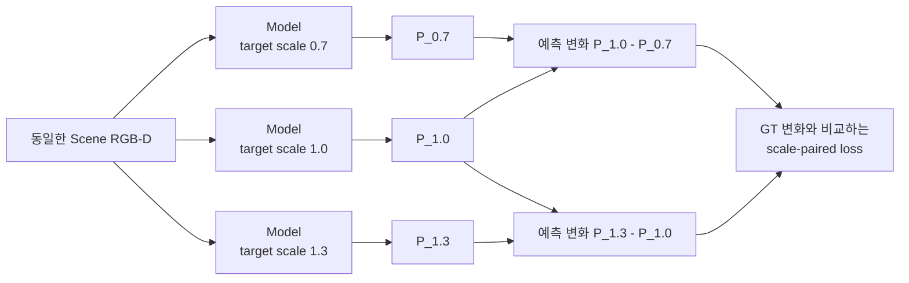

```text
ΔP = P(s₂) - P(s₁)                 예측 map이 scale에 따라 변한 양
ΔG = G(s₂) - G(s₁)                 GT map이 scale에 따라 변해야 하는 양

L_pair = Σ|ΔP - ΔG| / (Σ|ΔG| + ε)
L_total = L_map + 0.05 L_gate + 0.008902 L_pair

S = 1 - L_pair
```

`S=1`이면 scale에 따른 공간 변화가 GT와 같고, `S=0`이면 예측이 scale 변화를 사실상 무시한 수준임. 음수이면 변화를 넣지 않은 것보다 오차가 더 큼. `0.008902`는 held-out 결과를 보고 고른 값이 아니라, train target의 gradient에서 paired 항의 크기가 기존 loss의 약 `10%`가 되도록 한 번 계산해 고정함.

#### 첫 통제 실험

Phase 26, paired loader만 사용한 `λ=0` control, paired loss를 추가한 candidate를 같은 seed·초기화·16 epoch·`5,408` update로 비교함. 개발용 held-out 4 target은 읽지 않고, 학습에 사용한 10 target과 학습에 사용하지 않은 validation scene 16개만 다섯 camera에서 평가함.

| Fixed epoch 15 | Coverage MAE ↓ | Workspace MAE ↓ | Noncoverage MAE ↓ | `S` 0.7→1.0 ↑ | `S` 1.0→1.3 ↑ |
|---|---:|---:|---:|---:|---:|
| Phase 26 | `0.04956` | `0.07058` | `0.09052` | `0.3517` | `0.4466` |
| Paired-loader control | `0.06429` | `0.07958` | `0.09409` | `0.3332` | `0.4067` |
| Scale-paired candidate | `0.07764` | `0.07335` | `0.06929` | `0.3018` | `0.3546` |

Candidate의 train paired error는 낮아졌지만 validation scene에서는 두 `S`가 모두 감소했고, center/top/left/right/bottom 전체에서 같은 경향을 보임. 따라서 특정 camera 문제가 아님. 또한 loss가 없는 paired-loader control도 Phase 26보다 나빠져, paired loss뿐 아니라 batch 구성이 함께 영향을 준다는 점을 확인함.

```text
기존 batch          : 서로 독립적인 depth frame 16개
scale-paired batch  : 서로 다른 depth frame 5~6개 × 같은 frame의 scale 조건 3개
                      └─ ResNet-18 BatchNorm에는 같은 scene depth가 세 번 반복됨
```

BatchNorm은 학습 중 depth feature의 평균과 분산을 저장하고, 추론 때 그 값으로 feature 범위를 맞춤. Scale-paired batch는 실제 tensor 수가 15–18개여도 서로 다른 depth는 5–6개뿐이므로, 기존 batch와 다른 통계가 저장될 수 있음.

#### BatchNorm 통계만 분리한 진단

모델 가중치는 그대로 두고 `36 train scenes × 5 cameras = 180`개의 고유 depth frame으로 ResNet-18의 BatchNorm 평균·분산만 공통 재계산함. Validation scene, held-out target, GT는 사용하지 않았으며, 자동 검사에서 학습 파라미터는 바뀌지 않고 BatchNorm buffer 60개만 변경됨.

| BN 재계산 후 fixed checkpoint | Coverage MAE ↓ | Workspace MAE ↓ | Noncoverage MAE ↓ | `S` 0.7→1.0 ↑ | `S` 1.0→1.3 ↑ |
|---|---:|---:|---:|---:|---:|
| Phase 26 | `0.04772` | `0.06833` | `0.08789` | `0.3585` | `0.4542` |
| Paired-loader control | `0.05432` | `0.07487` | `0.09435` | `0.3651` | `0.4443` |
| Scale-paired candidate | `0.05252` | `0.06403` | `0.07494` | `0.3888` | `0.4613` |

BN 통계를 맞추자 candidate는 Phase 26보다 두 scale 구간의 `S`가 높아지고, 전체 10개 `scale transition × camera` 비교 중 9개에서 개선됨. Workspace와 noncoverage MAE도 각각 약 `6.3%`, `14.7%` 낮아짐. 즉 paired loss의 scale 신호는 일부 존재하며, 처음 관측한 후반 악화의 큰 부분은 반복 scene으로 만들어진 BN 통계와 관련 있음.

그러나 coverage MAE는 `0.04772 → 0.05252`로 약 `10.1%` 증가하여 사전 허용선 `2%`를 충족하지 못함. Coverage 평균 예측은 `0.2514`, 평균 GT는 `0.2485`로 전역 bias가 작았음. 평균값은 맞는데 MAE가 높다는 것은 단순히 map 전체가 너무 밝거나 어두운 문제가 아니라, **coverage 안에서 높은 확률과 낮은 확률을 배치하는 공간 패턴이 더 부정확해졌다는 뜻**임. 따라서 output bias나 threshold만 조절해서 해결할 수 없음.

Validation loss가 가장 낮은 checkpoint도 별도 민감도 분석을 수행했지만, fixed epoch 결과를 사후에 교체하는 근거로 사용하지 않음. 최종 untouched target은 계속 열지 않았으며, seed 1–2 확대와 `λ` sweep도 진행하지 않음.

**판단 및 다음 Step:** Scale-paired loss가 전혀 작동하지 않는 것은 아니지만, 현재 학습 방식은 scale 반응을 얻는 대신 coverage 내부 공간 정확도를 일부 희생함. 다음에는 Phase 26 checkpoint에서 정확히 한 epoch만 이어 학습하고, BatchNorm의 running mean/variance를 고정한 상태에서 `λ=0`과 `λ=0.008902`를 같은 `338` update로 비교함. 이 최소 실험으로 training-time BN 영향과 paired loss 자체의 공간 trade-off를 분리함. 두 scale 구간의 `S`가 모두 개선되고 coverage MAE 증가가 `2%` 이내일 때만 더 긴 재학습으로 확장함.

---

### 2026-08-25 · Phase 28 — BatchNorm-Frozen One-Epoch Comparison

**왜 이 실험을 했는가:** Phase 27의 BN 재계산은 학습이 끝난 모델의 통계까지 다시 바꿨으므로, paired loss 자체의 효과와 training-time BatchNorm 효과가 완전히 분리되지 않았음. Phase 26의 동일 checkpoint에서 fresh Adam으로 한 epoch만 이어 학습하고, 두 모델 모두 BN의 running mean/variance를 고정함. BN의 학습 가능한 scale·bias는 유지하고 sample 순서와 `338` update도 같게 맞춤.

| Phase 26에서 1 epoch 연장 | Coverage MAE ↓ | Workspace MAE ↓ | Noncoverage MAE ↓ | `S` 0.7→1.0 ↑ | `S` 1.0→1.3 ↑ |
|---|---:|---:|---:|---:|---:|
| Paired loss 없음 | `0.06077` | `0.07547` | `0.08942` | `0.3431` | `0.4106` |
| Paired loss 사용 | `0.05727` | `0.07772` | `0.09712` | `0.3626` | `0.4405` |

Paired loss를 사용하면 5개 camera × 2개 scale 구간의 `10/10`에서 `S`가 높아졌지만, paired loss가 없는 control보다 noncoverage MAE가 `8.61%` 증가함. 두 checkpoint의 BN buffer는 동일하므로 이 leakage는 저장된 BN 통계 차이로 설명되지 않음.

원인은 paired loss가 **scale 사이의 차이**만 본다는 점임. 세 출력에 같은 잘못된 값 `c`가 더해져도 `c`는 서로 상쇄됨.

```text
(P_1.0 + c) - (P_0.7 + c) = P_1.0 - P_0.7
```

기존 map loss도 target coverage 안에서만 계산하므로, 어떤 scale에서도 target이 덮지 않는 workspace의 공통 출력을 직접 감독하지 않았음.

**다음 Step:** Scale 변화가 생기는 footprint와 경계는 건드리지 않고, 모든 scale에서 coverage가 없는 순수 workspace의 공통 출력만 0에 가깝게 만드는 anchor를 추가함.

---

### 2026-08-25 · Phase 29 — Strict Common-Mode Anchor and Low-LR Continuation

**왜 이 방법을 사용했는가:** Paired loss는 `scale별 차이`를 학습하고, common-mode anchor는 `세 scale에 공통으로 남는 잘못된 밝기`를 제거함. 두 loss가 서로 다른 문제를 담당하도록 영역을 엄격히 분리함.

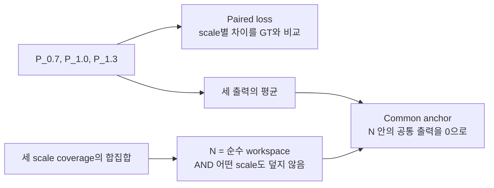

```text
N = pure_workspace AND no_coverage_at_any_scale
L_common = mean over N of |(P_0.7 + P_1.0 + P_1.3) / 3|
```

한 scale이라도 target footprint가 닿는 patch는 `N`에서 제외함. 따라서 크기가 달라지며 이동하는 경계를 억제했던 과거의 per-scale ring 방식과 다름. Loss weight는 validation이나 held-out 결과를 보지 않고 train-only 8개 batch의 gradient 크기로 한 번 고정함.

Learning rate `1e-3`에서는 leakage와 `S`가 개선됐지만 Phase 26 대비 coverage MAE가 `6.38%` 증가해 사전 허용선 `2%`를 충족하지 못함. Loss와 weight는 그대로 두고 learning rate만 `1e-4`로 낮춰, 기존 공간 map을 크게 바꾸지 않는 작은 보정을 수행함.

| Train-only, seed 0 | Coverage MAE ↓ | Workspace MAE ↓ | Noncoverage MAE ↓ | All-scale noncoverage ↓ | `S` 0.7→1.0 ↑ | `S` 1.0→1.3 ↑ |
|---|---:|---:|---:|---:|---:|---:|
| Phase 26 | `0.04956` | `0.07058` | `0.09052` | `0.07974` | `0.3517` | `0.4466` |
| Common anchor only | `0.04675` | `0.04528` | `0.04390` | `0.02962` | `0.3962` | `0.4791` |
| Common + paired | `0.04671` | `0.04391` | `0.04126` | `0.02811` | `0.4111` | `0.4862` |

최종 후보는 Phase 26보다 coverage `5.74%`, workspace `37.78%`, noncoverage `54.42%`, all-scale noncoverage `64.75%` 낮았음. 세 scale 각각의 coverage MAE와 5-camera의 두 scale 구간 `10/10`도 모두 개선되어 train-only gate를 통과함.

**다음 Step:** 이 시점까지 학습에 사용하지 않은 4개 target을 고정된 5-camera protocol에서 한 번 평가함. Common anchor만 사용한 모델도 함께 비교하여 paired loss의 추가 효과를 분리함.

---

### 2026-08-25 · Phase 30 — Five-Camera Development-Heldout Oracle Check

**평가 범위:** `book_4`, `fruit_4`, `toy_4`, `packaged_food_4`와 scale `0.85/1.0/1.15`, validation scene 16개, center/top/left/right/bottom 5개 camera를 고정함. 모델당 `4 × 3 × 16 × 5 = 960`개 map을 평가함. Target RGB는 해당 held-out instance의 실제 reference를 사용했지만, 3D extent는 USD mesh의 정확한 값을 사용함.

| Development-heldout, seed 0 | Coverage MAE ↓ | Workspace MAE ↓ | Noncoverage MAE ↓ | All-scale noncoverage ↓ | `S` 0.85→1.0 ↑ | `S` 1.0→1.15 ↑ |
|---|---:|---:|---:|---:|---:|---:|
| Phase 26 | `0.06857` | `0.07818` | `0.08573` | `0.07931` | `0.2150` | `0.2432` |
| Common anchor only | `0.06473` | `0.05139` | `0.04091` | `0.03318` | `0.2427` | `0.2860` |
| Common + paired | `0.06489` | `0.04990` | `0.03813` | `0.03086` | `0.2471` | `0.2913` |

최종 후보는 Phase 26보다 coverage `5.37%`, workspace `36.17%`, noncoverage `55.53%`, all-scale noncoverage `61.09%` 낮았음. Anchor-only와 비교해도 두 scale 구간의 `S`가 5개 camera 모두에서 높았고, target × camera × 구간의 `40/40` 조건에서도 같은 방향을 보임. 사전 기준인 `10/10 camera scale-response 개선`과 `coverage MAE 증가 2% 이내`를 모두 만족함.

냉정하게 보면 paired loss의 추가 이득은 작음. Anchor-only보다 전체 coverage MAE가 `0.24%` 높고, 세부 coverage 60개 조건 중 36개에서 최대 `1.62%` 증가함. 반면 workspace·noncoverage·all-scale noncoverage는 각각 `2.90%`, `6.81%`, `7.01%` 낮고, scale-response 40개 조건은 모두 개선됨. 따라서 작은 coverage trade-off 안에서 크기 반응과 leakage를 함께 개선한 seed-0 oracle 후보로 해석함.

**실제 map 확인:** Occlusion Stream의 5-camera 정성 그림은 모델 결과와 무관한 GT-only 중간 사례를 사용함. Phase 26에서 drawer 내부의 비후보 영역까지 퍼진 밝기가 common anchor 이후 줄어드는 모습을 확인함. Scale별 그림에서는 paired loss의 효과가 개별 scene마다 동일하지 않다는 점도 함께 기록하여 평균 수치만으로 결과를 과장하지 않음.

이 결과는 아직 최종 zero-shot 증명이 아님.

- 네 target은 학습에는 사용하지 않았지만 이전 개발 진단에서 이미 관찰한 instance임.
- Scene은 학습에 쓰지 않았지만 모델 선택에 사용한 동일 validation scene임.
- Target mask에서 얻은 2D 크기와 USD mesh의 exact 3D extent를 함께 사용함.
- Scale `0.85/1.0/1.15`는 학습 범위 `0.7–1.3` 안의 interpolation이며 seed 0만 평가함.
- 현재 5개 camera는 calibration이 고정된 rig이며 임의 camera pose 일반화를 뜻하지 않음.
- `S=0.247/0.291`은 Phase 26보다 높지만 `S=1`의 완전한 scale 변화 재현과는 거리가 있음.

**다음 Step:** 이 checkpoint를 exact-size oracle 상한선으로 동결함. 동일 pose·거리의 5-view target reference와 camera calibration 저장 protocol을 먼저 고정한 뒤, RGB/mask silhouette에서 3D extent를 추정함. 같은 960개 조건에서 `mesh oracle / RGB-mask 추정 extent / extent 없음`만 바꾸어 비교하고, 개선이 유지될 때 seeds 1–2와 최종 untouched-target 평가로 이동함.

---

### 2026-08-27 · Phase 31 — Target-specific GT Coverage Check

**확인하려는 문제:** 기존 GT는 모든 target을 동일한 `x/y = ±0.17 m` 범위에서 이동시켜 생성함. 이 범위는 회전할 때 서랍 벽을 통과할 수 있는 큰 책을 기준으로 정한 값이므로, Peach처럼 작은 물체에는 지나치게 좁음. 그 결과 실제로 target이 가려질 수 있는 위치가 GT coverage 밖에 남고, 모델이 그 위치를 예측하면 잘못된 활성화처럼 평가될 수 있음.

이를 확인하기 위해 학습에 사용하지 않은 Peach 하나에서 다음 두 GT만 비교함.

| 고정한 조건 | 내용 |
|---|---|
| Model output | GT를 보기 전에 저장한 동일 checkpoint의 동일 예측 |
| Scene / camera | 동일한 8개 scene과 `center/top/left/right/bottom` 5개 view |
| Target geometry | 동일한 Peach 원본 mesh `524,288` faces |
| 가림 판정 | 물체의 유효 pixel 중 `70%` 이상이 scene 물체보다 뒤에 있을 때 해당 pose를 가려질 수 있는 pose로 집계 |
| Probability | 각 pixel에서 `N_occ / N_all` 계산 |
| 바꾼 조건 | 기존 고정 pose grid와 물체 크기·회전각에 따라 범위를 계산한 adaptive pose grid |

```text
Legacy fixed GT
  x/y = ±0.17 m, 모든 물체에 동일
  44,100 poses

Adaptive GT
  각 yaw에서 회전된 target mesh의 끝점을 계산
  서랍 내부에 들어가는 중심 위치만 1 cm 간격으로 생성
  Peach: 146,688 poses
```

10k 단순화 mesh도 70% 가림 판정을 `99.966%` 재현했지만, 서랍 경계의 매우 작은 footprint 한 건에서 사전에 정한 silhouette 기준을 충족하지 못함. 기준을 결과 확인 후 완화하지 않고, 이번 비교 GT는 원본 mesh로 다시 생성함.

| 8 scenes × 5 views | 결과 | 의미 |
|---|---:|---|
| Fixed coverage | `266,222 px` | 기존 고정 범위가 기록한 영역 |
| Adaptive coverage | `560,896 px` | 물체 크기와 회전에 맞춰 기록한 영역 |
| Coverage 증가 | `+110.69%` | 기존보다 약 `2.11배` 넓은 영역을 확인 |
| Adaptive에서만 추가된 영역 | `294,674 px` | 기존 GT가 누락한 영역 |
| 추가 영역의 adaptive GT 평균 | `0.03808` | 누락 영역에도 실제 가림 확률이 존재 |
| 기존 모델 오차 — adaptive GT 기준 | `0.01145` | 모델 예측이 새 GT와 비교적 가까움 |
| 기존 모델 오차 — 해당 영역을 0으로 간주 | `0.03801` | 누락 영역을 정답 없음으로 보면 오차가 커짐 |

아래 그림은 실제 scene, 두 GT, frozen model 예측을 함께 나타냄. 첫째 줄에서 adaptive GT가 fixed GT보다 넓게 이어지고, 둘째 줄에서 같은 예측을 fixed GT와 비교할 때 오른쪽 경계가 큰 오차로 나타나는 것을 확인할 수 있음. 셋째 줄의 초록색은 두 GT가 모두 다루는 영역, 빨간색은 adaptive GT에서 새로 포함된 영역임.


이 결과는 **Peach에서 기존 고정 pose 범위가 정상적인 예측 일부를 오류처럼 보이게 만들었다는 가설을 지지함**. 반면 모든 target의 zero-shot 성능이나 Occlusion Stream의 최종 구조가 검증된 것은 아님. Target 입력을 더 복잡하게 바꾼 조건도 기존 입력 대비 MAE `0.00029`, soft-IoU `0.00020`만 개선했고 8-scene bootstrap 구간이 0을 포함했으므로, 현재 단계에서는 모델 구조를 더 확장하지 않음.

**다음 Step:** Small/medium/large 대표 target의 adaptive GT를 먼저 생성하고, 복잡한 추가 구조 없이 기존 baseline을 재학습하여 5개 camera와 unseen target에서 확인함. 같은 방향이 재현되면 전체 target·scale GT를 갱신하고, 그 최종 결과를 기준으로 Occlusion Stream 본문과 Development Log의 후속 실험을 전반적으로 정리함.

---

### 2026-08-28 · Phase 32 — Full16 Baseline and External Zero-Shot Evaluation

**목적:** Adaptive GT의 범위 문제를 수정한 뒤, 복잡한 oracle 구조를 계속 추가하지 않고 기본 target-conditioned 모델이 실제로 unseen target에 적용되는지 확인함.

**진행 내용:** 기존 데이터의 16개 target을 모두 학습에 사용하고, scene key 기준으로 train/validation/test를 분리함. 전체 scene의 10%인 19,200개 training sample로 baseline을 학습함. Target은 모든 scene camera에서 동일한 center/top-down RGB와 mask를 사용함. 학습에 없던 `packaged_food_5`는 별도 mesh로 GT를 생성하고, 학습에 쓰지 않은 30개 scene의 다섯 camera에서 총 150개 map을 평가함.

| 확인 항목 | 결과 | 해석 |
|---|---:|---|
| Full16 saved test | MAE `0.0140`, Soft-IoU `0.868`, IoU `0.813` | 학습에 없던 scene에서 baseline의 공간 map이 안정적으로 유지됨 |
| `packaged_food_5` external test | MAE `0.0180`, Soft-IoU `0.812`, IoU `0.723` | 학습하지 않은 target에서도 GT 공간 패턴을 재현함 |
| Wrong `book_1` reference | MAE `0.0968`, Soft-IoU `0.432`, IoU `0.291` | 다른 크기·형태의 target을 넣으면 출력이 크게 악화되어 target 조건을 실제로 사용함 |
| Five-camera worst case | right camera IoU `0.650` | 다섯 view 모두 동작하지만 right view가 상대적으로 가장 어려움 |

처음에는 잘못된 `packaged_food_1` reference가 올바른 `packaged_food_5`보다 근소하게 좋은 결과를 보여 target conditioning이 약한 것으로 보였음. 그러나 두 target의 GT map을 직접 비교하자 `Pearson r=0.990`, patch MAE `0.0120`으로 물리적으로 가려질 수 있는 분포 자체가 거의 같았음. 따라서 이 pair는 wrong-target 검증력이 낮다고 판단하고, GT가 실제로 다른 `book_1`, `fruit_1`, `toy_1`을 추가 대조군으로 사용함. 세 대조군 모두 올바른 reference보다 성능이 분명히 낮았음.


**판단:** Occlusion Stream의 core baseline은 다음 모듈로 넘어갈 수준의 결과를 보임. 전체 데이터 재학습과 추가 구조 실험은 보류하고 현재 checkpoint를 baseline으로 고정함. 이번 external 평가는 합성 target mask를 사용했으므로, 실환경 target RGB에서 mask를 안정적으로 얻는 전처리는 별도 후속 검증으로 남김.

**다음 Step:** Complexity Stream의 GT 정의와 학습 입력을 확정하고, Similarity·Occlusion·Complexity 세 feature를 결합할 fusion 입력 규격을 설계함.

---

### 2026-09-07 · Phase 33 — RGB-D Complexity Pilot

**목적:** RGB-D만으로 관측 가능한 국소 물체 수와 깊이 불규칙성을 표현하고, RGB가 depth-only보다 유효한 정보를 제공하는지 확인함.

**방법과 이유:** Segmentation의 visible asset-label count를 48/96/160px window에서 학습 정답으로 만들고 occupancy를 함께 감독함. 추론에서는 frozen DINOv3 RGB feature와 직접 계산한 depth cue만 사용하며, camera별 workspace와 빈 서랍 depth는 고정 reference로 사용함. `F_C64`는 learned RGB-D feature 55개와 직접 depth cue 9개로 구성함. 단일 가중합 complexity score나 새로운 VLM은 도입하지 않음.

첫 pilot의 정성 검사에서 빈 서랍 벽도 raw-depth 거칠기에 크게 반응하는 문제를 발견함. Empty reference와의 부호 있는 depth 차이로 거칠기를 계산하도록 수정하여 빈 서랍의 여섯 거칠기 channel이 모두 0이 되는지 확인함. 첫 실행과 자료는 보존하고, 이미 확인한 12개 test key를 제외한 새 12개로 수정본을 평가함. 이전 frozen RGB cache만 재사용하고 정답과 depth cue는 다시 계산함.

**결과:** 기존 16개 source pool·5개 camera를 유지한 `3,840/960/960` train/validation/test sample에서 seed 0/1/2를 비교함. Occupied-window count MAE는 depth-only `0.8327` → RGB-D `0.6414`로 **22.97% 감소**했고 5/5 camera에서 개선됨. 12 scene-key cluster의 paired bootstrap 개선량 95% 구간은 `[0.1790, 0.2054]`개임. Training camera-position 평균 baseline `1.2445`도 넘어서 사전 진행 기준을 모두 통과함. RGB-D occupancy MAE는 `0.00854`, direct depth는 `0.00981`임.


**판단:** RGB-D Complexity pilot을 baseline으로 채택하고, 세 stream의 feature 규격을 각각 `B × 64 × 30 × 40`, fusion concat 입력을 `B × 192 × 30 × 40`으로 정리함. 전체 fusion·DRL 실행을 완료한 것은 아님. 22개 unit test와 segmentation 없는 실제 RGB-D 추론 경로를 검증함. [상세 정의·실행법·저장 지표](docs/complexity_results/README.md)를 함께 보존함.

**한계와 다음 Step:** Visible count는 hidden object count나 target 존재 확률이 아니며, 동일 asset을 여러 번 배치한 데이터에는 instance label을 새로 확인해야 함. 현재 고정 camera·기존 asset library 결과를 unseen object 또는 실환경 성능으로 확대하지 않음. 다음 Step은 unseen scene-object 평가와 fusion의 GT·loss·비교 protocol 설계이며, 최종 탐색 효용은 fusion/DRL ablation으로 검증함.

**2026-09-08 재검토 기록:** 물체 더미 내부의 국소 구조 차이를 구분하는 기준으로 count/occupancy GT를 재검토함. 기존 test 영상 960장에서 물체가 조금이라도 있는 유효 occupancy patch의 56.721%가 0.95 이상으로, 점유율은 넓은 단일 물체와 여러 물체의 밀집을 구분하지 못함. Count에는 내부 변화가 있으나 간격·가림·접촉 구조를 직접 감독하지 않음. 최근 5년의 Disperse-and-Pick, ARMOR, ClutterDexGrasp, Distracted Robot을 비교하고, 현재 run을 **visible-density pilot**으로 한정함. 다음 Step을 fusion 확대에서 **국소 구조 정의와 반례 검증**으로 변경함. 원래 실험·수치·checkpoint는 보존하며 새 GT나 학습을 완료했다고 보고하지 않음. [문헌과 진단 근거](docs/complexity_results/definition_review_20260908.md).

---

### 2026-09-08 · Phase 34 — Observed-Surface Proximity Diagnostic

**목적과 방법:** 점유율이 높은 더미 전체 대신, 가까운 다른 물체가 모이는 표면 부분을 구분할 수 있는지 확인함. GT object label과 axial-Z depth, camera intrinsics로 각 물체 표면에서 다른 물체의 관측 표면까지 거리를 계산함. 반경 20/30/50mm 안에서 거리별 기여를 합하며, 이 반경은 비교용 가설이지 확정된 복잡도 임계값이 아님. Scene별 min–max 정규화는 사용하지 않음. 이 계산은 GT 후보 진단이며 RGB-D 추론 모델은 아님.

**범위와 결과:** Analytic ray-cast 13배치 ×5시점=65영상과 원본 Isaac 데이터의 16개 pool ×기존 train key 한 개 ×5시점=80영상을 로컬에서 확인함. 기본 점검 14개 중 13개를 만족함. 중심 시점의 세 box 간격 2/10/40/80mm에서, 중앙 물체 가장자리의 r30 근접도 평균은 **0.614/0.356/0/0**이었음. 단독 물체는 0이고 5시점 모두 가까운 가장자리와 물체 내부를 구분함. 원본 영상에서도 일부 접경에 반응하지만 독립적인 물체 pose/contact 정답이 없어 정성 결과로만 해석함.

**통제 장면 비교:** 아래 행은 위부터 box 간격 0/2/10/40mm임. 물체 수와 3D 크기는 같지만 투영 면적까지 같은 조건은 아니며, 해당 통제 실패는 아래 표에 기록함.


모든 비교 그림의 열은 왼쪽부터 **scene RGB / 기존 96px window의 count GT÷16 / 기존 occupancy GT / r=30mm 관측 표면 근접도 / 16px patch 내 유효 foreground 근접도 평균**임. 마지막 두 열은 GT label과 depth로 계산한 진단값이며, 학습 모델 prediction이나 승인된 Complexity GT가 아님. 표면은 stride 2로 샘플링한 240×320, 마지막 열은 30×40 patch map임. 근접도의 단위는 다른 물체별 `max(0, 1−거리/반경)`를 더한 거리 가중 개수임. 기존 두 GT의 색 범위는 0–1, 근접도는 0–2로 고정함(2 초과는 같은 최고색이며 계산값은 자르지 않음). Scene별 min–max는 사용하지 않음. 근접도 열의 회색은 배경 또는 유효성 제외 영역으로, 값 0인 보라색 물체 표면과 구분함. 기존 GT와 근접도의 유효 영역은 서로 다름.

**원본 합성 장면의 내부 차이:** `book_1`의 동일 scene을 center/left/right/top/bottom 순서로 표시함. 넓은 물체 면적이 밝은 occupancy와 달리, 근접도는 다른 물체와 가까운 일부 표면에 반응함. 시점마다 보이는 표면이 다르므로 동일 3D 표면의 시점 불변성이나 숨겨진 접촉을 검증한 그림은 아님.


| 점검 / 범위 | 저장 결과 | 해석 |
|---|---|---|
| 간격 10mm, 중앙 물체의 표면 ROI, 5시점 | 내부 평균 0, 마주 보는 가장자리 평균 0.340–0.402 (r30) | 근접 관계의 국소 반응 확인 |
| 단독 평판·기울어진 판·구·무늬 변경 | 모든 5시점에서 근접도 0 | 수식상 기본 성질 확인; 독립적인 복잡도 타당성 증거는 아님 |
| 영상에서 인접/겹침, 실제 표면은 충분히 떨어진 두 배치 | 중심 시점에서 세 반경 모두 0 | 투영 인접과 metric 근접을 구분; 겹침 전체를 설명하는 값은 아님 |
| 숨겨진 물체를 추가해도 같은 RGB-D/label인 두 관측 | 중심 시점의 근접도 map 동일 | 관측에서 구분 불가능한 상태를 복원하지 못함 |
| 간격 10mm의 center 한 영상, 1mm Gaussian axial-depth noise, 원래 양수인 유효 표면 | MAE **0.00178**, 사전 기준 <0.05 | r20/30/50을 모은 평균; 전체 배경을 포함해 오차를 희석하지 않음 |
| 간격 10mm의 center 한 영상, 표면 sampling stride 1/2, 공통 유효 foreground patch | MAE **0.02046**, 양수 patch만 **0.04385**, 유효 patch 집합 불일치 0% | r20/30/50을 모은 공통 foreground MAE 기준 <0.05 만족; 양수 patch 값은 추가 기술 통계 |
| 간격 0/2/10/40/80mm, 중심 시점의 투영 물체 면적 `(max−min)/mean` | **3.1746% > 사전 3%: 실패** | 연속 silhouette union도 1.6396% 변함; 면적 통제 성공으로 보고하지 않음 |
| 원본 16개 pool ×1 train key ×5시점, r30 유효 foreground | 양수 표면 비율: 영상별 **13.8–36.8%**, 중앙값 **24.0%** | 정성 분포 설명이며 GT 정확도 또는 이상적인 복잡도 비율이 아님 |

<details>
<summary>나머지 통제 반례와 원본 3개 source pool의 5시점 비교</summary>

충분한 간격(80mm), 단독 평판, 기울어진 판, 구:


단독 물체의 무늬 변경, 깊이로 분리된 투영 겹침, 숨겨진 물체 추가 전·후:


영상에서는 인접하지만 3D로 충분히 떨어진 물체:


아래 파일명의 `real`은 원본 Isaac 합성 dataset을 뜻하며 실제 로봇 촬영을 뜻하지 않음. 각 그림은 동일 scene의 center/left/right/top/bottom 시점임.


</details>

**실패와 판단:** 투영 물체 면적 편차 **3.1746%**가 사전 3% 기준을 넘어 면적 통제에 실패함. 연속 silhouette도 원근·옆면 노출로 1.6396% 변하므로 단순 raster 오차로 설명하지 않음. 허용치를 사후 완화하지 않았음. 또한 관측 근접도 0은 숨겨진 접촉의 부재나 장면의 단순함을 보장하지 않고, 합쳐진 instance label은 관계를 놓침. 따라서 **관측 근접도 후보로만 유지하고 전체 Complexity GT로 승인하지 않음**. 새 학습·fusion은 실행하지 않음.

**다음 Step:** 실제로 면적이 같은 통제 조건을 보완하고, 근접도에 포함되지 않는 방향·가림 구조와 독립적인 국소 행동 지표를 검증함. 미검증 실험 코드는 로컬에 보존하고, Development Log에는 주요 milestone의 사진·수치 결과·실패와 한계를 함께 공개함. 결과 공개를 방법의 최종 채택으로 해석하지 않음.

---

### 2026-09-16 · Phase 35 — Cluttered-Scene Static Removal Diagnostic

**목적:** 가까운 물체의 가장자리에 반응한 Phase 34 근접도가, 실제 더미에서 어느 물체를 치울지 판단하는 데 도움이 되는지 확인함. 책·과일·포장식품·장난감 asset이 쌓인 기존 capture를 사용하며 정형 도형을 추가하지 않음.

**방법과 범위:** Pose가 저장된 추가 capture의 10 layouts × 5 cameras를 재현함. `packaged_food_1` 8 layouts와 `fruit_1` 2 layouts이며, 원본 16개에 `World1`을 더한 **17-asset 데이터**로 기존 16-only 평가와 구분함. USD의 단위·scale·하위 transform을 보존하면서 saved pose를 적용하고, 원본 depth/label과 먼저 비교함. Workspace에서 foreground IoU ≥0.95, 64px 이상 label IoU ≥0.90, 동일 label 내부 depth 오차 median ≤2mm/p95 ≤5mm 등 사전 기준을 **50/50 views 모두 통과**함. Foreground IoU 범위는 0.999235–0.999709, 평가된 label IoU 최솟값은 0.969697이었음.


열은 원본 RGB / 원본 label / 재현 label / depth 절대 오차임. Depth 검증은 동일 label을 1px erosion한 내부의 유효 pixel에서 수행했고, view별 p95 최댓값은 0.006437mm였음. 합성 render 간 비교이며 실제 depth sensor 정밀도나 RGB pixel 재현 정확도가 아님.

각 물체를 하나씩 제거하고 매번 원래 scene으로 돌아가며 다른 물체는 고정함. 총 **770 object-view 제거 조건**에서 `새로 보인 다른 물체 pixel 수 / 제거한 물체의 원래 visible pixel 수`를 계산함. 바닥 노출은 제외하며 큰 물체에 유리한지 확인하기 위해 원시 노출 pixel 수도 별도로 비교함. 이 비율은 Complexity 정답이나 target 발견 확률이 아님.


독립 Isaac RTX 검증은 사전 지정한 첫 layout의 다섯 시점과 첫 책 `Book_GetKnowPPU`의 제거 후 center에서 수행함. 그림은 원본 RGB / Isaac 제거 전 / 제거 후 / 새로 보인 다른 물체 영역임. 물리 step 없이 잔존 물체의 world transform 변화는 0이었음. Software 제거와 Isaac 제거 후 foreground IoU는 **0.999414**였음. 원본과 replay의 서랍 재질 차이가 있어 기하·label 재현만 검증함. 전체 770조건을 독립 RTX로 검증한 것은 아님.


각 행은 첫 scene의 pose 순서상 앞 네 대상이며 결과에 맞춰 고르지 않았음. 열은 제거 대상 윤곽 / GT label+depth의 30mm 근접도 / 제거 후 label / 새 노출 영역임. 첫 책은 근접도 평균이 **0.0265**인데 제거하면 원래 visible 영역의 **76.34%**에서 다른 물체가 드러남(software 5350/7008px; Isaac 5355/7013px). 가장자리 근접도와 그 물체 아래의 노출 효과가 다를 수 있음을 보여줌. 작은 물체의 비율 1도 큰 절대 노출 면적을 뜻하지 않음.

**결과:** 근접도 지원 면적 ≥80%인 715조건 중 네 점수가 모두 유효한 공통 조건은 710개/50 views임. 한 view의 depth roughness가 상수여서 최종 네 지표 공동 상관 비교는 **701조건/49 views, 10 layouts**를 사용함. 같은 view의 같은 물체 집합에서 Spearman 순위 상관을 계산한 뒤 layout 내부 view 평균, 10 layouts 동일 가중 평균 순서로 집계함. 초기 feature별 결측값 제외 집계는 공통 object/view 집계로 수정했고 독립 재계산으로 확인함.

| 제거 전 물체별 점수 | 새 노출 비율과 평균 순위 상관 | 새 노출 pixel 수와 평균 순위 상관 |
|---|---:|---:|
| **30mm 관측 근접도 평균** | **0.078** | **0.041** |
| 보이는 면적 | 0.387 | 0.615 |
| 96px window 국소 개수 평균 | 0.291 | 0.156 |
| 96px depth 평면 잔차 평균 | 0.002 | -0.149 |


양수가 클수록 해당 점수가 높은 물체의 제거 효과도 큰 경향임. Depth 평면 잔차는 기존 empty-reference 차이 기반 cue이며 단순 raw depth variance가 아님. 그림의 산점도는 공통 710조건, 상관 패널은 유효 701조건/49 views를 사용함. 회색 선은 layout별 값, 검정 선은 평균임. 근접도의 비율 상관은 layout별 -0.297–0.535로 변동했고 면적보다 높은 layout은 2/10, count보다 높은 layout은 3/10이었음.

**한계와 판단:** 두 capture run·세 generation batch와 공통 asset을 공유하므로 물체·시점을 독립 표본으로 취급하거나 유의성을 주장하지 않음. 이상적인 segmentation·pose·mesh를 쓴 정적 가시성 진단이며 실제 집기·재정착·target 발견·탐색 효율과 segmentation 없는 RGB-D 추론은 미검증임. 관측 근접도는 RGB-D만으로 추론한 출력이 아니라 GT label+depth 기반 후보임. **30mm 근접도의 물체별 평균을 제거 순위 점수나 Complexity GT로 채택·학습할 근거가 부족함.** 근접 feature 전체가 무용하다는 결론이나 면적/count가 복잡도의 정답이라는 결론으로 확대하지 않음.

**다음 Step:** 실제 더미에서 관측 가능한 가림 방향 정보가 단순 면적·count보다 추가 정보를 주는지 현재 제거 평가로 확인하고, 이미 본 layout에서 맞춘 후보는 새 capture에서 재검증함. 기존 Occlusion Stream과의 역할 차이도 먼저 정리함. 새 GT 대량 생성·학습·fusion은 보류함. 코드·원시 결과·실패 실행은 로컬에 보존하고 이번 게시에는 README와 비교 그림만 포함함.


---

### 2026-09-16 · Phase 36 — Frozen-DINO Visible-Asset Representation Probe

**목적:** Similarity는 DINO의 외형 표현에 SigLIP의 의미 표현을 보완했음. Complexity도 새 점수를 계속 바꾸기보다 기존 RGB-D 표현에 무엇이 부족한지 먼저 확인해야 함. 따라서 `A: 기존 DINO+depth → B: RGB로 예측한 물체 묶음 추가 → C: 공간 사전학습 표현 추가` 비교를 계획하고, 이번에는 **A의 기초 진단만 수행함**. Phase 35 끝의 방향 정보 제안은 당시 후속 가설이며 현재 채택한 GT가 아님.

**방법과 이유:** 실제 asset이 쌓인 영상에서 두 16×16 patch가 같은 가시 asset에 속하는지 분류함. 기존 16개 source pool을 모두 유지하고 train/val/test는 8/4/8 scene keys × 16 pools × 5 cameras, 즉 **640/320/640 views**로 구성함. 같은 scene key의 모든 pool·camera를 같은 split에 둠. Test 8 keys는 Complexity V1/V2에 사용한 24개를 제외한 원본 test pool에서 사전 선택했으며, asset 자체는 학습에서 본 조건임.

Patch의 ≥90%가 같은 알려진 asset이고 workspace와 유효 depth가 각각 ≥95%인 경우만 사용함. Mapping에서 서로 다른 asset이 같은 색을 공유하는 영역은 unknown으로 제외함. 같은 asset의 pair와 다른 asset의 pair를 **정확한 XY offset, anchor category, depth 차이 구간**별로 맞추고, 같은 카테고리의 다른 asset을 구분하는 조건을 주 평가로 삼음. GT segmentation/category는 감독·표집·평가에만 사용하며 분류기 입력에는 넣지 않음. 따라서 GT가 지정한 순수 patch에서의 분류 진단이며 전체 영상 segmentation 성능은 아님.

Frozen DINO 두 feature의 차이·곱, RGB-D에서 계산한 depth descriptor, 위치를 작은 `1622→64→16→1` 분류기에 입력함. Position / depth+position / DINO+position / DINO+depth+position은 같은 구조·초기값·sample 순서로 seed 0/1/2를 비교하며 사용하지 않는 branch는 train-only normalization 뒤 0으로 둠. Validation으로 checkpoint를 고정한 후 test를 평가함. DINO cosine와 depth 차이는 학습 없는 비교군임.

**결과:** Test 전체는 150,690 pairs/640 views이고, 주 평가인 same-category 조건은 **80,024 pairs(양성·음성 각각 40,012), 604 views, 8 scene-key 묶음**임. 나머지 36 views에는 해당 matched pair가 없음. 아래 AUROC는 view별 계산 → key별 pool/view 평균 → 8 keys 동일 평균 → 세 seed 평균임. 1에 가까울수록 잘 구분한다는 뜻이며 정확도나 Complexity 점수가 아님.

| 방법 | 같은 카테고리 내 AUROC | 다른 카테고리 간 AUROC |
|---|---:|---:|
| 위치만 | 0.608809 | 0.530252 |
| Depth + 위치 | 0.773882 | 0.873615 |
| DINO + 위치 | **0.998953** | 0.999664 |
| DINO + depth + 위치 | 0.998908 | **0.999673** |
| DINO cosine, 학습 없음 | 0.925424 | 0.974662 |
| Depth 차이, 학습 없음 | 0.535946 | 0.538848 |


DINO+depth는 depth보다 same-category AUROC가 +0.225025 높았고 8/8 keys에서 개선됨. DINO+depth와 DINO의 차이는 -0.000045로 이 과제에서 depth 추가 효과는 확인하지 못함. Pair 표집 조건과 GT→입력 누출 여부를 독립 검토하고 일부 지표를 재계산하여 저장값과 일치함을 확인함.


왼쪽은 RGB, 가운데는 같은 asset pair, 오른쪽은 같은 카테고리의 다른 asset pair임. 사전 첫 test key의 book/fruit/packaged-food/toy 첫 pool과 center camera를 고정하고 각 영상·label에서 오차가 가장 큰 pair를 표시함. 따라서 대표 평균 성능을 보여 주는 표본은 아니며, 고른 pair가 모두 오분류인 것도 아님. 청록·자홍 사각형은 두 patch이고 `same-label score`는 세 seed의 평균 logit에 sigmoid를 적용한 값임. 실제 분포에서 보정된 확률로 해석하지 않음.

**한계와 판단:** 알려진 foreground가 걸친 test patch 128,380개 중 조건을 만족한 것은 54,429개(**42.40%**)임. 이 분모는 unknown/색 충돌 영역을 제외하며 전체 물체 면적 coverage가 아님. 경계·작은 물체·심한 가림은 상당 부분 제외되고 같은 asset의 복제 instance를 구분하는 문제도 평가하지 않음. Pair와 view는 서로 상관되어 있으므로 80,024개를 독립 scene 수로 해석하지 않음. **기존 표현에서 알려진 asset 내부의 대응 정보를 읽을 수 있다는 근거이며, 복잡도 이해·전체 segmentation·새 물체 일반화의 증거는 아님.**

**다음 Step:** 현재 순수 patch 지표는 거의 포화되어 B/C의 추가 효과를 판별하기 어려움. 물체 내부 구분을 위한 모델 추가는 보류하고, 실제 더미의 경계·분리된 조각의 소속·다중 물체 관계 중 어떤 능력이 부족한지 평가부터 고정함. 관측 가능한 관계 label의 품질을 확인한 뒤 같은 평가·region 조건에서 물체 묶음과 공간 표현의 추가 가치를 비교함. SAM/VLM이 불필요하다는 결론은 아니며 **B/C 모델 실행·새 Complexity GT 채택·fusion은 미완료**임. 이번 공개는 README와 두 비교 그림으로 한정하고 실험 코드·checkpoint·원시 자료는 로컬에 보존함.
