# 2D-PDM

### Zero-Shot Probability Distribution Mapping for Occluded Object Search in Cluttered Drawers

> **Research in progress**  
> RGB-D 관측으로 가려진 target object의 위치를 추론하고, 탐색 행동을 위한 pixel-wise probability map 생성

---

## Overview

서랍 속 더미에 가려진 target을 찾기 위해 **유사도·가림 가능성·장면 구조**를 위치가 보존된 세 feature stream으로 모델링함. 각 feature를 fusion과 decoder에서 결합하여 탐색 정책에 제공하는 것이 목표임.

| Stream | 목적 | 현재 구현과 검증 범위 |
|---|---|---|
| Similarity | Target과 외형·의미가 관련된 가시 영역 찾기 | DINOv3 + SigLIP 구현, unseen-target zero-shot 동작 정성 확인; 여러 target의 정량 평가 남음 |
| Occlusion | 해당 target이 가려질 수 있는 위치 추론 | Adaptive GT로 full16 baseline 학습, 외부 target 1개 평가 |
| Complexity | 더미 내부 물체 간 구조 차이 표현 | Density pilot과 표현 진단 완료; 최종 구조·GT는 미확정 |

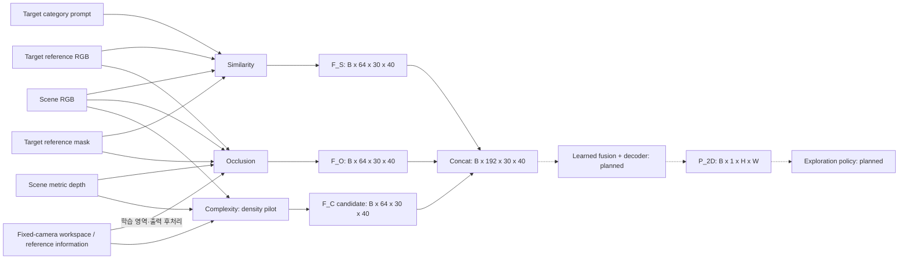

세 stream은 각각 별도 GT로 학습함. **Three-stream fusion, 최종 위치 확률의 GT·loss·decoder, DRL 통합은 아직 미구현**임. 현재 각 stream의 보조 출력을 최종 target 존재 확률로 해석하지 않음.

각 본문은 **목적·입출력 → 전체 구조 → 내부 모듈 → GT와 학습 → 핵심 설계 과정 → FAQ** 순서로 구성함. 단계별 가정·실패·비교 결과는 Development Log, 실행 문맥과 상세 근거 색인은 `agent.md`에 보존함.

### 입력과 감독 정보

**Scene은 현재 서랍의 관측 영상**, **target reference는 찾을 물체를 별도로 촬영한 영상**임. Reference mask는 그 별도 영상에서 target이 차지하는 영역이며, scene 속 가려진 target의 위치를 알려 주는 mask가 아님.

| 자료 | 내용 | 용도 |
|---|---|---|
| Scene RGB | 현재 보이는 표면의 색·질감·외형 | 세 stream의 관측 입력 |
| Scene depth | 현재 보이는 표면의 깊이 | Occlusion·Complexity 관측 입력; 뒤에 가려진 표면은 직접 관측하지 못함 |
| Target RGB | 찾을 물체의 reference 영상 | Similarity·Occlusion의 target 조건 |
| Target mask | Reference 영상의 물체 윤곽 | Similarity crop/pooling, Occlusion geometry 계산 |
| Target text | Instance name·category 등의 설명 | Similarity의 SigLIP 의미 조건 |
| Empty depth / workspace | 빈 서랍 depth와 고정 camera의 관심 영역 | Complexity의 고정 reference; Occlusion의 GT·학습 영역·표시 후처리에 사용 |
| Scene segmentation / target mesh | Pixel label / 시뮬레이션 형상 | GT 생성과 일부 teacher 진단에 사용; 학습 모델의 scene 입력과 구분 |
| GT map | 정의한 규칙에 따른 감독값 | Loss 계산·평가 |
| Prediction map | 관측 입력에서 계산한 예측값 | Stream별 평가 및 후속 fusion 입력 후보 |

**GT(Ground Truth)는 이 연구에서 정의한 학습 목표**임. Simulation 정보로 GT를 생성하더라도 추론에는 각 stream이 요구하는 관측 입력만 사용함. GT 예측 오차와 GT 정의 자체의 타당성은 별도로 검증함.

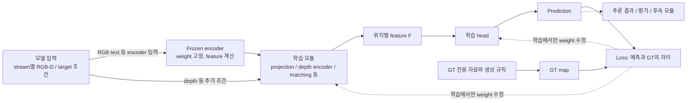

| 구분 | Feature·prediction 계산 | Weight 갱신 |
|---|---|---|
| Frozen encoder | 입력마다 feature 계산; 반복 입력은 cache 재사용 가능 | 사전학습 weight 고정 |
| Trainable module — 학습 | Feature에서 prediction 계산 후 GT와 비교 | Loss의 gradient로 갱신 |
| Trainable module — 추론 | 저장된 weight로 새 입력의 prediction 계산 | 갱신하지 않음 |

### Feature와 Tensor 규격

DINOv3 ViT-B/16은 `480×640` scene을 **16×16px patch, 총 30×40개 위치**로 처리함. 각 위치의 출력은 768-D vector이며, transformer의 attention을 통해 다른 위치의 문맥도 반영됨. 따라서 patch 간격이 16px라는 사실과 feature가 참고하는 전체 영상 범위는 다름.

```text
Scene RGB                   DINOv3 dense feature
B × 3 × 480 × 640    →      B × 768 × 30 × 40
                                 │       │
                       위치별 표현 폭    공간 격자
```

`768-D`는 형상·색·질감·문맥을 분산해서 표현하는 vector의 길이임. 각 축에 특정 물체나 물리 속성이 하나씩 지정된 것은 아님. Scene feature는 위치를 유지하고, target feature는 pooling으로 대표 vector를 만들어 사용함.

| 표기 | 의미 | 현재 규격 |
|---|---|---|
| `B` | Batch size | 동시에 처리하는 sample 수 |
| `C` | Channel 수 | DINO feature 768, stream feature 64 |
| `H,W` | 입력 영상의 세로·가로 | `480×640` |
| `H_p,W_p` | Feature grid의 세로·가로 | `30×40` |
| `ℓ` 또는 `l` | Backbone block index, 0부터 시작 | Similarity·Occlusion은 `2,5,8,11`, Complexity pilot은 `11` |
| `(u,v)` | 영상 또는 feature grid의 공간 위치 | 각 수식에서 좌표계 명시 |
| `D` in `768-D` | Dimension, vector 길이 | Depth와 구분 |
| `B` in `ViT-B` | Base 모델 크기 | Batch size와 구분 |

`B×768×30×40 → B×64×30×40`은 **공간 위치를 유지한 channel 변환**임. `30×40 → 480×640` 보간은 **공간 해상도 확대**이며, patch 내부의 새로운 세부 정보를 복원하는 연산은 아님.

### 주요 연산

| 연산·모듈 | 계산 | 프로젝트에서의 역할 |
|---|---|---|
| Encoder / backbone | 입력을 feature로 변환 | DINOv3의 위치별 외형·문맥, SigLIP의 image/text 의미 표현 |
| Head | Feature를 감독 목표의 출력으로 변환 | Stream feature에서 score map 생성 |
| Projection / Linear | `y=Wx+b` | SigLIP `1152→768`, geometry→FiLM 조건 등 학습 가능한 변환 |
| Pooling | 위치별 평균·가중 평균 | Target patch들을 대표 vector로 요약 |
| Broadcast | 같은 vector를 공간 위치마다 반복 | 모든 scene 위치에 동일한 target 조건 제공 |
| Concat | Channel 방향으로 이어 붙임 | 서로 다른 입력 단서를 별도 channel로 유지 |
| `1×1 Conv` | 같은 위치의 channel 혼합 | 공간 격자를 유지한 feature 변환 |
| `3×3 Conv` | 현재 위치와 주변 8개 위치의 channel 혼합 | 인접 patch의 공간 문맥 반영 |
| MLP | Linear와 비선형 함수의 연속 적용 | Geometry vector에서 FiLM 조절값 생성 |
| ReLU / GELU | 비선형 activation | 단순 선형 변환으로 표현하기 어려운 관계 학습 |
| GroupNorm | Sample별 channel group의 channel·공간 통계로 정규화 | 중간 feature의 수치 scale 조절 |
| Logit / sigmoid | `z → σ(z)=1/(1+exp(−z))` | 제한 없는 출력을 `0–1` 범위로 변환 |
| Loss / gradient | GT와의 오차 / parameter별 미분 | Trainable module의 weight 갱신 |

**Projection.** Similarity의 `Linear(1152,768)`은 `W: 768×1152`, `b: 768`을 학습함. 출력의 각 성분은 1152개 입력 전체의 가중합으로 계산됨. 차원을 맞추는 동시에 similarity-map loss에 맞게 semantic 표현을 변환하는 역할임.

**Normalization.** 입력·vector·중간 feature의 정규화는 목적과 계산 대상이 다름.

| 종류 | 계산 대상 | 효과 |
|---|---|---|
| RGB normalization | Pixel 값에 `/255`, channel별 mean/std 적용 | 사전학습 encoder의 입력 scale에 맞춤 |
| L2 normalization | Vector를 자신의 길이로 나눔 | 방향을 유지하고 길이를 1로 맞춤. 예: `(3,4)→(0.6,0.8)` |
| GroupNorm | Sample 내부의 channel group과 공간 값 | 그룹 통계로 중간 feature를 정규화 |

**Cosine similarity.** L2-normalized vector의 내적으로 방향 유사도를 계산함. 예를 들어 `(1,0)`과 `(0.8,0.6)`의 cosine은 `0.8`임. 같은 좌표 표현에서 비교하는 연산이므로 서로 다른 encoder의 원본 vector에 바로 적용하지 않음. Similarity의 DINO–SigLIP 결합은 학습 가능한 projection을 먼저 거침.

**Broadcast / Concat / Addition.** Target 조건을 전달하는 서로 다른 연산임.

```text
Broadcast: q=[a,b]를 모든 scene 위치에 반복
Concat:    Concat([x,y,z], [a,b]) = [x,y,z,a,b]   → 길이 5
Addition:  [x,y] + [a,b]          = [x+a,y+b]     → 길이 2
```

Similarity는 appearance와 projected semantics를 **더해 query를 생성**하고, scene·query·cosine은 **concat하여 MatchingBlock에 전달**함. Concat 단계에서 서로 다른 공간 위치를 섞지는 않으며, 이후 `3×3 Conv`가 주변 patch를 함께 처리함.

### Stream 출력과 Fusion

각 stream은 **중간 feature `F`**와 **감독용 prediction map**을 구분함. Head는 feature를 현재 GT에 맞는 소수의 score로 압축하고, fusion에는 압축 전의 64-channel 표현을 전달할 계획임.

| 출력 | Shape | 의미 |
|---|---|---|
| `F_S` | `B×64×30×40` | Similarity GT 예측을 위해 학습한 중간 표현 |
| `P_S` | `B×1×30×40` | Target과 scene의 정의된 관계 점수 |
| `F_O` | `B×64×30×40` | Occlusion GT 예측을 위해 학습한 중간 표현 |
| `P_O` | `B×1×30×40` | 해당 pixel을 덮는 후보 pose 중 가림 조건을 만족한 비율 GT의 예측 |
| 현재 `F_C` | `B×64×30×40` | Density pilot의 학습 feature 55개 + 직접 depth cue 9개 |
| Complexity auxiliary maps | `B×4×30×40` | Count score 3개 + occupancy 1개 |

**출력 범위가 같아도 의미는 다름.** Similarity의 `0.8`은 관계 점수, Occlusion GT의 `0.8`은 후보 pose의 가림 비율, occupancy의 `0.8`은 알려진 영역 중 물체 pixel의 면적 비율임. Sigmoid는 위치마다 독립적으로 적용되므로 map 전체의 합을 1로 만들지 않음.

```text
Concat(F_S, F_O, F_C): B × 192 × 30 × 40
F_fuse = Fusion(Concat(F_S, F_O, F_C))       # planned
P_2D   = Sigmoid(Decoder(F_fuse))           # planned
```

동일한 shape는 feature를 결합할 수 있는 형식적 조건임. Stream 간 의미 정렬, 최종 위치 확률의 해석·calibration, S+O 대비 S+O+C의 탐색 효용은 fusion 단계에서 별도로 검증해야 함.

---

## From Shelf Search to Drawer Search

기존 선반 환경 연구를 비정형 drawer 환경으로 확장함.

> H. Jeon et al., *A study on deep reinforcement learning-based exploration intelligence for occluded object search*, Engineering Applications of Artificial Intelligence, 2026.

기존 연구는 similarity와 occlusion 기반 column-wise distribution을 사용함. 물체 유사도를 수동 정의한 category score에 의존했기 때문에, 학습에 없던 물체로 확장되는 zero-shot 탐색 성능을 확인하지 못했음.

주요 확장:

- 정규적인 shelf column에서 **비정형 cluttered drawer**로 확장
- Column-wise distribution에서 **pixel-wise 2D-PDM**으로 확장
- DINOv3의 dense appearance와 SigLIP의 language-aligned semantics 결합
- 학습하지 않은 target instance를 입력할 수 있는 zero-shot target conditioning
- Similarity와 Occlusion에 scene-level **Complexity stream** 추가

---

## Similarity Stream

> **현재 상태:** DINOv3–SigLIP no-shortcut 구조 구현. 학습에 없던 Banana와 `packaged_food_5`에서 관련 물체 영역을 활성화하는 zero-shot 동작을 정성적으로 확인함. 공식 final checkpoint 지정과 여러 미학습 target의 정량 성능 평가는 후속 작업임.

### 1. 목적과 입출력

Similarity stream은 **target 자체와 의미적으로 관련된 가시 영역**을 표현함. DINOv3의 위치별 visual feature에 target appearance와 SigLIP image/text semantics를 결합하여 위치별 similarity score를 학습함. Target이 더미 뒤에서 가려질 수 있는 위치는 Occlusion Stream이 담당함.

#### 검색 조건과 표현 범위

**Scene RGB**는 검색할 서랍 전체 영상이고, **target reference**는 찾을 물체를 별도로 촬영한 영상임. 두 입력을 각각 인코딩한 뒤 feature 공간에서 비교함.

Banana query를 예로 들면, 노란 toy와의 외형 유사도와 apple/orange의 같은-category 관계를 함께 다룰 필요가 있음. **외형 유사도만으로는 category 관계를, 전역 의미 조건만으로는 scene의 위치를 충분히 표현하기 어려움.** Target의 외형·의미 조건과 scene의 위치별 feature를 결합하는 이유임.

```text
찾을 물체: Banana reference image         검색할 관측: Drawer RGB
         + target mask                    사과 / 오렌지 / 노란 toy / 책
         + 선택한 text 조건                           │
                  │                                   │
            무엇을 찾는가?                      어디에 무엇이 보이는가?
                  └──────── 위치별로 함께 비교 ────────┘
                                      │
                         scene의 위치별 similarity score
```

Banana는 기존 16개 training target에 포함되지 않은 external query임. 아래 vector·cosine·score의 수치 예제는 **계산 원리를 위한 가상값**이며, 실제 정성 결과와 구분함.

#### Target representation

공통 표기와 연산은 Feature와 Tensor 규격, 주요 연산에 정리함. Similarity의 target 표현은 다음 네 항목으로 구분함.

| 표현 | 구성 | 역할 |
|---|---|---|
| Appearance `a_t^ℓ` | DINO target patch를 mask pooling한 layer별 768-D vector | Reference의 외형·문맥 표현 |
| Semantic `s` | SigLIP image/text를 결합한 1152-D vector | Target의 전역 의미 조건 |
| Hybrid query `q_t^ℓ` | Appearance + layer별 projected semantic | 각 scene 위치와 비교할 검색 조건 |
| Target mask | Reference의 target pixel을 지정한 이진 지도 | Crop과 appearance pooling 범위 지정. Scene의 정답 mask와 다름 |

#### 입력·출력 규격

| 구분 | 현재 구현의 입력·출력 | 의미 |
|---|---|---|
| Scene 입력 | RGB `B×3×480×640` | 검색할 scene. Similarity에는 scene depth나 scene segmentation을 입력하지 않음 |
| Target 입력 | Reference RGB, target mask, 물체 설명·category prompt | Mask로 물체 crop과 appearance pooling 범위를 정하고, image/text로 검색 조건을 구성 |
| 학습 feature `F_S` | `B×64×30×40` | 이후 fusion에 제공하려는 위치별 표현. 현재 model의 `fused` 반환값 |
| Score map `P_S` | `B×1×30×40`, 필요시 `B×1×480×640`로 확대 | Target–scene 관계 GT를 회귀한 `0–1` score. 보정된 target 존재 확률은 아님 |

현재 reference loader는 `target_dir/rgb`, `target_dir/seg`, `mapping.json`을 요구함. **Raw target RGB에서 crop·mask를 자동 생성하는 배포 경로는 미구현**임.

### 2. 전체 모델 구조

**DINOv3는 scene의 위치별 표현과 target 외형을, SigLIP은 target의 image/text 의미 조건을 제공**함. Semantic projection과 matching head가 두 표현을 GT relation score에 연결하도록 학습됨.

| Component | 입력 | 표현 | 역할 |
|---|---|---|---|
| DINOv3 Scene Encoder | 서랍의 RGB 전체 영상 | 위치가 보존된 네 layer의 dense visual feature | 검색 결과를 scene의 어느 위치에 놓을지 유지하며, 각 위치를 target query와 비교할 수 있게 함 |
| DINOv3 Target Encoder | Mask로 정한 RGB crop | Target view의 네 layer별 appearance | 찾는 물체의 실제 모습이 query에 남도록 함. Mask pooling으로 한 vector씩 요약 |
| SigLIP Vision Encoder | Target RGB crop 전체 | Target image의 전역 semantic representation | 외형 특징 외에 사전학습 image/text 공간의 정보를 query에 제공 |
| SigLIP Text Encoder | 물체 설명과 category 문장 | 언어로 주어진 semantic condition | 사진만으로 모호할 수 있는 의미 조건을 추가. 위치를 직접 예측하지는 않음 |
| Layer-wise semantic projection | Image/text를 결합한 1152-D vector | DINO query에 합산할 네 개의 768-D vector | 서로 다른 표현을 사용할 수 있도록 학습되는 변환. 단순 자르기·0 채우기가 아님 |
| Scene–target interaction | Scene vector, hybrid query | Raw feature 둘과 명시적인 cosine cue | Head에 “현재 위치의 특징 / 찾는 조건 / 직접 유사도”를 동시에 제공 |
| MatchingBlock ×4 | 각 layer의 interaction map | 위치별 64-D 학습 feature | 이웃 위치까지 함께 읽고 GT relation을 예측하는 데 필요한 조합을 학습 |
| Layer fusion + score head | 네 MatchingBlock 출력 | `F_S`와 score map `P_S` | 네 처리 단계의 정보를 섞은 뒤 한 위치당 최종 score 하나로 읽어 냄 |

**Dense scene feature**는 공간 위치마다 vector를 유지하는 표현임. Target branch는 물체 하나를 query로 요약하므로 pooling을 적용하고, scene branch는 출력 위치를 보존하기 위해 `30×40` grid를 유지함.

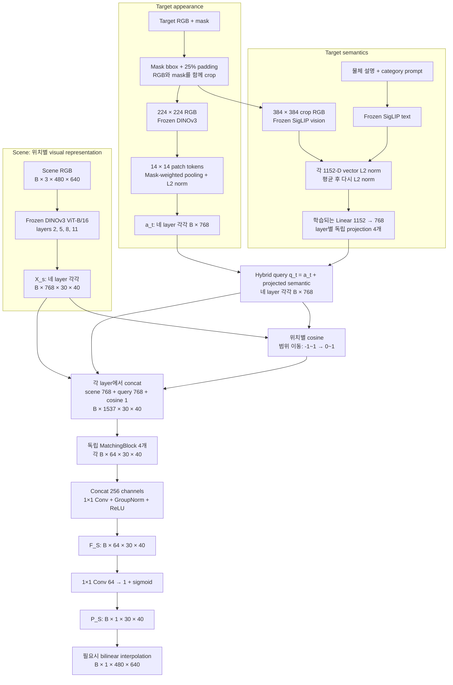

기준 코드는 `backbone.py`, `target_utils.py`, `similarity_model.py`, `train_similarity_v2.py`임. Scene와 target appearance는 같은 frozen DINOv3 backbone을 사용함. SigLIP은 target 조건을 만들 때만 사용하며, scene를 SigLIP으로 다시 인코딩하지 않음.

| 단계 | Tensor 변화 | 차원과 계산의 의미 |
|---:|---|---|
| 1 | Scene RGB → layer별 `B×768×30×40` | `480/16=30`, `640/16=40`: 총 1,200개 위치에 768-D DINO token |
| 2 | Target crop `B×3×224×224` → layer별 `B×768×14×14` | `224/16=14`: 196개 patch를 물체 mask의 포함 비율로 pooling |
| 3 | Pooling → layer별 `a_t^ℓ: B×768` | Target view 하나를 나타내는 L2-normalized appearance vector |
| 4 | SigLIP image/text 각각 `B×1152` → `s: B×1152` | 두 vector를 각각 정규화하고 평균한 뒤 다시 정규화 |
| 5 | 독립 `Linear(1152,768)` 4개 → layer별 `s_t^ℓ: B×768` | 각 DINO layer에서 사용할 semantic condition으로 학습 변환 |
| 6 | `q_t^ℓ=a_t^ℓ+s_t^ℓ` → `B×768` | 합산 후에는 다시 정규화하지 않는 hybrid query |
| 7 | Query broadcast + patch cosine → `B×1537×30×40` | Raw scene `768` + raw query `768` + shifted cosine `1` |
| 8 | MatchingBlock → 네 개의 `B×64×30×40` | Layer별 입력을 주변 문맥과 함께 해석 |
| 9 | Concat `B×256×30×40` → fusion → `F_S: B×64×30×40` | `256=4×64`; `1×1 Conv`로 네 layer의 정보를 혼합 |
| 10 | Head → logit `B×1×30×40` → sigmoid | 위치별 similarity score. Full-resolution 표시는 bilinear 확대 |

#### 단일 query 처리 순서

Banana reference와 scene 한 장(`B=1`)을 처리하는 경우의 계산 순서임. 수치 예제와 실제 unseen-target 성능은 구분함.

| 순서 | 연산 | 전달되는 정보 |
|---:|---|---|
| 1 | Scene RGB `1×3×480×640` → DINO layers 2/5/8/11 | Target 조건이 아직 반영되지 않은 위치별 768-D feature, 총 1,200개 위치 |
| 2 | Reference mask bbox crop → `224×224` DINO 입력 → `14×14` mask pooling | Target 포함 비율로 가중 평균한 layer별 768-D appearance |
| 3 | Crop을 `384×384`로 resize → SigLIP image/text 인코딩 | 각 1152-D vector의 정규화·평균으로 semantic 조건 생성. Image-only에서는 text 제외 |
| 4 | 독립 projection 4개 → 해당 layer의 appearance에 합산 | Target 입력에 따라 달라지는 네 hybrid query |
| 5 | 모든 scene 위치에 query broadcast → cosine·raw feature concat | 위치별 1,537-channel interaction |
| 6 | Layer별 `3×3` MatchingBlock → 네 결과 fusion | 이웃 문맥과 여러 layer를 결합한 64-channel `F_S` |
| 7 | `1×1` head → sigmoid → 필요시 bilinear 확대 | `30×40` score map과 표시용 `480×640` map |

Scene encoder의 weight는 target에 따라 바뀌지 않음. **Query에 따라 interaction과 head 출력이 달라지는 구조**임. 위 계산 경로가 특정 물체의 출력 순위를 보장하지는 않으며, 실제 cache 범위는 학습 구현에 따라 구분함.

### 3. 내부 모듈과 선택 이유

#### 1. DINOv3 — Dense scene feature와 target appearance

DINOv3 ViT-B/16은 12개 transformer block과 768-D embedding을 사용함. 코드의 layer index `2, 5, 8, 11` 네 중간 출력을 `norm=True`로 받아 서로 다른 처리 단계의 정보를 유지함. 초기 layer는 형태, 후기 layer는 의미만 담당한다고 고정할 수는 없으며, 네 layer를 쓰는 선택의 개별 효과는 ablation으로 확인해야 함.

**Multi-layer extraction:** Index `2,5,8,11`은 0-based 표기로 3·6·9·12번째 block에 해당함. 동일 입력을 순차적으로 처리하는 한 backbone에서 네 중간 출력을 추출함.

```text
한 장의 RGB
  → patch embedding → block 0 → block 1 → block 2 → ... → block 5 → ... → block 8 → ... → block 11
                                           │                │                │                 │
                                   feature map 2     feature map 5     feature map 8      feature map 11
                                   모두 768-D, scene에서는 같은 30×40 공간 격자
```

`768`은 backbone의 embedding 폭임. 사전학습 좌표에 “노란색”, “과일” 등의 의미를 수동 배정하지 않으며, task head가 이 좌표의 조합을 학습함.

**Target preprocessing:** Mask bbox의 높이·너비 각각 25%를 양쪽에 padding하고 이미지 경계에서 제한함. **RGB와 mask를 같은 영역으로 crop하며, 배경 RGB를 검게 지우지 않음.** DINO 입력 RGB는 `224×224`로 bilinear resize하고 mask는 nearest-neighbor resize함. Scene와 target RGB에는 같은 ImageNet normalization을 적용함.

가상 bbox가 가로 80px·세로 120px이면 좌우 20px·상하 30px를 더해 `120×180` crop을 얻음(이미지 경계에 걸리지 않는 경우). 이를 종횡비 유지 padding 없이 `224×224`로 직접 resize함. Mask도 같은 변환을 적용하여 target 위치를 유지함.

Crop 배경은 encoder 문맥에 포함될 수 있음. 이후 mask pooling이 적용되더라도 배경의 간접 영향까지 완전히 제거하는 것은 아님.

Pixel mask `M`을 `16×16` average pooling하면 각 target patch가 물체를 포함하는 비율 `r_ij`가 됨. 이를 합이 1인 weight로 바꾸고 196개 patch vector를 가중 평균함.

$$
r_{ij}=\frac{1}{256}\sum_{(x,y)\in\mathrm{patch}(i,j)}M(x,y),
\qquad
w_{ij}=\frac{r_{ij}}{\sum_{p,q}r_{pq}},
\qquad
a_t^{\ell}=\mathrm{L2Norm}\!\left(\sum_{i,j}w_{ij}T_t^{\ell}(:,i,j)\right).
$$

예를 들어 물체가 patch의 절반을 차지하면 `r_ij=0.5`이므로 경계 patch도 포함 비율만큼 기여함. Mask가 사실상 비어 있으면 코드에서는 전체 patch의 균등 pooling으로 fallback함. 이 pooling은 target의 공간 배치를 vector 하나로 요약하므로, target–scene의 세밀한 patch correspondence를 보존하는 방법은 아님.

**Mask-weighted pooling:** 위치별 vector를 mask 포함 비율로 가중 평균함. 196개 patch를 세 개로 단순화한 계산 예는 다음과 같음.

```text
Target patch                 A             B             C
Mask 포함 비율 r            1.0           0.5           0.0
합이 1인 weight w           2/3           1/3           0

정규화 전 target vector = (2/3)×T_A + (1/3)×T_B + 0×T_C
```

`T_A`, `T_B`, `T_C`는 각각 768-D vector임. 각 좌표끼리 가중 평균하므로 **공간 위치 수는 196→1로 줄고 embedding 길이 768은 유지**됨.

**L2 normalization:** Pooling한 vector의 방향을 유지하면서 길이를 1로 맞춤. `[3,4]`의 길이는 `sqrt(3²+4²)=5`이므로 결과는 `[0.6,0.8]`임. 같은 방향인 `[6,8]`도 동일하게 정규화됨.

$$
\mathrm{L2Norm}(v)=\frac{v}{\max(\lVert v\rVert_2,\epsilon)},
\qquad \lVert v\rVert_2=\sqrt{\sum_k v_k^2}.
$$

L2 normalization은 음수 좌표를 유지하며, 좌표 범위를 `0–1`로 맞추는 min–max 정규화와 다름. DINO extraction의 `norm=True`는 backbone LayerNorm을 뜻하므로 **LayerNorm과 L2 normalization도 별개 연산**임.

DINO token에는 self-attention을 통한 주변·전체 문맥이 이미 반영됨. 따라서 위치가 `16×16` patch grid에 대응한다고 해서 그 token이 해당 256 pixel만 보고 만들어졌다는 뜻은 아님. Backbone은 CLS token도 반환하지만 현재 Similarity head와 target appearance pooling에서는 사용하지 않음.

#### 2. SigLIP — Semantic conditioning과 layer-wise projection

초기 DINO appearance matching과 CLS category prototype에서 외형이 다른 unseen target의 category 관계가 불안정했기 때문에, language와 정렬된 SigLIP image/text 표현을 추가함. 여기서 SigLIP은 similarity 정답 숫자를 생성하는 모델이 아니라 **target query를 보완하는 frozen encoder**임.

**Encoder 규격:** `google/siglip-so400m-patch14-384`의 image/text `pooler_output`은 각각 1152-D임. `patch14`는 vision patch 크기, `384`는 RGB 입력 크기이며 `SO400M`은 400-D를 의미하지 않음.

동일 crop을 각 encoder 규격에 맞춰 DINO는 `224×224`, SigLIP은 `384×384`로 resize함. SigLIP RGB에는 mean/std `0.5/0.5`를 적용하고, mask로 지우지 않은 crop 전체를 입력함.

학습에서는 target별 center reference image 한 장과 다음 형식의 text를 사용함.

```text
a photo of {object_description}, a type of {category}

예: a photo of an apple, a type of fruit
```

`TARGET_LABELS`의 설명은 사람이 지정함. 설명이 없는 target은 category 문장으로 fallback하며, 책 네 개처럼 서로 같은 설명을 쓰는 경우도 있으므로 text가 항상 instance identity를 구별해 주는 것은 아님. 현재 학습 경로에서 category 정보는 외부 조건임.

$$
s_{\mathrm{img}}=\mathrm{L2Norm}(\mathrm{SigLIP}_{\mathrm{image}}(I_t)),
\qquad s_{\mathrm{text}}=\mathrm{L2Norm}(\mathrm{SigLIP}_{\mathrm{text}}(p_t)),
$$
$$
s=\mathrm{L2Norm}\!\left(\frac{s_{\mathrm{img}}+s_{\mathrm{text}}}{2}\right),
\qquad s_t^{\ell}=W^{\ell}s+b^{\ell},
\qquad q_t^{\ell}=a_t^{\ell}+s_t^{\ell}.
$$

**Learned adapter:** 네 projection은 독립적인 `Linear(1152,768)`이며 가중치를 공유하지 않음. 각 출력 좌표는 SigLIP 입력 1152개의 학습 가중합임. 별도 alignment loss 없이 최종 similarity-map MSE로 학습함.

Projection은 차원 변환과 semantic 활용 경로를 제공함. **차원 일치만으로 latent space의 의미 정렬이 보장되지는 않음.**

Layer별 weight `W^ℓ`는 `768×1152`, bias `b^ℓ`는 768-D임. 출력의 k번째 좌표는 다음과 같음.

$$
s_{t,k}^{\ell}=\sum_{j=1}^{1152}W_{kj}^{\ell}s_j+b_k^{\ell}.
$$

각 출력은 입력 전체를 조합하므로 앞의 768개 좌표만 선택하는 절단 연산과 다름. 독립 projection은 DINO layer별로 다른 변환을 학습할 수 있게 함. 공유 projection 대비 우월성은 별도 ablation이 필요함.

```text
SigLIP image vector: 1152개 ── L2 norm ─┐
                                      ├─ 좌표별 평균 ─ L2 norm ─ s: 1152개
SigLIP text vector : 1152개 ── L2 norm ─┘                           │
                                  ┌───────────────┬───────────────┼───────────────┐
                              Linear_2        Linear_5        Linear_8        Linear_11
                              1152→768        1152→768        1152→768        1152→768
                                  │               │               │               │
                         + DINO a_2      + DINO a_5      + DINO a_8      + DINO a_11
                                  │               │               │               │
                                 q_2             q_5             q_8             q_11
```

Image/text 평균은 같은 SigLIP 모델의 두 표현을 결합하는 선택임. DINO와 SigLIP을 곧바로 평균하는 것이 아님. 같은 SigLIP 공간이라도 두 정보가 항상 동일하거나 단순 평균이 최적이라는 뜻은 아니므로 image-only, text 조건 변화, image+text를 통제해 비교할 필요가 있음.

`s_t^ℓ`와 합산 query `q_t^ℓ`는 정규화하지 않음. Cosine 경로에서만 query의 L2 norm을 맞추고, MatchingBlock에는 raw query를 전달함. 따라서 query의 방향은 cosine에, 방향과 크기는 raw interaction 입력에 반영됨. Center image 하나가 semantic 조건을 대표한다는 선택도 viewpoint invariance가 실험적으로 보장됐다는 뜻은 아님.

#### 3. Scene–target interaction — Raw feature와 cosine cue

각 layer에서 scene의 1,200개 위치마다 hybrid target query와 cosine을 계산함. Scene 전체를 scalar 하나로 압축하지 않음.

$$
c^{\ell}(u,v)=\frac{X_s^{\ell}(:,u,v)^{\mathsf T}q_t^{\ell}}
{\lVert X_s^{\ell}(:,u,v)\rVert_2\lVert q_t^{\ell}\rVert_2},
\qquad \widehat c^{\ell}(u,v)=\frac{c^{\ell}(u,v)+1}{2}.
$$

`c`는 `−1–1`, shifted cosine `ĉ`는 `0–1` 범위임. 이 범위 이동은 순위를 바꾸지 않으며 `ĉ` 자체를 target 존재 확률로 만들지도 않음. 각 위치에 같은 query를 broadcast하고 다음과 같이 concat함.

Cosine은 두 vector가 향하는 **방향**을 비교함. 2-D 설명용 예에서 target query가 `[1,0]`이면 scene vector `[1,0]`과의 cosine은 1, `[0,1]`과는 0, `[-1,0]`과는 −1임. 현재 head에 넣는 shifted cosine은 각각 `1`, `0.5`, `0`이 됨. 따라서 shifted score `0.5`는 cosine상 직교라는 뜻이지, 실제 target일 확률 50%라는 뜻이 아님.

**Broadcast**는 동일 query를 모든 scene 위치에 제공하고, **concat**은 scene·query·cosine을 별도 channel로 이어 붙임. 같은 길이의 좌표끼리 합산하는 addition과 구분됨.

```text
설명용 3-D scene vector x = [2, 3, 4]
설명용 3-D target query q = [5, 6, 7]
위 두 vector의 shifted cosine cue c ≈ [0.99575]

덧셈 x+q       = [7, 9, 11]                 → 길이 3, 각 좌표를 합침
Concat[x,q,c] ≈ [2,3,4, 5,6,7, 0.99575]       → 길이 7, 원본 정보를 별도 좌표로 유지

실제 구현은 768 + 768 + 1 = 1537 channels
```

```text
Z^ℓ(u,v) = Concat[raw scene feature, raw target query, shifted cosine]
channels =              768       +       768      +       1       = 1537
```

**결합 이유:** 서로 다른 768-D scene feature가 같은 cosine을 가질 수 있음. Raw scene·query를 함께 전달하여 head가 위치별 관측, 검색 조건, 직접 유사도를 동시에 활용하도록 함. 우연한 고유사도 억제와 관련 영역 강화는 이 설계의 학습 목표이며, 입력별 기여를 독립 ablation으로 모두 입증한 상태는 아님.

현재 trainer는 `category_dim=0`임. 과거 CLS category probability channel은 1537개 interaction에 포함되지 않음.

Query는 공간적으로 같지만 scene feature와 cosine은 위치별로 다름. Orange patch와 book patch에 동일 query를 주더라도 interaction과 출력은 달라질 수 있음.

```text
동일한 query만 공간 위치마다 복사하여 사용:

q: 768개 ──┬→ Concat[X(0,0),   q, c(0,0)]   → Z(0,0):   1537개
           ├→ Concat[X(0,1),   q, c(0,1)]   → Z(0,1):   1537개
           │                     ...
           └→ Concat[X(29,39), q, c(29,39)] → Z(29,39): 1537개

X(u,v)는 해당 위치의 scene feature 768개만 사용함.
c(u,v)는 그 X(u,v)와 q로 계산한 shifted cosine cue 1개임.
```

#### 4. MatchingBlock, multi-layer fusion과 score head

```text
각 layer의 Z^ℓ: B×1537×30×40
    → Conv 3×3, 1537→64, padding=1
    → GroupNorm(8,64) → ReLU
    → Conv 1×1, 64→64
    → GroupNorm(8,64) → ReLU
    → F_ℓ: B×64×30×40

Concat[F_2,F_5,F_8,F_11]: B×256×30×40
    → Conv 1×1, 256→64 → GroupNorm(8,64) → ReLU
    → F_S: B×64×30×40
    → Conv 1×1, 64→1 → sigmoid
    → P_S: B×1×30×40
```

첫 `3×3 Conv`는 현재 patch와 주변 8개 grid cell의 입력을 학습 가중합하여 local 문맥을 추가함. `1×1 Conv`는 공간 위치를 유지하면서 channel을 재조합함. `GroupNorm(8,64)`은 sample 내부에서 64 channel을 8개 group으로 정규화하고, ReLU는 음수 반응을 0으로 만드는 비선형 함수임. 네 MatchingBlock은 구조만 같고 가중치는 각각 다름.

**CNN(Convolutional Neural Network)**은 격자 위에서 같은 학습 filter를 이동시키며 계산하는 신경망임. 여기서 `3×3`은 원본 RGB의 3 pixel이 아니라 **30×40 feature grid의 3칸×3칸**을 뜻함. 격자상으로는 원본 48×48px 폭에 대응하지만 각 DINO token 자체가 더 넓은 문맥을 포함하므로 전체 영향 범위를 48×48px로 제한했다고 해석하지 않음.

첫 Conv의 output channel 하나는 한 위치에서 `1537×3×3=13,833`개 입력값에 학습 weight를 곱해 합산하고 bias를 더함. 이런 filter 64개로 64-channel 출력을 만듦. `padding=1`로 경계에 0 padding을 넣어 출력 격자 `30×40`을 유지함. 다음 `1×1 Conv`는 그 위치의 64개 channel을 다시 조합하므로 새로운 이웃 위치를 추가하지 않음. GroupNorm은 group의 channel과 공간 값들을 함께 정규화하므로 block 전체를 순수한 local filter 하나와 동일시하지 않음.

| 비교 항목 | Patch-wise cosine | MatchingBlock |
|---|---|---|
| 역할 | Scene vector와 query의 방향 유사도 측정 | Raw 관측·query·cosine·이웃 문맥의 task feature 생성 |
| 계산 규칙 | L2 normalization 후 내적이라는 고정 수식 | 학습되는 `3×3 Conv → GN → ReLU → 1×1 Conv → GN → ReLU` |
| 입력 | Scene vector 768개, query 768개 | Scene 768 + query 768 + cosine 1, 주변 grid 위치 |
| 출력 | 위치별 숫자 1개 | 위치별 숫자 64개 |
| 위치 처리 | 현재 위치의 두 vector를 비교 | 격자를 유지하면서 3×3 이웃을 추가로 혼합 |
| 학습 parameter | Cosine 연산 자체에는 없음. Query projection에는 gradient가 흐름 | Conv와 GroupNorm의 parameter를 학습 |
| 수행하지 않는 것 | 물체 boundary나 관계의 이유를 명시적으로 분류하지 않음 | Target patch별 탐색, cross-attention, 독립적인 correspondence 계산이 아님 |

**Cosine은 고정 비교값, MatchingBlock은 학습된 비선형 해석 경로**임. 실제 개선 여부는 같은 조건의 cosine-only 대조가 필요함.

`64`는 category 수나 미리 정한 유사도 종류 수가 아니라 head의 표현 용량 `hidden_ch=64`임. Fusion 입력 `256`도 `4 layers×64 channels`에서 나온 수이며 Occlusion depth encoder의 256-D 표현과는 별개임.

MatchingBlock은 cross-attention이나 target patch별 correspondence를 다시 계산하는 모듈이 아님. Patch-wise cosine은 **명시적인 위치별 비교값**을 제공하고, MatchingBlock은 **원본 feature·query·cosine과 이웃 위치를 이용한 비선형 예측**을 학습함. CNN 선택의 이유는 이런 local 공간 연산이며, 모든 MLP가 반드시 공간 정보를 잃는다는 뜻은 아님.

최종 score는 head의 logit에 sigmoid를 적용한 값임. **현재 출력에는 raw DINO cosine을 직접 더하는 residual shortcut이 없음.** Cosine은 위의 interaction channel로만 전달됨. Full-resolution 출력은 sigmoid 이후 bilinear interpolation(`align_corners=False`)으로 만들며, 새 경계 세부 정보를 복원하는 decoder는 아님.

Logit은 아직 `0–1`로 제한하지 않은 실수 score임. 마지막 `1×1 Conv`는 위치별 `F_S`의 64개 값을 가중합하여 logit `z` 하나를 만들고, sigmoid `1/(1+exp(−z))`가 이를 bounded score로 바꿈. 예를 들어 `z=0`이면 `0.5`, `z≈1.386`이면 약 `0.8`임. 이는 함수의 계산 예이며 특정 물체에서 실제로 측정한 출력이 아님.

```text
한 위치의 F_S: [f1, f2, ... , f64]
          → z = h1*f1 + h2*f2 + ... + h64*f64 + bias
          → sigmoid(z)
          → 그 위치의 P_S 하나
```

`F_S`는 숫자 64개를 유지하므로 최종 map 한 값보다 풍부한 중간 표현을 후속 fusion에 전달할 여지가 있음. 반면 `P_S`는 이 feature를 현재 relation GT로 감독하기 위한 한 개의 readout임. 아직 구현되지 않은 최종 fusion에서 `F_S`가 유용한 관계를 충분히 보존하는지는 별도 검증 대상임.

#### 5. 학습되는 parameter와 cache

| Module | Trainable parameters | 계산 근거 |
|---|---:|---|
| Semantic projection 4개 | 3,542,016 | `4×(1152×768+768)` |
| MatchingBlock 4개 | 3,559,168 | Block당 `889,792`: 두 Conv의 weight/bias와 두 GroupNorm의 affine parameter |
| Multi-layer fusion | 16,576 | `256×64+64+2×64` |
| Score head | 65 | `64×1+1` |
| **합계** | **7,117,825** | DINOv3와 SigLIP의 frozen parameter 제외 |

DINOv3와 SigLIP은 `eval` 및 gradient 비활성 상태로 사용함. 현재 cache와 step별 계산 범위는 다음과 같음.

| 경로 | 현재 처리 | 근거 |
|---|---|---|
| Target DINO appearance | Target별 다섯 camera vector를 사전 cache | 입력과 frozen weight가 고정되어 재사용 가능 |
| Target SigLIP semantic | Center RGB/text의 1152-D vector를 사전 cache | 학습 중 고정된 semantic 입력 |
| Scene DINO | Dataset RGB를 읽어 **매 batch forward** | 전체 scene feature를 사전 저장해 조회하는 training 경로는 아님 |
| Semantic projection·query | 매 step 재계산 | Projection weight가 갱신되므로 projection 이후 query를 고정 cache할 수 없음 |

과거 버전의 cache·VRAM 관련 명칭이나 주석과 현재 호출 경로는 구분함.

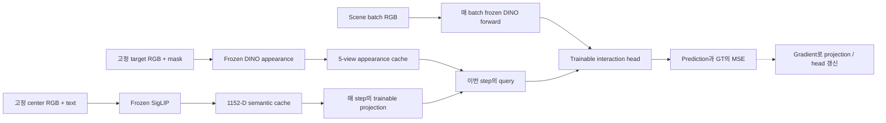

**학습 범위:** 역전파로 loss의 parameter별 gradient를 계산하고 projection·head만 갱신함. Frozen encoder는 필요한 forward를 수행하되 이번 loss로 weight를 수정하지 않음.

### 4. GT 생성과 학습

#### Relation score GT와 loss

`gt_similarity.py`는 scene segmentation의 asset mapping과 category를 사용하여 다음 GT를 구성함. 이 category 관계는 연구에서 정한 supervision이며, SigLIP이 자동으로 정한 similarity 정답이 아님.

| Target–scene 관계 | Pixel GT score |
|---|---:|
| 동일 target asset label | `1.0` |
| 같은 category | `0.8` |
| 관련 category: book↔toy, fruit↔packaged_food | `0.5` |
| 그 외 알려진 category 물체 | `0.2` |
| 배경·unknown | `0.0` |

| Target ↓ / Scene → | Book | Toy | Fruit | Packaged food |
|---|---:|---:|---:|---:|
| Book | 0.8 | 0.5 | 0.2 | 0.2 |
| Toy | 0.5 | 0.8 | 0.2 | 0.2 |
| Fruit | 0.2 | 0.2 | 0.8 | 0.5 |
| Packaged food | 0.2 | 0.2 | 0.5 | 0.8 |

표는 색 mapping이 유일할 때의 규칙임. `색 → asset 이름 → category 관계 → score` 순서로 GT를 정하고, 동일 target asset에는 category 점수보다 우선하여 `1.0`을 부여함. Target의 실제 존재 확률을 관측한 정답은 아님.

**GT 로드:** `paths_config.GT_DIR`의 precomputed grayscale GT를 우선 읽고 `/255`로 변환함. 파일이 없을 때 segmentation과 mapping으로 생성함.

Banana를 target으로 삼는다고 가정한 **규칙 설명용 GT**는 다음과 같음. 이는 external Banana로 실제 학습하거나 새 GT를 생성했다는 뜻은 아님.

```text
Scene의 물체        동일 Banana    Orange    Packaged food    Book/Toy    배경
Target과 관계       exact          fruit     related          other       unknown/background
이 규칙의 점수      1.0            0.8       0.5              0.2         0.0
```

**입력과 감독의 구분:** Target mask는 reference query를 구성하는 **추론 입력**임. Scene segmentation은 **GT 생성 전용**이며 추론 때 scene의 정답 위치를 head에 제공하지 않음.

**색 충돌 한계:** 생성 함수는 BGR을 dictionary key로 사용하므로 서로 다른 asset이 같은 색을 가지면 뒤 score가 앞 값을 덮을 수 있음. **기존 GT의 충돌 범위·map 변화에 대한 소급 정량 audit은 미실행**임.

$$
Y_{\mathrm{patch}}=\mathrm{AvgPool}_{16\times16}(Y_{\mathrm{full}}),
\qquad
L_{\mathrm{sim}}=\frac{1}{BH_pW_p}\sum_{b,i,j}
\left(P_S(b,i,j)-Y_{\mathrm{patch}}(b,i,j)\right)^2.
$$

Loss는 확대된 시각화가 아닌 `30×40` patch grid에서 계산함. 한 patch의 절반이 exact target(`1.0`), 나머지가 배경(`0`)이면 GT가 `0.5`가 됨. 동일한 score가 서로 다른 관계·면적 혼합에서 나올 수 있으므로 밝은 영역을 exact target segmentation이나 존재 확률로 바로 해석하지 않음.

**MSE 수치 예제:** 예측과 정답의 차이를 제곱한 뒤 평균함.

| Patch | GT | Prediction | Squared error |
|---|---:|---:|---:|
| A | 0.8 | 0.6 | `(0.6−0.8)²=0.04` |
| B | 0.2 | 0.3 | `(0.3−0.2)²=0.01` |

두 patch의 MSE는 `(0.04+0.01)/2=0.025`임. 실제 코드는 batch의 모든 `30×40` 위치를 평균함.

```text
Scene RGB + target condition ── model ── prediction P_S
                                                │
Scene segmentation + relation rule ── GT Y ─────┤ 차이의 제곱을 평균
                                                ↓
                                             MSE loss
                                                ↓
                                  projection / head weight 갱신
```

**평가 범위:** `0.8/0.5/0.2`와 경계의 중간값을 회귀하는 loss이며 0/1 category classification과 다름. MSE만으로 탐지 성공률이나 exact-target ranking을 대신하지 않음. 배경도 평균에 포함되므로 foreground 오류의 비중이 작아질 수 있음.

#### 데이터와 현재 training protocol

기존 book·fruit·packaged_food·toy 각 4개, **16개 target 모두를 training pool에 유지**함. 새로운 target의 zero-shot 평가는 별도 external asset으로 수행함. Source의 “15 targets / packaged_food_1 제외” 주석은 오래된 설명이며 실제 `TARGETS`와 현재 데이터는 16개임.

| 항목 | 현재 설정 |
|---|---|
| Scene split | Target별 10 scene ID를 8 train / 2 validation으로 분리. 같은 scene ID의 environment와 camera는 같은 split |
| Scene camera | center, top, left, right, bottom |
| Environment sampling | `ENV_STRIDE=10`: `0,10,…,290`, scene ID당 30개 |
| 현재 데이터의 sample 수 | Train `16×8×30×5=19,200`; validation scene sample `16×2×30×5=4,800` |
| Target camera 사용 | Train은 sample마다 5개 중 무작위 하나, validation은 5개를 모두 순회하여 총 24,000 scene–reference 비교 |
| Semantic 조건 | Target당 center image 한 장 + 물체 설명/category text. Target appearance camera를 바꿔도 semantic은 고정 |
| Optimizer | AdamW, learning rate `1e-3`, default weight decay `0.01` |
| Batch / schedule | Batch `128`, 최대 `100` epochs, CosineAnnealingLR |
| Checkpoint 갱신 / early stopping | 이전 best MSE보다 **5% 초과 개선** 시 best 저장; 개선 없이 `5` epochs면 종료 |
| Split seed | 기본 `None`; 실행 시작 시 seed 하나를 정해 모든 target에 사용 |

현재 코드는 seed와 실제 split 목록을 stdout에 출력하지만 `train_log.txt`와 checkpoint에 자동 보존하지 않음. 과거 no-shortcut snapshot에는 target마다 seed가 새로 생성되던 split 문제가 있었고 이후 수정됨. 따라서 현재 코드의 분할 절차가 과거 run에 그대로 적용됐다고 가정하거나, 같은 checkpoint shape만으로 정확한 학습 재현성이 확보됐다고 해석하면 안 됨.

**Scene-level split:** 동일 배치의 top/left 등 camera view는 상관된 관측임. Image별 무작위 분할에서 발생할 수 있는 배치 누출을 줄이기 위해 scene ID를 먼저 분리하고, 해당 environment와 다섯 view를 함께 배정함.

**Seen-target validation:** 기존 16개 target은 모두 training pool에 유지함. 이 split은 새로운 scene에 대한 평가이며 새로운 target 평가가 아님. `4,800 images×5 reference views=24,000 comparisons`는 동일 scene의 반복 비교를 포함하므로 독립 scene 24,000개로 해석하지 않음.

**Training step:**

1. Scene RGB와 해당 target 이름, relation GT를 batch로 읽고 scene DINO feature를 계산함.
2. Target 이름으로 appearance/semantic cache를 조회하고, train에서는 appearance camera 하나를 sample마다 고름.
3. 현재 projection weight로 semantic을 변환한 뒤 appearance에 더하여 query를 만듦.
4. Interaction, MatchingBlock, fusion, head를 거쳐 patch prediction을 얻음.
5. Patch GT와 MSE를 계산하고 projection/head에 대해 역전파함.
6. AdamW가 이 parameter를 갱신함. Validation에서는 갱신하지 않고 다섯 target camera를 모두 평가함.

GT category score는 loss·평가용이며 inference query나 scene feature에 입력하지 않음. 반면 target text의 물체 설명·category는 명시적인 조건이므로 현재 학습 모델을 image-only model로 분류하지 않음.

#### 지표와 checkpoint의 해석

| 지표 | 실제 계산 | 해석 |
|---|---|---|
| MSE | 전체 patch에서 `(prediction−GT)²` 평균 | Graded relation score 오차; 작을수록 좋음 |
| Tolerance accuracy | `abs(prediction−GT)<13/255`인 patch 비율 | 허용 오차 안에 들어온 비율. 기존 log 명칭은 `acc` |
| Balanced tolerance accuracy | GT-positive와 GT-negative의 tolerance accuracy 평균 | 배경 비중의 영향을 줄인 보조 지표 |
| Tolerance IoU-like | `close ∩ GT-positive` 수 / `GT-positive ∪ predicted-positive` 수 | 일반 binary-mask IoU와 다른 프로젝트 전용 지표 |

Positive 기준은 `GT>0.1`, `prediction>0.1`임. `0.2`인 다른 category 물체도 positive에 포함되므로 이 IoU-like 값을 exact target 위치 IoU라고 부르지 않음. 구체적 계산은 `train_common.py`의 `batch_accuracy_counts()`와 `accuracy_scores_from_counts()`를 따름.

보존된 no-shortcut 후보 `multi_target_20260728_114403_siglip/similarity_head_best.pt`는 현재 head/projection 구조와 호환됨. 해당 `train_log.txt`의 **마지막 best 저장 epoch 21**에는 validation MSE `0.00027`, tolerance IoU-like `0.8588`이 기록돼 있음. 이는 같은 asset library의 scene validation 기록이며 external target 정량 성능이 아님. MSE는 log의 반올림 값이고, best 저장 규칙은 5% 개선 기준이므로 저장된 best를 모든 epoch의 정확한 최소 MSE와 동일시하지 않음.

Checkpoint에는 `model_state`와 `semantic_proj_state`만 저장하고 frozen backbone은 별도로 로드함. **공식 final checkpoint를 지정한 manifest는 아직 없음.** 일부 후속 run은 출력 cosine shortcut을 포함하여 현재 no-shortcut 모델과 그대로 호환되지 않음. 단순히 날짜가 최신인 파일을 선택하지 않으며, 모델 구조·backbone·전처리·split·prompt provenance를 함께 확인해야 함.

#### 정성 결과와 현재까지의 증거

**학습에 없던 target을 추가 학습 없이 query로 사용하여, 관련 물체 영역을 활성화하는 zero-shot 동작을 확인함.** 아래 Banana와 `packaged_food_5`의 실제 예측 결과가 그 정성 근거임. 최종 checkpoint 지정과 동일 조건의 정량 benchmark 구성은 재현성과 성능 집계를 위한 후속 작업임.

**Unseen Banana:** 아래 세 그림의 target은 모두 banana임. 파일명에 있는 Book/Avocado/Orange는 scene pool을 나타내며 target 이름이 아님. Fruit 영역에 반응하는 사례와 함께 다른 물체 영역의 활성화도 관찰됨.


**Unseen packaged_food_5:** 외형이 다른 external packaged-food query에서 같은 category 영역이 활성화된 사례임. 다음 두 그림은 각각 image-only와 image+text로 보존된 결과이지만 **scene도 서로 다르므로 paired ablation이나 text 효과의 정량 증거로 비교하지 않음.**


**현재 확인한 결과는 학습에서 보지 않은 target instance에 대한 zero-shot 동작임.** Banana와 `packaged_food_5`는 미학습 instance이고, fruit와 packaged-food category는 학습에 포함됨. 후속 정량 평가는 여러 external target에서 평균 성능과 실패 조건을 측정하는 단계임. DINO-only/SigLIP-only, image-only/image+text, prompt swap 비교는 각 구성요소의 기여를 확인하는 별도 분석임.

### 5. 핵심 설계 과정과 검증 결과

| 단계 | 가정과 시도 | 관측된 한계·변화 |
|---|---|---|
| Phase 1: DINO appearance | Frozen patch feature와 target appearance의 비교로 유사도 지도를 학습 | 색·재질·형상에 반응했지만 해당 구성에서는 category 관계가 충분하지 않았음. DINO 전체에 의미 정보가 없다는 증명은 아님 |
| Phase 2: CLS prototype | Target CLS를 category별로 평균하고 category prior를 interaction에 추가 | 기존 물체 표현의 평균만으로 외형 차이가 큰 unseen target을 안정적으로 설명하지 못해 language-aligned 의미 표현을 검토 |
| Phase 3: SigLIP 결합 | Target image/text semantics를 layer별 projection으로 appearance query에 합산 | Unseen packaged-food의 same-category 영역 활성화로 zero-shot 동작을 정성 확인함. 구성요소별 기여와 여러 target의 정량 성능은 후속 분석 |
| Phase 4: shortcut 제거 | Exact instance를 더 높이려 raw DINO cosine을 output logit에 직접 추가하고 여러 matching 변형 진단 | 비교한 설정에서 exact-vs-same-category 분리가 거의 개선되지 않고 competitor도 활성화됨. 출력 shortcut을 제거하고 learned interaction head 유지 |

세부 설정과 실패 사례는 위 Development Log에 보존함. 현재 구조는 이 관측을 반영한 구현 선택이며, 정확한 instance 우선순위와 모든 semantic 관계를 해결했다는 결론은 아님.

### 6. 질문과 답변

#### Q1. 서로 다른 DINOv3와 SigLIP vector를 더해도 되는가?

**학습된 projection을 거쳐 hybrid query를 생성함.** DINO appearance는 768-D, SigLIP semantic은 1152-D이며, 원본끼리 합산하지 않음. **1152→768 adapter**의 출력을 appearance에 더하되 frozen DINO 출력과 parameter는 그대로 유지함.

```text
DINO target appearance a^ℓ: [a1, a2, ... , a768] ─────────────────┐
                                                               │ 좌표별 덧셈
SigLIP semantic s: [s1, s2, ... , s1152]                          ├──→ q^ℓ: 768개
         │                                                     │
         └── 학습되는 W^ℓ(768×1152), b^ℓ(768) ──→ 768개 ──────────┘

                 q^ℓ = a^ℓ + (W^ℓ s + b^ℓ)

원본 a^ℓ: 그대로 보존               새 q^ℓ: 외형과 의미 조건을 함께 쓸 검색 query
```

**Adapter의 역할:** 서로 다른 encoder의 같은 좌표 번호는 같은 의미를 보장하지 않음. DINO의 17번째 좌표와 SigLIP의 17번째 좌표를 그대로 대응시키거나 길이만 768로 맞추는 것으로는 정렬이 성립하지 않음. `W^ℓ`는 SigLIP 전체 좌표를 조합하여 해당 layer의 query에 유용한 변환을 학습함.

**학습 신호:** 별도의 “fruit 좌표”를 지정하지 않고 similarity-map GT와의 오차를 이용함. Same-category 영역을 과소 예측하는 경우에도 projection과 head가 함께 MSE를 줄이는 방향으로 갱신되며, DINOv3/SigLIP weight는 고정됨.

**Latent-space 해석:** Vector를 고차원 공간의 한 점 또는 원점에서 향하는 화살표로 나타내면, `a^ℓ`에 `W^ℓs+b^ℓ`를 더하여 새로운 query 위치 `q^ℓ`를 만드는 연산임.

```text
개념도: 실제 768-D 공간을 설명용 2-D 종이에 그린 것

    표시용 축 v
         ↑
         │                         • q^ℓ = a^ℓ + semantic 보정
         │                       ↗
         │           • a^ℓ ────╱  W^ℓs+b^ℓ
         │
         └──────────────────────────────────→ 표시용 축 u

의도: Banana의 외형 query에 image/text semantic 정보를 함께 반영
```

“외형 위치를 banana·fruit 방향으로 보정한다”는 표현은 **이 설계의 의도를 설명하는 개념 비유**임. 위 축이나 화살표를 실제 feature에서 측정한 것이 아니며, DINO 공간에 고정된 banana 축·fruit 축이 있다는 뜻도 아님. 실제 계산에는 그런 이름표가 없고, addition이 특정 물체와의 cosine을 반드시 높인다는 보장도 없음.

**한계:** `q^ℓ`는 순수 DINO appearance와 다른 표현임. Projection의 크기가 커지면 semantic이 상대적으로 강하게 작용할 수 있고, 부정확한 image/text 조건도 query에 반영됨. 현재는 고정 혼합 비율이나 별도 alignment loss 없이 task loss로 결합을 학습함.

**차원 일치, 의미 정렬, unseen 일반화는 별개의 주장**임. 유용한 정렬과 일반화는 통제 평가가 필요함.

#### Q2. Cosine map이 이미 있는데 scene·target feature를 다시 concat하는 이유는?

**Scalar cosine에 포함되지 않은 raw feature 정보를 head에 제공하기 위함임.** Cosine map은 `30×40`의 1,200개 위치를 유지하지만, 각 위치의 768-D 관계는 방향 유사도 하나로 요약됨.

Target의 `14×14` patch를 mask pooling한 768-D appearance에 semantic을 더해 query를 구성함. 이 query를 모든 scene patch와 비교하므로 `F(i,j)`는 위치마다 다르고 query는 공통임.

```text
Scene feature grid                             Shifted cosine map

F(1,1) F(1,2) F(1,3) F(1,4)                   0.10  0.18  0.74  0.81
F(2,1) F(2,2) F(2,3) F(2,4)  + 같은 query →   0.09  0.21  0.86  0.79
F(3,1) F(3,2) F(3,3) F(3,4)                   0.05  0.13  0.32  0.20

왼쪽 한 칸 = 숫자 768개                        오른쪽 한 칸 = 숫자 1개
위 수치는 연산의 모양을 보여 주는 가상 예제이며 실제 예측이 아님.
```

**동일 cosine의 수치 예:** `q=[1,0]`에 대해 unit vector `x_A=[0.8,0.6]`, `x_B=[0.8,−0.6]`의 cosine은 모두 `0.8`, shifted cosine은 `0.9`임. Scalar는 두 번째 성분의 부호 차이를 구분하지 못하지만 raw vector에는 이 정보가 남음.

**Banana query의 가상 비교:** 아래 shifted cosine은 설명용 수치임. 실제 물체에서 측정한 값이나 색의 독립 효과가 아님.

| Scene patch | Shifted cosine cue 가상값 | Scalar만으로 판단하기 어려운 부분 |
|---|---:|---|
| Banana 영역 | 0.88 | 높은 값이 exact identity를 입증하는가? |
| Orange 영역 | 0.63 | 낮은 값이어도 같은 fruit 관계를 높은 GT로 표현해야 하는가? |
| 노란 toy 영역 | 0.85 | 어떤 외형·문맥·semantic 조합 때문에 높아졌는가? |

**Interaction 구성:**

```text
한 scene 위치 (u,v)

  X_s^ℓ(:,u,v) : 768개  ── 이 위치의 contextual visual feature ──┐
  q_t^ℓ        : 768개  ── 이번에 찾을 target의 query ───────────┼─ Concat → 1537개
  ĉ^ℓ(u,v)     :   1개  ── 위 둘의 명시적인 방향 유사도 ────────┘
```

Concat은 scalar에서 정보를 복원하지 않고 **원본 입력을 별도 channel로 함께 전달**함. Raw feature와 cosine은 일부 정보가 중복되지만 역할은 다름. Cosine은 명시적인 비교 cue이며, raw feature는 scalar만으로 표현되지 않는 패턴을 제공함.

**검증 범위:** 관련 정보가 feature에 존재하고 head가 새로운 scene에서도 활용해야 toy 억제나 orange 활성화로 이어짐. 입력별 효과는 **cosine-only, raw feature-only, 결합 모델을 동일 held-out 조건에서 비교**해야 확인됨.

#### Q3. SigLIP과 DINOv3 latent vector의 의미를 어떻게 알 수 있는가?

**개별 좌표의 의미는 shape만으로 판정할 수 없음.** `17번=fruit`, `325번=노란색`처럼 고정된 의미표가 없으며 여러 성분의 조합으로 정보가 분산됨. 768-D라는 폭과 category·instance 정보의 추출 가능성은 별개임.

RGB의 red·green·blue와 달리 encoder 좌표는 사전 정의된 물리량이 아님. 같은 입력도 encoder에 따라 다른 좌표계로 표현되므로 좌표 번호나 길이만으로 의미를 대응시키지 않음.

**코드로 확인되는 범위**는 입력, encoder, 공간 요약 방식, 후속 사용 경로임.

| 표현 | 이 프로젝트의 입력·출력 | 계산 경로로 말할 수 있는 것 | 바로 단정할 수 없는 것 |
|---|---|---|---|
| DINO scene token | Scene RGB → 위치별 768-D | 공간 위치를 유지하는 contextual visual representation | 한 좌표의 의미, 모든 물체 경계나 관계의 완전한 표현 |
| DINO target appearance | Target RGB → mask-pooled 768-D | Reference 외형을 대표하도록 위치를 가중 평균한 표현 | 모든 viewpoint·가림에 불변인 instance ID |
| SigLIP semantic | Target crop/text → 결합한 1152-D | Image/text 사전학습 공간을 사용하는 전역 조건 | 현재 이미지의 자동 category 정답, scene의 위치 정보 |
| Projected hybrid query | DINO appearance + projected semantic | GT map prediction에 사용하도록 학습된 검색 조건 | “fruit 방향” 등 해석 가능한 고정 semantic 축 |

**표현 검증:** 입력 또는 readout을 통제하여 포함된 정보와 task 기여를 분리함.

| 확인 방법 | 구체적 예 | 알 수 있는 범위와 주의점 |
|---|---|---|
| Image–text retrieval | Banana image가 `fruit`, `toy`, `book` 문장 중 어디와 가까운가? | 같은 SigLIP 공간에서 관계를 검사. Prompt 선택과 후보 목록에 영향을 받음 |
| Nearest neighbor | 여러 target feature 중 Banana 주변에 어떤 물체가 놓이는가? | 현재 표본 집합의 유사도 구조를 관찰. 축 하나의 의미를 증명하지는 않음 |
| Prompt swap | 같은 RGB에 fruit/toy text만 바꾸면 map이 어떻게 달라지는가? | Text 조건에 대한 민감도를 분리. Map이 바뀐다는 사실과 정확도가 높아진다는 사실은 다름 |
| Linear probe | Frozen vector에 작은 선형 분류기를 붙여 category를 예측할 수 있는가? | 선형적으로 읽히는 정보의 정도를 검사. 새로운 물체·scene split이 필요 |
| Layer-wise map | Layer 2/5/8/11의 대응 반응을 같은 입력에서 비교 | Layer별 관측 차이를 볼 수 있음. “초기=색, 후기=의미”라고 미리 확정하지 않음 |
| Controlled ablation | DINO-only/SigLIP-only/image-only/image+text를 동일 조건에서 비교 | 최종 task 성능에 주는 추가 기여를 검사. 학습량·평가 입력 조건을 맞춰야 함 |

**현재 범위:** 정성 unseen 사례는 있으나 위 방법을 모두 포함한 정량 ablation은 미완료임. 초기 구성에서 category 관계가 부족했던 관측을 **DINO feature에 semantic 정보가 없다는 일반 명제**로 확대하지 않음.

#### Q4. Patch-wise cosine과 MatchingBlock은 같은 matching을 두 번 하는 것 아닌가?

**Cosine은 직접 유사도 계산, MatchingBlock은 task feature 학습을 담당함.** Cosine은 위치별 방향 유사도 하나를 계산하고, MatchingBlock은 raw feature·query·cosine·이웃 정보를 convolution으로 결합하여 64-D 출력을 만듦. Target patch correspondence나 cosine 재계산을 수행하지 않음.

| 구분 | Patch-wise cosine | MatchingBlock |
|---|---|---|
| 역할 | 위치별 방향 유사도 측정 | 비교값과 원본 feature·문맥의 학습 결합 |
| 방법 | 두 vector를 정규화한 내적 | 학습되는 3×3/1×1 Conv와 정규화·비선형 함수 |
| 위치 하나의 출력 | Score cue 1개 | Feature 64개 |
| 주변 grid cell | Cosine 수식이 추가로 합치지 않음 | 3×3 Conv에서 명시적으로 함께 합침 |
| 다음 단계 | Raw 입력과 함께 MatchingBlock에 전달 | 다른 layer 출력과 fusion한 뒤 score head로 전달 |

**공간 문맥의 차이:** 중앙 score가 같아도 이웃 분포는 다를 수 있음. 아래는 shifted cosine의 가상 예임.

```text
고립된 높은 cue                    여러 위치에 이어진 높은 cue

0.10   0.12   0.09                  0.71   0.78   0.74
0.11  [0.91]  0.13                  0.80  [0.91]  0.82
0.08   0.10   0.12                  0.72   0.79   0.75

중앙 cosine만 읽으면 두 경우 모두 0.91임.
3×3 입력을 읽는 filter는 서로 다른 이웃 패턴을 받음.
실제 MatchingBlock은 이 cue뿐 아니라 raw scene/query channels도 함께 읽음.
```

이 구조는 고립된 반응과 연속된 반응을 다르게 처리할 수 있음. 작은 물체가 한 patch에만 보일 수 있으므로 고립된 반응을 무조건 억제하는 규칙은 아님. 강화·억제 방향은 GT와 학습 weight에 따라 결정됨.

**문맥 범위:** DINO token 자체에 self-attention 문맥이 이미 반영됨. Cosine이 이웃을 추가로 합치지 않는다는 설명은 연산의 범위에 한정됨. 비교 대상은 contextual token의 cosine과 이를 격자에서 다시 혼합하는 CNN임.

**출력 경로:** 네 MatchingBlock의 64-D 출력을 `1×1` fusion과 head로 합쳐 최종 logit을 생성함. Raw cosine을 출력에 직접 더하는 shortcut은 제거됨.

**검증 한계:** Cosine-only 대비 필요성과 구체적인 이웃 반응은 held-out ablation·오류 분석이 필요함. 연산의 역할 설명만으로 성능 개선을 입증하지 않음.

#### Q5. 새 target에 image-only 추론이 가능한가? Zero-shot은 무엇까지 의미하는가?

**Image-only semantic 추론은 지원함.** `inference_zeroshot.py`의 `--label`을 생략하면 SigLIP image만 사용함. Crop·appearance pooling에 reference mask와 mapping이 필요하므로 raw target RGB만 받는 배포 입력과는 다름.

```text
공통 입력: Scene RGB + Target RGB + Target mask/mapping

--label 없음  → DINO appearance + projected SigLIP image semantic
--label 있음  → DINO appearance + projected normalized mean(image, text)
```

**학습·추론 조건 차이:** Inference prompt는 `a photo of a {label}`이며 `--label banana`는 `a photo of a banana`가 됨. 학습의 `a photo of {object_description}, a type of {category}`와 다른 형식임. Semantic image도 학습에서는 center, 추론에서는 선택한 camera를 사용함. 비교 시 label 유무·실제 prompt·target camera를 기록해야 함.

**Zero-shot 증거 범위:**

**Banana와 `packaged_food_5`에 대한 zero-shot 동작은 실제 추론 결과로 정성 확인함.** Encoder의 입력 지원과 학습된 head의 실제 예측 결과를 다음처럼 구분함.

| 수준 | 의미 | 현재 주장할 수 있는 범위 |
|---|---|---|
| 새 입력을 encoder에 넣을 수 있음 | Banana가 16개 training target 목록에 없어도 vector를 계산할 수 있음 | 입력 규격상 가능 |
| 미학습 target으로 실제 추론함 | 추가 학습 없이 Banana/packaged_food_5 query로 관련 물체 영역 활성화 | 평가한 사례에서 zero-shot 동작 정성 확인 |
| 여러 미학습 target의 성능을 수치화함 | 외부 target·scene별 성능을 집계하여 평균 성능과 실패 조건 측정 | 후속 object-held-out 정량 평가 |

Image+text 학습 후 text를 제거하면 입력 분포가 달라짐. 보존된 image-only 사례는 image+text 대비 동등성·우월성의 증거가 아님. 두 packaged-food 그림은 scene도 달라 paired text ablation으로 사용할 수 없음. 현재 zero-shot은 **seen-category 안의 unseen-instance 조건**임. Category 전체를 학습에서 제외하는 평가는 일반화 범위를 더 넓히는 별도 실험임.

#### Q6. 밝은 값은 target 존재 확률인가? Similarity가 정확하면 최종 탐색도 해결되는가?

**현재 `P_S`는 정해 둔 관계 score의 예측값이며, target 존재의 보정된 확률이 아님.** Sigmoid 때문에 숫자가 `0–1` 범위라고 해도 통계적 probability의 의미가 자동으로 생기지는 않음. 현재 정답부터 exact=1.0, same-category=0.8, related=0.5, other=0.2라는 규칙으로 정의했기 때문임.

예를 들어 Banana query에서 orange 영역에 `0.8`이 나오면 같은-category 관계를 높은 값으로 표현하는 것일 수 있음. “그 orange 자리에 Banana가 있을 확률이 80%”라는 뜻이 아님. 반대로 patch의 절반만 exact target이고 나머지가 배경이면 GT가 `0.5`이므로, 그 값만 보고 related category인지 부분적으로 보이는 exact target인지 구별할 수 없음.

| 같은 숫자가 나올 수 있는 상황 | 현재 GT의 값 | 숫자 하나만으로 구분되지 않는 이유 |
|---|---:|---|
| Patch 전체가 related-category 물체 | 0.5 | 관계 score 자체가 0.5 |
| Patch 절반이 exact target, 절반이 배경 | 0.5 | 16×16 GT average pooling의 결과 |
| 모델이 불확실하거나 틀려서 0.5를 출력 | 예측 0.5 | 모델 출력은 정답의 원인을 보증하지 않음 |

**후속 효용:** Similarity는 target 및 관련 가시 영역의 단서임. `F_S`를 Occlusion·Complexity와 결합했을 때 탐색 순서·성공률·행동 수가 개선되는지는 별도 검증 대상임. Relation MSE와 정성 heatmap만으로 최종 2D-PDM·DRL 탐색 효용을 입증하지 않음.

---

## Occlusion Stream

> **현재 기준:** 기존 16개 target의 `native 68-D geometry + raw target broadcast + global FiLM` baseline. Adaptive GT 240,000장을 생성하고 전체 scene key의 10%로 학습함. Seen-target scene-heldout 평가와 외부 `packaged_food_5` 한 개의 합성 평가 완료; 현재 checkpoint 보존.

### 1. 목적과 입출력

#### Target 조건과 가림 후보

**가림 후보는 scene 구조와 target의 크기·형태에 함께 의존함.** 책과 포장식품이 겹친 같은 더미에서도 다음 차이가 생길 수 있음.

- 작은 과일: 비교적 좁은 부분에서도 상당 부분이 가려질 수 있음.
- 넓은 책: 같은 부분으로는 충분히 덮이지 않을 수 있으며, 넓게 겹친 물체 아래가 가림 후보가 될 수 있음.

Scene만으로 모든 target에 동일한 map을 만들면 이 조건 차이를 표현하기 어려움.

Occlusion의 목적은 **현재 더미에서 주어진 target이 가려질 수 있는 영역을 추정하는 것**임. Scene의 닮은 pixel을 찾는 Similarity와 구분되며, target이 완전히 보이지 않는 경우에도 관측된 더미 구조와 reference로 가림 후보를 제시하고자 함.

크기 예시는 입력 설계의 근거이며, **작은 target일수록 모든 위치의 확률이 높아진다는 규칙은 아님.** GT의 분자·분모는 크기·회전·후보 위치에 따라 함께 변하므로 pixel별 단조 관계를 보장하지 않음.

#### 입력과 출력

| 구분 | 실제 자료와 단위 | Model에서 만드는 형태 | 역할 |
|---|---|---|---|
| Scene RGB | 현재 더미의 `480×640` RGB 영상 | `B×3×480×640` | 관측 물체의 외형·공간 문맥 |
| Scene depth | RGB에 대응하는 미터 단위 depth. 0은 무효값 | 정규화 depth와 valid mask를 합친 `B×2×480×640` | 관측 표면의 거리·공간 변화 |
| Target reference RGB | Target을 따로 촬영한 center/top-down `480×640` 영상 한 장 | DINO layer마다 `B×768` vector | 찾는 물체의 appearance 조건 |
| Target mask | 위 reference에서 target인 pixel만 1인 이진 mask | 크기·윤곽 descriptor `g: B×68` | 찾는 물체의 영상상 크기·형태 조건 |
| 중간 출력 `F_O` | 학습된 위치별 feature, 물리 단위 없음 | `B×64×30×40` | 향후 stream fusion에 전달할 가림 관련 표현 |
| Map 출력 `P_O` | 각 patch의 가림 GT 예측값, `0–1` | `B×1×30×40` | 현재 학습·평가에 사용하는 한 channel map |

`F_O`는 위치별 64-channel 중간 표현임. 마지막 head가 이를 한 값으로 결합하고 sigmoid를 적용한 `P_O`가 `0–1` 범위를 가짐.

**Target mask는 scene에서 target을 찾아 만든 mask가 아님.** Target만 따로 촬영한 reference의 silhouette임. 현재 학습·외부 평가에서는 합성 segmentation으로 정확한 mask를 얻음. Scene segmentation이나 실제 target의 scene 위치는 network 입력으로 제공하지 않음.

#### 입력·고정 자료·감독 정보

| 정보 | 학습 때 | 추론 때 |
|---|---|---|
| Scene RGB-D, target RGB와 mask | Network가 예측을 만드는 입력 | 같은 규격으로 필요 |
| Target mesh, candidate poses, empty-drawer depth와 camera calibration | Offline GT 생성에 사용 | Network forward에는 필요하지 않음 |
| GT와 target별 coverage | Loss·정량 평가에 사용 | Network forward에는 필요하지 않음 |
| Camera별 workspace mask | Safe-ring 보조 감독 영역을 정함 | 표시용 map에서 drawer 밖을 제거하는 후처리에 사용 가능 |

Camera workspace는 고정 rig의 drawer 내부 영역임. Coverage는 GT generator가 표본화한 target pose의 투영 영역에 의존함. 전자는 고정 공간 정보, 후자는 target별 감독·평가 정보로 구분함.

학습 정답은 **가상 target pose의 유효 투영 면적 중 70% 이상이 현재 scene depth 뒤에 있는 경우**를 집계하여 만듦. `P_O`는 그 GT의 수치를 근사함. 실제 target의 위치가 이미 알려졌다는 뜻도, map 전체의 합이 1인 위치 사후확률이라는 뜻도 아님. Similarity·Complexity와 결합한 최종 탐색 prior, 실제 제거 action과 DRL 효용은 아직 검증하지 않음.

### 2. 전체 모델 구조

#### 계산 흐름

계산은 네 정보 경로를 결합하는 구조임.

1. Scene RGB → 위치를 유지한 feature map.
2. Target RGB → 물체 조건을 나타내는 평균 vector.
3. Scene depth → 별도 CNN의 multi-scale feature.
4. Target mask → geometry descriptor → depth feature 조절.

같은 patch 위치의 scene·depth·target·cosine을 결합한 뒤 convolution으로 가림 표현을 학습함.

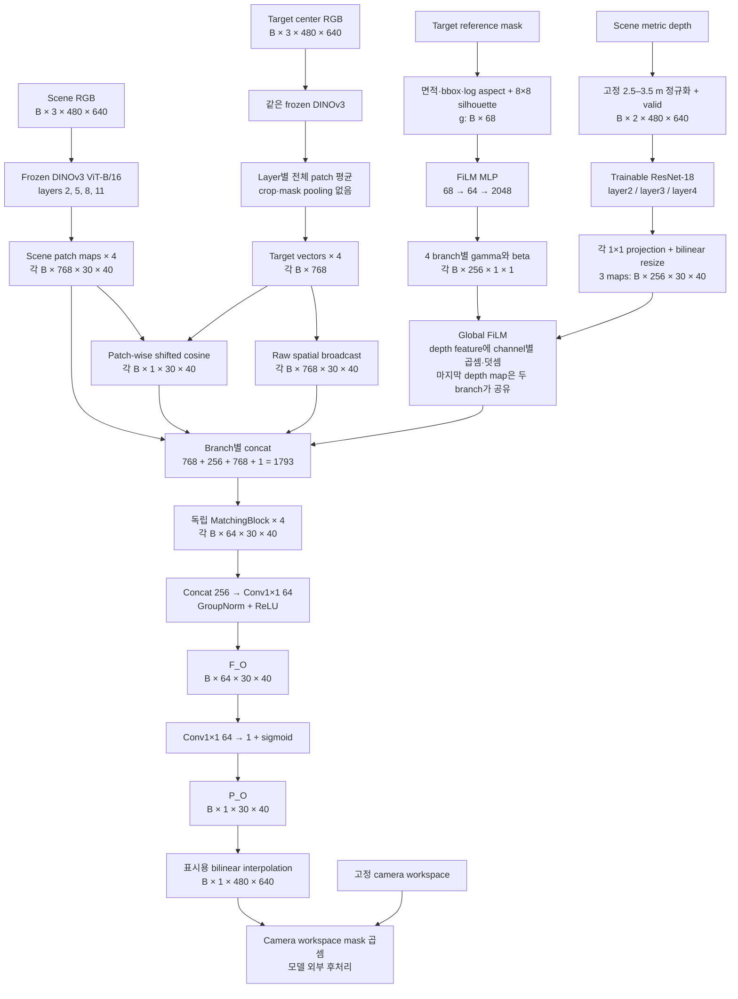

Scene과 target은 **동일한 frozen DINO weight를 공유함.** `2/5/8/11`은 한 backbone에서 꺼낸 네 중간 layer index이며, 별도 DINO 모델 네 개를 뜻하지 않음.

ViT-B/16의 patch 크기는 `16×16px`임. 입력 `480×640`을 나누면 `30×40`, 총 1,200개 patch가 됨. 이 16은 학습 target 수 16과 무관함. DINO attention이 다른 위치의 문맥도 반영하므로 한 feature가 해당 16×16 pixel만 독립적으로 관측하는 것은 아님.

#### 모듈별 역할과 연결

| 구성 | 받는 정보 → 내보내는 정보 | 선택 이유 | 다음 연결 |
|---|---|---|---|
| Frozen DINO | RGB → 768-channel contextual feature | 물체마다 새 encoder를 학습하지 않고 RGB 표현을 공통 사용 | Scene map 유지, target은 평균 vector로 요약 |
| Geometry 계산 | Target mask → 크기 4개와 silhouette 64개 | 전체 RGB 평균만으로 크기·윤곽이 충분히 전달된다고 가정하지 않음 | FiLM이 target 조건을 계산 |
| Depth ResNet | Depth·valid → 세 scale의 학습된 depth map | RGB feature와 별도로 거리 패턴을 처리 | Channel·해상도를 맞춘 뒤 FiLM 적용 |
| FiLM | Geometry + depth feature → 조건이 반영된 depth feature | 같은 더미를 찾는 물체의 크기·형태에 맞게 해석할 경로 제공 | MatchingBlock의 depth 입력 |
| Raw broadcast | Target vector → 모든 위치에 같은 vector | 각 위치에 target의 상세한 appearance 조건 전달 | Scene·depth·cosine과 concat |
| Cosine | Scene patch와 target vector → 유사도 한 개 | 외형 대응의 직접 단서를 제공 | 최종 답이 아니라 MatchingBlock의 한 입력 channel |
| MatchingBlock | 네 묶음 정보와 주변 patch → 64-channel map | 단서를 함께 해석하여 GT에 필요한 표현으로 변환 | 네 layer 결과를 concat |
| Fusion/head | 네 표현 → `F_O` → 한 channel `P_O` | 서로 다른 layer의 정보를 통합하고 감독 가능한 map 생성 | Loss·평가 또는 향후 stream fusion |
| Workspace 후처리 | Raw map + camera 영역 → 외곽이 제거된 map | 현재 고정 drawer 밖의 값을 표시·사용에서 제한 | Network 성능과 구분하여 해석 |

표의 역할은 설계 의도임. Depth의 특정 channel이 물체 높이를 측정한다고 정한 것은 아니며, 각 모듈의 독립 효과를 모두 검증한 것도 아님. 전체 모델의 관측 결과와 개별 모듈의 기대 효과는 5절에서 구분함.

### 3. 내부 모듈과 선택 이유

#### 1. RGB feature와 target pooling

RGB는 `[0,1]` 변환 후 ImageNet mean/std로 정규화함. DINO 입력 규격을 맞추는 전처리이며 scene별 min–max 정규화는 사용하지 않음. DINO는 evaluation mode·고정 weight·gradient 계산 없음으로 실행함.

Scene은 위치 정보를 보존하기 위해 네 layer의 `B×768×30×40` map을 유지함. 위치당 768개 값은 학습된 표현으로, 각각을 색·물체 종류·높이 등의 물리량으로 지정하지 않음.

Target도 같은 DINO map을 얻지만, **전체 1,200개 patch vector를 평균**하여 layer별 조건 vector 하나로 요약함.

$$
q_l=\frac{1}{H_pW_p}\sum_{u=1}^{H_p}\sum_{v=1}^{W_p}X_{t,l}(u,v)
$$

기호와 출력 규격은 다음과 같음.

- `l`: 선택한 DINO layer.
- `X_{t,l}(u,v)`: Target reference의 위치 `(u,v)`에 있는 768-D vector.
- `H_p=30`, `W_p=40`: Patch grid의 높이·너비.
- `q_l`: 1,200개 patch의 평균인 768-D vector. Batch 포함 shape는 `B×768`임.

Backbone이 반환하는 CLS token은 이 interaction에 사용하지 않음.

Target pooling에는 주변 배경 patch도 포함함. Bbox crop·224×224 확대·mask 가중 평균을 적용하지 않는 현재 Occlusion 구현으로, Similarity의 crop·mask pooling과 다름.

전체 reference의 appearance를 제공하되, 평균 vector가 영상상 크기를 충분히 보존한다고 가정하지 않아 geometry 경로를 별도로 둠.

다음 단계의 조건은 RGB에서 얻은 appearance `q_l`과 mask에서 계산한 크기·윤곽 `g`임. 두 경로 모두 고정된 reference 촬영 규격을 전제하며, 거리·화각·배경을 임의로 바꾼 입력에 대한 동일 동작은 보장하지 않음.

#### 2. Native 68-D geometry

`extract_target_geometry()`는 mask를 **크기 관련 4개 값과 silhouette 64개 값**으로 요약함. 이 고정 길이 요약 vector가 descriptor이며, 정해진 계산식을 적용하므로 학습 weight는 없음.

Reference frame의 높이·너비를 `H,W`, foreground pixel 수를 `A`로 정의함. Foreground의 최상·최하·최좌·최우 pixel을 감싸는 최소 사각형이 bbox이며 높이·너비는 `h,w`임. 첫 네 값은 다음과 같음.

| Index | 계산 | 단위·범위와 해석 |
|---|---|---|
| `g[0]` | `A/(H×W)` | 단위 없는 면적 비율. Frame 전체 중 target의 비율 |
| `g[1]` | `h/H` | 단위 없는 높이 비율 |
| `g[2]` | `w/W` | 단위 없는 너비 비율 |
| `g[3]` | `log(w/h)` | 자연로그 종횡비. 세로가 길면 음수, 같으면 0, 가로가 길면 양수 |

`g[4:68]`은 bbox 안의 mask를 OpenCV `INTER_AREA`로 `8×8`로 축소한 뒤 행 순서로 펼친 64개 값임. 각 cell은 foreground가 채운 비율인 soft occupancy를 나타냄: 0은 비어 있음, 1은 채워짐, 중간값은 부분 점유임.

```text
Reference frame 전체: 480×640
          │
          ├─ foreground 면적 / 전체 면적         → 1개
          ├─ bbox 높이 / 480, bbox 너비 / 640    → 2개
          ├─ log(bbox 너비 / bbox 높이)          → 1개
          │
          └─ bbox 안의 mask → 8×8 soft grid
                0.0  0.2  0.8  ...
                0.1  0.9  1.0  ...
                ... 8개 행 ...
                         ↓ 한 줄로 펼침          → 64개

전체 descriptor: 4 + 64 = 68개 숫자
```

**계산 예:** `A=3,072px`, `h=96px`, `w=64px`인 reference의 첫 네 값은 다음과 같음.

```text
면적 비율   3072 / (480×640) = 0.01
높이 비율     96 / 480       = 0.20
너비 비율     64 / 640       = 0.10
log aspect   log(64/96)      ≈ -0.405
```

가로·세로가 각각 2배인 설명용 mask는 면적이 4배가 되어 `[0.04, 0.40, 0.20, -0.405]`를 얻음. Bbox 기준 8×8 윤곽이 거의 같아도 면적·높이·너비는 크기 차이를 보존함. 이는 descriptor 계산 예이며 모델의 2배 scale 일반화 결과는 아님.

크기 4개와 silhouette 64개는 상호 보완적임.

- 정사각형 8×8 변환에서 원래 종횡비가 변하므로 높이·너비·aspect를 별도 제공함.
- 동일 bbox에서도 꽉 찬 사각형과 둥근 윤곽은 corner occupancy가 다를 수 있으므로 64개 cell로 거친 형태 차이를 보존함.

**Descriptor는 영상상 크기이며 centimeter 단위의 3D 크기가 아님.** 고정 거리·화각에서는 실제 크기 차이와 관련되지만, 같은 물체도 camera에 가까워지면 크게 보임. Single mask로 실제 길이·높이를 일반적으로 확정할 수 없으며 target depth·USD의 3D extent도 사용하지 않음.

`Native 68-D`는 원래 정의의 68개 값을 모두 사용한다는 뜻임. 과거 size-only·exact-extent oracle는 일부 slot을 0 또는 다른 정보로 바꾼 실험이며 현재 전처리와 다름. FiLM은 이 native descriptor에 맞춰 학습되므로 차원 수만 유지하고 값의 의미를 바꾸면 입력 계약이 달라짐.

#### 3. Depth 정규화와 validity

Scene depth는 RGB 위치에 대응하는 미터 단위 관측 거리임. Drawer 바닥에서의 물체 높이를 직접 나타내지 않음. 현재 network는 3D 역투영·숨은 표면 복원 없이 영상 grid의 2-channel 입력으로 처리함.

첫 channel은 고정된 `[2.5,3.5] m` 범위를 `[0,1]`로 옮긴 depth, 둘째는 `depth>0`인 곳을 1로 표시한 valid mask임.

$$
V(u,v)=[D_s(u,v)>0]
$$

$$
\bar D_s(u,v)=
\begin{cases}
\mathrm{clip}((D_s(u,v)-2.5)/(3.5-2.5),0,1),&V(u,v)=1\\
0,&V(u,v)=0
\end{cases}
$$

`(u,v)`는 원본 pixel 위치, `D_s`는 scene depth, `V`는 validity임. `clip`은 범위 밖 값을 가까운 끝값으로 제한함. 두 값을 결합한 `Concat(\bar D_s,V)`의 shape는 `B×2×480×640`임.

| 원본 depth | 정규화 depth·valid | 의미 |
|---|---|---|
| 유효 `3.0m` | `[0.5,1]` | 고정 범위의 중간 거리 |
| 유효 `2.5m` | `[0,1]` | 유효한 하한 거리 |
| 무효 `0` | `[0,0]` | 관측 거리 없음 |

Valid channel은 정규화값이 같은 두 0의 의미를 구별함. 결측 위치를 표시하는 전처리이며 실제 거리의 복원은 아님.

고정 정규화는 scene 간 거리 기준을 유지함. Scene별 최솟값·최댓값을 0·1로 바꾸면 같은 `3.0m`도 장면마다 다른 값이 되므로 현재 고정 camera·drawer에는 공통 범위를 적용함. 새로운 camera 배치에서는 clipping·입력 분포가 달라질 수 있어 임의 camera 일반화와 구분함.

#### 4. Multi-scale depth encoder

Depth는 별도 `SceneDepthEncoder`로 처리함. Encoder는 `weights=None`인 ResNet-18이며 ImageNet weight를 가져오지 않음. 첫 convolution을 2-channel로 바꾸고 처음부터 학습하여, RGB와 수치·validity 구조가 다른 depth를 가림 GT에 맞게 변환함.

깊은 layer일수록 공간 해상도는 줄고 channel 수는 늘어남. Stride 8·32는 입력 영상에서 feature 위치 간격이 각각 8px·32px임을 뜻함. Convolution이 누적되므로 실제 receptive field는 이 간격보다 넓음.

| 위치 | 공간 해상도와 channel | 역할 |
|---|---|---|
| 입력 | `B×2×480×640` | 정규화 depth와 valid |
| 첫 `7×7` convolution, stride 2 | `B×64×240×320` | 주변 depth·valid 패턴을 첫 feature로 변환 |
| Max-pool와 `layer1` 이후 | `B×64×120×160` | 이후 scale들을 만드는 공통 앞단 |
| `layer2`, stride 8 | `B×128×60×80` | 비교적 촘촘한 depth 표현 |
| `layer3`, stride 16 | `B×256×30×40` | DINO와 같은 위치 간격의 표현 |
| `layer4`, stride 32 | `B×512×15×20` | 더 넓은 주변을 요약한 표현 |

ResNet residual connection은 기존 feature에 convolution의 변화량을 더하는 경로임. 기존 표현을 수정하는 구조를 학습에 사용하되, 이 task에서 residual 유무의 효과를 분리한 실험은 없음. `ResNet-18`의 18은 architecture의 layer 명칭이며 출력 차원이 아님.

RGB map과 결합하기 위해 각 scale에 독립적인 `1×1 Conv`로 256 channels를 만들고, bilinear interpolation으로 `30×40`에 정렬함.

```text
128×60×80  → 1×1 Conv 128→256 → resize → 256×30×40
256×30×40  → 1×1 Conv 256→256 → resize → 256×30×40
512×15×20  → 1×1 Conv 512→256 → resize → 256×30×40
```

`1×1` convolution은 같은 위치의 channel을 학습하여 결합함. 그 입력에는 이전 convolution의 공간 문맥이 이미 반영돼 있음. Resize는 `align_corners=False`인 bilinear 보간이며, 15×20 feature를 확대해도 새로운 세부 관측을 추가하지 않음.

세 depth map을 DINO branch `2/5/8`에 차례로 연결하고, layer 11에는 가장 깊은 세 번째 map을 재사용함. **RGB branch는 네 개, depth scale은 세 개**임. 마지막 두 branch는 같은 depth map을 받지만 FiLM·MatchingBlock parameter가 각각 달라 다른 출력을 만들 수 있음.

Multi-scale 구성은 촘촘한 변화와 넓은 더미 문맥을 함께 제공하기 위한 선택임. 256개 channel은 관측 depth에서 학습한 latent representation이며 높이·틈새 등 개별 물리량으로 지정하거나 검증하지 않음.

#### 5. Global FiLM

**FiLM은 target geometry에 따라 depth feature를 조절함.** FiLM 이전의 depth feature는 scene이 같으면 동일하지만, 같은 더미가 작은 target과 큰 target을 가릴 수 있는 정도는 다를 수 있음. 이 조건 차이를 depth 해석에 반영하는 경로임.

FiLM은 Feature-wise Linear Modulation임. Channel별 gain·기준값 조절에 대응하며 gamma는 곱셈, beta는 덧셈을 수행함. 물리 센서 보정이나 미터 단위 raw depth 변경이 아니라, ResNet·projection이 만든 feature를 조절하는 연산임.

**Parameter 생성.** Geometry `g: B×68`을 shared MLP에 입력함. MLP는 Linear layer와 비선형 함수를 조합해 vector를 변환하는 작은 network임.

$$
a=\mathrm{ReLU}(W_1g+b_1),\qquad z=W_2a+b_2
$$

| 기호 | Sample 하나의 크기 | 역할 |
|---|---|---|
| `g` | 68개 | Native geometry 입력 |
| `a` | 64개 | ReLU 이후 중간값 |
| `z` | 2,048개 | 네 branch의 gamma·beta 출력 |
| `W_1`, `b_1` | `64×68`, 64개 | 첫 Linear layer의 weight·bias |
| `W_2`, `b_2` | `2048×64`, 2,048개 | 둘째 Linear layer의 weight·bias |

`W,b`는 학습 parameter이며 ReLU는 음수를 0으로 바꾸는 비선형 함수임. 중간 vector `a`의 64개 축에도 개별 물리량을 지정하지 않음.

```text
g: B×68
   ↓ Linear(68,64) + ReLU
a: B×64
   ↓ Linear(64,2048)
z: B×2048
   ↓ reshape
B×4×2×256
  │ │  └─ depth channel
  │ └──── gamma / beta
  └────── DINO branch 네 개

Branch 하나: gamma 256개 + beta 256개
Branch 네 개: 4 × 2 × 256 = 2,048개
```

**적용 위치.** Depth의 channel 수·해상도를 맞춘 뒤 RGB·target·cosine과 concat하기 직전에 적용함. Sample 하나의 branch `l`, channel `c`, patch `(u,v)`에 대한 식은 다음과 같음.

$$
E'_{l,c}(u,v)=\gamma_{l,c}(g)E_{l,c}(u,v)+\beta_{l,c}(g)
$$

`E,E'`는 각각 FiLM 전·후의 256-channel depth feature임. `l`은 네 branch, `c`는 256개 channel, `(u,v)`는 30×40 grid 위치를 나타냄. MLP가 `g`에서 계산한 gamma·beta는 각각 `B×256×1×1`이며 공간축으로 broadcast됨.

**계산 예.** 같은 depth feature에 서로 다른 target 조건을 적용한 가상 값임. 학습된 channel의 실제 측정치는 아님.

```text
같은 scene의 한 depth feature channel

                     위치 A       위치 B
원래 feature E         0.60         0.20
                         │            │
Target 작은 물체 ── g ── FiLM MLP: gamma=0.50, beta=-0.10
                         ↓            ↓
E' = 0.50×E-0.10        0.20         0.00

Target 큰 물체   ── g ── FiLM MLP: gamma=1.40, beta= 0.05
                         ↓            ↓
E' = 1.40×E+0.05        0.89         0.33

각 E'는 이후 RGB·target·cosine과 함께 MatchingBlock으로 전달됨
```

Target이 바뀌면 같은 scene feature에 다른 조절값을 적용할 수 있음. 한 target 안에서는 A·B에 같은 조절값을 적용해도 원래 feature 차이가 유지됨.

예시의 **0.89는 중간 channel 값이며 가림 확률이 아님.** 이후 convolution·sigmoid를 거쳐 map을 생성함. 큰 target의 gamma가 반드시 크거나 channel 값 증가가 최종 확률 증가로 이어지는 고정 규칙은 없음.

| 조절값 | 한 channel에서의 작용 |
|---|---|
| `gamma=1, beta=0` | 기존 feature를 그대로 통과 |
| `0<gamma<1, beta=0` | 기존 반응의 절댓값을 줄임 |
| `gamma>1, beta=0` | 기존 반응의 절댓값을 키움 |
| `gamma=0` | 기존 공간 반응 대신 beta만 남김 |
| `gamma<0, beta=0` | 0이 아닌 기존 반응의 부호를 뒤집음 |
| `beta>0` 또는 `<0` | 해당 channel의 기준값을 위·아래로 이동 |

**Global**은 target·branch·channel별 gamma·beta를 모든 위치에 공통 적용한다는 뜻임. Target별 spatial gate를 직접 만들지 않으며, 공간 차이는 `E(u,v)`와 후속 RGB·이웃 문맥에 남아 있음.

**항등 초기화.** 마지막 `Linear(64,2048)`의 weight는 0, gamma bias는 1, beta bias는 0으로 설정함. 학습 시작에는 모든 `g`에 대해 `E'=E`이므로 임의 target 보정 없이 출발하고, GT loss의 gradient로 조절값을 학습함. FiLM은 forward의 일부이며 추론에도 적용함.

#### 6. Conditioning 방식 비교

Conditioning 방식은 target 정보를 쓰는 연산과 적용 위치로 구분함.

| 방법 | Target 조건을 쓰는 방식 | 공간·channel에 생기는 차이 | 현재 상태 |
|---|---|---|---|
| Geometry 단순 concat | Geometry 숫자를 위치마다 복제해 depth feature 옆에 붙임 | 후속 network가 두 입력의 관계를 학습함. Concat 자체는 depth를 바꾸지 않음 | 현재 full16에서 FiLM 대신 비교한 최종 ablation은 없음 |
| Global FiLM | Geometry에서 channel별 gamma·beta를 만들고 depth feature에 곱하고 더함 | Target에 따른 곱셈 상호작용을 명시하며 한 channel의 조절값은 모든 위치에 공통 | **현재 baseline** |
| Spatial/cross-attention | Query와 key의 관계로 위치·token의 가중치를 만들어 정보를 모음 | 어떤 위치나 token을 참조할지 학습할 수 있으나 구체적 동작은 attention 설계에 따라 다름 | 현재 Occlusion head에 target–scene cross-attention은 없음 |
| 과거 local residual gate | 위치별 gate로 target 보정의 적용 강도를 조절하고 기존 depth에 변화량을 더함 | Target 보정을 위치마다 제한하려는 목적 | 과거 연구용 mode. 현재 baseline에 적용하지 않음 |

단순 concat도 후속 비선형 network를 통해 복잡한 관계를 학습할 수 있음. FiLM은 geometry와 depth의 곱셈 상호작용을 명시한 설계 선택이며, 현재 full16에서 concat·attention 대비 우월성을 별도로 입증하지 않음.

DINO 내부 attention과 Occlusion head의 target–scene cross-attention은 별개임. 현재 head는 layer별 평균 target vector를 scene 각 위치에 cosine·broadcast로 제공함. 과거 local gate의 식·결과는 Phase 23–30에 기록하며 현재 gamma·beta 계산에 포함하지 않음.

#### 7. Target interaction

각 branch는 scene RGB map과 FiLM depth map에 target appearance를 두 경로로 추가함.

**Raw broadcast:** `q_l: B×768`을 `B×768×1×1`로 바꾸고 공간축을 30×40으로 확장함. 모든 위치에 같은 target 조건을 제공하며, 추가 L2 정규화 없이 vector의 방향·크기를 유지함. Broadcast 자체는 공간 차이를 만들지 않고 위치별 scene·depth와 결합하여 사용됨.

**Patch-wise cosine:** 위치별 scene 768-D vector와 target 768-D vector의 외형 유사도를 한 값으로 요약함.

$$
\widehat c_l(u,v)=\frac{1}{2}\left(1+
\frac{X_l(u,v)\cdot q_l}{\lVert X_l(u,v)\rVert_2\lVert q_l\rVert_2}
\right)
$$

식의 기호와 계산은 다음과 같음.

- `X_l(u,v)`: Scene의 위치별 vector. `q_l`: Target 평균 vector.
- `·`: 내적. `|| ||_2`: Vector의 길이.
- 구현: 각 vector를 L2 normalize한 뒤 원소별 곱을 합함. 정규화 epsilon으로 0에 가까운 vector를 처리함.
- 범위 변환: `(cos+1)/2`로 `[-1,1]`을 `[0,1]`로 이동함. 출력은 `B×1×30×40`임.

Cosine `0.6`은 shifted 값 `0.8`, cosine `0`은 `0.5`가 됨. 이 유사도 값은 가림 확률이 아님.

Concat은 같은 위치의 channel을 아래 순서대로 이어 붙이는 연산임. 평균·합산은 수행하지 않음.

| 묶음 | Channel 수 | MatchingBlock에 전달하는 것 |
|---|---:|---|
| Scene DINO | 768 | 현재 위치의 RGB 표현과 문맥 |
| FiLM depth | 256 | Target geometry에 맞게 조절한 관측 depth 표현 |
| Raw target | 768 | Cosine 한 값으로 압축되기 전 target vector |
| Shifted cosine | 1 | Scene–target 외형 대응의 직접 단서 |
| 합계 | **1,793** | 위치마다 1,793개 숫자, 전체 `B×1793×30×40` |

**Raw feature는 cosine 하나로 압축되지 않은 차이를 보존함.** 서로 다른 scene patch가 같은 cosine 값을 가질 수 있으므로, 후속 network가 색·형상·문맥의 차이를 활용하도록 scene·target vector와 depth를 함께 제공함.

#### 8. MatchingBlock

네 DINO branch에 각각 독립적인 MatchingBlock을 적용함. 구조는 같고 weight는 공유하지 않음.

```text
B×1793×30×40
  ↓ Conv3×3(1793→64, padding=1)
B×64×30×40
  ↓ GroupNorm(8 groups) → ReLU
  ↓ Conv1×1(64→64)
B×64×30×40
  ↓ GroupNorm(8 groups) → ReLU
B×64×30×40
```

`3×3` convolution은 현재 patch와 주변 8개 patch를 함께 처리함. 동일한 RGB 유사도라도 주변 depth가 넓은 더미인지 얇은 외곽인지 구분할 문맥을 제공하고, 활용 방식은 GT loss로 학습함. `padding=1`로 경계를 채워 30×40 grid를 유지함.

`GroupNorm(8,64)`는 sample의 64 channels를 8개 group으로 나누어 각 group의 channel·공간 값을 정규화함. 8은 camera·object 수와 무관함. ReLU는 음수를 0으로 바꾸어 비선형성을 추가하고, `1×1` convolution은 위치별 64 channels를 다시 결합함.

MatchingBlock은 네 입력과 이웃 문맥을 **가림 GT 예측용 64-channel 표현**으로 변환하는 CNN임. Cosine을 다시 계산하거나 두 영상의 모든 patch 조합을 검색하는 대응 알고리즘은 아님.

최종 logit에 cosine을 직접 더하는 shortcut은 사용하지 않음. 외형 유사도만으로 가림값을 올리는 고정 경로를 제거한 선택임. 다만 network의 강한 RGB 의존 가능성은 남으므로 이 선택만으로 depth 의존성·입력별 필요성이 입증되지는 않음.

#### 9. Layer fusion과 출력

네 `B×64×30×40` 출력을 channel축으로 concat하여 `B×256×30×40`을 얻음. 이후 `Conv1×1(256→64) → GroupNorm(8) → ReLU`로 통합한 결과가 `F_O`임. 이 256은 네 64-channel 출력의 합이며 depth feature의 256 channels와 별개임.

Auxiliary head `Conv1×1(64→1)`은 위치별 64 features를 학습 weight로 결합하여 logit 하나를 만들고 sigmoid로 `0–1`에 매핑함.

$$
z_O(u,v)=b_O+\sum_{c=1}^{64}w_{O,c}F_{O,c}(u,v),
\qquad
P_O(u,v)=\frac{1}{1+\exp(-z_O(u,v))}
$$

`F_{O,c}`는 `F_O`의 c번째 channel, `w_{O,c},b_O`는 head parameter, `z_O`는 범위 제한이 없는 logit임. Logit 0은 sigmoid 후 0.5가 됨.

GT와 비교한 `P_O`의 loss로 앞단의 학습 가능한 모듈까지 갱신함. Auxiliary head는 `F_O`에 가림 정보를 학습시키는 감독 출구이며 현재 평가 map도 생성함.

표시용 map은 `30×40` 출력을 `480×640`으로 bilinear 보간한 결과임. 이웃 patch 값을 부드럽게 연결할 뿐 16px보다 작은 경계를 새로 복원하지 않음. 이후 camera workspace mask를 곱하는 모델 외부 후처리를 적용하며, 결과 그림은 raw·후처리 출력을 함께 제시함.

| 학습 가능한 구성 | Parameter 수 |
|---|---:|
| Depth encoder와 projection | 11,403,520 |
| Geometry FiLM | 137,536 |
| MatchingBlock 네 개 | 4,148,992 |
| Fusion과 map head | 16,641 |
| 합계, frozen DINO 제외 | **15,706,689** |

`F_O`의 공간 규격·64-channel 폭은 향후 Similarity·Complexity feature와 결합하기 위해 맞춤. 현재 feature 준비와 three-stream fusion·DRL 성능 개선의 입증은 구분함.

### 4. GT 생성과 학습

#### 1. GT 생성·학습·추론 경로

**현재 GT는 가상 target pose의 가림 통계임.** 실제 target 위치를 표시한 segmentation이 아니라, 후보 pose를 관측 depth와 비교해 정의한 Ground Truth임. Offline 생성에는 mesh를 사용하고 학습·추론의 network forward에는 사용하지 않음.

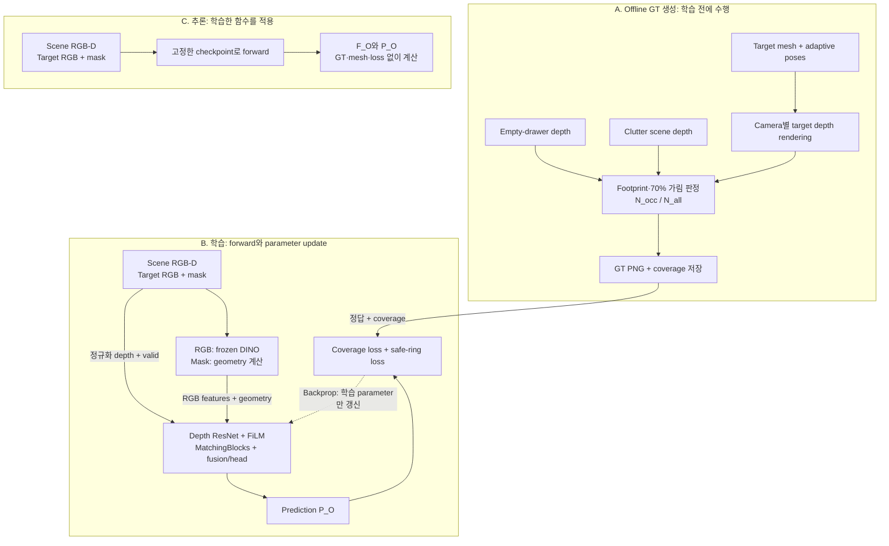

| 단계 | 수행 내용 | 갱신 여부 |
|---|---|---|
| Forward | 입력에서 `P_O` 계산 | Weight 갱신 없음 |
| Backpropagation | GT와 예측 차이의 gradient 전달 | Depth encoder·FiLM·MatchingBlocks·fusion/head 갱신 |
| 고정 경로 | DINO feature·mask descriptor 계산 | 학습하지 않음 |

GT renderer를 loss로 수정하지 않으며 test GT를 추론 입력으로 사용하지 않음.

추론은 동일 전처리·network로 예측만 계산하며 GT 비교·weight 갱신을 수행하지 않음. Mesh 없는 예측 함수를 학습하는 것이며 GT 생성의 모든 물리 정보를 RGB-D로 복원했다는 의미는 아님.

#### 2. Adaptive candidate poses

Candidate pose는 위치 `(x,y,z)`와 yaw를 정한 가상 target 배치임. 이 pose의 target mesh를 camera에서 렌더링하여 depth를 얻음. 현재 후보는 yaw와 이산 높이만 변화시키며 임의 roll/pitch·연속 높이 전체를 탐색하지 않음.

**Adaptive grid는 target·yaw별 원본 mesh의 XY 범위로 후보 중심 영역을 정함.** 공통의 좁은 영역은 작은 target의 벽 근처 후보를 누락하고, 지나치게 넓은 영역은 큰 target을 drawer 밖에 놓을 수 있음. 이를 방지하도록 전체 mesh가 drawer XY 경계 안에 들어오는 중심을 1cm 간격으로 열거함.

| 설정 | 현재 production 값 |
|---|---|
| Render 해상도 | 높이 480 × 너비 640 |
| Drawer XY bounds | 각 축 `[-0.35,0.35] m` |
| Wall clearance | `1 mm` |
| XY sampling | World origin에 정렬한 `1 cm` lattice |
| Yaw | `0°,30°,…,330°`, 총 12개 |
| 높이 | Target별 `BASE_Z + {0,0.03,0.06} m` |
| Target scale | Native `1.0` |
| Candidate 수 | Target별 `53,412–143,640`, 16개 합계 `1,783,176` |
| GT inventory | `16 targets × 3,000 scene keys × 5 cameras = 240,000 maps` |

`1cm` 간격·`30°` yaw 간격·세 높이·`70%` 기준은 현재의 표집·판정 설정임. 물리 법칙이나 최적성 검증값이 아니며 모든 실제 배치를 포함하지 않음. 설정을 바꾸면 표본 pose와 통과 비율이 달라져 GT도 변할 수 있음.

**중심 범위 예:** 회전한 mesh의 X 범위가 `[x_min,x_max]`이면 허용 중심은 `[-0.35+0.001−x_min, 0.35−0.001−x_max]`임. `0.001m`는 벽 여유이며 구간 안의 world-zero 기준 1cm lattice만 선택함. Y축도 동일하게 계산함.

이 좌표는 GT mesh의 미터 단위 값임. Network의 mask 비율로 실제 크기를 복원해 grid를 만드는 방식은 아님.

후보 범위와 rendering mesh의 역할을 구분함.

- 원본 unsimplified mesh: 후보 XY 범위의 기준으로 유지함.
- Rendering mesh: 50k faces를 넘으면 약 10k faces로 단순화하여 GPU rasterization에 사용함. 단순화된 bbox로 후보 범위를 넓히지 않음.
- Pose depth: Batch로 생성하여 여러 scene depth와 비교하고 누적값만 저장함. 모든 pose의 RGB·depth를 개별 파일로 저장하지 않음.

Mesh 단위·camera depth 대응·단순화의 판정 안정성은 Phase 6–8에 기록함. **유효 pose는 drawer XY containment와 camera 투영의 현재 규칙을 통과한 후보임.** Clutter 충돌·지지·낙하 안정성·숨은 scene geometry까지 검사한 실제 배치 가능성 정답은 아님.

#### 3. Corrected occlusion ratio

가상 pose `k`의 target depth를 `D_t^k`, empty-drawer depth를 `D_e`, clutter scene depth를 `D_s`로 정의함. 모두 같은 camera·해상도·depth 규약으로 비교함. Pixel `(u,v)`에서 작은 유효 depth가 가까운 표면을 나타내며 0은 무효값임.

**유효 footprint `F_k`**는 target의 영상상 투영 영역 중 drawer 구조 자체에 가려지지 않은 부분임.

$$
F_k(u,v)=[D_t^k(u,v)>0]\,[D_e(u,v)=0\ \lor\ D_e(u,v)\ge D_t^k(u,v)]
$$

`[조건]`은 참이면 1, 거짓이면 0인 indicator이며 `∨`는 OR임. `F_k=1`이 되려면 다음 두 조건을 모두 만족해야 함.

- 해당 pixel에 target이 렌더링되어 `D_t^k>0`임.
- Empty drawer가 target보다 앞에 있지 않거나 empty depth가 없음.

유효 footprint에서 clutter가 target보다 앞에 있는 pixel을 `O_k`로 정의함.

$$
O_k(u,v)=F_k(u,v)[D_s(u,v)\ne0][D_s(u,v)<D_t^k(u,v)]
$$

`O_k`는 pixel별 가림의 0/1 판정, `F_k`는 비교 대상 영역임. Pose 전체의 가림 비율 `r_k`는 다음과 같음.

$$
r_k=\frac{\sum_{u,v}O_k(u,v)}{\sum_{u,v}F_k(u,v)}
$$

분자는 clutter에 가려진 유효 pixel 수, 분모는 전체 유효 footprint 면적임. 분모가 0인 pose는 제외함.

| 유효 footprint | 가려진 pixel | `r_k` | `r_k≥0.7` 통과 |
|---:|---:|---:|---|
| 100px | 75px | 0.75 | 통과 |
| 100px | 65px | 0.65 | 미통과 |

Accepted pose는 **70% 이상 가림이며 100% 완전 가림으로 한정하지 않음.** 유효 footprint의 30%까지 보이는 부분 가림도 포함함. 완전히 숨은 target의 탐색이라는 연구 목표보다 현재 감독 기준의 범위가 넓음.

**Corrected denominator는 drawer 가림 영역을 분자·분모에서 함께 제외함.** Target 전체 120px 중 drawer에 가려진 20px을 제외하고, 남은 100px에서 75px이 clutter에 가려졌다면 `75/100=0.75`임. 분모에 drawer 영역을 남긴 `75/120=0.625`와는 측정 범위가 다름.

#### 4. Pixel-wise probability GT

Pose의 70% 통과 여부를 pixel map으로 변환할 때는 **해당 pixel을 덮는 후보만** 집계함. 통과 여부는 pose 전체의 0/1 판정이며, pixel별 분모는 그 위치를 덮은 후보 수에 따라 달라짐.

$$
N_{\mathrm{all}}(u,v)=\sum_kF_k(u,v)
$$

$$
N_{\mathrm{occ}}(u,v)=\sum_k[r_k\ge0.7]F_k(u,v)
$$

- `N_all`: 해당 pixel을 유효 footprint로 덮은 전체 후보 수.
- `N_occ`: 위 후보 중 pose 전체가 70% 가림 기준을 통과한 수.
- `k`: 생성된 candidate pose의 index.

Pixel GT `G_O`는 두 수의 비율로 정의함.

$$
G_O(u,v)=\frac{N_{\mathrm{occ}}(u,v)}{N_{\mathrm{all}}(u,v)}
\quad\text{when }N_{\mathrm{all}}(u,v)>0
$$

**계산 예: 한 pixel을 덮는 후보 5개.**

| 해당 pixel을 덮는 pose | Pose 전체의 가림 비율 `r_k` | 70% 기준 통과 | 그 pixel의 `N_occ`에 더하는 값 |
|---|---:|---|---:|
| A | 0.90 | 예 | 1 |
| B | 0.80 | 예 | 1 |
| C | 0.70 | 예 | 1 |
| D | 0.60 | 아니오 | 0 |
| E | 0.20 | 아니오 | 0 |

이 pixel은 `N_all=5`, `N_occ=3`이므로 GT가 `3/5=0.6`임. 해당 pixel을 덮는 표본 pose의 60%가 전체 유효 면적의 70% 이상 가려졌다는 의미임. **70%는 pose의 가림 기준, 60%는 이를 통과한 pose의 비율임.**

Accepted pose는 가려진 `O_k`만이 아니라 **유효 footprint `F_k` 전체**를 `N_occ`에 더함. 따라서 다음과 구분함.

- Pixel 자체가 몇 번 가려졌는지 세는 map이 아님.
- Target 중심 좌표를 표시하는 map이 아님.
- 한 pose가 여러 pixel에 기여하므로 image 전체 합이 1인 분포가 아님.

`N_all=0`인 위치에는 비율을 정의할 표본이 없음. `coverage = [N_all>0]`으로 유효 영역을 구분하며, coverage 밖은 저장 편의상 0으로 채움. 이 0은 모든 가능한 pose에서 가림이 불가능하다는 정답이 아님.

GT는 `floor(255×G_O+0.5)`로 uint8 PNG에 저장하고 255로 나누어 로드함. 예시의 0.6은 153으로 저장됨. Scene별 min–max·visible-target 255 overlay·Similarity 혼합을 적용하지 않아 동일 밝기는 동일 candidate-acceptance 비율을 나타냄. Prediction의 실제 target 존재 확률 calibration을 입증한 것은 아님.

#### 5. Coverage-aware patch pooling

원본 GT `480×640`을 prediction `30×40`에 맞추기 위해 16×16 pixel, 총 256개를 patch 하나로 pooling함. Coverage 경계에는 유효 GT와 저장용 0이 섞여 있음.

전체 256개를 단순 평균하면 표본 없는 0 때문에 경계의 정답이 낮아짐. **Coverage 안의 GT 평균과 감독 가중치를 분리**하여 유효한 정답값을 유지함.

$$
w_j=\mathrm{AvgPool}_{16}(C)_j,\qquad
y_j=\frac{\mathrm{AvgPool}_{16}(G_OC)_j}{w_j+\epsilon}
$$

| 기호 | 정의 |
|---|---|
| `j` | 30×40 grid의 patch index |
| `C` | 원본 pixel의 binary coverage |
| `AvgPool_16` | 겹치지 않는 16×16 영역의 평균 |
| `w_j` | Patch 내부의 coverage 비율 |
| `y_j` | Coverage 내부 GT의 평균 |
| `epsilon` | 0 나눗셈을 막는 작은 값 |

```text
한 16×16 patch: 전체 256 pixel

128 pixel: coverage 안, GT가 모두 0.8
128 pixel: coverage 밖, 파일에는 0으로 저장

w = 128/256 = 0.5
AvgPool(GT×coverage) = (128×0.8)/256 = 0.4
y = 0.4/0.5 ≈ 0.8

학습 정답은 약 0.8, 이 patch의 loss 가중치는 0.5
```

Coverage가 절반이어도 정답을 0.4로 낮추지 않고 0.8을 유지하며 loss weight만 0.5로 둠. Coverage가 없으면 primary loss weight는 0임. Coverage는 감독·평가 자료이며 network forward의 입력 channel이 아님.

#### 6. Coverage loss

GT의 0.6·0.8 등 candidate 비율을 soft label로 사용하여 probability-form Binary Cross Entropy(BCE)를 계산함.

$$
\mathrm{BCE}(p,y)=-y\log p-(1-y)\log(1-p)
$$

`p`는 sigmoid 예측, `y`는 patch GT, log는 자연로그임. `y=0.8`이면 두 항의 비중이 0.8·0.2가 되어 `p=0.8`에서 최소가 됨. 실제 계산은 log 안정성을 위해 `p`를 `[epsilon,1−epsilon]`으로 제한함.

| 설명용 GT `y=0.8` | 예측 `p` | BCE | 해석 |
|---|---:|---:|---|
| 과소 예측 | 0.4 | 약 0.8352 | GT보다 낮음 |
| GT와 같은 예측 | 0.8 | 약 0.5004 | 이 soft label에서 BCE가 최소 |
| 지나치게 높은 예측 | 0.99 | 약 0.9291 | 거의 확실하다고 잘못 예측하여 오차가 커짐 |

Soft label의 BCE 최솟값은 `p=y`에서도 0보다 클 수 있음. 0·1 양쪽 항을 함께 평가하기 때문이며, BCE loss를 MAE와 같은 단위로 해석하지 않음.

확률 차이를 회귀하는 SmoothL1을 추가함. 기본 `beta=1`과 `p,y∈[0,1]`에서 `SmoothL1(p,y)=0.5×(p−y)²`임. GT가 큰 영역의 회귀 비중을 높이기 위해 `1+3y`를 곱함.

$$
L_{\mathrm{coverage}}=
\frac{\sum_j w_j\left[\mathrm{BCE}(p_j,y_j)+(1+3y_j)\mathrm{SmoothL1}(p_j,y_j)\right]}
{\max(\sum_jw_j,1)}
$$

`p_j,y_j,w_j`는 patch의 예측·GT·coverage 비율임. 현재 batch의 patch들을 합산하고 `max(Σw,1)`로 분모를 제한하여 coverage 합이 작은 경우를 처리함.

- `y=0`: SmoothL1 가중치 1.
- `y=1`: SmoothL1 가중치 4.
- 계산 예 `y=0.8,p=0.4`: SmoothL1은 `0.5×0.4²=0.08`, 가중값은 `3.4×0.08=0.272`임. 특정 학습 sample의 측정치는 아님.

낮은 배경값과 높은 가림 GT를 함께 맞추기 위한 loss 구성임. 현재 full16에서 BCE·SmoothL1을 각각 제거한 ablation은 수행하지 않아 각 항의 독립 효과·조합의 최적성은 미입증임.

#### 7. Safe-ring loss

**Safe ring은 coverage 밖의 제한된 보조 감독 영역임.** 모든 외부 pixel을 0으로 감독하면 표집에서 누락된 후보까지 지울 수 있으므로, adaptive coverage가 거의 없고 고정 workspace 안에 충분히 포함된 patch만 선택함.

```text
R_j = (coverage_fraction ≤ 0.0001)
      AND (workspace_fraction ≥ 0.95)

L_ring = Sum(R_j × BCE(p_j, 0)) / max(Sum(R_j), 1)
L_total = L_coverage + 0.0436912877 × L_ring
```

`R_j`는 선택 조건을 만족하면 1인 mask이며 `workspace_fraction`은 16×16 patch 중 고정 drawer 내부의 비율임. `L_ring`은 선택된 patch의 0-target BCE 평균임. 두 loss를 각각 평균한 뒤 결합하므로 두 영역의 모든 pixel을 동일 가중치로 합산하는 방식과 다름.

`0.0436912877`은 protocol의 보조 loss weight이며 가림 threshold·확률·물리 상수·최적성 검증값이 아님. 계수 약 0.044가 전체 gradient의 4.4%를 뜻하지도 않음. Gradient 비중에는 두 loss의 실제 값과 기울기가 함께 영향을 줌.

현재 adaptive pose·workspace에 근거한 약한 보조 감독임. 충돌·지지 검사로 만든 절대 불가능 영역이 아니며 모든 coverage 밖·image 외곽을 감독하지 않음. Raw prediction에 workspace를 곱하는 학습 연산도 없으므로 외곽 반응이 남을 수 있음.

#### 8. 학습 조건과 checkpoint

학습에는 `book_1–4`, `fruit_1–4`, `packaged_food_1–4`, `toy_1–4`의 기존 16개 target을 모두 사용함. 총 3,000개 scene key를 train/validation/test `2,400/300/300`으로 먼저 나누고, `scene_stride=10`으로 각 split에서 10%를 선택함.

| Split | Scene keys | Target pool 수 | Key당 cameras | 실제 samples |
|---|---:|---:|---:|---:|
| Train | 240 | 16 | 5 | 19,200 |
| Validation | 30 | 16 | 5 | 2,400 |
| Test | 30 | 16 | 5 | 2,400 |

Center/top/left/right/bottom은 같은 배치의 상관된 관측이므로 scene key 단위로 다섯 view를 함께 분할함. 같은 key는 모든 target pool에서도 같은 split에 둠. 동일 더미의 다른 각도가 train·test에 섞이는 누수를 방지하기 위한 규칙임.

데이터는 `target T ↔ scene/T`의 해당 clutter pool로 구성됨. 다른 pool의 동일 key가 동일 더미를 뜻하지 않으며, 모든 target과 clutter scene을 교차시킨 Cartesian dataset도 아님. Target identity와 scene 분포의 상관이 남고 wrong-target 대조만으로 이를 모두 제거하지 못함.

| 학습 항목 | 현재 설정·결과 |
|---|---|
| Batch·precision·seed | 16·BF16·seed 0 |
| Optimizer | AdamW, `lr=1e−3`, weight decay `1e−4` |
| 종료 조건 | 최대 12 epoch, patience 3 |
| Checkpoint 선택 | Validation total loss 최저인 **epoch 3** |
| 실제 종료 | Epoch 6 |

Test 점수로 checkpoint를 선택하지 않음.

**240,000장은 생성된 GT 수이며 전부를 학습한 것이 아님.** 위 10% 조건에서 frozen DINO를 제외한 약 15.71M parameter를 공동 학습한 한 seed의 결과임. 다중 seed 안정성은 아직 검증하지 않음.

### 5. 핵심 설계 과정과 검증 결과

#### 1. Adaptive GT와 baseline 선택

**Coverage 경계 오류의 일부 원인은 공통 fixed XY grid의 후보 누락이었음.** 초기에는 target conditioning·local geometry의 복잡도를 높여 해결하고자 했으나, 좁은 공통 grid가 작은 target의 가능한 영역을 충분히 표집하지 못함을 확인함.

Peach의 target/yaw별 adaptive grid는 fixed grid 대비 coverage가 110.69% 넓었으며 추가 영역에도 가림 확률이 존재했음. 동일 예측에서 GT만 교체한 비교이므로 모델 변화와 구분됨.

이는 coverage 밖 반응을 일괄적으로 network 오류로 판단할 수 없다는 근거임. 모든 외곽 반응이 옳다는 뜻은 아니며 현재 raw 출력에도 한계가 남음.

Adaptive GT에서 native 68-D·raw broadcast·global FiLM baseline을 재학습함. 현재 합성 평가에서 확보한 결과를 근거로 checkpoint를 보존하고, 더 복잡한 oracle 구조의 추가는 보류함.

| 설계 쟁점 | 확인한 사실과 현재 선택 | 상세 이력 |
|---|---|---|
| GT 밝기 기준의 일관성 | Corrected footprint의 `N_occ/N_all`을 공통 정의로 사용하고 scene별 min–max·visible overlay를 분리함 | Phase 7, Phase 8 |
| Raw target vector의 필요성 | 당시 통제 실험에서 제거 시 악화됐고 재현 검사에서도 확인하여 raw broadcast 유지 | Phase 15, Phase 16 |
| Exact extent·local gate의 추가 효과 | 상한선과 공간 적용 문제를 진단했으나 입력 계약 차이·trade-off가 남음. 현재 full16에 합치지 않음 | Phase 21–Phase 30 |
| Coverage 밖 활성화의 원인 | Peach의 fixed grid가 후보를 누락함을 확인하여 adaptive grid로 변경 | Phase 31 |
| Adaptive GT 이후 모델 선택 | Native 68-D·global FiLM으로 full16과 외부 1-target 결과를 확인해 baseline 보존 | Phase 32 |

과거 fixed grid·14-target split·multi-scale oracle·local residual gate는 당시 가설을 검사한 이력임. 본문의 현재 방법은 **16-target adaptive/native-geometry/global-FiLM baseline**이며, 다른 GT·split에서 얻은 과거 수치를 같은 모델의 성능표로 합치지 않음.

#### 2. 설계 의도와 검증 범위

| 구성 | 기대하는 효과 | 현재 확인한 범위 |
|---|---|---|
| Frozen DINO와 target reference | 새 target을 같은 feature 규격으로 처리 | 외부 target 한 개의 전체 모델 평가. Frozen이라는 이유만으로 모든 새 target 일반화를 보장하지 않음 |
| Depth encoder와 geometry FiLM | 관측 depth를 target 크기·형태에 맞게 해석 | 전체 target 조건 교체 시 성능 저하. FiLM만의 기여나 RGB/depth 각각의 기여를 분리한 최종 실험은 아님 |
| Raw broadcast | Cosine에 압축되지 않은 target 정보 보존 | 이전 통제 실험의 제거 비교를 근거로 유지. 그 수치를 adaptive full16 ablation으로 간주하지 않음 |
| 여러 layer와 MatchingBlock | RGB-D·target·주변 문맥 통합 | 전체 구조의 GT 회귀 성능 확인. Layer 수나 각 convolution의 개별 최적성은 미입증 |
| Safe ring·workspace 후처리 | 제한된 비후보 영역 감독·외곽 출력 제한 | 현재 loss와 raw/masked 그림의 효과 확인. Raw 외곽 문제 자체가 해결된 것은 아님 |

#### 3. 정량 지표와 평가 영역

**정량 평가는 raw `30×40` prediction의 GT coverage 내부를 대상으로 함.** `480×640` 확대·workspace mask 적용 후의 시각화 점수가 아님. Coverage 평가 영역과 그림의 masked 영역을 구분함.

`p`는 patch 예측, `y`는 coverage-aware GT, `w`는 coverage 비율임. `Sum`은 평가 sample·patch 전체의 합을 나타냄.

| Metric | 현재 계산 | 숫자의 뜻 |
|---|---|---|
| Coverage-weighted MAE ↓ | `Sum(w×abs(p−y))/Sum(w)` | Coverage를 반영한 평균 절대 확률 오차 |
| Soft-IoU ↑ | `Sum(w×min(p,y))/Sum(w×max(p,y))` | Threshold 이전 확률 map의 겹침 |
| Pearson r ↑ | Fractional coverage로 가중한 상관 | 높은 곳·낮은 곳의 공간적 변화가 함께 움직이는 정도 |
| Binary IoU micro ↑ | `w≥0.5`인 patch에서 `p≥0.5`, `y≥0.5`의 전체 intersection / union | 모든 sample의 positive 영역을 합쳐 본 겹침 |
| Binary IoU macro ↑ | 같은 조건의 sample별 IoU를 nonempty union에서 평균 | Sample마다 한 번씩 반영한 겹침 |

Metric 해석 시 다음을 구분함.

- MAE 0.014: 평가 영역에서 평균 약 1.4 percentage-point의 절대 오차임. 정확도 98.6%가 아님.
- Soft-IoU: 연속 확률값의 겹침. Binary IoU: 0.5 threshold 이후의 겹침임.
- Pearson: 공간적 증감의 상관. 높은 상관에서도 밝기 편향이 남을 수 있어 MAE와 함께 평가함.

MAE·Soft-IoU·Pearson은 전체 coverage를 합친 값임. Sample별 MAE를 먼저 평균하는 training summary와 집계 순서가 다름. Coverage 밖 raw activation은 제외하므로 **낮은 MAE가 전체 영상 정확도를 뜻하지 않음**.

#### 4. Full16 scene-heldout 결과

평가 대상은 **30 held-out scene keys ×16 targets×5 cameras =2,400 samples**임. Target identity는 모두 학습에 포함되고 scene keys는 제외된 seen-target scene-heldout 평가임.

Wrong-target 대조는 scene·GT·평가 coverage를 고정하고 RGB-derived target vector와 geometry를 함께 다음 target으로 순환 교체함. 동일 scene에서 target 조건의 영향을 비교하는 평가임.

| 입력 조건 | MAE ↓ | Soft-IoU ↑ | Pearson r ↑ | Binary IoU micro ↑ | Binary IoU macro ↑ |
|---|---:|---:|---:|---:|---:|
| 올바른 target | 0.013997 | 0.868371 | 0.987379 | 0.812560 | 0.731591 |
| Cyclic wrong target | 0.047323 | 0.619694 | 0.863847 | 0.480352 | 0.408389 |

Wrong target에서 MAE가 증가하고 겹침이 감소하여 **전체 모델의 target 조건 사용**을 확인함. Appearance·geometry를 동시에 교체한 결과이므로 FiLM의 독립 기여는 아님. Target–scene pool 상관과 모듈별 효과도 별도 검증 범위임.

Macro의 nonempty sample 수는 correct 2,159개·wrong 2,307개임. Prediction을 포함한 union이 비어 있지 않은 sample만 평균하여 두 수가 다름. Target별 편차도 남아 있으며 가장 낮은 seen-target micro IoU는 `book_1`의 약 `0.572`임.

**그림 조건:** 현재 epoch-3 checkpoint, `book_1`, test key `scene00010_env0279`. 평가 코드가 test inventory의 마지막 key를 선택한 사례이며 최고·평균 성능 장면으로 선별하지 않음.


| 패널 구성 | 내용 |
|---|---|
| 행 순서 | Center → top → left → right → bottom |
| 열 순서 | 공통 target RGB → scene RGB → adaptive GT → raw prediction → workspace-masked prediction |
| Target reference | Camera와 무관하게 같은 center 사진 사용 |
| Scene 표시 | RGB만 표시함. 실제 모델 입력에는 depth도 포함됨 |

GT·prediction은 고정 `0–1` Turbo colormap임. 낮은 값은 어두운 보라·파랑, 높은 값은 노랑·빨강이며 scene별 min–max를 적용하지 않음.

중앙 반응 위치는 대체로 유사하지만 크기·강도 차이가 남음. Raw prediction의 강한 서랍 외곽 반응은 마지막 열에서 workspace 후처리로 제거됨.

Workspace 후처리는 raw network의 외곽 예측 개선을 뜻하지 않으며 중앙의 과대·과소 예측도 수정하지 않음. GT의 어두운 coverage 밖 영역은 저장용 0을 포함하므로 모든 어두운 pixel이 확률 0으로 검증된 정답은 아님.

#### 5. External target 결과

학습에 포함되지 않은 added target `packaged_food_5`의 mesh로 adaptive GT를 생성함. 기존 `packaged_food_1` clutter pool의 학습 제외 **30 scene keys ×5 views =150 samples**에서 평가함.

External 범위는 target identity임. Scene의 물체·환경 분포와 camera rig는 기존 합성 조건이며, 같은 scene의 다섯 view는 상관된 관측임. 새로운 환경 150개 또는 실제 로봇 영상 평가가 아님.

| 넣은 target reference | MAE ↓ | Soft-IoU ↑ | Binary IoU micro ↑ |
|---|---:|---:|---:|
| **올바른 `packaged_food_5`** | **0.017998** | **0.811968** | **0.722825** |
| Wrong `book_1` | 0.096812 | 0.432128 | 0.291051 |
| Wrong `fruit_1` | 0.037533 | 0.529928 | 0.424924 |
| Wrong `toy_1` | 0.028164 | 0.736090 | 0.574839 |
| Wrong `packaged_food_1` | 0.015996 | 0.825885 | 0.725331 |

크기·형태가 다른 세 wrong-target 대조군은 correct보다 MAE가 높고 map 겹침이 낮았음. 다만 **`packaged_food_1`은 일부 수치에서 correct보다 근소하게 우수했음.** 두 target의 GT가 매우 유사하여 조건 구별을 평가하는 정보가 적은 pair임. Correct가 모든 wrong input보다 우수하다는 결과는 아니며 세부 해석은 Phase 32에 기록함.

| Camera | center | top | left | right | bottom |
|---|---:|---:|---:|---:|---:|
| Correct-target binary IoU micro | 0.777 | 0.716 | 0.722 | 0.650 | 0.753 |

**그림 조건:** 같은 epoch-3 checkpoint의 external target, test key `scene00010_env0279`. Seen-target 그림과 행·열·색 범위가 동일함.


작은 external reference에서 camera별 GT 공간 패턴을 대체로 재현함. Raw 외곽 반응과 GT 대비 강도 차이는 남아 있으며 마지막 열은 workspace 후처리 결과임. Five-camera 패턴 재현과 영상 전체의 정확한 예측은 구분함.

#### 6. 결론과 한계

현재 검증 범위는 **고정 five-camera rig·native scale·정확한 합성 target mask·한 seed의 full16 baseline 및 외부 target 한 개**임. GT 후보 범위 수정 후 baseline을 보존하고 다음 stream을 검토할 근거를 확보했으며, Occlusion 일반화 전체를 입증한 것은 아님.

미검증 범위는 다음과 같음.

- 입력 일반화: 여러 external target, mask 추출 오차, reference 거리·화각·방향, 새로운 scene camera, target scale, sim-to-real.
- GT 타당성: 관측 depth의 가림 통계를 넘어선 충돌·지지·낙하 안정성 등 실제 배치 가능성.
- 모델·시스템 효용: 모듈별 독립 기여와 최종 fusion·DRL 탐색 성능.

### 6. 질문과 답변

#### Q1. Scene depth가 있으면 가림 map을 직접 계산할 수 있는데, 왜 학습하는가?

**Target mesh와 camera 조건이 있으면 현재 규칙의 map을 직접 계산할 수 있음.** GT generator가 이 방식임. 다만 target을 수만 개 pose로 렌더링·비교해야 하고 새 target마다 mesh가 필요함.

Network는 **scene RGB-D와 target RGB·mask로 GT map을 근사하는 함수**임. GT 생성은 target별 53,412–143,640 pose를 사용하지만 추론의 한 forward는 pose 목록·target mesh 없이 실행함.

근사 대상은 관측 depth와 제한된 후보 규칙의 GT임. Depth는 보이는 표면만 제공하므로 이 학습을 숨은 내부 구조의 복원이나 완전한 실제 배치 가능성 판정으로 해석하지 않음.

#### Q2. 실제 입력은 RGB 하나인가? Mask가 있으면 이미 target을 찾은 것 아닌가?

**검증된 입력은 scene RGB-D와 별도로 촬영한 target RGB·mask임.** RGB 한 장만의 pipeline은 아님. Target mask는 reference의 단독 물체 윤곽이며 더미 안의 target 위치를 제공하지 않음.

책의 단독 reference에서 bbox 96×64px를 계산한 뒤, 더미에서 책이 보이지 않아도 같은 reference vector·geometry를 조건으로 사용할 수 있음. 이 mask는 찾을 물체의 외형 정보를 제공하며 scene 내 위치 정답은 아님.

현재 reference mask는 정확한 합성 segmentation임. 실환경 배경 차분·별도 segmentation의 mask 안정성은 미검증임. Mesh·GT가 forward에 없다는 사실이 실제 RGB-only capture pipeline의 완성을 뜻하지 않음.

#### Q3. 68-D geometry를 쓰면 target의 실제 가로·세로·높이를 아는가?

**현재 68-D descriptor는 영상상 크기·윤곽이며 미터 단위 3D 치수가 아님.** 면적·bbox 비율 3개, log aspect 1개, bbox 안의 8×8 silhouette 64개임.

너비 비율 0.1은 640px frame에서 bbox 너비가 64px임을 뜻함. 같은 물체도 camera·거리에 따라 32px 또는 128px로 보일 수 있으므로 고정 촬영 규격에서만 상대 크기 단서로 해석함. 임의 실제 길이로 환산할 수 없고 동일 top-view silhouette에서도 높이는 다를 수 있음.

과거 exact-extent oracle는 실제 3D 길이를 제공해 이 정보 부족을 진단한 별도 계약임. Native68 slot을 해당 길이로 대체하면 차원 수가 같아도 학습 입력의 의미가 달라짐.

#### Q4. FiLM은 target마다 별도 모델이나 gamma·beta 표를 저장하는가?

**공유 MLP 하나가 geometry에서 gamma·beta를 계산함.** Target 이름으로 저장된 조절값 표를 조회하지 않으며 weight를 모든 target이 공유함.

새 mask의 68-D vector도 동일한 `68→64→2048` 함수로 계산함. 2,048개 출력은 `4 branches×2 kinds×256 channels`이며 target class 수가 아님. 계산한 조절값을 같은 forward의 depth feature에 적용함.

새 입력을 처리할 수 있다는 것과 예측 정확도는 구분함. 연속 vector를 받는 MLP도 기존 16개 target에 특화될 수 있으며, 현재 일반화 근거는 외부 target 한 개의 제한된 평가임.

#### Q5. Global FiLM이면 모든 위치에 같은 값이 적용되는데, 위치별 map이 어떻게 생기는가?

**Gamma·beta는 공간 전체에 같고, 입력 feature는 위치마다 다름.** 동일한 식으로 조절해도 공간적으로 서로 다른 출력이 남음.

위치 A·B가 0.6·0.2이고 `gamma=0.5,beta=-0.1`이면 출력은 0.2·0.0임. Geometry가 바뀌면 조절값도 바뀔 수 있으며, 동일 geometry에서는 feature의 위치 차이를 유지함. MatchingBlock은 이후 위치별 RGB·주변 patch까지 결합함.

Global FiLM은 보정 적용 여부를 위치별로 직접 정하지 않음. 이 한계를 진단한 과거 local gate는 현재 baseline에 포함하지 않음. Gamma·beta를 특정 물리량 조절값이나 target 크기에 따른 map 증가 규칙으로 해석하지 않음.

#### Q6. FiLM은 attention인가? ResNet의 residual과 같은 것인가?

**FiLM은 `E'=gamma×E+beta`의 channel별 곱셈·덧셈임.** Gamma·beta는 target geometry에서 계산하며 target–scene attention·local residual gate와 구분함.

| 연산 | 현재 구현과의 관계 |
|---|---|
| Attention | 위치·token 관계로 가중치를 만들어 정보를 모음. 현재 head는 target patch를 query로 쓰는 scene cross-attention을 수행하지 않음 |
| DINO attention | Backbone 내부의 RGB 표현 계산에 포함됨. Head의 target–scene cross-attention과 별개임 |
| ResNet residual | Depth encoder 내부에서 기존 feature와 convolution 결과를 더함 |

FiLM을 `E+((gamma−1)E+beta)`로 다시 쓸 수 있어도 과거 spatial gate·bounded residual이 구현된 것은 아님. 현재 full16에서 concat·attention 대비 성능 우월성을 별도로 확정하지 않음.

#### Q7. Target을 평균하면 부위 정보가 없어지는데, 왜 raw vector와 cosine을 둘 다 쓰는가?

**현재 target 조건은 부위별 대응이 아닌 평균 appearance vector임.** Raw vector와 cosine은 이 평균 조건을 서로 다른 정보량으로 제공함.

Cosine은 위치별 scene–target 관계를 한 값으로 압축함. 서로 다른 feature도 같은 0.6 cosine을 가질 수 있으므로 raw scene·target vector를 추가해 MatchingBlock이 압축 과정에서 사라진 차이를 활용하도록 함. Depth는 관측 구조를 함께 제공함.

Target 평균은 명시적 부위 배치를 요약하므로 raw broadcast로 부위별 patch matching을 복구하지 못함. 현재 평가도 부분 대응 정확도가 아닌 전체 가림 GT의 근사 성능임.

#### Q8. Map 값 0.8이면 그 위치에 target이 있을 확률이 80%인가?

**아님. GT의 0.8은 해당 pixel을 덮는 후보 pose 중 80%가 전체 유효 footprint의 70% 이상 가려졌다는 뜻임.** 실제 target 존재나 위치의 사후확률을 직접 감독한 값이 아님.

해당 pixel을 덮는 5개 후보 중 4개가 가림 기준을 통과하면 GT는 0.8임. 이는 가상 배치의 계산 결과이며 실제 target 존재를 4번 관측한 증거가 아님. Accepted pose는 footprint 전체에 기여하므로 map 합도 1이 아님.

Prediction의 0.8은 이 GT의 회귀값이며 통계적 calibration 완료를 뜻하지 않음. 최대값 위치가 실제 target 위치·최선의 제거 action이라는 보장도 없음. 탐색 활용은 다른 stream·action policy와 결합한 후 검증해야 함.

#### Q9. Coverage와 workspace는 같은 mask인가? GT mask를 주면 답이 새는 것 아닌가?

**Coverage와 workspace는 다르며 target별 coverage는 forward 입력이 아님.** Coverage는 candidate pose가 한 번 이상 덮은 영역, workspace는 고정 camera의 drawer 내부 영역임.

한 patch의 절반에만 candidate footprint가 닿고 patch 전체가 drawer 내부이면 coverage fraction은 0.5, workspace fraction은 1임. Coverage는 GT 평균·loss·metric의 유효 영역을, workspace는 safe ring·출력 외곽 제거 영역을 정함.

모델은 RGB-D·reference로 raw 예측을 먼저 생성하고 GT coverage에서 평가함. 감독의 유효 영역 지정은 target별 GT map의 추론 입력과 다름. 지표는 coverage 밖 성능을 측정하지 않으며 밖의 저장용 0도 물리적 불가능 정답이 아님.

#### Q10. MAE는 0.014로 낮은데 raw 그림의 서랍 벽이 왜 강하게 반응하는가?

**MAE의 평가 영역이 GT coverage 안의 raw patch prediction이기 때문임.** Coverage 밖의 강한 외곽 반응은 포함되지 않아 낮은 MAE와 raw 외곽 오류가 함께 나타날 수 있음.

Full16 그림의 네 번째 열은 raw, 다섯 번째 열은 workspace-masked prediction임. 후자는 고정 mask로 외곽을 0으로 만든 결과이며 raw 모델의 개선이 아님. MAE 0.014는 평가된 확률의 평균 절대 오차 1.4 percentage points이지 전체 image의 98.6% 정확도가 아님.

적용 시 metric 영역과 workspace 후처리 의존성을 함께 고려해야 함. Camera가 바뀌면 workspace도 재정렬해야 하며 이 mask가 중앙 과대·과소 예측이나 숨은 구조의 불확실성을 해결하지는 않음.

#### Q11. 기존 16개를 모두 학습했는데 무엇이 zero-shot이고, 무엇이 아직 검증되지 않았는가?

**기존 16개는 seen-target scene-heldout, `packaged_food_5`는 외부 target 평가임.** 기존 target을 제외하지 않고 16개 전체를 학습한 뒤 추가 asset을 평가함.

| 평가 | 구성 | Sample 수 |
|---|---|---:|
| Full16 | 30 held-out keys×16 targets×5 cameras | 2,400 |
| External | 학습 제외 `packaged_food_5`, 기존 pool의 held-out 30 keys×5 cameras | 150 |

같은 scene의 다섯 view는 독립 scene이 아니라 상관된 관측임.

External 결과도 합성 mask·고정 reference·native scale·기존 rig에 한정됨. 여러 unseen target, 실제 RGB의 mask 추출, 임의 camera·FOV, 다른 scene 분포, sim-to-real은 미검증임. Frozen backbone 자체가 이를 보장하지 않음.

#### Q12. 30×40 map을 확대하면 pixel 단위 예측이 되고, 높은 곳의 물체를 바로 치우면 되는가?

**확대는 표시용 보간이며 제거 action을 정하는 모델이 아님.** 감독·예측 grid는 16px 간격의 30×40임. Feature가 넓은 문맥을 포함해도 출력 위치 수가 늘어나지는 않음.

인접 patch의 0.2·0.8 사이를 보간하면 중간값이 생기지만 새 물체 경계 관측이나 target 위치 정답을 얻는 것은 아님. 높은 map 영역에 여러 물체가 겹친 경우 제거할 물체·집기 방법은 별도 표현과 policy로 결정해야 함.

`F_O`는 향후 fusion 입력, `P_O`는 가림 GT 근사의 평가 출력임. Similarity·Complexity를 결합한 결과가 S+O보다 좋은지, DRL의 target 발견이 빨라지는지는 아직 검증 전임.

#### Q13. 현재 full16 checkpoint를 `inference_occlusion.py`로 바로 실행할 수 있는가?

**기존 standalone `inference_occlusion.py`는 현재 full16 checkpoint와 그대로 호환되지 않음.** Full16 검증 경로는 `train_occlusion.py`·`evaluate_occlusion_checkpoint.py`의 native 68-D 구현임.

기존 script는 exact-extent `A_XYZ_RING` checkpoint용 target capture·geometry 계약을 사용함. 68-D 폭이 같아도 slot 의미·전처리가 다르면 호환되지 않음. 현재 입력은 center RGB·mask의 native descriptor이며 과거 3D extent로 대체할 수 없음.

최신 full16 규격의 standalone 배포 CLI는 미정리 상태임. 공개 clone도 로컬 학습·평가 pipeline 전체와 동기화되지 않음. 재현 시 코드·checkpoint·geometry schema·depth 정규화·camera 조건을 함께 확인해야 하며, CLI의 공백과 모델 평가 완료 여부는 구분함.

---

## Complexity Stream

> **현재 상태:** RGB-D density pilot 구현·평가 완료. 최종 구조적 Complexity의 GT는 미확정임. Frozen-DINO 표현 진단은 A만 완료했으며, 물체 묶음 B와 추가 공간 표현 C의 효과는 미측정 상태임.

### 1. 목적과 입출력

#### 연구 목적과 현재 구현 범위

Complexity는 target identity와 무관하게 **물체 더미 내부의 국소 구성과 물체 간 관계 차이**를 표현하는 stream임. Similarity의 target–scene 외형·의미 관계, Occlusion의 target별 가림 가능성을 scene 자체의 구조 정보로 보완하는 것이 목적임.

현재 구현은 **가시 segmentation label-group 개수와 점유율을 예측하는 density pilot**임. RGB가 depth-only에 제공하는 추가 정보와 공통 feature 규격을 확인한 단계이며, 최종 구조적 Complexity를 완성한 모델은 아님. 이후 근접도·정적 제거·표현 진단은 기존 감독 목표가 놓치는 관계를 확인하는 실험으로 구분함.

Count·occupancy·depth 변화는 각각 다른 관측량임. 넓은 책 한 권과 여러 물체의 밀집 영역은 모두 높은 occupancy를 가질 수 있고, 기울어진 단일 물체가 같은 높이의 여러 물체보다 큰 depth 변화를 만들 수도 있음. 따라서 관측량 하나를 구조적 Complexity의 정답으로 바로 채택하지 않음.

다음은 RGB와 depth의 역할을 구분하는 **가상 장면 비교**이며, 두 장면의 복잡도 순위를 정의한 예가 아님.

| 장면 | Depth 관측 | RGB의 보완 단서 | 남는 한계 |
|---|---|---|---|
| 같은 높이의 책·상자·장난감 | 윗면 depth가 비슷하여 넓은 단일 표면처럼 보일 수 있음 | 색·무늬·윤곽·문맥을 통한 영역 구분 | 같은 높이만으로 접촉·지지 관계를 알 수 없음 |
| 기울어진 큰 책 한 권 | 영상 위치에 따라 depth가 크게 변함 | 변화가 하나의 책 내부에서 이어진다는 단서 | 책 아래의 가려진 물체 개수는 알 수 없음 |

```text
같은 높이의 여러 물체                  기울어진 책 한 권
RGB:   [책 A] [상자 B] [장난감 C]      RGB:   [        책 A        ]
depth:  2.90    2.90      2.90 m        depth:  2.85 → 2.90 → 2.95 m

낮은 depth 변화 ≠ 한 물체              높은 depth 변화 ≠ 여러 물체
```

#### 입력·출력 규격

고정 five-camera rig의 각 시점을 독립적으로 처리함. 여러 시점의 동시 융합이나 숨겨진 물체 복원은 현재 모델의 기능이 아님.

| 항목 | 규격 | 역할 |
|---|---|---|
| Scene RGB | `B×3×480×640` | Target image·category text 없이 scene 외형과 문맥 입력 |
| Scene depth | `B×1×480×640`, meter | Image-plane **axial-Z depth**; camera부터 표면까지의 유클리드 ray distance와 구분 |
| Camera별 고정 reference | Workspace mask와 empty-drawer depth, 각각 `480×640` | 서랍 관심 영역과 빈 배경을 정의 |
| Auxiliary prediction | `B×4×30×40` | 48/96/160px count score 3개와 patch occupancy 1개 |
| Stream feature `F_C` | `B×64×30×40` | 학습 feature 55개와 직접 depth cue 9개; 향후 fusion용 중간 표현 |

`B`는 batch의 영상 수이며 공간 격자는 `480/16 × 640/16 = 30×40`임. 영상 한 장의 출력은 `1×64×30×40`이며, 각 위치에 64개 feature 성분이 존재함. 학습한 55개 channel에 개수·접촉·가림 등의 의미를 개별 지정하지 않으며, 직접 cue 9개만 고정된 계산 의미를 가짐. **`F_C` 자체에는 sigmoid를 적용하지 않고 4개 auxiliary map에만 적용함.**

Workspace mask와 empty depth는 camera별 고정 배경 정보임. 매 scene의 물체 정답인 segmentation과 구분하며, rig를 이동하면 reference 정합을 다시 검증해야 함. Density 추론에는 scene segmentation·asset 이름·target reference를 입력하지 않음. 학습 정답 생성과 Phase 34–36의 GT 기반 진단 조건은 4·5절에 별도로 정리함.

### 2. 전체 모델 구조

RGB는 frozen DINOv3에서 위치별 feature를 추출하고, depth는 고정 수식으로 9개 cue를 계산함. 두 branch의 학습 projection과 fusion으로 feature 55개를 만든 뒤 원래 depth cue 9개를 concat하여 `F_C64`를 구성함. Auxiliary head는 이 feature에서 네 감독값을 예측함.

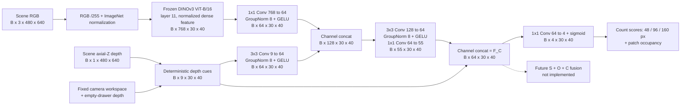

#### 위치별 차원 변화

```text
RGB:    DINO 768 → projection 64 ─┐
Depth:  cue 9   → projection 64 ─┴→ concat 128 → fusion 55 ─┐
        cue 9 ─────────────────────── direct path ──────────┴→ F_C64
                                                               ↓
                                                        auxiliary map 4

공간 격자: 모든 단계에서 30×40 = 1,200개 출력 위치 유지
```

Concat은 같은 위치의 channel을 이어 붙이는 연산임. `64+64→128`, `55+9→64`는 원소별 덧셈과 구분함. 이후 convolution이 channel과 이웃 위치의 정보를 학습 가중치로 혼합함.

### 3. 내부 모듈과 선택 이유

| 모듈 | 입력 → 출력 | 역할과 선택 이유 | 검증 범위 |
|---|---|---|---|
| Frozen DINOv3 layer11 | RGB → `768×30×40` | 1,200개 patch의 외형·문맥 표현 제공. Backbone을 고정하여 작은 RGB-D head 비교에 사용 | Layer 선택의 독립 ablation 없음 |
| RGB projection | `1×1 Conv 768→64` | 위치를 유지하면서 RGB feature 폭을 압축 | 64가 최적 폭이라는 검증은 없음 |
| Depth projection | `3×3 Conv 9→64` | 직접 cue와 주변 격자 정보를 결합 | Image-space 이웃 연산이며 3D graph 연산이 아님 |
| RGB-D fusion | `Concat128 → 3×3 Conv64 → 1×1 Conv55` | 두 관측을 결합한 학습 feature 생성 | 특정 물체 관계의 보존 여부는 별도 평가 필요 |
| GroupNorm 8 + GELU | 64-channel 중간 표현 | Group별 정규화와 비선형 변환 | 정규화 방식의 독립 우위는 미검증 |
| Direct geometry path | `learned55 + geometry9 → F_C64` | 학습 bottleneck 이후에도 원래 기하값을 제공 | 채널 배분·우회 경로의 독립 ablation 없음 |
| Auxiliary head | `1×1 Conv 64→4 + sigmoid` | 세 count score와 occupancy를 예측하여 학습 신호 제공 | Target 존재 확률·최종 scalar Complexity가 아님 |

DINO는 freeze하고 RGB/depth projection, fusion convolution, auxiliary head만 학습함. 세 stream의 형식을 `64×30×40`으로 맞춘 것은 결합 규격이며 의미 정렬이나 fusion 효용의 검증 결과는 아님.

#### RGB feature 추출과 projection

RGB를 255로 나눈 뒤 ImageNet mean `(0.485,0.456,0.406)`, std `(0.229,0.224,0.225)`로 channel별 정규화함. 사전학습 encoder의 입력 scale을 맞추는 전처리임.

DINOv3 ViT-B/16은 16×16 patch를 처리하며, index 11인 마지막 12번째 block의 768-D dense token을 사용함. `norm=True`는 backbone의 LayerNorm 적용을 뜻함. Density pilot에서는 별도 token L2 normalization을 하지 않으며, Phase 36 pair probe의 L2 normalization과 구분함.

원본 patch의 `16×16×3=768`개 RGB 값과 768-D token은 차원 수만 같음. Token은 학습 projection과 attention을 거쳐 주변·전체 영상 문맥이 반영된 표현으로, 원본 pixel의 단순 flatten이 아님. 동일한 색도 책·바닥 등 문맥에 따라 다른 feature를 만들 수 있으나 channel별 의미가 고정된 것은 아님.

`1×1 Conv 768→64`는 각 위치의 768개 feature에 학습 가중치를 적용하여 64개 가중합을 생성함. 공간 해상도는 유지하며 GroupNorm/GELU 이후 depth branch와 결합함.

#### Depth reference와 유효 pixel

Depth 입력은 optical axis 방향의 axial-Z를 meter로 저장한 값임. 화면 가장자리까지의 비스듬한 ray 길이와 구분하며, 여기서 계산하는 image-space cue를 3D 곡률로 해석하지 않음.

Scene depth $d$와 동일 camera의 empty depth $d_0$가 모두 유한한 양수이고 workspace 안에 있는 pixel만 유효함. Empty reference 대비 변위는 다음과 같음.

$$
\Delta(u,v)=d_0(u,v)-d(u,v).
$$

양수는 빈 배경보다 camera 쪽으로 나온 표면을 뜻함. 음수는 reference 정합·관측 차이 등에서도 발생할 수 있으므로 특정 물체 상태로 단정하지 않음. Roughness 계산에서는 음수를 보존하여 0으로 clipping할 때 생기는 인위적 경계를 방지함.

| Empty `d₀` | Scene `d` | `Δ=d₀−d` | 처리 — 가상 계산 예 |
|---:|---:|---:|---|
| 3.00m | 2.90m | +0.10m = +100mm | `Δ>15mm`이므로 direct foreground에 포함 |
| 3.00m | 2.99m | +0.01m = +10mm | 앞쪽 표면이지만 foreground threshold 미달 |
| 3.00m | 3.02m | −0.02m = −20mm | Roughness에는 부호를 보존, foreground에서는 제외 |
| 3.00m | 0 | 제외 | Invalid를 3m 앞의 표면으로 해석하지 않음 |

#### 직접 depth cue 9개

| Channel | 계산 | 역할 |
|---|---|---|
| 1. Normalized depth | 유효 patch depth 평균을 `(mean−2.5m)/(3.5m−2.5m)`로 변환 후 `[0,1]` 제한 | 절대 깊이 제공 |
| 2. Direct foreground occupancy | 유효 pixel 중 `Δ>15mm`인 비율 | Empty reference보다 충분히 앞선 표면 비율 |
| 3. Depth validity | Patch 256px 중 scene/empty depth·workspace가 모두 유효한 비율 | 관측 지원 영역 제공 |
| 4–6. Plane residual RMS | 48/96/160px window의 `Δ`에 affine plane 적합 → 잔차 RMS `/30mm` → `[0,1]` 제한 | 일정한 image-space 기울기 제거 후 남는 변화 |
| 7–9. Gradient variation | 각 window의 수평·수직 유효 인접 pixel `Δ` 차분 분산 합의 제곱근 `/20mm` → `[0,1]` 제한 | 1px first difference의 불균일성 |

첫 세 channel은 16×16 patch를 요약함. 평균 depth가 2.90m이면 normalized depth는 `(2.90−2.50)/(3.50−2.50)=0.40`임. 유효 pixel이 없으면 평균·occupancy·validity를 모두 0으로 둠.

| 가상 patch: 전체 256px, 유효 224px, foreground 168px | 계산 | 분모의 의미 |
|---|---:|---|
| Direct occupancy | `168/224=0.75` | 관측 가능한 영역 중 foreground 비율 |
| Validity | `224/256=0.875` | 전체 patch 중 관측 가능한 비율 |

Direct occupancy는 depth threshold로 계산하며, segmentation 기반 occupancy GT와 정의가 다름. 또한 normalized depth가 크거나 roughness가 높다는 사실만으로 복잡도가 높다고 판정하지 않음.

#### Plane residual과 gradient variation

Plane residual은 window의 유효 pixel 집합 $V_s(p)$에서 affine plane을 최소제곱 적합한 뒤 RMS 오차를 계산함. $x,y$는 영상 크기로 나눈 image-space 좌표임.

$$
(a_s,b_s,c_s)=\arg\min_{a,b,c}\sum_{q\in V_s(p)}
\left[\Delta(q)-(ax_q+by_q+c)\right]^2,
$$

$$
r_s(p)=\sqrt{\frac{1}{|V_s(p)|}\sum_{q\in V_s(p)}
\left[\Delta(q)-(a_sx_q+b_sy_q+c_s)\right]^2}.
$$

$a_s,b_s,c_s$는 현재 window의 depth에서 직접 계산한 plane 계수이며 network의 학습 parameter가 아님. 잔차를 제곱 평균한 뒤 제곱근을 취하므로 양·음의 오차가 상쇄되지 않음.

Gradient variation은 유효 인접 쌍의 first difference $g_x,g_y$에 대해 $\sqrt{\mathrm{Var}(g_x)+\mathrm{Var}(g_y)}$로 계산함. 두 cue의 차이는 다음과 같음.

| 비교 | Plane residual | Gradient variation |
|---|---|---|
| 측정 대상 | Window 전체를 하나의 plane으로 설명한 잔차 | 인접 pixel 변화량의 불균일성 |
| `Δ=0,10,20,30mm`인 선형 변화 | Plane으로 설명 가능하여 잔차 0 | 차분이 모두 10mm이므로 분산 0 |
| 여러 면·단차·곡률 | 단일 plane으로 설명되지 않는 오차 발생 | 차분이 `0,30,0mm`처럼 달라지면 분산 발생 |
| 해석 한계 | 단일 곡면 물체도 잔차를 만들 수 있음 | Sensor noise와 물체 경계 모두 반응 가능 |

두 cue가 완전히 독립된 정보를 제공한다는 ablation 증거는 없음. Plane 계산에는 전체 window 면적의 유효 비율 ≥25%, 유효 pixel ≥6, 비퇴화 좌표 조건이 필요함. 지원이 부족한 roughness는 0으로 두고 workspace 밖에는 cue를 생성하지 않음. 이때 0은 평탄함의 확정 판정이 아님.

정규화 예는 residual 6mm → `6/30=0.20`, residual 45mm → `45/30=1.5`를 1로 제한, gradient variation 4mm → `4/20=0.20`임. 30mm/20mm는 입력 scale을 맞추는 고정 상수이며 승인된 복잡도 기준이나 최적 threshold가 아님.

#### Empty-reference 보정

V1 raw-depth cue는 빈 서랍의 벽·곡면에도 반응했음. Plane 제거만으로 고정 배경의 비평면 구조를 없앨 수 없어 V2에서는 **`roughness_reference="empty_difference"`**로 여섯 roughness channel을 계산함. `scene_depth=empty_depth`이면 곡면·단차 배경에서도 `Δ=0`이므로 roughness가 0이 됨. Normalized depth·occupancy·validity의 정의는 유지함.

함수의 기본값 `scene`은 V1 호환용이므로 실제 실행에는 checkpoint protocol의 V2 설정을 사용해야 함. 이 보정은 고정 camera와 empty scene의 정합을 전제로 하며, camera/FOV·drawer 위치·depth calibration 변경 및 실제 sensor의 강건성은 별도 검증 대상임.

#### Depth projection과 RGB-D fusion

`3×3 Conv 9→64`는 현재 위치와 주변 8개 위치의 cue를 사용함. 일반적인 내부 위치에서 출력 channel 하나의 입력은 `3×3×9=81`개이며, padding 1로 `30×40` 크기를 유지함. 물체별 소속을 지정한 graph 연산은 아님.

RGB/depth projection을 concat한 128개 channel에 `3×3 Conv 128→64`, GroupNorm/GELU, `1×1 Conv 64→55`를 적용함. 동일 높이의 서로 다른 RGB 영역과, 단일 물체 내부의 큰 depth 기울기를 구분할 표현을 학습할 수 있는 구조임. 다만 count/occupancy loss가 모든 물체 관계의 구분을 보장하지는 않음.

GroupNorm은 sample별 64 channels를 8개 group, group당 8 channels로 나누어 공간 위치와 함께 정규화함. 다른 영상의 batch 통계에 의존하지 않음. GELU는 선형 가중합 사이에 비선형 반응을 추가함.

#### Direct path: 학습 feature 55개와 기하 cue 9개

학습 branch를 거치면서 기하 cue가 다른 feature와 혼합되더라도, 후속 head가 원래 값을 직접 사용할 수 있도록 우회 경로를 유지함. 예를 들어 학습 feature가 RGB 문맥을 강조해도 depth validity는 직접 참조 가능함.

```text
geometry9 ──→ depth projection ──→ RGB-D fusion ──→ learned55 ──┐
     └──────────────── direct9 유지 ──────────────────────────┴→ F_C64
```

Direct cue의 계산식은 학습하지 않지만, 이를 읽는 auxiliary head의 weight는 학습함. 따라서 직접 경로가 출력 기여도를 고정하는 것은 아님. `55+9`는 64-channel 규격 안에서 기하값을 보존한 설계이며 다른 배분보다 우수하다는 독립 비교는 없음.

#### Auxiliary head: `F_C64 → 4 maps`

`F_C64`는 후속 fusion에 제공할 중간 표현이고, 네 map은 학습 정답과 비교하기 위한 readout임. 위치별 64개 feature의 가중합과 bias로 logit 4개를 만든 뒤 각각 sigmoid를 적용함.

$$
z_k(p)=\sum_{c=1}^{64}w_{kc}F_{C,c}(p)+b_k,
\qquad \hat y_k(p)=\frac{1}{1+e^{-z_k(p)}},\quad k=1,2,3,4.
$$

Logit 0의 sigmoid 값은 0.5임. Count channel에서는 `0.5×16=8` label-groups, occupancy에서는 알려진 영역의 절반에 해당함. 같은 값이라도 감독 대상에 따라 의미가 달라지며 target 존재 확률 50%를 뜻하지 않음.

Sigmoid는 bounded GT를 예측하는 마지막 head에만 적용함. `F_C` 전체에 적용하면 학습 feature 55개까지 0–1로 제한되므로 중간 표현은 그대로 유지함. 최종 fusion에서 4-map보다 중간 feature가 제공하는 추가 효과는 미검증임.

### 4. GT 생성과 학습

#### 감독 경로와 추론 경로

저장된 scene segmentation·mapping으로 count/occupancy GT를 만들고, 이를 RGB-D 예측과 비교해 loss를 계산함. **Scene segmentation은 density 모델의 입력 feature로 전달하지 않음.** 추론에는 RGB-D와 고정 reference만 필요함.

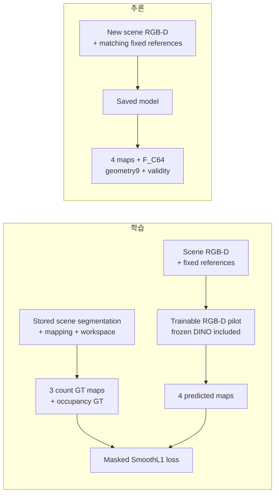

Phase 34–35는 GT label을 계산 입력으로 사용한 teacher 진단이고, Phase 36은 GT로 순수 patch와 평가 pair를 선정한 조건부 평가임. Density pilot의 segmentation 없는 추론과 이 진단 조건을 구분함.

#### 가시 segmentation label-group count

저장 mapping은 asset 이름에 색을 연결하며 영속적인 physical instance ID는 아님. 서로 다른 asset의 색 충돌이나 동일 asset의 복수 배치는 한 그룹으로 합쳐질 수 있음. Pilot은 **서로 다른 색 그룹을 한 번씩** 세며, 동일색 조각이 떨어져 있어도 중복으로 세지 않음.

Workspace를 $\Omega$, 알려진 색 그룹을 $g$, 그 그룹의 workspace 내 가시 pixel 집합을 $A_g$로 정의함. Patch 중심 $p$의 한 변 길이 $s$인 정사각 pixel window를 $W_s(p)$라 하면:

$$
n_s(p)=\sum_g
\mathbf{1}[|A_g|\geq32]\,
\mathbf{1}[|A_g\cap W_s(p)|\geq16],
\qquad s\in\{48,96,160\}.
$$

$$
y_s(p)=\min\left(1,\frac{n_s(p)}{16}\right).
$$

전체 workspace에서 ≥32px 보이고 해당 window에 ≥16px 들어온 그룹을 count에 포함함. 작은 흔적의 과도한 계수를 줄이려는 고정 threshold이며 모든 물체 크기·camera에서 최적이라는 검증은 없음.

#### Patch·count window·정규화의 구분

| 항목 | 값 | 역할 |
|---|---|---|
| 출력 sampling | `16×16` patch | `480×640 → 30×40` 출력 위치 결정 |
| Count 포함 조건 | Window 교집합 ≥`16 pixels` | 최소 가시 증거 면적; patch 한 변과 다른 단위 |
| Count 정규화 | `count ÷16` | 원본 library의 16개 asset을 기준으로 한 고정 출력 scale |
| Count window | `48/96/160px` | 위치 주변의 집계 범위; 3/6/10 patch 폭에 해당 |

Window는 원본 pixel에서 계산하며 출력은 동일 patch 위치에 저장함. 96px window가 출력 간격이나 정규화 분모를 96으로 바꾸는 것은 아님. 아래 좌표는 0-based이며 구간 끝은 포함하지 않음.

```text
원본: 높이480 × 너비640 → 16×16 patch → 30행×40열 =1,200개 출력 위치

patch (행12, 열20): y=[192,208), x=[320,336) → 256 pixels
window 중심: (y=200, x=328)

count48:  y=[176,224), x=[304,352) →  48×48= 2,304 pixels
count96:  y=[152,248), x=[280,376) →  96×96= 9,216 pixels
count160: y=[120,280), x=[248,408) →160×160=25,600 pixels

가상 count:                  1개      3개      5개 label-groups
정규화:                      1/16     3/16     5/16
같은 위치의 y_count[:,12,20]: [0.0625,  0.1875,  0.3125]
```

| 그룹별 가상 가시 면적 | Workspace 전체 | Window 내부 | 처리 |
|---|---:|---:|---|
| A | 100px | 20px | 두 조건을 만족하여 count에 1 추가 |
| B | 100px | 12px | Window 내부 ≥16px 조건 미달로 제외 |
| C | 20px | 20px | 전체 ≥32px 조건 미달로 count 제외; 알려진 색이면 occupancy에는 포함 |

세 그룹이 포함된 window의 GT는 `3/16=0.1875`임. Scene별 min–max 정규화는 하지 않고 count가 16을 초과할 때의 clipping 비율을 기록함. 실제 3개 물체가 색 충돌로 2개 그룹이면 GT는 2를 셈. **Phase 36의 충돌 검출로 과거 density GT·checkpoint·수치를 소급 수정하지 않았음.**

48/96/160px은 국소 영역부터 넓은 문맥까지 비교하려는 **image-space window 가설**임. Metric 물체 크기·접촉 거리·grasp 범위를 뜻하지 않으며 window 수·크기의 독립 ablation도 없음. 큰 window에서 count가 커질 수 있으나 `count/16`은 scale 간 동일한 물리 면적당 density가 아님.

#### Count validity

Count supervision은 다음 두 조건을 모두 만족한 window에 적용함.

| 조건 | 계산·의미 |
|---|---|
| Workspace coverage ≥95% | 분모는 **전체 정사각 window 면적**임. 영상 밖으로 잘린 부분도 포함 |
| Workspace 내부 unknown nonblack 없음 | Mapping에 없는 pixel을 빈 배경으로 취급하지 않음 |

96×96 window의 전체 면적은 9,216px임. Workspace가 9,000px이면 `9000/9216≈97.66%`로 통과하고, 8,600px이면 약 93.32%로 제외함. Coverage를 통과해도 unknown nonblack이 있으면 count mask는 0임. 낮은 count와 신뢰할 수 없는 GT의 제외를 구분하는 규칙임.

Density pilot은 알려진 동일색 alias를 한 그룹으로 유지함. 반면 Phase 36은 asset identity가 모호한 **충돌 색 자체를 unknown으로 제외**했으므로 label 처리와 metric을 혼용하지 않음.

#### Patch occupancy와 loss weight

Occupancy는 count window가 아닌 **16×16 patch 자체**의 비율임. $F$는 알려진 foreground, $U$는 workspace 내 unknown nonblack, $P(p)$는 patch pixel 집합임.

$$
y_{\mathrm{occ}}(p)=
\frac{|P(p)\cap F|}{|P(p)\cap(\Omega\setminus U)|}.
$$

분모가 0이면 GT와 loss weight를 모두 0으로 둠. 그 외 occupancy loss weight는 `알려진 workspace pixel 수 /256`임. Count의 최소 면적 조건에서 제외된 작은 알려진 색 그룹도 occupancy foreground에는 포함함.

```text
가상 patch 전체: 256px
├─ Workspace 밖 16px                 → GT 분자·분모에서 제외
└─ Workspace 안 240px
   ├─ Unknown 40px                   → GT 분자·분모에서 제외
   └─ 알려진 영역 200px               → GT 분모
      ├─ Foreground 150px            → GT 분자
      └─ Background 50px

Occupancy GT =150/200=0.75
Loss weight  =200/256=0.78125
```

`150/256`을 GT로 사용하면 workspace 밖과 unknown을 배경으로 간주하여 occupancy를 낮추게 됨. 현재는 알려진 영역 내부 비율을 GT로 사용하고, 관측 지원 비율을 loss weight로 반영함. Count의 binary ≥95% validity와 다른 규칙임.

Occupancy 1은 알려진 workspace가 물체로 덮였다는 뜻임. 넓은 단일 물체와 다물체 밀집을 구분하는 감독값은 아님.

#### Masked SmoothL1 loss

출력 순서는 `[count48/16, count96/16, count160/16, occupancy]`임. Count binary validity 3개와 occupancy의 알려진 workspace 비율 1개를 channel별 weight $M_c$로 사용함.

$$
\mathcal{L}=\frac{1}{4}\sum_{c=1}^{4}
\frac{\sum_{b,p}M_c(b,p)\,\ell_{0.05}(\hat y_c(b,p)-y_c(b,p))}
{\max\left(1,\sum_{b,p}M_c(b,p)\right)},
$$

$$
\ell_\beta(e)=
\begin{cases}
e^2/(2\beta),& |e|<\beta,\\
|e|-\beta/2,& |e|\geq\beta.
\end{cases}
$$

각 channel의 loss를 유효 weight 합으로 정규화한 뒤 네 channel을 동일 가중 평균함. Window별 유효 영역의 크기가 loss 비중을 결정하지 않도록 한 구성임.

| 조건 | 포함 범위 |
|---|---|
| 학습 loss | **Count=0을 포함한** 모든 유효 window |
| Primary metric·checkpoint 선택 | **GT count>0인** 유효 window의 count MAE |

SmoothL1은 작은 오차에는 제곱, 큰 오차에는 절댓값 형태로 반응함. GT `3/16=0.1875`, prediction `4/16=0.25`이면 오차 `0.0625≥β=0.05`이므로 weight 적용 전 loss는 `0.0625−0.05/2=0.0375`임. 오차가 `0.02`이면 `0.02²/(2×0.05)=0.004`임. 이후 validity와 channel별 정규화를 적용함.

#### Auxiliary supervision과 gradient 경로

학습 feature 55개 각각에 GT를 지정하지 않음. 네 map의 loss가 head와 앞쪽 projection/fusion으로 역전파되어 count/occupancy 예측에 유용한 feature를 학습하도록 함.

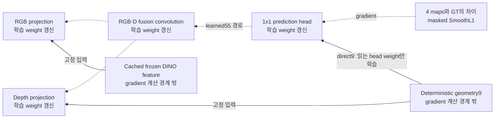

점선은 gradient 전달, 실선은 고정 feature 입력 경로임. Cached DINO와 직접 depth 수식은 gradient 계산 경계 밖에 있으며, direct9의 값은 유지하되 이를 읽는 head weight는 학습함.

이 감독은 네 auxiliary GT의 예측을 개선하도록 유도함. Count/occupancy가 구분하지 못하는 두 구조를 내부 feature가 반드시 다르게 표현해야 할 제약은 없으므로, 낮은 예측 오차를 구조 이해의 충분한 근거로 사용하지 않음.

#### Matched 비교와 추론 결과

Frozen RGB feature를 cache하고 작은 head를 AdamW로 학습함. RGB-D/depth-only는 동일 architecture·초기값·sample 순서를 사용하며 depth-only의 DINO 입력만 0으로 설정함. Validation occupied-window count MAE로 checkpoint를 고정한 뒤 test를 평가함.

`inference_complexity.py`는 checkpoint protocol, DINO weight와 고정 reference의 hash를 검사하고 다음 결과를 반환함.

| NPZ 항목 | Shape | 의미 |
|---|---|---|
| `maps` | `(4,30,40)` | 세 count score와 occupancy |
| `features` | `(64,30,40)` | `F_C` |
| `geometry` | `(9,30,40)` | 직접 depth cue |
| `validity` | `(1,30,40)` | 관측 depth의 유효 비율 |

Count score에 16을 곱한 값은 연속적인 가시 label-group 개수 추정치임. 정수 물체 수나 hidden count가 아님. 추론 `validity`도 관측 지원 비율이며 segmentation 기반 GT count mask를 복원한 결과가 아님.

Hash 검사는 학습에 사용한 weight/reference와 다른 파일의 혼입을 확인하는 절차임. 동일 해상도 또는 동일 파일이라는 사실만으로 새 camera의 실제 정합을 보장하지 않음.

구현: `complexity_cues.py`, `complexity_model.py`, `run_complexity_pilot.py`, `inference_complexity.py`. 실행법은 density pilot 문서 (`docs/complexity_results/README.md`)에 정리함.

### 5. 핵심 설계 과정과 검증 결과

Count 예측에서 시작하여 국소 관계 후보, 제거 효과, 기존 표현의 정보량을 차례로 점검함. 각 실험의 지표는 해당 질문의 범위에서 해석함.

| Phase·연구 질문 | 주요 결과 | 현재 판단 |
|---|---|---|
| **33 — RGB의 count 예측 기여** | All16 pools·5 views, train/val/test `3,840/960/960`, 3 seeds. MAE depth **0.8327 → RGB-D 0.6414**, **22.97% 감소** | Density 예측의 추가 정보 확인; 관계·탐색 효용 검증은 아님 |
| **34 — 다른 물체와 가까운 표면의 국소화** | GT label+depth 근접도는 접경에 반응, 단독 물체는 0. 투영 면적 편차 **3.1746%>사전 3%**로 통제 실패 | 관측 근접도 후보로 보존; Complexity GT 미승인 |
| **35 — 물체 평균 근접도와 제거 효과** | 실제 asset 10 layouts, 공통 **701조건/49 views**. 새 노출 비율 Spearman 근접도 **0.078**, 면적 **0.387**, count **0.291** | 30mm 근접도 평균을 제거 순위·GT로 채택할 근거 부족 |
| **36 — Frozen DINO의 asset 대응 정보** | Same-category AUROC DINO+position **0.998953**, depth+position **0.773882**, RGB-D+position **0.998908**, raw cosine **0.925424** | 순수 patch 대응은 잘 읽히지만 경계·다중 관계는 미검증 |

#### Phase 33: Density 예측과 해석 범위

Primary count MAE는 유효 occupied window의 오차를 영상·세 scale·seed에 걸쳐 평균한 **가시 segmentation label-group 개수 단위**임. RGB-D는 5/5 camera에서 개선됐고, 12개 test scene-key cluster의 paired 재표집에 따른 absolute 개선량 95% 구간은 `[0.1790,0.2054]` 그룹이었음.

Occupancy MAE는 RGB-D `0.00854`, depth-only learned head `0.01524`, 직접 depth occupancy `0.00981`임. 개선은 정해진 관측량의 예측에 한정하며 occupancy 자체가 단일 물체와 다물체 밀집을 구분하지 못하는 한계는 유지됨.


열은 scene RGB / 96px count GT / RGB-D prediction / 절대 오차 / occupancy GT / 직접 depth occupancy / depth plane residual임. Count는 GT-valid window만 표시하므로 표시 밖의 0을 물체 부재로 해석하지 않음. Empty-reference 수정과 평가 조건은 Phase 33에 정리함.

#### Phase 34–35: 근접도 teacher와 정적 제거

근접도는 RGB edge detector가 아니라 **GT label로 물체를 구분한 뒤 depth에서 복원한 관측 표면 간 거리**를 계산한 값임. 서로 다른 가까운 표면에는 반응하고 단일 물체 내부 무늬에는 반응하지 않음. 이는 수식의 동작 확인이며 숨겨진 접촉·전체 적층 관계의 검증은 아님.

Phase 35는 pose가 보존된 추가 capture를 사용함. 원본 16개에 `World1`을 더한 17-asset 데이터로 `260714_data`와 별도임. 50/50 views의 원본 label/depth 정합을 확인한 뒤 다른 물체를 고정하고 하나만 제거하여 새로 보이는 다른 물체 면적을 측정함.

이 결과는 실제 grasp 가능성·재정착·target 발견·행동 성공률을 포함하지 않음. 제한된 정적 노출 효과와도 물체 평균 근접도의 상관이 약하여 선택 점수로 채택하지 않았으며, 모든 근접 feature의 무용함으로 확대하지 않음. 사진·통제 실패·공통 표본 집계는 Phase 34, Phase 35에 정리함.

#### Phase 36 A probe: 평가 과제와 pair 구성

Probe는 고정된 feature에서 특정 정보를 읽는 작은 예측기임. 이번 A는 **두 patch의 가시 asset label이 같은가**를 평가한 진단으로, density CNN의 4-map head와 별개이며 DINO를 추가 학습하지 않음.

| Pair | 예 | 정답·평가 목적 |
|---|---|---|
| Positive | 책 A 표지와 책 A의 다른 내부 patch | 같은 asset label |
| Same-category negative | 책 A와 책 B의 patch | 같은 book category 안에서 다른 asset 구분; primary |
| Different-category negative | 책 A와 사과의 patch | Book과 fruit 등 다른 category 구분 |

Same-category 조건은 category 일치만으로 positive를 판정하는 혼동을 점검함. 동일 asset을 복제한 두 physical instance의 구분을 평가한 것은 아님.

Positive/negative를 정확한 XY offset·anchor category·depth 차이 구간으로 맞춰 거리·depth 조건의 차이를 줄였음. 모든 shortcut 제거를 보장하지는 않으므로 position-only와 depth-only 비교군도 사용함.

#### Pair feature와 readout

| 구성 | 연산 | 차원 |
|---|---|---:|
| DINO | Patch별 768-D를 L2 정규화 → 두 vector의 절댓값 차이·원소별 곱 concat | `768+768=1536` |
| Depth | Cue9 + 4×4 subblock 평균16 + 유효 비율16 = patch당41 → pair 평균·절댓값 차이 | `41×2=82` |
| Position | 두 patch의 평균 위치와 절댓값 위치 차이 | 4 |
| 전체 | 세 입력 concat → MLP `1622→64→16→1` | **1,622** |

GT label 번호와 category 이름은 feature에 넣지 않음. GT는 순수 patch·pair의 위치 선정과 정답 지정에 사용함.

```text
GT segmentation → 순수 patch·pair 선택 → 위치 p, q ─────────┐
전체 scene RGB-D → frozen feature·depth descriptor ─────────┴→ pair feature 1,622
                                                                  ↓
                                                            MLP same-label score
                                                                  ↓
GT segmentation → 선택한 pair의 정답 1/0 ──────────────────────→ loss / 평가
```

학습 비교군은 동일 MLP 크기·초기값·sample 순서를 유지하고, train-only 정규화 후 제외할 branch를 0으로 설정함. DINO 비교에도 위치 정보가 있으므로 `DINO+position`으로 표기함. Raw cosine은 MLP 학습 없이 정규화 DINO vector의 내적을 사용하는 baseline임.

#### 평가 조건과 coverage

| 항목 | 조건·집계 |
|---|---|
| 데이터 | All16 seen assets, train/val/test `8/4/8 scene keys ×16 pools ×5 views` |
| Patch | 동일한 알려진 GT label ≥90%, workspace·valid depth 각각 ≥95% |
| Primary | Same-category **80,024 pairs/604 views/8 scene keys** |
| AUROC 집계 | View별 → key별 pool/view 평균 → 8 keys 동일 평균 → 3 seeds 평균 |
| 전체 test | 150,690 pairs/640 views; pair·view를 독립 scene 수로 세지 않음 |
| 적격 coverage | 알려진 foreground 128,380 patches 중 54,429개, **42.40%** |

Purity ≥90%는 patch 전체 256px 중 최소 231px이 같은 알려진 label이어야 한다는 조건임. 두 물체가 섞인 경계 patch는 상당 부분 제외됨. 또한 unknown/색 충돌은 알려진 foreground 분모에서 제외함. 따라서 GT가 지정한 순수 내부 patch의 조건부 진단이며 전체 영상 instance segmentation 평가가 아님.

AUROC는 positive가 negative보다 높은 score를 받는 순위 판별 지표임. 동점은 절반 기여, 이상적 순위는 1, 무작위 순위는 대략 0.5임. Score 0.5로 정·오답을 나눈 accuracy나 확률 calibration과 다르므로 **0.998953을 pixel segmentation 정확도 99.8953%로 해석하지 않음.**


경계·작은 물체·심한 가림의 상당 부분, 동일 asset 복제, unseen asset 일반화는 이 평가의 범위 밖임. 순수 patch 대응이 거의 포화되어 B/C의 추가 효과를 이 과제로 판별하기 어려우므로 도입을 보류함. 자료와 큰 오차 pair 그림은 Phase 36에 정리함.

### 6. 질문과 답변

#### Q1. 왜 Complexity를 count/occupancy로 바로 정의하지 않는가?

Count와 occupancy는 각각 가시 label-group 수와 알려진 영역의 피복 비율을 감독함. 같은 관측량에서도 배치·분리·가림 관계가 달라질 수 있으므로 구조적 Complexity의 충분한 정의가 아님.

```text
알려진 영역 200px의 occupancy=1:
[       책 A       ]       또는       [ A ][ B ][ C ][ D ]

Count=3:
[A] [B] [C]                또는       서로 겹친 A/B/C
```

첫 비교는 물체 구성을, 두 번째 비교는 배치 관계를 해당 단일 값으로 구분하지 못하는 예임. Pilot은 이 관측량의 예측 결과로 보존하며, 구조적 GT는 구분할 관계와 탐색 목적을 정한 뒤 검증해야 함.

#### Q2. Depth의 거칠기를 그대로 복잡도라고 하면 안 되는가?

Depth 변화에는 단일 물체의 기울기·곡면, 고정 서랍 구조, sensor 오차가 함께 반영됨. Empty-reference와 plane/gradient 처리는 일부 반례를 줄이는 보정이며 잔차를 물체 관계로 확정하는 근거는 아님.

Raw depth variance는 기울어진 책 한 권에서도 커질 수 있음. Plane residual은 일정한 기울기를 제거하지만 단일 곡면·noise·다물체 경계는 모두 잔차를 만들 수 있음. 반대로 같은 높이의 여러 물체는 depth 변화가 작아 RGB 외형·문맥 단서가 필요함.

따라서 depth cue는 RGB-D feature의 입력으로 유지하되 관계 평가를 별도로 수행해야 함. Cue의 30mm 정규화 상수와 근접도 진단의 30mm 탐색 반경도 서로 다른 역할임.

#### Q3. 다른 물체와 가까운 가장자리만 찾아서 그 물체를 선택하면 되지 않는가?

국소 접경 검출만으로 제거 대상과 선택 효용이 결정되지는 않음. 물체 소속 추정, 국소값의 물체별 집계, 행동 결과와의 연결이 추가로 필요함.

```text
국소 관계 map → 물체 A/B/C 소속 → 평균·합·최댓값 등 집계 → 물체별 점수 → 선택 효용 검증
```

분리된 가시 조각의 소속을 잘못 묶으면 선택 단위가 달라짐. Phase 34–35는 GT label로 소속을 제공했으므로 segmentation 없는 추론에서 이를 해결한 결과가 아님.

집계 방식에도 편향이 있음. 가까운 가장자리 10%만 score1, 내부90%가 0인 물체의 평균은 0.1임. 넓은 내부는 평균을 낮추고, 최댓값은 작은 noisy 접경 하나에 민감함. 또한 넓은 책 아래 가려진 면적이 커도 현재 관측된 다른 표면까지의 거리는 클 수 있음.

Phase 35의 **30mm 근접도 물체 평균**은 정적 새 노출 비율과 Spearman 0.078로 약한 상관을 보였음. 접경 반응을 선택 점수로 바로 채택하지 않은 이유이며, 모든 edge·관계 feature가 무용하다는 결론은 아님.

#### Q4. 물체 대응을 거의 완벽하게 구분했으면 Complexity도 해결된 것인가?

Phase 36은 GT가 선택한 순수 patch의 가시 asset label 대응 평가임. 경계 검출·물체 전체 grouping·다중 물체의 가림 관계를 대신하는 성능 지표가 아님.

책 A의 두 내부 patch를 연결하는 문제와, 다른 물체에 가려져 분리된 책 A의 전체 영역을 복원하는 문제는 다름. 책 A와 상자 B 사이의 가림 방향도 별도 관계임. 현재 결과는 첫 과제에 필요한 정보가 DINO에서 잘 읽힌다는 근거임.

Purity ≥90% 조건에서 적격 coverage는 알려진 foreground patch의 42.40%였음. 경계·mixed patch·동일 asset 복제·unseen asset을 포함한 구조 이해를 검증하지 않았음. 따라서 “DINO에 물체 구분 정보가 전혀 없음”이라는 가정은 지지되지 않지만 관계 표현의 충분성도 입증된 것은 아님.

#### Q5. Similarity의 SigLIP처럼 별도 모델을 추가하는가?

계획은 A/B/C 비교이며 **A만 완료, B/C는 미실행**임. 현재 순수 patch 진단의 포화로 추가 효과를 판별하기 어려워 도입을 보류함. SAM/VLM의 일반적 불필요를 주장하는 결과는 아님.

| 단계 | 구성 | 분리할 효과 |
|---|---|---|
| A | 기존 DINO+depth | 기존 표현에서 읽을 수 있는 정보 |
| B | A + 예측한 물체/영역 묶음 | Grouping 자체의 효과 |
| C | B + 사전학습 공간 관계 feature | 동일 영역에서 새 표현이 제공하는 추가 정보 |

Similarity의 SigLIP은 외형만으로 부족한 의미 관계를 보완하려는 설계였음. Complexity에서도 먼저 어떤 경계·소속·다물체 관계를 기존 표현에서 읽지 못하는지 특정해야 함. B/C가 같은 region과 평가 조건을 공유해야 grouping 개선과 사전학습 표현의 효과를 분리할 수 있음. GT region을 제공하면 별도 oracle 결과로 취급함.

VLM의 문장 응답 능력이 `30×40` 위치별 feature의 유용성을 보장하지는 않음. Token–위치/물체 대응, 관측되지 않은 관계의 추정 범위, 추가 계산량 대비 평가 이득을 확인해야 함. 모델의 문장이나 scalar를 Complexity GT로 사용하는 계획은 아님.

#### Q6. 학습에서 GT segmentation을 쓰면서 추론은 RGB-D만 쓴다는 것이 모순인가?

Density pilot은 GT segmentation으로 loss를 계산하되 이를 예측기의 입력에 넣지 않는 감독학습 구조임. 저장된 weight로 추론할 때는 GT와의 비교가 없으므로 scene segmentation이 필요하지 않음.

| 실험 | GT 역할 | 해석 범위 |
|---|---|---|
| Density inference | 추론에는 미사용 | RGB-D + fixed reference → prediction |
| Phase 34–35 proximity teacher | 물체 label을 거리 계산에 직접 사용 | GT 조건의 관계 후보 진단 |
| Phase 36 A probe | 순수 patch·pair 선택과 정답 지정 | GT가 고른 평가 위치의 대응 판별 |

“추론에 GT가 없음”은 density 경로의 계약임. Teacher와 조건부 probe의 결과를 segmentation 없는 전체 RGB-D perception 성능으로 확대하지 않음.

#### Q7. 64개 feature가 있는데 왜 출력은 4개이며, 0–1이면 확률이 아닌가?

64는 중간 표현의 channel 수이고 4는 현재 감독 목표 수임. Learned55와 direct9를 합친 표현에서 head가 세 count와 occupancy를 읽으며, feature 64개 각각에 GT를 지정하지 않음.

Count channel의 0.25는 `0.25×16=4` label-groups의 연속 추정치이고, occupancy 0.25는 알려진 영역의 4분의 1임. Sigmoid가 0–1 범위를 보장해도 target 존재 확률 25%를 감독한 것은 아님.

현재 feature의 직접 감독 범위는 count/occupancy 예측임. 최종 fusion이 필요로 하는 관계 정보가 `F_C`에 충분히 남는지는 별도 검증 대상임.

#### Q8. 다음 Step은 무엇인가?

실제 더미의 **경계·분리된 가시 조각의 소속·다중 물체 관계**에서 기존 표현의 구체적 누락 능력과 관측 가능한 label을 먼저 특정함. 평가를 사전 고정한 뒤 같은 region 조건에서 B/C의 추가 정보를 비교하는 순서임.

예를 들어 조각 소속 과제는 기존 두 내부 patch 대응과의 차이를 정의해야 하고, 경계 과제는 purity로 제외했던 mixed patch의 처리 기준이 필요함. 이 예들은 채택된 새 GT가 아니라 평가 대상을 구체화하는 후보임.

이미 1에 가까운 A 지표의 미세 개선만으로 구조 이해를 판정하지 않음. GT region은 oracle로 구분하며, 새 scalar·최소 제거 횟수로 Complexity 정의를 대체하지 않음.

#### Q9. 이 feature로 최종 2D-PDM을 만들 수 있는가?

형식상 `Concat(F_S,F_O,F_C)`는 `B×192×30×40`임. 그러나 fusion network·GT·loss·DRL 통합은 미구현이며 현재 density pilot과 A probe가 최종 탐색 효용을 검증한 것은 아님.

행·열·channel 규격의 일치는 결합의 형식 조건임. 각 stream을 어느 조건에서 활용할지, 가려진 target 탐색과 어떻게 연결할지는 별도의 학습·평가 문제임. 세 map의 단순 합이나 밝기 기반 Complexity 확률도 확정된 구현이 아님.

정적 제거로 다른 물체가 보이는 효과와 실제 target 발견 효율을 구분해야 함. 최종 필요성은 동일 탐색 조건에서 **S+O 대비 S+O+C**의 추가 효용으로 검증함.

#### Q10. Camera나 서랍이 달라져도 같은 숫자 기준을 사용하면 되는가?

현재는 원본 asset library와 고정 five-camera rig의 결과임. Workspace·empty reference는 camera별로 고정되어 있고 48/96/160px window는 영상 단위이므로 다른 camera/FOV의 일반화를 보장하지 않음.

Camera가 가까워지면 동일 물체의 pixel 크기가 커져 같은 96px window의 물리 면적이 달라짐. Camera 이동 후 기존 empty depth를 빼면 배경 정합 오차가 `Δ`에 남을 수 있음. Hash는 파일 동일성 검사이며 새 camera와 reference의 실제 정합 검사가 아님.

15mm foreground threshold와 30/20mm 정규화도 새 sensor noise·물체 크기에 대한 검증이 필요함. 실제 RGB-D sensor, 새로운 물체, camera/FOV, reference 오차의 강건성은 후속 범위임.

---

## Project Status

현재 결과와 구현 상태를 요약함. 과거 중간 모델의 수치·검증은 아래 Development Log에서 해당 Phase를 확인함.

| 구성 | 현재 기준 | 남은 검증 |
|---|---|---|
| Similarity | Frozen DINOv3 + SigLIP, shortcut 없는 학습 head; 미학습 target의 zero-shot 동작 정성 확인 | 공식 기준 checkpoint 지정, 여러 미학습 target의 정량 성능 평가 |
| Occlusion GT | Target/yaw별 adaptive pose grid, full16 240,000 maps 생성 | 새 target별 geometry 검증과 실제 관측 조건 확장 |
| Occlusion model | Native 68-D geometry + raw target broadcast + global FiLM; full16 10% baseline | 여러 external targets, reference mask 추정과 camera 일반화 |
| External Occlusion | 학습하지 않은 `packaged_food_5`, 새 30 scenes × 5 views에서 MAE 0.0180 / Soft-IoU 0.812 / IoU 0.723 | 한 target의 합성 평가 범위를 넘는 일반화 |
| Complexity pilot | RGB-D visible-density 학습·추론 구현; 구조적 Complexity GT로 채택하지 않음 | 구체적인 물체·관계 표현의 부족과 보완 효과 |
| Complexity 표현 진단 | 순수 내부 patch의 seen-asset 대응 A probe 완료 | 경계·다중 물체 관계 및 추가 모델 B/C 비교 |
| Three-stream fusion | 후보 입력 규격 `B×192×30×40` | 최종 GT·loss·구조·통합 학습·ablation |
| Exploration / deployment | 탐색 prior로 연결할 계획 | DRL 탐색 효용, 실제 RGB-D와 sim-to-real |

### Core Files

아래 파일명은 현재 연구 구현을 찾아가기 위한 안내임. 공개 clone의 일부 Occlusion 실행 코드는 로컬 개발 기준보다 오래됐거나 누락되어 있으므로, 본문의 현재 실험을 공개 clone만으로 모두 재현할 수 있다는 뜻은 아님. 이번 문서 정리는 미검증 코드를 추가로 게시하지 않음.

| 기능 | 구현 파일 | 역할 |
|---|---|---|
| 공통 RGB backbone | `backbone.py` | Frozen DINOv3 patch feature 추출 |
| Target reference | `target_utils.py`, `train_common.py` | Crop/mask 정렬, masked pooling, target cache와 데이터 분리 |
| Similarity 모델 | `similarity_model.py` | 의미 결합, scene–target interaction, MatchingBlock, map head |
| Similarity GT·학습 | `gt_similarity.py`, `precompute_gt.py`, `train_similarity_v2.py` | Category 기반 GT와 관련성 map 학습 |
| Occlusion 모델 | `occlusion_model.py` | Scene RGB-D와 target geometry의 FiLM 결합 |
| Occlusion GT | `generate_occlusion_map.py`, `generate_occlusion_gt_batched_v2.py` | Adaptive pose 표집, depth 비교, probability/coverage 누적 |
| Occlusion 기하 | `mesh_utils.py`, `mesh_cache.py`, `depth_rasterizer_gpu.py` | Mesh 좌표 변환·단순화와 GPU depth 렌더링 |
| Occlusion 학습·평가 | `occlusion_dataset.py`, `train_occlusion.py`, `evaluate_occlusion_checkpoint.py` | Coverage를 반영한 학습과 저장 split·external target 평가 |
| Complexity GT·depth | `complexity_cues.py` | Window count, occupancy와 empty-reference 보정 geometry |
| Complexity 모델 | `complexity_model.py` | RGB-D feature 55개와 직접 geometry 9개의 결합 |
| Complexity 실행 | `run_complexity_pilot.py`, `inference_complexity.py` | Frozen feature cache, 비교 학습, segmentation 없는 pilot 추론 |

---

## Roadmap

현재 기준 모델을 계속 확장하기보다, 아직 확인하지 않은 질문을 우선함. 완료된 세부 실험 목록은 Development Log에 있음.

- [ ] Similarity 기준 checkpoint와 재현 설정을 확정하고 정량 unseen target 평가 수행
- [ ] Occlusion을 여러 외부 target과 실제 reference mask 추정 조건에서 평가
- [ ] 고정 camera reference에 대한 의존성과 camera/환경 변화의 영향을 검증
- [ ] 실제 더미에서 Complexity의 경계·다중 물체 관계 능력 진단을 정의
- [ ] 부족한 능력이 확인된 조건에서 물체 묶음·공간 사전학습 표현을 공정하게 비교
- [ ] Complexity의 출력 의미와 GT 타당성을 확정
- [ ] Fusion의 GT·loss·decoder를 정의하고 S+O 대비 S+O+C를 비교
- [ ] DRL 탐색 효용과 실제 RGB-D 환경을 검증

---

## Development Log

Similarity·Occlusion·Complexity 연구가 현재 상태에 도달한 이유를 시간순으로 기록함. 각 Phase는 단순 모델 목록이 아니라 **왜 문제가 되었는지 → 무엇만 바꿨는지 → 결과가 무엇을 뜻하는지 → 다음 Step은 무엇인지**를 설명함.

### 전체 연구 흐름

이 표는 아래 상세 이력을 현재 관점에서 연결한 색인임. 중간 모델의 성공을 현재 모델의 직접 비교 결과로 해석하지 않음.

| 단계 | 핵심 문제와 시도 | 현재까지의 결론 | 상세 기록 |
|---|---|---|---|
| Similarity 의미 보완 | DINO 외형 대응 → CLS category prototype → SigLIP 의미 결합 → cosine shortcut 점검 | DINO+SigLIP의 shortcut 없는 head; zero-shot 동작 정성 확인, 여러 target의 정량 평가 남음 | Phase 1–4 |
| Occlusion GT 계산 | 촬영 기반 GT를 mesh depth와 pose별 가림 비율 계산으로 전환 | GPU probability GT 생성과 렌더링 정합을 확인 | Phase 5–8 |
| Target conditioning 진단 | 공정한 split에서 외형·크기·shape와 global/local 조절을 비교 | Target geometry의 역할과 각 실험의 한계를 확인; oracle gate는 현재 baseline이 아님 | Phase 9–30 |
| Occlusion 기준 모델 확정 | Fixed grid의 target별 pose 누락을 확인하고 adaptive GT로 수정 | Full16 native68 global FiLM baseline과 external target 1개 평가 완료 | Phase 31–32 |
| Complexity 정의 점검 | Count/occupancy → 관측 근접도 → 실제 더미의 정적 제거 효과 | Density 학습은 가능하지만 해당 scalar를 구조적 Complexity GT로 채택할 근거는 부족 | Phase 33–35 |
| Complexity 표현 진단 | 기존 feature의 정보 부족과 학습 목표의 한계를 구분 | DINO의 순수 patch 대응은 거의 포화; 다음은 경계·관계 능력과 보완 표현의 검증 | Phase 36 |

### 지표와 범위 읽는 법

- `MAE`: 예측 map과 GT의 평균 절대 오차로, 낮을수록 좋음.
- `Coverage`: 해당 target의 유효 pose가 실제로 덮을 수 있는 영역.
- `Workspace`: 현재 camera에서 보이는 서랍 내부 영역.
- `Impossible-workspace` 또는 `noncoverage`: 과거 실험에서 coverage 밖의 workspace를 부르던 명칭. 해당 GT 설정의 표본 pose가 덮지 않는 영역이며 저장값은 0임. 모든 pose에서 물리적으로 가림이 불가능하다는 뜻은 아님. 이 영역의 activation을 당시 지표에서 `leakage`로 측정했음.
- `S`: target scale 변화에 예측이 GT가 요구하는 방향으로 반응하는 정도. `S > 0`은 방향이 맞다는 최소 조건임.
- `Training-heldout` 4개 target은 구조 선택에 반복 사용한 development set이며 최종 zero-shot test가 아님.
- Exact 3D extent와 coverage label은 simulation에서 얻은 oracle임. Oracle 실험은 정보와 구조의 가능성을 확인하는 단계이며, target RGB만 사용하는 실제 배포 성능을 뜻하지 않음.
- 사전 평가 기준을 만족하지 못했다는 기록은 해당 가설이 불가능하다는 뜻이 아니라, **그 구성으로 후속 seed를 확대하지 않고 원인을 먼저 분리했다는 뜻**임.

### 2026-07-21 · Phase 1 — DINOv3 Appearance Matching

**Reference:** `code_260721/train_similarity.py`

**가설:** Frozen DINOv3 feature 비교만으로 unseen target의 zero-shot similarity map 생성 가능.

```text
Scene RGB  → DINOv3 patch features X_s^l
Target RGB → DINOv3 masked-pooled vector a_t^l

c_hat^l = ShiftTo01(CosineSimilarity(X_s^l, a_t^l))
Z^l     = Concat[X_s^l, a_t^l, c_hat^l]
P_S     = CNN_Head(Z^l)
```

**결과:** 색상·재질·형상 등 appearance가 유사한 영역은 탐지했으나, category-level semantic relation은 표현하지 못함.

**의미와 다음 Step:** 해당 구성에서는 dense appearance matching만으로 target–category–scene의 의미 관계를 충분히 표현하지 못했음. 다음 Step에서는 DINOv3의 image-level CLS가 category 정보를 보완할 수 있는지 확인함.

---

### 2026-07-27 · Phase 2 — CLS Prototype Category Conditioning

**Reference:** `code_260727/train_similarity.py`, `code_260727/train_common.py`

**가설:** Image-level CLS token을 category prototype으로 사용하면 patch feature보다 추상적인 category 정보 제공 가능.

Category별 CLS vector 평균으로 네 개의 prototype을 구성하고 unseen target CLS와 cosine similarity 계산.

```text
prototype_k = L2Norm(Mean[CLS(target_i) | category_i = k])

category_prob = Softmax(
    CosineSimilarity(CLS(unseen_target), prototype_k) / temperature
)
```

정답 누설 방지를 위해 leave-one-out prototype 사용. Category 확률을 spatial location에 broadcast한 뒤 interaction feature에 concat.

```text
Z^l = Concat[
    scene patch,
    target appearance,
    patch-wise cosine,
    category probability
]
```

**결과:** Category prior는 제공했으나 prototype도 DINOv3 appearance history의 평균이므로 외부 semantic grounding이 없음. 기존 prototype과 외형 차이가 큰 unseen object에서 category 추론 불안정.

**의미와 다음 Step:** 해당 네 category prototype은 학습 물체의 DINOv3 외형 이력을 요약한 값이므로, 외형이 달라지는 unseen target까지 안정적으로 설명하지 못했음. 외부 language semantics와 정렬된 VLM을 추가하는 방향으로 이동함.

---

### 2026-07-28 · Phase 3 — DINOv3 + SigLIP Semantic Fusion

**Reference:** `code_260728_ver2/train_similarity_v2.py`

**수정:** DINOv3의 dense spatial representation을 유지하고, SigLIP의 language-aligned semantics를 target query에 추가.

```text
DINO appearance : a_t^l ∈ R^768
SigLIP semantics: s ∈ R^1152
Projection      : s_t^l = W_l · s + b_l
Target query    : q_t^l = a_t^l + s_t^l
```

SigLIP image/text embedding을 평균하고 layer별 projection으로 DINOv3 차원에 정렬. 두 backbone은 frozen으로 유지하고 projection과 matching head만 학습.

**결과:** 학습에 포함되지 않은 packaged-food target에서 same-category 영역 활성화 확인.


**의미와 범위:** 학습에 없던 packaged-food target을 추가 학습 없이 query로 사용하여 같은 category 영역을 활성화하는 zero-shot 동작을 정성적으로 확인함. 여러 unseen instance의 평균 성능과 SigLIP의 독립적인 기여는 후속 정량 평가·통제 비교에서 측정함.

---

### 2026-07-28–29 · Phase 4 — Exact-Instance Shortcut Evaluation

**문제:** SigLIP 결합 후 unseen packaged-food 사례에서 category-level activation을 관찰했으나, visible exact target이 same-category object보다 높게 출력되지 않는 사례도 확인함.

**실험:** DINOv3 cosine을 output logit에 직접 더하는 residual shortcut과 layer `2 + 5` 선택 방식을 평가. Global pooling, raw appearance cosine, visibility, patch matching도 함께 분석.

**결과:** 공통 held-out scene에서 no-shortcut과 shortcut의 exact-target positive ranking은 각각 `29.0%`, `29.7%`로 거의 동일. Median gap은 소폭 개선됐지만 두 모델 모두 instance-level ranking을 충분히 달성하지 못함. 공간 구조를 사용하지 않는 patch matching도 competitor score를 함께 높여 문제를 해결하지 못함.

**결론:** Shortcut은 계산 비용보다 구조와 해석의 복잡성을 늘리는 반면 실질적인 개선이 제한적이므로 최종 Similarity stream에서 제거. 현재 모델은 DINOv3–SigLIP interaction과 learned matching head만 사용함.

추가로 target별로 서로 다른 무작위 split seed가 생성되던 문제를 수정. 실행마다 seed를 한 번만 확정하여 모든 target의 scene-level train/validation split을 재현할 수 있도록 정리.

---

### 2026-08-04 · Phase 5 — Zero-Shot Occlusion Pipeline Design

**문제:** 기존 방식은 target당 `44,100`개 pose와 5개 camera를 촬영하여 중간 RGB·depth·mask를 대량 저장함. 최종 GT도 유효 pose의 depth-weighted occupancy를 scene별 min–max로 정규화하므로 서로 다른 scene에서 흰색의 절대적 의미가 일정하지 않음.

**GT 설계:** Target을 물리적으로 반복 촬영하는 과정을 USD/OBJ mesh depth 계산으로 대체. 기존 pose grid와 `70%` occlusion 판정은 legacy 재현에 유지하고, 실제 학습용 GT는 다음 확률로 별도 생성함.

```text
P_O(u,v) = N_occluded(u,v) / (N_candidate(u,v) + epsilon)
```

Legacy GT와 probability GT를 동시에 출력하여 기존 방식 재현 여부와 새 정규화 효과를 분리해 평가. Visible-target 강조는 Similarity stream과 역할이 겹치므로 Occlusion GT에서 제외함.

**Scale conditioning:** Mesh scale과 target RGB·mask scale을 반드시 동일하게 구성. 동일한 target 입력에 서로 다른 scale GT를 주면 모델이 scale별 정답의 평균으로 수렴하므로 size-effect를 학습할 수 없음. Pilot은 `0.7`, `1.0`, `1.3`으로 시작함.

**모델 설계:** Scene RGB는 frozen DINOv3, scene depth와 valid mask는 ResNet-18로 처리. Target mask에서 추출한 size·silhouette condition으로 depth feature에만 FiLM을 적용하고, target appearance는 MatchingBlock에서 별도로 결합함. 검증되지 않은 cosine shortcut은 baseline에서 제외함.

**배포 조건:** 현재 prototype은 scene RGB, scene depth, target RGB와 target mask/segmentation을 입력으로 사용함. 고정 촬영 환경의 empty-background reference로 mask를 자동 생성하는 전처리는 후속 구현 항목이며, USD/OBJ와 scale 정보는 GT 생성에만 사용함.

**Zero-shot 검증:** Frozen encoder 사용만으로 zero-shot을 가정하지 않고, 학습에서 제외한 target instance와 unseen intermediate scale을 별도 test split으로 평가함.

**다음 Step:** `packaged_food_2`, center camera, scale `1.0`의 mesh-depth 재현 pilot을 수행한 뒤 multi-asset·pose·camera 조건으로 확장함.

---

### 2026-08-04–06 · Phase 6 — Mesh-Depth Validation and GT Refinement

**Reference:** `mesh_utils.py`, `depth_rasterizer.py`, `scene_generator/occlusion_gt_pilot_capture.py`, `experiments/occlusion_gt_pilot/validate_rasterizer.py`

**검증:** `packaged_food_2`, `book_1`, `fruit_1`, `toy_3`을 대상으로 9개 pose와 5개 camera를 조합한 180개 조건에서 USD mesh depth와 Isaac Sim reference를 `640 × 480`으로 비교함.

**수정:** Segmentation reference를 `depth > 0`으로 계산하면 drawer와 background가 포함되는 오류를 확인하고 target segmentation color 기반 mask로 교체. `metersPerUnit=0.01` asset의 자동 unit-compensation scale이 transform 초기화 과정에서 제거되는 문제도 수정함.

**결과:** 176개 조건에서 silhouette IoU `0.9993–1.0000`, 전체 중앙값 `1.0000`, depth MAE 중앙값 `0.75 μm` 확인. 나머지 4개는 서랍 경계에서 drawer wall이 target 일부를 가린 조건으로, mesh projection 오류가 아니라 empty-drawer visibility 처리 차이로 확인함.

**기존 GT 문제:** 기존 `distribution_map_GPU.py`는 occluded pixel에 `valid_pos`를 적용하지만 ratio 분모에는 target 전체 pixel을 사용함. 기존 결과 재현용 `legacy_ratio`는 보존하고, 새 학습 GT는 valid pixel을 분모로 사용하는 `corrected_ratio`와 `70%` threshold를 적용하기로 결정함.

**성능 병목:** 검증용 rasterizer가 triangle별 Python loop를 사용하여 `toy_3`의 2,029,960 triangles에서 평균 `577.72 s/image` 소요. 새 asset에도 적용 가능한 자동 mesh 단순화, full-resolution 정확도 검사, hardware GPU rasterization, pose/camera batch 누적 구조가 필요함.

**결정:** 해상도는 기존과 동일한 `640 × 480`으로 유지. 기존 `distribution_map_GPU.py`는 legacy reference로 수정하지 않으며, corrected ratio와 probability normalization은 새 GT generator에 구현함. 실제 배포에서는 mesh 단순화를 수행하지 않고 scene RGB, scene depth, target RGB와 target mask/segmentation을 입력함.

**다음 Step:** Empty-drawer valid-pixel 처리를 검증에 반영하고, `toy_3`의 단순화 후보를 원본 mesh와 비교하여 자동 선택 기준을 확정한 뒤 batched GPU GT generator를 구현함.

---

### 2026-08-06 · Phase 7 — GPU Rasterization, Corrected Ratio, and Capture Reliability

**Reference:** `depth_rasterizer_gpu.py`, `experiments/occlusion_gt_pilot/validate_rasterizer_gpu.py`, `experiments/occlusion_gt_pilot/occlusion_ratio_pilot.py`, `scene_generator/vectorized_scene_v2.py`

**GPU rasterization:** nvdiffrast 기반 `640 × 480` depth renderer를 구현함. 원본 4개 asset과 `toy_3` 10k simplified mesh를 포함한 225개 조건에서 silhouette과 depth를 검증함. `toy_3` 10k mesh는 원본 대비 worst IoU `0.9938`, median depth MAE `0.3781 mm`를 기록함.

**70% decision:** 20개 clutter scene과 9개 pose, 5개 camera에서 원본·GPU·단순화 mesh를 비교함. `toy_3` 원본–10k 판정 일치율은 전체 `99.67%`, `0.65–0.75` 경계 구간 `96.59%`임.

**Corrected denominator:** Drawer wall이 target 일부를 가리는 `book_1` 경계 조건에서 valid pixel이 `10.01–12.77%` 감소함. Corrected ratio 적용 시 `6/80`개 조건의 `0.7` 판정이 변경되어 기존 분모 불일치가 실제 결과에 영향을 주는 것을 확인함.

**Clutter capture:** 물리 안정화 이후 카메라 촬영을 `world.step()`에서 render-only `world.render()`로 변경함. 캡처 전후 위치·회전 불변성을 직접 확인하고, run/scene/object pose, camera metadata, seed와 완료 상태를 저장하도록 구성함. 실제 transformed mesh vertex 기준 drawer 내부 QC도 추가함.

**후속 결과:** nvdiffrast V2 generator에 pose·camera·scene vectorization과 probability accumulator를 결합했고, V1/V2를 1,024 effective poses에서 교차검증함. 새 asset의 원본–단순화 최종 승인은 별도 절차로 유지함.

**의미와 다음 Step:** GPU rasterization과 mesh 단순화를 결합하면 기존 `640 × 480` 해상도를 유지하면서 전체 pose grid를 처리할 수 있음. 또한 corrected denominator가 실제 `70%` 판정을 바꾸는 사례를 확인했으므로, 기존 GT 재현에는 legacy ratio를 남기고 새 학습 GT에는 corrected ratio를 사용하기로 함. 다음 Step은 전체 `44,100` pose에서 legacy 재현도와 새 probability map을 동시에 확인하는 것임.

---

### 2026-08-07 · Phase 8 — Mesh-Based Legacy and Probability GT Generation

**구현:** `packaged_food_2`, scale `1.0`에서 `44,100`개 pose 전체를 nvdiffrast로 처리함. Target depth를 파일로 저장하지 않고 scene depth와 즉시 비교하여 Legacy GT와 corrected probability GT를 동시에 누적함.

**Legacy 재현:** 기존 코드를 확인하여 visible ratio가 `0.3` 이상일 때 map 전체를 `0.7`배로 낮추고 visible target mask를 `255`로 설정하는 후처리를 복원함. 대표 target frame 한 장의 pixel 수를 reference로 사용하면 threshold 경계 사례가 잘못 분류되는 문제를 확인함.

**Reference 복원:** 기존 GT 3,000 scene × 5 camera의 후처리 ON/OFF 경계를 분석하고, `44,100`개 mesh pose에서 camera별 최대 footprint를 직접 계산함. 최종 정수 reference는 center `2324`, left `2335`, right `2336`, top `2336`, bottom `2335`이며, 15,000개 기존 사례의 ON/OFF 판정을 모두 재현함.

**다중 scene 검증:** 최종 reference로 20 scene × 5 camera의 100개 사례를 재검증함. Old GT 대비 Legacy GT의 MAE는 평균 `0.0000379`, 최댓값 `0.0000959`이며, correlation은 평균 `0.9999956`, 최저 `0.9999919`임.

**분리 원칙:** Visible-target 강조는 기존 GT 재현용 Legacy map에만 적용함. 학습용 Corrected Probability GT는 `N_occluded / N_candidate`의 절대적 의미를 유지하기 위해 scene별 min–max 정규화와 visible-target 강조를 적용하지 않음.

**결과물:** Scene RGB, Target RGB, 기존 GT, mesh 기반 Legacy GT, Corrected Probability GT와 차이 map을 6-panel 이미지로 저장함. Raw/final Legacy map, Corrected Probability map, camera별 metric과 실행 설정도 로컬 실험 결과로 보존함.

Visible-target 규칙이 적용된 사례:


Visibility threshold 바로 아래에서 후처리가 적용되지 않은 사례:


**다음 Step:** 검증 스크립트를 target-independent하게 정리한 뒤 `book_1`과 `toy_3`을 각각 5–10 scene에서 확인함. 두 target이 통과하면 GT 검증을 종료하고, corrected probability GT를 사용하는 scale `1.0` Occlusion Dataset과 학습 baseline을 구현함.

---

### 2026-08-10 · Phase 9 — Occlusion Conditioning Ablation

**문제:** 초기 학습은 target별 scene pool이 달라 모델이 target condition 대신 scene 분포를 외울 수 있었음. Shuffled-target 평가도 target별로 연속된 validation batch 내부에서만 이름을 섞어 사실상 같은 target끼리 교환되는 no-op이었음.

**수정:** 4개 target이 동일한 150개 scene을 사용하도록 구성하고, scene을 train/validation/test `100/20/30`으로 분리함. Coverage-aware patch pooling, 실제 최소 validation loss checkpoint, early stopping, 100% 다른 target을 넣는 confusion matrix와 `shift=0 == main test` invariant를 추가함.

```text
GT_patch = AvgPool(GT × Coverage) / (AvgPool(Coverage) + epsilon)
```

Target appearance와 geometry-FiLM의 기여를 분리하기 위해 네 모델을 3개 seed로 평가함.

| Variant | Test IoU mean ± std |
|---|---:|
| Appearance-only | `0.4065 ± 0.0554` |
| Geometry-only | `0.3732 ± 0.0552` |
| Full | `0.4147 ± 0.0331` |

Full은 평균 성능이 가장 높고 seed 간 변동이 가장 작았으나 Appearance-only 대비 차이는 작음. Geometry-only는 세 seed 모두 Appearance-only보다 낮음. 따라서 Full을 잠정 기본 모델로 유지하되, FiLM의 추가 이득은 unseen-scale 평가에서 최종 판단함.

---

### 2026-08-11–12 · Phase 10 — Shared-Scene Production GT and Five-Camera Validation

**목표:** Unseen-instance/seen-category 조건을 분리하기 위해 category마다 여러 instance를 확보하고, 모든 target에 동일한 clutter scene의 GT를 생성함.

**구성:** Train 10개와 held-out 4개 target을 결과 확인 전에 고정하고, 14개 target 각각에 `150 shared scenes × 5 cameras`의 scale `1.0` corrected probability GT를 생성함. 전체 target의 scene-key 집합이 동일함을 확인함.

같은 scene을 모든 target에 재사용하는 이유는 scene 외형을 통제한 상태에서 **target만 바뀌면 GT가 어떻게 달라져야 하는지** 학습시키기 위해서임. 다섯 camera는 특정 view 한 곳에서만 맞는 구조를 고르는 것을 막기 위한 현재 고정 rig의 다중-view 검사이며, 임의 camera pose 일반화를 뜻하지 않음.

**검증:** 신규 target은 center에서 찾은 단일 pose를 다섯 camera에 고정하여 실측 Isaac Sim depth/segmentation과 비교함. Camera별 pose 재탐색으로 calibration 오차를 가릴 수 없도록 구성했으며, 다섯 camera 모두 silhouette과 depth 기준을 통과함.

**발견 및 수정:**

- `toy_1`은 실제 캡처에서는 정상 크기지만 standalone mesh extraction에서 composed-stage scale을 재현하지 못해 catalog에서 제외함.
- `book_3` center의 낮은 raw IoU는 geometry 누락이 아니라 1-pixel boundary 차이로 확인함.
- 15-scene pilot 잔여 파일이 150-scene production 폴더에 섞이는 문제를 발견하고 비파괴적으로 분리함.
- 이후 generator는 manifest 밖의 scene 디렉터리를 감지하면 즉시 중단하도록 변경함.

**당시 다음 Step:** Category-balanced sampling과 camera별 평가를 포함한 held-out 1-seed smoke test로 이동함. 이후 결과는 아래 Phase 11–15에 기록함.

---

### 2026-08-13 · Phase 11 — Multi-Scale GT and Controlled Protocol

**문제:** 초기 비교는 target 수, scene pool, optimizer update 수가 달라 어떤 변경이 성능 차이를 만들었는지 분리하기 어려웠음.

**수정:** Clean scene 52개를 train 36 / validation 16으로 고정하고 category-balanced sampling을 적용함. 모든 모델을 16 epoch, epoch당 5,400 sample, 총 5,408 update로 통일함. Update 수를 맞춘 이유는 더 오래 학습한 모델이 구조 때문에 좋아진 것처럼 보이는 혼선을 제거하기 위해서임.

**결과:** Train 10 target은 차이가 분명한 scale `0.7/1.0/1.3`을 사용해 크기 효과를 학습시키고, training-heldout 4 target은 중간 scale `0.85/1.0/1.15`로 구성해 학습 scale을 그대로 반복하지 않는 반응을 확인함. 총 8,760개의 5-camera GT map을 생성함.

**판단:** 이후 size-effect 실험의 공통 비교 조건을 확립함. Held-out 4개 target은 이후 진단에 반복 사용했으므로 최종 zero-shot test가 아니라 development set으로 취급함.

---

### 2026-08-14–18 · Phase 12 — 3D Workspace and Physical-Corrected GT

**문제:** 큰 book target의 일부 candidate pose가 서랍 밖에 있거나 벽을 관통하여, 실제로는 놓을 수 없는 위치가 GT 분모에 포함됨.

**수정:** Camera ray와 drawer AABB를 이용한 3D workspace mask, 1 mm containment filter를 추가함. 기존 legacy/corrected GT는 보존하고 `physical_corrected`를 별도 생성함. 이 버전은 drawer-bound containment만 보정하며, clutter 충돌·낙하 안정성까지 포함한 완전한 physics feasibility GT는 아님.

| Target | Valid poses | MAE vs corrected | Correlation | Relative mean-probability change |
|---|---:|---:|---:|---:|
| `book_1 × 1.3` | `28,764 / 44,100` | `0.01438` | `0.9490` | `+6.8%` |
| `book_2 × 1.3` | `38,124 / 44,100` | `0.00846` | `0.9805` | `+4.0%` |
| `book_3 × 1.3` | `38,124 / 44,100` | `0.00856` | `0.9811` | `+4.0%` |

전체 `3 targets × 52 scenes × 5 cameras = 780` map에서 파일 존재, finite 범위, `N_occ ≤ N_all`, workspace containment를 확인함.

**판단:** 공간 패턴은 대체로 유지하면서 invalid pose로 낮아졌던 확률을 보정함. 각 target-scale 조합에는 하나의 GT만 사용하며, `book_1/2/3 × 1.3`은 physical-corrected, 나머지는 corrected로 routing함.

---

### 2026-08-19–20 · Phase 13 — Workspace Leakage and Ring-Loss Check

**문제:** 예측 확률 질량의 `57–78%`가 서랍 외부에 남는 leakage를 확인함. 이는 target size 학습 문제와 별개로 고정 camera에서 drawer support를 구분하지 못한 결과임.

**수정:** 현재 5-camera calibration에서 만든 workspace mask v4를 출력에 적용함. Coverage 밖 safe-ring을 억제하는 loss도 `λ = 0.01/0.02/0.05`로 비교하고 sampler와 loader RNG를 분리함.

**결과:** Hard mask 적용 후 full-image MAE가 `75–85%` 감소했으나 이는 현재 rig의 기하 후처리 효과임. Ring loss는 held-out scale-response를 일관되게 보존하지 못했고, `λ=0.05`는 `toy_4`의 5개 camera를 모두 악화시킴.

**판단:** `ring_weight=0 + hard workspace mask`를 유지함. Camera 위치가 바뀌면 calibration으로 mask를 다시 생성해야 하며, camera-free 일반화로 해석하지 않음.

---

### 2026-08-20–21 · Phase 14 — Analytic Geometry and Size-Only Conditioning

**문제:** Native scale은 실제 target mask, non-native scale은 mesh render에서 geometry를 추출하여 scale 변화와 입력 source 변화가 섞였음. 68-D silhouette descriptor는 target별 세부 형상을 외우는 경로가 될 가능성도 있었음.

**수정:** 실제 target mask의 `area`, `bbox_h`, `bbox_w`를 scale에 따라 수학적으로 변환함. 이어 모델 shape와 초기화는 유지하고 이 세 값만 활성화한 `size_only_padded`를 3 seed로 비교함.

| 3-seed development metric | Analytic full 68-D | Size-only: 3 active values in 68-D |
|---|---:|---:|
| Training-heldout MAE | `0.11082` | `0.08535` |
| Pooled scale-response `S` | `0.1477` | `0.2224` |
| Positive camera cells | `89 / 120` | `119 / 120` |

Log+z-score geometry는 seed 0에서 pooled `S 0.2407 → 0.2069`, positive camera `40/40 → 36/40`로 악화되어 보류함.

**판단:** Raw size-only를 현재 working baseline으로 채택함. 다만 seed 1에서는 pooled `S`가 소폭 하락했고 `packaged_food_4` underprediction이 남아 있어 최종 구조나 zero-shot 증거로 확정하지 않음.

---

### 2026-08-21 · Phase 15 — Target-Conditioning Path Diagnosis

**문제:** `packaged_food_4` 오차가 DINOv3, ResNet-18, FiLM, target appearance 중 어느 경로에서 발생하는지 분리되지 않았음.

**진단:** Frozen size-only 모델에서 same-category donor를 넣어 경로를 나눠 확인함. 예측 확률의 평균 절대 변화인 output sensitivity는 cosine-only에서 약 `10⁻⁶`, raw target broadcast에서 `0.014–0.081`로 나타남. Broadcast 변화는 주로 vector norm보다 direction을 통해 전달됨. 하지만 donor에 따라 MAE가 `+0.0114` 또는 `−0.0412`로 반대 방향을 보여, frozen swap만으로 broadcast 제거가 개선된다고 결론 내릴 수 없음.

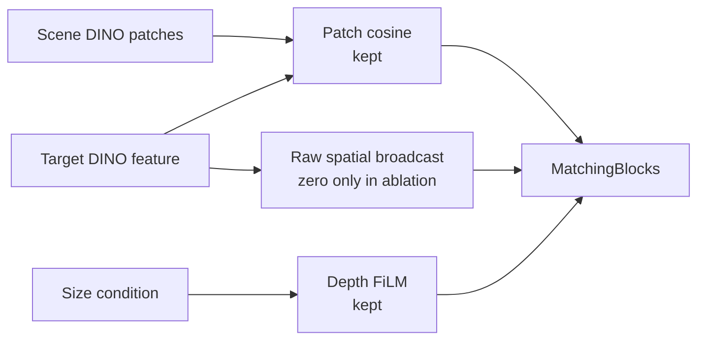

**수정:** Parameter shape와 cosine/FiLM 경로를 유지하고 raw target broadcast만 0으로 고정하는 controlled model을 구현함. 현재 코드에서 같은 seed로 생성한 raw-broadcast와 zero-broadcast 모델의 parameter shape와 초기 state가 동일함을 확인했으며 SHA-256은 `d8c3122c…f8c0`임.

**Controlled retrain 결과:** 16 epoch와 5,408 update를 모두 완료한 final checkpoint를 동일 seed의 broadcast-on reference와 비교함.

| Seed-0 fixed-update metric | Broadcast ON | No broadcast | Change |
|---|---:|---:|---:|
| Seen coverage MAE | `0.05155` | `0.08100` | `+57.1%` |
| Training-heldout coverage MAE | `0.07725` | `0.11494` | `+48.8%` |
| Heldout pooled `S > 0` | `8 / 8` | `0 / 8` | 기준 미충족 |
| Heldout camera `S > 0` | `40 / 40` | `2 / 40` | 기준 미충족 |
| `packaged_food_4` native MAE | `0.09802` | `0.22229` | `+126.8%` |
| `packaged_food_4` native bias | `−0.08694` | `−0.22058` | Underprediction 증가 |

CSV 1,680행의 composite key가 모두 고유하고, 두 checkpoint는 seed 0, epoch 15, 5,400 samples/epoch, 5,408 cumulative batches 조건을 만족함.

**판단:** No-broadcast 구성은 사전 broad gate를 만족하지 못해 seeds 1–2 확대를 진행하지 않음. 현 architecture에서 scalar cosine과 size-FiLM만 남기는 방식은 target conditioning을 충분히 유지하지 못했음. 다음 실험은 target 정보를 없애지 않으면서 absolute target code 의존을 줄이는 relation-aware interaction으로 제한함.

---

### 2026-08-21 · Phase 16 — Fresh Paired Reproducibility Gate

**문제:** 기존 broadcast-on checkpoint에는 최초 initialization과 sample-order hash가 없어, no-broadcast 성능 저하가 target 경로 제거 때문인지 과거 실행과의 차이 때문인지 완전히 분리되지 않았음.

**검증:** 현재 코드에서 broadcast-on seed 0을 `16 epoch`, `5,408 update`로 다시 학습함. 초기 state SHA-256은 `d8c3122c…f8c0`, 첫 epoch sample-order SHA-256은 `26e6843b…303b`로 기록함.

| Reproducibility check | Result |
|---|---|
| Epoch 0–15 train/validation metrics | 기존 accepted run과 전부 일치 |
| Final model-state SHA-256 | 두 모델 모두 `6354241b…55d7a` |
| State tensors | `168 / 168` bitwise identical |
| Compared parameters | `15,716,309`개 원소, mismatch `0` |
| Maximum absolute difference | `0.0` |

Checkpoint 파일 해시는 provenance metadata 추가로 서로 다르지만, 실제 추론에 쓰이는 모든 model tensor는 동일함.

**판단:** Fresh broadcast-on 재현 gate가 통과했으므로 동일 seed·초기화·sample order의 seed-0 비교에서 나타난 no-broadcast의 MAE 증가와 scale-response 약화는 code/data drift보다 raw target broadcast 제거의 영향으로 판단함. 단순 제거 실험은 종료하고, 다음 Step에서는 scene과 target의 채널별 관계를 보존하는 interaction을 동일 조건으로 비교함.

---

### 2026-08-21 · Phase 17 — Relation-Aware Target Interaction

**문제:** Scalar cosine과 size-FiLM만 남긴 no-broadcast 모델은 target 정보를 충분히 전달하지 못했음. Raw target vector를 다시 넣지 않으면서 cosine 합산 전의 채널별 관계를 보존할 방법이 필요했음.

**수정:** 기존 target 768채널 자리를 normalized channelwise product로 교체함. Scene RGB, depth FiLM, shifted cosine, MatchingBlock, parameter 수와 초기화는 그대로 유지함.

```text
q(x) = Normalize(scene_patch(x)) × Normalize(target)
r(x) = sqrt(C) × Normalize(q(x))

MatchingBlock input = [scene patch, FiLM depth, r(x), shifted cosine]
```

초기 state SHA와 sample-order SHA는 fresh raw 기준과 일치했고, parameter `15,706,689`개와 `5,408` update를 동일하게 유지함.


| Seed-0 fixed-update metric | Raw broadcast | No broadcast | Channel relation |
|---|---:|---:|---:|
| Final validation loss | `0.30448` | `0.34033` | `0.32434` |
| Final validation IoU | `0.393` | `0.250` | `0.308` |
| Seen coverage MAE | `0.05155` | `0.08100` | `0.06443` |
| Training-heldout coverage MAE | `0.07725` | `0.11494` | `0.08674` |
| Heldout pooled `S > 0` | `8 / 8` | `0 / 8` | `7 / 8` |
| Heldout camera `S > 0` | `40 / 40` | `2 / 40` | `37 / 40` |
| `packaged_food_4` native MAE | `0.09802` | `0.22229` | `0.11708` |
| `packaged_food_4` native bias | `−0.08694` | `−0.22058` | `−0.10623` |

Workspace 전체 MAE는 relation 모델에서 감소했지만, coverage 내부 MAE와 underprediction은 증가함. Workspace에는 GT가 0인 픽셀이 많아 출력을 전반적으로 낮추는 것만으로도 오차가 줄 수 있으므로 채택 근거로 사용하지 않음.

**판단:** Channel relation은 no-broadcast보다 target 조건을 많이 회복했지만 사전 safety gate와 `packaged_food_4` 개선 gate를 모두 통과하지 못함. Seeds 1–2는 실행하지 않고 raw broadcast baseline을 유지함. 이번 결과는 추가 L2 normalization까지 포함한 relation 표현 전체의 결과이므로, 다음 Step에서는 낮은 유사도의 patch도 동일한 relation energy를 갖게 되는 정규화 효과부터 분리 진단함.

---

### 2026-08-21 · Phase 18 — Relation Magnitude Diagnostic

**문제:** Phase 17의 L2 normalization은 채널별 관계 방향은 남기지만 `‖q‖`를 제거함. 이 때문에 target과 약하게 대응하는 patch도 강하게 대응하는 patch와 같은 크기의 relation feature를 받음.

쉽게 말하면 `q`는 scene과 target의 768개 channel이 위치별로 얼마나 같은 방향으로 반응했는지를 담은 목록임. `‖q‖`는 그 목록 전체의 반응 세기인데, 완전히 정규화하면 “매우 비슷함”과 “조금 비슷함”의 세기 차이가 사라질 수 있어 이 정보가 GT 설명에 도움이 되는지 먼저 확인함.

**검증:** Held-out target과 validation scene은 사용하지 않고, 학습용 10 target·36 scene·5 camera만 분석함. 같은 scene·camera·patch에서 target 평균을 제거한 뒤, cubic cosine 12개만 사용한 기준과 cosine으로 설명되지 않는 `log‖q‖` 4개를 추가한 경우를 scene 단위 6-fold로 비교함. Target 가중치는 실제 학습 sampler와 동일하게 category-balanced로 설정함.

```text
q_l(x) = Normalize(scene_l(x)) × Normalize(target_l)
r_l(x) = sqrt(C) × q_l(x) / (m_l + epsilon)
```

`m_l`은 학습 target의 실제 coverage 영역에서 계산한 layer별 `‖q_l‖` 중앙값이며, 추론 시 다시 계산하지 않는 고정값임.


| Train-only diagnostic | Result |
|---|---:|
| Coverage MAE: cubic cosine only | `0.08829` |
| Coverage MAE: + residual `log‖q‖` | `0.08583` |
| Relative improvement | `2.78%` |
| Improved scene folds | `6 / 6` |
| Scene-bootstrap 95% interval | `+2.01% – +3.46%` |
| Cosine-independent DINO layers | `4 / 4` |
| Uncalibrated `C·q` scale gate | `0 / 40` — 기준 미충족 |
| Train-median calibrated scale gate | `40 / 40` — pass |

**판단:** `‖q‖`에는 cubic cosine만으로 설명되지 않는 target-dependent GT 신호가 남아 있음. 단순 `C·q`는 feature 크기가 지나치게 커 사전 기준을 만족하지 못했으며, 대신 train-only 중앙값으로 크기만 고정한 relation을 동일 초기화·동일 sample order의 seed 0 한 번으로 평가함. 이 진단은 다음 실험을 수행할 근거이며 zero-shot 성능 증명은 아님. Seed 0이 사전 held-out 5-camera gate를 통과하기 전에는 seeds 1–2를 실행하지 않음.

---

### 2026-08-22 · Phase 19 — Magnitude-Calibrated Relation Evaluation

**문제:** Phase 18의 train-only 진단에서 relation 크기 `‖q‖`가 GT와 관련된 신호를 보였지만, 이 신호가 전체 비선형 모델의 학습·일반화까지 개선하는지는 확인되지 않았음.

**실험:** 학습 target에서 미리 계산한 layer별 중앙값 `m_l`을 고정하고, 추론 시 held-out target으로 재보정하지 않음. Raw baseline과 초기 state, sample order, `16 epoch`, `5,408 update`, dataset을 동일하게 맞춰 seed 0을 학습함.

```text
r_l(x) = sqrt(C) × q_l(x) / (m_l + epsilon)
```


| Seed-0 fixed-update metric | Raw broadcast | No broadcast | Normalized relation | Magnitude-calibrated relation |
|---|---:|---:|---:|---:|
| Seen coverage MAE | `0.05155` | `0.08100` | `0.06443` | `0.07073` |
| Training-heldout coverage MAE | `0.07725` | `0.11494` | `0.08674` | `0.09298` |
| Heldout pooled `S > 0` | `8 / 8` | `0 / 8` | `7 / 8` | `7 / 8` |
| Heldout camera `S > 0` | `40 / 40` | `2 / 40` | `37 / 40` | `34 / 40` |
| `packaged_food_4` native MAE | `0.09802` | `0.22229` | `0.11708` | `0.12220` |
| `packaged_food_4` native bias | `−0.08694` | `−0.22058` | `−0.10623` | `−0.10706` |

Magnitude-calibrated relation은 raw baseline 대비 seen coverage MAE `+37.20%`, heldout coverage MAE `+20.35%`로 악화됨. `packaged_food_4`도 5개 camera 모두에서 MAE와 bias가 개선되지 않음. Workspace MAE는 낮아졌지만, target coverage에서 underprediction이 커졌으므로 예측값 전체가 낮아진 효과로 판단함.

**판단:** Train-only 진단은 실험 후보를 거르는 용도였지만, 전체 모델의 성능 개선을 보장하지 않았음. Magnitude-calibrated seeds 1–2는 실행하지 않고 appearance interaction 변형은 종료함. Fresh raw size-only를 현재 기준 모델로 유지하며, 다음 후보는 target mask에서 계산할 수 있는 소수의 물리적 크기·형상 descriptor로 제한함.

---

### 2026-08-22 · Phase 20 — Compact Physical Shape Descriptor Gate

**문제:** Size-only의 `area·bbox_h·bbox_w`는 target의 전체 크기는 나타내지만, 같은 크기에서 모양과 질량 분포가 다른 물체를 구분하지 못함.

**수정:** Target mask에서 길쭉함 `eta`와 moment compactness `kappa` 두 값만 추가하는 후보를 설계함. 초기 구현에서 bbox를 `8 × 8` 정사각형으로 변환하며 물체의 길쭉함이 사라지는 문제를 발견함. 원래 mask 좌표계의 bbox 크기를 복원해 moment를 계산하도록 수정한 후 재검증함.

```text
eta   = (lambda_max - lambda_min) / (lambda_max + lambda_min)
kappa = mask_area / (2*pi*(lambda_max + lambda_min))
```

이 단계는 full model 학습이 아니라 descriptor가 다음 학습 후보로서 가치가 있는지 저렴하게 확인하는 train-only screening임. 학습 10 target·36 scene·3 scale·5 camera만 사용하고, target 하나를 donor에서 완전히 제외한 leave-one-target-out 비교를 수행함. Held-out 4 target과 validation scene은 사용하지 않았으며, shape를 같은 category의 다른 target과 바꾸는 64개 대조 조건도 같이 계산함.


| Train-only gate | Result | Required |
|---|---:|---:|
| Pooled coverage MAE | `0.09114 → 0.07748` (`14.99%` 개선) | `≥ 2%` 개선 |
| Improved targets | `5 / 10` | `≥ 8 / 10` |
| Improved categories | `2 / 4` | `4 / 4` |
| Improved cameras | `5 / 5` | `5 / 5` |
| Improved target-camera cells | `27 / 50` | `≥ 40 / 50` |
| Improved target-camera-scale cells | `78 / 150` | `≥ 120 / 150` |
| Worst scale-cell regression | `+320.67%` | `≤ +5%` |

Fruit은 category MAE `17.20%`, toy는 `43.84%` 개선됐지만 book은 `7.78%`, packaged food는 `13.22%` 악화됨. 전체 평균 개선은 특정 category의 큰 이득이 만든 결과이며, 새 target에 공통으로 적용되는 물리 규칙으로 보기 어려움.

**판단:** `eta·kappa`는 category별 결과가 일관되지 않아 full-model 후보에서 제외함. Seed 0–2는 실행하지 않고 fresh raw size-only를 기준 모델로 유지함. 다음에는 2D mask descriptor를 더 늘리지 않고, 3D target extent가 잔여 target effect를 설명할 수 있는지 oracle 진단으로 먼저 확인함.

---

### 2026-08-22 · Phase 21 — Exact 3D Extent Diagnostic

**문제:** 2D mask의 면적과 bbox는 camera에 보이는 크기만 나타냄. 같은 투영 크기라도 실제 높이와 바닥 면적이 다르면 물체 더미에 의해 완전히 가려질 수 있는 위치가 달라지므로, 이 3D 차이가 남은 target 오차의 원인인지 확인할 필요가 있었음.

**검증:** GT 생성에 실제 사용한 mesh에서 `가로 최소 길이·가로 최대 길이·높이`를 추출함. 이 단계도 full model 학습 전에 “실제 3D 크기를 알면 비슷한 train target의 GT 차이를 더 잘 설명할 수 있는가?”를 묻는 screening임. 이 값은 최종 배포 입력이 아니라 정보 유효성만 확인하는 진단용 oracle임. 학습 10 target·36 scene·3 scale·5 camera만 사용했으며, query target을 donor와 정규화 통계에서 완전히 제외함.

```text
extent3(s) = s × [min(dx, dy), max(dx, dy), dz]
```

같은 category의 다른 target extent를 넣는 64개 wrong-extent 대조 조건도 함께 계산함.


| Train-only diagnostic | 2D shape | Exact 3D extent |
|---|---:|---:|
| Pooled coverage MAE | `0.09114 → 0.07748` | `0.09114 → 0.06927` |
| Relative improvement | `14.99%` | `23.99%` |
| Improved targets | `5 / 10` | `9 / 10` |
| Improved categories | `2 / 4` | `4 / 4` |
| Improved cameras | `5 / 5` | `5 / 5` |
| Improved target-camera cells | `27 / 50` | `36 / 50` |
| Improved target-camera-scale cells | `78 / 150` | `100 / 150` |
| Meaningful worst regression | `+320.67%` | `없음` |

3D extent의 scene-bootstrap 95% interval은 `+23.12% – +24.80%`였고, wrong-extent 대조 조건의 최대 개선은 `1.17%`에 그침. 따라서 실제 3D 크기에 target별 GT를 설명하는 정보가 있음을 확인함.

다만 사전에 고정한 cell 개선 수 기준 `40/50`, `120/150`에는 각각 `36/50`, `100/150`으로 미달함. 남은 cell은 악화가 아니라 hard 3-NN에서 donor 구성이 바뀌지 않아 생긴 동률이지만, 결과를 본 뒤 기준을 바꾸지 않고 사전 기준 미충족으로 기록함.

**판단:** 이 결과를 zero-shot 성능이나 최종 구조의 통과로 해석하지 않음. 다음 Step은 raw size-only와 구조·초기값·sample order·update 수를 같게 유지한 seed-0 모델에서 exact extent 3개만 추가하는 controlled oracle ablation임. 이 모델이 기존 5-camera coverage·scale-response gate를 통과할 때만 RGB/multi-view 기반 3D 크기 추정 방법을 개발함.

---

### 2026-08-22 · Phase 22 — Exact 3D Extent Controlled Model

**문제:** Phase 21은 3D 크기 정보가 GT 차이를 설명할 수 있다는 진단이었으며, 실제 모델이 그 정보를 올바르게 사용하는지는 확인하지 못함.

**통제 실험:** Target mesh의 exact extent를 geometry conditioning에 추가함.

```text
extent3(s) = s × [min(dx, dy), max(dx, dy), dz]
F_depth'   = gamma(extent3) × F_depth + beta(extent3)
```

Raw size-only 기준 모델과 seed·초기 가중치·sample 순서·학습 횟수(`5,408` update)를 동일하게 유지함. Train 10 target의 통계만 이용해 정규화하고, fixed epoch 15에서 14 target·16 validation scene·5 camera를 비교함. Exact extent는 정보 유효성을 확인하기 위한 simulation oracle이며 실제 배포 입력은 아님.

| 평가 영역 | Raw size-only | Exact extent + global FiLM | 변화 |
|---|---:|---:|---:|
| 전체 target coverage MAE | `0.05838` | `0.05803` | `0.60%` 개선 |
| 전체 workspace MAE | `0.13745` | `0.15581` | `13.36%` 악화 |
| Train target coverage MAE | `0.05155` | `0.05587` | `8.38%` 악화 |
| Held-out target coverage MAE | `0.07725` | `0.06399` | `17.16%` 개선 |
| Held-out target workspace MAE | `0.16094` | `0.17477` | `8.59%` 악화 |

Held-out target의 scale-response 방향은 `8/8` target-scale과 `40/40` camera에서 양수였음. 이는 변화 방향이 맞다는 뜻이며 raw보다 더 좋아졌다는 뜻은 아님. Coverage와 workspace를 함께 보는 사전 평가 기준은 충족하지 못함.

**원인 분리:** 같은 checkpoint에서 scene RGB-D·target RGB·2D 크기·camera·scale·GT를 고정하고, exact extent 세 값만 같은 category의 다른 target 값으로 교체함. 모델 재학습은 수행하지 않음.


| Frozen intervention, held-out target | Correct extent − wrong extent | 결과 |
|---|---:|---|
| Target coverage MAE | `-0.03468` | Target-camera 평균 `20/20`에서 correct extent 우세 |
| Scale-response `S` | `+0.09249` | Target-camera 평균 `20/20`에서 correct extent 우세 |
| Workspace 안·coverage 밖 MAE | `+0.04232` | Target-camera 평균 개선 `10/20` |

Correct extent는 held-out target에서도 coverage 예측과 크기 변화 반응을 일관되게 개선함. 따라서 모델이 3D 크기 정보를 실제로 사용한다는 점은 확인됨. 반면 `book_4·fruit_4`는 coverage 밖 오차도 감소했지만, `toy_4·packaged_food_4`는 5개 camera 모두 증가함. 가장 가까운 wrong extent만 사용한 비교에서도 같은 경향이 남아 극단적인 교체값 때문으로 보기 어려움.

**판단:** 이번 exact-extent 경로에서 관찰된 leakage는 하나의 extent vector로 전체 depth feature에 같은 `gamma·beta`를 적용하는 global FiLM과 연결되어 있었음. Target이 물체 더미에 의해 가려질 수 있는 영역은 개선했지만, workspace 안에서도 해당 target이 존재할 수 없어 GT가 0인 위치까지 함께 활성화함. 이 실험만으로 DINOv3 정보가 충분하다고 결론 내리지는 않음.

현재 global-FiLM 구성은 후속 seed로 확대하지 않고, RGB 기반 3D 크기 추정기 개발도 보류함. 다음 실험에서는 exact extent를 계속 oracle로 사용하되, `local depth feature × extent`로 patch별 bounded residual을 만들고 residual을 0으로 초기화해 raw baseline에서 시작함. 동일한 seed-0 조건에서 coverage·coverage 밖 오차·scale-response·현재 고정 rig의 5-camera 결과가 함께 개선될 때만 다음 Step으로 진행함.

---

### 2026-08-24 · Phase 23 — Local Bounded Extent Interaction

**문제:** Global FiLM은 target 크기로 만든 같은 조절값을 모든 scene patch에 적용함. Target이 물체 더미에 의해 가려질 수 있는 영역은 찾았지만, 서랍 안에서 해당 target이 가려질 후보가 없는 위치도 함께 밝아지는 leakage가 발생함.

**방법:** Exact extent와 각 위치의 depth feature를 함께 보고 위치별 gate를 계산하도록 변경함.

```text
Global: target extent ─────────────→ 모든 위치에 같은 gamma, beta
Local : target extent + D(x,y) ───→ 위치별 gate g(x,y) ─→ bounded residual

D'(x,y) = D(x,y) + 0.25 × g(x,y) × learned_correction(x,y)
```

`g(x,y)`는 현재 위치의 depth 구조가 target 크기와 맞는 정도를 `0–1`로 나타냄. `0.25`는 depth feature를 수정하는 residual branch의 세기를 제한하는 값이며, 최종 occlusion probability를 25%로 제한한다는 뜻은 아님. Residual은 0에서 시작하므로 학습 전 출력은 raw baseline과 정확히 같음. Seed·초기 가중치·sample 순서·`5,408` update와 exact extent 입력은 Phase 22와 동일하게 유지함.

아래 MAE는 예측 map과 GT의 평균 절대 차이이며 `0`에 가까울수록 좋음. `Coverage`는 target이 물체 더미에 의해 가려질 수 있는 영역의 정확도, `Impossible-to-occupy workspace`는 target이 가려질 후보가 없는 위치의 잘못된 활성화, `Whole workspace`는 두 영역을 함께 평가함.


| 전체 14 target | Raw size-only | Exact extent + global FiLM | Exact extent + local bounded |
|---|---:|---:|---:|
| Coverage MAE | `0.05838` | `0.05803` (`0.60%` 개선) | `0.05741` (`1.67%` 개선) |
| Whole-workspace MAE | `0.13745` | `0.15581` (`13.36%` 악화) | `0.13077` (`4.86%` 개선) |
| Impossible-workspace MAE | `0.20853` | `0.24371` (`16.87%` 악화) | `0.19671` (`5.67%` 개선) |

Local 방식은 global FiLM의 평균 leakage를 줄이고 raw보다도 세 영역 모두 개선함. Training-heldout 4개 target 평균에서도 coverage `13.33%`, workspace `9.13%`, impossible-workspace `8.01%` 개선함. 크기 변화에 출력이 같은 방향으로 반응하는지는 `8/8` target-scale과 `40/40` camera에서 유지되어, 현재 고정 rig의 다섯 view에서 같은 방향의 신호를 확인함. 이 수치는 raw 대비 개선이 아니라 scale 변화 방향이 양수였다는 뜻임.

**판단:** 평균 개선만으로 모델을 채택하지 않음. Raw 대비 `book_4` scale-response가 `-0.062`, `-0.054` 감소하여 사전 기준 `-0.05`를 넘었고, `packaged_food_4`의 impossible-workspace MAE는 `30.29%` 악화함. Seen-target coverage도 `4.65%` 악화하여 seed-0 사전 기준을 만족하지 못함.

따라서 local interaction이 global 방식보다 평균적인 공간 제어를 개선할 가능성은 확인했지만, target별 사전 기준을 만족하지 못해 이 상태로 seed를 확대하지 않음. RGB 기반 extent estimator도 아직 실행하지 않음. 다음 Step은 같은 frozen checkpoint에서 extent만 올바른 값과 같은 category의 다른 값으로 교체해 원인을 분리하고, gate와 residual이 coverage 안팎을 실제로 구분하는지 확인하는 것임.

**Frozen 후속 진단:** 재학습 없이 scene RGB-D·target appearance·GT를 고정하고 extent만 교체함. Held-out 평균에서 correct extent는 wrong extent보다 coverage MAE를 `0.03267` 낮추고 scale-response를 `0.12590` 높였지만, impossible-workspace MAE는 `0.02811` 높였음. 즉 3D 크기 정보는 실제로 사용되지만 유용한 영역과 잘못된 영역을 동시에 활성화함.


Gate가 위치를 실제로 거르는지 확인하기 위해 target이 도달 가능한 patch와 불가능한 patch를 분리함. 네 held-out target의 평균 gate는 가능한 영역 `0.974–0.988`, 불가능한 영역도 `0.943–0.972`였음. `0`이면 닫힘, `1`이면 완전히 열림이므로 두 영역에서 거의 항상 열린 상태임. 따라서 residual 크기는 제한됐지만, 공간을 선택하는 gate는 충분히 작동하지 않았음.

축별 교체에서는 `book_4`의 올바른 높이 값이 scale-response를 `0.021` 낮추고, `toy_4`의 수평 크기는 scale-response를 `0.213` 높이는 대신 impossible-workspace MAE를 `0.081` 높였음. 하나의 벡터에서 수평 크기와 높이를 함께 처리하면서 역할이 얽힌 것도 확인함.

**다음 Step:** Noncoverage loss를 바로 추가하면 이전 ring-loss처럼 크기 변화 반응까지 억제할 수 있어 보류함. 먼저 parameter 수와 초기 출력을 유지한 채, 포화되는 sigmoid dot-product를 channel-normalized local similarity로 교체하는 seed-0 실험을 수행함. 이 변경으로 leakage가 줄어도 `book_4` 역반응이 남으면 수평 크기와 높이 conditioning을 분리함.

---

### 2026-08-24 · Phase 24 — Regularized Local-Confidence Gate

**왜 이 실험을 했는가:** Phase 23의 gate는 target이 물체 더미에 의해 가려질 수 있는 patch뿐 아니라 가려질 후보가 없는 patch에서도 거의 `1`이었음. 문이 항상 열려 있으므로 local interaction이라는 이름과 달리 target 크기 보정이 서랍 전체로 퍼졌음. 이번 실험은 모델을 더 크게 만드는 대신, gate가 쉽게 포화되지 않도록 계산 방식만 바꿔 원인을 분리함.

각 scene patch의 depth encoder 출력 `D(x,y)`는 `256`개 숫자로 된 특징임. 이 숫자들은 각각 높이·모서리처럼 사람이 미리 의미를 정한 값이 아니라, ResNet-18이 함께 학습한 local depth pattern 반응임. Target의 exact 3D extent도 작은 network를 거쳐 같은 길이의 보정 방향 `q`로 바뀜. 두 벡터가 같은 방향인지 비교하여 위치별 gate를 계산함.

```text
한 scene patch의 depth 특징 D(x,y): 256개 숫자
target 크기가 요구하는 보정 방향 q: 256개 숫자

D(x,y)와 q의 방향 비교 ─→ local confidence g(x,y)
                              0: 보정하지 않음
                              1: target 크기 보정을 강하게 사용

D'(x,y) = D(x,y) + 0.25 × g(x,y) × size_correction(x,y)
```

이는 표준 cosine이 아니라 **regularized cosine-like confidence**임. Target 보정 벡터가 커지는 것만으로 gate가 `1`에 붙지 않도록 채널 수 `C=256`을 분모에 포함함. `sqrt(C)`는 256개 채널의 평균 크기가 약 `1`일 때를 기준으로 삼는 고정값이며, held-out 결과를 보고 조정한 hyperparameter가 아님. Seed·초기 가중치·sample 순서·loss·`5,408` update는 이전 실험과 같고, automated assertions로 초기 상태와 sample 순서도 확인하여 gate 계산만 비교함.


| 전체 14 target | Raw size-only | Local sigmoid | Local confidence | 해석 |
|---|---:|---:|---:|---|
| Coverage MAE | `0.05838` | `0.05741` | `0.05840` | Target이 물체 더미에 의해 가려질 수 있는 영역은 raw와 사실상 같음 |
| Whole-workspace MAE | `0.13745` | `0.13077` | `0.12122` | 서랍 전체의 평균 오차는 raw보다 `11.81%` 감소 |
| Impossible-workspace MAE | `0.20853` | `0.19671` | `0.17768` | 가려질 후보가 없는 위치의 잘못된 활성화는 평균 `14.79%` 감소 |

평균 leakage는 줄었지만, 이것만으로 새 구조를 채택하지 않음. Held-out `book_4`의 두 scale-response는 raw보다 `0.159`, `0.088` 감소했고, `packaged_food_4`는 coverage가 좋아지는 대신 whole-workspace와 impossible-workspace 오차가 각각 `22.04%`, `44.61%` 증가함. 즉 일부 target의 큰 개선이 전체 평균을 낮췄으며, 반복 사용한 네 development-heldout target에서도 일관된 개선을 확인하지 못함.

Frozen 진단에서 gate의 `0.95` 초과 비율은 기존 `66–97%`에서 `0%`로 줄어 구조적 포화는 크게 감소함. 그러나 도달 가능한 patch와 불가능한 patch의 평균 gate 차이는 target별 `0.005–0.014`에 불과했음. Gate 값은 안정됐지만 **어디를 열고 닫아야 하는지 학습하지 못한 것**이 남은 핵심 문제임. 해당 frozen correct/wrong-extent intervention에서 toy와 packaged food의 extent 입력은 coverage 오차를 줄이는 동시에 impossible-workspace 오차를 각각 약 `0.108`, `0.117` 높이는 방향에 직접 관여함.

Exact extent는 물체 이름이 아니라 실제 크기이므로 원리상 unseen target에도 적용 가능한 정보임. 다만 현재 값은 mesh에서 얻은 진단용 oracle이므로 이 결과는 zero-shot 성능을 증명하지 않음. Oracle 구조가 먼저 모든 target에서 안정적으로 작동한 뒤에만 target RGB/mask로 크기를 추정하는 배포 입력으로 교체함.

**판단 및 다음 Step:** Seed 0의 사전 기준을 만족하지 못해 seed 1–2 확대는 진행하지 않음. 다음 실험은 최종 probability map을 직접 누르는 ring loss가 아니라 gate 자체만 감독함. Target이 물체 더미에 의해 가려질 수 있는 순수 patch에는 gate가 열리고, workspace 안이지만 가려질 후보가 없는 순수 patch에는 닫히도록 balanced auxiliary loss를 추가함. 경계가 섞인 patch는 제외하고 `lambda_gate=0.05`의 단일 seed-0 통제 실험만 수행함. 이 방식은 occlusion 확률을 맞히는 본래 head의 역할을 유지하면서, gate에 부족했던 공간적 역할만 명시함.

---

### 2026-08-24 · Phase 25 — Strict Gate-Localization Supervision

**왜 이 방법을 사용했는가:** Phase 24의 gate 값은 안정됐지만 열어야 할 곳과 닫아야 할 곳을 구분하지 못했음. 최종 probability map의 loss만 사용하면 뒤쪽 MatchingBlock이 오차를 대신 줄일 수 있어 gate가 의도한 역할을 배우지 않아도 됨. 따라서 최종 출력을 직접 0으로 누르는 기존 ring loss 대신, gate에만 위치 역할을 알려주는 보조 loss를 사용함.

```text
Target이 물체 더미에 의해 가려질 수 있는 순수 patch → gate를 1에 가깝게 학습
서랍 안이지만 가려질 후보가 없는 순수 patch          → gate를 0에 가깝게 학습
두 영역이 섞인 경계 patch              → 보조 loss에서 제외

전체 loss = 기존 probability-map loss + 0.05 × balanced gate loss
```

두 영역의 patch 수가 달라도 한쪽이 loss를 지배하지 않도록 각각 평균한 뒤 `1:1`로 합침. `0.05`는 결과를 보고 고른 값이 아니라 실험 전에 고정했으며, validation과 checkpoint 선택은 기존 probability-map loss만 사용함. Seed·초기 state·sample 순서·`5,408` update와 exact-extent oracle 입력도 이전 실험과 같게 유지함.


| 전체 14 target | Raw size-only | Gate supervision | 의미 |
|---|---:|---:|---|
| Coverage MAE | `0.05838` | `0.05153` | Target이 물체 더미에 의해 가려질 수 있는 영역의 오차 `11.73%` 감소 |
| Whole-workspace MAE | `0.13745` | `0.07538` | 서랍 전체 오차 `45.16%` 감소 |
| Impossible-workspace MAE | `0.20853` | `0.09682` | 잘못 밝아지는 leakage `53.57%` 감소 |

보조 loss가 없는 동일 gate 모델과 비교해도 coverage·workspace·impossible-workspace MAE가 각각 `11.76%`, `37.81%`, `45.51%` 감소함. 동일 seed·초기 state·sample order의 controlled seed-0 비교에서는 gate localization supervision 추가와 평균 개선이 함께 나타남. 다중 seed 일반화는 아직 확인하지 않음.

Frozen 진단에서도 변화가 확인됨. 보조 loss가 없을 때 가능한 영역과 불가능한 영역의 gate 차이는 `0.005–0.014`였지만, 학습 후에는 target별 `0.580–0.695`로 커짐. 가능한 영역의 평균 gate는 `0.797–0.860`, 불가능한 영역은 `0.166–0.217`이므로 현재 oracle coverage 정의와 고정 rig의 development target에서 gate가 위치 분리를 학습했음을 확인함.

**남은 문제:** 평균 결과는 크게 좋아졌지만 사전에 정한 모든 기준을 통과하지는 못함. 현재 고정 rig의 다섯 camera에서 scale-response 자체는 `40/40` 모두 양수였으나, `book_4`의 `0.85/1.15` scale 반응은 raw보다 각각 `0.118`, `0.130` 약해져 허용선 `-0.05`를 넘음. 결과를 본 뒤 기준을 완화하지 않고 seed-0 사전 기준 미충족으로 기록함.

축별 frozen intervention에서 book의 수평 크기 축을 교체했을 때 scale-response 변화는 `+0.005`로 거의 중립이었지만, 높이 축 교체는 `-0.131`의 변화를 만들었음. 반대로 높이 축은 coverage와 impossible-workspace MAE를 각각 약 `0.016`, `0.031` 줄여 단순히 제거할 정보도 아님. 즉 현재 하나의 FiLM/gate가 수평 footprint와 높이의 서로 다른 역할을 함께 처리하는 것이 남은 병목임.

Exact extent와 coverage label은 USD/GT에서 얻은 simulation oracle임. 물체 category 이름을 gate에 주지는 않으므로 크기와 local depth의 관계를 배우는 zero-shot 가설에는 맞지만, 아직 target RGB만 사용하는 배포형 zero-shot을 증명한 결과는 아님.

**판단 및 다음 Step:** 평균 개선과 gate localization은 유지할 가치가 있지만, 현 모델을 최종 candidate로 확정하지 않음. Seeds 1–2와 RGB extent estimator는 계속 보류함. 수평 footprint는 물체가 차지할 바닥 면적에, 높이는 위쪽 공간과 가려짐 깊이에 주로 영향을 주므로 다음에는 두 값을 별도 conditioning 경로로 분리함. 동일 gate supervision을 유지한 seed-0 실험 하나에서 book 반응을 확인하고, 회복되지 않으면 architecture 확장을 중단한 뒤 scale-paired objective 또는 GT의 book-height 정의를 다시 검토함.

---

### 2026-08-24 · Phase 26 — Footprint Gate / Height Residual Separation

**왜 이 실험을 했는가:** Phase 25는 gate의 위치 분리를 학습했지만, 얇고 넓은 `book_4`의 scale 반응은 여전히 약했음. 하나의 exact-extent 벡터가 “어디에서 target이 물체 더미에 의해 가려질 수 있는가”와 “그 안에서 높이 차이를 얼마나 반영할 것인가”를 동시에 결정한 것이 원인인지 확인함.

68개 입력 칸 중 실제로 사용하는 여섯 값의 역할을 다음처럼 나눔.

```text
area, bbox h/w, 짧은·긴 가로 길이 ─→ footprint gate g_F(x,y)
높이                                  ─→ 열린 영역 안의 보정 강도

D'(x,y) = D(x,y) + 0.25 × g_F(x,y) × height-aware correction
```

Footprint는 target이 영상에서 차지하는 크기와 바닥 방향 길이를 나타내므로 gate의 위치를 정함. 높이는 gate를 새로 열 수 없고, footprint gate가 허용한 위치 안에서만 depth 보정량에 관여함. 새 network를 추가하면 모델 크기 차이가 결과에 섞이므로 기존 `GeometryFiLM` 하나를 세 번 공유해 footprint·height·zero 입력을 분리함. 그 결과 파라미터 수, state key, 초기 가중치, 첫 epoch sample 순서와 총 `5,408` update는 Phase 25와 동일함. 자동 테스트로 높이를 바꿔도 gate가 bitwise 동일하고, footprint를 바꾸면 gate가 변하며, 사용하지 않는 62개 칸은 출력에 영향을 주지 않음을 확인함.


| 전체 14 target | Raw size-only | Phase 25 | Phase 26 | 의미 |
|---|---:|---:|---:|---|
| Coverage MAE | `0.05838` | `0.05153` | `0.05461` | Raw보다 `6.45%` 낮지만 Phase 25보다는 높음 |
| Whole-workspace MAE | `0.13745` | `0.07538` | `0.07276` | Raw보다 `47.07%`, Phase 25보다 `3.48%` 낮음 |
| Impossible-workspace MAE | `0.20853` | `0.09682` | `0.08907` | Raw보다 `57.29%`, Phase 25보다 `8.00%` 낮음 |

Gate 역할 분리는 실제 checkpoint에서도 유지됨. 네 development-heldout target에서 target이 물체 더미에 의해 가려질 수 있는 순수 영역의 평균 gate는 `0.798–0.865`, 가려질 후보가 없는 영역은 `0.128–0.183`이었음. 모든 scale과 다섯 camera에서 예측 반응 방향은 `40/40` 양수였음.

그러나 핵심 사전 기준은 충족하지 못함. `book_4 ×0.85/×1.15`의 raw 대비 `ΔS`는 Phase 25의 `-0.118/-0.130`에서 `-0.094/-0.052`로 회복됐지만, 두 값 모두 허용선 `-0.05`를 넘지 못함. Held-out median `ΔS=-0.010`과 다른 held-out target의 native coverage 안전 기준도 충족하지 못했으며, `book_4` native coverage MAE는 raw보다 `10.3%` 높았음. 결과를 본 뒤 기준을 완화하지 않고 seed-0 사전 기준 미충족으로 기록함.

Frozen identity 진단에서는 Phase 26의 local residual을 끄면 `book_4` coverage MAE가 평균 `0.0128` 낮아졌음. 즉 현재 남은 문제는 gate가 잘못된 위치를 여는 것이 아니라, 올바르게 열린 영역 안에서 book의 크기 변화에 적용하는 보정 방향과 크기가 부정확한 것임.

**판단 및 다음 Step:** Seeds 1–2와 RGB 기반 extent estimator는 계속 보류하고, 구조를 더 키우지 않음. 현재 loss는 각 scale의 map을 따로 맞히므로 평균 오차를 낮추면서도 같은 scene에서 scale에 따른 변화량을 충분히 보존하지 못할 수 있음. 다음에는 train target의 동일 scene·camera에서 두 scale을 짝지어 `예측 map 변화량`과 `GT map 변화량`을 직접 비교하는 scale-paired loss를 추가함. Held-out target은 loss 설계나 가중치 선택에 사용하지 않음.

---

### 2026-08-24 · Phase 27 — Train-Only Scale-Paired Loss and BatchNorm Diagnosis

**왜 이 실험을 했는가:** 기존 loss는 scale `0.7`, `1.0`, `1.3`의 probability map을 각각 맞히지만, 같은 scene에서 target 크기가 바뀔 때 map이 **어떻게 달라져야 하는지**는 직접 비교하지 않음. 이 때문에 평균 map 오차를 낮추면서도 크기 변화가 예측에 충분히 반영되지 않을 가능성을 확인하고자 함.

같은 `target–scene–camera`의 세 scale을 한 묶음으로 불러오고, 인접한 두 scale의 예측 변화와 GT 변화를 비교함.

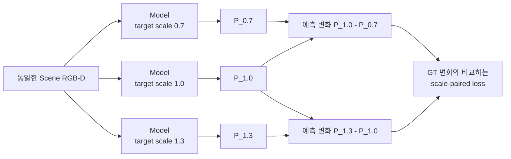

```text
ΔP = P(s₂) - P(s₁)                 예측 map이 scale에 따라 변한 양
ΔG = G(s₂) - G(s₁)                 GT map이 scale에 따라 변해야 하는 양

L_pair = Σ|ΔP - ΔG| / (Σ|ΔG| + ε)
L_total = L_map + 0.05 L_gate + 0.008902 L_pair

S = 1 - L_pair
```

`S=1`이면 scale에 따른 공간 변화가 GT와 같고, `S=0`이면 예측이 scale 변화를 사실상 무시한 수준임. 음수이면 변화를 넣지 않은 것보다 오차가 더 큼. `0.008902`는 held-out 결과를 보고 고른 값이 아니라, train target의 gradient에서 paired 항의 크기가 기존 loss의 약 `10%`가 되도록 한 번 계산해 고정함.

#### 첫 통제 실험

Phase 26, paired loader만 사용한 `λ=0` control, paired loss를 추가한 candidate를 같은 seed·초기화·16 epoch·`5,408` update로 비교함. 개발용 held-out 4 target은 읽지 않고, 학습에 사용한 10 target과 학습에 사용하지 않은 validation scene 16개만 다섯 camera에서 평가함.

| Fixed epoch 15 | Coverage MAE ↓ | Workspace MAE ↓ | Noncoverage MAE ↓ | `S` 0.7→1.0 ↑ | `S` 1.0→1.3 ↑ |
|---|---:|---:|---:|---:|---:|
| Phase 26 | `0.04956` | `0.07058` | `0.09052` | `0.3517` | `0.4466` |
| Paired-loader control | `0.06429` | `0.07958` | `0.09409` | `0.3332` | `0.4067` |
| Scale-paired candidate | `0.07764` | `0.07335` | `0.06929` | `0.3018` | `0.3546` |

Candidate의 train paired error는 낮아졌지만 validation scene에서는 두 `S`가 모두 감소했고, center/top/left/right/bottom 전체에서 같은 경향을 보임. 따라서 특정 camera 문제가 아님. 또한 loss가 없는 paired-loader control도 Phase 26보다 나빠져, paired loss뿐 아니라 batch 구성이 함께 영향을 준다는 점을 확인함.

```text
기존 batch          : 서로 독립적인 depth frame 16개
scale-paired batch  : 서로 다른 depth frame 5~6개 × 같은 frame의 scale 조건 3개
                      └─ ResNet-18 BatchNorm에는 같은 scene depth가 세 번 반복됨
```

BatchNorm은 학습 중 depth feature의 평균과 분산을 저장하고, 추론 때 그 값으로 feature 범위를 맞춤. Scale-paired batch는 실제 tensor 수가 15–18개여도 서로 다른 depth는 5–6개뿐이므로, 기존 batch와 다른 통계가 저장될 수 있음.

#### BatchNorm 통계만 분리한 진단

모델 가중치는 그대로 두고 `36 train scenes × 5 cameras = 180`개의 고유 depth frame으로 ResNet-18의 BatchNorm 평균·분산만 공통 재계산함. Validation scene, held-out target, GT는 사용하지 않았으며, 자동 검사에서 학습 파라미터는 바뀌지 않고 BatchNorm buffer 60개만 변경됨.

| BN 재계산 후 fixed checkpoint | Coverage MAE ↓ | Workspace MAE ↓ | Noncoverage MAE ↓ | `S` 0.7→1.0 ↑ | `S` 1.0→1.3 ↑ |
|---|---:|---:|---:|---:|---:|
| Phase 26 | `0.04772` | `0.06833` | `0.08789` | `0.3585` | `0.4542` |
| Paired-loader control | `0.05432` | `0.07487` | `0.09435` | `0.3651` | `0.4443` |
| Scale-paired candidate | `0.05252` | `0.06403` | `0.07494` | `0.3888` | `0.4613` |

BN 통계를 맞추자 candidate는 Phase 26보다 두 scale 구간의 `S`가 높아지고, 전체 10개 `scale transition × camera` 비교 중 9개에서 개선됨. Workspace와 noncoverage MAE도 각각 약 `6.3%`, `14.7%` 낮아짐. 즉 paired loss의 scale 신호는 일부 존재하며, 처음 관측한 후반 악화의 큰 부분은 반복 scene으로 만들어진 BN 통계와 관련 있음.

그러나 coverage MAE는 `0.04772 → 0.05252`로 약 `10.1%` 증가하여 사전 허용선 `2%`를 충족하지 못함. Coverage 평균 예측은 `0.2514`, 평균 GT는 `0.2485`로 전역 bias가 작았음. 평균값은 맞는데 MAE가 높다는 것은 단순히 map 전체가 너무 밝거나 어두운 문제가 아니라, **coverage 안에서 높은 확률과 낮은 확률을 배치하는 공간 패턴이 더 부정확해졌다는 뜻**임. 따라서 output bias나 threshold만 조절해서 해결할 수 없음.

Validation loss가 가장 낮은 checkpoint도 별도 민감도 분석을 수행했지만, fixed epoch 결과를 사후에 교체하는 근거로 사용하지 않음. 최종 untouched target은 계속 열지 않았으며, seed 1–2 확대와 `λ` sweep도 진행하지 않음.

**판단 및 다음 Step:** Scale-paired loss가 전혀 작동하지 않는 것은 아니지만, 현재 학습 방식은 scale 반응을 얻는 대신 coverage 내부 공간 정확도를 일부 희생함. 다음에는 Phase 26 checkpoint에서 정확히 한 epoch만 이어 학습하고, BatchNorm의 running mean/variance를 고정한 상태에서 `λ=0`과 `λ=0.008902`를 같은 `338` update로 비교함. 이 최소 실험으로 training-time BN 영향과 paired loss 자체의 공간 trade-off를 분리함. 두 scale 구간의 `S`가 모두 개선되고 coverage MAE 증가가 `2%` 이내일 때만 더 긴 재학습으로 확장함.

---

### 2026-08-25 · Phase 28 — BatchNorm-Frozen One-Epoch Comparison

**왜 이 실험을 했는가:** Phase 27의 BN 재계산은 학습이 끝난 모델의 통계까지 다시 바꿨으므로, paired loss 자체의 효과와 training-time BatchNorm 효과가 완전히 분리되지 않았음. Phase 26의 동일 checkpoint에서 fresh Adam으로 한 epoch만 이어 학습하고, 두 모델 모두 BN의 running mean/variance를 고정함. BN의 학습 가능한 scale·bias는 유지하고 sample 순서와 `338` update도 같게 맞춤.

| Phase 26에서 1 epoch 연장 | Coverage MAE ↓ | Workspace MAE ↓ | Noncoverage MAE ↓ | `S` 0.7→1.0 ↑ | `S` 1.0→1.3 ↑ |
|---|---:|---:|---:|---:|---:|
| Paired loss 없음 | `0.06077` | `0.07547` | `0.08942` | `0.3431` | `0.4106` |
| Paired loss 사용 | `0.05727` | `0.07772` | `0.09712` | `0.3626` | `0.4405` |

Paired loss를 사용하면 5개 camera × 2개 scale 구간의 `10/10`에서 `S`가 높아졌지만, paired loss가 없는 control보다 noncoverage MAE가 `8.61%` 증가함. 두 checkpoint의 BN buffer는 동일하므로 이 leakage는 저장된 BN 통계 차이로 설명되지 않음.

원인은 paired loss가 **scale 사이의 차이**만 본다는 점임. 세 출력에 같은 잘못된 값 `c`가 더해져도 `c`는 서로 상쇄됨.

```text
(P_1.0 + c) - (P_0.7 + c) = P_1.0 - P_0.7
```

기존 map loss도 target coverage 안에서만 계산하므로, 어떤 scale에서도 target이 덮지 않는 workspace의 공통 출력을 직접 감독하지 않았음.

**다음 Step:** Scale 변화가 생기는 footprint와 경계는 건드리지 않고, 모든 scale에서 coverage가 없는 순수 workspace의 공통 출력만 0에 가깝게 만드는 anchor를 추가함.

---

### 2026-08-25 · Phase 29 — Strict Common-Mode Anchor and Low-LR Continuation

**왜 이 방법을 사용했는가:** Paired loss는 `scale별 차이`를 학습하고, common-mode anchor는 `세 scale에 공통으로 남는 잘못된 밝기`를 제거함. 두 loss가 서로 다른 문제를 담당하도록 영역을 엄격히 분리함.

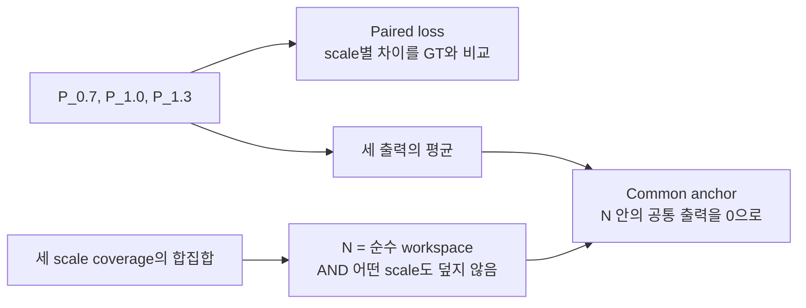

```text
N = pure_workspace AND no_coverage_at_any_scale
L_common = mean over N of |(P_0.7 + P_1.0 + P_1.3) / 3|
```

한 scale이라도 target footprint가 닿는 patch는 `N`에서 제외함. 따라서 크기가 달라지며 이동하는 경계를 억제했던 과거의 per-scale ring 방식과 다름. Loss weight는 validation이나 held-out 결과를 보지 않고 train-only 8개 batch의 gradient 크기로 한 번 고정함.

Learning rate `1e-3`에서는 leakage와 `S`가 개선됐지만 Phase 26 대비 coverage MAE가 `6.38%` 증가해 사전 허용선 `2%`를 충족하지 못함. Loss와 weight는 그대로 두고 learning rate만 `1e-4`로 낮춰, 기존 공간 map을 크게 바꾸지 않는 작은 보정을 수행함.

| Train-only, seed 0 | Coverage MAE ↓ | Workspace MAE ↓ | Noncoverage MAE ↓ | All-scale noncoverage ↓ | `S` 0.7→1.0 ↑ | `S` 1.0→1.3 ↑ |
|---|---:|---:|---:|---:|---:|---:|
| Phase 26 | `0.04956` | `0.07058` | `0.09052` | `0.07974` | `0.3517` | `0.4466` |
| Common anchor only | `0.04675` | `0.04528` | `0.04390` | `0.02962` | `0.3962` | `0.4791` |
| Common + paired | `0.04671` | `0.04391` | `0.04126` | `0.02811` | `0.4111` | `0.4862` |

최종 후보는 Phase 26보다 coverage `5.74%`, workspace `37.78%`, noncoverage `54.42%`, all-scale noncoverage `64.75%` 낮았음. 세 scale 각각의 coverage MAE와 5-camera의 두 scale 구간 `10/10`도 모두 개선되어 train-only gate를 통과함.

**다음 Step:** 이 시점까지 학습에 사용하지 않은 4개 target을 고정된 5-camera protocol에서 한 번 평가함. Common anchor만 사용한 모델도 함께 비교하여 paired loss의 추가 효과를 분리함.

---

### 2026-08-25 · Phase 30 — Five-Camera Development-Heldout Oracle Check

**평가 범위:** `book_4`, `fruit_4`, `toy_4`, `packaged_food_4`와 scale `0.85/1.0/1.15`, validation scene 16개, center/top/left/right/bottom 5개 camera를 고정함. 모델당 `4 × 3 × 16 × 5 = 960`개 map을 평가함. Target RGB는 해당 held-out instance의 실제 reference를 사용했지만, 3D extent는 USD mesh의 정확한 값을 사용함.

| Development-heldout, seed 0 | Coverage MAE ↓ | Workspace MAE ↓ | Noncoverage MAE ↓ | All-scale noncoverage ↓ | `S` 0.85→1.0 ↑ | `S` 1.0→1.15 ↑ |
|---|---:|---:|---:|---:|---:|---:|
| Phase 26 | `0.06857` | `0.07818` | `0.08573` | `0.07931` | `0.2150` | `0.2432` |
| Common anchor only | `0.06473` | `0.05139` | `0.04091` | `0.03318` | `0.2427` | `0.2860` |
| Common + paired | `0.06489` | `0.04990` | `0.03813` | `0.03086` | `0.2471` | `0.2913` |

최종 후보는 Phase 26보다 coverage `5.37%`, workspace `36.17%`, noncoverage `55.53%`, all-scale noncoverage `61.09%` 낮았음. Anchor-only와 비교해도 두 scale 구간의 `S`가 5개 camera 모두에서 높았고, target × camera × 구간의 `40/40` 조건에서도 같은 방향을 보임. 사전 기준인 `10/10 camera scale-response 개선`과 `coverage MAE 증가 2% 이내`를 모두 만족함.

냉정하게 보면 paired loss의 추가 이득은 작음. Anchor-only보다 전체 coverage MAE가 `0.24%` 높고, 세부 coverage 60개 조건 중 36개에서 최대 `1.62%` 증가함. 반면 workspace·noncoverage·all-scale noncoverage는 각각 `2.90%`, `6.81%`, `7.01%` 낮고, scale-response 40개 조건은 모두 개선됨. 따라서 작은 coverage trade-off 안에서 크기 반응과 leakage를 함께 개선한 seed-0 oracle 후보로 해석함.

**실제 map 확인:** Occlusion Stream의 5-camera 정성 그림은 모델 결과와 무관한 GT-only 중간 사례를 사용함. Phase 26에서 drawer 내부의 비후보 영역까지 퍼진 밝기가 common anchor 이후 줄어드는 모습을 확인함. Scale별 그림에서는 paired loss의 효과가 개별 scene마다 동일하지 않다는 점도 함께 기록하여 평균 수치만으로 결과를 과장하지 않음.

이 결과는 아직 최종 zero-shot 증명이 아님.

- 네 target은 학습에는 사용하지 않았지만 이전 개발 진단에서 이미 관찰한 instance임.
- Scene은 학습에 쓰지 않았지만 모델 선택에 사용한 동일 validation scene임.
- Target mask에서 얻은 2D 크기와 USD mesh의 exact 3D extent를 함께 사용함.
- Scale `0.85/1.0/1.15`는 학습 범위 `0.7–1.3` 안의 interpolation이며 seed 0만 평가함.
- 현재 5개 camera는 calibration이 고정된 rig이며 임의 camera pose 일반화를 뜻하지 않음.
- `S=0.247/0.291`은 Phase 26보다 높지만 `S=1`의 완전한 scale 변화 재현과는 거리가 있음.

**다음 Step:** 이 checkpoint를 exact-size oracle 상한선으로 동결함. 동일 pose·거리의 5-view target reference와 camera calibration 저장 protocol을 먼저 고정한 뒤, RGB/mask silhouette에서 3D extent를 추정함. 같은 960개 조건에서 `mesh oracle / RGB-mask 추정 extent / extent 없음`만 바꾸어 비교하고, 개선이 유지될 때 seeds 1–2와 최종 untouched-target 평가로 이동함.

---

### 2026-08-27 · Phase 31 — Target-specific GT Coverage Check

**확인하려는 문제:** 기존 GT는 모든 target을 동일한 `x/y = ±0.17 m` 범위에서 이동시켜 생성함. 이 범위는 회전할 때 서랍 벽을 통과할 수 있는 큰 책을 기준으로 정한 값이므로, Peach처럼 작은 물체에는 지나치게 좁음. 그 결과 실제로 target이 가려질 수 있는 위치가 GT coverage 밖에 남고, 모델이 그 위치를 예측하면 잘못된 활성화처럼 평가될 수 있음.

이를 확인하기 위해 학습에 사용하지 않은 Peach 하나에서 다음 두 GT만 비교함.

| 고정한 조건 | 내용 |
|---|---|
| Model output | GT를 보기 전에 저장한 동일 checkpoint의 동일 예측 |
| Scene / camera | 동일한 8개 scene과 `center/top/left/right/bottom` 5개 view |
| Target geometry | 동일한 Peach 원본 mesh `524,288` faces |
| 가림 판정 | 물체의 유효 pixel 중 `70%` 이상이 scene 물체보다 뒤에 있을 때 해당 pose를 가려질 수 있는 pose로 집계 |
| Probability | 각 pixel에서 `N_occ / N_all` 계산 |
| 바꾼 조건 | 기존 고정 pose grid와 물체 크기·회전각에 따라 범위를 계산한 adaptive pose grid |

```text
Legacy fixed GT
  x/y = ±0.17 m, 모든 물체에 동일
  44,100 poses

Adaptive GT
  각 yaw에서 회전된 target mesh의 끝점을 계산
  서랍 내부에 들어가는 중심 위치만 1 cm 간격으로 생성
  Peach: 146,688 poses
```

10k 단순화 mesh도 70% 가림 판정을 `99.966%` 재현했지만, 서랍 경계의 매우 작은 footprint 한 건에서 사전에 정한 silhouette 기준을 충족하지 못함. 기준을 결과 확인 후 완화하지 않고, 이번 비교 GT는 원본 mesh로 다시 생성함.

| 8 scenes × 5 views | 결과 | 의미 |
|---|---:|---|
| Fixed coverage | `266,222 px` | 기존 고정 범위가 기록한 영역 |
| Adaptive coverage | `560,896 px` | 물체 크기와 회전에 맞춰 기록한 영역 |
| Coverage 증가 | `+110.69%` | 기존보다 약 `2.11배` 넓은 영역을 확인 |
| Adaptive에서만 추가된 영역 | `294,674 px` | 기존 GT가 누락한 영역 |
| 추가 영역의 adaptive GT 평균 | `0.03808` | 누락 영역에도 실제 가림 확률이 존재 |
| 기존 모델 오차 — adaptive GT 기준 | `0.01145` | 모델 예측이 새 GT와 비교적 가까움 |
| 기존 모델 오차 — 해당 영역을 0으로 간주 | `0.03801` | 누락 영역을 정답 없음으로 보면 오차가 커짐 |

아래 그림은 실제 scene, 두 GT, frozen model 예측을 함께 나타냄. 첫째 줄에서 adaptive GT가 fixed GT보다 넓게 이어지고, 둘째 줄에서 같은 예측을 fixed GT와 비교할 때 오른쪽 경계가 큰 오차로 나타나는 것을 확인할 수 있음. 셋째 줄의 초록색은 두 GT가 모두 다루는 영역, 빨간색은 adaptive GT에서 새로 포함된 영역임.


이 결과는 **Peach에서 기존 고정 pose 범위가 정상적인 예측 일부를 오류처럼 보이게 만들었다는 가설을 지지함**. 반면 모든 target의 zero-shot 성능이나 Occlusion Stream의 최종 구조가 검증된 것은 아님. Target 입력을 더 복잡하게 바꾼 조건도 기존 입력 대비 MAE `0.00029`, soft-IoU `0.00020`만 개선했고 8-scene bootstrap 구간이 0을 포함했으므로, 현재 단계에서는 모델 구조를 더 확장하지 않음.

**다음 Step:** Small/medium/large 대표 target의 adaptive GT를 먼저 생성하고, 복잡한 추가 구조 없이 기존 baseline을 재학습하여 5개 camera와 unseen target에서 확인함. 같은 방향이 재현되면 전체 target·scale GT를 갱신하고, 그 최종 결과를 기준으로 Occlusion Stream 본문과 Development Log의 후속 실험을 전반적으로 정리함.

---

### 2026-08-28 · Phase 32 — Full16 Baseline and External Zero-Shot Evaluation

**목적:** Adaptive GT의 범위 문제를 수정한 뒤, 복잡한 oracle 구조를 계속 추가하지 않고 기본 target-conditioned 모델이 실제로 unseen target에 적용되는지 확인함.

**진행 내용:** 기존 데이터의 16개 target을 모두 학습에 사용하고, scene key 기준으로 train/validation/test를 분리함. 전체 scene의 10%인 19,200개 training sample로 baseline을 학습함. Target은 모든 scene camera에서 동일한 center/top-down RGB와 mask를 사용함. 학습에 없던 `packaged_food_5`는 별도 mesh로 GT를 생성하고, 학습에 쓰지 않은 30개 scene의 다섯 camera에서 총 150개 map을 평가함.

| 확인 항목 | 결과 | 해석 |
|---|---:|---|
| Full16 saved test | MAE `0.0140`, Soft-IoU `0.868`, IoU `0.813` | 학습에 없던 scene에서 baseline의 공간 map이 안정적으로 유지됨 |
| `packaged_food_5` external test | MAE `0.0180`, Soft-IoU `0.812`, IoU `0.723` | 학습하지 않은 target에서도 GT 공간 패턴을 재현함 |
| Wrong `book_1` reference | MAE `0.0968`, Soft-IoU `0.432`, IoU `0.291` | 다른 크기·형태의 target을 넣으면 출력이 크게 악화되어 target 조건을 실제로 사용함 |
| Five-camera worst case | right camera IoU `0.650` | 다섯 view 모두 동작하지만 right view가 상대적으로 가장 어려움 |

처음에는 잘못된 `packaged_food_1` reference가 올바른 `packaged_food_5`보다 근소하게 좋은 결과를 보여 target conditioning이 약한 것으로 보였음. 그러나 두 target의 GT map을 직접 비교하자 `Pearson r=0.990`, patch MAE `0.0120`으로 물리적으로 가려질 수 있는 분포 자체가 거의 같았음. 따라서 이 pair는 wrong-target 검증력이 낮다고 판단하고, GT가 실제로 다른 `book_1`, `fruit_1`, `toy_1`을 추가 대조군으로 사용함. 세 대조군 모두 올바른 reference보다 성능이 분명히 낮았음.


**판단:** Occlusion Stream의 core baseline은 다음 모듈로 넘어갈 수준의 결과를 보임. 전체 데이터 재학습과 추가 구조 실험은 보류하고 현재 checkpoint를 baseline으로 고정함. 이번 external 평가는 합성 target mask를 사용했으므로, 실환경 target RGB에서 mask를 안정적으로 얻는 전처리는 별도 후속 검증으로 남김.

**다음 Step:** Complexity Stream의 GT 정의와 학습 입력을 확정하고, Similarity·Occlusion·Complexity 세 feature를 결합할 fusion 입력 규격을 설계함.

---

### 2026-09-07 · Phase 33 — RGB-D Complexity Pilot

**목적:** RGB-D만으로 관측 가능한 국소 물체 수와 깊이 불규칙성을 표현하고, RGB가 depth-only보다 유효한 정보를 제공하는지 확인함.

**방법과 이유:** Segmentation의 visible asset-label count를 48/96/160px window에서 학습 정답으로 만들고 occupancy를 함께 감독함. 추론에서는 frozen DINOv3 RGB feature와 직접 계산한 depth cue만 사용하며, camera별 workspace와 빈 서랍 depth는 고정 reference로 사용함. `F_C64`는 learned RGB-D feature 55개와 직접 depth cue 9개로 구성함. 단일 가중합 complexity score나 새로운 VLM은 도입하지 않음.

첫 pilot의 정성 검사에서 빈 서랍 벽도 raw-depth 거칠기에 크게 반응하는 문제를 발견함. Empty reference와의 부호 있는 depth 차이로 거칠기를 계산하도록 수정하여 빈 서랍의 여섯 거칠기 channel이 모두 0이 되는지 확인함. 첫 실행과 자료는 보존하고, 이미 확인한 12개 test key를 제외한 새 12개로 수정본을 평가함. 이전 frozen RGB cache만 재사용하고 정답과 depth cue는 다시 계산함.

**결과:** 기존 16개 source pool·5개 camera를 유지한 `3,840/960/960` train/validation/test sample에서 seed 0/1/2를 비교함. Occupied-window count MAE는 depth-only `0.8327` → RGB-D `0.6414`로 **22.97% 감소**했고 5/5 camera에서 개선됨. 12 scene-key cluster의 paired bootstrap 개선량 95% 구간은 `[0.1790, 0.2054]`개임. Training camera-position 평균 baseline `1.2445`도 넘어서 사전 진행 기준을 모두 통과함. RGB-D occupancy MAE는 `0.00854`, direct depth는 `0.00981`임.


**판단:** RGB-D Complexity pilot을 baseline으로 채택하고, 세 stream의 feature 규격을 각각 `B × 64 × 30 × 40`, fusion concat 입력을 `B × 192 × 30 × 40`으로 정리함. 전체 fusion·DRL 실행을 완료한 것은 아님. 22개 unit test와 segmentation 없는 실제 RGB-D 추론 경로를 검증함. 상세 정의·실행법·저장 지표 (`docs/complexity_results/README.md`)를 함께 보존함.

**한계와 다음 Step:** Visible count는 hidden object count나 target 존재 확률이 아니며, 동일 asset을 여러 번 배치한 데이터에는 instance label을 새로 확인해야 함. 현재 고정 camera·기존 asset library 결과를 unseen object 또는 실환경 성능으로 확대하지 않음. 다음 Step은 unseen scene-object 평가와 fusion의 GT·loss·비교 protocol 설계이며, 최종 탐색 효용은 fusion/DRL ablation으로 검증함.

**2026-09-08 재검토 기록:** 물체 더미 내부의 국소 구조 차이를 구분하는 기준으로 count/occupancy GT를 재검토함. 기존 test 영상 960장에서 물체가 조금이라도 있는 유효 occupancy patch의 56.721%가 0.95 이상으로, 점유율은 넓은 단일 물체와 여러 물체의 밀집을 구분하지 못함. Count에는 내부 변화가 있으나 간격·가림·접촉 구조를 직접 감독하지 않음. 최근 5년의 Disperse-and-Pick, ARMOR, ClutterDexGrasp, Distracted Robot을 비교하고, 현재 run을 **visible-density pilot**으로 한정함. 다음 Step을 fusion 확대에서 **국소 구조 정의와 반례 검증**으로 변경함. 원래 실험·수치·checkpoint는 보존하며 새 GT나 학습을 완료했다고 보고하지 않음. 문헌과 진단 근거 (`docs/complexity_results/definition_review_20260908.md`).

---

### 2026-09-08 · Phase 34 — Observed-Surface Proximity Diagnostic

**목적과 방법:** 점유율이 높은 더미 전체 대신, 가까운 다른 물체가 모이는 표면 부분을 구분할 수 있는지 확인함. GT object label과 axial-Z depth, camera intrinsics로 각 물체 표면에서 다른 물체의 관측 표면까지 거리를 계산함. 반경 20/30/50mm 안에서 거리별 기여를 합하며, 이 반경은 비교용 가설이지 확정된 복잡도 임계값이 아님. Scene별 min–max 정규화는 사용하지 않음. 이 계산은 GT 후보 진단이며 RGB-D 추론 모델은 아님.

**범위와 결과:** Analytic ray-cast 13배치 ×5시점=65영상과 원본 Isaac 데이터의 16개 pool ×기존 train key 한 개 ×5시점=80영상을 로컬에서 확인함. 기본 점검 14개 중 13개를 만족함. 중심 시점의 세 box 간격 2/10/40/80mm에서, 중앙 물체 가장자리의 r30 근접도 평균은 **0.614/0.356/0/0**이었음. 단독 물체는 0이고 5시점 모두 가까운 가장자리와 물체 내부를 구분함. 원본 영상에서도 일부 접경에 반응하지만 독립적인 물체 pose/contact 정답이 없어 정성 결과로만 해석함.

**통제 장면 비교:** 아래 행은 위부터 box 간격 0/2/10/40mm임. 물체 수와 3D 크기는 같지만 투영 면적까지 같은 조건은 아니며, 해당 통제 실패는 아래 표에 기록함.


모든 비교 그림의 열은 왼쪽부터 **scene RGB / 기존 96px window의 count GT÷16 / 기존 occupancy GT / r=30mm 관측 표면 근접도 / 16px patch 내 유효 foreground 근접도 평균**임. 마지막 두 열은 GT label과 depth로 계산한 진단값이며, 학습 모델 prediction이나 승인된 Complexity GT가 아님. 표면은 stride 2로 샘플링한 240×320, 마지막 열은 30×40 patch map임. 근접도의 단위는 다른 물체별 `max(0, 1−거리/반경)`를 더한 거리 가중 개수임. 기존 두 GT의 색 범위는 0–1, 근접도는 0–2로 고정함(2 초과는 같은 최고색이며 계산값은 자르지 않음). Scene별 min–max는 사용하지 않음. 근접도 열의 회색은 배경 또는 유효성 제외 영역으로, 값 0인 보라색 물체 표면과 구분함. 기존 GT와 근접도의 유효 영역은 서로 다름.

**원본 합성 장면의 내부 차이:** `book_1`의 동일 scene을 center/left/right/top/bottom 순서로 표시함. 넓은 물체 면적이 밝은 occupancy와 달리, 근접도는 다른 물체와 가까운 일부 표면에 반응함. 시점마다 보이는 표면이 다르므로 동일 3D 표면의 시점 불변성이나 숨겨진 접촉을 검증한 그림은 아님.


| 점검 / 범위 | 저장 결과 | 해석 |
|---|---|---|
| 간격 10mm, 중앙 물체의 표면 ROI, 5시점 | 내부 평균 0, 마주 보는 가장자리 평균 0.340–0.402 (r30) | 근접 관계의 국소 반응 확인 |
| 단독 평판·기울어진 판·구·무늬 변경 | 모든 5시점에서 근접도 0 | 수식상 기본 성질 확인; 독립적인 복잡도 타당성 증거는 아님 |
| 영상에서 인접/겹침, 실제 표면은 충분히 떨어진 두 배치 | 중심 시점에서 세 반경 모두 0 | 투영 인접과 metric 근접을 구분; 겹침 전체를 설명하는 값은 아님 |
| 숨겨진 물체를 추가해도 같은 RGB-D/label인 두 관측 | 중심 시점의 근접도 map 동일 | 관측에서 구분 불가능한 상태를 복원하지 못함 |
| 간격 10mm의 center 한 영상, 1mm Gaussian axial-depth noise, 원래 양수인 유효 표면 | MAE **0.00178**, 사전 기준 <0.05 | r20/30/50을 모은 평균; 전체 배경을 포함해 오차를 희석하지 않음 |
| 간격 10mm의 center 한 영상, 표면 sampling stride 1/2, 공통 유효 foreground patch | MAE **0.02046**, 양수 patch만 **0.04385**, 유효 patch 집합 불일치 0% | r20/30/50을 모은 공통 foreground MAE 기준 <0.05 만족; 양수 patch 값은 추가 기술 통계 |
| 간격 0/2/10/40/80mm, 중심 시점의 투영 물체 면적 `(max−min)/mean` | **3.1746% > 사전 3%: 실패** | 연속 silhouette union도 1.6396% 변함; 면적 통제 성공으로 보고하지 않음 |
| 원본 16개 pool ×1 train key ×5시점, r30 유효 foreground | 양수 표면 비율: 영상별 **13.8–36.8%**, 중앙값 **24.0%** | 정성 분포 설명이며 GT 정확도 또는 이상적인 복잡도 비율이 아님 |

<details>
<summary>나머지 통제 반례와 원본 3개 source pool의 5시점 비교</summary>

충분한 간격(80mm), 단독 평판, 기울어진 판, 구:


단독 물체의 무늬 변경, 깊이로 분리된 투영 겹침, 숨겨진 물체 추가 전·후:


영상에서는 인접하지만 3D로 충분히 떨어진 물체:


아래 파일명의 `real`은 원본 Isaac 합성 dataset을 뜻하며 실제 로봇 촬영을 뜻하지 않음. 각 그림은 동일 scene의 center/left/right/top/bottom 시점임.


</details>

**실패와 판단:** 투영 물체 면적 편차 **3.1746%**가 사전 3% 기준을 넘어 면적 통제에 실패함. 연속 silhouette도 원근·옆면 노출로 1.6396% 변하므로 단순 raster 오차로 설명하지 않음. 허용치를 사후 완화하지 않았음. 또한 관측 근접도 0은 숨겨진 접촉의 부재나 장면의 단순함을 보장하지 않고, 합쳐진 instance label은 관계를 놓침. 따라서 **관측 근접도 후보로만 유지하고 전체 Complexity GT로 승인하지 않음**. 새 학습·fusion은 실행하지 않음.

**다음 Step:** 실제로 면적이 같은 통제 조건을 보완하고, 근접도에 포함되지 않는 방향·가림 구조와 독립적인 국소 행동 지표를 검증함. 미검증 실험 코드는 로컬에 보존하고, Development Log에는 주요 milestone의 사진·수치 결과·실패와 한계를 함께 공개함. 결과 공개를 방법의 최종 채택으로 해석하지 않음.

---

### 2026-09-16 · Phase 35 — Cluttered-Scene Static Removal Diagnostic

**목적:** 가까운 물체의 가장자리에 반응한 Phase 34 근접도가, 실제 더미에서 어느 물체를 치울지 판단하는 데 도움이 되는지 확인함. 책·과일·포장식품·장난감 asset이 쌓인 기존 capture를 사용하며 정형 도형을 추가하지 않음.

**방법과 범위:** Pose가 저장된 추가 capture의 10 layouts × 5 cameras를 재현함. `packaged_food_1` 8 layouts와 `fruit_1` 2 layouts이며, 원본 16개에 `World1`을 더한 **17-asset 데이터**로 기존 16-only 평가와 구분함. USD의 단위·scale·하위 transform을 보존하면서 saved pose를 적용하고, 원본 depth/label과 먼저 비교함. Workspace에서 foreground IoU ≥0.95, 64px 이상 label IoU ≥0.90, 동일 label 내부 depth 오차 median ≤2mm/p95 ≤5mm 등 사전 기준을 **50/50 views 모두 통과**함. Foreground IoU 범위는 0.999235–0.999709, 평가된 label IoU 최솟값은 0.969697이었음.


열은 원본 RGB / 원본 label / 재현 label / depth 절대 오차임. Depth 검증은 동일 label을 1px erosion한 내부의 유효 pixel에서 수행했고, view별 p95 최댓값은 0.006437mm였음. 합성 render 간 비교이며 실제 depth sensor 정밀도나 RGB pixel 재현 정확도가 아님.

각 물체를 하나씩 제거하고 매번 원래 scene으로 돌아가며 다른 물체는 고정함. 총 **770 object-view 제거 조건**에서 `새로 보인 다른 물체 pixel 수 / 제거한 물체의 원래 visible pixel 수`를 계산함. 바닥 노출은 제외하며 큰 물체에 유리한지 확인하기 위해 원시 노출 pixel 수도 별도로 비교함. 이 비율은 Complexity 정답이나 target 발견 확률이 아님.


독립 Isaac RTX 검증은 사전 지정한 첫 layout의 다섯 시점과 첫 책 `Book_GetKnowPPU`의 제거 후 center에서 수행함. 그림은 원본 RGB / Isaac 제거 전 / 제거 후 / 새로 보인 다른 물체 영역임. 물리 step 없이 잔존 물체의 world transform 변화는 0이었음. Software 제거와 Isaac 제거 후 foreground IoU는 **0.999414**였음. 원본과 replay의 서랍 재질 차이가 있어 기하·label 재현만 검증함. 전체 770조건을 독립 RTX로 검증한 것은 아님.


각 행은 첫 scene의 pose 순서상 앞 네 대상이며 결과에 맞춰 고르지 않았음. 열은 제거 대상 윤곽 / GT label+depth의 30mm 근접도 / 제거 후 label / 새 노출 영역임. 첫 책은 근접도 평균이 **0.0265**인데 제거하면 원래 visible 영역의 **76.34%**에서 다른 물체가 드러남(software 5350/7008px; Isaac 5355/7013px). 가장자리 근접도와 그 물체 아래의 노출 효과가 다를 수 있음을 보여줌. 작은 물체의 비율 1도 큰 절대 노출 면적을 뜻하지 않음.

**결과:** 근접도 지원 면적 ≥80%인 715조건 중 네 점수가 모두 유효한 공통 조건은 710개/50 views임. 한 view의 depth roughness가 상수여서 최종 네 지표 공동 상관 비교는 **701조건/49 views, 10 layouts**를 사용함. 같은 view의 같은 물체 집합에서 Spearman 순위 상관을 계산한 뒤 layout 내부 view 평균, 10 layouts 동일 가중 평균 순서로 집계함. 초기 feature별 결측값 제외 집계는 공통 object/view 집계로 수정했고 독립 재계산으로 확인함.

| 제거 전 물체별 점수 | 새 노출 비율과 평균 순위 상관 | 새 노출 pixel 수와 평균 순위 상관 |
|---|---:|---:|
| **30mm 관측 근접도 평균** | **0.078** | **0.041** |
| 보이는 면적 | 0.387 | 0.615 |
| 96px window 국소 개수 평균 | 0.291 | 0.156 |
| 96px depth 평면 잔차 평균 | 0.002 | -0.149 |


양수가 클수록 해당 점수가 높은 물체의 제거 효과도 큰 경향임. Depth 평면 잔차는 기존 empty-reference 차이 기반 cue이며 단순 raw depth variance가 아님. 그림의 산점도는 공통 710조건, 상관 패널은 유효 701조건/49 views를 사용함. 회색 선은 layout별 값, 검정 선은 평균임. 근접도의 비율 상관은 layout별 -0.297–0.535로 변동했고 면적보다 높은 layout은 2/10, count보다 높은 layout은 3/10이었음.

**한계와 판단:** 두 capture run·세 generation batch와 공통 asset을 공유하므로 물체·시점을 독립 표본으로 취급하거나 유의성을 주장하지 않음. 이상적인 segmentation·pose·mesh를 쓴 정적 가시성 진단이며 실제 집기·재정착·target 발견·탐색 효율과 segmentation 없는 RGB-D 추론은 미검증임. 관측 근접도는 RGB-D만으로 추론한 출력이 아니라 GT label+depth 기반 후보임. **30mm 근접도의 물체별 평균을 제거 순위 점수나 Complexity GT로 채택·학습할 근거가 부족함.** 근접 feature 전체가 무용하다는 결론이나 면적/count가 복잡도의 정답이라는 결론으로 확대하지 않음.

**다음 Step:** 실제 더미에서 관측 가능한 가림 방향 정보가 단순 면적·count보다 추가 정보를 주는지 현재 제거 평가로 확인하고, 이미 본 layout에서 맞춘 후보는 새 capture에서 재검증함. 기존 Occlusion Stream과의 역할 차이도 먼저 정리함. 새 GT 대량 생성·학습·fusion은 보류함. 코드·원시 결과·실패 실행은 로컬에 보존하고 이번 게시에는 README와 비교 그림만 포함함.


---

### 2026-09-16 · Phase 36 — Frozen-DINO Visible-Asset Representation Probe

**목적:** Similarity는 DINO의 외형 표현에 SigLIP의 의미 표현을 보완했음. Complexity도 새 점수를 계속 바꾸기보다 기존 RGB-D 표현에 무엇이 부족한지 먼저 확인해야 함. 따라서 `A: 기존 DINO+depth → B: RGB로 예측한 물체 묶음 추가 → C: 공간 사전학습 표현 추가` 비교를 계획하고, 이번에는 **A의 기초 진단만 수행함**. Phase 35 끝의 방향 정보 제안은 당시 후속 가설이며 현재 채택한 GT가 아님.

**방법과 이유:** 실제 asset이 쌓인 영상에서 두 16×16 patch가 같은 가시 asset에 속하는지 분류함. 기존 16개 source pool을 모두 유지하고 train/val/test는 8/4/8 scene keys × 16 pools × 5 cameras, 즉 **640/320/640 views**로 구성함. 같은 scene key의 모든 pool·camera를 같은 split에 둠. Test 8 keys는 Complexity V1/V2에 사용한 24개를 제외한 원본 test pool에서 사전 선택했으며, asset 자체는 학습에서 본 조건임.

Patch의 ≥90%가 같은 알려진 asset이고 workspace와 유효 depth가 각각 ≥95%인 경우만 사용함. Mapping에서 서로 다른 asset이 같은 색을 공유하는 영역은 unknown으로 제외함. 같은 asset의 pair와 다른 asset의 pair를 **정확한 XY offset, anchor category, depth 차이 구간**별로 맞추고, 같은 카테고리의 다른 asset을 구분하는 조건을 주 평가로 삼음. GT segmentation/category는 감독·표집·평가에만 사용하며 분류기 입력에는 넣지 않음. 따라서 GT가 지정한 순수 patch에서의 분류 진단이며 전체 영상 segmentation 성능은 아님.

Frozen DINO 두 feature의 차이·곱, RGB-D에서 계산한 depth descriptor, 위치를 작은 `1622→64→16→1` 분류기에 입력함. Position / depth+position / DINO+position / DINO+depth+position은 같은 구조·초기값·sample 순서로 seed 0/1/2를 비교하며 사용하지 않는 branch는 train-only normalization 뒤 0으로 둠. Validation으로 checkpoint를 고정한 후 test를 평가함. DINO cosine와 depth 차이는 학습 없는 비교군임.

**결과:** Test 전체는 150,690 pairs/640 views이고, 주 평가인 same-category 조건은 **80,024 pairs(양성·음성 각각 40,012), 604 views, 8 scene-key 묶음**임. 나머지 36 views에는 해당 matched pair가 없음. 아래 AUROC는 view별 계산 → key별 pool/view 평균 → 8 keys 동일 평균 → 세 seed 평균임. 1에 가까울수록 잘 구분한다는 뜻이며 정확도나 Complexity 점수가 아님.

| 방법 | 같은 카테고리 내 AUROC | 다른 카테고리 간 AUROC |
|---|---:|---:|
| 위치만 | 0.608809 | 0.530252 |
| Depth + 위치 | 0.773882 | 0.873615 |
| DINO + 위치 | **0.998953** | 0.999664 |
| DINO + depth + 위치 | 0.998908 | **0.999673** |
| DINO cosine, 학습 없음 | 0.925424 | 0.974662 |
| Depth 차이, 학습 없음 | 0.535946 | 0.538848 |


DINO+depth는 depth보다 same-category AUROC가 +0.225025 높았고 8/8 keys에서 개선됨. DINO+depth와 DINO의 차이는 -0.000045로 이 과제에서 depth 추가 효과는 확인하지 못함. Pair 표집 조건과 GT→입력 누출 여부를 독립 검토하고 일부 지표를 재계산하여 저장값과 일치함을 확인함.


왼쪽은 RGB, 가운데는 같은 asset pair, 오른쪽은 같은 카테고리의 다른 asset pair임. 사전 첫 test key의 book/fruit/packaged-food/toy 첫 pool과 center camera를 고정하고 각 영상·label에서 오차가 가장 큰 pair를 표시함. 따라서 대표 평균 성능을 보여 주는 표본은 아니며, 고른 pair가 모두 오분류인 것도 아님. 청록·자홍 사각형은 두 patch이고 `same-label score`는 세 seed의 평균 logit에 sigmoid를 적용한 값임. 실제 분포에서 보정된 확률로 해석하지 않음.

**한계와 판단:** 알려진 foreground가 걸친 test patch 128,380개 중 조건을 만족한 것은 54,429개(**42.40%**)임. 이 분모는 unknown/색 충돌 영역을 제외하며 전체 물체 면적 coverage가 아님. 경계·작은 물체·심한 가림은 상당 부분 제외되고 같은 asset의 복제 instance를 구분하는 문제도 평가하지 않음. Pair와 view는 서로 상관되어 있으므로 80,024개를 독립 scene 수로 해석하지 않음. **기존 표현에서 알려진 asset 내부의 대응 정보를 읽을 수 있다는 근거이며, 복잡도 이해·전체 segmentation·새 물체 일반화의 증거는 아님.**

**다음 Step:** 현재 순수 patch 지표는 거의 포화되어 B/C의 추가 효과를 판별하기 어려움. 물체 내부 구분을 위한 모델 추가는 보류하고, 실제 더미의 경계·분리된 조각의 소속·다중 물체 관계 중 어떤 능력이 부족한지 평가부터 고정함. 관측 가능한 관계 label의 품질을 확인한 뒤 같은 평가·region 조건에서 물체 묶음과 공간 표현의 추가 가치를 비교함. SAM/VLM이 불필요하다는 결론은 아니며 **B/C 모델 실행·새 Complexity GT 채택·fusion은 미완료**임. 이번 공개는 README와 두 비교 그림으로 한정하고 실험 코드·checkpoint·원시 자료는 로컬에 보존함.
