# 2D-PDM

### Zero-Shot Probability Distribution Mapping for Occluded Object Search in Cluttered Drawers

> **Research in progress**  
> RGB-D 관측으로 가려진 target object의 위치를 추론하고, 탐색 행동을 위한 pixel-wise probability map 생성

---

## Overview

이 연구는 서랍 속 더미에 가려진 target을 찾기 위해 **유사도·가림 가능성·장면 구조**를 서로 다른 feature로 표현하고, 이를 결합한 2D-PDM을 탐색 정책에 제공하려는 연구임. 세 stream이 각각 푸는 문제와 현재 검증 수준은 다름.

| Stream | 목적 | 현재 구현과 검증 범위 |
|---|---|---|
| [Similarity](#similarity-stream) | Target과 외형·의미가 관련된 가시 영역 찾기 | DINOv3 + SigLIP 구현, unseen target 정성 결과; 정량 일반화 평가 남음 |
| [Occlusion](#occlusion-stream) | 해당 target이 가려질 수 있는 위치 추론 | Adaptive GT로 full16 baseline 학습, 외부 target 1개 평가 |
| [Complexity](#complexity-stream) | 더미 내부 물체 간 구조 차이 표현 | Density pilot과 표현 진단 완료; 최종 구조·GT는 미확정 |

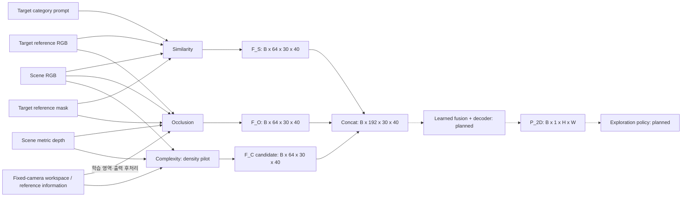

Target reference는 찾을 물체를 별도로 촬영한 입력임. Scene의 가려진 target을 segmentation해서 입력한다는 뜻이 아님. 현재 Similarity의 masked pooling과 Occlusion의 target geometry에는 reference mask가 필요함. Occlusion geometry는 고정 촬영 규격을 가정하며, camera별 workspace는 network 입력이 아니라 학습 영역 설정과 출력 후처리에 사용함. 각 본문에서 모델 입력·GT 전용 정보·외부 처리를 구분해 설명함.

세 feature를 같은 위치에서 channel 방향으로 연결하면 `64+64+64=192`개 값이 됨. 이 값을 어떤 방식으로 결합하고 학습할지는 아직 구현하지 않았음. 아래 식은 연결 계획이며 최종 fusion 구조가 확정됐다는 뜻이 아님.

```text
F_fuse = Fusion(Concat(F_S, F_O, F_C))       # planned
P_2D   = Sigmoid(Decoder(F_fuse))           # planned
```

**각 stream의 보조 출력은 최종 target 존재 확률과 다름.** Similarity는 관련성 점수, Occlusion은 정해진 pose 표집 조건의 가림 가능성, 현재 Complexity pilot은 가시 label 수와 점유율을 학습함. 이를 결합한 최종 위치 확률과 탐색 효용은 후속 검증 대상임.

각 본문은 **목적·입출력 → 구조 → 내부 모듈 → GT와 학습 → 핵심 설계 과정 → FAQ** 순서로 읽도록 구성함. 개별 실험 조건과 시행착오는 [Development Log](#development-log)에 보존함.

### 이 문서의 tensor 표기는 어떻게 읽는가?

`68-D`, `768-D`에서 **D는 depth가 아니라 dimension, 즉 벡터를 구성하는 숫자의 개수**를 뜻함. 예를 들어 `768-D feature`는 한 patch를 768개의 실수로 표현한다는 뜻이며, 768개 값에 사람이 정한 768개 물리 속성이 하나씩 대응한다는 뜻은 아님. 여러 값이 함께 형상·색·질감·문맥을 분산해서 표현함.

| 표기 | 의미 | 이 프로젝트의 예시 |
|---|---|---|
| `B` | 한 번에 처리하는 sample 수인 batch size | `B=16`이면 scene 16장을 동시에 처리 |
| `C` | Feature channel 수, 즉 위치 하나를 표현하는 숫자의 개수 | DINOv3 ViT-B/16은 patch마다 `C=768` |
| `H, W` | 입력 영상의 세로·가로 pixel 수 | 기본 scene은 `H=480, W=640` |
| `Hₚ, Wₚ` | Patch grid의 세로·가로 위치 수 | 16×16 patch를 쓰므로 `480×640 → 30×40` |
| `ℓ` | 여러 backbone layer 중 하나 | DINOv3 layer `2, 5, 8, 11` |
| `(u,v)` | Patch grid 안의 한 공간 위치 | `(u,v)`마다 feature를 계산하고 각 head가 해당 위치의 점수를 출력 |

따라서 `B × 768 × 30 × 40`은 **scene B장 각각에 대해 30×40개의 위치가 있고, 위치마다 768개의 feature 값이 있다**는 뜻임.

| 용어 | 코드에서 실제로 하는 일 |
|---|---|
| Feature / embedding / latent vector | 입력을 여러 숫자로 바꾼 내부 표현. 각 축의 개별 의미보다 벡터 사이의 관계를 사용 |
| Patch / token | 영상을 작은 영역으로 나눈 단위. ViT-B/16의 한 patch는 입력의 `16×16 pixel` |
| Pooling | 여러 위치의 vector를 평균 또는 가중 평균하여 대표 vector 하나로 요약 |
| Projection / Linear | `W x + b`로 vector 길이와 좌표계를 학습 가능하게 변환 |
| Broadcast | 위치가 없는 target vector 하나를 scene의 모든 `(u,v)` 위치에 동일하게 복제 |
| Concat | 같은 `(u,v)`의 여러 vector를 channel 방향으로 이어 붙임. 공간 위치는 섞지 않음 |
| `3×3 Conv` | 현재 patch와 주변 8개 patch를 함께 보며 공간 문맥을 처리 |
| `1×1 Conv` | 각 위치를 유지한 채 그 위치의 channel만 혼합 |
| Logit | Sigmoid를 적용하기 전의 제한 없는 실수 출력 |
| Sigmoid | Logit을 `0–1` 값으로 변환하는 함수 `σ(z)=1/(1+e^{-z})` |
| Frozen / Trainable | 가중치를 고정하여 feature만 추출 / loss의 gradient로 가중치를 갱신 |

Overview의 `F_S, F_O, F_C`는 stream마다 숫자 하나가 아니라 위치를 유지한 spatial feature map임. 개념적인 shape는 각각 `B × C_i × Hₚ × Wₚ`이며, `Concat`은 세 map의 같은 위치를 channel 방향으로 결합함. 최종 `P_2D`는 `B × 1 × H × W`의 한 장짜리 확률 map임. 현재 세 stream의 출력 규격은 각각 `B × 64 × 30 × 40`임. Complexity 후보의 visible-density RGB-D pilot을 구현·평가했으며, 이를 같은 위치에서 합치면 `B × 192 × 30 × 40`이 됨. 이 규격은 현재 구현의 fusion 입력 후보이며, 구조적 Complexity GT 타당성은 재검토 중임. 세 stream의 통합 forward·fusion 학습·최종 decoder·DRL은 아직 미구현임.

---

## From Shelf Search to Drawer Search

기존 선반 환경 연구를 비정형 drawer 환경으로 확장함.

> H. Jeon et al., *A study on deep reinforcement learning-based exploration intelligence for occluded object search*, Engineering Applications of Artificial Intelligence, 2026.

기존 연구는 similarity와 occlusion 기반 column-wise distribution을 사용함. 물체 유사도를 수동 정의한 category score에 의존했기 때문에, 학습에 없던 물체로 확장되는 zero-shot 탐색 성능을 확인하지 못했음.

주요 확장:

- 정규적인 shelf column에서 **비정형 cluttered drawer**로 확장
- Column-wise distribution에서 **pixel-wise 2D-PDM**으로 확장
- DINOv3의 dense appearance와 SigLIP의 language-aligned semantics 결합
- 학습하지 않은 target instance를 입력할 수 있는 zero-shot target conditioning
- Similarity와 Occlusion에 scene-level **Complexity stream** 추가

---

## Similarity Stream

> **현재 상태:** DINOv3–SigLIP no-shortcut 구조 구현, unseen target의 정성 활성화 확인. 공식 final checkpoint 지정과 정량 object-held-out benchmark는 남아 있음.

### 1. 목적과 입출력

Similarity stream은 **“Scene의 어느 위치에 target 자체 또는 의미적으로 관련된 물체가 보이는가?”**를 표현함. DINOv3의 위치별 visual feature에 target의 외형과 SigLIP의 image/text 의미 표현을 결합하고, 학습한 head로 위치별 similarity score를 예측함. 이는 보이는 영역의 관계를 표현하는 stream이며, target이 더미 뒤에서 가려질 수 있는 위치는 [Occlusion Stream](#occlusion-stream)이 담당함.

| 구분 | 현재 구현의 입력·출력 | 의미 |
|---|---|---|
| Scene 입력 | RGB `B×3×480×640` | 검색할 scene. Similarity에는 scene depth나 scene segmentation을 입력하지 않음 |
| Target 입력 | Reference RGB, target mask, 물체 설명·category prompt | Mask로 물체 crop과 appearance pooling 범위를 정하고, image/text로 검색 조건을 구성 |
| 학습 feature `F_S` | `B×64×30×40` | 이후 fusion에 제공하려는 위치별 표현. 현재 model의 `fused` 반환값 |
| Score map `P_S` | `B×1×30×40`, 필요시 `B×1×480×640`로 확대 | Target–scene 관계 GT를 회귀한 `0–1` score. 보정된 target 존재 확률은 아님 |

Tensor의 `B`는 batch size이며, `ViT-B`의 `B`는 backbone의 Base 모델 크기를 뜻함. 현재 target reference loader는 `target_dir/rgb`, `target_dir/seg`, `mapping.json`을 읽음. 따라서 raw target RGB 한 장만으로 crop과 mask를 자동 생성하는 배포 경로까지 구현된 상태는 아님.

### 2. 전체 모델 구조

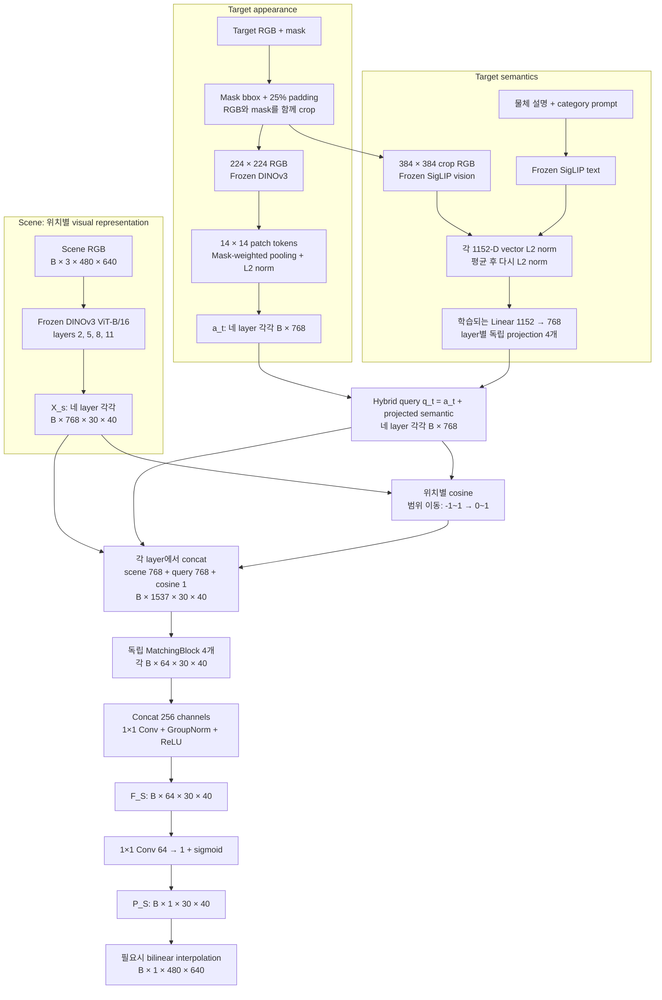

기준 코드는 [backbone.py](backbone.py), [target_utils.py](target_utils.py), [similarity_model.py](similarity_model.py), [train_similarity_v2.py](train_similarity_v2.py)임. Scene와 target appearance는 같은 frozen DINOv3 backbone을 사용함. SigLIP은 target 조건을 만들 때만 사용하며, scene를 SigLIP으로 다시 인코딩하지 않음.

| 단계 | Tensor 변화 | 차원과 계산의 의미 |
|---:|---|---|
| 1 | Scene RGB → layer별 `B×768×30×40` | `480/16=30`, `640/16=40`: 총 1,200개 위치에 768-D DINO token |
| 2 | Target crop `B×3×224×224` → layer별 `B×768×14×14` | `224/16=14`: 196개 patch를 물체 mask의 포함 비율로 pooling |
| 3 | Pooling → layer별 `a_t^ℓ: B×768` | Target view 하나를 나타내는 L2-normalized appearance vector |
| 4 | SigLIP image/text 각각 `B×1152` → `s: B×1152` | 두 vector를 각각 정규화하고 평균한 뒤 다시 정규화 |
| 5 | 독립 `Linear(1152,768)` 4개 → layer별 `s_t^ℓ: B×768` | 각 DINO layer에서 사용할 semantic condition으로 학습 변환 |
| 6 | `q_t^ℓ=a_t^ℓ+s_t^ℓ` → `B×768` | 합산 후에는 다시 정규화하지 않는 hybrid query |
| 7 | Query broadcast + patch cosine → `B×1537×30×40` | Raw scene `768` + raw query `768` + shifted cosine `1` |
| 8 | MatchingBlock → 네 개의 `B×64×30×40` | Layer별 입력을 주변 문맥과 함께 해석 |
| 9 | Concat `B×256×30×40` → fusion → `F_S: B×64×30×40` | `256=4×64`; `1×1 Conv`로 네 layer의 정보를 혼합 |
| 10 | Head → logit `B×1×30×40` → sigmoid | 위치별 similarity score. Full-resolution 표시는 bilinear 확대 |

### 3. 내부 모듈과 선택 이유

#### 1. DINOv3: 위치별 scene 표현과 target 외형

DINOv3 ViT-B/16은 12개 transformer block과 768-D embedding을 사용함. 코드의 layer index `2, 5, 8, 11` 네 중간 출력을 `norm=True`로 받아 서로 다른 처리 단계의 정보를 유지함. 초기 layer는 형태, 후기 layer는 의미만 담당한다고 고정할 수는 없으며, 네 layer를 쓰는 선택의 개별 효과는 ablation으로 확인해야 함.

Target은 mask의 bounding box에서 높이·너비 각각의 25%를 양쪽에 padding하고 이미지 경계에서 잘라냄. **RGB 바깥을 검게 지우는 방식이 아니라 RGB와 mask를 같은 영역으로 crop**함. DINO 입력 RGB는 `224×224`로 bilinear resize하고 mask는 nearest-neighbor resize함. Scene와 target RGB에는 같은 ImageNet normalization을 적용함.

Pixel mask `M`을 `16×16` average pooling하면 각 target patch가 물체를 포함하는 비율 `r_ij`가 됨. 이를 합이 1인 weight로 바꾸고 196개 patch vector를 가중 평균함.

$$
r_{ij}=\frac{1}{256}\sum_{(x,y)\in\mathrm{patch}(i,j)}M(x,y),
\qquad
w_{ij}=\frac{r_{ij}}{\sum_{p,q}r_{pq}},
\qquad
a_t^{\ell}=\mathrm{L2Norm}\!\left(\sum_{i,j}w_{ij}T_t^{\ell}(:,i,j)\right).
$$

예를 들어 물체가 patch의 절반을 차지하면 `r_ij=0.5`이므로 경계 patch도 포함 비율만큼 기여함. Mask가 사실상 비어 있으면 코드에서는 전체 patch의 균등 pooling으로 fallback함. 이 pooling은 target의 공간 배치를 vector 하나로 요약하므로, target–scene의 세밀한 patch correspondence를 보존하는 방법은 아님.

DINO token에는 self-attention을 통한 주변·전체 문맥이 이미 반영됨. 따라서 위치가 `16×16` patch grid에 대응한다고 해서 그 token이 해당 256 pixel만 보고 만들어졌다는 뜻은 아님. Backbone은 CLS token도 반환하지만 현재 Similarity head와 target appearance pooling에서는 사용하지 않음.

#### 2. SigLIP: 외형만으로 부족했던 의미 조건 보완

초기 DINO appearance matching과 CLS category prototype에서 외형이 다른 unseen target의 category 관계가 불안정했기 때문에, language와 정렬된 SigLIP image/text 표현을 추가함. 여기서 SigLIP은 similarity 정답 숫자를 생성하는 모델이 아니라 **target query를 보완하는 frozen encoder**임.

사용 checkpoint는 `google/siglip-so400m-patch14-384`이며, 현재 코드가 사용하는 image/text `pooler_output`은 각각 1152-D임. `patch14`는 SigLIP vision encoder의 patch 크기, `384`는 이미지 입력 크기이고 `SO400M`은 400-D feature라는 뜻이 아님. 같은 crop을 DINO는 `224×224`, SigLIP은 `384×384`로 따로 resize하는 이유는 각각의 입력 규격이 다르기 때문임. SigLIP RGB는 mean/std `0.5/0.5`로 정규화하며, mask로 pixel을 지우지 않은 crop 전체를 입력함.

학습에서는 target별 center reference image 한 장과 다음 형식의 text를 사용함.

```text
a photo of {object_description}, a type of {category}

예: a photo of an apple, a type of fruit
```

`TARGET_LABELS`의 설명은 사람이 지정함. 설명이 없는 target은 category 문장으로 fallback하며, 책 네 개처럼 서로 같은 설명을 쓰는 경우도 있으므로 text가 항상 instance identity를 구별해 주는 것은 아님. 현재 학습 경로에서 category 정보는 외부 조건임.

$$
s_{\mathrm{img}}=\mathrm{L2Norm}(\mathrm{SigLIP}_{\mathrm{image}}(I_t)),
\qquad s_{\mathrm{text}}=\mathrm{L2Norm}(\mathrm{SigLIP}_{\mathrm{text}}(p_t)),
$$
$$
s=\mathrm{L2Norm}\!\left(\frac{s_{\mathrm{img}}+s_{\mathrm{text}}}{2}\right),
\qquad s_t^{\ell}=W^{\ell}s+b^{\ell},
\qquad q_t^{\ell}=a_t^{\ell}+s_t^{\ell}.
$$

네 projection은 각각 `Linear(1152,768)`이며 가중치를 공유하지 않음. 출력 좌표 하나도 1152개 입력의 학습된 가중합임. 이 변환은 차원을 맞추면서 semantic 정보를 head가 활용하도록 학습하는 경로이며, 차원이 같아졌다는 사실만으로 두 latent space가 완전히 정렬됐다고 주장하지 않음. 정렬을 직접 감독하는 별도 loss 없이 최종 similarity-map MSE를 통해 학습됨.

`s_t^ℓ`와 합산 query `q_t^ℓ`는 정규화하지 않음. Cosine 경로에서만 query의 L2 norm을 맞추고, MatchingBlock에는 raw query를 전달함. 따라서 query의 방향은 cosine에, 방향과 크기는 raw interaction 입력에 반영됨. Center image 하나가 semantic 조건을 대표한다는 선택도 viewpoint invariance가 실험적으로 보장됐다는 뜻은 아님.

#### 3. Scene–target interaction: 직접 유사도와 원본 feature 함께 제공

각 layer에서 scene의 1,200개 위치마다 hybrid target query와 cosine을 계산함. Scene 전체를 scalar 하나로 압축하지 않음.

$$
c^{\ell}(u,v)=\frac{X_s^{\ell}(:,u,v)^{\mathsf T}q_t^{\ell}}
{\lVert X_s^{\ell}(:,u,v)\rVert_2\lVert q_t^{\ell}\rVert_2},
\qquad \widehat c^{\ell}(u,v)=\frac{c^{\ell}(u,v)+1}{2}.
$$

`c`는 `−1–1`, shifted cosine `ĉ`는 `0–1` 범위임. 이 범위 이동은 순위를 바꾸지 않으며 `ĉ` 자체를 target 존재 확률로 만들지도 않음. 각 위치에 같은 query를 broadcast하고 다음과 같이 concat함.

```text
Z^ℓ(u,v) = Concat[raw scene feature, raw target query, shifted cosine]
channels =              768       +       768      +       1       = 1537
```

Cosine 한 개는 768-D vector 관계를 요약한 값이므로, 서로 다른 scene feature가 같은 cosine을 가질 수 있음. Raw scene와 query도 주면 head가 무엇을 찾는지, 현재 위치에 어떤 feature가 있는지, 직접 유사도가 얼마인지를 함께 이용할 수 있음. 이는 배경의 우연한 고유사도를 줄이거나 관련 영역을 강화하도록 학습할 여지를 주는 설계이며, 각 입력의 기여가 독립 ablation으로 모두 입증된 상태는 아님. 현재 trainer는 `category_dim=0`을 사용하므로 과거 CLS category probability channel은 1537개에 포함되지 않음.

#### 4. MatchingBlock, multi-layer fusion과 score head

```text
각 layer의 Z^ℓ: B×1537×30×40
    → Conv 3×3, 1537→64, padding=1
    → GroupNorm(8,64) → ReLU
    → Conv 1×1, 64→64
    → GroupNorm(8,64) → ReLU
    → F_ℓ: B×64×30×40

Concat[F_2,F_5,F_8,F_11]: B×256×30×40
    → Conv 1×1, 256→64 → GroupNorm(8,64) → ReLU
    → F_S: B×64×30×40
    → Conv 1×1, 64→1 → sigmoid
    → P_S: B×1×30×40
```

첫 `3×3 Conv`는 현재 patch와 주변 8개 grid cell의 입력을 학습 가중합하여 local 문맥을 추가함. `1×1 Conv`는 공간 위치를 유지하면서 channel을 재조합함. `GroupNorm(8,64)`은 sample 내부에서 64 channel을 8개 group으로 정규화하고, ReLU는 음수 반응을 0으로 만드는 비선형 함수임. 네 MatchingBlock은 구조만 같고 가중치는 각각 다름.

`64`는 category 수나 미리 정한 유사도 종류 수가 아니라 head의 표현 용량 `hidden_ch=64`임. Fusion 입력 `256`도 `4 layers×64 channels`에서 나온 수이며 Occlusion depth encoder의 256-D 표현과는 별개임.

MatchingBlock은 cross-attention이나 target patch별 correspondence를 다시 계산하는 모듈이 아님. Patch-wise cosine은 **명시적인 위치별 비교값**을 제공하고, MatchingBlock은 **원본 feature·query·cosine과 이웃 위치를 이용한 비선형 예측**을 학습함. CNN 선택의 이유는 이런 local 공간 연산이며, 모든 MLP가 반드시 공간 정보를 잃는다는 뜻은 아님.

최종 score는 head의 logit에 sigmoid를 적용한 값임. **현재 출력에는 raw DINO cosine을 직접 더하는 residual shortcut이 없음.** Cosine은 위의 interaction channel로만 전달됨. Full-resolution 출력은 sigmoid 이후 bilinear interpolation(`align_corners=False`)으로 만들며, 새 경계 세부 정보를 복원하는 decoder는 아님.

#### 5. 학습되는 parameter와 cache

| Module | Trainable parameters | 계산 근거 |
|---|---:|---|
| Semantic projection 4개 | 3,542,016 | `4×(1152×768+768)` |
| MatchingBlock 4개 | 3,559,168 | Block당 `889,792`: 두 Conv의 weight/bias와 두 GroupNorm의 affine parameter |
| Multi-layer fusion | 16,576 | `256×64+64+2×64` |
| Score head | 65 | `64×1+1` |
| **합계** | **7,117,825** | DINOv3와 SigLIP의 frozen parameter 제외 |

DINOv3와 SigLIP은 `eval`과 gradient 비활성 상태로 사용함. 현재 trainer는 target별 다섯 camera의 DINO appearance와 center RGB/text의 SigLIP semantic을 미리 cache함. Scene RGB는 dataset에서 읽어 **매 batch마다 frozen DINO forward**를 수행하며, 전체 scene feature를 사전 저장해 읽는 training 경로는 아님. Semantic projection은 gradient가 필요하므로 학습 step 안에서 적용함. 과거 버전의 cache·VRAM 관련 명칭이나 주석 대신 현재 호출 경로를 기준으로 읽어야 함.

### 4. GT 생성과 학습

#### Relation score GT와 loss

[gt_similarity.py](gt_similarity.py)는 scene segmentation의 asset mapping과 category를 사용하여 다음 GT를 구성함. 이 category 관계는 연구에서 정한 supervision이며, SigLIP이 자동으로 정한 similarity 정답이 아님.

| Target–scene 관계 | Pixel GT score |
|---|---:|
| 동일 target asset label | `1.0` |
| 같은 category | `0.8` |
| 관련 category: book↔toy, fruit↔packaged_food | `0.5` |
| 그 외 알려진 category 물체 | `0.2` |
| 배경·unknown | `0.0` |

| Target ↓ / Scene → | Book | Toy | Fruit | Packaged food |
|---|---:|---:|---:|---:|
| Book | 0.8 | 0.5 | 0.2 | 0.2 |
| Toy | 0.5 | 0.8 | 0.2 | 0.2 |
| Fruit | 0.2 | 0.2 | 0.8 | 0.5 |
| Packaged food | 0.2 | 0.2 | 0.5 | 0.8 |

표는 색 mapping이 유일할 때의 GT 규칙이며, 동일 target asset에는 category 점수보다 우선하여 `1.0`을 부여함. 현재 생성 함수는 BGR 색을 dictionary key로 사용하므로 서로 다른 asset의 색이 충돌하면 뒤 asset의 점수가 앞 값을 덮을 수 있음. Dataset은 `paths_config.GT_DIR`의 precomputed grayscale GT를 우선 읽고 `/255`로 변환하며, 파일이 없을 때 segmentation과 mapping으로 생성함. **기존 Similarity GT에 대한 색 충돌 영향의 소급 정량 audit은 수행하지 않았음.** Scene segmentation은 GT 생성용이며 model 입력은 아님.

$$
Y_{\mathrm{patch}}=\mathrm{AvgPool}_{16\times16}(Y_{\mathrm{full}}),
\qquad
L_{\mathrm{sim}}=\frac{1}{BH_pW_p}\sum_{b,i,j}
\left(P_S(b,i,j)-Y_{\mathrm{patch}}(b,i,j)\right)^2.
$$

Loss는 확대된 시각화가 아닌 `30×40` patch grid에서 계산함. 한 patch의 절반이 exact target(`1.0`), 나머지가 배경(`0`)이면 GT가 `0.5`가 됨. 동일한 score가 서로 다른 관계·면적 혼합에서 나올 수 있으므로 밝은 영역을 exact target segmentation이나 존재 확률로 바로 해석하지 않음.

#### 데이터와 현재 training protocol

기존 book·fruit·packaged_food·toy 각 4개, **16개 target 모두를 training pool에 유지**함. 새로운 target의 zero-shot 평가는 별도 external asset으로 수행함. Source의 “15 targets / packaged_food_1 제외” 주석은 오래된 설명이며 실제 `TARGETS`와 현재 데이터는 16개임.

| 항목 | 현재 설정 |
|---|---|
| Scene split | Target별 10 scene ID를 8 train / 2 validation으로 분리. 같은 scene ID의 environment와 camera는 같은 split |
| Scene camera | center, top, left, right, bottom |
| Environment sampling | `ENV_STRIDE=10`: `0,10,…,290`, scene ID당 30개 |
| 현재 데이터의 sample 수 | Train `16×8×30×5=19,200`; validation scene sample `16×2×30×5=4,800` |
| Target camera 사용 | Train은 sample마다 5개 중 무작위 하나, validation은 5개를 모두 순회하여 총 24,000 scene–reference 비교 |
| Semantic 조건 | Target당 center image 한 장 + 물체 설명/category text. Target appearance camera를 바꿔도 semantic은 고정 |
| Optimizer | AdamW, learning rate `1e-3`, default weight decay `0.01` |
| Batch / schedule | Batch `128`, 최대 `100` epochs, CosineAnnealingLR |
| Checkpoint 갱신 / early stopping | 이전 best MSE보다 **5% 초과 개선** 시 best 저장; 개선 없이 `5` epochs면 종료 |
| Split seed | 기본 `None`; 실행 시작 시 seed 하나를 정해 모든 target에 사용 |

현재 코드는 seed와 실제 split 목록을 stdout에 출력하지만 `train_log.txt`와 checkpoint에 자동 보존하지 않음. 과거 no-shortcut snapshot에는 target마다 seed가 새로 생성되던 split 문제가 있었고 이후 수정됨. 따라서 현재 코드의 분할 절차가 과거 run에 그대로 적용됐다고 가정하거나, 같은 checkpoint shape만으로 정확한 학습 재현성이 확보됐다고 해석하면 안 됨.

#### 지표와 checkpoint의 해석

| 지표 | 실제 계산 | 읽는 방법 |
|---|---|---|
| MSE | 전체 patch에서 `(prediction−GT)²` 평균 | Graded relation score 오차; 작을수록 좋음 |
| Tolerance accuracy | `abs(prediction−GT)<13/255`인 patch 비율 | 허용 오차 안에 들어온 비율. 기존 log 명칭은 `acc` |
| Balanced tolerance accuracy | GT-positive와 GT-negative의 tolerance accuracy 평균 | 배경 비중의 영향을 줄인 보조 지표 |
| Tolerance IoU-like | `close ∩ GT-positive` 수 / `GT-positive ∪ predicted-positive` 수 | 일반 binary-mask IoU와 다른 프로젝트 전용 지표 |

Positive 기준은 `GT>0.1`, `prediction>0.1`임. `0.2`인 다른 category 물체도 positive에 포함되므로 이 IoU-like 값을 exact target 위치 IoU라고 부르지 않음. 구체적 계산은 [train_common.py](train_common.py)의 `batch_accuracy_counts()`와 `accuracy_scores_from_counts()`를 따름.

보존된 no-shortcut 후보 `multi_target_20260728_114403_siglip/similarity_head_best.pt`는 현재 head/projection 구조와 호환됨. 해당 `train_log.txt`의 **마지막 best 저장 epoch 21**에는 validation MSE `0.00027`, tolerance IoU-like `0.8588`이 기록돼 있음. 이는 같은 asset library의 scene validation 기록이며 external target 정량 성능이 아님. MSE는 log의 반올림 값이고, best 저장 규칙은 5% 개선 기준이므로 저장된 best를 모든 epoch의 정확한 최소 MSE와 동일시하지 않음.

Checkpoint에는 `model_state`와 `semantic_proj_state`만 저장하고 frozen backbone은 별도로 로드함. **공식 final checkpoint를 지정한 manifest는 아직 없음.** 일부 후속 run은 출력 cosine shortcut을 포함하여 현재 no-shortcut 모델과 그대로 호환되지 않음. 단순히 날짜가 최신인 파일을 선택하지 않으며, 모델 구조·backbone·전처리·split·prompt provenance를 함께 확인해야 함.

#### 정성 결과와 현재까지의 증거

아래는 보존한 정성 결과이며, 현재 final checkpoint를 확정해 동일 조건으로 재생성한 benchmark가 아님. Heatmap의 활성화는 실제 예측 예시로 보되, 모든 unseen instance에서의 성공이나 구성요소의 독립 효과로 확대하지 않음.

**Unseen Banana:** 아래 세 그림의 target은 모두 banana임. 파일명에 있는 Book/Avocado/Orange는 scene pool을 나타내며 target 이름이 아님. Fruit 영역에 반응하는 사례와 함께 다른 물체 영역의 활성화도 관찰됨.


**Unseen packaged_food_5:** 외형이 다른 external packaged-food query에서 같은 category 영역이 활성화된 사례임. 다음 두 그림은 각각 image-only와 image+text로 보존된 결과이지만 **scene도 서로 다르므로 paired ablation이나 text 효과의 정량 증거로 비교하지 않음.**


현재 필요한 검증은 여러 external target을 이용한 object-held-out 정량 평가와 DINO-only/SigLIP-only, image-only/image+text, prompt swap의 통제 비교임. Category-held-out 일반화는 이보다 별도 범위의 주장임. 현재의 frozen encoder 입력 가능성과 위 정성 사례만으로 head의 일반적인 zero-shot 성능까지 확정하지 않음.

### 5. 핵심 설계 과정과 검증 결과

| 단계 | 가정과 시도 | 관측된 한계·변화 |
|---|---|---|
| [Phase 1: DINO appearance](#2026-07-21--phase-1--dinov3-appearance-matching) | Frozen patch feature와 target appearance의 비교로 유사도 지도를 학습 | 색·재질·형상에 반응했지만 해당 구성에서는 category 관계가 충분하지 않았음. DINO 전체에 의미 정보가 없다는 증명은 아님 |
| [Phase 2: CLS prototype](#2026-07-27--phase-2--cls-prototype-category-conditioning) | Target CLS를 category별로 평균하고 category prior를 interaction에 추가 | 기존 물체 표현의 평균만으로 외형 차이가 큰 unseen target을 안정적으로 설명하지 못해 language-aligned 의미 표현을 검토 |
| [Phase 3: SigLIP 결합](#2026-07-28--phase-3--dinov3--siglip-semantic-fusion) | Target image/text semantics를 layer별 projection으로 appearance query에 합산 | Unseen packaged-food에서 same-category 정성 활성화 관찰. Projection·image·text 각각의 기여와 정량 일반화는 추가 검증 필요 |
| [Phase 4: shortcut 제거](#2026-07-2829--phase-4--exact-instance-shortcut-evaluation) | Exact instance를 더 높이려 raw DINO cosine을 output logit에 직접 추가하고 여러 matching 변형 진단 | 비교한 설정에서 exact-vs-same-category 분리가 거의 개선되지 않고 competitor도 활성화됨. 출력 shortcut을 제거하고 learned interaction head 유지 |

세부 설정과 실패 사례는 위 Development Log에 보존함. 현재 구조는 이 관측을 반영한 구현 선택이며, 정확한 instance 우선순위와 모든 semantic 관계를 해결했다는 결론은 아님.

### 6. 질문과 답변

**Q. DINOv3와 SigLIP vector를 더하면 원래 외형 정보가 바뀌는가?**

Frozen DINO 출력 `a_t^ℓ`는 그대로이며, 이를 semantic projection과 더해 새로운 query `q_t^ℓ`를 만듦. Raw 1152-D SigLIP을 768-D DINO에 그대로 더하지 않음. 새 query는 순수 DINO feature와 다르며, 이 결합이 유용한지는 similarity loss와 held-out 비교로 판단해야 함.

**Q. Cosine map이 있는데 raw scene/target concat과 MatchingBlock까지 필요한가?**

Cosine은 위치마다 관계를 숫자 하나로 요약함. Raw feature는 그 요약에 없는 입력 정보를 제공하고, `3×3` CNN은 이웃 위치까지 함께 이용함. 두 단계의 계산 역할이 다르며 MatchingBlock이 cosine이나 patch matching을 다시 수행하는 것은 아님. 어느 요소가 얼마나 유효한지는 별도 ablation의 대상임.

**Q. 768개나 1152개 좌표 각각의 의미를 알 수 있는가?**

각 축에 “색”, “책”, “가려짐” 같은 고정된 이름이 붙어 있지 않음. 이들은 사전학습 목표가 만든 분산 표현임. DINO는 위치가 있는 contextual visual token, SigLIP은 target의 전역 image/text representation으로 사용된다는 계산 경로를 설명할 수 있음. 개별 좌표의 의미와 표현에 포함된 능력은 probe·입력 변화·ablation으로 확인해야 함.

**Q. 새 target에 image-only 추론이 가능한가?**

[inference_zeroshot.py](inference_zeroshot.py)는 `--label`을 생략하면 SigLIP image-only semantic을 사용함. 다만 mask와 mapping은 여전히 필요하고 image+text 학습 분포와 달라짐. Label을 주면 현재 inference prompt는 `a photo of a {label}`이며, 학습의 object/category 문장과도 다름. 학습 semantic은 center view로 고정되지만 추론은 선택한 target camera를 사용하므로 이러한 차이를 기록한 평가가 필요함.

**Q. 밝은 값은 target 존재 확률인가?**

아님. `P_S`는 정해 둔 관계 score를 MSE로 근사한 값임. Same-category 물체도 높은 GT를 받고 patch 경계에서는 여러 score가 평균됨. 현재 feature `F_S`를 다른 stream과 결합하여 탐색 정책에 유용한지도 아직 별도로 검증해야 함.

---

## Occlusion Stream

> **현재 기준:** Adaptive GT 240,000장 생성 완료. 기존 16개 target을 모두 사용하는 `native 68-D geometry + raw target broadcast + global FiLM` baseline을 전체 scene key의 10%로 학습함. Seen-target scene-heldout 평가와 외부 `packaged_food_5` 한 개의 합성 평가를 완료했으며, 현재 checkpoint를 보존함.

### 1. 목적과 입출력

Occlusion이 답하는 질문은 **“이 target이 현재 물체 더미에 의해 어느 위치에서 가려질 수 있는가?”**임. Scene RGB-D가 제공하는 관측 구조와 target reference의 크기·외형을 함께 사용하여, 가림 후보 영역의 map `P_O`와 중간 feature `F_O`를 만듦. Similarity가 보이는 물체와 target의 관계를 제공한다면, Occlusion은 target이 직접 보이지 않아도 가림 후보를 제시하려는 역할임.

학습 정답은 가상으로 놓은 target의 유효 투영 면적 중 **70% 이상이 scene depth 뒤에 있는 pose**를 집계하여 만듦. 따라서 출력은 그 표본화 규칙의 확률 GT를 근사하는 값임. 실제 target이 그 위치에 존재할 사후확률이나 집기 성공 확률은 아님. 최종 탐색 prior로 활용하기 위한 three-stream fusion과 DRL 효과는 아직 검증하지 않음.

| 구분 | 현재 입력·출력 | 쓰이는 곳 |
|---|---|---|
| Scene RGB | `B×3×480×640` | Frozen DINOv3로 위치별 외형·문맥 feature 추출 |
| Scene depth | 미터 단위 depth와 `depth>0` valid mask → `B×2×480×640` | 학습 가능한 depth encoder |
| Target reference RGB | 고정 center/top-down 사진 한 장, `B×3×480×640` | 전체 frame의 appearance vector 추출. 다섯 scene camera에 같은 reference 사용 |
| Target mask | 같은 reference의 물체 silhouette | 크기·형태를 요약한 `g: B×68` 계산. 현재 검증에서는 합성 segmentation 사용 |
| Stream feature `F_O` | `B×64×30×40` | 가림 GT로 학습한 위치별 표현. 향후 stream fusion 입력 |
| 가림 map `P_O` | `B×1×30×40`, 값 범위 `0–1` | GT 회귀 및 공간 패턴 평가. 표시할 때 `480×640`으로 보간 |
| 고정 workspace mask | Camera별 drawer 내부 영역 | Safe-ring 학습 영역과 그림의 외부 후처리에 사용. Model forward에는 넣지 않음 |
| Offline GT 전용 자료 | Target mesh, candidate poses, camera calibration, empty-drawer depth | 정답·coverage 생성. 추론 network에는 넣지 않음 |

여기서 `B`는 batch의 sample 수임. 실제 검증된 입력은 **scene RGB-D + target RGB와 mask**이며, target RGB 한 장만으로 mask까지 안정적으로 얻는 실환경 전처리는 별도 과제임. Scene segmentation이나 target의 실제 scene 위치는 network 입력이 아님.

### 2. 전체 모델 구조

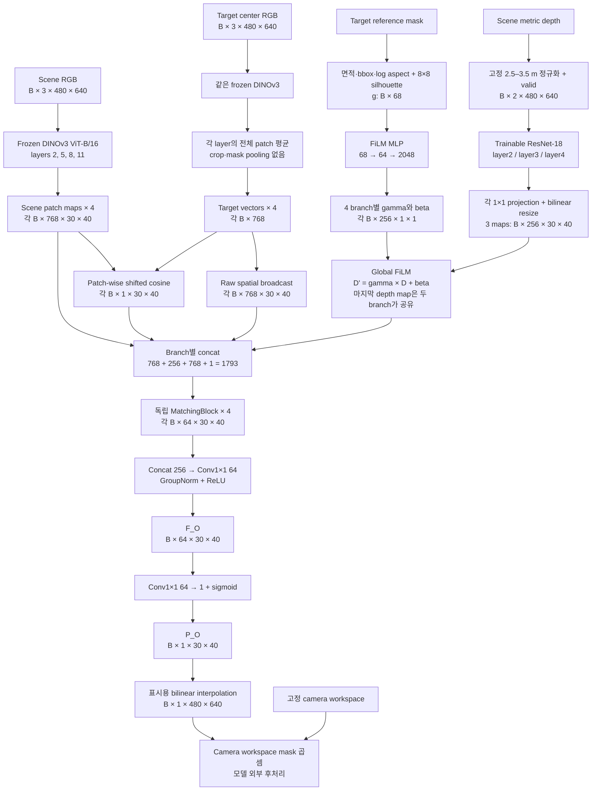

DINO는 하나의 고정된 backbone을 scene과 target에 공통으로 사용함. 네 layer는 네 개의 별도 DINO 모델이 아니라 block index `2/5/8/11`에서 꺼낸 중간 출력임. `480/16=30`, `640/16=40`이므로 layer마다 1,200개 patch 위치가 있고, 각 위치에 768개 feature 값이 있음. **16px는 patch 간격이며, DINO feature가 해당 16×16 영역만 본다는 뜻은 아님.** Transformer의 문맥이 반영된 표현임.

### 3. 내부 모듈과 선택 이유

#### 1. Scene와 target의 RGB 표현

RGB는 `[0,1]`로 바꾼 뒤 ImageNet mean/std로 정규화하여 DINO에 입력함. DINO를 evaluation mode로 두고 weight와 gradient 계산을 고정하여 feature를 추출함. 반환된 CLS token은 현재 Occlusion interaction에 사용하지 않음.

Scene은 네 개의 공간 map `X_l: B×768×30×40`을 유지함. Target은 동일한 해상도의 **전체 reference frame**을 입력하고 layer별 1,200개 patch vector를 단순 평균함.

$$
q_l=\frac{1}{30\cdot40}\sum_{u,v}X_{t,l}(u,v),
\qquad q_l\in\mathbb{R}^{768}
$$

Occlusion target appearance에는 Similarity의 bbox crop·224×224 resize·mask-weighted pooling을 적용하지 않음. 전체 frame에서의 모습과 크기 단서를 보존하려는 선택이며, 배경도 평균에 포함됨. 평균 vector만으로 물리적 크기가 충분히 표현된다고 가정하지 않고, 다음의 명시적 mask descriptor를 별도로 제공함. 이 선택은 reference 거리·화각·배경이 일정한 현재 capture 조건에 의존함.

#### 2. 68-D geometry: 68개의 값은 무엇인가?

`extract_target_geometry()`가 target mask에서 학습 없이 계산하는 **4개 크기 값 + 64개 silhouette 값**임. `H,W`는 reference frame의 높이·너비, `h,w`는 mask의 최소 bounding box 높이·너비임.

| 위치 | 차원 | 실제 계산 | 전달하는 정보 |
|---|---:|---|---|
| `g[0]` | 1 | Mask pixel 수 / `(H×W)` | 전체 frame에서 차지하는 면적 비율 |
| `g[1]` | 1 | `h/H` | Bbox 세로 크기 비율 |
| `g[2]` | 1 | `w/W` | Bbox 가로 크기 비율 |
| `g[3]` | 1 | `log(w/h)` | 가로·세로 비율 |
| `g[4:68]` | 64 | Bbox 내부의 mask를 `INTER_AREA`로 `8×8`에 축소한 뒤 행 순서로 펼침 | 각 cell의 soft occupancy `0–1`로 표현한 거친 silhouette |

예를 들어 `480×640` 영상에서 면적이 3,072px이고 bbox가 높이 96px·너비 64px이면 앞 네 값은 `[0.01, 0.20, 0.10, log(64/96)]`임. Silhouette cell의 `0.7`은 그 cell에 mask가 약 70% 들어왔다는 뜻이지 물체 class나 존재 확률이 아님.

Bbox를 정사각형 `8×8`로 바꾸면 원래 종횡비가 왜곡되므로, 원래 높이·너비·aspect를 별도 값으로 함께 남김. 같은 촬영 규격에서는 영상상 크기가 target의 크기 차이를 전달하지만, 이 68개 값에 **미터 단위 3D 길이·물체 높이·target depth가 들어 있는 것은 아님**. 현재 baseline은 이 native descriptor 전체를 사용하며, 과거 size-only·exact-extent oracle의 slot 재할당은 사용하지 않음.

Target mask는 이 branch에만 사용함. DINO appearance map에 mask를 곱하지 않고, scene에서 target을 찾아 mask를 만드는 작업도 아님. 새 reference mask에도 같은 수식을 적용할 수 있다는 것은 입력 형식의 일반성이지, 새 target 성능을 보장하는 증명은 아님.

#### 3. Depth encoder: 관측 depth를 학습 가능한 공간 표현으로 변환

Scene depth는 고정 범위로 정규화함.

$$
V(u,v)=[D(u,v)>0],\qquad
\bar D(u,v)=V(u,v)\,\mathrm{clip}\!\left(\frac{D(u,v)-2.5}{3.5-2.5},0,1\right)
$$

실제 구현은 invalid 위치를 `where`로 0에 설정하고 `Concat(\bar D,V)`를 만듦. 두 번째 channel이 있어야 무효값 0과 정규화 범위의 가까운 쪽에 있는 유효 표면을 구분할 수 있음. Scene마다 min–max를 다시 맞추면 동일한 depth가 서로 다른 숫자가 되므로, 고정 rig에서 확인한 범위를 모든 sample에 공통 적용함.

Depth encoder는 `weights=None`인 **ResNet-18을 처음부터 학습**함. 첫 convolution을 `2→64`, kernel `7×7`, stride 2로 바꾸고 stem·layer1을 거쳐 다음 세 scale을 사용함.

| ResNet 출력 | 원래 tensor | 공통 grid로 맞춘 결과 |
|---|---|---|
| `layer2`, stride 8 | `B×128×60×80` | 독립 `1×1 Conv 128→256` + resize → `B×256×30×40` |
| `layer3`, stride 16 | `B×256×30×40` | 독립 `1×1 Conv 256→256` → `B×256×30×40` |
| `layer4`, stride 32 | `B×512×15×20` | 독립 `1×1 Conv 512→256` + resize → `B×256×30×40` |

Resize는 bilinear interpolation이며 `align_corners=False`임. `1×1 Conv`는 같은 위치의 channel들을 학습한 가중치로 섞어 폭을 맞추고, resize는 위치 격자를 맞춤. DINO layer `2/5/8`에는 세 depth map을 순서대로 연결하고 layer `11`에는 가장 깊은 세 번째 map을 다시 연결함. 마지막 두 branch가 받는 원래 depth map은 같지만 FiLM 조절값과 MatchingBlock은 각각 다름.

ResNet의 residual connection은 이전 feature에 학습한 변화량을 더하는 내부 학습 구조임. **현재 FiLM에 별도 local residual gate가 추가된 것은 아님.** `18`은 network의 layer 명칭이고 18-D feature를 뜻하지 않음. 또한 depth channel 256개에 각각 “빈틈 폭”, “물체 높이”라는 정답 이름을 부여하지 않음. 관측 depth 패턴을 가림 GT에 유용하게 변환하도록 학습한 latent feature이며, 숨겨진 3D 공간을 복원한 결과는 아님.

#### 4. Global FiLM: target geometry로 depth feature 해석을 조절

FiLM은 **Feature-wise Linear Modulation**, 즉 feature channel별 곱셈·덧셈 조절임. Geometry `g`를 다음 MLP에 넣음.

```text
g                       B×68
Linear(68,64) + ReLU  →  B×64
Linear(64,2048)       →  B×2048
reshape              →  B×4×2×256
                         └ branch └ gamma/beta └ depth channel
```

각 branch `l`에 대해 `gamma_l,beta_l`는 각각 `B×256×1×1`이며, **depth projection·resize 이후, RGB/target과 concat하기 직전**에 적용됨.

$$
D'_{l,c}(u,v)=\gamma_{l,c}(g)D_{l,c}(u,v)+\beta_{l,c}(g)
$$

`gamma`는 해당 depth channel의 반응을 확대·축소하거나 부호를 바꿀 수 있고, `beta`는 기준값을 이동함. 예를 들어 한 depth feature 값이 `0.6`일 때 `(gamma,beta)=(0.5,-0.1)`이면 `0.2`, `(1.4,0.05)`이면 `0.89`가 됨. 이는 원리를 설명하는 가상 숫자이며 “큰 target일수록 gamma가 커진다”는 규칙을 구현한 것은 아님. 어떤 geometry에서 어떤 channel을 바꿀지는 가림 GT의 loss로 학습함.

**Global**은 같은 target·branch·channel의 조절값이 모든 `(u,v)`에 공통이라는 뜻임. 원래 `D(u,v)`가 위치마다 다르므로 출력의 공간 정보는 유지됨. Target geometry가 공간 gate map이나 최종 확률을 직접 만들지는 않으며, target이 바뀔 때 같은 scene depth를 다르게 해석할 경로를 제공함.

Geometry를 단순히 마지막 입력에 이어 붙이는 대신, FiLM은 **depth feature 자체에 target에 따른 곱셈 상호작용**을 만듦. 같은 깊이 패턴도 찾는 물체의 크기·형태에 따라 다르게 활용하도록 하려는 선택임. 현재 full16 평가에서 단순 geometry concat보다 우월함을 별도로 입증한 것은 아님.

마지막 `Linear(64,2048)`의 weight는 0, bias는 gamma 쪽 1·beta 쪽 0으로 초기화함. 따라서 학습 시작에는 `D'=D`인 항등변환이며, 최종 loss의 gradient로 ResNet·FiLM·MatchingBlock을 함께 학습함. 추론에서도 같은 FiLM 계산을 수행함. 이 64-D hidden은 사람이 정의한 64개 기하량이나 뒤의 `F_O` 64-channel과 다른 tensor임.

#### 5. Target interaction과 MatchingBlock

각 DINO branch에서 두 가지 appearance 단서를 만듦. 첫째는 평균 target vector `q_l`을 30×40 모든 위치에 그대로 반복하는 **raw broadcast**임. 이 경로에는 추가 L2 정규화를 하지 않아 vector의 방향과 크기를 함께 전달함. 둘째는 scene patch와 target vector를 각각 L2 정규화하여 계산한 cosine 한 개임.

$$
c_l(u,v)=\frac{1}{2}\left(1+
\frac{X_l(u,v)\cdot q_l}{\lVert X_l(u,v)\rVert_2\lVert q_l\rVert_2}
\right)
$$

Cosine은 `B×1×30×40` map이고, 원래 `[-1,1]` 값을 `[0,1]`로 이동한 것임. 이를 다음 순서로 합침.

```text
Scene DINO feature       768
FiLM-conditioned depth  256
Raw target broadcast    768
Shifted cosine            1
───────────────────────────
Branch input           1793 channels, 30×40
```

네 branch는 각각 독립적인 다음 MatchingBlock을 가짐.

```text
Conv3×3(1793→64, padding=1)
  → GroupNorm(8 groups) → ReLU
  → Conv1×1(64→64)
  → GroupNorm(8 groups) → ReLU
  → B×64×30×40
```

`3×3` convolution은 현재 patch와 이웃 patch들의 RGB-D·target 단서를 함께 해석함. `1×1` convolution은 같은 위치의 channel 관계를 다시 혼합함. GroupNorm은 64개 channel을 8개 group으로 나누어 sample 내부의 feature scale을 정규화하고, ReLU는 비선형성을 추가함. 이 block은 새 cosine이나 target–scene cross-attention을 계산하는 장치가 아니라, 입력된 단서와 주변 문맥을 GT에 맞게 변환하는 CNN임.

Cosine 한 값으로는 “외형이 비슷한 물체가 보인다”와 “target이 더미에 가려질 수 있다”를 구분하기 어려워 RGB 원본 feature·depth·target vector를 함께 제공함. **Cosine을 마지막 logit에 직접 더하는 shortcut은 없음.** 다만 shortcut을 없앴다는 사실만으로 network가 depth를 충분히 활용한다는 것이 입증되는 것은 아님.

#### 6. Layer fusion, feature와 map 출력

네 MatchingBlock의 결과를 channel 방향으로 합치면 `4×64=256` channels임. `Conv1×1(256→64) → GroupNorm(8) → ReLU`가 이를 `F_O: B×64×30×40`으로 통합함. 이어 `Conv1×1(64→1)`과 sigmoid를 적용하여 `P_O`를 얻음.

`F_O`는 가림 GT를 예측하도록 학습한 64-channel feature이고, sigmoid 이전 한 channel이 logit, 이후 값이 `0–1` map임. 표시용 bilinear 확대는 주변 patch 값을 보간하므로 새로운 pixel 수준의 세부 정보를 복원하지 않음. Camera workspace mask를 곱한 그림은 **raw model 출력에 고정 영역 제약을 적용한 후처리 결과**임.

현재 학습 가능한 parameter는 DINO를 제외하고 **15,706,689개**임: depth encoder/projection 11,403,520개, FiLM 137,536개, MatchingBlocks 4,148,992개, fusion/head 16,641개. 네 DINO layer를 사용하지만 backbone은 frozen이며 이 수에 포함하지 않음.

#### 설계 의도와 현재 입증한 효과의 구분

| 설계 | 기대하는 역할 | 현재 증거의 범위 |
|---|---|---|
| Frozen DINO + target vector | 새 물체도 같은 RGB feature 형식으로 표현 | 외부 target 한 개의 전체 모델 평가가 있음. Backbone 고정만으로 일반화가 보장되지는 않음 |
| Depth encoder + geometry FiLM | 관측 구조를 target 크기·형태에 맞게 해석 | 입력을 잘못된 target으로 바꾸면 전체 성능이 저하됨. 현재 full16에서 FiLM 단독 기여나 RGB/depth별 기여를 분리한 증거는 아님 |
| Raw broadcast | Cosine으로 압축되기 전 target 정보를 유지 | 이전 통제 실험에서 제거 시 악화되어 유지함. 그 실험 수치를 현재 adaptive full16의 ablation 결과로 섞지 않음 |
| Multi-layer MatchingBlock | 서로 다른 RGB 표현과 depth scale을 결합 | 현재 전체 구조의 GT 회귀 성능을 확인함. 네 layer·각 convolution의 개별 필요성을 모두 입증한 것은 아님 |
| Workspace 후처리 | 고정 rig에서 drawer 외곽의 activation 제거 | 아래 raw/masked 그림에서 효과를 확인함. Raw prediction 자체가 외곽을 해결한 것은 아님 |

### 4. GT 생성과 학습

#### 1. Target 크기와 회전에 맞춘 candidate pose

GT 생성 시에만 target USD/OBJ mesh를 사용함. 각 yaw에서 회전한 **원본 mesh의 XY 끝점**을 계산하고, drawer 경계를 넘지 않는 target 중심 위치를 열거함.

| 설정 | 현재 production 값 |
|---|---|
| 해상도 | `480×640` |
| Drawer XY bounds | 각 축 `[-0.35,0.35] m` |
| Wall clearance | `1 mm` |
| XY sampling | World origin에 정렬한 `1 cm` lattice; 허용 중심 범위는 target·yaw에 따라 다름 |
| Yaw | `0°,30°,…,330°`, 총 12개 |
| 높이 | Target별 `BASE_Z + {0,0.03,0.06} m` |
| Target scale | 현재 production은 native `1.0` |
| Candidate 수 | Target별 `53,412–143,640`, 16개 합계 `1,783,176` |
| 결과 inventory | `16 targets × 3,000 scene keys × 5 cameras = 240,000 maps` |

예를 들어 회전된 mesh의 X 범위가 `[x_min,x_max]`이면 target 중심의 허용 범위는 `[-0.35+0.001−x_min, 0.35−0.001−x_max]`임. Y도 같은 방식으로 계산함. 큰 target은 중심이 벽에서 더 떨어져야 하고 작은 target은 더 넓게 이동할 수 있으므로, 모든 물체에 같은 좁은 XY 범위를 쓰지 않음.

원본 mesh는 candidate 범위의 기준이고, rendering mesh는 50k faces를 넘으면 약 10k faces로 단순화하여 GPU rasterization에 사용함. 단순화된 bbox로 허용 범위를 넓히지 않음. Target depth를 pose batch로 만든 뒤 scene depth 여러 장과 비교하여 누적값만 저장하며, pose별 depth 영상을 모두 보관하지 않음. Mesh 단위·camera depth 대응과 단순화의 판정 안정성은 [Phase 6–8의 검증](#2026-08-0406--phase-6--mesh-depth-validation-and-gt-refinement)에 기록함.

이때 “유효 pose”는 **drawer XY containment와 아래의 camera 투영 조건에 유효한 pose**라는 뜻임. Clutter mesh와의 충돌, 지지면, 낙하 후 안정성을 검사한 결과는 아니며, 세 높이의 이산 표본에 한정됨.

#### 2. Pose별 가림 판정과 pixel별 확률

Pose `k`의 렌더링된 target depth를 `D_t^k`, empty drawer depth를 `D_e`, clutter depth를 `D_s`라 함. Depth 0은 해당 위치의 유효 관측이 없다는 값임. 우선 target이 투영된 pixel 중 drawer 자체에 가려지지 않는 footprint `F_k`를 계산함.

$$
F_k(u,v)=[D_t^k(u,v)>0]\,[D_e(u,v)=0\ \lor\ D_e(u,v)\ge D_t^k(u,v)]
$$

그 footprint 안에서 scene 표면이 target보다 가까운 pixel을 셈.

$$
O_k(u,v)=F_k(u,v)[D_s(u,v)\ne0][D_s(u,v)<D_t^k(u,v)],
\qquad
r_k=\frac{\sum_{u,v}O_k(u,v)}{\sum_{u,v}F_k(u,v)}
$$

Footprint가 비어 있으면 제외하고, `r_k≥0.7`인 pose를 accepted pose로 정함. Drawer 자체에 가려지는 pixel을 가림 비율의 분자·분모에서 동일하게 제외하는 것이 corrected ratio의 핵심임.

$$
N_{\mathrm{all}}(u,v)=\sum_kF_k(u,v),\qquad
N_{\mathrm{occ}}(u,v)=\sum_k[r_k\ge0.7]F_k(u,v)
$$

$$
G_O(u,v)=\frac{N_{\mathrm{occ}}(u,v)}{N_{\mathrm{all}}(u,v)}
\quad\text{where }N_{\mathrm{all}}(u,v)>0
$$

**분모는 그 pixel을 덮는 candidate pose 수임.** `G_O=0.8`은 그 pixel을 덮는 표본 pose 중 80%가 전체 유효 footprint의 70% 이상 가려졌다는 뜻임. Accepted pose는 가려진 pixel만이 아니라 유효 footprint 전체를 분자에 더함. 따라서 `G_O`는 그 pixel 자체가 가려진 빈도나 target 중심 위치의 확률과도 다름.

`N_all>0`인 영역이 **coverage**임. Coverage 밖은 표본화한 pose가 닿지 않아 확률을 계산하지 않은 영역이며, 저장 편의상 0을 채움. 이를 임의의 target·pose에서도 가림이 불가능하다는 정답으로 확대하지 않음. Map 전체의 합을 1로 맞추지 않으므로 target 존재·위치 posterior가 아니며, 후보 분포와 threshold를 바꾸면 GT 의미도 달라짐.

PNG는 모든 scene에서 `floor(255×G_O+0.5)`로 저장함. Scene별 min–max, visible target의 255 overlay, Similarity 혼합을 하지 않으므로 동일한 값은 동일한 candidate-acceptance 비율을 뜻함. 이는 GT의 수치 정의가 같다는 뜻이며, 학습한 예측의 통계적 calibration까지 검증했다는 뜻은 아님.

#### Coverage를 반영한 학습

#### Patch pooling과 감독 영역

GT는 `480×640`, 예측은 `30×40`이므로 `16×16` average pooling으로 대응시킴. 단순 GT 평균은 coverage 밖의 저장용 0까지 섞여 경계 확률을 낮추므로, coverage 안의 GT만 평균함.

$$
w_j=\mathrm{AvgPool}_{16}(C)_j,\qquad
y_j=\frac{\mathrm{AvgPool}_{16}(G_O\,C)_j}{w_j+\epsilon},
\qquad C=[N_{\mathrm{all}}>0]
$$

`w_j`는 한 patch의 256 pixel 중 coverage에 속한 비율임. Coverage가 절반이고 그 안의 GT가 모두 0.8이면 target `y_j`는 약 0.8이며 loss 가중치는 0.5임. 저장용 0과 평균하여 0.4를 정답으로 만들지 않음. **Coverage는 학습·평가용 support이며 모델이 답을 만들 때 받는 입력이 아님.**

#### Loss와 safe ring

Coverage 안에서는 probability BCE와 GT가 큰 곳에 더 가중한 SmoothL1을 사용함. `p_j`는 예측, `y_j`는 pooled GT임.

$$
L_{\mathrm{coverage}}=
\frac{\sum_j w_j\left[\mathrm{BCE}(p_j,y_j)+(1+3y_j)\mathrm{SmoothL1}(p_j,y_j)\right]}
{\max(\sum_jw_j,1)}
$$

BCE는 soft GT에 맞는 확률을 학습하고 SmoothL1은 확률 차이를 회귀함. GT가 클수록 후자의 계수가 1에서 4까지 커져, 배경에 가까운 patch만 맞히는 것보다 높은 가림 영역도 중요하게 다루려는 설계임. BCE 계산에서는 수치 안정성을 위해 예측을 `[epsilon,1−epsilon]`으로 제한함.

구체적으로 `BCE(p,y)=−y log(p)−(1−y) log(1−p)`임. 현재 SmoothL1은 기본 `beta=1`을 사용하므로 `p,y∈[0,1]`인 이 문제에서는 `0.5×(p−y)²`에 해당함. 즉 두 항은 같은 GT를 서로 다른 오차 곡선으로 감독하며, 이 조합의 각 항을 제거한 최종 full16 ablation까지 수행한 것은 아님.

별도로 **adaptive coverage가 거의 없고 workspace 안에 충분히 들어온 patch**만 선택하여 약한 zero 감독을 줌.

```text
R_j = (coverage_fraction ≤ 0.0001)
      AND (workspace_fraction ≥ 0.95)

L_ring = Sum(R_j × BCE(p_j, 0)) / max(Sum(R_j), 1)
L_total = L_coverage + 0.0436912877 × L_ring
```

이 safe ring은 현재 adaptive pose와 고정 workspace에 근거한 보조 규칙임. 모든 coverage 밖 pixel을 동일한 negative로 삼는 규칙이 아니며, 실제 충돌 검사로 얻은 “절대 불가능 영역”도 아님. Network의 raw output을 hard mask로 자르는 학습도 아님. 아래 그림처럼 workspace 외곽에는 raw activation이 남을 수 있음.

계수 `0.0436912877`은 현재 학습 설정에 고정된 보조 loss 가중치이며 물리 법칙에서 도출한 상수가 아님. 본문은 실행된 값을 명시하는 것이고, 이 값의 최적성을 주장하지 않음.

#### 현재 학습 조건

기존 `book_1–4`, `fruit_1–4`, `packaged_food_1–4`, `toy_1–4`를 **모두 학습 target pool에 유지**함. 총 3,000개 scene key를 train/validation/test `2,400/300/300`으로 분리하고, `scene_stride=10`으로 각 split의 10%를 사용함.

| Split | Scene keys | Target 수 | Key당 cameras | 실제 samples |
|---|---:|---:|---:|---:|
| Train | 240 | 16 | 5 | 19,200 |
| Validation | 30 | 16 | 5 | 2,400 |
| Test | 30 | 16 | 5 | 2,400 |

같은 scene key의 다섯 camera와 모든 target pool을 함께 split함. 서로 다른 target pool의 같은 key는 같은 장면이라는 뜻이 아니며, 현재 dataset은 `target T ↔ scene/T`의 해당 clutter pool로 구성됨. 모든 target을 모든 clutter scene과 교차시킨 데이터가 아니므로 target과 scene 분포의 상관은 남아 있음.

Batch 16, AdamW `lr=1e−3`, weight decay `1e−4`, BF16, seed 0을 사용함. 최대 12 epoch·patience 3 조건에서 validation total loss가 가장 낮은 **epoch 3**을 선택했고 epoch 6에서 종료함. DINO는 frozen이며 나머지 15.71M parameter를 함께 학습함. 이는 전체 240,000장 학습이나 다중 seed 안정성 평가가 아니라, 현재 baseline의 10% 학습 결과임.

### 5. 핵심 설계 과정과 검증 결과

#### 현재 설계를 결정한 주요 가정과 결과

| 연구 질문·가정 | 확인한 사실과 현재 선택 | 상세 이력 |
|---|---|---|
| “가림 확률”을 scene마다 다른 밝기 기준으로 표현해도 되는가? | Scene별 min–max와 visible-target overlay를 분리하고, corrected footprint의 `N_occ/N_all`을 공통 정의로 사용함 | [Phase 7](#2026-08-06--phase-7--gpu-rasterization-corrected-ratio-and-capture-reliability), [Phase 8](#2026-08-07--phase-8--mesh-based-legacy-and-probability-gt-generation) |
| Target vector를 없애고 cosine·geometry만 남기면 더 잘 일반화하는가? | 당시 통제 실험에서 raw broadcast 제거가 악화되었고 재현 검사에서도 같은 현상을 확인함. 현재는 raw broadcast 유지 | [Phase 15](#2026-08-21--phase-15--target-conditioning-path-diagnosis), [Phase 16](#2026-08-21--phase-16--fresh-paired-reproducibility-gate) |
| 정확한 3D 크기나 local gate를 추가하면 해결되는가? | Oracle·local gate·scale-paired loss는 가정별 진단에 사용했으나, 배포 입력과의 차이 및 공간 오차 trade-off가 남음. 현재 full16 입력이나 구조로 섞지 않음 | [Phase 21](#2026-08-22--phase-21--exact-3d-extent-diagnostic)–[Phase 30](#2026-08-25--phase-30--five-camera-development-heldout-oracle-check) |
| Coverage 밖 반응은 항상 model 오류인가? | Peach 비교에서 adaptive coverage가 fixed보다 110.69% 넓었고 추가 영역에도 가림 확률이 있었음. 일부 오류처럼 보인 반응의 원인이 GT의 pose 범위 누락이었으므로 target/yaw별 adaptive grid로 변경함 | [Phase 31](#2026-08-27--phase-31--target-specific-gt-coverage-check) |
| GT를 수정한 뒤에도 복잡한 oracle 구조가 필요한가? | Native 68-D + global FiLM + raw broadcast로 full16 seen-target과 외부 1-target 결과를 확인하여 현재 baseline을 보존함. 추가 구조나 전체 데이터 재학습은 보류 | [Phase 32](#2026-08-28--phase-32--full16-baseline-and-external-zero-shot-evaluation) |

과거 fixed XY grid, 14-target split, multi-scale oracle와 local residual gate는 당시 가설을 검사한 이력임. 현재 방법은 위의 **16-target adaptive/native-geometry/global-FiLM baseline 하나**이며, 과거 개발 평가를 현재 모델의 성능으로 합치지 않음.

#### 정량 평가 범위

수치는 확대된 이미지나 workspace 후처리 map이 아니라 **raw `30×40` prediction을 GT coverage 안에서 평가**한 값임.

| Metric | 현재 계산 | 의미 |
|---|---|---|
| Coverage-weighted MAE ↓ | `Sum(w×abs(p−y))/Sum(w)` | 확률 오차. 0.014이면 이 평가 영역에서 평균 약 1.4 percentage-point 차이 |
| Soft-IoU ↑ | `Sum(w×min(p,y))/Sum(w×max(p,y))` | Threshold 이전 두 확률 map의 겹침 |
| Pearson r ↑ | Fractional coverage로 가중한 상관 | 공간 패턴의 동행 정도. 밝기 편향도 확인하려면 MAE를 함께 봐야 함 |
| Binary IoU micro ↑ | `w≥0.5`인 patch에서 `p≥0.5`, `y≥0.5`의 전체 intersection / union | 모든 sample의 positive 영역을 합쳐 계산한 겹침 |
| Binary IoU macro ↑ | 같은 조건의 sample별 IoU를 nonempty union에서 평균 | 작은 positive 영역의 sample도 각각 한 번 반영 |

아래 MAE·Soft-IoU·Pearson은 전체 coverage를 합친 집계임. Sample별 MAE를 먼저 평균하는 training summary와는 평균 순서가 다르므로 숫자를 혼용하지 않음. Coverage 밖 activation은 이 수치에 포함되지 않아 **낮은 MAE가 영상 전체에서 정확하다는 뜻은 아님**.

#### 16개 seen target의 scene-heldout 결과

30개 held-out scene keys ×16 targets×5 cameras, **2,400 samples**로 평가함. Wrong-target 대조는 scene와 정답을 유지하고 target RGB-derived vector와 geometry를 함께 다음 target으로 순환 교체함.

| 입력 조건 | MAE ↓ | Soft-IoU ↑ | Pearson r ↑ | Binary IoU micro ↑ | Binary IoU macro ↑ |
|---|---:|---:|---:|---:|---:|
| 올바른 target | 0.013997 | 0.868371 | 0.987379 | 0.812560 | 0.731591 |
| Cyclic wrong target | 0.047323 | 0.619694 | 0.863847 | 0.480352 | 0.408389 |

Wrong target에서 MAE가 커지고 겹침이 줄어 전체 모델이 target condition을 사용한다는 증거가 됨. RGB appearance와 geometry를 동시에 바꾸었으므로 FiLM만의 효과를 분리한 결과는 아님. Macro의 nonempty sample 수는 correct 2,159개·wrong 2,307개로 서로 다름. Seen-target micro IoU가 가장 낮은 target은 `book_1`, 약 `0.572`임.

아래는 현재 epoch-3 checkpoint의 **`book_1`, test key `scene00010_env0279`** 결과임. 평가 코드가 test inventory의 마지막 key를 선택한 사례이며, 평균 성능이나 가장 좋은 사례를 뜻하지 않음. 행은 center/top/left/right/bottom, 열은 `공통 target RGB → scene RGB → adaptive GT → raw prediction → workspace-masked prediction` 순서임.


GT와 prediction 모두 고정 `0–1` 범위의 Turbo colormap을 사용함. 낮은 값은 어두운 보라·파랑, 높은 값은 노랑·빨강으로 표시하며 장면별 min–max 확대는 하지 않음. Raw prediction은 중앙의 가림 후보뿐 아니라 서랍 외곽에도 강하게 반응함. Workspace mask가 외곽 값을 제거하지만, 중앙 반응의 크기·강도 차이까지 해결하는 것은 아님. GT의 coverage 밖 어두운 영역은 저장용 0도 포함하므로 모두 확률 0의 확정 정답으로 읽지 않음.

#### 외부 `packaged_food_5` 평가

학습하지 않은 target `packaged_food_5`에 대해 adaptive GT를 새로 생성하고, 기존 `packaged_food_1` clutter pool의 학습에 쓰지 않은 **30 scene keys ×5 views =150 samples**를 평가함. Target만 외부 asset이며 scene의 물체·환경 분포는 기존 합성 조건임. 같은 scene의 다섯 view는 서로 독립된 scene 5개가 아님.

| 넣은 target reference | MAE ↓ | Soft-IoU ↑ | Binary IoU micro ↑ |
|---|---:|---:|---:|
| **올바른 `packaged_food_5`** | **0.017998** | **0.811968** | **0.722825** |
| Wrong `book_1` | 0.096812 | 0.432128 | 0.291051 |
| Wrong `fruit_1` | 0.037533 | 0.529928 | 0.424924 |
| Wrong `toy_1` | 0.028164 | 0.736090 | 0.574839 |
| Wrong `packaged_food_1` | 0.015996 | 0.825885 | 0.725331 |

크기·형태가 다른 세 대조군에서는 성능이 낮아짐. 다만 `packaged_food_1`은 correct보다 일부 수치가 근소하게 좋았음. 두 target의 GT 자체가 매우 비슷한 대조군이므로, 이 pair만으로 target 조건을 무시했다거나 두 target을 정확히 구분했다고 판단하지 않음. 대조군 해석은 [Phase 32](#2026-08-28--phase-32--full16-baseline-and-external-zero-shot-evaluation)에 기록함.

| Camera | center | top | left | right | bottom |
|---|---:|---:|---:|---:|---:|
| Correct-target binary IoU micro | 0.777 | 0.716 | 0.722 | 0.650 | 0.753 |

아래 그림은 같은 epoch-3 checkpoint의 external target과 test key `scene00010_env0279` 사례임. 위 seen-target 그림과 열·행·색 범위가 같음. 외부 target의 GT 공간 패턴을 대체로 따라가지만 raw 외곽 activation은 여전히 남아 있어, network 예측과 workspace 후처리를 나누어 봐야 함.

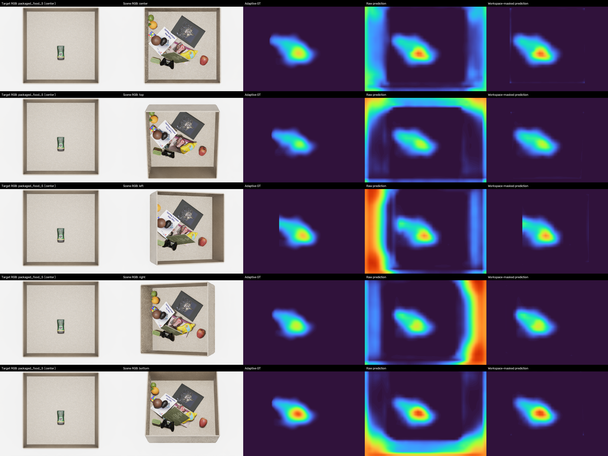

이 결과는 **고정 five-camera rig, native scale, 정확한 합성 target mask에서의 외부 target 1개 평가**임. 여러 unseen target, 임의 reference 거리·화각, target mask 오차, 새로운 scene camera, sim-to-real, scale 일반화와 DRL 탐색 개선까지 검증한 결과로 확대하지 않음.

### 6. 질문과 답변

**Q. Scene depth가 있으면 가려질 위치를 직접 계산할 수 있는데 왜 학습하는가?**

현재 관측 depth는 보이는 표면만 제공함. Mesh 기반 GT는 target의 수만 개 pose를 camera마다 렌더링하여 비율을 계산하지만, 추론에서는 target mesh를 요구하지 않고 RGB·mask reference에서 그 GT map을 근사하려는 목적임. 학습 모델이 가려진 내부 geometry를 정확히 복원한다는 가정은 하지 않음.

**Q. Mask를 쓰는데 RGB-only 또는 zero-shot이라고 불러도 되는가?**

Scene에는 depth를 쓰고 target에는 RGB와 mask를 쓰므로 현재 검증된 전체 입력은 RGB-only가 아님. Zero-shot의 확인 범위는 “학습에 없던 `packaged_food_5`를 같은 reference 규격과 정확한 합성 mask로 평가했다”는 것임. 실제 RGB에서 mask를 얻는 과정과 arbitrary camera 일반화는 남아 있음.

**Q. FiLM은 target마다 별도 모델을 만드는가?**

하나의 공유 MLP가 `g`에서 gamma/beta를 계산함. Target별 weight 표를 저장하지 않으며 새 geometry도 같은 함수에 넣을 수 있음. 다만 기존 target을 외우지 않았는지와 새로운 geometry에 일반화하는지는 별도 평가로 확인해야 함.

**Q. FiLM이 global이면 모든 위치가 같은 확률이 되는가?**

같은 것은 channel별 조절값이고 원래 depth feature는 위치마다 다름. 이후 MatchingBlock도 scene RGB·이웃 구조를 함께 보므로 map은 공간적으로 달라짐. Global 조절이 모든 영역의 activation에 영향을 줄 수 있다는 한계는 남지만, 현재 baseline에는 별도 local gate를 넣지 않음.

**Q. Map의 0.8이면 그곳에 target이 있을 확률이 80%인가?**

GT에서의 0.8은 해당 pixel을 덮는 candidate 중 전체 footprint의 70% 이상이 가려진 pose의 비율임. Target이 실제로 존재한다는 증거나 위치 posterior가 아님. 예측 0.8은 그 GT 값을 회귀한 출력이며 실제 존재 확률 calibration을 하지 않음.

**Q. 낮은 MAE인데 raw 그림의 벽이 왜 밝은가?**

보고 MAE는 GT coverage 안의 raw patch prediction을 평가함. Coverage 밖인 외곽 activation은 그 수치에 들어가지 않으며, 그림의 마지막 열은 고정 workspace mask로 이를 제거한 별도 결과임. 외곽 문제와 coverage 내부 정확도를 구분해야 함.

**Q. 현재 모델을 `inference_occlusion.py`로 바로 실행할 수 있는가?**

현재 full16 모델은 `train_occlusion.py`와 `evaluate_occlusion_checkpoint.py`의 native 68-D 입력 경로로 검증함. 기존 standalone `inference_occlusion.py`는 과거 exact-extent `A_XYZ_RING` checkpoint의 별도 target capture·geometry 계약을 사용하므로 full16 checkpoint에 그대로 연결하면 안 됨. 최신 입력 규격의 standalone 배포 CLI는 아직 정리되지 않음. 공개 clone의 파일만으로 최신 로컬 실험 전체가 재현된다고 보장하지 않으며, 실행 전 해당 코드·checkpoint의 입력 규격을 확인해야 함.

---

## Complexity Stream

> **현재 상태:** RGB-D density pilot은 실행 가능하다. 최종 구조적 Complexity의 GT는 미확정이다. Frozen-DINO 표현 진단은 A만 완료했으며, 물체 묶음 B와 추가 공간 표현 C의 효과는 아직 측정하지 않았다.

### 1. 목적과 입출력

Complexity는 target identity와 무관하게 **물체 더미 내부의 국소 구성과 물체 간 관계 차이**를 표현하려는 stream이다. Similarity가 보이는 물체와 target의 외형·의미 관계를, Occlusion이 해당 target이 가려질 수 있는 위치를 다루는 동안, Complexity는 scene 자체의 구조를 보완하려 한다.

예를 들어 넓은 책 한 권과 여러 물체가 빽빽하게 섞인 영역은 모두 높은 점유율을 가질 수 있다. 비스듬한 책 한 권은 depth 변화가 크고, 같은 높이의 여러 물체는 depth 변화가 작을 수 있다. 따라서 점유율·개수·depth 변화 중 하나를 그대로 최종 복잡도라고 정하기 어렵다. RGB의 물체 외형·문맥과 depth의 관측 기하를 함께 다루되, 무엇을 복잡도의 정답으로 삼을지는 별도로 검증해야 한다.

현재 구현은 이 연구 목표를 완성한 모델이 아니라, **관측 가능한 가시 label-group 개수와 점유율을 학습하는 density pilot**이다. 이 모델로 RGB의 추가 효과와 공통 feature 규격을 확인했다. 이후의 근접도·정적 제거·표현 진단은 기존 목표가 놓치는 능력을 확인하기 위한 실험이며, 서로를 대체하는 확정 Complexity GT가 아니다.

#### 현재 실행 가능한 입력과 출력

현재 pilot은 고정 five-camera rig의 한 시점씩 처리한다. 다른 camera의 영상을 한 번에 합치거나 숨겨진 물체를 복원하는 모델은 아니다.

| 항목 | 규격 | 의미 |
|---|---|---|
| Scene RGB | `B×3×480×640` | target image·category text 없이 scene 외형과 문맥 입력 |
| Scene depth | `B×1×480×640`, meter | 현재 데이터의 image-plane **axial-Z depth**; camera에서의 유클리드 ray distance와 구분 |
| Camera별 고정 reference | workspace mask와 empty-drawer depth, 각각 `480×640` | 관심 영역과 물체가 없는 고정 배경을 정의; 현재 scene의 GT segmentation이 아님 |
| Auxiliary prediction | `B×4×30×40` | 48/96/160px count score 3개와 patch occupancy 1개 |
| Stream feature `F_C` | `B×64×30×40` | 학습한 RGB-D feature 55개와 직접 depth cue 9개; 향후 fusion용 중간 표현 |

`B`는 한 번에 처리하는 영상 수다. 공간 격자 `30×40`은 `480/16 × 640/16`에서 나온다. `F_C`의 64 channels는 64개 물체나 64종 복잡도 등급이 아니라 각 patch 위치의 feature 성분이다. 최종 `F_C` 자체에는 sigmoid를 적용하지 않으며, 4개 auxiliary map에만 sigmoid를 적용한다.

추론 시 segmentation·asset 이름·target reference는 입력하지 않는다. 학습 정답은 저장된 segmentation으로 만들지만, 모델이 사용하는 scene 관측은 RGB-D와 고정 reference다. 별도의 Phase 34–35 GT-label 기반 진단과 이 추론 경로를 구분한다.

### 2. 전체 모델 구조

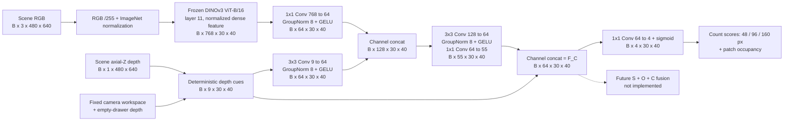

### 3. 내부 모듈과 선택 이유

| 연산 | 역할과 선택 이유 | 확인한 범위 |
|---|---|---|
| Frozen DINOv3 layer11 | 1,200개 patch마다 768-D 외형·문맥 feature를 제공한다. Backbone을 고정하여 작은 RGB-D head의 효과를 비교한다 | Layer11을 사용한 pilot이며 layer 선택의 독립 ablation은 아님 |
| RGB `1×1 Conv` | 각 위치의 768개 feature를 64개로 압축하여 depth branch와 결합하기 쉽게 한다 | RGB branch 자체는 공간 해상도를 변경하지 않음 |
| Depth `3×3 Conv` | 9개 직접 cue를 64개로 변환하면서 feature 격자의 이웃 정보를 혼합한다 | Image-space 이웃 연산이며 3D 물체 그래프 연산은 아님 |
| `Concat → 3×3 Conv → 1×1 Conv` | RGB와 depth를 함께 보고 55개 feature를 학습한다 | 어떤 물체 관계가 저장되는지를 별도 검증해야 함 |
| GroupNorm 8 + GELU | Channels를 8개 그룹으로 정규화하고 비선형 변환을 추가한다 | 정규화 방식·폭의 최적성을 별도 입증한 것은 아님 |
| 직접 cue 9개를 다시 concat | 계산 가능한 기하 정보를 학습 bottleneck 뒤에도 남겨 `55+9=64`를 만든다 | 현재 S/O feature와 같은 규격을 맞춘 설계; 최적 채널 배분이라는 증거는 없음 |
| `1×1 Conv 64→4 + sigmoid` | 각 위치를 세 count score와 occupancy로 읽어 학습 신호를 제공한다 | 4개 map은 target 존재 확률도 최종 scalar Complexity도 아님 |

DINO는 freeze하고 RGB/depth projection, fusion convolution과 auxiliary head만 학습한다. Feature의 형식을 `64×30×40`으로 맞췄다고 세 stream의 의미가 자동으로 정렬되거나 fusion 효용이 검증되는 것은 아니다.

#### Depth branch의 9개 직접 cue

Depth cue는 segmentation 없이 계산한다. Scene depth $d$와 동일 camera의 empty depth $d_0$가 모두 유한한 양수이고 workspace 안에 있는 pixel만 유효하다. 빈 서랍과 scene의 차이를 다음처럼 둔다.

$$
\Delta(u,v)=d_0(u,v)-d(u,v).
$$

양수는 빈 배경보다 camera 쪽으로 나온 표면이라는 뜻이다. 거칠기 계산 전에는 음수를 0으로 자르지 않는다. 각 patch 중심에서 다음 9개 map을 만든다.

| Channel | 실제 계산 | 의미와 주의점 |
|---|---|---|
| 1. Normalized depth | 유효 patch depth 평균을 `(mean−2.5m)/(3.5m−2.5m)`로 변환 후 `[0,1]` 제한 | 절대 깊이 단서이며 값이 크다고 더 복잡한 것은 아님 |
| 2. Direct foreground occupancy | 유효 pixel 중 `Δ>15mm`인 비율 | Empty reference보다 충분히 앞선 표면 비율; segmentation occupancy와 정의가 다름 |
| 3. Depth validity | Patch 256px 중 scene/empty depth와 workspace가 모두 유효한 비율 | Invalid 0-depth를 실제 표면으로 해석하지 않기 위한 지원 정보 |
| 4–6. Plane residual RMS | 48/96/160px window에서 `Δ`에 affine plane을 최소제곱 적합한 잔차 RMS를 `30mm`로 나누고 `[0,1]` 제한 | 단순 image-space 기울기를 제거한 잔차; 물체 수나 metric 곡률이 아님 |
| 7–9. Gradient variation | 각 window에서 유효 인접 pixel 사이의 수평·수직 `Δ` 차분 분산 합의 제곱근을 `20mm`로 나누고 `[0,1]` 제한 | 일정한 기울기보다 국소 변화에 반응; first difference는 1px 간격 |

Plane residual은 window의 유효 pixel에서 다음 연산에 해당한다. 좌표 $x,y$는 영상 크기로 나눈 image-space 좌표다.

$$
(a_s,b_s,c_s)=\arg\min_{a,b,c}\sum_{q\in V_s(p)}
\left[\Delta(q)-(ax_q+by_q+c)\right]^2,
$$

$$
r_s(p)=\sqrt{\frac{1}{|V_s(p)|}\sum_{q\in V_s(p)}
\left[\Delta(q)-(a_sx_q+b_sy_q+c_s)\right]^2}.
$$

Gradient variation은 유효 인접 쌍의 first difference $g_x,g_y$에 대해 $\sqrt{\mathrm{Var}(g_x)+\mathrm{Var}(g_y)}$다. 일정한 선형 기울기라면 두 roughness cue는 0이 된다. Plane 계산은 전체 window 면적의 유효 비율 ≥25%, 유효 pixel ≥6, 비퇴화 좌표 조건을 요구한다. 조건이 부족한 roughness는 0으로 두고 workspace 밖에는 cue를 만들지 않는다. 따라서 지원이 부족한 위치의 0을 평탄함의 확정 판정으로 쓰지 않는다.

**왜 empty reference를 빼는가?** 초기 raw-depth cue는 빈 서랍의 벽·곡면에도 반응했다. 단순 plane 제거만으로 고정 배경의 비평면 구조까지 사라지지는 않았다. 현재 V2는 `roughness_reference="empty_difference"`로 위 여섯 roughness channel을 계산한다. `scene_depth=empty_depth`이면 굽거나 단차가 있는 빈 배경도 `Δ=0`이 되어 거칠기 0이 된다. 앞의 normalized depth·occupancy·validity 정의는 그대로다. 함수의 호환성 기본값은 과거 `scene`이므로 **실제 실행은 checkpoint protocol의 V2 설정을 사용해야 한다.**

이 보정은 고정 camera/empty scene의 정합을 가정한다. Camera/FOV·drawer 위치·depth calibration이 바뀌면 reference도 다시 검증해야 하며, 다른 rig와 실제 sensor에서의 강건성은 검증하지 않았다.

### 4. GT 생성과 학습

#### 가시 segmentation label-group count

저장 mapping은 asset 이름에 색을 연결하지만 영속적인 physical instance ID는 아니다. 서로 다른 asset이 동일한 색을 공유하는 충돌이 있고, 동일 asset을 여러 번 배치해도 색이 합쳐질 수 있다. Pilot은 **서로 다른 색 그룹을 각각 한 번** 센다. 같은 색의 조각이 영상에서 떨어져 있어도 하나로 센다.

Workspace pixel 집합을 $\Omega$, mapping에서 알려진 색 그룹을 $g$, 해당 그룹의 workspace 내 가시 pixel을 $A_g$라 하자. Patch 중심 $p$의 한 변 길이 $s$인 정사각 pixel window를 $W_s(p)$라 하면:

$$
n_s(p)=\sum_g
\mathbf{1}[|A_g|\geq32]\,
\mathbf{1}[|A_g\cap W_s(p)|\geq16],
\qquad s\in\{48,96,160\}.
$$

$$
y_s(p)=\min\left(1,\frac{n_s(p)}{16}\right).
$$

즉 전체 workspace에서 최소 32px 보이는 그룹 중, 해당 window와 최소 16px 겹치는 그룹을 센다. 작은 흔적을 무조건 하나의 물체로 세지 않기 위한 고정 threshold이며, 이 threshold가 모든 물체 크기·camera에서 최적이라는 검증은 하지 않았다.

여기에 등장하는 `16`은 역할이 서로 다르다.

| 숫자 | 뜻 | 서로 대체할 수 없는 이유 |
|---|---|---|
| `16×16` patch | DINO ViT-B/16의 공간 sampling 단위 | 480×640 입력이 30×40 feature 격자가 되는 이유 |
| Window와 겹치는 `16 pixels` | count에 포함할 최소 가시 증거 면적 | Patch 한 변이나 label 개수와 다른 면적 threshold |
| `count ÷16` | 원본 library의 16개 asset을 기준으로 한 고정 정규화 | Count score를 bounded scale로 학습하기 위한 값; patch 크기와 무관 |

예를 들어 유효 window에 세 그룹이 포함되면 정답은 `3/16=0.1875`다. 영상별 min–max 정규화는 하지 않으며 16을 넘는 count의 clipping 비율은 별도로 기록한다. 색 충돌로 실제 3개 물체가 2개 색 그룹으로 보이면 현재 GT는 2를 센다. **Phase 36에서 충돌을 확인했지만 과거 density GT·checkpoint·수치는 소급 수정하지 않았다.**

48/96/160px은 가까운 영역부터 더 넓은 문맥까지 보기 위한 **세 가지 image-space window 가설**이다. 한 변 길이는 3/6/10 patch 폭에 해당하지만 count는 원본 pixel window에서 계산한다. 특정 물체의 metric 크기, 접촉 거리, grasp 범위를 뜻하지 않는다. Window 수·크기의 독립 ablation도 없으므로 이 조합이 최적이라고 주장하지 않는다. 큰 window의 count가 커질 수 있으며, `count/16`은 서로 다른 scale 사이의 물리 면적당 density가 아니다.

Count supervision의 유효 mask는 다음 두 조건을 모두 요구한다.

- **전체 정사각 window 면적의 ≥95%**가 workspace에 포함된다. 영상 밖으로 잘린 부분도 전체 면적 분모에 포함하므로 drawer 경계에서 작은 window인 것처럼 유리해지지 않는다.
- Window의 workspace 안에 mapping에 없는 nonblack pixel이 없다. Unknown을 빈 배경으로 가정하여 count를 낮추지 않는다.

Pilot에서 mapping에 알려진 동일색 alias는 한 그룹으로 유지한다. Phase 36 대응 진단에서는 asset identity가 모호한 **충돌 색 자체를 unknown으로 제외**했으므로 두 실험의 label 처리와 metric을 혼동하지 않는다.

#### Patch occupancy

Occupancy는 더 큰 count window가 아니라 **16×16 patch 자체**의 면적 비율이다. $F$를 알려진 foreground pixel, $U$를 workspace 내 unknown nonblack pixel, $P(p)$를 해당 patch라 하면:

$$
y_{\mathrm{occ}}(p)=
\frac{|P(p)\cap F|}{|P(p)\cap(\Omega\setminus U)|}.
$$

분모가 0인 patch는 정답을 0으로 두고 loss weight도 0으로 둔다. Occupancy loss weight는 `알려진 workspace pixel 수 /256`이다. Count의 최소 면적 조건을 통과하지 못한 작은 **알려진** 색 그룹도 occupancy에서는 foreground다.

Occupancy가 1이라는 것은 알려진 workspace가 물체로 덮였다는 뜻이다. 넓은 한 물체와 여러 물체의 밀집 영역을 구분하지 못하므로 구조적 복잡도의 정답으로 채택하지 않는다.

#### Loss와 추론: auxiliary task가 feature를 만드는 방법

정답과 예측의 channel 순서는 `[count48/16, count96/16, count160/16, occupancy]`다. Count의 binary validity 3개와 occupancy의 알려진 workspace 비율 1개를 각각 loss weight $M_c$로 사용한다.

$$
\mathcal{L}=\frac{1}{4}\sum_{c=1}^{4}
\frac{\sum_{b,p}M_c(b,p)\,\ell_{0.05}(\hat y_c(b,p)-y_c(b,p))}
{\max\left(1,\sum_{b,p}M_c(b,p)\right)},
$$

$$
\ell_\beta(e)=
\begin{cases}
e^2/(2\beta),& |e|<\beta,\\
|e|-\beta/2,& |e|\geq\beta.
\end{cases}
$$

네 channel은 유효 영역의 크기로 각각 정규화한 뒤 동일 가중 평균한다. 즉 넓은 window가 유효 pixel 수 때문에 loss를 독점하지 않는다. **학습에는 count=0인 유효 window도 포함**한다. 주 평가·checkpoint 선택의 count MAE는 별도로 **GT count>0인 유효 window**에서 계산하여 빈 영역으로 오차를 희석하지 않는다.

Frozen RGB feature를 cache하고 작은 head를 AdamW로 학습한다. RGB-D/depth-only 비교는 같은 architecture·초기값·sample 순서를 사용하며 depth-only는 DINO feature를 0으로 만든다. 따라서 head 크기가 다른 두 모델의 비교가 아니다. Validation occupied-window count MAE로 checkpoint를 고른 뒤 test를 평가한다.

추론에서는 `inference_complexity.py`가 checkpoint protocol, DINO weight와 고정 reference의 hash를 확인하고 RGB-D만으로 `maps(4,30,40)`, `features(64,30,40)`, `geometry(9,30,40)`, `validity(1,30,40)`를 반환한다. 학습 GT의 segmentation mask는 이 경로에 없다. 예측 count score에 16을 곱하면 가시 label-group 개수 단위로 해석할 수 있지만, 연속 추정치이며 정수 물체 수나 hidden count는 아니다.

구현은 [`complexity_cues.py`](complexity_cues.py), [`complexity_model.py`](complexity_model.py), [`run_complexity_pilot.py`](run_complexity_pilot.py), [`inference_complexity.py`](inference_complexity.py)에 있다. 상세 실행법은 [density pilot 문서](docs/complexity_results/README.md)를 따른다.

### 5. 핵심 설계 과정과 검증 결과

실험은 count 예측을 시작으로, 그 목표가 놓치는 물체 관계와 표현의 능력을 순서대로 점검했다. 각 단계의 성공은 그 단계의 질문에 한정한다.

| 단계와 질문 | 주요 결과 | 현재 판단 |
|---|---|---|
| **Phase 33 — RGB가 count 예측에 도움이 되는가?** | All16 source pools·5 views, train/val/test `3,840/960/960`, 3 seeds에서 count MAE depth **0.8327 → RGB-D 0.6414**, **22.97% 감소** | Density 예측에는 RGB의 추가 효과가 있다. 간격·가림·접촉 구조나 탐색 효용을 검증한 것은 아님 |
| **Phase 34 — 다른 물체와 가까운 표면을 국소화할 수 있는가?** | GT label+depth의 근접도는 가까운 접경에 반응하고 단독 물체는 0. 하지만 투영 면적 편차 **3.1746%>사전 3%**로 통제 실패 | 관측 표면 근접도 후보로만 보존. 숨겨진 접촉·전체 적층·Complexity GT를 설명하지 못함 |
| **Phase 35 — 물체 평균 근접도가 제거 효과를 예측하는가?** | 실제 asset 10 layouts 재현 후 공통 **701조건/49 views**에서 새 노출 비율과 평균 Spearman **0.078**, visible area **0.387**, count **0.291** | 30mm 근접도의 물체 평균을 제거 순위 점수나 GT로 채택할 근거가 부족함. 근접 feature 전체의 무용함을 뜻하지 않음 |
| **Phase 36 — 기존 DINO에 물체 대응 정보가 없는가?** | 같은 category의 가시 asset 대응에서 DINO+position AUROC **0.998953**, depth+position **0.773882**, RGB-D+position **0.998908**, raw cosine **0.925424** | 순수 patch 내부 대응은 기존 feature에서 잘 읽힌다. 경계·다중 물체 관계나 최종 Complexity를 해결한 결과가 아님 |

Phase 33의 count MAE는 세 window에서 유효한 occupied 위치의 오차를 계산하고 영상·scale·seed를 평균한 **가시 segmentation label-group 개수 단위**다. RGB-D는 5/5 camera에서 개선됐으며, 12개 test scene-key cluster를 함께 재표집한 개선량 95% 구간은 `[0.1790,0.2054]` 그룹이었다. RGB-D occupancy MAE는 `0.00854`, depth-only learned head는 `0.01524`, 직접 depth occupancy는 `0.00981`이다. 수치상 이득이 있어도 occupancy가 넓은 단일 물체와 다물체 밀집을 구분하지 못한다는 한계는 남는다.


열은 scene RGB / 96px count GT / RGB-D prediction / 절대 오차 / occupancy GT / 직접 depth occupancy / depth plane residual이다. Count의 GT-valid window만 표시하므로 표시 밖의 0을 물체가 없다는 판정으로 읽지 않는다. Empty-reference 수정과 평가 조건은 [Phase 33](#2026-09-07--phase-33--rgb-d-complexity-pilot)에 있다.

Phase 34–35는 **GT label을 계산 입력으로 쓴 teacher 진단**이다. Phase 35의 pose가 보존된 추가 capture는 원본 16개에 `World1`을 더한 17-asset 데이터이며, 원본 `260714_data`와 별도다. 먼저 50/50 views의 원본 label/depth 정합을 확인한 다음, 다른 물체를 고정하고 하나만 지웠을 때 새로 보이는 다른 물체 면적을 계산했다. 이는 실제 grasp·재정착·target 발견 실험이 아니다. 사진·통제 실패·공통 표본 집계는 [Phase 34](#2026-09-08--phase-34--observed-surface-proximity-diagnostic), [Phase 35](#2026-09-16--phase-35--cluttered-scene-static-removal-diagnostic)에서 확인한다.

Phase 36은 all16 seen assets, 사전 선택한 train/val/test `8/4/8 scene keys ×16 pools ×5 views`에서 A 진단만 수행했다. GT가 patch의 ≥90%, workspace·valid depth가 각각 ≥95%인 위치에 한정하고, positive/negative의 정확한 XY offset·anchor category·depth 차이 구간을 맞췄다. GT/category는 감독·표집 전용이다. 주 평가의 **80,024 pairs/604 views/8 scene keys**에서 view별 AUROC → key별 pool/view 평균 → 8 keys 동일 평균 → 3 seeds 평균을 사용했다. 전체 test는 150,690 pairs/640 views이며 pair와 view를 독립 scene 수로 세지 않는다.

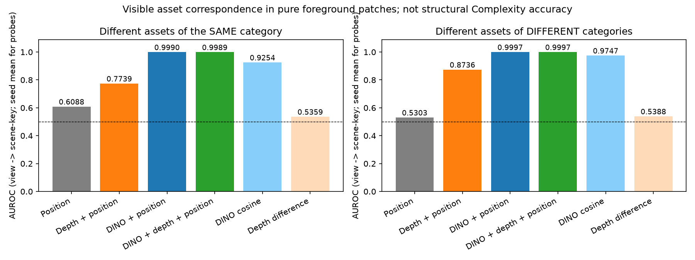

Test의 알려진 foreground 128,380 patches 중 적격은 54,429개, **42.40%**였다. Unknown/색 충돌은 이 분모에서 제외된다. 경계·작은 물체·심한 가림의 상당 부분과 동일 asset 복제 구분을 평가하지 않았으므로, 이 높은 AUROC를 전체 영상의 instance segmentation 정확도로 해석하지 않는다. 자료와 큰 오차 pair 그림은 [Phase 36](#2026-09-16--phase-36--frozen-dino-visible-asset-representation-probe)에 있다.

### 6. 질문과 답변

**Q. 왜 Complexity를 count/occupancy로 바로 정의하지 않는가?**

두 정답은 보이는 물체 영역의 양과 label-group 수를 감독한다. 같은 수의 물체라도 배치·분리·가림 관계는 다를 수 있다. 반대로 높은 occupancy가 여러 물체를 뜻하지도 않는다. Pilot의 예측 오차가 낮다는 것과 구조적 Complexity의 정의가 적절하다는 것은 별개 질문이다.

**Q. Depth의 거칠기를 그대로 복잡도라고 하면 안 되는가?**

단일 물체의 기울기·곡면과 고정 서랍 구조가 depth 변화에 영향을 준다. Empty-reference 보정과 plane/gradient 처리로 일부 반례는 줄였지만, 남은 잔차가 물체 관계를 뜻한다고 입증하지 않았다. 그래서 depth cue는 `F_C`의 입력·보조 정보로 보존한다.

**Q. 물체 대응을 거의 완벽하게 구분했으면 Complexity도 해결된 것인가?**

Phase 36은 GT가 골라 준 순수 내부 patch의 **가시 asset label 대응** 문제였다. 경계를 찾고 물체 전체를 묶거나, 여러 물체의 겹침·구성 관계를 읽는 과제는 아니다. 서로 다른 목표를 대신하는 성능 지표로 사용하지 않는다.

**Q. Similarity의 SigLIP처럼 별도 모델을 추가하는가?**

현재 계획은 `A: DINO+depth → B: 예측한 물체/영역 묶음 추가 → C: 사전학습 공간 관계 표현 추가`다. **A만 완료했고 B/C는 미실행**이다. 이번 순수 patch 이진 진단이 거의 포화되어 B/C의 추가 효과를 검증하기 어려우므로, 이 과제를 이유로 모델을 바로 추가하지 않는다. SAM/VLM이 일반적으로 불필요하다는 결론도 아니다.

**Q. 다음 Step은 무엇인가?**

실제 더미의 **경계·분리된 가시 조각의 소속·다중 물체 관계**에서 기존 표현이 구체적으로 놓치는 능력과 관측 가능한 label을 먼저 분리한다. 그 평가를 사전 고정한 뒤 같은 region 조건에서 B/C의 추가 정보를 비교한다. GT mask로 region을 제공한 결과는 oracle로 구분해야 한다. 새 scalar나 최소 제거 횟수를 Complexity GT로 대체하지 않는다.

**Q. 이 feature로 최종 2D-PDM을 만들 수 있는가?**

형식상 `Concat(F_S,F_O,F_C)`는 `B×192×30×40`이지만 fusion network·학습 GT·loss·DRL 통합은 아직 미구현이다. 최종 필요성은 Similarity+Occlusion 대비 Similarity+Occlusion+Complexity가 탐색 결과에 주는 추가 효용으로 검증해야 한다. 현재 density pilot과 A probe만으로 그 결론을 대신하지 않는다.

---

## Project Status

현재 결과와 구현 상태를 요약함. 과거 중간 모델의 수치·검증은 아래 Development Log에서 해당 Phase를 확인함.

| 구성 | 현재 기준 | 남은 검증 |
|---|---|---|
| Similarity | Frozen DINOv3 + SigLIP, shortcut 없는 학습 head | 공식 기준 checkpoint 지정, 정량 object/category-held-out 평가 |
| Occlusion GT | Target/yaw별 adaptive pose grid, full16 240,000 maps 생성 | 새 target별 geometry 검증과 실제 관측 조건 확장 |
| Occlusion model | Native 68-D geometry + raw target broadcast + global FiLM; full16 10% baseline | 여러 external targets, reference mask 추정과 camera 일반화 |
| External Occlusion | 학습하지 않은 `packaged_food_5`, 새 30 scenes × 5 views에서 MAE 0.0180 / Soft-IoU 0.812 / IoU 0.723 | 한 target의 합성 평가 범위를 넘는 일반화 |
| Complexity pilot | RGB-D visible-density 학습·추론 구현; 구조적 Complexity GT로 채택하지 않음 | 구체적인 물체·관계 표현의 부족과 보완 효과 |
| Complexity 표현 진단 | 순수 내부 patch의 seen-asset 대응 A probe 완료 | 경계·다중 물체 관계 및 추가 모델 B/C 비교 |
| Three-stream fusion | 후보 입력 규격 `B×192×30×40` | 최종 GT·loss·구조·통합 학습·ablation |
| Exploration / deployment | 탐색 prior로 연결할 계획 | DRL 탐색 효용, 실제 RGB-D와 sim-to-real |

### Core Files

아래 파일명은 현재 연구 구현을 찾아가기 위한 안내임. 공개 clone의 일부 Occlusion 실행 코드는 로컬 개발 기준보다 오래됐거나 누락되어 있으므로, 본문의 현재 실험을 공개 clone만으로 모두 재현할 수 있다는 뜻은 아님. 이번 문서 정리는 미검증 코드를 추가로 게시하지 않음.

| 기능 | 구현 파일 | 역할 |
|---|---|---|
| 공통 RGB backbone | `backbone.py` | Frozen DINOv3 patch feature 추출 |
| Target reference | `target_utils.py`, `train_common.py` | Crop/mask 정렬, masked pooling, target cache와 데이터 분리 |
| Similarity 모델 | `similarity_model.py` | 의미 결합, scene–target interaction, MatchingBlock, map head |
| Similarity GT·학습 | `gt_similarity.py`, `precompute_gt.py`, `train_similarity_v2.py` | Category 기반 GT와 관련성 map 학습 |
| Occlusion 모델 | `occlusion_model.py` | Scene RGB-D와 target geometry의 FiLM 결합 |
| Occlusion GT | `generate_occlusion_map.py`, `generate_occlusion_gt_batched_v2.py` | Adaptive pose 표집, depth 비교, probability/coverage 누적 |
| Occlusion 기하 | `mesh_utils.py`, `mesh_cache.py`, `depth_rasterizer_gpu.py` | Mesh 좌표 변환·단순화와 GPU depth 렌더링 |
| Occlusion 학습·평가 | `occlusion_dataset.py`, `train_occlusion.py`, `evaluate_occlusion_checkpoint.py` | Coverage를 반영한 학습과 저장 split·external target 평가 |
| Complexity GT·depth | `complexity_cues.py` | Window count, occupancy와 empty-reference 보정 geometry |
| Complexity 모델 | `complexity_model.py` | RGB-D feature 55개와 직접 geometry 9개의 결합 |
| Complexity 실행 | `run_complexity_pilot.py`, `inference_complexity.py` | Frozen feature cache, 비교 학습, segmentation 없는 pilot 추론 |

---

## Roadmap

현재 기준 모델을 계속 확장하기보다, 아직 확인하지 않은 질문을 우선함. 완료된 세부 실험 목록은 Development Log에 있음.

- [ ] Similarity 기준 checkpoint와 재현 설정을 확정하고 정량 unseen target 평가 수행
- [ ] Occlusion을 여러 외부 target과 실제 reference mask 추정 조건에서 평가
- [ ] 고정 camera reference에 대한 의존성과 camera/환경 변화의 영향을 검증
- [ ] 실제 더미에서 Complexity의 경계·다중 물체 관계 능력 진단을 정의
- [ ] 부족한 능력이 확인된 조건에서 물체 묶음·공간 사전학습 표현을 공정하게 비교
- [ ] Complexity의 출력 의미와 GT 타당성을 확정
- [ ] Fusion의 GT·loss·decoder를 정의하고 S+O 대비 S+O+C를 비교
- [ ] DRL 탐색 효용과 실제 RGB-D 환경을 검증

---

## Development Log

Similarity·Occlusion·Complexity 연구가 현재 상태에 도달한 이유를 시간순으로 기록함. 각 Phase는 단순 모델 목록이 아니라 **왜 문제가 되었는지 → 무엇만 바꿨는지 → 결과가 무엇을 뜻하는지 → 다음 Step은 무엇인지**를 설명함.

### 전체 연구 흐름

이 표는 아래 상세 이력을 현재 관점에서 연결한 색인임. 중간 모델의 성공을 현재 모델의 직접 비교 결과로 해석하지 않음.

| 단계 | 핵심 문제와 시도 | 현재까지의 결론 | 상세 기록 |
|---|---|---|---|
| Similarity 의미 보완 | DINO 외형 대응 → CLS category prototype → SigLIP 의미 결합 → cosine shortcut 점검 | 현재는 DINO+SigLIP의 shortcut 없는 head; 정량 unseen 검증은 남음 | Phase 1–4 |
| Occlusion GT 계산 | 촬영 기반 GT를 mesh depth와 pose별 가림 비율 계산으로 전환 | GPU probability GT 생성과 렌더링 정합을 확인 | Phase 5–8 |
| Target conditioning 진단 | 공정한 split에서 외형·크기·shape와 global/local 조절을 비교 | Target geometry의 역할과 각 실험의 한계를 확인; oracle gate는 현재 baseline이 아님 | Phase 9–30 |
| Occlusion 기준 모델 확정 | Fixed grid의 target별 pose 누락을 확인하고 adaptive GT로 수정 | Full16 native68 global FiLM baseline과 external target 1개 평가 완료 | Phase 31–32 |
| Complexity 정의 점검 | Count/occupancy → 관측 근접도 → 실제 더미의 정적 제거 효과 | Density 학습은 가능하지만 해당 scalar를 구조적 Complexity GT로 채택할 근거는 부족 | Phase 33–35 |
| Complexity 표현 진단 | 기존 feature의 정보 부족과 학습 목표의 한계를 구분 | DINO의 순수 patch 대응은 거의 포화; 다음은 경계·관계 능력과 보완 표현의 검증 | Phase 36 |

### 지표와 범위 읽는 법

- `MAE`: 예측 map과 GT의 평균 절대 오차로, 낮을수록 좋음.
- `Coverage`: 해당 target의 유효 pose가 실제로 덮을 수 있는 영역.
- `Workspace`: 현재 camera에서 보이는 서랍 내부 영역.
- `Impossible-workspace` 또는 `noncoverage`: 과거 실험에서 coverage 밖의 workspace를 부르던 명칭. 해당 GT 설정의 표본 pose가 덮지 않는 영역이며 저장값은 0임. 모든 pose에서 물리적으로 가림이 불가능하다는 뜻은 아님. 이 영역의 activation을 당시 지표에서 `leakage`로 측정했음.
- `S`: target scale 변화에 예측이 GT가 요구하는 방향으로 반응하는 정도. `S > 0`은 방향이 맞다는 최소 조건임.
- `Training-heldout` 4개 target은 구조 선택에 반복 사용한 development set이며 최종 zero-shot test가 아님.
- Exact 3D extent와 coverage label은 simulation에서 얻은 oracle임. Oracle 실험은 정보와 구조의 가능성을 확인하는 단계이며, target RGB만 사용하는 실제 배포 성능을 뜻하지 않음.
- 사전 평가 기준을 만족하지 못했다는 기록은 해당 가설이 불가능하다는 뜻이 아니라, **그 구성으로 후속 seed를 확대하지 않고 원인을 먼저 분리했다는 뜻**임.

### 2026-07-21 · Phase 1 — DINOv3 Appearance Matching

**Reference:** `code_260721/train_similarity.py`

**가설:** Frozen DINOv3 feature 비교만으로 unseen target의 zero-shot similarity map 생성 가능.

```text
Scene RGB  → DINOv3 patch features X_s^l
Target RGB → DINOv3 masked-pooled vector a_t^l

c_hat^l = ShiftTo01(CosineSimilarity(X_s^l, a_t^l))
Z^l     = Concat[X_s^l, a_t^l, c_hat^l]
P_S     = CNN_Head(Z^l)
```

**결과:** 색상·재질·형상 등 appearance가 유사한 영역은 탐지했으나, category-level semantic relation은 표현하지 못함.

**의미와 다음 Step:** 해당 구성에서는 dense appearance matching만으로 target–category–scene의 의미 관계를 충분히 표현하지 못했음. 다음 Step에서는 DINOv3의 image-level CLS가 category 정보를 보완할 수 있는지 확인함.

---

### 2026-07-27 · Phase 2 — CLS Prototype Category Conditioning

**Reference:** `code_260727/train_similarity.py`, `code_260727/train_common.py`

**가설:** Image-level CLS token을 category prototype으로 사용하면 patch feature보다 추상적인 category 정보 제공 가능.

Category별 CLS vector 평균으로 네 개의 prototype을 구성하고 unseen target CLS와 cosine similarity 계산.

```text
prototype_k = L2Norm(Mean[CLS(target_i) | category_i = k])

category_prob = Softmax(
    CosineSimilarity(CLS(unseen_target), prototype_k) / temperature
)
```

정답 누설 방지를 위해 leave-one-out prototype 사용. Category 확률을 spatial location에 broadcast한 뒤 interaction feature에 concat.

```text
Z^l = Concat[
    scene patch,
    target appearance,
    patch-wise cosine,
    category probability
]
```

**결과:** Category prior는 제공했으나 prototype도 DINOv3 appearance history의 평균이므로 외부 semantic grounding이 없음. 기존 prototype과 외형 차이가 큰 unseen object에서 category 추론 불안정.

**의미와 다음 Step:** 해당 네 category prototype은 학습 물체의 DINOv3 외형 이력을 요약한 값이므로, 외형이 달라지는 unseen target까지 안정적으로 설명하지 못했음. 외부 language semantics와 정렬된 VLM을 추가하는 방향으로 이동함.

---

### 2026-07-28 · Phase 3 — DINOv3 + SigLIP Semantic Fusion

**Reference:** `code_260728_ver2/train_similarity_v2.py`

**수정:** DINOv3의 dense spatial representation을 유지하고, SigLIP의 language-aligned semantics를 target query에 추가.

```text
DINO appearance : a_t^l ∈ R^768
SigLIP semantics: s ∈ R^1152
Projection      : s_t^l = W_l · s + b_l
Target query    : q_t^l = a_t^l + s_t^l
```

SigLIP image/text embedding을 평균하고 layer별 projection으로 DINOv3 차원에 정렬. 두 backbone은 frozen으로 유지하고 projection과 matching head만 학습.

**결과:** 학습에 포함되지 않은 packaged-food target에서 same-category 영역 활성화 확인.


**의미와 범위:** 학습에 없던 packaged-food target의 정성 사례에서 같은 category 영역이 활성화되는 것을 관찰함. 이는 SigLIP 의미 정보의 가능성을 보여주는 사례이며, 여러 unseen instance에 대한 정량 zero-shot 성능은 최종 benchmark에서 별도로 확인해야 함.

---

### 2026-07-28–29 · Phase 4 — Exact-Instance Shortcut Evaluation

**문제:** SigLIP 결합 후 unseen packaged-food 사례에서 category-level activation을 관찰했으나, visible exact target이 same-category object보다 높게 출력되지 않는 사례도 확인함.

**실험:** DINOv3 cosine을 output logit에 직접 더하는 residual shortcut과 layer `2 + 5` 선택 방식을 평가. Global pooling, raw appearance cosine, visibility, patch matching도 함께 분석.

**결과:** 공통 held-out scene에서 no-shortcut과 shortcut의 exact-target positive ranking은 각각 `29.0%`, `29.7%`로 거의 동일. Median gap은 소폭 개선됐지만 두 모델 모두 instance-level ranking을 충분히 달성하지 못함. 공간 구조를 사용하지 않는 patch matching도 competitor score를 함께 높여 문제를 해결하지 못함.

**결론:** Shortcut은 계산 비용보다 구조와 해석의 복잡성을 늘리는 반면 실질적인 개선이 제한적이므로 최종 Similarity stream에서 제거. 현재 모델은 DINOv3–SigLIP interaction과 learned matching head만 사용함.

추가로 target별로 서로 다른 무작위 split seed가 생성되던 문제를 수정. 실행마다 seed를 한 번만 확정하여 모든 target의 scene-level train/validation split을 재현할 수 있도록 정리.

---

### 2026-08-04 · Phase 5 — Zero-Shot Occlusion Pipeline Design

**문제:** 기존 방식은 target당 `44,100`개 pose와 5개 camera를 촬영하여 중간 RGB·depth·mask를 대량 저장함. 최종 GT도 유효 pose의 depth-weighted occupancy를 scene별 min–max로 정규화하므로 서로 다른 scene에서 흰색의 절대적 의미가 일정하지 않음.

**GT 설계:** Target을 물리적으로 반복 촬영하는 과정을 USD/OBJ mesh depth 계산으로 대체. 기존 pose grid와 `70%` occlusion 판정은 legacy 재현에 유지하고, 실제 학습용 GT는 다음 확률로 별도 생성함.

```text
P_O(u,v) = N_occluded(u,v) / (N_candidate(u,v) + epsilon)
```

Legacy GT와 probability GT를 동시에 출력하여 기존 방식 재현 여부와 새 정규화 효과를 분리해 평가. Visible-target 강조는 Similarity stream과 역할이 겹치므로 Occlusion GT에서 제외함.

**Scale conditioning:** Mesh scale과 target RGB·mask scale을 반드시 동일하게 구성. 동일한 target 입력에 서로 다른 scale GT를 주면 모델이 scale별 정답의 평균으로 수렴하므로 size-effect를 학습할 수 없음. Pilot은 `0.7`, `1.0`, `1.3`으로 시작함.

**모델 설계:** Scene RGB는 frozen DINOv3, scene depth와 valid mask는 ResNet-18로 처리. Target mask에서 추출한 size·silhouette condition으로 depth feature에만 FiLM을 적용하고, target appearance는 MatchingBlock에서 별도로 결합함. 검증되지 않은 cosine shortcut은 baseline에서 제외함.

**배포 조건:** 현재 prototype은 scene RGB, scene depth, target RGB와 target mask/segmentation을 입력으로 사용함. 고정 촬영 환경의 empty-background reference로 mask를 자동 생성하는 전처리는 후속 구현 항목이며, USD/OBJ와 scale 정보는 GT 생성에만 사용함.

**Zero-shot 검증:** Frozen encoder 사용만으로 zero-shot을 가정하지 않고, 학습에서 제외한 target instance와 unseen intermediate scale을 별도 test split으로 평가함.

**다음 Step:** `packaged_food_2`, center camera, scale `1.0`의 mesh-depth 재현 pilot을 수행한 뒤 multi-asset·pose·camera 조건으로 확장함.

---

### 2026-08-04–06 · Phase 6 — Mesh-Depth Validation and GT Refinement

**Reference:** `mesh_utils.py`, `depth_rasterizer.py`, `scene_generator/occlusion_gt_pilot_capture.py`, `experiments/occlusion_gt_pilot/validate_rasterizer.py`

**검증:** `packaged_food_2`, `book_1`, `fruit_1`, `toy_3`을 대상으로 9개 pose와 5개 camera를 조합한 180개 조건에서 USD mesh depth와 Isaac Sim reference를 `640 × 480`으로 비교함.

**수정:** Segmentation reference를 `depth > 0`으로 계산하면 drawer와 background가 포함되는 오류를 확인하고 target segmentation color 기반 mask로 교체. `metersPerUnit=0.01` asset의 자동 unit-compensation scale이 transform 초기화 과정에서 제거되는 문제도 수정함.

**결과:** 176개 조건에서 silhouette IoU `0.9993–1.0000`, 전체 중앙값 `1.0000`, depth MAE 중앙값 `0.75 μm` 확인. 나머지 4개는 서랍 경계에서 drawer wall이 target 일부를 가린 조건으로, mesh projection 오류가 아니라 empty-drawer visibility 처리 차이로 확인함.

**기존 GT 문제:** 기존 `distribution_map_GPU.py`는 occluded pixel에 `valid_pos`를 적용하지만 ratio 분모에는 target 전체 pixel을 사용함. 기존 결과 재현용 `legacy_ratio`는 보존하고, 새 학습 GT는 valid pixel을 분모로 사용하는 `corrected_ratio`와 `70%` threshold를 적용하기로 결정함.

**성능 병목:** 검증용 rasterizer가 triangle별 Python loop를 사용하여 `toy_3`의 2,029,960 triangles에서 평균 `577.72 s/image` 소요. 새 asset에도 적용 가능한 자동 mesh 단순화, full-resolution 정확도 검사, hardware GPU rasterization, pose/camera batch 누적 구조가 필요함.

**결정:** 해상도는 기존과 동일한 `640 × 480`으로 유지. 기존 `distribution_map_GPU.py`는 legacy reference로 수정하지 않으며, corrected ratio와 probability normalization은 새 GT generator에 구현함. 실제 배포에서는 mesh 단순화를 수행하지 않고 scene RGB, scene depth, target RGB와 target mask/segmentation을 입력함.

**다음 Step:** Empty-drawer valid-pixel 처리를 검증에 반영하고, `toy_3`의 단순화 후보를 원본 mesh와 비교하여 자동 선택 기준을 확정한 뒤 batched GPU GT generator를 구현함.

---

### 2026-08-06 · Phase 7 — GPU Rasterization, Corrected Ratio, and Capture Reliability

**Reference:** `depth_rasterizer_gpu.py`, `experiments/occlusion_gt_pilot/validate_rasterizer_gpu.py`, `experiments/occlusion_gt_pilot/occlusion_ratio_pilot.py`, `scene_generator/vectorized_scene_v2.py`

**GPU rasterization:** nvdiffrast 기반 `640 × 480` depth renderer를 구현함. 원본 4개 asset과 `toy_3` 10k simplified mesh를 포함한 225개 조건에서 silhouette과 depth를 검증함. `toy_3` 10k mesh는 원본 대비 worst IoU `0.9938`, median depth MAE `0.3781 mm`를 기록함.

**70% decision:** 20개 clutter scene과 9개 pose, 5개 camera에서 원본·GPU·단순화 mesh를 비교함. `toy_3` 원본–10k 판정 일치율은 전체 `99.67%`, `0.65–0.75` 경계 구간 `96.59%`임.

**Corrected denominator:** Drawer wall이 target 일부를 가리는 `book_1` 경계 조건에서 valid pixel이 `10.01–12.77%` 감소함. Corrected ratio 적용 시 `6/80`개 조건의 `0.7` 판정이 변경되어 기존 분모 불일치가 실제 결과에 영향을 주는 것을 확인함.

**Clutter capture:** 물리 안정화 이후 카메라 촬영을 `world.step()`에서 render-only `world.render()`로 변경함. 캡처 전후 위치·회전 불변성을 직접 확인하고, run/scene/object pose, camera metadata, seed와 완료 상태를 저장하도록 구성함. 실제 transformed mesh vertex 기준 drawer 내부 QC도 추가함.

**후속 결과:** nvdiffrast V2 generator에 pose·camera·scene vectorization과 probability accumulator를 결합했고, V1/V2를 1,024 effective poses에서 교차검증함. 새 asset의 원본–단순화 최종 승인은 별도 절차로 유지함.

**의미와 다음 Step:** GPU rasterization과 mesh 단순화를 결합하면 기존 `640 × 480` 해상도를 유지하면서 전체 pose grid를 처리할 수 있음. 또한 corrected denominator가 실제 `70%` 판정을 바꾸는 사례를 확인했으므로, 기존 GT 재현에는 legacy ratio를 남기고 새 학습 GT에는 corrected ratio를 사용하기로 함. 다음 Step은 전체 `44,100` pose에서 legacy 재현도와 새 probability map을 동시에 확인하는 것임.

---

### 2026-08-07 · Phase 8 — Mesh-Based Legacy and Probability GT Generation

**구현:** `packaged_food_2`, scale `1.0`에서 `44,100`개 pose 전체를 nvdiffrast로 처리함. Target depth를 파일로 저장하지 않고 scene depth와 즉시 비교하여 Legacy GT와 corrected probability GT를 동시에 누적함.

**Legacy 재현:** 기존 코드를 확인하여 visible ratio가 `0.3` 이상일 때 map 전체를 `0.7`배로 낮추고 visible target mask를 `255`로 설정하는 후처리를 복원함. 대표 target frame 한 장의 pixel 수를 reference로 사용하면 threshold 경계 사례가 잘못 분류되는 문제를 확인함.

**Reference 복원:** 기존 GT 3,000 scene × 5 camera의 후처리 ON/OFF 경계를 분석하고, `44,100`개 mesh pose에서 camera별 최대 footprint를 직접 계산함. 최종 정수 reference는 center `2324`, left `2335`, right `2336`, top `2336`, bottom `2335`이며, 15,000개 기존 사례의 ON/OFF 판정을 모두 재현함.

**다중 scene 검증:** 최종 reference로 20 scene × 5 camera의 100개 사례를 재검증함. Old GT 대비 Legacy GT의 MAE는 평균 `0.0000379`, 최댓값 `0.0000959`이며, correlation은 평균 `0.9999956`, 최저 `0.9999919`임.

**분리 원칙:** Visible-target 강조는 기존 GT 재현용 Legacy map에만 적용함. 학습용 Corrected Probability GT는 `N_occluded / N_candidate`의 절대적 의미를 유지하기 위해 scene별 min–max 정규화와 visible-target 강조를 적용하지 않음.

**결과물:** Scene RGB, Target RGB, 기존 GT, mesh 기반 Legacy GT, Corrected Probability GT와 차이 map을 6-panel 이미지로 저장함. Raw/final Legacy map, Corrected Probability map, camera별 metric과 실행 설정도 로컬 실험 결과로 보존함.

Visible-target 규칙이 적용된 사례:


Visibility threshold 바로 아래에서 후처리가 적용되지 않은 사례:


**다음 Step:** 검증 스크립트를 target-independent하게 정리한 뒤 `book_1`과 `toy_3`을 각각 5–10 scene에서 확인함. 두 target이 통과하면 GT 검증을 종료하고, corrected probability GT를 사용하는 scale `1.0` Occlusion Dataset과 학습 baseline을 구현함.

---

### 2026-08-10 · Phase 9 — Occlusion Conditioning Ablation

**문제:** 초기 학습은 target별 scene pool이 달라 모델이 target condition 대신 scene 분포를 외울 수 있었음. Shuffled-target 평가도 target별로 연속된 validation batch 내부에서만 이름을 섞어 사실상 같은 target끼리 교환되는 no-op이었음.

**수정:** 4개 target이 동일한 150개 scene을 사용하도록 구성하고, scene을 train/validation/test `100/20/30`으로 분리함. Coverage-aware patch pooling, 실제 최소 validation loss checkpoint, early stopping, 100% 다른 target을 넣는 confusion matrix와 `shift=0 == main test` invariant를 추가함.

```text
GT_patch = AvgPool(GT × Coverage) / (AvgPool(Coverage) + epsilon)
```

Target appearance와 geometry-FiLM의 기여를 분리하기 위해 네 모델을 3개 seed로 평가함.

| Variant | Test IoU mean ± std |
|---|---:|
| Appearance-only | `0.4065 ± 0.0554` |
| Geometry-only | `0.3732 ± 0.0552` |
| Full | `0.4147 ± 0.0331` |

Full은 평균 성능이 가장 높고 seed 간 변동이 가장 작았으나 Appearance-only 대비 차이는 작음. Geometry-only는 세 seed 모두 Appearance-only보다 낮음. 따라서 Full을 잠정 기본 모델로 유지하되, FiLM의 추가 이득은 unseen-scale 평가에서 최종 판단함.

---

### 2026-08-11–12 · Phase 10 — Shared-Scene Production GT and Five-Camera Validation

**목표:** Unseen-instance/seen-category 조건을 분리하기 위해 category마다 여러 instance를 확보하고, 모든 target에 동일한 clutter scene의 GT를 생성함.

**구성:** Train 10개와 held-out 4개 target을 결과 확인 전에 고정하고, 14개 target 각각에 `150 shared scenes × 5 cameras`의 scale `1.0` corrected probability GT를 생성함. 전체 target의 scene-key 집합이 동일함을 확인함.

같은 scene을 모든 target에 재사용하는 이유는 scene 외형을 통제한 상태에서 **target만 바뀌면 GT가 어떻게 달라져야 하는지** 학습시키기 위해서임. 다섯 camera는 특정 view 한 곳에서만 맞는 구조를 고르는 것을 막기 위한 현재 고정 rig의 다중-view 검사이며, 임의 camera pose 일반화를 뜻하지 않음.

**검증:** 신규 target은 center에서 찾은 단일 pose를 다섯 camera에 고정하여 실측 Isaac Sim depth/segmentation과 비교함. Camera별 pose 재탐색으로 calibration 오차를 가릴 수 없도록 구성했으며, 다섯 camera 모두 silhouette과 depth 기준을 통과함.

**발견 및 수정:**

- `toy_1`은 실제 캡처에서는 정상 크기지만 standalone mesh extraction에서 composed-stage scale을 재현하지 못해 catalog에서 제외함.
- `book_3` center의 낮은 raw IoU는 geometry 누락이 아니라 1-pixel boundary 차이로 확인함.
- 15-scene pilot 잔여 파일이 150-scene production 폴더에 섞이는 문제를 발견하고 비파괴적으로 분리함.
- 이후 generator는 manifest 밖의 scene 디렉터리를 감지하면 즉시 중단하도록 변경함.

**당시 다음 Step:** Category-balanced sampling과 camera별 평가를 포함한 held-out 1-seed smoke test로 이동함. 이후 결과는 아래 Phase 11–15에 기록함.

---

### 2026-08-13 · Phase 11 — Multi-Scale GT and Controlled Protocol

**문제:** 초기 비교는 target 수, scene pool, optimizer update 수가 달라 어떤 변경이 성능 차이를 만들었는지 분리하기 어려웠음.

**수정:** Clean scene 52개를 train 36 / validation 16으로 고정하고 category-balanced sampling을 적용함. 모든 모델을 16 epoch, epoch당 5,400 sample, 총 5,408 update로 통일함. Update 수를 맞춘 이유는 더 오래 학습한 모델이 구조 때문에 좋아진 것처럼 보이는 혼선을 제거하기 위해서임.

**결과:** Train 10 target은 차이가 분명한 scale `0.7/1.0/1.3`을 사용해 크기 효과를 학습시키고, training-heldout 4 target은 중간 scale `0.85/1.0/1.15`로 구성해 학습 scale을 그대로 반복하지 않는 반응을 확인함. 총 8,760개의 5-camera GT map을 생성함.

**판단:** 이후 size-effect 실험의 공통 비교 조건을 확립함. Held-out 4개 target은 이후 진단에 반복 사용했으므로 최종 zero-shot test가 아니라 development set으로 취급함.

---

### 2026-08-14–18 · Phase 12 — 3D Workspace and Physical-Corrected GT

**문제:** 큰 book target의 일부 candidate pose가 서랍 밖에 있거나 벽을 관통하여, 실제로는 놓을 수 없는 위치가 GT 분모에 포함됨.

**수정:** Camera ray와 drawer AABB를 이용한 3D workspace mask, 1 mm containment filter를 추가함. 기존 legacy/corrected GT는 보존하고 `physical_corrected`를 별도 생성함. 이 버전은 drawer-bound containment만 보정하며, clutter 충돌·낙하 안정성까지 포함한 완전한 physics feasibility GT는 아님.

| Target | Valid poses | MAE vs corrected | Correlation | Relative mean-probability change |
|---|---:|---:|---:|---:|
| `book_1 × 1.3` | `28,764 / 44,100` | `0.01438` | `0.9490` | `+6.8%` |
| `book_2 × 1.3` | `38,124 / 44,100` | `0.00846` | `0.9805` | `+4.0%` |
| `book_3 × 1.3` | `38,124 / 44,100` | `0.00856` | `0.9811` | `+4.0%` |

전체 `3 targets × 52 scenes × 5 cameras = 780` map에서 파일 존재, finite 범위, `N_occ ≤ N_all`, workspace containment를 확인함.

**판단:** 공간 패턴은 대체로 유지하면서 invalid pose로 낮아졌던 확률을 보정함. 각 target-scale 조합에는 하나의 GT만 사용하며, `book_1/2/3 × 1.3`은 physical-corrected, 나머지는 corrected로 routing함.

---

### 2026-08-19–20 · Phase 13 — Workspace Leakage and Ring-Loss Check

**문제:** 예측 확률 질량의 `57–78%`가 서랍 외부에 남는 leakage를 확인함. 이는 target size 학습 문제와 별개로 고정 camera에서 drawer support를 구분하지 못한 결과임.

**수정:** 현재 5-camera calibration에서 만든 workspace mask v4를 출력에 적용함. Coverage 밖 safe-ring을 억제하는 loss도 `λ = 0.01/0.02/0.05`로 비교하고 sampler와 loader RNG를 분리함.

**결과:** Hard mask 적용 후 full-image MAE가 `75–85%` 감소했으나 이는 현재 rig의 기하 후처리 효과임. Ring loss는 held-out scale-response를 일관되게 보존하지 못했고, `λ=0.05`는 `toy_4`의 5개 camera를 모두 악화시킴.

**판단:** `ring_weight=0 + hard workspace mask`를 유지함. Camera 위치가 바뀌면 calibration으로 mask를 다시 생성해야 하며, camera-free 일반화로 해석하지 않음.

---

### 2026-08-20–21 · Phase 14 — Analytic Geometry and Size-Only Conditioning

**문제:** Native scale은 실제 target mask, non-native scale은 mesh render에서 geometry를 추출하여 scale 변화와 입력 source 변화가 섞였음. 68-D silhouette descriptor는 target별 세부 형상을 외우는 경로가 될 가능성도 있었음.

**수정:** 실제 target mask의 `area`, `bbox_h`, `bbox_w`를 scale에 따라 수학적으로 변환함. 이어 모델 shape와 초기화는 유지하고 이 세 값만 활성화한 `size_only_padded`를 3 seed로 비교함.

| 3-seed development metric | Analytic full 68-D | Size-only: 3 active values in 68-D |
|---|---:|---:|
| Training-heldout MAE | `0.11082` | `0.08535` |
| Pooled scale-response `S` | `0.1477` | `0.2224` |
| Positive camera cells | `89 / 120` | `119 / 120` |

Log+z-score geometry는 seed 0에서 pooled `S 0.2407 → 0.2069`, positive camera `40/40 → 36/40`로 악화되어 보류함.

**판단:** Raw size-only를 현재 working baseline으로 채택함. 다만 seed 1에서는 pooled `S`가 소폭 하락했고 `packaged_food_4` underprediction이 남아 있어 최종 구조나 zero-shot 증거로 확정하지 않음.

---

### 2026-08-21 · Phase 15 — Target-Conditioning Path Diagnosis

**문제:** `packaged_food_4` 오차가 DINOv3, ResNet-18, FiLM, target appearance 중 어느 경로에서 발생하는지 분리되지 않았음.

**진단:** Frozen size-only 모델에서 same-category donor를 넣어 경로를 나눠 확인함. 예측 확률의 평균 절대 변화인 output sensitivity는 cosine-only에서 약 `10⁻⁶`, raw target broadcast에서 `0.014–0.081`로 나타남. Broadcast 변화는 주로 vector norm보다 direction을 통해 전달됨. 하지만 donor에 따라 MAE가 `+0.0114` 또는 `−0.0412`로 반대 방향을 보여, frozen swap만으로 broadcast 제거가 개선된다고 결론 내릴 수 없음.

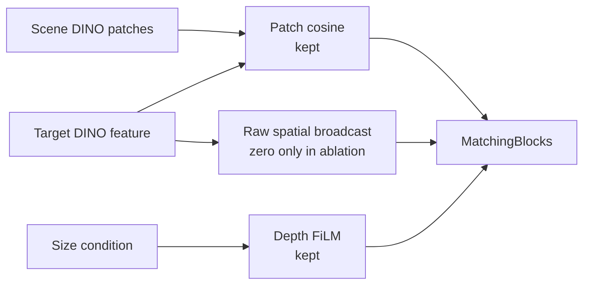

**수정:** Parameter shape와 cosine/FiLM 경로를 유지하고 raw target broadcast만 0으로 고정하는 controlled model을 구현함. 현재 코드에서 같은 seed로 생성한 raw-broadcast와 zero-broadcast 모델의 parameter shape와 초기 state가 동일함을 확인했으며 SHA-256은 `d8c3122c…f8c0`임.

**Controlled retrain 결과:** 16 epoch와 5,408 update를 모두 완료한 final checkpoint를 동일 seed의 broadcast-on reference와 비교함.

| Seed-0 fixed-update metric | Broadcast ON | No broadcast | Change |
|---|---:|---:|---:|
| Seen coverage MAE | `0.05155` | `0.08100` | `+57.1%` |
| Training-heldout coverage MAE | `0.07725` | `0.11494` | `+48.8%` |
| Heldout pooled `S > 0` | `8 / 8` | `0 / 8` | 기준 미충족 |
| Heldout camera `S > 0` | `40 / 40` | `2 / 40` | 기준 미충족 |
| `packaged_food_4` native MAE | `0.09802` | `0.22229` | `+126.8%` |
| `packaged_food_4` native bias | `−0.08694` | `−0.22058` | Underprediction 증가 |

CSV 1,680행의 composite key가 모두 고유하고, 두 checkpoint는 seed 0, epoch 15, 5,400 samples/epoch, 5,408 cumulative batches 조건을 만족함.

**판단:** No-broadcast 구성은 사전 broad gate를 만족하지 못해 seeds 1–2 확대를 진행하지 않음. 현 architecture에서 scalar cosine과 size-FiLM만 남기는 방식은 target conditioning을 충분히 유지하지 못했음. 다음 실험은 target 정보를 없애지 않으면서 absolute target code 의존을 줄이는 relation-aware interaction으로 제한함.

---

### 2026-08-21 · Phase 16 — Fresh Paired Reproducibility Gate

**문제:** 기존 broadcast-on checkpoint에는 최초 initialization과 sample-order hash가 없어, no-broadcast 성능 저하가 target 경로 제거 때문인지 과거 실행과의 차이 때문인지 완전히 분리되지 않았음.

**검증:** 현재 코드에서 broadcast-on seed 0을 `16 epoch`, `5,408 update`로 다시 학습함. 초기 state SHA-256은 `d8c3122c…f8c0`, 첫 epoch sample-order SHA-256은 `26e6843b…303b`로 기록함.

| Reproducibility check | Result |
|---|---|
| Epoch 0–15 train/validation metrics | 기존 accepted run과 전부 일치 |
| Final model-state SHA-256 | 두 모델 모두 `6354241b…55d7a` |
| State tensors | `168 / 168` bitwise identical |
| Compared parameters | `15,716,309`개 원소, mismatch `0` |
| Maximum absolute difference | `0.0` |

Checkpoint 파일 해시는 provenance metadata 추가로 서로 다르지만, 실제 추론에 쓰이는 모든 model tensor는 동일함.

**판단:** Fresh broadcast-on 재현 gate가 통과했으므로 동일 seed·초기화·sample order의 seed-0 비교에서 나타난 no-broadcast의 MAE 증가와 scale-response 약화는 code/data drift보다 raw target broadcast 제거의 영향으로 판단함. 단순 제거 실험은 종료하고, 다음 Step에서는 scene과 target의 채널별 관계를 보존하는 interaction을 동일 조건으로 비교함.

---

### 2026-08-21 · Phase 17 — Relation-Aware Target Interaction

**문제:** Scalar cosine과 size-FiLM만 남긴 no-broadcast 모델은 target 정보를 충분히 전달하지 못했음. Raw target vector를 다시 넣지 않으면서 cosine 합산 전의 채널별 관계를 보존할 방법이 필요했음.

**수정:** 기존 target 768채널 자리를 normalized channelwise product로 교체함. Scene RGB, depth FiLM, shifted cosine, MatchingBlock, parameter 수와 초기화는 그대로 유지함.

```text
q(x) = Normalize(scene_patch(x)) × Normalize(target)
r(x) = sqrt(C) × Normalize(q(x))

MatchingBlock input = [scene patch, FiLM depth, r(x), shifted cosine]
```

초기 state SHA와 sample-order SHA는 fresh raw 기준과 일치했고, parameter `15,706,689`개와 `5,408` update를 동일하게 유지함.


| Seed-0 fixed-update metric | Raw broadcast | No broadcast | Channel relation |
|---|---:|---:|---:|
| Final validation loss | `0.30448` | `0.34033` | `0.32434` |
| Final validation IoU | `0.393` | `0.250` | `0.308` |
| Seen coverage MAE | `0.05155` | `0.08100` | `0.06443` |
| Training-heldout coverage MAE | `0.07725` | `0.11494` | `0.08674` |
| Heldout pooled `S > 0` | `8 / 8` | `0 / 8` | `7 / 8` |
| Heldout camera `S > 0` | `40 / 40` | `2 / 40` | `37 / 40` |
| `packaged_food_4` native MAE | `0.09802` | `0.22229` | `0.11708` |
| `packaged_food_4` native bias | `−0.08694` | `−0.22058` | `−0.10623` |

Workspace 전체 MAE는 relation 모델에서 감소했지만, coverage 내부 MAE와 underprediction은 증가함. Workspace에는 GT가 0인 픽셀이 많아 출력을 전반적으로 낮추는 것만으로도 오차가 줄 수 있으므로 채택 근거로 사용하지 않음.

**판단:** Channel relation은 no-broadcast보다 target 조건을 많이 회복했지만 사전 safety gate와 `packaged_food_4` 개선 gate를 모두 통과하지 못함. Seeds 1–2는 실행하지 않고 raw broadcast baseline을 유지함. 이번 결과는 추가 L2 normalization까지 포함한 relation 표현 전체의 결과이므로, 다음 Step에서는 낮은 유사도의 patch도 동일한 relation energy를 갖게 되는 정규화 효과부터 분리 진단함.

---

### 2026-08-21 · Phase 18 — Relation Magnitude Diagnostic

**문제:** Phase 17의 L2 normalization은 채널별 관계 방향은 남기지만 `‖q‖`를 제거함. 이 때문에 target과 약하게 대응하는 patch도 강하게 대응하는 patch와 같은 크기의 relation feature를 받음.

쉽게 말하면 `q`는 scene과 target의 768개 channel이 위치별로 얼마나 같은 방향으로 반응했는지를 담은 목록임. `‖q‖`는 그 목록 전체의 반응 세기인데, 완전히 정규화하면 “매우 비슷함”과 “조금 비슷함”의 세기 차이가 사라질 수 있어 이 정보가 GT 설명에 도움이 되는지 먼저 확인함.

**검증:** Held-out target과 validation scene은 사용하지 않고, 학습용 10 target·36 scene·5 camera만 분석함. 같은 scene·camera·patch에서 target 평균을 제거한 뒤, cubic cosine 12개만 사용한 기준과 cosine으로 설명되지 않는 `log‖q‖` 4개를 추가한 경우를 scene 단위 6-fold로 비교함. Target 가중치는 실제 학습 sampler와 동일하게 category-balanced로 설정함.

```text
q_l(x) = Normalize(scene_l(x)) × Normalize(target_l)
r_l(x) = sqrt(C) × q_l(x) / (m_l + epsilon)
```

`m_l`은 학습 target의 실제 coverage 영역에서 계산한 layer별 `‖q_l‖` 중앙값이며, 추론 시 다시 계산하지 않는 고정값임.


| Train-only diagnostic | Result |
|---|---:|
| Coverage MAE: cubic cosine only | `0.08829` |
| Coverage MAE: + residual `log‖q‖` | `0.08583` |
| Relative improvement | `2.78%` |
| Improved scene folds | `6 / 6` |
| Scene-bootstrap 95% interval | `+2.01% – +3.46%` |
| Cosine-independent DINO layers | `4 / 4` |
| Uncalibrated `C·q` scale gate | `0 / 40` — 기준 미충족 |
| Train-median calibrated scale gate | `40 / 40` — pass |

**판단:** `‖q‖`에는 cubic cosine만으로 설명되지 않는 target-dependent GT 신호가 남아 있음. 단순 `C·q`는 feature 크기가 지나치게 커 사전 기준을 만족하지 못했으며, 대신 train-only 중앙값으로 크기만 고정한 relation을 동일 초기화·동일 sample order의 seed 0 한 번으로 평가함. 이 진단은 다음 실험을 수행할 근거이며 zero-shot 성능 증명은 아님. Seed 0이 사전 held-out 5-camera gate를 통과하기 전에는 seeds 1–2를 실행하지 않음.

---

### 2026-08-22 · Phase 19 — Magnitude-Calibrated Relation Evaluation

**문제:** Phase 18의 train-only 진단에서 relation 크기 `‖q‖`가 GT와 관련된 신호를 보였지만, 이 신호가 전체 비선형 모델의 학습·일반화까지 개선하는지는 확인되지 않았음.

**실험:** 학습 target에서 미리 계산한 layer별 중앙값 `m_l`을 고정하고, 추론 시 held-out target으로 재보정하지 않음. Raw baseline과 초기 state, sample order, `16 epoch`, `5,408 update`, dataset을 동일하게 맞춰 seed 0을 학습함.

```text
r_l(x) = sqrt(C) × q_l(x) / (m_l + epsilon)
```


| Seed-0 fixed-update metric | Raw broadcast | No broadcast | Normalized relation | Magnitude-calibrated relation |
|---|---:|---:|---:|---:|
| Seen coverage MAE | `0.05155` | `0.08100` | `0.06443` | `0.07073` |
| Training-heldout coverage MAE | `0.07725` | `0.11494` | `0.08674` | `0.09298` |
| Heldout pooled `S > 0` | `8 / 8` | `0 / 8` | `7 / 8` | `7 / 8` |
| Heldout camera `S > 0` | `40 / 40` | `2 / 40` | `37 / 40` | `34 / 40` |
| `packaged_food_4` native MAE | `0.09802` | `0.22229` | `0.11708` | `0.12220` |
| `packaged_food_4` native bias | `−0.08694` | `−0.22058` | `−0.10623` | `−0.10706` |

Magnitude-calibrated relation은 raw baseline 대비 seen coverage MAE `+37.20%`, heldout coverage MAE `+20.35%`로 악화됨. `packaged_food_4`도 5개 camera 모두에서 MAE와 bias가 개선되지 않음. Workspace MAE는 낮아졌지만, target coverage에서 underprediction이 커졌으므로 예측값 전체가 낮아진 효과로 판단함.

**판단:** Train-only 진단은 실험 후보를 거르는 용도였지만, 전체 모델의 성능 개선을 보장하지 않았음. Magnitude-calibrated seeds 1–2는 실행하지 않고 appearance interaction 변형은 종료함. Fresh raw size-only를 현재 기준 모델로 유지하며, 다음 후보는 target mask에서 계산할 수 있는 소수의 물리적 크기·형상 descriptor로 제한함.

---

### 2026-08-22 · Phase 20 — Compact Physical Shape Descriptor Gate

**문제:** Size-only의 `area·bbox_h·bbox_w`는 target의 전체 크기는 나타내지만, 같은 크기에서 모양과 질량 분포가 다른 물체를 구분하지 못함.

**수정:** Target mask에서 길쭉함 `eta`와 moment compactness `kappa` 두 값만 추가하는 후보를 설계함. 초기 구현에서 bbox를 `8 × 8` 정사각형으로 변환하며 물체의 길쭉함이 사라지는 문제를 발견함. 원래 mask 좌표계의 bbox 크기를 복원해 moment를 계산하도록 수정한 후 재검증함.

```text
eta   = (lambda_max - lambda_min) / (lambda_max + lambda_min)
kappa = mask_area / (2*pi*(lambda_max + lambda_min))
```

이 단계는 full model 학습이 아니라 descriptor가 다음 학습 후보로서 가치가 있는지 저렴하게 확인하는 train-only screening임. 학습 10 target·36 scene·3 scale·5 camera만 사용하고, target 하나를 donor에서 완전히 제외한 leave-one-target-out 비교를 수행함. Held-out 4 target과 validation scene은 사용하지 않았으며, shape를 같은 category의 다른 target과 바꾸는 64개 대조 조건도 같이 계산함.


| Train-only gate | Result | Required |
|---|---:|---:|
| Pooled coverage MAE | `0.09114 → 0.07748` (`14.99%` 개선) | `≥ 2%` 개선 |
| Improved targets | `5 / 10` | `≥ 8 / 10` |
| Improved categories | `2 / 4` | `4 / 4` |
| Improved cameras | `5 / 5` | `5 / 5` |
| Improved target-camera cells | `27 / 50` | `≥ 40 / 50` |
| Improved target-camera-scale cells | `78 / 150` | `≥ 120 / 150` |
| Worst scale-cell regression | `+320.67%` | `≤ +5%` |

Fruit은 category MAE `17.20%`, toy는 `43.84%` 개선됐지만 book은 `7.78%`, packaged food는 `13.22%` 악화됨. 전체 평균 개선은 특정 category의 큰 이득이 만든 결과이며, 새 target에 공통으로 적용되는 물리 규칙으로 보기 어려움.

**판단:** `eta·kappa`는 category별 결과가 일관되지 않아 full-model 후보에서 제외함. Seed 0–2는 실행하지 않고 fresh raw size-only를 기준 모델로 유지함. 다음에는 2D mask descriptor를 더 늘리지 않고, 3D target extent가 잔여 target effect를 설명할 수 있는지 oracle 진단으로 먼저 확인함.

---

### 2026-08-22 · Phase 21 — Exact 3D Extent Diagnostic

**문제:** 2D mask의 면적과 bbox는 camera에 보이는 크기만 나타냄. 같은 투영 크기라도 실제 높이와 바닥 면적이 다르면 물체 더미에 의해 완전히 가려질 수 있는 위치가 달라지므로, 이 3D 차이가 남은 target 오차의 원인인지 확인할 필요가 있었음.

**검증:** GT 생성에 실제 사용한 mesh에서 `가로 최소 길이·가로 최대 길이·높이`를 추출함. 이 단계도 full model 학습 전에 “실제 3D 크기를 알면 비슷한 train target의 GT 차이를 더 잘 설명할 수 있는가?”를 묻는 screening임. 이 값은 최종 배포 입력이 아니라 정보 유효성만 확인하는 진단용 oracle임. 학습 10 target·36 scene·3 scale·5 camera만 사용했으며, query target을 donor와 정규화 통계에서 완전히 제외함.

```text
extent3(s) = s × [min(dx, dy), max(dx, dy), dz]
```

같은 category의 다른 target extent를 넣는 64개 wrong-extent 대조 조건도 함께 계산함.


| Train-only diagnostic | 2D shape | Exact 3D extent |
|---|---:|---:|
| Pooled coverage MAE | `0.09114 → 0.07748` | `0.09114 → 0.06927` |
| Relative improvement | `14.99%` | `23.99%` |
| Improved targets | `5 / 10` | `9 / 10` |
| Improved categories | `2 / 4` | `4 / 4` |
| Improved cameras | `5 / 5` | `5 / 5` |
| Improved target-camera cells | `27 / 50` | `36 / 50` |
| Improved target-camera-scale cells | `78 / 150` | `100 / 150` |
| Meaningful worst regression | `+320.67%` | `없음` |

3D extent의 scene-bootstrap 95% interval은 `+23.12% – +24.80%`였고, wrong-extent 대조 조건의 최대 개선은 `1.17%`에 그침. 따라서 실제 3D 크기에 target별 GT를 설명하는 정보가 있음을 확인함.

다만 사전에 고정한 cell 개선 수 기준 `40/50`, `120/150`에는 각각 `36/50`, `100/150`으로 미달함. 남은 cell은 악화가 아니라 hard 3-NN에서 donor 구성이 바뀌지 않아 생긴 동률이지만, 결과를 본 뒤 기준을 바꾸지 않고 사전 기준 미충족으로 기록함.

**판단:** 이 결과를 zero-shot 성능이나 최종 구조의 통과로 해석하지 않음. 다음 Step은 raw size-only와 구조·초기값·sample order·update 수를 같게 유지한 seed-0 모델에서 exact extent 3개만 추가하는 controlled oracle ablation임. 이 모델이 기존 5-camera coverage·scale-response gate를 통과할 때만 RGB/multi-view 기반 3D 크기 추정 방법을 개발함.

---

### 2026-08-22 · Phase 22 — Exact 3D Extent Controlled Model

**문제:** Phase 21은 3D 크기 정보가 GT 차이를 설명할 수 있다는 진단이었으며, 실제 모델이 그 정보를 올바르게 사용하는지는 확인하지 못함.

**통제 실험:** Target mesh의 exact extent를 geometry conditioning에 추가함.

```text
extent3(s) = s × [min(dx, dy), max(dx, dy), dz]
F_depth'   = gamma(extent3) × F_depth + beta(extent3)
```

Raw size-only 기준 모델과 seed·초기 가중치·sample 순서·학습 횟수(`5,408` update)를 동일하게 유지함. Train 10 target의 통계만 이용해 정규화하고, fixed epoch 15에서 14 target·16 validation scene·5 camera를 비교함. Exact extent는 정보 유효성을 확인하기 위한 simulation oracle이며 실제 배포 입력은 아님.

| 평가 영역 | Raw size-only | Exact extent + global FiLM | 변화 |
|---|---:|---:|---:|
| 전체 target coverage MAE | `0.05838` | `0.05803` | `0.60%` 개선 |
| 전체 workspace MAE | `0.13745` | `0.15581` | `13.36%` 악화 |
| Train target coverage MAE | `0.05155` | `0.05587` | `8.38%` 악화 |
| Held-out target coverage MAE | `0.07725` | `0.06399` | `17.16%` 개선 |
| Held-out target workspace MAE | `0.16094` | `0.17477` | `8.59%` 악화 |

Held-out target의 scale-response 방향은 `8/8` target-scale과 `40/40` camera에서 양수였음. 이는 변화 방향이 맞다는 뜻이며 raw보다 더 좋아졌다는 뜻은 아님. Coverage와 workspace를 함께 보는 사전 평가 기준은 충족하지 못함.

**원인 분리:** 같은 checkpoint에서 scene RGB-D·target RGB·2D 크기·camera·scale·GT를 고정하고, exact extent 세 값만 같은 category의 다른 target 값으로 교체함. 모델 재학습은 수행하지 않음.


| Frozen intervention, held-out target | Correct extent − wrong extent | 결과 |
|---|---:|---|
| Target coverage MAE | `-0.03468` | Target-camera 평균 `20/20`에서 correct extent 우세 |
| Scale-response `S` | `+0.09249` | Target-camera 평균 `20/20`에서 correct extent 우세 |
| Workspace 안·coverage 밖 MAE | `+0.04232` | Target-camera 평균 개선 `10/20` |

Correct extent는 held-out target에서도 coverage 예측과 크기 변화 반응을 일관되게 개선함. 따라서 모델이 3D 크기 정보를 실제로 사용한다는 점은 확인됨. 반면 `book_4·fruit_4`는 coverage 밖 오차도 감소했지만, `toy_4·packaged_food_4`는 5개 camera 모두 증가함. 가장 가까운 wrong extent만 사용한 비교에서도 같은 경향이 남아 극단적인 교체값 때문으로 보기 어려움.

**판단:** 이번 exact-extent 경로에서 관찰된 leakage는 하나의 extent vector로 전체 depth feature에 같은 `gamma·beta`를 적용하는 global FiLM과 연결되어 있었음. Target이 물체 더미에 의해 가려질 수 있는 영역은 개선했지만, workspace 안에서도 해당 target이 존재할 수 없어 GT가 0인 위치까지 함께 활성화함. 이 실험만으로 DINOv3 정보가 충분하다고 결론 내리지는 않음.

현재 global-FiLM 구성은 후속 seed로 확대하지 않고, RGB 기반 3D 크기 추정기 개발도 보류함. 다음 실험에서는 exact extent를 계속 oracle로 사용하되, `local depth feature × extent`로 patch별 bounded residual을 만들고 residual을 0으로 초기화해 raw baseline에서 시작함. 동일한 seed-0 조건에서 coverage·coverage 밖 오차·scale-response·현재 고정 rig의 5-camera 결과가 함께 개선될 때만 다음 Step으로 진행함.

---

### 2026-08-24 · Phase 23 — Local Bounded Extent Interaction

**문제:** Global FiLM은 target 크기로 만든 같은 조절값을 모든 scene patch에 적용함. Target이 물체 더미에 의해 가려질 수 있는 영역은 찾았지만, 서랍 안에서 해당 target이 가려질 후보가 없는 위치도 함께 밝아지는 leakage가 발생함.

**방법:** Exact extent와 각 위치의 depth feature를 함께 보고 위치별 gate를 계산하도록 변경함.

```text
Global: target extent ─────────────→ 모든 위치에 같은 gamma, beta
Local : target extent + D(x,y) ───→ 위치별 gate g(x,y) ─→ bounded residual

D'(x,y) = D(x,y) + 0.25 × g(x,y) × learned_correction(x,y)
```

`g(x,y)`는 현재 위치의 depth 구조가 target 크기와 맞는 정도를 `0–1`로 나타냄. `0.25`는 depth feature를 수정하는 residual branch의 세기를 제한하는 값이며, 최종 occlusion probability를 25%로 제한한다는 뜻은 아님. Residual은 0에서 시작하므로 학습 전 출력은 raw baseline과 정확히 같음. Seed·초기 가중치·sample 순서·`5,408` update와 exact extent 입력은 Phase 22와 동일하게 유지함.

아래 MAE는 예측 map과 GT의 평균 절대 차이이며 `0`에 가까울수록 좋음. `Coverage`는 target이 물체 더미에 의해 가려질 수 있는 영역의 정확도, `Impossible-to-occupy workspace`는 target이 가려질 후보가 없는 위치의 잘못된 활성화, `Whole workspace`는 두 영역을 함께 평가함.


| 전체 14 target | Raw size-only | Exact extent + global FiLM | Exact extent + local bounded |
|---|---:|---:|---:|
| Coverage MAE | `0.05838` | `0.05803` (`0.60%` 개선) | `0.05741` (`1.67%` 개선) |
| Whole-workspace MAE | `0.13745` | `0.15581` (`13.36%` 악화) | `0.13077` (`4.86%` 개선) |
| Impossible-workspace MAE | `0.20853` | `0.24371` (`16.87%` 악화) | `0.19671` (`5.67%` 개선) |

Local 방식은 global FiLM의 평균 leakage를 줄이고 raw보다도 세 영역 모두 개선함. Training-heldout 4개 target 평균에서도 coverage `13.33%`, workspace `9.13%`, impossible-workspace `8.01%` 개선함. 크기 변화에 출력이 같은 방향으로 반응하는지는 `8/8` target-scale과 `40/40` camera에서 유지되어, 현재 고정 rig의 다섯 view에서 같은 방향의 신호를 확인함. 이 수치는 raw 대비 개선이 아니라 scale 변화 방향이 양수였다는 뜻임.

**판단:** 평균 개선만으로 모델을 채택하지 않음. Raw 대비 `book_4` scale-response가 `-0.062`, `-0.054` 감소하여 사전 기준 `-0.05`를 넘었고, `packaged_food_4`의 impossible-workspace MAE는 `30.29%` 악화함. Seen-target coverage도 `4.65%` 악화하여 seed-0 사전 기준을 만족하지 못함.

따라서 local interaction이 global 방식보다 평균적인 공간 제어를 개선할 가능성은 확인했지만, target별 사전 기준을 만족하지 못해 이 상태로 seed를 확대하지 않음. RGB 기반 extent estimator도 아직 실행하지 않음. 다음 Step은 같은 frozen checkpoint에서 extent만 올바른 값과 같은 category의 다른 값으로 교체해 원인을 분리하고, gate와 residual이 coverage 안팎을 실제로 구분하는지 확인하는 것임.

**Frozen 후속 진단:** 재학습 없이 scene RGB-D·target appearance·GT를 고정하고 extent만 교체함. Held-out 평균에서 correct extent는 wrong extent보다 coverage MAE를 `0.03267` 낮추고 scale-response를 `0.12590` 높였지만, impossible-workspace MAE는 `0.02811` 높였음. 즉 3D 크기 정보는 실제로 사용되지만 유용한 영역과 잘못된 영역을 동시에 활성화함.


Gate가 위치를 실제로 거르는지 확인하기 위해 target이 도달 가능한 patch와 불가능한 patch를 분리함. 네 held-out target의 평균 gate는 가능한 영역 `0.974–0.988`, 불가능한 영역도 `0.943–0.972`였음. `0`이면 닫힘, `1`이면 완전히 열림이므로 두 영역에서 거의 항상 열린 상태임. 따라서 residual 크기는 제한됐지만, 공간을 선택하는 gate는 충분히 작동하지 않았음.

축별 교체에서는 `book_4`의 올바른 높이 값이 scale-response를 `0.021` 낮추고, `toy_4`의 수평 크기는 scale-response를 `0.213` 높이는 대신 impossible-workspace MAE를 `0.081` 높였음. 하나의 벡터에서 수평 크기와 높이를 함께 처리하면서 역할이 얽힌 것도 확인함.

**다음 Step:** Noncoverage loss를 바로 추가하면 이전 ring-loss처럼 크기 변화 반응까지 억제할 수 있어 보류함. 먼저 parameter 수와 초기 출력을 유지한 채, 포화되는 sigmoid dot-product를 channel-normalized local similarity로 교체하는 seed-0 실험을 수행함. 이 변경으로 leakage가 줄어도 `book_4` 역반응이 남으면 수평 크기와 높이 conditioning을 분리함.

---

### 2026-08-24 · Phase 24 — Regularized Local-Confidence Gate

**왜 이 실험을 했는가:** Phase 23의 gate는 target이 물체 더미에 의해 가려질 수 있는 patch뿐 아니라 가려질 후보가 없는 patch에서도 거의 `1`이었음. 문이 항상 열려 있으므로 local interaction이라는 이름과 달리 target 크기 보정이 서랍 전체로 퍼졌음. 이번 실험은 모델을 더 크게 만드는 대신, gate가 쉽게 포화되지 않도록 계산 방식만 바꿔 원인을 분리함.

각 scene patch의 depth encoder 출력 `D(x,y)`는 `256`개 숫자로 된 특징임. 이 숫자들은 각각 높이·모서리처럼 사람이 미리 의미를 정한 값이 아니라, ResNet-18이 함께 학습한 local depth pattern 반응임. Target의 exact 3D extent도 작은 network를 거쳐 같은 길이의 보정 방향 `q`로 바뀜. 두 벡터가 같은 방향인지 비교하여 위치별 gate를 계산함.

```text
한 scene patch의 depth 특징 D(x,y): 256개 숫자
target 크기가 요구하는 보정 방향 q: 256개 숫자

D(x,y)와 q의 방향 비교 ─→ local confidence g(x,y)
                              0: 보정하지 않음
                              1: target 크기 보정을 강하게 사용

D'(x,y) = D(x,y) + 0.25 × g(x,y) × size_correction(x,y)
```

이는 표준 cosine이 아니라 **regularized cosine-like confidence**임. Target 보정 벡터가 커지는 것만으로 gate가 `1`에 붙지 않도록 채널 수 `C=256`을 분모에 포함함. `sqrt(C)`는 256개 채널의 평균 크기가 약 `1`일 때를 기준으로 삼는 고정값이며, held-out 결과를 보고 조정한 hyperparameter가 아님. Seed·초기 가중치·sample 순서·loss·`5,408` update는 이전 실험과 같고, automated assertions로 초기 상태와 sample 순서도 확인하여 gate 계산만 비교함.


| 전체 14 target | Raw size-only | Local sigmoid | Local confidence | 해석 |
|---|---:|---:|---:|---|
| Coverage MAE | `0.05838` | `0.05741` | `0.05840` | Target이 물체 더미에 의해 가려질 수 있는 영역은 raw와 사실상 같음 |
| Whole-workspace MAE | `0.13745` | `0.13077` | `0.12122` | 서랍 전체의 평균 오차는 raw보다 `11.81%` 감소 |
| Impossible-workspace MAE | `0.20853` | `0.19671` | `0.17768` | 가려질 후보가 없는 위치의 잘못된 활성화는 평균 `14.79%` 감소 |

평균 leakage는 줄었지만, 이것만으로 새 구조를 채택하지 않음. Held-out `book_4`의 두 scale-response는 raw보다 `0.159`, `0.088` 감소했고, `packaged_food_4`는 coverage가 좋아지는 대신 whole-workspace와 impossible-workspace 오차가 각각 `22.04%`, `44.61%` 증가함. 즉 일부 target의 큰 개선이 전체 평균을 낮췄으며, 반복 사용한 네 development-heldout target에서도 일관된 개선을 확인하지 못함.

Frozen 진단에서 gate의 `0.95` 초과 비율은 기존 `66–97%`에서 `0%`로 줄어 구조적 포화는 크게 감소함. 그러나 도달 가능한 patch와 불가능한 patch의 평균 gate 차이는 target별 `0.005–0.014`에 불과했음. Gate 값은 안정됐지만 **어디를 열고 닫아야 하는지 학습하지 못한 것**이 남은 핵심 문제임. 해당 frozen correct/wrong-extent intervention에서 toy와 packaged food의 extent 입력은 coverage 오차를 줄이는 동시에 impossible-workspace 오차를 각각 약 `0.108`, `0.117` 높이는 방향에 직접 관여함.

Exact extent는 물체 이름이 아니라 실제 크기이므로 원리상 unseen target에도 적용 가능한 정보임. 다만 현재 값은 mesh에서 얻은 진단용 oracle이므로 이 결과는 zero-shot 성능을 증명하지 않음. Oracle 구조가 먼저 모든 target에서 안정적으로 작동한 뒤에만 target RGB/mask로 크기를 추정하는 배포 입력으로 교체함.

**판단 및 다음 Step:** Seed 0의 사전 기준을 만족하지 못해 seed 1–2 확대는 진행하지 않음. 다음 실험은 최종 probability map을 직접 누르는 ring loss가 아니라 gate 자체만 감독함. Target이 물체 더미에 의해 가려질 수 있는 순수 patch에는 gate가 열리고, workspace 안이지만 가려질 후보가 없는 순수 patch에는 닫히도록 balanced auxiliary loss를 추가함. 경계가 섞인 patch는 제외하고 `lambda_gate=0.05`의 단일 seed-0 통제 실험만 수행함. 이 방식은 occlusion 확률을 맞히는 본래 head의 역할을 유지하면서, gate에 부족했던 공간적 역할만 명시함.

---

### 2026-08-24 · Phase 25 — Strict Gate-Localization Supervision

**왜 이 방법을 사용했는가:** Phase 24의 gate 값은 안정됐지만 열어야 할 곳과 닫아야 할 곳을 구분하지 못했음. 최종 probability map의 loss만 사용하면 뒤쪽 MatchingBlock이 오차를 대신 줄일 수 있어 gate가 의도한 역할을 배우지 않아도 됨. 따라서 최종 출력을 직접 0으로 누르는 기존 ring loss 대신, gate에만 위치 역할을 알려주는 보조 loss를 사용함.

```text
Target이 물체 더미에 의해 가려질 수 있는 순수 patch → gate를 1에 가깝게 학습
서랍 안이지만 가려질 후보가 없는 순수 patch          → gate를 0에 가깝게 학습
두 영역이 섞인 경계 patch              → 보조 loss에서 제외

전체 loss = 기존 probability-map loss + 0.05 × balanced gate loss
```

두 영역의 patch 수가 달라도 한쪽이 loss를 지배하지 않도록 각각 평균한 뒤 `1:1`로 합침. `0.05`는 결과를 보고 고른 값이 아니라 실험 전에 고정했으며, validation과 checkpoint 선택은 기존 probability-map loss만 사용함. Seed·초기 state·sample 순서·`5,408` update와 exact-extent oracle 입력도 이전 실험과 같게 유지함.


| 전체 14 target | Raw size-only | Gate supervision | 의미 |
|---|---:|---:|---|
| Coverage MAE | `0.05838` | `0.05153` | Target이 물체 더미에 의해 가려질 수 있는 영역의 오차 `11.73%` 감소 |
| Whole-workspace MAE | `0.13745` | `0.07538` | 서랍 전체 오차 `45.16%` 감소 |
| Impossible-workspace MAE | `0.20853` | `0.09682` | 잘못 밝아지는 leakage `53.57%` 감소 |

보조 loss가 없는 동일 gate 모델과 비교해도 coverage·workspace·impossible-workspace MAE가 각각 `11.76%`, `37.81%`, `45.51%` 감소함. 동일 seed·초기 state·sample order의 controlled seed-0 비교에서는 gate localization supervision 추가와 평균 개선이 함께 나타남. 다중 seed 일반화는 아직 확인하지 않음.

Frozen 진단에서도 변화가 확인됨. 보조 loss가 없을 때 가능한 영역과 불가능한 영역의 gate 차이는 `0.005–0.014`였지만, 학습 후에는 target별 `0.580–0.695`로 커짐. 가능한 영역의 평균 gate는 `0.797–0.860`, 불가능한 영역은 `0.166–0.217`이므로 현재 oracle coverage 정의와 고정 rig의 development target에서 gate가 위치 분리를 학습했음을 확인함.

**남은 문제:** 평균 결과는 크게 좋아졌지만 사전에 정한 모든 기준을 통과하지는 못함. 현재 고정 rig의 다섯 camera에서 scale-response 자체는 `40/40` 모두 양수였으나, `book_4`의 `0.85/1.15` scale 반응은 raw보다 각각 `0.118`, `0.130` 약해져 허용선 `-0.05`를 넘음. 결과를 본 뒤 기준을 완화하지 않고 seed-0 사전 기준 미충족으로 기록함.

축별 frozen intervention에서 book의 수평 크기 축을 교체했을 때 scale-response 변화는 `+0.005`로 거의 중립이었지만, 높이 축 교체는 `-0.131`의 변화를 만들었음. 반대로 높이 축은 coverage와 impossible-workspace MAE를 각각 약 `0.016`, `0.031` 줄여 단순히 제거할 정보도 아님. 즉 현재 하나의 FiLM/gate가 수평 footprint와 높이의 서로 다른 역할을 함께 처리하는 것이 남은 병목임.

Exact extent와 coverage label은 USD/GT에서 얻은 simulation oracle임. 물체 category 이름을 gate에 주지는 않으므로 크기와 local depth의 관계를 배우는 zero-shot 가설에는 맞지만, 아직 target RGB만 사용하는 배포형 zero-shot을 증명한 결과는 아님.

**판단 및 다음 Step:** 평균 개선과 gate localization은 유지할 가치가 있지만, 현 모델을 최종 candidate로 확정하지 않음. Seeds 1–2와 RGB extent estimator는 계속 보류함. 수평 footprint는 물체가 차지할 바닥 면적에, 높이는 위쪽 공간과 가려짐 깊이에 주로 영향을 주므로 다음에는 두 값을 별도 conditioning 경로로 분리함. 동일 gate supervision을 유지한 seed-0 실험 하나에서 book 반응을 확인하고, 회복되지 않으면 architecture 확장을 중단한 뒤 scale-paired objective 또는 GT의 book-height 정의를 다시 검토함.

---

### 2026-08-24 · Phase 26 — Footprint Gate / Height Residual Separation

**왜 이 실험을 했는가:** Phase 25는 gate의 위치 분리를 학습했지만, 얇고 넓은 `book_4`의 scale 반응은 여전히 약했음. 하나의 exact-extent 벡터가 “어디에서 target이 물체 더미에 의해 가려질 수 있는가”와 “그 안에서 높이 차이를 얼마나 반영할 것인가”를 동시에 결정한 것이 원인인지 확인함.

68개 입력 칸 중 실제로 사용하는 여섯 값의 역할을 다음처럼 나눔.

```text
area, bbox h/w, 짧은·긴 가로 길이 ─→ footprint gate g_F(x,y)
높이                                  ─→ 열린 영역 안의 보정 강도

D'(x,y) = D(x,y) + 0.25 × g_F(x,y) × height-aware correction
```

Footprint는 target이 영상에서 차지하는 크기와 바닥 방향 길이를 나타내므로 gate의 위치를 정함. 높이는 gate를 새로 열 수 없고, footprint gate가 허용한 위치 안에서만 depth 보정량에 관여함. 새 network를 추가하면 모델 크기 차이가 결과에 섞이므로 기존 `GeometryFiLM` 하나를 세 번 공유해 footprint·height·zero 입력을 분리함. 그 결과 파라미터 수, state key, 초기 가중치, 첫 epoch sample 순서와 총 `5,408` update는 Phase 25와 동일함. 자동 테스트로 높이를 바꿔도 gate가 bitwise 동일하고, footprint를 바꾸면 gate가 변하며, 사용하지 않는 62개 칸은 출력에 영향을 주지 않음을 확인함.


| 전체 14 target | Raw size-only | Phase 25 | Phase 26 | 의미 |
|---|---:|---:|---:|---|
| Coverage MAE | `0.05838` | `0.05153` | `0.05461` | Raw보다 `6.45%` 낮지만 Phase 25보다는 높음 |
| Whole-workspace MAE | `0.13745` | `0.07538` | `0.07276` | Raw보다 `47.07%`, Phase 25보다 `3.48%` 낮음 |
| Impossible-workspace MAE | `0.20853` | `0.09682` | `0.08907` | Raw보다 `57.29%`, Phase 25보다 `8.00%` 낮음 |

Gate 역할 분리는 실제 checkpoint에서도 유지됨. 네 development-heldout target에서 target이 물체 더미에 의해 가려질 수 있는 순수 영역의 평균 gate는 `0.798–0.865`, 가려질 후보가 없는 영역은 `0.128–0.183`이었음. 모든 scale과 다섯 camera에서 예측 반응 방향은 `40/40` 양수였음.

그러나 핵심 사전 기준은 충족하지 못함. `book_4 ×0.85/×1.15`의 raw 대비 `ΔS`는 Phase 25의 `-0.118/-0.130`에서 `-0.094/-0.052`로 회복됐지만, 두 값 모두 허용선 `-0.05`를 넘지 못함. Held-out median `ΔS=-0.010`과 다른 held-out target의 native coverage 안전 기준도 충족하지 못했으며, `book_4` native coverage MAE는 raw보다 `10.3%` 높았음. 결과를 본 뒤 기준을 완화하지 않고 seed-0 사전 기준 미충족으로 기록함.

Frozen identity 진단에서는 Phase 26의 local residual을 끄면 `book_4` coverage MAE가 평균 `0.0128` 낮아졌음. 즉 현재 남은 문제는 gate가 잘못된 위치를 여는 것이 아니라, 올바르게 열린 영역 안에서 book의 크기 변화에 적용하는 보정 방향과 크기가 부정확한 것임.

**판단 및 다음 Step:** Seeds 1–2와 RGB 기반 extent estimator는 계속 보류하고, 구조를 더 키우지 않음. 현재 loss는 각 scale의 map을 따로 맞히므로 평균 오차를 낮추면서도 같은 scene에서 scale에 따른 변화량을 충분히 보존하지 못할 수 있음. 다음에는 train target의 동일 scene·camera에서 두 scale을 짝지어 `예측 map 변화량`과 `GT map 변화량`을 직접 비교하는 scale-paired loss를 추가함. Held-out target은 loss 설계나 가중치 선택에 사용하지 않음.

---

### 2026-08-24 · Phase 27 — Train-Only Scale-Paired Loss and BatchNorm Diagnosis

**왜 이 실험을 했는가:** 기존 loss는 scale `0.7`, `1.0`, `1.3`의 probability map을 각각 맞히지만, 같은 scene에서 target 크기가 바뀔 때 map이 **어떻게 달라져야 하는지**는 직접 비교하지 않음. 이 때문에 평균 map 오차를 낮추면서도 크기 변화가 예측에 충분히 반영되지 않을 가능성을 확인하고자 함.

같은 `target–scene–camera`의 세 scale을 한 묶음으로 불러오고, 인접한 두 scale의 예측 변화와 GT 변화를 비교함.

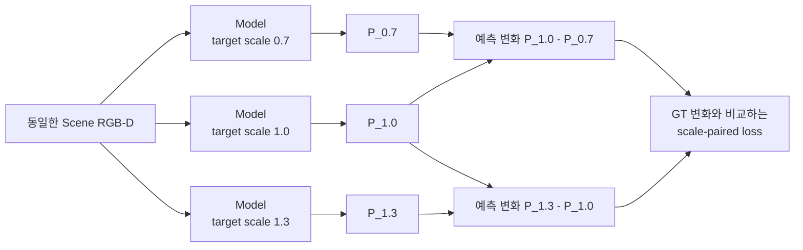

```text
ΔP = P(s₂) - P(s₁)                 예측 map이 scale에 따라 변한 양
ΔG = G(s₂) - G(s₁)                 GT map이 scale에 따라 변해야 하는 양

L_pair = Σ|ΔP - ΔG| / (Σ|ΔG| + ε)
L_total = L_map + 0.05 L_gate + 0.008902 L_pair

S = 1 - L_pair
```

`S=1`이면 scale에 따른 공간 변화가 GT와 같고, `S=0`이면 예측이 scale 변화를 사실상 무시한 수준임. 음수이면 변화를 넣지 않은 것보다 오차가 더 큼. `0.008902`는 held-out 결과를 보고 고른 값이 아니라, train target의 gradient에서 paired 항의 크기가 기존 loss의 약 `10%`가 되도록 한 번 계산해 고정함.

#### 첫 통제 실험

Phase 26, paired loader만 사용한 `λ=0` control, paired loss를 추가한 candidate를 같은 seed·초기화·16 epoch·`5,408` update로 비교함. 개발용 held-out 4 target은 읽지 않고, 학습에 사용한 10 target과 학습에 사용하지 않은 validation scene 16개만 다섯 camera에서 평가함.

| Fixed epoch 15 | Coverage MAE ↓ | Workspace MAE ↓ | Noncoverage MAE ↓ | `S` 0.7→1.0 ↑ | `S` 1.0→1.3 ↑ |
|---|---:|---:|---:|---:|---:|
| Phase 26 | `0.04956` | `0.07058` | `0.09052` | `0.3517` | `0.4466` |
| Paired-loader control | `0.06429` | `0.07958` | `0.09409` | `0.3332` | `0.4067` |
| Scale-paired candidate | `0.07764` | `0.07335` | `0.06929` | `0.3018` | `0.3546` |

Candidate의 train paired error는 낮아졌지만 validation scene에서는 두 `S`가 모두 감소했고, center/top/left/right/bottom 전체에서 같은 경향을 보임. 따라서 특정 camera 문제가 아님. 또한 loss가 없는 paired-loader control도 Phase 26보다 나빠져, paired loss뿐 아니라 batch 구성이 함께 영향을 준다는 점을 확인함.

```text
기존 batch          : 서로 독립적인 depth frame 16개
scale-paired batch  : 서로 다른 depth frame 5~6개 × 같은 frame의 scale 조건 3개
                      └─ ResNet-18 BatchNorm에는 같은 scene depth가 세 번 반복됨
```

BatchNorm은 학습 중 depth feature의 평균과 분산을 저장하고, 추론 때 그 값으로 feature 범위를 맞춤. Scale-paired batch는 실제 tensor 수가 15–18개여도 서로 다른 depth는 5–6개뿐이므로, 기존 batch와 다른 통계가 저장될 수 있음.

#### BatchNorm 통계만 분리한 진단

모델 가중치는 그대로 두고 `36 train scenes × 5 cameras = 180`개의 고유 depth frame으로 ResNet-18의 BatchNorm 평균·분산만 공통 재계산함. Validation scene, held-out target, GT는 사용하지 않았으며, 자동 검사에서 학습 파라미터는 바뀌지 않고 BatchNorm buffer 60개만 변경됨.

| BN 재계산 후 fixed checkpoint | Coverage MAE ↓ | Workspace MAE ↓ | Noncoverage MAE ↓ | `S` 0.7→1.0 ↑ | `S` 1.0→1.3 ↑ |
|---|---:|---:|---:|---:|---:|
| Phase 26 | `0.04772` | `0.06833` | `0.08789` | `0.3585` | `0.4542` |
| Paired-loader control | `0.05432` | `0.07487` | `0.09435` | `0.3651` | `0.4443` |
| Scale-paired candidate | `0.05252` | `0.06403` | `0.07494` | `0.3888` | `0.4613` |

BN 통계를 맞추자 candidate는 Phase 26보다 두 scale 구간의 `S`가 높아지고, 전체 10개 `scale transition × camera` 비교 중 9개에서 개선됨. Workspace와 noncoverage MAE도 각각 약 `6.3%`, `14.7%` 낮아짐. 즉 paired loss의 scale 신호는 일부 존재하며, 처음 관측한 후반 악화의 큰 부분은 반복 scene으로 만들어진 BN 통계와 관련 있음.

그러나 coverage MAE는 `0.04772 → 0.05252`로 약 `10.1%` 증가하여 사전 허용선 `2%`를 충족하지 못함. Coverage 평균 예측은 `0.2514`, 평균 GT는 `0.2485`로 전역 bias가 작았음. 평균값은 맞는데 MAE가 높다는 것은 단순히 map 전체가 너무 밝거나 어두운 문제가 아니라, **coverage 안에서 높은 확률과 낮은 확률을 배치하는 공간 패턴이 더 부정확해졌다는 뜻**임. 따라서 output bias나 threshold만 조절해서 해결할 수 없음.

Validation loss가 가장 낮은 checkpoint도 별도 민감도 분석을 수행했지만, fixed epoch 결과를 사후에 교체하는 근거로 사용하지 않음. 최종 untouched target은 계속 열지 않았으며, seed 1–2 확대와 `λ` sweep도 진행하지 않음.

**판단 및 다음 Step:** Scale-paired loss가 전혀 작동하지 않는 것은 아니지만, 현재 학습 방식은 scale 반응을 얻는 대신 coverage 내부 공간 정확도를 일부 희생함. 다음에는 Phase 26 checkpoint에서 정확히 한 epoch만 이어 학습하고, BatchNorm의 running mean/variance를 고정한 상태에서 `λ=0`과 `λ=0.008902`를 같은 `338` update로 비교함. 이 최소 실험으로 training-time BN 영향과 paired loss 자체의 공간 trade-off를 분리함. 두 scale 구간의 `S`가 모두 개선되고 coverage MAE 증가가 `2%` 이내일 때만 더 긴 재학습으로 확장함.

---

### 2026-08-25 · Phase 28 — BatchNorm-Frozen One-Epoch Comparison

**왜 이 실험을 했는가:** Phase 27의 BN 재계산은 학습이 끝난 모델의 통계까지 다시 바꿨으므로, paired loss 자체의 효과와 training-time BatchNorm 효과가 완전히 분리되지 않았음. Phase 26의 동일 checkpoint에서 fresh Adam으로 한 epoch만 이어 학습하고, 두 모델 모두 BN의 running mean/variance를 고정함. BN의 학습 가능한 scale·bias는 유지하고 sample 순서와 `338` update도 같게 맞춤.

| Phase 26에서 1 epoch 연장 | Coverage MAE ↓ | Workspace MAE ↓ | Noncoverage MAE ↓ | `S` 0.7→1.0 ↑ | `S` 1.0→1.3 ↑ |
|---|---:|---:|---:|---:|---:|
| Paired loss 없음 | `0.06077` | `0.07547` | `0.08942` | `0.3431` | `0.4106` |
| Paired loss 사용 | `0.05727` | `0.07772` | `0.09712` | `0.3626` | `0.4405` |

Paired loss를 사용하면 5개 camera × 2개 scale 구간의 `10/10`에서 `S`가 높아졌지만, paired loss가 없는 control보다 noncoverage MAE가 `8.61%` 증가함. 두 checkpoint의 BN buffer는 동일하므로 이 leakage는 저장된 BN 통계 차이로 설명되지 않음.

원인은 paired loss가 **scale 사이의 차이**만 본다는 점임. 세 출력에 같은 잘못된 값 `c`가 더해져도 `c`는 서로 상쇄됨.

```text
(P_1.0 + c) - (P_0.7 + c) = P_1.0 - P_0.7
```

기존 map loss도 target coverage 안에서만 계산하므로, 어떤 scale에서도 target이 덮지 않는 workspace의 공통 출력을 직접 감독하지 않았음.

**다음 Step:** Scale 변화가 생기는 footprint와 경계는 건드리지 않고, 모든 scale에서 coverage가 없는 순수 workspace의 공통 출력만 0에 가깝게 만드는 anchor를 추가함.

---

### 2026-08-25 · Phase 29 — Strict Common-Mode Anchor and Low-LR Continuation

**왜 이 방법을 사용했는가:** Paired loss는 `scale별 차이`를 학습하고, common-mode anchor는 `세 scale에 공통으로 남는 잘못된 밝기`를 제거함. 두 loss가 서로 다른 문제를 담당하도록 영역을 엄격히 분리함.

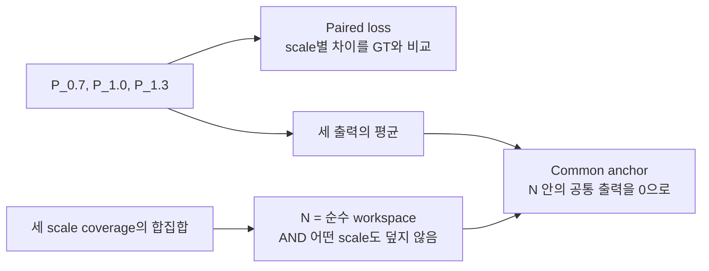

```text
N = pure_workspace AND no_coverage_at_any_scale
L_common = mean over N of |(P_0.7 + P_1.0 + P_1.3) / 3|
```

한 scale이라도 target footprint가 닿는 patch는 `N`에서 제외함. 따라서 크기가 달라지며 이동하는 경계를 억제했던 과거의 per-scale ring 방식과 다름. Loss weight는 validation이나 held-out 결과를 보지 않고 train-only 8개 batch의 gradient 크기로 한 번 고정함.

Learning rate `1e-3`에서는 leakage와 `S`가 개선됐지만 Phase 26 대비 coverage MAE가 `6.38%` 증가해 사전 허용선 `2%`를 충족하지 못함. Loss와 weight는 그대로 두고 learning rate만 `1e-4`로 낮춰, 기존 공간 map을 크게 바꾸지 않는 작은 보정을 수행함.

| Train-only, seed 0 | Coverage MAE ↓ | Workspace MAE ↓ | Noncoverage MAE ↓ | All-scale noncoverage ↓ | `S` 0.7→1.0 ↑ | `S` 1.0→1.3 ↑ |
|---|---:|---:|---:|---:|---:|---:|
| Phase 26 | `0.04956` | `0.07058` | `0.09052` | `0.07974` | `0.3517` | `0.4466` |
| Common anchor only | `0.04675` | `0.04528` | `0.04390` | `0.02962` | `0.3962` | `0.4791` |
| Common + paired | `0.04671` | `0.04391` | `0.04126` | `0.02811` | `0.4111` | `0.4862` |

최종 후보는 Phase 26보다 coverage `5.74%`, workspace `37.78%`, noncoverage `54.42%`, all-scale noncoverage `64.75%` 낮았음. 세 scale 각각의 coverage MAE와 5-camera의 두 scale 구간 `10/10`도 모두 개선되어 train-only gate를 통과함.

**다음 Step:** 이 시점까지 학습에 사용하지 않은 4개 target을 고정된 5-camera protocol에서 한 번 평가함. Common anchor만 사용한 모델도 함께 비교하여 paired loss의 추가 효과를 분리함.

---

### 2026-08-25 · Phase 30 — Five-Camera Development-Heldout Oracle Check

**평가 범위:** `book_4`, `fruit_4`, `toy_4`, `packaged_food_4`와 scale `0.85/1.0/1.15`, validation scene 16개, center/top/left/right/bottom 5개 camera를 고정함. 모델당 `4 × 3 × 16 × 5 = 960`개 map을 평가함. Target RGB는 해당 held-out instance의 실제 reference를 사용했지만, 3D extent는 USD mesh의 정확한 값을 사용함.

| Development-heldout, seed 0 | Coverage MAE ↓ | Workspace MAE ↓ | Noncoverage MAE ↓ | All-scale noncoverage ↓ | `S` 0.85→1.0 ↑ | `S` 1.0→1.15 ↑ |
|---|---:|---:|---:|---:|---:|---:|
| Phase 26 | `0.06857` | `0.07818` | `0.08573` | `0.07931` | `0.2150` | `0.2432` |
| Common anchor only | `0.06473` | `0.05139` | `0.04091` | `0.03318` | `0.2427` | `0.2860` |
| Common + paired | `0.06489` | `0.04990` | `0.03813` | `0.03086` | `0.2471` | `0.2913` |

최종 후보는 Phase 26보다 coverage `5.37%`, workspace `36.17%`, noncoverage `55.53%`, all-scale noncoverage `61.09%` 낮았음. Anchor-only와 비교해도 두 scale 구간의 `S`가 5개 camera 모두에서 높았고, target × camera × 구간의 `40/40` 조건에서도 같은 방향을 보임. 사전 기준인 `10/10 camera scale-response 개선`과 `coverage MAE 증가 2% 이내`를 모두 만족함.

냉정하게 보면 paired loss의 추가 이득은 작음. Anchor-only보다 전체 coverage MAE가 `0.24%` 높고, 세부 coverage 60개 조건 중 36개에서 최대 `1.62%` 증가함. 반면 workspace·noncoverage·all-scale noncoverage는 각각 `2.90%`, `6.81%`, `7.01%` 낮고, scale-response 40개 조건은 모두 개선됨. 따라서 작은 coverage trade-off 안에서 크기 반응과 leakage를 함께 개선한 seed-0 oracle 후보로 해석함.

**실제 map 확인:** Occlusion Stream의 5-camera 정성 그림은 모델 결과와 무관한 GT-only 중간 사례를 사용함. Phase 26에서 drawer 내부의 비후보 영역까지 퍼진 밝기가 common anchor 이후 줄어드는 모습을 확인함. Scale별 그림에서는 paired loss의 효과가 개별 scene마다 동일하지 않다는 점도 함께 기록하여 평균 수치만으로 결과를 과장하지 않음.

이 결과는 아직 최종 zero-shot 증명이 아님.

- 네 target은 학습에는 사용하지 않았지만 이전 개발 진단에서 이미 관찰한 instance임.
- Scene은 학습에 쓰지 않았지만 모델 선택에 사용한 동일 validation scene임.
- Target mask에서 얻은 2D 크기와 USD mesh의 exact 3D extent를 함께 사용함.
- Scale `0.85/1.0/1.15`는 학습 범위 `0.7–1.3` 안의 interpolation이며 seed 0만 평가함.
- 현재 5개 camera는 calibration이 고정된 rig이며 임의 camera pose 일반화를 뜻하지 않음.
- `S=0.247/0.291`은 Phase 26보다 높지만 `S=1`의 완전한 scale 변화 재현과는 거리가 있음.

**다음 Step:** 이 checkpoint를 exact-size oracle 상한선으로 동결함. 동일 pose·거리의 5-view target reference와 camera calibration 저장 protocol을 먼저 고정한 뒤, RGB/mask silhouette에서 3D extent를 추정함. 같은 960개 조건에서 `mesh oracle / RGB-mask 추정 extent / extent 없음`만 바꾸어 비교하고, 개선이 유지될 때 seeds 1–2와 최종 untouched-target 평가로 이동함.

---

### 2026-08-27 · Phase 31 — Target-specific GT Coverage Check

**확인하려는 문제:** 기존 GT는 모든 target을 동일한 `x/y = ±0.17 m` 범위에서 이동시켜 생성함. 이 범위는 회전할 때 서랍 벽을 통과할 수 있는 큰 책을 기준으로 정한 값이므로, Peach처럼 작은 물체에는 지나치게 좁음. 그 결과 실제로 target이 가려질 수 있는 위치가 GT coverage 밖에 남고, 모델이 그 위치를 예측하면 잘못된 활성화처럼 평가될 수 있음.

이를 확인하기 위해 학습에 사용하지 않은 Peach 하나에서 다음 두 GT만 비교함.

| 고정한 조건 | 내용 |
|---|---|
| Model output | GT를 보기 전에 저장한 동일 checkpoint의 동일 예측 |
| Scene / camera | 동일한 8개 scene과 `center/top/left/right/bottom` 5개 view |
| Target geometry | 동일한 Peach 원본 mesh `524,288` faces |
| 가림 판정 | 물체의 유효 pixel 중 `70%` 이상이 scene 물체보다 뒤에 있을 때 해당 pose를 가려질 수 있는 pose로 집계 |
| Probability | 각 pixel에서 `N_occ / N_all` 계산 |
| 바꾼 조건 | 기존 고정 pose grid와 물체 크기·회전각에 따라 범위를 계산한 adaptive pose grid |

```text
Legacy fixed GT
  x/y = ±0.17 m, 모든 물체에 동일
  44,100 poses

Adaptive GT
  각 yaw에서 회전된 target mesh의 끝점을 계산
  서랍 내부에 들어가는 중심 위치만 1 cm 간격으로 생성
  Peach: 146,688 poses
```

10k 단순화 mesh도 70% 가림 판정을 `99.966%` 재현했지만, 서랍 경계의 매우 작은 footprint 한 건에서 사전에 정한 silhouette 기준을 충족하지 못함. 기준을 결과 확인 후 완화하지 않고, 이번 비교 GT는 원본 mesh로 다시 생성함.

| 8 scenes × 5 views | 결과 | 의미 |
|---|---:|---|
| Fixed coverage | `266,222 px` | 기존 고정 범위가 기록한 영역 |
| Adaptive coverage | `560,896 px` | 물체 크기와 회전에 맞춰 기록한 영역 |
| Coverage 증가 | `+110.69%` | 기존보다 약 `2.11배` 넓은 영역을 확인 |
| Adaptive에서만 추가된 영역 | `294,674 px` | 기존 GT가 누락한 영역 |
| 추가 영역의 adaptive GT 평균 | `0.03808` | 누락 영역에도 실제 가림 확률이 존재 |
| 기존 모델 오차 — adaptive GT 기준 | `0.01145` | 모델 예측이 새 GT와 비교적 가까움 |
| 기존 모델 오차 — 해당 영역을 0으로 간주 | `0.03801` | 누락 영역을 정답 없음으로 보면 오차가 커짐 |

아래 그림은 실제 scene, 두 GT, frozen model 예측을 함께 나타냄. 첫째 줄에서 adaptive GT가 fixed GT보다 넓게 이어지고, 둘째 줄에서 같은 예측을 fixed GT와 비교할 때 오른쪽 경계가 큰 오차로 나타나는 것을 확인할 수 있음. 셋째 줄의 초록색은 두 GT가 모두 다루는 영역, 빨간색은 adaptive GT에서 새로 포함된 영역임.


이 결과는 **Peach에서 기존 고정 pose 범위가 정상적인 예측 일부를 오류처럼 보이게 만들었다는 가설을 지지함**. 반면 모든 target의 zero-shot 성능이나 Occlusion Stream의 최종 구조가 검증된 것은 아님. Target 입력을 더 복잡하게 바꾼 조건도 기존 입력 대비 MAE `0.00029`, soft-IoU `0.00020`만 개선했고 8-scene bootstrap 구간이 0을 포함했으므로, 현재 단계에서는 모델 구조를 더 확장하지 않음.

**다음 Step:** Small/medium/large 대표 target의 adaptive GT를 먼저 생성하고, 복잡한 추가 구조 없이 기존 baseline을 재학습하여 5개 camera와 unseen target에서 확인함. 같은 방향이 재현되면 전체 target·scale GT를 갱신하고, 그 최종 결과를 기준으로 Occlusion Stream 본문과 Development Log의 후속 실험을 전반적으로 정리함.

---

### 2026-08-28 · Phase 32 — Full16 Baseline and External Zero-Shot Evaluation

**목적:** Adaptive GT의 범위 문제를 수정한 뒤, 복잡한 oracle 구조를 계속 추가하지 않고 기본 target-conditioned 모델이 실제로 unseen target에 적용되는지 확인함.

**진행 내용:** 기존 데이터의 16개 target을 모두 학습에 사용하고, scene key 기준으로 train/validation/test를 분리함. 전체 scene의 10%인 19,200개 training sample로 baseline을 학습함. Target은 모든 scene camera에서 동일한 center/top-down RGB와 mask를 사용함. 학습에 없던 `packaged_food_5`는 별도 mesh로 GT를 생성하고, 학습에 쓰지 않은 30개 scene의 다섯 camera에서 총 150개 map을 평가함.

| 확인 항목 | 결과 | 해석 |
|---|---:|---|
| Full16 saved test | MAE `0.0140`, Soft-IoU `0.868`, IoU `0.813` | 학습에 없던 scene에서 baseline의 공간 map이 안정적으로 유지됨 |
| `packaged_food_5` external test | MAE `0.0180`, Soft-IoU `0.812`, IoU `0.723` | 학습하지 않은 target에서도 GT 공간 패턴을 재현함 |
| Wrong `book_1` reference | MAE `0.0968`, Soft-IoU `0.432`, IoU `0.291` | 다른 크기·형태의 target을 넣으면 출력이 크게 악화되어 target 조건을 실제로 사용함 |
| Five-camera worst case | right camera IoU `0.650` | 다섯 view 모두 동작하지만 right view가 상대적으로 가장 어려움 |

처음에는 잘못된 `packaged_food_1` reference가 올바른 `packaged_food_5`보다 근소하게 좋은 결과를 보여 target conditioning이 약한 것으로 보였음. 그러나 두 target의 GT map을 직접 비교하자 `Pearson r=0.990`, patch MAE `0.0120`으로 물리적으로 가려질 수 있는 분포 자체가 거의 같았음. 따라서 이 pair는 wrong-target 검증력이 낮다고 판단하고, GT가 실제로 다른 `book_1`, `fruit_1`, `toy_1`을 추가 대조군으로 사용함. 세 대조군 모두 올바른 reference보다 성능이 분명히 낮았음.


**판단:** Occlusion Stream의 core baseline은 다음 모듈로 넘어갈 수준의 결과를 보임. 전체 데이터 재학습과 추가 구조 실험은 보류하고 현재 checkpoint를 baseline으로 고정함. 이번 external 평가는 합성 target mask를 사용했으므로, 실환경 target RGB에서 mask를 안정적으로 얻는 전처리는 별도 후속 검증으로 남김.

**다음 Step:** Complexity Stream의 GT 정의와 학습 입력을 확정하고, Similarity·Occlusion·Complexity 세 feature를 결합할 fusion 입력 규격을 설계함.

---

### 2026-09-07 · Phase 33 — RGB-D Complexity Pilot

**목적:** RGB-D만으로 관측 가능한 국소 물체 수와 깊이 불규칙성을 표현하고, RGB가 depth-only보다 유효한 정보를 제공하는지 확인함.

**방법과 이유:** Segmentation의 visible asset-label count를 48/96/160px window에서 학습 정답으로 만들고 occupancy를 함께 감독함. 추론에서는 frozen DINOv3 RGB feature와 직접 계산한 depth cue만 사용하며, camera별 workspace와 빈 서랍 depth는 고정 reference로 사용함. `F_C64`는 learned RGB-D feature 55개와 직접 depth cue 9개로 구성함. 단일 가중합 complexity score나 새로운 VLM은 도입하지 않음.

첫 pilot의 정성 검사에서 빈 서랍 벽도 raw-depth 거칠기에 크게 반응하는 문제를 발견함. Empty reference와의 부호 있는 depth 차이로 거칠기를 계산하도록 수정하여 빈 서랍의 여섯 거칠기 channel이 모두 0이 되는지 확인함. 첫 실행과 자료는 보존하고, 이미 확인한 12개 test key를 제외한 새 12개로 수정본을 평가함. 이전 frozen RGB cache만 재사용하고 정답과 depth cue는 다시 계산함.

**결과:** 기존 16개 source pool·5개 camera를 유지한 `3,840/960/960` train/validation/test sample에서 seed 0/1/2를 비교함. Occupied-window count MAE는 depth-only `0.8327` → RGB-D `0.6414`로 **22.97% 감소**했고 5/5 camera에서 개선됨. 12 scene-key cluster의 paired bootstrap 개선량 95% 구간은 `[0.1790, 0.2054]`개임. Training camera-position 평균 baseline `1.2445`도 넘어서 사전 진행 기준을 모두 통과함. RGB-D occupancy MAE는 `0.00854`, direct depth는 `0.00981`임.


**판단:** RGB-D Complexity pilot을 baseline으로 채택하고, 세 stream의 feature 규격을 각각 `B × 64 × 30 × 40`, fusion concat 입력을 `B × 192 × 30 × 40`으로 정리함. 전체 fusion·DRL 실행을 완료한 것은 아님. 22개 unit test와 segmentation 없는 실제 RGB-D 추론 경로를 검증함. [상세 정의·실행법·저장 지표](docs/complexity_results/README.md)를 함께 보존함.

**한계와 다음 Step:** Visible count는 hidden object count나 target 존재 확률이 아니며, 동일 asset을 여러 번 배치한 데이터에는 instance label을 새로 확인해야 함. 현재 고정 camera·기존 asset library 결과를 unseen object 또는 실환경 성능으로 확대하지 않음. 다음 Step은 unseen scene-object 평가와 fusion의 GT·loss·비교 protocol 설계이며, 최종 탐색 효용은 fusion/DRL ablation으로 검증함.

**2026-09-08 재검토 기록:** 물체 더미 내부의 국소 구조 차이를 구분하는 기준으로 count/occupancy GT를 재검토함. 기존 test 영상 960장에서 물체가 조금이라도 있는 유효 occupancy patch의 56.721%가 0.95 이상으로, 점유율은 넓은 단일 물체와 여러 물체의 밀집을 구분하지 못함. Count에는 내부 변화가 있으나 간격·가림·접촉 구조를 직접 감독하지 않음. 최근 5년의 Disperse-and-Pick, ARMOR, ClutterDexGrasp, Distracted Robot을 비교하고, 현재 run을 **visible-density pilot**으로 한정함. 다음 Step을 fusion 확대에서 **국소 구조 정의와 반례 검증**으로 변경함. 원래 실험·수치·checkpoint는 보존하며 새 GT나 학습을 완료했다고 보고하지 않음. [문헌과 진단 근거](docs/complexity_results/definition_review_20260908.md).

---

### 2026-09-08 · Phase 34 — Observed-Surface Proximity Diagnostic

**목적과 방법:** 점유율이 높은 더미 전체 대신, 가까운 다른 물체가 모이는 표면 부분을 구분할 수 있는지 확인함. GT object label과 axial-Z depth, camera intrinsics로 각 물체 표면에서 다른 물체의 관측 표면까지 거리를 계산함. 반경 20/30/50mm 안에서 거리별 기여를 합하며, 이 반경은 비교용 가설이지 확정된 복잡도 임계값이 아님. Scene별 min–max 정규화는 사용하지 않음. 이 계산은 GT 후보 진단이며 RGB-D 추론 모델은 아님.

**범위와 결과:** Analytic ray-cast 13배치 ×5시점=65영상과 원본 Isaac 데이터의 16개 pool ×기존 train key 한 개 ×5시점=80영상을 로컬에서 확인함. 기본 점검 14개 중 13개를 만족함. 중심 시점의 세 box 간격 2/10/40/80mm에서, 중앙 물체 가장자리의 r30 근접도 평균은 **0.614/0.356/0/0**이었음. 단독 물체는 0이고 5시점 모두 가까운 가장자리와 물체 내부를 구분함. 원본 영상에서도 일부 접경에 반응하지만 독립적인 물체 pose/contact 정답이 없어 정성 결과로만 해석함.

**통제 장면 비교:** 아래 행은 위부터 box 간격 0/2/10/40mm임. 물체 수와 3D 크기는 같지만 투영 면적까지 같은 조건은 아니며, 해당 통제 실패는 아래 표에 기록함.

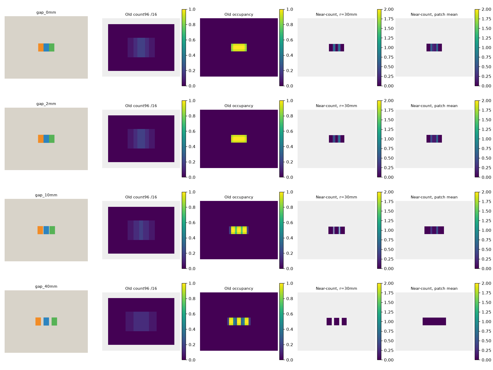

모든 비교 그림의 열은 왼쪽부터 **scene RGB / 기존 96px window의 count GT÷16 / 기존 occupancy GT / r=30mm 관측 표면 근접도 / 16px patch 내 유효 foreground 근접도 평균**임. 마지막 두 열은 GT label과 depth로 계산한 진단값이며, 학습 모델 prediction이나 승인된 Complexity GT가 아님. 표면은 stride 2로 샘플링한 240×320, 마지막 열은 30×40 patch map임. 근접도의 단위는 다른 물체별 `max(0, 1−거리/반경)`를 더한 거리 가중 개수임. 기존 두 GT의 색 범위는 0–1, 근접도는 0–2로 고정함(2 초과는 같은 최고색이며 계산값은 자르지 않음). Scene별 min–max는 사용하지 않음. 근접도 열의 회색은 배경 또는 유효성 제외 영역으로, 값 0인 보라색 물체 표면과 구분함. 기존 GT와 근접도의 유효 영역은 서로 다름.

**원본 합성 장면의 내부 차이:** `book_1`의 동일 scene을 center/left/right/top/bottom 순서로 표시함. 넓은 물체 면적이 밝은 occupancy와 달리, 근접도는 다른 물체와 가까운 일부 표면에 반응함. 시점마다 보이는 표면이 다르므로 동일 3D 표면의 시점 불변성이나 숨겨진 접촉을 검증한 그림은 아님.


| 점검 / 범위 | 저장 결과 | 해석 |
|---|---|---|
| 간격 10mm, 중앙 물체의 표면 ROI, 5시점 | 내부 평균 0, 마주 보는 가장자리 평균 0.340–0.402 (r30) | 근접 관계의 국소 반응 확인 |
| 단독 평판·기울어진 판·구·무늬 변경 | 모든 5시점에서 근접도 0 | 수식상 기본 성질 확인; 독립적인 복잡도 타당성 증거는 아님 |
| 영상에서 인접/겹침, 실제 표면은 충분히 떨어진 두 배치 | 중심 시점에서 세 반경 모두 0 | 투영 인접과 metric 근접을 구분; 겹침 전체를 설명하는 값은 아님 |
| 숨겨진 물체를 추가해도 같은 RGB-D/label인 두 관측 | 중심 시점의 근접도 map 동일 | 관측에서 구분 불가능한 상태를 복원하지 못함 |
| 간격 10mm의 center 한 영상, 1mm Gaussian axial-depth noise, 원래 양수인 유효 표면 | MAE **0.00178**, 사전 기준 <0.05 | r20/30/50을 모은 평균; 전체 배경을 포함해 오차를 희석하지 않음 |
| 간격 10mm의 center 한 영상, 표면 sampling stride 1/2, 공통 유효 foreground patch | MAE **0.02046**, 양수 patch만 **0.04385**, 유효 patch 집합 불일치 0% | r20/30/50을 모은 공통 foreground MAE 기준 <0.05 만족; 양수 patch 값은 추가 기술 통계 |
| 간격 0/2/10/40/80mm, 중심 시점의 투영 물체 면적 `(max−min)/mean` | **3.1746% > 사전 3%: 실패** | 연속 silhouette union도 1.6396% 변함; 면적 통제 성공으로 보고하지 않음 |
| 원본 16개 pool ×1 train key ×5시점, r30 유효 foreground | 양수 표면 비율: 영상별 **13.8–36.8%**, 중앙값 **24.0%** | 정성 분포 설명이며 GT 정확도 또는 이상적인 복잡도 비율이 아님 |

<details>
<summary>나머지 통제 반례와 원본 3개 source pool의 5시점 비교</summary>

충분한 간격(80mm), 단독 평판, 기울어진 판, 구:


단독 물체의 무늬 변경, 깊이로 분리된 투영 겹침, 숨겨진 물체 추가 전·후:


영상에서는 인접하지만 3D로 충분히 떨어진 물체:


아래 파일명의 `real`은 원본 Isaac 합성 dataset을 뜻하며 실제 로봇 촬영을 뜻하지 않음. 각 그림은 동일 scene의 center/left/right/top/bottom 시점임.

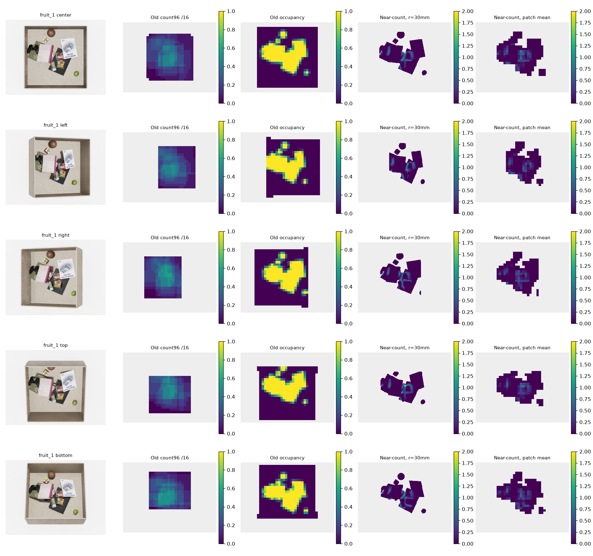

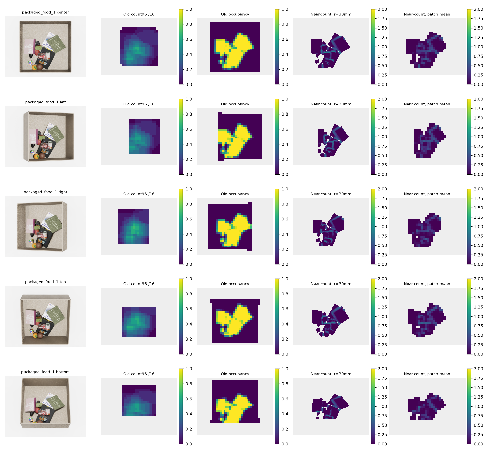

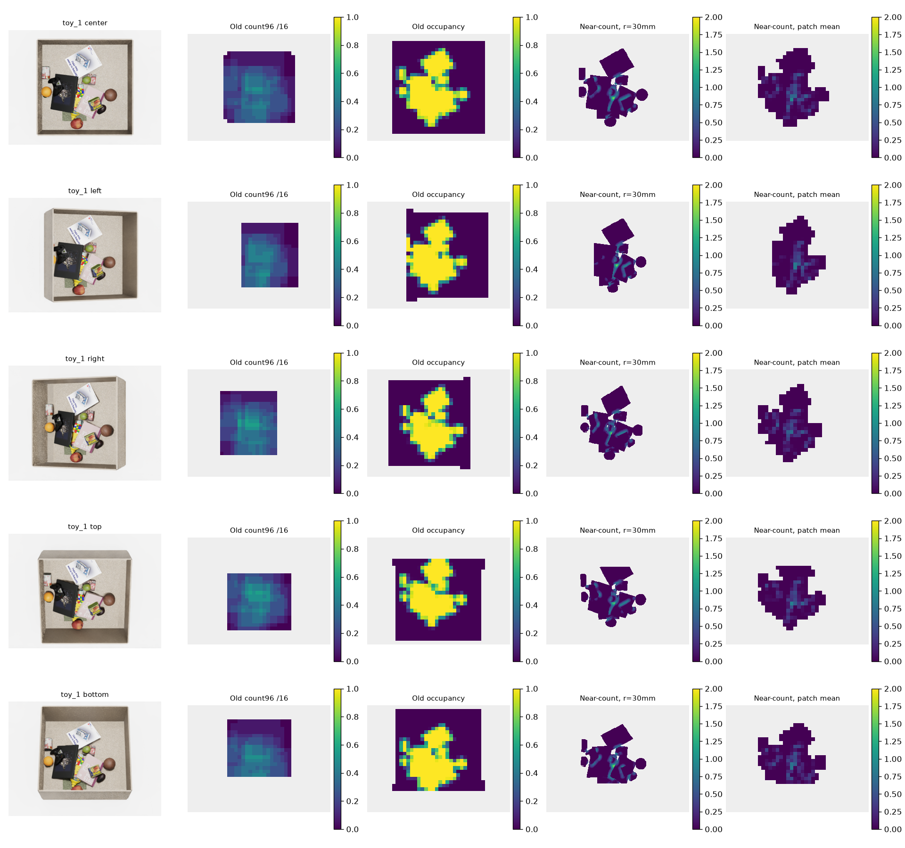

</details>

**실패와 판단:** 투영 물체 면적 편차 **3.1746%**가 사전 3% 기준을 넘어 면적 통제에 실패함. 연속 silhouette도 원근·옆면 노출로 1.6396% 변하므로 단순 raster 오차로 설명하지 않음. 허용치를 사후 완화하지 않았음. 또한 관측 근접도 0은 숨겨진 접촉의 부재나 장면의 단순함을 보장하지 않고, 합쳐진 instance label은 관계를 놓침. 따라서 **관측 근접도 후보로만 유지하고 전체 Complexity GT로 승인하지 않음**. 새 학습·fusion은 실행하지 않음.

**다음 Step:** 실제로 면적이 같은 통제 조건을 보완하고, 근접도에 포함되지 않는 방향·가림 구조와 독립적인 국소 행동 지표를 검증함. 미검증 실험 코드는 로컬에 보존하고, Development Log에는 주요 milestone의 사진·수치 결과·실패와 한계를 함께 공개함. 결과 공개를 방법의 최종 채택으로 해석하지 않음.

---

### 2026-09-16 · Phase 35 — Cluttered-Scene Static Removal Diagnostic

**목적:** 가까운 물체의 가장자리에 반응한 Phase 34 근접도가, 실제 더미에서 어느 물체를 치울지 판단하는 데 도움이 되는지 확인함. 책·과일·포장식품·장난감 asset이 쌓인 기존 capture를 사용하며 정형 도형을 추가하지 않음.

**방법과 범위:** Pose가 저장된 추가 capture의 10 layouts × 5 cameras를 재현함. `packaged_food_1` 8 layouts와 `fruit_1` 2 layouts이며, 원본 16개에 `World1`을 더한 **17-asset 데이터**로 기존 16-only 평가와 구분함. USD의 단위·scale·하위 transform을 보존하면서 saved pose를 적용하고, 원본 depth/label과 먼저 비교함. Workspace에서 foreground IoU ≥0.95, 64px 이상 label IoU ≥0.90, 동일 label 내부 depth 오차 median ≤2mm/p95 ≤5mm 등 사전 기준을 **50/50 views 모두 통과**함. Foreground IoU 범위는 0.999235–0.999709, 평가된 label IoU 최솟값은 0.969697이었음.


열은 원본 RGB / 원본 label / 재현 label / depth 절대 오차임. Depth 검증은 동일 label을 1px erosion한 내부의 유효 pixel에서 수행했고, view별 p95 최댓값은 0.006437mm였음. 합성 render 간 비교이며 실제 depth sensor 정밀도나 RGB pixel 재현 정확도가 아님.

각 물체를 하나씩 제거하고 매번 원래 scene으로 돌아가며 다른 물체는 고정함. 총 **770 object-view 제거 조건**에서 `새로 보인 다른 물체 pixel 수 / 제거한 물체의 원래 visible pixel 수`를 계산함. 바닥 노출은 제외하며 큰 물체에 유리한지 확인하기 위해 원시 노출 pixel 수도 별도로 비교함. 이 비율은 Complexity 정답이나 target 발견 확률이 아님.

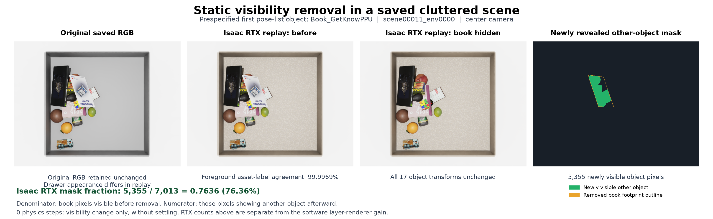

독립 Isaac RTX 검증은 사전 지정한 첫 layout의 다섯 시점과 첫 책 `Book_GetKnowPPU`의 제거 후 center에서 수행함. 그림은 원본 RGB / Isaac 제거 전 / 제거 후 / 새로 보인 다른 물체 영역임. 물리 step 없이 잔존 물체의 world transform 변화는 0이었음. Software 제거와 Isaac 제거 후 foreground IoU는 **0.999414**였음. 원본과 replay의 서랍 재질 차이가 있어 기하·label 재현만 검증함. 전체 770조건을 독립 RTX로 검증한 것은 아님.

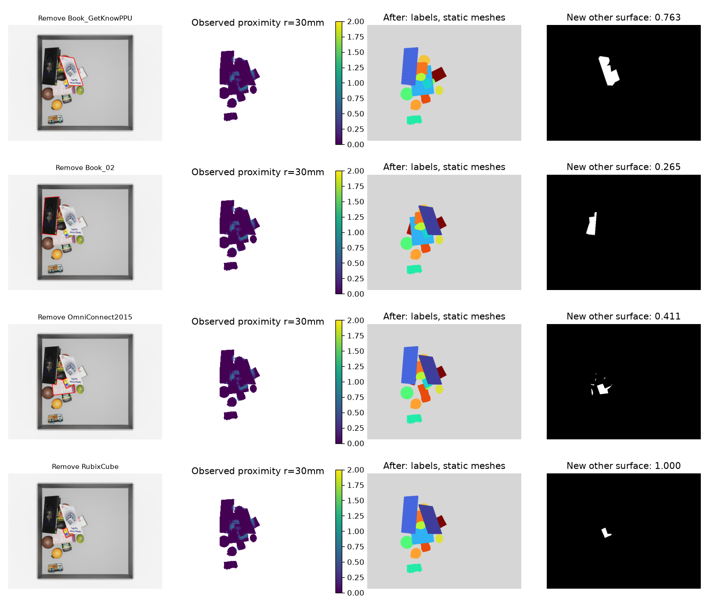

각 행은 첫 scene의 pose 순서상 앞 네 대상이며 결과에 맞춰 고르지 않았음. 열은 제거 대상 윤곽 / GT label+depth의 30mm 근접도 / 제거 후 label / 새 노출 영역임. 첫 책은 근접도 평균이 **0.0265**인데 제거하면 원래 visible 영역의 **76.34%**에서 다른 물체가 드러남(software 5350/7008px; Isaac 5355/7013px). 가장자리 근접도와 그 물체 아래의 노출 효과가 다를 수 있음을 보여줌. 작은 물체의 비율 1도 큰 절대 노출 면적을 뜻하지 않음.

**결과:** 근접도 지원 면적 ≥80%인 715조건 중 네 점수가 모두 유효한 공통 조건은 710개/50 views임. 한 view의 depth roughness가 상수여서 최종 네 지표 공동 상관 비교는 **701조건/49 views, 10 layouts**를 사용함. 같은 view의 같은 물체 집합에서 Spearman 순위 상관을 계산한 뒤 layout 내부 view 평균, 10 layouts 동일 가중 평균 순서로 집계함. 초기 feature별 결측값 제외 집계는 공통 object/view 집계로 수정했고 독립 재계산으로 확인함.

| 제거 전 물체별 점수 | 새 노출 비율과 평균 순위 상관 | 새 노출 pixel 수와 평균 순위 상관 |
|---|---:|---:|
| **30mm 관측 근접도 평균** | **0.078** | **0.041** |
| 보이는 면적 | 0.387 | 0.615 |
| 96px window 국소 개수 평균 | 0.291 | 0.156 |
| 96px depth 평면 잔차 평균 | 0.002 | -0.149 |

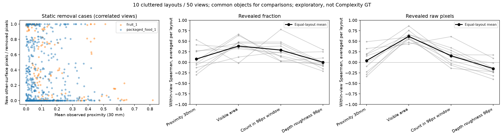

양수가 클수록 해당 점수가 높은 물체의 제거 효과도 큰 경향임. Depth 평면 잔차는 기존 empty-reference 차이 기반 cue이며 단순 raw depth variance가 아님. 그림의 산점도는 공통 710조건, 상관 패널은 유효 701조건/49 views를 사용함. 회색 선은 layout별 값, 검정 선은 평균임. 근접도의 비율 상관은 layout별 -0.297–0.535로 변동했고 면적보다 높은 layout은 2/10, count보다 높은 layout은 3/10이었음.

**한계와 판단:** 두 capture run·세 generation batch와 공통 asset을 공유하므로 물체·시점을 독립 표본으로 취급하거나 유의성을 주장하지 않음. 이상적인 segmentation·pose·mesh를 쓴 정적 가시성 진단이며 실제 집기·재정착·target 발견·탐색 효율과 segmentation 없는 RGB-D 추론은 미검증임. 관측 근접도는 RGB-D만으로 추론한 출력이 아니라 GT label+depth 기반 후보임. **30mm 근접도의 물체별 평균을 제거 순위 점수나 Complexity GT로 채택·학습할 근거가 부족함.** 근접 feature 전체가 무용하다는 결론이나 면적/count가 복잡도의 정답이라는 결론으로 확대하지 않음.

**다음 Step:** 실제 더미에서 관측 가능한 가림 방향 정보가 단순 면적·count보다 추가 정보를 주는지 현재 제거 평가로 확인하고, 이미 본 layout에서 맞춘 후보는 새 capture에서 재검증함. 기존 Occlusion Stream과의 역할 차이도 먼저 정리함. 새 GT 대량 생성·학습·fusion은 보류함. 코드·원시 결과·실패 실행은 로컬에 보존하고 이번 게시에는 README와 비교 그림만 포함함.


---

### 2026-09-16 · Phase 36 — Frozen-DINO Visible-Asset Representation Probe

**목적:** Similarity는 DINO의 외형 표현에 SigLIP의 의미 표현을 보완했음. Complexity도 새 점수를 계속 바꾸기보다 기존 RGB-D 표현에 무엇이 부족한지 먼저 확인해야 함. 따라서 `A: 기존 DINO+depth → B: RGB로 예측한 물체 묶음 추가 → C: 공간 사전학습 표현 추가` 비교를 계획하고, 이번에는 **A의 기초 진단만 수행함**. Phase 35 끝의 방향 정보 제안은 당시 후속 가설이며 현재 채택한 GT가 아님.

**방법과 이유:** 실제 asset이 쌓인 영상에서 두 16×16 patch가 같은 가시 asset에 속하는지 분류함. 기존 16개 source pool을 모두 유지하고 train/val/test는 8/4/8 scene keys × 16 pools × 5 cameras, 즉 **640/320/640 views**로 구성함. 같은 scene key의 모든 pool·camera를 같은 split에 둠. Test 8 keys는 Complexity V1/V2에 사용한 24개를 제외한 원본 test pool에서 사전 선택했으며, asset 자체는 학습에서 본 조건임.

Patch의 ≥90%가 같은 알려진 asset이고 workspace와 유효 depth가 각각 ≥95%인 경우만 사용함. Mapping에서 서로 다른 asset이 같은 색을 공유하는 영역은 unknown으로 제외함. 같은 asset의 pair와 다른 asset의 pair를 **정확한 XY offset, anchor category, depth 차이 구간**별로 맞추고, 같은 카테고리의 다른 asset을 구분하는 조건을 주 평가로 삼음. GT segmentation/category는 감독·표집·평가에만 사용하며 분류기 입력에는 넣지 않음. 따라서 GT가 지정한 순수 patch에서의 분류 진단이며 전체 영상 segmentation 성능은 아님.

Frozen DINO 두 feature의 차이·곱, RGB-D에서 계산한 depth descriptor, 위치를 작은 `1622→64→16→1` 분류기에 입력함. Position / depth+position / DINO+position / DINO+depth+position은 같은 구조·초기값·sample 순서로 seed 0/1/2를 비교하며 사용하지 않는 branch는 train-only normalization 뒤 0으로 둠. Validation으로 checkpoint를 고정한 후 test를 평가함. DINO cosine와 depth 차이는 학습 없는 비교군임.

**결과:** Test 전체는 150,690 pairs/640 views이고, 주 평가인 same-category 조건은 **80,024 pairs(양성·음성 각각 40,012), 604 views, 8 scene-key 묶음**임. 나머지 36 views에는 해당 matched pair가 없음. 아래 AUROC는 view별 계산 → key별 pool/view 평균 → 8 keys 동일 평균 → 세 seed 평균임. 1에 가까울수록 잘 구분한다는 뜻이며 정확도나 Complexity 점수가 아님.

| 방법 | 같은 카테고리 내 AUROC | 다른 카테고리 간 AUROC |
|---|---:|---:|
| 위치만 | 0.608809 | 0.530252 |
| Depth + 위치 | 0.773882 | 0.873615 |
| DINO + 위치 | **0.998953** | 0.999664 |
| DINO + depth + 위치 | 0.998908 | **0.999673** |
| DINO cosine, 학습 없음 | 0.925424 | 0.974662 |
| Depth 차이, 학습 없음 | 0.535946 | 0.538848 |


DINO+depth는 depth보다 same-category AUROC가 +0.225025 높았고 8/8 keys에서 개선됨. DINO+depth와 DINO의 차이는 -0.000045로 이 과제에서 depth 추가 효과는 확인하지 못함. Pair 표집 조건과 GT→입력 누출 여부를 독립 검토하고 일부 지표를 재계산하여 저장값과 일치함을 확인함.

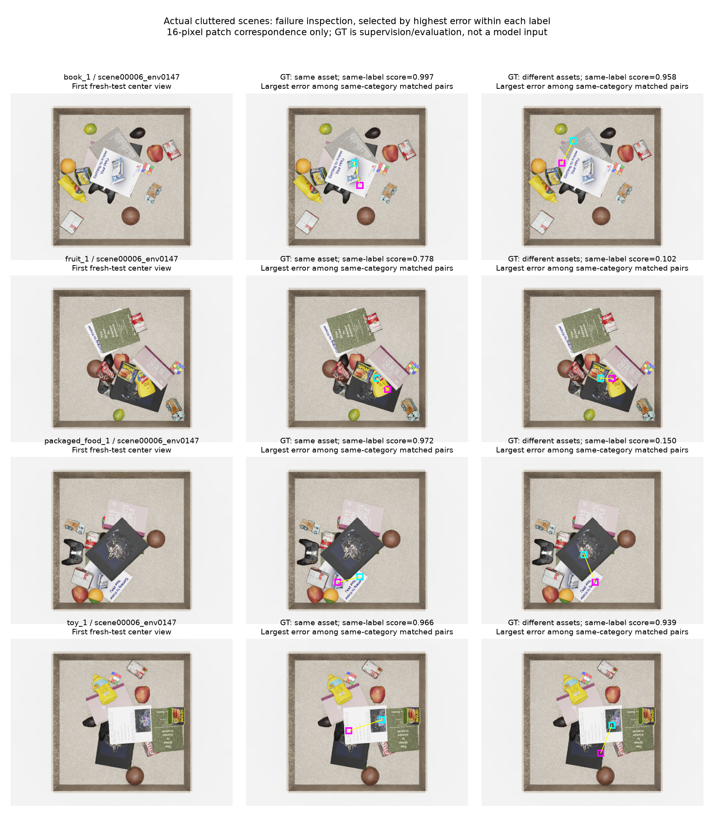

왼쪽은 RGB, 가운데는 같은 asset pair, 오른쪽은 같은 카테고리의 다른 asset pair임. 사전 첫 test key의 book/fruit/packaged-food/toy 첫 pool과 center camera를 고정하고 각 영상·label에서 오차가 가장 큰 pair를 표시함. 따라서 대표 평균 성능을 보여 주는 표본은 아니며, 고른 pair가 모두 오분류인 것도 아님. 청록·자홍 사각형은 두 patch이고 `same-label score`는 세 seed의 평균 logit에 sigmoid를 적용한 값임. 실제 분포에서 보정된 확률로 해석하지 않음.

**한계와 판단:** 알려진 foreground가 걸친 test patch 128,380개 중 조건을 만족한 것은 54,429개(**42.40%**)임. 이 분모는 unknown/색 충돌 영역을 제외하며 전체 물체 면적 coverage가 아님. 경계·작은 물체·심한 가림은 상당 부분 제외되고 같은 asset의 복제 instance를 구분하는 문제도 평가하지 않음. Pair와 view는 서로 상관되어 있으므로 80,024개를 독립 scene 수로 해석하지 않음. **기존 표현에서 알려진 asset 내부의 대응 정보를 읽을 수 있다는 근거이며, 복잡도 이해·전체 segmentation·새 물체 일반화의 증거는 아님.**

**다음 Step:** 현재 순수 patch 지표는 거의 포화되어 B/C의 추가 효과를 판별하기 어려움. 물체 내부 구분을 위한 모델 추가는 보류하고, 실제 더미의 경계·분리된 조각의 소속·다중 물체 관계 중 어떤 능력이 부족한지 평가부터 고정함. 관측 가능한 관계 label의 품질을 확인한 뒤 같은 평가·region 조건에서 물체 묶음과 공간 표현의 추가 가치를 비교함. SAM/VLM이 불필요하다는 결론은 아니며 **B/C 모델 실행·새 Complexity GT 채택·fusion은 미완료**임. 이번 공개는 README와 두 비교 그림으로 한정하고 실험 코드·checkpoint·원시 자료는 로컬에 보존함.
