# 2D-PDM

### Zero-Shot Probability Distribution Mapping for Occluded Object Search in Cluttered Drawers

> **Research in progress**  
> RGB-D 관측으로 가려진 target object의 위치를 추론하고, 탐색 행동을 위한 pixel-wise probability map 생성

---

## Overview

사람의 물체 탐색에 사용되는 세 단서인 유사도, 가림 가능성, 장면 복잡도를 독립적인 probability stream으로 모델링함.

| Stream | 핵심 질문 | 출력 |
|---|---|---|
| **Similarity** | 타겟과 시각적·의미적으로 관련된 물체는 어디에 있는가? | Similarity feature `F_S` |
| **Occlusion** | 타겟이 다른 물체 아래에 물리적으로 가려질 수 있는가? | Occlusion feature `F_O` |
| **Complexity** | 해당 영역의 물체 더미가 얼마나 조밀하고 복잡한가? | Complexity feature `F_C` |

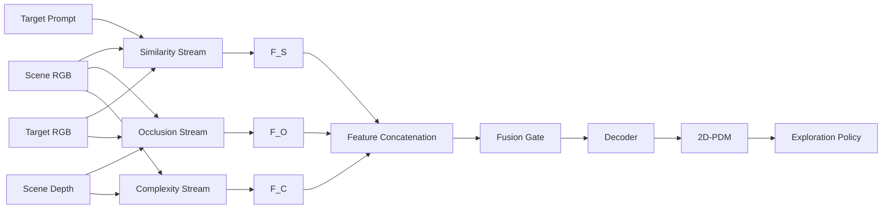

```text
F_fuse = FusionGate(Concat(F_S, F_O, F_C))
P_2D   = Sigmoid(Decoder(F_fuse))
```

최종 `P_2D`는 target이 존재할 확률이 높은 영역을 나타내며, DRL이 확률이 높은 영역부터 우선 탐색할 수 있도록 사용됨.

---

## From Shelf Search to Drawer Search

기존 선반 환경 연구를 비정형 drawer 환경으로 확장함.

> H. Jeon et al., *A study on deep reinforcement learning-based exploration intelligence for occluded object search*, Engineering Applications of Artificial Intelligence, 2026.

기존 연구는 similarity와 occlusion 기반 column-wise distribution을 사용함. 물체 유사도를 수동 정의한 category score에 의존하여 unseen object에 대한 zero-shot 탐색이 불가능했음.

주요 확장:

- 정규적인 shelf column에서 **비정형 cluttered drawer**로 확장
- Column-wise distribution에서 **pixel-wise 2D-PDM**으로 확장
- DINOv3의 dense appearance와 SigLIP의 language-aligned semantics 결합
- 학습하지 않은 target instance를 입력할 수 있는 zero-shot target conditioning
- Similarity와 Occlusion에 scene-level **Complexity stream** 추가

---

## Similarity Stream

> **Status: Implemented · qualitative zero-shot activation confirmed · quantitative held-out benchmark pending**

Similarity stream은 target 및 의미적으로 관련된 물체 영역을 활성화함. DINOv3의 dense appearance와 SigLIP의 image/text semantics를 결합하여 instance-level 외형과 category-level 의미를 함께 표현함.

### Design Rationale

| Component | 담당 정보 | 필요한 이유 |
|---|---|---|
| **DINOv3 Scene Encoder** | 위치가 보존된 dense visual feature | Scene의 어느 patch에 어떤 형상·질감·appearance가 있는지 표현 |
| **DINOv3 Target Encoder** | Target-specific appearance | “이 물체가 어떻게 생겼는가?”를 layer별 query로 표현 |
| **SigLIP Vision Encoder** | Target image semantics | 외형을 넘어선 open-vocabulary 개념 표현 |
| **SigLIP Text Encoder** | Instance name + category semantics | 이미지가 모호해도 구체적인 물체 이름과 category 정보로 의미를 보완 |
| **Matching Head** | Scene–target spatial relation | Appearance, semantics, cosine cue를 함께 해석해 probability map 생성 |

### Architecture

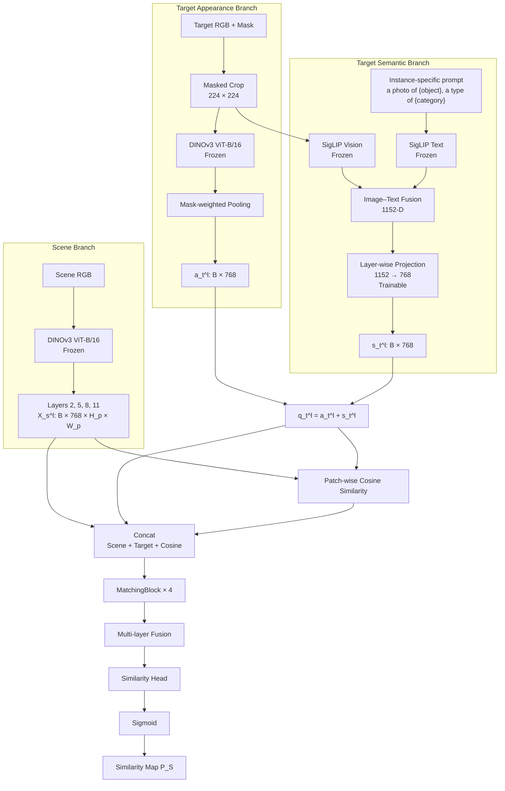

### Model Specification

| Stage | Module | Input | Operation | Output | State |
|---:|---|---|---|---|---|
| 1 | Target preprocessing | Target RGB, mask | Crop, resize, mask alignment | `224 × 224` target crop | Fixed |
| 2 | Scene encoder | Scene RGB | DINOv3 ViT-B/16 layers `2, 5, 8, 11` | `X_s^l: B × 768 × H_p × W_p` | Frozen |
| 3 | Target encoder | Target crop, mask | DINOv3 + mask-weighted pooling | `a_t^l: B × 768` | Frozen |
| 4 | SigLIP vision | Target crop | Image encoding, L2 normalization | `s_img: B × 1152` | Frozen |
| 5 | SigLIP text | Category prompt | Text encoding, L2 normalization | `s_text: B × 1152` | Frozen |
| 6 | Semantic fusion | `s_img`, `s_text` | Average fusion, L2 normalization | `s: B × 1152` | Fixed |
| 7 | Semantic adapter | `s` | Independent `Linear(1152, 768)` per layer | `s_t^l: B × 768` | **Trainable** |
| 8 | Target fusion | `a_t^l`, `s_t^l` | Element-wise addition | `q_t^l: B × 768` | Fixed |
| 9 | Cosine matching | `X_s^l`, `q_t^l` | Patch-wise cosine, range shift | `c_hat^l: B × 1 × H_p × W_p` | Fixed |
| 10 | Interaction | Scene, target, cosine | Channel concatenation | `Z^l: B × 1537 × H_p × W_p` | Fixed |
| 11 | MatchingBlock | `Z^l` | `3×3 Conv → GN → ReLU → 1×1 Conv → GN → ReLU` | `F_l: B × 64 × H_p × W_p` | **Trainable** |
| 12 | Layer fusion | Four `F_l` tensors | Concat + 1×1 convolution | `F_S: B × 64 × H_p × W_p` | **Trainable** |
| 13 | Output head | `F_S` | 1×1 convolution + sigmoid | `P_S: B × 1 × H_p × W_p` | **Trainable** |
| 14 | Reconstruction | `P_S` | Bilinear interpolation | Full-resolution similarity map | Fixed |

### Target Representation

Segmentation mask 내부 patch만 pooling하여 target appearance 계산.

```text
a_t^l = L2Norm(
    Sum[M_t(u,v) · X_t^l(:,u,v)] /
    (Sum[M_t(u,v)] + epsilon)
)
```

SigLIP image/text embedding을 동일한 semantic space에서 결합. 현재 최종 경로는 과거의 DINOv3 CLS category prototype을 사용하지 않으며, SigLIP의 language-aligned embedding을 semantic condition으로 사용함.

```text
s_img  = L2Norm(SigLIP_Vision(target_crop))
s_text = L2Norm(SigLIP_Text(
    "a photo of {instance_name}, a type of {category}"
))
s      = L2Norm((s_img + s_text) / 2)
s_t^l  = W_l · s + b_l
```

Appearance와 semantics를 합산하여 최종 target query 생성.

```text
q_t^l = a_t^l + s_t^l
```

| Vector | 의미 |
|---|---|
| `a_t^l` | Target이 시각적으로 어떻게 생겼는가 |
| `s_t^l` | Target이 의미적으로 어떤 category에 속하는가 |
| `q_t^l` | Appearance와 semantics가 결합된 layer-wise target condition |

> **Semantic fusion을 더하는 이유**
>
> DINOv3와 SigLIP은 서로 다른 feature space를 사용하므로 SigLIP 1152-D vector를 바로 더하지 않음. 학습 가능한 layer-wise projection `Linear(1152, 768)`이 SigLIP semantics를 DINOv3 target feature에 활용할 수 있는 형태로 변환함. 결합된 `q_t^l`는 순수 appearance vector가 아니라, **target의 외형과 의미를 함께 담은 검색 query**임. 단, 이 정렬은 차원을 맞춘 것만으로 보장되지 않으며 similarity-map loss를 통해 간접적으로 학습됨.

### Scene–Target Interaction

Scene의 **각 patch**와 target query의 cosine similarity를 계산한 뒤 `[0, 1]`로 변환. Scene 전체를 하나의 숫자로 압축하는 것이 아니라, 위치별 scalar가 모여 `H_p × W_p` cosine map을 형성함.

```text
c^l(u,v)     = CosineSimilarity(X_s^l(:,u,v), q_t^l)
c_hat^l(u,v) = (c^l(u,v) + 1) / 2
```

#### Cosine Similarity vs. MatchingBlock

| 구분 | Patch-wise cosine | MatchingBlock |
|---|---|---|
| 핵심 질문 | “이 위치가 target과 얼마나 비슷한가?” | “이 유사도를 최종 map에서 어떻게 해석할 것인가?” |
| 계산 | 각 scene patch와 target query의 고정된 cosine 수식 | 학습되는 `3×3/1×1` CNN |
| 입력 | Scene patch, target query | Scene feature, target query, cosine map |
| 출력 | 위치별 1개 유사도, `1 × H_p × W_p` | 위치별 64-D feature, `64 × H_p × W_p` |
| 주변 문맥 | 사용하지 않음 | `3×3 Conv`로 주변 patch까지 함께 해석 |

Cosine map만으로도 기본적인 zero-shot similarity map을 만들 수 있음. 다만 768-D scene–target 관계가 위치별 숫자 하나로 압축되므로, 같은 cosine 값이 외형·의미·배경 중 어떤 이유로 나왔는지는 알 수 없음. MatchingBlock은 원본 scene/target feature와 cosine cue, 주변 공간 문맥을 함께 보고 우연한 고유사도를 억제하거나 일관된 물체 영역을 강화하는 역할을 학습함.

```text
Patch-wise cosine = 위치별 유사도를 측정하는 “측정기”
MatchingBlock       = 측정값과 원본 feature를 해석하는 “학습된 보정기”
```

MatchingBlock은 target patch와 scene patch 사이의 cross-attention이나 patch correspondence를 다시 계산하지 않음. 현재 구조에서 직접적인 벡터 유사도 비교는 patch-wise cosine이 담당하고, MatchingBlock은 그 결과를 학습적으로 보정함.

Scalar cosine score의 정보 손실을 보완하기 위해 scene feature와 target query를 함께 concat.

```text
Z^l(u,v) = Concat[
    X_s^l(:,u,v),   # scene appearance: 768 channels
    q_t^l,          # target condition: 768 channels
    c_hat^l(u,v)    # explicit matching cue: 1 channel
]
```

각 DINOv3 layer를 독립적인 MatchingBlock으로 처리한 뒤 channel 방향으로 결합.

```text
F_l     = MatchingBlock_l(Z^l)
F_S     = Fuse(Concat[F_2, F_5, F_8, F_11])
L_head  = Head(F_S)
P_S     = Sigmoid(L_head)
```

### Trainable Parameters

DINOv3와 SigLIP은 고정하고 semantic adapter와 matching head만 학습.

| Module | Parameters | State |
|---|---:|---|
| DINOv3 ViT-B/16 | Backbone parameters | Frozen |
| SigLIP SO400M | Encoder parameters | Frozen |
| Semantic projection `Linear(1152, 768) × 4` | 3,542,016 | **Trainable** |
| MatchingBlock × 4 | 3,559,168 | **Trainable** |
| Multi-layer fusion | 16,576 | **Trainable** |
| Similarity head | 65 | **Trainable** |
| **Total trainable** | **7,117,825** | |

Checkpoint에는 task-specific layer만 저장하며, frozen backbone은 별도로 로드.

---

## Ground-Truth Similarity Map

Similarity GT는 scene segmentation과 asset category로 생성. 기존 연구와의 비교를 위해 명시적인 category relation 유지.

| Target–scene relation | Score |
|---|---:|
| Exact target instance | `1.0` |
| Same category | `0.8` |
| Related category | `0.5` |
| Other category | `0.2` |
| Background / unknown | `0.0` |

Category-level score:

| Target ↓ / Scene → | Book | Toy | Fruit | Packaged food |
|---|---:|---:|---:|---:|
| **Book** | 0.8 | 0.5 | 0.2 | 0.2 |
| **Toy** | 0.5 | 0.8 | 0.2 | 0.2 |
| **Fruit** | 0.2 | 0.2 | 0.8 | 0.5 |
| **Packaged food** | 0.2 | 0.2 | 0.5 | 0.8 |

Precomputed grayscale GT를 우선 사용하며, cache가 없으면 segmentation과 scene mapping으로 생성. 학습 시 DINOv3 patch resolution으로 average pooling.

```text
Y_patch = AvgPool2D(Y_full, kernel=16, stride=16)
L_sim   = MSE(P_S, Y_patch)
```

> 학습 GT의 category relation과 zero-shot evaluation은 별개임. Unseen target은 DINOv3와 SigLIP으로 직접 인코딩되며 해당 instance는 학습에서 제외.

---

## Similarity Training Protocol

### Data Split

동일 scene의 여러 camera view가 train/validation에 섞이지 않도록 `scene_id` 단위로 분할.

| Setting | Value |
|---|---|
| Train / validation | `80% / 20%` per target |
| Scene cameras | center, top, left, right, bottom |
| Target cameras | center, top, left, right, bottom |
| Environment stride | `10` |
| DINOv3 layers | `2, 5, 8, 11` |
| Batch size | `128` |
| Epochs | `100` |
| Optimizer | AdamW |
| Initial learning rate | `1e-3` |
| Scheduler | CosineAnnealingLR |
| Early stopping | patience `5`, relative improvement `5%` |
| Objective | Patch-resolution MSE |

### Cached and Trainable Paths

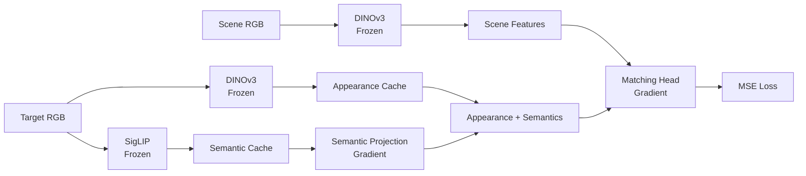

- Target별 5개 camera view의 DINOv3 appearance 사전 계산
- 학습 시 camera view 무작위 선택
- Validation 시 camera view 고정 순회
- Target별 SigLIP image/text embedding caching
- Gradient 유지를 위해 semantic projection은 training step 내부에서 적용

### Evaluation and Checkpoints

평가 지표:

- Mean squared error
- Pixel accuracy
- Balanced accuracy
- Intersection over Union

Checkpoint에는 trainable module만 저장.

```python
{
    "model_state": similarity_model.state_dict(),
    "semantic_proj_state": semantic_projection.state_dict(),
}
```

---

## Zero-Shot Target Conditioning

Target image를 query로 직접 인코딩하므로 unseen object 입력 가능.

| Mode | Target input | 특징 |
|---|---|---|
| **Image-only** | Target RGB | 별도의 category label 없이 visual/semantic image embedding 사용 가능 |
| **Image + text** | Target RGB + prompt | 물체 이름이나 category semantics로 모호한 외형을 보완 |

현재 instance-specific prompt 사용:

```text
a photo of {instance_name}, a type of {category}
```

### Qualitative Similarity Maps

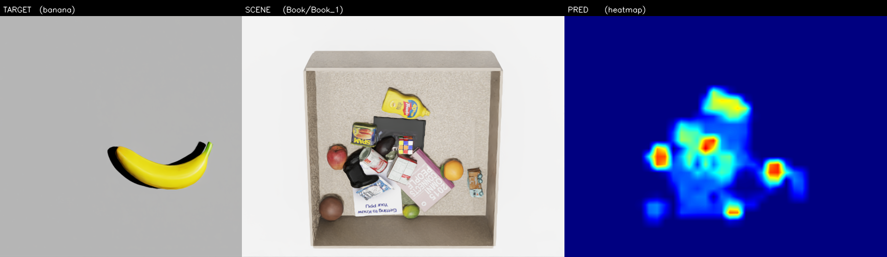
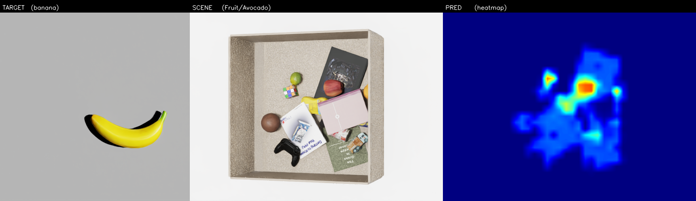
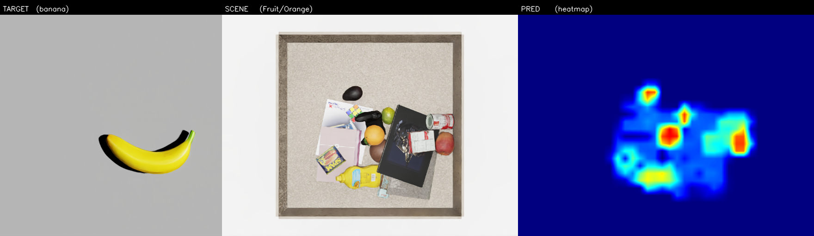

### Unseen Target Results

학습에 포함되지 않은 banana 입력 시 fruit 영역 활성화 확인. 학습에 포함되지 않은 packaged-food target에서도 same-category 영역 활성화 확인.


- DINOv3: target–scene dense appearance
- SigLIP: banana–fruit open-vocabulary semantics

> Banana 및 `packaged_food_5` 결과는 qualitative evidence임. 최종 zero-shot 주장은 object-held-out, category-held-out, DINOv3-only, SigLIP-only, image-only, image+text ablation으로 별도 검증할 예정.

---

## Similarity Stream: Four Questions

Similarity stream의 핵심은 **DINOv3 appearance로 외형을 찾고, SigLIP semantics로 category 의미를 보완한 뒤, 위치별 유사도를 학습적으로 보정**하는 것임.

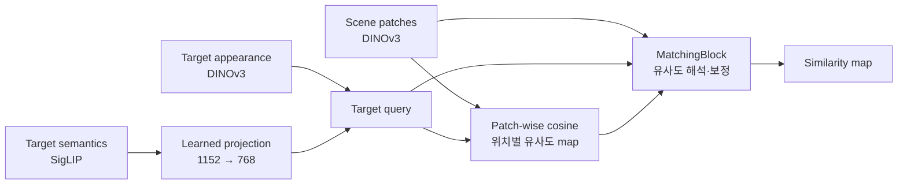

### Q1. 서로 다른 DINOv3와 SigLIP vector를 그냥 더해도 되는가?

**원본 vector끼리 바로 더하는 것은 아님.** DINOv3 appearance는 768-D, SigLIP semantic vector는 1152-D이며, 두 모델의 feature 축은 서로 다른 의미를 가짐. 현재 코드는 SigLIP vector를 layer별 학습 가능한 projection으로 변환한 뒤 DINOv3 appearance와 더함.

```text
DINOv3 appearance aˡ : 768-D  ───────┐
                                      ├─→ qˡ = aˡ + Wˡs
SigLIP semantics s     : 1152-D → Wˡ → 768-D ─┘
```

Projection `Wˡ`은 차원만 줄이는 고정 변환이 아니라, similarity-map loss가 작아지도록 학습되는 adapter임. 결합 후 `qˡ`은 순수한 DINOv3 appearance가 아니라 **외형과 category 의미가 함께 반영된 검색 query**가 됨.

쉽게 말하면, feature vector는 latent space 안의 **하나의 위치**로 볼 수 있음. DINOv3 appearance `aˡ`가 “노란색·곡선·표면 질감”에 가까운 위치를 표현한다면, projection된 semantic `Wˡs`를 더하는 것은 그 위치를 “banana·fruit” 개념 방향으로 이동시키는 것과 같음.

```text
개념적인 latent space (실제는 768-D)

                     orange •
                            \
             fruit 방향 ↗  • qˡ = appearance + semantics
                          /
       appearance aˡ •
                    \
                     • yellow toy
```

즉 semantic은 DINOv3 출력을 삭제하는 것이 아니라, target query가 scene에서 외형적으로 비슷한 물체뿐 아니라 의미적으로 관련된 물체에도 가까워지도록 위치를 보정하는 역할을 함.

### Q2. Cosine map이 이미 있는데 scene·target feature를 다시 concat하는 이유는?

Cosine은 scene 전체를 숫자 하나로 만드는 것이 아님. Scene이 `30 × 40` patch라면 **1,200개 위치 각각에 cosine scalar 하나**가 계산되어 `1 × 30 × 40` map이 됨.

Target은 patch 하나를 사용하는 것이 아니라, target 영역의 여러 DINOv3 patch를 pooling한 768-D 대표 vector `qˡ`로 요약됨. 이 하나의 target query를 scene의 모든 patch와 각각 비교함.

```text
Scene patches                         Cosine map

F(1,1) F(1,2) F(1,3) F(1,4)          0.10  0.18  0.74  0.81
F(2,1) F(2,2) F(2,3) F(2,4)   →      0.09  0.21  0.86  0.79
F(3,1) F(3,2) F(3,3) F(3,4)          0.05  0.13  0.32  0.20
```

공간 위치는 보존되지만, 각 위치의 768-D scene–target 관계는 cosine 숫자 하나로 압축됨.

| Scene의 한 patch | Target: banana와의 cosine | Cosine만으로 알 수 있는 것 |
|---|---:|---|
| Banana 영역 | `0.88` | Target과 매우 비슷함 |
| Orange 영역 | `0.63` | Banana보다 외형은 다르지만 일부 특징이 비슷함 |
| Yellow toy 영역 | `0.85` | 노란색·질감 때문에 높은지, 의미까지 맞는지는 알 수 없음 |

이처럼 banana patch와 yellow toy patch가 모두 높은 scalar를 가지거나, 같은 fruit인 orange가 더 낮은 scalar를 가질 수 있음. Cosine scalar만으로는 **어떤 feature로 인해 그 점수가 나왔는지** 구분하기 어려움.

그래서 다음 정보를 함께 유지함.

```text
Zˡ(u,v) = Concat[
    scene feature 768-D,   # 이 위치가 실제로 무엇인지
    target query  768-D,   # 무엇을 찾고 있는지
    cosine          1-D    # 두 vector의 직접적인 유사도
]
```

중복 정보를 의도적으로 제공하는 구조이며, cosine은 명시적 matching cue, raw feature는 cosine에서 손실된 세부 관계를 담당함. 다만 실제 이득은 `cosine-only` 대비 ablation으로 입증해야 함.

### Q3. SigLIP과 DINOv3 latent vector의 의미를 어떻게 알 수 있는가?

Latent vector의 각 차원에 `17번=과일`, `325번=노란색`과 같은 고정 의미가 붙어 있는 것은 아님. 개념은 여러 차원에 **분산 표현**되므로, 논문에서는 각 좌표를 억지로 해석하지 않고 벡터가 보존하는 관계를 실험으로 검증함.

| 확인 방법 | 알 수 있는 것 |
|---|---|
| Text retrieval | Banana image가 `fruit`, `toy`, `book` 중 어느 text와 가까운지 |
| Nearest neighbor | Banana vector 주변에 apple/orange가 있는지, 노란 장난감이 있는지 |
| Prompt swap | 같은 target에 `fruit` 대신 `toy` prompt를 줄 때 map이 변하는지 |
| Linear probe | Frozen vector에 category 정보가 선형적으로 추출 가능한지 |
| Layer-wise map | DINOv3 각 layer가 질감·형태·물체 구분에 어떻게 반응하는지 |

SigLIP semantic vector는 target crop의 image embedding과 instance/category prompt의 text embedding을 결합한 **전역 multimodal concept representation**임. DINOv3 patch token은 해당 위치뿐 아니라 self-attention을 통해 주변과 전체 scene 문맥이 반영된 **위치별 contextual visual representation**임.

### Q4. Patch-wise cosine과 MatchingBlock은 같은 matching을 두 번 하는 것 아닌가?

둘 다 scene patch 위치를 유지하지만 역할은 다름.

| 구분 | Patch-wise cosine | MatchingBlock |
|---|---|---|
| 비유 | 유사도를 재는 **측정기** | 측정값을 판단하는 **학습된 보정기** |
| 방법 | 고정된 cosine 수식 | 학습되는 `3×3 Conv → 1×1 Conv` |
| 출력 | 위치별 숫자 1개 | 위치별 64-D feature |
| 주변 patch | 보지 않음 | `3×3 Conv`로 함께 봄 |

예를 들어 중앙 patch의 cosine이 모두 `0.91`이어도 주변 모양은 다를 수 있음.

```text
고립된 고유사도                 물체 영역으로 이어진 고유사도

0.10  0.12  0.09                 0.71  0.78  0.74
0.11  0.91  0.13                 0.80  0.91  0.82
0.08  0.10  0.12                 0.72  0.79  0.75

Cosine: 중앙은 둘 다 0.91          MatchingBlock: 주변 문맥으로 두 경우를 다르게 해석 가능
```

MatchingBlock은 cosine을 다시 계산하지 않으며, target patch–scene patch cross-attention이나 correspondence 탐색도 수행하지 않음. 이미 계산된 cosine, 원본 feature, 주변 문맥을 이용해 최종 활성화를 보정함.

> **핵심 구분:** Patch-wise cosine이 “얼마나 비슷한가”를 계산하고, MatchingBlock이 “그 비슷함을 믿을 것인가”를 학습함. MatchingBlock의 실제 필요성은 cosine-only 대비 held-out ablation으로 검증해야 함.

---

## Occlusion Stream

> **Status: Mesh-based GT generation validated · clean52 multi-scale development benchmark complete · conditioning refinement in progress · final untouched-target benchmark pending**
>
> Phase 14–15의 analytic/size-only/no-broadcast 코드는 현재 로컬 실험 harness임. Controlled gate를 통과한 구성만 GitHub의 release baseline 코드로 승격할 예정이며, 현재 공개 `occlusion_model.py`는 broadcast-on baseline을 유지함.

Occlusion stream은 target의 크기와 형상을 고려하여 물체 더미 아래에 가려질 가능성이 높은 영역을 예측함.

### Occlusion GT Generation

학습 GT는 target을 모든 pose에서 직접 촬영하는 대신 USD/OBJ mesh로 target depth를 계산하여 생성. 해상도는 기존 데이터와 동일한 `640 × 480`을 유지하고, 기존 pose grid와 `70%` occlusion 판정 기준을 적용함. 렌더링된 개별 RGB·depth·mask는 저장하지 않고 scene depth와 즉시 비교하여 누적값만 저장함.

```text
Target mesh + scale + candidate pose
                ↓
        Rendered target depth
                ↓
Empty-drawer depth로 valid pixel 계산
                ↓
Compare with cluttered scene depth
                ↓
Valid target pixel의 occlusion ratio ≥ 0.7
                ↓
Legacy GT + probability GT
```

기존 코드의 ratio는 clutter occlusion이 적용된 픽셀을 target 전체 픽셀 수로 나눔. 이 방식은 empty drawer에서 서랍 구조물에 가려지는 픽셀을 분자에서는 제외하면서 분모에는 남기는 불일치가 있음. 기존 결과 재현용 `legacy_ratio`와 학습용 `corrected_ratio`를 분리함.

```text
legacy_ratio    = N_occluded_valid / N_target_all
corrected_ratio = N_occluded_valid / (N_valid + epsilon)

is_occluded = corrected_ratio >= 0.7
```

확률 GT는 해당 위치를 target이 덮는 유효 후보 pose 중 target의 관측 가능한 부분이 `70%` 이상 가려지는 pose의 비율로 정의. Scene별 min–max normalization과 visible-target 강조는 사용하지 않음.

```text
P_O(u,v) = N_occluded(u,v) / (N_candidate(u,v) + epsilon)
```

#### Mesh-Based GT Reproduction Pilot

`packaged_food_2`, scale `1.0`에서 전체 `44,100`개 candidate pose를 GPU로 처리함. Mesh 기반 target depth로 Legacy GT를 재현하고, 동일한 실행에서 corrected probability GT를 함께 생성함.

기존 GT의 visible-target 후처리도 코드 기준으로 복원함. Scene에서 보이는 target pixel이 camera별 reference의 `30%` 이상이면 Legacy map 전체에 `0.7`을 곱하고 visible target 영역을 `255`로 설정함. 이 규칙은 기존 결과 재현용 Legacy GT에만 적용하며, 새 probability GT에는 적용하지 않음.

```text
visibility_ratio >= 0.3
    → legacy_map = legacy_map × 0.7
    → legacy_map[target_mask] = 255
```

기존 GT 3,000 scene × 5 camera의 visible-target ON/OFF 경계를 분석하고, mesh 전체 pose grid에서 camera별 최대 footprint를 직접 계산하여 정수 reference pixel 수를 확정함.

| Camera | Mesh reference pixels | Inferred legacy range | Decision agreement |
|---|---:|---:|---:|
| center | `2324` | `2324–2330` | `100%` |
| left | `2335` | `2334–2340` | `100%` |
| right | `2336` | `2327–2336` | `100%` |
| top | `2336` | `2324–2336` | `100%` |
| bottom | `2335` | `2334–2336` | `100%` |

최종 정수 reference를 사용해 20 scene × 5 camera의 100개 사례를 재검증함.

| Metric | Mean | Worst |
|---|---:|---:|
| Old GT vs Legacy MAE | `0.0000379` | `0.0000959` |
| Old GT vs Legacy correlation | `0.9999956` | `0.9999919` |

이는 완전한 byte-identical 결과는 아니지만, mesh 기반 Legacy GT가 기존 Isaac Sim GT를 사실상 동일하게 재현함을 보여줌. Corrected probability GT는 valid footprint를 분모로 사용하며 Legacy visibility 후처리를 적용하지 않음.

Multi-scale GT는 mesh를 실제 크기에 맞게 scale함. 현재 analytic-conditioning 실험은 target appearance를 고정하고, 실제 target mask에서 얻은 `area`, `bbox_h`, `bbox_w`만 `area × s²`, `h × s`, `w × s`로 변환하여 size effect를 분리 평가함. 실제 추론에서는 관측된 target mask에서 같은 크기 정보를 계산함.

#### Mesh-Depth Validation

USD mesh 계산이 Isaac Sim target capture를 재현하는지 4개 asset, 9개 pose, 5개 camera의 총 180개 조건에서 검증함.

| Metric | Result |
|---|---:|
| Resolution | `640 × 480` |
| Evaluated cases | `180` |
| Median silhouette IoU | `1.0000` |
| Cases with IoU `0.9993–1.0000` | `176 / 180` |
| Median depth MAE | `0.75 μm` |
| Lowest IoU | `0.8723` |

낮은 IoU 4건은 모두 `book_1`이 서랍 경계에 있고 외측 camera에서 관측된 조건임. Mesh-only renderer는 target 전체를 계산하지만 Isaac Sim reference에서는 서랍 벽이 target 일부를 가림. 최종 GT generator에서는 empty-drawer depth로 해당 영역을 제외하여 동일한 관측 조건을 구성함.

CPU reference 이후 nvdiffrast 기반 GPU rasterizer로 동일한 검증을 확장함. 원본 4개 asset의 `180`개 조건과 `toy_3` 10k simplified mesh의 `45`개 조건을 포함한 총 `225`개 target–pose–camera 조합을 평가함. `book_1` 경계 4건은 drawer wall visibility 차이로 분리되며, 나머지 asset은 사전 기준을 통과함.

| Asset | Cases | Median silhouette IoU | Worst IoU | Median depth MAE |
|---|---:|---:|---:|---:|
| `packaged_food_2` | `45` | `0.9991` | `0.9908` | `0.00245 mm` |
| `fruit_1` | `45` | `0.9993` | `0.9966` | `0.00239 mm` |
| `toy_3` original | `45` | `0.9989` | `0.9959` | `0.12545 mm` |
| `toy_3` 10k | `45` | `0.9971` | `0.9945` | `0.29095 mm` |

#### Automatic Mesh Simplification

초기 CPU reference rasterizer는 triangle별 Python loop를 사용하여 mesh 복잡도에 따라 실행 시간이 급증함.

| Asset | Triangles | Mean render time |
|---|---:|---:|
| `book_1` | `732` | `0.23 s` |
| `fruit_1` | `12,602` | `3.91 s` |
| `packaged_food_2` | `16,384` | `5.22 s` |
| `toy_3` | `2,029,960` | `577.72 s` |

`toy_3`은 2,029,960 triangles에서 10k mesh로 단순화함. GPU 원본–단순화 직접 비교 결과 45개 조건에서 median IoU `0.9970`, worst IoU `0.9938`, median depth MAE `0.3781 mm`를 기록함. 현재 generator는 50k faces를 초과한 asset을 10k faces로 단순화하고 cache함. 새 asset의 원본–단순화 full-resolution 검증과 최종 mesh 승인은 별도 단계로 남겨둠.

```text
New USD/OBJ
    → world-scale mesh extraction
    → complexity check
    → 10k simplification and cache when required
    → original/simplified validation
    → approved mesh for GT generation
```

단순화 검증에는 silhouette와 depth뿐 아니라 실제 GT 판정의 안정성을 포함함.

| Validation | Criterion |
|---|---:|
| Silhouette IoU | `≥ 0.98` |
| Depth MAE | `≤ 1 mm` |
| Area error | `≤ 2%` |
| 70% occlusion decision agreement | `≥ 99%` |

단순화는 asset별 한 번만 수행하고 cache함. nvdiffrast 기반 V2 generator는 pose·camera·scene을 GPU에서 vectorize하고 확률 accumulator에 바로 누적함. V1/V2는 1,024 pose 회귀검사에서 출력을 교차검증함. 실제 zero-shot 배포에서는 mesh가 필요하지 않음.

#### Corrected Occlusion Decision Pilot

20개 clutter scene, 9개 target pose, 5개 camera를 사용하여 Isaac target depth, GPU 원본 mesh, GPU simplified mesh의 `70%` 판정을 비교함.

| Target | Comparison | Cases | Ratio MAE | Decision agreement | Boundary agreement (`0.65–0.75`) |
|---|---|---:|---:|---:|---:|
| `packaged_food_2` | Isaac vs GPU original | `900` | `0.0003` | `100.00%` | `100.00%` |
| `toy_3` | Isaac vs GPU original | `900` | `0.0006` | `99.78%` | `97.70%` |
| `toy_3` | GPU original vs 10k | `900` | `0.0010` | `99.67%` | `96.59%` |

`book_1` 경계 pose 4개와 clutter scene 20개를 사용한 별도 검사에서는 drawer wall이 target pixel의 `10.01–12.77%`를 제외함. Corrected ratio는 80개 조건 모두 legacy ratio 이상이었으며, `6/80`개 조건에서 `0.7` 판정이 변경됨. 따라서 새 학습 GT는 corrected denominator를 사용하고 legacy ratio는 비교용으로만 보존함.

#### Reproducible Clutter Capture

Clutter capture는 물리 낙하가 끝난 뒤 `world.render()`만 사용하여 5개 camera를 촬영함. 캡처 전후 pose 비교에서 위치 변화 `0 mm`, 회전 변화 최대 `0.000002°`, quaternion component 변화 `0`을 확인함.

각 run과 scene에는 다음 정보를 저장함.

- Seed, run ID, scene 시작·종료 번호와 완료 상태
- Camera intrinsics/extrinsics와 `640 × 480` 해상도
- 모든 object의 최종 position, orientation, category와 target 여부
- `color_bgr`, 실제 RGB 순서의 `color_rgb`, legacy color
- Existing scene 자동 이어쓰기와 atomic JSON 저장
- Drawer 내부 actual mesh-vertex QC

10k mesh의 full-grid 최종 승인은 V1/V2 동등성 검사와 별개로 관리함. 새 고복잡도 asset은 원본–단순화 geometry와 `70%` 판정 안정성을 확인한 뒤 production GT에 사용함.

### Occlusion GT Generation Protocol

| Setting | Value |
|---|---|
| Output resolution | `640 × 480` |
| XY range | `-0.17–0.17 m` |
| XY interval | `0.01 m` |
| XY positions | `35 × 35` |
| Yaw | `0–330°`, interval `30°` |
| Height levels | Target-specific `BASE_Z` + `0.03 m × {0,1,2}` |
| Candidate poses | `44,100` per target |
| Cameras | center, top, left, right, bottom |
| Occlusion threshold | Valid target pixels의 `70%` |

```text
1. USD/OBJ를 meter 단위 world mesh로 변환
2. 50k faces 초과 mesh는 10k로 단순화·cache하고 별도 full-resolution 승인
3. Mesh scale과 학습에 제공할 size condition의 scale label을 일치
4. Candidate pose와 camera를 batch로 target depth 렌더링
5. Empty-drawer depth로 drawer structure에 가려지는 pixel 제외
6. Cluttered scene depth가 target depth보다 가까운 pixel 계산
7. Corrected occlusion ratio가 0.7 이상인 pose만 occluded pose로 인정
8. N_candidate와 N_occluded를 즉시 누적하고 개별 depth는 저장하지 않음
9. Legacy GT와 probability GT를 함께 출력
```

```text
valid        = (D_empty == 0) or (D_empty >= D_target)
occluded     = valid and (D_scene != 0) and (D_scene < D_target)
ratio        = Sum(occluded) / (Sum(valid) + epsilon)
accept_pose  = ratio >= 0.7
P_O          = N_occluded / (N_candidate + epsilon)
```

기존 `distribution_map_GPU.py`는 legacy 결과 재현용으로 보존함. 분모가 다른 corrected ratio, scene 간 비교 가능한 probability normalization, mesh simplification과 batch accumulation은 새 GT generator에만 구현함.

### Production GT Dataset

Scale `1.0` 기준으로 14개 target 전체에 대해 동일한 150개 clutter scene과 5개 camera의 corrected probability GT 생성을 완료함.

| Item | Value |
|---|---:|
| Targets | `14` |
| Shared clutter scenes | `150` |
| Cameras per scene | `5` |
| Scene-camera maps per target | `750` |
| Candidate poses per target | `44,100` |
| Output resolution | `640 × 480` |
| Occlusion threshold | `70%` of valid target pixels |

모든 target이 동일한 scene-key 집합을 사용함. 따라서 모델이 target별로 서로 다른 scene 분포를 외우는 target/scene confound를 제거하고, 같은 scene에서 target condition만 바뀔 때 GT가 어떻게 달라지는지 학습할 수 있음.

```text
Same scene S + target T_book  -> occlusion GT G_book
Same scene S + target T_fruit -> occlusion GT G_fruit
Same scene S + target T_toy   -> occlusion GT G_toy
```

Train/held-out target은 결과 확인 전에 고정함.

| Split | Targets |
|---|---|
| Train | `book_1/2/3`, `fruit_1/2/3`, `toy_2/3`, `packaged_food_2/3` |
| Held-out | `book_4`, `fruit_4`, `toy_4`, `packaged_food_4` |

신규 10개 target은 center camera에서 pose를 한 번만 결정하고 나머지 camera에서는 재탐색하지 않는 single-pose Gate-1 검증을 수행함. 다섯 camera 전체에서 silhouette IoU `0.982–1.000`, depth MAE `≤ 0.08 mm`를 기록함. `book_3` center의 IoU `0.9824`는 누락 geometry 없이 1-pixel boundary rasterization 차이로 확인함.

Generator는 실행 manifest에 없는 `scene*` 디렉터리가 남아 있으면 자동 삭제하거나 무시하지 않고 중단함. Pilot과 production run의 scene 집합이 섞이는 문제를 방지하기 위한 invariant임.

### Multi-Scale Controlled Study

후속 size-effect 실험은 clean scene 52개를 train 36 / validation 16으로 고정함. Train target은 scale `0.7`, `1.0`, `1.3`, training-heldout target은 개발용 scale `0.85`, `1.0`, `1.15`로 평가함. 두 모델의 학습량은 16 epoch, epoch당 5,400 sample, 총 5,408 optimizer update로 동일하게 맞춤.

| Split | Targets | Scales | Maps |
|---|---:|---|---:|
| Train | `10` | `0.7 / 1.0 / 1.3` | `7,800` |
| Training-heldout, development-seen | `4` | `0.85 / 1.0 / 1.15` | `960` |

`book_1/2/3 × 1.3`은 서랍 밖이나 벽을 관통하는 candidate pose를 1 mm containment filter로 제외한 `physical_corrected` GT를 사용함. 나머지 조합은 corrected GT를 사용함. Camera별 workspace mask v4는 현재 고정된 5-camera rig에서 서랍 외부 예측을 제거하는 데 사용하며, 임의 camera 일반화를 의미하지 않음.

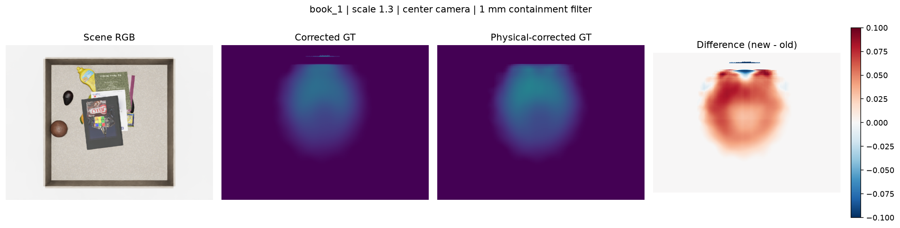

위 예시는 기존 corrected GT의 공간 패턴을 유지하면서, 실제로 서랍 안에 들어갈 수 없는 pose를 제외했을 때 확률이 어떻게 보정되는지 보여줌.

### New Asset Protocol

새 학습 asset의 USD/OBJ가 추가되면 다음 과정을 수행함.

```text
Asset discovery
    → unit and transform validation
    → triangle-count check
    → 50k faces 초과 시 10k simplification + cache
    → original/simplified full-resolution approval
    → multi-scale GT generation
```

단순화와 cache는 자동이지만, 새 asset의 원본–단순화 검증과 최종 승인은 아직 별도 절차임. Zero-shot test 및 실제 배포 target은 RGB reference와 mask를 사용하므로 GT용 mesh 전처리는 필요하지 않음.

### Target-Conditioned Occlusion Model — Zero-Shot Goal

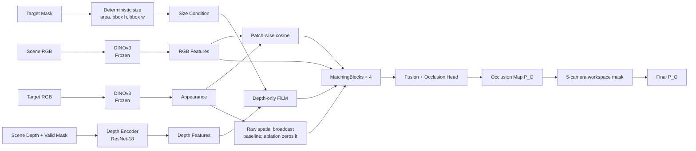

현재 로컬 working baseline은 실제 target mask에서 얻은 세 크기값만 사용함. 68-D 입력 shape는 유지하지만 나머지 65개 값은 0으로 고정하여 모델 크기와 초기화를 통제함. FiLM은 이 size condition으로 depth feature만 조절함.

```text
gamma, beta = MLP(area, bbox_h, bbox_w)
F_depth'    = gamma * F_depth + beta
```

Target appearance는 scene patch와의 cosine 계산에 사용되고, 기존 baseline에서는 각 위치에 broadcast되어 MatchingBlock에도 직접 입력됨. Frozen-model 진단에서는 `packaged_food_4` 출력 변화가 cosine보다 raw broadcast 경로에 훨씬 민감했지만 donor에 따라 오차가 좋아지거나 나빠짐. Broadcast만 제거한 controlled retrain은 held-out scale-response와 MAE를 크게 악화시켜 기각함. 이 조건에서 cosine과 size-FiLM만 남기는 대체는 target conditioning을 유지하지 못했으므로 broadcast-on size-only를 baseline으로 유지함. 이는 raw broadcast가 최적이라는 뜻은 아님.

DINOv3는 frozen으로 유지하고 depth encoder, FiLM generator, MatchingBlocks와 output head는 하나의 loss로 함께 학습함. Training-heldout 4개 target은 이미 모델 선택과 진단에 반복 사용했으므로 최종 zero-shot test가 아니라 development benchmark로 구분함.

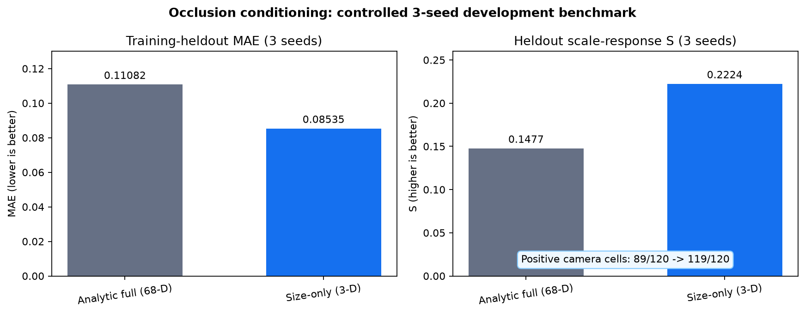

`size-only`는 3-seed 개발 평가에서 training-heldout MAE를 `0.11082 → 0.08535`, pooled scale-response `S`를 `0.1477 → 0.2224`로 개선함. 여기서 positive camera cell은 `target × scale transition × camera × seed` 조합을 뜻함. 다만 `packaged_food_4`의 underprediction과 seed별 편차가 남아 있어 최종 구조로 확정하지 않음.

### Deployment Inputs

현재 prototype 추론 입력은 scene RGB, scene depth, target RGB와 target mask 또는 segmentation임. Empty-background reference를 이용한 자동 target mask 생성은 아직 구현되지 않은 deployment 전처리 과제임.

| 구분 | 필요 정보 |
|---|---|
| 매 추론 입력 | Scene RGB, scene depth, target RGB, target mask/segmentation |
| 고정 시스템 자산 | Camera calibration, camera별 workspace mask |
| GT 생성에만 사용 | Target USD/OBJ, mesh scale, occlusion GT |

Zero-shot 성능은 frozen encoder만으로 가정하지 않음. 최종 평가는 개발 중 사용하지 않은 새 target instance와 scale을 별도로 고정하여 수행해야 함. Camera pose가 바뀌면 workspace mask도 calibration에서 다시 생성해야 하므로 camera-free 일반화는 후속 과제임.

---

## Complexity Stream

> **Status: Formulation in progress**

Complexity stream은 object density, overlap, depth irregularity를 표현하는 target-independent scene prior.

| Cue | 의미 |
|---|---|
| Local object density | 단위 면적에 포함된 instance 수 |
| Local depth variance | 물체의 높이와 적층 변화 |
| Depth discontinuity | 물체 경계와 급격한 깊이 변화 |
| Overlap structure | 물체 간 가림과 적층 정도 |

```text
Y_C = lambda_n · ObjectDensity
    + lambda_d · LocalDepthVariance
    + lambda_e · DepthEdgeDensity
```

Fusion gate에서 Similarity·Occlusion evidence와 함께 Complexity의 상대적 중요도 조절.

---

## Project Status

| Component | Status |
|---|---|
| Drawer RGB-D and target-reference dataset | Complete |
| DINOv3 ViT-B/16 dense similarity baseline | Complete |
| DINOv3 + SigLIP Similarity stream | Complete |
| Unseen banana qualitative test | Complete |
| Cosine shortcut ablation | Evaluated and excluded |
| Object/category-held-out benchmark | Planned |
| Occlusion mesh extraction and camera projection | Validated |
| Full-resolution mesh-depth pilot | CPU `180` + GPU/simplified `225` cases evaluated |
| nvdiffrast GPU depth rasterizer | Validated |
| `toy_3` 10k mesh simplification | Geometry/decision pilot validated; new-asset approval remains separate |
| Corrected 70% occlusion decision | Validated on standard and drawer-edge poses |
| Legacy visible-target reference recovery | `15,000` cases, `100%` decision agreement |
| Mesh-based Legacy GT reproduction | `100` cases, worst correlation `0.9999919` |
| Reproducible clutter capture | Implemented and validated |
| V1/V2 vectorized GT regression | `1,024` effective poses, output equivalence checked |
| Probability-map GT accumulator | Pose/camera/scene-vectorized V2 implemented and validated |
| 14-target production Occlusion GT | Complete: `150 scenes × 5 cameras` per target |
| Occlusion model ablation | Complete: target-agnostic / appearance-only / geometry-only / full, 3 seeds |
| Clean52 multi-scale GT | Complete: train 10 / development-heldout 4 targets, 5 cameras |
| 3D workspace and physical-corrected GT | Complete for `book_1/2/3 × 1.3`; original GT preserved |
| Size-only conditioning | 3-seed development benchmark complete; current working baseline |
| Five-camera development evaluation | `119/120` positive scale-response cells; one failure remains |
| Target-broadcast causal ablation | Seed-0 complete; no-broadcast rejected after broad-gate failure |
| Fresh paired broadcast-on reference | Seed-0 reproduction running with audited init/sample hashes |
| Final zero-shot benchmark | Pending with untouched target instances/scales |
| Camera-pose generalization | Pending; current workspace mask is tied to the fixed 5-camera rig |
| Occlusion stream training | Refinement in progress |
| Complexity stream training | Planned |
| Three-stream fusion | Planned |
| Exploration policy integration | Planned |
| Sim-to-real drawer experiment | Planned |

### Core Files

| File | Purpose |
|---|---|
| `backbone.py` | Frozen DINOv3 multi-layer feature extractor |
| `target_utils.py` | Target crop, mask alignment, masked feature pooling |
| `similarity_model.py` | Scene–target interaction, MatchingBlocks, similarity head |
| `train_similarity_v2.py` | Multi-target DINOv3 + SigLIP training pipeline |
| `train_common.py` | Scene split, target caches, metrics, early stopping |
| `gt_similarity.py` | Category-based similarity-map generation |
| `precompute_gt.py` | Precomputed similarity GT cache |
| `paths_config.py` | Model, asset, dataset path configuration |
| `target_capture.py` | Five-camera target RGB/depth/segmentation capture for zero-shot inference |
| `occlusion_model.py` | RGB-D target conditioning, geometry-FiLM and Occlusion map head |
| `occlusion_dataset.py` | Corrected probability GT and coverage-aware RGB-D dataset |
| `train_occlusion.py` | Occlusion ablation, scene split, checkpoint and camera/target evaluation |
| `generate_occlusion_gt_batched_v2.py` | Pose/scene-vectorized production probability GT generator |
| `mesh_utils.py` | USD mesh extraction, world-unit conversion, pose and scale transform |
| `mesh_cache.py` | Asset complexity check and automatic 10k simplified-mesh cache |
| `depth_rasterizer.py` | Full-resolution mesh-depth accuracy reference |
| `depth_rasterizer_gpu.py` | nvdiffrast-based full-resolution GPU depth renderer |
| `experiments/occlusion_gt_pilot/target_catalog_manifest.py` | Pre-registered train/held-out target catalog |
| `experiments/occlusion_gt_pilot/verify_new_target_mesh_accuracy.py` | Single-pose five-camera mesh/depth Gate-1 verification |
| `scene_generator/occlusion_gt_pilot_capture.py` | Isaac Sim reference capture for occlusion GT validation |
| `scene_generator/vectorized_scene_v2.py` | Physics-based clutter generation and reproducible RGB-D capture |
| `scene_generator/object_spawner.py` | USD asset discovery and object placement used by the scene generator |

---

## Roadmap

- [x] Drawer scene and target RGB-D acquisition
- [x] Multi-layer DINOv3 ViT-B/16 representation
- [x] SigLIP image/text semantic fusion
- [x] Pixel-wise Similarity map training
- [x] Unseen target qualitative evaluation
- [x] Cosine shortcut evaluation and removal
- [x] Reproducible scene-level split seed
- [x] USD mesh extraction and unit conversion validation
- [x] `640 × 480` mesh-depth validation across 180 conditions
- [x] Empty-drawer mesh-depth valid-pixel integration
- [x] nvdiffrast hardware GPU rasterizer validation
- [x] `toy_3` 10k simplification pilot
- [x] Legacy/corrected denominator comparison
- [x] Camera-specific integer visibility reference recovery
- [x] `packaged_food_2` multi-scene Legacy GT reproduction
- [x] Reproducible render-only clutter capture and metadata
- [x] V1/V2 vectorized GT regression on 1,024 effective poses
- [x] Automatic 10k simplification cache for high-complexity assets
- [ ] Original–simplified approval protocol for each new asset
- [x] Pose/camera batched probability accumulator pilot
- [x] Full-grid Legacy and probability GT pilot (`44,100` poses × 5 cameras)
- [x] Multi-target and multi-scene production GT generation
- [x] 14-target shared-scene GT (`150` scenes × `5` cameras)
- [x] Five-camera single-pose mesh/depth Gate-1 validation
- [x] Scale `1.0` Occlusion Dataset and 4-model ablation baseline
- [x] Train 10 / held-out 4 target catalog fixed before evaluation
- [x] Clean52 multi-scale development GT (`36` train / `16` validation scenes)
- [x] Workspace-mask v4 and physical-corrected `book_1/2/3 × 1.3` GT
- [x] Training-heldout instance seed-0 smoke test and wrong-target diagnostics
- [x] Five-camera development diagnostics
- [x] Three-seed analytic-full vs size-only development benchmark
- [x] Multi-scale development evaluation
- [x] Controlled no-target-broadcast seed-0 comparison — rejected
- [ ] Fresh current-code broadcast-on seed-0 reproducibility gate
- [ ] Evaluate a relation-only target interaction without removing conditioning
- [ ] Confirm selected conditioning with seeds 1–2
- [ ] Final evaluation on untouched target instances and scales
- [ ] Camera-pose augmentation and calibration-derived workspace masks
- [ ] Complexity stream
- [ ] Learned three-stream fusion
- [ ] DRL-based exploration policy
- [ ] Sim-to-real validation

---

## Development Log

Similarity와 Occlusion stream의 가설, 실험 결과, 한계, 수정 사항을 단계별로 기록.

### 2026-07-21 · Phase 1 — DINOv3 Appearance Matching

**Reference:** `code_260721/train_similarity.py`

**가설:** Frozen DINOv3 feature 비교만으로 unseen target의 zero-shot similarity map 생성 가능.

```text
Scene RGB  → DINOv3 patch features X_s^l
Target RGB → DINOv3 masked-pooled vector a_t^l

c_hat^l = ShiftTo01(CosineSimilarity(X_s^l, a_t^l))
Z^l     = Concat[X_s^l, a_t^l, c_hat^l]
P_S     = CNN_Head(Z^l)
```

**결과:** 색상·재질·형상 등 appearance가 유사한 영역은 탐지했으나, category-level semantic relation은 표현하지 못함.

**결론:** Dense appearance matching만으로 target–category–scene 관계 표현 불가.

---

### 2026-07-27 · Phase 2 — CLS Prototype Category Conditioning

**Reference:** `code_260727/train_similarity.py`, `code_260727/train_common.py`

**가설:** Image-level CLS token을 category prototype으로 사용하면 patch feature보다 추상적인 category 정보 제공 가능.

Category별 CLS vector 평균으로 네 개의 prototype을 구성하고 unseen target CLS와 cosine similarity 계산.

```text
prototype_k = L2Norm(Mean[CLS(target_i) | category_i = k])

category_prob = Softmax(
    CosineSimilarity(CLS(unseen_target), prototype_k) / temperature
)
```

정답 누설 방지를 위해 leave-one-out prototype 사용. Category 확률을 spatial location에 broadcast한 뒤 interaction feature에 concat.

```text
Z^l = Concat[
    scene patch,
    target appearance,
    patch-wise cosine,
    category probability
]
```

**결과:** Category prior는 제공했으나 prototype도 DINOv3 appearance history의 평균이므로 외부 semantic grounding이 없음. 기존 prototype과 외형 차이가 큰 unseen object에서 category 추론 불안정.

**결론:** CLS prototype만으로 open-vocabulary semantics 확보 불가.

---

### 2026-07-28 · Phase 3 — DINOv3 + SigLIP Semantic Fusion

**Reference:** `code_260728_ver2/train_similarity_v2.py`

**수정:** DINOv3의 dense spatial representation을 유지하고, SigLIP의 language-aligned semantics를 target query에 추가.

```text
DINO appearance : a_t^l ∈ R^768
SigLIP semantics: s ∈ R^1152
Projection      : s_t^l = W_l · s + b_l
Target query    : q_t^l = a_t^l + s_t^l
```

SigLIP image/text embedding을 평균하고 layer별 projection으로 DINOv3 차원에 정렬. 두 backbone은 frozen으로 유지하고 projection과 matching head만 학습.

**결과:** 학습에 포함되지 않은 packaged-food target에서 same-category 영역 활성화 확인.


**결론:** SigLIP 결합으로 category-level zero-shot activation 확보.

---

### 2026-07-28–29 · Phase 4 — Exact-Instance Shortcut Evaluation

**문제:** SigLIP 결합으로 unseen target의 category-level activation은 확보했으나, visible exact target이 same-category object보다 높게 출력되지 않는 사례 확인.

**실험:** DINOv3 cosine을 output logit에 직접 더하는 residual shortcut과 layer `2 + 5` 선택 방식을 평가. Global pooling, raw appearance cosine, visibility, patch matching도 함께 분석.

**결과:** 공통 held-out scene에서 no-shortcut과 shortcut의 exact-target positive ranking은 각각 `29.0%`, `29.7%`로 거의 동일. Median gap은 소폭 개선됐지만 두 모델 모두 instance-level ranking에 실패. 공간 구조를 사용하지 않는 patch matching도 competitor score를 함께 높여 문제를 해결하지 못함.

**결론:** Shortcut은 계산 비용보다 구조와 해석의 복잡성을 늘리는 반면 실질적인 개선이 제한적이므로 최종 Similarity stream에서 제거. 현재 모델은 DINOv3–SigLIP interaction과 learned matching head만 사용함.

추가로 target별로 서로 다른 무작위 split seed가 생성되던 문제를 수정. 실행마다 seed를 한 번만 확정하여 모든 target의 scene-level train/validation split을 재현할 수 있도록 정리.

---

### 2026-08-04 · Phase 5 — Zero-Shot Occlusion Pipeline Design

**문제:** 기존 방식은 target당 `44,100`개 pose와 5개 camera를 촬영하여 중간 RGB·depth·mask를 대량 저장함. 최종 GT도 유효 pose의 depth-weighted occupancy를 scene별 min–max로 정규화하므로 서로 다른 scene에서 흰색의 절대적 의미가 일정하지 않음.

**GT 설계:** Target을 물리적으로 반복 촬영하는 과정을 USD/OBJ mesh depth 계산으로 대체. 기존 pose grid와 `70%` occlusion 판정은 legacy 재현에 유지하고, 실제 학습용 GT는 다음 확률로 별도 생성함.

```text
P_O(u,v) = N_occluded(u,v) / (N_candidate(u,v) + epsilon)
```

Legacy GT와 probability GT를 동시에 출력하여 기존 방식 재현 여부와 새 정규화 효과를 분리해 평가. Visible-target 강조는 Similarity stream과 역할이 겹치므로 Occlusion GT에서 제외함.

**Scale conditioning:** Mesh scale과 target RGB·mask scale을 반드시 동일하게 구성. 동일한 target 입력에 서로 다른 scale GT를 주면 모델이 scale별 정답의 평균으로 수렴하므로 size-effect를 학습할 수 없음. Pilot은 `0.7`, `1.0`, `1.3`으로 시작함.

**모델 설계:** Scene RGB는 frozen DINOv3, scene depth와 valid mask는 ResNet-18로 처리. Target mask에서 추출한 size·silhouette condition으로 depth feature에만 FiLM을 적용하고, target appearance는 MatchingBlock에서 별도로 결합함. 검증되지 않은 cosine shortcut은 baseline에서 제외함.

**배포 조건:** 현재 prototype은 scene RGB, scene depth, target RGB와 target mask/segmentation을 입력으로 사용함. 고정 촬영 환경의 empty-background reference로 mask를 자동 생성하는 전처리는 후속 구현 항목이며, USD/OBJ와 scale 정보는 GT 생성에만 사용함.

**Zero-shot 검증:** Frozen encoder 사용만으로 zero-shot을 가정하지 않고, 학습에서 제외한 target instance와 unseen intermediate scale을 별도 test split으로 평가함.

**다음 단계:** `packaged_food_2`, center camera, scale `1.0`의 mesh-depth 재현 pilot을 수행한 뒤 multi-asset·pose·camera 조건으로 확장함.

---

### 2026-08-04–06 · Phase 6 — Mesh-Depth Validation and GT Refinement

**Reference:** `mesh_utils.py`, `depth_rasterizer.py`, `scene_generator/occlusion_gt_pilot_capture.py`, `experiments/occlusion_gt_pilot/validate_rasterizer.py`

**검증:** `packaged_food_2`, `book_1`, `fruit_1`, `toy_3`을 대상으로 9개 pose와 5개 camera를 조합한 180개 조건에서 USD mesh depth와 Isaac Sim reference를 `640 × 480`으로 비교함.

**수정:** Segmentation reference를 `depth > 0`으로 계산하면 drawer와 background가 포함되는 오류를 확인하고 target segmentation color 기반 mask로 교체. `metersPerUnit=0.01` asset의 자동 unit-compensation scale이 transform 초기화 과정에서 제거되는 문제도 수정함.

**결과:** 176개 조건에서 silhouette IoU `0.9993–1.0000`, 전체 중앙값 `1.0000`, depth MAE 중앙값 `0.75 μm` 확인. 나머지 4개는 서랍 경계에서 drawer wall이 target 일부를 가린 조건으로, mesh projection 오류가 아니라 empty-drawer visibility 처리 차이로 확인함.

**기존 GT 문제:** 기존 `distribution_map_GPU.py`는 occluded pixel에 `valid_pos`를 적용하지만 ratio 분모에는 target 전체 pixel을 사용함. 기존 결과 재현용 `legacy_ratio`는 보존하고, 새 학습 GT는 valid pixel을 분모로 사용하는 `corrected_ratio`와 `70%` threshold를 적용하기로 결정함.

**성능 병목:** 검증용 rasterizer가 triangle별 Python loop를 사용하여 `toy_3`의 2,029,960 triangles에서 평균 `577.72 s/image` 소요. 새 asset에도 적용 가능한 자동 mesh 단순화, full-resolution 정확도 검사, hardware GPU rasterization, pose/camera batch 누적 구조가 필요함.

**결정:** 해상도는 기존과 동일한 `640 × 480`으로 유지. 기존 `distribution_map_GPU.py`는 legacy reference로 수정하지 않으며, corrected ratio와 probability normalization은 새 GT generator에 구현함. 실제 배포에서는 mesh 단순화를 수행하지 않고 scene RGB, scene depth, target RGB와 target mask/segmentation을 입력함.

**다음 단계:** Empty-drawer valid-pixel 처리를 검증에 반영하고, `toy_3`의 단순화 후보를 원본 mesh와 비교하여 자동 선택 기준을 확정한 뒤 batched GPU GT generator를 구현함.

---

### 2026-08-06 · Phase 7 — GPU Rasterization, Corrected Ratio, and Capture Reliability

**Reference:** `depth_rasterizer_gpu.py`, `experiments/occlusion_gt_pilot/validate_rasterizer_gpu.py`, `experiments/occlusion_gt_pilot/occlusion_ratio_pilot.py`, `scene_generator/vectorized_scene_v2.py`

**GPU rasterization:** nvdiffrast 기반 `640 × 480` depth renderer를 구현함. 원본 4개 asset과 `toy_3` 10k simplified mesh를 포함한 225개 조건에서 silhouette과 depth를 검증함. `toy_3` 10k mesh는 원본 대비 worst IoU `0.9938`, median depth MAE `0.3781 mm`를 기록함.

**70% decision:** 20개 clutter scene과 9개 pose, 5개 camera에서 원본·GPU·단순화 mesh를 비교함. `toy_3` 원본–10k 판정 일치율은 전체 `99.67%`, `0.65–0.75` 경계 구간 `96.59%`임.

**Corrected denominator:** Drawer wall이 target 일부를 가리는 `book_1` 경계 조건에서 valid pixel이 `10.01–12.77%` 감소함. Corrected ratio 적용 시 `6/80`개 조건의 `0.7` 판정이 변경되어 기존 분모 불일치가 실제 결과에 영향을 주는 것을 확인함.

**Clutter capture:** 물리 안정화 이후 카메라 촬영을 `world.step()`에서 render-only `world.render()`로 변경함. 캡처 전후 위치·회전 불변성을 직접 확인하고, run/scene/object pose, camera metadata, seed와 완료 상태를 저장하도록 구성함. 실제 transformed mesh vertex 기준 drawer 내부 QC도 추가함.

**후속 결과:** nvdiffrast V2 generator에 pose·camera·scene vectorization과 probability accumulator를 결합했고, V1/V2를 1,024 effective poses에서 교차검증함. 새 asset의 원본–단순화 최종 승인은 별도 절차로 유지함.

---

### 2026-08-07 · Phase 8 — Mesh-Based Legacy and Probability GT Generation

**구현:** `packaged_food_2`, scale `1.0`에서 `44,100`개 pose 전체를 nvdiffrast로 처리함. Target depth를 파일로 저장하지 않고 scene depth와 즉시 비교하여 Legacy GT와 corrected probability GT를 동시에 누적함.

**Legacy 재현:** 기존 코드를 확인하여 visible ratio가 `0.3` 이상일 때 map 전체를 `0.7`배로 낮추고 visible target mask를 `255`로 설정하는 후처리를 복원함. 대표 target frame 한 장의 pixel 수를 reference로 사용하면 threshold 경계 사례가 잘못 분류되는 문제를 확인함.

**Reference 복원:** 기존 GT 3,000 scene × 5 camera의 후처리 ON/OFF 경계를 분석하고, `44,100`개 mesh pose에서 camera별 최대 footprint를 직접 계산함. 최종 정수 reference는 center `2324`, left `2335`, right `2336`, top `2336`, bottom `2335`이며, 15,000개 기존 사례의 ON/OFF 판정을 모두 재현함.

**다중 scene 검증:** 최종 reference로 20 scene × 5 camera의 100개 사례를 재검증함. Old GT 대비 Legacy GT의 MAE는 평균 `0.0000379`, 최댓값 `0.0000959`이며, correlation은 평균 `0.9999956`, 최저 `0.9999919`임.

**분리 원칙:** Visible-target 강조는 기존 GT 재현용 Legacy map에만 적용함. 학습용 Corrected Probability GT는 `N_occluded / N_candidate`의 절대적 의미를 유지하기 위해 scene별 min–max 정규화와 visible-target 강조를 적용하지 않음.

**결과물:** Scene RGB, Target RGB, 기존 GT, mesh 기반 Legacy GT, Corrected Probability GT와 차이 map을 6-panel 이미지로 저장함. Raw/final Legacy map, Corrected Probability map, camera별 metric과 실행 설정도 로컬 실험 결과로 보존함.

Visible-target 규칙이 적용된 사례:

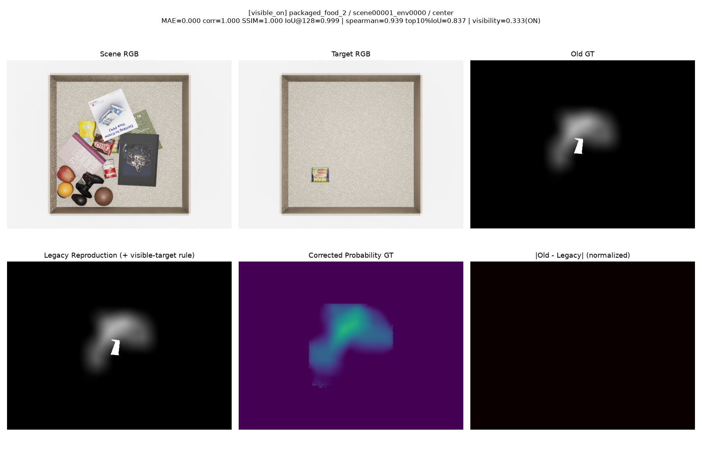

Visibility threshold 바로 아래에서 후처리가 적용되지 않은 사례:


**다음 단계:** 검증 스크립트를 target-independent하게 정리한 뒤 `book_1`과 `toy_3`을 각각 5–10 scene에서 확인함. 두 target이 통과하면 GT 검증을 종료하고, corrected probability GT를 사용하는 scale `1.0` Occlusion Dataset과 학습 baseline을 구현함.

---

### 2026-08-10 · Phase 9 — Occlusion Conditioning Ablation

**문제:** 초기 학습은 target별 scene pool이 달라 모델이 target condition 대신 scene 분포를 외울 수 있었음. Shuffled-target 평가도 target별로 연속된 validation batch 내부에서만 이름을 섞어 사실상 같은 target끼리 교환되는 no-op이었음.

**수정:** 4개 target이 동일한 150개 scene을 사용하도록 구성하고, scene을 train/validation/test `100/20/30`으로 분리함. Coverage-aware patch pooling, 실제 최소 validation loss checkpoint, early stopping, 100% 다른 target을 넣는 confusion matrix와 `shift=0 == main test` invariant를 추가함.

```text
GT_patch = AvgPool(GT × Coverage) / (AvgPool(Coverage) + epsilon)
```

Target appearance와 geometry-FiLM의 기여를 분리하기 위해 네 모델을 3개 seed로 평가함.

| Variant | Test IoU mean ± std |
|---|---:|
| Appearance-only | `0.4065 ± 0.0554` |
| Geometry-only | `0.3732 ± 0.0552` |
| Full | `0.4147 ± 0.0331` |

Full은 평균 성능이 가장 높고 seed 간 변동이 가장 작았으나 Appearance-only 대비 차이는 작음. Geometry-only는 세 seed 모두 Appearance-only보다 낮음. 따라서 Full을 잠정 기본 모델로 유지하되, FiLM의 추가 이득은 unseen-scale 평가에서 최종 판단함.

---

### 2026-08-11–12 · Phase 10 — Shared-Scene Production GT and Five-Camera Validation

**목표:** Unseen-instance/seen-category 조건을 분리하기 위해 category마다 여러 instance를 확보하고, 모든 target에 동일한 clutter scene의 GT를 생성함.

**구성:** Train 10개와 held-out 4개 target을 결과 확인 전에 고정하고, 14개 target 각각에 `150 shared scenes × 5 cameras`의 scale `1.0` corrected probability GT를 생성함. 전체 target의 scene-key 집합이 동일함을 확인함.

**검증:** 신규 target은 center에서 찾은 단일 pose를 다섯 camera에 고정하여 실측 Isaac Sim depth/segmentation과 비교함. Camera별 pose 재탐색으로 calibration 오차를 가릴 수 없도록 구성했으며, 다섯 camera 모두 silhouette과 depth 기준을 통과함.

**발견 및 수정:**

- `toy_1`은 실제 캡처에서는 정상 크기지만 standalone mesh extraction에서 composed-stage scale을 재현하지 못해 catalog에서 제외함.
- `book_3` center의 낮은 raw IoU는 geometry 누락이 아니라 1-pixel boundary 차이로 확인함.
- 15-scene pilot 잔여 파일이 150-scene production 폴더에 섞이는 문제를 발견하고 비파괴적으로 분리함.
- 이후 generator는 manifest 밖의 scene 디렉터리를 감지하면 즉시 중단하도록 변경함.

**당시 다음 단계:** Category-balanced sampling과 camera별 평가를 포함한 held-out 1-seed smoke test로 이동함. 이후 결과는 아래 Phase 11–15에 기록함.

---

### 2026-08-13 · Phase 11 — Multi-Scale GT and Controlled Protocol

**문제:** 초기 비교는 target 수, scene pool, optimizer update 수가 달라 어떤 변경이 성능 차이를 만들었는지 분리하기 어려웠음.

**수정:** Clean scene 52개를 train 36 / validation 16으로 고정하고 category-balanced sampling을 적용함. 모든 모델을 16 epoch, epoch당 5,400 sample, 총 5,408 update로 통일함.

**결과:** Train 10 target은 scale `0.7/1.0/1.3`, training-heldout 4 target은 scale `0.85/1.0/1.15`로 구성하여 총 8,760개의 5-camera GT map을 생성함.

**판단:** 이후 size-effect 실험의 공통 비교 조건을 확립함. Held-out 4개 target은 이후 진단에 반복 사용했으므로 최종 zero-shot test가 아니라 development set으로 취급함.

---

### 2026-08-14–18 · Phase 12 — 3D Workspace and Physical-Corrected GT

**문제:** 큰 book target의 일부 candidate pose가 서랍 밖에 있거나 벽을 관통하여, 실제로는 놓을 수 없는 위치가 GT 분모에 포함됨.

**수정:** Camera ray와 drawer AABB를 이용한 3D workspace mask, 1 mm containment filter를 추가함. 기존 legacy/corrected GT는 보존하고 `physical_corrected`를 별도 생성함.

| Target | Valid poses | MAE vs corrected | Correlation | Relative mean-probability change |
|---|---:|---:|---:|---:|
| `book_1 × 1.3` | `28,764 / 44,100` | `0.01438` | `0.9490` | `+6.8%` |
| `book_2 × 1.3` | `38,124 / 44,100` | `0.00846` | `0.9805` | `+4.0%` |
| `book_3 × 1.3` | `38,124 / 44,100` | `0.00856` | `0.9811` | `+4.0%` |

전체 `3 targets × 52 scenes × 5 cameras = 780` map에서 파일 존재, finite 범위, `N_occ ≤ N_all`, workspace containment를 확인함.

**판단:** 공간 패턴은 대체로 유지하면서 invalid pose로 낮아졌던 확률을 보정함. 각 target-scale 조합에는 하나의 GT만 사용하며, `book_1/2/3 × 1.3`은 physical-corrected, 나머지는 corrected로 routing함.

---

### 2026-08-19–20 · Phase 13 — Workspace Leakage and Ring-Loss Check

**문제:** 예측 확률 질량의 `57–78%`가 서랍 외부에 남는 leakage를 확인함. 이는 target size 학습 문제와 별개로 고정 camera에서 drawer support를 구분하지 못한 결과임.

**수정:** 현재 5-camera calibration에서 만든 workspace mask v4를 출력에 적용함. Coverage 밖 safe-ring을 억제하는 loss도 `λ = 0.01/0.02/0.05`로 비교하고 sampler와 loader RNG를 분리함.

**결과:** Hard mask 적용 후 full-image MAE가 `75–85%` 감소했으나 이는 현재 rig의 기하 후처리 효과임. Ring loss는 held-out scale-response를 일관되게 보존하지 못했고, `λ=0.05`는 `toy_4`의 5개 camera를 모두 악화시킴.

**판단:** `ring_weight=0 + hard workspace mask`를 유지함. Camera 위치가 바뀌면 calibration으로 mask를 다시 생성해야 하며, camera-free 일반화로 해석하지 않음.

---

### 2026-08-20–21 · Phase 14 — Analytic Geometry and Size-Only Conditioning

**문제:** Native scale은 실제 target mask, non-native scale은 mesh render에서 geometry를 추출하여 scale 변화와 입력 source 변화가 섞였음. 68-D silhouette descriptor는 target별 세부 형상을 외우는 경로가 될 가능성도 있었음.

**수정:** 실제 target mask의 `area`, `bbox_h`, `bbox_w`를 scale에 따라 수학적으로 변환함. 이어 모델 shape와 초기화는 유지하고 이 세 값만 활성화한 `size_only_padded`를 3 seed로 비교함.

| 3-seed development metric | Analytic full 68-D | Size-only: 3 active values in 68-D |
|---|---:|---:|
| Training-heldout MAE | `0.11082` | `0.08535` |
| Pooled scale-response `S` | `0.1477` | `0.2224` |
| Positive camera cells | `89 / 120` | `119 / 120` |

Log+z-score geometry는 seed 0에서 pooled `S 0.2407 → 0.2069`, positive camera `40/40 → 36/40`로 악화되어 보류함.

**판단:** Raw size-only를 현재 working baseline으로 채택함. 다만 seed 1에서는 pooled `S`가 소폭 하락했고 `packaged_food_4` underprediction이 남아 있어 최종 구조나 zero-shot 증거로 확정하지 않음.

---

### 2026-08-21 · Phase 15 — Target-Conditioning Path Diagnosis

**문제:** `packaged_food_4` 오차가 DINOv3, ResNet-18, FiLM, target appearance 중 어느 경로에서 발생하는지 분리되지 않았음.

**진단:** Frozen size-only 모델에서 same-category donor를 넣어 경로를 나눠 확인함. 예측 확률의 평균 절대 변화인 output sensitivity는 cosine-only에서 약 `10⁻⁶`, raw target broadcast에서 `0.014–0.081`로 나타남. Broadcast 변화는 주로 vector norm보다 direction을 통해 전달됨. 하지만 donor에 따라 MAE가 `+0.0114` 또는 `−0.0412`로 반대 방향을 보여, frozen swap만으로 broadcast 제거가 개선된다고 결론 내릴 수 없음.

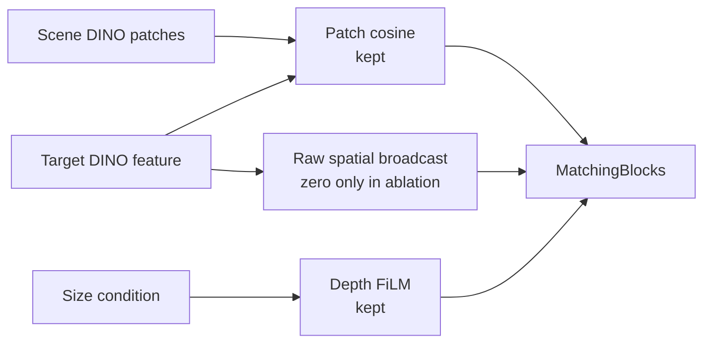

**수정:** Parameter shape와 cosine/FiLM 경로를 유지하고 raw target broadcast만 0으로 고정하는 controlled model을 구현함. 현재 코드에서 같은 seed로 생성한 raw-broadcast와 zero-broadcast 모델의 parameter shape와 초기 state가 동일함을 확인했으며 SHA-256은 `d8c3122c…f8c0`임. 과거 accepted baseline checkpoint에는 최초 초기화 SHA가 저장되지 않아 역사적 trajectory의 bit-exact 동일성까지 증명한 것은 아님.

**Controlled retrain 결과:** 16 epoch와 5,408 update를 모두 완료한 final checkpoint를 동일 seed의 broadcast-on reference와 비교함.

| Seed-0 fixed-update metric | Broadcast ON | No broadcast | Change |
|---|---:|---:|---:|
| Seen coverage MAE | `0.05155` | `0.08100` | `+57.1%` |
| Training-heldout coverage MAE | `0.07725` | `0.11494` | `+48.8%` |
| Heldout pooled `S > 0` | `8 / 8` | `0 / 8` | Fail |
| Heldout camera `S > 0` | `40 / 40` | `2 / 40` | Fail |
| `packaged_food_4` native MAE | `0.09802` | `0.22229` | `+126.8%` |
| `packaged_food_4` native bias | `−0.08694` | `−0.22058` | Underprediction 증가 |

CSV 1,680행의 composite key가 모두 고유하고, 두 checkpoint는 seed 0, epoch 15, 5,400 samples/epoch, 5,408 cumulative batches 조건을 만족함. 다만 과거 reference에는 최초 initialization/sample-order SHA가 저장되지 않아 역사적 trajectory의 bit-exact 동일성까지 증명한 것은 아님.

**판단:** No-broadcast 제거안은 broad gate를 통과하지 못해 기각하고 seeds 1–2는 실행하지 않음. 현 architecture에서 scalar cosine과 size-FiLM만 남기는 방식은 target conditioning을 유지하지 못했음. 과거 reference에는 완전한 초기화/sample-order 기록이 없으므로, 현재 코드에서 broadcast-on seed 0을 같은 hash와 update 수로 재학습해 paired reference를 먼저 확정함. 이 gate가 통과한 뒤에만 target 정보를 유지하면서 absolute target code 의존을 줄이는 relation-aware interaction을 평가함.
