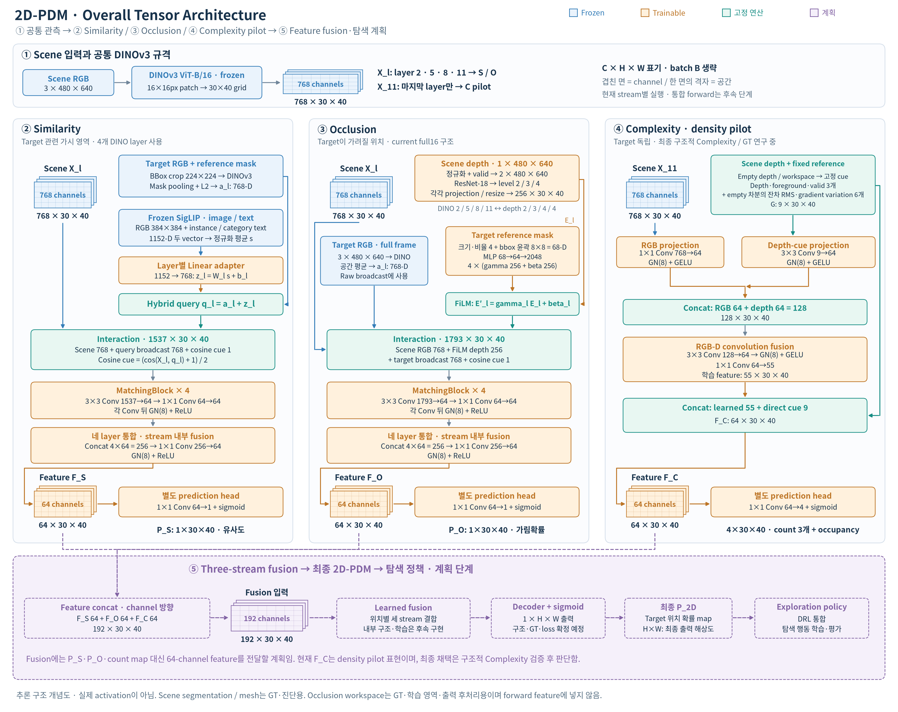
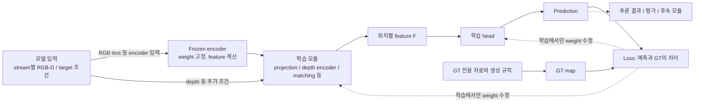

# 2D-PDM

### Zero-Shot Probability Distribution Mapping for Occluded Object Search in Cluttered Drawers

> **Research in progress**  
> RGB-D 관측으로 가려진 target object의 위치를 추론하고, 탐색 행동을 위한 pixel-wise probability map 생성

---

## 문서 안내

전체 연구 목표·입출력·stream 결합·현재 상태와 roadmap은 이 문서에 정리함. 각 stream의 구조·모듈·GT·결과·Q&A와 개발 이력은 아래 문서에서 확인함.

| 문서 | 내용 |
|---|---|
| [Similarity Stream](similarity_stream.md) | DINOv3·SigLIP, semantic adapter, MatchingBlock, GT·학습·zero-shot 결과 |
| [Occlusion Stream](occlusion_stream.md) | RGB-D·target geometry·FiLM, adaptive GT, full16·외부 target 평가 |
| [Complexity Stream](complexity_stream.md) | 복잡도 가정, density pilot, 물체 표현 진단과 다음 검증 |
| [Development Log](development_log.md) | Phase 1–38의 주요 가정·실험·사진·결과·판단 |
| [연구 문맥·근거 색인](agent.md) | 다른 agent와 외부 독자를 위한 문맥·상세 보고서·작업 지침 |

각 문서의 위·아래 이동 링크로 전체 개요와 다른 문서를 오갈 수 있음. 모든 문서는 저장소 최상위에 둠. Stream별 그림은 기존 `img/similarity/`, `img/occlusion/`, `img/complexity/` 경로를 유지하고, 공통 전체 구조도는 `img/overall_architecture.png`에 둠.

## Overview

서랍 속 더미에 가려진 target을 찾기 위해 **유사도·가림 가능성·장면 구조**를 위치가 보존된 세 feature stream으로 모델링함. 각 feature를 fusion과 decoder에서 결합하여 탐색 정책에 제공하는 것이 목표임.

| Stream | 목적 | 확인된 결과와 다음 검증 |
|---|---|---|
| Similarity | Target과 외형·의미가 관련된 가시 영역 찾기 | DINOv3 + SigLIP 구현, unseen-target zero-shot 동작 정성 확인; 여러 target의 정량 평가 남음 |
| Occlusion | 해당 target이 가려질 수 있는 위치 추론 | Adaptive GT 생성·full16 가림확률 예측·외부 target의 zero-shot 정량 평가 완료; 여러 target·실제 관측 조건으로 평가 확장 |
| Complexity | 단일 RGB-D에서 더미 내부의 물체·관계 표현 생성 | RGB-D 접경 예측을 평가했으며 현재 결합 모델은 미채택; GT 관계 벡터를 외부 입력으로 사용하는 경로는 제외 |

### 전체 아키텍처



그림은 **현재 구현된 stream 내부 구조와 계획 중인 통합 경로**를 함께 나타냄. 파란색은 frozen encoder, 주황색은 학습 모듈, 초록색은 고정 연산이며, 보라색 점선은 후속 구현 단계임. Tensor는 `channel × 세로 × 가로`로 표시하고 batch `B`는 생략함.

**① Scene 입력과 공통 backbone.** 현재 서랍의 RGB `3×480×640`을 DINOv3로 처리하면 각 위치가 768개 숫자로 표현된 `768×30×40` feature가 나옴. Similarity·Occlusion은 layer `2,5,8,11`의 feature를 사용하고, Complexity pilot은 마지막 layer `11`을 사용함. 그림 상단은 이 공통 backbone 규격을 모아 표시한 것이며, 현재 실행은 stream별로 이루어짐.

**② Similarity — 무엇을 찾을 것인가.** Target reference RGB와 mask에서 물체 영역을 잘라 DINO appearance `768-D`를 만들고, SigLIP은 reference 이미지와 이름·category를 `1152-D` 의미 조건으로 표현함. 학습 adapter가 이를 `768-D`로 변환하여 appearance에 더한 값이 검색 query임. 이 변환은 similarity-map GT를 통해 학습되며, DINO 자체의 weight는 고정됨. 각 scene 위치에서 **scene 768 + query 768 + cosine 1 = 1537채널**을 MatchingBlock이 64채널로 해석하고, 네 layer의 출력을 통합하여 `F_S`를 만듦.

**③ Occlusion — 그 target이 어디에 가려질 수 있는가.** Scene RGB feature와 함께 depth encoder가 만든 **현재 서랍의 depth feature**를 사용함. Target RGB는 물체의 appearance를 제공하고, reference mask는 크기·윤곽을 나타내는 `68-D` geometry를 제공함. 공유 MLP가 geometry에서 FiLM 계수를 계산하여 scene depth의 256채널 값을 조절함. 이렇게 조절한 depth 256채널과 scene 768·target 768·cosine 1을 합친 **1793채널**을 MatchingBlock에 전달하고, 네 layer를 통합하여 `F_O`를 만듦. Target이 달라지면 같은 모델에서 조절값이 달라지는 구조임.

**④ Complexity — 현재는 RGB-D density pilot.** Target 조건 없이 scene의 DINO feature와 depth 단서를 결합함. DINO `768→64`, depth cue `9→64`를 각각 변환한 뒤 합쳐 학습 feature 55개를 만들고, 원본 depth cue 9개를 다시 붙여 `F_C`의 64채널을 구성함. Depth cue 계산에는 고정 camera의 workspace와 empty-depth reference를 사용함. 현재 head는 국소 label-group count 3개와 occupancy 1개를 예측하도록 학습했으며, **더미 내부의 구조적 Complexity를 표현할 최종 모델·GT는 검증 중**임.

**⑤ Feature fusion과 최종 위치 map — 계획 단계.** 세 stream은 같은 `30×40` 위치마다 서로 다른 64개 숫자를 제공함. 이를 같은 위치끼리 이어 붙이면 **`64+64+64=192채널`**이며 공간 격자는 유지됨. 그림에서 오른쪽으로 갈라지는 prediction head는 각 stream의 GT를 예측하는 경로이고, 아래 fusion은 그 head 이전의 feature를 받도록 계획함. 이후 learned fusion·decoder로 최종 target 위치 map을 만들고 탐색 정책에 연결할 예정임. 현재 density `F_C`의 최종 채택은 Complexity 정의·관계 표현 검증 후 판단함.

Similarity·Occlusion과 Complexity density pilot은 각각의 GT로 학습·평가를 완료함. **통합 단계에는 three-stream fusion, 최종 위치 확률의 GT·loss·decoder, DRL 구현이 필요함.** Phase 38에서는 원본 해상도의 RGB-D 접경 예측과 GT 관계의 정적 제거 효과 예측을 별도로 평가함. GT 관계의 제거 회귀는 참고 진단이며 실환경 추론 성과에 포함하지 않음. RGB-D 접경 모델도 채택 기준을 통과하지 못하여 그림의 density pilot을 대체하지 않음. 현재 stream별 출력은 아래에 정의한 유사도·가림확률·density를 나타내며, 최종 target 위치 확률은 fusion 단계에서 학습할 계획임.

각 stream 문서는 **목적·입출력 → 전체 구조 → 내부 모듈 → GT와 학습 → 핵심 설계 과정 → FAQ** 순서로 구성함. 단계별 가정·실패·비교 결과는 [Development Log](development_log.md), 실행 문맥과 상세 근거 색인은 [agent.md](agent.md)에 보존함.

### 입력과 감독 정보

**Complexity 후속 구현의 외부 입력은 단일 RGB와 depth임.** 필요한 물체·관계 표현은 관측에서 모델 내부가 생성하며, GT 물체 ID·개수·관계 숫자를 별도로 제공하지 않음. GT는 학습 감독과 출력 평가에만 사용함. 아래 fixed reference는 보존한 density pilot의 기존 입력이며 후속 모델의 필수 입력으로 승계하지 않음.

**Scene은 현재 서랍의 관측 영상**, **target reference는 찾을 물체를 별도로 촬영한 영상**임. Reference mask는 그 별도 영상에서 target이 차지하는 영역이며, scene 속 가려진 target의 위치를 알려 주는 mask가 아님.

| 자료 | 내용 | 용도 |
|---|---|---|
| Scene RGB | 현재 보이는 표면의 색·질감·외형 | 세 stream의 관측 입력 |
| Scene depth | 현재 보이는 표면의 깊이 | Occlusion·Complexity 관측 입력; 뒤에 가려진 표면은 직접 관측하지 못함 |
| Target RGB | 찾을 물체의 reference 영상 | Similarity·Occlusion의 target 조건 |
| Target mask | Reference 영상의 물체 윤곽 | Similarity crop/pooling, Occlusion geometry 계산 |
| Target text | Instance name·category 등의 설명 | Similarity의 SigLIP 의미 조건 |
| Empty depth / workspace | 빈 서랍 depth와 고정 camera의 관심 영역 | Complexity의 고정 reference; Occlusion의 GT·학습 영역·표시 후처리에 사용 |
| Scene segmentation / target mesh | Pixel label / 시뮬레이션 형상 | GT 생성과 일부 teacher 진단에 사용; 학습 모델의 scene 입력과 구분 |
| GT map | 정의한 규칙에 따른 감독값 | Loss 계산·평가 |
| Prediction map | 관측 입력에서 계산한 예측값 | Stream별 평가 및 후속 fusion 입력 후보 |

**GT(Ground Truth)는 이 연구에서 정의한 학습 목표**임. Simulation 정보로 GT를 생성하더라도 추론에는 각 stream이 요구하는 관측 입력만 사용함. GT 예측 오차와 GT 정의 자체의 타당성은 별도로 검증함.



| 구분 | Feature·prediction 계산 | Weight 갱신 |
|---|---|---|
| Frozen encoder | 입력마다 feature 계산; 반복 입력은 cache 재사용 가능 | 사전학습 weight 고정 |
| Trainable module — 학습 | Feature에서 prediction 계산 후 GT와 비교 | Loss의 gradient로 갱신 |
| Trainable module — 추론 | 저장된 weight로 새 입력의 prediction 계산 | 갱신하지 않음 |

### Feature와 Tensor 규격

DINOv3 ViT-B/16은 `480×640` scene을 **16×16px patch, 총 30×40개 위치**로 처리함. 각 위치의 출력은 768-D vector이며, transformer의 attention을 통해 다른 위치의 문맥도 반영됨. 따라서 patch 간격이 16px라는 사실과 feature가 참고하는 전체 영상 범위는 다름.

```text
Scene RGB                   DINOv3 dense feature
B × 3 × 480 × 640    →      B × 768 × 30 × 40
                                 │       │
                       위치별 표현 폭    공간 격자
```

`768-D`는 형상·색·질감·문맥을 분산해서 표현하는 vector의 길이임. 각 축에 특정 물체나 물리 속성이 하나씩 지정된 것은 아님. Scene feature는 위치를 유지하고, target feature는 pooling으로 대표 vector를 만들어 사용함.

| 표기 | 의미 | 현재 규격 |
|---|---|---|
| `B` | Batch size | 동시에 처리하는 sample 수 |
| `C` | Channel 수 | DINO feature 768, stream feature 64 |
| `H,W` | 입력 영상의 세로·가로 | `480×640` |
| `H_p,W_p` | Feature grid의 세로·가로 | `30×40` |
| `ℓ` 또는 `l` | Backbone block index, 0부터 시작 | Similarity·Occlusion은 `2,5,8,11`, Complexity pilot은 `11` |
| `(u,v)` | 영상 또는 feature grid의 공간 위치 | 각 수식에서 좌표계 명시 |
| `D` in `768-D` | Dimension, vector 길이 | Depth와 구분 |
| `B` in `ViT-B` | Base 모델 크기 | Batch size와 구분 |

`B×768×30×40 → B×64×30×40`은 **공간 위치를 유지한 channel 변환**임. `30×40 → 480×640` 보간은 **공간 해상도 확대**이며, patch 내부의 새로운 세부 정보를 복원하는 연산은 아님.

### 주요 연산

| 연산·모듈 | 계산 | 프로젝트에서의 역할 |
|---|---|---|
| Encoder / backbone | 입력을 feature로 변환 | DINOv3의 위치별 외형·문맥, SigLIP의 image/text 의미 표현 |
| Head | Feature를 감독 목표의 출력으로 변환 | Stream feature에서 score map 생성 |
| Projection / Linear | `y=Wx+b` | SigLIP `1152→768`, geometry→FiLM 조건 등 학습 가능한 변환 |
| Pooling | 위치별 평균·가중 평균 | Target patch들을 대표 vector로 요약 |
| Broadcast | 같은 vector를 공간 위치마다 반복 | 모든 scene 위치에 동일한 target 조건 제공 |
| Concat | Channel 방향으로 이어 붙임 | 서로 다른 입력 단서를 별도 channel로 유지 |
| `1×1 Conv` | 같은 위치의 channel 혼합 | 공간 격자를 유지한 feature 변환 |
| `3×3 Conv` | 현재 위치와 주변 8개 위치의 channel 혼합 | 인접 patch의 공간 문맥 반영 |
| MLP | Linear와 비선형 함수의 연속 적용 | Geometry vector에서 FiLM 조절값 생성 |
| ReLU / GELU | 비선형 activation | 단순 선형 변환으로 표현하기 어려운 관계 학습 |
| GroupNorm | Sample별 channel group의 channel·공간 통계로 정규화 | 중간 feature의 수치 scale 조절 |
| Logit / sigmoid | `z → σ(z)=1/(1+exp(−z))` | 제한 없는 출력을 `0–1` 범위로 변환 |
| Loss / gradient | GT와의 오차 / parameter별 미분 | Trainable module의 weight 갱신 |

**Projection.** Similarity의 `Linear(1152,768)`은 `W: 768×1152`, `b: 768`을 학습함. 출력의 각 성분은 1152개 입력 전체의 가중합으로 계산됨. 차원을 맞추는 동시에 similarity-map loss에 맞게 semantic 표현을 변환하는 역할임.

**Normalization.** 입력·vector·중간 feature의 정규화는 목적과 계산 대상이 다름.

| 종류 | 계산 대상 | 효과 |
|---|---|---|
| RGB normalization | Pixel 값에 `/255`, channel별 mean/std 적용 | 사전학습 encoder의 입력 scale에 맞춤 |
| L2 normalization | Vector를 자신의 길이로 나눔 | 방향을 유지하고 길이를 1로 맞춤. 예: `(3,4)→(0.6,0.8)` |
| GroupNorm | Sample 내부의 channel group과 공간 값 | 그룹 통계로 중간 feature를 정규화 |

**Cosine similarity.** L2-normalized vector의 내적으로 방향 유사도를 계산함. 예를 들어 `(1,0)`과 `(0.8,0.6)`의 cosine은 `0.8`임. 같은 좌표 표현에서 비교하는 연산이므로 서로 다른 encoder의 원본 vector에 바로 적용하지 않음. Similarity의 DINO–SigLIP 결합은 학습 가능한 projection을 먼저 거침.

**Broadcast / Concat / Addition.** Target 조건을 전달하는 서로 다른 연산임.

```text
Broadcast: q=[a,b]를 모든 scene 위치에 반복
Concat:    Concat([x,y,z], [a,b]) = [x,y,z,a,b]   → 길이 5
Addition:  [x,y] + [a,b]          = [x+a,y+b]     → 길이 2
```

Similarity는 appearance와 projected semantics를 **더해 query를 생성**하고, scene·query·cosine은 **concat하여 MatchingBlock에 전달**함. Concat 단계에서 서로 다른 공간 위치를 섞지는 않으며, 이후 `3×3 Conv`가 주변 patch를 함께 처리함.

### Stream 출력과 Fusion

각 stream은 **중간 feature `F`**와 **감독용 prediction map**을 구분함. Head는 feature를 현재 GT에 맞는 소수의 score로 압축하고, fusion에는 압축 전의 64-channel 표현을 전달할 계획임.

| 출력 | Shape | 의미 |
|---|---|---|
| `F_S` | `B×64×30×40` | Similarity GT 예측을 위해 학습한 중간 표현 |
| `P_S` | `B×1×30×40` | Target과 scene의 정의된 관계 점수 |
| `F_O` | `B×64×30×40` | Occlusion GT 예측을 위해 학습한 중간 표현 |
| `P_O` | `B×1×30×40` | 해당 pixel을 덮는 후보 pose 중 가림 조건을 만족한 비율 GT의 예측 |
| 현재 `F_C` | `B×64×30×40` | Density pilot의 학습 feature 55개 + 직접 depth cue 9개 |
| Complexity auxiliary maps | `B×4×30×40` | Count score 3개 + occupancy 1개 |

**출력 범위가 같아도 의미는 다름.** Similarity의 `0.8`은 관계 점수, Occlusion GT의 `0.8`은 후보 pose의 가림 비율, occupancy의 `0.8`은 알려진 영역 중 물체 pixel의 면적 비율임. Sigmoid는 위치마다 독립적으로 적용되므로 map 전체의 합을 1로 만들지 않음.

```text
Concat(F_S, F_O, F_C): B × 192 × 30 × 40
F_fuse = Fusion(Concat(F_S, F_O, F_C))       # planned
P_2D   = Sigmoid(Decoder(F_fuse))           # planned
```

세 stream의 중간 feature 규격은 `B×64×30×40`으로 맞췄으며 concat 입력은 `B×192×30×40`임. Fusion 구현 후에는 stream 간 정보 결합, 최종 위치 확률의 calibration, S+O 대비 S+O+C의 탐색 효용을 확인할 필요가 있음.

---

## From Shelf Search to Drawer Search

기존 선반 환경 연구를 비정형 drawer 환경으로 확장함.

> H. Jeon et al., *A study on deep reinforcement learning-based exploration intelligence for occluded object search*, Engineering Applications of Artificial Intelligence, 2026.

기존 연구는 similarity와 occlusion 기반 column-wise distribution을 사용함. 물체 유사도를 수동 정의한 category score에 의존했기 때문에, 학습에 없던 물체로 확장되는 zero-shot 탐색 성능을 확인하지 못했음.

주요 확장:

- 정규적인 shelf column에서 **비정형 cluttered drawer**로 확장
- Column-wise distribution에서 **pixel-wise 2D-PDM**으로 확장
- DINOv3의 dense appearance와 SigLIP의 language-aligned semantics 결합
- 학습하지 않은 target instance의 zero-shot 추론 확인: Similarity 정성 결과와 Occlusion 정량 평가
- Similarity와 Occlusion에 scene-level **Complexity stream** 추가

---

## Project Status

현재 결과와 구현 상태를 요약함. 과거 중간 모델의 수치·검증은 [Development Log](development_log.md)에서 해당 Phase를 확인함.

| 구성 | 확인된 결과·현재 구현 | 추가 확인·구현할 내용 |
|---|---|---|
| Similarity | Frozen DINOv3 + SigLIP, shortcut 없는 학습 head; 미학습 target의 zero-shot 동작 정성 확인 | 공식 기준 checkpoint 지정, 여러 미학습 target의 정량 성능 평가 |
| Occlusion GT | Target/yaw별 adaptive pose grid로 full16 240,000 maps 생성; fixed grid의 target별 coverage 누락 보완 | 새 target·관측 조건에서 geometry와 coverage 확인 |
| Occlusion model | Native 68-D + raw broadcast + global FiLM, full16 10% 학습; scene-heldout coverage 내부 MAE 0.013997 / Soft-IoU 0.868371, target 조건 활용 확인 | Coverage 밖 출력과 reference mask·camera 변화의 영향 |
| External Occlusion | 미학습 `packaged_food_5`의 zero-shot 가림확률 예측 정량 확인: 30 scenes × 5 views, coverage 내부 MAE 0.0180 / Soft-IoU 0.812 / IoU 0.723 | 여러 external targets·실제 RGB-D 조건으로 평가 확대 |
| Complexity pilot | RGB-D visible-density 학습·추론 완료; count MAE가 depth-only 대비 22.973% 감소 | 경계·물체 관계를 반영하는 구조적 Complexity 정의와 GT |
| Complexity 표현·관계 | Phase 37의 GT 선정 순수 patch 대응 정보와 Phase 38의 전체 영상 접경 예측을 각각 평가함 | RGB-D에서 물체·관계 표현을 내부 생성하는 전체 경로 검증. GT 숫자 입력의 제거 회귀는 참고 진단으로만 보존 |
| Complexity 접경 학습 | Phase 38 전체 영상·원본 해상도 평가 완료; exact F1 RGB 0.313310, RGB-D 0.314580, 직접 depth 단차 0.351372 (기존 test 640 views·8 keys) | RGB-D는 3 seeds 중 1개만 RGB보다 개선되어 미채택; 기하 경계 위치와 물체 소속·전경 판단 결합을 보완 |
| Three-stream fusion | 세 stream의 중간 feature와 concat 입력 규격 `B×192×30×40` 정리 | 최종 GT·loss·decoder 구현, 통합 학습·ablation |
| Exploration / deployment | Stream별 관측 입력·출력과 탐색 prior 연결 방향 정리 | DRL 통합 구현 후 탐색 효용·실제 RGB-D 적용 평가 |

### Core Files

아래는 현재 연구의 구현 파일과 역할임. 최신 실험의 재현 기준은 로컬 개발 코드와 해당 run의 설정·결과이며, 공개 clone에는 검증하여 게시한 코드가 포함됨. 일부 Occlusion 실행 파일은 이전 버전이거나 로컬에만 있으므로 사용할 run과 코드 버전을 함께 확인함. 상세 경로는 `agent.md`에 정리함.

| 기능 | 구현 파일 | 역할 |
|---|---|---|
| 공통 RGB backbone | `backbone.py` | Frozen DINOv3 patch feature 추출 |
| Target reference | `target_utils.py`, `train_common.py` | Crop/mask 정렬, masked pooling, target cache와 데이터 분리 |
| Similarity 모델 | `similarity_model.py` | 의미 결합, scene–target interaction, MatchingBlock, map head |
| Similarity GT·학습 | `gt_similarity.py`, `precompute_gt.py`, `train_similarity_v2.py` | Category 기반 GT와 관련성 map 학습 |
| Occlusion 모델 | `occlusion_model.py` | Scene RGB-D와 target geometry의 FiLM 결합 |
| Occlusion GT | `generate_occlusion_map.py`, `generate_occlusion_gt_batched_v2.py` | Adaptive pose 표집, depth 비교, probability/coverage 누적 |
| Occlusion 기하 | `mesh_utils.py`, `mesh_cache.py`, `depth_rasterizer_gpu.py` | Mesh 좌표 변환·단순화와 GPU depth 렌더링 |
| Occlusion 학습·평가 | `occlusion_dataset.py`, `train_occlusion.py`, `evaluate_occlusion_checkpoint.py` | Coverage를 반영한 학습과 저장 split·external target 평가 |
| Complexity GT·depth | `complexity_cues.py` | Window count, occupancy와 empty-reference 보정 geometry |
| Complexity 모델 | `complexity_model.py` | RGB-D feature 55개와 직접 geometry 9개의 결합 |
| Complexity 실행 | `run_complexity_pilot.py`, `inference_complexity.py` | Frozen feature cache, 비교 학습, segmentation 없는 pilot 추론 |

---

## Roadmap

Similarity의 unseen-target 정성 동작, Occlusion의 GT 생성·full16·외부 target 정량 평가, Complexity의 density·표현·RGB-D 접경 및 GT 관계 효용 진단까지 완료함. GT 관계의 정적 제거 예측 결과와 실제 RGB-D 접경 모델의 결과를 구분하여 다음 범위를 확인함. 완료된 세부 실험은 [Development Log](development_log.md)에 정리함.

- [ ] Similarity 기준 checkpoint와 재현 설정을 확정하고 정량 unseen target 평가 수행
- [ ] Occlusion을 여러 외부 target과 실제 reference mask 추정 조건에서 평가
- [ ] 고정 camera reference에 대한 의존성과 camera/환경 변화의 영향을 검증
- [x] 실제 더미에서 경계 주변·분리 조각 대응과 GT 기반 가시 관계를 공동 진단 (Phase 37)
- [x] 원본 해상도 RGB/Depth/RGB-D 접경 예측과 GT 관계의 추가 제거 예측 정보를 평가 (Phase 38)
- [ ] 단일 RGB-D에서 물체·관계 표현을 생성하는 추론 경로를 구현하고, GT 입력 없이 얻은 예측의 coverage·관계 보존·효용을 평가
- [ ] 부족한 능력이 확인된 조건에서 물체 묶음·공간 사전학습 표현을 공정하게 비교
- [ ] Complexity의 출력 의미와 GT 타당성을 확정
- [ ] Fusion의 GT·loss·decoder를 정의하고 S+O 대비 S+O+C를 비교
- [ ] DRL 탐색 효용과 실제 RGB-D 환경을 검증

---

<!-- navigation:start -->
**전체 개요** · [Similarity](similarity_stream.md) · [Occlusion](occlusion_stream.md) · [Complexity](complexity_stream.md) · [Development Log](development_log.md) · [연구 문맥](agent.md)
<!-- navigation:end -->
