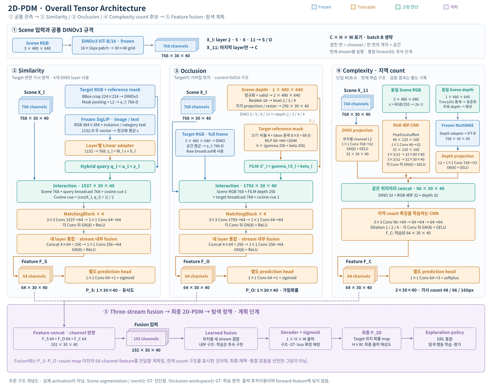
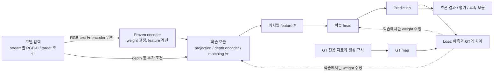

# 2D-PDM

### Zero-Shot Probability Distribution Mapping for Occluded Object Search in Cluttered Drawers

> **Research in progress**  
> RGB-D 관측으로 가려진 target object의 위치를 추론하고, 탐색 행동을 위한 pixel-wise probability map 생성

---

## 문서 안내

전체 연구 목표·입출력·stream 결합·현재 상태와 roadmap은 이 문서에 정리함. 각 stream의 구조·모듈·GT·결과·Q&A와 개발 이력은 아래 문서에서 확인함.

| 문서 | 내용 |
|---|---|
| [Similarity Stream](similarity_stream.md) | DINOv3·SigLIP, semantic adapter, MatchingBlock, GT·학습·zero-shot 결과 |
| [Occlusion Stream](occlusion_stream.md) | RGB-D·target geometry·FiLM, adaptive GT, full16·외부 target 평가 |
| [Complexity Stream](complexity_stream.md) | DINOv3·RGB CNN·MultiMAE, 지역 가시 물체 수 GT·학습·독립 검증 |
| [Development Log](development_log.md) | Phase 1–42의 주요 가정·실험·사진·결과·판단 |
| [연구 문맥·근거 색인](agent.md) | 다른 agent와 외부 독자를 위한 문맥·상세 보고서·작업 지침 |

각 문서의 위·아래 이동 링크로 전체 개요와 다른 문서를 오갈 수 있음. 모든 문서는 저장소 최상위에 둠. Stream별 그림은 기존 `img/similarity/`, `img/occlusion/`, `img/complexity/` 경로를 유지하고, 공통 전체 구조도는 `img/overall_architecture.png`에 둠.

## Overview

서랍 속 더미에 가려진 target을 찾기 위해 **유사도·가림 가능성·장면 구조**를 위치가 보존된 세 feature stream으로 모델링함. 각 feature를 fusion과 decoder에서 결합하여 탐색 정책에 제공하는 것이 목표임.

| Stream | 목적 | 확인된 결과와 다음 검증 |
|---|---|---|
| Similarity | Target과 외형·의미가 관련된 가시 영역 찾기 | DINOv3 + SigLIP 구현, unseen-target zero-shot 동작 정성 확인; 여러 target의 정량 평가 남음 |
| Occlusion | 해당 target이 가려질 수 있는 위치 추론 | Adaptive GT 생성·full16 가림확률 예측·외부 target의 zero-shot 정량 평가 완료; 여러 target·실제 관측 조건으로 평가 확장 |
| Complexity | 단일 RGB-D에서 지역별 가시 물체 수를 예측하여 혼잡 위치 표현 | Phase 42 보완 학습 후 새 clean16 160장 검증 통과; 현재 count stream을 통합 실험의 기준 모델로 정리 |

### 전체 아키텍처



그림은 **현재 구현된 stream 내부 구조와 계획 중인 통합 경로**를 함께 나타냄. 파란색은 frozen encoder, 주황색은 학습 모듈, 초록색은 고정 연산이며, 보라색 점선은 후속 구현 단계임. Tensor는 `channel × 세로 × 가로`로 표시하고 batch `B`는 생략함.

**① Scene 입력과 공통 backbone.** 현재 서랍의 RGB `3×480×640`을 DINOv3로 처리하면 각 위치가 768개 숫자로 표현된 `768×30×40` feature가 나옴. Similarity·Occlusion은 layer `2,5,8,11`의 feature를 사용하고, Complexity는 마지막 layer `11`을 사용함. 그림 상단은 공통 backbone 규격이며 현재 실행은 stream별로 이루어짐. 동일 관측·가중치·전처리·정밀도를 맞춘 통합 구현에서 scene DINO 특징을 공유할 수 있음.

**② Similarity — 무엇을 찾을 것인가.** Target reference RGB와 mask에서 물체 영역을 잘라 DINO appearance `768-D`를 만들고, SigLIP은 reference 이미지와 이름·category를 `1152-D` 의미 조건으로 표현함. 학습 adapter가 이를 `768-D`로 변환하여 appearance에 더한 값이 검색 query임. 이 변환은 similarity-map GT를 통해 학습되며, DINO 자체의 weight는 고정됨. 각 scene 위치에서 **scene 768 + query 768 + cosine 1 = 1537채널**을 MatchingBlock이 64채널로 해석하고, 네 layer의 출력을 통합하여 `F_S`를 만듦.

**③ Occlusion — 그 target이 어디에 가려질 수 있는가.** Scene RGB feature와 함께 depth encoder가 만든 **현재 서랍의 depth feature**를 사용함. Target RGB는 물체의 appearance를 제공하고, reference mask는 크기·윤곽을 나타내는 `68-D` geometry를 제공함. 공유 MLP가 geometry에서 FiLM 계수를 계산하여 scene depth의 256채널 값을 조절함. 이렇게 조절한 depth 256채널과 scene 768·target 768·cosine 1을 합친 **1793채널**을 MatchingBlock에 전달하고, 네 layer를 통합하여 `F_O`를 만듦. Target이 달라지면 같은 모델에서 조절값이 달라지는 구조임.

**④ Complexity — 지역 가시 물체 수.** 같은 관측의 RGB를 frozen DINOv3와 원본 RGB 세부 CNN에, depth를 frozen MultiMAE에 넣음. DINO와 MultiMAE의 위치별 768채널을 각각 32채널로 변환하고 RGB CNN의 32채널과 이어 붙여 **96채널**을 만듦. 세 단계 CNN이 이를 학습 표현 `F_C:64×30×40`으로 바꾸고, `1×1 Conv 64→3 + softplus`가 48·96·160px 창의 가시 물체 수를 동시에 출력함. Workspace·빈 서랍 reference·scene segmentation을 추론 입력으로 사용하지 않음.

**⑤ Feature fusion과 최종 위치 map — 계획 단계.** 세 stream은 같은 `30×40` 위치마다 서로 다른 64개 숫자를 제공함. 이를 같은 위치끼리 이어 붙이면 **`64+64+64=192채널`**이며 공간 격자는 유지됨. 그림에서 오른쪽으로 갈라지는 prediction head는 각 stream의 GT를 예측하는 경로이고, 아래 fusion은 그 head 이전의 feature를 받도록 계획함. 현재 count stream을 통합 실험의 기준으로 두고 learned fusion·decoder·탐색 정책에서 추가 효용을 확인할 예정임. 같은 관측의 세 출력을 결합해야 하며 고정된 추론 경로가 세 stream의 처리시간까지 같다는 뜻은 아님.

Similarity·Occlusion·Complexity는 각각의 GT를 예측하는 stream 단위 구현임. **Three-stream fusion, 최종 위치 확률의 GT·loss·decoder와 DRL은 아직 구현·평가하지 않음.** Complexity는 Phase 42에서 물체 감소·합성 depth 오류를 보완한 뒤, 고정 모델의 새 clean16 32배치·5뷰·160장 확인에서 이전 결합 대비 MAE +1.13%·선택 손실 +0.93%로 사전 5% 유지 기준을 통과함. RGB 대비 두 지표 개선도 3/3 seeds에서 확인함. 이전 Phase 42 test의 선택 손실 +7.97% 실패는 보존하며 새 결과로 대체하지 않음. 이번 판정은 다섯 view 평균과 seed 기준이고 모든 camera에서 5% 이내라는 뜻은 아님. 세부 한계와 수치는 [Complexity Stream](complexity_stream.md)에 정리함.

각 stream 문서는 **목적·입출력 → 전체 구조 → 내부 모듈 → GT와 학습 → 핵심 설계 과정 → FAQ** 순서로 구성함. 단계별 가정·실패·비교 결과는 [Development Log](development_log.md), 실행 문맥과 상세 근거 색인은 [agent.md](agent.md)에 보존함.

### 입력과 감독 정보

**현재 Complexity의 외부 입력은 단일 RGB와 depth임.** 관측에서 지역 count와 중간 특징을 계산하며 GT 물체 ID·개수를 별도로 제공하지 않음. GT는 학습 감독과 출력 평가에만 사용함. 완전히 가려진 물체 수나 제거 난이도의 정답으로 해석하지 않음.

**Scene은 현재 서랍의 관측 영상**, **target reference는 찾을 물체를 별도로 촬영한 영상**임. Reference mask는 그 별도 영상에서 target이 차지하는 영역이며, scene 속 가려진 target의 위치를 알려 주는 mask가 아님.

| 자료 | 내용 | 용도 |
|---|---|---|
| Scene RGB | 현재 보이는 표면의 색·질감·외형 | 세 stream의 관측 입력 |
| Scene depth | 현재 보이는 표면의 깊이 | Occlusion·Complexity 관측 입력; 뒤에 가려진 표면은 직접 관측하지 못함 |
| Target RGB | 찾을 물체의 reference 영상 | Similarity·Occlusion의 target 조건 |
| Target mask | Reference 영상의 물체 윤곽 | Similarity crop/pooling, Occlusion geometry 계산 |
| Target text | Instance name·category 등의 설명 | Similarity의 SigLIP 의미 조건 |
| Empty depth / workspace | 빈 서랍 depth와 고정 camera의 관심 영역 | Occlusion의 GT·학습 영역·표시 후처리에 사용. 현재 Complexity에는 불필요 |
| Scene segmentation / target mesh | Pixel label / 시뮬레이션 형상 | Stream별 GT 생성에 사용. Complexity count는 원본 물리 instance ID에서 계산하며 추론 입력과 구분 |
| GT map | 정의한 규칙에 따른 감독값 | Loss 계산·평가 |
| Prediction map | 관측 입력에서 계산한 예측값 | Stream별 GT 평가. 계획한 fusion에는 head 이전의 `F_S/F_O/F_C`를 전달 |

**GT(Ground Truth)는 이 연구에서 정의한 학습 목표**임. Simulation 정보로 GT를 생성하더라도 추론에는 각 stream이 요구하는 관측 입력만 사용함. GT 예측 오차와 GT 정의 자체의 타당성은 별도로 검증함.


```mermaid
flowchart LR
    OBS["모델 입력<br/>stream별 RGB-D / target 조건"] -->|"RGB·text 등 encoder 입력"| ENC["Frozen encoder<br/>weight 고정, feature 계산"]
    ENC --> BODY["학습 모듈<br/>projection / depth encoder / matching 등"]
    OBS -->|"depth 등 추가 조건"| BODY
    BODY --> FEAT["위치별 feature F"]
    FEAT --> HEAD["학습 head"]
    HEAD --> PRED["Prediction"]
    SUP["GT 전용 자료와 생성 규칙"] --> GT["GT map"]
    PRED --> LOSS["Loss: 예측과 GT의 차이"]
    GT --> LOSS
    LOSS -.->|"학습에서만 weight 수정"| BODY
    LOSS -.->|"학습에서만 weight 수정"| HEAD
    PRED -.-> USE["추론 결과 / 평가 / 후속 모듈"]
```

| 구분 | Feature·prediction 계산 | Weight 갱신 |
|---|---|---|
| Frozen encoder | 입력마다 feature 계산; 반복 입력은 cache 재사용 가능 | 사전학습 weight 고정 |
| Trainable module — 학습 | Feature에서 prediction 계산 후 GT와 비교 | Loss의 gradient로 갱신 |
| Trainable module — 추론 | 저장된 weight로 새 입력의 prediction 계산 | 갱신하지 않음 |

### Feature와 Tensor 규격

DINOv3 ViT-B/16은 `480×640` scene을 **16×16px patch, 총 30×40개 위치**로 처리함. 각 위치의 출력은 768-D vector이며, transformer의 attention을 통해 다른 위치의 문맥도 반영됨. 따라서 patch 간격이 16px라는 사실과 feature가 참고하는 전체 영상 범위는 다름.

```text
Scene RGB                   DINOv3 dense feature
B × 3 × 480 × 640    →      B × 768 × 30 × 40
                                 │       │
                       위치별 표현 폭    공간 격자
```

`768-D`는 형상·색·질감·문맥을 분산해서 표현하는 vector의 길이임. 각 축에 특정 물체나 물리 속성이 하나씩 지정된 것은 아님. Scene feature는 위치를 유지하고, target feature는 pooling으로 대표 vector를 만들어 사용함.

| 표기 | 의미 | 현재 규격 |
|---|---|---|
| `B` | Batch size | 동시에 처리하는 sample 수 |
| `C` | Channel 수 | DINO feature 768, stream feature 64 |
| `H,W` | 입력 영상의 세로·가로 | `480×640` |
| `H_p,W_p` | Feature grid의 세로·가로 | `30×40` |
| `ℓ` 또는 `l` | Backbone block index, 0부터 시작 | Similarity·Occlusion은 `2,5,8,11`, Complexity는 `11` |
| `(u,v)` | 영상 또는 feature grid의 공간 위치 | 각 수식에서 좌표계 명시 |
| `D` in `768-D` | Dimension, vector 길이 | Depth와 구분 |
| `B` in `ViT-B` | Base 모델 크기 | Batch size와 구분 |

`B×768×30×40 → B×64×30×40`은 **공간 위치를 유지한 channel 변환**임. `30×40 → 480×640` 보간은 **공간 해상도 확대**이며, patch 내부의 새로운 세부 정보를 복원하는 연산은 아님.

### 주요 연산

| 연산·모듈 | 계산 | 프로젝트에서의 역할 |
|---|---|---|
| Encoder / backbone | 입력을 feature로 변환 | DINOv3의 외형·문맥, SigLIP의 image/text 의미, MultiMAE의 관측 depth 표현 |
| Head | Feature를 감독 목표의 출력으로 변환 | Stream feature에서 score map 생성 |
| Projection / Linear | `y=Wx+b` | SigLIP `1152→768`, geometry→FiLM 조건 등 학습 가능한 변환 |
| Pooling | 위치별 평균·가중 평균 | Target patch들을 대표 vector로 요약 |
| Broadcast | 같은 vector를 공간 위치마다 반복 | 모든 scene 위치에 동일한 target 조건 제공 |
| Concat | Channel 방향으로 이어 붙임 | 서로 다른 입력 단서를 별도 channel로 유지 |
| `1×1 Conv` | 같은 위치의 channel 혼합 | 공간 격자를 유지한 feature 변환 |
| `3×3 Conv` | 현재 위치와 주변 8개 위치의 channel 혼합 | 인접 patch의 공간 문맥 반영 |
| MLP | Linear와 비선형 함수의 연속 적용 | Geometry vector에서 FiLM 조절값 생성 |
| ReLU / GELU | 비선형 activation | 단순 선형 변환으로 표현하기 어려운 관계 학습 |
| GroupNorm | Sample별 channel group의 channel·공간 통계로 정규화 | 중간 feature의 수치 scale 조절 |
| Logit / sigmoid | `z → σ(z)=1/(1+exp(−z))` | 제한 없는 출력을 `0–1` 범위로 변환 |
| Softplus | `log(1+exp(z))` | Complexity count를 음수가 아닌 연속값으로 출력. 0–1 확률로 제한하지 않음 |
| Loss / gradient | GT와의 오차 / parameter별 미분 | Trainable module의 weight 갱신 |

**Projection.** Similarity의 `Linear(1152,768)`은 `W: 768×1152`, `b: 768`을 학습함. 출력의 각 성분은 1152개 입력 전체의 가중합으로 계산됨. 차원을 맞추는 동시에 similarity-map loss에 맞게 semantic 표현을 변환하는 역할임.

**Normalization.** 입력·vector·중간 feature의 정규화는 목적과 계산 대상이 다름.

| 종류 | 계산 대상 | 효과 |
|---|---|---|
| RGB normalization | Pixel 값에 `/255`, channel별 mean/std 적용 | 사전학습 encoder의 입력 scale에 맞춤 |
| L2 normalization | Vector를 자신의 길이로 나눔 | 방향을 유지하고 길이를 1로 맞춤. 예: `(3,4)→(0.6,0.8)` |
| GroupNorm | Sample 내부의 channel group과 공간 값 | 그룹 통계로 중간 feature를 정규화 |

**Cosine similarity.** L2-normalized vector의 내적으로 방향 유사도를 계산함. 예를 들어 `(1,0)`과 `(0.8,0.6)`의 cosine은 `0.8`임. 같은 좌표 표현에서 비교하는 연산이므로 서로 다른 encoder의 원본 vector에 바로 적용하지 않음. Similarity의 DINO–SigLIP 결합은 학습 가능한 projection을 먼저 거침.

**Broadcast / Concat / Addition.** Target 조건을 전달하는 서로 다른 연산임.

```text
Broadcast: q=[a,b]를 모든 scene 위치에 반복
Concat:    Concat([x,y,z], [a,b]) = [x,y,z,a,b]   → 길이 5
Addition:  [x,y] + [a,b]          = [x+a,y+b]     → 길이 2
```

Similarity는 appearance와 projected semantics를 **더해 query를 생성**하고, scene·query·cosine은 **concat하여 MatchingBlock에 전달**함. Concat 단계에서 서로 다른 공간 위치를 섞지는 않으며, 이후 `3×3 Conv`가 주변 patch를 함께 처리함.

### Stream 출력과 Fusion

각 stream은 **중간 feature `F`**와 **감독용 prediction map**을 구분함. Head는 feature를 현재 GT에 맞는 소수의 score로 압축하고, fusion에는 압축 전의 64-channel 표현을 전달할 계획임.

| 출력 | Shape | 의미 |
|---|---|---|
| `F_S` | `B×64×30×40` | Similarity GT 예측을 위해 학습한 중간 표현 |
| `P_S` | `B×1×30×40` | Target과 scene의 정의된 관계 점수 |
| `F_O` | `B×64×30×40` | Occlusion GT 예측을 위해 학습한 중간 표현 |
| `P_O` | `B×1×30×40` | 해당 pixel을 덮는 후보 pose 중 가림 조건을 만족한 비율 GT의 예측 |
| `F_C` | `B×64×30×40` | DINO·RGB 세부·MultiMAE 특징에서 지역 count GT로 학습한 중간 표현 |
| Complexity count maps | `B×3×30×40` | 48·96·160px 창의 가시 물체 수. Softplus 출력이며 count/16 정규화 없음 |

**Stream마다 출력의 의미와 범위가 다름.** Similarity의 `0.8`은 관계 점수, Occlusion GT의 `0.8`은 후보 pose의 가림 조건 통과 비율임. Complexity의 `2.7`은 지역 가시 물체 수의 연속 추정치이며 0–1로 제한하지 않음. 어느 출력도 그대로 최종 target 존재 확률을 뜻하지 않으며 map 전체의 합도 1이 아님.

```text
Concat(F_S, F_O, F_C): B × 192 × 30 × 40
F_fuse = Fusion(Concat(F_S, F_O, F_C))       # planned
P_2D   = Sigmoid(Decoder(F_fuse))           # planned
```

세 stream의 중간 feature 규격은 `B×64×30×40`으로 맞췄으며 concat 입력은 `B×192×30×40`임. Fusion 구현 후에는 stream 간 정보 결합, 최종 위치 확률의 calibration, S+O 대비 S+O+C의 탐색 효용을 확인할 필요가 있음.

---

## From Shelf Search to Drawer Search

기존 선반 환경 연구를 비정형 drawer 환경으로 확장함.

> H. Jeon et al., *A study on deep reinforcement learning-based exploration intelligence for occluded object search*, Engineering Applications of Artificial Intelligence, 2026.

기존 연구는 similarity와 occlusion 기반 column-wise distribution을 사용함. 물체 유사도를 수동 정의한 category score에 의존했기 때문에, 학습에 없던 물체로 확장되는 zero-shot 탐색 성능을 확인하지 못했음.

주요 확장:

- 정규적인 shelf column에서 **비정형 cluttered drawer**로 확장
- Column-wise distribution에서 **pixel-wise 2D-PDM**으로 확장
- DINOv3의 dense appearance와 SigLIP의 language-aligned semantics 결합
- 학습하지 않은 target instance의 zero-shot 추론 확인: Similarity 정성 결과와 Occlusion 정량 평가
- Similarity와 Occlusion에 scene-level **Complexity stream** 추가

---

## Project Status

현재 결과와 구현 상태를 요약함. 과거 중간 모델의 수치·검증은 [Development Log](development_log.md)에서 해당 Phase를 확인함.

| 구성 | 확인된 결과·현재 구현 | 추가 확인·구현할 내용 |
|---|---|---|
| Similarity | Frozen DINOv3 + SigLIP, shortcut 없는 학습 head; 미학습 target의 zero-shot 동작 정성 확인 | 공식 기준 checkpoint 지정, 여러 미학습 target의 정량 성능 평가 |
| Occlusion GT | Target/yaw별 adaptive pose grid로 full16 240,000 maps 생성; fixed grid의 target별 coverage 누락 보완 | 새 target·관측 조건에서 geometry와 coverage 확인 |
| Occlusion model | Native 68-D + raw broadcast + global FiLM, full16 10% 학습; scene-heldout coverage 내부 MAE 0.013997 / Soft-IoU 0.868371, target 조건 활용 확인 | Coverage 밖 출력과 reference mask·camera 변화의 영향 |
| External Occlusion | 미학습 `packaged_food_5`의 zero-shot 가림확률 예측 정량 확인: 30 scenes × 5 views, coverage 내부 MAE 0.0180 / Soft-IoU 0.812 / IoU 0.723 | 여러 external targets·실제 RGB-D 조건으로 평가 확대 |
| Complexity count model | DINOv3 + RGB CNN + MultiMAE; Phase 42에서 감소 상태·depth 오류 보완. 고정 모델의 새 clean16 유지·RGB 대비 개선 기준을 각 3/3 seeds로 통과하여 통합 실험의 기준 모델로 정리 | 원래 test의 +7.97% 실패와 새 평가의 camera별 한계를 보존. 새로운 물체·camera·실제 sensor 및 탐색 효용은 별도 검증 |
| Three-stream fusion | 세 stream의 중간 feature와 concat 입력 규격 `B×192×30×40` 정리 | 같은 RGB-D 관측의 실행·DINO 공유·전체 지연 확인, 최종 GT·loss·decoder 구현과 S+O 대비 S+O+C 평가 |
| Exploration / deployment | Stream별 관측 입력·출력과 탐색 prior 연결 방향 정리 | DRL 통합 구현 후 탐색 효용·실제 RGB-D 적용 평가 |

이전 Complexity의 density·물체 대응·접경 모델과 미실행 가설은 [Development Log](development_log.md)와 [변경 전 문서](https://github.com/JeonHaneul/2D-PDM_DINOv3/blob/a705c458a058ace1b37276d25bf510e2435b4f98/complexity_stream.md)에 보존함. Phase 38 미채택과 GT 관계 회귀 공개 철회는 유지함.

### Core Files

아래는 현재 연구의 구현 파일과 역할임. 최신 실험의 재현 기준은 로컬 개발 코드와 해당 run의 설정·결과임. **현재 지역 count 모델·학습·평가 코드는 로컬 개발 폴더에 있으며 이 공개 clone에 배포하지 않음.** 일부 Occlusion 실행 파일도 이전 버전이거나 로컬에만 있으므로 사용할 run과 코드 버전을 함께 확인함. 상세 경로는 `agent.md`에 정리함.

| 기능 | 구현 파일 | 역할 |
|---|---|---|
| 공통 RGB backbone | `backbone.py` | Frozen DINOv3 patch feature 추출 |
| Target reference | `target_utils.py`, `train_common.py` | Crop/mask 정렬, masked pooling, target cache와 데이터 분리 |
| Similarity 모델 | `similarity_model.py` | 의미 결합, scene–target interaction, MatchingBlock, map head |
| Similarity GT·학습 | `gt_similarity.py`, `precompute_gt.py`, `train_similarity_v2.py` | Category 기반 GT와 관련성 map 학습 |
| Occlusion 모델 | `occlusion_model.py` | Scene RGB-D와 target geometry의 FiLM 결합 |
| Occlusion GT | `generate_occlusion_map.py`, `generate_occlusion_gt_batched_v2.py` | Adaptive pose 표집, depth 비교, probability/coverage 누적 |
| Occlusion 기하 | `mesh_utils.py`, `mesh_cache.py`, `depth_rasterizer_gpu.py` | Mesh 좌표 변환·단순화와 GPU depth 렌더링 |
| Occlusion 학습·평가 | `occlusion_dataset.py`, `train_occlusion.py`, `evaluate_occlusion_checkpoint.py` | Coverage를 반영한 학습과 저장 split·external target 평가 |
| Complexity GT | `experiments/complexity_local_count_20260929/ground_truth.py` | **로컬 전용.** 원본 물체 ID에서 48/96/160px 창의 count·유효 GT 생성 |
| Complexity count head | `experiments/complexity_depth_pretrain_20261001/model.py` | **로컬 전용.** DINO32·RGB32·depth32 결합, 학습 F_C64와 count3 출력 |
| Complexity depth 표현 | `experiments/complexity_depth_pretrain_20261001/multimae_depth.py` | **로컬 전용.** 관측 depth 정규화와 frozen MultiMAE 추출 |
| Complexity 학습·추론 | `experiments/complexity_robust_count_20261006/{cache,train,predict}.py` | **로컬 전용.** 고정 특징 cache, Phase 42 학습, GT 없는 단일 RGB-D 추론 |
| Complexity 독립 확인 | `experiments/complexity_clean16_confirmation_20261006/` | **로컬 전용.** 고정 checkpoint의 새 clean16 평가·보고 |

공개 저장소의 `complexity_cues.py`, `complexity_model.py`, `run_complexity_pilot.py`, `inference_complexity.py`는 보존한 이전 density pilot임. 현재 count stream의 실행 파일로 사용하지 않음. 일부 DINO loading helper의 재사용과 과거 model class는 구분함.

---

## Roadmap

Similarity의 unseen-target 정성 동작, Occlusion의 full16·외부 target 정량 평가와 Complexity의 지역 count 학습·후속 독립 확인을 완료함. 현재 count stream을 통합 실험의 기준으로 두며, 최종 위치 GT와 탐색 효용은 통합 단계에서 확인함. 완료된 세부 실험과 이전 실패는 [Development Log](development_log.md)에 보존함.

- [ ] Similarity 기준 checkpoint와 재현 설정을 확정하고 정량 unseen target 평가 수행
- [ ] Occlusion을 여러 외부 target과 실제 reference mask 추정 조건에서 평가
- [x] 원본 물체 ID 기반 지역 count GT와 단일 RGB-D 추론을 구현하고 감소 상태·depth 오류를 검증
- [x] 고정한 Phase 42 count 모델을 새로운 clean16 장면에서 확인하고 통합 실험의 기준으로 정리
- [ ] 같은 관측의 세 stream 실행, DINO 특징 공유와 전체 처리시간을 확인
- [ ] Camera·환경·새 물체·실제 depth 조건에서 적용 범위를 확인
- [ ] Fusion의 GT·loss·decoder를 정의하고 S+O 대비 S+O+C를 비교
- [ ] DRL 탐색 효용과 실제 RGB-D 환경을 검증

---

<!-- navigation:start -->
**전체 개요** · [Similarity](similarity_stream.md) · [Occlusion](occlusion_stream.md) · [Complexity](complexity_stream.md) · [Development Log](development_log.md) · [연구 문맥](agent.md)
<!-- navigation:end -->
