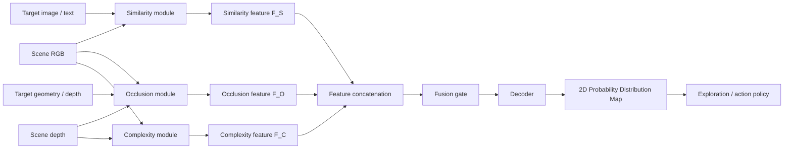
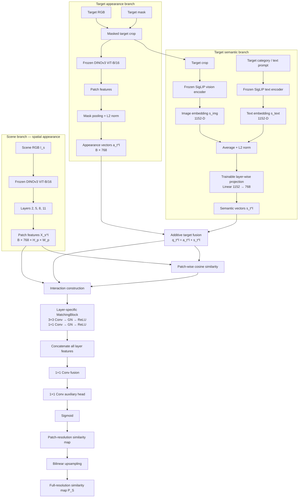
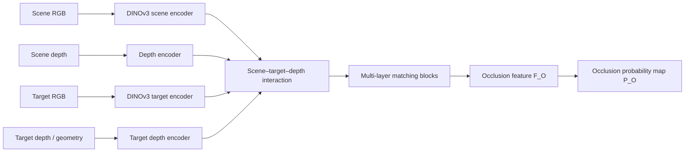
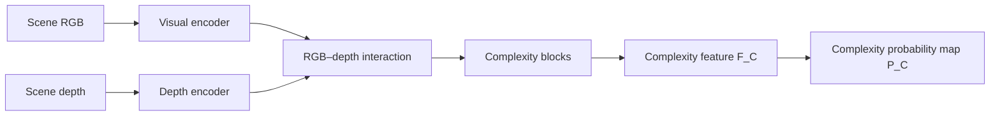

# 2D-PDM: Zero-Shot Occluded Object Search in Cluttered Drawers

> **Research in progress**  
> 본 저장소는 RGB-D 카메라로 관측한 cluttered drawer에서 **다른 물체 아래에 완전히 가려져 직접 보이지 않는 타겟 물체**를 탐색하기 위한 2D Probability Distribution Map(2D-PDM) 프레임워크를 개발합니다.

## 연구 개요

사람은 서랍 속에서 보이지 않는 물체를 찾을 때 무작위로 물체를 제거하지 않습니다. 보통 다음 세 가지 단서를 함께 사용합니다.

1. **Similarity**: 타겟과 같거나 의미적으로 유사한 물체가 모여 있는가?
2. **Occlusion**: 보이는 물체 아래에 타겟이 가려질 물리적 공간이 존재하는가?
3. **Complexity**: 물체가 얼마나 조밀하고 복잡하게 겹쳐 있는가?

2D-PDM은 이 세 판단 과정을 독립적인 probability stream으로 모델링한 뒤, 공간 feature를 결합하여 타겟이 존재할 가능성이 높은 영역을 픽셀 단위 확률분포로 표현합니다.



최종 목표는 현재 관측에서 얻은 2D-PDM을 탐색 정책의 probabilistic guidance로 사용하여, 불필요한 물체 제거를 줄이고 완전히 가려진 타겟까지 효율적으로 탐색하는 것입니다.

### 기존 연구로부터의 확장

본 연구는 선반 환경의 가려진 물체 탐색을 다룬 다음 연구를 서랍 환경으로 확장합니다.

> H. Jeon et al., *A study on deep reinforcement learning-based exploration intelligence for occluded object search*, Engineering Applications of Artificial Intelligence, 2026.

기존 연구에서는 similarity와 occlusion으로 만든 column-wise probability distribution을 DRL agent에 제공했습니다. 그러나 물체 간 유사도를 사전에 정의한 카테고리별 점수에 의존했기 때문에, 학습에서 보지 못한 물체에 대한 엄밀한 zero-shot 탐색에는 한계가 있었습니다.

현재 연구에서는 다음을 확장합니다.

- 규칙적인 선반 column에서 비정형적으로 물체가 겹쳐 쌓인 **drawer scene**으로 확장
- column-wise distribution에서 **pixel-wise 2D-PDM**으로 확장
- 사전 정의한 물체 간 유사도 대신 **DINOv3 + SigLIP** 기반의 시각·의미 표현 사용
- 기존 similarity/occlusion에 **scene complexity**를 추가
- 학습하지 않은 target instance를 입력할 수 있는 **zero-shot target-conditioned inference** 지향

### 전체 수식

세 모듈의 출력 feature를 각각 \(F_S\), \(F_O\), \(F_C\)라 하면 최종 분포는 다음과 같이 표현할 수 있습니다.

$$
F_{\mathrm{fuse}}
=
\mathcal{G}
\left(
\operatorname{Concat}(F_S,F_O,F_C)
\right)
$$

$$
P_{\mathrm{2D}}
=
\sigma\left(
\mathcal{D}(F_{\mathrm{fuse}})
\right)
$$

- \(\mathcal{G}\): 세 단서의 중요도를 공간적으로 조절하는 fusion gate
- \(\mathcal{D}\): fused feature를 원 영상 좌표의 확률분포로 복원하는 decoder
- \(\sigma\): 각 위치의 출력을 \([0,1]\) 범위로 만드는 sigmoid

현재 저장소에서는 세 모듈 중 **Similarity module을 우선 구현하고 검증하는 단계**입니다. Occlusion 및 Complexity module과 최종 fusion은 아래 설계를 기반으로 순차적으로 통합할 예정입니다.

---

## Similarity Module

### 목적

Similarity module은 다음 질문에 답하는 공간 확률지도를 생성합니다.

> “현재 보이는 물체 중 타겟 자체 또는 타겟과 의미적으로 유사한 물체는 어디에 있는가?”

단순한 동일 인스턴스 매칭만으로는 충분하지 않습니다. 예를 들어 학습에 사용하지 않은 **banana**를 타겟으로 입력했을 때, 정확히 같은 바나나가 scene에 없어도 다른 과일이 놓인 영역을 탐색 후보로 활성화할 수 있어야 합니다.

이를 위해 두 foundation model의 상호 보완적인 표현을 사용합니다.

| 구성요소 | 입력 | 출력 | 역할 |
|---|---|---|---|
| DINOv3 scene encoder | Scene RGB | Multi-layer dense patch features | 물체의 위치, 형상, 질감 및 국소 appearance 표현 |
| DINOv3 target encoder | Target crop | Multi-layer target appearance vectors | 타겟의 시각적 특징 표현 |
| SigLIP image encoder | Target crop | Semantic image embedding | 타겟 이미지의 상위 의미 표현 |
| SigLIP text encoder | Target category/prompt | Semantic text embedding | 이미지의 모호성을 카테고리·언어 정보로 보완 |
| Semantic projection | SigLIP embedding | Layer-wise projected vectors | SigLIP 의미 정보를 DINOv3 feature 차원에 정렬 |
| Matching blocks | Scene–target interaction | Layer-wise matching features | 위치별 target relevance 학습 |
| Fusion head | 모든 layer의 matching feature | Similarity probability map | 저수준 appearance와 고수준 semantics 통합 |

### 왜 DINOv3와 SigLIP을 함께 사용하는가?

#### DINOv3: dense appearance와 위치

DINOv3는 scene을 patch grid로 표현하므로 “무엇이 어디에 있는가”를 보존하는 dense feature extractor로 사용합니다. 여러 transformer layer의 feature를 사용하여 얕은 층의 색상·경계·형상 단서부터 깊은 층의 추상적 시각 단서까지 함께 활용합니다.

하지만 DINOv3 appearance만 사용할 경우 다음 관계는 불안정할 수 있습니다.

- 외형이 다른 두 물체가 같은 카테고리라는 관계
- 바나나와 사과가 모두 과일이라는 관계
- 포장 형태가 다른 두 식품이 의미적으로 관련 있다는 관계

#### SigLIP: open-vocabulary semantics

SigLIP은 이미지와 텍스트를 같은 의미 공간에 정렬합니다. 따라서 target image embedding에 target text embedding을 함께 사용하면, 외형만으로 알기 어려운 카테고리 관계를 보완할 수 있습니다.

현재 학습 코드에서는 target의 상위 카테고리를 `"a photo of a {category}"` 형식으로 정규화하여 사용합니다. 새로운 물체를 평가할 때는 물체 이름 또는 상위 카테고리를 같은 형식의 prompt로 입력할 수 있습니다. Target semantic vector는 다음과 같습니다.

$$
s_{\mathrm{img}}
=
\operatorname{Norm}
\left(
\operatorname{SigLIP}_{\mathrm{vision}}(I_t)
\right)
$$

$$
s_{\mathrm{text}}
=
\operatorname{Norm}
\left(
\operatorname{SigLIP}_{\mathrm{text}}
(\text{``a photo of a [category/target]''})
\right)
$$

$$
s
=
\operatorname{Norm}
\left(
\frac{s_{\mathrm{img}}+s_{\mathrm{text}}}{2}
\right)
$$

이미지와 텍스트가 동일한 SigLIP embedding space에 있으므로 평균 fusion을 사용합니다. 텍스트가 없는 inference에서는 target image embedding만 사용하는 구성도 가능합니다.

### 상세 프레임워크



### 1. Target 전처리와 DINOv3 appearance vector

Target 단독 RGB와 segmentation mask로부터 물체 영역을 crop합니다. 배경이 target feature를 희석하지 않도록 DINOv3 patch feature를 mask-weighted pooling합니다.

layer \(l\)의 target patch feature를 \(X_t^l\), downsample된 mask를 \(M_t\)라 하면:

$$
a_t^l
=
\operatorname{Norm}
\left(
\frac{
\sum_{u,v} M_t(u,v)X_t^l(:,u,v)
}{
\sum_{u,v}M_t(u,v)+\epsilon
}
\right)
$$

\(a_t^l\)는 target의 색상, 질감, 부분 형상과 같은 **appearance query**를 의미합니다.

### 2. SigLIP semantic projection

SigLIP의 1152차원 semantic vector \(s\)를 각 DINOv3 layer에 맞는 768차원 vector로 투영합니다.

$$
s_t^l=W_l s+b_l
$$

각 layer마다 서로 다른 projection \(W_l\)을 사용합니다. DINOv3의 얕은 층과 깊은 층이 담는 정보의 성격이 다르기 때문에, 동일한 semantic vector도 layer별로 다르게 정렬할 수 있도록 설계했습니다.

DINOv3 및 SigLIP encoder는 frozen이며, 이 projection layer는 학습됩니다.

### 3. Appearance–semantic target fusion

최종 target query는 DINOv3 appearance와 projected SigLIP semantics를 더해 구성합니다.

$$
q_t^l=a_t^l+s_t^l
$$

각 항의 의미는 다음과 같습니다.

- \(a_t^l\): “이 target은 시각적으로 어떻게 생겼는가?”
- \(s_t^l\): “이 target은 의미적으로 무엇인가?”
- \(q_t^l\): appearance와 semantics를 함께 가진 layer별 target condition

### 4. Patch-wise cosine similarity

scene의 각 patch feature \(X_s^l(:,u,v)\)와 target query \(q_t^l\) 사이의 cosine similarity를 계산합니다.

$$
c^l(u,v)
=
\frac{
X_s^l(:,u,v)^\top q_t^l
}{
\lVert X_s^l(:,u,v)\rVert_2
\lVert q_t^l\rVert_2
}
$$

cosine similarity의 범위를 GT probability와 같은 \([0,1]\)로 맞춥니다.

$$
\hat{c}^l(u,v)=\frac{c^l(u,v)+1}{2}
$$

\(\hat{c}^l\)는 특정 위치가 target query와 얼마나 직접적으로 가까운지를 나타내는 명시적 matching cue입니다. 다만 단일 cosine 값만으로 모든 카테고리 관계를 표현하기 어렵기 때문에, 원본 feature도 함께 matching head에 제공합니다.

### 5. Scene–target interaction construction

target query를 scene patch grid 전체에 broadcast한 뒤, scene feature 및 cosine map과 channel 방향으로 concat합니다.

$$
Z^l(u,v)
=
\operatorname{Concat}
\left[
X_s^l(:,u,v),\;
q_t^l,\;
\hat{c}^l(u,v)
\right]
$$

각 입력은 서로 다른 정보를 유지합니다.

- \(X_s^l\): 해당 scene 위치의 원본 시각 정보
- \(q_t^l\): 찾고자 하는 target의 시각·의미 조건
- \(\hat{c}^l\): 두 feature 사이의 명시적인 cosine matching score

원본 feature를 보존하면 학습 가능한 head가 cosine score 하나로는 표현하기 어려운 비선형 관계까지 학습할 수 있습니다.

### 6. Multi-layer matching과 similarity map

각 DINOv3 layer의 interaction \(Z^l\)은 독립적인 MatchingBlock을 통과합니다.

$$
F_l
=
\operatorname{MatchingBlock}_l(Z^l)
$$

MatchingBlock은 공간 구조를 유지하기 위해 MLP가 아닌 CNN으로 구성됩니다.

```text
3×3 convolution
→ GroupNorm
→ ReLU
→ 1×1 convolution
→ GroupNorm
→ ReLU
```

모든 layer의 결과를 concat하고 \(1\times1\) convolution으로 융합합니다.

$$
F_S
=
\operatorname{Fuse}
\left(
\operatorname{Concat}[F_2,F_5,F_8,F_{11}]
\right)
$$

$$
P_S
=
\sigma
\left(
\operatorname{Head}(F_S)
\right)
$$

patch-resolution 결과는 bilinear interpolation으로 원 영상 크기에 맞게 복원합니다. \(P_S\)는 최종 3-stream fusion에 전달될 similarity probability map입니다.

### 학습

학습 시 DINOv3와 SigLIP backbone은 고정하고 다음 부분만 최적화합니다.

- layer-wise SigLIP semantic projection
- DINOv3 layer별 MatchingBlock
- multi-layer fusion block
- similarity map head

현재 similarity map은 MSE loss로 학습합니다.

$$
\mathcal{L}_{\mathrm{sim}}
=
\frac{1}{HW}
\sum_{u,v}
\left(
P_S(u,v)-Y_S(u,v)
\right)^2
$$

여기서 \(Y_S\)는 target과 scene object 사이의 관계를 나타내는 similarity-map ground truth입니다.

### Zero-shot 정성 결과: Unseen Banana

학습에 사용하지 않은 **banana** 이미지와 의미 prompt를 target query로 입력한 결과, scene에서 과일에 해당하는 영역이 활성화되는 것을 확인했습니다.

이 결과는 모델이 바나나의 동일 인스턴스를 암기한 것이 아니라 다음 두 정보를 함께 이용했음을 보여주는 정성적 사례입니다.

- DINOv3가 제공하는 target/scene의 dense visual appearance
- SigLIP이 제공하는 banana–fruit 간 open-vocabulary semantic relation

> 결과 이미지 추가 위치  
> 아래 경로에 실험 이미지를 추가한 뒤 주석을 실제 Markdown 이미지로 교체할 예정입니다.
>
> `assets/results/unseen_banana_similarity.png`

<!--

-->

### Similarity module 구현 상태

- [x] Frozen DINOv3 multi-layer scene encoder
- [x] Mask-pooled DINOv3 target appearance encoder
- [x] Frozen SigLIP image/text semantic encoder
- [x] Trainable layer-wise semantic projection
- [x] Appearance–semantic additive target fusion
- [x] Patch-wise cosine similarity
- [x] Layer-specific CNN matching blocks
- [x] Multi-layer fusion 및 similarity-map prediction
- [x] 학습에 사용하지 않은 banana target의 정성적 zero-shot 확인
- [ ] Object-held-out 정량 평가
- [ ] Category-held-out 정량 평가
- [ ] DINOv3-only / SigLIP-only / image+text ablation

---

## Occlusion Module

### 목적

Occlusion module은 다음 질문에 답합니다.

> “현재 보이는 물체 아래 또는 뒤에 target이 물리적으로 존재할 수 있는가?”

Similarity가 “어디를 우선 탐색할 것인가”에 대한 의미적 단서라면, occlusion은 “그 위치에 타겟이 실제로 가려질 공간이 있는가”를 판단하는 기하학적 단서입니다.

### 예정 입력

- Scene RGB
- Scene depth
- Target image
- Target depth 또는 알려진 3D mesh/geometry
- Target scale augmentation

### Occlusion-map ground truth

서랍의 후보 위치에 target 3D mesh를 가상 배치하고, 위치·자세·크기를 변화시키며 현재 depth 관측과 비교합니다. 해당 pose의 target이 앞쪽 물체에 의해 가려질 수 있으면 그 투영 영역에 값을 누적합니다.

$$
Y_O(u,v)
\propto
\sum_{p\in\mathcal{P}}
\mathbf{1}
\left[
D_{\mathrm{target}}^{p}(u,v)
>
D_{\mathrm{scene}}(u,v)
\right]
$$

- \(\mathcal{P}\): 가능한 target 위치, 회전 및 scale의 집합
- \(D_{\mathrm{target}}^{p}\): pose \(p\)에 배치한 target의 렌더링 depth
- \(D_{\mathrm{scene}}\): 현재 관측된 scene depth

다양한 target scale을 사용하여 모델이 절대 크기를 암기하지 않고, scene과 target 사이의 상대 크기 및 가림 관계를 학습하도록 합니다.

### 예정 구조



### 구현 상태

- [x] Scene/target depth 데이터 수집
- [x] Target별 occlusion-map 데이터 생성
- [ ] Occlusion dataset loader 연결
- [ ] RGB/target/depth encoder 구현
- [ ] Occlusion matching head 학습
- [ ] 정량 평가 및 ablation

---

## Complexity Module

### 목적

Complexity module은 다음 질문에 답합니다.

> “서랍의 각 영역이 얼마나 조밀하고 불규칙하게 쌓여 있어 탐색하기 어려운가?”

동일한 수의 물체가 있어도 넓게 떨어져 있는 scene과 여러 물체가 서로 겹쳐 쌓인 scene의 탐색 난도는 다릅니다. Complexity module은 similarity나 target-specific occlusion과 별도로, 현재 scene 자체의 clutter 구조를 표현합니다.

### Complexity 단서

현재 고려하는 주요 단서는 다음과 같습니다.

- 단위 면적당 물체 수 또는 instance density
- local depth variance
- depth discontinuity와 물체 경계 밀도
- 물체 간 overlap 및 적층 정도

local window \(\Omega_{u,v}\)에서의 complexity ground truth는 다음 형태로 구성할 수 있습니다.

$$
Y_C(u,v)
=
\lambda_n
\frac{N_{\mathrm{obj}}(\Omega_{u,v})}{|\Omega_{u,v}|}
+
\lambda_d
\operatorname{Var}
\left(
D_{\mathrm{scene}}(\Omega_{u,v})
\right)
+
\lambda_e E_{\mathrm{depth}}(\Omega_{u,v})
$$

- \(N_{\mathrm{obj}}\): local window에 포함된 물체 instance 수
- \(\operatorname{Var}(D)\): 국소 depth 분산
- \(E_{\mathrm{depth}}\): depth edge 또는 discontinuity 밀도

### 예정 구조



Complexity는 target identity와 무관한 scene-level prior입니다. 따라서 target-conditioned Similarity/Occlusion stream과 결합할 때, 단순히 복잡한 영역을 항상 높게 평가하지 않도록 fusion gate에서 상황에 맞는 가중치를 학습해야 합니다.

### 구현 상태

- [x] RGB-D scene 데이터 수집
- [ ] Complexity 정의 및 GT 생성 방식 확정
- [ ] 계산 기반 GT와 학습 기반 prediction 비교
- [ ] RGB-D complexity encoder 구현
- [ ] 정량 평가 및 ablation

---

## Three-Stream Fusion 및 향후 계획

세 map을 단순 평균하면 scene에 따라 서로 다른 단서의 신뢰도를 반영하기 어렵습니다. 최종 모델에서는 각 stream의 feature를 concat하고 fusion gate가 위치별·상황별 중요도를 조절하도록 설계할 예정입니다.

예를 들어:

- 타겟과 유사한 물체가 명확할 때는 Similarity의 비중 증가
- 유사 물체가 여러 곳에 분산되어 있을 때는 Occlusion이 탐색 후보를 좁힘
- 깊이 구조가 불규칙하고 물체가 조밀할 때는 Complexity가 탐색 난도를 보정

최종 2D-PDM은 이후 DRL 또는 다른 action policy의 observation/guidance로 전달됩니다.

### Roadmap

- [x] Drawer RGB-D 및 target-reference 데이터 구성
- [x] DINOv3 기반 dense similarity baseline
- [x] DINOv3 + SigLIP similarity module
- [x] Unseen banana 정성적 zero-shot test
- [ ] 엄밀한 held-out object/category zero-shot benchmark
- [ ] Occlusion module 구현 및 평가
- [ ] Complexity module 구현 및 평가
- [ ] Three-stream feature fusion 및 decoder
- [ ] Exploration/action policy 연결
- [ ] End-to-end occluded object search 평가
- [ ] Sim-to-real drawer experiment

## Repository Status

본 프로젝트는 진행 중인 연구 코드입니다. 현재 주요 실행 파일은 다음과 같습니다.

| 파일 | 설명 |
|---|---|
| `backbone.py` | Frozen DINOv3 multi-layer feature extractor |
| `target_utils.py` | Target crop, mask preprocessing 및 masked pooling |
| `similarity_model.py` | Scene–target interaction, matching blocks 및 similarity head |
| `train_similarity_v2.py` | DINOv3 + SigLIP multi-target similarity 학습 |
| `gt_similarity.py` | Category-based similarity-map GT 생성 |
| `precompute_gt.py` | Similarity GT 사전 계산 |
| `paths_config.py` | Model, asset 및 dataset 경로 설정 |

> 데이터 경로, 설치 방법, 학습 및 inference 명령은 전체 three-stream pipeline 정리와 함께 추가할 예정입니다.

## Acknowledgement

This project uses DINOv3 for dense visual representation and SigLIP for vision-language semantic representation.
