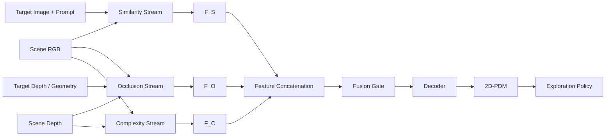
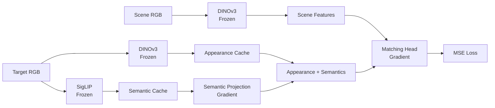

# 2D-PDM

### Zero-Shot Probability Distribution Mapping for Occluded Object Search in Cluttered Drawers

> **Research in progress**  
> RGB-D 관측으로 가려진 target object의 위치를 추론하고, 탐색 행동을 위한 pixel-wise probability map 생성

---

## Overview

사람의 물체 탐색에 사용되는 세 단서인 유사도, 가림 가능성, 장면 복잡도를 독립적인 probability stream으로 모델링함.

| Stream | 핵심 질문 | 출력 |
|---|---|---|
| **Similarity** | 타겟과 시각적·의미적으로 관련된 물체는 어디에 있는가? | Similarity feature `F_S` |
| **Occlusion** | 타겟이 다른 물체 아래에 물리적으로 가려질 수 있는가? | Occlusion feature `F_O` |
| **Complexity** | 해당 영역의 물체 더미가 얼마나 조밀하고 복잡한가? | Complexity feature `F_C` |



```text
F_fuse = FusionGate(Concat(F_S, F_O, F_C))
P_2D   = Sigmoid(Decoder(F_fuse))
```

최종 `P_2D`는 target의 위치 확률을 원 영상 좌표계에 표현하며, DRL action policy의 탐색 prior로 사용됨.

---

## From Shelf Search to Drawer Search

기존 선반 환경 연구를 비정형 drawer 환경으로 확장함.

> H. Jeon et al., *A study on deep reinforcement learning-based exploration intelligence for occluded object search*, Engineering Applications of Artificial Intelligence, 2026.

기존 연구는 similarity와 occlusion 기반 column-wise distribution을 사용함. 물체 유사도를 수동 정의한 category score에 의존하여 unseen object에 대한 zero-shot 탐색이 불가능했음.

주요 확장:

- 정규적인 shelf column에서 **비정형 cluttered drawer**로 확장
- Column-wise distribution에서 **pixel-wise 2D-PDM**으로 확장
- DINOv3의 dense appearance와 SigLIP의 language-aligned semantics 결합
- 학습하지 않은 target instance를 입력할 수 있는 zero-shot target conditioning
- Similarity와 Occlusion에 scene-level **Complexity stream** 추가

---

## Similarity Stream

> **Status: Implemented**

Similarity stream은 target 및 의미적으로 관련된 물체 영역을 활성화함. DINOv3의 dense appearance와 SigLIP의 image/text semantics를 결합하여 instance-level 외형과 category-level 의미를 함께 표현함.

### Design Rationale

| Component | 담당 정보 | 필요한 이유 |
|---|---|---|
| **DINOv3 Scene Encoder** | 위치가 보존된 dense visual feature | Scene의 어느 patch에 어떤 형상·질감·appearance가 있는지 표현 |
| **DINOv3 Target Encoder** | Target-specific appearance | “이 물체가 어떻게 생겼는가?”를 layer별 query로 표현 |
| **SigLIP Vision Encoder** | Target image semantics | 외형을 넘어선 open-vocabulary 개념 표현 |
| **SigLIP Text Encoder** | Target category semantics | 이미지가 모호해도 이름과 category 정보로 의미를 보완 |
| **Matching Head** | Scene–target spatial relation | Appearance, semantics, cosine cue를 함께 해석해 probability map 생성 |

### Architecture


### Model Specification

| Stage | Module | Input | Operation | Output | State |
|---:|---|---|---|---|---|
| 1 | Target preprocessing | Target RGB, mask | Crop, resize, mask alignment | `224 × 224` target crop | Fixed |
| 2 | Scene encoder | Scene RGB | DINOv3 ViT-B/16 layers `2, 5, 8, 11` | `X_s^l: B × 768 × H_p × W_p` | Frozen |
| 3 | Target encoder | Target crop, mask | DINOv3 + mask-weighted pooling | `a_t^l: B × 768` | Frozen |
| 4 | SigLIP vision | Target crop | Image encoding, L2 normalization | `s_img: B × 1152` | Frozen |
| 5 | SigLIP text | Category prompt | Text encoding, L2 normalization | `s_text: B × 1152` | Frozen |
| 6 | Semantic fusion | `s_img`, `s_text` | Average fusion, L2 normalization | `s: B × 1152` | Fixed |
| 7 | Semantic adapter | `s` | Independent `Linear(1152, 768)` per layer | `s_t^l: B × 768` | **Trainable** |
| 8 | Target fusion | `a_t^l`, `s_t^l` | Element-wise addition | `q_t^l: B × 768` | Fixed |
| 9 | Cosine matching | `X_s^l`, `q_t^l` | Patch-wise cosine, range shift | `c_hat^l: B × 1 × H_p × W_p` | Fixed |
| 10 | Interaction | Scene, target, cosine | Channel concatenation | `Z^l: B × 1537 × H_p × W_p` | Fixed |
| 11 | MatchingBlock | `Z^l` | `3×3 Conv → GN → ReLU → 1×1 Conv → GN → ReLU` | `F_l: B × 64 × H_p × W_p` | **Trainable** |
| 12 | Layer fusion | Four `F_l` tensors | Concat + 1×1 convolution | `F_S: B × 64 × H_p × W_p` | **Trainable** |
| 13 | Output head | `F_S` | 1×1 convolution | Learned logit `L_head` | **Trainable** |
| 14 | Cosine shortcut | `c_hat^2`, `c_hat^5` | Selected-layer average × learnable scale | Residual logit `alpha · c_skip` | **Trainable** |
| 15 | Output activation | `L_head`, residual logit | Addition + sigmoid | `P_S: B × 1 × H_p × W_p` | Fixed |
| 16 | Reconstruction | `P_S` | Bilinear interpolation | Full-resolution similarity map | Fixed |

### Target Representation

Segmentation mask 내부 patch만 pooling하여 target appearance 계산.

```text
a_t^l = L2Norm(
    Sum[M_t(u,v) · X_t^l(:,u,v)] /
    (Sum[M_t(u,v)] + epsilon)
)
```

SigLIP image/text embedding을 동일한 semantic space에서 결합.

```text
s_img  = L2Norm(SigLIP_Vision(target_crop))
s_text = L2Norm(SigLIP_Text("a photo of a {category}"))
s      = L2Norm((s_img + s_text) / 2)
s_t^l  = W_l · s + b_l
```

Appearance와 semantics를 합산하여 최종 target query 생성.

```text
q_t^l = a_t^l + s_t^l
```

| Vector | 의미 |
|---|---|
| `a_t^l` | Target이 시각적으로 어떻게 생겼는가 |
| `s_t^l` | Target이 의미적으로 어떤 category에 속하는가 |
| `q_t^l` | Appearance와 semantics가 결합된 layer-wise target condition |

### Scene–Target Interaction

Scene patch와 target query의 cosine similarity를 계산한 뒤 `[0, 1]`로 변환.

```text
c^l(u,v)     = CosineSimilarity(X_s^l(:,u,v), q_t^l)
c_hat^l(u,v) = (c^l(u,v) + 1) / 2
```

Scalar cosine score의 정보 손실을 보완하기 위해 scene feature와 target query를 함께 concat.

```text
Z^l(u,v) = Concat[
    X_s^l(:,u,v),   # scene appearance: 768 channels
    q_t^l,          # target condition: 768 channels
    c_hat^l(u,v)    # explicit matching cue: 1 channel
]
```

각 DINOv3 layer를 독립적인 MatchingBlock으로 처리한 뒤 channel 방향으로 결합. Main path는 layer `2, 5, 8, 11`을 모두 사용하고, cosine shortcut은 exact-instance 분별력이 높은 layer `2, 5`만 사용.

```text
F_l     = MatchingBlock_l(Z^l)
F_S     = Fuse(Concat[F_2, F_5, F_8, F_11])
L_head  = Head(F_S)
c_skip  = Mean[c_hat^2, c_hat^5]
P_S     = Sigmoid(L_head + alpha · c_skip)
```

`alpha`는 초기값 `2.0`의 학습 가능한 scalar. Shortcut layer는 160개 표본의 cosine-gap 분석으로 선정. 제외된 layer `8, 11`은 main matching path에서 계속 사용.

> **Implementation note**
> 현재 `c_hat^l`는 scene DINOv3 patch와 fused target query 사이의 cosine임. Pure-DINO appearance cosine이 아니므로 향후 `Cosine(X_s^l, a_t^l)`와 ablation 필요.

### Trainable Parameters

DINOv3와 SigLIP은 고정하고 semantic adapter와 matching head만 학습.

| Module | Parameters | State |
|---|---:|---|
| DINOv3 ViT-B/16 | Backbone parameters | Frozen |
| SigLIP SO400M | Encoder parameters | Frozen |
| Semantic projection `Linear(1152, 768) × 4` | 3,542,016 | **Trainable** |
| MatchingBlock × 4 | 3,559,168 | **Trainable** |
| Multi-layer fusion | 16,576 | **Trainable** |
| Similarity head | 65 | **Trainable** |
| Cosine shortcut scale `alpha` | 1 | **Trainable** |
| **Total trainable** | **7,117,826** | |

Checkpoint에는 task-specific layer만 저장하며, frozen backbone은 별도로 로드.

---

## Ground-Truth Similarity Map

Similarity GT는 scene segmentation과 asset category로 생성. 기존 연구와의 비교를 위해 명시적인 category relation 유지.

| Target–scene relation | Score |
|---|---:|
| Exact target instance | `1.0` |
| Same category | `0.8` |
| Related category | `0.5` |
| Other category | `0.2` |
| Background / unknown | `0.0` |

Category-level score:

| Target ↓ / Scene → | Book | Toy | Fruit | Packaged food |
|---|---:|---:|---:|---:|
| **Book** | 0.8 | 0.5 | 0.2 | 0.2 |
| **Toy** | 0.5 | 0.8 | 0.2 | 0.2 |
| **Fruit** | 0.2 | 0.2 | 0.8 | 0.5 |
| **Packaged food** | 0.2 | 0.2 | 0.5 | 0.8 |

Precomputed grayscale GT를 우선 사용하며, cache가 없으면 segmentation과 scene mapping으로 생성. 학습 시 DINOv3 patch resolution으로 average pooling.

```text
Y_patch = AvgPool2D(Y_full, kernel=16, stride=16)
L_sim   = MSE(P_S, Y_patch)
```

> 학습 GT의 category relation과 zero-shot evaluation은 별개임. Unseen target은 DINOv3와 SigLIP으로 직접 인코딩되며 해당 instance는 학습에서 제외.

---

## Training Protocol

### Data Split

동일 scene의 여러 camera view가 train/validation에 섞이지 않도록 `scene_id` 단위로 분할.

| Setting | Value |
|---|---|
| Train / validation | `80% / 20%` per target |
| Scene cameras | center, top, left, right, bottom |
| Target cameras | center, top, left, right, bottom |
| Environment stride | `10` |
| DINOv3 layers | `2, 5, 8, 11` |
| Batch size | `128` |
| Epochs | `100` |
| Optimizer | AdamW |
| Initial learning rate | `1e-3` |
| Scheduler | CosineAnnealingLR |
| Early stopping | patience `5`, relative improvement `5%` |
| Objective | Patch-resolution MSE |

### Cached and Trainable Paths



- Target별 5개 camera view의 DINOv3 appearance 사전 계산
- 학습 시 camera view 무작위 선택
- Validation 시 camera view 고정 순회
- Target별 SigLIP image/text embedding caching
- Gradient 유지를 위해 semantic projection은 training step 내부에서 적용

### Evaluation and Checkpoints

평가 지표:

- Mean squared error
- Pixel accuracy
- Balanced accuracy
- Intersection over Union

Checkpoint에는 trainable module만 저장.

```python
{
    "model_state": similarity_model.state_dict(),
    "semantic_proj_state": semantic_projection.state_dict(),
}
```

---

## Zero-Shot Target Conditioning

Target image를 query로 직접 인코딩하므로 unseen object 입력 가능.

| Mode | Target input | 특징 |
|---|---|---|
| **Image-only** | Target RGB | 별도의 category label 없이 visual/semantic image embedding 사용 가능 |
| **Image + text** | Target RGB + prompt | 물체 이름이나 category semantics로 모호한 외형을 보완 |

현재 category prompt 사용:

```text
a photo of a {category}
```

### Unseen Banana

Unseen banana 입력 시 fruit 영역 활성화 확인.

- DINOv3: target–scene dense appearance
- SigLIP: banana–fruit open-vocabulary semantics

<!--

-->

> **Planned evaluation:** object-held-out, category-held-out, DINOv3-only, SigLIP-only, image-only, image+text ablation.

---

## Occlusion Stream

> **Status: Data prepared / Model integration planned**

Occlusion stream은 target이 현재 보이는 물체 아래에 가려질 가능성을 추론.

| Input | 역할 |
|---|---|
| Scene RGB | 물체 영역과 visual context |
| Scene depth | 현재 보이는 표면까지의 거리 |
| Target RGB/depth | Target appearance와 상대 크기 |
| Target 3D geometry | 후보 pose에서의 실제 가림 여부 계산 |

Target mesh를 후보 위치·회전·scale에 배치하고, target depth가 scene surface 뒤에 위치하는 영역을 누적하여 GT 생성.

```text
Y_O(u,v) ∝ Sum over candidate poses [
    TargetDepth_pose(u,v) > SceneDepth(u,v)
]
```

Scale augmentation으로 절대 크기 암기를 억제하고 상대적 가림 관계 학습.

---

## Complexity Stream

> **Status: Formulation in progress**

Complexity stream은 object density, overlap, depth irregularity를 표현하는 target-independent scene prior.

| Cue | 의미 |
|---|---|
| Local object density | 단위 면적에 포함된 instance 수 |
| Local depth variance | 물체의 높이와 적층 변화 |
| Depth discontinuity | 물체 경계와 급격한 깊이 변화 |
| Overlap structure | 물체 간 가림과 적층 정도 |

```text
Y_C = lambda_n · ObjectDensity
    + lambda_d · LocalDepthVariance
    + lambda_e · DepthEdgeDensity
```

Fusion gate에서 Similarity·Occlusion evidence와 함께 Complexity의 상대적 중요도 조절.

---

## Project Status

| Component | Status |
|---|---|
| Drawer RGB-D and target-reference dataset | Complete |
| DINOv3 ViT-B/16 dense similarity baseline | Complete |
| DINOv3 + SigLIP Similarity stream | Complete |
| Unseen banana qualitative test | Complete |
| Layer-selective cosine shortcut | Training in progress |
| Object/category-held-out benchmark | Planned |
| Occlusion stream training | Planned |
| Complexity stream training | Planned |
| Three-stream fusion | Planned |
| Exploration policy integration | Planned |
| Sim-to-real drawer experiment | Planned |

### Core Files

| File | Purpose |
|---|---|
| `backbone.py` | Frozen DINOv3 multi-layer feature extractor |
| `target_utils.py` | Target crop, mask alignment, masked feature pooling |
| `similarity_model.py` | Scene–target interaction, MatchingBlocks, similarity head |
| `train_similarity_v2.py` | Multi-target DINOv3 + SigLIP training pipeline |
| `train_common.py` | Scene split, target caches, metrics, early stopping |
| `gt_similarity.py` | Category-based similarity-map generation |
| `precompute_gt.py` | Precomputed similarity GT cache |
| `paths_config.py` | Model, asset, dataset path configuration |

---

## Roadmap

- [x] Drawer scene and target RGB-D acquisition
- [x] Multi-layer DINOv3 ViT-B/16 representation
- [x] SigLIP image/text semantic fusion
- [x] Pixel-wise Similarity map training
- [x] Unseen target qualitative evaluation
- [x] Learnable cosine residual shortcut
- [x] Data-driven shortcut layer selection (`2 + 5`)
- [ ] Retrained layer-selective checkpoint evaluation
- [ ] Pure-DINO vs fused-query shortcut ablation
- [ ] Held-out object and category benchmark
- [ ] Occlusion stream
- [ ] Complexity stream
- [ ] Learned three-stream fusion
- [ ] DRL-based exploration policy
- [ ] Sim-to-real validation

---

## Development Log

Similarity stream의 가설, 실험 결과, 한계, 수정 사항을 단계별로 기록.

### 2026-07-21 · Phase 1 — DINOv3 Appearance Matching

**Reference:** `code_260721/train_similarity.py`

**가설:** Frozen DINOv3 feature 비교만으로 unseen target의 zero-shot similarity map 생성 가능.

```text
Scene RGB  → DINOv3 patch features X_s^l
Target RGB → DINOv3 masked-pooled vector a_t^l

c_hat^l = ShiftTo01(CosineSimilarity(X_s^l, a_t^l))
Z^l     = Concat[X_s^l, a_t^l, c_hat^l]
P_S     = CNN_Head(Z^l)
```

**결과:** 색상·재질·형상 등 appearance가 유사한 영역은 탐지했으나, category-level semantic relation은 표현하지 못함.

**결론:** Dense appearance matching만으로 target–category–scene 관계 표현 불가.

---

### 2026-07-27 · Phase 2 — CLS Prototype Category Conditioning

**Reference:** `code_260727/train_similarity.py`, `code_260727/train_common.py`

**가설:** Image-level CLS token을 category prototype으로 사용하면 patch feature보다 추상적인 category 정보 제공 가능.

Category별 CLS vector 평균으로 네 개의 prototype을 구성하고 unseen target CLS와 cosine similarity 계산.

```text
prototype_k = L2Norm(Mean[CLS(target_i) | category_i = k])

category_prob = Softmax(
    CosineSimilarity(CLS(unseen_target), prototype_k) / temperature
)
```

정답 누설 방지를 위해 leave-one-out prototype 사용. Category 확률을 spatial location에 broadcast한 뒤 interaction feature에 concat.

```text
Z^l = Concat[
    scene patch,
    target appearance,
    patch-wise cosine,
    category probability
]
```

**결과:** Category prior는 제공했으나 prototype도 DINOv3 appearance history의 평균이므로 외부 semantic grounding이 없음. 기존 prototype과 외형 차이가 큰 unseen object에서 category 추론 불안정.

**결론:** CLS prototype만으로 open-vocabulary semantics 확보 불가.

---

### 2026-07-28 · Phase 3 — DINOv3 + SigLIP Semantic Fusion

**Reference:** `code_260728_ver2/train_similarity_v2.py`

**수정:** DINOv3의 dense spatial representation을 유지하고, SigLIP의 language-aligned semantics를 target query에 추가.

```text
DINO appearance : a_t^l ∈ R^768
SigLIP semantics: s ∈ R^1152
Projection      : s_t^l = W_l · s + b_l
Target query    : q_t^l = a_t^l + s_t^l
```

SigLIP image/text embedding을 평균하고 layer별 projection으로 DINOv3 차원에 정렬. 두 backbone은 frozen으로 유지하고 projection과 matching head만 학습.

**결과:** Unseen banana 입력 시 fruit 영역 활성화 확인.

**결론:** SigLIP 결합으로 category-level zero-shot activation 확보.

---

### 2026-07-28 · Phase 4 — Exact-Instance Recovery with a Cosine Shortcut

**Reference:** `train_similarity_v2.py`, `similarity_model.py` in the project root

**문제:** Category-level zero-shot은 가능했으나 visible exact target도 same-category score인 약 `0.8`로 출력됨.

**가설:** Exact-target pixel 부족과 MatchingBlock의 category-level 일반화로 instance cue가 약화됨.

**수정:** 네 DINOv3 layer의 cosine 평균을 최종 logit에 더하는 residual shortcut 추가.

```text
L_head = Head(F_S)
c_avg  = Mean[c_hat^2, c_hat^5, c_hat^8, c_hat^11]

P_S = Sigmoid(L_head + alpha · c_avg)
```

CNN head는 category-level distribution을 학습하고 shortcut은 scene–target correspondence를 직접 전달. `alpha`는 학습 가능한 scalar.

**결과:** Checkpoint의 `alpha=1.8884`에도 exact target 출력이 same-category object보다 낮은 사례 확인. Layer별 shortcut 기여도 분석 필요.

현재 cosine은 scene DINOv3 patch와 fused query 사이에서 계산됨. 다음 ablation 후보:

1. **Fused-query shortcut:** `Cosine(X_s^l, a_t^l + s_t^l)` — 현재 구현
2. **Pure-appearance shortcut:** `Cosine(X_s^l, a_t^l)` — exact-instance recovery에 더 직접적인 대안

**결론:** Four-layer shortcut만으로 exact-instance와 same-category 분리 불가.

---

### 2026-07-29 · Phase 5 — Layer-Selective Cosine Shortcut

**Reference:** `similarity_model.py`, `train_similarity_v2.py` in the project root

**문제 재현:** `packaged_food_5` unseen target과 `packaged_food_1` scene으로 visible-target 평가. Raw cosine은 exact target을 1위로 판별했으나 최종 prediction에서 same-category object가 더 높게 출력됨.

| Scene region | Raw four-layer cosine | Final prediction |
|---|---:|---:|
| Exact target `World1` | `0.610` | `0.595` |
| Same-category mustard bottle | `0.591` | `0.598` |
| Rubik's cube | `0.580` | `0.390` |
| Apple | `0.571` | `0.413` |

Raw cosine gap은 약 `0.019`로 작았으며, learned head 출력에서 순위 역전 발생.

**분석:** 16개 target × 10개 표본, 총 160개 scene–target pair의 layer별 cosine gap 측정.

```text
gap_l = MeanCosine(exact target, layer l)
      - MeanCosine(same-category objects, layer l)
```

| DINOv3 layer | Mean gap ↑ | Std. ↓ | Median gap ↑ | Positive ratio ↑ |
|---:|---:|---:|---:|---:|
| **2** | **+0.0493** | 0.0832 | +0.0376 | 74% |
| **5** | +0.0464 | **0.0677** | **+0.0408** | **77%** |
| 8 | +0.0352 | 0.0559 | +0.0366 | 72% |
| 11 | +0.0384 | 0.0706 | +0.0177 | 69% |

**결과:** Layer 2는 mean gap이 가장 높고, layer 5는 표준편차가 가장 낮으며 median과 positive ratio가 가장 높음. Layer 8·11은 exact-instance 분별력이 상대적으로 낮음.

**수정:** Main path는 layer `2, 5, 8, 11`을 유지하고, shortcut만 layer `2 + 5` 평균으로 변경.

```text
F_S    = Fuse(F_2, F_5, F_8, F_11)
L_head = Head(F_S)

c_skip = Mean[c_hat^2, c_hat^5]
P_S    = Sigmoid(L_head + alpha · c_skip)
```

```python
# similarity_model.py
SKIP_LAYER_INDICES = (0, 1)  # requested DINOv3 layers 2 and 5
cos_skip = torch.stack(
    [cos_list[i] for i in SKIP_LAYER_INDICES], dim=0
).mean(dim=0)
logits = learned_logits + cos_skip_scale * cos_skip
```

비선형 cosine 증폭은 noise도 함께 증폭할 수 있어 제외. 표본 분석으로 shortcut layer를 선택하고 학습 가능한 `alpha`로 residual 크기 조절.

> **Current status — training in progress**
>
> Layer-selective shortcut checkpoint 학습 중. 학습 후 exact-target ranking, unseen-target semantic activation, held-out split 재현성 평가 필요. 현재 해결 여부 미확정.

**목표:** Same-category semantic generalization을 유지하면서 visible exact target의 우선순위 복원.
