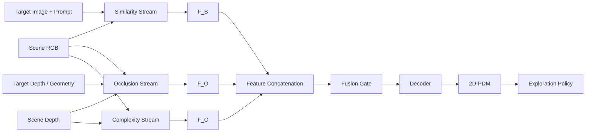
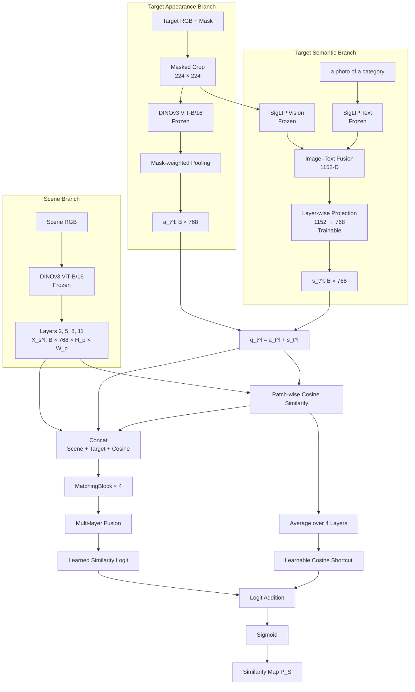
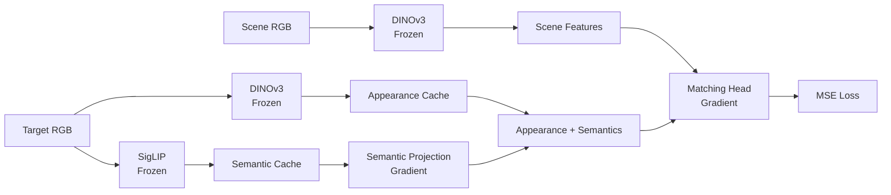

# 2D-PDM

### Zero-Shot Probability Distribution Mapping for Occluded Object Search in Cluttered Drawers

> **Research in progress**  
> RGB-D 관측만으로 다른 물체 아래에 완전히 가려진 target object의 존재 위치를 추론하고, 효율적인 탐색 행동을 위한 pixel-wise probability map을 생성합니다.

---

## Overview

사람은 서랍 속에서 보이지 않는 물체를 찾을 때 무작위로 물체를 제거하지 않습니다. 타겟과 비슷한 물체가 모인 곳을 살피고, 물체가 가려질 수 있는 공간을 추정하며, 더미가 얼마나 복잡하게 얽혀 있는지를 함께 판단합니다.

2D-PDM은 이 탐색 전략을 세 개의 독립적인 probability stream으로 모델링합니다.

| Stream | 핵심 질문 | 출력 |
|---|---|---|
| **Similarity** | 타겟과 시각적·의미적으로 관련된 물체는 어디에 있는가? | Similarity feature `F_S` |
| **Occlusion** | 타겟이 다른 물체 아래에 물리적으로 가려질 수 있는가? | Occlusion feature `F_O` |
| **Complexity** | 해당 영역의 물체 더미가 얼마나 조밀하고 복잡한가? | Complexity feature `F_C` |



```text
F_fuse = FusionGate(Concat(F_S, F_O, F_C))
P_2D   = Sigmoid(Decoder(F_fuse))
```

최종 `P_2D`는 target이 존재할 가능성이 높은 영역을 원 영상 좌표계에 표현하며, 이후 DRL 또는 다른 action policy의 probabilistic guidance로 사용됩니다.

---

## From Shelf Search to Drawer Search

본 프로젝트는 기존의 선반 환경 연구를 비정형 drawer 환경으로 확장합니다.

> H. Jeon et al., *A study on deep reinforcement learning-based exploration intelligence for occluded object search*, Engineering Applications of Artificial Intelligence, 2026.

기존 연구는 similarity와 occlusion을 결합한 column-wise distribution으로 탐색 방향을 결정했습니다. 하지만 물체 간 유사도를 사람이 정의한 category score에 의존했기 때문에, 학습에 존재하지 않았던 새로운 물체를 직접 해석하는 데 한계가 있었습니다.

이번 연구의 확장점은 다음과 같습니다.

- 정규적인 shelf column에서 **비정형 cluttered drawer**로 확장
- Column-wise distribution에서 **pixel-wise 2D-PDM**으로 확장
- DINOv3의 dense appearance와 SigLIP의 language-aligned semantics 결합
- 학습하지 않은 target instance를 입력할 수 있는 zero-shot target conditioning
- Similarity와 Occlusion에 scene-level **Complexity stream** 추가

---

## Similarity Stream

> **Status: Implemented**

Similarity stream은 현재 보이는 물체 중 target 자체 또는 target과 의미적으로 관련된 물체가 위치한 영역을 활성화합니다.

DINOv3만 사용하면 동일하거나 외형이 비슷한 instance를 찾는 데에는 유리하지만, 모양이 다른 두 물체가 같은 상위 category라는 관계는 안정적으로 표현되지 않을 수 있습니다. 이를 보완하기 위해 target 측에 SigLIP image/text semantics를 결합합니다.

### Design Rationale

| Component | 담당 정보 | 필요한 이유 |
|---|---|---|
| **DINOv3 Scene Encoder** | 위치가 보존된 dense visual feature | Scene의 어느 patch에 어떤 형상·질감·appearance가 있는지 표현 |
| **DINOv3 Target Encoder** | Target-specific appearance | “이 물체가 어떻게 생겼는가?”를 layer별 query로 표현 |
| **SigLIP Vision Encoder** | Target image semantics | 외형을 넘어선 open-vocabulary 개념 표현 |
| **SigLIP Text Encoder** | Target category semantics | 이미지가 모호해도 이름과 category 정보로 의미를 보완 |
| **Matching Head** | Scene–target spatial relation | Appearance, semantics, cosine cue를 함께 해석해 probability map 생성 |

### Architecture



### Model Specification

| Stage | Module | Input | Operation | Output | State |
|---:|---|---|---|---|---|
| 1 | Target preprocessing | Target RGB, mask | Crop, resize, mask alignment | `224 × 224` target crop | Fixed |
| 2 | Scene encoder | Scene RGB | DINOv3 ViT-B/16 layers `2, 5, 8, 11` | `X_s^l: B × 768 × H_p × W_p` | Frozen |
| 3 | Target encoder | Target crop, mask | DINOv3 + mask-weighted pooling | `a_t^l: B × 768` | Frozen |
| 4 | SigLIP vision | Target crop | Image encoding, L2 normalization | `s_img: B × 1152` | Frozen |
| 5 | SigLIP text | Category prompt | Text encoding, L2 normalization | `s_text: B × 1152` | Frozen |
| 6 | Semantic fusion | `s_img`, `s_text` | Average fusion, L2 normalization | `s: B × 1152` | Fixed |
| 7 | Semantic adapter | `s` | Independent `Linear(1152, 768)` per layer | `s_t^l: B × 768` | **Trainable** |
| 8 | Target fusion | `a_t^l`, `s_t^l` | Element-wise addition | `q_t^l: B × 768` | Fixed |
| 9 | Cosine matching | `X_s^l`, `q_t^l` | Patch-wise cosine, range shift | `c_hat^l: B × 1 × H_p × W_p` | Fixed |
| 10 | Interaction | Scene, target, cosine | Channel concatenation | `Z^l: B × 1537 × H_p × W_p` | Fixed |
| 11 | MatchingBlock | `Z^l` | `3×3 Conv → GN → ReLU → 1×1 Conv → GN → ReLU` | `F_l: B × 64 × H_p × W_p` | **Trainable** |
| 12 | Layer fusion | Four `F_l` tensors | Concat + 1×1 convolution | `F_S: B × 64 × H_p × W_p` | **Trainable** |
| 13 | Output head | `F_S` | 1×1 convolution | Learned logit `L_head` | **Trainable** |
| 14 | Cosine shortcut | Four `c_hat^l` maps | Layer average × learnable scale | Residual logit `alpha · c_avg` | **Trainable** |
| 15 | Output activation | `L_head`, residual logit | Addition + sigmoid | `P_S: B × 1 × H_p × W_p` | Fixed |
| 16 | Reconstruction | `P_S` | Bilinear interpolation | Full-resolution similarity map | Fixed |

### Target Representation

Target appearance는 segmentation mask가 포함하는 patch만 pooling하여 계산합니다.

```text
a_t^l = L2Norm(
    Sum[M_t(u,v) · X_t^l(:,u,v)] /
    (Sum[M_t(u,v)] + epsilon)
)
```

SigLIP semantic vector는 image와 text embedding을 같은 embedding space에서 결합합니다.

```text
s_img  = L2Norm(SigLIP_Vision(target_crop))
s_text = L2Norm(SigLIP_Text("a photo of a {category}"))
s      = L2Norm((s_img + s_text) / 2)
s_t^l  = W_l · s + b_l
```

최종 target query는 appearance와 semantics의 합입니다.

```text
q_t^l = a_t^l + s_t^l
```

| Vector | 의미 |
|---|---|
| `a_t^l` | Target이 시각적으로 어떻게 생겼는가 |
| `s_t^l` | Target이 의미적으로 어떤 category에 속하는가 |
| `q_t^l` | Appearance와 semantics가 결합된 layer-wise target condition |

### Scene–Target Interaction

각 scene patch와 target query의 cosine similarity를 계산하고 `[0, 1]` 범위로 변환합니다.

```text
c^l(u,v)     = CosineSimilarity(X_s^l(:,u,v), q_t^l)
c_hat^l(u,v) = (c^l(u,v) + 1) / 2
```

Cosine score만 사용하면 두 feature의 복잡한 관계가 하나의 scalar로 압축됩니다. 따라서 원본 scene feature와 target query를 함께 보존합니다.

```text
Z^l(u,v) = Concat[
    X_s^l(:,u,v),   # scene appearance: 768 channels
    q_t^l,          # target condition: 768 channels
    c_hat^l(u,v)    # explicit matching cue: 1 channel
]
```

각 DINOv3 layer는 독립적인 MatchingBlock을 통과하고, 네 결과를 channel 방향으로 결합합니다. 현재 모델은 여기에 cosine residual shortcut을 추가하여, cosine cue가 깊은 CNN 경로에서 희석되지 않고 최종 logit에 직접 도달하도록 합니다.

```text
F_l     = MatchingBlock_l(Z^l)
F_S     = Fuse(Concat[F_2, F_5, F_8, F_11])
L_head  = Head(F_S)
c_avg   = Mean[c_hat^2, c_hat^5, c_hat^8, c_hat^11]
P_S     = Sigmoid(L_head + alpha · c_avg)
```

`alpha`는 초기값 `2.0`에서 시작하는 학습 가능한 scalar입니다. 이 shortcut은 ResNet의 residual connection과 유사하게, exact-instance match처럼 학습 데이터에서 상대적으로 희귀한 신호가 출력까지 짧은 경로로 전달되도록 설계했습니다.

> **Implementation note**
> 현재 코드의 `c_hat^l`는 scene DINOv3 patch `X_s^l`와 fused target query `q_t^l = a_t^l + s_t^l` 사이의 cosine입니다. 따라서 엄밀한 DINOv3 appearance-only cosine이 아니라 SigLIP semantics가 투영된 target query와의 cosine입니다. 향후 ablation에서는 `Cosine(X_s^l, a_t^l)`를 사용하는 pure-appearance shortcut과 현재 fused-query shortcut을 비교할 예정입니다.

### Trainable Parameters

DINOv3와 SigLIP encoder는 고정하고 semantic adapter와 matching head만 학습합니다.

| Module | Parameters | State |
|---|---:|---|
| DINOv3 ViT-B/16 | Backbone parameters | Frozen |
| SigLIP SO400M | Encoder parameters | Frozen |
| Semantic projection `Linear(1152, 768) × 4` | 3,542,016 | **Trainable** |
| MatchingBlock × 4 | 3,559,168 | **Trainable** |
| Multi-layer fusion | 16,576 | **Trainable** |
| Similarity head | 65 | **Trainable** |
| Cosine shortcut scale `alpha` | 1 | **Trainable** |
| **Total trainable** | **7,117,826** | |

Only the lightweight task-specific layers are stored in the checkpoint; frozen foundation-model weights are loaded separately.

---

## Ground-Truth Similarity Map

현재 similarity supervision은 scene segmentation과 asset category를 이용해 생성합니다. Foundation model은 입력 representation을 일반화하지만, GT 자체는 기존 연구와의 직접 비교를 위해 명시적인 category relation을 유지합니다.

| Target–scene relation | Score |
|---|---:|
| Exact target instance | `1.0` |
| Same category | `0.8` |
| Related category | `0.5` |
| Other category | `0.2` |
| Background / unknown | `0.0` |

Category-level relation은 다음과 같습니다.

| Target ↓ / Scene → | Book | Toy | Fruit | Packaged food |
|---|---:|---:|---:|---:|
| **Book** | 0.8 | 0.5 | 0.2 | 0.2 |
| **Toy** | 0.5 | 0.8 | 0.2 | 0.2 |
| **Fruit** | 0.2 | 0.2 | 0.8 | 0.5 |
| **Packaged food** | 0.2 | 0.2 | 0.5 | 0.8 |

GT는 미리 계산된 grayscale map을 우선 사용하고, 캐시가 없으면 segmentation image와 scene mapping으로 즉시 생성합니다. 학습 시에는 원본 GT를 DINOv3 patch resolution으로 average pooling합니다.

```text
Y_patch = AvgPool2D(Y_full, kernel=16, stride=16)
L_sim   = MSE(P_S, Y_patch)
```

> 이 supervision과 zero-shot evaluation은 구분해야 합니다. 학습 GT는 category relation을 사용하지만, unseen target은 DINOv3와 SigLIP으로 직접 인코딩되며 target instance 자체는 학습에 포함되지 않습니다.

---

## Training Protocol

### Data Split

동일한 scene에서 생성된 center/top/left/right/bottom view가 train과 validation에 섞이면 data leakage가 발생합니다. 따라서 개별 image가 아니라 `scene_id` 그룹 단위로 분할합니다.

| Setting | Value |
|---|---|
| Train / validation | `80% / 20%` per target |
| Scene cameras | center, top, left, right, bottom |
| Target cameras | center, top, left, right, bottom |
| Environment stride | `10` |
| DINOv3 layers | `2, 5, 8, 11` |
| Batch size | `128` |
| Epochs | `100` |
| Optimizer | AdamW |
| Initial learning rate | `1e-3` |
| Scheduler | CosineAnnealingLR |
| Early stopping | patience `5`, relative improvement `5%` |
| Objective | Patch-resolution MSE |

### Cached and Trainable Paths



- Target DINOv3 appearance는 target별 다섯 camera view를 미리 계산합니다.
- 학습 시 camera view를 무작위 선택하여 lightweight viewpoint augmentation으로 사용합니다.
- Validation은 각 camera view를 고정 순회하여 무작위성에 따른 metric 변동을 줄입니다.
- SigLIP image/text embedding은 target별로 캐싱합니다.
- Semantic projection은 반드시 training step 안에서 적용하여 gradient가 유지되도록 합니다.

### Evaluation and Checkpoints

학습 중 다음 지표를 기록합니다.

- Mean squared error
- Pixel accuracy
- Balanced accuracy
- Intersection over Union

Checkpoint에는 학습되는 모듈만 저장합니다.

```python
{
    "model_state": similarity_model.state_dict(),
    "semantic_proj_state": semantic_projection.state_dict(),
}
```

---

## Zero-Shot Target Conditioning

Similarity stream은 target image를 query로 직접 인코딩하므로, 학습에 없던 물체도 새로운 query로 입력할 수 있습니다.

| Mode | Target input | 특징 |
|---|---|---|
| **Image-only** | Target RGB | 별도의 category label 없이 visual/semantic image embedding 사용 가능 |
| **Image + text** | Target RGB + prompt | 물체 이름이나 category semantics로 모호한 외형을 보완 |

현재 학습은 category prompt를 사용합니다.

```text
a photo of a {category}
```

### Unseen Banana

학습에 포함되지 않은 banana를 target query로 입력했을 때, scene에서 fruit category에 해당하는 영역이 활성화되는 정성적 결과를 확인했습니다.

이 결과는 다음 두 표현의 상호 보완성을 보여줍니다.

- DINOv3: target과 scene의 dense visual appearance
- SigLIP: banana와 fruit 사이의 open-vocabulary semantic relation

<!--

-->

> **Planned evaluation:** object-held-out, category-held-out, DINOv3-only, SigLIP-only, image-only, image+text ablation.

---

## Occlusion Stream

> **Status: Data prepared / Model integration planned**

Occlusion stream은 similarity와 별개로, target이 현재 보이는 물체 아래에 물리적으로 들어갈 수 있는지를 추론합니다.

| Input | 역할 |
|---|---|
| Scene RGB | 물체 영역과 visual context |
| Scene depth | 현재 보이는 표면까지의 거리 |
| Target RGB/depth | Target appearance와 상대 크기 |
| Target 3D geometry | 후보 pose에서의 실제 가림 여부 계산 |

GT 생성 시 target mesh를 drawer의 후보 위치·회전·scale에 가상 배치합니다. 렌더링된 target depth가 scene surface 뒤에 존재하는 영역을 누적하여 occlusion probability를 구성합니다.

```text
Y_O(u,v) ∝ Sum over candidate poses [
    TargetDepth_pose(u,v) > SceneDepth(u,v)
]
```

Scale augmentation은 모델이 특정 물체의 절대 크기를 암기하지 않고 scene과 target 사이의 상대적인 가림 관계를 학습하도록 합니다.

---

## Complexity Stream

> **Status: Formulation in progress**

Complexity stream은 target identity와 무관한 scene-level prior입니다. 물체가 많이 존재하는 것뿐 아니라, 서로 얼마나 겹치고 depth 구조가 얼마나 불규칙한지를 표현합니다.

| Cue | 의미 |
|---|---|
| Local object density | 단위 면적에 포함된 instance 수 |
| Local depth variance | 물체의 높이와 적층 변화 |
| Depth discontinuity | 물체 경계와 급격한 깊이 변화 |
| Overlap structure | 물체 간 가림과 적층 정도 |

```text
Y_C = lambda_n · ObjectDensity
    + lambda_d · LocalDepthVariance
    + lambda_e · DepthEdgeDensity
```

Complexity가 높다는 이유만으로 탐색 우선순위를 항상 높이면 비효율적일 수 있습니다. 따라서 Similarity와 Occlusion의 target-conditioned evidence를 함께 고려하도록 fusion gate에서 상대적 중요도를 조절합니다.

---

## Project Status

| Component | Status |
|---|---|
| Drawer RGB-D and target-reference dataset | Complete |
| DINOv3 ViT-B/16 dense similarity baseline | Complete |
| DINOv3 + SigLIP Similarity stream | Complete |
| Unseen banana qualitative test | Complete |
| Object/category-held-out benchmark | Planned |
| Occlusion stream training | Planned |
| Complexity stream training | Planned |
| Three-stream fusion | Planned |
| Exploration policy integration | Planned |
| Sim-to-real drawer experiment | Planned |

### Core Files

| File | Purpose |
|---|---|
| `backbone.py` | Frozen DINOv3 multi-layer feature extractor |
| `target_utils.py` | Target crop, mask alignment, masked feature pooling |
| `similarity_model.py` | Scene–target interaction, MatchingBlocks, similarity head |
| `train_similarity_v2.py` | Multi-target DINOv3 + SigLIP training pipeline |
| `train_common.py` | Scene split, target caches, metrics, early stopping |
| `gt_similarity.py` | Category-based similarity-map generation |
| `precompute_gt.py` | Precomputed similarity GT cache |
| `paths_config.py` | Model, asset, dataset path configuration |

---

## Roadmap

- [x] Drawer scene and target RGB-D acquisition
- [x] Multi-layer DINOv3 ViT-B/16 representation
- [x] SigLIP image/text semantic fusion
- [x] Pixel-wise Similarity map training
- [x] Unseen target qualitative evaluation
- [x] Learnable cosine residual shortcut
- [ ] Pure-DINO vs fused-query shortcut ablation
- [ ] Held-out object and category benchmark
- [ ] Occlusion stream
- [ ] Complexity stream
- [ ] Learned three-stream fusion
- [ ] DRL-based exploration policy
- [ ] Sim-to-real validation

---

## Development Log

이 프로젝트의 Similarity stream은 단일 설계에서 바로 완성된 것이 아니라, zero-shot 실패 원인을 단계적으로 분석하며 발전했습니다. 아래 로그는 각 실험의 가설, 구현, 관찰된 한계와 다음 설계로 이어진 이유를 기록합니다.

### 2026-07-21 · Phase 1 — DINOv3 Appearance Matching

**Reference:** `code_260721/train_similarity.py`

첫 번째 접근은 frozen DINOv3만으로 scene과 target을 표현하는 것이었습니다. DINOv3가 대규모 self-supervised pretraining을 거친 foundation model이므로, 학습하지 않은 target도 feature space에서 비교하면 zero-shot similarity map을 만들 수 있다고 가정했습니다.

```text
Scene RGB  → DINOv3 patch features X_s^l
Target RGB → DINOv3 masked-pooled vector a_t^l

c_hat^l = ShiftTo01(CosineSimilarity(X_s^l, a_t^l))
Z^l     = Concat[X_s^l, a_t^l, c_hat^l]
P_S     = CNN_Head(Z^l)
```

이 방식은 색상, 재질, 국소 형상과 같은 visual appearance가 유사한 영역을 찾는 데에는 유효했습니다. 그러나 연구에서 필요한 유사도는 단순한 외형 일치가 아니라 “바나나와 사과는 모두 과일이다”와 같은 category-level semantic relation입니다.

DINOv3 feature에도 일정 수준의 의미 정보가 포함되지만, 본 데이터와 학습 구조에서는 appearance cue가 더 지배적으로 나타났고 새로운 물체의 category relation을 안정적으로 전달하지 못했습니다. 결과적으로 원하는 형태의 zero-shot semantic activation을 얻지 못했습니다.

**Conclusion:** Dense appearance matching만으로는 target–category–scene object 관계를 충분히 표현할 수 없었습니다.

---

### 2026-07-27 · Phase 2 — CLS Prototype Category Conditioning

**Reference:** `code_260727/train_similarity.py`, `code_260727/train_common.py`

두 번째 접근에서는 DINOv3의 CLS token을 활용했습니다. Patch token이 위치별 appearance를 표현한다면 CLS token은 이미지 전체를 요약하므로 더 추상적인 category information을 제공할 수 있다고 보았습니다.

각 category에 속한 target들의 CLS vector를 평균하여 네 개의 prototype을 구성하고, 새로운 target의 CLS vector와 cosine similarity를 계산했습니다.

```text
prototype_k = L2Norm(Mean[CLS(target_i) | category_i = k])

category_prob = Softmax(
    CosineSimilarity(CLS(unseen_target), prototype_k) / temperature
)
```

학습 중 자기 자신이 prototype에 포함되어 정답을 누설하지 않도록 leave-one-out prototype을 사용했습니다. 계산된 `book / toy / fruit / packaged_food` 확률은 모든 spatial location에 broadcast한 뒤 scene–target interaction에 concat했습니다.

```text
Z^l = Concat[
    scene patch,
    target appearance,
    patch-wise cosine,
    category probability
]
```

이 방식은 category prior를 명시적으로 제공했지만, prototype 자체가 동일한 DINOv3 visual history의 평균이라는 한계가 있었습니다. 즉, category label을 부여하는 구조는 생겼지만 semantic grounding이 외부 언어 공간과 연결된 것은 아니었습니다. 새로운 물체의 geometry와 appearance가 기존 prototype에서 벗어나면 category 추론도 불안정해졌습니다.

**Conclusion:** CLS prototype은 유용한 visual category prior이지만, 원하는 open-vocabulary semantics의 근본적인 해결책은 아니었습니다.

---

### 2026-07-28 · Phase 3 — DINOv3 + SigLIP Semantic Fusion

**Reference:** `code_260728_ver2/train_similarity_v2.py`

세 번째 접근에서는 vision-language model인 SigLIP을 도입했습니다. 비교적 compact한 VLM을 사용하여 DINOv3의 dense spatial representation은 유지하면서, target 측에 language-aligned semantics를 추가했습니다.

```text
DINO appearance : a_t^l ∈ R^768
SigLIP semantics: s ∈ R^1152
Projection      : s_t^l = W_l · s + b_l
Target query    : q_t^l = a_t^l + s_t^l
```

SigLIP vision embedding과 category text embedding을 같은 semantic space에서 평균하고, layer별 projection으로 DINOv3 차원에 정렬했습니다. DINOv3와 SigLIP encoder는 frozen으로 유지하고 projection과 matching head만 학습했습니다.

이 구성에서 학습에 사용하지 않은 banana를 target으로 입력했을 때 fruit 영역이 활성화되는 결과를 확인했습니다. Appearance-only 또는 CLS-prototype 접근에서 부족했던 category-level semantic generalization이 vision-language representation을 통해 보완된 것입니다.

**Conclusion:** SigLIP 결합으로 unseen target에 대한 의미 기반 zero-shot activation이 가능해졌습니다.

---

### 2026-07-28 · Phase 4 — Exact-Instance Recovery with a Cosine Shortcut

**Reference:** `train_similarity_v2.py`, `similarity_model.py` in the project root

SigLIP 결합 후 category-level zero-shot은 가능해졌지만 새로운 문제가 확인되었습니다. Unseen target 자체가 scene에 직접 보이는 경우 GT는 exact instance에 `1.0`을 요구하지만, 모델 출력은 같은 category score인 약 `0.8` 수준으로 수렴하는 경향을 보였습니다.

학습 데이터에서 exact target pixel은 상대적으로 적고 same-category pixel은 훨씬 자주 등장합니다. 또한 cosine cue가 여러 MatchingBlock과 fusion head를 통과하는 동안 category-level pattern으로 일반화되면서, exact-instance signal이 약해졌을 가능성이 있습니다.

이를 보완하기 위해 네 DINOv3 layer에서 계산한 cosine map의 평균을 최종 head logit에 직접 더하는 residual shortcut을 추가했습니다.

```text
L_head = Head(F_S)
c_avg  = Mean[c_hat^2, c_hat^5, c_hat^8, c_hat^11]

P_S = Sigmoid(L_head + alpha · c_avg)
```

이 구조에서 CNN head는 category-level semantic distribution을 학습하고, shortcut은 매우 높은 scene–target correspondence를 출력까지 직접 전달하는 역할을 담당합니다. `alpha`는 고정 hyperparameter가 아니라 학습 가능한 scalar입니다.

현재 구현의 cosine은 scene DINOv3 patch와 `DINO appearance + SigLIP semantics`로 만든 fused query 사이에서 계산됩니다. 따라서 다음 실험에서는 아래 두 구조를 분리해 비교할 예정입니다.

1. **Fused-query shortcut:** `Cosine(X_s^l, a_t^l + s_t^l)` — 현재 구현
2. **Pure-appearance shortcut:** `Cosine(X_s^l, a_t^l)` — exact-instance recovery에 더 직접적인 대안

**Current objective:** Same-category semantic activation은 유지하면서, scene에 실제 target instance가 보일 때 해당 영역을 `1.0`에 가깝게 복원하는 것입니다.
