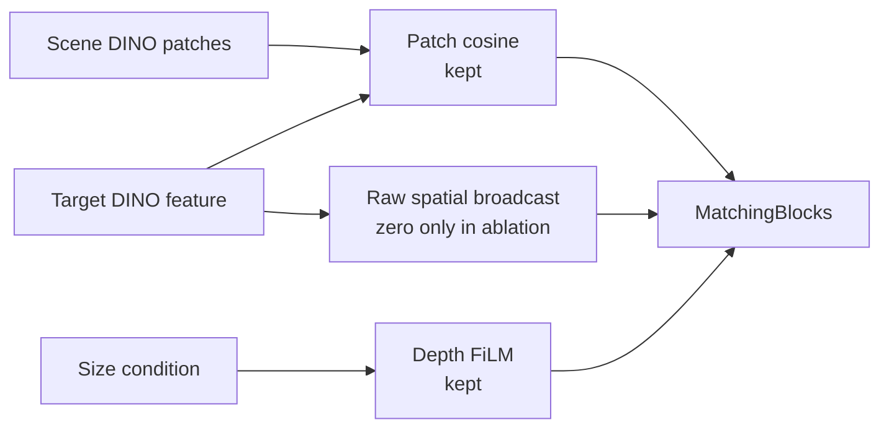
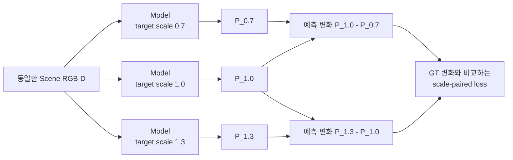
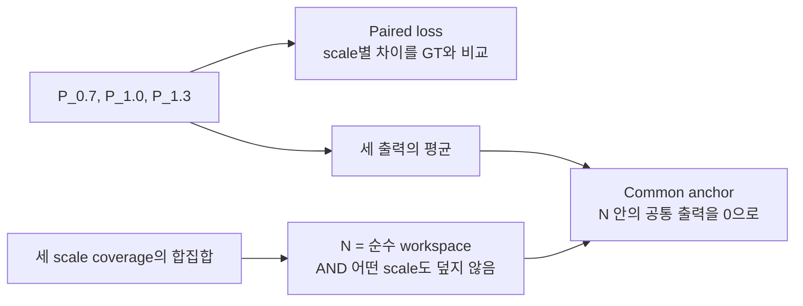

# 2D-PDM 연구 문맥·가정·실험 통합 기록

> 기준일: 2026-09-16 (Asia/Seoul) · 연구 이력: Phase 1–36 · 현재 마지막 실험: Phase 36 A
> 목적: 이전 대화와 연구 PC에 접근할 수 없는 독자·agent가 연구 내용을 이해하고 질문할 수 있도록 한 파일에 모은 공개 인수인계 문서
> 최신 상세 모델 설명: README의 세 stream 본문. 연구 상태·수치는 이 문서의 로컬 근거 대조 정정도 함께 반영함.

이 문서는 **현재 연구 문맥, 작업 지침, 근거 색인 전체와 Phase 1–36 Development Log, Complexity의 가정·실험·후속 계획 보고서 6개**를 합친 것이다. 단순 경로 안내만으로 끝내지 않고 방법·결과·실패·해석을 본문에 포함한다. 전체 대화와 터미널 출력의 원문 archive는 아니다. 저장되지 않은 과거 실행 내용을 복원했다고 주장하지 않는다.

모델별 상세 설명: `README.md` · 외부 공유용 원문 주소: `https://raw.githubusercontent.com/JeonHaneul/2D-PDM_DINOv3/main/agent.md`

## 읽는 순서와 현재 상태

처음에는 아래 현재 상태와 A를 읽고, “왜 이 방법을 쓰게 되었는가”는 B의 해당 Phase와 C의 상세 보고서를 읽는다. D는 근거 파일 위치를 찾기 위한 색인이다. 본문에 있는 과거 계획을 완료된 실험으로 읽지 않는다. 현재 상태를 바꾸지 않은 문서 정리·이미지 이동은 새 연구 Phase가 아니다.

| 주제 | 완료·확인한 것 | 남은 것·현재 해석 |
|---|---|---|
| Similarity | Frozen DINOv3 + SigLIP, layer별 projection, no-shortcut MatchingBlock; 미학습 target의 zero-shot 동작 정성 확인 | 공식 final checkpoint manifest 지정, 여러 미학습 target의 정량 성능 평가 |
| Occlusion GT | Target/yaw별 adaptive pose, 70% 이상 가림 판정, 16×3,000×5 = 240,000 maps | 실제 clutter 충돌·지지·안정성을 포함한 physics posterior가 아님 |
| Occlusion 학습 | Native68 global FiLM + raw target broadcast, full16 epoch 3; scene-heldout MAE 0.013997 | Coverage 내부 raw patch 평가. Coverage 밖 반응까지 보장하지 않음 |
| Occlusion 외부 평가 | `packaged_food_5`, 30 scene keys/150 views, MAE 0.017998 | 외부 target 하나·고정 합성 rig·정확한 reference mask; 최신 full16 standalone CLI 없음 |
| Complexity density | RGB-D count MAE 0.641416 vs depth-only 0.832717; 상대 22.973% 감소 | 가시 label-group 개수 예측이며 최종 구조적 Complexity GT가 아님 |
| Complexity 근접도·제거 | Phase 34 면적 통제 실패; Phase 35 근접도 평균과 정적 노출 비율 Spearman 0.078295 | 해당 물체 평균을 선택 점수·GT로 채택하지 않음 |
| Complexity 표현 A | Same-category 가시 asset 대응 DINO+position AUROC 0.998953 | GT가 고른 순수 patch 진단. 적격 coverage 42.40%, 경계·다중 물체 관계 미검증 |
| B/C 및 최종 결합 | 계획과 일부 준비 코드만 있음 | 추가 모델 설치·추론·B/C 비교 결과 없음. 최종 Complexity GT, three-stream fusion, DRL 통합 미완료 |

현재 다음 Step은 **실제 asset이 쌓인 장면에서 경계·분리된 조각의 소속·다중 물체 관계 중 기존 표현이 놓치는 능력과 관측 가능한 정답을 먼저 특정하는 것**이다. 이를 확인한 뒤 같은 region 조건에서 사전학습 표현의 추가 효과를 비교한다. 근접도→방향→최소 제거 횟수처럼 scalar 정의를 계속 대체하라는 요청이 아니다.

| 이 문서의 위치 | 내용 |
|---|---|
| A. 현재 프로젝트 문맥 | 목표, 데이터, 세 stream의 입력·모델·GT·loss, 결과, 한계, 실행 규약 |
| B. Phase 1–36 전체 상세 로그 | 단계별 가정·변경·결과·실패·당시 다음 Step, 공개 비교 그림 |
| C1. 정의 재검토 | Count/occupancy/면적·depth 반례, 당시 최근 5년 문헌, 후보 가정 |
| C2. 관측 근접도 | 거리 수식, GT teacher 조건, 통제 실패, 가시 표면의 한계 |
| C3. 정적 제거 | 실제 asset 재현, Isaac 초기 실패, 공통 표본 상관과 한계 |
| C4. 표현 A 완료 | Pair 구성, split·선택 조건, 모델·지표, 높은 AUROC의 해석 범위 |
| C5. B/C 계획 | Region grouping과 공간 표현의 효과를 분리하는 미실행 계획 |
| C6. 실행 가능성 조사 | 후보 모델·환경·용량·준비 상태; 실행 성공 기록과 구분 |
| D. 근거와 이미지 색인 | Current/legacy 구분, JSON·log·checkpoint·그림 위치, 기록 공백 |
| E. 인수인계·작업 규칙 | Source of truth, split·문서화·사용자 방향·게시 범위 |

## 근거의 접근 범위와 경로 읽는 법

**PUBLIC**은 이 repo에서 열리는 README·이 문서·`img/` 그림과 일부 `docs/complexity_results/` 자료다. **LOCAL**은 연구 PC에 보존한 현재 실행 코드, run JSON·checkpoint·원시 데이터 등으로 공개 원문이 포함되지 않은 자료다. **HISTORICAL/RECONSTRUCTED**는 당시 결과·부분 자료를 보존하거나 사후 정리한 이력이다. **PLANNED**는 아직 실행하지 않은 가설이다. 공개 여부와 실험의 타당성은 다른 문제다.

이 문서가 로컬 보고서의 **내용**을 포함하더라도 그 안에서 언급한 모든 원시 파일까지 공개한 것은 아니다. `outputs/`, `experiments/`, `legacy/`, 원본 데이터·model weight 경로는 PUBLIC 자료로 별도 명시하지 않은 한 LOCAL 근거 식별자다. 코드 이름만 적힌 항목도 공개 clone과 로컬 개발판이 다를 수 있다. 공개 clone의 코드만으로 최신 모든 결과를 재현할 수 있다고 가정하지 않는다.

`docs/`도 일부 자료만 공개되어 있다. 특히 `docs/readme_stream_restructure_20260916.json`, `docs/readme_stream_expansion_20260916.json`, `docs/image_path_migration_20260916.json`, 통합본 builder·publication manifest는 **LOCAL 관리 자료**다. C의 보고서들은 이 파일에 내용을 포함했으며, 같은 이름의 개별 파일이 공개 repo에도 있다는 뜻은 아니다.

| 기호 | 뜻 |
|---|---|
| `<DEV_ROOT>` | 실제 개발 폴더 `2D-PDM_DINOv3`; 연구 PC에서는 Git 저장소가 아님 |
| `<REPO_ROOT>` | 공개용 별도 clone `2D-PDM_DINOv3_git`; 이 GitHub repo |
| `<WORKSPACE_ROOT>` | 두 폴더와 데이터·asset 등이 있는 공통 작업 경로 |
| `<DATA_ROOT>` | 로컬 원본 `260714_data` |
| `<ASSET_ROOT>`, `<MODEL_ROOT>`, `<CAPTURE_ROOT>` | 로컬 USD assets, 사전학습 weights, scene 생성·capture 자료 |
| `<CONDA_ROOT>`, `<LOCAL_PDF_ROOT>`, `<USER_HOME>`, `<SESSION_ARCHIVE>` | 환경·참고 PDF·사용자 경로·세션 자료 위치를 일반화한 기호 |

개인 machine의 절대경로는 위 기호로 바꿨다. 명령 안의 기호는 실제 설치 경로로 치환해야 하며 웹에서 실행 가능한 URL이 아니다. 경로가 없거나 공개되지 않은 자료를 열어본 것처럼 답하지 않는다.

현재 코드와 **해당 run 시점**의 protocol/metadata/metric이 가장 직접적인 근거다. 그 다음은 현재 문맥의 해석, 공개 README, 과거 기록 순서로 읽는다. 숫자를 비교할 때 sample 수·seen/unseen·split·camera correlation·metric 집계·coverage를 함께 확인한다. 과거 성공한 oracle 입력과 현재 실제 입력을 섞지 않는다.

### 주요 공개 근거

- Similarity 상세 설명·Q&A (`README.md#similarity-stream`), Occlusion 상세 설명·Q&A (`README.md#occlusion-stream`), Complexity 상세 설명·Q&A (`README.md#complexity-stream`)
- Complexity V2 protocol 공개본 (`docs/complexity_results/protocol_public.json`), test 결과 (`docs/complexity_results/summary.json`), 정의 기술 통계 (`docs/complexity_results/gt_definition_audit_20260908.json`)
- Full16 book_1 패널 (`img/occlusion/full16_book_1_five_cameras.png`), 외부 packaged_food_5 패널 (`img/occlusion/zero_shot_packaged_food_5_test30.png`)
- 정적 제거 비교 (`img/complexity/clutter_comparison.png`), 표현 A 비교 (`img/complexity/representation_comparison.png`), 표현 A 큰 오차 예 (`img/complexity/failure_examples.png`)

### 문서 갱신 이력

- `1c63f1b`: Phase 35 정적 제거 결과·사진 공개.
- `1acc59e`: Phase 36 A 결과·사진 공개.
- `f34cb7c`: README 세 stream 구성 통일과 current full16 결과 그림 추가.
- `35de3f1`: 기존 이미지 45개를 `img/similarity/`, `img/occlusion/`, `img/complexity/`로 이동; byte 보존.
- `ebae00a`: 모든 stream의 입문 설명·차원·모듈 역할·수치 예·상세 Q&A 확장.
- 2026-09-16 본 통합본: 로컬 문맥·색인·상세 보고서 갱신 및 공개. 새 학습·렌더·GT 승인·Phase 37은 없음.

앞의 현재 상태는 뒤의 과거 가정과 미실행 제안을 해석하는 기준이다. 특히 문헌·모델 호환성 조사 내용은 각 보고서 작성 당시 확인 범위이며, 이번 문서 통합에서 웹 문헌이나 실행 성능을 새로 검증한 것은 아니다.

---

<a id="project-context"></a>

## A. 현재 프로젝트 문맥 전체

> 원본: `<DEV_ROOT>/PROJECT_CONTEXT.md`
> 원본의 설명·수치·경로 색인을 포함하며, 공개 환경에 맞게 제목·경로·연결만 조정했다.

> 마지막 갱신: 2026-09-16 (Asia/Seoul), Phase 36 가시 asset 대응 A probe 완료; B/C 미실행·도입 보류
> Similarity/Occlusion의 기존 교차검증 기준일: 2026-08-28
> 대상: `<DEV_ROOT>`
> 목적: 이전 대화를 보지 못한 agent가 현재 코드와 데이터로 연구를 안전하게 이어가기 위한 문서

이 문서는 대화를 그대로 옮긴 transcript가 아니다. 여러 달 동안 진행한 설계 논의, 구현, 실패한
가설, 검증 결과와 사용자 의도를 현재 파일과 결과 JSON에 맞춰 압축한 실행용 handoff다. 숫자와
구현이 충돌할 때는 이 문서보다 현재 코드와 해당 run의 metadata를 우선한다.

세부 Phase 기록과 실제 log/JSON/checkpoint/image의 위치는 `PROJECT_LOG_INDEX.md`에서 찾는다.
두 문서를 함께 읽어야 요약된 판단과 그 근거를 모두 추적할 수 있다.
2026-09-16 최신 사용자 요청으로 이 실행 문맥·근거 색인·작업 지침과 Phase 1–36 상세 기록을
GitHub root의 `agent.md`로 통합한다. 공개본은 외부 GPT의 연구 질의응답용이며 로컬 artifact의
경로를 적었다고 해당 파일·checkpoint가 GitHub에 게시된 것은 아니다.

---

### 1. 처음 읽는 agent를 위한 핵심 요약

> **Phase 35 이후 사용자 정정:** 우선순위는 새 scalar 정의가 아니라, Similarity의 SigLIP 결합처럼
> 물체·공간 관계 표현을 보완하는 것이다. DINO 자체의 정보 부족과 count 학습 목표의 한계를
> 먼저 구분한다. Phase 36 A 진단 (C4. 표현 A 완료 보고서)에서
> 순수 patch의 가시 asset 대응은 DINO+position AUROC 0.998953으로 거의 포화됐다.
> 다음은 경계·분리된 조각·다중 물체 관계의 구체적 누락 능력을 먼저 분리하는 것이다.
> B/C 후속 계획 (C5. B/C 계획)은 미실행이다.
> 아래에 남은 가림 방향/제거 횟수 제안은 당시 이력이며 새 GT·모델은 채택하지 않았다.


#### 연구 목표

Cluttered drawer에서 여러 물체에 가려져 현재 RGB 영상에 보이지 않는 target을 탐색하기 위한
zero-shot 2D Probability Distribution Map(2D-PDM)을 만든다. 입력은 기본적으로 다음과 같다.

- Drawer scene RGB
- Drawer scene depth
- 찾을 target의 reference RGB

최종 2D-PDM은 DRL agent가 확률이 높은 영역의 물체를 먼저 치우거나 관측하도록 탐색 prior로
사용할 계획이다. 이 연구는 사용자의 졸업논문인
`A study on deep reinforcement learning-based exploration intelligence for occluded object search`의
shelf 환경을 drawer 환경으로 확장하며, 기존 모델의 zero-shot 한계를 해결하는 것이 핵심이다.

#### 전체 framework

```text
Scene RGB + Target RGB/mask/text → Similarity → F_S ─┐
Scene RGB-D + Target RGB/mask    → Occlusion  → F_O ─┼→ Concat (계획)
Scene RGB-D + fixed references   → Complexity → F_C ─┘   │
                                  (density pilot)       ↓
                                        Learned fusion + P_2D (미구현)
                                                        ↓
                                        DRL 탐색 정책과 통합 (미구현)
```

세 stream의 의미는 서로 다르다.

- **Similarity:** 현재 보이는 물체가 target 또는 target과 의미적으로 얼마나 관련되는가
- **Occlusion:** 현재 clutter 구조에서 해당 target이 다른 물체에 가려질 수 있는 위치는 어디인가
- **Complexity:** 더미 내부에서 서로 다른 물체의 근접·가림·표면 구조가 어디에서 복잡한가.
  현재 count/occupancy 모델은 density pilot이며 이 구조적 복잡도 정의는 아직 검증되지 않음.

#### 현재 위치

| 구성 요소 | 현재 상태 | 다음 작업 |
|---|---|---|
| Similarity Stream | DINOv3 + SigLIP, no-shortcut 구현; 미학습 target의 zero-shot 동작 정성 확인 | 여러 미학습 target의 정량 평가와 재현성 metadata 보강 |
| Occlusion GT | 16 targets × 3,000 scenes × 5 cameras = 240,000 maps 생성 완료 | 현재 GT를 보존하고 필요할 때만 추가 external target 생성 |
| Occlusion model | Adaptive GT 기반 full16 10% baseline 학습·평가 완료 | 구조 확장보다 baseline 동결이 현재 판단 |
| External occlusion check | `packaged_food_5` 30 scenes × 5 views 평가 완료 | 여러 external target과 실제 RGB mask는 후속 검증 |
| Complexity Stream | Phase 36 A만 완료: 순수 patch 가시 asset 대응은 거의 포화; B/C 미실행·GT 미승인 | **경계·다중 물체 관계의 구체적 누락 능력을 먼저 분리한 뒤 사전학습 표현 보완 검토** |
| Three-stream fusion | 미구현 | Complexity GT 타당성 검증 후 GT·평가와 ablation 설계 |
| DRL integration | 미구현 | 2D-PDM fusion 이후 구현 |

현재 가장 중요한 판단은 다음과 같다.

1. 과거 fixed pose grid가 작은 target의 가능한 위치를 누락하여, 정상적인 예측 일부가 오류처럼
   보였음.
2. Target 크기와 회전각에 맞춘 adaptive GT로 이 문제를 수정함.
3. 복잡한 oracle/local-gate 모델 대신 단순한 `raw target broadcast + global FiLM` baseline을
   다시 학습했을 때 scene-heldout와 외부 target smoke test에서 충분히 좋은 결과를 얻음.
4. 이후 Phase 33에서 Complexity RGB-D pilot을 구현하고 depth-only보다 count MAE가 22.97%
   낮음을 확인함. 2026-09-08 재검토에서 이를 visible-density 예측 결과로 한정함.
   Phase 34에서 표면 근접도의 국소 반응을 확인했지만, 면적 통제 실패와 숨겨진 구조 한계가
   남아 GT는 승인하지 않음. Phase 35에서 실제 더미 10 layouts의 정적 제거 효과를 확인했으나
   물체별 평균 근접도는 면적/count보다 유리하지 않았음(새 노출 비율과 평균 순위 상관 0.078).
   가림 방향 정보 검증은 당시 후속 제안이었다. 정형 도형 실험 확대는 우선순위가 아니다.
5. Phase 36 A probe에서 DINO+position은 same-category 가시 asset 대응 AUROC 0.998953을 얻음.
   이는 순수 patch ≥90%의 제한된 진단이며 경계·다중 물체 관계 이해의 증거가 아님.
   B/C를 바로 추가하지 않고 구체적으로 빠진 능력과 이를 판별할 평가를 먼저 고정한다.

---

### 2. 연구 질문과 zero-shot의 정확한 의미

이 프로젝트에서 zero-shot이라는 말은 세 수준을 구분해야 한다.

1. **Encoder availability:** 학습하지 않은 target도 frozen DINOv3/SigLIP으로 vector화할 수 있음.
2. **Model generalization:** 학습하지 않은 target vector를 trainable head가 올바르게 사용함.
3. **Deployment generalization:** 실제 RGB, 다른 camera/FOV, 실제 mask 오차, sim-to-real에서도 동작함.

현재 Similarity는 Banana와 `packaged_food_5`를 추가 학습 없이 query로 사용하여 관련 물체 영역을
활성화하는 zero-shot 동작을 정성적으로 확인했다(2번). Fruit와 packaged-food category는 학습에
포함된 seen-category/unseen-instance 조건이다. 여러 미학습 target의 평균 성능과 실패 조건을
측정하는 정량 object-heldout 평가가 후속 작업이다.
현재 Occlusion은 합성 환경의 `packaged_food_5` 한 개로 2번의 smoke evidence를 얻었지만,
geometry에 합성 segmentation mask를 사용했으므로 3번은 아직 증명하지 않았다.
Complexity Phase 33은 기존 asset library의 scene-heldout pilot이며, 학습하지 않은 scene 물체에 대한
일반화나 arbitrary camera/sim-to-real 결과는 아직 없다.

Frozen backbone을 쓴다는 사실만으로 zero-shot이 자동 보장되지 않는다. 그 위의 학습 가능한 head가
16개 target을 외울 수 있으므로, 외부 asset으로 target-heldout 평가가 반드시 필요하다.

---

### 3. Source of truth와 작업 경로

#### 경로

| 용도 | 경로 | 주의 |
|---|---|---|
| 실제 개발 코드 | `<DEV_ROOT>` | Git 저장소가 아님 |
| GitHub clone | `<REPO_ROOT>` | `main`, remote `JeonHaneul/2D-PDM_DINOv3` |
| 원본 데이터 | `<DATA_ROOT>` | 대용량, 임의 이동·삭제 금지 |
| USD assets | `<ASSET_ROOT>` | 원본 16개와 added target 포함 |
| Scene/target 생성 | `<CAPTURE_ROOT>` | Isaac Sim 관련 코드와 결과 |
| DINOv3 weights | `<MODEL_ROOT>` | ViT-B/16 등 로컬 checkpoint |
| PDF 원안 | `<LOCAL_PDF_ROOT>/2D PDM_ver2.pdf` | 초기 2D-PDM 설계 |
| 졸업논문 | `<LOCAL_PDF_ROOT>/A study on deep reinforcement learning-based exploration intelligence for occluded object search.pdf` | Shelf 연구 배경 |

#### 문서·코드 우선순위

1. 현재 root 실행 코드와 run의 `protocol.json`, `summary.json`, metadata
2. 이 `PROJECT_CONTEXT.md`
3. 최신 public narrative인 `2D-PDM_DINOv3_git/README.md`
4. 오래된 `2D-PDM_DINOv3/README2.md`, 코드 주석, `code_2607xx`, `legacy/occlusion`

중요한 현재 상태:

- Working folder의 `README2.md`는 2026-08-06 수준에서 멈춘 오래된 문서다.
- 연구 색인은 Phase 1–36을 연결한다. 공개 README의 최신 반영 범위와 commit은 Git HEAD에서
  확인하며, 최신 수치는 working root의 각 run JSON과 이 문서를 우선한다.
- Git clone의 코드 일부는 working folder보다 오래됐거나 누락되어 있다.
- 2026-08-28에는 `742d903`을 확인했으며, 2026-09-07 Complexity 코드·실험 자료·README Phase 33을
  `main`의 `a15a4b3`으로 commit/push했다. 이후 2026-09-08 GT 정의 재검토를 `85bb324`로 push했다.
  Phase 34의 텍스트 요약을 `6e58cdd`로 commit/push했다. 이후 사용자가 **Development Log에는
  사진과 결과를 함께 게시**하도록 정정했다. 로그의 비교 그림·수치·실패 기록은 공개하되,
  구현 코드와 채택된 방법 설명은 검증된 내용만 반영한다. 최신 게시 이력은 Git HEAD를 확인한다.
  `c8afd26`에서 README Phase 34의 결과 표와 비교 그림 8장을 게시했다. 실험 코드는 포함하지 않았다.
  2026-09-16 `1c63f1b`에서 Phase 35 정적 제거 진단의 README·비교 그림 4장만 게시했다.
  로컬/원격 main 일치와 clean 상태를 확인했다. 새 실험 코드·원시 결과는 로컬에 보존했다.
  같은 날 `1acc59e4913173925f6702aab3935d9216b9d520`에서 Phase 36 A 진단의 README와
  비교 그림 2장만 push했으며 로컬/원격 main 일치·clean을 확인했다. 코드·checkpoint·NPZ는 게시하지 않았다.
- 2026-09-16 `f34cb7c`에서 README의 세 stream 본문을 목적·구조·모듈·GT/학습·핵심 과정·FAQ로
  통일했다. 현재 full16 book_1 결과 그림 한 장을 추가하고 과거 구조와 현재 baseline을 분리했다.
  Phase 1–36의 개별 기록은 변경하지 않았다. 이 게시에는 README와 검증된 그림만 포함했다.
- 같은 날 `35de3f1`에서 공개 이미지 45개를 `img/similarity/`, `img/occlusion/`,
  `img/complexity/` 세 폴더로 모았다. 이미지 byte는 보존하고 문서 링크를 갱신했다.
- 같은 날 `ebae00a`에서 사용자 정정에 따라 세 stream의 설명을 다시 확장했다. 공통 기초 용어,
  입력에서 출력까지의 차원 변화, 모듈 역할·비교표, 수치 예·도식, 상세 FAQ를 추가했다.
  GitHub에는 README 한 파일만 게시했고 Phase 1–36과 기존 이미지 경로는 그대로 보존했다.
  원격 main 일치·clean을 확인했다. 검토 기록은 `docs/readme_stream_expansion_20260916.json`이다.
- 따라서 **코드는 working folder**, **공개 설명은 Git clone README**를 기준으로 읽는다.

`2D-PDM_DINOv3_git`은 working folder가 Git repository가 아니어서 GitHub 반영을 위해 만든 별도
clone이다. 실험 코드가 자동으로 그곳에 동기화되는 구조가 아니다. 주요 milestone의 README와
로그용 이미지·결과만 선별하며, 미검증 실험 코드·checkpoint는 staging에서 제외한다. GitHub CLI는 `JeonHaneul`
계정으로 인증되어 있었지만, 실제 push 직전 `gh auth status`와 remote를 다시 확인하며 token 값은
로그나 문서에 노출하지 않는다.

`<WORKSPACE_ROOT>/.agents`와 `.codex`는 현재 비어 있는 environment placeholder이며 이
프로젝트 문맥을 저장하는 폴더가 아니다. Agent가 자동으로 발견할 지침은 `AGENTS.md`에 두고,
상세 문맥은 이 파일로 연결한다.

---

### 4. 폴더 구조

```text
<WORKSPACE_ROOT>/
├── AGENTS.md                         # src에서 시작한 agent를 이 문서로 안내
├── 2D-PDM_DINOv3/                    # 실제 개발 폴더
│   ├── AGENTS.md
│   ├── PROJECT_CONTEXT.md            # 현재 문서
│   ├── backbone.py                   # frozen DINOv3 wrapper
│   ├── similarity_model.py           # Similarity head + MatchingBlock
│   ├── train_similarity_v2.py        # 현재 Similarity trainer
│   ├── inference_zeroshot.py          # Similarity inference
│   ├── train_common.py
│   ├── target_utils.py
│   ├── gt_similarity.py
│   ├── precompute_gt.py
│   ├── generate_occlusion_map.py      # 현재 production Occlusion GT generator
│   ├── generate_occlusion_gt_batched_v2.py
│   ├── depth_rasterizer_gpu.py
│   ├── mesh_utils.py / mesh_cache.py
│   ├── occlusion_dataset.py
│   ├── occlusion_model.py
│   ├── train_occlusion.py             # 현재 full16 trainer
│   ├── evaluate_occlusion_checkpoint.py
│   ├── inference_occlusion.py         # 주의: 과거 A_XYZ_RING 전용
│   ├── occlusion_target_input.py      # 주의: 과거 A_XYZ_RING 전용
│   ├── complexity_cues.py            # visible-count GT와 직접 depth geometry
│   ├── complexity_model.py           # 55 learned + 9 direct → F_C64
│   ├── run_complexity_pilot.py        # RGB-D / depth-only 통제 학습·평가
│   ├── inference_complexity.py        # segmentation 없이 RGB-D + fixed rig 추론
│   ├── code_2607xx/                   # Similarity 단계별 snapshot
│   ├── outputs/                       # checkpoint, metric, prediction panel
│   ├── experiments/                   # 현재 보존할 소규모 검증 자료
│   ├── legacy/occlusion/              # 약 194GB의 이전 Occlusion 실험 archive
│   └── tests/
├── 2D-PDM_DINOv3_git/                # GitHub clone; 실제 개발 폴더와 별개
├── 260714_data/
│   ├── scene/<target>/{rgb,depth,seg}/
│   ├── target/<target>/{rgb,depth,seg,mapping.json}
│   ├── GT_data/<target>/*.png         # 현재 Similarity trainer가 실제 참조
│   ├── similarity_map/<target>/*.png  # 공개 명칭의 동일 형식 map
│   └── occlusion_map/
│       ├── <target>/*.png
│       ├── _coverage/<target>/N_all_<camera>.npy
│       └── _metadata/...
├── asset/
│   ├── Book, Fruit, Packaged_food, Toy
│   ├── added/                         # Banana, Lemon, Peach 등 외부 target
│   └── drawer.usd
├── scene_generator/
└── model/
```

`legacy/occlusion`은 실행 entrypoint가 아니다. 과거 절대경로와 오래된 protocol을 포함하므로
연구 이력 확인 용도로만 사용한다. 사용자 요청 없이 삭제하지 않는다.

---

### 5. 데이터 inventory와 naming

#### 원본 16 targets

```text
book_1..4
fruit_1..4
packaged_food_1..4
toy_1..4
```

모든 16개 기존 target을 training에 사용한다. Zero-shot을 만들기 위해 기존 16개 중 일부를
제외하지 않는다. 평가에는 `packaged_food_5`, Banana, Peach 같은 added target을 사용한다.

#### Scene 데이터

- Target당 10 scene IDs
- Scene ID당 300 environment indices
- Environment당 5 cameras: `center`, `left`, `right`, `top`, `bottom`
- Target당 3,000 scene keys × 5 = 15,000 RGB, 15,000 depth, 15,000 segmentation images
- 전체 scene 폴더 약 343GB
- 파일 예: `scene00001_env0149_center.png`, `scene00001_env0149_center.npy`

다섯 camera는 서로 독립 scene이 아니라 같은 scene의 correlated views다. Train/validation/test
split 시 하나의 scene key에 속한 다섯 view를 반드시 같은 split에 둔다.

#### Target reference

- 원본 target당 고정 frame 한 개 × 5 cameras
- RGB, depth, segmentation, `mapping.json`
- Similarity는 학습 중 target camera를 무작위로 선택하고 validation에서는 5개 view를 모두 확인한다.
- 현재 Occlusion full16 baseline은 center camera 하나를 모든 scene camera의 target reference로 쓴다.

#### GT

- `similarity_map`: 240,000 PNG, 약 1.4GB
- `GT_data`: 240,000 PNG, 약 1.4GB
- `occlusion_map`: 240,000 PNG + coverage/metadata, 총 240,274 files, 약 4.5GB

현재 `paths_config.py`의 Similarity path는 이름 변경 전의 `GT_data`를 참조한다. `similarity_map`과
파일 수는 같고 확인한 표본 hash도 동일했지만 전체 byte-for-byte audit은 하지 않았다. 다음 agent가
path를 바꾸려면 먼저 두 디렉터리 전체 동등성 또는 regeneration provenance를 확인해야 한다.

---

### 6. Similarity Stream

#### 6.1 목적

Scene에서 target 자체가 보이는 위치와, target과 의미적으로 관련된 물체 영역을 활성화한다.
DINOv3만 사용했을 때 색, 재질, 모양 같은 appearance에는 강했지만 category 관계를 안정적으로
표현하지 못했기 때문에 SigLIP semantic condition을 추가했다.

#### 6.2 현재 입력과 tensor 흐름

640×480 scene을 DINOv3 ViT-B/16에 넣으면 16×16 pixel 단위의 30×40 patch grid가 된다.
각 patch는 768개의 latent feature를 가진다.

```text
Scene RGB B×3×480×640
  └─ frozen DINOv3 ViT-B/16, layers 2/5/8/11
      └─ layer별 scene patch B×768×30×40

Target RGB + segmentation mask
  ├─ bbox crop + 25% padding → 224×224
  ├─ frozen DINOv3
  │   └─ mask-weighted pooling → layer별 appearance a_l: B×768
  └─ center crop → frozen SigLIP image 1152-D
      + instance/category text prompt 1152-D
      └─ normalized mean semantic s: B×1152
          └─ layer별 learned Linear 1152→768

Hybrid query: q_l = a_l + W_l s + b_l
```

SigLIP vector를 DINO vector에 원형 그대로 더하지 않는다. 네 개의 학습 가능한 projection이
각 DINO layer의 768-D 공간에 맞게 변환한 뒤 더한다. 이 결합은 frozen DINO output을 변조하는
오류가 아니라, appearance vector를 semantic 방향으로 보정한 **새로운 target query**를 만드는
의도적인 연산이다. 다만 query는 더 이상 순수 DINO feature가 아니다.

Layer별 scene–target interaction:

```text
cos_l(u,v) = cosine(scene_l(u,v), q_l)       # 위치마다 scalar 한 개
Z_l(u,v) = Concat(scene 768, query 768, cosine 1)
          = 1,537 channels at each 30×40 location
```

Cosine 결과는 scene 전체 scalar 하나가 아니라 `B×1×30×40` map이다. 각 patch 위치마다 target과
얼마나 비슷한지 하나의 값이 남는다. 그러나 cosine 하나는 768-D 관계를 압축하므로, banana와
노란 toy가 왜 비슷한 값인지 구분하기 어렵다. 따라서 원본 scene feature와 hybrid target query도
함께 MatchingBlock에 제공한다.

#### 6.3 MatchingBlock의 역할

각 DINO layer마다 독립적인 block을 사용한다.

```text
1,537 channels
  → 3×3 Conv, 64 channels
  → GroupNorm(8), ReLU
  → 1×1 Conv, 64 channels
  → GroupNorm(8), ReLU
```

- Patch-wise cosine은 고정 수식으로 현재 patch와 target의 직접 유사도를 측정한다.
- MatchingBlock은 cosine, raw scene, raw target query와 3×3 이웃 문맥을 이용해 그 유사도를
  최종 map에서 얼마나 믿을지 학습한다.
- MatchingBlock은 cosine을 다시 계산하거나 patch-to-patch correspondence를 수행하지 않는다.

네 layer의 64-channel 결과를 concat하면 256 channels가 된다. `1×1 Conv`로 64 channels인
`F_S`로 fusion하고, 마지막 `1×1 Conv + sigmoid`가 `1×30×40` similarity map을 만든다.
필요하면 bilinear interpolation으로 480×640에 표시한다.

현재 trainable parameter는 약 7.12M이다.

- 네 semantic projections: 약 3.54M
- 네 MatchingBlocks: 약 3.56M
- Fusion과 output head: 약 0.017M
- DINOv3와 SigLIP은 frozen이며 checkpoint에 저장하지 않는다.

Current trainer는 `category_dim=0`으로 model을 만들기 때문에 과거 CLS prototype category channel은
사용하지 않는다. Output에 cosine을 직접 더하는 shortcut도 없다.

#### 6.4 Similarity GT

Segmentation의 asset label/category 관계에 따라 score를 지정한다. 아래는 색 mapping이 유일할 때의 규칙이다.

| 관계 | GT score |
|---|---:|
| Target asset label과 동일 | 1.0 |
| 같은 category | 0.8 |
| 관련 category: book↔toy, fruit↔packaged_food | 0.5 |
| 그 외 물체 | 0.2 |
| Background/unknown | 0.0 |

이 map은 target 위치의 calibrated posterior가 아니라 사람이 정의한 relation score를 회귀하는
learned similarity map이다. 480×640 GT를 16×16 average pooling하여 30×40에서 MSE로 학습한다.
2026-09-16 README 코드 대조에서 `build_color_to_score()`는 BGR을 dictionary key로 사용하여
서로 다른 asset의 색 충돌 시 뒤 score가 앞 값을 덮을 수 있음을 확인했다. 학습은 precomputed
GT를 우선 읽으며 기존 Similarity GT의 충돌 영향은 소급 정량 audit하지 않았다. 원본 GT·수치는 변경하지 않았다.

#### 6.5 Training protocol

- Entry: `train_similarity_v2.py`
- 모든 기존 16 targets 사용
- Target당 10 scene IDs를 80/20으로 scene 단위 분할
- `ENV_STRIDE=10`: environment 0, 10, ..., 290 사용
- Train: 16×8×30×5 = 19,200 samples
- Validation dataset: 16×2×30×5 = 4,800 scene samples
- Validation은 각 scene sample마다 target reference 5 cameras를 모두 평가하여 24,000 comparisons
- Batch 128, AdamW lr 1e-3, cosine scheduler, max 100 epochs, patience 5
- DINO layers: 2, 5, 8, 11

주의:

- Source 주석의 “15 targets / packaged_food_1 제외”는 오래된 설명이다. 실제 `TARGETS`와 데이터는 16개다.
- `SPLIT_SEED=None`일 때 한 seed를 선택하여 stdout에 출력하지만 checkpoint/log에 보존하지 않는다.
- Checkpoint에는 head와 semantic projection state만 있어 정확한 run 재현 metadata가 부족하다.
- Reported accuracy/IoU는 `|pred-GT| < 13/255` tolerance를 사용한 프로젝트 전용 지표다.

#### 6.6 현재 결과와 한계

현재 architecture와 호환되는 가장 강한 명확한 no-shortcut 후보는
`outputs/multi_target_20260728_114403_siglip/similarity_head_best.pt`이다. Log에
저장된 마지막 best epoch는 21이며 반올림 validation MSE는 `0.00027`, tolerance IoU-like 값은
`0.8588`이다. Seen-asset scene validation 결과이며 외부 target 정량 성능이 아니다. 공식 final checkpoint를 별도 manifest로
지정하지 않았으므로 재사용 전 strict state load와 provenance 확인이 필요하다.

`20260728_162631`과 `20260729_114650` run은 이후 shortcut parameter를 포함하여 현재 no-shortcut
model과 strict load가 호환되지 않는다. 단순히 날짜가 최신이라는 이유로 선택하면 안 된다.

Qualitative evidence:

- 학습하지 않은 `packaged_food_5`에서 same-category 영역 활성화
- 학습하지 않은 Banana query에서 fruit 영역 활성화. 공개 패널 3장이 보존되어 있으며 파일명의
  Book/Avocado/Orange는 scene 식별자다. 정확한 run/checkpoint 연결과 정량 benchmark는 미확인이다.

위 사례에서 unseen-instance zero-shot 동작을 정성적으로 확인했다. 후속 평가·분석 항목은 다음과 같다.

- 여러 미학습 target의 평균 성능·실패 조건을 측정하는 object-heldout 정량 benchmark
- 학습에서 category 전체를 제외하는 category-heldout 평가(일반화 범위를 넓히는 별도 실험)
- DINO-only vs SigLIP-only
- Image-only vs image+text
- Text prompt swap
- 여러 external target의 반복 평가
- Target RGB-only preprocessing 검증

`inference_zeroshot.py`도 raw RGB 한 장만 받는 구조가 아니다. `target_dir/rgb`, `seg`,
`mapping.json`이 필요하며, image-only 실행은 가능하지만 image+text로 학습한 model에는 distribution
shift가 된다.

#### 6.7 Similarity 개발 이력

| 시기 | 시도 | 결과와 판단 |
|---|---|---|
| Phase 1, 2026-07-21 | DINOv3 patch appearance + cosine + head | 색·재질·형상 유사도는 반응했지만 category semantics와 zero-shot 관계가 부족함 |
| Phase 2, 2026-07-27 | DINO CLS를 category별 평균 prototype으로 사용 | Training appearance history의 평균에 가까워 외형이 다른 unseen object의 의미 해결책이 되지 못함 |
| Phase 3, 2026-07-28 | Frozen SigLIP image/text semantic + layer projections | Unseen packaged-food 및 Banana에서 same-category 정성 활성화 확인 |
| Phase 4, 2026-07-28–29 | DINO cosine output shortcut, layer 2/5, raw cosine, patch matching, CLS/ranking 진단 | Exact instance와 same-category 분리가 거의 개선되지 않았고 competitor도 함께 활성화됨. Shortcut 제거 |

Phase 4의 핵심 교훈은 appearance cosine을 output에 직접 더한다고 instance matching이 자동 해결되지
않는다는 것이다. 현재 root model은 no-shortcut DINO–SigLIP interaction head다.

---

### 7. Occlusion Stream

#### 7.1 목적

Target의 정체를 scene에서 직접 찾는 것이 아니라, scene RGB-D 구조와 target의 크기·형태를 보고
**그 target이 다른 물체에 70% 이상 가려질 수 있는 위치의 분포**를 예측한다.

Mesh와 Isaac Sim 정보는 offline GT 생성에만 쓴다. 최종 목표는 실제 추론에서 scene RGB-D와
target reference만 사용하는 것이다.

#### 7.2 Production GT가 필요한 이유

기존 방식은 target을 수만 개 pose로 이동시키며 depth를 하나씩 촬영·저장했다. 시간과 용량이 매우
컸고 scene별 min-max normalization 때문에 서로 다른 scene에서 흰색 값의 의미도 달랐다.

현재 방식은 USD mesh를 GPU에서 직접 rasterize하고 scene depth와 즉시 비교한다. 개별 target depth
frame을 저장하지 않으며, 모든 scene에서 동일한 확률 정의를 사용한다.

#### 7.3 Adaptive candidate pose grid

현재 generator는 모든 target에 고정된 ±0.17m 범위를 쓰지 않는다.

- Drawer XY bounds: `[-0.35, 0.35] m`
- Drawer wall clearance: `1 mm`
- XY lattice: world origin에 고정된 `1 cm` 간격
- Yaw: 0°, 30°, ..., 330°
- Z: target별 `BASE_Z + {0, 0.03, 0.06} m`
- 각 yaw에서 회전된 **원본 unsimplified mesh**의 끝점을 계산
- Mesh 전체가 drawer XY 안에 들어가는 center 위치만 candidate로 채택

Target별 pose 수는 53,412–143,640이고, 16개 합계는 1,783,176이다. Catalog에 없는 새 target의
base Z는 `-bbox_min_z + 0.01m`로 자동 계산한다.

#### 7.4 GT 수학 정의

한 candidate pose에서 target mesh를 render한 depth를 `D_t`, empty drawer depth를 `D_e`, clutter
scene depth를 `D_s`라 한다.

```text
F = (D_t > 0) AND ((D_e == 0) OR (D_e >= D_t))
```

`F`는 target이 camera에 투영된 pixel 중 empty drawer 자체에 가려지지 않는 corrected footprint다.

```text
occluded pixel = (D_s != 0) AND (D_s < D_t) AND F
occlusion ratio = number of occluded pixels / number of pixels in F
accepted pose = occlusion ratio >= 0.7
```

Pixel `(u,v)`에 대해:

```text
N_all(u,v) = 그 pixel을 footprint로 덮은 모든 valid candidate pose 수
N_occ(u,v) = 그중 accepted pose의 footprint가 그 pixel을 덮은 수
P_O(u,v) = N_occ(u,v) / N_all(u,v)
```

`N_all=0`이면 output은 0으로 저장하지만, 과학적 해석은 “학습한 pose grid가 다루지 않은 영역”이지
“target이 절대 가려질 수 없는 negative”가 아니다. Coverage mask는 `N_all>0`이다.

`P_O`는 spatial sum이 1인 target-location posterior가 아니다. 균일하게 열거한 candidate poses 중
해당 pixel을 덮는 pose가 70% 이상 가려지는 비율이다.

70% 이상은 완전 비가시만을 뜻하지 않으며 footprint의 최대 30%가 보이는 후보도 포함한다.
Accepted pose의 유효 footprint 전체를 누적하므로 해당 pixel 자체가 가려진 빈도나 target 중심
위치의 분포와도 다르다. 1cm/yaw30도/3개 높이/0.7은 현재 실행 설정이지 보편적 최적값은 아니다.

저장 규칙:

- Global `[0,1] → [0,255]` half-up rounding
- Scene별 min-max 없음
- Visible target 255 overlay 없음
- Similarity map mixing 없음
- 따라서 같은 intensity는 모든 target/scene에서 같은 확률 의미를 가진다.

#### 7.5 GPU 구현과 mesh 단순화

Current entry: `generate_occlusion_map.py`

```text
USD world mesh extraction
  → RGB-D/mesh size preflight (allowed ratio 0.8–1.25)
  → adaptive legal poses from original mesh
  → render mesh가 50k faces 초과 시 약 10k faces로 auto simplification
  → nvdiffrast pose batch rendering
  → scene batch vectorized depth comparison
  → N_all / N_occ GPU accumulation
  → CPU thread-pool PNG writing
```

중요한 분리:

- Simplified mesh는 rasterization 속도에만 사용한다.
- Legal pose extent는 항상 원본 unsimplified mesh로 계산한다.
- 이 원칙이 깨지면 단순화된 mesh의 작은 bbox 때문에 벽을 뚫는 pose가 포함될 수 있다.

기본 실행 설정:

- Resolution 640×480 고정
- Pose batch 8
- Scene batch 1,024
- 한 camera의 3,000 depth maps를 GPU에 올려 scene axis로 병렬 비교
- Target과 camera는 RTX 5090 한 장에서 순차 처리
- Exact nonzero footprint ROI만 비교
- PNG worker 8

Production metadata에 기록된 camera compute 합계는 약 4,673.7초, load 약 648.5초, save 약
97.6초다. `_metadata/complete.json`의 root `elapsed_seconds=434.6`은 이미 완료된 camera를 건너뛴
resume/completeness pass 시간이라 fresh end-to-end 생성 시간으로 보고하면 안 된다.

#### 7.6 Production GT 결과

`<DATA_ROOT>/occlusion_map`

- `production_complete=true`
- 16 targets
- Target당 3,000 scene keys × 5 cameras = 15,000 maps
- 전체 240,000 probability maps
- Native scale 1.0
- Target/camera별 `N_all` coverage와 fingerprint metadata 보존
- Peak GPU memory는 metadata상 약 16.7GiB 이하

GT가 검사하는 것은 drawer XY containment와 camera depth 기준 occlusion이다. Target과 clutter mesh의
실제 collision, 지지면, 낙하 안정성까지 계산하지 않으며 Z도 세 개의 discrete layer다. 따라서
완전한 physics posterior로 과장하면 안 된다.

#### 7.7 Current Occlusion model

Current full16 checkpoint:

`outputs/occlusion_full16_20260828_114243/best.pth`

입력:

- Scene RGB: `B×3×480×640`
- Scene depth: metric depth를 고정 범위 `[2.5,3.5]m`로 normalize한 채널
- Depth valid mask: invalid depth를 0m로 오인하지 않게 하는 두 번째 채널
- Target RGB: center/top-down reference 한 장
- Target geometry: 합성 segmentation mask에서 계산한 68-D descriptor

##### RGB branch

Scene RGB는 frozen DINOv3 ViT-B/16 layer 2/5/8/11을 사용한다.

```text
네 개의 B×768×30×40 scene maps
```

Target은 crop/mask pooling 없이 full 640×480 frame을 같은 DINOv3에 넣고, 각 layer의 patch를
spatial average하여 네 개의 768-D appearance vector를 만든다.

##### Depth branch

2-channel depth 입력을 weights=None인 ResNet18로 처음부터 학습한다.

```text
ResNet layer2: 128×60×80 ─┐
ResNet layer3: 256×30×40 ─┼─ 각 1×1 projection → 256×30×40
ResNet layer4: 512×15×20 ─┘
```

DINO layer는 네 개이고 depth level은 세 개이므로 네 번째 DINO branch는 가장 깊은 depth map을
재사용한다.

##### 68-D target geometry

```text
4 scalar values
  1. full-frame area ratio
  2. bbox height ratio
  3. bbox width ratio
  4. log(width / height)

64 silhouette values
  bbox 안의 mask를 8×8 soft occupancy grid로 resize한 뒤 flatten

Total = 4 + 64 = 68
```

이 vector는 category label이 아니라 target의 projected size와 coarse shape를 표현한다. 합성 학습에서는
정확한 segmentation을 사용한다. 실제 환경에서는 target RGB에서 mask를 얻어야 하므로 아직 완전한
RGB-only deployment가 아니다.

##### FiLM이 하는 일

FiLM은 Feature-wise Linear Modulation의 약자다. 68-D target geometry를 보고 depth feature의 각
channel에 적용할 gain `gamma`와 bias `beta`를 만든다.

```text
geometry 68 → Linear/ReLU 64 → Linear 2,048
2,048 = 4 DINO branches × 2(gamma,beta) × 256 depth channels

D'_l,c(u,v) = gamma_l,c(target) × D_l,c(u,v) + beta_l,c(target)
```

같은 target이면 한 channel의 `gamma`, `beta`는 모든 `(u,v)`에서 같지만, 각 위치의 원래 depth
feature가 다르므로 결과는 공간적으로 달라진다. 큰 book과 작은 toy를 넣을 때 동일한 drawer depth를
서로 다르게 해석하게 만드는 target-conditioned 경로다. 마지막 Linear는 `gamma=1`, `beta=0`에서
시작하여 학습 초기에는 원래 depth feature를 그대로 통과시킨다.

FiLM은 학습 때만 쓰는 보조 loss가 아니라 model forward의 일부다. 추론 때도 target geometry에서
gamma/beta를 만들어 동일하게 적용한다.

##### Layer interaction과 MatchingBlock

각 30×40 위치에서 다음을 concat한다.

```text
Scene DINO RGB       768 channels
FiLM depth           256 channels
Target raw broadcast 768 channels
Shifted cosine         1 channel
---------------------------------
Total               1,793 channels
```

각 layer의 MatchingBlock:

```text
Conv3×3 1,793→64 → GroupNorm(8) → ReLU
→ Conv1×1 64→64 → GroupNorm(8) → ReLU
```

네 결과 `4×64=256` channels를 concat하고 `1×1 Conv`로 64-channel `F_O`를 만든다. 마지막
`1×1 Conv + sigmoid`가 `1×30×40` occlusion probability map을 출력한다.

Appearance cosine은 “target과 닮음”이지 “target이 가려질 수 있음” 그 자체가 아니므로 output에
직접 더하는 shortcut은 없다. MatchingBlock의 input cue로만 사용한다.

Current trainable non-DINO parameters는 15,706,689개다.

- Depth encoder/projection: 11,403,520
- Geometry FiLM: 137,536
- Four MatchingBlocks: 4,148,992
- Fusion/output: 16,641

`occlusion_model.py`에는 과거 relation/local-FiLM mode가 checkpoint 호환을 위해 남아 있지만, current
protocol은 `target_interaction_mode=raw_broadcast`, `geometry_conditioning_mode=global_film`이다.

#### 7.8 Dataset, loss, split

Coverage 경계 patch에서 GT가 background와 평균되어 낮아지지 않도록 다음 pooling을 사용한다.

```text
GT_patch = AvgPool(GT × Coverage) / (AvgPool(Coverage) + epsilon)
```

Primary loss는 fractional coverage 안에서 다음을 계산한다.

```text
BCE(pred, GT) + (1 + 3×GT) × SmoothL1(pred, GT)
```

높은 GT 영역을 더 중요하게 보기 위해 SmoothL1에 foreground weight를 준다. Adaptive coverage 밖을
무조건 negative로 보지 않되, calibrated workspace 안에서 명백히 안전한 zero 영역에는 별도로
작은 safe-ring BCE weight `0.043691`을 준다.

Split:

- Full scene keys: train 2,400 / validation 300 / test 300
- Default `scene_stride=10`: 240 / 30 / 30 keys만 사용
- 모든 16 targets가 각 split에 존재
- 다섯 camera는 scene key와 함께 이동
- Samples: train 19,200 / validation 2,400 / test 2,400
- Batch 16, AdamW lr 1e-3, weight decay 1e-4
- BF16 autocast, seed 0, max 12 epochs, patience 3
- Best epoch 3, epoch 6에서 종료, 총 약 805.66초(13분 26초)

현재 데이터는 target마다 `scene/<same target>` pool을 사용한다. 모든 scene과 모든 target의 완전한
Cartesian product는 아니다. Wrong-target intervention이 conditioning 사용 여부를 보여 주지만 target과
scene distribution confound를 완전히 제거하지는 않는다.

#### 7.9 Full16 scene-heldout 결과

평가 범위: 학습에서 제외된 30 scene keys, 16 seen targets, 5 cameras, 2,400 samples.

아래와 외부 평가 수치는 raw 30×40 patch prediction을 GT coverage에서 계산한다.
MAE·Soft-IoU·Pearson은 fractional coverage로 가중한 전체 합 기준이며, binary IoU는
coverage≥0.5인 patch에서 pred/GT≥0.5를 비교한다. Workspace mask는 그림의 후처리용이다.
Coverage 밖의 강한 activation은 이 점수에 포함되지 않는다.

| Metric | Correct target | 의미 |
|---|---:|---|
| Coverage-weighted MAE | 0.013997 | Coverage 안에서 평균 절대 확률 오차가 약 1.4 percentage points |
| Soft-IoU | 0.868371 | Continuous probability map의 겹침이 높음 |
| Pearson r | 0.987379 | 공간적인 밝고 어두운 패턴이 GT와 매우 유사함 |
| Binary IoU 0.5 micro | 0.812560 | 전체 positive pixel을 합친 threshold IoU |
| Binary IoU 0.5 macro | 0.731591 | Nonempty sample별 IoU 평균 |

Cyclic wrong target을 넣으면 같은 coverage 집계 MAE는 `0.013997→0.047323`, macro IoU는
`0.73159→0.40839`로 악화된다. Macro의 nonempty sample 수는 correct 2,159/wrong 2,307로 다르다.
`summary.json`의 `0.01415→0.04750`은 sample별 MAE를 먼저 평균한 별도 요약이다.
Target appearance와 geometry를 함께 바꾼 실험이므로 FiLM 단독 효과가 아니다.
모델이 target condition을 실제로 사용함을 보여 준다. 가장 약한
seen target은 `book_1`이며 micro IoU 약 `0.572`다.

#### 7.10 External `packaged_food_5` 결과

`packaged_food_5`는 Occlusion 학습에 포함되지 않았다. Production test와 같은 30 scene keys의
`packaged_food_1` clutter scenes를 별도 staging하고, external target mesh로 114,156 adaptive poses의
GT를 생성했다.

- 30 distinct scene keys
- Scene당 5 correlated camera views
- 총 150 samples
- External GT 생성 metadata 시간 약 77.97초

| Metric | Correct `packaged_food_5` |
|---|---:|
| Coverage-weighted MAE | 0.017998 |
| Soft-IoU | 0.811968 |
| Pearson r | 0.983269 |
| Binary IoU micro | 0.722825 |
| Binary IoU macro | 0.650908 |

Camera별 micro IoU:

| center | top | left | right | bottom |
|---:|---:|---:|---:|---:|
| 0.777 | 0.716 | 0.722 | 0.650 | 0.753 |

Wrong target controls:

| 잘못 넣은 reference | MAE | Soft-IoU | Micro IoU |
|---|---:|---:|---:|
| `book_1` | 0.0968 | 0.432 | 0.291 |
| `fruit_1` | 0.0375 | 0.530 | 0.425 |
| `toy_1` | 0.0282 | 0.736 | 0.575 |
| `packaged_food_1` | 0.0160 | 0.826 | 0.725 |

`packaged_food_1`이 correct target과 비슷하거나 약간 좋은 것은 model이 target을 무시했다는 증거가
아니다. 두 target의 physical GT 자체가 `Pearson≈0.990`, patch MAE≈0.012로 거의 같아 wrong-target
control로 구분력이 낮다. Shape/size가 다른 book, fruit, toy controls에서는 명확히 악화됐다.

실제 panel:

`outputs/occlusion_full16_20260828_114243/external_evaluations/packaged_food_5/`
`prediction_panels/external_packaged_food_5_all_5_cameras.png`

#### 7.11 현재 결과의 과학적 한계

현재 결과를 “실환경 zero-shot 완료”라고 부르면 안 된다.

- External target은 `packaged_food_5` 한 개뿐이다.
- Scene distribution은 기존 `packaged_food_1` simulation scenes다.
- 다섯 view는 같은 scene의 correlated cameras다.
- Geometry는 exact synthetic segmentation mask에서 얻었다.
- Target reference는 고정 center/top-down view다.
- Scene rig도 고정된 다섯 camera calibration이다.
- Arbitrary target camera/FOV, arbitrary scene camera, sim-to-real은 평가하지 않았다.
- Native scale 1.0 production GT만 사용했으며 scale generalization benchmark가 아니다.
- Full 240,000 GT 중 10%로만 학습했다.
- Seed 0 한 번이다.
- GT에는 clutter collision/support/stability가 없다.

Target RGB에서 fixed empty-background subtraction을 시험했을 때 bbox height/width 평균 절대 오차는
약 3.36%/3.54%, silhouette IoU mean/median은 약 0.891/0.934였지만 worst `book_4` IoU는 0.482,
area error는 -51.7%였다. Bbox size는 유망하지만 full silhouette 64-D를 그대로 대체하기에는 아직
불안정하다.

#### 7.12 매우 중요한 inference 코드 불일치

Root의 `inference_occlusion.py`와 `occlusion_target_input.py`는 latest full16 `best.pth`용이 아니다.
이 파일은 이전 `A_XYZ_RING` exact-extent 실험 checkpoint를 위해 다음을 요구한다.

- White/magenta dual-background 6-view target capture
- Metric 3D extent estimator
- Geometry의 특정 3개 slot만 활성화하는 별도 checkpoint contract

따라서 current full16 checkpoint에 이 script를 연결하면 안 된다. Latest full16은 train/evaluation
pipeline은 있지만, one center RGB+mask를 받는 standalone deployment CLI는 아직 없다.

#### 7.13 Occlusion 개발 이력과 핵심 교훈

| Phase | 핵심 시도 | 결과/교훈 |
|---|---|---|
| 5 | Zero-shot Occlusion 설계 | RGB-D scene + target appearance + geometry FiLM 구상 |
| 6 | USD mesh-depth 검증 | Center/simple asset에서 매우 작은 depth error 확인, off-axis/complex asset 검증으로 확장 |
| 7 | nvdiffrast, mesh simplification, corrected denominator | 640×480 유지하며 GPU vectorization. Empty-drawer-visible pixel을 분자·분모에 동일 적용 |
| 8 | Legacy 재현 + global probability GT | 기존 visible overlay는 재현용에만 보존. 학습용은 pure `N_occ/N_all`로 분리 |
| 9 | 4-target conditioning ablation | Target별 다른 scene pool과 shuffled-target no-op을 찾아 shared scenes와 평가 protocol 수정 |
| 10 | Shared-scene, five-camera GT | Target만 바뀐 관계를 학습하도록 구성하고 camera calibration 검증 |
| 11 | Multi-scale controlled protocol | Update 수와 scene split을 통제한 scale 0.7/1.0/1.3 연구 protocol 구축 |
| 12 | 3D workspace/physical-corrected GT | 큰 book의 drawer-bound invalid pose를 제거. 완전한 clutter physics는 아님 |
| 13 | Workspace leakage/ring loss | Fixed rig hard mask는 효과가 있었으나 camera-free 해법은 아님. Ring loss의 일관성 부족 |
| 14 | Analytic size-only geometry | 68-D instance memorization을 줄이려 size scalar만 비교. 일부 scale 반응 개선, target별 편차 잔존 |
| 15–16 | Target path 진단과 bitwise reproduction | Raw broadcast 제거 시 성능 악화. Fresh paired run으로 code/data drift가 아님을 확인 |
| 17–19 | Channelwise relation과 magnitude calibration | No-broadcast보다 회복했지만 raw broadcast baseline을 넘는 안전한 이득 없음 |
| 20–22 | Compact shape, exact 3D extent oracle | Physical size signal의 상한을 진단했지만 실제 target RGB-only 배포 입력이 아님 |
| 23–26 | Local residual/gate/footprint-height separation | Geometry를 필요한 공간에만 적용하려 했으나 복잡성이 커지고 일관된 우위가 부족함 |
| 27–30 | Scale-paired loss, BN 진단, common anchor | Scale 반응과 leakage trade-off 분석. Exact-size oracle 후보는 만들었지만 배포 입력과 불일치 |
| 31 | Fixed vs adaptive GT coverage | Peach coverage가 +110.69%; 누락 영역 GT mean 0.0381. 많은 edge 오류가 GT undersampling에서 발생 |
| 32 | Full16 adaptive baseline + external target | 단순 global FiLM/raw broadcast baseline이 strong synthetic result를 보여 Occlusion을 동결 |

가장 큰 방향 전환은 Phase 31이다. 초기 fixed grid는 큰 book이 회전해도 drawer wall을 넘지 않게
모든 target에 좁은 범위를 적용했다. 작은 Peach에서는 adaptive coverage가 fixed보다 약 2.11배
넓었고, adaptive-only 영역에도 실제 가림 확률이 있었다. Frozen prediction도 그 영역을 0으로 보는
것보다 adaptive GT에 더 가까웠다. 따라서 복잡한 model이 필요하다고 판단했던 edge activation 중
일부는 model failure가 아니라 GT coverage omission이었다.

이 때문에 Phase 12–30의 실험 파일은 과학적 진단 이력으로 보존하되 current release baseline으로
사용하지 않는다.

---

### 8. Complexity Stream과 최종 fusion

> **2026-09-16 현재 판단:** 점유율은 물체 영역 보조 정보이며 국소 복잡도 정답이 아니다.
> Count/N-area도 단독 GT로 확정하지 않는다. 현재 V2는 density pilot으로 보존한다.
> Phase 34 반례 진단 (C2. 관측 근접도 진단)에서 근접도는
> 일부 접경에 국소화됐지만 면적 통제에 실패했다. 이후 Phase 35의 실제 cluttered scene에서도
> 물체 평균 근접도와 정적 제거 효과의 상관이 약했다. 구조적 GT는 계속 미승인이다.
> Phase 36에서는 frozen feature의 A readout 진단만 학습·평가했다. B/C·fusion은 미실행이며,
> 순수 patch 대응의 높은 성능을 물체 경계·다중 물체 관계 이해로 확대하지 않는다.
> 아래 09-07 실험은 이력으로 읽고 현재 상태는 8.8절을 따른다.

#### 8.1 Phase 33: RGB-D visible-clutter pilot (2026-09-07)

Target identity와 무관한 관측 clutter를 위치별 feature `F_C`로 표현하는 첫 pilot을 구현·평가했다.
현재 기준 run은 `outputs/complexity_rgbd_20260907_v2/`다. Depth만으로는 같은 높이에 있는 여러
작은 물체의 개수와 비스듬한 큰 물체 하나를 구분하기 어려워, frozen DINOv3의 RGB feature를
depth cue에 추가한 효과를 같은 구조·초기화·sample 순서의 depth-only 모델과 비교했다.

추론 입력은 **scene RGB-D와 고정 camera의 workspace mask 및 empty-drawer depth reference**다.
Target reference·category prompt·segmentation은 모델 입력이 아니다. Segmentation과 mapping은
학습 정답 생성 및 평가에서만 사용한다. `inference_complexity.py`는 checkpoint/protocol과 calibration
hash를 검사하고 auxiliary map 4개, `F_C` 64개 channel 및 direct geometry를 NPZ로 저장한다.

#### 8.2 GT와 출력의 의미

480×640 segmentation의 16px patch 중심마다 48/96/160px 정사각형 window를 적용한다.

- 전체 workspace에서 32px 이상 보이는 asset label이 대상이다.
- 각 window와 16px 이상 겹친 label을 한 번 센다. 같은 색의 분리된 조각과 alias는 중복으로 세지 않는다.
- 각 count를 고정값 16으로 나눈다. Scene별 min–max는 없으며 clipping fraction을 기록한다.
- Window 전체 면적의 95% 이상이 workspace에 포함될 때 count 감독·평가에 사용한다.
- Unknown nonblack 색은 정답의 background로 취급하지 않는다. 해당 window/pixel은 유효성에서 제외한다.
- Occupancy는 patch의 알려진 workspace 면적 중 보이는 물체 pixel의 비율이다.

저장된 segmentation은 prim ID가 아니라 asset basename별 색이다. 현재 generator는 asset당 한 개를
배치하지만 서로 다른 asset이 같은 색을 공유하는 충돌도 있다. 동일 색 alias나 동일 asset 복수
배치는 모두 하나로 합쳐지므로 이 count는 **가시 segmentation label-group 개수**로 한정한다.
Phase 36에서 색 충돌을 명시적으로 검출했으나 Phase 33 GT·모델·보고 수치는 소급 수정하지 않았다.
기존 `color_rgb` 값은 실제 BGR이며, 신규 schema에서는 `color_bgr`를 우선한다.

**Count/16은 영상 window의 bounded visible label-group count score다.** 가려진 총 개수·적층 수·target
존재 확률이나 camera 간 동일한 물리 면적당 density가 아니다. PDF의 넓은 Complexity 개념 중 이번
pilot이 직접 검증한 것은 visible count와 occupancy 예측, 그리고 기하 feature의 반례 수정이다.

#### 8.3 Feature 구조와 depth 반례 수정

```text
Scene RGB → frozen DINOv3 ViT-B/16 layer 11 → B×768×30×40 → RGB projection 64
Scene depth + fixed references → 직접 depth cue 9개 → depth projection 64
Concat(64 RGB, 64 depth) → convolution fusion → learned feature 55
Concat(55 learned, 9 direct depth) → F_C: B×64×30×40
Auxiliary head → count/16 map 3개 + occupancy map 1개
```

직접 depth cue 9개는 normalized valid scene depth 1개, empty reference보다 15mm 이상 앞선 pixel
비율 1개, scene/empty depth validity 1개, 세 window의 affine-plane residual RMS 3개와 gradient
variation 3개다. 마지막 여섯 개는 부호를 보존한 `empty_depth - scene_depth`에서 계산한다.
잔차 RMS는 30mm, gradient variation은 20mm로 나누고 [0,1]로 제한한다. Invalid depth는 제외하고,
차이 map의 음수값은 평면·gradient 계산 전에 자르지 않는다.

V1에서는 raw scene depth의 평면 잔차를 써서 **물체가 없는 서랍의 벽·바닥 구조까지 clutter처럼
반응하는 오류**를 발견했다. V2는 empty-reference 차이에서 잔차를 계산해 고정 배경을 제거했다.
곡면·계단형 empty 배경 및 결측 반례에서 여섯 geometry cue가 정확히 0이 되고, 추가 clutter
displacement와 음수 displacement 변화에는 반응하는 unittest를 통과했다.
`depth_geometry()`의 기본 `scene` mode는 V1 호환용으로 남아 있으므로 V2에서는
`roughness_reference="empty_difference"`를 명시한다. 이 계산은 영상 좌표의 slope 보정이며
실제 3D 곡률 또는 임의 camera의 metric roughness 검증은 아니다.

#### 8.4 고정 비교 조건과 최종 V2 결과

- 기존 16개 source pool 모두 포함. Target label은 입력으로 제공하지 않는다.
- Scene-key train/validation/test 48/12/12개 ×16 pools×5 correlated views = 3,840/960/960 samples.
- 같은 scene key의 source pools와 다섯 camera는 함께 split한다.
- V1에서 이미 확인한 test key 12개는 제외하고 **새 test key 12개**로 V2를 평가했다.
- 기존 frozen layer-11 RGB cache 중 4,800개 train/validation sample만 재사용하고 GT와 geometry는
  모두 다시 계산했다. V1 결과는 진단 이력으로 보존하며 V2와 같은 test 비교로 해석하지 않는다.
- RGB-D/depth-only 각 seed 0/1/2, 동일 parameter shape·초기 weight·sample 순서·optimizer.
  Depth-only는 RGB feature를 0으로 고정한다.
- Batch 64, AdamW lr 1e-3, weight decay 1e-4, 최대 24 epochs, patience 5.
  네 channel에 동일 가중 masked SmoothL1을 적용하고 validation count MAE로 checkpoint를 고른다.

Primary metric은 count-valid이고 GT count>0인 window에서 sample별 MAE를 구한 후, sample·세
window scale·seed를 동일 가중 평균한 **개수 단위 MAE**다. `/16` 정규화를 되돌린 값이다.

| V2 test, 960 samples × 3 seeds | Count MAE ↓ | 해석 |
|---|---:|---|
| RGB-D | 0.641416 | Depth-only보다 평균 개수 오차가 작음 |
| Matched depth-only | 0.832717 | RGB 정보 없이 동일 구조로 학습한 비교군 |
| Train camera-position mean | 1.244517 | Training label로만 만든 위치 평균 baseline |

RGB-D의 상대 개선은 **22.973%**이며 5/5 camera에서 개선했다. Paired scene-key cluster bootstrap
2,000회에서 absolute MAE 개선량의 95% 구간은 **[0.178982, 0.205377]개**다. 이는 상대 개선율의
구간이 아니다. 각 cluster에 같은 key의 16개 pool·다섯 view·seed 평균 paired error를 함께 넣었다.
사전 기준인 상대 개선 10% 이상, CI 하한 양수, 최소 3/5 camera 개선, 위치 평균 baseline보다 낮은
MAE를 모두 만족했다. Zero-count window를 포함한 MAE도 RGB-D 0.592704, depth-only 0.763233이다.
Occupancy MAE는 RGB-D 0.008544, depth-only 0.015244, 직접 depth occupancy 0.009814다.

#### 8.5 한계와 다음 Step

이 결과는 기존 asset library와 고정 five-camera rig의 작은 scene-heldout pilot이다. 새로운 물체가
포함된 scene, 실제 RGB-D, 다른 camera/FOV의 일반화는 미검증이다. Test의 독립 cluster는 12개이며
3 seed로 넓은 학습 안정성을 확정하지 않는다. Fusion이나 DRL 탐색 효율도 아직 검증하지 않았다.

**표현에서 구체적으로 빠진 능력을 먼저 분리한다.** 기존 실제 asset이 쌓인 cluttered scene을
사용하고 정형 도형 배치를 주 검증으로 확대하지 않는다. Phase 34의 실패와 Phase 35의 정적
제거 진단은 보존하며 근접도 물체 평균은 채택하지 않았다. Phase 36의 순수 patch 가시 asset
대응은 거의 포화되어 이 과제로 B/C의 추가 효과를 판단하기 어렵다. 다음은 경계·분리된 조각의
소속·다중 물체 관계에서 남은 실패를 확인하고, 해당 평가에서 사전학습 표현 보완을 검토한다.
방향 GT나 최소 제거 횟수를 새 Complexity 정의로 대체하지 않는다. 이후 새 scene-object와
camera/reference 오차, S+O 대비 S+O+C 탐색 효용은 별도 검증해야 한다.
각 stream의 feature 차원은 현재 다음처럼 맞는다.

```text
F_S: B×64×30×40
F_O: B×64×30×40
F_C: B×64×30×40          # 55 learned + 9 direct geometry

F_fuse = G(Concat(F_S, F_O, F_C))  # fusion network는 아직 미구현
P_2D = sigmoid(Decoder(F_fuse))
```

`P_2D`는 DRL이 확률이 높은 영역을 우선 탐색하도록 제공하는 map이다. “원 영상 좌표계로 복원”처럼
목적을 가리는 표현보다 로봇 탐색에서 무엇을 하는지 명확히 쓴다.

---

#### 8.6 Phase 34: 관측 표면 근접도 진단 (2026-09-08, 코드·원시 자료 로컬 보존)

`outputs/complexity_relation_diagnostic_20260908_v2/`에 13개 analytic 배치 ×5시점과 기존
train key 하나 ×16개 pool ×5시점의 진단을 저장했다. GT label과 axial-Z depth로 다른 물체의
관측 표면까지 거리를 계산하고, 20/30/50mm 범위의 거리 가중 개수를 비교했다.
RGB-D 학생 모델 학습이나 최종 GT 생성은 아니다.

기본 점검 14개 중 13개 만족. r30은 가까운 물체의 마주 보는 가장자리에 반응하고 단독 물체는
0이지만, 투영 면적 범위 3.1746%가 사전 3%를 넘어 면적 통제는 실패했다. 연속 silhouette도
원근/옆면 노출로 1.6396% 변하므로 단순 raster 문제로 설명하지 않는다. 원본 80영상에서 양수
영역은 유효 foreground의 중앙값 24.0%였으나 복잡도 정확도 지표가 아니다.
GT 미승인, 새 학습·fusion 미실행. 상세 결과·한계·재실행은
로컬 Phase 34 기록 (C2. 관측 근접도 진단)을 읽는다.

#### 8.7 Phase 35: 실제 cluttered scene의 정적 물체 제거 (2026-09-16)

Pose가 보존된 추가 capture 10 layouts ×5 views를 재현하고 사전 원본 label/depth 정합 기준을
50/50 views 모두 통과했다. 원본 16개에 World1을 더한 17-asset 데이터로 `260714_data`와 다르다.
770개 object-view 제거 조건에서 다른 물체를 고정한 채 새로 보이는 다른 물체 면적을 계산했다.
Isaac RTX의 사전 지정 책 제거 1건과 software 제거의 foreground IoU는 0.999414였다.

네 feature가 모두 유효한 공통 후보는 710조건/50 views, 네 지표 공동 상관 집계는 상수 roughness
view를 제외한 701조건/49 views/10 layouts다. View별 Spearman → layout별 평균 → layout 동일
가중 평균에서 새 노출 비율과의 상관은 근접도 0.078295, 보이는 면적 0.387077, count 0.290521,
depth 평면 잔차 0.001728이다. 독립 run은 두 개이며 물체·시점을 독립 표본으로 해석하지 않는다.

**30mm 근접도의 물체별 평균을 정적 제거 순위 점수나 GT로 채택할 근거가 부족하다.** 면적/count를
Complexity 정답으로 채택하지 않는다. 근접 feature 전체 또는 Complexity Stream의 무용함을 뜻하지
않는다. GT label teacher 진단이며 RGB-D 추론, 실제 집기·재정착·target 발견은 미검증이다.

근거는 `outputs/complexity_clutter_replay_20260916_v1/analysis_common_objects_v1/results.json`이다.
원시 `summary.json/associations`는 feature별 결측값을 따로 제외하여 직접 비교에 사용하지 않는다.
독립 Isaac 기록은 `outputs/complexity_isaac_spotcheck_20260916_v4/`이며 초기 v1–v3 실패도 보존했다.
상세 방법·결과·한계·실행법 (C3. 정적 제거 진단)을 함께 읽는다.
당시 다음 Step으로 관측 가림 방향 정보의 추가 가치를 제안했다. 이후 사용자 정정에 따라
표현의 누락 능력 진단으로 우선순위를 변경했으며 현재 진행은 아래 8.8절을 따른다.

#### 8.8 Phase 36: Frozen DINO의 가시 asset 대응 A probe (2026-09-16)

A/B/C 계획 중 **A만 완료**했다. 기존 DINO에 물체 구분 정보가 없는지 먼저 확인하기 위해
frozen layer11과 depth에 같은 `1622→64→16→1` readout을 붙였다. Position을 모든 학습
비교군에 제공하고 초기값·표집·train-only 정규화·validation 선택을 맞춘 3-seed 진단이다.
GT label과 category는 감독·표집 전용이며 입력 feature에는 들어가지 않는다.

기존 16개 source pools와 5 views를 유지하고 train/val/test 8/4/8 keys, 640/320/640 views를
사전 고정했다. Test는 Complexity V1/V2의 사용 24 keys를 제외한 원본 heldout에서 선택했다.
모든 과거 연구에서 미관측이었다거나 unseen asset 일반화라고 주장하지 않는다.
Patch는 같은 asset label ≥90%, workspace·valid depth 각각 ≥95%를 요구한다. Positive와
negative를 정확한 patch offset·anchor category·depth 차이 구간으로 맞췄다. 선택 mapping의
색 충돌 117그룹은 unknown으로 제외했고 원본 파일은 변경하지 않았다.

Primary same-category 평가는 **80,024 pairs/604 views/8 scene keys**다. View AUROC를
key별로 평균한 뒤 8 keys 동일 가중, 마지막으로 seed 평균을 취했다. DINO+position **0.998953**,
depth+position **0.773882**, RGB-D+position **0.998908**, 학습 없는 DINO cosine **0.925424**다.
전체 test는 150,690 pairs/640 views이며 36 views에는 primary의 matched stratum이 없다.
AUROC는 순위 판별 지표이지 정확도나 target 존재 확률이 아니다.

Test의 알려진 foreground 128,380 patches 중 적격은 54,429개(**42.40%**)다. 색 충돌·unknown은
이 분모에서 제외된다. 순수 patch 내부 대응의 성공을 경계·작은 물체·심한 가림·동일 asset 복제나
다중 물체 관계 이해로 일반화하지 않는다. 거의 포화된 이진 진단으로 B/C의 추가 개선을 검증하기
어려워 도입을 보류한다. B/C 설치·추론·비교 결과는 없으며 Complexity GT나 완성 모델도 아니다.

다음 Step은 실제 더미의 경계·분리된 조각의 소속·다중 물체 관계에서 남은 구체적 실패와
관측 가능한 label을 먼저 정하고, 해당 평가에서 같은 region 조건의 사전학습 표현 보완을
검토하는 것이다. 방향 GT·최소 제거 횟수로 되돌아가지 않는다.

근거: `outputs/complexity_representation_probe_20260916_v1/{results,coverage_summary}.json`,
`experiments/complexity_definition/representation_probe_split_20260916.json`,
상세 결과와 실행 상태 (C4. 표현 A 완료 보고서),
남은 B/C 계획 (C5. B/C 계획).
코드·readout checkpoint·원시 NPZ는 로컬 보존한다. 공개 README·그림의 게시 상태는 Git에서 확인한다.

### 9. 실행 환경과 기본 명령

#### Environment

```bash
source <CONDA_ROOT>/etc/profile.d/conda.sh
conda activate haneul
cd <DEV_ROOT>
```

확인된 environment:

- Python 3.14.4
- PyTorch 2.12.0 + CUDA 13.0 build
- torchvision 0.27.0
- transformers 5.14.1
- OpenCV 5.0.0
- NumPy 2.4.6
- nvdiffrast 0.4.0
- 실제 장비: NVIDIA RTX 5090

Agent sandbox에서는 `torch.cuda.is_available()`가 False로 보일 수 있다. 이를 실제 terminal의 GPU
부재로 해석하지 말고 `nvidia-smi`와 사용자의 shell에서 다시 확인한다.

#### Similarity training

```bash
python train_similarity_v2.py
```

주의: SigLIP model과 tokenizer, DINOv3 torch.hub architecture cache가 로컬에 없으면 network access가
필요할 수 있다. DINO numerical weights는 `model/`에 있다.

#### Similarity inference

```bash
python inference_zeroshot.py \
  --checkpoint /path/to/similarity_head_best.pt \
  --target_dir /path/to/target_capture_output \
  --target_cam center \
  --scene_image /path/to/scene.png \
  --label "banana" \
  --out /path/to/result.png
```

`--label`을 빼면 image-only지만 training contract와 다르므로 결과를 별도 mode로 평가해야 한다.

#### Production Occlusion GT

```bash
python generate_occlusion_map.py
```

이 명령은 all16/all5 production default이며 CUDA와 많은 disk I/O를 사용한다. 이미 complete인 root에
대해 fingerprint가 맞으면 resume/skip한다. 다른 protocol을 시험할 때 existing output을 덮지 말고
별도 `--output-root`를 사용한다.

Pilot 예:

```bash
python generate_occlusion_map.py \
  --targets packaged_food_5 \
  --max-scenes 30 \
  --output-root /new/pilot/root
```

#### Occlusion training

```bash
python train_occlusion.py \
  --scene-stride 10 \
  --batch-size 16 \
  --num-workers 4 \
  --max-epochs 12 \
  --patience 3 \
  --seed 0
```

`--scene-stride 1`은 전체 240,000 samples를 사용한다. 현재 baseline은 stride 10 결과다.

#### Occlusion evaluation

```bash
python evaluate_occlusion_checkpoint.py \
  --run-dir outputs/occlusion_full16_20260828_114243
```

External mode는 다음 인자를 함께 요구한다.

```text
--external-target
--external-gt-root
--external-source-root
--external-wrong-target
```

#### Complexity pilot와 inference

현재 결과는 `outputs/complexity_rgbd_20260907_v2/`에서 읽는다. 새 run을 만들 경우 V1에서 이미
평가한 test key를 제외하는 조건을 유지하고 별도 output을 사용한다.

```bash
python run_complexity_pilot.py --run-dir outputs/complexity_new_run \
  --exclude-test-manifest docs/complexity_results/v1_test_exclusion.json

python inference_complexity.py \
  --run-dir outputs/complexity_rgbd_20260907_v2 \
  --rgb /path/to/scene.png --depth /path/to/scene.npy --camera center \
  --out /path/to/new_complexity.npz
```

Inference는 run protocol의 고정 workspace/empty-depth reference와 local DINO weights를 사용한다.
정답 segmentation이나 target reference 경로는 필요하지 않다. Pilot의 상세 실행·정의는
`docs/complexity_results/README.md`, 실제 결과는 run의 `summary.json`을 우선한다.

#### Verification state

2026-08-28에 root의 주요 Python 파일은 `py_compile`을 통과했다. 현재 conda environment에는
`pytest` package가 없어 `python -m pytest`는 실행되지 않았다. Tests가 통과했다고 보고하면 안 된다.
이는 당시 전체 suite의 상태다. 2026-09-07 Complexity cue 수정에서는 Python `unittest`의 17개
counterexample/invariant 검사를 통과했다. 개별 검증을 과거 Occlusion 전체 suite 통과로 확대하지 않는다.

---

### 10. 알려진 stale comment, bug-like duplication, protocol gap

다음 항목은 새 agent가 잘못된 가정을 하지 않도록 명시적으로 남긴다.

1. `train_similarity_v2.py` comment는 15 targets라고 쓰지만 실제 list는 16이다.
2. Similarity trainer는 `similarity_map`이 아니라 `paths_config.GT_DIR=GT_data`를 현재 읽는다.
3. Working `README2.md`는 최신 상태가 아니다.
4. Git clone README는 연구 이력 설명이며, 각 Phase의 최신 실행 상태와 수치는 working code/run을 우선한다.
5. Latest full16 Occlusion용 standalone inference CLI가 없다.
6. `inference_occlusion.py`와 `occlusion_target_input.py`는 이전 A_XYZ_RING protocol용이다.
7. `occlusion_model.py`의 여러 local/relation mode는 current mode가 아니라 archive compatibility다.
8. 과거 기록의 `train_occlusion.gather_target_inputs()` assignment 중복은 2026-09-16 현재 코드에서
   확인되지 않는다. 현재 버그 목록으로 취급하지 않으며 수정 시점은 이번 점검에서 특정하지 않았다.
9. 과거 기록의 `generate_occlusion_map.discover_scene_paths()` unreachable `raise` 중복도
   현재 코드에는 없다. 과거 상태와 현재 실행 코드를 구분한다.
10. External base metrics JSON의 `scientific_scope` 한 줄에는 오래된 “one scene” 표현이 남아 있지만
    실제 inventory는 30 scene keys, 150 samples다. Dedicated wrong-control JSON의 범위 설명이 맞다.
11. Similarity final checkpoint를 machine-readable manifest로 확정하지 않았다.
12. GT root의 434.6초는 fresh generation time이 아니다.
13. Complexity V1 raw-depth geometry는 empty drawer 구조에 반응했다. 현재 기준은 signed
    empty-depth 차이를 사용하는 V2이며 V1의 열어 본 test key는 V2에서 제외했다.
14. Complexity visible count의 학습 성공을 hidden count·target 존재 확률·fusion/DRL 효용이나
    unseen scene-object 일반화가 검증된 것으로 해석하지 않는다.

이 항목은 즉시 모두 고쳐야 한다는 뜻이 아니다. 현재 결과 재현과 다음 module 진행을 막는 것부터
우선 처리하고, history를 바꾸는 정리 작업은 사용자와 범위를 합의한다.

---

### 11. 문서화와 협업에 대한 사용자 선호

사용자는 다음 문체와 작업 방식을 명시적으로 요청했다.

- 2026-09-16 README 재구성: 각 stream 본문은 목적·입출력 → 전체 구조 → 내부 모듈 → GT와 학습 →
  핵심 설계 과정 → FAQ 순서로 통일한다. 각 노드의 차원·계산·역할·선택 이유와 실제 검증 효과를
  설명한다. 작은 실험은 Development Log에 남기며 현재 기준 구조와 과거 후보를 섞지 않는다.
- 같은 날 사용자 추가 정정: 위 순서 정리를 내용 압축으로 해석하지 않는다. 배경지식 없는 독자도
  따라가도록 입력 실체·용어·수식 기호부터 풀고 Component 역할표, 연산 비교표, 국소 도식과
  수치 예를 충분히 제공한다. FAQ도 질문별 제목 아래 직접 답·원리·예/그림·범위를 설명하며
  기존의 깊은 답을 한두 문장으로 대체하지 않는다. 도구 사용의 token 절약과 문서 깊이를 구분한다.
- 이후 문체 정정: 입문 강의식 제목·대화형 도입·장황한 반복은 피하고 이전 README의
  `~함/~임/~아님` 기술 문체를 유지한다. 명확한 모듈·연산명으로 제목을 정하고 긴 문단은
  핵심 설명·비교표·수식으로 정리한다. 수치·차원·계산 이유·상세 FAQ의 깊이를 줄이라는 뜻은 아니다.
- 추가 요청: README·공개 `agent.md`·답변의 하이퍼링크는 최대한 줄인다. 섹션명·파일명·경로로
  참조하고, 필요한 외부 출처 주소는 inline code로 보존한다. 그림 표시용 Markdown은 유지한다.
- 최신 요청: 로컬 handoff와 로그 색인을 현재까지 갱신하고 GitHub `agent.md` 하나로 연구 문맥을
  공개한다. 외부 GPT가 목표·가정·실험·결과·한계·다음 Step을 읽을 수 있도록 상세 기록을 포함한다.
  공개 문서와 로컬 원시 artifact의 접근 가능성을 구분하고, 이후 주요 milestone마다 함께 갱신한다.
  로컬 `python docs/build_public_agent_context.py`로 통합본을 재생성할 수 있다. 먼저 원본 문서와
  README의 완료 상태를 갱신한 뒤 실행하고, 생성된 `agent.md`의 참조 경로·과거/현재 구분·공개 범위를
  확인한다. 이 builder와 publication manifest는 로컬 관리 파일이며 실험 코드 게시 대상이 아니다.
- 목적 → 방법 → 왜 이 방법인가 → 결과 → 한계 → 다음 Step 흐름을 지킬 것
- “수렴하는 경향을 보였습니다”보다 “수렴하는 경향을 보임” 같은 간결한 문체 선호
- 단순히 model 이름이나 64-D/68-D를 쓰지 말고 각 차원이 무엇인지 설명할 것
- FiLM, MatchingBlock처럼 낯선 module은 간단한 수식과 쉬운 예를 함께 제시할 것
- 숫자를 단독으로 쓰지 말고 비교 기준과 해석을 붙일 것
- Bar graph만 쓰지 말고 scene RGB, target, GT, raw prediction, postprocessed prediction panel을 우선할 것
- “target이 숨을 수 있는” 대신 “target이 가려질 수 있는” 사용
- “다음 결정” 대신 “다음 Step” 사용
- “기각” 같은 표현을 피하고 조건을 충족하지 못한 이유를 설명할 것
- GitHub README에서 지원되지 않는 수식 macro를 피할 것
- 장시간 run은 예상 종료 시각에 맞춰 확인하여 불필요한 polling과 token 사용을 줄일 것
- 진행 로그는 준비·실험·검증 완료 및 의미 있는 수정 같은 milestone에 한정할 것.
  예상 소요시간에 맞춰 대기하고, 짧은 주기의 반복 status 확인과 epoch 로그 중계는 피할 것
- GitHub main에 직접 올리는 요청이 있을 때 branch를 만들지 말 것
- 외부 push와 대규모 삭제는 현재 요청 범위를 확인할 것

README 공개 이미지는 `img/similarity/`, `img/occlusion/`, `img/complexity/`의 세 폴더에 직접 저장하고
상대경로로 참조한다. 다른 repo에 복사하기 쉽도록 실험별 하위 폴더는 만들지 않으며 단계 구분은
파일명으로 한다. Output의 절대경로만 Markdown에 넣으면 GitHub에 image가 나타나지 않는다.

---

### 12. 다음 agent의 시작 checklist

새 agent는 다음 순서로 시작한다.

1. `AGENTS.md`, 이 문서, `PROJECT_LOG_INDEX.md`를 끝까지 읽는다.
2. 요청이 Similarity/Occlusion/Complexity 중 어느 범위인지 확인한다.
3. 실제 working root code와 관련 run JSON을 다시 읽는다.
4. 최신 Git README는 설명 참고용으로만 사용하고 code와 다른 부분을 검증한다.
5. GPU가 필요한 작업은 실제 terminal에서 CUDA visibility를 확인한다.
6. 장시간 생성·학습 전 smoke/preflight, output root, overwrite 방지, 예상 시간을 확인한다.
7. 결과를 볼 때 metric 정의, sample 수, target seen/unseen, scene split, camera correlation을 함께 기록한다.
8. Current priority는 경계·분리된 조각·다중 물체 관계에서 구체적으로 누락된 능력을 분리한 뒤
   사전학습 표현 보완을 검토하는 것이다. Phase 36 A의 순수 patch 성공을 전체 구조 이해로
   확대하지 않는다. B/C는 미실행이며 density pilot을 보존하되 구조적 GT·fusion은 미검증이다.
9. Occlusion 구조를 다시 복잡하게 만들기 전 adaptive GT baseline이 해결하지 못한 구체적 failure를
   actual scene/GT/prediction panel로 먼저 입증한다.
10. Public README를 수정할 때 working code의 변경을 Git clone에 선택적으로 복사하고 diff를 확인한
    후에만 commit/push한다.

---

### 13. 바로 열어볼 결과 파일

#### Occlusion current run

- `outputs/occlusion_full16_20260828_114243/protocol.json`
- `outputs/occlusion_full16_20260828_114243/split_manifest.json`
- `outputs/occlusion_full16_20260828_114243/summary.json`
- `outputs/occlusion_full16_20260828_114243/stratified_test_metrics.json`
- `outputs/occlusion_full16_20260828_114243/stratified_prediction_panels/`
- `outputs/occlusion_full16_20260828_114243/external_evaluations/packaged_food_5/`

#### GT provenance

- `<DATA_ROOT>/occlusion_map/_metadata/complete.json`
- `<DATA_ROOT>/occlusion_map/_metadata/<target>/run_config.json`
- `<DATA_ROOT>/occlusion_map/_coverage/<target>/`

#### Similarity evidence

- `outputs/multi_target_20260728_114403_siglip/`
- `outputs/zero-shot_test/260728/`
- Latest public explanation: `<REPO_ROOT>/README.md`

#### Complexity Phase 33 evidence

- `outputs/complexity_rgbd_20260907_v2/protocol.json`, `summary.json`, `training_complete.json`
- `outputs/complexity_rgbd_20260907_v2/{rgbd,depth}_seed{0,1,2}/best.pth`
- `outputs/complexity_rgbd_20260907_v2/prediction_panels/`
- `docs/complexity_results/README.md`, `empty_drawer_diagnostic.json`, `v1_test_exclusion.json`
- Historical V1 and code snapshot: `outputs/complexity_rgbd_20260907_v1/`

#### Complexity Phase 36 A probe evidence

- `docs/complexity_results/representation_probe_20260916.md`: 완료 범위·지표·coverage·한계
- `outputs/complexity_representation_probe_20260916_v1/{results,coverage_summary}.json`
- 같은 run의 protocol/selection lock, test-entry verification, source snapshots, `panels_v2/`
- `experiments/complexity_definition/representation_probe_split_20260916.json`
- `docs/complexity_results/representation_plan_20260916.md`: A 완료, B/C 미실행·도입 보류

#### Historical research details

- Similarity snapshots: `code_260721`, `code_260727`, `code_260728_ver2-이게 shortcut없는 최종버전`
- Occlusion archive index: `legacy/occlusion/README.md`
- Historical Development Log: `2D-PDM_DINOv3_git/README.md`, Phase 1–36
- Phase 33–36: 이 문서 8절과 각 Complexity run의 structured evidence
- Raw evidence routing: `PROJECT_LOG_INDEX.md`

---

<a id="development-history"></a>

## B. Phase 1–36 Development Log 전체

> 원본: `<REPO_ROOT>/README.md`
> 기록 당시의 가정·다음 Step은 해당 시점의 이력이다. 현재 상태는 문서 앞의 기준과 A/C4를 우선한다.

Similarity·Occlusion·Complexity 연구가 현재 상태에 도달한 이유를 시간순으로 기록함. 각 Phase는 단순 모델 목록이 아니라 **왜 문제가 되었는지 → 무엇만 바꿨는지 → 결과가 무엇을 뜻하는지 → 다음 Step은 무엇인지**를 설명함.

### 전체 연구 흐름

이 표는 아래 상세 이력을 현재 관점에서 연결한 색인임. 중간 모델의 성공을 현재 모델의 직접 비교 결과로 해석하지 않음.

| 단계 | 핵심 문제와 시도 | 현재까지의 결론 | 상세 기록 |
|---|---|---|---|
| Similarity 의미 보완 | DINO 외형 대응 → CLS category prototype → SigLIP 의미 결합 → cosine shortcut 점검 | DINO+SigLIP의 shortcut 없는 head; zero-shot 동작 정성 확인, 여러 target의 정량 평가 남음 | Phase 1–4 |
| Occlusion GT 계산 | 촬영 기반 GT를 mesh depth와 pose별 가림 비율 계산으로 전환 | GPU probability GT 생성과 렌더링 정합을 확인 | Phase 5–8 |
| Target conditioning 진단 | 공정한 split에서 외형·크기·shape와 global/local 조절을 비교 | Target geometry의 역할과 각 실험의 한계를 확인; oracle gate는 현재 baseline이 아님 | Phase 9–30 |
| Occlusion 기준 모델 확정 | Fixed grid의 target별 pose 누락을 확인하고 adaptive GT로 수정 | Full16 native68 global FiLM baseline과 external target 1개 평가 완료 | Phase 31–32 |
| Complexity 정의 점검 | Count/occupancy → 관측 근접도 → 실제 더미의 정적 제거 효과 | Density 학습은 가능하지만 해당 scalar를 구조적 Complexity GT로 채택할 근거는 부족 | Phase 33–35 |
| Complexity 표현 진단 | 기존 feature의 정보 부족과 학습 목표의 한계를 구분 | DINO의 순수 patch 대응은 거의 포화; 다음은 경계·관계 능력과 보완 표현의 검증 | Phase 36 |

### 지표와 범위 읽는 법

- `MAE`: 예측 map과 GT의 평균 절대 오차로, 낮을수록 좋음.
- `Coverage`: 해당 target의 유효 pose가 실제로 덮을 수 있는 영역.
- `Workspace`: 현재 camera에서 보이는 서랍 내부 영역.
- `Impossible-workspace` 또는 `noncoverage`: 과거 실험에서 coverage 밖의 workspace를 부르던 명칭. 해당 GT 설정의 표본 pose가 덮지 않는 영역이며 저장값은 0임. 모든 pose에서 물리적으로 가림이 불가능하다는 뜻은 아님. 이 영역의 activation을 당시 지표에서 `leakage`로 측정했음.
- `S`: target scale 변화에 예측이 GT가 요구하는 방향으로 반응하는 정도. `S > 0`은 방향이 맞다는 최소 조건임.
- `Training-heldout` 4개 target은 구조 선택에 반복 사용한 development set이며 최종 zero-shot test가 아님.
- Exact 3D extent와 coverage label은 simulation에서 얻은 oracle임. Oracle 실험은 정보와 구조의 가능성을 확인하는 단계이며, target RGB만 사용하는 실제 배포 성능을 뜻하지 않음.
- 사전 평가 기준을 만족하지 못했다는 기록은 해당 가설이 불가능하다는 뜻이 아니라, **그 구성으로 후속 seed를 확대하지 않고 원인을 먼저 분리했다는 뜻**임.

### 2026-07-21 · Phase 1 — DINOv3 Appearance Matching

**Reference:** `code_260721/train_similarity.py`

**가설:** Frozen DINOv3 feature 비교만으로 unseen target의 zero-shot similarity map 생성 가능.

```text
Scene RGB  → DINOv3 patch features X_s^l
Target RGB → DINOv3 masked-pooled vector a_t^l

c_hat^l = ShiftTo01(CosineSimilarity(X_s^l, a_t^l))
Z^l     = Concat[X_s^l, a_t^l, c_hat^l]
P_S     = CNN_Head(Z^l)
```

**결과:** 색상·재질·형상 등 appearance가 유사한 영역은 탐지했으나, category-level semantic relation은 표현하지 못함.

**의미와 다음 Step:** 해당 구성에서는 dense appearance matching만으로 target–category–scene의 의미 관계를 충분히 표현하지 못했음. 다음 Step에서는 DINOv3의 image-level CLS가 category 정보를 보완할 수 있는지 확인함.

---

### 2026-07-27 · Phase 2 — CLS Prototype Category Conditioning

**Reference:** `code_260727/train_similarity.py`, `code_260727/train_common.py`

**가설:** Image-level CLS token을 category prototype으로 사용하면 patch feature보다 추상적인 category 정보 제공 가능.

Category별 CLS vector 평균으로 네 개의 prototype을 구성하고 unseen target CLS와 cosine similarity 계산.

```text
prototype_k = L2Norm(Mean[CLS(target_i) | category_i = k])

category_prob = Softmax(
    CosineSimilarity(CLS(unseen_target), prototype_k) / temperature
)
```

정답 누설 방지를 위해 leave-one-out prototype 사용. Category 확률을 spatial location에 broadcast한 뒤 interaction feature에 concat.

```text
Z^l = Concat[
    scene patch,
    target appearance,
    patch-wise cosine,
    category probability
]
```

**결과:** Category prior는 제공했으나 prototype도 DINOv3 appearance history의 평균이므로 외부 semantic grounding이 없음. 기존 prototype과 외형 차이가 큰 unseen object에서 category 추론 불안정.

**의미와 다음 Step:** 해당 네 category prototype은 학습 물체의 DINOv3 외형 이력을 요약한 값이므로, 외형이 달라지는 unseen target까지 안정적으로 설명하지 못했음. 외부 language semantics와 정렬된 VLM을 추가하는 방향으로 이동함.

---

### 2026-07-28 · Phase 3 — DINOv3 + SigLIP Semantic Fusion

**Reference:** `code_260728_ver2/train_similarity_v2.py`

**수정:** DINOv3의 dense spatial representation을 유지하고, SigLIP의 language-aligned semantics를 target query에 추가.

```text
DINO appearance : a_t^l ∈ R^768
SigLIP semantics: s ∈ R^1152
Projection      : s_t^l = W_l · s + b_l
Target query    : q_t^l = a_t^l + s_t^l
```

SigLIP image/text embedding을 평균하고 layer별 projection으로 DINOv3 차원에 정렬. 두 backbone은 frozen으로 유지하고 projection과 matching head만 학습.

**결과:** 학습에 포함되지 않은 packaged-food target에서 same-category 영역 활성화 확인.


**의미와 범위:** 학습에 없던 packaged-food target을 추가 학습 없이 query로 사용하여 같은 category 영역을 활성화하는 zero-shot 동작을 정성적으로 확인함. 여러 unseen instance의 평균 성능과 SigLIP의 독립적인 기여는 후속 정량 평가·통제 비교에서 측정함.

---

### 2026-07-28–29 · Phase 4 — Exact-Instance Shortcut Evaluation

**문제:** SigLIP 결합 후 unseen packaged-food 사례에서 category-level activation을 관찰했으나, visible exact target이 same-category object보다 높게 출력되지 않는 사례도 확인함.

**실험:** DINOv3 cosine을 output logit에 직접 더하는 residual shortcut과 layer `2 + 5` 선택 방식을 평가. Global pooling, raw appearance cosine, visibility, patch matching도 함께 분석.

**결과:** 공통 held-out scene에서 no-shortcut과 shortcut의 exact-target positive ranking은 각각 `29.0%`, `29.7%`로 거의 동일. Median gap은 소폭 개선됐지만 두 모델 모두 instance-level ranking을 충분히 달성하지 못함. 공간 구조를 사용하지 않는 patch matching도 competitor score를 함께 높여 문제를 해결하지 못함.

**결론:** Shortcut은 계산 비용보다 구조와 해석의 복잡성을 늘리는 반면 실질적인 개선이 제한적이므로 최종 Similarity stream에서 제거. 현재 모델은 DINOv3–SigLIP interaction과 learned matching head만 사용함.

추가로 target별로 서로 다른 무작위 split seed가 생성되던 문제를 수정. 실행마다 seed를 한 번만 확정하여 모든 target의 scene-level train/validation split을 재현할 수 있도록 정리.

---

### 2026-08-04 · Phase 5 — Zero-Shot Occlusion Pipeline Design

**문제:** 기존 방식은 target당 `44,100`개 pose와 5개 camera를 촬영하여 중간 RGB·depth·mask를 대량 저장함. 최종 GT도 유효 pose의 depth-weighted occupancy를 scene별 min–max로 정규화하므로 서로 다른 scene에서 흰색의 절대적 의미가 일정하지 않음.

**GT 설계:** Target을 물리적으로 반복 촬영하는 과정을 USD/OBJ mesh depth 계산으로 대체. 기존 pose grid와 `70%` occlusion 판정은 legacy 재현에 유지하고, 실제 학습용 GT는 다음 확률로 별도 생성함.

```text
P_O(u,v) = N_occluded(u,v) / (N_candidate(u,v) + epsilon)
```

Legacy GT와 probability GT를 동시에 출력하여 기존 방식 재현 여부와 새 정규화 효과를 분리해 평가. Visible-target 강조는 Similarity stream과 역할이 겹치므로 Occlusion GT에서 제외함.

**Scale conditioning:** Mesh scale과 target RGB·mask scale을 반드시 동일하게 구성. 동일한 target 입력에 서로 다른 scale GT를 주면 모델이 scale별 정답의 평균으로 수렴하므로 size-effect를 학습할 수 없음. Pilot은 `0.7`, `1.0`, `1.3`으로 시작함.

**모델 설계:** Scene RGB는 frozen DINOv3, scene depth와 valid mask는 ResNet-18로 처리. Target mask에서 추출한 size·silhouette condition으로 depth feature에만 FiLM을 적용하고, target appearance는 MatchingBlock에서 별도로 결합함. 검증되지 않은 cosine shortcut은 baseline에서 제외함.

**배포 조건:** 현재 prototype은 scene RGB, scene depth, target RGB와 target mask/segmentation을 입력으로 사용함. 고정 촬영 환경의 empty-background reference로 mask를 자동 생성하는 전처리는 후속 구현 항목이며, USD/OBJ와 scale 정보는 GT 생성에만 사용함.

**Zero-shot 검증:** Frozen encoder 사용만으로 zero-shot을 가정하지 않고, 학습에서 제외한 target instance와 unseen intermediate scale을 별도 test split으로 평가함.

**다음 Step:** `packaged_food_2`, center camera, scale `1.0`의 mesh-depth 재현 pilot을 수행한 뒤 multi-asset·pose·camera 조건으로 확장함.

---

### 2026-08-04–06 · Phase 6 — Mesh-Depth Validation and GT Refinement

**Reference:** `mesh_utils.py`, `depth_rasterizer.py`, `scene_generator/occlusion_gt_pilot_capture.py`, `experiments/occlusion_gt_pilot/validate_rasterizer.py`

**검증:** `packaged_food_2`, `book_1`, `fruit_1`, `toy_3`을 대상으로 9개 pose와 5개 camera를 조합한 180개 조건에서 USD mesh depth와 Isaac Sim reference를 `640 × 480`으로 비교함.

**수정:** Segmentation reference를 `depth > 0`으로 계산하면 drawer와 background가 포함되는 오류를 확인하고 target segmentation color 기반 mask로 교체. `metersPerUnit=0.01` asset의 자동 unit-compensation scale이 transform 초기화 과정에서 제거되는 문제도 수정함.

**결과:** 176개 조건에서 silhouette IoU `0.9993–1.0000`, 전체 중앙값 `1.0000`, depth MAE 중앙값 `0.75 μm` 확인. 나머지 4개는 서랍 경계에서 drawer wall이 target 일부를 가린 조건으로, mesh projection 오류가 아니라 empty-drawer visibility 처리 차이로 확인함.

**기존 GT 문제:** 기존 `distribution_map_GPU.py`는 occluded pixel에 `valid_pos`를 적용하지만 ratio 분모에는 target 전체 pixel을 사용함. 기존 결과 재현용 `legacy_ratio`는 보존하고, 새 학습 GT는 valid pixel을 분모로 사용하는 `corrected_ratio`와 `70%` threshold를 적용하기로 결정함.

**성능 병목:** 검증용 rasterizer가 triangle별 Python loop를 사용하여 `toy_3`의 2,029,960 triangles에서 평균 `577.72 s/image` 소요. 새 asset에도 적용 가능한 자동 mesh 단순화, full-resolution 정확도 검사, hardware GPU rasterization, pose/camera batch 누적 구조가 필요함.

**결정:** 해상도는 기존과 동일한 `640 × 480`으로 유지. 기존 `distribution_map_GPU.py`는 legacy reference로 수정하지 않으며, corrected ratio와 probability normalization은 새 GT generator에 구현함. 실제 배포에서는 mesh 단순화를 수행하지 않고 scene RGB, scene depth, target RGB와 target mask/segmentation을 입력함.

**다음 Step:** Empty-drawer valid-pixel 처리를 검증에 반영하고, `toy_3`의 단순화 후보를 원본 mesh와 비교하여 자동 선택 기준을 확정한 뒤 batched GPU GT generator를 구현함.

---

### 2026-08-06 · Phase 7 — GPU Rasterization, Corrected Ratio, and Capture Reliability

**Reference:** `depth_rasterizer_gpu.py`, `experiments/occlusion_gt_pilot/validate_rasterizer_gpu.py`, `experiments/occlusion_gt_pilot/occlusion_ratio_pilot.py`, `scene_generator/vectorized_scene_v2.py`

**GPU rasterization:** nvdiffrast 기반 `640 × 480` depth renderer를 구현함. 원본 4개 asset과 `toy_3` 10k simplified mesh를 포함한 225개 조건에서 silhouette과 depth를 검증함. `toy_3` 10k mesh는 원본 대비 worst IoU `0.9938`, median depth MAE `0.3781 mm`를 기록함.

**70% decision:** 20개 clutter scene과 9개 pose, 5개 camera에서 원본·GPU·단순화 mesh를 비교함. `toy_3` 원본–10k 판정 일치율은 전체 `99.67%`, `0.65–0.75` 경계 구간 `96.59%`임.

**Corrected denominator:** Drawer wall이 target 일부를 가리는 `book_1` 경계 조건에서 valid pixel이 `10.01–12.77%` 감소함. Corrected ratio 적용 시 `6/80`개 조건의 `0.7` 판정이 변경되어 기존 분모 불일치가 실제 결과에 영향을 주는 것을 확인함.

**Clutter capture:** 물리 안정화 이후 카메라 촬영을 `world.step()`에서 render-only `world.render()`로 변경함. 캡처 전후 위치·회전 불변성을 직접 확인하고, run/scene/object pose, camera metadata, seed와 완료 상태를 저장하도록 구성함. 실제 transformed mesh vertex 기준 drawer 내부 QC도 추가함.

**후속 결과:** nvdiffrast V2 generator에 pose·camera·scene vectorization과 probability accumulator를 결합했고, V1/V2를 1,024 effective poses에서 교차검증함. 새 asset의 원본–단순화 최종 승인은 별도 절차로 유지함.

**의미와 다음 Step:** GPU rasterization과 mesh 단순화를 결합하면 기존 `640 × 480` 해상도를 유지하면서 전체 pose grid를 처리할 수 있음. 또한 corrected denominator가 실제 `70%` 판정을 바꾸는 사례를 확인했으므로, 기존 GT 재현에는 legacy ratio를 남기고 새 학습 GT에는 corrected ratio를 사용하기로 함. 다음 Step은 전체 `44,100` pose에서 legacy 재현도와 새 probability map을 동시에 확인하는 것임.

---

### 2026-08-07 · Phase 8 — Mesh-Based Legacy and Probability GT Generation

**구현:** `packaged_food_2`, scale `1.0`에서 `44,100`개 pose 전체를 nvdiffrast로 처리함. Target depth를 파일로 저장하지 않고 scene depth와 즉시 비교하여 Legacy GT와 corrected probability GT를 동시에 누적함.

**Legacy 재현:** 기존 코드를 확인하여 visible ratio가 `0.3` 이상일 때 map 전체를 `0.7`배로 낮추고 visible target mask를 `255`로 설정하는 후처리를 복원함. 대표 target frame 한 장의 pixel 수를 reference로 사용하면 threshold 경계 사례가 잘못 분류되는 문제를 확인함.

**Reference 복원:** 기존 GT 3,000 scene × 5 camera의 후처리 ON/OFF 경계를 분석하고, `44,100`개 mesh pose에서 camera별 최대 footprint를 직접 계산함. 최종 정수 reference는 center `2324`, left `2335`, right `2336`, top `2336`, bottom `2335`이며, 15,000개 기존 사례의 ON/OFF 판정을 모두 재현함.

**다중 scene 검증:** 최종 reference로 20 scene × 5 camera의 100개 사례를 재검증함. Old GT 대비 Legacy GT의 MAE는 평균 `0.0000379`, 최댓값 `0.0000959`이며, correlation은 평균 `0.9999956`, 최저 `0.9999919`임.

**분리 원칙:** Visible-target 강조는 기존 GT 재현용 Legacy map에만 적용함. 학습용 Corrected Probability GT는 `N_occluded / N_candidate`의 절대적 의미를 유지하기 위해 scene별 min–max 정규화와 visible-target 강조를 적용하지 않음.

**결과물:** Scene RGB, Target RGB, 기존 GT, mesh 기반 Legacy GT, Corrected Probability GT와 차이 map을 6-panel 이미지로 저장함. Raw/final Legacy map, Corrected Probability map, camera별 metric과 실행 설정도 로컬 실험 결과로 보존함.

Visible-target 규칙이 적용된 사례:


Visibility threshold 바로 아래에서 후처리가 적용되지 않은 사례:


**다음 Step:** 검증 스크립트를 target-independent하게 정리한 뒤 `book_1`과 `toy_3`을 각각 5–10 scene에서 확인함. 두 target이 통과하면 GT 검증을 종료하고, corrected probability GT를 사용하는 scale `1.0` Occlusion Dataset과 학습 baseline을 구현함.

---

### 2026-08-10 · Phase 9 — Occlusion Conditioning Ablation

**문제:** 초기 학습은 target별 scene pool이 달라 모델이 target condition 대신 scene 분포를 외울 수 있었음. Shuffled-target 평가도 target별로 연속된 validation batch 내부에서만 이름을 섞어 사실상 같은 target끼리 교환되는 no-op이었음.

**수정:** 4개 target이 동일한 150개 scene을 사용하도록 구성하고, scene을 train/validation/test `100/20/30`으로 분리함. Coverage-aware patch pooling, 실제 최소 validation loss checkpoint, early stopping, 100% 다른 target을 넣는 confusion matrix와 `shift=0 == main test` invariant를 추가함.

```text
GT_patch = AvgPool(GT × Coverage) / (AvgPool(Coverage) + epsilon)
```

Target appearance와 geometry-FiLM의 기여를 분리하기 위해 네 모델을 3개 seed로 평가함.

| Variant | Test IoU mean ± std |
|---|---:|
| Appearance-only | `0.4065 ± 0.0554` |
| Geometry-only | `0.3732 ± 0.0552` |
| Full | `0.4147 ± 0.0331` |

Full은 평균 성능이 가장 높고 seed 간 변동이 가장 작았으나 Appearance-only 대비 차이는 작음. Geometry-only는 세 seed 모두 Appearance-only보다 낮음. 따라서 Full을 잠정 기본 모델로 유지하되, FiLM의 추가 이득은 unseen-scale 평가에서 최종 판단함.

---

### 2026-08-11–12 · Phase 10 — Shared-Scene Production GT and Five-Camera Validation

**목표:** Unseen-instance/seen-category 조건을 분리하기 위해 category마다 여러 instance를 확보하고, 모든 target에 동일한 clutter scene의 GT를 생성함.

**구성:** Train 10개와 held-out 4개 target을 결과 확인 전에 고정하고, 14개 target 각각에 `150 shared scenes × 5 cameras`의 scale `1.0` corrected probability GT를 생성함. 전체 target의 scene-key 집합이 동일함을 확인함.

같은 scene을 모든 target에 재사용하는 이유는 scene 외형을 통제한 상태에서 **target만 바뀌면 GT가 어떻게 달라져야 하는지** 학습시키기 위해서임. 다섯 camera는 특정 view 한 곳에서만 맞는 구조를 고르는 것을 막기 위한 현재 고정 rig의 다중-view 검사이며, 임의 camera pose 일반화를 뜻하지 않음.

**검증:** 신규 target은 center에서 찾은 단일 pose를 다섯 camera에 고정하여 실측 Isaac Sim depth/segmentation과 비교함. Camera별 pose 재탐색으로 calibration 오차를 가릴 수 없도록 구성했으며, 다섯 camera 모두 silhouette과 depth 기준을 통과함.

**발견 및 수정:**

- `toy_1`은 실제 캡처에서는 정상 크기지만 standalone mesh extraction에서 composed-stage scale을 재현하지 못해 catalog에서 제외함.
- `book_3` center의 낮은 raw IoU는 geometry 누락이 아니라 1-pixel boundary 차이로 확인함.
- 15-scene pilot 잔여 파일이 150-scene production 폴더에 섞이는 문제를 발견하고 비파괴적으로 분리함.
- 이후 generator는 manifest 밖의 scene 디렉터리를 감지하면 즉시 중단하도록 변경함.

**당시 다음 Step:** Category-balanced sampling과 camera별 평가를 포함한 held-out 1-seed smoke test로 이동함. 이후 결과는 아래 Phase 11–15에 기록함.

---

### 2026-08-13 · Phase 11 — Multi-Scale GT and Controlled Protocol

**문제:** 초기 비교는 target 수, scene pool, optimizer update 수가 달라 어떤 변경이 성능 차이를 만들었는지 분리하기 어려웠음.

**수정:** Clean scene 52개를 train 36 / validation 16으로 고정하고 category-balanced sampling을 적용함. 모든 모델을 16 epoch, epoch당 5,400 sample, 총 5,408 update로 통일함. Update 수를 맞춘 이유는 더 오래 학습한 모델이 구조 때문에 좋아진 것처럼 보이는 혼선을 제거하기 위해서임.

**결과:** Train 10 target은 차이가 분명한 scale `0.7/1.0/1.3`을 사용해 크기 효과를 학습시키고, training-heldout 4 target은 중간 scale `0.85/1.0/1.15`로 구성해 학습 scale을 그대로 반복하지 않는 반응을 확인함. 총 8,760개의 5-camera GT map을 생성함.

**판단:** 이후 size-effect 실험의 공통 비교 조건을 확립함. Held-out 4개 target은 이후 진단에 반복 사용했으므로 최종 zero-shot test가 아니라 development set으로 취급함.

---

### 2026-08-14–18 · Phase 12 — 3D Workspace and Physical-Corrected GT

**문제:** 큰 book target의 일부 candidate pose가 서랍 밖에 있거나 벽을 관통하여, 실제로는 놓을 수 없는 위치가 GT 분모에 포함됨.

**수정:** Camera ray와 drawer AABB를 이용한 3D workspace mask, 1 mm containment filter를 추가함. 기존 legacy/corrected GT는 보존하고 `physical_corrected`를 별도 생성함. 이 버전은 drawer-bound containment만 보정하며, clutter 충돌·낙하 안정성까지 포함한 완전한 physics feasibility GT는 아님.

| Target | Valid poses | MAE vs corrected | Correlation | Relative mean-probability change |
|---|---:|---:|---:|---:|
| `book_1 × 1.3` | `28,764 / 44,100` | `0.01438` | `0.9490` | `+6.8%` |
| `book_2 × 1.3` | `38,124 / 44,100` | `0.00846` | `0.9805` | `+4.0%` |
| `book_3 × 1.3` | `38,124 / 44,100` | `0.00856` | `0.9811` | `+4.0%` |

전체 `3 targets × 52 scenes × 5 cameras = 780` map에서 파일 존재, finite 범위, `N_occ ≤ N_all`, workspace containment를 확인함.

**판단:** 공간 패턴은 대체로 유지하면서 invalid pose로 낮아졌던 확률을 보정함. 각 target-scale 조합에는 하나의 GT만 사용하며, `book_1/2/3 × 1.3`은 physical-corrected, 나머지는 corrected로 routing함.

---

### 2026-08-19–20 · Phase 13 — Workspace Leakage and Ring-Loss Check

**문제:** 예측 확률 질량의 `57–78%`가 서랍 외부에 남는 leakage를 확인함. 이는 target size 학습 문제와 별개로 고정 camera에서 drawer support를 구분하지 못한 결과임.

**수정:** 현재 5-camera calibration에서 만든 workspace mask v4를 출력에 적용함. Coverage 밖 safe-ring을 억제하는 loss도 `λ = 0.01/0.02/0.05`로 비교하고 sampler와 loader RNG를 분리함.

**결과:** Hard mask 적용 후 full-image MAE가 `75–85%` 감소했으나 이는 현재 rig의 기하 후처리 효과임. Ring loss는 held-out scale-response를 일관되게 보존하지 못했고, `λ=0.05`는 `toy_4`의 5개 camera를 모두 악화시킴.

**판단:** `ring_weight=0 + hard workspace mask`를 유지함. Camera 위치가 바뀌면 calibration으로 mask를 다시 생성해야 하며, camera-free 일반화로 해석하지 않음.

---

### 2026-08-20–21 · Phase 14 — Analytic Geometry and Size-Only Conditioning

**문제:** Native scale은 실제 target mask, non-native scale은 mesh render에서 geometry를 추출하여 scale 변화와 입력 source 변화가 섞였음. 68-D silhouette descriptor는 target별 세부 형상을 외우는 경로가 될 가능성도 있었음.

**수정:** 실제 target mask의 `area`, `bbox_h`, `bbox_w`를 scale에 따라 수학적으로 변환함. 이어 모델 shape와 초기화는 유지하고 이 세 값만 활성화한 `size_only_padded`를 3 seed로 비교함.

| 3-seed development metric | Analytic full 68-D | Size-only: 3 active values in 68-D |
|---|---:|---:|
| Training-heldout MAE | `0.11082` | `0.08535` |
| Pooled scale-response `S` | `0.1477` | `0.2224` |
| Positive camera cells | `89 / 120` | `119 / 120` |

Log+z-score geometry는 seed 0에서 pooled `S 0.2407 → 0.2069`, positive camera `40/40 → 36/40`로 악화되어 보류함.

**판단:** Raw size-only를 현재 working baseline으로 채택함. 다만 seed 1에서는 pooled `S`가 소폭 하락했고 `packaged_food_4` underprediction이 남아 있어 최종 구조나 zero-shot 증거로 확정하지 않음.

---

### 2026-08-21 · Phase 15 — Target-Conditioning Path Diagnosis

**문제:** `packaged_food_4` 오차가 DINOv3, ResNet-18, FiLM, target appearance 중 어느 경로에서 발생하는지 분리되지 않았음.

**진단:** Frozen size-only 모델에서 same-category donor를 넣어 경로를 나눠 확인함. 예측 확률의 평균 절대 변화인 output sensitivity는 cosine-only에서 약 `10⁻⁶`, raw target broadcast에서 `0.014–0.081`로 나타남. Broadcast 변화는 주로 vector norm보다 direction을 통해 전달됨. 하지만 donor에 따라 MAE가 `+0.0114` 또는 `−0.0412`로 반대 방향을 보여, frozen swap만으로 broadcast 제거가 개선된다고 결론 내릴 수 없음.



**수정:** Parameter shape와 cosine/FiLM 경로를 유지하고 raw target broadcast만 0으로 고정하는 controlled model을 구현함. 현재 코드에서 같은 seed로 생성한 raw-broadcast와 zero-broadcast 모델의 parameter shape와 초기 state가 동일함을 확인했으며 SHA-256은 `d8c3122c…f8c0`임.

**Controlled retrain 결과:** 16 epoch와 5,408 update를 모두 완료한 final checkpoint를 동일 seed의 broadcast-on reference와 비교함.

| Seed-0 fixed-update metric | Broadcast ON | No broadcast | Change |
|---|---:|---:|---:|
| Seen coverage MAE | `0.05155` | `0.08100` | `+57.1%` |
| Training-heldout coverage MAE | `0.07725` | `0.11494` | `+48.8%` |
| Heldout pooled `S > 0` | `8 / 8` | `0 / 8` | 기준 미충족 |
| Heldout camera `S > 0` | `40 / 40` | `2 / 40` | 기준 미충족 |
| `packaged_food_4` native MAE | `0.09802` | `0.22229` | `+126.8%` |
| `packaged_food_4` native bias | `−0.08694` | `−0.22058` | Underprediction 증가 |

CSV 1,680행의 composite key가 모두 고유하고, 두 checkpoint는 seed 0, epoch 15, 5,400 samples/epoch, 5,408 cumulative batches 조건을 만족함.

**판단:** No-broadcast 구성은 사전 broad gate를 만족하지 못해 seeds 1–2 확대를 진행하지 않음. 현 architecture에서 scalar cosine과 size-FiLM만 남기는 방식은 target conditioning을 충분히 유지하지 못했음. 다음 실험은 target 정보를 없애지 않으면서 absolute target code 의존을 줄이는 relation-aware interaction으로 제한함.

---

### 2026-08-21 · Phase 16 — Fresh Paired Reproducibility Gate

**문제:** 기존 broadcast-on checkpoint에는 최초 initialization과 sample-order hash가 없어, no-broadcast 성능 저하가 target 경로 제거 때문인지 과거 실행과의 차이 때문인지 완전히 분리되지 않았음.

**검증:** 현재 코드에서 broadcast-on seed 0을 `16 epoch`, `5,408 update`로 다시 학습함. 초기 state SHA-256은 `d8c3122c…f8c0`, 첫 epoch sample-order SHA-256은 `26e6843b…303b`로 기록함.

| Reproducibility check | Result |
|---|---|
| Epoch 0–15 train/validation metrics | 기존 accepted run과 전부 일치 |
| Final model-state SHA-256 | 두 모델 모두 `6354241b…55d7a` |
| State tensors | `168 / 168` bitwise identical |
| Compared parameters | `15,716,309`개 원소, mismatch `0` |
| Maximum absolute difference | `0.0` |

Checkpoint 파일 해시는 provenance metadata 추가로 서로 다르지만, 실제 추론에 쓰이는 모든 model tensor는 동일함.

**판단:** Fresh broadcast-on 재현 gate가 통과했으므로 동일 seed·초기화·sample order의 seed-0 비교에서 나타난 no-broadcast의 MAE 증가와 scale-response 약화는 code/data drift보다 raw target broadcast 제거의 영향으로 판단함. 단순 제거 실험은 종료하고, 다음 Step에서는 scene과 target의 채널별 관계를 보존하는 interaction을 동일 조건으로 비교함.

---

### 2026-08-21 · Phase 17 — Relation-Aware Target Interaction

**문제:** Scalar cosine과 size-FiLM만 남긴 no-broadcast 모델은 target 정보를 충분히 전달하지 못했음. Raw target vector를 다시 넣지 않으면서 cosine 합산 전의 채널별 관계를 보존할 방법이 필요했음.

**수정:** 기존 target 768채널 자리를 normalized channelwise product로 교체함. Scene RGB, depth FiLM, shifted cosine, MatchingBlock, parameter 수와 초기화는 그대로 유지함.

```text
q(x) = Normalize(scene_patch(x)) × Normalize(target)
r(x) = sqrt(C) × Normalize(q(x))

MatchingBlock input = [scene patch, FiLM depth, r(x), shifted cosine]
```

초기 state SHA와 sample-order SHA는 fresh raw 기준과 일치했고, parameter `15,706,689`개와 `5,408` update를 동일하게 유지함.


| Seed-0 fixed-update metric | Raw broadcast | No broadcast | Channel relation |
|---|---:|---:|---:|
| Final validation loss | `0.30448` | `0.34033` | `0.32434` |
| Final validation IoU | `0.393` | `0.250` | `0.308` |
| Seen coverage MAE | `0.05155` | `0.08100` | `0.06443` |
| Training-heldout coverage MAE | `0.07725` | `0.11494` | `0.08674` |
| Heldout pooled `S > 0` | `8 / 8` | `0 / 8` | `7 / 8` |
| Heldout camera `S > 0` | `40 / 40` | `2 / 40` | `37 / 40` |
| `packaged_food_4` native MAE | `0.09802` | `0.22229` | `0.11708` |
| `packaged_food_4` native bias | `−0.08694` | `−0.22058` | `−0.10623` |

Workspace 전체 MAE는 relation 모델에서 감소했지만, coverage 내부 MAE와 underprediction은 증가함. Workspace에는 GT가 0인 픽셀이 많아 출력을 전반적으로 낮추는 것만으로도 오차가 줄 수 있으므로 채택 근거로 사용하지 않음.

**판단:** Channel relation은 no-broadcast보다 target 조건을 많이 회복했지만 사전 safety gate와 `packaged_food_4` 개선 gate를 모두 통과하지 못함. Seeds 1–2는 실행하지 않고 raw broadcast baseline을 유지함. 이번 결과는 추가 L2 normalization까지 포함한 relation 표현 전체의 결과이므로, 다음 Step에서는 낮은 유사도의 patch도 동일한 relation energy를 갖게 되는 정규화 효과부터 분리 진단함.

---

### 2026-08-21 · Phase 18 — Relation Magnitude Diagnostic

**문제:** Phase 17의 L2 normalization은 채널별 관계 방향은 남기지만 `‖q‖`를 제거함. 이 때문에 target과 약하게 대응하는 patch도 강하게 대응하는 patch와 같은 크기의 relation feature를 받음.

쉽게 말하면 `q`는 scene과 target의 768개 channel이 위치별로 얼마나 같은 방향으로 반응했는지를 담은 목록임. `‖q‖`는 그 목록 전체의 반응 세기인데, 완전히 정규화하면 “매우 비슷함”과 “조금 비슷함”의 세기 차이가 사라질 수 있어 이 정보가 GT 설명에 도움이 되는지 먼저 확인함.

**검증:** Held-out target과 validation scene은 사용하지 않고, 학습용 10 target·36 scene·5 camera만 분석함. 같은 scene·camera·patch에서 target 평균을 제거한 뒤, cubic cosine 12개만 사용한 기준과 cosine으로 설명되지 않는 `log‖q‖` 4개를 추가한 경우를 scene 단위 6-fold로 비교함. Target 가중치는 실제 학습 sampler와 동일하게 category-balanced로 설정함.

```text
q_l(x) = Normalize(scene_l(x)) × Normalize(target_l)
r_l(x) = sqrt(C) × q_l(x) / (m_l + epsilon)
```

`m_l`은 학습 target의 실제 coverage 영역에서 계산한 layer별 `‖q_l‖` 중앙값이며, 추론 시 다시 계산하지 않는 고정값임.


| Train-only diagnostic | Result |
|---|---:|
| Coverage MAE: cubic cosine only | `0.08829` |
| Coverage MAE: + residual `log‖q‖` | `0.08583` |
| Relative improvement | `2.78%` |
| Improved scene folds | `6 / 6` |
| Scene-bootstrap 95% interval | `+2.01% – +3.46%` |
| Cosine-independent DINO layers | `4 / 4` |
| Uncalibrated `C·q` scale gate | `0 / 40` — 기준 미충족 |
| Train-median calibrated scale gate | `40 / 40` — pass |

**판단:** `‖q‖`에는 cubic cosine만으로 설명되지 않는 target-dependent GT 신호가 남아 있음. 단순 `C·q`는 feature 크기가 지나치게 커 사전 기준을 만족하지 못했으며, 대신 train-only 중앙값으로 크기만 고정한 relation을 동일 초기화·동일 sample order의 seed 0 한 번으로 평가함. 이 진단은 다음 실험을 수행할 근거이며 zero-shot 성능 증명은 아님. Seed 0이 사전 held-out 5-camera gate를 통과하기 전에는 seeds 1–2를 실행하지 않음.

---

### 2026-08-22 · Phase 19 — Magnitude-Calibrated Relation Evaluation

**문제:** Phase 18의 train-only 진단에서 relation 크기 `‖q‖`가 GT와 관련된 신호를 보였지만, 이 신호가 전체 비선형 모델의 학습·일반화까지 개선하는지는 확인되지 않았음.

**실험:** 학습 target에서 미리 계산한 layer별 중앙값 `m_l`을 고정하고, 추론 시 held-out target으로 재보정하지 않음. Raw baseline과 초기 state, sample order, `16 epoch`, `5,408 update`, dataset을 동일하게 맞춰 seed 0을 학습함.

```text
r_l(x) = sqrt(C) × q_l(x) / (m_l + epsilon)
```


| Seed-0 fixed-update metric | Raw broadcast | No broadcast | Normalized relation | Magnitude-calibrated relation |
|---|---:|---:|---:|---:|
| Seen coverage MAE | `0.05155` | `0.08100` | `0.06443` | `0.07073` |
| Training-heldout coverage MAE | `0.07725` | `0.11494` | `0.08674` | `0.09298` |
| Heldout pooled `S > 0` | `8 / 8` | `0 / 8` | `7 / 8` | `7 / 8` |
| Heldout camera `S > 0` | `40 / 40` | `2 / 40` | `37 / 40` | `34 / 40` |
| `packaged_food_4` native MAE | `0.09802` | `0.22229` | `0.11708` | `0.12220` |
| `packaged_food_4` native bias | `−0.08694` | `−0.22058` | `−0.10623` | `−0.10706` |

Magnitude-calibrated relation은 raw baseline 대비 seen coverage MAE `+37.20%`, heldout coverage MAE `+20.35%`로 악화됨. `packaged_food_4`도 5개 camera 모두에서 MAE와 bias가 개선되지 않음. Workspace MAE는 낮아졌지만, target coverage에서 underprediction이 커졌으므로 예측값 전체가 낮아진 효과로 판단함.

**판단:** Train-only 진단은 실험 후보를 거르는 용도였지만, 전체 모델의 성능 개선을 보장하지 않았음. Magnitude-calibrated seeds 1–2는 실행하지 않고 appearance interaction 변형은 종료함. Fresh raw size-only를 현재 기준 모델로 유지하며, 다음 후보는 target mask에서 계산할 수 있는 소수의 물리적 크기·형상 descriptor로 제한함.

---

### 2026-08-22 · Phase 20 — Compact Physical Shape Descriptor Gate

**문제:** Size-only의 `area·bbox_h·bbox_w`는 target의 전체 크기는 나타내지만, 같은 크기에서 모양과 질량 분포가 다른 물체를 구분하지 못함.

**수정:** Target mask에서 길쭉함 `eta`와 moment compactness `kappa` 두 값만 추가하는 후보를 설계함. 초기 구현에서 bbox를 `8 × 8` 정사각형으로 변환하며 물체의 길쭉함이 사라지는 문제를 발견함. 원래 mask 좌표계의 bbox 크기를 복원해 moment를 계산하도록 수정한 후 재검증함.

```text
eta   = (lambda_max - lambda_min) / (lambda_max + lambda_min)
kappa = mask_area / (2*pi*(lambda_max + lambda_min))
```

이 단계는 full model 학습이 아니라 descriptor가 다음 학습 후보로서 가치가 있는지 저렴하게 확인하는 train-only screening임. 학습 10 target·36 scene·3 scale·5 camera만 사용하고, target 하나를 donor에서 완전히 제외한 leave-one-target-out 비교를 수행함. Held-out 4 target과 validation scene은 사용하지 않았으며, shape를 같은 category의 다른 target과 바꾸는 64개 대조 조건도 같이 계산함.


| Train-only gate | Result | Required |
|---|---:|---:|
| Pooled coverage MAE | `0.09114 → 0.07748` (`14.99%` 개선) | `≥ 2%` 개선 |
| Improved targets | `5 / 10` | `≥ 8 / 10` |
| Improved categories | `2 / 4` | `4 / 4` |
| Improved cameras | `5 / 5` | `5 / 5` |
| Improved target-camera cells | `27 / 50` | `≥ 40 / 50` |
| Improved target-camera-scale cells | `78 / 150` | `≥ 120 / 150` |
| Worst scale-cell regression | `+320.67%` | `≤ +5%` |

Fruit은 category MAE `17.20%`, toy는 `43.84%` 개선됐지만 book은 `7.78%`, packaged food는 `13.22%` 악화됨. 전체 평균 개선은 특정 category의 큰 이득이 만든 결과이며, 새 target에 공통으로 적용되는 물리 규칙으로 보기 어려움.

**판단:** `eta·kappa`는 category별 결과가 일관되지 않아 full-model 후보에서 제외함. Seed 0–2는 실행하지 않고 fresh raw size-only를 기준 모델로 유지함. 다음에는 2D mask descriptor를 더 늘리지 않고, 3D target extent가 잔여 target effect를 설명할 수 있는지 oracle 진단으로 먼저 확인함.

---

### 2026-08-22 · Phase 21 — Exact 3D Extent Diagnostic

**문제:** 2D mask의 면적과 bbox는 camera에 보이는 크기만 나타냄. 같은 투영 크기라도 실제 높이와 바닥 면적이 다르면 물체 더미에 의해 완전히 가려질 수 있는 위치가 달라지므로, 이 3D 차이가 남은 target 오차의 원인인지 확인할 필요가 있었음.

**검증:** GT 생성에 실제 사용한 mesh에서 `가로 최소 길이·가로 최대 길이·높이`를 추출함. 이 단계도 full model 학습 전에 “실제 3D 크기를 알면 비슷한 train target의 GT 차이를 더 잘 설명할 수 있는가?”를 묻는 screening임. 이 값은 최종 배포 입력이 아니라 정보 유효성만 확인하는 진단용 oracle임. 학습 10 target·36 scene·3 scale·5 camera만 사용했으며, query target을 donor와 정규화 통계에서 완전히 제외함.

```text
extent3(s) = s × [min(dx, dy), max(dx, dy), dz]
```

같은 category의 다른 target extent를 넣는 64개 wrong-extent 대조 조건도 함께 계산함.


| Train-only diagnostic | 2D shape | Exact 3D extent |
|---|---:|---:|
| Pooled coverage MAE | `0.09114 → 0.07748` | `0.09114 → 0.06927` |
| Relative improvement | `14.99%` | `23.99%` |
| Improved targets | `5 / 10` | `9 / 10` |
| Improved categories | `2 / 4` | `4 / 4` |
| Improved cameras | `5 / 5` | `5 / 5` |
| Improved target-camera cells | `27 / 50` | `36 / 50` |
| Improved target-camera-scale cells | `78 / 150` | `100 / 150` |
| Meaningful worst regression | `+320.67%` | `없음` |

3D extent의 scene-bootstrap 95% interval은 `+23.12% – +24.80%`였고, wrong-extent 대조 조건의 최대 개선은 `1.17%`에 그침. 따라서 실제 3D 크기에 target별 GT를 설명하는 정보가 있음을 확인함.

다만 사전에 고정한 cell 개선 수 기준 `40/50`, `120/150`에는 각각 `36/50`, `100/150`으로 미달함. 남은 cell은 악화가 아니라 hard 3-NN에서 donor 구성이 바뀌지 않아 생긴 동률이지만, 결과를 본 뒤 기준을 바꾸지 않고 사전 기준 미충족으로 기록함.

**판단:** 이 결과를 zero-shot 성능이나 최종 구조의 통과로 해석하지 않음. 다음 Step은 raw size-only와 구조·초기값·sample order·update 수를 같게 유지한 seed-0 모델에서 exact extent 3개만 추가하는 controlled oracle ablation임. 이 모델이 기존 5-camera coverage·scale-response gate를 통과할 때만 RGB/multi-view 기반 3D 크기 추정 방법을 개발함.

---

### 2026-08-22 · Phase 22 — Exact 3D Extent Controlled Model

**문제:** Phase 21은 3D 크기 정보가 GT 차이를 설명할 수 있다는 진단이었으며, 실제 모델이 그 정보를 올바르게 사용하는지는 확인하지 못함.

**통제 실험:** Target mesh의 exact extent를 geometry conditioning에 추가함.

```text
extent3(s) = s × [min(dx, dy), max(dx, dy), dz]
F_depth'   = gamma(extent3) × F_depth + beta(extent3)
```

Raw size-only 기준 모델과 seed·초기 가중치·sample 순서·학습 횟수(`5,408` update)를 동일하게 유지함. Train 10 target의 통계만 이용해 정규화하고, fixed epoch 15에서 14 target·16 validation scene·5 camera를 비교함. Exact extent는 정보 유효성을 확인하기 위한 simulation oracle이며 실제 배포 입력은 아님.

| 평가 영역 | Raw size-only | Exact extent + global FiLM | 변화 |
|---|---:|---:|---:|
| 전체 target coverage MAE | `0.05838` | `0.05803` | `0.60%` 개선 |
| 전체 workspace MAE | `0.13745` | `0.15581` | `13.36%` 악화 |
| Train target coverage MAE | `0.05155` | `0.05587` | `8.38%` 악화 |
| Held-out target coverage MAE | `0.07725` | `0.06399` | `17.16%` 개선 |
| Held-out target workspace MAE | `0.16094` | `0.17477` | `8.59%` 악화 |

Held-out target의 scale-response 방향은 `8/8` target-scale과 `40/40` camera에서 양수였음. 이는 변화 방향이 맞다는 뜻이며 raw보다 더 좋아졌다는 뜻은 아님. Coverage와 workspace를 함께 보는 사전 평가 기준은 충족하지 못함.

**원인 분리:** 같은 checkpoint에서 scene RGB-D·target RGB·2D 크기·camera·scale·GT를 고정하고, exact extent 세 값만 같은 category의 다른 target 값으로 교체함. 모델 재학습은 수행하지 않음.


| Frozen intervention, held-out target | Correct extent − wrong extent | 결과 |
|---|---:|---|
| Target coverage MAE | `-0.03468` | Target-camera 평균 `20/20`에서 correct extent 우세 |
| Scale-response `S` | `+0.09249` | Target-camera 평균 `20/20`에서 correct extent 우세 |
| Workspace 안·coverage 밖 MAE | `+0.04232` | Target-camera 평균 개선 `10/20` |

Correct extent는 held-out target에서도 coverage 예측과 크기 변화 반응을 일관되게 개선함. 따라서 모델이 3D 크기 정보를 실제로 사용한다는 점은 확인됨. 반면 `book_4·fruit_4`는 coverage 밖 오차도 감소했지만, `toy_4·packaged_food_4`는 5개 camera 모두 증가함. 가장 가까운 wrong extent만 사용한 비교에서도 같은 경향이 남아 극단적인 교체값 때문으로 보기 어려움.

**판단:** 이번 exact-extent 경로에서 관찰된 leakage는 하나의 extent vector로 전체 depth feature에 같은 `gamma·beta`를 적용하는 global FiLM과 연결되어 있었음. Target이 물체 더미에 의해 가려질 수 있는 영역은 개선했지만, workspace 안에서도 해당 target이 존재할 수 없어 GT가 0인 위치까지 함께 활성화함. 이 실험만으로 DINOv3 정보가 충분하다고 결론 내리지는 않음.

현재 global-FiLM 구성은 후속 seed로 확대하지 않고, RGB 기반 3D 크기 추정기 개발도 보류함. 다음 실험에서는 exact extent를 계속 oracle로 사용하되, `local depth feature × extent`로 patch별 bounded residual을 만들고 residual을 0으로 초기화해 raw baseline에서 시작함. 동일한 seed-0 조건에서 coverage·coverage 밖 오차·scale-response·현재 고정 rig의 5-camera 결과가 함께 개선될 때만 다음 Step으로 진행함.

---

### 2026-08-24 · Phase 23 — Local Bounded Extent Interaction

**문제:** Global FiLM은 target 크기로 만든 같은 조절값을 모든 scene patch에 적용함. Target이 물체 더미에 의해 가려질 수 있는 영역은 찾았지만, 서랍 안에서 해당 target이 가려질 후보가 없는 위치도 함께 밝아지는 leakage가 발생함.

**방법:** Exact extent와 각 위치의 depth feature를 함께 보고 위치별 gate를 계산하도록 변경함.

```text
Global: target extent ─────────────→ 모든 위치에 같은 gamma, beta
Local : target extent + D(x,y) ───→ 위치별 gate g(x,y) ─→ bounded residual

D'(x,y) = D(x,y) + 0.25 × g(x,y) × learned_correction(x,y)
```

`g(x,y)`는 현재 위치의 depth 구조가 target 크기와 맞는 정도를 `0–1`로 나타냄. `0.25`는 depth feature를 수정하는 residual branch의 세기를 제한하는 값이며, 최종 occlusion probability를 25%로 제한한다는 뜻은 아님. Residual은 0에서 시작하므로 학습 전 출력은 raw baseline과 정확히 같음. Seed·초기 가중치·sample 순서·`5,408` update와 exact extent 입력은 Phase 22와 동일하게 유지함.

아래 MAE는 예측 map과 GT의 평균 절대 차이이며 `0`에 가까울수록 좋음. `Coverage`는 target이 물체 더미에 의해 가려질 수 있는 영역의 정확도, `Impossible-to-occupy workspace`는 target이 가려질 후보가 없는 위치의 잘못된 활성화, `Whole workspace`는 두 영역을 함께 평가함.


| 전체 14 target | Raw size-only | Exact extent + global FiLM | Exact extent + local bounded |
|---|---:|---:|---:|
| Coverage MAE | `0.05838` | `0.05803` (`0.60%` 개선) | `0.05741` (`1.67%` 개선) |
| Whole-workspace MAE | `0.13745` | `0.15581` (`13.36%` 악화) | `0.13077` (`4.86%` 개선) |
| Impossible-workspace MAE | `0.20853` | `0.24371` (`16.87%` 악화) | `0.19671` (`5.67%` 개선) |

Local 방식은 global FiLM의 평균 leakage를 줄이고 raw보다도 세 영역 모두 개선함. Training-heldout 4개 target 평균에서도 coverage `13.33%`, workspace `9.13%`, impossible-workspace `8.01%` 개선함. 크기 변화에 출력이 같은 방향으로 반응하는지는 `8/8` target-scale과 `40/40` camera에서 유지되어, 현재 고정 rig의 다섯 view에서 같은 방향의 신호를 확인함. 이 수치는 raw 대비 개선이 아니라 scale 변화 방향이 양수였다는 뜻임.

**판단:** 평균 개선만으로 모델을 채택하지 않음. Raw 대비 `book_4` scale-response가 `-0.062`, `-0.054` 감소하여 사전 기준 `-0.05`를 넘었고, `packaged_food_4`의 impossible-workspace MAE는 `30.29%` 악화함. Seen-target coverage도 `4.65%` 악화하여 seed-0 사전 기준을 만족하지 못함.

따라서 local interaction이 global 방식보다 평균적인 공간 제어를 개선할 가능성은 확인했지만, target별 사전 기준을 만족하지 못해 이 상태로 seed를 확대하지 않음. RGB 기반 extent estimator도 아직 실행하지 않음. 다음 Step은 같은 frozen checkpoint에서 extent만 올바른 값과 같은 category의 다른 값으로 교체해 원인을 분리하고, gate와 residual이 coverage 안팎을 실제로 구분하는지 확인하는 것임.

**Frozen 후속 진단:** 재학습 없이 scene RGB-D·target appearance·GT를 고정하고 extent만 교체함. Held-out 평균에서 correct extent는 wrong extent보다 coverage MAE를 `0.03267` 낮추고 scale-response를 `0.12590` 높였지만, impossible-workspace MAE는 `0.02811` 높였음. 즉 3D 크기 정보는 실제로 사용되지만 유용한 영역과 잘못된 영역을 동시에 활성화함.


Gate가 위치를 실제로 거르는지 확인하기 위해 target이 도달 가능한 patch와 불가능한 patch를 분리함. 네 held-out target의 평균 gate는 가능한 영역 `0.974–0.988`, 불가능한 영역도 `0.943–0.972`였음. `0`이면 닫힘, `1`이면 완전히 열림이므로 두 영역에서 거의 항상 열린 상태임. 따라서 residual 크기는 제한됐지만, 공간을 선택하는 gate는 충분히 작동하지 않았음.

축별 교체에서는 `book_4`의 올바른 높이 값이 scale-response를 `0.021` 낮추고, `toy_4`의 수평 크기는 scale-response를 `0.213` 높이는 대신 impossible-workspace MAE를 `0.081` 높였음. 하나의 벡터에서 수평 크기와 높이를 함께 처리하면서 역할이 얽힌 것도 확인함.

**다음 Step:** Noncoverage loss를 바로 추가하면 이전 ring-loss처럼 크기 변화 반응까지 억제할 수 있어 보류함. 먼저 parameter 수와 초기 출력을 유지한 채, 포화되는 sigmoid dot-product를 channel-normalized local similarity로 교체하는 seed-0 실험을 수행함. 이 변경으로 leakage가 줄어도 `book_4` 역반응이 남으면 수평 크기와 높이 conditioning을 분리함.

---

### 2026-08-24 · Phase 24 — Regularized Local-Confidence Gate

**왜 이 실험을 했는가:** Phase 23의 gate는 target이 물체 더미에 의해 가려질 수 있는 patch뿐 아니라 가려질 후보가 없는 patch에서도 거의 `1`이었음. 문이 항상 열려 있으므로 local interaction이라는 이름과 달리 target 크기 보정이 서랍 전체로 퍼졌음. 이번 실험은 모델을 더 크게 만드는 대신, gate가 쉽게 포화되지 않도록 계산 방식만 바꿔 원인을 분리함.

각 scene patch의 depth encoder 출력 `D(x,y)`는 `256`개 숫자로 된 특징임. 이 숫자들은 각각 높이·모서리처럼 사람이 미리 의미를 정한 값이 아니라, ResNet-18이 함께 학습한 local depth pattern 반응임. Target의 exact 3D extent도 작은 network를 거쳐 같은 길이의 보정 방향 `q`로 바뀜. 두 벡터가 같은 방향인지 비교하여 위치별 gate를 계산함.

```text
한 scene patch의 depth 특징 D(x,y): 256개 숫자
target 크기가 요구하는 보정 방향 q: 256개 숫자

D(x,y)와 q의 방향 비교 ─→ local confidence g(x,y)
                              0: 보정하지 않음
                              1: target 크기 보정을 강하게 사용

D'(x,y) = D(x,y) + 0.25 × g(x,y) × size_correction(x,y)
```

이는 표준 cosine이 아니라 **regularized cosine-like confidence**임. Target 보정 벡터가 커지는 것만으로 gate가 `1`에 붙지 않도록 채널 수 `C=256`을 분모에 포함함. `sqrt(C)`는 256개 채널의 평균 크기가 약 `1`일 때를 기준으로 삼는 고정값이며, held-out 결과를 보고 조정한 hyperparameter가 아님. Seed·초기 가중치·sample 순서·loss·`5,408` update는 이전 실험과 같고, automated assertions로 초기 상태와 sample 순서도 확인하여 gate 계산만 비교함.


| 전체 14 target | Raw size-only | Local sigmoid | Local confidence | 해석 |
|---|---:|---:|---:|---|
| Coverage MAE | `0.05838` | `0.05741` | `0.05840` | Target이 물체 더미에 의해 가려질 수 있는 영역은 raw와 사실상 같음 |
| Whole-workspace MAE | `0.13745` | `0.13077` | `0.12122` | 서랍 전체의 평균 오차는 raw보다 `11.81%` 감소 |
| Impossible-workspace MAE | `0.20853` | `0.19671` | `0.17768` | 가려질 후보가 없는 위치의 잘못된 활성화는 평균 `14.79%` 감소 |

평균 leakage는 줄었지만, 이것만으로 새 구조를 채택하지 않음. Held-out `book_4`의 두 scale-response는 raw보다 `0.159`, `0.088` 감소했고, `packaged_food_4`는 coverage가 좋아지는 대신 whole-workspace와 impossible-workspace 오차가 각각 `22.04%`, `44.61%` 증가함. 즉 일부 target의 큰 개선이 전체 평균을 낮췄으며, 반복 사용한 네 development-heldout target에서도 일관된 개선을 확인하지 못함.

Frozen 진단에서 gate의 `0.95` 초과 비율은 기존 `66–97%`에서 `0%`로 줄어 구조적 포화는 크게 감소함. 그러나 도달 가능한 patch와 불가능한 patch의 평균 gate 차이는 target별 `0.005–0.014`에 불과했음. Gate 값은 안정됐지만 **어디를 열고 닫아야 하는지 학습하지 못한 것**이 남은 핵심 문제임. 해당 frozen correct/wrong-extent intervention에서 toy와 packaged food의 extent 입력은 coverage 오차를 줄이는 동시에 impossible-workspace 오차를 각각 약 `0.108`, `0.117` 높이는 방향에 직접 관여함.

Exact extent는 물체 이름이 아니라 실제 크기이므로 원리상 unseen target에도 적용 가능한 정보임. 다만 현재 값은 mesh에서 얻은 진단용 oracle이므로 이 결과는 zero-shot 성능을 증명하지 않음. Oracle 구조가 먼저 모든 target에서 안정적으로 작동한 뒤에만 target RGB/mask로 크기를 추정하는 배포 입력으로 교체함.

**판단 및 다음 Step:** Seed 0의 사전 기준을 만족하지 못해 seed 1–2 확대는 진행하지 않음. 다음 실험은 최종 probability map을 직접 누르는 ring loss가 아니라 gate 자체만 감독함. Target이 물체 더미에 의해 가려질 수 있는 순수 patch에는 gate가 열리고, workspace 안이지만 가려질 후보가 없는 순수 patch에는 닫히도록 balanced auxiliary loss를 추가함. 경계가 섞인 patch는 제외하고 `lambda_gate=0.05`의 단일 seed-0 통제 실험만 수행함. 이 방식은 occlusion 확률을 맞히는 본래 head의 역할을 유지하면서, gate에 부족했던 공간적 역할만 명시함.

---

### 2026-08-24 · Phase 25 — Strict Gate-Localization Supervision

**왜 이 방법을 사용했는가:** Phase 24의 gate 값은 안정됐지만 열어야 할 곳과 닫아야 할 곳을 구분하지 못했음. 최종 probability map의 loss만 사용하면 뒤쪽 MatchingBlock이 오차를 대신 줄일 수 있어 gate가 의도한 역할을 배우지 않아도 됨. 따라서 최종 출력을 직접 0으로 누르는 기존 ring loss 대신, gate에만 위치 역할을 알려주는 보조 loss를 사용함.

```text
Target이 물체 더미에 의해 가려질 수 있는 순수 patch → gate를 1에 가깝게 학습
서랍 안이지만 가려질 후보가 없는 순수 patch          → gate를 0에 가깝게 학습
두 영역이 섞인 경계 patch              → 보조 loss에서 제외

전체 loss = 기존 probability-map loss + 0.05 × balanced gate loss
```

두 영역의 patch 수가 달라도 한쪽이 loss를 지배하지 않도록 각각 평균한 뒤 `1:1`로 합침. `0.05`는 결과를 보고 고른 값이 아니라 실험 전에 고정했으며, validation과 checkpoint 선택은 기존 probability-map loss만 사용함. Seed·초기 state·sample 순서·`5,408` update와 exact-extent oracle 입력도 이전 실험과 같게 유지함.


| 전체 14 target | Raw size-only | Gate supervision | 의미 |
|---|---:|---:|---|
| Coverage MAE | `0.05838` | `0.05153` | Target이 물체 더미에 의해 가려질 수 있는 영역의 오차 `11.73%` 감소 |
| Whole-workspace MAE | `0.13745` | `0.07538` | 서랍 전체 오차 `45.16%` 감소 |
| Impossible-workspace MAE | `0.20853` | `0.09682` | 잘못 밝아지는 leakage `53.57%` 감소 |

보조 loss가 없는 동일 gate 모델과 비교해도 coverage·workspace·impossible-workspace MAE가 각각 `11.76%`, `37.81%`, `45.51%` 감소함. 동일 seed·초기 state·sample order의 controlled seed-0 비교에서는 gate localization supervision 추가와 평균 개선이 함께 나타남. 다중 seed 일반화는 아직 확인하지 않음.

Frozen 진단에서도 변화가 확인됨. 보조 loss가 없을 때 가능한 영역과 불가능한 영역의 gate 차이는 `0.005–0.014`였지만, 학습 후에는 target별 `0.580–0.695`로 커짐. 가능한 영역의 평균 gate는 `0.797–0.860`, 불가능한 영역은 `0.166–0.217`이므로 현재 oracle coverage 정의와 고정 rig의 development target에서 gate가 위치 분리를 학습했음을 확인함.

**남은 문제:** 평균 결과는 크게 좋아졌지만 사전에 정한 모든 기준을 통과하지는 못함. 현재 고정 rig의 다섯 camera에서 scale-response 자체는 `40/40` 모두 양수였으나, `book_4`의 `0.85/1.15` scale 반응은 raw보다 각각 `0.118`, `0.130` 약해져 허용선 `-0.05`를 넘음. 결과를 본 뒤 기준을 완화하지 않고 seed-0 사전 기준 미충족으로 기록함.

축별 frozen intervention에서 book의 수평 크기 축을 교체했을 때 scale-response 변화는 `+0.005`로 거의 중립이었지만, 높이 축 교체는 `-0.131`의 변화를 만들었음. 반대로 높이 축은 coverage와 impossible-workspace MAE를 각각 약 `0.016`, `0.031` 줄여 단순히 제거할 정보도 아님. 즉 현재 하나의 FiLM/gate가 수평 footprint와 높이의 서로 다른 역할을 함께 처리하는 것이 남은 병목임.

Exact extent와 coverage label은 USD/GT에서 얻은 simulation oracle임. 물체 category 이름을 gate에 주지는 않으므로 크기와 local depth의 관계를 배우는 zero-shot 가설에는 맞지만, 아직 target RGB만 사용하는 배포형 zero-shot을 증명한 결과는 아님.

**판단 및 다음 Step:** 평균 개선과 gate localization은 유지할 가치가 있지만, 현 모델을 최종 candidate로 확정하지 않음. Seeds 1–2와 RGB extent estimator는 계속 보류함. 수평 footprint는 물체가 차지할 바닥 면적에, 높이는 위쪽 공간과 가려짐 깊이에 주로 영향을 주므로 다음에는 두 값을 별도 conditioning 경로로 분리함. 동일 gate supervision을 유지한 seed-0 실험 하나에서 book 반응을 확인하고, 회복되지 않으면 architecture 확장을 중단한 뒤 scale-paired objective 또는 GT의 book-height 정의를 다시 검토함.

---

### 2026-08-24 · Phase 26 — Footprint Gate / Height Residual Separation

**왜 이 실험을 했는가:** Phase 25는 gate의 위치 분리를 학습했지만, 얇고 넓은 `book_4`의 scale 반응은 여전히 약했음. 하나의 exact-extent 벡터가 “어디에서 target이 물체 더미에 의해 가려질 수 있는가”와 “그 안에서 높이 차이를 얼마나 반영할 것인가”를 동시에 결정한 것이 원인인지 확인함.

68개 입력 칸 중 실제로 사용하는 여섯 값의 역할을 다음처럼 나눔.

```text
area, bbox h/w, 짧은·긴 가로 길이 ─→ footprint gate g_F(x,y)
높이                                  ─→ 열린 영역 안의 보정 강도

D'(x,y) = D(x,y) + 0.25 × g_F(x,y) × height-aware correction
```

Footprint는 target이 영상에서 차지하는 크기와 바닥 방향 길이를 나타내므로 gate의 위치를 정함. 높이는 gate를 새로 열 수 없고, footprint gate가 허용한 위치 안에서만 depth 보정량에 관여함. 새 network를 추가하면 모델 크기 차이가 결과에 섞이므로 기존 `GeometryFiLM` 하나를 세 번 공유해 footprint·height·zero 입력을 분리함. 그 결과 파라미터 수, state key, 초기 가중치, 첫 epoch sample 순서와 총 `5,408` update는 Phase 25와 동일함. 자동 테스트로 높이를 바꿔도 gate가 bitwise 동일하고, footprint를 바꾸면 gate가 변하며, 사용하지 않는 62개 칸은 출력에 영향을 주지 않음을 확인함.


| 전체 14 target | Raw size-only | Phase 25 | Phase 26 | 의미 |
|---|---:|---:|---:|---|
| Coverage MAE | `0.05838` | `0.05153` | `0.05461` | Raw보다 `6.45%` 낮지만 Phase 25보다는 높음 |
| Whole-workspace MAE | `0.13745` | `0.07538` | `0.07276` | Raw보다 `47.07%`, Phase 25보다 `3.48%` 낮음 |
| Impossible-workspace MAE | `0.20853` | `0.09682` | `0.08907` | Raw보다 `57.29%`, Phase 25보다 `8.00%` 낮음 |

Gate 역할 분리는 실제 checkpoint에서도 유지됨. 네 development-heldout target에서 target이 물체 더미에 의해 가려질 수 있는 순수 영역의 평균 gate는 `0.798–0.865`, 가려질 후보가 없는 영역은 `0.128–0.183`이었음. 모든 scale과 다섯 camera에서 예측 반응 방향은 `40/40` 양수였음.

그러나 핵심 사전 기준은 충족하지 못함. `book_4 ×0.85/×1.15`의 raw 대비 `ΔS`는 Phase 25의 `-0.118/-0.130`에서 `-0.094/-0.052`로 회복됐지만, 두 값 모두 허용선 `-0.05`를 넘지 못함. Held-out median `ΔS=-0.010`과 다른 held-out target의 native coverage 안전 기준도 충족하지 못했으며, `book_4` native coverage MAE는 raw보다 `10.3%` 높았음. 결과를 본 뒤 기준을 완화하지 않고 seed-0 사전 기준 미충족으로 기록함.

Frozen identity 진단에서는 Phase 26의 local residual을 끄면 `book_4` coverage MAE가 평균 `0.0128` 낮아졌음. 즉 현재 남은 문제는 gate가 잘못된 위치를 여는 것이 아니라, 올바르게 열린 영역 안에서 book의 크기 변화에 적용하는 보정 방향과 크기가 부정확한 것임.

**판단 및 다음 Step:** Seeds 1–2와 RGB 기반 extent estimator는 계속 보류하고, 구조를 더 키우지 않음. 현재 loss는 각 scale의 map을 따로 맞히므로 평균 오차를 낮추면서도 같은 scene에서 scale에 따른 변화량을 충분히 보존하지 못할 수 있음. 다음에는 train target의 동일 scene·camera에서 두 scale을 짝지어 `예측 map 변화량`과 `GT map 변화량`을 직접 비교하는 scale-paired loss를 추가함. Held-out target은 loss 설계나 가중치 선택에 사용하지 않음.

---

### 2026-08-24 · Phase 27 — Train-Only Scale-Paired Loss and BatchNorm Diagnosis

**왜 이 실험을 했는가:** 기존 loss는 scale `0.7`, `1.0`, `1.3`의 probability map을 각각 맞히지만, 같은 scene에서 target 크기가 바뀔 때 map이 **어떻게 달라져야 하는지**는 직접 비교하지 않음. 이 때문에 평균 map 오차를 낮추면서도 크기 변화가 예측에 충분히 반영되지 않을 가능성을 확인하고자 함.

같은 `target–scene–camera`의 세 scale을 한 묶음으로 불러오고, 인접한 두 scale의 예측 변화와 GT 변화를 비교함.



```text
ΔP = P(s₂) - P(s₁)                 예측 map이 scale에 따라 변한 양
ΔG = G(s₂) - G(s₁)                 GT map이 scale에 따라 변해야 하는 양

L_pair = Σ|ΔP - ΔG| / (Σ|ΔG| + ε)
L_total = L_map + 0.05 L_gate + 0.008902 L_pair

S = 1 - L_pair
```

`S=1`이면 scale에 따른 공간 변화가 GT와 같고, `S=0`이면 예측이 scale 변화를 사실상 무시한 수준임. 음수이면 변화를 넣지 않은 것보다 오차가 더 큼. `0.008902`는 held-out 결과를 보고 고른 값이 아니라, train target의 gradient에서 paired 항의 크기가 기존 loss의 약 `10%`가 되도록 한 번 계산해 고정함.

#### 첫 통제 실험

Phase 26, paired loader만 사용한 `λ=0` control, paired loss를 추가한 candidate를 같은 seed·초기화·16 epoch·`5,408` update로 비교함. 개발용 held-out 4 target은 읽지 않고, 학습에 사용한 10 target과 학습에 사용하지 않은 validation scene 16개만 다섯 camera에서 평가함.

| Fixed epoch 15 | Coverage MAE ↓ | Workspace MAE ↓ | Noncoverage MAE ↓ | `S` 0.7→1.0 ↑ | `S` 1.0→1.3 ↑ |
|---|---:|---:|---:|---:|---:|
| Phase 26 | `0.04956` | `0.07058` | `0.09052` | `0.3517` | `0.4466` |
| Paired-loader control | `0.06429` | `0.07958` | `0.09409` | `0.3332` | `0.4067` |
| Scale-paired candidate | `0.07764` | `0.07335` | `0.06929` | `0.3018` | `0.3546` |

Candidate의 train paired error는 낮아졌지만 validation scene에서는 두 `S`가 모두 감소했고, center/top/left/right/bottom 전체에서 같은 경향을 보임. 따라서 특정 camera 문제가 아님. 또한 loss가 없는 paired-loader control도 Phase 26보다 나빠져, paired loss뿐 아니라 batch 구성이 함께 영향을 준다는 점을 확인함.

```text
기존 batch          : 서로 독립적인 depth frame 16개
scale-paired batch  : 서로 다른 depth frame 5~6개 × 같은 frame의 scale 조건 3개
                      └─ ResNet-18 BatchNorm에는 같은 scene depth가 세 번 반복됨
```

BatchNorm은 학습 중 depth feature의 평균과 분산을 저장하고, 추론 때 그 값으로 feature 범위를 맞춤. Scale-paired batch는 실제 tensor 수가 15–18개여도 서로 다른 depth는 5–6개뿐이므로, 기존 batch와 다른 통계가 저장될 수 있음.

#### BatchNorm 통계만 분리한 진단

모델 가중치는 그대로 두고 `36 train scenes × 5 cameras = 180`개의 고유 depth frame으로 ResNet-18의 BatchNorm 평균·분산만 공통 재계산함. Validation scene, held-out target, GT는 사용하지 않았으며, 자동 검사에서 학습 파라미터는 바뀌지 않고 BatchNorm buffer 60개만 변경됨.

| BN 재계산 후 fixed checkpoint | Coverage MAE ↓ | Workspace MAE ↓ | Noncoverage MAE ↓ | `S` 0.7→1.0 ↑ | `S` 1.0→1.3 ↑ |
|---|---:|---:|---:|---:|---:|
| Phase 26 | `0.04772` | `0.06833` | `0.08789` | `0.3585` | `0.4542` |
| Paired-loader control | `0.05432` | `0.07487` | `0.09435` | `0.3651` | `0.4443` |
| Scale-paired candidate | `0.05252` | `0.06403` | `0.07494` | `0.3888` | `0.4613` |

BN 통계를 맞추자 candidate는 Phase 26보다 두 scale 구간의 `S`가 높아지고, 전체 10개 `scale transition × camera` 비교 중 9개에서 개선됨. Workspace와 noncoverage MAE도 각각 약 `6.3%`, `14.7%` 낮아짐. 즉 paired loss의 scale 신호는 일부 존재하며, 처음 관측한 후반 악화의 큰 부분은 반복 scene으로 만들어진 BN 통계와 관련 있음.

그러나 coverage MAE는 `0.04772 → 0.05252`로 약 `10.1%` 증가하여 사전 허용선 `2%`를 충족하지 못함. Coverage 평균 예측은 `0.2514`, 평균 GT는 `0.2485`로 전역 bias가 작았음. 평균값은 맞는데 MAE가 높다는 것은 단순히 map 전체가 너무 밝거나 어두운 문제가 아니라, **coverage 안에서 높은 확률과 낮은 확률을 배치하는 공간 패턴이 더 부정확해졌다는 뜻**임. 따라서 output bias나 threshold만 조절해서 해결할 수 없음.

Validation loss가 가장 낮은 checkpoint도 별도 민감도 분석을 수행했지만, fixed epoch 결과를 사후에 교체하는 근거로 사용하지 않음. 최종 untouched target은 계속 열지 않았으며, seed 1–2 확대와 `λ` sweep도 진행하지 않음.

**판단 및 다음 Step:** Scale-paired loss가 전혀 작동하지 않는 것은 아니지만, 현재 학습 방식은 scale 반응을 얻는 대신 coverage 내부 공간 정확도를 일부 희생함. 다음에는 Phase 26 checkpoint에서 정확히 한 epoch만 이어 학습하고, BatchNorm의 running mean/variance를 고정한 상태에서 `λ=0`과 `λ=0.008902`를 같은 `338` update로 비교함. 이 최소 실험으로 training-time BN 영향과 paired loss 자체의 공간 trade-off를 분리함. 두 scale 구간의 `S`가 모두 개선되고 coverage MAE 증가가 `2%` 이내일 때만 더 긴 재학습으로 확장함.

---

### 2026-08-25 · Phase 28 — BatchNorm-Frozen One-Epoch Comparison

**왜 이 실험을 했는가:** Phase 27의 BN 재계산은 학습이 끝난 모델의 통계까지 다시 바꿨으므로, paired loss 자체의 효과와 training-time BatchNorm 효과가 완전히 분리되지 않았음. Phase 26의 동일 checkpoint에서 fresh Adam으로 한 epoch만 이어 학습하고, 두 모델 모두 BN의 running mean/variance를 고정함. BN의 학습 가능한 scale·bias는 유지하고 sample 순서와 `338` update도 같게 맞춤.

| Phase 26에서 1 epoch 연장 | Coverage MAE ↓ | Workspace MAE ↓ | Noncoverage MAE ↓ | `S` 0.7→1.0 ↑ | `S` 1.0→1.3 ↑ |
|---|---:|---:|---:|---:|---:|
| Paired loss 없음 | `0.06077` | `0.07547` | `0.08942` | `0.3431` | `0.4106` |
| Paired loss 사용 | `0.05727` | `0.07772` | `0.09712` | `0.3626` | `0.4405` |

Paired loss를 사용하면 5개 camera × 2개 scale 구간의 `10/10`에서 `S`가 높아졌지만, paired loss가 없는 control보다 noncoverage MAE가 `8.61%` 증가함. 두 checkpoint의 BN buffer는 동일하므로 이 leakage는 저장된 BN 통계 차이로 설명되지 않음.

원인은 paired loss가 **scale 사이의 차이**만 본다는 점임. 세 출력에 같은 잘못된 값 `c`가 더해져도 `c`는 서로 상쇄됨.

```text
(P_1.0 + c) - (P_0.7 + c) = P_1.0 - P_0.7
```

기존 map loss도 target coverage 안에서만 계산하므로, 어떤 scale에서도 target이 덮지 않는 workspace의 공통 출력을 직접 감독하지 않았음.

**다음 Step:** Scale 변화가 생기는 footprint와 경계는 건드리지 않고, 모든 scale에서 coverage가 없는 순수 workspace의 공통 출력만 0에 가깝게 만드는 anchor를 추가함.

---

### 2026-08-25 · Phase 29 — Strict Common-Mode Anchor and Low-LR Continuation

**왜 이 방법을 사용했는가:** Paired loss는 `scale별 차이`를 학습하고, common-mode anchor는 `세 scale에 공통으로 남는 잘못된 밝기`를 제거함. 두 loss가 서로 다른 문제를 담당하도록 영역을 엄격히 분리함.



```text
N = pure_workspace AND no_coverage_at_any_scale
L_common = mean over N of |(P_0.7 + P_1.0 + P_1.3) / 3|
```

한 scale이라도 target footprint가 닿는 patch는 `N`에서 제외함. 따라서 크기가 달라지며 이동하는 경계를 억제했던 과거의 per-scale ring 방식과 다름. Loss weight는 validation이나 held-out 결과를 보지 않고 train-only 8개 batch의 gradient 크기로 한 번 고정함.

Learning rate `1e-3`에서는 leakage와 `S`가 개선됐지만 Phase 26 대비 coverage MAE가 `6.38%` 증가해 사전 허용선 `2%`를 충족하지 못함. Loss와 weight는 그대로 두고 learning rate만 `1e-4`로 낮춰, 기존 공간 map을 크게 바꾸지 않는 작은 보정을 수행함.

| Train-only, seed 0 | Coverage MAE ↓ | Workspace MAE ↓ | Noncoverage MAE ↓ | All-scale noncoverage ↓ | `S` 0.7→1.0 ↑ | `S` 1.0→1.3 ↑ |
|---|---:|---:|---:|---:|---:|---:|
| Phase 26 | `0.04956` | `0.07058` | `0.09052` | `0.07974` | `0.3517` | `0.4466` |
| Common anchor only | `0.04675` | `0.04528` | `0.04390` | `0.02962` | `0.3962` | `0.4791` |
| Common + paired | `0.04671` | `0.04391` | `0.04126` | `0.02811` | `0.4111` | `0.4862` |

최종 후보는 Phase 26보다 coverage `5.74%`, workspace `37.78%`, noncoverage `54.42%`, all-scale noncoverage `64.75%` 낮았음. 세 scale 각각의 coverage MAE와 5-camera의 두 scale 구간 `10/10`도 모두 개선되어 train-only gate를 통과함.

**다음 Step:** 이 시점까지 학습에 사용하지 않은 4개 target을 고정된 5-camera protocol에서 한 번 평가함. Common anchor만 사용한 모델도 함께 비교하여 paired loss의 추가 효과를 분리함.

---

### 2026-08-25 · Phase 30 — Five-Camera Development-Heldout Oracle Check

**평가 범위:** `book_4`, `fruit_4`, `toy_4`, `packaged_food_4`와 scale `0.85/1.0/1.15`, validation scene 16개, center/top/left/right/bottom 5개 camera를 고정함. 모델당 `4 × 3 × 16 × 5 = 960`개 map을 평가함. Target RGB는 해당 held-out instance의 실제 reference를 사용했지만, 3D extent는 USD mesh의 정확한 값을 사용함.

| Development-heldout, seed 0 | Coverage MAE ↓ | Workspace MAE ↓ | Noncoverage MAE ↓ | All-scale noncoverage ↓ | `S` 0.85→1.0 ↑ | `S` 1.0→1.15 ↑ |
|---|---:|---:|---:|---:|---:|---:|
| Phase 26 | `0.06857` | `0.07818` | `0.08573` | `0.07931` | `0.2150` | `0.2432` |
| Common anchor only | `0.06473` | `0.05139` | `0.04091` | `0.03318` | `0.2427` | `0.2860` |
| Common + paired | `0.06489` | `0.04990` | `0.03813` | `0.03086` | `0.2471` | `0.2913` |

최종 후보는 Phase 26보다 coverage `5.37%`, workspace `36.17%`, noncoverage `55.53%`, all-scale noncoverage `61.09%` 낮았음. Anchor-only와 비교해도 두 scale 구간의 `S`가 5개 camera 모두에서 높았고, target × camera × 구간의 `40/40` 조건에서도 같은 방향을 보임. 사전 기준인 `10/10 camera scale-response 개선`과 `coverage MAE 증가 2% 이내`를 모두 만족함.

냉정하게 보면 paired loss의 추가 이득은 작음. Anchor-only보다 전체 coverage MAE가 `0.24%` 높고, 세부 coverage 60개 조건 중 36개에서 최대 `1.62%` 증가함. 반면 workspace·noncoverage·all-scale noncoverage는 각각 `2.90%`, `6.81%`, `7.01%` 낮고, scale-response 40개 조건은 모두 개선됨. 따라서 작은 coverage trade-off 안에서 크기 반응과 leakage를 함께 개선한 seed-0 oracle 후보로 해석함.

**실제 map 확인:** Occlusion Stream의 5-camera 정성 그림은 모델 결과와 무관한 GT-only 중간 사례를 사용함. Phase 26에서 drawer 내부의 비후보 영역까지 퍼진 밝기가 common anchor 이후 줄어드는 모습을 확인함. Scale별 그림에서는 paired loss의 효과가 개별 scene마다 동일하지 않다는 점도 함께 기록하여 평균 수치만으로 결과를 과장하지 않음.

이 결과는 아직 최종 zero-shot 증명이 아님.

- 네 target은 학습에는 사용하지 않았지만 이전 개발 진단에서 이미 관찰한 instance임.
- Scene은 학습에 쓰지 않았지만 모델 선택에 사용한 동일 validation scene임.
- Target mask에서 얻은 2D 크기와 USD mesh의 exact 3D extent를 함께 사용함.
- Scale `0.85/1.0/1.15`는 학습 범위 `0.7–1.3` 안의 interpolation이며 seed 0만 평가함.
- 현재 5개 camera는 calibration이 고정된 rig이며 임의 camera pose 일반화를 뜻하지 않음.
- `S=0.247/0.291`은 Phase 26보다 높지만 `S=1`의 완전한 scale 변화 재현과는 거리가 있음.

**다음 Step:** 이 checkpoint를 exact-size oracle 상한선으로 동결함. 동일 pose·거리의 5-view target reference와 camera calibration 저장 protocol을 먼저 고정한 뒤, RGB/mask silhouette에서 3D extent를 추정함. 같은 960개 조건에서 `mesh oracle / RGB-mask 추정 extent / extent 없음`만 바꾸어 비교하고, 개선이 유지될 때 seeds 1–2와 최종 untouched-target 평가로 이동함.

---

### 2026-08-27 · Phase 31 — Target-specific GT Coverage Check

**확인하려는 문제:** 기존 GT는 모든 target을 동일한 `x/y = ±0.17 m` 범위에서 이동시켜 생성함. 이 범위는 회전할 때 서랍 벽을 통과할 수 있는 큰 책을 기준으로 정한 값이므로, Peach처럼 작은 물체에는 지나치게 좁음. 그 결과 실제로 target이 가려질 수 있는 위치가 GT coverage 밖에 남고, 모델이 그 위치를 예측하면 잘못된 활성화처럼 평가될 수 있음.

이를 확인하기 위해 학습에 사용하지 않은 Peach 하나에서 다음 두 GT만 비교함.

| 고정한 조건 | 내용 |
|---|---|
| Model output | GT를 보기 전에 저장한 동일 checkpoint의 동일 예측 |
| Scene / camera | 동일한 8개 scene과 `center/top/left/right/bottom` 5개 view |
| Target geometry | 동일한 Peach 원본 mesh `524,288` faces |
| 가림 판정 | 물체의 유효 pixel 중 `70%` 이상이 scene 물체보다 뒤에 있을 때 해당 pose를 가려질 수 있는 pose로 집계 |
| Probability | 각 pixel에서 `N_occ / N_all` 계산 |
| 바꾼 조건 | 기존 고정 pose grid와 물체 크기·회전각에 따라 범위를 계산한 adaptive pose grid |

```text
Legacy fixed GT
  x/y = ±0.17 m, 모든 물체에 동일
  44,100 poses

Adaptive GT
  각 yaw에서 회전된 target mesh의 끝점을 계산
  서랍 내부에 들어가는 중심 위치만 1 cm 간격으로 생성
  Peach: 146,688 poses
```

10k 단순화 mesh도 70% 가림 판정을 `99.966%` 재현했지만, 서랍 경계의 매우 작은 footprint 한 건에서 사전에 정한 silhouette 기준을 충족하지 못함. 기준을 결과 확인 후 완화하지 않고, 이번 비교 GT는 원본 mesh로 다시 생성함.

| 8 scenes × 5 views | 결과 | 의미 |
|---|---:|---|
| Fixed coverage | `266,222 px` | 기존 고정 범위가 기록한 영역 |
| Adaptive coverage | `560,896 px` | 물체 크기와 회전에 맞춰 기록한 영역 |
| Coverage 증가 | `+110.69%` | 기존보다 약 `2.11배` 넓은 영역을 확인 |
| Adaptive에서만 추가된 영역 | `294,674 px` | 기존 GT가 누락한 영역 |
| 추가 영역의 adaptive GT 평균 | `0.03808` | 누락 영역에도 실제 가림 확률이 존재 |
| 기존 모델 오차 — adaptive GT 기준 | `0.01145` | 모델 예측이 새 GT와 비교적 가까움 |
| 기존 모델 오차 — 해당 영역을 0으로 간주 | `0.03801` | 누락 영역을 정답 없음으로 보면 오차가 커짐 |

아래 그림은 실제 scene, 두 GT, frozen model 예측을 함께 나타냄. 첫째 줄에서 adaptive GT가 fixed GT보다 넓게 이어지고, 둘째 줄에서 같은 예측을 fixed GT와 비교할 때 오른쪽 경계가 큰 오차로 나타나는 것을 확인할 수 있음. 셋째 줄의 초록색은 두 GT가 모두 다루는 영역, 빨간색은 adaptive GT에서 새로 포함된 영역임.


이 결과는 **Peach에서 기존 고정 pose 범위가 정상적인 예측 일부를 오류처럼 보이게 만들었다는 가설을 지지함**. 반면 모든 target의 zero-shot 성능이나 Occlusion Stream의 최종 구조가 검증된 것은 아님. Target 입력을 더 복잡하게 바꾼 조건도 기존 입력 대비 MAE `0.00029`, soft-IoU `0.00020`만 개선했고 8-scene bootstrap 구간이 0을 포함했으므로, 현재 단계에서는 모델 구조를 더 확장하지 않음.

**다음 Step:** Small/medium/large 대표 target의 adaptive GT를 먼저 생성하고, 복잡한 추가 구조 없이 기존 baseline을 재학습하여 5개 camera와 unseen target에서 확인함. 같은 방향이 재현되면 전체 target·scale GT를 갱신하고, 그 최종 결과를 기준으로 Occlusion Stream 본문과 Development Log의 후속 실험을 전반적으로 정리함.

---

### 2026-08-28 · Phase 32 — Full16 Baseline and External Zero-Shot Evaluation

**목적:** Adaptive GT의 범위 문제를 수정한 뒤, 복잡한 oracle 구조를 계속 추가하지 않고 기본 target-conditioned 모델이 실제로 unseen target에 적용되는지 확인함.

**진행 내용:** 기존 데이터의 16개 target을 모두 학습에 사용하고, scene key 기준으로 train/validation/test를 분리함. 전체 scene의 10%인 19,200개 training sample로 baseline을 학습함. Target은 모든 scene camera에서 동일한 center/top-down RGB와 mask를 사용함. 학습에 없던 `packaged_food_5`는 별도 mesh로 GT를 생성하고, 학습에 쓰지 않은 30개 scene의 다섯 camera에서 총 150개 map을 평가함.

| 확인 항목 | 결과 | 해석 |
|---|---:|---|
| Full16 saved test | MAE `0.0140`, Soft-IoU `0.868`, IoU `0.813` | 학습에 없던 scene에서 baseline의 공간 map이 안정적으로 유지됨 |
| `packaged_food_5` external test | MAE `0.0180`, Soft-IoU `0.812`, IoU `0.723` | 학습하지 않은 target에서도 GT 공간 패턴을 재현함 |
| Wrong `book_1` reference | MAE `0.0968`, Soft-IoU `0.432`, IoU `0.291` | 다른 크기·형태의 target을 넣으면 출력이 크게 악화되어 target 조건을 실제로 사용함 |
| Five-camera worst case | right camera IoU `0.650` | 다섯 view 모두 동작하지만 right view가 상대적으로 가장 어려움 |

처음에는 잘못된 `packaged_food_1` reference가 올바른 `packaged_food_5`보다 근소하게 좋은 결과를 보여 target conditioning이 약한 것으로 보였음. 그러나 두 target의 GT map을 직접 비교하자 `Pearson r=0.990`, patch MAE `0.0120`으로 물리적으로 가려질 수 있는 분포 자체가 거의 같았음. 따라서 이 pair는 wrong-target 검증력이 낮다고 판단하고, GT가 실제로 다른 `book_1`, `fruit_1`, `toy_1`을 추가 대조군으로 사용함. 세 대조군 모두 올바른 reference보다 성능이 분명히 낮았음.


**판단:** Occlusion Stream의 core baseline은 다음 모듈로 넘어갈 수준의 결과를 보임. 전체 데이터 재학습과 추가 구조 실험은 보류하고 현재 checkpoint를 baseline으로 고정함. 이번 external 평가는 합성 target mask를 사용했으므로, 실환경 target RGB에서 mask를 안정적으로 얻는 전처리는 별도 후속 검증으로 남김.

**다음 Step:** Complexity Stream의 GT 정의와 학습 입력을 확정하고, Similarity·Occlusion·Complexity 세 feature를 결합할 fusion 입력 규격을 설계함.

---

### 2026-09-07 · Phase 33 — RGB-D Complexity Pilot

**목적:** RGB-D만으로 관측 가능한 국소 물체 수와 깊이 불규칙성을 표현하고, RGB가 depth-only보다 유효한 정보를 제공하는지 확인함.

**방법과 이유:** Segmentation의 visible asset-label count를 48/96/160px window에서 학습 정답으로 만들고 occupancy를 함께 감독함. 추론에서는 frozen DINOv3 RGB feature와 직접 계산한 depth cue만 사용하며, camera별 workspace와 빈 서랍 depth는 고정 reference로 사용함. `F_C64`는 learned RGB-D feature 55개와 직접 depth cue 9개로 구성함. 단일 가중합 complexity score나 새로운 VLM은 도입하지 않음.

첫 pilot의 정성 검사에서 빈 서랍 벽도 raw-depth 거칠기에 크게 반응하는 문제를 발견함. Empty reference와의 부호 있는 depth 차이로 거칠기를 계산하도록 수정하여 빈 서랍의 여섯 거칠기 channel이 모두 0이 되는지 확인함. 첫 실행과 자료는 보존하고, 이미 확인한 12개 test key를 제외한 새 12개로 수정본을 평가함. 이전 frozen RGB cache만 재사용하고 정답과 depth cue는 다시 계산함.

**결과:** 기존 16개 source pool·5개 camera를 유지한 `3,840/960/960` train/validation/test sample에서 seed 0/1/2를 비교함. Occupied-window count MAE는 depth-only `0.8327` → RGB-D `0.6414`로 **22.97% 감소**했고 5/5 camera에서 개선됨. 12 scene-key cluster의 paired bootstrap 개선량 95% 구간은 `[0.1790, 0.2054]`개임. Training camera-position 평균 baseline `1.2445`도 넘어서 사전 진행 기준을 모두 통과함. RGB-D occupancy MAE는 `0.00854`, direct depth는 `0.00981`임.


**판단:** RGB-D Complexity pilot을 baseline으로 채택하고, 세 stream의 feature 규격을 각각 `B × 64 × 30 × 40`, fusion concat 입력을 `B × 192 × 30 × 40`으로 정리함. 전체 fusion·DRL 실행을 완료한 것은 아님. 22개 unit test와 segmentation 없는 실제 RGB-D 추론 경로를 검증함. 상세 정의·실행법·저장 지표 (`docs/complexity_results/README.md`)를 함께 보존함.

**한계와 다음 Step:** Visible count는 hidden object count나 target 존재 확률이 아니며, 동일 asset을 여러 번 배치한 데이터에는 instance label을 새로 확인해야 함. 현재 고정 camera·기존 asset library 결과를 unseen object 또는 실환경 성능으로 확대하지 않음. 다음 Step은 unseen scene-object 평가와 fusion의 GT·loss·비교 protocol 설계이며, 최종 탐색 효용은 fusion/DRL ablation으로 검증함.

**2026-09-08 재검토 기록:** 물체 더미 내부의 국소 구조 차이를 구분하는 기준으로 count/occupancy GT를 재검토함. 기존 test 영상 960장에서 물체가 조금이라도 있는 유효 occupancy patch의 56.721%가 0.95 이상으로, 점유율은 넓은 단일 물체와 여러 물체의 밀집을 구분하지 못함. Count에는 내부 변화가 있으나 간격·가림·접촉 구조를 직접 감독하지 않음. 최근 5년의 Disperse-and-Pick, ARMOR, ClutterDexGrasp, Distracted Robot을 비교하고, 현재 run을 **visible-density pilot**으로 한정함. 다음 Step을 fusion 확대에서 **국소 구조 정의와 반례 검증**으로 변경함. 원래 실험·수치·checkpoint는 보존하며 새 GT나 학습을 완료했다고 보고하지 않음. 문헌과 진단 근거 (`docs/complexity_results/definition_review_20260908.md`).

---

### 2026-09-08 · Phase 34 — Observed-Surface Proximity Diagnostic

**목적과 방법:** 점유율이 높은 더미 전체 대신, 가까운 다른 물체가 모이는 표면 부분을 구분할 수 있는지 확인함. GT object label과 axial-Z depth, camera intrinsics로 각 물체 표면에서 다른 물체의 관측 표면까지 거리를 계산함. 반경 20/30/50mm 안에서 거리별 기여를 합하며, 이 반경은 비교용 가설이지 확정된 복잡도 임계값이 아님. Scene별 min–max 정규화는 사용하지 않음. 이 계산은 GT 후보 진단이며 RGB-D 추론 모델은 아님.

**범위와 결과:** Analytic ray-cast 13배치 ×5시점=65영상과 원본 Isaac 데이터의 16개 pool ×기존 train key 한 개 ×5시점=80영상을 로컬에서 확인함. 기본 점검 14개 중 13개를 만족함. 중심 시점의 세 box 간격 2/10/40/80mm에서, 중앙 물체 가장자리의 r30 근접도 평균은 **0.614/0.356/0/0**이었음. 단독 물체는 0이고 5시점 모두 가까운 가장자리와 물체 내부를 구분함. 원본 영상에서도 일부 접경에 반응하지만 독립적인 물체 pose/contact 정답이 없어 정성 결과로만 해석함.

**통제 장면 비교:** 아래 행은 위부터 box 간격 0/2/10/40mm임. 물체 수와 3D 크기는 같지만 투영 면적까지 같은 조건은 아니며, 해당 통제 실패는 아래 표에 기록함.


모든 비교 그림의 열은 왼쪽부터 **scene RGB / 기존 96px window의 count GT÷16 / 기존 occupancy GT / r=30mm 관측 표면 근접도 / 16px patch 내 유효 foreground 근접도 평균**임. 마지막 두 열은 GT label과 depth로 계산한 진단값이며, 학습 모델 prediction이나 승인된 Complexity GT가 아님. 표면은 stride 2로 샘플링한 240×320, 마지막 열은 30×40 patch map임. 근접도의 단위는 다른 물체별 `max(0, 1−거리/반경)`를 더한 거리 가중 개수임. 기존 두 GT의 색 범위는 0–1, 근접도는 0–2로 고정함(2 초과는 같은 최고색이며 계산값은 자르지 않음). Scene별 min–max는 사용하지 않음. 근접도 열의 회색은 배경 또는 유효성 제외 영역으로, 값 0인 보라색 물체 표면과 구분함. 기존 GT와 근접도의 유효 영역은 서로 다름.

**원본 합성 장면의 내부 차이:** `book_1`의 동일 scene을 center/left/right/top/bottom 순서로 표시함. 넓은 물체 면적이 밝은 occupancy와 달리, 근접도는 다른 물체와 가까운 일부 표면에 반응함. 시점마다 보이는 표면이 다르므로 동일 3D 표면의 시점 불변성이나 숨겨진 접촉을 검증한 그림은 아님.


| 점검 / 범위 | 저장 결과 | 해석 |
|---|---|---|
| 간격 10mm, 중앙 물체의 표면 ROI, 5시점 | 내부 평균 0, 마주 보는 가장자리 평균 0.340–0.402 (r30) | 근접 관계의 국소 반응 확인 |
| 단독 평판·기울어진 판·구·무늬 변경 | 모든 5시점에서 근접도 0 | 수식상 기본 성질 확인; 독립적인 복잡도 타당성 증거는 아님 |
| 영상에서 인접/겹침, 실제 표면은 충분히 떨어진 두 배치 | 중심 시점에서 세 반경 모두 0 | 투영 인접과 metric 근접을 구분; 겹침 전체를 설명하는 값은 아님 |
| 숨겨진 물체를 추가해도 같은 RGB-D/label인 두 관측 | 중심 시점의 근접도 map 동일 | 관측에서 구분 불가능한 상태를 복원하지 못함 |
| 간격 10mm의 center 한 영상, 1mm Gaussian axial-depth noise, 원래 양수인 유효 표면 | MAE **0.00178**, 사전 기준 <0.05 | r20/30/50을 모은 평균; 전체 배경을 포함해 오차를 희석하지 않음 |
| 간격 10mm의 center 한 영상, 표면 sampling stride 1/2, 공통 유효 foreground patch | MAE **0.02046**, 양수 patch만 **0.04385**, 유효 patch 집합 불일치 0% | r20/30/50을 모은 공통 foreground MAE 기준 <0.05 만족; 양수 patch 값은 추가 기술 통계 |
| 간격 0/2/10/40/80mm, 중심 시점의 투영 물체 면적 `(max−min)/mean` | **3.1746% > 사전 3%: 실패** | 연속 silhouette union도 1.6396% 변함; 면적 통제 성공으로 보고하지 않음 |
| 원본 16개 pool ×1 train key ×5시점, r30 유효 foreground | 양수 표면 비율: 영상별 **13.8–36.8%**, 중앙값 **24.0%** | 정성 분포 설명이며 GT 정확도 또는 이상적인 복잡도 비율이 아님 |

<details>
<summary>나머지 통제 반례와 원본 3개 source pool의 5시점 비교</summary>

충분한 간격(80mm), 단독 평판, 기울어진 판, 구:


단독 물체의 무늬 변경, 깊이로 분리된 투영 겹침, 숨겨진 물체 추가 전·후:


영상에서는 인접하지만 3D로 충분히 떨어진 물체:


아래 파일명의 `real`은 원본 Isaac 합성 dataset을 뜻하며 실제 로봇 촬영을 뜻하지 않음. 각 그림은 동일 scene의 center/left/right/top/bottom 시점임.


</details>

**실패와 판단:** 투영 물체 면적 편차 **3.1746%**가 사전 3% 기준을 넘어 면적 통제에 실패함. 연속 silhouette도 원근·옆면 노출로 1.6396% 변하므로 단순 raster 오차로 설명하지 않음. 허용치를 사후 완화하지 않았음. 또한 관측 근접도 0은 숨겨진 접촉의 부재나 장면의 단순함을 보장하지 않고, 합쳐진 instance label은 관계를 놓침. 따라서 **관측 근접도 후보로만 유지하고 전체 Complexity GT로 승인하지 않음**. 새 학습·fusion은 실행하지 않음.

**다음 Step:** 실제로 면적이 같은 통제 조건을 보완하고, 근접도에 포함되지 않는 방향·가림 구조와 독립적인 국소 행동 지표를 검증함. 미검증 실험 코드는 로컬에 보존하고, Development Log에는 주요 milestone의 사진·수치 결과·실패와 한계를 함께 공개함. 결과 공개를 방법의 최종 채택으로 해석하지 않음.

---

### 2026-09-16 · Phase 35 — Cluttered-Scene Static Removal Diagnostic

**목적:** 가까운 물체의 가장자리에 반응한 Phase 34 근접도가, 실제 더미에서 어느 물체를 치울지 판단하는 데 도움이 되는지 확인함. 책·과일·포장식품·장난감 asset이 쌓인 기존 capture를 사용하며 정형 도형을 추가하지 않음.

**방법과 범위:** Pose가 저장된 추가 capture의 10 layouts × 5 cameras를 재현함. `packaged_food_1` 8 layouts와 `fruit_1` 2 layouts이며, 원본 16개에 `World1`을 더한 **17-asset 데이터**로 기존 16-only 평가와 구분함. USD의 단위·scale·하위 transform을 보존하면서 saved pose를 적용하고, 원본 depth/label과 먼저 비교함. Workspace에서 foreground IoU ≥0.95, 64px 이상 label IoU ≥0.90, 동일 label 내부 depth 오차 median ≤2mm/p95 ≤5mm 등 사전 기준을 **50/50 views 모두 통과**함. Foreground IoU 범위는 0.999235–0.999709, 평가된 label IoU 최솟값은 0.969697이었음.


열은 원본 RGB / 원본 label / 재현 label / depth 절대 오차임. Depth 검증은 동일 label을 1px erosion한 내부의 유효 pixel에서 수행했고, view별 p95 최댓값은 0.006437mm였음. 합성 render 간 비교이며 실제 depth sensor 정밀도나 RGB pixel 재현 정확도가 아님.

각 물체를 하나씩 제거하고 매번 원래 scene으로 돌아가며 다른 물체는 고정함. 총 **770 object-view 제거 조건**에서 `새로 보인 다른 물체 pixel 수 / 제거한 물체의 원래 visible pixel 수`를 계산함. 바닥 노출은 제외하며 큰 물체에 유리한지 확인하기 위해 원시 노출 pixel 수도 별도로 비교함. 이 비율은 Complexity 정답이나 target 발견 확률이 아님.


독립 Isaac RTX 검증은 사전 지정한 첫 layout의 다섯 시점과 첫 책 `Book_GetKnowPPU`의 제거 후 center에서 수행함. 그림은 원본 RGB / Isaac 제거 전 / 제거 후 / 새로 보인 다른 물체 영역임. 물리 step 없이 잔존 물체의 world transform 변화는 0이었음. Software 제거와 Isaac 제거 후 foreground IoU는 **0.999414**였음. 원본과 replay의 서랍 재질 차이가 있어 기하·label 재현만 검증함. 전체 770조건을 독립 RTX로 검증한 것은 아님.


각 행은 첫 scene의 pose 순서상 앞 네 대상이며 결과에 맞춰 고르지 않았음. 열은 제거 대상 윤곽 / GT label+depth의 30mm 근접도 / 제거 후 label / 새 노출 영역임. 첫 책은 근접도 평균이 **0.0265**인데 제거하면 원래 visible 영역의 **76.34%**에서 다른 물체가 드러남(software 5350/7008px; Isaac 5355/7013px). 가장자리 근접도와 그 물체 아래의 노출 효과가 다를 수 있음을 보여줌. 작은 물체의 비율 1도 큰 절대 노출 면적을 뜻하지 않음.

**결과:** 근접도 지원 면적 ≥80%인 715조건 중 네 점수가 모두 유효한 공통 조건은 710개/50 views임. 한 view의 depth roughness가 상수여서 최종 네 지표 공동 상관 비교는 **701조건/49 views, 10 layouts**를 사용함. 같은 view의 같은 물체 집합에서 Spearman 순위 상관을 계산한 뒤 layout 내부 view 평균, 10 layouts 동일 가중 평균 순서로 집계함. 초기 feature별 결측값 제외 집계는 공통 object/view 집계로 수정했고 독립 재계산으로 확인함.

| 제거 전 물체별 점수 | 새 노출 비율과 평균 순위 상관 | 새 노출 pixel 수와 평균 순위 상관 |
|---|---:|---:|
| **30mm 관측 근접도 평균** | **0.078** | **0.041** |
| 보이는 면적 | 0.387 | 0.615 |
| 96px window 국소 개수 평균 | 0.291 | 0.156 |
| 96px depth 평면 잔차 평균 | 0.002 | -0.149 |


양수가 클수록 해당 점수가 높은 물체의 제거 효과도 큰 경향임. Depth 평면 잔차는 기존 empty-reference 차이 기반 cue이며 단순 raw depth variance가 아님. 그림의 산점도는 공통 710조건, 상관 패널은 유효 701조건/49 views를 사용함. 회색 선은 layout별 값, 검정 선은 평균임. 근접도의 비율 상관은 layout별 -0.297–0.535로 변동했고 면적보다 높은 layout은 2/10, count보다 높은 layout은 3/10이었음.

**한계와 판단:** 두 capture run·세 generation batch와 공통 asset을 공유하므로 물체·시점을 독립 표본으로 취급하거나 유의성을 주장하지 않음. 이상적인 segmentation·pose·mesh를 쓴 정적 가시성 진단이며 실제 집기·재정착·target 발견·탐색 효율과 segmentation 없는 RGB-D 추론은 미검증임. 관측 근접도는 RGB-D만으로 추론한 출력이 아니라 GT label+depth 기반 후보임. **30mm 근접도의 물체별 평균을 제거 순위 점수나 Complexity GT로 채택·학습할 근거가 부족함.** 근접 feature 전체가 무용하다는 결론이나 면적/count가 복잡도의 정답이라는 결론으로 확대하지 않음.

**다음 Step:** 실제 더미에서 관측 가능한 가림 방향 정보가 단순 면적·count보다 추가 정보를 주는지 현재 제거 평가로 확인하고, 이미 본 layout에서 맞춘 후보는 새 capture에서 재검증함. 기존 Occlusion Stream과의 역할 차이도 먼저 정리함. 새 GT 대량 생성·학습·fusion은 보류함. 코드·원시 결과·실패 실행은 로컬에 보존하고 이번 게시에는 README와 비교 그림만 포함함.


---

### 2026-09-16 · Phase 36 — Frozen-DINO Visible-Asset Representation Probe

**목적:** Similarity는 DINO의 외형 표현에 SigLIP의 의미 표현을 보완했음. Complexity도 새 점수를 계속 바꾸기보다 기존 RGB-D 표현에 무엇이 부족한지 먼저 확인해야 함. 따라서 `A: 기존 DINO+depth → B: RGB로 예측한 물체 묶음 추가 → C: 공간 사전학습 표현 추가` 비교를 계획하고, 이번에는 **A의 기초 진단만 수행함**. Phase 35 끝의 방향 정보 제안은 당시 후속 가설이며 현재 채택한 GT가 아님.

**방법과 이유:** 실제 asset이 쌓인 영상에서 두 16×16 patch가 같은 가시 asset에 속하는지 분류함. 기존 16개 source pool을 모두 유지하고 train/val/test는 8/4/8 scene keys × 16 pools × 5 cameras, 즉 **640/320/640 views**로 구성함. 같은 scene key의 모든 pool·camera를 같은 split에 둠. Test 8 keys는 Complexity V1/V2에 사용한 24개를 제외한 원본 test pool에서 사전 선택했으며, asset 자체는 학습에서 본 조건임.

Patch의 ≥90%가 같은 알려진 asset이고 workspace와 유효 depth가 각각 ≥95%인 경우만 사용함. Mapping에서 서로 다른 asset이 같은 색을 공유하는 영역은 unknown으로 제외함. 같은 asset의 pair와 다른 asset의 pair를 **정확한 XY offset, anchor category, depth 차이 구간**별로 맞추고, 같은 카테고리의 다른 asset을 구분하는 조건을 주 평가로 삼음. GT segmentation/category는 감독·표집·평가에만 사용하며 분류기 입력에는 넣지 않음. 따라서 GT가 지정한 순수 patch에서의 분류 진단이며 전체 영상 segmentation 성능은 아님.

Frozen DINO 두 feature의 차이·곱, RGB-D에서 계산한 depth descriptor, 위치를 작은 `1622→64→16→1` 분류기에 입력함. Position / depth+position / DINO+position / DINO+depth+position은 같은 구조·초기값·sample 순서로 seed 0/1/2를 비교하며 사용하지 않는 branch는 train-only normalization 뒤 0으로 둠. Validation으로 checkpoint를 고정한 후 test를 평가함. DINO cosine와 depth 차이는 학습 없는 비교군임.

**결과:** Test 전체는 150,690 pairs/640 views이고, 주 평가인 same-category 조건은 **80,024 pairs(양성·음성 각각 40,012), 604 views, 8 scene-key 묶음**임. 나머지 36 views에는 해당 matched pair가 없음. 아래 AUROC는 view별 계산 → key별 pool/view 평균 → 8 keys 동일 평균 → 세 seed 평균임. 1에 가까울수록 잘 구분한다는 뜻이며 정확도나 Complexity 점수가 아님.

| 방법 | 같은 카테고리 내 AUROC | 다른 카테고리 간 AUROC |
|---|---:|---:|
| 위치만 | 0.608809 | 0.530252 |
| Depth + 위치 | 0.773882 | 0.873615 |
| DINO + 위치 | **0.998953** | 0.999664 |
| DINO + depth + 위치 | 0.998908 | **0.999673** |
| DINO cosine, 학습 없음 | 0.925424 | 0.974662 |
| Depth 차이, 학습 없음 | 0.535946 | 0.538848 |


DINO+depth는 depth보다 same-category AUROC가 +0.225025 높았고 8/8 keys에서 개선됨. DINO+depth와 DINO의 차이는 -0.000045로 이 과제에서 depth 추가 효과는 확인하지 못함. Pair 표집 조건과 GT→입력 누출 여부를 독립 검토하고 일부 지표를 재계산하여 저장값과 일치함을 확인함.


왼쪽은 RGB, 가운데는 같은 asset pair, 오른쪽은 같은 카테고리의 다른 asset pair임. 사전 첫 test key의 book/fruit/packaged-food/toy 첫 pool과 center camera를 고정하고 각 영상·label에서 오차가 가장 큰 pair를 표시함. 따라서 대표 평균 성능을 보여 주는 표본은 아니며, 고른 pair가 모두 오분류인 것도 아님. 청록·자홍 사각형은 두 patch이고 `same-label score`는 세 seed의 평균 logit에 sigmoid를 적용한 값임. 실제 분포에서 보정된 확률로 해석하지 않음.

**한계와 판단:** 알려진 foreground가 걸친 test patch 128,380개 중 조건을 만족한 것은 54,429개(**42.40%**)임. 이 분모는 unknown/색 충돌 영역을 제외하며 전체 물체 면적 coverage가 아님. 경계·작은 물체·심한 가림은 상당 부분 제외되고 같은 asset의 복제 instance를 구분하는 문제도 평가하지 않음. Pair와 view는 서로 상관되어 있으므로 80,024개를 독립 scene 수로 해석하지 않음. **기존 표현에서 알려진 asset 내부의 대응 정보를 읽을 수 있다는 근거이며, 복잡도 이해·전체 segmentation·새 물체 일반화의 증거는 아님.**

**다음 Step:** 현재 순수 patch 지표는 거의 포화되어 B/C의 추가 효과를 판별하기 어려움. 물체 내부 구분을 위한 모델 추가는 보류하고, 실제 더미의 경계·분리된 조각의 소속·다중 물체 관계 중 어떤 능력이 부족한지 평가부터 고정함. 관측 가능한 관계 label의 품질을 확인한 뒤 같은 평가·region 조건에서 물체 묶음과 공간 표현의 추가 가치를 비교함. SAM/VLM이 불필요하다는 결론은 아니며 **B/C 모델 실행·새 Complexity GT 채택·fusion은 미완료**임. 이번 공개는 README와 두 비교 그림으로 한정하고 실험 코드·checkpoint·원시 자료는 로컬에 보존함.

---

## C. Complexity 가정·진단·실행 계획 상세 기록

아래 여섯 문서는 현재 판단에 이른 과정과 각 단계의 한계를 보존한다. 당시 제안과 완료 상태를 함께 읽는다.

<a id="definition-review"></a>

### C1. Complexity 정의와 문헌 재검토

> 원본: `<DEV_ROOT>/docs/complexity_results/definition_review_20260908.md`
> 기록 당시의 가정·다음 Step은 해당 시점의 이력이다. 현재 상태는 문서 앞의 기준과 A/C4를 우선한다.

> 2026-09-16 상태 주석: 아래는 09-08 당시의 가정과 문헌 검토다. 후속 Phase 34에서 면적 통제에
> 실패했고, Phase 35에서 물체 평균 근접도의 정적 제거 효용 상관은 약했다. Phase 36 A는 순수
> patch 대응만 완료했다. 현재 우선순위는 경계·조각 소속·다중 물체 관계의 누락 능력 진단이며
> 새로운 scalar GT와 B/C 모델은 채택하지 않았다. 아래의 당시 계획을 현재 완료 상태로 읽지 않는다.

#### 판단과 범위

현재 RGB-D v2는 visible count/occupancy 예측 pilot으로 보존한다. 물체 더미 내부의 구조적 복잡도를
검증한 모델로 채택하지 않는다. 22.973%는 count MAE 개선이며, 복잡도 정의의 타당성이나 탐색
효용을 측정한 결과가 아니다. 기존 checkpoint·GT·실험 protocol은 수정하지 않았다.

이번 검토는 코드·기존 GT의 기술 통계와 최근 문헌을 확인한 결과다. 새 GT나 학습 모델은 만들지
않았다. 아래 구조적 복잡도 후보는 제안이며, 검증을 마친 공식 정답이 아니다.

#### 현재 GT의 문제

- Occupancy는 물체가 영상 면적을 채운 비율이다. 넓은 평판 하나와 여러 물체가 겹친 곳 모두
  높은 값을 가질 수 있다. 빈 공간/물체 영역 구분 또는 조작 공간 분석에는 사용할 수 있지만,
  더미 내부 복잡도의 정답값으로 쓰는 근거는 부족하다.
- Count는 같은 영역 안의 물체 수를 구분하지만 간격·물체 간 가림·접촉·배치 방향을 구분하지
  않는다. 고정된 큰 window는 주변 count를 여러 위치에 넓게 퍼뜨린다. 모델의 smoothing까지
  더해지지만, GT 정의와 공간 범위의 한계를 모델 확대나 loss 수정으로 해결할 수는 없다.
- 실제 그림의 count GT에는 차이가 있다. 모든 map이 상수이거나 saturation됐다고 주장하지
  않는다. Occupancy의 밝은 영역을 count GT 또는 합성 complexity scalar로 혼동하지 않는다.
- `N/A_heap`도 공식 정답으로 정하지 않는다. 작은 독립 물체 하나의 면적이 작으면 비율이
  커지고, 작은 물체 여러 개를 큰 물체 하나로 대체하면 크기 구성에 따라 비율이 달라진다.
  겹침은 visible N과 projected union area를 함께 바꾸어 어느 방향으로 변할지 보장되지 않는다.
  더미 전체의 비율 하나를 broadcast하면 국소 차이는 사라진다. 영상 면적은 거리·시점에도 의존한다.
- 기존 depth 잔차는 넓은 window에서 물체와 바닥의 높이 차이, 단일 물체의 곡면에도 반응한다.
  Empty-reference 보정은 빈 서랍의 고정 구조 문제를 해결했지만, 이것으로 물체 간 복잡도가
  검증되는 것은 아니다.

GT 기술 통계 (`docs/complexity_results/gt_definition_audit_20260908.json`): 기존에 평가한 v2 test 영상 960장의 유효
occupancy patch 중 `occupancy>0`인 위치를 모아 보면, **56.721%가 occupancy≥0.95**다.
이는 해당 foreground patch 집합에 대한 비율이며, 전체 영상 pixel 비율이나 scene별 평균이 아니다.
같은 foreground 안에서도 count는 변하며, 96px GT의 10/50/90 percentile은 2/5/7개다
(count-valid이고 occupancy≥0.95인 patch 기준). 이번 수치는 이미 본 GT의 기술적 재검토로,
새로운 독립 test 성능 검증에 해당하지 않는다.

#### 최근 5년 문헌: 2021-09-08 ~ 2026-09-08

오래된 원전을 현재 GT의 충분한 근거로 제시하는 방식을 수정한다. 아래는 최근 로봇 연구에서
실제로 어떤 정의를 사용했는지에 대한 비교다. 최신 논문이 과거 지표를 재사용하는 경우도
있으며, 발행 시점과 지표의 최초 제안 시점은 구분한다.

##### Domain-Independent Disperse and Pick — IJCNN 2022

RGB의 색·대비·방향 feature의 국소 변동으로 pixel별 Feature Congestion map을 계산한다.
장면 전체 평균과 grasp 후보 주변의 local score를 구분하며, local ROI 지름은 영상에 투영한
그리퍼 opening 크기다. 점수에 따라 grasp와 push를 선택한다. 정답 segmentation의 count를
복잡도로 정의하는 방식이 아니다. 저자 공개 논문 §III-A (`https://arxiv.org/html/2312.12637v1#S3.SS1`)

우리에 대한 시사점: 실제 행동과 연결된 크기의 국소 영역을 평가하는 선례다. 색·텍스처에 대한
반응이 물체 간 구조와 일치하는지는 별도로 확인해야 한다. 본 프로젝트에는 비교 baseline
후보로 적합하며, 바로 GT로 사용할 충분한 근거는 아니다. 학회 연도는 2022이며 arXiv 업로드는
2023이다. 저자 publication 목록 (`https://www.cse.iitk.ac.in/users/praj/`)

##### ARMOR — Autonomous Robots 2025 및 저자 공개 workshop 논문

Pixel 위치에서 각 물체의 크기 s_i와 거리 d_i에 따른 기여를 더하는 `sum_i s_i/d_i` 형태의
clutter map을 사용한다. 공개 workshop 논문은 map 유무를 비교하여 gamma=.90에서 평균
행동 수 20.5→15.4를 보고한다. 저자 공개 방법·비교표 (`https://autonomousrobots.nl/assets/images/workshops/2025_iros/accepted_papers/paper_5_Autonomous.pdf`)
학술지 출판 기록 (`https://link.springer.com/article/10.1007/s10514-025-10214-7`)

우리에 대한 시사점: 국소 map을 탐색/조작 행동 결과로 검증한 직접적인 선례다. 다만 큰 물체는
단독으로도 높은 기여를 가질 수 있어, 이 공식을 그대로 적용하면 사용자가 지적한 문제가 남을
수 있다. 이는 공식에 대한 본 프로젝트의 해석이다. 25% 수치는 해당 연구의 조건에 한정한다.
학술지 본문 전체는 접근되지 않아 위 수식·수치는 공개 workshop 버전에서 확인했다.

##### ClutterDexGrasp — CoRL 2025

개수 4–8/9–15/16–25로 sparse/dense/ultra-dense 장면을 나눈다. 정책의 teacher 표현은 손가락과
목표·주변 물체 표면 사이 거리를 사용하고, student는 단일 camera의 부분 point cloud를 받는다.
논문 §4.1.1, §5.1 (`https://arxiv.org/html/2506.14317v2`)

우리에 대한 시사점: 개수는 장면 난이도를 나누는 지표로 사용될 수 있다. 그러나 이 연구가
국소 pixel count GT를 검증한 것은 아니다. 가까운 장애물과의 관계를 명시적으로 다루는 부분이
우리의 국소 구조 재검토에 더 관련된다. 이 역시 동일한 GT를 재현한다는 뜻은 아니다.

##### Distracted Robot — 2025 arXiv preprint

물체 개수만으로 평가하지 않고 색·대비·방향의 Feature Congestion을 사용한다. Robot view와
별도의 top-down view를 결합한 DvFC로 장면을 나눠 VLA 성공률과 비교한다. 실험 생성에서는
stack/pile을 피하고 목표 가림을 50% 이하로 제한하며 grasp affordance를 유지한다.
논문 §III-B/C (`https://arxiv.org/html/2511.22780v1#S3`)

우리에 대한 시사점: 개수와 clutter의 효과를 구분해서 평가한다. 그러나 단일 RGB-D 관측,
심한 적층/완전 가림이 있는 서랍과 관측·실험 조건이 다르므로 DvFC를 그대로 사용할 수 없다.
Preprint이며 현재 검토에서 peer-reviewed 출판은 확인하지 않았다.

#### 새 정의의 후보와 stream 역할

우선 검토할 질문은 **고정된 물리적 근방에서 서로 다른 물체의 표면이 얼마나 가까이 놓이고,
가림 경계를 형성하며, 서로 다른 방향·깊이의 구조를 만드는가**다. 이를 관측된 물체 간 국소
구조로 한정한다. 다음 단서는 독립적으로 비교할 후보이며 임의의 가중합을 공식 C_GT로 정하지 않는다.

| 후보 | 기대하는 공간 반응 | 반드시 확인할 반례 |
|---|---|---|
| 서로 다른 물체 사이의 경계·근접 관계 | 여러 물체의 경계가 만나고 간격이 좁은 곳 | 단일 물체 외곽·포장지 무늬, 간격이 충분한 정렬 물체 |
| 국소 가림 관계·관측 surface의 깊이 순서 | 여러 물체가 서로 가리는 접경 부근 | 한 큰 물체의 바닥 경계, depth noise, 투영상 가까우나 실제 떨어진 물체 |
| 물체 간 표면 방향·깊이 변화 | 다른 물체 표면들이 여러 방향으로 이어지는 곳 | 비스듬한 책 한 권, 곡면 과일 하나, 동일 높이로 밀착한 여러 물체 |

Segmentation/instance ID와 camera calibration을 학습 정답 생성에 사용하는 것은 RGB-D 추론
제약과 양립한다. 다만 관측되지 않는 완전 가림 관계를 simulation에서 얻었다고 해서 단일
RGB-D로 항상 알아낼 수 있다고 가정하지 않는다. 관측 가능한 구조와 숨겨진 상태/불확실성을
구분해야 한다. 기존 asset별 색은 동일 asset 복수 instance를 구분하지 못한다.

Occupancy는 계산할 위치와 빈 공간을 구분하는 보조 정보로 취급한다. Count와 N/A는 비교군 또는
보조 지표로 남긴다. 후보 관측 구조는 RGB-D에서 추론하며, 별도 VLM 도입 필요성은 아직 결정되지
않았다. Depth만으로 같은 높이의 다른 물체를 구분하기 어렵고, RGB만으로는 인쇄 무늬가 물체
경계처럼 보일 수 있으므로 양쪽의 역할은 유지한다.

Similarity는 target과의 시각·의미 관계, Occlusion은 해당 target이 가려질 수 있는 가능성을
담당한다. Complexity 후보는 target identity와 무관한 현재 scene 물체 사이 구조를 다룬다.
그리퍼 충돌률이나 행동 후 드러난 면적은 유용한 독립 검증값이지만, 이를 Complexity GT로
선택하면 행동/도구에 조건화된 문제로 연구 정의가 바뀐다. Target 존재 확률과 같은 값도 아니다.

#### 검증 순서

1. 물체 수·점유율을 가능한 한 맞춘 scene 안에서 간격과 겹침을 바꾼다. 넓은 평판/단독 곡면,
   간격이 충분한 여러 물체/서로 밀착한 물체, 텍스처만 바뀐 물체 등의 반례를 포함한다.
   가지런해도 접근이 막힐 수 있으므로 정렬 여부 자체를 정답으로 사용하지 않는다.
2. Calibration으로 공간 범위를 정하고, 물체 더미 내부의 low/high 구조 영역을 독립 기준으로
   고른 뒤 후보 map의 상대 순서·국소화와 시점 안정성을 비교한다. GT를 예측한 MAE만으로
   그 GT의 정의가 타당하다고 결론내리지 않는다.
3. 물체/빈 서랍 구분만으로 높은 점수를 얻지 않도록 foreground 내부 평가를 별도로 수행한다.
   Scene별 min–max나 상위 일정 비율을 강제로 밝히는 방식은 쓰지 않는다. 균일한 실제 구조에는
   균일한 값도 허용한다. 현재 30×40 feature grid가 필요한 공간 차이를 보존하는지도 확인한다.
4. 이 조건을 통과한 뒤 GT와 normalization을 고정하고 학습·새 scene 검증으로 진행한다.
   마지막으로 S+O와 S+O+C의 탐색 성공/행동 수를 비교해 추가 stream의 독립적인 효용을 평가한다.

현재 완료한 milestone은 **기존 GT 한계 확인과 최근 문헌에 기반한 재검토**다. 다음 Step은
더미 내부 구조의 후보 정의를 반례로 비교하는 것이며, fusion 학습과 새 Complexity 대규모 학습은
아직 이 검증을 통과하지 않았다.

---

<a id="proximity-diagnostic"></a>

### C2. Phase 34 관측 표면 근접도 진단

> 원본: `<DEV_ROOT>/docs/complexity_results/relational_diagnostic_20260908.md`
> 기록 당시의 가정·다음 Step은 해당 시점의 이력이다. 현재 상태는 문서 앞의 기준과 A/C4를 우선한다.

> 2026-09-16 후속 상태: 아래 정적 제거 제안은 Phase 35에서 수행했고, 물체 평균 근접도는
> 채택 근거가 부족했다. 이후 Phase 36 A 표현 진단까지 완료했다. 당시의 다음 Step과 현재
> 우선순위를 구분하며 최신 판단은 `representation_probe_20260916.md`를 따른다.

#### 판단

서로 다른 물체의 **관측된 표면 사이 근접도**는 더미 전체를 점유율로 밝히는 문제를 줄일
후보로 유지한다. 그러나 전체 Complexity의 공식 GT로 채택하지 않는다. 기본 점검 14개 중
13개를 만족했고, 투영 면적 통제 기준은 실패했다. 새 학습과 fusion은 실행하지 않았다.
GitHub Development Log에는 이 milestone의 비교 그림·수치·실패와 한계를 함께 게시한다.
원본 문서·미검증 실험 코드·원시 결과는 로컬에 보존한다. 최신 요청에 따라 문서 내용은 공개
`agent.md`에도 포함한다. 로그의 결과 공개는 공식 GT 채택과 다르다.

#### 질문과 계산

표면 위치 p에서 자신의 물체 i를 제외하고, 다른 물체 j의 관측 표면까지 거리 d_j를 구한다.
각 j의 기여 `max(0, 1-d_j/r)`를 더한다. 한 물체의 여러 조각을 중복으로 세지 않는다.
이 값은 **가까운 다른 물체의 거리 가중 개수**이며, 면적당 개수·물체 점유율·확률이 아니다.
넓은 단독 물체는 0이고, 다른 물체의 표면에 접근하는 국소 부분에서만 증가한다.

- r=20/30/50mm를 사전에 비교 범위로 정했다. 문헌이 승인한 복잡도 임계값이나 실제 로봇
  규격에서 확정한 값이 아니다. 반경·물체 크기·도구 크기의 선택 근거는 후속 검증이 필요하다.
- 입력은 **GT 물체 label + axial-Z depth + camera intrinsics**다. 아직 RGB-D 추론 모델이 아니다.
  RGB-D 학생 모델을 만들 경우 RGB가 instance 분리에 필요한 정보를 제공해야 한다.
- Depth는 광선 길이가 아니라 image plane에 수직인 Z다. `(u+.5,v+.5)` pixel 중심에서
  backprojection한다. 동일 camera 내 Euclidean distance이므로 extrinsics는 거리 계산에 불필요하다.
- 2px 간격으로 표면을 샘플링한다. 16px patch에는 유효 foreground 표면 평균을 저장한다.
  배경을 complexity=0의 감독값으로 섞지 않는다. Label/depth 결측과 관측 경계 주변은 제외한다.
- `/16`, scene별 min–max, 강제로 상위 일정 비율을 밝히는 정규화는 없다.

이 수식은 선행 문헌 검토 (C1. 정의 재검토)의 물체 간 관계 관점을 좁혀 만든
프로젝트 후보다. 해당 논문들이 이 수식을 Complexity 정답으로 검증했다고 주장하지 않는다.

#### 실행 범위와 결과

`outputs/complexity_relation_diagnostic_20260908_v2/`에 protocol·source snapshot·summary·로그를
보존했다. CPU 약 36초, analytic ray-cast 13배치 ×5시점=65영상과 원본 16개 pool ×기존 train key
한 개 ×5시점=80영상을 확인했다. 원본은 Isaac 합성 데이터이며 실제 로봇 촬영이 아니다.
원본 80영상에는 독립적인 물체 pose/contact 정답이 없어 정성 진단으로만 사용했다.

| 통제 장면의 관측 | 결과와 의미 |
|---|---|
| 같은 3개 box의 간격 2/10/40/80mm | 중심 시점, r30의 중앙 물체 가장자리 평균 0.614/0.356/0/0 |
| 간격 10mm의 물체 내부와 가장자리 | 내부 0, 가장자리 0.340–0.402, 5시점 모두 공간 차이를 보임 |
| 단독 평판·기울어진 판·구·무늬 변경 | 모두 0. Label별 관계 수식상 필요한 sanity check이며 독립 타당성 증거는 아님 |
| 투영상 인접하나 3D로 멀리 떨어진 두 물체 | r20/30/50 모두 0 |
| 영상에서 겹치나 수직 표면 간격이 큰 두 물체 | 모두 0. 이 값만으로 겹침/적층 복잡도를 표현할 수 없다는 한계이기도 함 |
| 완전히 가려진 물체를 추가한 동일 RGB-D/label 관측 | 결과 동일. 보이지 않는 실제 접촉·개수는 복원하지 못함 |
| 서로 다른 물체 label을 하나로 병합 | 근접도 0으로 소실. Instance 분리 실패에 대한 명시적인 한계 |

고정 두 jaw의 최종 자세에서 geometry AABB 충돌을 별도로 계산했을 때 위 2/10/40/80mm 배치의
충돌은 참/참/거짓/거짓이었다. 단 네 배치의 도구 특정 관련성으로, 경로 충돌·grasp 성공·탐색
행동 수를 검증한 결과가 아니다. 높은 근접도와 복잡도가 항상 동의어라는 근거로 쓰지 않는다.

수치 안정성은 간격 10mm의 center 한 영상에서 r20/30/50을 모아 계산했다.
1mm Gaussian axial-depth noise의 clean-positive 표면 MAE는 **0.00178**이다.
Stride 1/2의 공통 유효 foreground patch MAE는 **0.02046**, 양수 patch에 한정하면 **0.04385**,
유효 patch 집합 불일치율은 0이다. 배경을 포함한 canvas MAE로 오차를 희석하지 않았다.
원본 80영상에서는 r30 유효 foreground 표면 중 양수인 비율이 영상별 **13.8–36.8%**,
중앙값 **24.0%**였다. 이는 GT 정확도나 자동으로 바람직한 복잡도 분포라는 뜻은 아니다.

#### 실패와 불확실성

투영 foreground 면적의 `(max-min)/mean`은 **3.1746%**로 사전 3% 기준을 넘었다.
물체 개수·3D 크기는 같지만 **동일 투영 면적을 통제한 실험은 성립하지 않았다**.
사후 허용치를 늘리지 않고 실패로 남긴다. 3D box vertex의 연속 silhouette union도 간격에 따라
**1.6396%** 변했다. 원근과 옆면 노출이 달라지므로 raster 오차만의 문제가 아니다.
원인에 대한 독립 기하 계산은 run의 `followup_area_audit/`에 보존한다.
V1은 렌더 후 NumPy bool의 JSON 저장에 실패했으며,
V2에서는 직렬화와 독립 검토에서 지적된 foreground/positive 오차 집계를 수정했다.
V1 소스·실행 로그도 보존했다. 실패 원인이 모델 학습이나 GPU 문제는 아니다.

원본 16개 pool에는 해당 capture의 object pose/완전 표면 GT가 없다. 다른 시기에 생성된
`scene_generator/output`의 비슷한 파일명을 원본 pose와 연결하면 안 된다. 사용한 calibration은
기존 occlusion pilot의 고정 rig 정보이며 capture별 원본 metadata 검증을 대체하지 않는다.
저장 색이 asset 단위이므로 동일 asset 복수 instance는 분리되지 않는다.

관측 표면만 가까운 것을 측정하므로 **0이 실제 분리나 단순함을 보장하지 않는다**.
낮은 값의 넓은 상부 물체 아래에 복잡한 적층이 있을 수 있다. 작은 gap이 sampling/시점 때문에
같은 값으로 보이는 경우도 있다. 시점별 물리적 관측 영역이 다르므로 5시점 결과를 동일 표면의
불변성 검증으로 해석하지 않는다. 반경 선택·방향·표면 노출·instance 분리의 영향이 남는다.

#### 다음 Step

2026-09-16 사용자 정정: 다음 주 검증은 책·과일·포장식품·장난감 등 실제 asset이 쌓인
cluttered scene에서 수행한다. 정형 box/sphere 실험은 계산 오류 점검으로 남기며 확대하지 않는다.
같은 cluttered scene에서 물체별 관계와 제거 전후 드러남을 비교한다. 재렌더에는 capture와
대응하는 pose/instance/geometry가 필요하며 먼저 제거 전 원본 재현을 검증한다. 행동 지표를 사용하면 도구·행동
조건을 명시한다. 근접도 하나를 전체 Complexity GT로 바꿔 부르거나 임의 가중합하지 않는다.
검증 이후에만 RGB-D 추론 학습·unseen scene-object 평가를 진행하고, S+O 대비 S+O+C의
추가 탐색 효용을 판단한다. 기존 density checkpoint와 Similarity/Occlusion baseline은 보존한다.

2026-09-16 read-only 자료 확인: 별도 `scene_generator/output`의 fruit_1 2개와 packaged_food_1
8개 scene에 pose JSON과 각 5시점 RGB/depth/seg가 존재한다. 대표 `packaged_food_1/scene00011_env0000`의
17 object pose는 completed run과 연결된다. 일부 asset 구성이 원본 260714_data와 다르다.
당시 asset hash/root scale/composed stage와 capture drift 검증이 부족하므로 이 자료 보유가
replay 정확성을 의미하지 않는다. 원본 260714_data에 pose를 임의로 연결하지 않는다.
위 read-only 확인 시점에는 제거 전후 재렌더 실험을 실행하지 않았다. 이후의 재현 검증과 정적
제거 결과는 `clutter_removal_20260916.md`의 Phase 35 완료 기록에 있다.

재실행에는 기존 run을 덮어쓰지 않는 새 경로를 사용한다:

```bash
MPLCONFIGDIR=/tmp/complexity_mpl <CONDA_ROOT>/envs/haneul/bin/python \
  experiments/complexity_definition/run_relational_diagnostic.py \
  --run-dir outputs/complexity_relation_diagnostic_NEW --real
```

---

<a id="static-removal"></a>

### C3. Phase 35 실제 더미의 정적 제거 진단

> 원본: `<DEV_ROOT>/docs/complexity_results/clutter_removal_20260916.md`
> 기록 당시의 가정·다음 Step은 해당 시점의 이력이다. 현재 상태는 문서 앞의 기준과 A/C4를 우선한다.

> 2026-09-16 후속 상태: 아래 방향 정보 제안 이후 사용자 정정으로 표현 보완의 필요성 진단을
> 우선했다. Phase 36 A까지 완료했고 B/C는 미실행이다. 방향 GT·최소 제거 횟수는 채택하지 않았다.
> 최신 다음 Step은 `representation_probe_20260916.md`를 따른다.

2026-09-16. **현재 30mm 근접도의 물체별 평균을 제거 우선순위 점수나 Complexity GT로 채택할 근거가 부족하다.** 새 학습·fusion은 실행하지 않았다. 기존 density pilot과 Phase 34 결과는 보존했다.

#### 목적과 평가 범위

책·과일·포장식품·장난감이 실제 asset 형상으로 쌓인 scene에서, 근접도가 높은 물체를 제거하면 다른 물체 표면이 더 많이 보이는지 확인했다. 정형 도형을 추가하지 않았다. 이는 탐색에 관련된 **정적 가시성 변화의 독립 진단**이며 복잡도의 보편적인 정답을 만드는 실험은 아니다.

`scene_generator/output`의 pose가 저장된 추가 capture 10 layouts × 5 cameras를 사용했다. `packaged_food_1`의 scene11/12, env0–3이 8개, `fruit_1`의 scene1, env0–1이 2개다. 기존 16개에 World1이 추가된 17-asset 데이터이며 원본 `260714_data`의 16-only 평가와 구분한다. 두 capture run, 세 generation batch와 공통 asset을 공유하므로 770개 제거 조건이 독립 scene 770개인 것은 아니다. 신규 학습 또는 unseen-object 성능 평가는 아니다.

#### 구현과 재현 검증

1. `replay_meshes.py`: source USD의 root 단위·scale 및 하위 transform을 보존하고 root 위치·회전을 saved pose로 교체한다. 원본 USD/pose는 수정하지 않는다. 입력과 referenced layer의 SHA256을 기록한다.
2. `run_clutter_replay.py`: 배경과 각 물체의 depth layer를 따로 렌더링한 뒤 가장 가까운 layer로 전체 depth와 label을 재구성한다. 첫 layout과 모든 후속 layout은 원본 capture와 다섯 시점 모두 비교한다.
3. 사전 기준은 foreground IoU ≥0.95, 64px 이상 label IoU ≥0.90, 동일 label을 1px erosion한 내부 depth 오차 median ≤2mm/p95 ≤5mm, 내부 비교 지원 면적 ≥원본 foreground의 50%, workspace 내부 unknown label 0이다.
4. **10/10 layouts, 50/50 views 통과.** Foreground IoU 0.999235–0.999709, 평가된 개별 label IoU 최솟값 0.969697, view별 내부 depth p95의 최댓값 0.006437mm였다. 이 depth 값은 합성 render의 동일 label 내부 비교이며 실제 sensor 정확도가 아니다.
5. 원본에서 workspace 내 64px 이상 보이는 물체를 하나씩 제거하고 매번 원래 scene으로 돌아간다. 다른 물체의 자세는 고정한다. 총 770 object-view 조건에서 새로 보인 다른 물체 pixel이 제거한 물체의 원래 silhouette 안에만 있는지 확인했다.

독립 Isaac RTX spotcheck에서는 사전 지정한 첫 layout의 제거 전 다섯 시점과 첫 물체 `Book_GetKnowPPU` 제거 후 center를 렌더링했다. 물리는 진행하지 않았고 모든 잔존 물체의 world transform 변화가 0이었다. 원본 capture와 제거 전 asset-label 일치율은 foreground union 기준 99.9961–100%였다. Software layer 제거와 Isaac 제거 후 foreground IoU는 **0.999414**, 동일 label 내부 depth p95는 **0.001669mm**였다. 한 번의 spotcheck이므로 770번 전부를 독립 RTX로 검증한 것은 아니다. 원본의 회색 서랍과 replay의 재질이 달라 RGB pixel 일치까지 검증한 것은 아니다.

Isaac 초기 실패 v1–v3도 보존했다. 빈 transform order, 비활성 annotator 및 비동기 `unitsResolve`의 cm→m 이중 적용을 수정했다. 성공 v4는 source unit/root scale를 명시하고 자동 assembler를 실행 중 비활성화한 뒤 설정을 복원한다. 초기 capture 당시 asset hash는 없으므로 현재 geometry의 재현성을 검증한 결과다.

#### 지표와 공정한 비교

각 물체의 제거 효과는 두 가지로 기록한다.

```text
revealed_pixels   = 제거 후 새로 보이는 다른 물체 pixel 수 (바닥 제외)
revealed_fraction = revealed_pixels / 제거한 물체의 원래 visible pixel 수
```

분자·분모는 같은 renderer와 workspace에서 계산한다. 비율 1은 원래 물체 영역 전체에서 다른 물체가 드러났다는 뜻이며, 큰 면적이나 target 발견을 보장하지 않는다. 비율로 나눠도 물체 크기와의 관계가 완전히 제거되지는 않으므로 원시 pixel 수도 같이 비교한다.

사전 primary 후보는 Phase 34의 30mm 관측 근접도를 물체의 유효 표면에서 평균한 값이다. 후보는 **원본 depth + GT label + calibration**으로 계산한다. 비교군은 보이는 물체 면적, 물체 영역에 걸친 96px window count의 평균, 96px window depth 평면 잔차의 평균이다. Count는 기존 `/16`을 되돌렸고, roughness는 `empty_depth - scene_depth` 기반의 정규화·clipping된 기존 cue다. 직접 raw depth variance가 아니다.

GT label은 후보 정의·평가용이다. 이 실험은 segmentation 없는 RGB-D 추론을 구현하거나 평가하지 않는다. Mesh/pose와 제거 후 영상은 효용 평가에만 사용하며 향후 추론 입력이 아니다.

근접도 유효 표면 ≥80%인 조건 715개 중 네 feature가 모두 유효한 공통 조건은 **710개/50 views**다. 한 view에서 roughness가 상수이므로 네 지표의 공동 상관 비교는 **701개/49 views**를 사용한다. View 내부 물체별 Spearman → layout 내부 유효 view 평균 → 10 layouts 동일 가중 평균 순서다. 높은 양수일수록 높은 점수의 물체를 제거할 때 노출 효과도 큰 경향이다. 독립성 부족으로 유의성·신뢰구간이나 정확도로 보고하지 않는다.

초기 runner의 `summary.json/associations`는 feature별 결측값을 따로 제외한 탐색 기록이다. 비교 표는 독립 코드 검토 후 공통 object와 공통 view로 재계산한 **`analysis_common_objects_v1/results.json`만 사용**한다. 원시 결과를 덮어쓰거나 재렌더링하지 않았다. 별도 검토에서 모든 view별 상관의 독립 재계산 차이는 0이었다.

| 물체별 점수 | 새 노출 비율과 평균 Spearman | 새 노출 pixel 수와 평균 Spearman |
|---|---:|---:|
| 30mm 근접도 평균 | 0.078295 | 0.040928 |
| 보이는 면적 | 0.387077 | 0.615221 |
| 96px 국소 개수 평균 | 0.290521 | 0.156336 |
| 96px depth 평면 잔차 평균 | 0.001728 | -0.149193 |

근접도의 layout별 비율 상관은 -0.297–0.535로 변동이 컸다. 면적보다 높은 layout은 2/10, count보다 높은 layout은 3/10이다. 반경 sensitivity는 공통 지원 영역에서 별도로 계산했으며, 20/50mm를 사후 최적 반경으로 선택하지 않는다.

사전 지정된 첫 scene의 첫 책은 근접도 평균 0.0265인데 제거하면 다른 물체가 원래 영역의 **76.34%**에서 드러났다(software 5350/7008px). Isaac의 독립 계산은 5355/7013px이다. 그림의 책을 결과에 맞춰 고른 것은 아니다. 가장자리의 근접성과 그 물체 아래 가려진 면적이 다른 정보를 담을 수 있음을 보여주는 사례이며 일반적인 원인 증명은 아니다.

#### 판단과 다음 Step

현재 결과는 **30mm 근접도의 물체별 평균을 정적 노출 효과의 순위 점수로 채택·학습할 근거가 부족함**을 뜻한다. 근접 feature 전체나 Complexity Stream 자체의 무용함을 증명하지 않는다. 면적/count가 더 높은 상관을 보였다고 이를 Complexity GT로 채택하지 않는다.

당시 후속 제안은 실제 더미에서 **어느 물체가 다른 물체를 앞에서 가리는지에 관한 관측 방향 정보**가 단순 면적·count를 넘어 추가 정보를 주는가였다. 현재 제거 평가를 고정하여 후보를 개발하고, 새 capture에서 재확인하는 계획이었다. 이미 본 10 layouts의 결과로 반경·가중치를 맞춘 뒤 일반화 성능으로 보고하면 안 된다. 이후 사용자 정정으로 방향 점수를 새 GT로 만드는 대신 기존 표현의 누락 능력 진단을 우선했고 Phase 36 A를 수행했다. 새 GT 대량 생성·학습·fusion은 실행하지 않았다.

실제 집기 가능성, 물체 재정착, target 발견, 탐색 step 수와 S+O+C 효용은 미검증이다. 이상적인 segmentation을 쓴 teacher 진단이므로 실제 RGB-D 추론 오차도 포함하지 않는다.

#### 근거와 실행

- `experiments/complexity_definition/{replay_meshes,run_clutter_replay,analyze_clutter_replay,isaac_replay_spotcheck}.py`
- `outputs/complexity_clutter_replay_20260916_v1/{protocol,summary}.json`, `execution.log`, `code_snapshot/`, `*_layers.npz`, `panels/`
- 같은 run의 `analysis_common_objects_v1/{analysis_protocol,results}.json`, `code_snapshot.py`, `comparison.png`
- `outputs/complexity_isaac_spotcheck_20260916_v4/{protocol,summary,layer_renderer_comparison,artifact_sha256}.json`, `code_snapshot/`, capture와 stage
- 실패 이력: `outputs/complexity_isaac_spotcheck_20260916_v{1,2,3}/`
- 공개: Git clone README Phase 35와 `img/complexity/`. 최신 요청으로 이 보고서 내용은 `agent.md`에도 포함한다. 새 실험 코드·원시 자료·checkpoint는 게시하지 않는다.

```bash
MPLCONFIGDIR=/tmp/complexity_mpl <CONDA_ROOT>/envs/haneul/bin/python \
  experiments/complexity_definition/run_clutter_replay.py --run-dir outputs/NEW_RUN
MPLCONFIGDIR=/tmp/complexity_mpl <CONDA_ROOT>/envs/haneul/bin/python \
  experiments/complexity_definition/analyze_clutter_replay.py --run-dir outputs/NEW_RUN
```

완료 run은 덮어쓰지 않는다. Isaac replay의 정확한 실행 인자는 v4 protocol과 보존된 code snapshot을 따른다.

---

<a id="representation-probe"></a>

### C4. Phase 36 A 표현 진단 완료 보고서

> 원본: `<DEV_ROOT>/docs/complexity_results/representation_probe_20260916.md`
> 기록 당시의 가정·다음 Step은 해당 시점의 이력이다. 현재 상태는 문서 앞의 기준과 A/C4를 우선한다.

2026-09-16. **현재 DINO feature에서 가시 asset 대응 정보는 잘 읽힌다.** 이 결과는 Complexity
정답을 확정하거나 공간 관계 이해를 검증한 결과가 아니다. A/B/C 계획 중 A 진단만 완료했다.

#### 목적과 방법

Similarity에 SigLIP의 의미 표현을 보완한 접근에 맞춰, Complexity에도 별도 물체·공간 표현이
필요한지 확인하려 했다. 먼저 DINO 자체에 정보가 부족한 것인지, 기존 count/occupancy head가
그 정보를 활용하지 못하는 것인지를 구분하기 위해 동결 feature의 작은 분류기를 비교했다.

문제는 실제 cluttered scene의 두 16×16 patch가 같은 가시 asset label에 속하는가이다.
한 scene에 같은 asset을 여러 번 넣은 데이터가 아니므로 physical instance 분리 검증으로
확대하지 않는다. 기존 16개 source pool을 모두 train/val/test에 유지한 seen-asset 진단이다.

- V2 cache의 train 48 keys 중 8개, val 12 keys 중 4개를 사전 SHA 순서로 선택했다.
- 원본 frozen test split 300 keys 중 Complexity V1/V2에서 사용한 24개를 제외하고 8개를 선택했다.
  Complexity V1/V2 기준 새 key이며 다른 모든 과거 연구에서도 미관측이었다고 주장하지 않는다.
- Train/val/test는 **640/320/640 views**, pair는 **140,966/78,934/150,690개**다.
- Scene key는 모든 16 pools·다섯 camera에서 같은 split에 둔다. 독립 평가 단위는 pair 수가
  아니라 8 scene-key 묶음이며 신규 asset 일반화는 평가하지 않았다.
- GT의 지배적 label이 patch의 ≥90%, workspace/유효 depth가 각각 ≥95%인 patch만 평가한다.
- 같은 카테고리의 다른 asset과 다른 카테고리의 asset을 negative로 각각 비교한다.
- Positive/negative를 **정확한 patch XY offset, anchor category, depth 차이 구간**별로 맞춘다.
  Depth 구간은 0–5/5–20/20–50/50mm 이상, 거리는 1–8 patches다. 각 stratum에서 최대 2개씩,
  각 영상에서 최대 192개의 양성/음성 쌍 묶음을 고정 seed로 표집한다.
- Category/GT segmentation은 감독·표집·평가에만 사용한다. 입력 feature에는 들어가지 않는다.

색 mapping에서 서로 다른 asset이 같은 BGR을 공유하는 117개 그룹을 발견해 unknown으로
제외했다. 이 수는 선택한 mapping들에서 확인한 충돌 그룹 수이며 물리적 scene 117개라는
뜻이 아니다. 기존 원본 GT와 파일은 수정하지 않았다.

#### 비교 모델

Frozen DINO layer11의 L2-normalized feature 두 개에서 절댓값 차이와 곱 1,536개를 계산한다.
Depth는 기존 cue 9개와 patch 내 4×4 subblock depth 평균 16개·valid 비율 16개의 평균/절댓값
차이 82개다. Patch 평균 위치와 절댓값 위치 차이 4개를 모든 학습 모델에 공통으로 제공한다.
총 1,622개 입력을 `1622→64→16→1`의 **104,929 parameter** MLP로 분류한다.

Position / depth+position / DINO+position / DINO+depth+position은 같은 shape·초기값·sample
순서를 사용하고, 없는 입력 branch를 train-only normalization 후 0으로 만든다. 활성 입력 수까지
같다는 뜻은 아니다. 각 seed 0/1/2, AdamW lr=.001/wd=.001, batch 2048, 최대 20epochs/patience4,
validation same-category AUROC로 선택한다. Cosine와 depth 차이는 학습 없는 비교군이다.

Test를 열기 전에 12개 model, normalization, train/val cache, pair-data source와 training snapshot
hash를 확인했다. 초기 학습 기록에는 protocol hash 항목이 없었으며 test 진입 전에 별도로
기록했다. 이후 runner는 학습 시작 시에도 protocol hash를 남긴다. 준비·학습·평가 각각의 source
snapshot을 보존했고 원래 실행 기록은 덮어쓰지 않았다.

#### 결과

Primary는 같은 카테고리 안에서의 구분이다. Test의 해당 pair는 **80,024개(양/음 각각40,012)**,
유효 view는 **604/640개**, scene key는 **8개**다. 36개 view에는 해당 matched stratum이 없다.
각 view AUROC → key별 pool/view 평균 → 8 keys 동일 평균 → seed 평균 순서다.
AUROC는 순위 판별 지표이며 정확도나 target 존재 확률이 아니다.

| 입력/방법 | Same-category AUROC | Different-category AUROC |
|---|---:|---:|
| Position only | 0.608809 | 0.530252 |
| Depth + position | 0.773882 | 0.873615 |
| DINO + position | **0.998953** | 0.999664 |
| DINO + depth + position | 0.998908 | **0.999673** |
| DINO cosine, 학습 없음 | 0.925424 | 0.974662 |
| Depth 차이, 학습 없음 | 0.535946 | 0.538848 |

RGB-D와 depth의 same-category AUROC 차이는 +0.225025로 8/8 keys에서 양수였다.
RGB-D와 DINO의 차이는 -0.000045로, 이 과제에서 depth의 추가 개선을 확인하지 못했다.
독립 audit에서 모든 paired block의 label 균형·offset·depth 구간 일치 및 cosine/rgb_seed0
AUROC 재계산을 확인했고 저장값과 차이는 2.1e-10 이하였다.

순수 patch 조건의 선택 편향은 크다. Test에서 알려진 foreground가 걸친 128,380 patches 중
평가 가능한 patch는 54,429개(**42.40%**)였다. 보이는 object-view 8,446개 중 6,811개에만
순수 patch가 하나 이상 있었다. 해당 patch가 있다고 모두 matched pair에 사용된 것은 아니다.
색 충돌·unknown 영역은 알려진 foreground 분모에서 제외되며 색 충돌 pixel 수는 별도로 보존했다.
경계·작은 물체·심한 가림·동일 asset 복제에 일반화할 수 없다.

#### 판단과 남은 작업

가시 asset의 내부 patch 대응을 보완해야 한다는 이유만으로 새 모델을 추가할 근거는 부족하다.
동시에 이 과제는 거의 포화되어 B/SAM 또는 C/공간 모델의 추가 가치를 판별하는 주 평가로
사용하기 어렵다. **SAM/VLM이 필요 없다는 결론도 아니다.** 물체 구분과 달리 여러 물체 사이의
겹침·구성 관계를 기존 표현이 얼마나 담는지는 아직 확인하지 않았다.

다음은 실제 더미의 **물체 경계·분리된 물체 조각의 소속·다중 물체 관계**에서 어떤 실패가
남는지 확인하여 표현 보완 대상과 평가를 고정하는 것이다. 관계 label의 관측 가능성과 품질도
먼저 확인해야 한다. 그 평가에서 기존 표현의 한계가 확인될 때 동일 region 조건의 B/C 비교로
진행한다. 새 scalar·최소 제거 횟수를 Complexity GT로 채택하지 않는다.

B/C 구현 일부와 계획은 로컬에 보존했다. SAM2 tiny 약156MB 다운로드는 자동 승인 심사가
조사 단계의 제한 해제를 확인할 수 없다는 이유로 두 차례 거절하여 실행되지 않았다. 이후
사용자 확인을 요청했지만 현재 A 지표의 포화를 확인했으므로 이 진단을 위한 다운로드는
보류한다. 사용자의 미응답을 승인으로 취급하지 않았다. 모델 설치·추론·B/C 결과는 없다.

#### 근거

- `experiments/complexity_representation/{pair_data,run_probe,plot_probe}.py`
- `experiments/complexity_definition/representation_probe_split_20260916.json`
- `outputs/complexity_representation_probe_20260916_v1/`: 사전 protocol, selection, 입력 inventory,
  train/val/test NPZ, 12개 readout, history/selection lock, test-entry verification, 실제 source snapshots
- 같은 run의 `results.json`, `test_predictions.npz`, `coverage_summary.json`, 실행 log
- `panels_v2/comparison.png`, `panels_v2/failure_examples.png`: 공개용 수치·사례 그림
- Failure figure는 사전 첫 test key, 네 category의 첫 pool, center view를 고정하고 각 label에서
  예측 오차가 가장 큰 pair를 고른다. 반드시 오분류한 pair만 있는 것은 아니다. 점수는 seed
  평균 logit의 sigmoid이며 실제 분포에서 calibration된 확률이 아니다.
- `docs/complexity_results/spatial_model_feasibility_20260916.md`: 아직 실행하지 않은 추가 모델 조건

최신 사용자 요청으로 이 보고서 내용도 공개 `agent.md`에 포함한다. README와 그림은 이미
게시되어 있으며 새 실험 코드·readout checkpoint·원시 NPZ는 로컬에 보존한다.

---

<a id="representation-plan"></a>

### C5. A/B/C 계획과 현재 미실행 범위

> 원본: `<DEV_ROOT>/docs/complexity_results/representation_plan_20260916.md`
> 기록 당시의 가정·다음 Step은 해당 시점의 이력이다. 현재 상태는 문서 앞의 기준과 A/C4를 우선한다.

2026-09-16 갱신. 사용자 설명을 반영한 A/B/C 계획 중 **A 진단만 완료**했다.
B/C는 미실행이며 새 GT·모델은 채택하지 않았다. 실제 결과는
Phase 36 완료 보고서 (C4. 표현 A 완료 보고서)를 우선한다.

#### 연구 질문

Similarity가 DINO appearance에 SigLIP의 category semantics를 결합한 것처럼, Complexity에서도
RGB-D 표현이 놓치는 물체 단위 구성과 공간 관계를 사전학습 표현으로 보완할 수 있는가?
사용자는 근접도→방향→제거 횟수로 scalar 정의를 계속 바꾸는 접근을 요구한 것이 아니다.
앞서 제안한 최소 선행 제거 횟수도 사용자에게 승인된 Complexity 정의가 아니다.

검증할 가설은 단일 물체의 무늬·곡면·기울기와, 서로 다른 물체가 섞여 배치된 구조를 구분하는
표현이 필요하다는 것이다. DINO 자체에 이 정보가 없다는 사실은 아직 입증하지 않았다.
Phase 35의 낮은 상관은 GT label을 사용한 물체 평균 근접도와 정적 노출 효과의 관계에 한정한다.

#### 현재 결과와 다음 Step

A는 all16 seen assets의 순수 patch 가시 asset 대응을 작은 readout으로 진단했다.
Same-category AUROC는 DINO+position **0.998953**, depth+position **0.773882**,
RGB-D+position **0.998908**, 학습 없는 cosine **0.925424**였다. Primary는
80,024 pairs/604 views/8 scene keys이며 전체 test는 150,690 pairs/640 views다.
지표는 view→key 동일 평균→seed 평균 AUROC이며 정확도나 존재 확률이 아니다.

GT label purity ≥90%, workspace·valid depth 각각 ≥95%를 요구했고 mapping 색 충돌은
unknown으로 제외했다. 알려진 foreground 128,380 patches 중 적격은 54,429개(42.40%)다.
경계·작은 물체·심한 가림·동일 asset 복제와 여러 물체 사이의 관계는 검증하지 않았다.
이 충돌 검출로 Phase 33의 기존 density GT·수치를 소급 수정하지 않았다. 과거 count는 동일색을
하나로 센 가시 segmentation label-group 개수이며 실제 물체 개수와 항상 같지는 않다.

이 이진 과제는 거의 포화되어 B/C의 추가 효과를 판별하기 어렵다. 따라서 이 결과만으로
B/C를 도입하지 않는다. **다음은 경계·분리된 조각의 소속·다중 물체 관계에서 구체적으로
빠진 능력과 관측 가능한 정답을 먼저 분리하는 것**이다. 그 평가에서 기존 표현의 한계를
확인한 뒤 같은 region 조건의 사전학습 표현 보완을 검토한다. 방향 GT나 최소 제거 횟수로
연구 목표를 대체하지 않는다. B/C를 실행했거나 SAM/VLM의 불필요를 입증한 결과도 아니다.

근거는 `outputs/complexity_representation_probe_20260916_v1/results.json`과
`coverage_summary.json`이다. 아래 계획에서 A의 일부만 실행했으며 나머지는 후속 가설이다.

#### 최초 실험 계획과 범위

현재 실제 asset이 쌓인 scene을 사용하며 analytic 도형을 확대하지 않는다. 먼저 소수 장면에서
입력·출력과 label 품질을 확인한 뒤 사전 고정한 scene split에서 비교한다. 기존에 본 10 layouts와
V2 test는 개발 자료이며 새 test라고 부르지 않는다. 모든 시점·제거 파생본은 원본 scene과 묶는다.
원본 16 targets의 training 원칙은 유지하며 외부 asset 평가는 별도로 표시한다.

1. **기존 표현 진단:** frozen DINO / depth / DINO+depth를 같은 제한된 용량의 probe로 비교한다.
   Probe는 feature에서 관계를 읽는 작은 예측기다. Density head의 실패를 DINO 자체의 실패로
   간주하지 않는다. Local V2 cache와 동일한 인덱스·calibration을 먼저 확인한다.
2. **물체 구성 진단:** foreground 내부 두 위치가 같은 물체인지, 경계가 물체 내부인지 물체
   사이인지 확인한다. 같은 category의 서로 다른 물체도 포함한다. GT segmentation은 평가와
   probe 감독에만 사용한다. 같은 asset 복수 instance는 기존 label로 구분할 수 없다.
3. **공간 구조 진단:** 실제 겹침이 있는 object pair의 관측상 앞뒤 관계와, 투영상 인접하지만
   분리된 pair를 구분한다. 보존된 pose/layer는 정답 확인용이며 teacher 입력이 아니다.
   가려져 확인 불가능한 관계를 무조건 정답 추론 대상으로 만들지 않고 별도로 보고한다.
   접촉·지지·물리적 제거 가능성을 depth 순서로 대체하지 않는다.
4. **추가 표현 비교:** 동일한 RGB-D 기반 region proposal을 사용하여 아래 B/C를 비교한다.

| 구성 | 확인할 효과 |
|---|---|
| A: DINO + depth | 순수 patch의 가시 asset 대응 진단 완료; 경계·다중 물체 관계는 미검증 |
| B: A + 물체/영역별 묶음 | 물체 단위로 나누는 것 자체가 주는 효과; 미실행·도입 보류 |
| C: B + 사전학습 공간 관계 표현 | 동일한 영역 조건에서 공간 사전학습이 주는 추가 효과; 미실행·도입 보류 |

B/C의 region은 RGB-D에서 추정하고 공유한다. GT mask로 영역을 제공한 실험은 별도 oracle로
표시하며 추론 성능에 포함하지 않는다. 놓친 물체와 잘못 합쳐진 영역도 전체 평가에서 제외하지
않는다. 관계 정확도는 공통 region 조건으로, 전체 pipeline은 누락까지 포함하여 따로 보고한다.
추가 feature는 동일 폭으로 투영하고 probe·학습 데이터·split을 맞춘다. 이것은 국소 관계 표현의
유용성 비교이며 모델 총 parameter/계산량까지 같은 ablation은 아니다. 실행 시간도 기록한다.

#### 후보 우선순위와 도입 조건

- **SpatialRGPT (NeurIPS 2024):** region과 depth를 사용하는 공간 학습 모델이며 공식 README에
  `a8cheng/SpatialRGPT-VILA1.5-8B` checkpoint가 명시되어 있다. 첫 동결 후보로 검토한다.
  자동 instance 분할 모델은 아니므로 region proposal 과정이 별도로 필요하다. 논문은 상대
  depth 표현을 쓰므로 metric depth를 그대로 입력하지 않고 공식 전처리와 맞는지 확인한다.
  QA 능력이 유용한 dense embedding을 보장하지 않는다. 위치에 대응하는 어떤 token/feature를
  추출할지와 baseline 대비 읽어낼 수 있는 정보를 먼저 검사한다.
- **D3G (RA-L 2025):** 물체 검출과 dependency graph 생성의 구조적 참고 모델이다. 확인한
  README는 detector pretraining weight와 relationship 학습 절차를 안내한다. 완성된 관계
  checkpoint를 즉시 사용할 수 있다고 가정하지 않으며 첫 단계부터 재학습하지 않는다.

후보의 설치·추론·B/C 비교 결과는 없다. 도입 검토와 다운로드 관련 경위는
완료 보고서 (C4. 표현 A 완료 보고서)와 `spatial_model_feasibility_20260916.md`를 참조한다.
후속 평가에서 필요성이 확인되면 적은 수의 장면에서
호환성·메모리·출력 위치를 먼저 확인하고 feature는 한 번 계산해 cache한다. 오래된 의존성은
현재 연구 환경과 분리한다. VLM이 출력한 scalar나 설명문 자체를 Complexity GT로 사용하지 않는다.

#### 실험 결과에 따른 진행

- A에서 충분히 읽히면 기존 표현 활용·학습 목표를 개선하는 쪽을 먼저 검토한다.
- B에서만 개선되면 물체 단위 묶음의 효과이며 공간 VLM이 필요하다는 근거는 아니다.
- C가 B보다 미관측 scene에서 관계 판별·위치 대응을 개선할 때 추가 표현을 채택할 근거가 생긴다.
  판정 metric·허용 오차·split은 결과를 보기 전에 확정한다. 소수 smoke 장면의 결과는 통과 근거가 아니다.
- 그때 물체/관계 표현을 patch 위치로 연결하여 DINO·depth와 결합한 `F_C`를 설계한다.
  Global scalar를 모든 patch에 복사하지 않는다. RGB-D가 유일한 scene 관측 입력이다.
- 풍부한 표현만으로 Complexity의 의미가 자동 결정되지는 않는다. 구조 감독과 최종 평가 기준을
  별도로 정하고, 기존 count/occupancy GT를 그대로 학습시키며 구조 이해라고 주장하지 않는다.
  최종 필요성은 S+O 대비 S+O+C의 추가 효용으로 검증한다.

최초 계획은 A/B/C 능력 비교표였으나 현재 milestone은 A 비교 수치·사례 그림과 한계까지다.
거의 포화된 이진 평가에 B/C를 추가하기 전에 구체적 누락 능력의 평가를 고정한다.
새 heatmap·GT 대량 생성·fusion 학습은 이 단계의 산출물이 아니다. 공개 README는 완료한
실험 milestone과 비교 그림을 갱신한다. 최신 요청으로 이 계획의 문서 내용도 공개 `agent.md`에
포함하되 미실행 계획임을 표시한다. 원본 계획과 실험 코드·원시 자료는 로컬에 보존한다.

#### 확인한 1차 자료

- SpatialRGPT 공식 프로젝트 (`https://anjiecheng.me/SpatialRGPT/`)
- SpatialRGPT 공식 코드 (`https://github.com/AnjieCheng/SpatialRGPT`)
- 공개 checkpoint (`https://huggingface.co/a8cheng/SpatialRGPT-VILA1.5-8B`)
- D3G 공식 코드 (`https://github.com/paolotron/D3G`)

2026-09-16 확인. 모델을 우리 cluttered scene에서 검증한 결과로 인용하지 않는다.

---

<a id="spatial-feasibility"></a>

### C6. 추가 모델 실행 가능성 조사와 준비 상태

> 원본: `<DEV_ROOT>/docs/complexity_results/spatial_model_feasibility_20260916.md`
> 기록 당시의 가정·다음 Step은 해당 시점의 이력이다. 현재 상태는 문서 앞의 기준과 A/C4를 우선한다.

> 후속 상태: 아래 최소 smoke는 당시 실행 가능성 조사에서 제안한 경로다. 이후 Phase 36 A의
> 순수 patch 진단이 거의 포화되어 그 과제로 B/C를 도입하는 것은 보류했다. 현재 다음 Step은
> 경계·조각 소속·다중 물체 관계의 누락 능력과 평가를 먼저 특정하는 것이다. 설치·추론 결과는 없다.

이번 확인은 공식 코드·모델 파일 목록과 로컬 설치 상태의 읽기 전용 조사다. 모델 가중치 다운로드,
패키지 설치, 환경 변경, 모델 생성·추론·학습은 하지 않았다. 이 문서만 새로 저장했다.
현재 A는 가시 asset correspondence 정보 probe다. A 성공을 공간관계 전반의 해결이나
VLM 불필요의 근거로 확대하지 않는다. 기존 10 layouts는 개발 관측 자료다.

#### SpatialRGPT-VILA1.5-8B

- 공식 설치는 Python 3.10, torch 2.3.0, torchvision 0.18.0, transformers 4.37.2와
  CUDA 12.2/torch 2.3용 FlashAttention 2.5.8 wheel을 사용하고 transformers 소스를 덮어쓴다.
  현재 haneul의 Python 3.14.4/torch 2.12.0/torchvision 0.27.0/transformers 5.14.1과
  그대로 혼합할 수 있는 경로가 아니다. 설치 코드 (`https://github.com/AnjieCheng/SpatialRGPT/blob/main/environment_setup.sh`),
  dependency pins (`https://github.com/AnjieCheng/SpatialRGPT/blob/main/pyproject.toml`)
- RTX 5090용 경로는 별도 Python 3.10/3.11 환경과 Blackwell 지원 PyTorch/CUDA,
  SDPA/eager attention을 사용하는 추론 전용 호환 계층을 검증하는 것이다.
  PyTorch 2.7은 Blackwell 및 CUDA 12.8 wheel 지원을 명시한다. 이는 포팅 후보이며
  SpatialRGPT 전체의 실행 호환성을 이번 조사에서 실증한 것은 아니다.
  PyTorch 공식 발표 (`https://pytorch.org/blog/pytorch-2-7/`)
- 공개 다운로드 크기는 LLM 약 16.1GB, vision tower 857MB, region extractor 40.1MB,
  multimodal projector 71.3MB로 전체 약 17GB다. 모델만의 값이며 환경·별도 region 모델은 제외한다.
  LLM (`https://huggingface.co/a8cheng/SpatialRGPT-VILA1.5-8B/tree/main/llm`),
  vision (`https://huggingface.co/a8cheng/SpatialRGPT-VILA1.5-8B/tree/main/vision_tower`),
  region (`https://huggingface.co/a8cheng/SpatialRGPT-VILA1.5-8B/tree/main/region_extractor`),
  projector (`https://huggingface.co/a8cheng/SpatialRGPT-VILA1.5-8B/blob/main/mm_projector/model.safetensors`)
- 작은 visual probe는 vision tower와 region extractor 약 897MB만으로 분리 구현할 여지가 있다.
  코드의 `feature_refinement()` 후 `RegionExtractor.forward(image_features, depth_features, masks)`가
  RGB/depth의 영역별 projected embedding을 반환한다. 출력은 영역당 각각 4,096차원이다.
  이 경로는 LLM을 통과하지 않는다. 따라서 **visual/depth region encoder ablation**이며
  완전한 SpatialRGPT의 관계 추론이나 학습된 공간 지식 전체를 측정한 것으로 부르지 않는다.
  region extractor (`https://github.com/AnjieCheng/SpatialRGPT/blob/main/llava/model/region_extractor/base_extractor.py`)
- 전체 C의 feature 지점은 multimodal embedding이 삽입된 LLM의 hidden state다.
  공식 forward는 `output_hidden_states`를 전달한다. 동일한 두 region을 포함한 고정 prompt와
  마지막 prompt-token state 등 추출 위치를 사전에 정해야 하며, image token 확장에 따른 위치와
  region 순서의 영향을 확인해야 한다. B=1, 짧은 문맥, `eval/inference_mode`, BF16/FP16의
  작은 forward는 가중치 크기상 32GB에서 가능성이 있지만 peak VRAM·kernel 호환성은 미측정이다.
  LLM forward (`https://github.com/AnjieCheng/SpatialRGPT/blob/main/llava/model/language_model/llava_llama.py`)
- 공식 demo의 region 입력은 사용자 box 또는 그 box로 SAM-HQ가 만든 mask다.
  자동 region 생성기가 제공된 것으로 취급하면 안 된다. Depth도 영상별 min–max 후
  8-bit grayscale을 3채널로 복제한 입력이다. 실제 metric depth를 넣을 때 가까움/멀어짐 방향,
  결측, 정규화와 resize를 고정하여 입력 차이를 별도로 검증해야 한다.
  demo 입력 처리 (`https://github.com/AnjieCheng/SpatialRGPT/blob/main/demo/gradio_web_server_multi.py`)

#### 자동 RGB region 후보: SAM 2.1 Hiera Tiny

- `~/.cache/huggingface/hub`, `src/model`, 프로젝트 파일명을 조사했으며 SAM/SAM2/SAM-HQ 및
  SpatialRGPT/VILA checkpoint를 찾지 못했다. `flash-attn`, `segment-anything`,
  `segment-anything-hq`는 haneul에 설치되어 있지 않다. 이 결론은 확인한 경로 범위에 한정한다.
- 현재 transformers 5.14.1에는 `Sam2Model`, `Sam2Processor`, `MaskGenerationPipeline` 및
  `sam2`/`sam2_video` mask-generation mapping이 있다. 세 class의 로컬 import는 성공했다.
  가중치 로딩이나 GPU forward 성공까지 확인한 것은 아니다.
- 공식 Tiny는 38.9M parameter이며 가중치 한 형식은 **약 156MB**다. 수십 MB가 아니다.
  HF 폴더의 312MB는 `.pt`와 `model.safetensors` 두 형식의 합계다. 기존 transformers 경로는
  safetensors와 작은 config/processor 파일만 사용하면 된다.
  공식 파일 목록 (`https://huggingface.co/facebook/sam2.1-hiera-tiny/tree/main`),
  모델 크기 (`https://github.com/facebookresearch/sam2#model-description`)
- 공식 transformers는 `mask-generation` pipeline의 자동 grid-point mask 생성을 지원한다.
  현재 로컬 pipeline도 `points_per_crop`, `points_per_batch`, `crops_n_layers`를 지원하므로
  작은 검사에서는 grid 16×16, batch 16, crop layer 0처럼 비용을 고정할 수 있다.
  이는 proposed smoke 설정이며 채택된 성능 최적값은 아니다. 별도 SAM package/CUDA extension
  설치를 먼저 요구할 이유는 현재 확인 범위에서 없다.
  공식 pipeline 문서 (`https://huggingface.co/docs/transformers/model_doc/sam2#automatic-mask-generation-with-pipeline`)

#### 비교 계약과 실제 남은 조건

RGB에서 자동 생성한 masks에 사전 고정된 depth/workspace 필터를 적용하는 경로가 후보이다.
GT box, GT mask, asset 이름을 region 제안·선택·후처리 입력으로 쓰지 않는다. SAM mask도
instance 정답이 아니므로 중복·부분·배경 mask의 실패를 평가한다. GT와의 대응은 출력 이후
평가에만 사용한다. DINO pooled-feature와 새 region encoder를 비교할 때 같은 자동 masks를
사용하면 region proposal 개선과 feature 개선을 구분할 수 있다.

당시 제안한 최소 smoke는 자동 mask 출력·독립 region feature의 strict checkpoint load·한 장 forward를
검증하는 것이었다. A의 순수 patch 진단 포화 확인 후 현재는 보류 상태다. SpatialRGPT 전체 C에는 별도 환경, 구버전 training 의존성 분리,
Blackwell-compatible attention 및 multimodal token 대응 검사가 추가로 필요하다.
여기까지의 근거로 다운로드·실행 완료, 관계 추론 성능 향상, 공식 Complexity GT 승인을 주장하지 않는다.

#### 후속 B smoke 준비 상태

`experiments/complexity_representation/sam_regions.py`에 기존 Transformers pipeline을 이용한
RGB 자동 proposal API와 원본 V2 train 첫 3행 진단 실행기를 준비했고 AST syntax 검사를 통과했다.
고정 설정은 FP32, `points_per_crop=16`(16×16 grid), `points_per_batch=64`,
`crops_n_layers=0`, IoU threshold 0.88, stability threshold 0.95/offset 1, NMS 0.7이다.
GT·depth를 읽지 않으며 별도 후처리 필터 없이 겹치는 mask와 배경 mask를 보존한다.
출력은 `mask_membership[K,1200]`의 16×16 patch 점유율, mask IoU·면적, packed full mask와
latency/peak VRAM이다. 실제 모델 출력·속도·메모리는 아직 측정하지 않았다.

공식 약 156MB safetensors와 작은 설정 파일을 `<MODEL_ROOT>/sam2.1-hiera-tiny`에 저장하는
다운로드는 자동 승인 심사에서 두 번 거절됐다. 두 번째 요청에는 root가 조사 단계의 다운로드
제한을 해제했다는 설명과 사용자 실행 지시를 포함했으나, 심사는 이후의 명시적 사용자 해제가
확인되지 않는다고 판단했다. 실행 경로를 우회하지 않았으며 다운로드·모델 생성·CUDA 추론은
진행하지 못했다. 따라서 이 파일의 API 준비를 SAM2 실행 성공이나 B 성능 검증으로 해석하지 않는다.

---

<a id="evidence-index"></a>

## D. 근거·로그·체크포인트·이미지 색인 전체

> 원본: `<DEV_ROOT>/PROJECT_LOG_INDEX.md`
> 원본의 설명·수치·경로 색인을 포함하며, 공개 환경에 맞게 제목·경로·연결만 조정했다.

> 마지막 문서·공개 경로 갱신: 2026-09-16 (Asia/Seoul); archive inventory 수량은 이전 점검 기록
> 목적: 새 agent가 요약된 결론뿐 아니라 그 결론의 코드, 수치, 이미지와 이전 실험을 직접 추적하도록 안내

### 1. 이 문서가 보장하는 범위

`PROJECT_CONTEXT.md`는 실행에 필요한 내용을 압축한 handoff이며, 이 문서는 근거 자료의 위치를
연결하는 색인이다. 다음 세 문서를 순서대로 읽는다.

1. `AGENTS.md`: 작업 경로, source-of-truth, 안전 규칙
2. `PROJECT_CONTEXT.md`: 목표, 현재 architecture, 검증된 결과, 한계, 현재 다음 Step
3. `PROJECT_LOG_INDEX.md`: 상세 개발 기록과 실제 artifact 위치

2026-09-16 최신 사용자 요청에 따라 이 세 문서의 내용, README Phase 1–36과 Complexity 상세
가정·실험 보고서를 공개 `agent.md`로 통합한다. 원본은 로컬에서 유지하며, 공개본에서는 개인
machine 절대경로를 역할별 기호로 바꾼다. 로컬 artifact 이름은 웹에서 내려받을 수 있다는 뜻이 아니다.

여기서 **모든 작업 기록**은 모든 채팅 문장과 terminal 출력을 그대로 복사했다는 뜻이 아니다.
다음 항목을 새 agent가 추적할 수 있다는 뜻이다.

- 연구 방향을 바꾼 주요 결정과 그 이유
- 성공뿐 아니라 효과가 없거나 비교가 불공정했던 실험
- 현재 채택한 코드와 과거 실험 코드의 구분
- 보고된 수치의 JSON/log/checkpoint 위치
- README에 사용한 정성 이미지의 원본 또는 공개 복사본 위치
- 대용량 GT의 생성 설정과 완료 metadata

채팅 원문 자체는 project 내부에 완전한 transcript로 저장되어 있지 않다. 과거 응답 일부는
`<SESSION_ARCHIVE>/`에 남아 있을 수 있지만, session artifact이므로 연구 근거의 유일한
source로 사용하지 않는다. 원문 대화까지 영구 보존해야 한다면 사용자가 대화 export를 별도로
제공해야 한다.

### 2. Source-of-truth

설명이나 숫자가 충돌하면 다음 순서로 확인한다.

1. 현재 실행 코드
2. 해당 run의 `protocol.json`, `summary.json`, `history.json`, metric JSON과 checkpoint
3. GT의 `_metadata/complete.json`, target별 `run_config.json`, camera별 `*.done.json`
4. `PROJECT_CONTEXT.md`
5. GitHub clone의 `README.md` Development Log
6. `legacy/occlusion`, `code_2607xx`, 오래된 `README2.md`

Working folder와 GitHub clone은 자동 동기화되지 않는다.

```text
실제 개발: <DEV_ROOT>
공개 문서: <REPO_ROOT>/README.md
```

근거 수준은 다음처럼 구분한다.

- **CURRENT/RERUNNABLE:** 현재 code와 structured metadata로 재실행·검증 가능
- **RAW ARCHIVE:** 당시 checkpoint/log/JSON은 남았지만 current baseline은 아님
- **RECONSTRUCTED:** 대화와 남은 결과를 이용해 사후 복원했으며 원래 실행을 그대로 재현할 수 없음
- **MISSING PROVENANCE:** 이미지나 서술은 남았지만 실행 설정 또는 생성 경로가 없음

### 3. 시간순 개발 기록

가장 자세한 사람이 읽는 개발 기록은 다음 파일의 `Development Log`에 있다.

```text
<REPO_ROOT>/README.md
```

아래 색인은 Phase 1–36을 Git README와 로컬 실행 근거에 연결한다. 공개 README의 최신 반영
범위·commit은 Git에서 확인한다. Complexity Phase 33–36은 `PROJECT_CONTEXT.md` 8절과
각 working-root run의 실제 결과를 우선한다.

| Phase | 핵심 내용 | 자세한 기록 |
|---|---|---|
| 1 | DINOv3 appearance matching 시작 | Git README Phase 1 |
| 2 | DINO CLS category prototype 시도 | Git README Phase 2 |
| 3 | DINOv3 + SigLIP semantic fusion | Git README Phase 3 |
| 4 | Cosine shortcut, raw cosine, patch matching, CLS/ranking 진단 후 shortcut 제거 | Git README Phase 4 |
| 5 | Zero-shot Occlusion 입력과 GT 설계 | Git README Phase 5 |
| 6 | USD mesh 추출과 depth reproduction 검증 | Git README Phase 6 |
| 7 | GPU rasterization, mesh 단순화, corrected denominator | Git README Phase 7 |
| 8 | Legacy GT 재현과 probability GT 분리 | Git README Phase 8 |
| 9 | Occlusion conditioning ablation과 평가 confound 발견 | Git README Phase 9 |
| 10 | Shared-scene GT와 five-camera protocol | Git README Phase 10 |
| 11 | Multi-scale controlled protocol | Git README Phase 11 |
| 12 | 3D workspace와 physical-corrected pilot | Git README Phase 12 |
| 13 | Workspace leakage와 ring-loss 분석 | Git README Phase 13 |
| 14 | Analytic geometry와 size-only conditioning | Git README Phase 14 |
| 15 | Target path ablation | Git README Phase 15 |
| 16 | Fresh paired reproducibility gate | Git README Phase 16 |
| 17–19 | Relation feature, magnitude, calibration | Git README Phase 17–19 |
| 20–22 | Compact physical descriptor와 exact 3D extent oracle | Git README Phase 20–22 |
| 23–26 | Local gate와 footprint/height separation | Git README Phase 23–26 |
| 27–30 | Scale-paired loss, BatchNorm, common anchor, five-camera oracle check | Git README Phase 27–30 |
| 31 | Fixed grid의 target-specific GT coverage 누락 확인 | Git README Phase 31 |
| 32 | Adaptive full16 baseline과 external `packaged_food_5` 평가 | Git README Phase 32 |
| 33 | RGB-D Complexity pilot, empty-depth 반례 수정, 새 test key의 3-seed 비교 | Git README Phase 33, Context 8절, Complexity V2 run |
| 34 | 관측 표면 근접도 반례 진단, 면적 통제 실패·GT 미승인 | Git README 사진·결과·실패 기록; 로컬 relational diagnostic v2와 후속 기하 audit |
| 35 | 실제 cluttered 10 layouts 정적 제거 진단; 물체 평균 근접도 효용 상관 약함 | Git README 사진·표; 로컬 clutter replay v1 공통표본 분석과 Isaac v4 |
| 36 | Frozen DINO의 순수 patch 가시 asset 대응 A probe; 거의 포화, B/C 미실행·도입 보류 | Context 8.8, 로컬 representation probe 보고서·results·coverage |

`PROJECT_CONTEXT.md`의 `6.7`과 `7.13`은 위 기록을 현재 판단에 필요한 수준으로 압축한 표다.
2026-09-16 Phase 35 공개 commit은 `1c63f1b`(README와 비교 그림 4장)이다.
Phase 36 공개 commit은 `1acc59e4913173925f6702aab3935d9216b9d520`(README와 그림 2장)이며
push 후 로컬/원격 main 일치·clean을 확인했다. 최신 공개 commit은 Git HEAD와 로컬 completion manifest로 확인한다. Git history는 문서 변경의
근거이지, 각 실험의 raw execution log를 대신하지는 않는다.

2026-09-16 문서 재구성 공개 commit은 `f34cb7c`다. README와 현재 full16 book_1 그림 한 장만
게시했으며 Phase 1–36의 개별 기록은 그대로 보존했다. 로컬 문서화 기록은
`docs/readme_stream_restructure_20260916.json`이다.

같은 날 `35de3f1`에서 공개 이미지 45개를 `img/similarity/`, `img/occlusion/`,
`img/complexity/` 세 평면 폴더로 모았다. 문서 링크도 함께 갱신했고 이미지 byte는 보존했다.
이전 경로와 현재 경로의 대응은 `docs/image_path_migration_20260916.json`에 있다.

같은 날 `ebae00a`에서 세 stream의 입문 설명·모듈 비교·수치 예·도식·FAQ를 확장했다.
README 한 파일만 게시하고 Phase 1–36은 byte 단위로 보존했으며 이미지 파일도 변경하지 않았다.
설명용 가상 수치와 실제 실험 결과를 구분하고, projection·FiLM·GT/loss 예 및 도식의 입력·gradient
방향을 검토했다. 기록은 `docs/readme_stream_expansion_20260916.json`에 있다.

같은 날 최신 요청으로 공개 `agent.md` 통합본을 만들었다. 세 handoff 내용, Phase 1–36 전체 상세
로그와 Complexity 상세 보고서 6개를 포함한다. README에는 진입 링크를 추가한다. 통합 과정에서
현재 코드에 없는 과거 중복 경고, MAE 집계 방식, Banana 그림의 근거 수준, 이미지 경로를 정정했다.
로컬 builder는 `docs/build_public_agent_context.py`, 원본별 hash·게시 검증 기록은
`docs/public_agent_context_20260916.json`이다. 새 연구 Phase나 학습 결과는 추가하지 않았다.

이후 같은 날 사용자 문체 정정에 따라 README의 강의형 제목·대화형 도입·반복 설명을 정리했다.
기존 기술 문체와 모듈명 중심 제목, 짧은 문단·비교표를 사용하며 세 stream의 수식·수치·그림과
상세 FAQ는 보존했다. Development Log는 변경하지 않았다. 이 선호는 AGENTS/Context와 공개
`agent.md`에도 반영하며 문체 갱신 기록은 `docs/public_agent_context_style_20260916.json`에 남긴다.

README의 현재 stream 본문과 과거 Development Log를 구분해 읽는다. 2026-09-16 문서 재구성은
현재 구조·모듈·GT·핵심 설계 과정·FAQ를 stream 본문에 모으고, 다음 과거 조건은 이력으로 보존한다.

- 과거 fixed `±0.17 m`, 44,100 pose는 이전 방식이다. Current
  production은 target/yaw별 adaptive grid로 target당 총 53,412–143,640 pose를 사용한다.
- 과거 14 targets × 150 scenes는 controlled study다. Current GT는
  16 targets × 3,000 scenes × 5 cameras = 240,000 maps다.
- Size-only/119-of-120 multi-scale 결과와 RGB extent roadmap은 과거 진단 단계다. Current release
  Occlusion baseline은 native 68-D global FiLM full16 run이다. 이후 Complexity V2 pilot도 완료했으며
  Phase 35에서 물체 평균 근접도의 정적 제거 효용을 검사했으나 채택 근거가 부족했다.
  이후 Phase 36 A에서 순수 patch 대응을 확인했다. 현재 다음 Step은 경계·다중 물체 관계의
  구체적 누락 능력을 먼저 분리한 뒤 사전학습 표현의 보완 효과를 검토하는 것이다.
- README `Core Files`가 나열하는 `generate_occlusion_map.py`, `evaluate_occlusion_checkpoint.py`와 일부
  test는 Git clone에 없고 working root에만 있다. 실행은 working root를 기준으로 한다.

### 4. 현재 채택한 Similarity 근거

#### 코드

- `backbone.py`: frozen DINOv3 ViT-B/16 feature 추출
- `similarity_model.py`: DINOv3–SigLIP interaction과 MatchingBlock
- `train_similarity_v2.py`: 현재 no-shortcut training entry point
- `inference_zeroshot.py`: 기존 평가 도구. Raw target RGB 하나만 받는 배포 CLI는 아님
- `target_utils.py`, `gt_similarity.py`, `precompute_gt.py`, `train_common.py`: 입력과 GT 보조 코드

#### 시간순 snapshot

- `code_260721/`: DINOv3 appearance-only 초기안
- `code_260727/`: DINO CLS category prototype 단계
- `code_260728/`: SigLIP 결합 초기 단계
- `code_260728_ver2-이게 shortcut없는 최종버전/`: no-shortcut 기준 snapshot
- `code_260729/`, `code_260729_ver2/`, `code_260729_ver3/`: shortcut과 후속 진단 이력

#### 학습 run과 raw log

- `outputs/multi_target_20260727_171003_siglip/train_log.txt`
- `outputs/multi_target_20260727_200918_siglip/`
- `outputs/multi_target_20260728_114403_siglip/`: 현재 architecture와 호환되는 가장 강한 명확한
  no-shortcut 후보. `train_log.txt`, loss curve, epoch panels, best/last checkpoint 포함
- `outputs/multi_target_20260728_162631_siglip/`: shortcut parameter가 포함된 후속 run
- `outputs/multi_target_20260729_114650_siglip/`: shortcut parameter가 포함된 후속 run

Similarity에는 machine-readable final-checkpoint manifest가 아직 없다. 날짜가 가장 늦은 checkpoint를
자동으로 선택하지 말고, strict state load와 log를 확인한다.

#### 정성 평가와 공개 이미지

Banana와 `packaged_food_5`는 기존 16개 training target에 없는 instance이며, 추가 학습 없이
관련 물체 영역을 활성화하는 zero-shot 동작을 정성적으로 확인했다. 해당 category는 학습에
포함되어 있다. 여러 target의 정량 성능 평가와 과거 패널의 정확한 checkpoint·실행 설정 연결은
후속 평가·재현 기록 보강에 해당하며, 확인된 정성 결과와 구분한다.

- 원본: `outputs/zero-shot_test/260728/`
- 다수 validation panel: `outputs/validate_v2_20260726_160615/`
- GitHub 공개 복사본: `<REPO_ROOT>/img/similarity/`
  - `packaged_food_5_zeroshot_nolabel.png`
  - `packaged_food_5_zeroshot_nolabel_2.png`
  - `packaged_food_5_zeroshot_v2.png`
  - `panel_Book-Book_1_scene00002_env0168_top.png`
  - `panel_Fruit-Avocado_scene00005_env0224_right.png`
  - `panel_Fruit-Orange_scene00003_env0274_center.png`

### 5. 현재 채택한 Occlusion GT 근거

#### Production 코드

- `mesh_utils.py`, `mesh_cache.py`: USD mesh 추출과 단순화 cache
- `depth_rasterizer_gpu.py`: 640×480 GPU rasterization
- `generate_occlusion_gt_batched_v2.py`: batched GT core
- `generate_occlusion_map.py`: 16-target production orchestration
- `tests/occlusion_gt/`: production invariants, resume, rasterizer, legacy reproduction tests

#### Production 데이터와 metadata

```text
<DATA_ROOT>/occlusion_map/
```

- `16 targets × 3,000 scene keys × 5 cameras = 240,000 maps`
- `_metadata/complete.json`: 전체 완료와 generation provenance
- `_metadata/<target>/run_config.json`: target별 adaptive grid와 실행 설정
- `_metadata/<target>/<camera>.done.json`: camera shard 완료 기록
- `_coverage/<target>/`: loss masking에 사용하는 coverage

GT 숫자를 보고할 때는 실제 map 파일보다 위 metadata를 먼저 확인한다. `complete.json`에 기록된
434.6초는 fresh end-to-end 생성 시간이 아니라 resume 상태에서의 wall time이다.

#### GT pilot과 검증 요약

- `docs/occlusion_gt_results/README.md`
- `docs/occlusion_gt_results/validation_summary.json`
- `docs/occlusion_gt_results/benchmark_summary.json`
- `experiments/occlusion_gt_pilot/`
- `experiments/occlusion_gt_pilot/workspace_masks_v4/`

주의: 위 두 summary JSON은 내부에도 표시된 `RECONSTRUCTED_HISTORICAL_RECORD`, 즉 남아 있던 결과를
기준으로 나중에 정리한 역사 기록이다. 당시 pilot script 일부가 정리 과정에서 삭제되어 그 숫자를
완전히 같은 명령으로 다시 만드는 자료는 아니다. `docs/occlusion_gt_results/README.md`가 언급하는
과거 `tests/test_v1_v2_equivalence.py`도 현재 root에는 없다. 현재 재실행 가능한 회귀 검증은
`tests/occlusion_gt/`의 파일을 기준으로 하되, 마지막 확인 환경에는 pytest가 없었으므로 단순히
“전체 test 통과”라고 보고하지 않는다.

#### External target GT

- `experiments/zero_shot_packaged_food_5/`
- `experiments/zero_shot_packaged_food_5_test30/`
- 각 폴더의 `occlusion_map/_metadata/complete.json`

`zero_shot_packaged_food_5_test30` staging에는 `<DATA_ROOT>`와 target capture를
가리키는 절대경로 symbolic link가 포함되어 있다. 현재 machine에서는 유효하지만 다른 machine으로
복사하면 경로를 다시 연결해야 한다.

### 6. 현재 채택한 Occlusion 학습·평가 근거

#### 코드

- `occlusion_model.py`: 현재 model과 archive-compatible mode
- `occlusion_dataset.py`: RGB-D, target inputs, GT/coverage loading
- `train_occlusion.py`: full16 training protocol
- `evaluate_occlusion_checkpoint.py`: scene-heldout와 external 평가
- `occlusion_target_input.py`: target geometry helper. 구 protocol 흔적이 있어 mode를 확인해야 함
- `inference_occlusion.py`: 현재 full16 checkpoint용 standalone inference가 아님

#### 최종 full16 run

```text
outputs/occlusion_full16_20260828_114243/
```

반드시 함께 읽을 파일:

- `protocol.json`: 입력, model mode, training 설정과 zero-shot policy
- `split_manifest.json`: scene-key split과 five-camera grouping
- `history.json`: epoch별 train/validation history
- `summary.json`: best epoch와 최종 비교 요약
- `stratified_test_metrics.json`: 16-target scene-heldout 결과와 metric 정의
- `stratified_prediction_panels/`: 네 category의 실제 scene/GT/prediction five-camera panel
- `external_evaluations/packaged_food_5/stratified_test_metrics.json`: 외부 target correct-input 결과
- `external_evaluations/packaged_food_5/stratified_test_metrics_wrong_*.json`: wrong-target controls
- `best.pth`, `last.pth`: checkpoint

직전 smoke/preflight도 별도로 남아 있다.

- `outputs/occlusion_full16_20260828_113550_smoke/`
- `outputs/occlusion_full16_20260828_113615_smoke/`
- `outputs/occlusion_full16_20260828_114114_smoke/`
- `outputs/occlusion_full16_20260828_114148/`

Full16 이전에 root에 남아 있는 두 training run도 역사 자료다.

- `outputs/adaptive_extent_oracle_ring_train_20260826_v1/`: exact-size oracle 계열
- `outputs/adaptive_extent_rgb_ring_train_20260827_v1/`: RGB-derived geometry 계열

두 폴더에는 protocol/history/training summary, completion manifest, checkpoint hash가 있으나 현재
full16 baseline은 아니다.

### 7. Complexity Phase 33–36 근거

#### 2026-09-16 Phase 36 가시 asset 대응 — A 완료, B/C 미실행

- `docs/complexity_results/representation_probe_20260916.md`: A의 방법·범위·지표·한계·남은 작업.
- `experiments/complexity_representation/{pair_data,run_probe,plot_probe}.py`: frozen-feature probe.
- `experiments/complexity_definition/representation_probe_split_20260916.json`: SHA 사전 선택과
  117개 mapping 색 충돌 기록. 충돌은 unknown으로 제외하며 원본은 수정하지 않았다.
- `outputs/complexity_representation_probe_20260916_v1/`: protocol, 640/320/640 views의 pair cache,
  12개 readout, history/selection lock, test-entry verification, source snapshots·실행 log.
- 같은 run의 `results.json`, `coverage_summary.json`, `test_predictions.npz`가 수치 근거다.
  Primary는 80,024 same-category pairs/604 views/8 scene keys, all16 seen assets, 3 seeds다.
  View→key 동일 가중→seed 평균 AUROC: DINO+position 0.998953, depth+position 0.773882,
  RGB-D+position 0.998908, raw cosine 0.925424. 전체 test는 150,690 pairs/640 views다.
- Patch purity ≥90%, workspace·valid depth ≥95% 조건이며 알려진 foreground 128,380 patches
  중 적격은 54,429개(42.40%)다. 경계·작은 물체·심한 가림·동일 asset 복제에 일반화하지 않는다.
- `panels_v2/comparison.png`, `panels_v2/failure_examples.png`: 비교와 사전 장면의 큰 오차 사례.
  코드·checkpoint·원시 NPZ는 로컬 보존하며 README·그림 2장을 `1acc59e4913173925f6702aab3935d9216b9d520`로 게시했다.
- A 이진 진단의 성능이 거의 포화되어 B/C 추가 가치를 판별하기 어렵다. B/C 설치·추론·평가는
  미실행이고 도입을 보류한다. SAM/VLM의 일반적 불필요나 Complexity 완성으로 확대하지 않는다.
- `docs/complexity_results/representation_plan_20260916.md`: A 완료 상태와 남은 B/C 계획.
  현재 다음 Step은 경계·분리된 조각의 소속·다중 물체 관계의 구체적 누락 능력과 label 품질을
  먼저 확인한 뒤 사전학습 표현 보완을 검토하는 것이다. 방향·제거 횟수 GT로 돌아가지 않는다.
  다운로드 관련 실행 경위는 상세 완료 보고서를 참조한다.

#### 2026-09-16 Phase 35 cluttered scene 정적 제거 — GT NOT APPROVED

- `docs/complexity_results/clutter_removal_20260916.md`: 범위·구현·공통 표본·수치·한계·다음 Step
- `experiments/complexity_definition/{replay_meshes,run_clutter_replay,analyze_clutter_replay,isaac_replay_spotcheck}.py`
- `outputs/complexity_clutter_replay_20260916_v1/`: 사전 protocol, 소스 snapshot, 원본/재현 정합,
  50개 layer NPZ, 770 object-view 정적 제거 결과, 20개 panel. 10/10 layouts 재현 기준 통과.
- 같은 run의 `analysis_common_objects_v1/`: 독립 검토 후 공통 object/view로 계산한 공식 비교.
  공통 후보 710조건/50 views, 상관 계산 701조건/49 views/10 layouts. 새 노출 비율과 평균
  Spearman: 근접도 0.078295, 면적 0.387077, count 0.290521, depth roughness 0.001728.
  원시 `summary.json/associations`의 feature별 다른 표본 집계를 비교 표로 쓰지 않는다.
- `outputs/complexity_isaac_spotcheck_20260916_v4/`: 사전 지정 첫 책의 독립 RTX before/after,
  pose drift 0, 제거 후 software/RTX foreground IoU 0.999414, source/output hash와 stage.
  `layer_renderer_comparison.json`, `panels/isaac_static_removal.png`; 실패 v1–v3도 보존.
- 추가 17-asset capture 10 layouts, 두 capture run·세 generation batch의 상관된 관측이다.
  원본16-only 또는 770개 독립 scene, 실제 집기·target 발견·RGB-D 추론 성능으로 확대하지 않는다.
- 물체 평균 근접도 채택/학습 보류. 관측 가림 방향의 추가 가치 검증은 당시 후속 제안이었다.
  이후 사용자 정정에 따른 표현 진단과 현재 다음 Step은 위 Phase 36 기록을 따른다.
  코드·원시 자료는 로컬에 보존하고 공개 README Phase 35와 `img/complexity/`에 사진·표를 게시한다.

#### 2026-09-08 Phase 34 국소 근접도 진단 — GT NOT APPROVED

- `experiments/complexity_definition/relational_cues.py`: GT label+axial-Z depth+intrinsics에서
  sampled visible surface 근접도 계산. RGB-D 추론 모델이 아니며 GT용 후보 진단이다.
- `experiments/complexity_definition/run_relational_diagnostic.py`: 사전 반례·foreground 평가·그림 생성
- `outputs/complexity_relation_diagnostic_20260908_v2/{protocol.json,summary.json,execution.log,code_snapshot/}`:
  analytic 13배치×5시점=65영상, 기존 train key 한 개×16pool×5시점=80영상. 기본 점검 13/14 만족,
  projected-area 범위 3.1746% > 사전3%로 실패. `definition_approved=False`, 학습 미실행.
- 같은 run의 `followup_area_audit/`: 연속 투영 union도 1.6396% 변함을 확인한 기하 계산·JSON.
  원근과 옆면 노출이 달라져 면적 불일치를 raster 오차로만 설명할 수 없다.
- `panels/controlled_*.png`, `panels/real_*_five_views.png`: 원본 label 기반 근접도와 count/occupancy 비교.
  파일명의 real은 원본 Isaac dataset을 뜻하며 실제 로봇 영상이 아니다.
- `outputs/complexity_relation_diagnostic_20260908_v1/`: JSON 직렬화 실패 실행의 소스·로그·그림 보존
- `docs/complexity_results/relational_diagnostic_20260908.md`: 판단·한계·다음 Step·재실행
- 코드·원시 자료는 로컬에 보존한다. 사용자 정정에 따라 README Development Log에는
  비교 사진·수치 결과·실패와 한계를 게시한다. 공개 그림은 Git clone의 `img/complexity/`다.
- 2026-09-16 검증 범위 정정: 다음 실험은 실제 asset이 쌓인 cluttered scene을 사용한다.
  정형 도형 진단을 확대하지 않는다. 당시 제안한 정적 제거 비교는 이후 Phase 35에서 완료했다.

#### 2026-09-08 정의 재검토

- `docs/complexity_results/definition_review_20260908.md`: 최근 5년 문헌, 점유율·count·N/area 한계, 국소 구조 후보와 검증 순서
- `outputs/complexity_rgbd_20260907_v2/gt_definition_audit_20260908.json`: 이미 본 test GT의 기술 통계
- 현재 RGB-D V2는 density pilot이며 구조적 Complexity GT 승인이나 fusion 진행 근거가 아니다.
  Phase 35의 정적 제거 진단과 Phase 36의 A probe도 구조적 GT 승인 근거로 확대하지 않는다.

#### 코드와 정의

- `complexity_cues.py`: segmentation/mapping으로 visible segmentation label-group count·occupancy GT 생성;
  RGB-D 추론을 위한 직접 depth geometry 9개 channel 계산
- `complexity_model.py`: frozen DINOv3 layer 11 RGB feature와 geometry에서 learned feature 55개를
  만들고 direct geometry 9개를 concat하여 `F_C: B×64×30×40` 반환
- `run_complexity_pilot.py`: cache 생성, 동일 구조·초기화·sample 순서의 RGB-D/depth-only 비교·평가
- `inference_complexity.py`: segmentation/target 입력 없이 scene RGB-D + fixed rig references로 추론
- `tests/test_complexity_cues.py`, `tests/test_complexity_model.py`: cue 반례와 모델/비교 계약 검사
- `docs/complexity_results/README.md`: GT 의미, architecture, 사전 metric·진행 기준과 실행법

Count GT는 48/96/160px window의 visible segmentation label-group 수를 고정값 16으로 나눈 값이다. 전체
workspace에서 최소 32px가 보이고 window에 최소 16px가 들어온 label을 세며, window 면적의
95% 이상이 workspace일 때 감독한다. 동일 asset 여러 개뿐 아니라 서로 다른 asset의 동일색
충돌도 하나로 세므로 실제 물체 개수로 단정하지 않는다. Phase 36은 충돌을 unknown으로
제외했지만 Phase 33 GT·보고 수치는 소급 수정하지 않았다. Count를 가려진 물체 총 개수·적층 수·
target 존재 확률로 보고하지 않는다.

#### 현재 V2 run: CURRENT/RERUNNABLE

```text
outputs/complexity_rgbd_20260907_v2/
```

- `protocol.json`: full sample rows, scene-key split, source/calibration/code hashes, GT와 depth 설정,
  사전 gate 및 V1 test key 제외 기록. 파일이 크므로 JSON의 필요한 key만 읽는다.
- `summary.json`: 모든 seed와 modality, camera/source pool별 metric, bootstrap과 gate 결과
- `training_complete.json`: seed 0/1/2와 RGB-D/depth 모드의 학습 완료
- `{rgbd,depth}_seed{0,1,2}/{best.pth,history.json,completion.json}`: 모델·학습 이력·완료 근거
- `test_metrics_{rgbd,depth}_seed{0,1,2}.npy`: 저장된 sample별 평가값
- `prediction_panels/{book_1,fruit_1,packaged_food_1,toy_1}_five_views.png`: 실제 scene/GT/prediction
- `sample_diagnostics.json`, `rgb_features.npy`, `geometry.npy`, `labels.npy`, `valid.npy`: cache와 label QC

평가 범위는 기존 16 source pools, scene-key train/validation/test 48/12/12개, key당 다섯 correlated
camera로 **3,840/960/960 samples**, seed 0/1/2다. Primary count MAE는 valid이며 GT count>0인
window에서 sample별 오차를 구하고 세 window·seed를 동일 가중 평균한 개수 단위다.
RGB-D **0.641416**, matched depth-only **0.832717**으로 **22.973% 감소**했다. 12개 scene-key
cluster를 paired bootstrap한 absolute MAE 개선량의 95% 구간은 **[0.178982, 0.205377]개**이며
5/5 camera에서 개선했다. 상대 개선 10%·CI 하한 양수·3/5 camera·위치 평균 baseline 비교의
사전 gate를 모두 통과했다. Unseen scene objects, arbitrary camera 및 fusion/DRL 효용은 미검증이다.

#### V1 반례와 수정 기록: RAW ARCHIVE

- `outputs/complexity_rgbd_20260907_v1/`: 최초 결과와 당시 코드 `code_snapshot/` 보존
- `docs/complexity_results/empty_drawer_diagnostic.json`: raw-depth cue가 empty drawer 벽·바닥에
  반응하는 반례와 empty-reference 보정 근거
- `docs/complexity_results/v1_test_exclusion.json`: V1에서 열어 본 test key 12개
- `docs/complexity_results/scene_split.json`, `workspace_masks/`: split과 fixed rig support 자료

V2의 기하 cue는 부호를 보존한 `empty_depth - scene_depth`에 affine-plane residual과 gradient
variation을 적용한다. Negative displacement를 자르지 않고 invalid depth를 제외한다. 함수의
기본 `scene` mode는 V1 호환용이며 V2 protocol은 `roughness_reference=empty_difference`를
명시한다. V1 test key를 모두 제외한 새 12개 key로 V2 test를 수행했다. 재사용한 4,800개 cache는
frozen RGB train/validation feature뿐이며 GT와 depth geometry는 다시 계산했다. 서로 다른 test
집합이므로 V1→V2 metric 차이를 동일 sample의 직접 개선으로 보고하지 않는다.

### 8. Occlusion 시행착오 archive

과거 실험은 현재 baseline으로 사용하지 않지만, 실패 원인과 설계 판단을 검증하는 근거이므로 삭제하지
않는다.

```text
legacy/occlusion/README.md
legacy/occlusion/outputs/
legacy/occlusion/experiments/
legacy/occlusion/gt_data/
legacy/occlusion/scripts/
legacy/occlusion/tests/occlusion_gt/
legacy/occlusion/scene_generator/
```

`legacy/occlusion/outputs/`의 directory 이름은 실험 질문을 나타낸다. 주요 묶음은 다음과 같다.

2026-09-07 색인 기록에서 이 archive에는 output run directory 105개와 파일 385개가 있었다. 이번 문서
갱신에서 전체 archive를 재계수하지 않았다. 당시 파일 유형은
checkpoint 186개, JSON 83개, text log 78개, CSV 20개, PNG 18개다. 모든 run이 동일한 schema를
쓰지는 않으며, 26개에 `protocol.json`, 78개에 `log.txt`가 있다. 따라서 없는 metadata를 추정해서
채우지 말고 각 run에 실제로 남은 자료만 사용한다.

- `occlusion_stage2*`, `occlusion_v2*`, `occlusion_v3*`: 초기 conditioning과 진단
- `occlusion_geomonly*`, `occlusion_geometry_only*`: geometry-only 비교
- `occlusion_analytic_geometry_pilot*`: analytic size/geometry pilot
- `occlusion_size_only*`, `occlusion_size_logstd*`: size-only와 compact descriptor
- `occlusion_*relation*`: relation feature와 magnitude calibration
- `occlusion_*extent*`, `adaptive_extent_oracle*`: exact 3D extent oracle와 local gate
- `occlusion_*footprint_height*`: footprint/height 분리
- `occlusion_*scale_paired*`: paired loss와 BatchNorm 통제
- `fixed_vs_adaptive*`, `occlusion_adaptive*`: fixed/adaptive GT 비교
- `adaptive_extent_rgb_ring*`, `rgb_ring*`: RGB-derived extent와 ring 진단
- `single_center_ft*`: 제한된 center-view fine-tuning 진단

각 run에 JSON이 있으면 JSON을 우선하고, checkpoint 이름만으로 결과를 추정하지 않는다. Phase와 run
directory의 대응 및 당시 판단은 Git README Phase 9–31에 자세히 적혀 있다.

Archive GT도 현재 production GT와 섞지 않는다.

- `legacy/occlusion/gt_data/occlusion_gt_output_batched_v2/`
- `legacy/occlusion/gt_data/occlusion_gt_output_clean52/`
- `legacy/occlusion/gt_data/occlusion_gt_output_physical_corrected*/`
- `legacy/occlusion/gt_data/occlusion_gt_output_adaptive_clean52_v1/`
- Peach/Lemon confirmation과 legacy reproduction output은 같은 `gt_data/` 아래에 보존됨

2026-09-07 색인 기록에서 archive GT는 9개 root, 144개 target-scale 조합으로 확인되었다. 확인한 조합에는
`run_report.json`과 `checkpoint_meta.json`이 있으며, adaptive clean52에는
`orchestration/job_manifest.json`도 있다. `legacy/occlusion/experiments/occlusion_gt_pilot/`에는 다수의
과거 script, JSON, CSV와 PNG가 남아 있지만 하나의 통일된 schema가 아니다. 남아 있는 `REPORT.md`는
`multiscale_appearance_abc_locked_eval/locked_eval_v1_analysis/REPORT.md` 한 건이므로, 다른 실험은
개별 JSON/log까지 직접 읽는다.

### 9. README 정성 이미지 색인

2026-09-16 공개 파일 inventory는 45개다. 기존 이미지 byte를 보존하여 아래 세 폴더에 모았다.
실험별 하위 폴더를 만들지 않으며, `docs/image_path_migration_20260916.json`에 이전 경로 대응이 있다.

#### `img/similarity/` — 6개

- `img/similarity/packaged_food_5_zeroshot_nolabel.png`
- `img/similarity/packaged_food_5_zeroshot_nolabel_2.png`
- `img/similarity/packaged_food_5_zeroshot_v2.png`
- `img/similarity/panel_Book-Book_1_scene00002_env0168_top.png`
- `img/similarity/panel_Fruit-Avocado_scene00005_env0224_right.png`
- `img/similarity/panel_Fruit-Orange_scene00003_env0274_center.png`

#### `img/occlusion/` — 21개

- `img/occlusion/adaptive_gt_coverage_peach.png`
- `img/occlusion/common_anchor_heldout_five_camera.png`
- `img/occlusion/common_anchor_heldout_scale_response.png`
- `img/occlusion/common_anchor_low_lr_seed0.png`
- `img/occlusion/compact_physical_shape2_probe.png`
- `img/occlusion/conditioning_progress.png`
- `img/occlusion/confidence_cosine_gate_seed0.png`
- `img/occlusion/exact_extent_controlled_diagnostic.png`
- `img/occlusion/footprint_height_split_seed0.png`
- `img/occlusion/full16_book_1_five_cameras.png`
- `img/occlusion/gate_supervision_seed0.png`
- `img/occlusion/legacy_probability_boundary_below.png`
- `img/occlusion/legacy_probability_visible_on.png`
- `img/occlusion/local_bounded_extent_seed0.png`
- `img/occlusion/local_gate_axis_diagnostic.png`
- `img/occlusion/physical_corrected_comparison.png`
- `img/occlusion/relation_magnitude_probe_train_only.png`
- `img/occlusion/target_interaction_ablation.png`
- `img/occlusion/target_interaction_ablation_v2.png`
- `img/occlusion/target_physical_descriptor_gates.png`
- `img/occlusion/zero_shot_packaged_food_5_test30.png`

#### `img/complexity/` — 18개

- `img/complexity/book_1_five_views.png`
- `img/complexity/clutter_comparison.png`
- `img/complexity/controlled_0.png`
- `img/complexity/controlled_1.png`
- `img/complexity/controlled_2.png`
- `img/complexity/controlled_3.png`
- `img/complexity/failure_examples.png`
- `img/complexity/fruit_1_five_views.png`
- `img/complexity/isaac_static_removal.png`
- `img/complexity/packaged_food_1_five_views.png`
- `img/complexity/real_book_1_five_views.png`
- `img/complexity/real_fruit_1_five_views.png`
- `img/complexity/real_packaged_food_1_five_views.png`
- `img/complexity/real_toy_1_five_views.png`
- `img/complexity/removal_examples.png`
- `img/complexity/replay_five_views.png`
- `img/complexity/representation_comparison.png`
- `img/complexity/toy_1_five_views.png`

현재 full16의 `img/occlusion/full16_book_1_five_cameras.png`는 epoch 3 checkpoint,
`book_1`, `scene00010_env0279`의 다섯 camera 결과다. 원본은
`outputs/occlusion_full16_20260828_114243/stratified_prediction_panels/book_book_1_all_5_cameras.png`이며
checkpoint·scene·수치 근거는 같은 run의 `stratified_test_metrics.json`에 있다.
Banana query 패널의 Book/Avocado/Orange 파일명은 scene 쪽 이름이며 target 이름이 아니다.
그림과 metric JSON을 함께 읽고, 과거 oracle 그림을 current baseline 결과로 해석하지 않는다.

### 10. 현재 알려진 기록 공백

다음은 의도적으로 숨긴 것이 아니라 현재 durable artifact가 불완전한 부분이다.

1. 모든 채팅과 shell 출력의 verbatim transcript는 project에 없음.
2. Similarity의 공식 final checkpoint manifest가 없음.
3. Similarity Banana query의 공개 패널 3장은 보존되어 있다. 정확한 run/checkpoint 연결과
   독립적인 정량 benchmark provenance는 확인하지 못했다. 파일명은 scene 식별자다.
4. 최신 full16 Occlusion checkpoint를 raw deployment input으로 실행하는 standalone inference CLI가 없음.
5. Complexity Phase 33 pilot 구현·평가 log는 보존됨. Three-stream fusion과 DRL integration은
   아직 구현/효용 검증 log가 없으며 Complexity의 unseen scene-object 평가도 남아 있음.
6. Working `README2.md`는 오래된 문서이며 최신 이력으로 사용하지 않음.
7. 일부 Similarity qualitative output은 protocol/metric manifest 없이 이미지만 남아 있어 독립적인
   완전 재현 근거가 아님.
8. 과거 `img/occlusion_gt_full16_book1_preview.png` 표기는 현재 공개 파일이 아니다. 현재 README의
   `img/occlusion/full16_book_1_five_cameras.png`는 full16 run의
   `stratified_prediction_panels/book_book_1_all_5_cameras.png`에서 가져온 비교 그림이다.
   그림 자체 대신 해당 run의 structured metric JSON을 정량 근거로 사용한다.

새 agent는 이 공백을 이미 완료된 결과처럼 채워 넣지 않는다.

### 11. 새 agent가 작업을 재개하는 최소 순서

1. `AGENTS.md`, `PROJECT_CONTEXT.md`, 이 문서를 끝까지 읽는다.
2. 요청 범위와 관련된 root code를 읽는다.
3. 현재 결과라면 current run JSON을, 과거 판단이라면 Git README Phase와 archive JSON을 함께 읽는다.
4. sample 수, split, target seen/unseen, camera 범위, metric 정의를 확인한다.
5. 새 실행 전 output path와 overwrite 방지를 확인한다.
6. 현재 사용자 우선순위가 바뀌지 않았다면 실제 asset의 경계·분리된 조각·다중 물체 관계에서
   기존 표현의 구체적 누락 능력을 먼저 확인하고 보완할 사전학습 표현을 검토한다. A의 순수
   patch 성공과 미실행 B/C를 구분하고, 구조적 GT 승인 전 fusion 학습으로 넘어가지 않는다.
7. 진행 보고는 주요 milestone 중심으로 남긴다. 예상 실행 시간에 맞춰 대기하고 짧은 간격의
   반복 polling 및 epoch 로그 중계를 피한다.

### 12. 누락 없이 파일을 다시 열거하는 명령

Artifact는 앞으로도 추가될 수 있으므로 이 문서의 정적 목록만 보지 말고 다음 read-only 명령으로
실제 파일을 다시 확인한다.

```bash
cd <DEV_ROOT>

# Current run과 Similarity output
find outputs -maxdepth 4 -type f | sort

# Current pilot/external experiment
find experiments -maxdepth 5 -type f -o -type l | sort

# 과거 Occlusion run의 structured evidence
find legacy/occlusion/outputs -maxdepth 2 -type f \
  \( -name '*.json' -o -name '*.txt' -o -name '*.csv' -o -name '*.png' -o -name '*.pth' \) | sort

# Archive GT의 report와 metadata
find legacy/occlusion/gt_data -type f \
  \( -name 'run_report.json' -o -name 'checkpoint_meta.json' -o -name 'job_manifest.json' \) | sort

# Production GT provenance
find <DATA_ROOT>/occlusion_map/_metadata -maxdepth 2 -type f | sort

# 공개 README의 Phase와 이미지 참조
rg -n '^### .*Phase [0-9]+' <REPO_ROOT>/README.md
rg -n '!\[' <REPO_ROOT>/README.md
```

대용량 map 전체의 파일명을 handoff 문서에 복사하지 않는다. 그 대신 생성 완료 metadata, file count,
hash와 위 discovery command를 사용한다. 이렇게 해야 새 결과가 추가돼도 오래된 정적 목록 때문에
잘못 판단하지 않는다.

---

<a id="agent-guidelines"></a>

## E. 연구 인수인계와 작업 지침

> 원본: `<DEV_ROOT>/AGENTS.md`
> 원본의 설명·수치·경로 색인을 포함하며, 공개 환경에 맞게 제목·경로·연결만 조정했다.

### Required context

이 프로젝트와 관련된 분석, 실행, 수정 전에 `PROJECT_CONTEXT.md`와
`PROJECT_LOG_INDEX.md`를 처음부터 끝까지 읽는다.

- `PROJECT_CONTEXT.md`: 현재 목표, 데이터, architecture, 주요 실험 이력, 검증 결과, 알려진 한계와
  다음 Step을 설명하는 실행용 handoff
- `PROJECT_LOG_INDEX.md`: Phase 1–36의 상세 기록과 실제 JSON, log, checkpoint, 이미지, archive를
  찾아가기 위한 근거 자료 색인

### Source of truth

충돌하는 설명이 있으면 다음 우선순위를 적용한다.

1. 현재 실행 코드와 해당 run의 JSON/metadata
2. `PROJECT_CONTEXT.md`
3. `PROJECT_LOG_INDEX.md`가 가리키는 원시 근거
4. `<REPO_ROOT>/README.md`
5. 오래된 `README2.md`, 주석, `code_2607xx`, `legacy/occlusion`

오래된 기록도 연구 이력이므로 임의로 삭제하거나 현재 baseline으로 승격하지 않는다.

### Working rules

- 실제 개발은 `<DEV_ROOT>`에서 수행한다.
- Git 작업은 별도 clone `<REPO_ROOT>`에서만 수행한다.
- 2026-09-08 사용자 정정: GitHub의 구현 코드와 README의 채택된 방법 설명은 검증된 내용만 반영한다.
  README Development Log에는 주요 milestone의 **비교 사진·수치 결과·실패와 한계**를 함께 게시한다.
  로그에 필요한 이미지 asset 업로드는 허용된다. 실험 결과 공개와 방법의 최종 채택을 혼동하지 않는다.
  미검증 실험 코드·checkpoint·대용량 원시 자료는 로컬에 보존한다.
  2026-09-16 최신 사용자 요청에 따라 handoff 내용은 공개 `agent.md`로 통합·게시한다.
- GitHub push, 대규모 데이터 생성, 장시간 학습, 삭제는 사용자 요청 범위를 먼저 확인한다.
- 모든 16개 기존 target은 training pool에 유지한다. Zero-shot 평가는 added external target으로 한다.
- 다섯 camera view는 같은 scene key 단위로 split하여 leakage를 막는다.
- 결과를 보고 기준을 바꾸지 말고, 비교 조건과 진행 기준을 먼저 고정한다.
- 숫자를 보고할 때 metric 정의, 평가 범위, sample 수, seen/unseen 조건을 같이 적는다.
- `inference_occlusion.py`는 최신 full16 checkpoint용이 아님에 특히 주의한다.
- `outputs/complexity_rgbd_20260907_v2/`는 보존한 RGB-D density pilot이다.
  2026-09-08 기준 구조적 Complexity GT의 타당성은 미확인이다.
  `F_C`는 학습 feature 55개와 직접 depth cue 9개를 합친 `B×64×30×40`이다.
  Count는 같은 색을 합친 가시 segmentation label-group 개수다. 서로 다른 asset의 색 충돌도
  하나로 셀 수 있으므로 실제 물체 개수로 단정하지 않는다. Phase 36의 충돌 검출로 과거 GT·수치를
  소급 수정하지 않았다. 가려진 물체 개수나 target 존재 확률로 설명하지 않는다.
- Density pilot 추론에는 scene RGB-D와 고정 camera의 workspace/empty-depth reference를 사용한다.
  Segmentation은 GT 생성·평가 전용이며 V2 depth cue는 `roughness_reference=empty_difference`다.
- 2026-09-16 사용자 지침: 다음 Complexity 검증은 기존 책·과일·포장식품·장난감 asset이
  실제로 쌓인 cluttered scene에서 수행한다. 정형 box/sphere 배치는 계산 오류 점검에만 쓰고
  주 검증이나 후속 연구의 선행 관문으로 확대하지 않는다. 같은 cluttered scene 안의 물체별
  관계·제거 전후 관측 변화를 확인하되, 재렌더 전에 capture와 pose/geometry의 대응을 검증한다.
- Phase 35에서 실제 cluttered 10 layouts/50 views의 770 정적 제거 조건을 검사했다. 공통 상관 집계는
  701조건/49 views/10 layouts이며 30mm 물체 평균 근접도와 새 노출 비율의 평균 Spearman은 0.078이다.
  이 물체 평균을 제거 순위 점수나 GT로 채택·학습하지 않는다. 근접 feature 전체의 무용함으로 확대하지 않는다.
  `docs/complexity_results/clutter_removal_20260916.md`와 공통 표본 후처리 결과를 읽는다.
  최신 사용자 정정: Similarity에 SigLIP 의미 표현을 보완한 것처럼, Complexity도 물체·공간 관계
  표현의 부족을 확인하고 사전학습 표현으로 보완하는 접근을 우선한다. 방향/제거 횟수를 새 GT로
  바로 대체하지 않는다. Phase 36은 A 진단만 완료했고 B/C 비교는 실행하지 않았다.
  Same-category 가시 asset 대응 AUROC는 DINO+position 0.998953, depth+position 0.773882,
  RGB-D+position 0.998908이다(80,024 pairs/604 views/8 scene keys, all16 seen assets).
  순수 patch ≥90% 조건의 결과이며 알려진 foreground patch 중 42.40%만 적격이었다.
  색 mapping 충돌은 unknown으로 제외했다. 물체 경계·모든 물체 관계·Complexity 완성으로 확대하지 않는다.
  이 이진 진단은 거의 포화되어 B/C의 추가 효과를 검증하기 어려우므로 도입을 보류한다.
  다음 Step은 경계·분리된 조각의 소속·다중 물체 관계의 구체적 누락 능력을 먼저 분리하고,
  그 평가에서 사전학습 표현의 보완 효과를 검토하는 것이다.
  `docs/complexity_results/representation_probe_20260916.md`가 A의 완료 기록이며
  `representation_plan_20260916.md`의 B/C는 미실행 계획이다. 다운로드 관련 경위도 완료 기록을 참조한다.
  Occupancy는 보조 정보이며
  count/area만으로 복잡도를 정의하지 않는다. 근거는 최근 5년 논문을 우선 확인한다.
  `docs/complexity_results/definition_review_20260908.md`를 현재 해석으로 읽는다.
  이후 로컬 진단은 `docs/complexity_results/relational_diagnostic_20260908.md`를 읽는다.
  근접도 점검 13/14 만족은 Complexity GT 승인이나 RGB-D 추론 성능 검증이 아니다.
  Fusion과 DRL 효용이 검증됐다고 보고하지 않는다.
- 이 세 handoff 원본은 로컬 실행 문맥으로 유지한다. 공개 `agent.md`에는 최신 내용과 Phase 1–36,
  가정·진단·미실행 계획을 통합한다. 개인 machine의 절대경로는 역할별 경로 기호로 바꾸고,
  공개 근거와 로컬에만 남은 artifact를 구분한다. 문서 게시를 코드·checkpoint 공개로 확대하지 않는다.
  주요 milestone에서 로컬 문맥과 공개 `agent.md`를 함께 갱신한다.

### Communication and documentation style

- README의 각 stream 본문은 목적·입출력 → 전체 구조 → 내부 모듈 → GT와 학습 → 핵심 설계 과정 → FAQ 순서로 정리한다.
  노드별 실제 입력/출력 차원, 계산, 역할과 선택 이유를 설명하고 기대 효과와 검증된 효과를 구분한다.
  현재 기준 모델과 과거 실험 구조를 섞지 않는다. 설계를 결정한 굵직한 가정·결과만 본문에 남기며
  작은 설정 변경과 개별 실험은 Development Log에 둔다. Complexity는 최종 구조·GT 미확정 상태를 유지한다.
- 2026-09-16 추가 정정: 구조 정리를 내용 압축으로 해석하지 않는다. 아무 배경지식이 없는 독자도
  따라가도록 용어·기호·입력의 실체·계산 이유를 풀어 쓰고, 모듈 역할표·비교표·국소 도식·수치 예를 사용한다.
  FAQ는 질문별 제목 아래 직접 답, 원리, 예/그림, 해석 범위를 충분히 설명한다. 기존의 깊이 있는
  설명을 한두 문장 요약으로 대체하지 않는다. 도구 출력/반복 확인의 token 절약과 README 설명의 깊이를 구분한다.
- 이후 사용자 문체 정정: 설명의 깊이는 유지하되 강의·대화형 제목과 장황한 도입을 피한다.
  `Tensor 규격`, `주요 연산`, `Target geometry`처럼 내용을 바로 식별할 수 있는 제목을 사용하고,
  본문은 기존 README의 `~함/~임/~아님` 기술 문체로 작성한다. 긴 문단은 핵심 설명·표·수식으로
  나누며 중복 비유·독자 호명·당연한 부정 예시를 줄인다. 계산·설계 이유·상세 FAQ는 보존한다.
- README·공개 `agent.md`·답변의 하이퍼링크는 최대한 줄인다. 본문 참조는 섹션명·파일명·경로로
  표기하고, 필요한 외부 출처 주소는 inline code로 남긴다. 그림 표시용 Markdown은 유지한다.
- 한국어로 목적 → 방법 → 이유 → 결과 → 한계 → 다음 Step 순서로 설명한다.
- 다른 사람이 처음 읽어도 이해하도록 tensor 차원과 약어의 의미를 풀어 쓴다.
- `target이 숨을 수 있는` 대신 `target이 가려질 수 있는`을 사용한다.
- `다음 결정` 대신 `다음 Step`을 사용하고, `기각` 같은 단정적 표현은 피한다.
- 숫자만 나열하지 말고 좋은 값인지, 무엇과 비교했는지 설명한다.
- 이미 확인한 결과를 먼저 명시하고 후속 평가와 구분한다. Similarity의 Banana/packaged_food_5
  결과는 unseen-instance zero-shot 동작의 정성 확인이다. 여러 target의 정량 benchmark가 남았다는
  이유로 이 결과를 encoder 입력 가능성이나 zero-shot 미확인 상태로 낮춰 설명하지 않는다.
- README에는 가능하면 실제 scene, GT, prediction을 함께 보여 주는 이미지를 사용한다.
- 공개 README 이미지는 `img/similarity/`, `img/occlusion/`, `img/complexity/` 세 폴더에 바로 저장한다.
  다른 repo로 README와 이미지를 복사하기 쉽도록 실험별 새 폴더나 하위 폴더를 만들지 않는다.
  실험·단계 구분과 이름 충돌은 의미 있는 파일명으로 해결하고, 이동할 때 모든 문서 링크를 함께 갱신한다.
- GitHub 수식에서 지원되지 않는 `operatorname` 매크로를 사용하지 않는다.
- 진행 로그는 준비 완료·실험 완료·해석 변경 같은 주요 milestone 중심으로 전달한다.
  예상 실행 시간에 맞춰 대기한 뒤 확인하며, 짧은 간격의 반복 polling과 epoch 로그 중계를 피한다.

---
