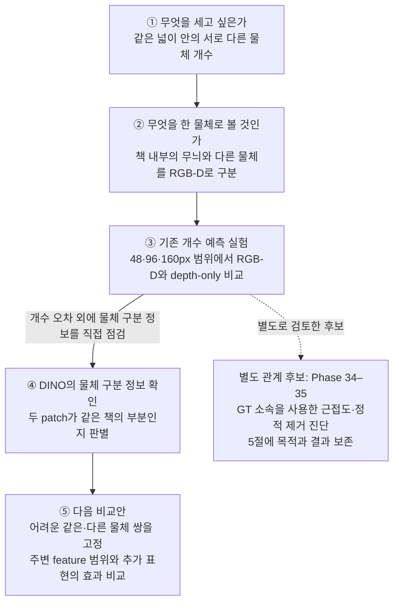
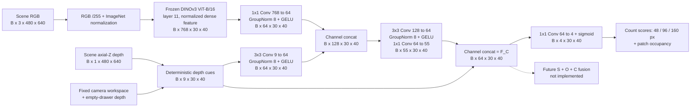
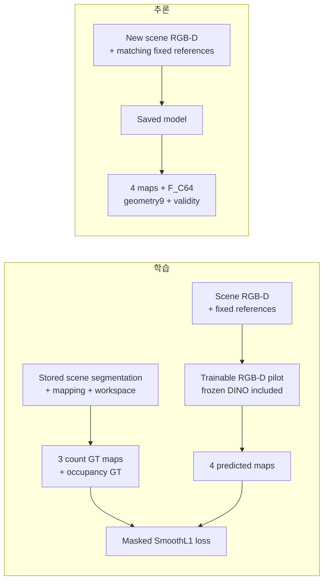
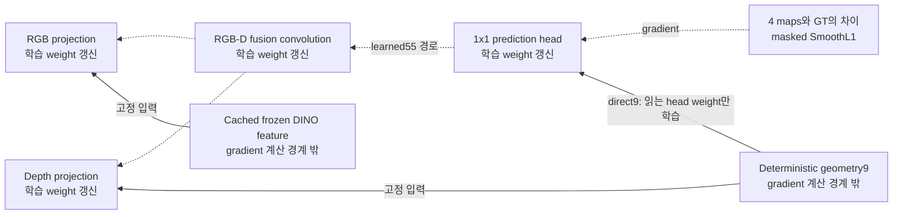

# Complexity Stream

<!-- navigation:start -->
[전체 개요](README.md) · [Similarity](similarity_stream.md) · [Occlusion](occlusion_stream.md) · **Complexity** · [Development Log](development_log.md) · [연구 문맥](agent.md)
<!-- navigation:end -->

> **현재 상태:** 국소 개수·점유율을 예측한 RGB-D pilot과, 두 patch가 같은 물체의 부분인지 구분하는 DINO 진단을 완료함. 최종 Complexity map은 연구 중임. 현재 중심 질문은 **“더미에서 무엇을 한 물체로 구분하고, 그 구분을 국소 구성 표현에 어떻게 사용할 것인가”**임.

## 1. 연구 목적

Complexity는 **같은 더미 안에서도 어느 부분에 여러 물체가 밀집해 있는지, 그 물체들이 어떻게 놓여 있는지**를 RGB-D로 표현하려는 stream임. 찾는 target과의 유사도나 target별 가림 가능성은 다른 stream이 담당하며, 여기서는 현재 scene 자체를 다룸.

출발 가정은 **같은 넓이 안에 물체가 많으면 그 부분의 수량 밀도가 높다**는 것이었음. 이 가정을 사용하려면 먼저 RGB-D에서 무엇을 한 물체로 셀 것인지가 중요함. 책 표지의 글자·그림이 다르게 보여도 한 책의 일부로 다루고, 서로 붙은 두 책은 구분할 정보가 필요함.

현재 DINO 진단은 이 물체 구분 정보를 확인하는 실험임. 개수 가설을 버리고 RGB edge 개수로 대체한 과정으로 설명하지 않음. 국소 개수가 주는 정보와 추가로 필요한 배치·관계 정보는 각각의 결과를 보고 판단함.

## 2. 연구 질문의 연결

①–⑤는 아래 본문의 설명 순서임. 근접도와 정적 제거를 검사한 Phase 34–35는 별도로 시도한 관계 점수 후보이므로 옆 경로로 표시함. 이 실험이 개수 가설을 반박하거나 RGB-D의 물체 구분을 해결한 것으로 연결하지 않음.



## 3. 가정·실험·현재 판단

### ① Count와 occupancy는 서로 다른 값을 측정함

**Count는 영역 안에 보이는 서로 다른 물체 그룹의 수임.** 같은 그룹이 여러 pixel에 걸쳐 있어도 한 번 셈. 예를 들어 같은 96×96 영역 안에 A·B·C 세 물체가 보이면 count는 3임.

| 같은 크기의 영역 안에서 | 보이는 그룹 | Count |
|---|---|---:|
| A·B·C가 서로 떨어져 있음 | A, B, C | 3 |
| A·B·C가 일부 겹치지만 각각의 일부가 보임 | A, B, C | 3 |

두 번째에서도 세 그룹이 보이므로 3임. B가 완전히 가려져 아무 부분도 보이지 않으면 현재의 가시 count에는 B가 들어가지 않음.

이 예에서 **단위 면적당 가시 개수가 같다는 판단은 맞음.** Count만으로 간격이나 겹침의 차이까지 표시하지는 않는다는 뜻임. 겹친 쪽의 Complexity가 반드시 더 높다고 증명한 예도, count 가설이 틀렸다는 근거도 아님. 배치 차이를 추가로 표현할지는 별도 검증 대상임.

**Occupancy는 물체가 덮은 면적의 비율임.** 아래 예는 workspace 안에 있으며 256pixel 모두의 물체·배경 여부를 아는 16×16 patch를 기준으로 함.

| Patch 안의 구성 | 물체가 덮은 pixel | Occupancy |
|---|---:|---:|
| 큰 책 한 권의 표면이 patch 전체를 덮음 | 256 | 256/256 = 1 |
| 두 물체가 빈틈없이 각각 절반을 덮음 | 128 + 128 | 256/256 = 1 |
| 물체가 절반만 덮고 나머지는 배경임 | 128 | 128/256 = 0.5 |

Occupancy 1은 **그 patch가 물체로 채워졌다**는 뜻임. 한 물체인지 여러 물체인지는 알려주지 않음. 따라서 occupancy는 물체 영역과 빈 공간을 구분하는 보조 정보로 사용하고, 물체 수를 구분하는 count와 같은 값으로 취급하지 않음.

실제 pilot은 각 위치 주변에서 저장된 segmentation 색 그룹을 세어 `count/16`으로 학습했음. 더미 전체 면적으로 나눈 값은 아님. 서로 다른 asset이 같은 색으로 저장된 경우도 있어 정확한 보고 명칭은 **가시 label-group 개수**임. 이 정답을 잘 예측하는지와, 국소 count가 최종 Complexity에 얼마나 유용한지는 구분함.

### ② 물체를 세려는 문제와 물체 경계를 구분하는 문제의 연결

세려는 대상이 책이라면 표지의 글자·그림·단색 부분을 각각 한 개로 세면 안 됨. 이 부분들은 다르게 보여도 **같은 책 A의 부분**임. 반대로 서로 붙어 있는 책 A와 책 B는 색이 비슷해도 다른 물체임.

```text
책 A의 그림 부분 ── 책 A의 글자 부분 → 같은 물체로 다룸
책 A의 표지     ── 책 B의 표지     → 다른 물체로 구분함
```

RGB edge는 색이나 밝기가 변하는 곳임. 글자 테두리에도, 책 A와 책 B 사이에도 생길 수 있음. 따라서 여기서 경계를 검토하는 이유는 **edge 개수를 새 복잡도 값으로 쓰기 위해서가 아니라, 변화의 양쪽이 같은 물체인지 다른 물체인지 확인하기 위해서**임. 이는 처음의 “무엇을 한 개로 셀 것인가”와 연결된 문제임.

Depth는 다른 단서를 제공함. 무늬가 복잡한 책 표지라도 평평한 한 면이면 depth는 비슷할 수 있음. 그러나 같은 높이에 놓인 두 책도 depth가 비슷할 수 있어, depth만으로 항상 둘을 구분할 수 있는 것은 아님.

| 가상 장면 | RGB가 주는 단서 | Depth가 주는 단서 |
|---|---|---|
| 무늬가 복잡한 책 한 권 | 글자·그림 때문에 변화가 많음 | 같은 표면의 깊이가 비슷할 수 있음 |
| 높이가 같은 두 책 | 외형·윤곽·문맥에서 구분 단서를 얻을 수 있음 | 두 물체의 깊이가 비슷할 수 있음 |
| 기울어진 책 한 권 | 하나의 책으로 이어지는 외형·문맥 | 한 물체 안에서도 깊이가 크게 변함 |

그래서 RGB와 depth를 함께 검토함. Depth cue에서는 빈 서랍 자체의 벽·바닥에도 반응하는 오류를 확인해 empty-depth 차이로 보정했음. 위의 책 예들은 구분해야 할 상황을 설명하는 가상 예이며, 특정 segmentation 모델의 실패를 실측한 결과와 구분함.

현재 density 모델이 매번 완성된 segmentation을 만든 뒤 개수를 세는 구조는 아님. **Segmentation은 학습 정답 생성에 사용하고, 모델은 RGB-D에서 개수를 직접 예측함.** 다만 개수를 잘 예측했다는 결과만으로 한 책의 서로 다른 부분까지 올바르게 연결하는지 알 수는 없으므로, ④에서 그 정보를 직접 진단함.

### ③ 범위별 count 실험이 답한 질문

Phase 33에서 비교한 질문은 **“같은 범위의 count를 예측할 때 RGB 정보를 추가하면 depth-only보다 나아지는가”**임. DINOv3는 고정하고 작은 RGB-D head를 학습했으며, 비교 모델의 구조·초기값·학습 순서를 맞춤.

| 설정 | 의미 |
|---|---|
| DINO patch 16×16px | Feature와 출력을 두는 간격. 480×640 영상에서 30×40개 위치를 만듦 |
| Count window 48·96·160px | 같은 출력 위치 주변에서 개수를 세는 정사각형의 한 변 길이 |
| Count ÷16 | 기존 asset library를 기준으로 정한 출력 scale. Patch의 16px와 별개임 |

한 위치에서 세 값을 동시에 예측함. 예를 들어 위치 A의 작은 영역에 한 그룹, 중간 영역에 세 그룹, 큰 영역에 다섯 그룹이 보인다면 정답은 다음처럼 달라짐.

```text
                         정답 개수       모델의 예측값, 설명용 가상값
A 주변 48×48 영역          1개             1.2개 → 오차 0.2
A 주변 96×96 영역          3개             3.5개 → 오차 0.5
A 주변 160×160 영역        5개             5.8개 → 오차 0.8

모델은 같은 위치에서 count48, count96, count160 세 출력을 냄.
표시는 개수 단위로 풀었으며 실제 학습 출력은 각 값을 16으로 나눈 값임.
```

48px의 오차가 작다는 것은 **그 작은 영역의 한 그룹을 더 정확히 셌다**는 뜻임. 160px에서 보이는 다섯 그룹까지 더 잘 구분했거나 넓은 관계 정보를 더 잘 담았다는 뜻은 아님. 서로 다른 질문의 오차를 한 줄로 줄 세운 것만으로 어느 범위를 쓸지 결정할 수 없는 이유임.

실제 결과는 다음과 같음. 기존 16개 source pool·고정 five-camera rig, test 960영상·3 seeds에서 유효하며 GT count가 0보다 큰 window의 **가시 label-group 개수 MAE**를 계산함. MAE는 예측과 정답의 차이에 절댓값을 취해 평균한 값이며, 작을수록 좋음.

| Count window | RGB-D MAE | Depth-only MAE |
|---|---:|---:|
| 48×48px | 0.352517 | 0.497709 |
| 96×96px | 0.621799 | 0.805782 |
| 160×160px | 0.949932 | 1.194659 |
| 세 범위 평균 | **0.641416** | **0.832717** |

이 표에서는 **같은 행의 RGB-D와 depth-only를 비교함.** 세 범위 모두 RGB-D가 더 정확했고, 평균 count MAE가 22.973% 감소함. 이 결과로 RGB 표현의 추가 정보를 확인했음.

범위가 커지면 workspace 밖을 포함하는 위치도 늘어 기존 평가의 유효 위치가 달라짐. 따라서 지금은 세 출력을 보존하고 **48px 하나를 최적값으로 선택하지 않음.** 다음 범위 비교에서는 정답과 평가 위치를 고정하고 주변 feature를 모으는 범위만 바꾸는 안을 ⑤에 구체화함.


열은 scene RGB / 96px count GT / RGB-D prediction / 절대 오차 / occupancy GT / 직접 depth occupancy / depth plane residual임. 현재 그림은 density pilot의 결과임.

### ④ ‘물체 소속’을 DINO에서 읽는다는 의미

여기서 **소속은 영상의 한 부분이 어느 물체의 일부인가**라는 뜻임. Category를 묻는 것과 구분함. 책 A와 책 B는 둘 다 book이지만, 책 A의 그림 부분과 책 B의 글자 부분은 서로 다른 물체에 속함.

```text
사진 속 세 위치
p: 책 A의 그림 부분
q: 책 A의 글자 부분
r: 책 B의 표지

(p,q) → 같은 물체의 부분인가?  정답 1
(p,r) → 같은 물체의 부분인가?  정답 0
```

Phase 36은 이 질문을 DINO feature로 답할 수 있는지 검사한 실험임. DINO는 각 16×16 patch를 768개 숫자로 표현함. 두 patch의 숫자 묶음을 작은 판별기에 주고 **같은 asset인 쌍에 높은 점수, 다른 asset인 쌍에 낮은 점수**를 내도록 학습함.

```text
Scene RGB → 고정 DINO → p의 feature, q의 feature ─┐
                                                ├→ 작은 판별기 → 같은 물체인지의 점수
                                  위치 정보 ────┘

저장된 GT segmentation → p·q가 같은 asset인지 정답 지정 → 학습·평가에 사용
```

DINO+position 비교군을 나타낸 그림임. Depth 비교군과 RGB-D 비교군도 같은 크기의 판별기를 사용함. GT가 평가 위치와 정답을 제공했으며 모델 입력에 물체 이름이나 GT label 번호를 넣지는 않았음. Density pilot의 개수 예측 head와도 별도의 진단임.

먼저 한 patch 면적의 90% 이상이 같은 알려진 label인 위치를 골랐음. 여러 물체가 섞인 patch보다, **이미 한 물체의 내부라고 확인한 두 patch를 연결하는 기본 능력**부터 본 것임. 기존 16개 asset이 train/test에 모두 들어간 조건이며, 같은 asset의 복제품 여러 개를 구분한 실험은 아님.

**평가 지표인 AUROC는 같은 물체 쌍을 다른 물체 쌍보다 높은 점수로 정렬하는지를 측정함.** 정식 명칭은 Area Under the Receiver Operating Characteristic Curve이며, 현재 실험에서는 아래 순위 비교로 이해할 수 있음.

| 설명용 가상 쌍 | 정답 | 판별 점수 |
|---|---|---:|
| 같은 책 A의 두 부분 | 같음 | 0.4 |
| 같은 책 B의 두 부분 | 같음 | 0.3 |
| 책 A와 책 B의 부분 | 다름 | 0.2 |
| 책 C와 책 D의 부분 | 다름 | 0.1 |

같은 물체 쌍 하나와 다른 물체 쌍 하나를 골라 비교하면 `0.4>0.2`, `0.4>0.1`, `0.3>0.2`, `0.3>0.1` 네 비교가 모두 맞음. 이 예의 AUROC는 **4/4=1**임. 순위가 무작위에 가까우면 약 0.5이고, 동점은 절반 기여로 계산함.

한편 위 점수를 0.5 이상이면 ‘같음’이라고 판정하면 네 쌍을 전부 ‘다름’으로 분류하여 정확도는 50%가 됨. **AUROC는 특정 기준값에서의 정답률과 다른 지표**임. 높은 AUROC는 두 종류를 구분할 점수 순서가 잘 형성됐다는 뜻임.

실제 same-category 평가 결과는 다음과 같음. 책끼리처럼 같은 category 안에서도 다른 asset을 구분하는 조건임.

| 입력 | AUROC |
|---|---:|
| DINO + position | **0.998953** |
| Depth + position | 0.773882 |
| RGB-D + position | 0.998908 |

Same-category 80,024 pairs·604 views·8 test scene keys를 사용하고, view별 지표를 scene key와 3 seeds에 걸쳐 평균했음. **선택한 내부 patch의 같은/다른 asset을 구분할 정보는 기존 DINO에서 매우 잘 읽혔음.** 0.998953을 전체 영상 segmentation 정확도 99.8953%로 해석하지 않음.


순수성 ≥90%와 workspace·유효 depth 각각 ≥95% 조건을 함께 만족한 위치는 알려진 foreground patch의 **42.40%**였음. 따라서 다음 질문은 이미 잘 되는 내부 patch 판별을 반복하는 것이 아니라, **서로 다른 무늬·실제 물체 경계·가림으로 분리된 부분에서도 같은 구분이 유지되는가**임. DINO의 출력으로 물체 mask 전체를 복원하거나 segmentation 모델과 성능을 비교한 단계는 아님.

### ⑤ 다음 범위 비교의 과제와 선택 기준

‘공통 기준을 정해야 함’에서 설명을 끝내지 않고, **물체 구분을 점검하는 다음 비교안**을 아래처럼 둠. 이 안은 아직 실행하지 않았으며 최종 Complexity GT를 새로 만든 것도 아님.

비교 질문은 **“같은 두 위치가 같은 물체의 부분인지 판단할 때, 주변 정보를 어느 범위까지 함께 읽는 것이 도움이 되는가”**임. 관측 범위를 바꾸더라도 두 위치와 정답은 그대로 둠.

| 비교 항목 | 고정할 내용 |
|---|---|
| Scene | 기존 책·과일·포장식품·장난감이 쌓인 cluttered asset scene. 비교군 모두 동일한 scene-key 분할 사용 |
| 평가 대상 | 아래 세 유형의 같은/다른 물체 쌍을 한 번 정하고 모든 비교군에 동일하게 사용 |
| 정답·유효 위치 | GT의 같은/다른 asset 정답을 고정하고, 모든 범위에 공통으로 유효한 위치 사용 |
| 바꾸는 요소 | 고정 DINO feature에서 주변 정보를 모으는 범위만 48·96·160px로 변경 |
| 비교 방법 | 같은 feature 요약 방식·출력 차원·판별기 구조·학습 조건 사용 |
| 선택 기준 | 세 유형의 validation AUROC를 동일 가중 평균하여 가장 높은 범위를 선택 |
| 최종 확인 | Validation에서 선택과 판정 기준값을 고정한 뒤 test 쌍에서 AUROC와 두 종류 오류를 보고 |

새 비교의 분할과 평가 쌍은 test를 열기 전에 고정함. 판정 기준값은 validation에서 두 종류 오류율의 평균이 가장 작아지는 값으로 정함.

세 유형은 다음과 같이 구성할 계획임. 각 유형에 같은 물체 쌍과 다른 물체 쌍을 함께 두어 판별 성능을 비교함.

| 유형 | 같은 물체 쌍의 예 | 다른 물체 쌍의 예 |
|---|---|---|
| 외형 변화 | 한 책의 그림 부분과 글자 부분 | 서로 다른 두 책의 표지 부분 |
| 경계 근처 | 표지의 무늬 경계 양쪽 | 맞닿은 책 A·B의 경계 양쪽 |
| 분리된 가시 부분 | 가려져 떨어져 보이는 같은 책의 두 조각 | 서로 다른 두 책의 가시 조각 |

오류도 **다른 물체를 같다고 합치는 오류**와 **같은 물체를 다르다고 나누는 오류**로 나눠 보여줌. Depth·위치 단서와 범위별 평가 쌍의 구성이 결과를 대신 설명하지 않도록 맞추며, 기존의 순수 내부 patch만으로 평가를 제한하지 않음.

여기서 48·96·160px는 판별기에 추가로 모아주는 **주변 feature의 범위**임. ③처럼 그 영역 안의 정답 개수를 바꾸는 실험과 다름. DINO의 입력 영상과 16px patch는 고정하므로, DINO 자체가 그 작은 영역만 본다는 뜻도 아님.

이 비교로 고르는 것은 **물체 구분 과제에 도움이 되는 feature 집계 범위**임. 최종 Complexity의 모든 상황에 최적인 범위라고 확대하지 않음. 당장은 기존 세 count 출력을 유지하며, 이 구분에서 실제 실패가 확인되면 물체 묶음 모델이나 공간 표현이 그 오류를 줄이는지 같은 평가에서 비교함. 추가 모델 B/C와 최종 fusion은 아직 실행하지 않았음.

## 4. 보존한 Density Pilot의 구현과 GT

아래는 **Phase 33에서 실제로 구현·평가한 모델**의 상세임. 연구 흐름과 분리해 보존하며, 이후 경계·관계 진단의 모델이나 최종 Complexity 구조와 구분함.

<details>
<summary>Pilot 목적·입출력 규격과 고정 camera reference</summary>

### 연구 목적과 현재 구현 범위

Complexity는 target identity와 무관하게 **물체 더미 내부의 국소 구성과 물체 간 관계 차이**를 표현하는 stream임. Similarity의 target–scene 외형·의미 관계, Occlusion의 target별 가림 가능성을 scene 자체의 구조 정보로 보완하는 것이 목적임.

현재 구현은 **가시 segmentation label-group 개수와 점유율을 예측하는 density pilot**임. 동일 조건의 RGB-D/depth-only 비교에서 RGB의 추가 정보를 확인했고, learned55와 direct geometry9를 합친 공통 feature 규격을 구현함. 후속 근접도·정적 제거·표현 진단을 통해 count 예측, 국소 표면 관계, 물체 선택 효용을 구분할 근거도 확보함. 이 결과를 바탕으로 최종 Complexity가 감독할 관계와 이를 평가할 기준을 정할 필요 있음.

Count·occupancy·depth 변화는 각각 가시 그룹 수, 피복 비율, 표면의 깊이 변화를 나타냄. 이 관측량의 예측은 구현됐으며, 구조적 Complexity로 확장하려면 같은 값에서도 달라지는 배치·가림 관계를 확인할 필요 있음. 넓은 책 한 권과 다물체 밀집은 모두 높은 occupancy를 가질 수 있고, 기울어진 단일 물체가 같은 높이의 여러 물체보다 큰 depth 변화를 만들 수도 있음.

다음 **가상 장면 비교**는 RGB와 depth가 제공하는 단서를 정리한 것임. 두 장면의 복잡도 순위를 정하려면 별도의 구조 기준이 필요함.

| 장면 | Depth 관측 | RGB의 보완 단서 | 추가로 구분할 관계 |
|---|---|---|---|
| 같은 높이의 책·상자·장난감 | 윗면 depth가 비슷하여 넓은 단일 표면처럼 보일 수 있음 | 색·무늬·윤곽·문맥을 통한 영역 구분 | 물체 구분 이후의 접촉·지지 관계 |
| 기울어진 큰 책 한 권 | 영상 위치에 따라 depth가 크게 변함 | 변화가 하나의 책 내부에서 이어진다는 단서 | 책 아래의 관측 불가능한 물체와 불확실성 |

```text
같은 높이의 여러 물체                  기울어진 책 한 권
RGB:   [책 A] [상자 B] [장난감 C]      RGB:   [        책 A        ]
depth:  2.90    2.90      2.90 m        depth:  2.85 → 2.90 → 2.95 m

낮은 depth 변화 ≠ 한 물체              높은 depth 변화 ≠ 여러 물체
```

### 입력·출력 규격

고정 five-camera rig의 각 시점을 독립 처리하는 입력·출력 경로를 구현·검증함. 현재 범위는 한 시점의 관측량 예측이며, 다중 시점 융합과 숨겨진 물체 복원은 이 모델의 평가 대상에 포함하지 않았음.

| 항목 | 규격 | 역할 |
|---|---|---|
| Scene RGB | `B×3×480×640` | Target image·category text 없이 scene 외형과 문맥 입력 |
| Scene depth | `B×1×480×640`, meter | Image-plane **axial-Z depth**; camera부터 표면까지의 유클리드 ray distance와 구분 |
| Camera별 고정 reference | Workspace mask와 empty-drawer depth, 각각 `480×640` | 서랍 관심 영역과 빈 배경을 정의 |
| Auxiliary prediction | `B×4×30×40` | 48/96/160px count score 3개와 patch occupancy 1개 |
| Stream feature `F_C` | `B×64×30×40` | 학습 feature 55개와 직접 depth cue 9개; 향후 fusion용 중간 표현 |

`B`는 batch의 영상 수이며 공간 격자는 `480/16 × 640/16 = 30×40`임. 영상 한 장의 출력은 `1×64×30×40`이며, 각 위치에 64개 feature 성분이 존재함. 학습한 55개 channel에 개수·접촉·가림 등의 의미를 개별 지정하지 않으며, 직접 cue 9개만 고정된 계산 의미를 가짐. **`F_C` 자체에는 sigmoid를 적용하지 않고 4개 auxiliary map에만 적용함.**

Workspace mask와 empty depth는 camera별 고정 배경 정보임. 매 scene의 물체 정답인 segmentation과 구분하며, rig를 이동하면 reference 정합을 다시 검증해야 함. Density 추론에는 scene segmentation·asset 이름·target reference를 입력하지 않음. 학습 정답 생성과 Phase 34–36의 GT 기반 진단 조건은 4·5절에 별도로 정리함.

</details>

<details>
<summary>Pilot 모델 구조·모듈 선택 이유·depth cue 계산</summary>

### Pilot 모델 구조

RGB는 frozen DINOv3에서 위치별 feature를 추출하고, depth는 고정 수식으로 9개 cue를 계산함. 두 branch의 학습 projection과 fusion으로 feature 55개를 만든 뒤 원래 depth cue 9개를 concat하여 `F_C64`를 구성함. Auxiliary head는 이 feature에서 네 감독값을 예측함.



### 위치별 차원 변화

```text
RGB:    DINO 768 → projection 64 ─┐
Depth:  cue 9   → projection 64 ─┴→ concat 128 → fusion 55 ─┐
        cue 9 ─────────────────────── direct path ──────────┴→ F_C64
                                                               ↓
                                                        auxiliary map 4

공간 격자: 모든 단계에서 30×40 = 1,200개 출력 위치 유지
```

Concat은 같은 위치의 channel을 이어 붙이는 연산임. `64+64→128`, `55+9→64`는 원소별 덧셈과 구분함. 이후 convolution이 channel과 이웃 위치의 정보를 학습 가중치로 혼합함.

### Pilot 내부 모듈

| 모듈 | 입력 → 출력 | 역할과 선택 이유 | 적용 범위와 추가 검증 |
|---|---|---|---|
| Frozen DINOv3 layer11 | RGB → `768×30×40` | 1,200개 patch의 외형·문맥 표현 제공. Backbone을 고정하여 작은 RGB-D head 비교에 사용 | Pilot과 A probe에서 사용한 고정 RGB 표현 |
| RGB projection | `1×1 Conv 768→64` | 위치를 유지하면서 RGB feature 폭을 압축 | Matched RGB-D/depth-only pilot의 공통 head 규격 |
| Depth projection | `3×3 Conv 9→64` | 직접 cue와 주변 격자 정보를 결합 | Image-space 이웃 연산을 구현함; 물체별 graph 연산과 구분 |
| RGB-D fusion | `Concat128 → 3×3 Conv64 → 1×1 Conv55` | 두 관측을 결합한 학습 feature 생성 | Count/occupancy 예측을 학습함; 관계 정보의 보존 여부는 별도 평가 필요 |
| GroupNorm 8 + GELU | 64-channel 중간 표현 | Group별 정규화와 비선형 변환 | RGB-D와 depth-only 비교에 동일하게 적용 |
| Direct geometry path | `learned55 + geometry9 → F_C64` | 학습 bottleneck 이후에도 원래 기하값을 제공 | 9개 직접 cue와 학습 feature를 함께 반환하는 경로까지 구현 |
| Auxiliary head | `1×1 Conv 64→4 + sigmoid` | 세 count score와 occupancy를 예측하여 학습 신호 제공 | 네 관측량의 예측을 평가함; 구조적 GT와 target 존재 확률은 별도 문제 |

DINO는 freeze하고 RGB/depth projection, fusion convolution, auxiliary head만 학습함. 세 stream을 결합할 `64×30×40` 규격까지 맞췄으며, 의미 정렬과 탐색 효용은 향후 fusion 평가에서 확인할 필요 있음. 모듈별 역할은 위 표에, 전체 pilot의 비교 결과와 후속 검증은 5절에 정리함.

### RGB feature 추출과 projection

RGB를 255로 나눈 뒤 ImageNet mean `(0.485,0.456,0.406)`, std `(0.229,0.224,0.225)`로 channel별 정규화함. 사전학습 encoder의 입력 scale을 맞추는 전처리임.

DINOv3 ViT-B/16은 16×16 patch를 처리하며, index 11인 마지막 12번째 block의 768-D dense token을 사용함. `norm=True`는 backbone의 LayerNorm 적용을 뜻함. Density pilot에서는 별도 token L2 normalization을 하지 않으며, Phase 36 pair probe의 L2 normalization과 구분함.

원본 patch의 `16×16×3=768`개 RGB 값과 768-D token은 차원 수만 같음. Token은 학습 projection과 attention을 거쳐 주변·전체 영상 문맥이 반영된 표현으로, 원본 pixel의 단순 flatten이 아님. 동일한 색도 책·바닥 등 문맥에 따라 다른 feature를 만들 수 있으나 channel별 의미가 고정된 것은 아님.

`1×1 Conv 768→64`는 각 위치의 768개 feature에 학습 가중치를 적용하여 64개 가중합을 생성함. 공간 해상도는 유지하며 GroupNorm/GELU 이후 depth branch와 결합함.

### Depth reference와 유효 pixel

Depth 입력은 optical axis 방향의 axial-Z를 meter로 저장한 값임. 화면 가장자리까지의 비스듬한 ray 길이와 구분하며, 여기서 계산하는 image-space cue를 3D 곡률로 해석하지 않음.

Scene depth $d$와 동일 camera의 empty depth $d_0$가 모두 유한한 양수이고 workspace 안에 있는 pixel만 유효함. Empty reference 대비 변위는 다음과 같음.

$$
\Delta(u,v)=d_0(u,v)-d(u,v).
$$

양수는 빈 배경보다 camera 쪽으로 나온 표면을 뜻함. 음수는 reference 정합·관측 차이 등에서도 발생할 수 있으므로 특정 물체 상태로 단정하지 않음. Roughness 계산에서는 음수를 보존하여 0으로 clipping할 때 생기는 인위적 경계를 방지함.

| Empty `d₀` | Scene `d` | `Δ=d₀−d` | 처리 — 가상 계산 예 |
|---:|---:|---:|---|
| 3.00m | 2.90m | +0.10m = +100mm | `Δ>15mm`이므로 direct foreground에 포함 |
| 3.00m | 2.99m | +0.01m = +10mm | 앞쪽 표면이지만 foreground threshold 미달 |
| 3.00m | 3.02m | −0.02m = −20mm | Roughness에는 부호를 보존, foreground에서는 제외 |
| 3.00m | 0 | 제외 | Invalid를 3m 앞의 표면으로 해석하지 않음 |

### 직접 depth cue 9개

| Channel | 계산 | 역할 |
|---|---|---|
| 1. Normalized depth | 유효 patch depth 평균을 `(mean−2.5m)/(3.5m−2.5m)`로 변환 후 `[0,1]` 제한 | 절대 깊이 제공 |
| 2. Direct foreground occupancy | 유효 pixel 중 `Δ>15mm`인 비율 | Empty reference보다 충분히 앞선 표면 비율 |
| 3. Depth validity | Patch 256px 중 scene/empty depth·workspace가 모두 유효한 비율 | 관측 지원 영역 제공 |
| 4–6. Plane residual RMS | 48/96/160px window의 `Δ`에 affine plane 적합 → 잔차 RMS `/30mm` → `[0,1]` 제한 | 일정한 image-space 기울기 제거 후 남는 변화 |
| 7–9. Gradient variation | 각 window의 수평·수직 유효 인접 pixel `Δ` 차분 분산 합의 제곱근 `/20mm` → `[0,1]` 제한 | 1px first difference의 불균일성 |

첫 세 channel은 16×16 patch를 요약함. 평균 depth가 2.90m이면 normalized depth는 `(2.90−2.50)/(3.50−2.50)=0.40`임. 유효 pixel이 없으면 평균·occupancy·validity를 모두 0으로 둠.

| 가상 patch: 전체 256px, 유효 224px, foreground 168px | 계산 | 분모의 의미 |
|---|---:|---|
| Direct occupancy | `168/224=0.75` | 관측 가능한 영역 중 foreground 비율 |
| Validity | `224/256=0.875` | 전체 patch 중 관측 가능한 비율 |

Direct occupancy는 depth threshold의 표면 비율을 제공하고, segmentation occupancy GT는 알려진 물체 영역 비율을 제공함. 이처럼 각 cue의 계산 의미를 구분했으며, 깊이·roughness와 구조적 관계의 연결은 추가 평가가 필요함.

### Plane residual과 gradient variation

Plane residual은 window의 유효 pixel 집합 $V_s(p)$에서 affine plane을 최소제곱 적합한 뒤 RMS 오차를 계산함. $x,y$는 영상 크기로 나눈 image-space 좌표임.

$$
(a_s,b_s,c_s)=\arg\min_{a,b,c}\sum_{q\in V_s(p)}
\left[\Delta(q)-(ax_q+by_q+c)\right]^2,
$$

$$
r_s(p)=\sqrt{\frac{1}{|V_s(p)|}\sum_{q\in V_s(p)}
\left[\Delta(q)-(a_sx_q+b_sy_q+c_s)\right]^2}.
$$

$a_s,b_s,c_s$는 현재 window의 depth에서 직접 계산한 plane 계수이며 network의 학습 parameter가 아님. 잔차를 제곱 평균한 뒤 제곱근을 취하므로 양·음의 오차가 상쇄되지 않음.

Gradient variation은 유효 인접 쌍의 first difference $g_x,g_y$에 대해 $\sqrt{\mathrm{Var}(g_x)+\mathrm{Var}(g_y)}$로 계산함. 두 cue의 차이는 다음과 같음.

| 비교 | Plane residual | Gradient variation |
|---|---|---|
| 측정 대상 | Window 전체를 하나의 plane으로 설명한 잔차 | 인접 pixel 변화량의 불균일성 |
| `Δ=0,10,20,30mm`인 선형 변화 | Plane으로 설명 가능하여 잔차 0 | 차분이 모두 10mm이므로 분산 0 |
| 여러 면·단차·곡률 | 단일 plane으로 설명되지 않는 오차 발생 | 차분이 `0,30,0mm`처럼 달라지면 분산 발생 |
| 해석 한계 | 단일 곡면 물체도 잔차를 만들 수 있음 | Sensor noise와 물체 경계 모두 반응 가능 |

두 cue는 선형 기울기에 대한 반응을 줄이도록 구성함. 각각의 추가 정보는 독립 ablation으로 확인할 필요 있음. Plane 계산에는 전체 window 면적의 유효 비율 ≥25%, 유효 pixel ≥6, 비퇴화 좌표 조건이 필요함. 지원이 부족한 roughness는 0으로 두고 workspace 밖에는 cue를 생성하지 않음. 이때 0은 평탄함의 확정 판정이 아님.

정규화 예는 residual 6mm → `6/30=0.20`, residual 45mm → `45/30=1.5`를 1로 제한, gradient variation 4mm → `4/20=0.20`임. 30mm/20mm는 입력 scale을 맞추는 고정 상수이며 승인된 복잡도 기준이나 최적 threshold가 아님.

### Empty-reference 보정

V2에서는 동일한 scene/empty depth의 곡면·단차 배경에 대해 **여섯 roughness channel이 0이 되는 보정**을 확인함. V1 raw-depth cue가 빈 서랍의 벽·곡면까지 clutter처럼 반응한 오류를 수정한 결과임. Plane 제거만으로 남았던 고정 배경 반응을 줄이기 위해 **`roughness_reference="empty_difference"`**를 적용했으며, `scene_depth=empty_depth`이면 `Δ=0`이 됨. Normalized depth·occupancy·validity의 정의는 유지함.

함수의 기본값 `scene`은 V1 호환용이므로 실제 실행에는 checkpoint protocol의 V2 설정을 사용해야 함. 이 보정은 고정 camera와 empty scene의 정합을 전제로 하며, camera/FOV·drawer 위치·depth calibration 변경 및 실제 sensor의 강건성은 별도 검증 대상임.

### Depth projection과 RGB-D fusion

`3×3 Conv 9→64`는 현재 위치와 주변 8개 위치의 cue를 사용함. 일반적인 내부 위치에서 출력 channel 하나의 입력은 `3×3×9=81`개이며, padding 1로 `30×40` 크기를 유지함. 물체별 소속을 지정한 graph 연산은 아님.

RGB/depth projection을 concat한 128개 channel에 `3×3 Conv 128→64`, GroupNorm/GELU, `1×1 Conv 64→55`를 적용함. 동일 높이의 서로 다른 RGB 영역과 단일 물체 내부의 큰 depth 기울기를 함께 처리할 수 있도록 구성함. 이 결합의 count 예측 이득은 확인했으며, 어떤 물체 관계가 feature에 남는지는 관계별 진단이 필요함.

GroupNorm은 sample별 64 channels를 8개 group, group당 8 channels로 나누어 공간 위치와 함께 정규화함. 다른 영상의 batch 통계에 의존하지 않음. GELU는 선형 가중합 사이에 비선형 반응을 추가함.

### Direct path: 학습 feature 55개와 기하 cue 9개

학습 branch를 거치면서 기하 cue가 다른 feature와 혼합되더라도, 후속 head가 원래 값을 직접 사용할 수 있도록 우회 경로를 유지함. 예를 들어 학습 feature가 RGB 문맥을 강조해도 depth validity는 직접 참조 가능함.

```text
geometry9 ──→ depth projection ──→ RGB-D fusion ──→ learned55 ──┐
     └──────────────── direct9 유지 ──────────────────────────┴→ F_C64
```

Direct cue의 계산식을 유지하면서 이를 읽는 auxiliary head의 weight를 학습함. 기하값을 보존하되 출력 기여도는 조정할 수 있는 경로임. `55+9`를 적용한 pilot까지 평가됐으며, 다른 채널 배분에 대한 상대 이득은 별도 비교가 필요함.

### Auxiliary head: `F_C64 → 4 maps`

`F_C64`는 후속 fusion에 제공할 중간 표현이고, 네 map은 학습 정답과 비교하기 위한 readout임. 위치별 64개 feature의 가중합과 bias로 logit 4개를 만든 뒤 각각 sigmoid를 적용함.

$$
z_k(p)=\sum_{c=1}^{64}w_{kc}F_{C,c}(p)+b_k,
\qquad \hat y_k(p)=\frac{1}{1+e^{-z_k(p)}},\quad k=1,2,3,4.
$$

Logit 0의 sigmoid 값은 0.5임. Count channel에서는 `0.5×16=8` label-groups, occupancy에서는 알려진 영역의 절반에 해당함. 같은 값이라도 감독 대상에 따라 의미가 달라지며 target 존재 확률 50%를 뜻하지 않음.

Sigmoid는 bounded GT를 예측하는 마지막 head에만 적용함. `F_C` 전체에 적용하면 학습 feature 55개까지 0–1로 제한되므로 중간 표현은 그대로 유지함. 네 map과 `F_C`를 함께 반환하는 경로를 구현했으며, 최종 fusion에서 중간 feature의 추가 효과를 확인할 필요 있음.

</details>

<details>
<summary>Count·occupancy GT 생성, window·정규화, loss와 추론 출력</summary>

### 감독 경로와 추론 경로

저장된 scene segmentation·mapping으로 count/occupancy GT를 만들고, 이를 RGB-D 예측과 비교해 loss를 계산함. **Scene segmentation은 density 모델의 입력 feature로 전달하지 않음.** 추론에는 RGB-D와 고정 reference만 필요함.



Phase 34–35는 GT label을 계산 입력으로 사용한 teacher 진단이고, Phase 36은 GT로 순수 patch와 평가 pair를 선정한 조건부 평가임. Density pilot의 segmentation 없는 추론과 이 진단 조건을 구분함.

### 가시 segmentation label-group count

저장 mapping은 asset 이름에 색을 연결하며 영속적인 physical instance ID는 아님. 서로 다른 asset의 색 충돌이나 동일 asset의 복수 배치는 한 그룹으로 합쳐질 수 있음. Pilot은 **서로 다른 색 그룹을 한 번씩** 세며, 동일색 조각이 떨어져 있어도 중복으로 세지 않음.

Workspace를 $\Omega$, 알려진 색 그룹을 $g$, 그 그룹의 workspace 내 가시 pixel 집합을 $A_g$로 정의함. Patch 중심 $p$의 한 변 길이 $s$인 정사각 pixel window를 $W_s(p)$라 하면:

$$
n_s(p)=\sum_g
\mathbf{1}[|A_g|\geq32]\,
\mathbf{1}[|A_g\cap W_s(p)|\geq16],
\qquad s\in\{48,96,160\}.
$$

$$
y_s(p)=\min\left(1,\frac{n_s(p)}{16}\right).
$$

전체 workspace에서 ≥32px 보이고 해당 window에 ≥16px 들어온 그룹을 count에 포함함. 작은 흔적의 과도한 계수를 줄이려는 고정 threshold를 적용해 pilot을 평가했으며, 다른 물체 크기·camera에 적용할 때는 threshold 적합성을 확인할 필요 있음.

### Patch·count window·정규화의 구분

| 항목 | 값 | 역할 |
|---|---|---|
| 출력 sampling | `16×16` patch | `480×640 → 30×40` 출력 위치 결정 |
| Count 포함 조건 | Window 교집합 ≥`16 pixels` | 최소 가시 증거 면적; patch 한 변과 다른 단위 |
| Count 정규화 | `count ÷16` | 원본 library의 16개 asset을 기준으로 한 고정 출력 scale |
| Count window | `48/96/160px` | 위치 주변의 집계 범위; 3/6/10 patch 폭에 해당 |

Window는 원본 pixel에서 계산하며 출력은 동일 patch 위치에 저장함. 96px window가 출력 간격이나 정규화 분모를 96으로 바꾸는 것은 아님. 아래 좌표는 0-based이며 구간 끝은 포함하지 않음.

```text
원본: 높이480 × 너비640 → 16×16 patch → 30행×40열 =1,200개 출력 위치

patch (행12, 열20): y=[192,208), x=[320,336) → 256 pixels
window 중심: (y=200, x=328)

count48:  y=[176,224), x=[304,352) →  48×48= 2,304 pixels
count96:  y=[152,248), x=[280,376) →  96×96= 9,216 pixels
count160: y=[120,280), x=[248,408) →160×160=25,600 pixels

가상 count:                  1개      3개      5개 label-groups
정규화:                      1/16     3/16     5/16
같은 위치의 y_count[:,12,20]: [0.0625,  0.1875,  0.3125]
```

| 그룹별 가상 가시 면적 | Workspace 전체 | Window 내부 | 처리 |
|---|---:|---:|---|
| A | 100px | 20px | 두 조건을 만족하여 count에 1 추가 |
| B | 100px | 12px | Window 내부 ≥16px 조건 미달로 제외 |
| C | 20px | 20px | 전체 ≥32px 조건 미달로 count 제외; 알려진 색이면 occupancy에는 포함 |

세 그룹이 포함된 window의 GT는 `3/16=0.1875`임. Scene별 min–max 정규화는 하지 않고 count가 16을 초과할 때의 clipping 비율을 기록함. 실제 3개 물체가 색 충돌로 2개 그룹이면 GT는 2를 셈. **Phase 36의 충돌 검출로 과거 density GT·checkpoint·수치를 소급 수정하지 않았음.**

48/96/160px은 국소 영역부터 넓은 문맥까지 비교하는 **image-space window 가설**로 적용함. 이 세 scale의 예측까지 평가했으며, window 수·크기의 개별 이득은 독립 비교가 필요함. Metric 물체 크기·접촉 거리·grasp 범위를 뜻하지 않음. 큰 window에서 count가 커질 수 있으나 `count/16`은 scale 간 동일한 물리 면적당 density가 아님.

### Count validity

Count supervision은 다음 두 조건을 모두 만족한 window에 적용함.

| 조건 | 계산·의미 |
|---|---|
| Workspace coverage ≥95% | 분모는 **전체 정사각 window 면적**임. 영상 밖으로 잘린 부분도 포함 |
| Workspace 내부 unknown nonblack 없음 | Mapping에 없는 pixel을 빈 배경으로 취급하지 않음 |

96×96 window의 전체 면적은 9,216px임. Workspace가 9,000px이면 `9000/9216≈97.66%`로 통과하고, 8,600px이면 약 93.32%로 제외함. Coverage를 통과해도 unknown nonblack이 있으면 count mask는 0임. 낮은 count와 신뢰할 수 없는 GT의 제외를 구분하는 규칙임.

Density pilot은 알려진 동일색 alias를 한 그룹으로 유지함. 반면 Phase 36은 asset identity가 모호한 **충돌 색 자체를 unknown으로 제외**했으므로 label 처리와 metric을 혼용하지 않음.

### Patch occupancy와 loss weight

Occupancy는 count window가 아닌 **16×16 patch 자체**의 비율임. $F$는 알려진 foreground, $U$는 workspace 내 unknown nonblack, $P(p)$는 patch pixel 집합임.

$$
y_{\mathrm{occ}}(p)=
\frac{|P(p)\cap F|}{|P(p)\cap(\Omega\setminus U)|}.
$$

분모가 0이면 GT와 loss weight를 모두 0으로 둠. 그 외 occupancy loss weight는 `알려진 workspace pixel 수 /256`임. Count의 최소 면적 조건에서 제외된 작은 알려진 색 그룹도 occupancy foreground에는 포함함.

```text
가상 patch 전체: 256px
├─ Workspace 밖 16px                 → GT 분자·분모에서 제외
└─ Workspace 안 240px
   ├─ Unknown 40px                   → GT 분자·분모에서 제외
   └─ 알려진 영역 200px               → GT 분모
      ├─ Foreground 150px            → GT 분자
      └─ Background 50px

Occupancy GT =150/200=0.75
Loss weight  =200/256=0.78125
```

`150/256`을 GT로 사용하면 workspace 밖과 unknown을 배경으로 간주하여 occupancy를 낮추게 됨. 현재는 알려진 영역 내부 비율을 GT로 사용하고, 관측 지원 비율을 loss weight로 반영함. Count의 binary ≥95% validity와 다른 규칙임.

Occupancy 1은 알려진 workspace가 물체로 덮였다는 뜻임. 넓은 단일 물체와 다물체 밀집을 구분하는 감독값은 아님.

### Masked SmoothL1 loss

출력 순서는 `[count48/16, count96/16, count160/16, occupancy]`임. Count binary validity 3개와 occupancy의 알려진 workspace 비율 1개를 channel별 weight $M_c$로 사용함.

$$
\mathcal{L}=\frac{1}{4}\sum_{c=1}^{4}
\frac{\sum_{b,p}M_c(b,p)\,\ell_{0.05}(\hat y_c(b,p)-y_c(b,p))}
{\max\left(1,\sum_{b,p}M_c(b,p)\right)},
$$

$$
\ell_\beta(e)=
\begin{cases}
e^2/(2\beta),& |e|<\beta,\\
|e|-\beta/2,& |e|\geq\beta.
\end{cases}
$$

각 channel의 loss를 유효 weight 합으로 정규화한 뒤 네 channel을 동일 가중 평균함. Window별 유효 영역의 크기가 loss 비중을 결정하지 않도록 한 구성임.

| 조건 | 포함 범위 |
|---|---|
| 학습 loss | **Count=0을 포함한** 모든 유효 window |
| Primary metric·checkpoint 선택 | **GT count>0인** 유효 window의 count MAE |

SmoothL1은 작은 오차에는 제곱, 큰 오차에는 절댓값 형태로 반응함. GT `3/16=0.1875`, prediction `4/16=0.25`이면 오차 `0.0625≥β=0.05`이므로 weight 적용 전 loss는 `0.0625−0.05/2=0.0375`임. 오차가 `0.02`이면 `0.02²/(2×0.05)=0.004`임. 이후 validity와 channel별 정규화를 적용함.

### Auxiliary supervision과 gradient 경로

학습 feature 55개 각각에 GT를 지정하지 않음. 네 map의 loss가 head와 앞쪽 projection/fusion으로 역전파되어 count/occupancy 예측에 유용한 feature를 학습하도록 함.



점선은 gradient 전달, 실선은 고정 feature 입력 경로임. Cached DINO와 직접 depth 수식은 gradient 계산 경계 밖에 있으며, direct9의 값은 유지하되 이를 읽는 head weight는 학습함.

네 auxiliary GT를 이용한 feature 학습과 예측 개선까지 확인함. Count/occupancy가 같은 두 구조에는 동일한 감독값이 주어지므로, 관계 차이가 내부 feature에 얼마나 남는지는 별도 평가가 필요함. 이 구분을 위해 Phase 36에서 frozen 표현의 대응 정보를 진단함.

### Matched 비교와 추론 결과

Frozen RGB feature를 cache하고 작은 head를 AdamW로 학습함. RGB-D/depth-only는 동일 architecture·초기값·sample 순서를 사용하며 depth-only의 DINO 입력만 0으로 설정함. Validation occupied-window count MAE로 checkpoint를 고정한 뒤 test를 평가함.

`inference_complexity.py`는 checkpoint protocol, DINO weight와 고정 reference의 hash를 검사하고 다음 결과를 반환함.

| NPZ 항목 | Shape | 의미 |
|---|---|---|
| `maps` | `(4,30,40)` | 세 count score와 occupancy |
| `features` | `(64,30,40)` | `F_C` |
| `geometry` | `(9,30,40)` | 직접 depth cue |
| `validity` | `(1,30,40)` | 관측 depth의 유효 비율 |

Count score에 16을 곱한 값은 연속적인 가시 label-group 개수 추정치임. 정수 물체 수나 hidden count가 아님. 추론 `validity`도 관측 지원 비율이며 segmentation 기반 GT count mask를 복원한 결과가 아님.

Hash 검사는 학습에 사용한 weight/reference와 다른 파일의 혼입을 확인하는 절차임. 동일 해상도 또는 동일 파일이라는 사실만으로 새 camera의 실제 정합을 보장하지 않음.

구현: `complexity_cues.py`, `complexity_model.py`, `run_complexity_pilot.py`, `inference_complexity.py`. 실행법은 density pilot 문서 (`docs/complexity_results/README.md`)에 정리함.

</details>

## 5. 상세 평가 조건과 결과

**Phase 34–35는 물체 구분 모델을 학습한 과정과 구분되는, 별도의 관계 점수 후보 실험임.** 당시에는 “물체를 이미 정확하게 구분할 수 있다고 가정했을 때, 다른 물체 표면이 가까운 정도를 유용한 국소 점수로 쓸 수 있는가”를 검토했음. 물체 구분은 GT로 주고 점수 자체를 점검한 것임.

| 단계 | 무엇을 확인하려 했는가 | 실제 수행 |
|---|---|---|
| Phase 34 | 서로 다른 물체가 가까운 부분에 점수가 생기는가 | GT로 A·B·C를 구분한 뒤 depth에서 관측 표면 간 거리를 계산 |
| Phase 35 | 그 국소 점수를 물체별로 평균하면 제거할 물체를 고르는 단서가 되는가 | 물체 평균 근접도와, 하나를 제거했을 때 새로 보인 다른 물체 면적 비율의 순위를 비교 |

Phase 34에서 가까운 접경에 반응하는 계산은 확인했음. 다만 물체 사이 간격의 효과를 따로 보려던 통제 실험에서, 영상에 보이는 전체 물체 면적도 3.1746% 변해 사전 허용치 3%를 넘었음. **간격만 바꾼 비교로 충분히 통제되지 않았다는 뜻**이며, 이 수치를 count 예측이나 segmentation의 실패율로 해석하지 않음.

Phase 35는 별도 capture의 실제 asset 더미 10 layouts에서 다른 물체는 고정하고 하나씩 제거한 검사임. 공통 701조건·49 views에서 “평균 근접도가 높은 물체 순서”와 “제거 후 새로 보이는 비율이 큰 물체 순서”를 비교했음. 순위가 함께 움직이는 정도인 Spearman 상관을 view별로 계산하고, layout 안의 view 평균 후 10 layouts에 동일 비중을 주어 평균한 값은 **0.078**로 약했음. 7.8%의 제거 성공률이라는 뜻은 아님.

따라서 해당 **물체 평균 근접도**를 제거 선택 점수나 Complexity GT로 채택하지 않았음. 이 결과가 국소 count 가설을 반박하거나, RGB-D에서 물체를 구분하는 문제를 해결한 것은 아님. 본문 ④의 DINO 실험은 별도로 **기존 feature에서 같은 물체인지 판별할 정보를 읽을 수 있는가**를 확인한 것임.

아래에는 Phase 33–36의 원래 비교 조건·수치·입력 구성과 추가 해석을 보존함. 개별 실행과 추가 사진은 [Development Log](development_log.md)의 해당 Phase에 있음.

<details>
<summary>Phase 33–36: Density 비교, 근접도·제거 진단, DINO pair 구성과 평가</summary>

고정 rig에서 RGB의 density 예측 기여를 확인한 뒤, 국소 관계 후보와 제거 효과를 대조하고 frozen 표현의 대응 정보를 진단함. 각 단계에서 확인한 결과와 이어서 검증할 질문은 다음과 같음.

| Phase·평가 조건 | 확인 결과 | 판단과 다음 검증 |
|---|---|---|
| **33 — RGB-D/depth-only matched 비교**: all16 pools·5 views, train/val/test `3,840/960/960`, 3 seeds | Count MAE **0.8327 → 0.6414**, **22.97% 감소** | 이 조건에서 RGB의 추가 정보를 확인함. 새로운 물체·rig와 관계 표현으로의 확장 효과는 추가 평가 필요 |
| **34 — GT label+depth의 표면 근접도** | 가까운 접경 반응과 단독 물체의 0 반응을 확인함. 투영 면적 편차 **3.1746%>사전 3%**로 면적 통제에는 실패함 | 관측 근접도의 국소 반응과 통제 실패를 구분해 보존함. 실제 asset의 관계를 독립 기준으로 확인할 필요 있음; GT 미승인 |
| **35 — 실제 asset 10 layouts의 정적 제거**, 공통 **701조건/49 views** | 새 노출 비율 Spearman은 근접도 **0.078**, 면적 **0.387**, count **0.291**임 | 30mm 근접도 평균을 제거 순위·GT로 채택할 근거가 부족하다고 판단함. 물체 소속·국소 관계 표현에서 보완할 정보를 먼저 특정할 필요 있음 |
| **36 — GT가 고른 순수 patch의 same-category asset 대응** | AUROC DINO+position **0.998953**, depth+position **0.773882**, RGB-D+position **0.998908**, raw cosine **0.925424** | 기존 feature에서 대응 정보를 잘 읽을 수 있음을 확인함. 다음은 경계·조각 소속·다중 관계의 누락 능력 진단임 |

### Phase 33: Density 예측과 해석 범위

All16 source pools의 고정 five-camera 평가에서 RGB-D는 depth-only보다 count 오차가 작았고 **5/5 camera에서 개선**됨. Primary count MAE는 유효 occupied window의 오차를 영상·세 scale·seed에 걸쳐 평균한 **가시 segmentation label-group 개수 단위**임. 12개 test scene-key cluster의 paired 재표집에 따른 absolute 개선량 95% 구간은 `[0.1790,0.2054]` 그룹이었음.

Occupancy도 RGB-D `0.00854`로 depth-only learned head `0.01524`, 직접 depth occupancy `0.00981`보다 낮은 MAE를 보였음. 가시 개수·점유율의 예측까지 확인됐으며, 동일 occupancy에서 달라지는 단일 물체·다물체 구성을 구분하려면 별도의 관계 평가가 필요함.

③에 제시한 density 그림의 열은 scene RGB / 96px count GT / RGB-D prediction / 절대 오차 / occupancy GT / 직접 depth occupancy / depth plane residual임. Count는 GT-valid window만 표시하므로 표시 밖의 0을 물체 부재로 해석하지 않음. Empty-reference 수정과 평가 조건은 Phase 33에 정리함.

### Phase 34–35: 근접도 teacher와 정적 제거

Phase 34에서는 **GT label로 물체를 구분하고 depth에서 복원한 관측 표면 간 거리**를 계산하여 가까운 접경의 국소 반응을 확인함. 단일 물체 내부 무늬에 반응하는 RGB edge와 구분되는 특성임. 다만 동일 면적 통제는 **3.1746%>3%로 실패**했고, 연속 silhouette도 원근·옆면 노출로 1.6396% 변했음. 이 실패를 단순 raster 오차로 처리하거나 전체 Complexity GT 승인으로 해석하지 않음.

Phase 35에서는 pose가 보존된 추가 capture를 사용해 **50/50 views의 원본 label/depth 정합과 정적 제거 비교 경로**를 확인함. 원본 16개에 `World1`을 더한 17-asset 데이터로 `260714_data`와 별도임. 다른 물체를 고정하고 하나만 제거하여 새로 보이는 다른 물체 면적을 측정했음.

이 비교로 **관측 접경의 근접도와 물체 전체의 정적 노출 효과를 구분할 필요**가 드러났음. 물체 평균 근접도의 상관이 약하여 해당 평균을 선택 점수로 채택하지 않았음. 다음은 물체 소속과 국소·다중 관계에서 표현이 놓치는 정보를 특정하는 것임. 숨겨진 접촉·전체 적층, 실제 grasp·재정착·target 발견·행동 성공률은 각각 추가 검증이 필요함. 현재 결과는 모든 근접 feature의 무용함을 뜻하지 않음. 사진·통제 실패·공통 표본 집계는 Phase 34, Phase 35에 정리함.

### Phase 36 A probe: 평가 과제와 pair 구성

All16 seen-assets의 순수 patch 조건에서 **기존 frozen DINO로 가시 asset 대응 정보를 읽을 수 있음**을 A probe로 확인함. Probe는 고정된 feature에서 특정 정보를 읽는 작은 예측기이며, 이번 과제는 **두 patch의 가시 asset label이 같은가**임. Density CNN의 4-map head와 별도로 readout을 학습하고 DINO는 고정함. 다음 관계 과제를 정하기 전에 기존 표현의 대응 정보부터 확인한 진단임.

| Pair | 예 | 정답·평가 목적 |
|---|---|---|
| Positive | 책 A 표지와 책 A의 다른 내부 patch | 같은 asset label |
| Same-category negative | 책 A와 책 B의 patch | 같은 book category 안에서 다른 asset 구분; primary |
| Different-category negative | 책 A와 사과의 patch | Book과 fruit 등 다른 category 구분 |

Same-category 조건으로 같은 category 안의 서로 다른 asset을 구분하는 능력까지 확인함. 동일 asset을 복제한 physical instance의 구분은 별도 label과 평가가 필요함.

Positive/negative의 정확한 XY offset·anchor category·depth 차이 구간을 맞추고, position-only와 depth-only 비교군으로 위치·깊이 단서의 성능을 함께 확인함. 이 조건을 넘어 남을 수 있는 shortcut은 추가 진단이 필요함.

### Pair feature와 readout

| 구성 | 연산 | 차원 |
|---|---|---:|
| DINO | Patch별 768-D를 L2 정규화 → 두 vector의 절댓값 차이·원소별 곱 concat | `768+768=1536` |
| Depth | Cue9 + 4×4 subblock 평균16 + 유효 비율16 = patch당41 → pair 평균·절댓값 차이 | `41×2=82` |
| Position | 두 patch의 평균 위치와 절댓값 위치 차이 | 4 |
| 전체 | 세 입력 concat → MLP `1622→64→16→1` | **1,622** |

GT label 번호와 category 이름은 feature에 넣지 않음. GT는 순수 patch·pair의 위치 선정과 정답 지정에 사용함.

```text
GT segmentation → 순수 patch·pair 선택 → 위치 p, q ─────────┐
전체 scene RGB-D → frozen feature·depth descriptor ─────────┴→ pair feature 1,622
                                                                  ↓
                                                            MLP same-label score
                                                                  ↓
GT segmentation → 선택한 pair의 정답 1/0 ──────────────────────→ loss / 평가
```

학습 비교군은 동일 MLP 크기·초기값·sample 순서를 유지하고, train-only 정규화 후 제외할 branch를 0으로 설정함. DINO 비교에도 위치 정보가 있으므로 `DINO+position`으로 표기함. Raw cosine은 MLP 학습 없이 정규화 DINO vector의 내적을 사용하는 baseline임.

### 평가 조건과 coverage

| 항목 | 조건·집계 |
|---|---|
| 데이터 | All16 seen assets, train/val/test `8/4/8 scene keys ×16 pools ×5 views` |
| Patch | 동일한 알려진 GT label ≥90%, workspace·valid depth 각각 ≥95% |
| Primary | Same-category **80,024 pairs/604 views/8 scene keys** |
| AUROC 집계 | View별 → key별 pool/view 평균 → 8 keys 동일 평균 → 3 seeds 평균 |
| 전체 test | 150,690 pairs/640 views; pair·view를 독립 scene 수로 세지 않음 |
| 적격 coverage | 알려진 foreground 128,380 patches 중 54,429개, **42.40%** |

Purity ≥90%는 patch 전체 256px 중 최소 231px이 같은 알려진 label인 조건임. 이 조건의 내부 patch 대응을 평가했으며, 경계·mixed patch를 포함한 전체 영상 grouping은 추가 평가가 필요함. 두 물체가 섞인 경계 patch는 상당 부분 제외됐고 unknown/색 충돌은 알려진 foreground 분모에서도 제외함. 따라서 보고된 coverage와 AUROC는 GT가 지정한 순수 내부 patch의 조건부 결과임.

AUROC는 positive가 negative보다 높은 score를 받는 순위 판별 지표임. 동점은 절반 기여, 이상적 순위는 1, 무작위 순위는 대략 0.5임. Score 0.5로 정·오답을 나눈 accuracy나 확률 calibration과 다르므로 **0.998953을 pixel segmentation 정확도 99.8953%로 해석하지 않음.**

순수 patch 대응의 높은 AUROC로 **새 encoder를 추가하기 전에 기존 feature의 활용 가능성을 확인**함. 이 이진 과제는 거의 포화되어 B/C의 추가 효과를 구분하기 어려우므로 현재 도입을 보류함. 다음은 경계·분리된 조각·다중 관계에서 남은 실패와 관측 가능한 label을 특정하는 단계임. 작은 물체·심한 가림·동일 asset 복제·unseen asset 일반화도 별도 검증이 필요함. 자료와 큰 오차 pair 그림은 Phase 36에 정리함.

</details>

## 6. 질문과 답변

### Q1. 왜 Complexity를 count/occupancy로 바로 정의하지 않는가?

고정 rig의 density pilot에서 **가시 label-group 수와 피복 비율의 예측 개선**까지 확인함. Count와 occupancy는 이 두 관측량을 감독하며, 구조적 Complexity로 확장하려면 같은 관측량에서도 달라지는 배치·분리·가림 관계를 구분할 필요 있음.

```text
알려진 영역 200px의 occupancy=1:
[       책 A       ]       또는       [ A ][ B ][ C ][ D ]

Count=3:
[A] [B] [C]                또는       서로 겹친 A/B/C
```

첫 비교에서는 물체 구성, 두 번째 비교에서는 배치 관계가 달라져도 해당 값은 같음. Pilot을 관측량 예측의 기준으로 보존하고, 다음에는 이러한 관계 차이를 어떤 label로 관측·평가할지 정할 필요 있음. 최종 구조적 GT는 그 타당성을 확인한 뒤 결정함.

### Q2. Depth의 거칠기를 그대로 복잡도라고 하면 안 되는가?

동일한 scene/empty depth의 곡면·단차 배경에서 **고정 서랍 구조에 대한 거칠기 반응을 제거**한 결과까지 확인함. Plane/gradient 처리는 일정한 기울기에 대한 반응도 줄이도록 구성함. 다음은 남은 잔차가 단일 물체 곡면·sensor 오차·물체 간 구조 중 무엇을 나타내는지 구분하는 평가임.

Raw depth variance는 기울어진 책 한 권에서도 커질 수 있음. Plane residual은 일정한 기울기를 제거하지만 단일 곡면·noise·다물체 경계는 모두 잔차를 만들 수 있음. 반대로 같은 높이의 여러 물체는 depth 변화가 작아 RGB 외형·문맥 단서가 필요함.

현재 depth cue를 RGB-D 입력으로 유지하면서, RGB가 이러한 원인 구분에 추가로 기여하는지를 관계 과제에서 확인할 필요 있음. Cue의 30mm 정규화 상수와 근접도 진단의 30mm 탐색 반경은 서로 다른 역할이며, 보정된 roughness 자체를 Complexity 정답으로 채택한 것은 아님.

### Q3. 다른 물체와 가까운 가장자리만 찾아서 그 물체를 선택하면 되지 않는가?

GT로 물체 소속을 제공한 조건에서는 **가까운 관측 표면의 국소 반응**까지 확인함. 제거할 물체를 선택하려면 RGB-D에서 소속을 추정하고, 국소값을 물체별로 집계한 뒤 선택 결과와의 관계를 검증할 필요 있음.

```text
국소 관계 map → 물체 A/B/C 소속 → 평균·합·최댓값 등 집계 → 물체별 점수 → 선택 효용 검증
```

Phase 34–35는 GT label로 물체별 소속을 고정하여 관계 후보를 점검함. 분리된 가시 조각의 소속을 RGB-D로 추정하는 단계에서는 잘못된 grouping이 선택 단위를 바꿀 수 있으므로 이 오류를 별도로 평가해야 함.

집계 방식에도 편향이 있음. 가까운 가장자리 10%만 score1, 내부90%가 0인 물체의 평균은 0.1임. 넓은 내부는 평균을 낮추고, 최댓값은 작은 noisy 접경 하나에 민감함. 또한 넓은 책 아래 가려진 면적이 커도 현재 관측된 다른 표면까지의 거리는 클 수 있음.

Phase 35에서 실제로 비교한 **30mm 근접도 물체 평균**은 정적 새 노출 비율과 Spearman 0.078로 약한 상관을 보였음. 이를 통해 해당 평균을 선택 점수로 채택할 근거가 부족하다고 판단함. 다음은 소속·집계 과정에서 사라지는 관계 정보와 보완할 표현을 특정하는 것임. 이 결과를 모든 edge·관계 feature의 무용함으로 확대하지 않음.

### Q4. 물체 대응을 거의 완벽하게 구분했으면 Complexity도 해결된 것인가?

Phase 36에서 **GT가 선택한 순수 patch의 가시 asset label 대응 정보를 기존 DINO에서 읽을 수 있음**을 확인함. 다음은 경계 검출·물체 전체 grouping·다중 물체 가림 관계에서도 필요한 정보를 읽을 수 있는지 확인하는 것임.

책 A의 두 내부 patch를 연결하는 문제와, 다른 물체에 가려져 분리된 책 A의 전체 영역을 복원하는 문제는 다름. 책 A와 상자 B 사이의 가림 방향도 별도 관계임. 현재 결과는 첫 과제에 필요한 정보가 DINO에서 잘 읽힌다는 근거임.

확인된 범위는 purity ≥90%, 적격 coverage가 알려진 foreground patch의 42.40%인 조건임. 이 결과로 기존 표현의 물체 구분 정보를 활용할 근거를 얻었음. 경계·mixed patch·동일 asset 복제·unseen asset을 포함한 구조 이해는 추가 평가가 필요하며, 현재 AUROC를 이 과제들의 완료 지표로 사용하지 않음.

### Q5. Similarity의 SigLIP처럼 별도 모델을 추가하는가?

A 진단으로 기존 feature의 순수 patch 대응 정보가 충분히 읽힌다는 결과를 먼저 확보함. 이어서 누락된 관계 능력을 특정하고, 아래 B/C 비교로 추가 표현의 효과를 확인할 계획임. **현재 A만 완료했고 B/C는 미실행**임. 순수 patch 과제의 포화로 같은 평가에서는 추가 효과를 판별하기 어려워 도입을 보류함.

| 단계 | 구성 | 분리할 효과 |
|---|---|---|
| A | 기존 DINO+depth | 기존 표현에서 읽을 수 있는 정보 |
| B | A + 예측한 물체/영역 묶음 | Grouping 자체의 효과 |
| C | B + 사전학습 공간 관계 feature | 동일 영역에서 새 표현이 제공하는 추가 정보 |

Similarity의 SigLIP은 외형만으로 부족한 의미 관계를 보완하려는 설계였음. Complexity에서도 먼저 어떤 경계·소속·다물체 관계를 기존 표현에서 읽지 못하는지 특정해야 함. B/C가 같은 region과 평가 조건을 공유해야 grouping 개선과 사전학습 표현의 효과를 분리할 수 있음. GT region을 제공하면 별도 oracle 결과로 취급함.

추가 모델에서는 `30×40` 위치별 feature에 필요한 token–위치/물체 대응, 관측되지 않은 관계의 추정 범위, 계산량 대비 평가 이득을 확인할 필요 있음. VLM의 문장 응답만으로 이 효과를 대신 평가하지 않으며, 문장이나 scalar를 Complexity GT로 사용하는 계획도 아님. SAM/VLM의 도입 여부는 해당 비교 결과로 판단할 단계임.

### Q6. 학습에서 GT segmentation을 쓰면서 추론은 RGB-D만 쓴다는 것이 모순인가?

Density pilot에서는 **GT segmentation으로 학습하고 RGB-D와 고정 reference로 추론하는 경로**를 구현·검증함. GT는 네 예측 map의 loss 계산에 사용하고 모델 입력 feature와 분리함. 저장된 weight로 추론할 때는 GT와의 비교가 없어 scene segmentation이 필요하지 않음.

| 실험 | GT 역할 | 해석 범위 |
|---|---|---|
| Density inference | 추론에는 미사용 | RGB-D + fixed reference → prediction |
| Phase 34–35 proximity teacher | 물체 label을 거리 계산에 직접 사용 | GT 조건의 관계 후보 진단 |
| Phase 36 A probe | 순수 patch·pair 선택과 정답 지정 | GT가 고른 평가 위치의 대응 판별 |

GT 활용을 위와 같이 구분하여 density 추론, 관계 후보 계산, 표현 진단을 각각 확인함. 다음 관계 추론을 구현할 때는 teacher·probe가 사용한 GT 소속과 위치 선택을 RGB-D에서 추정했을 때의 오류까지 평가할 필요 있음. “추론에 GT가 없음”은 현재 density 경로의 계약임.

### Q7. 64개 feature가 있는데 왜 출력은 4개이며, 0–1이면 확률이 아닌가?

Learned55와 direct9를 합친 `F_C64` 생성과, 여기서 세 count·occupancy를 예측하는 4-map head까지 구현·평가함. 64는 중간 표현의 channel 수이고 4는 감독 목표 수임. Feature 64개 각각에 GT를 지정하는 방식과 구분함.

Count channel의 0.25는 `0.25×16=4` label-groups의 연속 추정치이고, occupancy 0.25는 알려진 영역의 4분의 1임. Sigmoid가 0–1 범위를 보장해도 target 존재 확률 25%를 감독한 것은 아님.

현재 확인된 감독 효과는 count/occupancy 예측임. 다음에는 최종 fusion이 필요로 하는 관계 정보가 `F_C`에 얼마나 남는지 별도로 확인할 필요 있음.

### Q8. 다음 Step은 무엇인가?

**같은 두 위치와 GT 정답을 고정하고, 물체 구분에 필요한 주변 feature의 범위를 비교하는 안**을 본문 ⑤에 정리함. 단순히 ‘평가 기준을 정해야 함’으로 남기지 않고, 외형 변화·경계 근처·분리된 가시 부분의 세 유형에서 validation AUROC의 동일 가중 평균으로 범위를 고르는 기준을 제안함.

다른 물체를 같다고 합치는 오류와 같은 물체를 다르다고 나누는 오류도 함께 확인함. 현재는 미실행 비교안이며, 기존 48/96/160px count 결과로 최적 범위를 결정한 것은 아님. DINO patch는 16px로 유지하고, 기존 count window와 후속 feature 집계 범위의 역할을 구분함.

이 과제에서 확인한 실패에 대해 물체 묶음·공간 표현이 정보를 보완하는지 비교하며, 근접도나 최소 제거 횟수를 새 GT로 바로 대체하지 않음. 최종 Complexity와 fusion의 효용은 그 다음 평가 범위임.

### Q9. 이 feature로 최종 2D-PDM을 만들 수 있는가?

세 stream의 feature 규격을 맞춰 `Concat(F_S,F_O,F_C): B×192×30×40`의 결합 입력까지 정리함. 다음은 fusion network·GT·loss·DRL 통합을 구현하고 탐색 효용을 평가하는 단계임. 이 결합과 최종 정책 실험은 **현재 미구현·미실행** 상태임.

행·열·channel 규격은 결합의 형식 조건을 제공함. 구조적 Complexity의 감독·평가를 정한 뒤, 각 stream을 어느 조건에서 활용하고 가려진 target 탐색에 어떻게 연결할지 학습·검증할 필요 있음. 세 map의 단순 합이나 밝기 기반 Complexity 확률을 확정한 단계는 아님.

정적 제거로 다른 물체가 보이는 효과와 실제 target 발견 효율을 구분해야 함. 최종 필요성은 동일 탐색 조건에서 **S+O 대비 S+O+C**의 추가 효용으로 검증함.

### Q10. Camera나 서랍이 달라져도 같은 숫자 기준을 사용하면 되는가?

원본 asset library와 고정 five-camera rig에서는 **다섯 camera 모두에서 density 예측 개선**을 확인함. Workspace·empty reference는 camera별 고정값이고 48/96/160px window는 영상 단위이므로, 다른 camera/FOV로 확장할 때는 reference 정합과 물리적 관측 범위를 추가 확인할 필요 있음.

Camera가 가까워지면 동일 물체의 pixel 크기가 커져 같은 96px window의 물리 면적이 달라짐. Camera 이동 후 기존 empty depth를 빼면 배경 정합 오차가 `Δ`에 남을 수 있음. Hash는 파일 동일성 검사이며 새 camera와 reference의 실제 정합 검사가 아님.

다음 rig에서는 15mm foreground threshold와 30/20mm 정규화가 sensor noise·물체 크기에 적합한지 평가해야 함. 현재 고정 rig 결과를 기준으로 실제 RGB-D sensor, 새로운 물체, camera/FOV, reference 오차에 대한 강건성을 확인할 단계임.

---

<!-- navigation:start -->
[전체 개요](README.md) · [Similarity](similarity_stream.md) · [Occlusion](occlusion_stream.md) · **Complexity** · [Development Log](development_log.md) · [연구 문맥](agent.md)
<!-- navigation:end -->
