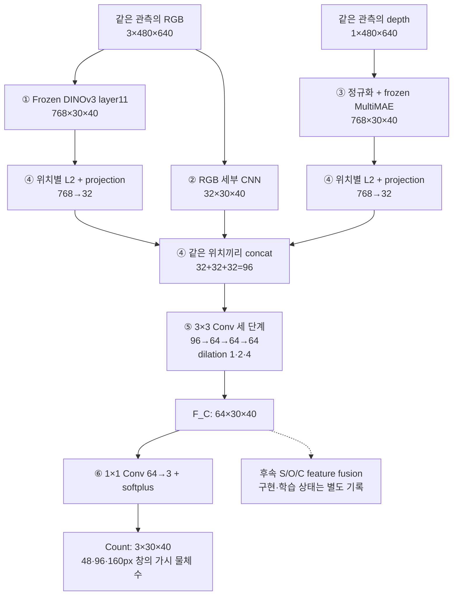
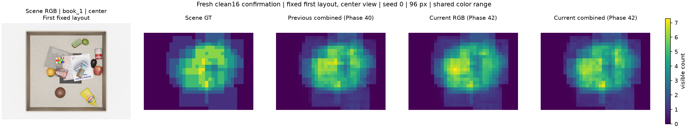

# Complexity Stream

<!-- navigation:start -->
[전체 개요](README.md) · [Similarity](similarity_stream.md) · [Occlusion](occlusion_stream.md) · **Complexity** · [Development Log](development_log.md) · [연구 문맥](agent.md)
<!-- navigation:end -->

> **현재 상태 — 2026-10-06:** Phase 42의 `frozen DINOv3 + RGB 세부 CNN + frozen MultiMAE depth` count stream을 **통합 실험의 기준 모델**로 정리함. 새 clean16 32배치·5뷰·160장에서 기존 결합 대비 MAE +1.13%, 상위20% 선택 손실 +0.93%로 사전 5% 유지 기준을 만족했고, 같은 자료로 학습한 RGB 대비 개선도 3/3 seeds에서 확인함. 기존 Phase 42 test의 선택 손실 +7.97% 실패는 보존함. 이번에는 모델을 고정해 검증했으며 새 학습·three-stream fusion·탐색 효용 평가는 수행하지 않음.

## 1. 목적과 입출력

Complexity는 **현재 더미에서 같은 크기의 영역 안에 여러 물체가 보이는 위치**를 표현함. 찾는 target의 사진이나 이름을 받지 않고 scene 자체를 읽음. Similarity가 target과 관련된 가시 영역을, Occlusion이 target별 가림 가능성을 다루는 데 더해, 지역적인 혼잡 정도를 제공하려는 stream임.

현재 감독값은 지역별 가시 물체 수임. 같은 `96×96px` 영역에 책 한 권이 보이면 1, 책·과일·장난감의 일부가 각각 기준 면적 이상 보이면 3으로 셈. 물체가 차지한 면적이 같아도 서로 다른 물체가 많으면 count가 커질 수 있음.

이 정의는 관측 가능한 혼잡도를 다룸. 완전히 가려진 물체 수, 물리적 접촉·지지, 제거 난이도까지 나타내는 정답은 아님. 현재 count 표현이 최종 탐색에 도움이 되는지는 다른 두 stream과의 결합 평가로 확인할 항목임.

### 입력과 출력

| 구분 | 실제 규격 | 의미 |
|---|---|---|
| Scene RGB | `B×3×480×640` | 현재 관측의 색·무늬·윤곽·문맥 |
| Scene depth | `B×1×480×640`, 미터 단위 | RGB와 대응하는 관측 표면의 깊이 |
| DINO 특징 | RGB에서 계산한 `B×768×30×40` | Frozen DINOv3의 마지막 block 출력. 사용자가 따로 준비하는 센서 입력은 아님 |
| MultiMAE 특징 | Depth에서 계산한 `B×768×30×40` | Frozen depth encoder의 공간 특징 |
| 중간 표현 `F_C` | `B×64×30×40` | 지역 count 예측을 학습하며 형성한 위치별 64채널 표현 |
| Count 출력 `N̂` | `B×3×30×40` | 같은 위치 주변의 `48/96/160px` 정사각형에서 보이는 물체 수 추정 |

`B`는 batch에 포함된 관측 수임. 한 관측은 한 camera의 RGB-D이며, 다섯 camera 영상을 동시에 넣는 모델이 아님.

예를 들어 위치 A의 count 출력 `[1.2, 2.7, 4.8]`은 작은 창에서 약 1.2개, 중간 창에서 약 2.7개, 큰 창에서 약 4.8개를 예측했다는 뜻임. 설명용 가상값이며 확률이나 측정된 정수 물체 목록을 뜻하지 않음.

### 관측 입력과 정답의 구분

| 정보 | 역할 |
|---|---|
| Scene RGB-D | 학습·추론에서 예측을 만드는 입력 |
| 원본 IsaacSim instance ID와 물체 대응표 | Offline count GT 생성에 사용 |
| Count GT와 GT 유효 영역 | 학습 loss와 별도 평가에 사용 |
| GT 물체 mask·ID·배치의 활성 물체 수 | Network forward에 제공하지 않음 |

현재 모델은 scene segmentation, target reference, workspace mask, 빈 서랍 depth를 요구하지 않음. 원본 베이지 서랍이 포함된 RGB-D 전체를 처리하고, 영상 안의 모든 `30×40` 위치에 출력을 만듦. 정량 평가에서 GT로 유효 위치를 고르는 일과 추론에서 GT를 입력하는 일은 구분함.

## 2. 전체 모델 구조

**RGB에서는 외형·문맥과 원본 영상의 세부 패턴을, depth에서는 거리 패턴을 읽어 같은 위치에서 결합함.** 먼저 완전한 segmentation을 만들고 검출된 물체를 세는 구조는 아님. 아래 ①–⑥은 다음 절의 번호와 같음.


```mermaid
flowchart TB
    RGB["같은 관측의 RGB<br/>3×480×640"] --> DINO["① Frozen DINOv3 layer11<br/>768×30×40"]
    RGB --> DETAIL["② RGB 세부 CNN<br/>32×30×40"]
    DEPTH["같은 관측의 depth<br/>1×480×640"] --> MAE["③ 정규화 + frozen MultiMAE<br/>768×30×40"]
    DINO --> PD["④ 위치별 L2 + projection<br/>768→32"]
    MAE --> PM["④ 위치별 L2 + projection<br/>768→32"]
    PD --> CAT["④ 같은 위치끼리 concat<br/>32+32+32=96"]
    DETAIL --> CAT
    PM --> CAT
    CAT --> FUSE["⑤ 3×3 Conv 세 단계<br/>96→64→64→64<br/>dilation 1·2·4"]
    FUSE --> FC["F_C: 64×30×40"]
    FC --> HEAD["⑥ 1×1 Conv 64→3 + softplus"]
    HEAD --> COUNT["Count: 3×30×40<br/>48·96·160px 창의 가시 물체 수"]
    FC -.-> FUTURE["후속 S/O/C feature fusion<br/>구현·학습 상태는 별도 기록"]
```

그림의 크기는 `채널×세로×가로`이며 batch 축은 생략함. 768·32·64는 위치마다 남기는 숫자의 개수임. 768개의 물체를 찾았다는 뜻이 아님. 예를 들어 `64×30×40`은 30행·40열의 각 위치에 숫자 64개가 있다는 의미임.

### 실제 tensor 변화

| 경로 | 처리 전 → 처리 후 |
|---|---|
| DINO | RGB `3×480×640` → 마지막 block `768×30×40` → L2 → `1×1 Conv` → `32×30×40` |
| RGB 세부 | `3×480×640` → PixelUnshuffle(4) `48×120×160` → `1×1 Conv` `32×120×160` → stride2 Conv `32×60×80` → stride2 Conv `32×30×40` |
| Depth | `1×480×640` → 영상별 정규화 → MultiMAE 공간 특징 `768×30×40` → L2 → `1×1 Conv` → `32×30×40` |
| 결합 | 세 `32×30×40` → concat `96×30×40` → 세 Conv → `F_C: 64×30×40` |
| Count head | `64×30×40` → `1×1 Conv` `3×30×40` → softplus → 세 count map |

**세 크기의 count는 한 번의 head에서 동시에 생성함.** 48px 창을 모두 crop한 뒤 다시 추론하거나, 복잡한 위치만 여러 번 처리하는 반복 경로는 없음. 같은 관측의 RGB·depth에서 특징을 계산하고 두 결과가 준비되면 결합함.

고정된 처리 순서가 세 stream의 처리시간까지 같다는 뜻은 아님. 현재 Complexity에는 DINO와 별도의 MultiMAE encoder가 있으며, end-to-end 지연은 통합 실행에서 따로 측정해야 함. 같은 관측 ID의 `F_S/F_O/F_C`를 함께 사용하는 것은 후속 통합의 입력 조건임.

## 3. 내부 모듈과 선택 이유

### ① DINOv3로 RGB의 외형·문맥을 표현함

RGB를 0–1로 바꾸고 ImageNet mean/std로 정규화한 뒤 frozen DINOv3 ViT-B/16에 넣음. 16×16 patch 간격이므로 `480/16=30`, `640/16=40`이며, 0-based block index 11의 출력은 `768×30×40`임.

이 경로는 책 표지·과일 표면·주변 물체의 배치처럼 RGB에 나타나는 정보를 후속 count 학습에 제공함. DINO 특징을 세거나 특정 channel을 물체 하나로 취급하지 않음. Count GT를 통해 뒤의 작은 head가 이 특징을 읽는 방법을 학습함.

한 grid 위치는 원본의 16×16 patch에 대응하지만 DINO 내부 attention이 영상의 다른 위치도 함께 처리함. 따라서 그 feature가 해당 256pixel만 담는다고 한정하지 않음. Backbone의 `norm=True`는 LayerNorm이며 ④의 channel L2 정규화와 다른 연산임.

Similarity·Occlusion도 같은 DINOv3 계열의 layer `2/5/8/11`을 사용하고 Complexity는 `11`만 사용함. **동일 관측·가중치·전처리·정밀도 조건을 맞춘 통합 구현에서는 공통 DINO forward의 layer11을 재사용할 수 있음.** 현재 독립 평가 경로들이 이미 하나의 three-stream 실행기를 공유한다는 뜻은 아님.

### ② 원본 RGB의 세부 패턴을 별도 CNN으로 읽음

DINO의 30×40 특징과 함께 원본 RGB를 읽는 작은 CNN을 둠. Patch 안의 세부 색 변화와 배열을 count head에 제공하려는 경로임. RGB를 `[-1,1]` 범위로 바꾼 뒤 PixelUnshuffle(4)를 적용함.

```text
원본의 4×4 위치 × RGB 3개 = 숫자 48개
              ↓ 평균하지 않고 channel로 재배열
한 위치의 48채널
              ↓ 1×1 Conv 48→32
32×120×160
              ↓ 3×3 Conv, stride2
32×60×80
              ↓ 3×3 Conv, stride2
32×30×40
```

PixelUnshuffle 자체는 원본 값을 버리지 않고 위치를 channel로 옮김. 이후 학습되는 convolution이 세부 정보를 조합하고 공간 위치 수를 줄임. 세 Conv 뒤에는 GroupNorm(8)과 GELU를 적용함.

이 경로의 출력은 instance mask가 아님. DINO와 RGB CNN을 함께 사용한 모델의 성능을 확인했으며, 두 RGB 경로 각각의 독립 기여량까지 분리한 결과로 해석하지 않음.

### ③ 관측 depth를 MultiMAE 공간 특징으로 바꿈

**MultiMAE에 입력하는 것은 센서·시뮬레이터가 제공한 depth임.** RGB에서 depth를 새로 추정해 넣는 경로가 아님. 여러 modality로 사전학습된 공식 checkpoint에서 depth input adapter와 공유 encoder만 사용하며 RGB·semantic adapter와 복원 decoder는 실행하지 않음.

Depth는 먼저 영상마다 숫자 범위를 맞춤. 유한한 양수인 관측값을 정렬하고, 통계 계산에서 양 끝의 10%를 제외한 값들로 평균과 sample variance를 계산함. 모든 유효 depth에 아래 정규화를 적용함. 양 끝 10%를 영상에서 삭제하는 연산은 아님.

```text
정규화 depth = (관측 depth − trimmed mean) / sqrt(trimmed variance + 1e−6)

무효 depth → 위 mean으로 채움 → 정규화 뒤 0
```

예를 들어 통계에 사용한 평균이 3.0m, 표준편차가 0.1m라고 가정하면 2.9m는 약 −1, 3.1m는 약 +1이 됨. 설명용 가상값임. 이 전처리는 영상 안의 상대적인 거리 변화를 강조하며 절대 거리값을 그대로 보존하는 경로는 아님.

현재 MultiMAE 입력은 한 channel임. 별도의 valid channel을 붙이지 않으므로 무효값을 채운 0과 평균 깊이의 0을 입력값만으로 구별하지 못함. 모든 depth가 무효이면 정규화 영상은 0이지만 위치 정보와 encoder 계산을 거친 특징까지 0이라고 가정하지 않음.

정규화한 `480×640`을 resize·crop 없이 16×16 patch로 처리함. 공식 adapter가 위치 표현을 현재 30×40에 맞추고, 마지막 global token을 제외한 1,200개 공간 token을 `768×30×40`으로 정리함. 추론에서는 사전학습의 무작위 patch masking을 수행하지 않음.

이 경로는 depth의 공간 패턴을 이미 학습된 표현으로 제공하려는 선택임. RGB와 결합했을 때의 추가 효과를 평가했으며, encoder 구조·전처리·사전학습 효과를 각각 분리한 비교는 아님.

### ④ 특징의 폭을 맞추고 같은 위치에서 이어 붙임

DINO와 MultiMAE 특징은 각각 위치마다 768개 숫자를 가짐. 각 위치에서 channel 방향의 길이를 1로 맞춘 뒤, 서로 다른 `1×1 Conv 768→32 → GroupNorm(8) → GELU`에 넣음.

```text
DINO의 위치 A:       768개 → L2 → 학습 변환 → 32개
RGB 세부의 위치 A:                          32개
MultiMAE의 위치 A:   768개 → L2 → 학습 변환 → 32개
                                             ↓ concat
                                [DINO 32 | RGB 32 | depth 32]
                                             총 96개
```

L2는 vector의 길이를 맞추는 연산임. 설명용 `[3,4]`는 `[0.6,0.8]`이 됨. 각 특징의 방향과 조합을 읽도록 하는 입력 규격이며, DINO와 MultiMAE의 같은 channel 번호가 같은 뜻이 되게 만드는 연산은 아님.

Projection은 앞의 32개만 고르는 것이 아니라 768개를 학습 가중치로 조합해 새로운 32개를 만듦. Concat은 그 결과들을 이어 붙이는 연산이므로 32채널끼리 단순히 더한 값과 다름. 뒤의 count 오차가 줄어들도록 projection과 결합 CNN이 함께 학습됨.

### ⑤ 주변 위치를 함께 읽어 `F_C`를 만듦

지역 물체 수는 중심의 한 위치만으로 정해지지 않으므로, 결합한 96채널을 주변 위치와 함께 읽음.

```text
96×30×40
 → 3×3 Conv 96→64, dilation1, padding1 → GN(8) → GELU
 → 3×3 Conv 64→64, dilation2, padding2 → GN(8) → GELU
 → 3×3 Conv 64→64, dilation4, padding4 → GN(8) → GELU
 → F_C: 64×30×40
```

Dilation은 3×3 filter가 읽는 격자 위치의 간격임. 1·2·4로 늘려 공간 해상도를 유지하면서 더 떨어진 위치도 함께 처리함. 세 count window마다 별도 CNN을 실행하는 구조는 아님.

GroupNorm은 한 영상 안에서 channel을 8개 group으로 나누어 각 group의 channel·공간 값을 함께 정규화하고, GELU는 비선형 변환을 적용함. DINO/MultiMAE도 전체 문맥을 포함하므로 모델의 정보 범위를 단순한 3×3 원본 pixel에 한정하지 않음.

`F_C`의 64개 channel에는 사람이 개수·높이·접촉 등의 이름을 지정하지 않음. 세 count GT를 맞추는 과정에서 학습된 표현임. 기존 다른 실험의 직접 depth cue 9개를 이어 붙이는 경로도 현재 모델에는 없음.

### ⑥ Count head가 64개 특징을 세 개수로 읽음

마지막 `1×1 Conv 64→3`은 각 위치의 64개 feature를 서로 다른 세 가중합으로 바꿈. 각 값에 `softplus(z)=log(1+exp(z))`를 적용하여 음수 count가 나오지 않게 함.

| 출력 channel | 감독하는 값 |
|---|---|
| 0 | 중심 주변 48×48px에서 보이는 물체 수 |
| 1 | 중심 주변 96×96px에서 보이는 물체 수 |
| 2 | 중심 주변 160×160px에서 보이는 물체 수 |

Count를 16으로 나누거나 sigmoid로 0–1에 제한하지 않음. 출력 2.7은 가시 물체 수의 연속적인 회귀값임. 세 창의 count가 반드시 작은 창부터 증가하도록 강제하는 별도 제약도 없음.

**`F_C`와 count map은 역할이 다름.** `F_C`는 위치마다 64개 숫자가 남은 표현이고, count head는 그 표현을 GT와 비교할 수 있는 세 값으로 읽는 출구임. Count loss의 gradient가 projection·RGB CNN·결합 CNN까지 전달되며 frozen DINO/MultiMAE의 weight는 바뀌지 않음.

향후 fusion의 후보 입력은 count map 세 장보다 head 이전의 `F_C`임. `F_S/F_O/F_C`의 channel을 이어 붙이면 `B×192×30×40`이 되지만, shape가 맞는 것만으로 추가 효용이나 통합 학습이 검증되는 것은 아님. 현재 독립 평가기는 모델이 반환한 두 값 중 count를 저장하며, `F_C`의 반환 구현과 fusion 실행을 구분함.

<details>
<summary>구현 세부: 학습 parameter</summary>

| 구성 | Parameter 수 |
|---|---:|
| DINO projection | 24,672 |
| RGB 세부 CNN | 20,256 |
| MultiMAE projection | 24,672 |
| 세 단계 결합 CNN | 129,600 |
| Count head | 195 |
| 합계 | **199,395** |

Frozen DINOv3와 MultiMAE parameter는 이 합계에서 제외함. 현재 `PretrainedDepthCountModel`의 실제 module shape와 저장 training protocol의 `stored_head_parameters`를 대조한 값임. 위 학습 모듈은 FP32로 실행하며, 평가 때는 해당 checkpoint의 weight도 고정함.

</details>

## 4. GT 생성과 학습

### 1. 원본 물체 ID에서 count GT를 만듦

IsaacSim이 저장한 원본 instance ID를 장면에 놓인 개별 물체와 대응시킴. 한 물체의 여러 mesh는 같은 물체로 정리하고, 서랍·바닥은 배경으로 구분함. 색상 segmentation PNG의 서로 다른 색 수를 그대로 세는 방식은 아님.

원본 `480×640` ID 영상에서 한 변이 48·96·160px인 창을 놓고, **그 창 안에 16pixel 이상 보이는 물체 ID를 한 번씩 셈.** 같은 물체의 떨어진 조각도 ID가 같으면 한 번 셈. 창 안의 가시 면적만 사용하며 물체 중심이 창 안에 있어야 하는 조건이나 scene 전체 최소 면적 조건은 없음.

| 설명용 96px 창의 구성 | 가시 면적 | Count 반영 |
|---|---:|---:|
| 책 A의 첫 조각 + 둘째 조각 | 10px + 8px | 같은 ID이므로 합산한 18px로 한 번 셈 |
| 과일 B | 20px | 한 번 셈 |
| 장난감 C | 12px | 16px 미만이므로 제외함 |
| 서랍 바닥 | 나머지 면적 | 배경이므로 제외함 |
| **이 창의 GT** | | **2개** |

완전히 가려진 물체는 해당 영상에서 가시 pixel이 없으므로 count에 들어가지 않음. 같은 asset을 두 번 배치했다면 GT 정의는 서로 다른 물리 ID를 각각 세지만, 현재 실험이 복제품의 구분 성능까지 별도로 검증했다는 뜻은 아님.

```text
관측 RGB-D → 모델 → 예측 count ───────────┐
                                         ├→ count 차이로 loss 계산
원본 instance ID → 정해진 창에서 계수 → GT ┘

실제 추론: 관측 RGB-D → 고정한 모델 → F_C와 count
```

GT는 depth를 입력받지 않는 함수로 계산함. 따라서 depth에 잡음이나 누락을 추가해도 같은 영상의 GT는 유지함. Depth가 없다는 이유로 RGB에 보이는 물체를 정답에서 제거하지 않음.

### 2. 출력 간격과 count 영역은 다름

출력 위치 간격은 16px이고, 그 위치 주변에서 세는 영역은 48·96·160px임. 0-based grid `(행12, 열20)`의 중심은 원본 `(y=200, x=328)`임.

| 해당 중심의 창 | 원본 pixel 범위: 끝 좌표 미포함 |
|---|---|
| 48×48 | `y=[176,224), x=[304,352)` |
| 96×96 | `y=[152,248), x=[280,376)` |
| 160×160 | `y=[120,280), x=[248,408)` |

모든 창은 원본 ID에서 집계함. 16×16 patch를 다수 물체 하나로 바꾸고 세지 않으므로 작은 가시 조각이 그 변환 때문에 사라지는 절차는 없음.

창 전체가 영상 안에 있고 unknown pixel이 하나도 없을 때만 유효 GT로 사용함. 영상 밖으로 잘린 창이나 unknown이 있는 창은 0개 정답으로 학습하지 않음. 16pixel 기준은 고정한 실험 규칙이며 모든 camera·거리에서 검증된 보편적 가시성 기준은 아님.

같은 창 크기에서는 count가 클수록 영상 면적당 가시 물체 수가 많음. 서로 다른 창의 count를 그대로 비교하거나 겹치는 모든 창을 합쳐 scene 총물체 수를 구하지 않음. Pixel 면적이므로 camera 거리·화각에 따라 실제 면적은 달라짐.

### 3. 현재 모델의 학습 자료와 갱신 범위

Phase 42에서는 원래 16개 asset의 128 trajectory에서 물체 16→12→8개 상태를 각각 다섯 camera로 수집함. 같은 배치의 세 상태와 모든 view를 같은 split에 둠. `packaged_food_5/World1`은 이 수집·학습·평가에서 제외했고 원본 베이지 서랍을 유지함.

| 항목 | 현재 학습 설정 |
|---|---|
| 물리 영상 | 1,920장: train 960 / validation 480 / test 480 |
| 물체 수 학습 비율 | 16·12·8개 상태를 1:1:1로 사용 |
| 비교 모델 | RGB와 RGB+MultiMAE 각각 seeds 0/1/2, 총 6개 head |
| Frozen encoder | DINOv3와 MultiMAE. 고정 특징을 cache해 학습에 재사용 |
| Depth 입력 선택 | 관측마다 epoch당 clean 50% / 잡음 25% / 8×8 block 누락 25% |
| 잡음 cache | Train 관측별 고정 σ를 0–5mm에서 뽑고 Gaussian 잡음 한 변형을 생성. Validation은 σ=5mm |
| 누락 cache | 8×8 block의 5%를 선택해 해당 유효 depth를 0으로 만든 한 변형 |
| 학습량 | 각 20 epochs, batch 8, 총 2,400 optimizer updates |
| Optimizer | AdamW, learning rate 0.001, weight decay 0.01, gradient clip 5 |
| Checkpoint 선택 | Validation의 clean·잡음·누락 loss를 동일 가중 평균하여 최저 epoch 선택 |

RGB와 결합 모델은 같은 seed의 초기 공통 weight·학습 영상 순서·깊이 변형 선택 일정을 맞춤. RGB 모델은 depth가 바뀌어도 입력 RGB가 같으며 영상당 갱신 횟수도 동일함. 9조건 평가를 위해 seed별 모델을 여러 번 평가한 것과, 한 관측에 여러 번 학습한 것은 다른 계산임.

Frozen encoder의 출력은 cache에서 가져오지만 원본 RGB 세부 CNN과 뒤의 projection·결합 CNN·head는 학습됨. 전체 기반 모델을 함께 미세조정한 end-to-end 학습으로 부르지 않음. 배포 시에는 새로운 RGB-D에서 frozen 특징을 계산한 뒤 같은 head를 실행함.

### 4. Loss와 평가 지표

Loss는 기본 `beta=1`인 SmoothL1임. 예측과 GT 차이를 `e`라고 하면 `|e|<1`에서 `0.5e²`, 그 이상에서 `|e|−0.5`로 계산함. 정답 3에 예측 2.7이면 개수 오차는 −0.3, 해당 위치 loss는 0.045임. 설명용 가상값임.

각 영상·창 크기에서 **유효한 0개 창과 유효한 1개 이상 창의 loss를 따로 평균한 뒤 동일 비중으로 합침.** 한 종류만 존재하면 있는 종류만 사용함. 이후 창 크기와 영상을 동일 비중으로 평균함. 빈 영역이 많다는 이유만으로 그 영역이 loss 대부분을 차지하지 않게 하는 규칙임.

| 평가 지표 | 구체적으로 확인하는 것 |
|---|---|
| Count MAE | 각 창의 `abs(예측−GT)` 평균. 단위는 물체 수 |
| 평균 편향 | `예측−GT` 평균. 양수는 과대추정, 음수는 과소추정 |
| 상위20% 선택 손실 | GT가 큰 상위20% 위치의 실제 평균 count에서 모델이 고른 상위20% 위치의 실제 평균 count를 뺀 값 |

선택 손실은 같은 영상·같은 창 크기의 후보 위치 안에서 계산하며 동점 경계는 동일하게 나누어 반영함. 0이면 그 조건에서 최선의 평균 count를 가진 영역을 선택한 것이며, exact segmentation이나 작업 성공률 100%를 뜻하지 않음.

Primary 평가는 **창 중심 pixel이 물체이고 GT가 유효한 위치**를 사용함. 전체 유효 위치의 결과도 별도로 보존함. 같은 trajectory의 camera를 평균하고 창 크기·trajectory·seed에 동일 비중을 주며, 상관된 다섯 view를 독립 장면 다섯 개로 해석하지 않음.

학습·checkpoint 선택은 count loss를 사용하고 상위 영역 선택을 직접 최적화하지 않음. 따라서 평균 count 오차의 개선과 선택 손실의 개선을 함께 확인함. 정확한 값과 상대적 혼잡 위치는 연결되어 있지만 같은 지표는 아님.

## 5. 핵심 설계와 검증 결과

### 현재 구조를 정한 근거

| 설계 | 역할과 확인된 범위 |
|---|---|
| 지역 count 직접 회귀 | Segmentation의 성공 판정을 추론 선행 조건으로 두지 않고 각 장면의 원본 ID count와 직접 비교함 |
| DINO + 원본 RGB 세부 경로 | 외형·문맥과 원본 영상의 세부 패턴을 함께 전달함. 두 경로의 독립 효과를 분리한 결과는 아님 |
| Frozen MultiMAE depth | Phase 40의 깨끗한 새 자료에서 RGB 대비 개선을 확인한 뒤 후속 검증함. 구조·전처리·사전학습을 함께 바꾼 비교임 |
| 물체 감소·depth 오류 포함 학습 | Phase 42에서 12·8개 상태의 과대추정을 줄이고, 같은 자료로 학습한 RGB 대비 9조건의 두 지표 개선을 확인함 |
| 고정된 한 번의 관측 처리 | Crop 재시도·영역별 반복 실행 없이 `F_C`와 세 count map을 함께 만듦. 연산시간과 통합 효용은 별도 확인 대상임 |

### 완료한 결과와 새로운 확인의 구분

Phase 42의 기존 test에서는 결합 모델의 12·8개 상태 MAE가 이전 결합 대비 `0.717760→0.399124`, `1.197569→0.305348`로 줄었음. 새 RGB 대비 clean·잡음·누락의 9조건에서 MAE와 선택 손실이 개선됐고 각 3/3 seeds에서 확인함.

동시에 clean16 선택 손실은 이전 결합 `0.115045`에서 현재 결합 `0.124218`로 늘어 **+7.97%**, 사전 5% 유지 기준을 통과하지 못했음. 후속으로 이미 checkpoint 선택에 쓴 validation을 평가했을 때는 +2.28%, 5% 초과 seed 1/3이어서 사전 조건부 2:1:1 학습을 실행하지 않음. 이 validation 결과로 기존 test 실패나 원인 가설을 뒤집지 않음.

**새 독립 확인에서는 모델을 바꾸지 않고 clean16 장면만 추가로 수집함.** 원래 16개 물체를 모두 포함한 32배치·다섯 camera의 160장이며, 네 category의 대표 anchor와 두 수집 round로 구성함. `packaged_food_5/World1`은 제외함. 기존 자료와 다른 seed·물리 배치 및 RGB/depth 파일을 확인한 뒤, Phase 42 RGB 3개·결합 3개와 이전 Phase 40 결합 3개의 checkpoint를 고정해 비교함. 새 학습이나 checkpoint 선택을 수행하지 않음.

| 새 clean16 · 중심이 물체인 유효 창 | Count MAE ↓ | 상위20% 선택 손실 ↓ |
|---|---:|---:|
| 이전 Phase 40 결합 | 0.471533 | 0.113283 |
| Phase 42 RGB | 0.515865 | 0.140708 |
| **Phase 42 결합** | **0.476851** | **0.114333** |

현재 결합은 이전 결합보다 MAE가 **1.13%**, 선택 손실이 **0.93%** 높음. 두 지표 모두 평균과 **3/3 paired seeds**에서 사전 5% 유지 범위에 들어옴. Phase 42 RGB에 비해서는 MAE가 **7.56%**, 선택 손실이 **18.74%** 낮고 두 지표의 동시 개선도 **3/3 seeds**에서 확인함. 현재 결합이 이전 결합보다 정확해졌다는 결과는 아님.

Camera별로는 현재 결합이 RGB보다 **5/5 view에서 두 지표 모두 개선**됨. 그러나 이전 결합 대비 선택 손실은 right에서 **+5.69%**, top에서 **+8.02%**로 증가함. 사전 판정은 다섯 view 평균과 seed 단위이므로 모든 view가 5% 이내라는 뜻은 아님. 현재 결합의 평균 편향도 **−0.130359개**, 이전 결합은 **−0.026997개**로 과소추정이 더 남음. 이 한계와 원래 test 실패를 함께 보존함.

현재 결합의 정수 반올림 count 일치율은 **62.62%**, 반올림 전 오차가 1개 이내인 비율은 **87.97%**임. 전자는 `floor(예측+0.5)==GT`, 후자는 `abs(예측−GT)≤1`인 창의 비율임. 영상·창 크기별 비율을 camera·배치·seed에 동일 가중 평균했으며, 세 seed의 예측을 먼저 평균한 ensemble 정확도가 아님. 이 두 비율은 해석용 보조 지표로 기존 MAE·선택 손실 판정을 대체하지 않음.

원본 pixel 기준 GT **5,760 window 검산**, 저장 예측의 독립 CPU 수치 감사 **14,279개 검사·4,320 image-scale 재산출**을 통과함. 수치 감사는 MAE·선택 손실·평균 GT·평균 예측·bias, 두 count 일치 비율과 gate를 확인함. GPU 재추론·재학습·통계적 유의성 검정을 수행한 감사는 아님.



Trajectory ID 정렬상 첫 배치·center view·seed0·96px 창을 고정함. 열은 RGB / 장면 GT / 이전 결합 / Phase 42 RGB / Phase 42 결합이며 같은 count 색 범위를 사용함. 좋은 결과를 골라 표시한 사례가 아니고 전체 결과를 대표하는 평균 장면이라고 해석하지 않음. 상세 조건과 수치는 [Development Log](development_log.md)에 보존함.

**이 결과를 근거로 현재 count stream을 통합 실험의 기준 모델로 사용함.** 이전 test의 +7.97% 실패는 그대로 남기며, 이번 clean16 확인을 감소 상태·잡음·외부 물체의 새 검증으로 확대하지 않음. 혼잡도의 모든 관계를 설명하는 최종 GT가 입증되거나 three-stream fusion이 완료된 것은 아님. 다음 통합 평가에서 `S+O` 대비 `S+O+C`의 추가 효용을 확인함.

### 계산 비용과 적용 범위

Phase 40의 단일 모델 benchmark에서는 RGB+MultiMAE의 연산시간이 RGB의 약 1.96배, peak allocated memory가 약 2.10배였음. 당시 환경과 checkpoint에서 측정한 값이며 이번 독립 clean16 확인의 속도 측정이나 three-stream 통합 지연으로 옮겨 쓰지 않음.

현재의 평가 범위는 원래 물체 집합·합성 RGB-D·고정 camera 조건임. Phase 41의 외부 물체 한 종류 검증은 이전 checkpoint의 결과이고, 이를 새 Phase 42 모델의 외부 물체 성능으로 간주하지 않음. 실제 sensor, 새로운 camera/FOV, 새로운 물체 조합은 적용 범위를 넓히는 별도 확인 대상임.

초기 density pilot, 물체 대응·관계·접경 진단과 미실행 후보는 [Development Log](development_log.md)와 [이전 연구 설명 보존본](https://github.com/JeonHaneul/2D-PDM_DINOv3/blob/a705c458a058ace1b37276d25bf510e2435b4f98/complexity_stream.md)에 둠. 현재 구조에 합쳐 실행하는 모듈이 아님. 공개 철회한 GT 관계 회귀의 성과·수치·그림은 재게시하지 않음.

## 6. 질문과 답변

### Q1. 정답 segmentation이 없는 실제 추론에서 어떻게 물체 수를 아는가?

학습할 때 원본 물체 ID로 만든 count를 정답으로 사용하고, RGB-D의 특징에서 그 count를 근사하는 함수를 배움. 실제 추론에는 RGB-D만 넣음. 새로운 사진마다 정답임을 확인하는 기능이나 완성된 물체 mask를 출력하는 기능은 없음. 대략적인 혼잡 위치 신호의 품질을 학습에 쓰지 않은 장면의 GT로 평가하는 방식임.

### Q2. 물체가 많으면 언제나 구조적으로 더 복잡한가?

현재 count는 같은 영상 면적에서 여러 물체가 보이는 정도임. 세 물체가 떨어져 있거나 겹쳐 있어도 각 물체의 일부가 기준 면적 이상 보이면 같은 3일 수 있음. 접촉·지지·숨은 배치·제거 난이도 전체의 점수로 확대하지 않음. 다른 두 stream과 함께 사용할 보조 표현임.

### Q3. 30×40 지도 한 칸이 물체 하나인가, 16×16pixel의 개수인가?

한 칸은 예측을 놓는 위치임. 그 위치에서 작은·중간·큰 창의 count 세 개를 출력함. 예를 들어 96px 출력은 중심 patch의 물체 수가 아니라 그 중심 주변 96×96px의 물체 수임. 원본 크기로 확대해도 출력 위치가 더 촘촘해지는 새로운 추론은 아님.

### Q4. MultiMAE가 RGB에서 depth를 예측해서 DINO에 더하는가?

관측 depth를 MultiMAE에 넣고, 관측 RGB를 DINO와 RGB CNN에 넣음. 각 특징을 32채널로 만든 뒤 같은 위치의 32+32+32를 이어 붙임. 단순 합산이나 RGB에서 새 depth를 생성하는 경로가 아님.

### Q5. 왜 `F_C`는 64채널인데 count는 3채널인가?

64는 중간 표현의 폭이고 3은 감독할 창 크기의 개수임. Count head가 64개 숫자에서 세 값을 읽고, 세 GT와의 차이로 앞의 표현을 학습함. Fusion 후보는 count head 이전의 `F_C`이며, 64채널 각각이 물체 수나 확률을 뜻하지 않음.

### Q6. 복잡한 위치를 crop해서 다시 보고 세 stream을 맞추는가?

현재 모델은 같은 RGB-D 한 관측에서 고정된 경로를 한 번 실행함. 세 count 크기도 동시에 출력함. 평가 코드가 여러 영상·seed·비교 모델을 순회하는 것은 실험 집계이며, 배포에서 복잡한 위치를 여러 번 재처리하는 정책이 아님. 세 stream의 지연은 같지 않을 수 있으므로 통합에서는 같은 관측의 출력 준비와 전체 처리시간을 확인해야 함.

### Q7. Count가 2.7이거나 MAE가 0.49이면 정확도는 몇 %인가?

Count는 연속값 회귀이므로 MAE 0.49는 평가한 창에서 정답과 평균 약 0.49개 차이라는 뜻임. `1−MAE`로 정확도를 계산하지 않음. 정수 반올림 일치율이나 오차 1개 이내 비율을 쓰려면 그 계산 규칙·유효 영역·집계 순서를 따로 표시해야 함. 이 보조 비율이 기존 선택 손실 기준을 대신하지 않음.

### Q8. 이 모델을 쓰면 fusion과 탐색까지 완료되는가?

현재 count head와 `F_C` 생성은 stream 단위 구현임. 최종 위치 GT·loss·fusion decoder·탐색 정책은 별도 구현·평가가 필요함. Complexity가 제공하는 정보를 실제로 활용하는지는 같은 조건의 `S+O`와 `S+O+C` 비교로 확인해야 함. 새 clean16 결과의 판단과 통합 작업의 실행 상태를 각각 기록함.

---

<!-- navigation:start -->
[전체 개요](README.md) · [Similarity](similarity_stream.md) · [Occlusion](occlusion_stream.md) · **Complexity** · [Development Log](development_log.md) · [연구 문맥](agent.md)
<!-- navigation:end -->
