# Development Log

<!-- navigation:start -->
[전체 개요](README.md) · [Similarity](similarity_stream.md) · [Occlusion](occlusion_stream.md) · [Complexity](complexity_stream.md) · **Development Log** · [연구 문맥](agent.md)
<!-- navigation:end -->

Similarity·Occlusion·Complexity 연구가 현재 상태에 도달한 이유를 시간순으로 기록함. 각 Phase는 단순 모델 목록이 아니라 **왜 문제가 되었는지 → 무엇만 바꿨는지 → 결과가 무엇을 뜻하는지 → 다음 Step은 무엇인지**를 설명함.

## 전체 연구 흐름

이 표는 아래 상세 이력을 현재 관점에서 연결한 색인임. 각 중간 실험의 확인 결과와 현재 채택한 모델을 구분해 정리함.

| 단계 | 핵심 문제와 시도 | 현재까지의 결론 | 상세 기록 |
|---|---|---|---|
| Similarity 의미 보완 | DINO 외형 대응 → CLS category prototype → SigLIP 의미 결합 → cosine shortcut 점검 | DINO+SigLIP의 shortcut 없는 head; zero-shot 동작 정성 확인, 여러 target의 정량 평가 남음 | Phase 1–4 |
| Occlusion GT 계산 | 촬영 기반 GT를 mesh depth와 pose별 가림 비율 계산으로 전환 | GPU probability GT 생성과 렌더링 정합을 확인 | Phase 5–8 |
| Target conditioning 진단 | 공정한 split에서 외형·크기·shape와 global/local 조절을 비교 | Raw target 경로의 필요성과 geometry 적용 방식의 성능 차이를 확인; current baseline은 global FiLM/raw broadcast | Phase 9–30 |
| Occlusion 기준 모델 확정 | Fixed grid의 target별 pose 누락을 확인하고 adaptive GT로 수정 | Full16 가림확률 예측과 external target 1개의 zero-shot 성능을 정량 확인 | Phase 31–32 |
| Complexity 정의 점검 | Count/occupancy → 관측 근접도 → 실제 더미의 정적 제거 효과 | RGB-D density 예측 개선 확인; 근접도 평균은 제거 효과와 상관이 약해 GT로 채택하지 않고 관계 표현 검증으로 진행 | Phase 33–35 |
| Complexity 표현 진단 | 기존 feature의 정보 부족과 학습 목표의 한계를 구분 | DINO의 순수 patch 대응은 거의 포화; 다음은 경계·관계 능력과 보완 표현의 검증 | Phase 36 |

## 지표와 범위 읽는 법

- `MAE`: 예측 map과 GT의 평균 절대 오차로, 낮을수록 좋음.
- `Coverage`: 해당 target의 유효 pose가 실제로 덮을 수 있는 영역.
- `Workspace`: 현재 camera에서 보이는 서랍 내부 영역.
- `Impossible-workspace` 또는 `noncoverage`: 과거 실험에서 coverage 밖의 workspace를 부르던 명칭. 해당 GT 설정의 표본 pose가 덮지 않는 영역이며 저장값은 0임. 모든 pose에서 물리적으로 가림이 불가능하다는 뜻은 아님. 이 영역의 activation을 당시 지표에서 `leakage`로 측정했음.
- `S`: target scale 변화에 예측이 GT가 요구하는 방향으로 반응하는 정도. `S > 0`은 방향이 맞다는 최소 조건임.
- `Training-heldout` 4개 target은 구조 선택에 반복 사용한 development set이며 최종 zero-shot test가 아님.
- Exact 3D extent와 coverage label은 simulation에서 얻은 oracle임. Oracle 실험은 정보와 구조의 가능성을 확인하는 단계이며, target RGB만 사용하는 실제 배포 성능을 뜻하지 않음.
- 사전 평가 기준을 만족하지 못했다는 기록은 해당 가설이 불가능하다는 뜻이 아니라, **그 구성으로 후속 seed를 확대하지 않고 원인을 먼저 분리했다는 뜻**임.

## 2026-07-21 · Phase 1 — DINOv3 Appearance Matching

**Reference:** `code_260721/train_similarity.py`

**가설:** Frozen DINOv3 feature 비교만으로 unseen target의 zero-shot similarity map 생성 가능.

```text
Scene RGB  → DINOv3 patch features X_s^l
Target RGB → DINOv3 masked-pooled vector a_t^l

c_hat^l = ShiftTo01(CosineSimilarity(X_s^l, a_t^l))
Z^l     = Concat[X_s^l, a_t^l, c_hat^l]
P_S     = CNN_Head(Z^l)
```

**결과:** 색상·재질·형상 등 appearance가 유사한 영역은 탐지했으나, category-level semantic relation은 표현하지 못함.

**의미와 다음 Step:** 해당 구성에서는 dense appearance matching만으로 target–category–scene의 의미 관계를 충분히 표현하지 못했음. 다음 Step에서는 DINOv3의 image-level CLS가 category 정보를 보완할 수 있는지 확인함.

---

## 2026-07-27 · Phase 2 — CLS Prototype Category Conditioning

**Reference:** `code_260727/train_similarity.py`, `code_260727/train_common.py`

**가설:** Image-level CLS token을 category prototype으로 사용하면 patch feature보다 추상적인 category 정보 제공 가능.

Category별 CLS vector 평균으로 네 개의 prototype을 구성하고 unseen target CLS와 cosine similarity 계산.

```text
prototype_k = L2Norm(Mean[CLS(target_i) | category_i = k])

category_prob = Softmax(
    CosineSimilarity(CLS(unseen_target), prototype_k) / temperature
)
```

정답 누설 방지를 위해 leave-one-out prototype 사용. Category 확률을 spatial location에 broadcast한 뒤 interaction feature에 concat.

```text
Z^l = Concat[
    scene patch,
    target appearance,
    patch-wise cosine,
    category probability
]
```

**결과:** Category prior는 제공했으나 prototype도 DINOv3 appearance history의 평균이므로 외부 semantic grounding이 없음. 기존 prototype과 외형 차이가 큰 unseen object에서 category 추론 불안정.

**의미와 다음 Step:** 해당 네 category prototype은 학습 물체의 DINOv3 외형 이력을 요약한 값이므로, 외형이 달라지는 unseen target까지 안정적으로 설명하지 못했음. 외부 language semantics와 정렬된 VLM을 추가하는 방향으로 이동함.

---

## 2026-07-28 · Phase 3 — DINOv3 + SigLIP Semantic Fusion

**Reference:** `code_260728_ver2/train_similarity_v2.py`

**수정:** DINOv3의 dense spatial representation을 유지하고, SigLIP의 language-aligned semantics를 target query에 추가.

```text
DINO appearance : a_t^l ∈ R^768
SigLIP semantics: s ∈ R^1152
Projection      : s_t^l = W_l · s + b_l
Target query    : q_t^l = a_t^l + s_t^l
```

SigLIP image/text embedding을 평균하고 layer별 projection으로 DINOv3 차원에 정렬. 두 backbone은 frozen으로 유지하고 projection과 matching head만 학습.

**결과:** 학습에 포함되지 않은 packaged-food target에서 same-category 영역 활성화 확인.

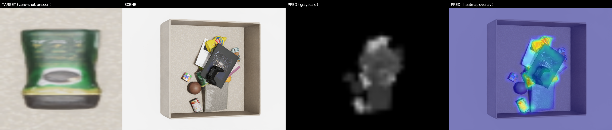
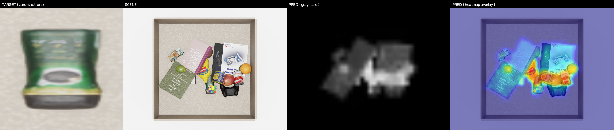

**의미와 범위:** 학습에 없던 packaged-food target을 추가 학습 없이 query로 사용하여 같은 category 영역을 활성화하는 zero-shot 동작을 정성적으로 확인함. 여러 unseen instance의 평균 성능과 SigLIP의 독립적인 기여는 후속 정량 평가·통제 비교에서 측정함.

---

## 2026-07-28–29 · Phase 4 — Exact-Instance Shortcut Evaluation

**문제:** SigLIP 결합 후 unseen packaged-food 사례에서 category-level activation을 관찰했으나, visible exact target이 same-category object보다 높게 출력되지 않는 사례도 확인함.

**실험:** DINOv3 cosine을 output logit에 직접 더하는 residual shortcut과 layer `2 + 5` 선택 방식을 평가. Global pooling, raw appearance cosine, visibility, patch matching도 함께 분석.

**결과:** 공통 held-out scene에서 no-shortcut과 shortcut의 exact-target positive ranking은 각각 `29.0%`, `29.7%`로 거의 동일. Median gap은 소폭 개선됐지만 두 모델 모두 instance-level ranking을 충분히 달성하지 못함. 공간 구조를 사용하지 않는 patch matching도 competitor score를 함께 높여 문제를 해결하지 못함.

**결론:** Shortcut은 계산 비용보다 구조와 해석의 복잡성을 늘리는 반면 실질적인 개선이 제한적이므로 최종 Similarity stream에서 제거. 현재 모델은 DINOv3–SigLIP interaction과 learned matching head만 사용함.

추가로 target별로 서로 다른 무작위 split seed가 생성되던 문제를 수정. 실행마다 seed를 한 번만 확정하여 모든 target의 scene-level train/validation split을 재현할 수 있도록 정리.

---

## 2026-08-04 · Phase 5 — Zero-Shot Occlusion Pipeline Design

**문제:** 기존 방식은 target당 `44,100`개 pose와 5개 camera를 촬영하여 중간 RGB·depth·mask를 대량 저장함. 최종 GT도 유효 pose의 depth-weighted occupancy를 scene별 min–max로 정규화하므로 서로 다른 scene에서 흰색의 절대적 의미가 일정하지 않음.

**GT 설계:** Target을 물리적으로 반복 촬영하는 과정을 USD/OBJ mesh depth 계산으로 대체. 기존 pose grid와 `70%` occlusion 판정은 legacy 재현에 유지하고, 실제 학습용 GT는 다음 확률로 별도 생성함.

```text
P_O(u,v) = N_occluded(u,v) / (N_candidate(u,v) + epsilon)
```

Legacy GT와 probability GT를 동시에 출력하여 기존 방식 재현 여부와 새 정규화 효과를 분리해 평가. Visible-target 강조는 Similarity stream과 역할이 겹치므로 Occlusion GT에서 제외함.

**Scale conditioning:** Mesh scale과 target RGB·mask scale을 반드시 동일하게 구성. 동일한 target 입력에 서로 다른 scale GT를 주면 모델이 scale별 정답의 평균으로 수렴하므로 size-effect를 학습할 수 없음. Pilot은 `0.7`, `1.0`, `1.3`으로 시작함.

**모델 설계:** Scene RGB는 frozen DINOv3, scene depth와 valid mask는 ResNet-18로 처리. Target mask에서 추출한 size·silhouette condition으로 depth feature에만 FiLM을 적용하고, target appearance는 MatchingBlock에서 별도로 결합함. 검증되지 않은 cosine shortcut은 baseline에서 제외함.

**배포 조건:** 현재 prototype은 scene RGB, scene depth, target RGB와 target mask/segmentation을 입력으로 사용함. 고정 촬영 환경의 empty-background reference로 mask를 자동 생성하는 전처리는 후속 구현 항목이며, USD/OBJ와 scale 정보는 GT 생성에만 사용함.

**Zero-shot 검증:** Frozen encoder 사용만으로 zero-shot을 가정하지 않고, 학습에서 제외한 target instance와 unseen intermediate scale을 별도 test split으로 평가함.

**다음 Step:** `packaged_food_2`, center camera, scale `1.0`의 mesh-depth 재현 pilot을 수행한 뒤 multi-asset·pose·camera 조건으로 확장함.

---

## 2026-08-04–06 · Phase 6 — Mesh-Depth Validation and GT Refinement

**Reference:** `mesh_utils.py`, `depth_rasterizer.py`, `scene_generator/occlusion_gt_pilot_capture.py`, `experiments/occlusion_gt_pilot/validate_rasterizer.py`

**검증:** `packaged_food_2`, `book_1`, `fruit_1`, `toy_3`을 대상으로 9개 pose와 5개 camera를 조합한 180개 조건에서 USD mesh depth와 Isaac Sim reference를 `640 × 480`으로 비교함.

**수정:** Segmentation reference를 `depth > 0`으로 계산하면 drawer와 background가 포함되는 오류를 확인하고 target segmentation color 기반 mask로 교체. `metersPerUnit=0.01` asset의 자동 unit-compensation scale이 transform 초기화 과정에서 제거되는 문제도 수정함.

**결과:** 176개 조건에서 silhouette IoU `0.9993–1.0000`, 전체 중앙값 `1.0000`, depth MAE 중앙값 `0.75 μm` 확인. 나머지 4개는 서랍 경계에서 drawer wall이 target 일부를 가린 조건으로, mesh projection 오류가 아니라 empty-drawer visibility 처리 차이로 확인함.

**기존 GT 문제:** 기존 `distribution_map_GPU.py`는 occluded pixel에 `valid_pos`를 적용하지만 ratio 분모에는 target 전체 pixel을 사용함. 기존 결과 재현용 `legacy_ratio`는 보존하고, 새 학습 GT는 valid pixel을 분모로 사용하는 `corrected_ratio`와 `70%` threshold를 적용하기로 결정함.

**성능 병목:** 검증용 rasterizer가 triangle별 Python loop를 사용하여 `toy_3`의 2,029,960 triangles에서 평균 `577.72 s/image` 소요. 새 asset에도 적용 가능한 자동 mesh 단순화, full-resolution 정확도 검사, hardware GPU rasterization, pose/camera batch 누적 구조가 필요함.

**결정:** 해상도는 기존과 동일한 `640 × 480`으로 유지. 기존 `distribution_map_GPU.py`는 legacy reference로 수정하지 않으며, corrected ratio와 probability normalization은 새 GT generator에 구현함. 실제 배포에서는 mesh 단순화를 수행하지 않고 scene RGB, scene depth, target RGB와 target mask/segmentation을 입력함.

**다음 Step:** Empty-drawer valid-pixel 처리를 검증에 반영하고, `toy_3`의 단순화 후보를 원본 mesh와 비교하여 자동 선택 기준을 확정한 뒤 batched GPU GT generator를 구현함.

---

## 2026-08-06 · Phase 7 — GPU Rasterization, Corrected Ratio, and Capture Reliability

**Reference:** `depth_rasterizer_gpu.py`, `experiments/occlusion_gt_pilot/validate_rasterizer_gpu.py`, `experiments/occlusion_gt_pilot/occlusion_ratio_pilot.py`, `scene_generator/vectorized_scene_v2.py`

**GPU rasterization:** nvdiffrast 기반 `640 × 480` depth renderer를 구현함. 원본 4개 asset과 `toy_3` 10k simplified mesh를 포함한 225개 조건에서 silhouette과 depth를 검증함. `toy_3` 10k mesh는 원본 대비 worst IoU `0.9938`, median depth MAE `0.3781 mm`를 기록함.

**70% decision:** 20개 clutter scene과 9개 pose, 5개 camera에서 원본·GPU·단순화 mesh를 비교함. `toy_3` 원본–10k 판정 일치율은 전체 `99.67%`, `0.65–0.75` 경계 구간 `96.59%`임.

**Corrected denominator:** Drawer wall이 target 일부를 가리는 `book_1` 경계 조건에서 valid pixel이 `10.01–12.77%` 감소함. Corrected ratio 적용 시 `6/80`개 조건의 `0.7` 판정이 변경되어 기존 분모 불일치가 실제 결과에 영향을 주는 것을 확인함.

**Clutter capture:** 물리 안정화 이후 카메라 촬영을 `world.step()`에서 render-only `world.render()`로 변경함. 캡처 전후 위치·회전 불변성을 직접 확인하고, run/scene/object pose, camera metadata, seed와 완료 상태를 저장하도록 구성함. 실제 transformed mesh vertex 기준 drawer 내부 QC도 추가함.

**후속 결과:** nvdiffrast V2 generator에 pose·camera·scene vectorization과 probability accumulator를 결합했고, V1/V2를 1,024 effective poses에서 교차검증함. 새 asset의 원본–단순화 최종 승인은 별도 절차로 유지함.

**의미와 다음 Step:** GPU rasterization과 mesh 단순화를 결합하면 기존 `640 × 480` 해상도를 유지하면서 전체 pose grid를 처리할 수 있음. 또한 corrected denominator가 실제 `70%` 판정을 바꾸는 사례를 확인했으므로, 기존 GT 재현에는 legacy ratio를 남기고 새 학습 GT에는 corrected ratio를 사용하기로 함. 다음 Step은 전체 `44,100` pose에서 legacy 재현도와 새 probability map을 동시에 확인하는 것임.

---

## 2026-08-07 · Phase 8 — Mesh-Based Legacy and Probability GT Generation

**구현:** `packaged_food_2`, scale `1.0`에서 `44,100`개 pose 전체를 nvdiffrast로 처리함. Target depth를 파일로 저장하지 않고 scene depth와 즉시 비교하여 Legacy GT와 corrected probability GT를 동시에 누적함.

**Legacy 재현:** 기존 코드를 확인하여 visible ratio가 `0.3` 이상일 때 map 전체를 `0.7`배로 낮추고 visible target mask를 `255`로 설정하는 후처리를 복원함. 대표 target frame 한 장의 pixel 수를 reference로 사용하면 threshold 경계 사례가 잘못 분류되는 문제를 확인함.

**Reference 복원:** 기존 GT 3,000 scene × 5 camera의 후처리 ON/OFF 경계를 분석하고, `44,100`개 mesh pose에서 camera별 최대 footprint를 직접 계산함. 최종 정수 reference는 center `2324`, left `2335`, right `2336`, top `2336`, bottom `2335`이며, 15,000개 기존 사례의 ON/OFF 판정을 모두 재현함.

**다중 scene 검증:** 최종 reference로 20 scene × 5 camera의 100개 사례를 재검증함. Old GT 대비 Legacy GT의 MAE는 평균 `0.0000379`, 최댓값 `0.0000959`이며, correlation은 평균 `0.9999956`, 최저 `0.9999919`임.

**분리 원칙:** Visible-target 강조는 기존 GT 재현용 Legacy map에만 적용함. 학습용 Corrected Probability GT는 `N_occluded / N_candidate`의 절대적 의미를 유지하기 위해 scene별 min–max 정규화와 visible-target 강조를 적용하지 않음.

**결과물:** Scene RGB, Target RGB, 기존 GT, mesh 기반 Legacy GT, Corrected Probability GT와 차이 map을 6-panel 이미지로 저장함. Raw/final Legacy map, Corrected Probability map, camera별 metric과 실행 설정도 로컬 실험 결과로 보존함.

Visible-target 규칙이 적용된 사례:


Visibility threshold 바로 아래에서 후처리가 적용되지 않은 사례:

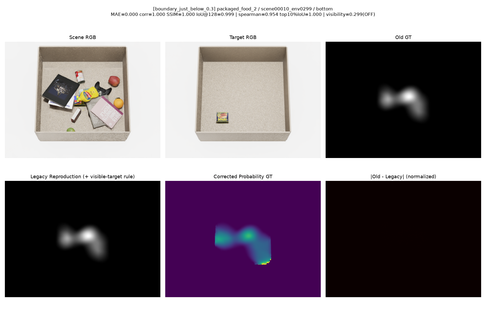

**다음 Step:** 검증 스크립트를 target-independent하게 정리한 뒤 `book_1`과 `toy_3`을 각각 5–10 scene에서 확인함. 두 target이 통과하면 GT 검증을 종료하고, corrected probability GT를 사용하는 scale `1.0` Occlusion Dataset과 학습 baseline을 구현함.

---

## 2026-08-10 · Phase 9 — Occlusion Conditioning Ablation

**문제:** 초기 학습은 target별 scene pool이 달라 모델이 target condition 대신 scene 분포를 외울 수 있었음. Shuffled-target 평가도 target별로 연속된 validation batch 내부에서만 이름을 섞어 사실상 같은 target끼리 교환되는 no-op이었음.

**수정:** 4개 target이 동일한 150개 scene을 사용하도록 구성하고, scene을 train/validation/test `100/20/30`으로 분리함. Coverage-aware patch pooling, 실제 최소 validation loss checkpoint, early stopping, 100% 다른 target을 넣는 confusion matrix와 `shift=0 == main test` invariant를 추가함.

```text
GT_patch = AvgPool(GT × Coverage) / (AvgPool(Coverage) + epsilon)
```

Target appearance와 geometry-FiLM의 기여를 분리하기 위해 네 모델을 3개 seed로 평가함.

| Variant | Test IoU mean ± std |
|---|---:|
| Appearance-only | `0.4065 ± 0.0554` |
| Geometry-only | `0.3732 ± 0.0552` |
| Full | `0.4147 ± 0.0331` |

Full은 평균 성능이 가장 높고 seed 간 변동이 가장 작았으나 Appearance-only 대비 차이는 작음. Geometry-only는 세 seed 모두 Appearance-only보다 낮음. 따라서 Full을 잠정 기본 모델로 유지하되, FiLM의 추가 이득은 unseen-scale 평가에서 최종 판단함.

---

## 2026-08-11–12 · Phase 10 — Shared-Scene Production GT and Five-Camera Validation

**목표:** Unseen-instance/seen-category 조건을 분리하기 위해 category마다 여러 instance를 확보하고, 모든 target에 동일한 clutter scene의 GT를 생성함.

**구성:** Train 10개와 held-out 4개 target을 결과 확인 전에 고정하고, 14개 target 각각에 `150 shared scenes × 5 cameras`의 scale `1.0` corrected probability GT를 생성함. 전체 target의 scene-key 집합이 동일함을 확인함.

같은 scene을 모든 target에 재사용하는 이유는 scene 외형을 통제한 상태에서 **target만 바뀌면 GT가 어떻게 달라져야 하는지** 학습시키기 위해서임. 다섯 camera는 특정 view 한 곳에서만 맞는 구조를 고르는 것을 막기 위한 현재 고정 rig의 다중-view 검사이며, 임의 camera pose 일반화를 뜻하지 않음.

**검증:** 신규 target은 center에서 찾은 단일 pose를 다섯 camera에 고정하여 실측 Isaac Sim depth/segmentation과 비교함. Camera별 pose 재탐색으로 calibration 오차를 가릴 수 없도록 구성했으며, 다섯 camera 모두 silhouette과 depth 기준을 통과함.

**발견 및 수정:**

- `toy_1`은 실제 캡처에서는 정상 크기지만 standalone mesh extraction에서 composed-stage scale을 재현하지 못해 catalog에서 제외함.
- `book_3` center의 낮은 raw IoU는 geometry 누락이 아니라 1-pixel boundary 차이로 확인함.
- 15-scene pilot 잔여 파일이 150-scene production 폴더에 섞이는 문제를 발견하고 비파괴적으로 분리함.
- 이후 generator는 manifest 밖의 scene 디렉터리를 감지하면 즉시 중단하도록 변경함.

**당시 다음 Step:** Category-balanced sampling과 camera별 평가를 포함한 held-out 1-seed smoke test로 이동함. 이후 결과는 아래 Phase 11–15에 기록함.

---

## 2026-08-13 · Phase 11 — Multi-Scale GT and Controlled Protocol

**문제:** 초기 비교는 target 수, scene pool, optimizer update 수가 달라 어떤 변경이 성능 차이를 만들었는지 분리하기 어려웠음.

**수정:** Clean scene 52개를 train 36 / validation 16으로 고정하고 category-balanced sampling을 적용함. 모든 모델을 16 epoch, epoch당 5,400 sample, 총 5,408 update로 통일함. Update 수를 맞춘 이유는 더 오래 학습한 모델이 구조 때문에 좋아진 것처럼 보이는 혼선을 제거하기 위해서임.

**결과:** Train 10 target은 차이가 분명한 scale `0.7/1.0/1.3`을 사용해 크기 효과를 학습시키고, training-heldout 4 target은 중간 scale `0.85/1.0/1.15`로 구성해 학습 scale을 그대로 반복하지 않는 반응을 확인함. 총 8,760개의 5-camera GT map을 생성함.

**판단:** 이후 size-effect 실험의 공통 비교 조건을 확립함. Held-out 4개 target은 이후 진단에 반복 사용했으므로 최종 zero-shot test가 아니라 development set으로 취급함.

---

## 2026-08-14–18 · Phase 12 — 3D Workspace and Physical-Corrected GT

**문제:** 큰 book target의 일부 candidate pose가 서랍 밖에 있거나 벽을 관통하여, 실제로는 놓을 수 없는 위치가 GT 분모에 포함됨.

**수정:** Camera ray와 drawer AABB를 이용한 3D workspace mask, 1 mm containment filter를 추가함. 기존 legacy/corrected GT는 보존하고 `physical_corrected`를 별도 생성함. 이 버전은 drawer-bound containment만 보정하며, clutter 충돌·낙하 안정성까지 포함한 완전한 physics feasibility GT는 아님.

| Target | Valid poses | MAE vs corrected | Correlation | Relative mean-probability change |
|---|---:|---:|---:|---:|
| `book_1 × 1.3` | `28,764 / 44,100` | `0.01438` | `0.9490` | `+6.8%` |
| `book_2 × 1.3` | `38,124 / 44,100` | `0.00846` | `0.9805` | `+4.0%` |
| `book_3 × 1.3` | `38,124 / 44,100` | `0.00856` | `0.9811` | `+4.0%` |

전체 `3 targets × 52 scenes × 5 cameras = 780` map에서 파일 존재, finite 범위, `N_occ ≤ N_all`, workspace containment를 확인함.

**판단:** 공간 패턴은 대체로 유지하면서 invalid pose로 낮아졌던 확률을 보정함. 각 target-scale 조합에는 하나의 GT만 사용하며, `book_1/2/3 × 1.3`은 physical-corrected, 나머지는 corrected로 routing함.

---

## 2026-08-19–20 · Phase 13 — Workspace Leakage and Ring-Loss Check

**문제:** 예측 확률 질량의 `57–78%`가 서랍 외부에 남는 leakage를 확인함. 이는 target size 학습 문제와 별개로 고정 camera에서 drawer support를 구분하지 못한 결과임.

**수정:** 현재 5-camera calibration에서 만든 workspace mask v4를 출력에 적용함. Coverage 밖 safe-ring을 억제하는 loss도 `λ = 0.01/0.02/0.05`로 비교하고 sampler와 loader RNG를 분리함.

**결과:** Hard mask 적용 후 full-image MAE가 `75–85%` 감소했으나 이는 현재 rig의 기하 후처리 효과임. Ring loss는 held-out scale-response를 일관되게 보존하지 못했고, `λ=0.05`는 `toy_4`의 5개 camera를 모두 악화시킴.

**판단:** `ring_weight=0 + hard workspace mask`를 유지함. Camera 위치가 바뀌면 calibration으로 mask를 다시 생성해야 하며, camera-free 일반화로 해석하지 않음.

---

## 2026-08-20–21 · Phase 14 — Analytic Geometry and Size-Only Conditioning

**문제:** Native scale은 실제 target mask, non-native scale은 mesh render에서 geometry를 추출하여 scale 변화와 입력 source 변화가 섞였음. 68-D silhouette descriptor는 target별 세부 형상을 외우는 경로가 될 가능성도 있었음.

**수정:** 실제 target mask의 `area`, `bbox_h`, `bbox_w`를 scale에 따라 수학적으로 변환함. 이어 모델 shape와 초기화는 유지하고 이 세 값만 활성화한 `size_only_padded`를 3 seed로 비교함.

| 3-seed development metric | Analytic full 68-D | Size-only: 3 active values in 68-D |
|---|---:|---:|
| Training-heldout MAE | `0.11082` | `0.08535` |
| Pooled scale-response `S` | `0.1477` | `0.2224` |
| Positive camera cells | `89 / 120` | `119 / 120` |

Log+z-score geometry는 seed 0에서 pooled `S 0.2407 → 0.2069`, positive camera `40/40 → 36/40`로 악화되어 보류함.

**판단:** Raw size-only를 현재 working baseline으로 채택함. 다만 seed 1에서는 pooled `S`가 소폭 하락했고 `packaged_food_4` underprediction이 남아 있어 최종 구조나 zero-shot 증거로 확정하지 않음.

---

## 2026-08-21 · Phase 15 — Target-Conditioning Path Diagnosis

**문제:** `packaged_food_4` 오차가 DINOv3, ResNet-18, FiLM, target appearance 중 어느 경로에서 발생하는지 분리되지 않았음.

**진단:** Frozen size-only 모델에서 same-category donor를 넣어 경로를 나눠 확인함. 예측 확률의 평균 절대 변화인 output sensitivity는 cosine-only에서 약 `10⁻⁶`, raw target broadcast에서 `0.014–0.081`로 나타남. Broadcast 변화는 주로 vector norm보다 direction을 통해 전달됨. 하지만 donor에 따라 MAE가 `+0.0114` 또는 `−0.0412`로 반대 방향을 보여, frozen swap만으로 broadcast 제거가 개선된다고 결론 내릴 수 없음.

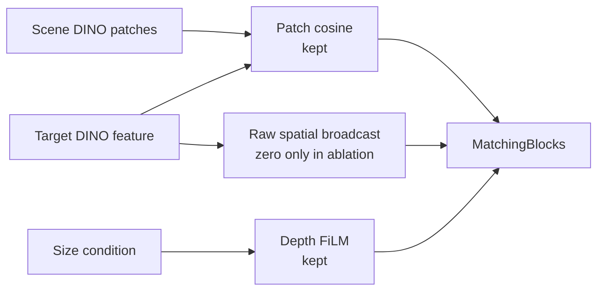
```mermaid
flowchart LR
    S["Scene DINO patches"] --> C
    T["Target DINO feature"] --> C["Patch cosine<br/>kept"]
    T --> B["Raw spatial broadcast<br/>zero only in ablation"]
    G["Size condition"] --> F["Depth FiLM<br/>kept"]
    C --> M["MatchingBlocks"]
    B --> M
    F --> M
```

**수정:** Parameter shape와 cosine/FiLM 경로를 유지하고 raw target broadcast만 0으로 고정하는 controlled model을 구현함. 현재 코드에서 같은 seed로 생성한 raw-broadcast와 zero-broadcast 모델의 parameter shape와 초기 state가 동일함을 확인했으며 SHA-256은 `d8c3122c…f8c0`임.

**Controlled retrain 결과:** 16 epoch와 5,408 update를 모두 완료한 final checkpoint를 동일 seed의 broadcast-on reference와 비교함.

| Seed-0 fixed-update metric | Broadcast ON | No broadcast | Change |
|---|---:|---:|---:|
| Seen coverage MAE | `0.05155` | `0.08100` | `+57.1%` |
| Training-heldout coverage MAE | `0.07725` | `0.11494` | `+48.8%` |
| Heldout pooled `S > 0` | `8 / 8` | `0 / 8` | 기준 미충족 |
| Heldout camera `S > 0` | `40 / 40` | `2 / 40` | 기준 미충족 |
| `packaged_food_4` native MAE | `0.09802` | `0.22229` | `+126.8%` |
| `packaged_food_4` native bias | `−0.08694` | `−0.22058` | Underprediction 증가 |

CSV 1,680행의 composite key가 모두 고유하고, 두 checkpoint는 seed 0, epoch 15, 5,400 samples/epoch, 5,408 cumulative batches 조건을 만족함.

**판단:** No-broadcast 구성은 사전 broad gate를 만족하지 못해 seeds 1–2 확대를 진행하지 않음. 현 architecture에서 scalar cosine과 size-FiLM만 남기는 방식은 target conditioning을 충분히 유지하지 못했음. 다음 실험은 target 정보를 없애지 않으면서 absolute target code 의존을 줄이는 relation-aware interaction으로 제한함.

---

## 2026-08-21 · Phase 16 — Fresh Paired Reproducibility Gate

**문제:** 기존 broadcast-on checkpoint에는 최초 initialization과 sample-order hash가 없어, no-broadcast 성능 저하가 target 경로 제거 때문인지 과거 실행과의 차이 때문인지 완전히 분리되지 않았음.

**검증:** 현재 코드에서 broadcast-on seed 0을 `16 epoch`, `5,408 update`로 다시 학습함. 초기 state SHA-256은 `d8c3122c…f8c0`, 첫 epoch sample-order SHA-256은 `26e6843b…303b`로 기록함.

| Reproducibility check | Result |
|---|---|
| Epoch 0–15 train/validation metrics | 기존 accepted run과 전부 일치 |
| Final model-state SHA-256 | 두 모델 모두 `6354241b…55d7a` |
| State tensors | `168 / 168` bitwise identical |
| Compared parameters | `15,716,309`개 원소, mismatch `0` |
| Maximum absolute difference | `0.0` |

Checkpoint 파일 해시는 provenance metadata 추가로 서로 다르지만, 실제 추론에 쓰이는 모든 model tensor는 동일함.

**판단:** Fresh broadcast-on 재현 gate가 통과했으므로 동일 seed·초기화·sample order의 seed-0 비교에서 나타난 no-broadcast의 MAE 증가와 scale-response 약화는 code/data drift보다 raw target broadcast 제거의 영향으로 판단함. 단순 제거 실험은 종료하고, 다음 Step에서는 scene과 target의 채널별 관계를 보존하는 interaction을 동일 조건으로 비교함.

---

## 2026-08-21 · Phase 17 — Relation-Aware Target Interaction

**문제:** Scalar cosine과 size-FiLM만 남긴 no-broadcast 모델은 target 정보를 충분히 전달하지 못했음. Raw target vector를 다시 넣지 않으면서 cosine 합산 전의 채널별 관계를 보존할 방법이 필요했음.

**수정:** 기존 target 768채널 자리를 normalized channelwise product로 교체함. Scene RGB, depth FiLM, shifted cosine, MatchingBlock, parameter 수와 초기화는 그대로 유지함.

```text
q(x) = Normalize(scene_patch(x)) × Normalize(target)
r(x) = sqrt(C) × Normalize(q(x))

MatchingBlock input = [scene patch, FiLM depth, r(x), shifted cosine]
```

초기 state SHA와 sample-order SHA는 fresh raw 기준과 일치했고, parameter `15,706,689`개와 `5,408` update를 동일하게 유지함.


| Seed-0 fixed-update metric | Raw broadcast | No broadcast | Channel relation |
|---|---:|---:|---:|
| Final validation loss | `0.30448` | `0.34033` | `0.32434` |
| Final validation IoU | `0.393` | `0.250` | `0.308` |
| Seen coverage MAE | `0.05155` | `0.08100` | `0.06443` |
| Training-heldout coverage MAE | `0.07725` | `0.11494` | `0.08674` |
| Heldout pooled `S > 0` | `8 / 8` | `0 / 8` | `7 / 8` |
| Heldout camera `S > 0` | `40 / 40` | `2 / 40` | `37 / 40` |
| `packaged_food_4` native MAE | `0.09802` | `0.22229` | `0.11708` |
| `packaged_food_4` native bias | `−0.08694` | `−0.22058` | `−0.10623` |

Workspace 전체 MAE는 relation 모델에서 감소했지만, coverage 내부 MAE와 underprediction은 증가함. Workspace에는 GT가 0인 픽셀이 많아 출력을 전반적으로 낮추는 것만으로도 오차가 줄 수 있으므로 채택 근거로 사용하지 않음.

**판단:** Channel relation은 no-broadcast보다 target 조건을 많이 회복했지만 사전 safety gate와 `packaged_food_4` 개선 gate를 모두 통과하지 못함. Seeds 1–2는 실행하지 않고 raw broadcast baseline을 유지함. 이번 결과는 추가 L2 normalization까지 포함한 relation 표현 전체의 결과이므로, 다음 Step에서는 낮은 유사도의 patch도 동일한 relation energy를 갖게 되는 정규화 효과부터 분리 진단함.

---

## 2026-08-21 · Phase 18 — Relation Magnitude Diagnostic

**문제:** Phase 17의 L2 normalization은 채널별 관계 방향은 남기지만 `‖q‖`를 제거함. 이 때문에 target과 약하게 대응하는 patch도 강하게 대응하는 patch와 같은 크기의 relation feature를 받음.

쉽게 말하면 `q`는 scene과 target의 768개 channel이 위치별로 얼마나 같은 방향으로 반응했는지를 담은 목록임. `‖q‖`는 그 목록 전체의 반응 세기인데, 완전히 정규화하면 “매우 비슷함”과 “조금 비슷함”의 세기 차이가 사라질 수 있어 이 정보가 GT 설명에 도움이 되는지 먼저 확인함.

**검증:** Held-out target과 validation scene은 사용하지 않고, 학습용 10 target·36 scene·5 camera만 분석함. 같은 scene·camera·patch에서 target 평균을 제거한 뒤, cubic cosine 12개만 사용한 기준과 cosine으로 설명되지 않는 `log‖q‖` 4개를 추가한 경우를 scene 단위 6-fold로 비교함. Target 가중치는 실제 학습 sampler와 동일하게 category-balanced로 설정함.

```text
q_l(x) = Normalize(scene_l(x)) × Normalize(target_l)
r_l(x) = sqrt(C) × q_l(x) / (m_l + epsilon)
```

`m_l`은 학습 target의 실제 coverage 영역에서 계산한 layer별 `‖q_l‖` 중앙값이며, 추론 시 다시 계산하지 않는 고정값임.

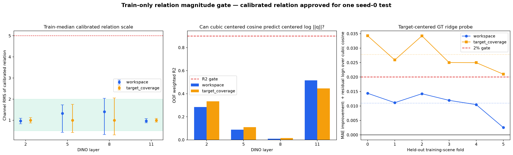

| Train-only diagnostic | Result |
|---|---:|
| Coverage MAE: cubic cosine only | `0.08829` |
| Coverage MAE: + residual `log‖q‖` | `0.08583` |
| Relative improvement | `2.78%` |
| Improved scene folds | `6 / 6` |
| Scene-bootstrap 95% interval | `+2.01% – +3.46%` |
| Cosine-independent DINO layers | `4 / 4` |
| Uncalibrated `C·q` scale gate | `0 / 40` — 기준 미충족 |
| Train-median calibrated scale gate | `40 / 40` — pass |

**판단:** `‖q‖`에는 cubic cosine만으로 설명되지 않는 target-dependent GT 신호가 남아 있음. 단순 `C·q`는 feature 크기가 지나치게 커 사전 기준을 만족하지 못했으며, 대신 train-only 중앙값으로 크기만 고정한 relation을 동일 초기화·동일 sample order의 seed 0 한 번으로 평가함. 이 진단은 다음 실험을 수행할 근거이며 zero-shot 성능 증명은 아님. Seed 0이 사전 held-out 5-camera gate를 통과하기 전에는 seeds 1–2를 실행하지 않음.

---

## 2026-08-22 · Phase 19 — Magnitude-Calibrated Relation Evaluation

**문제:** Phase 18의 train-only 진단에서 relation 크기 `‖q‖`가 GT와 관련된 신호를 보였지만, 이 신호가 전체 비선형 모델의 학습·일반화까지 개선하는지는 확인되지 않았음.

**실험:** 학습 target에서 미리 계산한 layer별 중앙값 `m_l`을 고정하고, 추론 시 held-out target으로 재보정하지 않음. Raw baseline과 초기 state, sample order, `16 epoch`, `5,408 update`, dataset을 동일하게 맞춰 seed 0을 학습함.

```text
r_l(x) = sqrt(C) × q_l(x) / (m_l + epsilon)
```


| Seed-0 fixed-update metric | Raw broadcast | No broadcast | Normalized relation | Magnitude-calibrated relation |
|---|---:|---:|---:|---:|
| Seen coverage MAE | `0.05155` | `0.08100` | `0.06443` | `0.07073` |
| Training-heldout coverage MAE | `0.07725` | `0.11494` | `0.08674` | `0.09298` |
| Heldout pooled `S > 0` | `8 / 8` | `0 / 8` | `7 / 8` | `7 / 8` |
| Heldout camera `S > 0` | `40 / 40` | `2 / 40` | `37 / 40` | `34 / 40` |
| `packaged_food_4` native MAE | `0.09802` | `0.22229` | `0.11708` | `0.12220` |
| `packaged_food_4` native bias | `−0.08694` | `−0.22058` | `−0.10623` | `−0.10706` |

Magnitude-calibrated relation은 raw baseline 대비 seen coverage MAE `+37.20%`, heldout coverage MAE `+20.35%`로 악화됨. `packaged_food_4`도 5개 camera 모두에서 MAE와 bias가 개선되지 않음. Workspace MAE는 낮아졌지만, target coverage에서 underprediction이 커졌으므로 예측값 전체가 낮아진 효과로 판단함.

**판단:** Train-only 진단은 실험 후보를 거르는 용도였지만, 전체 모델의 성능 개선을 보장하지 않았음. Magnitude-calibrated seeds 1–2는 실행하지 않고 appearance interaction 변형은 종료함. Fresh raw size-only를 현재 기준 모델로 유지하며, 다음 후보는 target mask에서 계산할 수 있는 소수의 물리적 크기·형상 descriptor로 제한함.

---

## 2026-08-22 · Phase 20 — Compact Physical Shape Descriptor Gate

**문제:** Size-only의 `area·bbox_h·bbox_w`는 target의 전체 크기는 나타내지만, 같은 크기에서 모양과 질량 분포가 다른 물체를 구분하지 못함.

**수정:** Target mask에서 길쭉함 `eta`와 moment compactness `kappa` 두 값만 추가하는 후보를 설계함. 초기 구현에서 bbox를 `8 × 8` 정사각형으로 변환하며 물체의 길쭉함이 사라지는 문제를 발견함. 원래 mask 좌표계의 bbox 크기를 복원해 moment를 계산하도록 수정한 후 재검증함.

```text
eta   = (lambda_max - lambda_min) / (lambda_max + lambda_min)
kappa = mask_area / (2*pi*(lambda_max + lambda_min))
```

이 단계는 full model 학습이 아니라 descriptor가 다음 학습 후보로서 가치가 있는지 저렴하게 확인하는 train-only screening임. 학습 10 target·36 scene·3 scale·5 camera만 사용하고, target 하나를 donor에서 완전히 제외한 leave-one-target-out 비교를 수행함. Held-out 4 target과 validation scene은 사용하지 않았으며, shape를 같은 category의 다른 target과 바꾸는 64개 대조 조건도 같이 계산함.

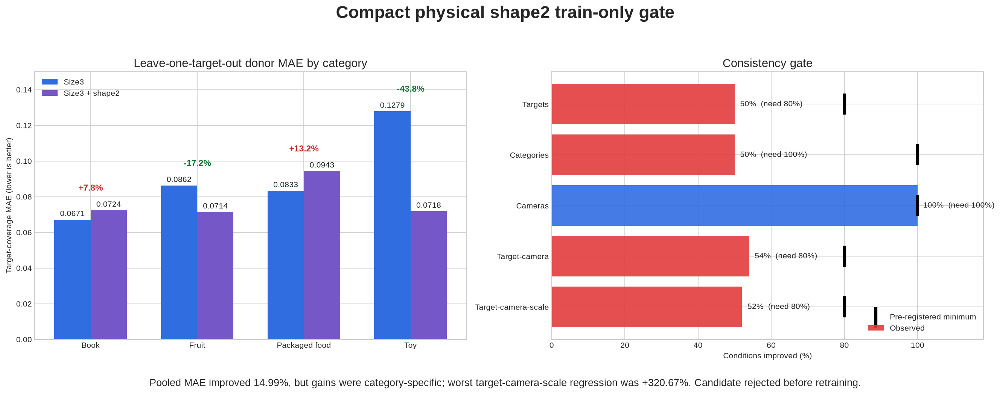

| Train-only gate | Result | Required |
|---|---:|---:|
| Pooled coverage MAE | `0.09114 → 0.07748` (`14.99%` 개선) | `≥ 2%` 개선 |
| Improved targets | `5 / 10` | `≥ 8 / 10` |
| Improved categories | `2 / 4` | `4 / 4` |
| Improved cameras | `5 / 5` | `5 / 5` |
| Improved target-camera cells | `27 / 50` | `≥ 40 / 50` |
| Improved target-camera-scale cells | `78 / 150` | `≥ 120 / 150` |
| Worst scale-cell regression | `+320.67%` | `≤ +5%` |

Fruit은 category MAE `17.20%`, toy는 `43.84%` 개선됐지만 book은 `7.78%`, packaged food는 `13.22%` 악화됨. 전체 평균 개선은 특정 category의 큰 이득이 만든 결과이며, 새 target에 공통으로 적용되는 물리 규칙으로 보기 어려움.

**판단:** `eta·kappa`는 category별 결과가 일관되지 않아 full-model 후보에서 제외함. Seed 0–2는 실행하지 않고 fresh raw size-only를 기준 모델로 유지함. 다음에는 2D mask descriptor를 더 늘리지 않고, 3D target extent가 잔여 target effect를 설명할 수 있는지 oracle 진단으로 먼저 확인함.

---

## 2026-08-22 · Phase 21 — Exact 3D Extent Diagnostic

**문제:** 2D mask의 면적과 bbox는 camera에 보이는 크기만 나타냄. 같은 투영 크기라도 실제 높이와 바닥 면적이 다르면 물체 더미에 의해 완전히 가려질 수 있는 위치가 달라지므로, 이 3D 차이가 남은 target 오차의 원인인지 확인할 필요가 있었음.

**검증:** GT 생성에 실제 사용한 mesh에서 `가로 최소 길이·가로 최대 길이·높이`를 추출함. 이 단계도 full model 학습 전에 “실제 3D 크기를 알면 비슷한 train target의 GT 차이를 더 잘 설명할 수 있는가?”를 묻는 screening임. 이 값은 최종 배포 입력이 아니라 정보 유효성만 확인하는 진단용 oracle임. 학습 10 target·36 scene·3 scale·5 camera만 사용했으며, query target을 donor와 정규화 통계에서 완전히 제외함.

```text
extent3(s) = s × [min(dx, dy), max(dx, dy), dz]
```

같은 category의 다른 target extent를 넣는 64개 wrong-extent 대조 조건도 함께 계산함.

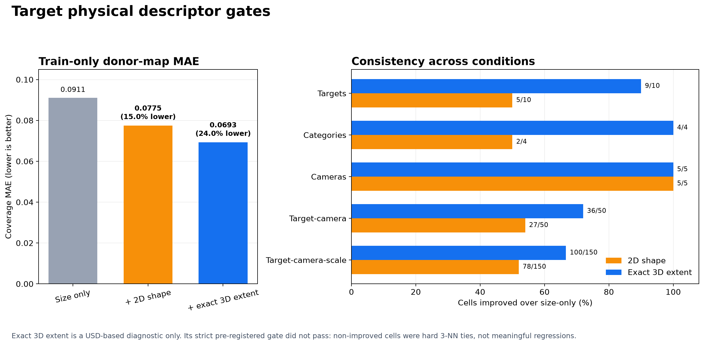

| Train-only diagnostic | 2D shape | Exact 3D extent |
|---|---:|---:|
| Pooled coverage MAE | `0.09114 → 0.07748` | `0.09114 → 0.06927` |
| Relative improvement | `14.99%` | `23.99%` |
| Improved targets | `5 / 10` | `9 / 10` |
| Improved categories | `2 / 4` | `4 / 4` |
| Improved cameras | `5 / 5` | `5 / 5` |
| Improved target-camera cells | `27 / 50` | `36 / 50` |
| Improved target-camera-scale cells | `78 / 150` | `100 / 150` |
| Meaningful worst regression | `+320.67%` | `없음` |

3D extent의 scene-bootstrap 95% interval은 `+23.12% – +24.80%`였고, wrong-extent 대조 조건의 최대 개선은 `1.17%`에 그침. 따라서 실제 3D 크기에 target별 GT를 설명하는 정보가 있음을 확인함.

다만 사전에 고정한 cell 개선 수 기준 `40/50`, `120/150`에는 각각 `36/50`, `100/150`으로 미달함. 남은 cell은 악화가 아니라 hard 3-NN에서 donor 구성이 바뀌지 않아 생긴 동률이지만, 결과를 본 뒤 기준을 바꾸지 않고 사전 기준 미충족으로 기록함.

**판단:** 이 결과를 zero-shot 성능이나 최종 구조의 통과로 해석하지 않음. 다음 Step은 raw size-only와 구조·초기값·sample order·update 수를 같게 유지한 seed-0 모델에서 exact extent 3개만 추가하는 controlled oracle ablation임. 이 모델이 기존 5-camera coverage·scale-response gate를 통과할 때만 RGB/multi-view 기반 3D 크기 추정 방법을 개발함.

---

## 2026-08-22 · Phase 22 — Exact 3D Extent Controlled Model

**문제:** Phase 21은 3D 크기 정보가 GT 차이를 설명할 수 있다는 진단이었으며, 실제 모델이 그 정보를 올바르게 사용하는지는 확인하지 못함.

**통제 실험:** Target mesh의 exact extent를 geometry conditioning에 추가함.

```text
extent3(s) = s × [min(dx, dy), max(dx, dy), dz]
F_depth'   = gamma(extent3) × F_depth + beta(extent3)
```

Raw size-only 기준 모델과 seed·초기 가중치·sample 순서·학습 횟수(`5,408` update)를 동일하게 유지함. Train 10 target의 통계만 이용해 정규화하고, fixed epoch 15에서 14 target·16 validation scene·5 camera를 비교함. Exact extent는 정보 유효성을 확인하기 위한 simulation oracle이며 실제 배포 입력은 아님.

| 평가 영역 | Raw size-only | Exact extent + global FiLM | 변화 |
|---|---:|---:|---:|
| 전체 target coverage MAE | `0.05838` | `0.05803` | `0.60%` 개선 |
| 전체 workspace MAE | `0.13745` | `0.15581` | `13.36%` 악화 |
| Train target coverage MAE | `0.05155` | `0.05587` | `8.38%` 악화 |
| Held-out target coverage MAE | `0.07725` | `0.06399` | `17.16%` 개선 |
| Held-out target workspace MAE | `0.16094` | `0.17477` | `8.59%` 악화 |

Held-out target의 scale-response 방향은 `8/8` target-scale과 `40/40` camera에서 양수였음. 이는 변화 방향이 맞다는 뜻이며 raw보다 더 좋아졌다는 뜻은 아님. Coverage와 workspace를 함께 보는 사전 평가 기준은 충족하지 못함.

**원인 분리:** 같은 checkpoint에서 scene RGB-D·target RGB·2D 크기·camera·scale·GT를 고정하고, exact extent 세 값만 같은 category의 다른 target 값으로 교체함. 모델 재학습은 수행하지 않음.


| Frozen intervention, held-out target | Correct extent − wrong extent | 결과 |
|---|---:|---|
| Target coverage MAE | `-0.03468` | Target-camera 평균 `20/20`에서 correct extent 우세 |
| Scale-response `S` | `+0.09249` | Target-camera 평균 `20/20`에서 correct extent 우세 |
| Workspace 안·coverage 밖 MAE | `+0.04232` | Target-camera 평균 개선 `10/20` |

Correct extent는 held-out target에서도 coverage 예측과 크기 변화 반응을 일관되게 개선함. 따라서 모델이 3D 크기 정보를 실제로 사용한다는 점은 확인됨. 반면 `book_4·fruit_4`는 coverage 밖 오차도 감소했지만, `toy_4·packaged_food_4`는 5개 camera 모두 증가함. 가장 가까운 wrong extent만 사용한 비교에서도 같은 경향이 남아 극단적인 교체값 때문으로 보기 어려움.

**판단:** 이번 exact-extent 경로에서 관찰된 leakage는 하나의 extent vector로 전체 depth feature에 같은 `gamma·beta`를 적용하는 global FiLM과 연결되어 있었음. Target이 물체 더미에 의해 가려질 수 있는 영역은 개선했지만, workspace 안에서도 해당 target이 존재할 수 없어 GT가 0인 위치까지 함께 활성화함. 이 실험만으로 DINOv3 정보가 충분하다고 결론 내리지는 않음.

현재 global-FiLM 구성은 후속 seed로 확대하지 않고, RGB 기반 3D 크기 추정기 개발도 보류함. 다음 실험에서는 exact extent를 계속 oracle로 사용하되, `local depth feature × extent`로 patch별 bounded residual을 만들고 residual을 0으로 초기화해 raw baseline에서 시작함. 동일한 seed-0 조건에서 coverage·coverage 밖 오차·scale-response·현재 고정 rig의 5-camera 결과가 함께 개선될 때만 다음 Step으로 진행함.

---

## 2026-08-24 · Phase 23 — Local Bounded Extent Interaction

**문제:** Global FiLM은 target 크기로 만든 같은 조절값을 모든 scene patch에 적용함. Target이 물체 더미에 의해 가려질 수 있는 영역은 찾았지만, 서랍 안에서 해당 target이 가려질 후보가 없는 위치도 함께 밝아지는 leakage가 발생함.

**방법:** Exact extent와 각 위치의 depth feature를 함께 보고 위치별 gate를 계산하도록 변경함.

```text
Global: target extent ─────────────→ 모든 위치에 같은 gamma, beta
Local : target extent + D(x,y) ───→ 위치별 gate g(x,y) ─→ bounded residual

D'(x,y) = D(x,y) + 0.25 × g(x,y) × learned_correction(x,y)
```

`g(x,y)`는 현재 위치의 depth 구조가 target 크기와 맞는 정도를 `0–1`로 나타냄. `0.25`는 depth feature를 수정하는 residual branch의 세기를 제한하는 값이며, 최종 occlusion probability를 25%로 제한한다는 뜻은 아님. Residual은 0에서 시작하므로 학습 전 출력은 raw baseline과 정확히 같음. Seed·초기 가중치·sample 순서·`5,408` update와 exact extent 입력은 Phase 22와 동일하게 유지함.

아래 MAE는 예측 map과 GT의 평균 절대 차이이며 `0`에 가까울수록 좋음. `Coverage`는 target이 물체 더미에 의해 가려질 수 있는 영역의 정확도, `Impossible-to-occupy workspace`는 target이 가려질 후보가 없는 위치의 잘못된 활성화, `Whole workspace`는 두 영역을 함께 평가함.

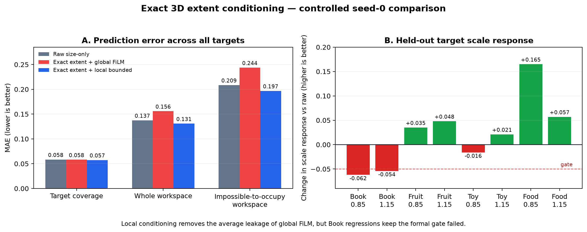

| 전체 14 target | Raw size-only | Exact extent + global FiLM | Exact extent + local bounded |
|---|---:|---:|---:|
| Coverage MAE | `0.05838` | `0.05803` (`0.60%` 개선) | `0.05741` (`1.67%` 개선) |
| Whole-workspace MAE | `0.13745` | `0.15581` (`13.36%` 악화) | `0.13077` (`4.86%` 개선) |
| Impossible-workspace MAE | `0.20853` | `0.24371` (`16.87%` 악화) | `0.19671` (`5.67%` 개선) |

Local 방식은 global FiLM의 평균 leakage를 줄이고 raw보다도 세 영역 모두 개선함. Training-heldout 4개 target 평균에서도 coverage `13.33%`, workspace `9.13%`, impossible-workspace `8.01%` 개선함. 크기 변화에 출력이 같은 방향으로 반응하는지는 `8/8` target-scale과 `40/40` camera에서 유지되어, 현재 고정 rig의 다섯 view에서 같은 방향의 신호를 확인함. 이 수치는 raw 대비 개선이 아니라 scale 변화 방향이 양수였다는 뜻임.

**판단:** 평균 개선만으로 모델을 채택하지 않음. Raw 대비 `book_4` scale-response가 `-0.062`, `-0.054` 감소하여 사전 기준 `-0.05`를 넘었고, `packaged_food_4`의 impossible-workspace MAE는 `30.29%` 악화함. Seen-target coverage도 `4.65%` 악화하여 seed-0 사전 기준을 만족하지 못함.

따라서 local interaction이 global 방식보다 평균적인 공간 제어를 개선할 가능성은 확인했지만, target별 사전 기준을 만족하지 못해 이 상태로 seed를 확대하지 않음. RGB 기반 extent estimator도 아직 실행하지 않음. 다음 Step은 같은 frozen checkpoint에서 extent만 올바른 값과 같은 category의 다른 값으로 교체해 원인을 분리하고, gate와 residual이 coverage 안팎을 실제로 구분하는지 확인하는 것임.

**Frozen 후속 진단:** 재학습 없이 scene RGB-D·target appearance·GT를 고정하고 extent만 교체함. Held-out 평균에서 correct extent는 wrong extent보다 coverage MAE를 `0.03267` 낮추고 scale-response를 `0.12590` 높였지만, impossible-workspace MAE는 `0.02811` 높였음. 즉 3D 크기 정보는 실제로 사용되지만 유용한 영역과 잘못된 영역을 동시에 활성화함.


Gate가 위치를 실제로 거르는지 확인하기 위해 target이 도달 가능한 patch와 불가능한 patch를 분리함. 네 held-out target의 평균 gate는 가능한 영역 `0.974–0.988`, 불가능한 영역도 `0.943–0.972`였음. `0`이면 닫힘, `1`이면 완전히 열림이므로 두 영역에서 거의 항상 열린 상태임. 따라서 residual 크기는 제한됐지만, 공간을 선택하는 gate는 충분히 작동하지 않았음.

축별 교체에서는 `book_4`의 올바른 높이 값이 scale-response를 `0.021` 낮추고, `toy_4`의 수평 크기는 scale-response를 `0.213` 높이는 대신 impossible-workspace MAE를 `0.081` 높였음. 하나의 벡터에서 수평 크기와 높이를 함께 처리하면서 역할이 얽힌 것도 확인함.

**다음 Step:** Noncoverage loss를 바로 추가하면 이전 ring-loss처럼 크기 변화 반응까지 억제할 수 있어 보류함. 먼저 parameter 수와 초기 출력을 유지한 채, 포화되는 sigmoid dot-product를 channel-normalized local similarity로 교체하는 seed-0 실험을 수행함. 이 변경으로 leakage가 줄어도 `book_4` 역반응이 남으면 수평 크기와 높이 conditioning을 분리함.

---

## 2026-08-24 · Phase 24 — Regularized Local-Confidence Gate

**왜 이 실험을 했는가:** Phase 23의 gate는 target이 물체 더미에 의해 가려질 수 있는 patch뿐 아니라 가려질 후보가 없는 patch에서도 거의 `1`이었음. 문이 항상 열려 있으므로 local interaction이라는 이름과 달리 target 크기 보정이 서랍 전체로 퍼졌음. 이번 실험은 모델을 더 크게 만드는 대신, gate가 쉽게 포화되지 않도록 계산 방식만 바꿔 원인을 분리함.

각 scene patch의 depth encoder 출력 `D(x,y)`는 `256`개 숫자로 된 특징임. 이 숫자들은 각각 높이·모서리처럼 사람이 미리 의미를 정한 값이 아니라, ResNet-18이 함께 학습한 local depth pattern 반응임. Target의 exact 3D extent도 작은 network를 거쳐 같은 길이의 보정 방향 `q`로 바뀜. 두 벡터가 같은 방향인지 비교하여 위치별 gate를 계산함.

```text
한 scene patch의 depth 특징 D(x,y): 256개 숫자
target 크기가 요구하는 보정 방향 q: 256개 숫자

D(x,y)와 q의 방향 비교 ─→ local confidence g(x,y)
                              0: 보정하지 않음
                              1: target 크기 보정을 강하게 사용

D'(x,y) = D(x,y) + 0.25 × g(x,y) × size_correction(x,y)
```

이는 표준 cosine이 아니라 **regularized cosine-like confidence**임. Target 보정 벡터가 커지는 것만으로 gate가 `1`에 붙지 않도록 채널 수 `C=256`을 분모에 포함함. `sqrt(C)`는 256개 채널의 평균 크기가 약 `1`일 때를 기준으로 삼는 고정값이며, held-out 결과를 보고 조정한 hyperparameter가 아님. Seed·초기 가중치·sample 순서·loss·`5,408` update는 이전 실험과 같고, automated assertions로 초기 상태와 sample 순서도 확인하여 gate 계산만 비교함.

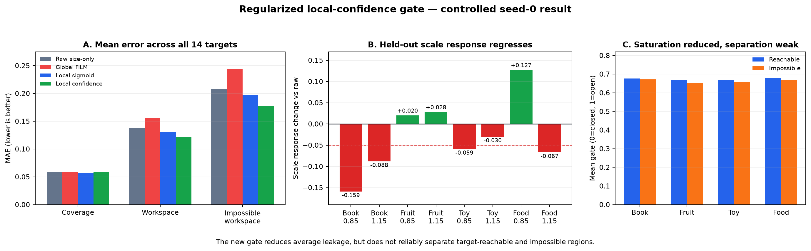

| 전체 14 target | Raw size-only | Local sigmoid | Local confidence | 해석 |
|---|---:|---:|---:|---|
| Coverage MAE | `0.05838` | `0.05741` | `0.05840` | Target이 물체 더미에 의해 가려질 수 있는 영역은 raw와 사실상 같음 |
| Whole-workspace MAE | `0.13745` | `0.13077` | `0.12122` | 서랍 전체의 평균 오차는 raw보다 `11.81%` 감소 |
| Impossible-workspace MAE | `0.20853` | `0.19671` | `0.17768` | 가려질 후보가 없는 위치의 잘못된 활성화는 평균 `14.79%` 감소 |

평균 leakage는 줄었지만, 이것만으로 새 구조를 채택하지 않음. Held-out `book_4`의 두 scale-response는 raw보다 `0.159`, `0.088` 감소했고, `packaged_food_4`는 coverage가 좋아지는 대신 whole-workspace와 impossible-workspace 오차가 각각 `22.04%`, `44.61%` 증가함. 즉 일부 target의 큰 개선이 전체 평균을 낮췄으며, 반복 사용한 네 development-heldout target에서도 일관된 개선을 확인하지 못함.

Frozen 진단에서 gate의 `0.95` 초과 비율은 기존 `66–97%`에서 `0%`로 줄어 구조적 포화는 크게 감소함. 그러나 도달 가능한 patch와 불가능한 patch의 평균 gate 차이는 target별 `0.005–0.014`에 불과했음. Gate 값은 안정됐지만 **어디를 열고 닫아야 하는지 학습하지 못한 것**이 남은 핵심 문제임. 해당 frozen correct/wrong-extent intervention에서 toy와 packaged food의 extent 입력은 coverage 오차를 줄이는 동시에 impossible-workspace 오차를 각각 약 `0.108`, `0.117` 높이는 방향에 직접 관여함.

Exact extent는 물체 이름이 아니라 실제 크기이므로 원리상 unseen target에도 적용 가능한 정보임. 다만 현재 값은 mesh에서 얻은 진단용 oracle이므로 이 결과는 zero-shot 성능을 증명하지 않음. Oracle 구조가 먼저 모든 target에서 안정적으로 작동한 뒤에만 target RGB/mask로 크기를 추정하는 배포 입력으로 교체함.

**판단 및 다음 Step:** Seed 0의 사전 기준을 만족하지 못해 seed 1–2 확대는 진행하지 않음. 다음 실험은 최종 probability map을 직접 누르는 ring loss가 아니라 gate 자체만 감독함. Target이 물체 더미에 의해 가려질 수 있는 순수 patch에는 gate가 열리고, workspace 안이지만 가려질 후보가 없는 순수 patch에는 닫히도록 balanced auxiliary loss를 추가함. 경계가 섞인 patch는 제외하고 `lambda_gate=0.05`의 단일 seed-0 통제 실험만 수행함. 이 방식은 occlusion 확률을 맞히는 본래 head의 역할을 유지하면서, gate에 부족했던 공간적 역할만 명시함.

---

## 2026-08-24 · Phase 25 — Strict Gate-Localization Supervision

**왜 이 방법을 사용했는가:** Phase 24의 gate 값은 안정됐지만 열어야 할 곳과 닫아야 할 곳을 구분하지 못했음. 최종 probability map의 loss만 사용하면 뒤쪽 MatchingBlock이 오차를 대신 줄일 수 있어 gate가 의도한 역할을 배우지 않아도 됨. 따라서 최종 출력을 직접 0으로 누르는 기존 ring loss 대신, gate에만 위치 역할을 알려주는 보조 loss를 사용함.

```text
Target이 물체 더미에 의해 가려질 수 있는 순수 patch → gate를 1에 가깝게 학습
서랍 안이지만 가려질 후보가 없는 순수 patch          → gate를 0에 가깝게 학습
두 영역이 섞인 경계 patch              → 보조 loss에서 제외

전체 loss = 기존 probability-map loss + 0.05 × balanced gate loss
```

두 영역의 patch 수가 달라도 한쪽이 loss를 지배하지 않도록 각각 평균한 뒤 `1:1`로 합침. `0.05`는 결과를 보고 고른 값이 아니라 실험 전에 고정했으며, validation과 checkpoint 선택은 기존 probability-map loss만 사용함. Seed·초기 state·sample 순서·`5,408` update와 exact-extent oracle 입력도 이전 실험과 같게 유지함.


| 전체 14 target | Raw size-only | Gate supervision | 의미 |
|---|---:|---:|---|
| Coverage MAE | `0.05838` | `0.05153` | Target이 물체 더미에 의해 가려질 수 있는 영역의 오차 `11.73%` 감소 |
| Whole-workspace MAE | `0.13745` | `0.07538` | 서랍 전체 오차 `45.16%` 감소 |
| Impossible-workspace MAE | `0.20853` | `0.09682` | 잘못 밝아지는 leakage `53.57%` 감소 |

보조 loss가 없는 동일 gate 모델과 비교해도 coverage·workspace·impossible-workspace MAE가 각각 `11.76%`, `37.81%`, `45.51%` 감소함. 동일 seed·초기 state·sample order의 controlled seed-0 비교에서는 gate localization supervision 추가와 평균 개선이 함께 나타남. 다중 seed 일반화는 아직 확인하지 않음.

Frozen 진단에서도 변화가 확인됨. 보조 loss가 없을 때 가능한 영역과 불가능한 영역의 gate 차이는 `0.005–0.014`였지만, 학습 후에는 target별 `0.580–0.695`로 커짐. 가능한 영역의 평균 gate는 `0.797–0.860`, 불가능한 영역은 `0.166–0.217`이므로 현재 oracle coverage 정의와 고정 rig의 development target에서 gate가 위치 분리를 학습했음을 확인함.

**남은 문제:** 평균 결과는 크게 좋아졌지만 사전에 정한 모든 기준을 통과하지는 못함. 현재 고정 rig의 다섯 camera에서 scale-response 자체는 `40/40` 모두 양수였으나, `book_4`의 `0.85/1.15` scale 반응은 raw보다 각각 `0.118`, `0.130` 약해져 허용선 `-0.05`를 넘음. 결과를 본 뒤 기준을 완화하지 않고 seed-0 사전 기준 미충족으로 기록함.

축별 frozen intervention에서 book의 수평 크기 축을 교체했을 때 scale-response 변화는 `+0.005`로 거의 중립이었지만, 높이 축 교체는 `-0.131`의 변화를 만들었음. 반대로 높이 축은 coverage와 impossible-workspace MAE를 각각 약 `0.016`, `0.031` 줄여 단순히 제거할 정보도 아님. 즉 현재 하나의 FiLM/gate가 수평 footprint와 높이의 서로 다른 역할을 함께 처리하는 것이 남은 병목임.

Exact extent와 coverage label은 USD/GT에서 얻은 simulation oracle임. 물체 category 이름을 gate에 주지는 않으므로 크기와 local depth의 관계를 배우는 zero-shot 가설에는 맞지만, 아직 target RGB만 사용하는 배포형 zero-shot을 증명한 결과는 아님.

**판단 및 다음 Step:** 평균 개선과 gate localization은 유지할 가치가 있지만, 현 모델을 최종 candidate로 확정하지 않음. Seeds 1–2와 RGB extent estimator는 계속 보류함. 수평 footprint는 물체가 차지할 바닥 면적에, 높이는 위쪽 공간과 가려짐 깊이에 주로 영향을 주므로 다음에는 두 값을 별도 conditioning 경로로 분리함. 동일 gate supervision을 유지한 seed-0 실험 하나에서 book 반응을 확인하고, 회복되지 않으면 architecture 확장을 중단한 뒤 scale-paired objective 또는 GT의 book-height 정의를 다시 검토함.

---

## 2026-08-24 · Phase 26 — Footprint Gate / Height Residual Separation

**왜 이 실험을 했는가:** Phase 25는 gate의 위치 분리를 학습했지만, 얇고 넓은 `book_4`의 scale 반응은 여전히 약했음. 하나의 exact-extent 벡터가 “어디에서 target이 물체 더미에 의해 가려질 수 있는가”와 “그 안에서 높이 차이를 얼마나 반영할 것인가”를 동시에 결정한 것이 원인인지 확인함.

68개 입력 칸 중 실제로 사용하는 여섯 값의 역할을 다음처럼 나눔.

```text
area, bbox h/w, 짧은·긴 가로 길이 ─→ footprint gate g_F(x,y)
높이                                  ─→ 열린 영역 안의 보정 강도

D'(x,y) = D(x,y) + 0.25 × g_F(x,y) × height-aware correction
```

Footprint는 target이 영상에서 차지하는 크기와 바닥 방향 길이를 나타내므로 gate의 위치를 정함. 높이는 gate를 새로 열 수 없고, footprint gate가 허용한 위치 안에서만 depth 보정량에 관여함. 새 network를 추가하면 모델 크기 차이가 결과에 섞이므로 기존 `GeometryFiLM` 하나를 세 번 공유해 footprint·height·zero 입력을 분리함. 그 결과 파라미터 수, state key, 초기 가중치, 첫 epoch sample 순서와 총 `5,408` update는 Phase 25와 동일함. 자동 테스트로 높이를 바꿔도 gate가 bitwise 동일하고, footprint를 바꾸면 gate가 변하며, 사용하지 않는 62개 칸은 출력에 영향을 주지 않음을 확인함.

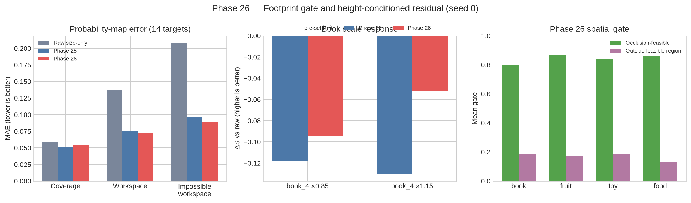

| 전체 14 target | Raw size-only | Phase 25 | Phase 26 | 의미 |
|---|---:|---:|---:|---|
| Coverage MAE | `0.05838` | `0.05153` | `0.05461` | Raw보다 `6.45%` 낮지만 Phase 25보다는 높음 |
| Whole-workspace MAE | `0.13745` | `0.07538` | `0.07276` | Raw보다 `47.07%`, Phase 25보다 `3.48%` 낮음 |
| Impossible-workspace MAE | `0.20853` | `0.09682` | `0.08907` | Raw보다 `57.29%`, Phase 25보다 `8.00%` 낮음 |

Gate 역할 분리는 실제 checkpoint에서도 유지됨. 네 development-heldout target에서 target이 물체 더미에 의해 가려질 수 있는 순수 영역의 평균 gate는 `0.798–0.865`, 가려질 후보가 없는 영역은 `0.128–0.183`이었음. 모든 scale과 다섯 camera에서 예측 반응 방향은 `40/40` 양수였음.

그러나 핵심 사전 기준은 충족하지 못함. `book_4 ×0.85/×1.15`의 raw 대비 `ΔS`는 Phase 25의 `-0.118/-0.130`에서 `-0.094/-0.052`로 회복됐지만, 두 값 모두 허용선 `-0.05`를 넘지 못함. Held-out median `ΔS=-0.010`과 다른 held-out target의 native coverage 안전 기준도 충족하지 못했으며, `book_4` native coverage MAE는 raw보다 `10.3%` 높았음. 결과를 본 뒤 기준을 완화하지 않고 seed-0 사전 기준 미충족으로 기록함.

Frozen identity 진단에서는 Phase 26의 local residual을 끄면 `book_4` coverage MAE가 평균 `0.0128` 낮아졌음. 즉 현재 남은 문제는 gate가 잘못된 위치를 여는 것이 아니라, 올바르게 열린 영역 안에서 book의 크기 변화에 적용하는 보정 방향과 크기가 부정확한 것임.

**판단 및 다음 Step:** Seeds 1–2와 RGB 기반 extent estimator는 계속 보류하고, 구조를 더 키우지 않음. 현재 loss는 각 scale의 map을 따로 맞히므로 평균 오차를 낮추면서도 같은 scene에서 scale에 따른 변화량을 충분히 보존하지 못할 수 있음. 다음에는 train target의 동일 scene·camera에서 두 scale을 짝지어 `예측 map 변화량`과 `GT map 변화량`을 직접 비교하는 scale-paired loss를 추가함. Held-out target은 loss 설계나 가중치 선택에 사용하지 않음.

---

## 2026-08-24 · Phase 27 — Train-Only Scale-Paired Loss and BatchNorm Diagnosis

**왜 이 실험을 했는가:** 기존 loss는 scale `0.7`, `1.0`, `1.3`의 probability map을 각각 맞히지만, 같은 scene에서 target 크기가 바뀔 때 map이 **어떻게 달라져야 하는지**는 직접 비교하지 않음. 이 때문에 평균 map 오차를 낮추면서도 크기 변화가 예측에 충분히 반영되지 않을 가능성을 확인하고자 함.

같은 `target–scene–camera`의 세 scale을 한 묶음으로 불러오고, 인접한 두 scale의 예측 변화와 GT 변화를 비교함.

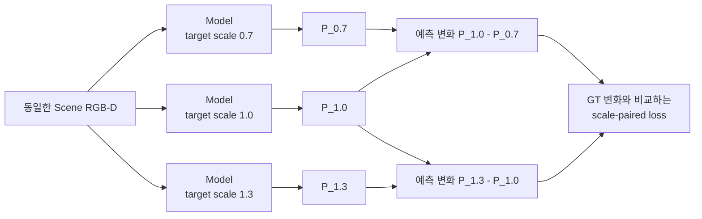
```mermaid
flowchart LR
    I["동일한 Scene RGB-D"] --> M07["Model<br/>target scale 0.7"]
    I --> M10["Model<br/>target scale 1.0"]
    I --> M13["Model<br/>target scale 1.3"]
    M07 --> P07["P_0.7"]
    M10 --> P10["P_1.0"]
    M13 --> P13["P_1.3"]
    P07 --> D1["예측 변화 P_1.0 - P_0.7"]
    P10 --> D1
    P10 --> D2["예측 변화 P_1.3 - P_1.0"]
    P13 --> D2
    D1 --> L["GT 변화와 비교하는<br/>scale-paired loss"]
    D2 --> L
```

```text
ΔP = P(s₂) - P(s₁)                 예측 map이 scale에 따라 변한 양
ΔG = G(s₂) - G(s₁)                 GT map이 scale에 따라 변해야 하는 양

L_pair = Σ|ΔP - ΔG| / (Σ|ΔG| + ε)
L_total = L_map + 0.05 L_gate + 0.008902 L_pair

S = 1 - L_pair
```

`S=1`이면 scale에 따른 공간 변화가 GT와 같고, `S=0`이면 예측이 scale 변화를 사실상 무시한 수준임. 음수이면 변화를 넣지 않은 것보다 오차가 더 큼. `0.008902`는 held-out 결과를 보고 고른 값이 아니라, train target의 gradient에서 paired 항의 크기가 기존 loss의 약 `10%`가 되도록 한 번 계산해 고정함.

### 첫 통제 실험

Phase 26, paired loader만 사용한 `λ=0` control, paired loss를 추가한 candidate를 같은 seed·초기화·16 epoch·`5,408` update로 비교함. 개발용 held-out 4 target은 읽지 않고, 학습에 사용한 10 target과 학습에 사용하지 않은 validation scene 16개만 다섯 camera에서 평가함.

| Fixed epoch 15 | Coverage MAE ↓ | Workspace MAE ↓ | Noncoverage MAE ↓ | `S` 0.7→1.0 ↑ | `S` 1.0→1.3 ↑ |
|---|---:|---:|---:|---:|---:|
| Phase 26 | `0.04956` | `0.07058` | `0.09052` | `0.3517` | `0.4466` |
| Paired-loader control | `0.06429` | `0.07958` | `0.09409` | `0.3332` | `0.4067` |
| Scale-paired candidate | `0.07764` | `0.07335` | `0.06929` | `0.3018` | `0.3546` |

Candidate의 train paired error는 낮아졌지만 validation scene에서는 두 `S`가 모두 감소했고, center/top/left/right/bottom 전체에서 같은 경향을 보임. 따라서 특정 camera 문제가 아님. 또한 loss가 없는 paired-loader control도 Phase 26보다 나빠져, paired loss뿐 아니라 batch 구성이 함께 영향을 준다는 점을 확인함.

```text
기존 batch          : 서로 독립적인 depth frame 16개
scale-paired batch  : 서로 다른 depth frame 5~6개 × 같은 frame의 scale 조건 3개
                      └─ ResNet-18 BatchNorm에는 같은 scene depth가 세 번 반복됨
```

BatchNorm은 학습 중 depth feature의 평균과 분산을 저장하고, 추론 때 그 값으로 feature 범위를 맞춤. Scale-paired batch는 실제 tensor 수가 15–18개여도 서로 다른 depth는 5–6개뿐이므로, 기존 batch와 다른 통계가 저장될 수 있음.

### BatchNorm 통계만 분리한 진단

모델 가중치는 그대로 두고 `36 train scenes × 5 cameras = 180`개의 고유 depth frame으로 ResNet-18의 BatchNorm 평균·분산만 공통 재계산함. Validation scene, held-out target, GT는 사용하지 않았으며, 자동 검사에서 학습 파라미터는 바뀌지 않고 BatchNorm buffer 60개만 변경됨.

| BN 재계산 후 fixed checkpoint | Coverage MAE ↓ | Workspace MAE ↓ | Noncoverage MAE ↓ | `S` 0.7→1.0 ↑ | `S` 1.0→1.3 ↑ |
|---|---:|---:|---:|---:|---:|
| Phase 26 | `0.04772` | `0.06833` | `0.08789` | `0.3585` | `0.4542` |
| Paired-loader control | `0.05432` | `0.07487` | `0.09435` | `0.3651` | `0.4443` |
| Scale-paired candidate | `0.05252` | `0.06403` | `0.07494` | `0.3888` | `0.4613` |

BN 통계를 맞추자 candidate는 Phase 26보다 두 scale 구간의 `S`가 높아지고, 전체 10개 `scale transition × camera` 비교 중 9개에서 개선됨. Workspace와 noncoverage MAE도 각각 약 `6.3%`, `14.7%` 낮아짐. 즉 paired loss의 scale 신호는 일부 존재하며, 처음 관측한 후반 악화의 큰 부분은 반복 scene으로 만들어진 BN 통계와 관련 있음.

그러나 coverage MAE는 `0.04772 → 0.05252`로 약 `10.1%` 증가하여 사전 허용선 `2%`를 충족하지 못함. Coverage 평균 예측은 `0.2514`, 평균 GT는 `0.2485`로 전역 bias가 작았음. 평균값은 맞는데 MAE가 높다는 것은 단순히 map 전체가 너무 밝거나 어두운 문제가 아니라, **coverage 안에서 높은 확률과 낮은 확률을 배치하는 공간 패턴이 더 부정확해졌다는 뜻**임. 따라서 output bias나 threshold만 조절해서 해결할 수 없음.

Validation loss가 가장 낮은 checkpoint도 별도 민감도 분석을 수행했지만, fixed epoch 결과를 사후에 교체하는 근거로 사용하지 않음. 최종 untouched target은 계속 열지 않았으며, seed 1–2 확대와 `λ` sweep도 진행하지 않음.

**판단 및 다음 Step:** Scale-paired loss가 전혀 작동하지 않는 것은 아니지만, 현재 학습 방식은 scale 반응을 얻는 대신 coverage 내부 공간 정확도를 일부 희생함. 다음에는 Phase 26 checkpoint에서 정확히 한 epoch만 이어 학습하고, BatchNorm의 running mean/variance를 고정한 상태에서 `λ=0`과 `λ=0.008902`를 같은 `338` update로 비교함. 이 최소 실험으로 training-time BN 영향과 paired loss 자체의 공간 trade-off를 분리함. 두 scale 구간의 `S`가 모두 개선되고 coverage MAE 증가가 `2%` 이내일 때만 더 긴 재학습으로 확장함.

---

## 2026-08-25 · Phase 28 — BatchNorm-Frozen One-Epoch Comparison

**왜 이 실험을 했는가:** Phase 27의 BN 재계산은 학습이 끝난 모델의 통계까지 다시 바꿨으므로, paired loss 자체의 효과와 training-time BatchNorm 효과가 완전히 분리되지 않았음. Phase 26의 동일 checkpoint에서 fresh Adam으로 한 epoch만 이어 학습하고, 두 모델 모두 BN의 running mean/variance를 고정함. BN의 학습 가능한 scale·bias는 유지하고 sample 순서와 `338` update도 같게 맞춤.

| Phase 26에서 1 epoch 연장 | Coverage MAE ↓ | Workspace MAE ↓ | Noncoverage MAE ↓ | `S` 0.7→1.0 ↑ | `S` 1.0→1.3 ↑ |
|---|---:|---:|---:|---:|---:|
| Paired loss 없음 | `0.06077` | `0.07547` | `0.08942` | `0.3431` | `0.4106` |
| Paired loss 사용 | `0.05727` | `0.07772` | `0.09712` | `0.3626` | `0.4405` |

Paired loss를 사용하면 5개 camera × 2개 scale 구간의 `10/10`에서 `S`가 높아졌지만, paired loss가 없는 control보다 noncoverage MAE가 `8.61%` 증가함. 두 checkpoint의 BN buffer는 동일하므로 이 leakage는 저장된 BN 통계 차이로 설명되지 않음.

원인은 paired loss가 **scale 사이의 차이**만 본다는 점임. 세 출력에 같은 잘못된 값 `c`가 더해져도 `c`는 서로 상쇄됨.

```text
(P_1.0 + c) - (P_0.7 + c) = P_1.0 - P_0.7
```

기존 map loss도 target coverage 안에서만 계산하므로, 어떤 scale에서도 target이 덮지 않는 workspace의 공통 출력을 직접 감독하지 않았음.

**다음 Step:** Scale 변화가 생기는 footprint와 경계는 건드리지 않고, 모든 scale에서 coverage가 없는 순수 workspace의 공통 출력만 0에 가깝게 만드는 anchor를 추가함.

---

## 2026-08-25 · Phase 29 — Strict Common-Mode Anchor and Low-LR Continuation

**왜 이 방법을 사용했는가:** Paired loss는 `scale별 차이`를 학습하고, common-mode anchor는 `세 scale에 공통으로 남는 잘못된 밝기`를 제거함. 두 loss가 서로 다른 문제를 담당하도록 영역을 엄격히 분리함.

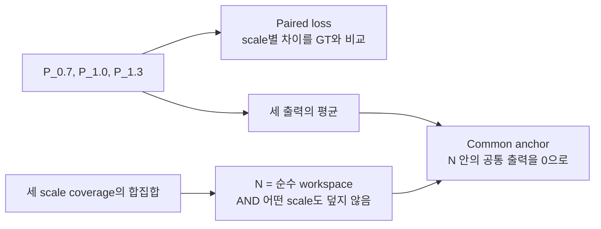
```mermaid
flowchart LR
    P["P_0.7, P_1.0, P_1.3"] --> DL["Paired loss<br/>scale별 차이를 GT와 비교"]
    P --> AVG["세 출력의 평균"]
    C["세 scale coverage의 합집합"] --> N["N = 순수 workspace<br/>AND 어떤 scale도 덮지 않음"]
    AVG --> CL["Common anchor<br/>N 안의 공통 출력을 0으로"]
    N --> CL
```

```text
N = pure_workspace AND no_coverage_at_any_scale
L_common = mean over N of |(P_0.7 + P_1.0 + P_1.3) / 3|
```

한 scale이라도 target footprint가 닿는 patch는 `N`에서 제외함. 따라서 크기가 달라지며 이동하는 경계를 억제했던 과거의 per-scale ring 방식과 다름. Loss weight는 validation이나 held-out 결과를 보지 않고 train-only 8개 batch의 gradient 크기로 한 번 고정함.

Learning rate `1e-3`에서는 leakage와 `S`가 개선됐지만 Phase 26 대비 coverage MAE가 `6.38%` 증가해 사전 허용선 `2%`를 충족하지 못함. Loss와 weight는 그대로 두고 learning rate만 `1e-4`로 낮춰, 기존 공간 map을 크게 바꾸지 않는 작은 보정을 수행함.

| Train-only, seed 0 | Coverage MAE ↓ | Workspace MAE ↓ | Noncoverage MAE ↓ | All-scale noncoverage ↓ | `S` 0.7→1.0 ↑ | `S` 1.0→1.3 ↑ |
|---|---:|---:|---:|---:|---:|---:|
| Phase 26 | `0.04956` | `0.07058` | `0.09052` | `0.07974` | `0.3517` | `0.4466` |
| Common anchor only | `0.04675` | `0.04528` | `0.04390` | `0.02962` | `0.3962` | `0.4791` |
| Common + paired | `0.04671` | `0.04391` | `0.04126` | `0.02811` | `0.4111` | `0.4862` |

최종 후보는 Phase 26보다 coverage `5.74%`, workspace `37.78%`, noncoverage `54.42%`, all-scale noncoverage `64.75%` 낮았음. 세 scale 각각의 coverage MAE와 5-camera의 두 scale 구간 `10/10`도 모두 개선되어 train-only gate를 통과함.

**다음 Step:** 이 시점까지 학습에 사용하지 않은 4개 target을 고정된 5-camera protocol에서 한 번 평가함. Common anchor만 사용한 모델도 함께 비교하여 paired loss의 추가 효과를 분리함.

---

## 2026-08-25 · Phase 30 — Five-Camera Development-Heldout Oracle Check

**평가 범위:** `book_4`, `fruit_4`, `toy_4`, `packaged_food_4`와 scale `0.85/1.0/1.15`, validation scene 16개, center/top/left/right/bottom 5개 camera를 고정함. 모델당 `4 × 3 × 16 × 5 = 960`개 map을 평가함. Target RGB는 해당 held-out instance의 실제 reference를 사용했지만, 3D extent는 USD mesh의 정확한 값을 사용함.

| Development-heldout, seed 0 | Coverage MAE ↓ | Workspace MAE ↓ | Noncoverage MAE ↓ | All-scale noncoverage ↓ | `S` 0.85→1.0 ↑ | `S` 1.0→1.15 ↑ |
|---|---:|---:|---:|---:|---:|---:|
| Phase 26 | `0.06857` | `0.07818` | `0.08573` | `0.07931` | `0.2150` | `0.2432` |
| Common anchor only | `0.06473` | `0.05139` | `0.04091` | `0.03318` | `0.2427` | `0.2860` |
| Common + paired | `0.06489` | `0.04990` | `0.03813` | `0.03086` | `0.2471` | `0.2913` |

최종 후보는 Phase 26보다 coverage `5.37%`, workspace `36.17%`, noncoverage `55.53%`, all-scale noncoverage `61.09%` 낮았음. Anchor-only와 비교해도 두 scale 구간의 `S`가 5개 camera 모두에서 높았고, target × camera × 구간의 `40/40` 조건에서도 같은 방향을 보임. 사전 기준인 `10/10 camera scale-response 개선`과 `coverage MAE 증가 2% 이내`를 모두 만족함.

냉정하게 보면 paired loss의 추가 이득은 작음. Anchor-only보다 전체 coverage MAE가 `0.24%` 높고, 세부 coverage 60개 조건 중 36개에서 최대 `1.62%` 증가함. 반면 workspace·noncoverage·all-scale noncoverage는 각각 `2.90%`, `6.81%`, `7.01%` 낮고, scale-response 40개 조건은 모두 개선됨. 따라서 작은 coverage trade-off 안에서 크기 반응과 leakage를 함께 개선한 seed-0 oracle 후보로 해석함.

**실제 map 확인:** Occlusion Stream의 5-camera 정성 그림은 모델 결과와 무관한 GT-only 중간 사례를 사용함. Phase 26에서 drawer 내부의 비후보 영역까지 퍼진 밝기가 common anchor 이후 줄어드는 모습을 확인함. Scale별 그림에서는 paired loss의 효과가 개별 scene마다 동일하지 않다는 점도 함께 기록하여 평균 수치만으로 결과를 과장하지 않음.

이 결과는 아직 최종 zero-shot 증명이 아님.

- 네 target은 학습에는 사용하지 않았지만 이전 개발 진단에서 이미 관찰한 instance임.
- Scene은 학습에 쓰지 않았지만 모델 선택에 사용한 동일 validation scene임.
- Target mask에서 얻은 2D 크기와 USD mesh의 exact 3D extent를 함께 사용함.
- Scale `0.85/1.0/1.15`는 학습 범위 `0.7–1.3` 안의 interpolation이며 seed 0만 평가함.
- 현재 5개 camera는 calibration이 고정된 rig이며 임의 camera pose 일반화를 뜻하지 않음.
- `S=0.247/0.291`은 Phase 26보다 높지만 `S=1`의 완전한 scale 변화 재현과는 거리가 있음.

**다음 Step:** 이 checkpoint를 exact-size oracle 상한선으로 동결함. 동일 pose·거리의 5-view target reference와 camera calibration 저장 protocol을 먼저 고정한 뒤, RGB/mask silhouette에서 3D extent를 추정함. 같은 960개 조건에서 `mesh oracle / RGB-mask 추정 extent / extent 없음`만 바꾸어 비교하고, 개선이 유지될 때 seeds 1–2와 최종 untouched-target 평가로 이동함.

---

## 2026-08-27 · Phase 31 — Target-specific GT Coverage Check

**확인하려는 문제:** 기존 GT는 모든 target을 동일한 `x/y = ±0.17 m` 범위에서 이동시켜 생성함. 이 범위는 회전할 때 서랍 벽을 통과할 수 있는 큰 책을 기준으로 정한 값이므로, Peach처럼 작은 물체에는 지나치게 좁음. 그 결과 실제로 target이 가려질 수 있는 위치가 GT coverage 밖에 남고, 모델이 그 위치를 예측하면 잘못된 활성화처럼 평가될 수 있음.

이를 확인하기 위해 학습에 사용하지 않은 Peach 하나에서 다음 두 GT만 비교함.

| 고정한 조건 | 내용 |
|---|---|
| Model output | GT를 보기 전에 저장한 동일 checkpoint의 동일 예측 |
| Scene / camera | 동일한 8개 scene과 `center/top/left/right/bottom` 5개 view |
| Target geometry | 동일한 Peach 원본 mesh `524,288` faces |
| 가림 판정 | 물체의 유효 pixel 중 `70%` 이상이 scene 물체보다 뒤에 있을 때 해당 pose를 가려질 수 있는 pose로 집계 |
| Probability | 각 pixel에서 `N_occ / N_all` 계산 |
| 바꾼 조건 | 기존 고정 pose grid와 물체 크기·회전각에 따라 범위를 계산한 adaptive pose grid |

```text
Legacy fixed GT
  x/y = ±0.17 m, 모든 물체에 동일
  44,100 poses

Adaptive GT
  각 yaw에서 회전된 target mesh의 끝점을 계산
  서랍 내부에 들어가는 중심 위치만 1 cm 간격으로 생성
  Peach: 146,688 poses
```

10k 단순화 mesh도 70% 가림 판정을 `99.966%` 재현했지만, 서랍 경계의 매우 작은 footprint 한 건에서 사전에 정한 silhouette 기준을 충족하지 못함. 기준을 결과 확인 후 완화하지 않고, 이번 비교 GT는 원본 mesh로 다시 생성함.

| 8 scenes × 5 views | 결과 | 의미 |
|---|---:|---|
| Fixed coverage | `266,222 px` | 기존 고정 범위가 기록한 영역 |
| Adaptive coverage | `560,896 px` | 물체 크기와 회전에 맞춰 기록한 영역 |
| Coverage 증가 | `+110.69%` | 기존보다 약 `2.11배` 넓은 영역을 확인 |
| Adaptive에서만 추가된 영역 | `294,674 px` | 기존 GT가 누락한 영역 |
| 추가 영역의 adaptive GT 평균 | `0.03808` | 누락 영역에도 실제 가림 확률이 존재 |
| 기존 모델 오차 — adaptive GT 기준 | `0.01145` | 모델 예측이 새 GT와 비교적 가까움 |
| 기존 모델 오차 — 해당 영역을 0으로 간주 | `0.03801` | 누락 영역을 정답 없음으로 보면 오차가 커짐 |

아래 그림은 실제 scene, 두 GT, frozen model 예측을 함께 나타냄. 첫째 줄에서 adaptive GT가 fixed GT보다 넓게 이어지고, 둘째 줄에서 같은 예측을 fixed GT와 비교할 때 오른쪽 경계가 큰 오차로 나타나는 것을 확인할 수 있음. 셋째 줄의 초록색은 두 GT가 모두 다루는 영역, 빨간색은 adaptive GT에서 새로 포함된 영역임.


이 결과는 **Peach에서 기존 고정 pose 범위가 정상적인 예측 일부를 오류처럼 보이게 만들었다는 가설을 지지함**. 반면 모든 target의 zero-shot 성능이나 Occlusion Stream의 최종 구조가 검증된 것은 아님. Target 입력을 더 복잡하게 바꾼 조건도 기존 입력 대비 MAE `0.00029`, soft-IoU `0.00020`만 개선했고 8-scene bootstrap 구간이 0을 포함했으므로, 현재 단계에서는 모델 구조를 더 확장하지 않음.

**다음 Step:** Small/medium/large 대표 target의 adaptive GT를 먼저 생성하고, 복잡한 추가 구조 없이 기존 baseline을 재학습하여 5개 camera와 unseen target에서 확인함. 같은 방향이 재현되면 전체 target·scale GT를 갱신하고, 그 최종 결과를 기준으로 Occlusion Stream 본문과 Development Log의 후속 실험을 전반적으로 정리함.

---

## 2026-08-28 · Phase 32 — Full16 Baseline and External Zero-Shot Evaluation

**목적:** Adaptive GT의 범위 문제를 수정한 뒤, 복잡한 oracle 구조를 계속 추가하지 않고 기본 target-conditioned 모델이 실제로 unseen target에 적용되는지 확인함.

**진행 내용:** 기존 데이터의 16개 target을 모두 학습에 사용하고, scene key 기준으로 train/validation/test를 분리함. 전체 scene의 10%인 19,200개 training sample로 baseline을 학습함. Target은 모든 scene camera에서 동일한 center/top-down RGB와 mask를 사용함. 학습에 없던 `packaged_food_5`는 별도 mesh로 GT를 생성하고, 학습에 쓰지 않은 30개 scene의 다섯 camera에서 총 150개 map을 평가함.

| 확인 항목 | 결과 | 해석 |
|---|---:|---|
| Full16 saved test | MAE `0.0140`, Soft-IoU `0.868`, IoU `0.813` | 학습에 없던 scene에서 baseline의 공간 map이 안정적으로 유지됨 |
| `packaged_food_5` external test | MAE `0.0180`, Soft-IoU `0.812`, IoU `0.723` | 학습하지 않은 target에서도 GT 공간 패턴을 재현함 |
| Wrong `book_1` reference | MAE `0.0968`, Soft-IoU `0.432`, IoU `0.291` | 다른 크기·형태의 target을 넣으면 출력이 크게 악화되어 target 조건을 실제로 사용함 |
| Five-camera worst case | right camera IoU `0.650` | 다섯 view 모두 동작하지만 right view가 상대적으로 가장 어려움 |

처음에는 잘못된 `packaged_food_1` reference가 올바른 `packaged_food_5`보다 근소하게 좋은 결과를 보여 target conditioning이 약한 것으로 보였음. 그러나 두 target의 GT map을 직접 비교하자 `Pearson r=0.990`, patch MAE `0.0120`으로 물리적으로 가려질 수 있는 분포 자체가 거의 같았음. 따라서 이 pair는 wrong-target 검증력이 낮다고 판단하고, GT가 실제로 다른 `book_1`, `fruit_1`, `toy_1`을 추가 대조군으로 사용함. 세 대조군 모두 올바른 reference보다 성능이 분명히 낮았음.


**판단:** Occlusion Stream의 core baseline은 다음 모듈로 넘어갈 수준의 결과를 보임. 전체 데이터 재학습과 추가 구조 실험은 보류하고 현재 checkpoint를 baseline으로 고정함. 이번 external 평가는 합성 target mask를 사용했으므로, 실환경 target RGB에서 mask를 안정적으로 얻는 전처리는 별도 후속 검증으로 남김.

**다음 Step:** Complexity Stream의 GT 정의와 학습 입력을 확정하고, Similarity·Occlusion·Complexity 세 feature를 결합할 fusion 입력 규격을 설계함.

---

## 2026-09-07 · Phase 33 — RGB-D Complexity Pilot

**목적:** RGB-D만으로 관측 가능한 국소 물체 수와 깊이 불규칙성을 표현하고, RGB가 depth-only보다 유효한 정보를 제공하는지 확인함.

**방법과 이유:** Segmentation의 visible asset-label count를 48/96/160px window에서 학습 정답으로 만들고 occupancy를 함께 감독함. 추론에서는 frozen DINOv3 RGB feature와 직접 계산한 depth cue만 사용하며, camera별 workspace와 빈 서랍 depth는 고정 reference로 사용함. `F_C64`는 learned RGB-D feature 55개와 직접 depth cue 9개로 구성함. 단일 가중합 complexity score나 새로운 VLM은 도입하지 않음.

첫 pilot의 정성 검사에서 빈 서랍 벽도 raw-depth 거칠기에 크게 반응하는 문제를 발견함. Empty reference와의 부호 있는 depth 차이로 거칠기를 계산하도록 수정하여 빈 서랍의 여섯 거칠기 channel이 모두 0이 되는지 확인함. 첫 실행과 자료는 보존하고, 이미 확인한 12개 test key를 제외한 새 12개로 수정본을 평가함. 이전 frozen RGB cache만 재사용하고 정답과 depth cue는 다시 계산함.

**결과:** 기존 16개 source pool·5개 camera를 유지한 `3,840/960/960` train/validation/test sample에서 seed 0/1/2를 비교함. Occupied-window count MAE는 depth-only `0.8327` → RGB-D `0.6414`로 **22.97% 감소**했고 5/5 camera에서 개선됨. 12 scene-key cluster의 paired bootstrap 개선량 95% 구간은 `[0.1790, 0.2054]`개임. Training camera-position 평균 baseline `1.2445`도 넘어서 사전 진행 기준을 모두 통과함. RGB-D occupancy MAE는 `0.00854`, direct depth는 `0.00981`임.

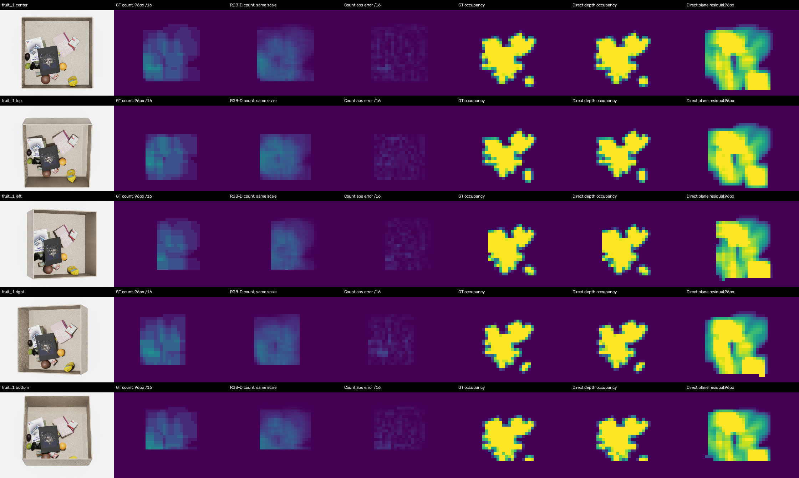

**판단:** RGB-D Complexity pilot을 baseline으로 채택하고, 세 stream의 feature 규격을 각각 `B × 64 × 30 × 40`, fusion concat 입력을 `B × 192 × 30 × 40`으로 정리함. 전체 fusion·DRL 실행을 완료한 것은 아님. 22개 unit test와 segmentation 없는 실제 RGB-D 추론 경로를 검증함. 상세 정의·실행법·저장 지표 (`docs/complexity_results/README.md`)를 함께 보존함.

**한계와 다음 Step:** Visible count는 hidden object count나 target 존재 확률이 아니며, 동일 asset을 여러 번 배치한 데이터에는 instance label을 새로 확인해야 함. 현재 고정 camera·기존 asset library 결과를 unseen object 또는 실환경 성능으로 확대하지 않음. 다음 Step은 unseen scene-object 평가와 fusion의 GT·loss·비교 protocol 설계이며, 최종 탐색 효용은 fusion/DRL ablation으로 검증함.

**2026-09-08 재검토 기록:** 물체 더미 내부의 국소 구조 차이를 구분하는 기준으로 count/occupancy GT를 재검토함. 기존 test 영상 960장에서 물체가 조금이라도 있는 유효 occupancy patch의 56.721%가 0.95 이상으로, 점유율은 넓은 단일 물체와 여러 물체의 밀집을 구분하지 못함. Count에는 내부 변화가 있으나 간격·가림·접촉 구조를 직접 감독하지 않음. 최근 5년의 Disperse-and-Pick, ARMOR, ClutterDexGrasp, Distracted Robot을 비교하고, 현재 run을 **visible-density pilot**으로 한정함. 다음 Step을 fusion 확대에서 **국소 구조 정의와 반례 검증**으로 변경함. 원래 실험·수치·checkpoint는 보존하며 새 GT나 학습을 완료했다고 보고하지 않음. 문헌과 진단 근거 (`docs/complexity_results/definition_review_20260908.md`).

---

## 2026-09-08 · Phase 34 — Observed-Surface Proximity Diagnostic

**목적과 방법:** 점유율이 높은 더미 전체 대신, 가까운 다른 물체가 모이는 표면 부분을 구분할 수 있는지 확인함. GT object label과 axial-Z depth, camera intrinsics로 각 물체 표면에서 다른 물체의 관측 표면까지 거리를 계산함. 반경 20/30/50mm 안에서 거리별 기여를 합하며, 이 반경은 비교용 가설이지 확정된 복잡도 임계값이 아님. Scene별 min–max 정규화는 사용하지 않음. 이 계산은 GT 후보 진단이며 RGB-D 추론 모델은 아님.

**범위와 결과:** Analytic ray-cast 13배치 ×5시점=65영상과 원본 Isaac 데이터의 16개 pool ×기존 train key 한 개 ×5시점=80영상을 로컬에서 확인함. 기본 점검 14개 중 13개를 만족함. 중심 시점의 세 box 간격 2/10/40/80mm에서, 중앙 물체 가장자리의 r30 근접도 평균은 **0.614/0.356/0/0**이었음. 단독 물체는 0이고 5시점 모두 가까운 가장자리와 물체 내부를 구분함. 원본 영상에서도 일부 접경에 반응하지만 독립적인 물체 pose/contact 정답이 없어 정성 결과로만 해석함.

**통제 장면 비교:** 아래 행은 위부터 box 간격 0/2/10/40mm임. 물체 수와 3D 크기는 같지만 투영 면적까지 같은 조건은 아니며, 해당 통제 실패는 아래 표에 기록함.


모든 비교 그림의 열은 왼쪽부터 **scene RGB / 기존 96px window의 count GT÷16 / 기존 occupancy GT / r=30mm 관측 표면 근접도 / 16px patch 내 유효 foreground 근접도 평균**임. 마지막 두 열은 GT label과 depth로 계산한 진단값이며, 학습 모델 prediction이나 승인된 Complexity GT가 아님. 표면은 stride 2로 샘플링한 240×320, 마지막 열은 30×40 patch map임. 근접도의 단위는 다른 물체별 `max(0, 1−거리/반경)`를 더한 거리 가중 개수임. 기존 두 GT의 색 범위는 0–1, 근접도는 0–2로 고정함(2 초과는 같은 최고색이며 계산값은 자르지 않음). Scene별 min–max는 사용하지 않음. 근접도 열의 회색은 배경 또는 유효성 제외 영역으로, 값 0인 보라색 물체 표면과 구분함. 기존 GT와 근접도의 유효 영역은 서로 다름.

**원본 합성 장면의 내부 차이:** `book_1`의 동일 scene을 center/left/right/top/bottom 순서로 표시함. 넓은 물체 면적이 밝은 occupancy와 달리, 근접도는 다른 물체와 가까운 일부 표면에 반응함. 시점마다 보이는 표면이 다르므로 동일 3D 표면의 시점 불변성이나 숨겨진 접촉을 검증한 그림은 아님.

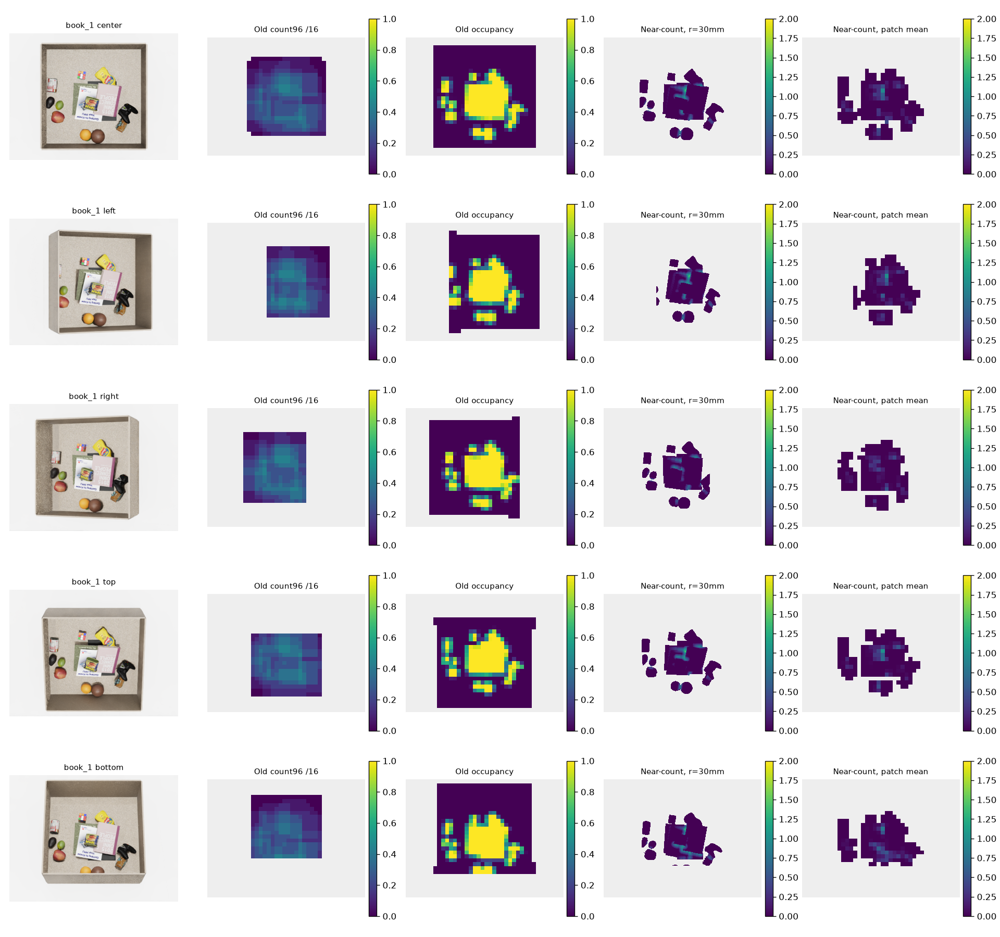

| 점검 / 범위 | 저장 결과 | 해석 |
|---|---|---|
| 간격 10mm, 중앙 물체의 표면 ROI, 5시점 | 내부 평균 0, 마주 보는 가장자리 평균 0.340–0.402 (r30) | 근접 관계의 국소 반응 확인 |
| 단독 평판·기울어진 판·구·무늬 변경 | 모든 5시점에서 근접도 0 | 수식상 기본 성질 확인; 독립적인 복잡도 타당성 증거는 아님 |
| 영상에서 인접/겹침, 실제 표면은 충분히 떨어진 두 배치 | 중심 시점에서 세 반경 모두 0 | 투영 인접과 metric 근접을 구분; 겹침 전체를 설명하는 값은 아님 |
| 숨겨진 물체를 추가해도 같은 RGB-D/label인 두 관측 | 중심 시점의 근접도 map 동일 | 관측에서 구분 불가능한 상태를 복원하지 못함 |
| 간격 10mm의 center 한 영상, 1mm Gaussian axial-depth noise, 원래 양수인 유효 표면 | MAE **0.00178**, 사전 기준 <0.05 | r20/30/50을 모은 평균; 전체 배경을 포함해 오차를 희석하지 않음 |
| 간격 10mm의 center 한 영상, 표면 sampling stride 1/2, 공통 유효 foreground patch | MAE **0.02046**, 양수 patch만 **0.04385**, 유효 patch 집합 불일치 0% | r20/30/50을 모은 공통 foreground MAE 기준 <0.05 만족; 양수 patch 값은 추가 기술 통계 |
| 간격 0/2/10/40/80mm, 중심 시점의 투영 물체 면적 `(max−min)/mean` | **3.1746% > 사전 3%: 실패** | 연속 silhouette union도 1.6396% 변함; 면적 통제 성공으로 보고하지 않음 |
| 원본 16개 pool ×1 train key ×5시점, r30 유효 foreground | 양수 표면 비율: 영상별 **13.8–36.8%**, 중앙값 **24.0%** | 정성 분포 설명이며 GT 정확도 또는 이상적인 복잡도 비율이 아님 |

<details>
<summary>나머지 통제 반례와 원본 3개 source pool의 5시점 비교</summary>

충분한 간격(80mm), 단독 평판, 기울어진 판, 구:

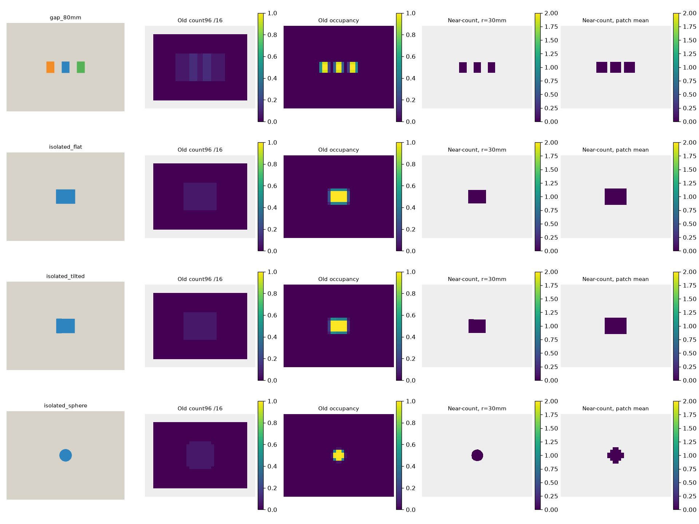

단독 물체의 무늬 변경, 깊이로 분리된 투영 겹침, 숨겨진 물체 추가 전·후:

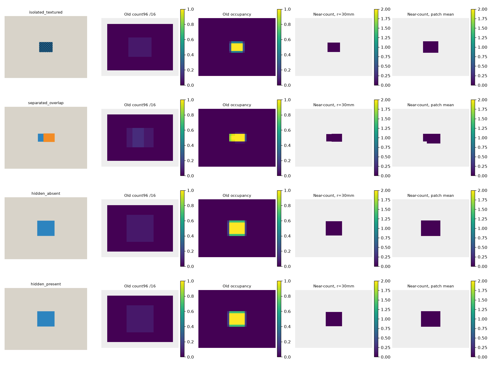

영상에서는 인접하지만 3D로 충분히 떨어진 물체:

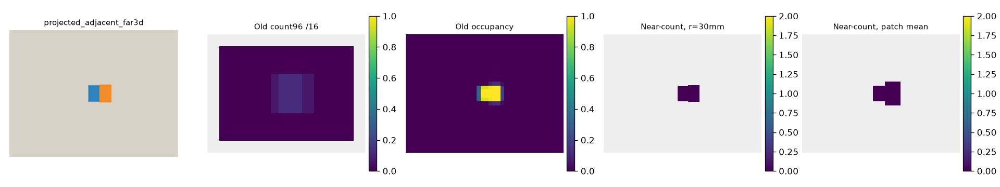

아래 파일명의 `real`은 원본 Isaac 합성 dataset을 뜻하며 실제 로봇 촬영을 뜻하지 않음. 각 그림은 동일 scene의 center/left/right/top/bottom 시점임.


</details>

**실패와 판단:** 투영 물체 면적 편차 **3.1746%**가 사전 3% 기준을 넘어 면적 통제에 실패함. 연속 silhouette도 원근·옆면 노출로 1.6396% 변하므로 단순 raster 오차로 설명하지 않음. 허용치를 사후 완화하지 않았음. 또한 관측 근접도 0은 숨겨진 접촉의 부재나 장면의 단순함을 보장하지 않고, 합쳐진 instance label은 관계를 놓침. 따라서 **관측 근접도 후보로만 유지하고 전체 Complexity GT로 승인하지 않음**. 새 학습·fusion은 실행하지 않음.

**다음 Step:** 실제로 면적이 같은 통제 조건을 보완하고, 근접도에 포함되지 않는 방향·가림 구조와 독립적인 국소 행동 지표를 검증함. 미검증 실험 코드는 로컬에 보존하고, Development Log에는 주요 milestone의 사진·수치 결과·실패와 한계를 함께 공개함. 결과 공개를 방법의 최종 채택으로 해석하지 않음.

---

## 2026-09-16 · Phase 35 — Cluttered-Scene Static Removal Diagnostic

**목적:** 가까운 물체의 가장자리에 반응한 Phase 34 근접도가, 실제 더미에서 어느 물체를 치울지 판단하는 데 도움이 되는지 확인함. 책·과일·포장식품·장난감 asset이 쌓인 기존 capture를 사용하며 정형 도형을 추가하지 않음.

**방법과 범위:** Pose가 저장된 추가 capture의 10 layouts × 5 cameras를 재현함. `packaged_food_1` 8 layouts와 `fruit_1` 2 layouts이며, 원본 16개에 `World1`을 더한 **17-asset 데이터**로 기존 16-only 평가와 구분함. USD의 단위·scale·하위 transform을 보존하면서 saved pose를 적용하고, 원본 depth/label과 먼저 비교함. Workspace에서 foreground IoU ≥0.95, 64px 이상 label IoU ≥0.90, 동일 label 내부 depth 오차 median ≤2mm/p95 ≤5mm 등 사전 기준을 **50/50 views 모두 통과**함. Foreground IoU 범위는 0.999235–0.999709, 평가된 label IoU 최솟값은 0.969697이었음.

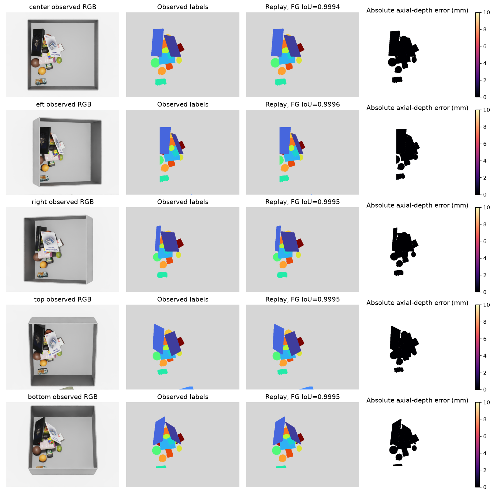

열은 원본 RGB / 원본 label / 재현 label / depth 절대 오차임. Depth 검증은 동일 label을 1px erosion한 내부의 유효 pixel에서 수행했고, view별 p95 최댓값은 0.006437mm였음. 합성 render 간 비교이며 실제 depth sensor 정밀도나 RGB pixel 재현 정확도가 아님.

각 물체를 하나씩 제거하고 매번 원래 scene으로 돌아가며 다른 물체는 고정함. 총 **770 object-view 제거 조건**에서 `새로 보인 다른 물체 pixel 수 / 제거한 물체의 원래 visible pixel 수`를 계산함. 바닥 노출은 제외하며 큰 물체에 유리한지 확인하기 위해 원시 노출 pixel 수도 별도로 비교함. 이 비율은 Complexity 정답이나 target 발견 확률이 아님.


독립 Isaac RTX 검증은 사전 지정한 첫 layout의 다섯 시점과 첫 책 `Book_GetKnowPPU`의 제거 후 center에서 수행함. 그림은 원본 RGB / Isaac 제거 전 / 제거 후 / 새로 보인 다른 물체 영역임. 물리 step 없이 잔존 물체의 world transform 변화는 0이었음. Software 제거와 Isaac 제거 후 foreground IoU는 **0.999414**였음. 원본과 replay의 서랍 재질 차이가 있어 기하·label 재현만 검증함. 전체 770조건을 독립 RTX로 검증한 것은 아님.


각 행은 첫 scene의 pose 순서상 앞 네 대상이며 결과에 맞춰 고르지 않았음. 열은 제거 대상 윤곽 / GT label+depth의 30mm 근접도 / 제거 후 label / 새 노출 영역임. 첫 책은 근접도 평균이 **0.0265**인데 제거하면 원래 visible 영역의 **76.34%**에서 다른 물체가 드러남(software 5350/7008px; Isaac 5355/7013px). 가장자리 근접도와 그 물체 아래의 노출 효과가 다를 수 있음을 보여줌. 작은 물체의 비율 1도 큰 절대 노출 면적을 뜻하지 않음.

**결과:** 근접도 지원 면적 ≥80%인 715조건 중 네 점수가 모두 유효한 공통 조건은 710개/50 views임. 한 view의 depth roughness가 상수여서 최종 네 지표 공동 상관 비교는 **701조건/49 views, 10 layouts**를 사용함. 같은 view의 같은 물체 집합에서 Spearman 순위 상관을 계산한 뒤 layout 내부 view 평균, 10 layouts 동일 가중 평균 순서로 집계함. 초기 feature별 결측값 제외 집계는 공통 object/view 집계로 수정했고 독립 재계산으로 확인함.

| 제거 전 물체별 점수 | 새 노출 비율과 평균 순위 상관 | 새 노출 pixel 수와 평균 순위 상관 |
|---|---:|---:|
| **30mm 관측 근접도 평균** | **0.078** | **0.041** |
| 보이는 면적 | 0.387 | 0.615 |
| 96px window 국소 개수 평균 | 0.291 | 0.156 |
| 96px depth 평면 잔차 평균 | 0.002 | -0.149 |


양수가 클수록 해당 점수가 높은 물체의 제거 효과도 큰 경향임. Depth 평면 잔차는 기존 empty-reference 차이 기반 cue이며 단순 raw depth variance가 아님. 그림의 산점도는 공통 710조건, 상관 패널은 유효 701조건/49 views를 사용함. 회색 선은 layout별 값, 검정 선은 평균임. 근접도의 비율 상관은 layout별 -0.297–0.535로 변동했고 면적보다 높은 layout은 2/10, count보다 높은 layout은 3/10이었음.

**한계와 판단:** 두 capture run·세 generation batch와 공통 asset을 공유하므로 물체·시점을 독립 표본으로 취급하거나 유의성을 주장하지 않음. 이상적인 segmentation·pose·mesh를 쓴 정적 가시성 진단이며 실제 집기·재정착·target 발견·탐색 효율과 segmentation 없는 RGB-D 추론은 미검증임. 관측 근접도는 RGB-D만으로 추론한 출력이 아니라 GT label+depth 기반 후보임. **30mm 근접도의 물체별 평균을 제거 순위 점수나 Complexity GT로 채택·학습할 근거가 부족함.** 근접 feature 전체가 무용하다는 결론이나 면적/count가 복잡도의 정답이라는 결론으로 확대하지 않음.

**다음 Step:** 실제 더미에서 관측 가능한 가림 방향 정보가 단순 면적·count보다 추가 정보를 주는지 현재 제거 평가로 확인하고, 이미 본 layout에서 맞춘 후보는 새 capture에서 재검증함. 기존 Occlusion Stream과의 역할 차이도 먼저 정리함. 새 GT 대량 생성·학습·fusion은 보류함. 코드·원시 결과·실패 실행은 로컬에 보존하고 이번 게시에는 README와 비교 그림만 포함함.


---

## 2026-09-16 · Phase 36 — Frozen-DINO Visible-Asset Representation Probe

**목적:** Similarity는 DINO의 외형 표현에 SigLIP의 의미 표현을 보완했음. Complexity도 새 점수를 계속 바꾸기보다 기존 RGB-D 표현에 무엇이 부족한지 먼저 확인해야 함. 따라서 `A: 기존 DINO+depth → B: RGB로 예측한 물체 묶음 추가 → C: 공간 사전학습 표현 추가` 비교를 계획하고, 이번에는 **A의 기초 진단만 수행함**. Phase 35 끝의 방향 정보 제안은 당시 후속 가설이며 현재 채택한 GT가 아님.

**방법과 이유:** 실제 asset이 쌓인 영상에서 두 16×16 patch가 같은 가시 asset에 속하는지 분류함. 기존 16개 source pool을 모두 유지하고 train/val/test는 8/4/8 scene keys × 16 pools × 5 cameras, 즉 **640/320/640 views**로 구성함. 같은 scene key의 모든 pool·camera를 같은 split에 둠. Test 8 keys는 Complexity V1/V2에 사용한 24개를 제외한 원본 test pool에서 사전 선택했으며, asset 자체는 학습에서 본 조건임.

Patch의 ≥90%가 같은 알려진 asset이고 workspace와 유효 depth가 각각 ≥95%인 경우만 사용함. Mapping에서 서로 다른 asset이 같은 색을 공유하는 영역은 unknown으로 제외함. 같은 asset의 pair와 다른 asset의 pair를 **정확한 XY offset, anchor category, depth 차이 구간**별로 맞추고, 같은 카테고리의 다른 asset을 구분하는 조건을 주 평가로 삼음. GT segmentation/category는 감독·표집·평가에만 사용하며 분류기 입력에는 넣지 않음. 따라서 GT가 지정한 순수 patch에서의 분류 진단이며 전체 영상 segmentation 성능은 아님.

Frozen DINO 두 feature의 차이·곱, RGB-D에서 계산한 depth descriptor, 위치를 작은 `1622→64→16→1` 분류기에 입력함. Position / depth+position / DINO+position / DINO+depth+position은 같은 구조·초기값·sample 순서로 seed 0/1/2를 비교하며 사용하지 않는 branch는 train-only normalization 뒤 0으로 둠. Validation으로 checkpoint를 고정한 후 test를 평가함. DINO cosine와 depth 차이는 학습 없는 비교군임.

**결과:** Test 전체는 150,690 pairs/640 views이고, 주 평가인 same-category 조건은 **80,024 pairs(양성·음성 각각 40,012), 604 views, 8 scene-key 묶음**임. 나머지 36 views에는 해당 matched pair가 없음. 아래 AUROC는 view별 계산 → key별 pool/view 평균 → 8 keys 동일 평균 → 세 seed 평균임. 1에 가까울수록 잘 구분한다는 뜻이며 정확도나 Complexity 점수가 아님.

| 방법 | 같은 카테고리 내 AUROC | 다른 카테고리 간 AUROC |
|---|---:|---:|
| 위치만 | 0.608809 | 0.530252 |
| Depth + 위치 | 0.773882 | 0.873615 |
| DINO + 위치 | **0.998953** | 0.999664 |
| DINO + depth + 위치 | 0.998908 | **0.999673** |
| DINO cosine, 학습 없음 | 0.925424 | 0.974662 |
| Depth 차이, 학습 없음 | 0.535946 | 0.538848 |


DINO+depth는 depth보다 same-category AUROC가 +0.225025 높았고 8/8 keys에서 개선됨. DINO+depth와 DINO의 차이는 -0.000045로 이 과제에서 depth 추가 효과는 확인하지 못함. Pair 표집 조건과 GT→입력 누출 여부를 독립 검토하고 일부 지표를 재계산하여 저장값과 일치함을 확인함.


왼쪽은 RGB, 가운데는 같은 asset pair, 오른쪽은 같은 카테고리의 다른 asset pair임. 사전 첫 test key의 book/fruit/packaged-food/toy 첫 pool과 center camera를 고정하고 각 영상·label에서 오차가 가장 큰 pair를 표시함. 따라서 대표 평균 성능을 보여 주는 표본은 아니며, 고른 pair가 모두 오분류인 것도 아님. 청록·자홍 사각형은 두 patch이고 `same-label score`는 세 seed의 평균 logit에 sigmoid를 적용한 값임. 실제 분포에서 보정된 확률로 해석하지 않음.

**한계와 판단:** 알려진 foreground가 걸친 test patch 128,380개 중 조건을 만족한 것은 54,429개(**42.40%**)임. 이 분모는 unknown/색 충돌 영역을 제외하며 전체 물체 면적 coverage가 아님. 경계·작은 물체·심한 가림은 상당 부분 제외되고 같은 asset의 복제 instance를 구분하는 문제도 평가하지 않음. Pair와 view는 서로 상관되어 있으므로 80,024개를 독립 scene 수로 해석하지 않음. **기존 표현에서 알려진 asset 내부의 대응 정보를 읽을 수 있다는 근거이며, 복잡도 이해·전체 segmentation·새 물체 일반화의 증거는 아님.**

**다음 Step:** 현재 순수 patch 지표는 거의 포화되어 B/C의 추가 효과를 판별하기 어려움. 물체 내부 구분을 위한 모델 추가는 보류하고, 실제 더미의 경계·분리된 조각의 소속·다중 물체 관계 중 어떤 능력이 부족한지 평가부터 고정함. 관측 가능한 관계 label의 품질을 확인한 뒤 같은 평가·region 조건에서 물체 묶음과 공간 표현의 추가 가치를 비교함. SAM/VLM이 불필요하다는 결론은 아니며 **B/C 모델 실행·새 Complexity GT 채택·fusion은 미완료**임. 이번 공개는 README와 두 비교 그림으로 한정하고 실험 코드·checkpoint·원시 자료는 로컬에 보존함.

## Phase 37 — DINO의 어려운 물체 대응과 가시 관계 정량화 공동 진단 (2026-09-18)

**목적:** 같은 실제 cluttered scene에서 물체 구분과 Complexity 후보를 병행 검증함. 물체 구분은 기존 DINO readout으로 검사하고, 관계 기준은 정확한 GT 물체 ID를 주어 계산함. 여기에 GT를 16×16 block당 하나의 물체로 바꾸는 근사를 대조하여, 모델 오류와 출력 표현의 문제를 분리함.

**확인 결과:** 경계 근처·외형 변화가 있는 순수 patch에서도 기존 DINO의 가시 asset 대응을 확인함. 같은 국소 count에서 서로 다른 접경 관계가 나타남도 확인함. 반면 정확한 GT를 사용해도 block마다 한 label만 남기면 접경 관계가 변함. 따라서 다음 구현은 frozen DINO를 유지하면서 혼합 patch·경계·물체 묶음의 표현을 보완하는 방향으로 좁힘.

### 실행과 평가 조건

- Phase 36과 같은 validation **320영상**, test **640영상**. 기존 16 pools×5 views, validation/test **4/8 scene keys**, 기존 readout **3 seeds**임.
- 기존 test 장면의 새로운 진단임. 새로운 blind test, unseen-object 평가 또는 640개 독립 scene으로 해석하지 않음.
- Encoder·12개 readout을 재사용하며 재학습하지 않음. 기존 저장 pair의 val 272개·test 252개 입력 X/cos 재현에서 최대 차이 **0**을 확인함.
- 두 위치는 purity≥90%, workspace·유효 depth≥95%, 간격1–8 patches임. 양/음의 정확한 XY offset·anchor category·depth 차이 구간·negative category를 맞춤. Family당 영상별 최대64개의 양/음 묶음을 표집함.
- Validation에서 두 종류 오류율의 평균인 balanced error가 최소인 threshold를 모델별로 고정함. Test 전에 threshold·protocol·source·checkpoint hash를 검증함.

### DINO의 어려운 위치쌍 판별

아래는 **same-category** 결과임. View별 지표→key 내 pool/view 평균→keys 동일 평균→3 seeds 평균이며 모든 학습 비교군에 위치 정보가 포함됨.

| 평가 조건 | Pairs / views / keys | DINO AUROC | Depth AUROC | RGB-D AUROC | DINO 같은→다름 오류 | DINO 다름→같음 오류 |
|---|---:|---:|---:|---:|---:|---:|
| 접경에서16px보다 먼 내부 | 17,108 / 438 / 8 | 0.999963 | 0.836209 | 0.999958 | 0.056% | 1.375% |
| 접경16px 이내의 순수 patch | 37,856 / 602 / 8 | **0.998789** | 0.747029 | 0.998715 | 0.539% | 3.161% |
| 평균 RGB 차이가 큰 patch | 30,870 / 584 / 8 | **0.998166** | 0.766375 | 0.998197 | 1.160% | 2.685% |
| 같은 asset의 분리된 가시 조각 | 852 / 47 / 7 | **1.000000** | 0.751869 | 1.000000 | 4.274% | 0.786% |

외형 변화는 0–1 RGB patch 평균의 L2 차이≥0.15이며 무늬의 의미를 판정한 기준은 아님. 분리 조각은 같은 asset label의 서로 다른8-connected component로 정의하며, 분리 원인을 가림으로 확정하지 않음. 전체159,192 test pairs에는 different-category와 family 간 중복이 포함됨.

학습 없는 DINO cosine AUROC는 위 순서로0.918370 / 0.921420 / 0.834149 / 0.958109였음. 기존 readout은 어려운 순수 patch에서도 raw cosine보다 잘 구분함. RGB-D의 DINO 대비 일관된 우위는 이 대응 과제에서 나타나지 않았음. Depth가 공간 관계에 쓸모없다는 뜻은 아님.

분리 조각은 AUROC1이지만 공통 validation threshold에서 같은→다름 오류4.274%가 남음. 평가도47 views/7 keys로 제한됨. 오류율은 **위치쌍 판정 오류**이며 전체 segmentation의 물체 분할·병합률이 아님.

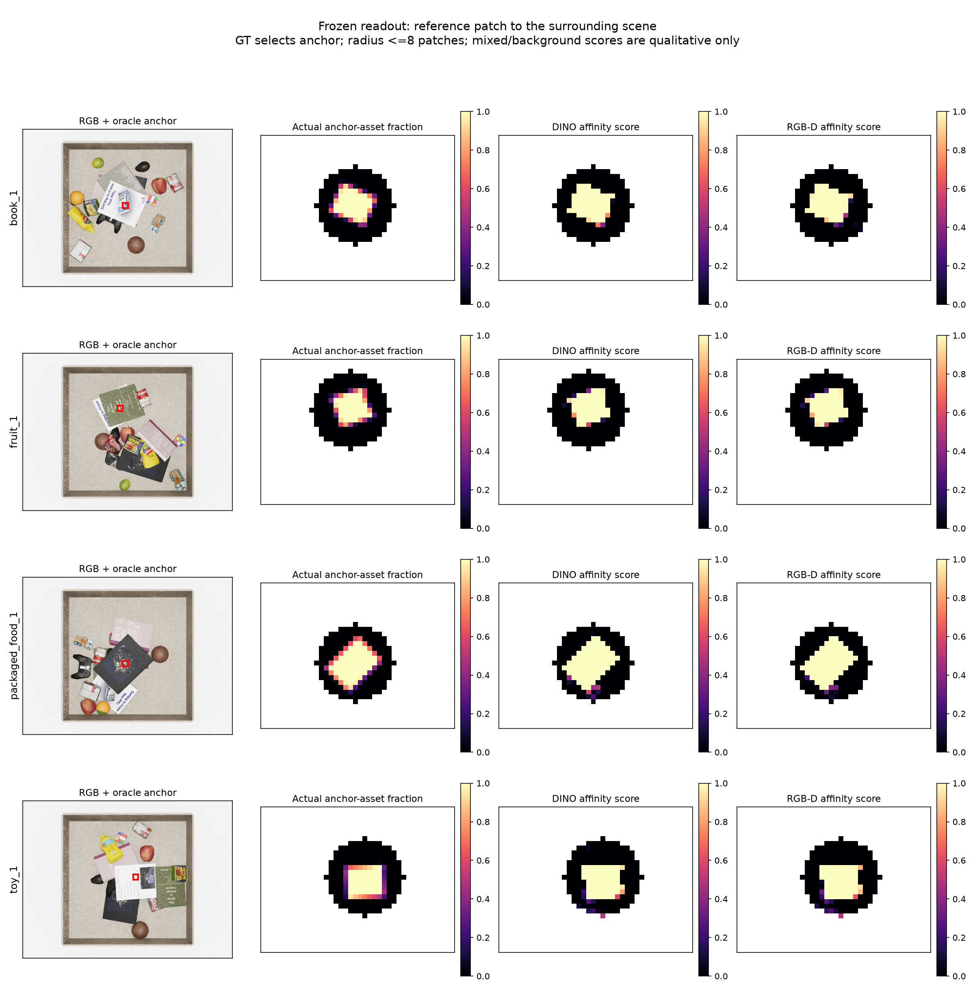

첫 test key·category별 첫 pool·center view를 고정함. 그 장면에서 적격 patch가 가장 많은 물체의 가장 안쪽 patch를 anchor로 고름. 열은RGB / 실제 anchor 물체의 patch 내 면적 비율 / DINO affinity / RGB-D affinity임. 반경8 patches만 표시하며 score는3-seed mean logit의 sigmoid임. 보정된 면적 비율이나 확률이 아님. GT는 anchor 선택·비교에만 사용하고 predictor에 ID를 넣지 않음. 그림에는 mixed·background 등 정량 평가 밖 위치도 있어 정성 참고로 구분함. 자동 anchor/grouping 또는 어려운 사례 대표 성능을 보여 주는 그림은 아님.

### 혼합 patch와 단일-label block 근사의 영향

알려진 foreground128,380 patches 중 순수·유효한54,429개(**42.40%**)가 pair 평가 대상임. 두 물체가 각각 patch의10% 이상 들어 있는 경우는20,469개(**15.94%**)임. 나머지 부적격 patch에는 물체–배경 혼합·unknown·workspace/depth 조건도 포함됨.

GT를16×16 block당 다수 label 하나로 바꾸고 full-pixel GT의 접경과 비교함. Unknown·background도 block 투표의 후보에 포함함.

| GT-majority block 근사 | 결과 |
|---|---:|
| 접경 pair precision | **0.804652** |
| 접경 pair recall | **0.845858** |
| 물체별 접경 이웃 수 MAE | 0.584765개 |
| 알려진 foreground pixel label 일치율 | 0.846709 |
| Block 근사에서 사라진 object-view | 606 / 8,446 (**7.175%**) |

Precision은 근사에서 생긴 접경 중 실제GT에도 있었던 비율, recall은 실제 접경 중 근사에도 남은 비율임. View→key 동일 평균이며 object-view 누락은 전체 개수 비율임. **DINO를 거치지 않은 GT 변환 실험이므로 이 값을 DINO segmentation 성능이나 달성 가능한 성능의 상한으로 해석하지 않음.** 향후 grouping을 block당 한 label로 구성할 때 생기는 손실을 확인한 것임. 기존 density pilot은 RGB-D에서 count를 직접 예측하며 이 변환을 사용하지 않으므로, 현재 density 모델의 오류 원인을 증명한 결과와 구분함.

### Count에 추가되는 관계 정보

수평·수직으로 이웃한 pixel이 서로 다른 알려진 물체이고 양쪽 workspace·depth가 유효할 때 가시 접경을 기록함. 같은 물체 내부의 무늬는 제외됨. 기본은 scene 전체 pair support≥8이며4/16도 검사함. 이는 영상상의 관측 접경으로, 물리적 접촉·지지·숨은 가림 GT가 아님.

Count는 전체scene32px·window16px 이상인 물체를 셈. Local 관계 수도 **양쪽 물체가 같은 면적 조건을 만족**하고 두 endpoint가 window에 포함된 pair만 한 번 셈. Count에서 제외된 작은 물체 때문에 관계만 늘어나는 비교 교란을 방지함. Workspace≥95%·unknown 없음·관계의 depth 유효성을 적용하고, invalid와0관계를 구분함.

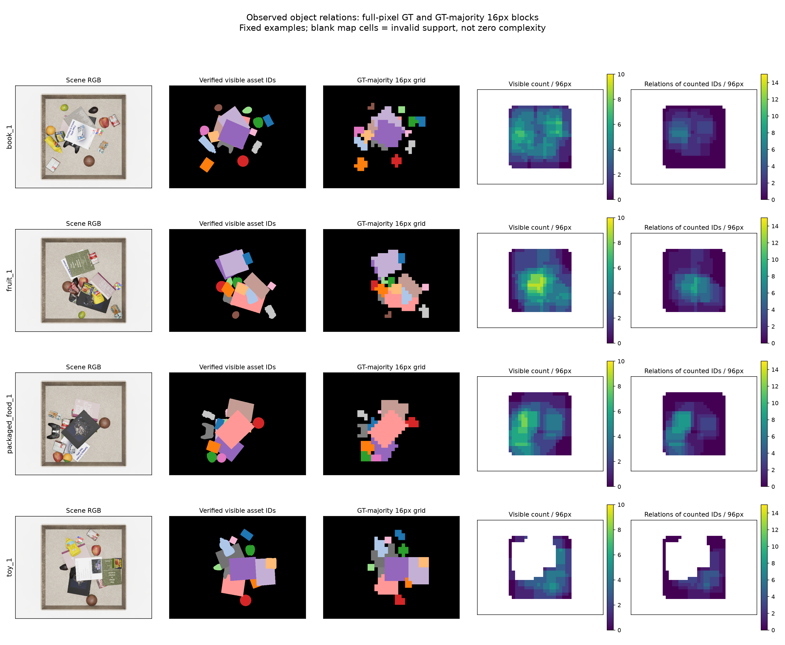

열은RGB / pixel GT /16px GT-majority /96px count /그 count에 포함된 물체 사이의 접경 pair 수임. 장면 선택은 위와 동일하게 사전 고정함. 흰 map 영역은 정답 유효성에서 제외된 위치이며 복잡도가0이라는 뜻이 아님. 두 map은 관측량 후보로서 최종 Complexity prediction이 아님.

96px에서 같은 영상·같은count≥2의 window가5개 이상인3,225개 그룹 중 **3,037개(94.17%)에서 관계 수가 달랐음.** Count와 관계가 동일한 정보를 반복하지 않는다는 결과임. 물체 종류·형상·면적까지 통제한 배치 인과 실험이나 탐색 효용 검증으로 확대하지 않음.

| Window | 같은 count 그룹 / 관계가 달라진 그룹 | GT block count MAE | GT block 관계 수 MAE |
|---|---:|---:|---:|
| 48px | 2,151 / 2,110 | 0.452506 | 0.523765 |
| 96px | 3,225 / 3,037 | 0.279495 | 0.728926 |
| 160px | 2,744 / 2,552 | 0.464726 | 1.265518 |

범위별 정답·유효 위치가 달라 이 표로 최적 window를 선정하지 않음. 기본 support8의 전체 가시 pair는8,852개이며 support4/16에서는9,451/7,656개였음. Scene 전체 pair의 한쪽 깊이 방향이80% 이상인 것은 δ5/10/20mm에서7,427/6,366/4,747개였음. 깊이 순서는 local 관계 수와 합치지 않음. δ는 민감도 검사 값이며 실센서 노이즈를 반영한 최종 기준이 아님.

보이는 면적과 접경 이웃 수의 view→key 평균 Spearman은 **0.405692**임. 관계 수가 크기와 무관한 보편적 Complexity라는 근거는 확보하지 않았음.

### 판단·검증·다음 Step

**추가 encoder를 즉시 도입하기보다 frozen DINO를 유지하고, 혼합 patch·경계·물체 묶음의 표현을 보완함.** 한 patch에 여러 물체가 있다는 정보를 유지하는 소속 표현이나 RGB-D 경계 보정을 비교하고, 실제 grouping·coverage·접경 pair 보존을 함께 평가하는 것이 다음 Step임.

Count와 관계는 분리된 감독 후보로 유지함. 이웃 수·앞뒤 순서를 임의 가중합한 최종 GT는 만들지 않았음. 추가VLM/SAM·다중뷰teacher·새Complexity학습·fusion·DRL은 이번 실험에 포함되지 않음.

- Unit tests **11개 통과**. 기존 pair 입력 재현·shape·finite·hash를 확인함.
- `audit.json`에서13개 score의 AUROC·threshold·오류율·scene-key/seed 집계·양/음offset균형을 독립 재계산하여 통과함. 관계 생성은 별도의 invariant·전수 fixture 검사로 확인함.
- 직접 근거: 로컬 `outputs/complexity_joint_diagnostic_20260918_v1/`의 protocol, threshold lock, test entry, pair NPZ, metrics, coverage, relations, summary, audit와panels. 상세 보고서: `docs/complexity_results/joint_diagnostic_20260918.md`(공개`agent.md`에 본문 포함).
- 이번 공개는 완료된Phase37 설명·그림2장·연구 문맥에 한정함. 실행코드·checkpoint·dense cache·원시NPZ는 로컬에 보존함.

## Phase 38 — RGB-D 원본 접경 학습과 GT 관측 관계의 제거 효용 (2026-09-21)

작성일: 2026-09-21. RGB-D 전체 영상 접경 예측과 관측 관계의 정적 제거 효용을 함께 평가함. 경계 모델의 RGB 대비 일관된 개선 gate는 통과하지 못했으며, GT 관계의 추가 예측 정보는 확인함.

### 1. 목적과 두 실험의 구분

Phase 37에서 frozen DINO의 순수 patch 물체 구분 정보는 강했으며, 향후 표현에서 mixed patch와 원본 해상도 접경을 보존할 필요가 제기됨. 이번 단계는 RGB와 metric depth를 함께 사용해 **서로 다른 물체가 영상에서 맞닿는 위치**를 예측하고, 별도로 그런 관측 관계가 면적·개수 이상의 정적 제거 효용 정보를 갖는지 확인함.

| 실험 | 입력·출력 | 확인 범위 |
|---|---|---|
| 경계 학습 | 전체 RGB-D 및 frozen DINO → 원본 해상도 right/down 접경 score | GT mask 없이 보이는 inter-asset 경계를 검출하는 능력 |
| 제거 utility | GT asset ID·관측 depth 관계 → 정적 제거 후 노출 비율 회귀 | 관계를 정확히 알 때 면적·개수 이상의 예측 정보가 있는지 |

두 결과는 서로 다른 자료·평가를 사용함. Utility에는 학습한 경계 모델의 예측을 넣지 않음. Pixel 접경 검출만으로 물체별 node와 edge를 가진 **완성된 관계 그래프**가 만들어지는 것도 아님. ID grouping·관계 집계·숨겨진 관계·최종 Complexity GT·다른 stream과의 fusion은 별도 단계임.

### 2. 자료와 고정된 분할

경계 실험은 `outputs/complexity_depth_boundary_20260921_v2/protocol.json`을 따름. 원래 16개 seen-asset pool과 5개 camera를 모두 유지함. Phase 36/37의 scene-key 분할·DINO cache를 재사용하므로 새로 확보한 blind test로 표현하지 않음.

| Split | 서로 다른 scene keys | Pool × camera | RGB-D image 수 |
|---|---:|---:|---:|
| Train | 8 | 16 × 5 | 640 |
| Validation | 4 | 16 × 5 | 320 |
| Test | 8 | 16 × 5 | 640 |

같은 scene key의 모든 pool·camera를 같은 split에 둠. Train/val/test key 집합은 분리되어 있으며, 실제 key 목록·source hash·data manifest hash를 protocol에 보존함. Test key는 Phase 36/37에서 이미 분석한 범위임. Target 종류를 train에서 하나씩 빼는 unseen-object 실험이 아님.

원본 RGB는 `uint8`, depth는 meter 단위 `float32`로 보존함. Frozen DINO layer 11 cache는 `[768,30,40]`의 `float16` 저장값을 재사용하고, decoder 입력 시 FP32로 변환하여 채널 방향 L2 정규화함. FP32 학습으로 전환해도 이미 저장된 DINO cache의 정밀도를 복원하거나 새로 추출한 것은 아님. 입력 inventory·선택 cache bytes 및 fixed workspace source를 검사함.

### 3. 원본 pixel의 두 방향 GT

480×640 영상의 각 위치에서 오른쪽 이웃과 아래쪽 이웃을 각각 판단함. 두 채널은 **접경의 영상 방향**이며, depth의 앞/뒤 두 class를 뜻하지 않음.

```text
target[0,y,x] : (y,x)와 (y,x+1)이 서로 다른 알려진 양의 asset ID인가?
target[1,y,x] : (y,x)와 (y+1,x)이 서로 다른 알려진 양의 asset ID인가?
shape        : [2,480,640]
```

두 endpoint가 영상 안·workspace 안에 있고 label이 알려져 있을 때 semantic-valid로 취급함. 오른쪽 채널의 마지막 열과 아래쪽 채널의 마지막 행은 invalid임. 같은 양의 ID는 음성임. 알려진 object-background 및 background-background 쌍도 음성으로 포함함. 따라서 전체 물체 외곽선이 아니라 **서로 다른 보이는 asset 사이의 접경**이 양성임.

색 mapping이 여러 asset에 충돌하거나 알려지지 않은 색이면 label `-1`로 두고 관련 edge를 제외함. 배경은 `0`, 알려진 asset은 양의 ID임. GT mask·ID·workspace는 supervision과 평가 범위를 정의하는 데만 사용함. 네트워크 입력을 GT 물체로 자르거나 GT 경계·anchor를 주지 않음.

Depth가 invalid여도 알려진 semantic boundary의 supervision·primary 평가에서 제거하지 않음. Depth 입력에는 별도 validity 채널을 주며, 측정 depth가 필요한 앞뒤 계산·depth 조건별 지표에서만 양 끝의 finite/positive 조건을 적용함. Depth 임계값으로 semantic GT를 만들지 않음.

### 4. Frozen DINO와 원본 RGB-D spatial decoder

모델은 frozen DINO의 object appearance와 원본 RGB/depth의 세부 위치 정보를 결합함. DINO backbone을 재학습하지 않으며 decoder의 학습 가능 parameter 수는 **140,672개**임. 비교 세 모델은 같은 parameter 구조·seed별 초기화·image 순서를 사용하고 해당하지 않는 입력을 0으로 만듦.

| 경로·연산 | Shape (batch 제외) | 역할 |
|---|---|---|
| Frozen DINO layer 11 | `768×30×40` | 장면의 patch appearance를 제공함 |
| DINO 1×1 conv + GroupNorm/GELU | `32×30×40` → bilinear `32×120×160` | appearance 채널을 줄여 stride 4 경로에 맞춤 |
| RGB `rgb/127.5−1`, pixel-unshuffle 4 | `3×480×640` → `48×120×160` | 각 4×4 안의 원본 RGB sample을 채널로 보존함 |
| RGB 1×1 및 3×3 conv block | `48→32→32`, `120×160` | 세부 RGB 위치·외형을 가공함 |
| Depth `log1p(z)` + validity, pixel-unshuffle 4 | `2×480×640` → `32×120×160` | metric depth와 결측 여부를 별도 입력으로 유지함 |
| Depth 1×1 및 3×3 conv block | `32→32→32`, `120×160` | depth 변화의 공간 문맥을 가공함 |
| 세 경로 concat 및 3×3 conv blocks | `96→64→64`, `120×160` | appearance와 원본 RGB-D 위치 정보를 결합함 |
| 1×1 conv 및 pixel-shuffle 4 | `32×120×160` → `2×480×640` | 각 4×4 위치의 두 방향 logit을 원본 grid로 배치함 |

Pixel-unshuffle는 4×4 pixel을 평균내는 downsampling이 아니라 채널로 재배열하는 연산임. Pixel-shuffle는 마지막 32채널을 `2×4×4`로 해석해 원래 위치에 배치함. 학습에는 logit을, 평가에는 sigmoid score를 사용함. 이 score가 보정된 실제 확률이라는 검증은 수행하지 않음.

`RGB` 비교군은 DINO+원본 RGB를 사용하고 depth/validity 입력을 0으로 함. `Depth`는 depth/validity를 사용하고 DINO·RGB 입력을 0으로 함. `RGB-D`는 세 경로를 모두 사용함. 공통 구조의 사용하지 않는 branch에도 parameter는 남으므로 동일 parameter topology와 동일 유효 modality 수는 구분함.

실제 forward 입력은 전체 RGB, depth, RGB에서 얻은 DINO feature임. GT mask·crop·label ID·anchor·workspace·empty scene reference는 입력하지 않음. Depth의 앞뒤는 유효한 관측 depth의 직접 차이로 계산하며 별도 학습 head나 독립적인 앞뒤 GT 정확도 주장을 두지 않음.

### 5. BF16 pilot에서 FP32 비교로 전환

v1은 BF16 기반 학습·validation pilot로 보존하며 해당 run에서는 test를 열지 않았음. Train 640장의 원본 depth만 이용해 `log1p(depth)`를 BF16으로 반올림했을 때 입력 표현에서 얼마만큼 차이가 사라지는지 검사함. 모델 결과나 validation/test 자료를 사용한 정밀도 감사가 아님.

알려진 서로 다른 물체의 유효 접경 중 원래 depth 차이가 0이 아니었던 510,300 edges에서 **133,207개, 26.104%**가 같은 BF16 값으로 변함. 원래 5mm 이하인 비영 차이에서는 93.443%가 같아짐. 이는 depth 입력 표현의 수치 손실이며 depth 자체가 무의미하거나 FP32 수정의 성능 개선을 이미 입증했다는 뜻은 아님.

v2는 구조·분할·12 epoch 조건을 유지하고 세 modality 모두 decoder의 autocast를 끈 **IEEE FP32**, TF32 off로 실행함. 원본 depth cache는 계속 FP32이며 frozen DINO 저장 cache는 기존 FP16 그대로임. 따라서 “전체 파이프라인과 backbone까지 처음부터 FP32로 재계산함”으로 표현하지 않음.

정밀도 감사 근거는 `outputs/complexity_depth_boundary_20260921_v1/data/train_depth_precision_audit.json`임. v1 경계 pilot의 수치를 v2 최종 test와 섞어 평균하거나 유리한 precision 결과를 선택하지 않음. v1 아래 보존된 제거 utility는 이 decoder precision 변경과 별개 실험임.

### 6. 학습·threshold·평가 규칙

| 항목 | 고정 설정 |
|---|---|
| 비교 모델 | RGB, Depth, RGB-D × seeds 0/1/2 = 9개 |
| 학습 | 12 epochs, batch 8, AdamW lr `0.001`, weight decay `0.0001` |
| Schedule·checkpoint | 12 epoch cosine decay, 마지막 checkpoint 사용; epoch 선택 없음 |
| Loss | batch의 유효 양성 BCE 평균과 음성 BCE 평균에 각각 0.5; class가 없는 batch는 존재하는 class만 평균함 |
| Threshold | `0.01…0.99`, 간격 0.01; 모델·seed별 validation exact-F1 최대값, 동률이면 큰 threshold |
| 비교 baseline | 인접 depth 차이 절댓값 `d/(d+0.01)`; invalid score 0; 같은 validation threshold 선택 규칙 |

Threshold 선택은 image별 F1 → scene-key 내 image 평균 → key 동일 가중 평균으로 계산함. Test 진입 전에 threshold·checkpoint·validation curve·source hash를 `validation_lock.json`에 고정함. Test 결과로 threshold나 checkpoint를 고르지 않음.

Primary는 알려진 workspace endpoint pair 전체에 대한 **같은 orientation·정확한 pixel 위치의 F1**임. Test에서도 image → scene key → seed 순서로 동일 가중 평균함. 큰 foreground나 많은 pixel을 가진 image가 전체 합산 TP/FP로 결과를 지배하는 방식이 아님. 분모가 0인 기본 지표는 `zero_division=0`이며 원시 분모를 함께 보존함.

보조 지표는 양 끝이 object인 범위, 같은 orientation의 Euclidean 2px tolerance, 아래의 사전 조건별 recall/false-positive rate임. Tolerant matching은 many-to-many이므로 근처에 여러 예측 edge가 중복되어도 credit을 받을 수 있음. Exact F1을 primary로 유지함. 비어 있는 조건별 분모는 0과 `rate=None`으로 기록함.

| 사전 조건 | 의미·지표 |
|---|---|
| Flat positive | 서로 다른 asset 접경, 양 끝 depth valid, 차이 ≤5mm; recall |
| Step positive | 서로 다른 asset 접경, 양 끝 depth valid, 차이 ≥20mm; recall |
| Same-object depth step | 같은 asset 안에서 depth 차이 ≥20mm; false-positive rate |
| Same-object RGB contrast | 같은 asset 안에서 RGB/255의 이웃 간 L2 차이 ≥0.15; false-positive rate |
| Mixed-patch positive | 16×16 patch에 두 알려진 asset이 각각 전체 256px의 10% 이상이고 접경 endpoint 하나 이상이 그 patch 안임; recall |

Score 저장은 FP32 threshold grid와 정확히 같은 `>=` 판정을 보존하는 uint8 bin 0…100을 사용함. RGB-D의 개선 gate는 RGB 및 Depth 대비 각각 exact-F1 차이의 paired scene-key bootstrap 95% 하한이 0보다 크고, 세 seed 모두 평균 차이가 양수인 조건임. Bootstrap은 3-seed 평균 뒤 8개 test key를 쌍으로 10,000회 재표집하며 seed는 3800임. Flat/step/mixed와 같은 물체 내부 false positive를 함께 검토하고, gate 통과 자체로 Complexity scalar를 채택하지 않음.

### 7. 최종 경계 결과 및 독립 감사

| 방법 | Exact F1 ↑ | 2px tolerant F1 ↑ | Flat 접경 recall ↑ | 같은 물체 depth-step FPR ↓ |
|---|---:|---:|---:|---:|
| RGB: DINO + 원본 RGB | 0.313310 | 0.706900 | 0.438207 | 0.082137 |
| Depth 학습 head | 0.019448 | 0.089586 | 0.339208 | 0.143049 |
| RGB-D 학습 head | 0.314580 | 0.687858 | 0.384019 | 0.065777 |
| 직접 depth 단차 기준선 | **0.351372** | 0.398220 | 0.000000 | 0.970060 |

학습 모델은 3-seed 평균, 직접 단차는 deterministic 단일 계산임. Image→scene-key 평균 규칙은 같음. 서로 다른 threshold를 validation에서 선택했으며 threshold는 test에서 조정하지 않음. 직접 단차 기준선의 판정 기준은 약 **20.303mm**임.

RGB-D−RGB exact-F1 차이는 **+0.001270**, 95% 구간 `[-0.000137,+0.002688]`임. Seed별 차이는 `+0.005801 / −0.000823 / −0.001168`이며 사전 gate를 통과하지 못함. Depth 학습 head 대비 개선은 있으나 RGB 대비 일관된 우위나 직접 depth 단차 대비 exact-F1 우위는 확인하지 못함. 따라서 이번 결합 decoder를 최종 Complexity 모델로 채택하지 않음.

RGB-D의 낮은 같은-물체 FPR에는 recall 감소가 동반됨. 전체 boundary recall은 RGB `0.462481`, RGB-D `0.408396`이고 mixed-patch recall도 `0.471848→0.416505`임. 동일 recall에 맞춘 비교가 아니므로 낮아진 FPR만으로 depth가 개선 원인이라고 단정하지 않음. Depth-only head의 낮은 성능은 이 입력 표현·작은 decoder·12 epoch 조건의 결과이며 depth의 정보 한계나 최적 depth 모델 성능이 아님.

직접 단차는 큰 depth-step 접경의 recall `0.993462`를 보이지만, ≤5mm 접경은 threshold 때문에 놓침. 같은 물체 내부의 ≥20mm 단차도 FPR `0.970060`으로 대부분 다른 물체처럼 표시함. 양쪽 endpoint가 GT 물체 표면인 곳으로 평가를 제한하면 direct-depth exact-F1은 `0.727052`지만, 이것은 GT가 평가 영역을 제한한 별도 진단이며 GT-free 추론 성능 향상으로 사용하지 않음. 물체–배경 외곽과 물체–물체 접경을 구분하는 것이 핵심 남은 문제임.

Test의 유효 양성 518,528 edges 중 flat 50,104, step 346,624, mixed 426,325개임. 같은 물체 depth-step 음성은 66,430개, 강한 RGB 변화 음성은 4,227,123개임. 각 조건은 모든 8 test keys에서 관측됨. 전체 자료 depth는 2.700–3.399m이고 결측이 없어, 결측 처리 코드는 있으나 결측 강건성 성능은 이번 자료에서 확인하지 않음.

`observed_depth_order/`에는 RGB-D seed0의 예측 접경에 원본 depth만으로 origin-nearer / neighbor-nearer / ≤10mm 불명확 / depth 결측을 붙인 결과를 저장함. GT label·workspace로 출력을 자르지 않으며 마지막 행/열의 존재하지 않는 이웃만 제외함. 5/10/20mm 민감도별 개수도 함께 기록함. 이는 위치쌍의 관측 깊이 순서이고, 물체 ID가 연결된 관계 그래프나 숨은 가림·물리적 접촉의 추론 결과가 아님.

고정 그림은 첫 test key, 각 category의 첫 pool, center view, seed0로 선정함. 원본 RGB/depth/GT와 세 head 및 직접 단차 baseline을 모두 표시함. Display용 선만 1px 팽창하며 평가 위치는 원본 그대로임. 첫 고정 사례의 개선을 3-seed 전체 성능으로 대신하지 않음.

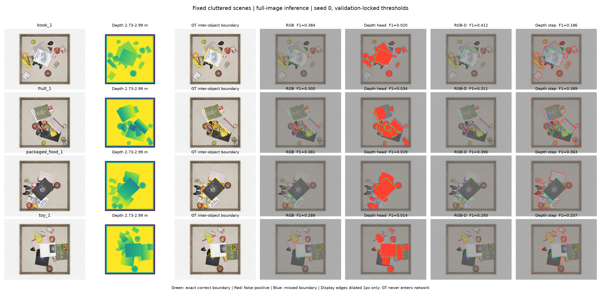

열은 RGB/depth/GT/RGB head/Depth head/RGB-D head/직접 단차임. 노랑=GT, 초록=정확한 예측, 빨강=오검출, 파랑=누락임.

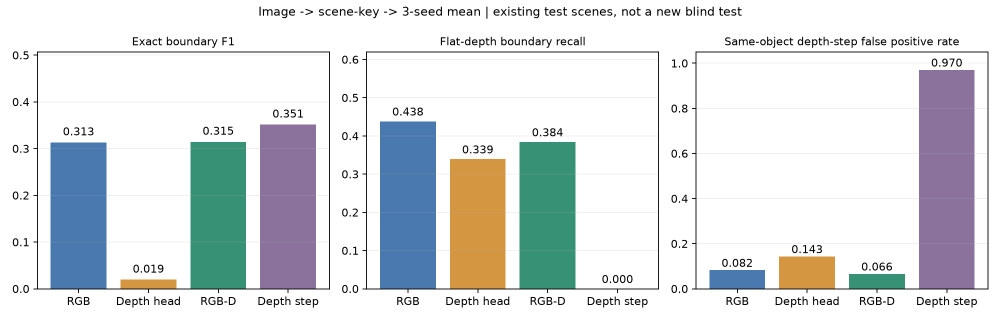

학습 head는 image→key→3 seeds, 직접 단차는 image→key 집계임.

Unit tests **18개 통과**, 경계 `audit.json` 및 utility 독립 감사 **통과**. 경계 감사는 cached GT 960장 재구성, raw bin/hist 9,600건, scope별 curve 19,200건, test exact/조건별 count 6,400건, hash 78개와 validation threshold·집계·bootstrap을 독립 재계산함. 2px tolerance는 사전 고정 16장×10모델=160건을 KD-tree로 재계산함. 원본 segmentation decoding·DINO forward·학습 재실행까지 수행한 감사는 아님. 모델 개선 gate 실패 판정도 그대로 일치함.

**다음 Step:** 단차 좌표를 보존하는 기하 정보와 물체 소속·전경 판단을 결합할 필요가 구체화됨. 직접 단차 기준선과 이번 feature concat decoder는 각각의 실패 유형을 확인한 비교군으로 유지함. Depth 단차가 없는 접경도 평가에 유지하며, 물체–배경/같은 물체의 내부 단차/서로 다른 물체를 구분하는 방법을 비교하고 실제 예측 관계의 utility 보존을 확인함. 접경 모듈·grouping·직접 관계 예측 가운데 어느 구조를 채택할지는 아직 결정하지 않음.


### 8. 완료된 보조 진단: 관측 관계의 제거 utility

Phase 35의 별도 17-asset 보조 capture를 재사용함. `fruit_1` 2개와 `packaged_food_1` 8개 layout의 과거 공통 상관 평가 가능 집합 **701 object-view cases / 49 views / 10 layouts**를 고정함. 원래 16-pool 경계 학습 자료의 test 결과와 혼합하지 않음.

결과값은 `새로 보인 다른 물체 pixel / 제거 전 해당 물체의 replay visible pixel`임. 물체 하나만 정적으로 숨기고 다른 물체는 고정한 노출 비율이며, grasp·낙하·검색 성공은 평가하지 않음. 모든 701개 원래 endpoint를 저장된 replay layer로 재현하여 검증했고 새 렌더는 수행하지 않음.

Count와 국소 관계 모두 동일한 96px window, global object area ≥32px / window intersection ≥16px 조건과 공통 유효 object pixel 평균을 사용함. 관측 GT 접경 support ≥8인 이웃의 degree, 후보가 10mm 초과 앞/뒤인 비율 차이의 이웃별 합, 10mm 이하 불명확 비율의 이웃 평균을 입력함. 17개 mapping 색은 충돌이 없고 기존 cap16 count와 실제 선택 표본의 차이는 float32 평균 오차 수준임.

회귀는 layout 전체와 그 모든 camera를 제외하는 10-fold LOLO, 고정 ridge `alpha=1`임. 학습 layout만으로 정규화·회귀 계수를 구하고 layout→view→object 균등 weight를 사용함. Area baseline을 모든 모델에 포함함. 평가는 view 안 object Spearman → layout 평균 → 10-layout 평균임.

| Primary 입력 | Spearman ↑ | 노출 비율 MAE ↓ |
|---|---:|---:|
| Log area + count96 | 0.550088 | 0.275112 |
| 위 입력 + local degree | 0.631521 | 0.253211 |
| 위 입력 + local depth-order/ambiguous | **0.801487** | **0.212034** |

관계 전체 추가 차이는 `+0.251400`, 10/10 layouts에서 양수이며 paired-layout 95% 구간은 `[+0.188974,+0.315823]`임. Degree 위의 추가 차이 `+0.169966`은 **signed order와 ambiguous 두 feature의 공동 효과**이며 방향 단독 ablation이 아님. 전체 영상의 관계를 사용하는 별도 민감도 모델은 `0.752548`임. 이 값은 동일 96px 범위 비교의 primary로 바꾸지 않음.

Primary area는 제거 전 replay 면적, count/관계는 원본 관측 면적·label을 사용한 source 차이가 있음. 제거 후 outcome 입력 누출은 아니지만 관측 입력의 일관성을 위해, primary를 유지한 채 observed area만 교체한 분석을 한 번 추가함. 관측/replay 면적의 절대 상대 차이 median/p95/max는 `0.05348%/0.30030%/2.98507%`였으며 baseline `0.550088`, 관계 모델 `0.801487`, 10/10 개선과 구간은 동일함.

GT ID와 관측 관계가 주어진 oracle utility이며 **predicted boundary를 이용한 utility 결과가 아님**. 10 layouts가 asset·capture batch를 공유하고 과거 자료를 재사용하므로 bootstrap 구간은 이 집합의 기술적 요약임. 독립 augmented least-squares 재계산은 원래 예측과 최대 `7.494e-15` 차이였고, train-only 정규화·layout holdout·상관·bootstrap·artifact hash 감사를 통과함.

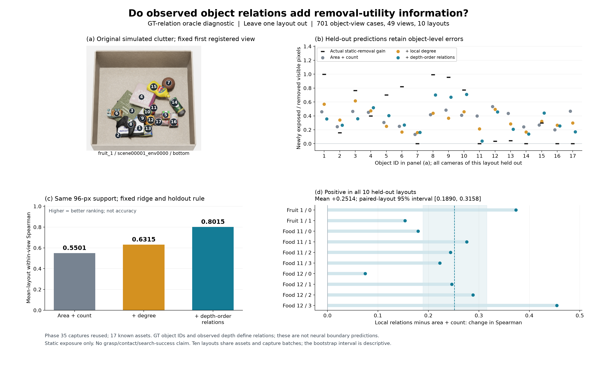

GT 관계를 이용한 제거 효과 예측과 layout별 비교임.

### 9. 근거 위치와 후속 판단의 범위

| 근거 | 로컬 경로 |
|---|---|
| 경계 v2 protocol·split·precision | `outputs/complexity_depth_boundary_20260921_v2/protocol.json` |
| Source snapshot·validation lock | 같은 run의 `source_snapshot/`, `validation_lock.json` |
| 모델·학습 이력·score/평가 저장 | 같은 run의 `models/` |
| 데이터·cache manifest·precision 감사 | `outputs/complexity_depth_boundary_20260921_v1/data/` |
| 모델·GT·metric·FP32 runner | `experiments/complexity_depth_boundary_20260921/` |
| Utility protocol·CSV·결과·독립 감사 | `outputs/complexity_depth_boundary_20260921_v1/utility/` |
| Utility 상세 정의·면적 보완·SHA | `docs/complexity_results/depth_boundary_utility_20260921.md` |
| 원본 capture와 10-layout utility 그림 | `outputs/complexity_depth_boundary_20260921_v1/panels/observed_relations_utility.png` |

경계 예측 결과와 oracle utility를 연결하려면, 예측 접경으로 관계를 구성했을 때의 오류·물체 대응·degree 및 앞뒤 요약의 보존 정도를 확인해야 함. 관측 depth의 직접 앞뒤 계산을 다시 학습해 맞힌 점수로 관계의 타당성을 대신하지 않음. 전체 물체 segmentation/관계 그래프, 새 asset 일반화, 실제 제거 행동, 최종 Complexity GT 및 fusion의 효과는 이번 결과의 자동 결론이 아님.

이번 게시에는 문서·PNG 3장만 포함하며 코드·checkpoint·원시 배열은 로컬에 보존함.

<!-- navigation:start -->
[전체 개요](README.md) · [Similarity](similarity_stream.md) · [Occlusion](occlusion_stream.md) · [Complexity](complexity_stream.md) · **Development Log** · [연구 문맥](agent.md)
<!-- navigation:end -->
