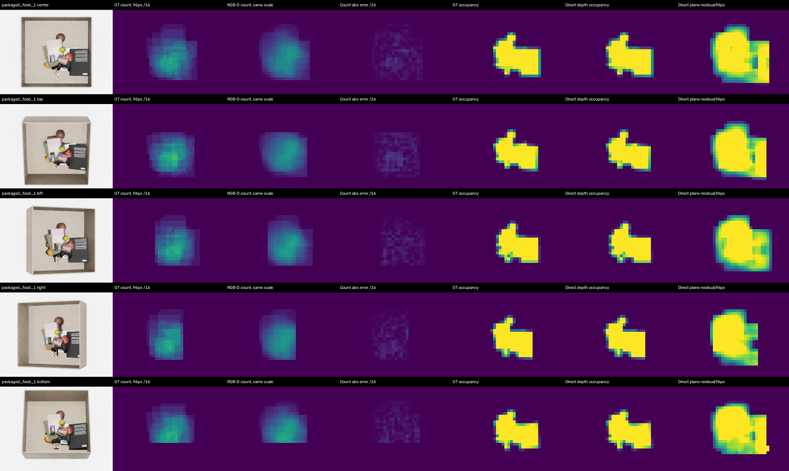
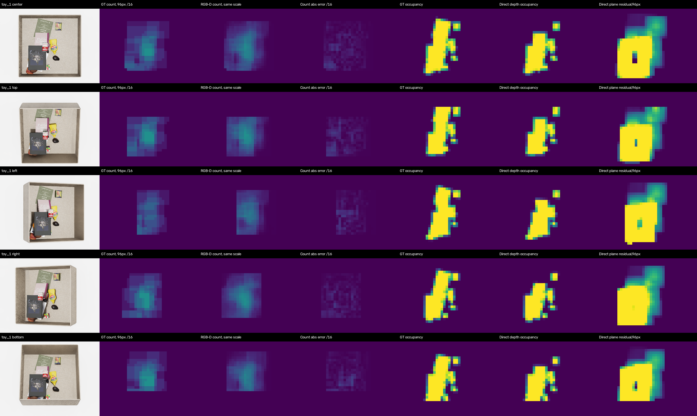

# RGB-D Complexity pilot

## 목적과 의미

Complexity는 target identity와 무관하게 관측된 물체의 국소 밀집과 표면 불규칙성을 표현함.
현재 RGB-D 한 장에서 보이지 않는 물체의 실제 개수, 적층 수 또는 target 존재 확률을 계산한 것은 아님.
Similarity/Occlusion에 더했을 때 탐색 행동을 개선하는지는 future fusion/DRL ablation으로 확인해야 함.

추론 입력은 scene RGB, metric depth와 고정 camera의 workspace mask/empty-drawer depth임.
Segmentation과 mapping은 학습 정답 생성·평가에만 사용하며 model forward에는 전달하지 않음.
별도 VLM·target reference·category prompt는 사용하지 않음.

## 왜 개수와 깊이를 함께 보는가

- 같은 높이의 작은 물체 여러 개는 밀도가 높아도 depth 분산이 낮을 수 있음.
- 비스듬한 책 한 권은 물체 수가 적어도 depth 분산이 클 수 있음.
- 넓고 평평한 물체가 다른 물체를 덮으면 숨겨진 적층은 한 장의 RGB-D에 나타나지 않을 수 있음.
- 포장지 글씨는 RGB 경계를 늘리지만 물체 수를 늘리지는 않음.

따라서 RGB feature로 visible density를 학습하고, 직접 계산 가능한 depth cue는 그대로 보존하는
구조를 비교함. 여러 단서를 임의의 가중합으로 합친 scalar를 target 확률 GT라고 부르지 않음.

## 정답 정의

480×640 원본 segmentation에서 16px patch 중심마다 48/96/160px 정사각형 window를 적용함.
Label mask를 먼저 축소하지 않고 원본 해상도에서 교집합 pixel 수를 계산함.

- 전체 workspace에서 32px 이상 보이는 label을 count 대상으로 삼음.
- Window에 16px 이상 들어오는 각 label을 한 번 셈. 분리된 조각이 여러 개여도 같은 label이면 한 번임.
- 세 count map은 각각 고정값 16으로 나누며, 장면별 min–max를 적용하지 않음.
- Window 전체 면적의 95% 이상이 workspace에 들어온 위치만 count 감독·평가에 사용함.
- Unknown nonblack 색이 들어온 window는 제외함. Unknown pixel을 background 정답으로 처리하지 않음.
- Occupancy는 patch 내부의 알려진 workspace 면적 중 물체 pixel 비율임.

저장된 색은 asset basename 단위임. 현재 generator는 asset당 한 물체를 spawn하므로 visible object
count와 대응하지만, 동일 asset을 여러 번 배치한 새 데이터에서는 하나로 합쳐질 수 있음.
기존 mapping의 `color_rgb`는 실제 BGR 값이며 새 `color_bgr` 필드를 우선 지원함.

Count/16은 고정 window 안의 bounded count score임. 각 window 크기 안에서는 면적당 밀도에
비례하지만, 서로 다른 window나 camera에서 물리적 면적당 density가 같다는 뜻은 아님.

## 입력과 feature 구조

```text
Scene RGB B×3×480×640
  → frozen DINOv3 ViT-B/16 layer 11
  → B×768×30×40 → Conv1×1 → 64 channels

Scene depth + fixed camera references
  → 직접 계산한 9-channel geometry at 30×40
  → Conv3×3 → 64 channels

Concat(64 RGB, 64 depth)
  → Conv3×3 + GroupNorm + GELU → Conv1×1 → 55 learned channels
  → Concat(55 learned, 9 direct geometry) = F_C: B×64×30×40
  → auxiliary Conv1×1 + sigmoid → 4 supervision maps
      48px count/16, 96px count/16, 160px count/16, occupancy
```

여기서 64는 위치마다 표현하는 숫자 개수임. 마지막 9개는 다음의 직접 계산한 depth cue로 고정함.

1. 고정 [2.5,3.5]m 범위로 정규화한 valid depth 평균
2. Empty depth보다 15mm 이상 앞에 있는 pixel의 비율
3. Depth/empty-reference 모두 유효한 pixel의 비율
4. 부호를 보존한 `empty_depth - scene_depth`에 대해, 48/96/160px 각 window에서 affine plane을 뺀 잔차 RMS, 3개
5. 같은 차이 map과 window에서 수평·수직 gradient의 분산 합에 제곱근을 취한 값, 3개

잔차 RMS는 30mm, gradient variation은 20mm로 나누고 [0,1]로 제한함. Invalid depth는 0m
관측으로 취급하지 않음. Empty reference를 먼저 빼서 고정된 서랍 벽·바닥의 불규칙성을 제외함.
물체가 empty reference보다 뒤에 관측되는 음수 차이도 임의로 0으로 자르지 않음.
이 평면 제거는 영상 좌표의 affine slope를 제거하는 연산이며, 실제
3D 곡률이나 view-invariant 높이 거칠기를 의미하지는 않음.

DINO는 기존 Similarity/Occlusion에서 쓰는 frozen ViT-B/16과 같은 가중치이며 pilot은 layer11만
사용함. 미래 통합 시 같은 scene의 backbone forward를 공유할 수 있지만, 통합 실행은 아직 미구현임.

## 고정 비교 조건

- 원본 16개 source pool 모두 포함; target label은 모델 입력으로 사용하지 않음.
- 기존 full16 Occlusion의 full train/validation/test scene-key split에서 사전 선택.
- v1 진단에서 이미 열어 본 test key 12개는 v2에서 제외하고 새로운 12개로 평가함.
- Train/validation/test: 48/12/12 scene keys ×16 pools×5 views = 3,840/960/960 samples.
- 같은 scene key의 다섯 camera와 source pool을 함께 split함.
- RGB-D와 depth-only는 같은 parameter shape, 초기 weight, sample 순서, optimizer 설정을 사용함.
- Depth-only는 RGB feature를 0으로 고정하므로 DINO 정보가 전달되지 않음.
- Seed 0/1/2, AdamW lr1e-3, weight decay1e-4, batch64, 최대24 epochs, patience5.
- 네 channel을 동일 가중한 masked SmoothL1(beta=.05). 각 channel은 자체 valid mass로 정규화함.
- Best checkpoint는 validation의 occupied-neighborhood count MAE로 선택함.
- 모든 checkpoint 선택이 완료된 뒤 test를 평가함. Test 결과로 hyperparameter를 조정하지 않음.
- Frozen RGB feature는 float16 cache로 한 번만 계산하여 재사용함.

평가에는 training label로만 맞춘 camera/위치별 평균 map baseline도 포함함. Depth foreground
occupancy의 직접 계산 결과와 학습 occupancy의 오차를 함께 보고함.

## 지표와 진행 기준

Primary count MAE는 GT count>0이며 count-valid인 window에서 계산함. Sample별 MAE를 구하고
sample, 세 scale, seed를 동일 가중 평균함. 저장값의 /16을 되돌려 **물체 개수 단위**로 보고함.
Zero-count neighborhood를 포함하는 전체 valid-window MAE와 occupancy area-fraction MAE도 별도 보고함.
Pixel별/윈도별 표본을 독립 scene 수로 간주하지 않음.

채택 gate는 결과를 보기 전에 다음으로 고정함.

1. RGB-D의 seed 평균 count MAE가 depth-only보다 10% 이상 낮음.
2. Paired scene-key cluster bootstrap(2,000회, seed3300)의 MAE 개선량 95% 구간 하한이 0보다 큼.
3. 세 scale·seed 평균 기준 최소 3/5 camera에서 개선함.
4. Training camera-position mean baseline보다 count MAE가 낮음.

Bootstrap은 동일 scene key의 모든 source pools·camera와 seed 평균 paired error를 함께 재표집함.
이 구간은 선택된 합성 scene의 변동성을 나타내며, 세 seed로 전체 학습 변동성을 규명한 것은 아님.
Gate는 RGB-D pilot 진행 기준이며 Complexity의 탐색 효용이나 unseen object 일반화 판정 기준은 아님.

## 선행연구와 이번 구현의 구분

- [Bravo & Farid, 2008](https://farid.berkeley.edu/downloads/publications/jov07.pdf):
  여러 segmentation scale의 영역 수를 visual clutter와 연결함. 실제 instance count GT는 아님.
- [Rosenholtz et al., 2007](https://pubmed.ncbi.nlm.nih.gov/18217832/):
  Feature Congestion, Subband Entropy, Edge Density와 시각 탐색의 관계를 비교함.
- [Liu, 2015, BU technical report](https://www.bu.edu/vip/files/pubs/reports/Liu15-04buece.pdf):
  국소 depth 미분 크기의 분산과 평면 fitting으로 clutter를 검출함. 학술지 논문이 아닌 기술보고서임.
- [Xiang et al., CoRL 2020 / PMLR 2021](https://proceedings.mlr.press/v155/xiang21a.html):
  합성 RGB-D feature embedding으로 unseen object instance segmentation을 학습함.
- [GRAB, 2026, arXiv v2](https://arxiv.org/html/2602.18835v2#S3.SS3.SSS3):
  초기 상태 대비 object-count 비율과 occupancy 비율의 곱을 전역 clutter 지표로 사용함.

이번 window count 정답, threshold, 55+9 feature 구조 및 비교 gate는 본 프로젝트의 설계임.
위 논문들이 동일 구조 또는 target 존재확률 향상을 검증했다는 뜻은 아님.

## 실행

로컬 DINO architecture checkout, 공식 ViT-B/16 weight, RGB-D/seg 데이터와 고정 camera reference가 필요함.
외부 모델을 자동 다운로드하지 않음. 다른 경로에서는 CLI의 data/workspace/DINO/split 인자를 지정함.

```bash
python -m unittest discover -s tests -p 'test_complexity*.py' -v
python run_complexity_pilot.py --run-dir outputs/complexity_rgbd_YYYYMMDD \
  --split-manifest docs/complexity_results/scene_split.json \
  --workspace-root docs/complexity_results/workspace_masks
python inference_complexity.py --run-dir outputs/complexity_rgbd_YYYYMMDD \
  --rgb /path/to/scene.png --depth /path/to/scene.npy --camera center \
  --out /path/to/new_complexity.npz
```

Inference NPZ에는 4개 auxiliary map, F_C64, direct geometry9, validity가 포함됨.
Checkpoint의 schema/mode/seed/protocol hash와 고정 reference hash를 확인함. 기존 output을 덮어쓰지 않음.
정성 panel은 사전 선택된 첫 test scene의 네 대표 source pool과 모든 camera를 사용함.
Count panel은 GT-valid window만 표시하며, 표시 밖의 0을 불가능 영역의 정답으로 해석하지 않음.

정확한 v2 split 재현은 위 명령에 `--exclude-test-manifest docs/complexity_results/v1_test_exclusion.json`을 추가함.
Data root의 RGB/depth/seg와 target/empty_scene/depth는 별도로 필요함. Checkpoint와 대용량 feature
cache는 GitHub에 포함하지 않으며 로컬 run 아래에 보존함.

## 결과

최종 실행은 `complexity_rgbd_20260907_v2`. 고정 배경의 반응을 수정한 RGB-D 모델이 사전 gate를 모두 통과하여 pilot baseline으로 채택함. 대표 추론 checkpoint는 test 성능으로 고르지 않은 기본 seed0의 `rgbd_seed0/best.pth`임.

| 모델 | Occupied count MAE ↓ | 전체 valid count MAE ↓ | Occupancy MAE ↓ |
|---|---:|---:|---:|
| Train camera-position mean | 1.24452 | 1.22860 | 0.22805 |
| Depth-only, 3 seeds 평균 | 0.83272 | 0.76323 | 0.01524 |
| RGB-D, 3 seeds 평균 | **0.64142** | **0.59270** | **0.00854** |
| Direct depth occupancy | — | — | 0.00981 |

| Window | RGB-D count MAE ↓ | Depth-only count MAE ↓ |
|---|---:|---:|
| 48px | 0.35252 | 0.49771 |
| 96px | 0.62180 | 0.80578 |
| 160px | 0.94993 | 1.19466 |

RGB-D의 primary count 오차는 **22.973% 감소**함. 5/5 camera, 16/16 source pool에서 seed 평균이 개선됨. 12개 scene-key cluster의 paired bootstrap 개선량 95% 구간은 **[0.178982, 0.205377]개**임. 960개 test 영상이나 수많은 window를 독립 scene 960개로 해석하지 않음.

RGB-D seed0/1/2의 count MAE는 `0.63873 / 0.64152 / 0.64400`; depth-only는 `0.83407 / 0.83028 / 0.83380`. RGB-D seed0에 RGB를 0으로 바꾸는 intervention을 가하면 MAE가 `1.38127`로 증가함. 이는 입력 변화 진단이며, 다시 학습한 depth-only와 같은 조건의 성능 비교가 아님.

**고정 배경 오류와 수정:** v1은 raw scene depth에서 거칠기를 계산하여 빈 서랍 자체도 높은 값을 보였음. Empty reference를 먼저 빼는 v2에서는 동일한 빈 서랍을 넣었을 때 다섯 camera 모두 여섯 거칠기 channel이 정확히 0임. [진단 수치](empty_drawer_diagnostic.json)를 보존함. v1 test key 12개를 제외한 새 12개를 v2 test로 사용했으며, 두 실행의 test set이 다르므로 v1–v2 점수 차이를 개선량으로 주장하지 않음.

**검증과 실행 비용:** 22개 CPU unit test 통과. Split 교집합 없음, code/calibration/checkpoint hash 일치, 16개 sample의 정답·geometry·valid 재계산 결과가 cache와 float16 단위에서 일치함. 저장된 오차로 독립 재집계한 summary 차이는 최대 `3.91e-8`. CUDA CLI 추론은 segmentation 없이 maps `4×30×40`, F_C `64×30×40`를 출력함. 선택한 한 sample의 단일 추론과 cache 경로 사이 map 절대 차이는 평균 `0.0006253`, 최대 `0.0097656`이었음. 학습과 같은 contiguous 입력·8장 DINO 배치로 재계산하면 cache와 정확히 일치하여 배치 크기에 따른 bfloat16 수치 차이를 확인함. Bit-identical 단일 영상 추론을 보장하지 않음.

RTX 5090, PyTorch `2.12.0+cu130`, NumPy `2.4.6`에서 v2 feature/GT 준비 `243.4초`, cache 기반 6개 head 학습·validation 합계 `27.2초`. 준비 시간에는 GT·depth 재계산이 포함되고 모델 초기 로딩은 제외됨. 5,760장 중 RGB feature 4,800장은 v1에서 재사용함. Head parameter는 `132,475`개이며 frozen DINO는 제외함. 단일 CLI 실행은 모델 로딩을 포함해 약 `5.06초`였고 순수 frame latency benchmark는 아님.

**남은 한계:** 정답은 현재 관측 가능한 asset-label 수임. 한 RGB-D에서 보이지 않는 물체 수, 실제 3D 적층, physical density를 복원하지 않음. RGB-D count prediction은 일부 경계 변화를 완만하게 표현함. 기존 asset library와 고정 camera에서 평가했으며 unseen scene-object·실환경·fusion/DRL 탐색 효용은 미확인임. 다음 Step은 독립 unseen scene-object 평가와 fusion GT/loss/ablation 설계임.

## 저장 근거와 정성 결과

- [전체 지표](summary.json): seed, camera, source pool별 MAE와 bootstrap 결과.
- [공개 protocol](protocol_public.json): selected scene keys, 고정 threshold, training 조건, checkpoint/source hash. 로컬 경로·inventory를 제외한 요약이며 원본 checkpoint protocol 파일의 대체물은 아님.
- [Data 진단](data_diagnostics.json), [독립 검토](validation_review.json), [추론 검증](inference_validation.json), [배치 정밀도 진단](batch_precision_diagnostic.json).
- `rgbd_seed{0,1,2}_history.json`, `depth_seed{0,1,2}_history.json`: validation 기반 선택의 전체 epoch 기록.
- [전체 scene split](scene_split.json), [v1 test 제외 목록](v1_test_exclusion.json), `workspace_masks/`: 실행 설정.

각 panel은 scene / 96px count GT / prediction / error / occupancy GT / direct occupancy / 96px plane residual 순서임. 각 source pool의 첫 test key를 사전에 선택했으며 다섯 camera를 모두 표시함.





