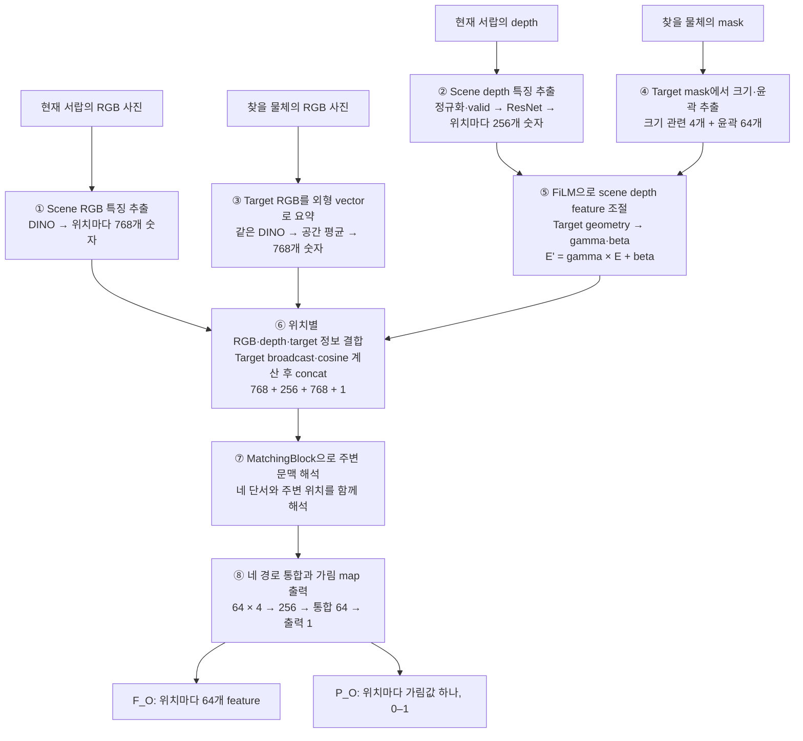
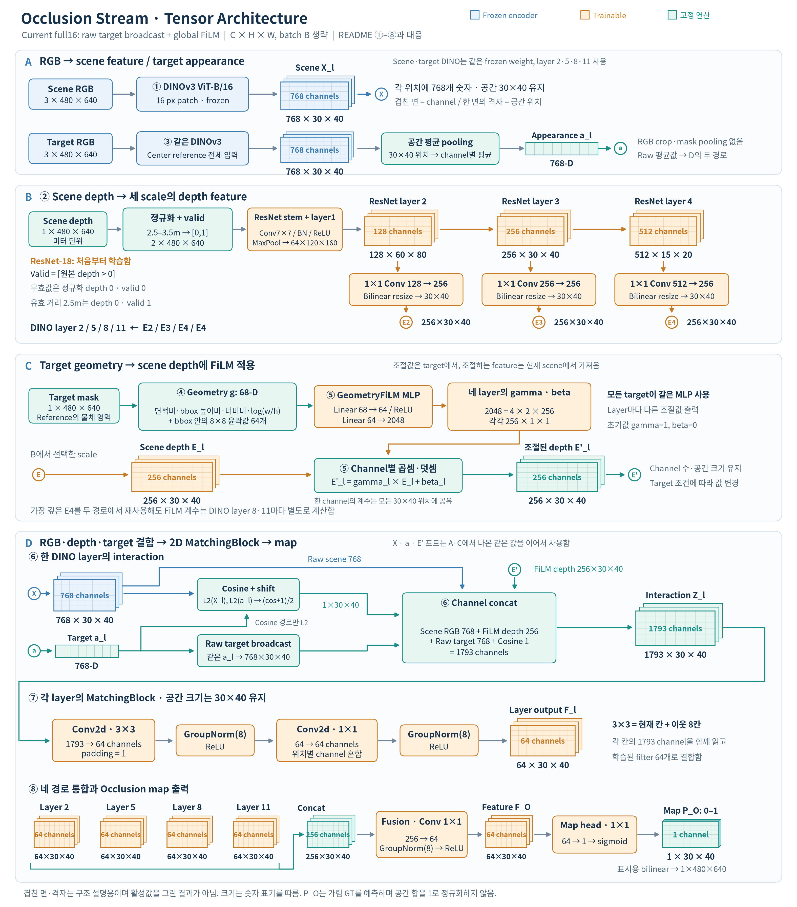
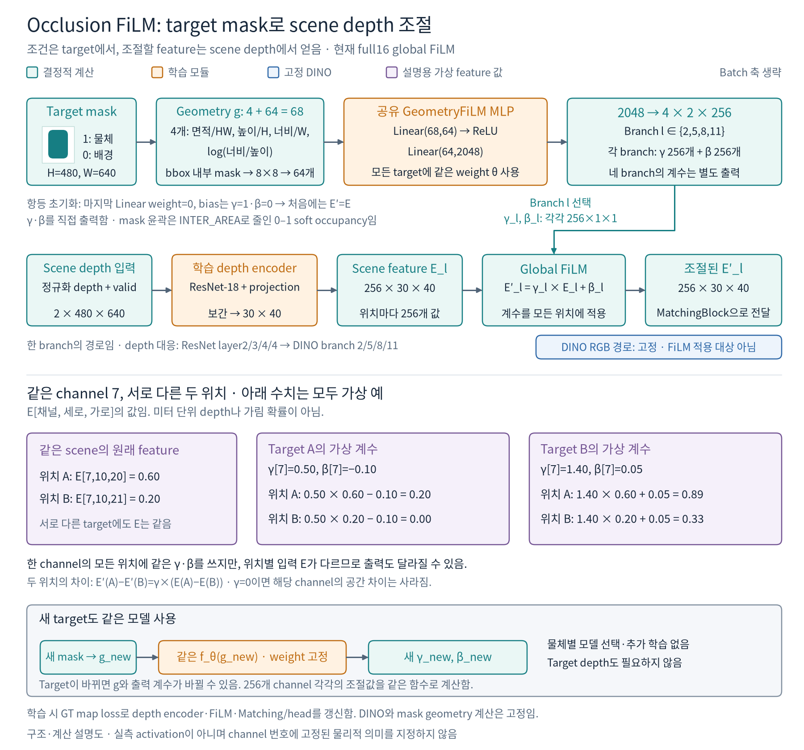
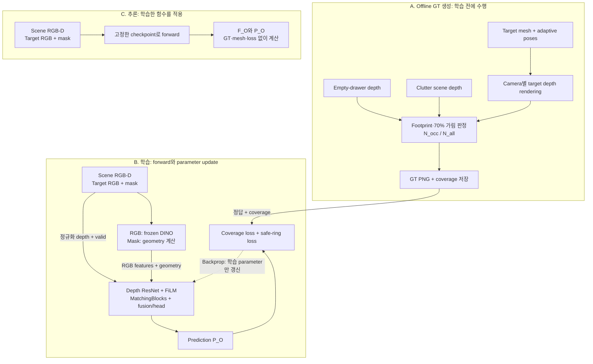

# Occlusion Stream

<!-- navigation:start -->
[전체 개요](README.md) · [Similarity](similarity_stream.md) · **Occlusion** · [Complexity](complexity_stream.md) · [Development Log](development_log.md) · [연구 문맥](agent.md)
<!-- navigation:end -->

> **현재 확인된 결과:** Adaptive GT 240,000장 생성, 기존 16개 target을 모두 포함한 baseline 학습, seen-target scene-heldout 정량 평가와 외부 `packaged_food_5`의 zero-shot 정량 평가까지 완료함. 현재 모델은 `native 68-D geometry + raw target broadcast + global FiLM`이며 전체 scene key의 10%로 학습함. GT coverage 기준 full16 MAE 0.013997, 외부 target MAE 0.017998을 확인하여 checkpoint를 보존함. 이를 기준으로 추가 target·입력 조건의 일반화와 fusion·탐색 효용을 후속 평가함.

## 1. 목적과 입출력

### Target 조건과 가림 후보

**가림 후보는 scene 구조와 target의 크기·형태에 함께 의존함.** 책과 포장식품이 겹친 같은 더미에서도 다음 차이가 생길 수 있음.

- 작은 과일: 비교적 좁은 부분에서도 상당 부분이 가려질 수 있음.
- 넓은 책: 같은 부분으로는 충분히 덮이지 않을 수 있으며, 넓게 겹친 물체 아래가 가림 후보가 될 수 있음.

Scene만으로 모든 target에 동일한 map을 만들면 이 조건 차이를 표현하기 어려움.

Occlusion의 목적은 **현재 더미에서 주어진 target이 가려질 수 있는 영역을 추정하는 것**임. Scene의 닮은 pixel을 찾는 Similarity와 구분되며, target이 완전히 보이지 않는 경우에도 관측된 더미 구조와 reference로 가림 후보를 제시하고자 함.

크기 예시는 입력 설계의 근거이며, **작은 target일수록 모든 위치의 확률이 높아진다는 규칙은 아님.** GT의 분자·분모는 크기·회전·후보 위치에 따라 함께 변하므로 pixel별 단조 관계를 보장하지 않음.

### 입력과 출력

| 구분 | 실제 자료와 단위 | Model에서 만드는 형태 | 역할 |
|---|---|---|---|
| Scene RGB | 현재 더미의 `480×640` RGB 영상 | `B×3×480×640` | 관측 물체의 외형·공간 문맥 |
| Scene depth | RGB에 대응하는 미터 단위 depth. 0은 무효값 | 정규화 depth와 valid mask를 합친 `B×2×480×640` | 관측 표면의 거리·공간 변화 |
| Target reference RGB | Target을 따로 촬영한 center/top-down `480×640` 영상 한 장 | DINO layer마다 `B×768` vector | 찾는 물체의 appearance 조건 |
| Target mask | 위 reference에서 target인 pixel만 1인 이진 mask | 크기·윤곽 descriptor `g: B×68` | 찾는 물체의 영상상 크기·형태 조건 |
| 중간 출력 `F_O` | 학습된 위치별 feature, 물리 단위 없음 | `B×64×30×40` | 향후 stream fusion에 전달할 가림 관련 표현 |
| Map 출력 `P_O` | 각 patch의 가림 GT 예측값, `0–1` | `B×1×30×40` | 현재 학습·평가에 사용하는 한 channel map |

`F_O`는 위치별 64-channel 중간 표현임. 마지막 head가 이를 한 값으로 결합하고 sigmoid를 적용한 `P_O`가 `0–1` 범위를 가짐.

**Target mask는 별도로 촬영한 reference의 silhouette임.** 현재 학습·외부 평가에서는 합성 segmentation으로 정확한 mask를 얻고 이를 geometry로 변환함. Scene segmentation이나 실제 target의 scene 위치를 network에 제공하지 않은 조건에서 가림 map 예측을 확인함.

### 입력·고정 자료·감독 정보

| 정보 | 학습 때 | 추론 때 |
|---|---|---|
| Scene RGB-D, target RGB와 mask | Network가 예측을 만드는 입력 | 같은 규격으로 필요 |
| Target mesh, candidate poses, empty-drawer depth와 camera calibration | Offline GT 생성에 사용 | Network forward에는 필요하지 않음 |
| GT와 target별 coverage | Loss·정량 평가에 사용 | Network forward에는 필요하지 않음 |
| Camera별 workspace mask | Safe-ring 보조 감독 영역을 정함 | 표시용 map에서 drawer 밖을 제거하는 후처리에 사용 가능 |

Camera workspace는 고정 rig의 drawer 내부 영역임. Coverage는 GT generator가 표본화한 target pose의 투영 영역에 의존함. 전자는 고정 공간 정보, 후자는 target별 감독·평가 정보로 구분함.

학습 정답은 **가상 target pose의 유효 투영 면적 중 70% 이상이 현재 scene depth 뒤에 있는 경우**를 집계한 값임. `P_O`가 이 GT를 근사하는 성능은 full16·외부 target 평가에서 확인함. 정의상 실제 target 위치를 직접 나타내거나 공간 합이 1인 위치 사후확률은 아니며, 다음에는 Similarity·Complexity와의 결합이 탐색 prior와 제거 action·DRL 성능에 주는 효과를 확인할 필요가 있음.

## 2. 전체 모델 구조

**같은 서랍이라도 작은 장난감을 찾을 때와 큰 책을 찾을 때는 가려질 수 있는 위치에 대한 판단이 달라짐.** 현재 모델은 서랍의 RGB·depth와 찾는 물체의 RGB·mask를 함께 사용해 이를 계산함. FiLM은 그중 target의 크기·윤곽에 맞춰 scene depth feature를 조절하는 ⑤ 단계임.

아래 번호와 다음 본문의 번호는 같은 계산을 가리킴. 먼저 DINO layer 하나의 경로를 ①–⑦까지 설명하고, ⑧에서 네 layer의 결과를 함께 사용하는 과정을 설명함.



### Tensor architecture

아래는 **현재 full16 모델의 실제 tensor와 convolution 구조**임. A는 RGB의 위치별 feature와 target appearance, B는 scene depth의 세 scale, C는 target geometry와 FiLM, D는 정보 결합과 최종 map을 보여 줌. ①–⑧은 위 framework 및 아래 본문과 대응하며 `X`, `a`, `E'` 포트는 앞에서 계산한 같은 값을 이어서 사용함.



겹친 면은 channel이고 면 안의 가로·세로는 공간 위치임. **FiLM은 `256×30×40`의 크기를 유지하면서 값만 조절함.** 이후 RGB 768개·FiLM depth 256개·target 768개·cosine 1개를 합치면 `1793×30×40`이 되고, MatchingBlock의 3×3 Conv가 이를 `64×30×40`으로 바꿈. 네 경로의 64개씩을 합친 256은 앞의 depth 256과 구성 정보가 다름.

A의 target RGB는 원본 전체를 DINO에 넣고 공간 평균함. C의 mask는 별도로 geometry를 만드는 입력임. B에서는 ResNet layer2·3·4를 각각 256-channel, 30×40으로 맞춘 뒤 DINO layer2·5·8·11에 **depth level2·3·4·4**를 연결함. 가장 깊은 depth feature를 재사용하는 두 경로도 FiLM 계수와 MatchingBlock은 각 경로에 맞게 적용함.

파랑은 고정 DINO, 주황은 학습 모듈, 초록은 정해진 계산임. 그림의 격자와 두께는 개념도이며 실제 크기는 숫자로 표시함. 같은 이름의 SVG도 `img/occlusion/`에 보존함. `P_O`는 가림 GT를 예측하는 map이며 표시용 확대는 sigmoid 뒤에 적용함.

## 3. 내부 모듈과 선택 이유

서랍에서 작은 장난감을 찾는 경우를 기준으로 설명함. 현재 서랍의 RGB·depth는 **서랍이 어떻게 생겼는지**, 별도 target RGB·mask는 **무엇을 찾는지** 알려주는 자료임. 아래 예는 사진 한 장을 기준으로 batch 축을 생략하며, `채널×세로×가로` 순서로 표기함.

### ① Scene RGB 특징 추출

현재 서랍의 컬러 사진을 DINOv3에 넣음. 사진을 그대로 비교하는 대신, 모델이 다음 계산에 사용할 숫자 표현인 **feature**로 바꾸는 과정임.

```text
Scene RGB: 높이 480 × 너비 640
    ↓ 16×16 patch와 전체 영상 문맥을 DINOv3가 처리
Feature 지도: 높이 30 × 너비 40
    ↓
각 위치에 그곳을 표현하는 숫자 768개
```

즉, `768×30×40`은 **30행·40열의 각 칸에 숫자 768개가 들어 있다**는 뜻임. 이 숫자 768개를 channel이라고 부름. 위치 하나를 고르면 숫자 768개를 읽고, channel 하나를 고르면 30×40 지도 한 장을 읽게 됨.

768개 물체나 확률을 출력한 것은 아님. 각 숫자에 책·높이 같은 이름이 미리 붙어 있지도 않음. DINO는 해당 patch뿐 아니라 다른 위치의 문맥도 반영해 이 숫자들을 계산함.

Scene에서는 **어느 위치의 정보인지가 필요하므로 이 지도를 그대로 유지함.** 이후 ⑥에서 같은 위치의 depth·target 정보와 함께 읽음.

<details>
<summary>구현 세부: DINO 입력과 patch 규격</summary>

RGB를 255로 나누어 `[0,1]`로 바꾼 뒤 ImageNet mean/std로 정규화함. DINOv3 ViT-B/16은 evaluation mode에서 weight를 고정하고 gradient 없이 실행함. 선택 layer는 `2/5/8/11`이며 scene과 target이 같은 weight를 사용함.

`480/16=30`, `640/16=40`이므로 각 layer 출력은 `B×768×30×40`임. 여기서 `B`는 batch의 sample 수임. Patch 크기 16과 학습 target 수 16은 서로 다른 설정임. DINO attention이 영상의 다른 위치를 반영하므로 feature의 정보 범위는 해당 16×16 pixel에 한정되지 않음.

</details>

### ② Scene depth 특징 추출

Depth에는 각 pixel에서 관측한 거리값이 있음. 이 값을 바로 RGB feature와 붙이지 않고, 먼저 **거리의 숫자 범위와 관측값의 유무를 정리함.**

현재는 원본 depth가 0보다 크면 `valid=1`, 0인 곳은 `valid=0`으로 처리함. Valid 1은 사용할 관측값이 기록됐다는 표시이며 완벽한 측정이라는 뜻은 아님. Valid 0도 물체가 없다는 뜻이 아니라 **그 pixel의 거리를 모른다**는 뜻임.

정규화는 거리를 정해진 숫자 범위로 옮기는 것임. 현재 `2.5–3.5m`를 `0–1`로 바꾸고, 범위 밖 유효값은 0 또는 1로 제한함. 무효값의 정규화 depth는 0으로 둠.

| 원본 depth | 정규화 depth | Valid |
|---|---:|---:|
| 2.5m | 0.0 | 1 |
| 3.0m | 0.5 | 1 |
| 3.5m | 1.0 | 1 |
| 0: 관측값 없음 | 0.0 | 0 |

실제 거리 2.5m와 관측값이 없는 곳은 정규화 depth만 보면 모두 0임. **두 경우를 구별하기 위해 valid를 두 번째 channel로 넣음.** 원본 한 pixel은 `[정규화된 거리, 유효성]`의 숫자 두 개로 표현됨.

이 2-channel 영상을 별도 ResNet-18이 처리하여 주변 거리 패턴을 feature로 만듦. RGB와 같은 위치에서 읽을 수 있도록 표현 폭과 지도 크기도 맞춤.

```text
Depth 입력: 2×480×640
    ↓ ResNet-18
주변 거리 패턴을 표현한 feature
    ↓ Channel 수를 맞추고 크기를 정렬
Depth feature: 256×30×40
```

이제 같은 위치 A에 RGB feature 768개와 depth feature 256개가 준비됨. 여기서 A는 원본 pixel 하나가 아니라 **작아진 30×40 feature grid의 한 칸**임.

Depth를 `30×40`짜리 숫자 지도 256장이 겹친 것으로 볼 수 있음. 한 위치에서 256장을 관통해 읽으면 vector 하나이고, channel 하나만 선택하면 지도 한 장임.

```text
위치 A를 고정 → [e_0, e_1, …, e_255] : 숫자 256개
Channel 7을 고정 → 30×40의 숫자 지도 한 장
```

**256은 depth 표현의 폭이며 원본 patch의 `16×16=256` pixel 수에서 나온 숫자가 아님.** 이 feature의 0.6은 0.6m도, 가림 확률 60%도 아님. 거리 패턴을 신경망으로 변환한 값이며 `[0,1]`에 제한되지 않음.

여기까지는 찾을 물체가 아직 반영되지 않음. 같은 서랍에서 작은 장난감 대신 큰 책을 찾더라도 FiLM 이전 scene feature는 같음. 다음에는 target에서 조건을 준비함.

<details>
<summary>구현 세부: Depth 정규화 식과 ResNet scale</summary>

원본 scene depth를 `D_s`, pixel 위치를 `(u,v)`, validity를 `V`로 표기함. `clip`은 값을 지정한 범위에 제한하는 연산임.

$$
V(u,v)=[D_s(u,v)>0]
$$

$$
\bar D_s(u,v)=
\begin{cases}
\mathrm{clip}((D_s(u,v)-2.5)/(3.5-2.5),0,1),&V(u,v)=1\\
0,&V(u,v)=0
\end{cases}
$$

실제 입력은 정규화 depth와 `V`를 합친 `B×2×480×640`임. 고정 범위는 scene 간 같은 거리를 같은 값으로 표현하기 위한 설정임. 새로운 camera 배치에서는 clipping 비율과 입력 분포를 확인할 필요가 있음.

`SceneDepthEncoder`는 `weights=None` ResNet-18을 사용하고 첫 convolution을 2-channel 입력으로 바꾸어 처음부터 학습함. Stride는 입력 영상에서 feature 위치 간격을 나타내며, 겹친 convolution의 실제 receptive field는 그보다 넓음.

| 위치 | 공간 해상도와 channel | 역할 |
|---|---|---|
| 입력 | `B×2×480×640` | 정규화 depth와 valid |
| 첫 `7×7` convolution, stride 2 | `B×64×240×320` | 주변 depth·valid 패턴을 첫 feature로 변환 |
| Max-pool와 `layer1` 이후 | `B×64×120×160` | 이후 scale들을 만드는 공통 앞단 |
| `layer2`, stride 8 | `B×128×60×80` | 비교적 촘촘한 depth 표현 |
| `layer3`, stride 16 | `B×256×30×40` | DINO와 같은 위치 간격의 표현 |
| `layer4`, stride 32 | `B×512×15×20` | 더 넓은 주변을 요약한 표현 |

현재 한 경로의 예에서는 ResNet layer2 출력을 사용함. 각 scale의 독립적인 `1×1 Conv`가 channel 수를 맞추고 `align_corners=False`인 bilinear interpolation이 30×40 위치 수를 맞춤.

```text
128×60×80  → 1×1 Conv 128→256 → resize → 256×30×40
256×30×40  → 1×1 Conv 256→256 → resize → 256×30×40
512×15×20  → 1×1 Conv 512→256 → resize → 256×30×40
```

ResNet residual connection은 기존 feature에 convolution이 만든 변화량을 더함. ResNet-18의 18은 architecture의 layer 명칭임. `1×1` 입력에는 이전 convolution의 문맥이 이미 포함되며, 15×20 feature를 확대해도 새로운 세부 관측을 추가하지 않음.

원소 표기는 `E[c,u,v]`임. 위치 `(10,20)`을 고정하면 `[E[0,10,20],…,E[255,10,20]]`의 256개 숫자를 읽고, channel 7을 고정하면 `E[7,:,:]`의 30×40 map을 읽음.

</details>

### ③ Target RGB를 외형 vector로 요약

찾을 물체를 따로 찍은 사진도 scene과 **같은 frozen DINOv3**에 넣음. 처음에는 target 사진에서도 `768×30×40` feature map이 나옴.

Target 사진에서 필요한 것은 사진 속 어느 위치에 물체가 놓였는지보다 **어떤 물체를 찾는지에 대한 조건**임. 그래서 현재 모델은 전체 공간 위치를 평균해 target을 대표하는 vector 하나로 요약함.

```text
Target RGB
    ↓ 같은 DINOv3
768×30×40
    ↓ 각 channel 안에서 1,200개 위치를 평균
Target vector: 숫자 768개
```

평균해도 768개 숫자까지 한 scalar로 합치는 것은 아님. 설명용 가상 값으로 **3채널×2행×2열**을 두면, A·B·C·D 네 위치를 channel마다 따로 평균함.

| Channel | 위치 A | 위치 B | 위치 C | 위치 D | 네 위치의 평균 |
|---|---:|---:|---:|---:|---:|
| 1 | 1 | 3 | 5 | 7 | 4 |
| 2 | 2 | 4 | 6 | 8 | 5 |
| 3 | 10 | 20 | 30 | 40 | 25 |

결과는 `[4,5,25]`임. **공간 위치만 하나로 요약했으므로 channel별 평균 하나씩, 총 3개가 남음.** 실제 모델도 같은 계산으로 channel 768개를 유지함. `768×1×1`로 표현할 수 있지만 target RGB 자체를 pixel 하나로 줄였다는 뜻은 아님.

현재는 원래 target 사진을 crop하거나 mask 부분만 평균하지 않음. **배경 patch도 평균에 포함됨.** 배경이 많은 reference에서는 그 영향도 들어갈 수 있으며, 검정 배경이라고 DINO feature까지 0이 되는 것은 아님.

이 전체 frame 평균을 사용한 모델에서 full16·외부 target의 가림 map 예측을 확인함. 크기·윤곽은 평균 vector에만 맡기지 않고 다음 ④에서 별도로 계산함. Mask 경로는 이 외형 vector의 배경을 지우는 역할이 아니라 target의 다른 정보를 보완하는 경로임.

<details>
<summary>구현 세부: Target 평균 식과 배경의 기여</summary>

$$
q_l=\frac{1}{H_pW_p}\sum_{u=1}^{H_p}\sum_{v=1}^{W_p}X_{t,l}(u,v)
$$

`l`은 선택 layer, `X_{t,l}(u,v)`는 해당 위치의 768-D target vector임. `H_p=30,W_p=40`이며 결과 `q_l`은 `B×768`임. Backbone이 반환하는 CLS token은 사용하지 않음.

현재 `encode_target_occlusion_frame()`은 원본 target frame을 입력하고 공간축만 평균함. Bbox crop·224×224 확대·mask 가중 평균을 적용하지 않는다는 점에서 Similarity와 다름.

설명용으로 전체 1,200개 위치 중 물체 쪽이 12개, 배경 쪽이 1,188개라면 두 집단 평균의 결합은 `q_l=0.01×q_obj+0.99×q_bg`임. 공간 평균에서는 작은 집단의 비중도 작지만 DINO가 위치 간 문맥을 섞으므로 target 정보가 정확히 1%만 남는다는 뜻은 아님. 배경 혼합의 실제 성능 영향은 pooling 방식을 통제한 비교로 확인할 수 있음.

</details>

### ④ Target mask에서 크기·윤곽 추출

Target mask는 **물체 영역인지 아닌지만 기록한 2차원 배열**임. Target 부분은 1, 배경은 0으로 표시하며 물체의 원래 색·무늬는 남아 있지 않음.

| 자료 | Target 부분 | 배경 부분 | 담는 정보 |
|---|---|---|---|
| Target mask | 1, 표시하면 흰색 | 0, 표시하면 검정색 | 차지하는 영역과 윤곽 |
| Mask를 적용한 RGB | 물체의 원래 색·무늬 | 검정색 | 배경을 지운 물체 외형 |

현재 쓰는 mask는 첫 번째임. **③의 RGB는 배경을 지우지 않은 원래 reference frame이고, mask는 크기·윤곽 계산에 별도로 사용함.** 더미 속 숨은 target의 위치를 표시하는 mask도 아님.

Mask에서 크기 관련 4개 값과 윤곽 64개 값을 계산하면 숫자 68개가 됨. 학습된 신경망이 아니라 정해진 전처리로 계산함.

| 정보 | 계산 내용 | 개수 |
|---|---|---:|
| 면적 비율 | 전체 사진 중 target pixel의 비율 | 1 |
| 높이 비율 | Target bbox 높이 ÷ 사진 높이 | 1 |
| 너비 비율 | Target bbox 너비 ÷ 사진 너비 | 1 |
| 종횡비 | `log(bbox 너비 / bbox 높이)` | 1 |
| 거친 윤곽 | Bbox 안의 mask를 8×8로 줄인 값 | 64 |
| 합계 | 크기 관련 4개 + 윤곽 64개 | 68 |

Bbox는 target을 감싸는 최소 사각형임. **전체 480×640 mask를 8×8로 줄이는 것이 아니라 이 사각형 안쪽만 자름.** 예를 들어 bbox가 세로 80·가로 160이면 다음 순서임.

```text
전체 mask 480×640
    ↓ Target bbox 안의 mask만 crop
80×160
    ↓ 면적 기반으로 축소
8×8
    ↓ 첫 행부터 차례로 펼침
숫자 64개
```

이 예에서 축소된 한 칸은 원래 crop의 `10×20=200` pixel에 해당함. 그 구역이 물체로 얼마나 채워졌는지를 기록하므로 값이 0과 1 사이의 중간값일 수 있음.

| 그 구역의 target pixel | 축소된 한 칸의 값 |
|---|---:|
| 0/200 | 0.00 |
| 50/200 | 0.25 |
| 150/200 | 0.75 |
| 200/200 | 1.00 |

큰 사각형과 작은 사각형도 각각 자기 bbox 안에서 줄이면 비슷한 8×8이 될 수 있음. **그래서 전체 사진에 대한 면적·높이·너비도 함께 남김.** 앞의 네 값은 원본 영상에서의 크기·비율, 뒤의 64개는 bbox 안의 거친 윤곽을 전달함.

이 숫자 68개를 geometry `g`라고 부름. 실제 3D 길이를 cm로 측정한 값은 아니며 정해진 촬영 조건에서의 영상상 크기·윤곽임. 다음 FiLM이 이 `g`로 scene depth를 조절함.

<details>
<summary>구현 세부: Native 68-D의 정확한 계산과 크기 예</summary>

`extract_target_geometry()`는 target 전용 segmentation에서 얻은 binary mask를 사용함. Frame 높이·너비는 `H,W`, target pixel 수는 `A`, bbox 높이·너비는 `h,w`임.

| Index | 계산 | 단위·범위와 해석 |
|---|---|---|
| `g[0]` | `A/(H×W)` | 단위 없는 면적 비율. Frame 전체 중 target의 비율 |
| `g[1]` | `h/H` | 단위 없는 높이 비율 |
| `g[2]` | `w/W` | 단위 없는 너비 비율 |
| `g[3]` | `log(w/h)` | 자연로그 종횡비. 세로가 길면 음수, 같으면 0, 가로가 길면 양수 |

`g[4:68]`은 bbox mask를 float로 바꾸어 OpenCV `INTER_AREA`로 8×8 resize하고 행 순서로 펼친 값임. 80×160→8×8 예시는 정수 배율인 경우이며 다른 bbox도 같은 방법으로 고정 길이 64개를 만듦.

```text
Reference frame 전체: 480×640
          │
          ├─ foreground 면적 / 전체 면적         → 1개
          ├─ bbox 높이 / 480, bbox 너비 / 640    → 2개
          ├─ log(bbox 너비 / bbox 높이)          → 1개
          │
          └─ bbox 안의 mask → 8×8 soft grid
                0.0  0.2  0.8  ...
                0.1  0.9  1.0  ...
                ... 8개 행 ...
                         ↓ 한 줄로 펼침          → 64개

전체 descriptor: 4 + 64 = 68개 숫자
```

별도 scalar 계산 예로 `A=3,072px,h=96px,w=64px`이면 다음과 같음.

```text
면적 비율   3072 / (480×640) = 0.01
높이 비율     96 / 480       = 0.20
너비 비율     64 / 640       = 0.10
log aspect   log(64/96)      ≈ -0.405
```

가로·세로가 각각 2배면 면적은 4배가 되어 `[0.04,0.40,0.20,-0.405]`를 얻음. Bbox 기준 8×8 윤곽이 같아도 앞의 크기 값은 달라짐. 이는 계산 예이며 모델의 2배 scale 입력 성능은 별도 평가 항목임.

Bbox를 정사각형 8×8로 바꾸면 원래 종횡비가 변하므로 높이·너비·log aspect를 따로 제공함. 같은 bbox의 사각형과 둥근 물체는 corner occupancy가 다를 수 있어 윤곽 값도 함께 제공함.

Native 68-D는 이 원래 정의를 모두 사용하는 계약임. 과거 size-only·exact-extent oracle처럼 일부 slot을 0 또는 3D extent로 바꾸면 차원 수가 같아도 현재 checkpoint의 입력과 달라짐. Descriptor는 촬영 거리·화각에 영향을 받는 영상상 크기이며 target depth·USD의 실제 3D 치수를 입력하지 않음.

</details>

### ⑤ FiLM으로 scene depth feature 조절

같은 서랍이라도 작은 장난감과 큰 책이 가려질 수 있는 정도는 다를 수 있음. FiLM은 **찾는 물체의 크기·윤곽에 맞춰 현재 서랍의 depth feature를 다르게 처리할 수 있게 하는 부분**임.

하는 일은 곱하고 더하기임. Target geometry를 받는 작은 신경망이 곱할 값 `gamma`와 더할 값 `beta`를 만들고, 이를 ②에서 얻은 scene depth feature에 적용함.



그림 위쪽은 **68→64→2048개의 조절값을 만드는 경로**, 가운데는 **그 조절값을 scene depth feature에 적용하는 경로**임. 아래 계산은 다음 본문과 같은 가상 예이며, 실제 activation이나 예측 결과를 표시한 것은 아님. 마지막 Linear는 gamma·beta를 직접 출력하고, 초기에는 gamma=1·beta=0이 되도록 설정하여 원래 feature부터 학습을 시작함.

**조건을 만드는 것은 target mask이고, 변환하는 대상은 scene depth feature임.** Target depth는 이 계산에 들어가지 않음.

설명용으로 depth channel 7의 두 위치를 읽었다고 가정함. 아래 숫자는 실제 학습 channel의 측정값이 아니라 계산 원리를 보여주는 가상 값임.

```text
E[채널 번호, 세로 위치, 가로 위치]

E[7,10,20] = 0.60  ← 위치 A
E[7,10,21] = 0.20  ← 위치 B
```

A·B는 **같은 channel 지도 안의 서로 다른 두 칸**임. 7은 channel 번호, 10·20·21은 위치, 0.60·0.20은 그곳에 저장된 feature 값임.

작은 target의 geometry에서 `gamma[7]=0.50, beta[7]=-0.10`이 나왔다면 두 위치는 다음처럼 바뀜.

```text
위치 A: 0.50 × 0.60 − 0.10 = 0.20
위치 B: 0.50 × 0.20 − 0.10 = 0.00
```

다른 큰 target에서 `gamma[7]=1.40, beta[7]=0.05`가 나왔다고 가정하면 같은 scene feature로부터 다음 값을 얻음.

```text
위치 A: 1.40 × 0.60 + 0.05 = 0.89
위치 B: 1.40 × 0.20 + 0.05 = 0.33
```

**같은 scene feature도 target 조건에 따라 다른 값으로 변환될 수 있음.** 같은 channel에서는 모든 위치에 동일한 gamma·beta를 적용하지만, 원래 값이 달라 공간 차이는 남음. 다른 channel에는 그 channel의 조절값을 적용함. 이것이 현재의 channel별 **global FiLM**임.

0.89는 가림 확률 89%가 아니라 뒤의 신경망에 전달할 중간값임. 큰 target일수록 gamma가 커진다는 규칙을 사람이 넣은 것도 아님. 어떤 조절값이 최종 map 예측에 도움이 되는지를 GT loss로 학습함.

여기서 **target마다 FiLM 모델을 따로 만들거나 고르지 않음.** 하나의 공유 신경망을 `f_θ`라고 쓰면 `(gamma,beta)=f_θ(g)`임.

| 값 | 무엇인가 | 새로운 target을 넣으면 |
|---|---|---|
| `θ` | FiLM 신경망의 학습된 weight·bias | 같은 checkpoint의 값 사용 |
| `g` | Target mask에서 계산한 68개 숫자 | 새 mask에서 다시 계산 |
| `gamma,beta` | 신경망이 계산한 조절값 | 입력 `g`에 따라 달라질 수 있음 |

고정된 계산식 `f(x)=2x+1`도 2를 넣으면 5, 3을 넣으면 7을 냄. **같은 함수에 다른 입력을 넣어 출력이 달라지는 것**임. 실제 MLP도 이보다 복잡한 숫자 변환이지만 원리는 같음.

새 물체라도 mask의 면적·bbox·윤곽은 같은 공식으로 계산할 수 있음. 그 68개 숫자를 기존 신경망에 넣으면 gamma·beta가 자동으로 나옴. 가까운 기존 물체의 FiLM을 찾아오거나 새 물체용으로 다시 학습할 필요가 없음. 사용자가 주는 것은 target RGB·mask임.

실제로 기존 checkpoint에 학습하지 않은 `packaged_food_5`를 넣어 zero-shot 예측까지 확인함. 다음에는 여러 새 target에서도 이 결과가 유지되는지 확인함.

FiLM은 **값을 바꾸되 shape는 바꾸지 않음.** `256×30×40`의 depth feature가 같은 크기로 다음 단계에 전달됨.

<details>
<summary>구현 세부: FiLM 식·MLP 규격·초기화와 다른 conditioning 방식</summary>

$$
E'_{l,c}(u,v)=\gamma_{l,c}(g)E_{l,c}(u,v)+\beta_{l,c}(g)
$$

`E,E'`는 FiLM 전·후 depth feature, `l`은 branch, `c`는 channel, `(u,v)`는 30×40 grid 위치임. Branch마다 gamma·beta tensor는 각각 `B×256×1×1`이고 공간에 broadcast함.

$$
a=\mathrm{ReLU}(W_1g+b_1),\qquad z=W_2a+b_2
$$

| 기호 | Sample 하나의 크기 | 역할 |
|---|---|---|
| `g` | 68개 | Native geometry 입력 |
| `a` | 64개 | ReLU 이후 중간값 |
| `z` | 2,048개 | 네 branch의 gamma·beta 출력 |
| `W_1`, `b_1` | `64×68`, 64개 | 첫 Linear layer의 weight·bias |
| `W_2`, `b_2` | `2048×64`, 2,048개 | 둘째 Linear layer의 weight·bias |

위 식에서 `W,b`는 학습 weight·bias이고 ReLU는 음수를 0으로 바꾸는 함수임. 중간값 `a`의 64개 축에 개별 물리량을 지정하지 않음.

```text
g: B×68
   ↓ Linear(68,64) + ReLU
a: B×64
   ↓ Linear(64,2048)
z: B×2048
   ↓ reshape
B×4×2×256
  │ │  └─ depth channel
  │ └──── gamma / beta
  └────── DINO branch 네 개

Branch 하나: gamma 256개 + beta 256개
Branch 네 개: 4 × 2 × 256 = 2,048개
```

**항등 초기화.** 마지막 `Linear(64,2048)`의 weight는 0, gamma bias는 1, beta bias는 0으로 설정함. 학습 시작에는 모든 `g`에 대해 `E'=E`이므로 임의 target 보정 없이 출발하고, GT loss의 gradient로 조절값을 학습함. FiLM은 forward의 일부이며 추론에도 적용함.

| 조절값 | 한 channel에서의 작용 |
|---|---|
| `gamma=1, beta=0` | 기존 feature를 그대로 통과 |
| `0<gamma<1, beta=0` | 기존 반응의 절댓값을 줄임 |
| `gamma>1, beta=0` | 기존 반응의 절댓값을 키움 |
| `gamma=0` | 기존 공간 반응 대신 beta만 남김 |
| `gamma<0, beta=0` | 0이 아닌 기존 반응의 부호를 뒤집음 |
| `beta>0` 또는 `<0` | 해당 channel의 기준값을 위·아래로 이동 |

| 방법 | Target 조건을 쓰는 방식 | 공간·channel에 생기는 차이 | 현재 상태 |
|---|---|---|---|
| Geometry 단순 concat | Geometry 숫자를 위치마다 복제해 depth feature 옆에 붙임 | 후속 network가 두 입력의 관계를 학습함. Concat 자체는 depth를 바꾸지 않음 | 현재 full16에서 FiLM 대신 비교한 최종 ablation은 없음 |
| Global FiLM | Geometry에서 channel별 gamma·beta를 만들고 depth feature에 곱하고 더함 | Target에 따른 곱셈 상호작용을 명시하며 한 channel의 조절값은 모든 위치에 공통 | **현재 baseline** |
| Spatial/cross-attention | Query와 key의 관계로 위치·token의 가중치를 만들어 정보를 모음 | 어떤 위치나 token을 참조할지 학습할 수 있으나 구체적 동작은 attention 설계에 따라 다름 | 현재 Occlusion head에 target–scene cross-attention은 없음 |
| 과거 local residual gate | 위치별 gate로 target 보정의 적용 강도를 조절하고 기존 depth에 변화량을 더함 | Target 보정을 위치마다 제한하려는 목적 | 과거 연구용 mode. 현재 baseline에 적용하지 않음 |

현재 FiLM baseline의 full16·external 결과를 확보함. 단순 concat·attention과의 차이는 조건을 넣는 연산에 있으며 방식별 추가 효과는 동일 조건 비교로 확인할 필요가 있음. DINO 내부 attention과 target–scene cross-attention은 별개임. 과거 local gate는 현재 계산에 포함하지 않으며 상세 이력은 Phase 23–30에 기록함.

</details>

### ⑥ 위치별 RGB·depth·target 정보 결합

이제 scene RGB feature, target에 맞춰 조절한 depth feature, target 외형 vector가 준비됨. 이들을 바로 더하지 않고 **같은 scene 위치에서 함께 읽을 수 있도록 준비함.**

Target vector는 숫자 768개 한 묶음이고 scene처럼 여러 위치를 갖지 않음. 따라서 모든 scene 위치에 같은 vector를 전달함. 이것이 broadcast임.

```text
Target vector: [t_0, t_1, …, t_767]

Scene 위치 A에도 → 같은 768개 숫자
Scene 위치 B에도 → 같은 768개 숫자
나머지 위치에도 → 같은 768개 숫자
```

Target이 모든 위치에 있다는 뜻이 아니라 **각 위치를 판단할 때 이번에 찾는 물체의 조건을 함께 주는 것**임. Scene RGB·depth가 위치마다 다르므로 이후 판단도 달라질 수 있음.

외형 유사도도 한 값으로 계산함. 위치 A의 scene vector와 target vector를 비교하고, 위치 B에서도 같은 비교를 수행함. 이 cosine을 `[0,1]` 범위로 옮긴 shifted cosine이 추가 단서가 됨. 예를 들어 cosine 0.6은 0.8, cosine 0은 0.5로 바뀜.

이 값은 Occlusion 안에서 계산하는 외형 단서이며 별도 Similarity stream의 출력이나 최종 가림 확률은 아님. Cosine만으로 압축된 정보와 원래 target vector를 함께 주어 뒤의 신경망이 더 많은 관계를 읽게 함.

한 위치 A에서 준비된 정보는 다음과 같음.

| 정보 | 숫자 개수 |
|---|---:|
| Scene RGB feature | 768 |
| FiLM으로 조절한 depth feature | 256 |
| Broadcast한 target vector | 768 |
| Shifted cosine | 1 |
| 합계 | 1,793 |

Concat은 **이 목록을 이어 붙이는 것**임. 평균하거나 같은 번호의 숫자를 더하지 않음. 위치마다 1,793개가 준비되므로 전체 입력은 `1793×30×40`이 됨.

앞의 256은 depth 부분만의 channel 수이고, 1,793은 네 정보를 합친 channel 수임. FiLM은 이미 concat 이전 depth에 적용했으며, 이 전체 1,793개를 다시 256개로 바꾸는 과정은 아님. 이제 이 묶음을 MatchingBlock에 전달함.

<details>
<summary>구현 세부: Raw broadcast와 shifted cosine 계산</summary>

`q_l: B×768`을 `B×768×1×1`로 보고 공간축을 30×40에 broadcast함. Raw 경로에는 추가 L2 정규화를 하지 않아 vector의 방향·크기를 유지함.

$$
\widehat c_l(u,v)=\frac{1}{2}\left(1+
\frac{X_l(u,v)\cdot q_l}{\lVert X_l(u,v)\rVert_2\lVert q_l\rVert_2}
\right)
$$

`X_l(u,v)`는 scene vector, `q_l`은 target vector, 내적 기호와 L2 norm은 각각 vector 내적·길이임. 구현은 두 vector를 L2 normalize하고 원소별 곱을 합하며 epsilon으로 0에 가까운 값을 처리함. `(cos+1)/2`로 `[-1,1]`을 `[0,1]`로 옮겨 `B×1×30×40`을 얻음.

Concat 순서는 scene 768 → FiLM depth 256 → raw target 768 → shifted cosine 1임. 입력 shape는 `B×1793×30×40`임. 서로 다른 patch도 같은 cosine 값을 가질 수 있으므로 원래 scene·target vector를 남겨 압축되지 않은 차이를 함께 사용함.

</details>

### ⑦ MatchingBlock으로 주변 문맥 해석

MatchingBlock은 **네 종류 정보와 주변 위치를 함께 해석하는 작은 CNN**임. 한 위치에 모인 1,793개 숫자를 가림 map 예측에 사용할 64개 숫자로 바꿈.

```text
한 위치의 RGB·depth·target·cosine + 주변 위치의 정보
                    ↓ MatchingBlock
           위치마다 64개 feature
```

첫 `3×3 convolution`은 현재 위치와 주변 여덟 위치를 함께 읽음. 예를 들어 target과 닮은 위치라도 주변 depth가 넓은 더미인지 얇은 외곽인지에 따라 판단이 달라질 수 있으므로 주변 문맥을 함께 사용함.

그 뒤 정규화·ReLU·`1×1 convolution` 등을 거침. **3×3은 주변 위치까지 읽는 연산, 1×1은 같은 위치의 channel들을 섞는 연산**임. 어떤 조합이 가림 GT에 맞는지는 학습 weight가 결정함.

결과는 `64×30×40`임. 위치 grid는 유지되고 각 위치를 표현하는 숫자 수가 1,793개에서 64개로 바뀜. 이 64개는 아직 확률 하나가 아니라, 뒤에서 최종 map을 만들 때 사용할 표현임.

여기까지는 DINO layer 하나의 경로를 따라온 것임. MatchingBlock이 cosine을 다시 계산하는 것이 아니라, 이미 준비된 **RGB·조절된 depth·target·cosine을 함께 해석한다**는 것이 핵심임.

<details>
<summary>구현 세부: MatchingBlock의 정확한 연산</summary>

```text
B×1793×30×40
  ↓ Conv3×3(1793→64, padding=1)
B×64×30×40
  ↓ GroupNorm(8 groups) → ReLU
  ↓ Conv1×1(64→64)
B×64×30×40
  ↓ GroupNorm(8 groups) → ReLU
B×64×30×40
```

`padding=1`로 30×40 공간 크기를 유지함. `GroupNorm(8,64)`는 sample 안의 64 channels를 8개 group으로 나누고 각 group의 channel·공간 값을 정규화함. ReLU는 음수를 0으로 바꾸고 뒤의 `1×1`은 위치별 64 channels를 다시 결합함.

네 MatchingBlock은 구조가 같지만 weight를 공유하지 않음. Cosine을 최종 logit에 직접 더하는 shortcut은 사용하지 않고 학습 입력 cue로만 사용함. Whole-model target 조건 사용은 wrong-target 평가로 확인했으며 RGB·depth 각각의 기여는 분리된 비교 항목임.

</details>

### ⑧ 네 경로 통합과 가림 map 출력

실제 모델은 하나의 DINOv3에서 **layer 2·5·8·11의 feature를 꺼내 네 경로로 처리함.** 앞의 설명은 그중 layer 2 경로였음. 다른 경로도 자기 layer의 scene feature와 target vector로 같은 ①–⑦ 계산을 수행함.

```text
DINO layer 2  → 정보 결합 → MatchingBlock → 64채널
DINO layer 5  → 정보 결합 → MatchingBlock → 64채널
DINO layer 8  → 정보 결합 → MatchingBlock → 64채널
DINO layer 11 → 정보 결합 → MatchingBlock → 64채널
```

네 개의 DINO를 따로 학습하는 구조는 아님. 같은 backbone의 서로 다른 중간 표현을 함께 사용하려는 선택임. Depth는 ResNet에서 세 scale을 꺼내 앞의 세 경로에 연결하고, 네 번째 경로에서는 가장 깊은 depth feature를 다시 사용함. 마지막 두 경로도 적용하는 FiLM 조절값과 MatchingBlock weight는 다름.

FiLM에서 2,048개가 나오는 이유도 여기서 연결됨. **한 경로의 depth는 256채널이고, 각 channel에 gamma·beta가 필요함.**

```text
한 경로: gamma 256개 + beta 256개 = 512개 조절값
네 경로: 4 × 256 × 2 = 2,048개 조절값
```

공유 MLP 하나가 이 2,048개를 한 번에 계산함. 1,793개 전체를 조절하는 것이 아니므로 `4×1793×2`로 세지 않음. MLP의 `68→64→2048`에서 중간 64는 입력 68개를 학습 weight로 조합한 새 숫자 64개임.

네 MatchingBlock의 결과는 각각 64채널임. 같은 위치에서 이 네 목록을 이어 붙이면 `64+64+64+64=256`개가 됨. **이 256은 앞의 depth 256과 숫자만 같고, 네 경로의 결과를 합친 새로운 표현임.**

```text
네 MatchingBlock 출력: 64 + 64 + 64 + 64
                      ↓ Concat
                    256채널
                      ↓ 통합 convolution
                     64채널 F_O
                      ↓ 출력 head + sigmoid
                      1채널 P_O
```

`F_O`는 위치마다 64개 숫자가 남은 중간 표현이고, `P_O`는 이를 위치마다 숫자 하나로 읽은 map임. 마지막 sigmoid가 각 값을 `[0,1]`로 만듦. 이 map을 가림 GT와 비교해 depth encoder·FiLM·MatchingBlock·통합부·출력 head의 weight를 학습함. DINO weight와 mask 계산식은 고정함.

같은 서랍에서 작은 장난감 대신 큰 책을 찾으면 scene RGB·depth feature는 그대로임. **바뀐 target RGB·mask에서 외형 vector와 geometry를 다시 만들고, broadcast·cosine·FiLM 조절값이 달라질 수 있음.** 이후 같은 MatchingBlock·head가 이 조건을 읽어 target에 따른 가림 map을 만듦.

현재 이 흐름으로 full16과 외부 target의 예측을 확인함. 표시는 30×40 map을 480×640으로 보간하고 camera workspace로 서랍 밖을 제거할 수 있음. 이는 학습된 patch 값을 표시하는 후처리이며 아래 결과에는 raw와 masked 출력을 함께 제시함.

<details>
<summary>구현 세부: Branch 연결·fusion 식·parameter 수</summary>

| Branch | Scene·target DINO layer | 사용하는 depth 출력 | FiLM 이후 처리 |
|---|---|---|---|
| 1 | 2 | ResNet layer2를 projection·resize한 map | 1793-channel concat → 독립 MatchingBlock → 64 channels |
| 2 | 5 | ResNet layer3를 projection·resize한 map | 1793-channel concat → 독립 MatchingBlock → 64 channels |
| 3 | 8 | ResNet layer4를 projection·resize한 map | 1793-channel concat → 독립 MatchingBlock → 64 channels |
| 4 | 11 | 같은 ResNet layer4 map 재사용 | 1793-channel concat → 독립 MatchingBlock → 64 channels |

Layer 8·11은 같은 ResNet layer4 map을 받지만 FiLM 출력 묶음과 MatchingBlock weight가 각각 다름. 네 `B×64×30×40` 결과를 concat하고 `Conv1×1(256→64) → GroupNorm(8) → ReLU`로 `F_O`를 만듦. Auxiliary head는 `Conv1×1(64→1)`임.

$$
z_O(u,v)=b_O+\sum_{c=1}^{64}w_{O,c}F_{O,c}(u,v),
\qquad
P_O(u,v)=\frac{1}{1+\exp(-z_O(u,v))}
$$

`F_{O,c}`는 `F_O`의 c번째 channel, `w_{O,c},b_O`는 학습 parameter, `z_O`는 logit임. Logit 0은 sigmoid 후 0.5가 됨. 이 head는 `F_O`에 가림 표현을 학습시키는 감독 출구이며 현재 평가 map도 생성함.

| 학습 가능한 구성 | Parameter 수 |
|---|---:|
| Depth encoder와 projection | 11,403,520 |
| Geometry FiLM | 137,536 |
| MatchingBlock 네 개 | 4,148,992 |
| Fusion과 map head | 16,641 |
| 합계, frozen DINO 제외 | **15,706,689** |

표시용 30×40→480×640 bilinear 보간은 이웃 patch 값을 연결하며 새로운 16px 이하 경계를 복원하지 않음. Workspace 곱셈은 그 뒤의 모델 외부 후처리임. `F_O`의 공간 규격·64-channel 폭은 다른 stream과 결합할 수 있게 맞춤. Fusion과 DRL 효용은 현재 baseline을 기준으로 후속 평가함.

</details>

## 4. GT 생성과 학습

### 1. GT 생성·학습·추론 경로

**현재 GT는 가상 target pose의 가림 통계임.** 실제 target 위치를 표시한 segmentation이 아니라, 후보 pose를 관측 depth와 비교해 정의한 Ground Truth임. Offline 생성에는 mesh를 사용하고 학습·추론의 network forward에는 사용하지 않음.



| 단계 | 수행 내용 | 갱신 여부 |
|---|---|---|
| Forward | 입력에서 `P_O` 계산 | Weight 갱신 없음 |
| Backpropagation | GT와 예측 차이의 gradient 전달 | Depth encoder·FiLM·MatchingBlocks·fusion/head 갱신 |
| 고정 경로 | DINO feature·mask descriptor 계산 | 학습하지 않음 |

GT renderer를 loss로 수정하지 않으며 test GT를 추론 입력으로 사용하지 않음.

추론은 동일 전처리·network로 예측을 계산하며 GT 비교·weight 갱신은 수행하지 않음. **Mesh 없는 forward의 예측 성능을 full16과 외부 target에서 확인함.** 학습 대상은 관측 depth로 정의한 가림 GT이며, 숨은 구조 전체의 복원과는 구분함.

### 2. Adaptive candidate poses

Candidate pose는 위치 `(x,y,z)`와 yaw를 정한 가상 target 배치임. 이 pose의 target mesh를 camera에서 렌더링하여 depth를 얻음. 현재 후보는 yaw와 이산 높이만 변화시키며 임의 roll/pitch·연속 높이 전체를 탐색하지 않음.

**Adaptive grid는 target·yaw별 원본 mesh의 XY 범위로 후보 중심 영역을 정함.** 공통의 좁은 영역은 작은 target의 벽 근처 후보를 누락하고, 지나치게 넓은 영역은 큰 target을 drawer 밖에 놓을 수 있음. 이를 방지하도록 전체 mesh가 drawer XY 경계 안에 들어오는 중심을 1cm 간격으로 열거함.

| 설정 | 현재 production 값 |
|---|---|
| Render 해상도 | 높이 480 × 너비 640 |
| Drawer XY bounds | 각 축 `[-0.35,0.35] m` |
| Wall clearance | `1 mm` |
| XY sampling | World origin에 정렬한 `1 cm` lattice |
| Yaw | `0°,30°,…,330°`, 총 12개 |
| 높이 | Target별 `BASE_Z + {0,0.03,0.06} m` |
| Target scale | Native `1.0` |
| Candidate 수 | Target별 `53,412–143,640`, 16개 합계 `1,783,176` |
| GT inventory | `16 targets × 3,000 scene keys × 5 cameras = 240,000 maps` |

`1cm` 간격·`30°` yaw 간격·세 높이·`70%` 기준으로 GT 240,000장 생성과 현재 학습·평가를 완료함. 이 값들은 재현을 위한 표집·판정 설정이며 보편 물리 법칙이나 최적값을 뜻하지 않음. 표집 밀도·판정 기준을 변경하면 후보와 통과 비율도 변하므로, 변경 시 GT 민감도를 함께 확인할 필요가 있음.

**중심 범위 예:** 회전한 mesh의 X 범위가 `[x_min,x_max]`이면 허용 중심은 `[-0.35+0.001−x_min, 0.35−0.001−x_max]`임. `0.001m`는 벽 여유이며 구간 안의 world-zero 기준 1cm lattice만 선택함. Y축도 동일하게 계산함.

이 좌표는 GT mesh의 미터 단위 값임. Network의 mask 비율로 실제 크기를 복원해 grid를 만드는 방식은 아님.

후보 범위와 rendering mesh의 역할을 구분함.

- 원본 unsimplified mesh: 후보 XY 범위의 기준으로 유지함.
- Rendering mesh: 50k faces를 넘으면 약 10k faces로 단순화하여 GPU rasterization에 사용함. 단순화된 bbox로 후보 범위를 넓히지 않음.
- Pose depth: Batch로 생성하여 여러 scene depth와 비교하고 누적값만 저장함. 모든 pose의 RGB·depth를 개별 파일로 저장하지 않음.

Mesh 단위·camera depth 대응·단순화의 판정 안정성을 점검한 뒤 production GT 생성을 완료함. 세부 결과는 Phase 6–8에 기록함. **현재 유효 pose는 drawer XY containment와 camera 투영 규칙을 통과한 후보임.** Clutter 충돌·지지·낙하 안정성·숨은 scene geometry는 현재 GT의 검사 항목에 포함하지 않으며, 실제 배치 가능성까지 평가하려면 별도 검증이 필요함.

### 3. Corrected occlusion ratio

가상 pose `k`의 target depth를 `D_t^k`, empty-drawer depth를 `D_e`, clutter scene depth를 `D_s`로 정의함. 모두 같은 camera·해상도·depth 규약으로 비교함. Pixel `(u,v)`에서 작은 유효 depth가 가까운 표면을 나타내며 0은 무효값임.

**유효 footprint `F_k`**는 target의 영상상 투영 영역 중 drawer 구조 자체에 가려지지 않은 부분임.

$$
F_k(u,v)=[D_t^k(u,v)>0]\,[D_e(u,v)=0\ \lor\ D_e(u,v)\ge D_t^k(u,v)]
$$

`[조건]`은 참이면 1, 거짓이면 0인 indicator이며 `∨`는 OR임. `F_k=1`이 되려면 다음 두 조건을 모두 만족해야 함.

- 해당 pixel에 target이 렌더링되어 `D_t^k>0`임.
- Empty drawer가 target보다 앞에 있지 않거나 empty depth가 없음.

유효 footprint에서 clutter가 target보다 앞에 있는 pixel을 `O_k`로 정의함.

$$
O_k(u,v)=F_k(u,v)[D_s(u,v)\ne0][D_s(u,v)<D_t^k(u,v)]
$$

`O_k`는 pixel별 가림의 0/1 판정, `F_k`는 비교 대상 영역임. Pose 전체의 가림 비율 `r_k`는 다음과 같음.

$$
r_k=\frac{\sum_{u,v}O_k(u,v)}{\sum_{u,v}F_k(u,v)}
$$

분자는 clutter에 가려진 유효 pixel 수, 분모는 전체 유효 footprint 면적임. 분모가 0인 pose는 제외함.

| 유효 footprint | 가려진 pixel | `r_k` | `r_k≥0.7` 통과 |
|---:|---:|---:|---|
| 100px | 75px | 0.75 | 통과 |
| 100px | 65px | 0.65 | 미통과 |

Accepted pose는 **70% 이상 가림이며 100% 완전 가림으로 한정하지 않음.** 유효 footprint의 30%까지 보이는 부분 가림도 포함함. 완전히 숨은 target의 탐색이라는 연구 목표보다 현재 감독 기준의 범위가 넓음.

**Corrected denominator는 drawer 가림 영역을 분자·분모에서 함께 제외함.** Target 전체 120px 중 drawer에 가려진 20px을 제외하고, 남은 100px에서 75px이 clutter에 가려졌다면 `75/100=0.75`임. 분모에 drawer 영역을 남긴 `75/120=0.625`와는 측정 범위가 다름.

### 4. Pixel-wise probability GT

Pose의 70% 통과 여부를 pixel map으로 변환할 때는 **해당 pixel을 덮는 후보만** 집계함. 통과 여부는 pose 전체의 0/1 판정이며, pixel별 분모는 그 위치를 덮은 후보 수에 따라 달라짐.

$$
N_{\mathrm{all}}(u,v)=\sum_kF_k(u,v)
$$

$$
N_{\mathrm{occ}}(u,v)=\sum_k[r_k\ge0.7]F_k(u,v)
$$

- `N_all`: 해당 pixel을 유효 footprint로 덮은 전체 후보 수.
- `N_occ`: 위 후보 중 pose 전체가 70% 가림 기준을 통과한 수.
- `k`: 생성된 candidate pose의 index.

Pixel GT `G_O`는 두 수의 비율로 정의함.

$$
G_O(u,v)=\frac{N_{\mathrm{occ}}(u,v)}{N_{\mathrm{all}}(u,v)}
\quad\text{when }N_{\mathrm{all}}(u,v)>0
$$

**계산 예: 한 pixel을 덮는 후보 5개.**

| 해당 pixel을 덮는 pose | Pose 전체의 가림 비율 `r_k` | 70% 기준 통과 | 그 pixel의 `N_occ`에 더하는 값 |
|---|---:|---|---:|
| A | 0.90 | 예 | 1 |
| B | 0.80 | 예 | 1 |
| C | 0.70 | 예 | 1 |
| D | 0.60 | 아니오 | 0 |
| E | 0.20 | 아니오 | 0 |

이 pixel은 `N_all=5`, `N_occ=3`이므로 GT가 `3/5=0.6`임. 해당 pixel을 덮는 표본 pose의 60%가 전체 유효 면적의 70% 이상 가려졌다는 의미임. **70%는 pose의 가림 기준, 60%는 이를 통과한 pose의 비율임.**

Accepted pose는 가려진 `O_k`만이 아니라 **유효 footprint `F_k` 전체**를 `N_occ`에 더함. 따라서 다음과 구분함.

- Pixel 자체가 몇 번 가려졌는지 세는 map이 아님.
- Target 중심 좌표를 표시하는 map이 아님.
- 한 pose가 여러 pixel에 기여하므로 image 전체 합이 1인 분포가 아님.

`N_all=0`인 위치에는 비율을 정의할 표본이 없음. `coverage = [N_all>0]`으로 유효 영역을 구분하며, coverage 밖은 저장 편의상 0으로 채움. 이 0은 모든 가능한 pose에서 가림이 불가능하다는 정답이 아님.

GT는 `floor(255×G_O+0.5)`로 uint8 PNG에 저장하고 255로 나누어 로드함. 예시의 0.6은 153으로 저장됨. Scene별 min–max·visible-target 255 overlay·Similarity 혼합 없이 동일 밝기가 동일 candidate-acceptance 비율을 나타내도록 생성함. 이 공통 기준으로 240,000장과 coverage를 저장했으며, 실제 target 존재 확률의 calibration은 별도 평가 대상임.

### 5. Coverage-aware patch pooling

원본 GT `480×640`을 prediction `30×40`에 맞추기 위해 16×16 pixel, 총 256개를 patch 하나로 pooling함. Coverage 경계에는 유효 GT와 저장용 0이 섞여 있음.

전체 256개를 단순 평균하면 표본 없는 0 때문에 경계의 정답이 낮아짐. **Coverage 안의 GT 평균과 감독 가중치를 분리**하여 유효한 정답값을 유지함.

$$
w_j=\mathrm{AvgPool}_{16}(C)_j,\qquad
y_j=\frac{\mathrm{AvgPool}_{16}(G_OC)_j}{w_j+\epsilon}
$$

| 기호 | 정의 |
|---|---|
| `j` | 30×40 grid의 patch index |
| `C` | 원본 pixel의 binary coverage |
| `AvgPool_16` | 겹치지 않는 16×16 영역의 평균 |
| `w_j` | Patch 내부의 coverage 비율 |
| `y_j` | Coverage 내부 GT의 평균 |
| `epsilon` | 0 나눗셈을 막는 작은 값 |

```text
한 16×16 patch: 전체 256 pixel

128 pixel: coverage 안, GT가 모두 0.8
128 pixel: coverage 밖, 파일에는 0으로 저장

w = 128/256 = 0.5
AvgPool(GT×coverage) = (128×0.8)/256 = 0.4
y = 0.4/0.5 ≈ 0.8

학습 정답은 약 0.8, 이 patch의 loss 가중치는 0.5
```

Coverage가 절반이어도 정답을 0.4로 낮추지 않고 0.8을 유지하며 loss weight만 0.5로 둠. Coverage가 없으면 primary loss weight는 0임. Coverage는 감독·평가 자료이며 network forward의 입력 channel이 아님.

### 6. Coverage loss

GT의 0.6·0.8 등 candidate 비율을 soft label로 사용하여 probability-form Binary Cross Entropy(BCE)를 계산함.

$$
\mathrm{BCE}(p,y)=-y\log p-(1-y)\log(1-p)
$$

`p`는 sigmoid 예측, `y`는 patch GT, log는 자연로그임. `y=0.8`이면 두 항의 비중이 0.8·0.2가 되어 `p=0.8`에서 최소가 됨. 실제 계산은 log 안정성을 위해 `p`를 `[epsilon,1−epsilon]`으로 제한함.

| 설명용 GT `y=0.8` | 예측 `p` | BCE | 해석 |
|---|---:|---:|---|
| 과소 예측 | 0.4 | 약 0.8352 | GT보다 낮음 |
| GT와 같은 예측 | 0.8 | 약 0.5004 | 이 soft label에서 BCE가 최소 |
| 지나치게 높은 예측 | 0.99 | 약 0.9291 | 거의 확실하다고 잘못 예측하여 오차가 커짐 |

Soft label의 BCE 최솟값은 `p=y`에서도 0보다 클 수 있음. 0·1 양쪽 항을 함께 평가하기 때문이며, BCE loss를 MAE와 같은 단위로 해석하지 않음.

확률 차이를 회귀하는 SmoothL1을 추가함. 기본 `beta=1`과 `p,y∈[0,1]`에서 `SmoothL1(p,y)=0.5×(p−y)²`임. GT가 큰 영역의 회귀 비중을 높이기 위해 `1+3y`를 곱함.

$$
L_{\mathrm{coverage}}=
\frac{\sum_j w_j\left[\mathrm{BCE}(p_j,y_j)+(1+3y_j)\mathrm{SmoothL1}(p_j,y_j)\right]}
{\max(\sum_jw_j,1)}
$$

`p_j,y_j,w_j`는 patch의 예측·GT·coverage 비율임. 현재 batch의 patch들을 합산하고 `max(Σw,1)`로 분모를 제한하여 coverage 합이 작은 경우를 처리함.

- `y=0`: SmoothL1 가중치 1.
- `y=1`: SmoothL1 가중치 4.
- 계산 예 `y=0.8,p=0.4`: SmoothL1은 `0.5×0.4²=0.08`, 가중값은 `3.4×0.08=0.272`임. 특정 학습 sample의 측정치는 아님.

낮은 배경값과 높은 가림 GT를 함께 맞추는 이 loss로 full16 학습·평가를 완료함. BCE·SmoothL1 각각의 기여와 가중치 선택 효과는 동일 조건의 ablation으로 확인할 필요가 있음.

### 7. Safe-ring loss

**Safe ring은 coverage 밖의 제한된 보조 감독 영역임.** 모든 외부 pixel을 0으로 감독하면 표집에서 누락된 후보까지 지울 수 있으므로, adaptive coverage가 거의 없고 고정 workspace 안에 충분히 포함된 patch만 선택함.

```text
R_j = (coverage_fraction ≤ 0.0001)
      AND (workspace_fraction ≥ 0.95)

L_ring = Sum(R_j × BCE(p_j, 0)) / max(Sum(R_j), 1)
L_total = L_coverage + 0.0436912877 × L_ring
```

`R_j`는 선택 조건을 만족하면 1인 mask이며 `workspace_fraction`은 16×16 patch 중 고정 drawer 내부의 비율임. `L_ring`은 선택된 patch의 0-target BCE 평균임. 두 loss를 각각 평균한 뒤 결합하므로 두 영역의 모든 pixel을 동일 가중치로 합산하는 방식과 다름.

`0.0436912877`은 protocol의 보조 loss weight이며 가림 threshold·확률·물리 상수·최적성 검증값이 아님. 계수 약 0.044가 전체 gradient의 4.4%를 뜻하지도 않음. Gradient 비중에는 두 loss의 실제 값과 기울기가 함께 영향을 줌.

현재 adaptive pose·workspace에 맞춰 coverage 외부의 선택된 patch까지 보조 감독함. 전체 모델은 이 설정으로 학습했으며 raw·masked 출력을 함께 평가 자료로 보존함. 이 영역은 충돌·지지 검사로 정의한 절대 불가능 영역이 아니고, 모든 coverage 밖·image 외곽을 감독하지도 않음. 학습 중 raw prediction에 workspace를 강제로 곱하지 않으므로 남은 외곽 반응은 후처리 효과와 구분해 확인함.

### 8. 학습 조건과 checkpoint

학습에는 `book_1–4`, `fruit_1–4`, `packaged_food_1–4`, `toy_1–4`의 기존 16개 target을 모두 사용함. 총 3,000개 scene key를 train/validation/test `2,400/300/300`으로 먼저 나누고, `scene_stride=10`으로 각 split에서 10%를 선택함.

| Split | Scene keys | Target pool 수 | Key당 cameras | 실제 samples |
|---|---:|---:|---:|---:|
| Train | 240 | 16 | 5 | 19,200 |
| Validation | 30 | 16 | 5 | 2,400 |
| Test | 30 | 16 | 5 | 2,400 |

Center/top/left/right/bottom은 같은 배치의 상관된 관측이므로 scene key 단위로 다섯 view를 함께 분할함. 같은 key는 모든 target pool에서도 같은 split에 둠. 동일 더미의 다른 각도가 train·test에 섞이는 누수를 방지하기 위한 규칙임.

데이터는 `target T ↔ scene/T`의 해당 clutter pool로 구성됨. 다른 pool의 동일 key는 동일 더미를 뜻하지 않으며, 모든 target과 scene을 교차한 Cartesian dataset과 구분함. 이 조건에서 scene-heldout 성능과 wrong-target 반응을 확인함. Target identity와 scene 분포의 상관을 분리하려면 동일 scene에 여러 target 조건을 교차한 비교가 필요함.

| 학습 항목 | 현재 설정·결과 |
|---|---|
| Batch·precision·seed | 16·BF16·seed 0 |
| Optimizer | AdamW, `lr=1e−3`, weight decay `1e−4` |
| 종료 조건 | 최대 12 epoch, patience 3 |
| Checkpoint 선택 | Validation total loss 최저인 **epoch 3** |
| 실제 종료 | Epoch 6 |

Test 점수로 checkpoint를 선택하지 않음.

**GT 240,000장 생성 후 위 10% 조건의 baseline 학습을 완료함.** Frozen DINO를 제외한 약 15.71M parameter를 seed 0에서 공동 학습하고 checkpoint를 선택함. 전체 데이터를 사용한 학습의 추가 효과와 seed 간 안정성은 후속 비교 항목임.

## 5. 핵심 설계 과정과 검증 결과

### 1. Adaptive GT와 baseline 선택

**Coverage 경계 오류의 일부 원인은 공통 fixed XY grid의 후보 누락이었음.** 초기에는 target conditioning·local geometry의 복잡도를 높여 해결하고자 했으나, 좁은 공통 grid가 작은 target의 가능한 영역을 충분히 표집하지 못함을 확인함.

Peach의 target/yaw별 adaptive grid는 fixed grid 대비 coverage가 110.69% 넓었으며 추가 영역에도 가림 확률이 존재했음. 동일 예측에서 GT만 교체한 비교이므로 모델 변화와 구분됨.

GT 후보 누락이 일부 경계 반응 해석에 영향을 준다는 점을 확인하여 adaptive grid를 채택함. 이후에는 수정된 GT에서 예측을 평가하며, coverage 밖에 남는 raw 외곽 반응은 별도 출력 점검 대상으로 관리함.

Adaptive GT에서 native 68-D·raw broadcast·global FiLM을 재학습하여 **full16 GT 회귀와 외부 target zero-shot 예측까지 확인함.** 이 성과를 현재 baseline으로 보존함. 후속 구조 변경은 이 기준 모델의 구체적인 개선 항목과 비교하여 판단함.

| 설계 쟁점 | 확인한 사실과 현재 선택 | 상세 이력 |
|---|---|---|
| GT 밝기 기준의 일관성 | Corrected footprint의 `N_occ/N_all`을 공통 정의로 사용하고 scene별 min–max·visible overlay를 분리함 | Phase 7, Phase 8 |
| Raw target vector의 필요성 | 당시 통제 실험에서 제거 시 악화됐고 재현 검사에서도 확인하여 raw broadcast 유지 | Phase 15, Phase 16 |
| Exact extent·local gate의 추가 효과 | 상한선과 공간 적용 문제를 진단했으나 입력 계약 차이·trade-off가 남음. 현재 full16에 합치지 않음 | Phase 21–Phase 30 |
| Coverage 밖 활성화의 원인 | Peach의 fixed grid가 후보를 누락함을 확인하여 adaptive grid로 변경 | Phase 31 |
| Adaptive GT 이후 모델 선택 | Native 68-D·global FiLM으로 full16과 외부 1-target 결과를 확인해 baseline 보존 | Phase 32 |

과거 fixed grid·14-target split·multi-scale oracle·local residual gate는 당시 가설을 검사한 이력임. 본문의 현재 방법은 **16-target adaptive/native-geometry/global-FiLM baseline**이며, 다른 GT·split에서 얻은 과거 수치를 같은 모델의 성능표로 합치지 않음.

### 2. 확인된 결과와 후속 비교

| 구성 | 설계 역할 | 현재 확인된 결과 | 추가로 확인할 항목 |
|---|---|---|---|
| Frozen DINO와 target reference | 새 target을 공통 RGB feature 규격으로 처리 | 학습 제외 `packaged_food_5`의 zero-shot 정량 평가와 five-camera 그림에서 전체 모델의 GT 예측을 확인함 | 추가 external target과 reference 촬영 조건 변화 |
| Depth encoder와 geometry FiLM | 관측 depth에 target 크기·형태 조건을 반영 | 이 구성을 포함한 full16 모델의 GT 회귀 성능과 전체 target 조건 교체 시 성능 저하를 확인함 | FiLM 단독 효과와 RGB·depth 경로별 기여를 분리한 비교 |
| Raw broadcast | Cosine에 압축되지 않은 target 정보 보존 | 이전 통제 실험·재현 검사에서 제거 시 성능 저하를 확인하여 현재 baseline에 유지함 | Adaptive full16 조건에서의 기여량. 기존 결과는 당시 GT·split의 결과임 |
| 여러 layer와 MatchingBlock | RGB-D·target·주변 문맥 통합 | 전체 구조에서 full16과 external target의 가림 GT를 예측함 | Layer 수·convolution 구성별 성능·계산량 비교 |
| Safe ring·workspace 후처리 | 선택된 비후보 영역 감독·표시 영역 정렬 | Safe-ring loss를 포함한 학습을 완료하고 workspace 적용 시 외곽 반응이 제거됨을 확인함 | Raw 외곽 반응 개선과 safe-ring의 독립 기여 |

### 3. 정량 지표와 평가 영역

**정량 평가는 raw `30×40` prediction과 coverage-aware GT의 일치도를 측정함.** GT 비율이 정의된 coverage를 평가 영역으로 사용하며, 이 조건에서 아래의 MAE·IoU·상관을 확인함. `480×640` 확대·workspace 적용은 별도 시각화 후처리임.

`p`는 patch 예측, `y`는 coverage-aware GT, `w`는 coverage 비율임. `Sum`은 평가 sample·patch 전체의 합을 나타냄.

| Metric | 현재 계산 | 숫자의 뜻 |
|---|---|---|
| Coverage-weighted MAE ↓ | `Sum(w×abs(p−y))/Sum(w)` | Coverage를 반영한 평균 절대 확률 오차 |
| Soft-IoU ↑ | `Sum(w×min(p,y))/Sum(w×max(p,y))` | Threshold 이전 확률 map의 겹침 |
| Pearson r ↑ | Fractional coverage로 가중한 상관 | 높은 곳·낮은 곳의 공간적 변화가 함께 움직이는 정도 |
| Binary IoU micro ↑ | `w≥0.5`인 patch에서 `p≥0.5`, `y≥0.5`의 전체 intersection / union | 모든 sample의 positive 영역을 합쳐 본 겹침 |
| Binary IoU macro ↑ | 같은 조건의 sample별 IoU를 nonempty union에서 평균 | Sample마다 한 번씩 반영한 겹침 |

Metric 해석 시 다음을 구분함.

- MAE 0.014: 평가 영역에서 평균 약 1.4 percentage-point의 절대 오차임. 정확도 98.6%가 아님.
- Soft-IoU: 연속 확률값의 겹침. Binary IoU: 0.5 threshold 이후의 겹침임.
- Pearson: 공간적 증감의 상관. 높은 상관에서도 밝기 편향이 남을 수 있어 MAE와 함께 평가함.

MAE·Soft-IoU·Pearson은 전체 coverage를 합산한 집계임. Sample별 MAE를 먼저 평균하는 training summary와 평균 순서가 다르므로 표의 수치는 동일한 coverage 집계끼리 비교함. Coverage 밖 raw 반응은 정량 평가와 별도로 그림에서 확인함.

### 4. Full16 scene-heldout 결과

평가 대상은 **30 held-out scene keys ×16 targets×5 cameras =2,400 samples**임. Target identity는 모두 학습에 포함되고 scene keys는 제외된 seen-target scene-heldout 평가임.

Wrong-target 대조는 scene·GT·평가 coverage를 고정하고 RGB-derived target vector와 geometry를 함께 다음 target으로 순환 교체함. 동일 scene에서 target 조건의 영향을 비교하는 평가임.

| 입력 조건 | MAE ↓ | Soft-IoU ↑ | Pearson r ↑ | Binary IoU micro ↑ | Binary IoU macro ↑ |
|---|---:|---:|---:|---:|---:|
| 올바른 target | 0.013997 | 0.868371 | 0.987379 | 0.812560 | 0.731591 |
| Cyclic wrong target | 0.047323 | 0.619694 | 0.863847 | 0.480352 | 0.408389 |

**올바른 target에서 MAE 0.013997·Soft-IoU 0.868371을 얻어 새 scene의 가림 GT를 높은 일치도로 예측함.** Wrong target에서 MAE가 증가하고 겹침이 감소하여 target 조건을 실제로 사용함도 확인함. Appearance·geometry를 함께 바꾼 대조이며, FiLM의 독립 기여와 target–scene pool 상관은 분리된 비교로 확인할 필요가 있음.

Macro의 nonempty sample 수는 correct 2,159개·wrong 2,307개임. Prediction을 포함한 union이 비어 있지 않은 sample을 평균하는 계산 조건 때문에 두 수가 다름. Target별 결과도 확보했으며 가장 낮은 seen-target micro IoU는 `book_1`의 약 `0.572`임. 전체 평균과 함께 이 target의 개선 항목을 검토할 수 있음.

**그림 조건:** 현재 epoch-3 checkpoint, `book_1`, test key `scene00010_env0279`. 평가 코드가 test inventory의 마지막 key를 선택한 사례이며 최고·평균 성능 장면으로 선별하지 않음.


| 패널 구성 | 내용 |
|---|---|
| 행 순서 | Center → top → left → right → bottom |
| 열 순서 | 공통 target RGB → scene RGB → adaptive GT → raw prediction → workspace-masked prediction |
| Target reference | Camera와 무관하게 같은 center 사진 사용 |
| Scene 표시 | RGB만 표시함. 실제 모델 입력에는 depth도 포함됨 |

GT·prediction은 고정 `0–1` Turbo colormap임. 낮은 값은 어두운 보라·파랑, 높은 값은 노랑·빨강이며 scene별 min–max를 적용하지 않음.

Five-camera 그림에서 GT와 prediction의 중앙 반응 위치가 대체로 일치함을 확인함. 크기·강도 차이와 raw 서랍 외곽 반응도 함께 관찰되며, 마지막 열은 workspace 후처리로 외곽을 제거한 결과임.

그림에서는 **학습된 중앙 가림 패턴과 workspace의 외곽 제거 효과**를 구분함. Workspace는 외곽을 제한하며 중앙의 과대·과소 예측은 바꾸지 않음. GT coverage 밖의 어두운 값은 저장용 0이므로 그 영역은 위 정량 GT 비교에 포함하지 않음.

### 5. External target zero-shot 결과

**학습에 포함되지 않은 `packaged_food_5`의 zero-shot 가림 map 예측을 확인함.** 추가 학습 없이 기존 checkpoint를 적용하고, external target mesh로 만든 adaptive GT와 비교함. 기존 `packaged_food_1` clutter pool의 학습 제외 **30 scene keys ×5 views =150 samples**에서 평가함.

External 평가 조건은 새 target identity, 기존 합성 scene 분포·camera rig, 정확한 reference mask임. 다섯 view는 한 scene의 상관된 관측이므로 30개 scene과 150개 camera samples를 구분하여 집계함. 새 환경·실제 로봇 영상은 후속 평가에서 확인할 조건임.

| 넣은 target reference | MAE ↓ | Soft-IoU ↑ | Binary IoU micro ↑ |
|---|---:|---:|---:|
| **올바른 `packaged_food_5`** | **0.017998** | **0.811968** | **0.722825** |
| Wrong `book_1` | 0.096812 | 0.432128 | 0.291051 |
| Wrong `fruit_1` | 0.037533 | 0.529928 | 0.424924 |
| Wrong `toy_1` | 0.028164 | 0.736090 | 0.574839 |
| Wrong `packaged_food_1` | 0.015996 | 0.825885 | 0.725331 |

**Correct target의 MAE 0.017998·Soft-IoU 0.811968로 외부 target의 GT 패턴 재현을 확인함.** 크기·형태가 다른 세 wrong-target 대조군에서는 MAE가 높고 겹침이 낮아 reference 조건의 효과도 관찰됨.

`packaged_food_1`은 표의 지표에서 correct보다 근소하게 우수했음. 두 target의 GT가 매우 유사한 pair이므로 이 결과와 다른 세 대조군을 함께 해석함. Correct가 모든 wrong input보다 우수하다는 결과는 아니며 세부 비교는 Phase 32에 기록함.

| Camera | center | top | left | right | bottom |
|---|---:|---:|---:|---:|---:|
| Correct-target binary IoU micro | 0.777 | 0.716 | 0.722 | 0.650 | 0.753 |

**그림 조건:** 같은 epoch-3 checkpoint의 external target, test key `scene00010_env0279`. Seen-target 그림과 행·열·색 범위가 동일함.


작은 external reference를 제공했을 때 다섯 camera의 GT 공간 패턴을 대체로 재현함. Raw 외곽 반응·GT 대비 강도 차이와 workspace 제거 효과도 같은 패널에서 확인할 수 있음. 정량값과 이 그림을 통해 외부 target의 예측 동작까지 확인했으며, 추가 target에서의 일관성은 후속 평가 항목임.

### 6. 확인된 성과와 다음 Step

**Occlusion은 GT 생성·학습·seen-target 평가·외부 target zero-shot 평가까지 완료한 baseline임.** Adaptive GT로 후보 범위를 수정한 뒤, full16의 새 scene과 학습 제외 target에서 가림 GT를 예측하고 target 조건의 영향을 확인함. 현재 결과의 조건은 고정 five-camera rig·native scale·정확한 합성 reference mask·seed 0이며, 이 조건과 checkpoint를 후속 비교의 기준으로 보존함.

다음 Step은 확인된 기준 모델을 유지하면서 적용 범위와 탐색 기여를 확장하는 것임.

| 후속 항목 | 확인할 내용 |
|---|---|
| Target·입력 조건 확장 | 추가 external target, reference mask 오차, 거리·화각·방향 변화에서 예측 성능과 안정성을 확인함 |
| Scene·scale·실환경 확장 | 새로운 camera·scene 분포·target scale과 실제 RGB-D에서 현재 결과가 유지되는지 확인함 |
| 학습·모듈 비교 | 전체 데이터 학습, 여러 seed, FiLM·RGB/depth·loss 항의 독립 기여를 동일 조건에서 비교함 |
| GT의 물리 범위 확장 | 현재 관측 depth 기반 가림 통계에 더해 충돌·지지·낙하 안정성까지 판단할 필요가 있을 때 별도 물리 검증을 수행함 |
| Fusion·탐색 평가 | `F_O`를 Similarity·Complexity와 결합하여 가림 단서가 최종 map과 제거 action·DRL 탐색 효율에 주는 효과를 확인함 |

후속 결과는 현재 GT 회귀·zero-shot 평가와 동일한 metric·입력 조건을 기준으로 비교하고, 조건을 확장한 결과는 별도로 기록함.

## 6. 질문과 답변

### Q1. Scene depth가 있으면 가림 map을 직접 계산할 수 있는데, 왜 학습하는가?

**Target mesh와 camera 조건이 있으면 현재 규칙의 map을 직접 계산할 수 있음.** GT generator가 이 방식임. 다만 target을 수만 개 pose로 렌더링·비교해야 하고 새 target마다 mesh가 필요함.

Network는 **scene RGB-D와 target RGB·mask로 GT map을 근사하는 함수**이며 full16·외부 target 평가로 그 예측 성능을 확인함. GT 생성은 target별 53,412–143,640 pose를 사용하지만 추론의 한 forward는 pose 목록·target mesh 없이 실행함.

근사 대상은 관측 depth와 candidate 규칙으로 정의한 가림 통계임. 현재 이 통계의 학습·예측까지 확인했으며, 숨은 내부 구조나 충돌·지지를 포함한 실제 배치 가능성은 그 목적에 맞는 별도 검증이 필요함.

### Q2. 실제 입력은 RGB 하나인가? Mask가 있으면 이미 target을 찾은 것 아닌가?

**Scene RGB-D와 별도 target RGB·mask를 사용하며, 이 입력으로 학습·평가를 완료함.** Mask는 reference의 target을 1, 배경을 0으로 표시한 2차원 배열로 색·무늬가 남은 masked RGB와 다름. 현재 RGB 경로에는 mask를 곱하지 않은 원본 frame을 입력하고 mask는 geometry 계산에 별도로 사용함. 더미 속 target 위치를 제공하는 입력이 아님.

책의 단독 reference에서 bbox 96×64px를 계산한 뒤, 더미에서 책이 보이지 않아도 같은 reference vector·geometry를 조건으로 사용할 수 있음. 이 mask는 찾을 물체의 외형 정보를 제공하며 scene 내 위치 정답은 아님.

현재는 합성 reference mask를 사용해 geometry와 예측을 확인함. 실환경 적용에서는 배경 차분·별도 segmentation으로 얻은 mask의 오차가 `g`와 `P_O`에 미치는 영향을 확인할 필요가 있음. 이 capture 단계의 후속 검증과 이미 완료한 core model 평가는 구분함.

### Q3. 68-D geometry를 쓰면 target의 실제 가로·세로·높이를 아는가?

**68-D는 영상상 크기 관련 4개 값과 bbox 내부 8×8 윤곽 64개의 합임.** 앞부분은 면적·높이·너비 비율 3개와 log aspect 1개, 뒷부분은 bbox mask를 `INTER_AREA`로 줄인 soft occupancy임. 전체 frame을 8×8로 축소하는 방식이나 미터 단위 3D 치수와 구분함.

Bbox가 80×160이면 8×8 한 cell은 10×20=200px을 요약함. 이 구역의 target pixel이 50개면 0.25, 150개면 0.75로 저장됨. Crop·resize에서 줄어든 원본 크기 정보는 앞의 네 scalar와 함께 전달함.

너비 비율 0.1은 640px frame에서 bbox 너비가 64px임을 뜻함. 같은 물체도 camera·거리에 따라 32px 또는 128px로 보일 수 있으므로 고정 촬영 규격에서만 상대 크기 단서로 해석함. 임의 실제 길이로 환산할 수 없고 동일 top-view silhouette에서도 높이는 다를 수 있음.

과거 exact-extent oracle는 실제 3D 길이를 제공해 이 정보 부족을 진단한 별도 계약임. Native68 slot을 해당 길이로 대체하면 차원 수가 같아도 학습 입력의 의미가 달라짐.

### Q4. FiLM은 target마다 별도 모델이나 gamma·beta 표를 저장하는가?

**공유 MLP 하나가 `(gamma,beta)=f_θ(g)`를 계산함.** `θ(theta)`는 모든 target이 공유하는 학습 weight·bias이며 추론 때 고정됨. `g`는 새 mask에서 다시 계산하는 입력이므로 같은 network에서도 출력 gamma·beta가 달라질 수 있음. Target 이름으로 별도 모델이나 조절값 표를 고르지 않음.

새 mask도 같은 면적·bbox·silhouette 공식으로 68-D vector를 만들고 기존 `68→64→2048` MLP에 넣음. 2,048개는 `4 branches×2 kinds×256 channels`의 조절값이며 물체 class 수가 아님. 사용자가 target RGB·mask를 지정하면 gamma·beta는 자동 계산되어 scene depth feature에 적용됨.

실제로 학습에서 제외한 `packaged_food_5`를 같은 MLP·checkpoint로 평가하여 가림 GT 예측을 확인함. 입력을 받을 수 있다는 구조적 설명을 넘어선 zero-shot 결과임. 기존 16개에서 학습한 함수가 다른 새 target에도 일관되게 동작하는지는 추가 target으로 확인할 필요가 있음.

### Q5. Global FiLM이면 모든 위치에 같은 값이 적용되는데, 위치별 map이 어떻게 생기는가?

**Gamma·beta는 공간 전체에 같고, 입력 feature는 위치마다 다름.** 동일한 식으로 조절해도 공간적으로 서로 다른 출력이 남음.

예시의 A는 `E[7,10,20]=0.6`, B는 `E[7,10,21]=0.2`임. Channel 7을 고정한 채 다른 두 위치를 읽은 값으로, 좌표·실제 거리·서로 다른 두 channel을 뜻하지 않음. `gamma[7]=0.5,beta[7]=-0.1`을 적용하면 결과는 각각 0.2·0.0임.

Target mask에서 계산한 `g`가 조절값을 정하고 변환 대상은 scene depth의 `E`임. Feature 256채널의 다른 channel에는 다른 조절값이 적용될 수 있으며, 이후 MatchingBlock이 위치별 RGB·주변 patch와 함께 해석함.

이 방식으로 target에 따른 가림 map과 위치별 공간 패턴을 예측함. Global FiLM은 channel의 공통 조절을 담당하고, 위치별 보정 적용 여부를 직접 정하는 과거 local gate와 구분됨. Gamma·beta를 특정 물리량이나 target 크기에 따른 map 증가 규칙으로 정의한 것은 아님.

### Q6. FiLM은 attention인가? ResNet의 residual과 같은 것인가?

**FiLM은 `E'=gamma×E+beta`의 channel별 곱셈·덧셈임.** Gamma·beta는 target geometry에서 계산하며 target–scene attention·local residual gate와 구분함.

| 연산 | 현재 구현과의 관계 |
|---|---|
| Attention | 위치·token 관계로 가중치를 만들어 정보를 모음. 현재 head는 target patch를 query로 쓰는 scene cross-attention을 수행하지 않음 |
| DINO attention | Backbone 내부의 RGB 표현 계산에 포함됨. Head의 target–scene cross-attention과 별개임 |
| ResNet residual | Depth encoder 내부에서 기존 feature와 convolution 결과를 더함 |

FiLM은 `E+((gamma−1)E+beta)`로도 표현할 수 있지만 구현은 위 channel별 affine 연산임. 과거 spatial gate·bounded residual과는 별개임. 현재 FiLM baseline의 성능을 확인했으며 concat·attention 대비 추가 효과를 판단하려면 동일 full16 조건의 비교가 필요함.

### Q7. Target을 평균하면 부위 정보가 없어지는데, 왜 raw vector와 cosine을 둘 다 쓰는가?

**Target map의 공간축만 평균하여 channel별 값 하나씩 남긴 appearance vector를 사용함.** 예를 들어 3×2×2 feature에서 channel별 네 값이 `[1,3,5,7]`, `[2,4,6,8]`, `[10,20,30,40]`이면 출력은 `[4,5,25]`임. 실제 768×30×40에서도 같은 방식으로 768개 숫자가 남음.

현재 평균은 배경 patch를 포함하며 mask pooling은 적용하지 않음. Geometry는 이 평균에서 배경을 제거하는 대신 별도 크기·윤곽 정보를 제공함. Raw vector와 cosine은 만들어진 appearance 조건을 서로 다른 정보량으로 전달함.

Cosine은 위치별 scene–target 관계를 한 값으로 압축함. 서로 다른 feature도 같은 0.6 cosine을 가질 수 있으므로 raw scene·target vector를 추가해 MatchingBlock이 압축 과정에서 사라진 차이를 활용하도록 함. Depth는 관측 구조를 함께 제공함.

평균 appearance와 raw broadcast를 사용하는 이 구조에서 전체 가림 GT 예측을 확인함. 평균 과정은 target의 명시적 부위 배치를 요약하므로 부위별 patch matching과는 구분됨. 향후 부분 대응이 필요한 적용에서는 그 정확도를 별도 평가할 필요가 있음.

### Q8. Map 값 0.8이면 그 위치에 target이 있을 확률이 80%인가?

**아님. GT의 0.8은 해당 pixel을 덮는 후보 pose 중 80%가 전체 유효 footprint의 70% 이상 가려졌다는 뜻임.** 실제 target 존재나 위치의 사후확률을 직접 감독한 값이 아님.

해당 pixel을 덮는 5개 후보 중 4개가 가림 기준을 통과하면 GT는 0.8임. 이는 가상 배치의 계산 결과이며 실제 target 존재를 4번 관측한 증거가 아님. Accepted pose는 footprint 전체에 기여하므로 map 합도 1이 아님.

Prediction의 0.8은 정의한 GT의 회귀값이며, 이 회귀의 정확도는 MAE·IoU로 확인함. 실제 존재 확률의 calibration이나 높은 위치에서 어떤 물체를 제거할지는 다른 평가 대상임. 다음에는 다른 stream·action policy와 결합하여 위치 단서의 탐색 효용을 확인할 필요가 있음.

### Q9. Coverage와 workspace는 같은 mask인가? GT mask를 주면 답이 새는 것 아닌가?

**Coverage와 workspace는 다르며 target별 coverage는 forward 입력이 아님.** Coverage는 candidate pose가 한 번 이상 덮은 영역, workspace는 고정 camera의 drawer 내부 영역임.

한 patch의 절반에만 candidate footprint가 닿고 patch 전체가 drawer 내부이면 coverage fraction은 0.5, workspace fraction은 1임. Coverage는 GT 평균·loss·metric의 유효 영역을, workspace는 safe ring·출력 외곽 제거 영역을 정함.

모델은 RGB-D·reference만으로 raw 예측을 만든 뒤 coverage에서 GT와 비교하며 이 조건의 예측 성능을 확인함. Coverage는 감독·평가 domain을 정하고 workspace는 고정 공간 정보를 제공함. Coverage 밖 저장용 0은 물리적 불가능 정답으로 다루지 않으며 raw 외곽 출력은 별도로 점검함.

### Q10. MAE는 0.014로 낮은데 raw 그림의 서랍 벽이 왜 강하게 반응하는가?

**Coverage 안에서 GT를 잘 근사하는 성능과 coverage 밖 raw 반응이 함께 관찰된 결과임.** MAE는 GT가 정의된 raw patch 영역을 측정하여 그 예측 정확도를 확인하고, 외곽 반응은 별도 그림으로 점검함.

Full16 그림의 네 번째 열은 raw, 다섯 번째 열은 workspace-masked prediction임. 후자는 고정 mask로 외곽을 0으로 만든 결과이며 raw 모델의 개선이 아님. MAE 0.014는 평가된 확률의 평균 절대 오차 1.4 percentage points이지 전체 image의 98.6% 정확도가 아님.

현재 고정 rig에서는 workspace로 외곽을 제거한 출력까지 확인함. 후속 개선은 raw 외곽 반응과 중앙 과대·과소 예측을 구분해 평가할 필요가 있음. Camera 변경 시에는 workspace 재정렬을 확인하고 숨은 구조의 불확실성은 별도 모델링·평가 대상으로 둠.

### Q11. 기존 16개를 모두 학습했는데 어떤 zero-shot 결과를 확인했고, 다음에는 무엇을 평가하는가?

**기존 16개에서 seen-target scene-heldout 성능을, `packaged_food_5`에서 zero-shot 성능을 확인함.** 기존 target을 제외하지 않고 16개 전체를 학습한 뒤, 학습에 없던 추가 asset을 같은 checkpoint로 평가한 결과임.

| 평가 | 구성 | Sample 수 |
|---|---|---:|
| Full16 | 30 held-out keys×16 targets×5 cameras | 2,400 |
| External | 학습 제외 `packaged_food_5`, 기존 pool의 held-out 30 keys×5 cameras | 150 |

같은 scene의 다섯 view는 독립 scene이 아니라 상관된 관측임.

외부 target 평가는 합성 mask·고정 reference·native scale·기존 rig 조건에서 완료함. 이 zero-shot 결과를 기준으로 여러 unseen target, 실제 RGB의 mask 추출, 다른 camera·FOV·scene 분포, sim-to-real 조건까지 성능을 확인해볼 필요가 있음.

### Q12. 30×40 map을 확대하면 pixel 단위 예측이 되고, 높은 곳의 물체를 바로 치우면 되는가?

**확대는 표시용 보간이며 제거 action을 정하는 모델이 아님.** 감독·예측 grid는 16px 간격의 30×40임. Feature가 넓은 문맥을 포함해도 출력 위치 수가 늘어나지는 않음.

인접 patch의 0.2·0.8 사이를 보간하면 중간값이 생기지만 새 물체 경계 관측이나 target 위치 정답을 얻는 것은 아님. 높은 map 영역에 여러 물체가 겹친 경우 제거할 물체·집기 방법은 별도 표현과 policy로 결정해야 함.

한 branch의 depth 256채널에 FiLM을 적용하고, 다른 단서와 concat한 1,793채널을 MatchingBlock이 64채널로 바꿈. 네 결과를 합친 256채널은 fusion에서 다시 64채널 `F_O`가 되며 head가 한 channel `P_O`를 생성함. 앞·뒤의 256은 값만 같고 의미가 다른 숫자임.

`F_O`는 fusion에 전달할 표현으로 구현했고 `P_O`의 가림 GT 근사 성능을 확인함. 다음에는 Similarity·Complexity를 결합한 결과를 S+O와 비교하고, DRL의 target 발견 효율이 좋아지는지 평가할 필요가 있음.

### Q13. 현재 full16 checkpoint를 `inference_occlusion.py`로 바로 실행할 수 있는가?

**현재 full16 실행·평가가 확인된 경로는 `train_occlusion.py`·`evaluate_occlusion_checkpoint.py`의 native 68-D 구현임.** 기존 standalone `inference_occlusion.py`는 별도 checkpoint 계약을 사용하므로 full16에 바로 연결하는 경로와 구분함.

기존 script는 exact-extent `A_XYZ_RING` checkpoint용 target capture·geometry 계약을 사용함. 68-D 폭이 같아도 slot 의미·전처리가 다르면 호환되지 않음. 현재 입력은 center RGB·mask의 native descriptor이며 과거 3D extent로 대체할 수 없음.

Full16의 학습·평가 pipeline과 checkpoint는 확보되어 있으며, 이를 같은 전처리로 실행하는 standalone CLI 정리가 다음 배포 과제임. 현재 공개 clone은 최신 로컬 pipeline 전체와 동기화된 상태가 아니므로 재현 시 코드·checkpoint·geometry schema·depth 정규화·camera 조건을 함께 맞춤. 모델 평가 완료와 CLI 배포 준비를 별도 상태로 관리함.

---

<!-- navigation:start -->
[전체 개요](README.md) · [Similarity](similarity_stream.md) · **Occlusion** · [Complexity](complexity_stream.md) · [Development Log](development_log.md) · [연구 문맥](agent.md)
<!-- navigation:end -->
