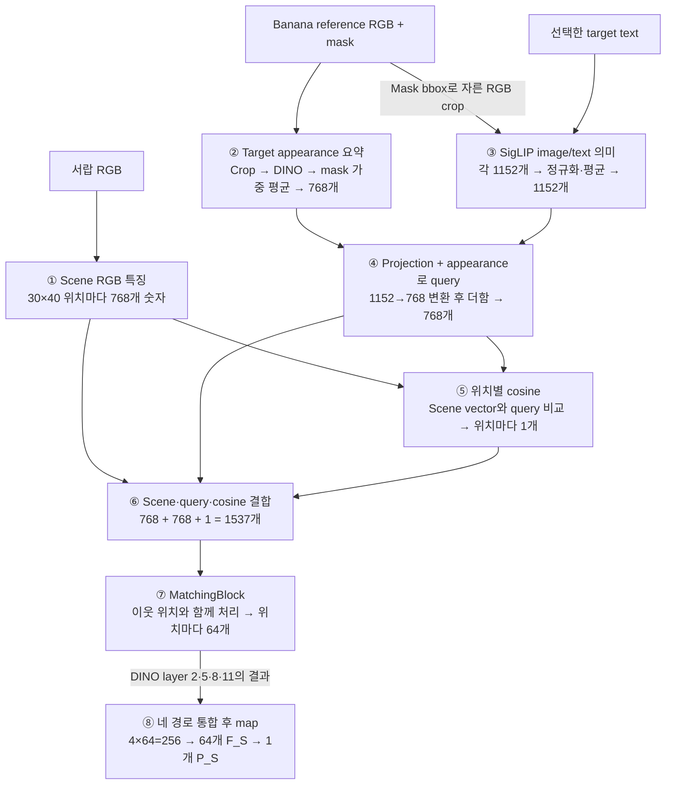
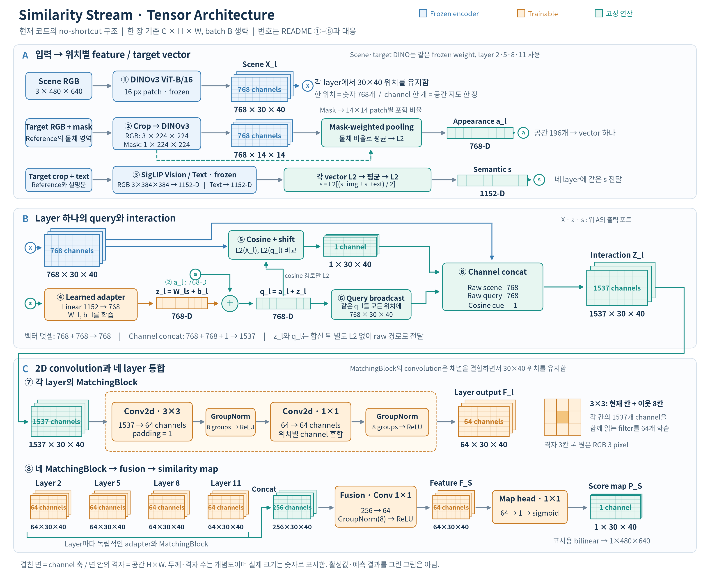
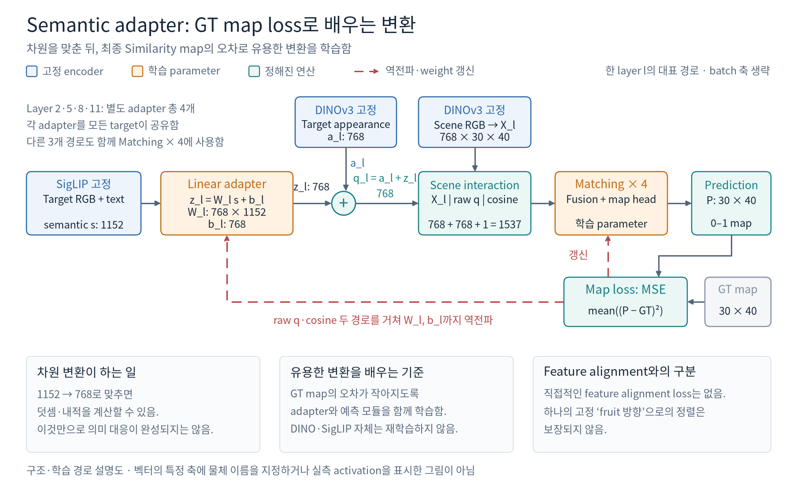
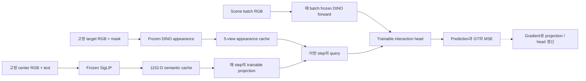

# Similarity Stream

<!-- navigation:start -->
[전체 개요](README.md) · **Similarity** · [Occlusion](occlusion_stream.md) · [Complexity](complexity_stream.md) · [Development Log](development_log.md) · [연구 문맥](agent.md)
<!-- navigation:end -->

> **현재 상태:** DINOv3–SigLIP no-shortcut 구조 구현. 학습에 없던 Banana와 `packaged_food_5`에서 관련 물체 영역을 활성화하는 zero-shot 동작을 정성적으로 확인함. 공식 final checkpoint 지정과 여러 미학습 target의 정량 성능 평가는 후속 작업임.

## 1. 목적과 입출력

Similarity stream은 **target 자체와 의미적으로 관련된 가시 영역**을 표현함. DINOv3의 위치별 visual feature에 target appearance와 SigLIP image/text semantics를 결합하여 위치별 similarity score를 학습함. Target이 더미 뒤에서 가려질 수 있는 위치는 Occlusion Stream이 담당함.

### 검색 조건과 표현 범위

**Scene RGB**는 검색할 서랍 전체 영상이고, **target reference**는 찾을 물체를 별도로 촬영한 영상임. 두 입력을 각각 인코딩한 뒤 feature 공간에서 비교함.

Banana query를 예로 들면, 노란 toy와의 외형 유사도와 apple/orange의 같은-category 관계를 함께 다룸. **DINOv3는 위치별 외형·문맥 표현을, SigLIP은 target의 전역 의미 조건을 제공함.** 초기 appearance matching에서 부족했던 category 관계를 보완하기 위해 두 표현을 결합했으며, 결합 모델에서 unseen Banana에 대한 fruit 영역 활성화를 확인함.

```text
찾을 물체: Banana reference image         검색할 관측: Drawer RGB
         + target mask                    사과 / 오렌지 / 노란 toy / 책
         + 선택한 text 조건                           │
                  │                                   │
            무엇을 찾는가?                      어디에 무엇이 보이는가?
                  └──────── 위치별로 함께 비교 ────────┘
                                      │
                         scene의 위치별 similarity score
```

Banana는 기존 16개 training target에 포함되지 않은 external query임. 아래 vector·cosine·score의 수치 예제는 **계산 원리를 위한 가상값**이며, 실제 정성 결과와 구분함.

### Target representation

공통 표기와 연산은 Feature와 Tensor 규격, 주요 연산에 정리함. Similarity의 target 표현은 다음 네 항목으로 구분함.

| 표현 | 구성 | 역할 |
|---|---|---|
| Appearance `a_t^ℓ` | DINO target patch를 mask pooling한 layer별 768-D vector | Reference의 외형·문맥 표현 |
| Semantic `s` | SigLIP image/text를 결합한 1152-D vector | Target의 전역 의미 조건 |
| Hybrid query `q_t^ℓ` | Appearance + layer별 projected semantic | 각 scene 위치와 비교할 검색 조건 |
| Target mask | Reference의 target pixel을 지정한 이진 지도 | Crop과 appearance pooling 범위 지정. Scene의 정답 mask와 다름 |

### 입력·출력 규격

| 구분 | 현재 구현의 입력·출력 | 의미 |
|---|---|---|
| Scene 입력 | RGB `B×3×480×640` | 검색할 scene. Similarity에는 scene depth나 scene segmentation을 입력하지 않음 |
| Target 입력 | Reference RGB, target mask, 물체 설명·category prompt | Mask로 물체 crop과 appearance pooling 범위를 정하고, image/text로 검색 조건을 구성 |
| 학습 feature `F_S` | `B×64×30×40` | 이후 fusion에 제공하려는 위치별 표현. 현재 model의 `fused` 반환값 |
| Score map `P_S` | `B×1×30×40`, 필요시 `B×1×480×640`로 확대 | Target–scene 관계 GT를 회귀한 `0–1` score. 보정된 target 존재 확률은 아님 |

현재 reference loader는 `target_dir/rgb`, `target_dir/seg`, `mapping.json`으로 reference를 구성함. **RGB와 mask가 주어진 입력에서 추론 경로가 구현되어 있으며**, raw target RGB에서 crop·mask를 자동 생성하는 배포 경로는 후속 구현 항목임.

## 2. 전체 모델 구조

**Similarity는 “이 서랍의 어느 부분이 찾는 물체와 관련 있는가”를 위치별로 계산함.** 서랍 사진에서는 위치별 특징을 만들고, 별도로 촬영한 Banana 사진에서는 검색 조건을 만듦. 두 정보를 비교한 뒤 주변 위치까지 함께 읽어 similarity map을 만듦.

아래 ①–⑧은 다음 절의 설명 순서와 같음. 먼저 한 DINO layer에서 Banana query와 scene 위치 A를 처리하는 과정을 따라가고, ⑧에서 네 layer의 결과를 합침.



### Tensor architecture

아래는 위 framework를 **실제 tensor와 convolution 구조로 펼친 그림**임. A에서 RGB·mask·text가 어떤 feature를 만드는지, B에서 한 DINO layer의 정보를 어떻게 결합하는지, C에서 MatchingBlock과 네 layer의 출력을 어떻게 처리하는지 보여줌. B의 `X`, `a`, `s`는 A에서 나온 같은 값이며, ①–⑧은 아래 본문 번호와 대응함.



겹쳐 그린 면은 channel이고 면 안의 가로·세로는 공간 위치임. 예를 들어 **`1537×30×40`은 30×40 지도 1,537장을 쌓은 것**임. 1,537은 `scene 768 + query 768 + cosine 1`이며, SigLIP의 1,152개를 그대로 scene에 붙인 값이 아님.

C의 **3×3 Conv2d는 각 위치에서 1,537개 channel 모두의 주변 3×3칸을 읽고, 학습한 64개 filter로 숫자 64개를 만듦.** 공간은 30×40으로 유지됨. 이어지는 1×1 Conv는 같은 위치의 channel을 다시 조합함. 그림을 입체로 그렸어도 3D 공간 convolution이 아니라 가로·세로 두 축의 2D convolution임.

파랑은 weight를 고정한 encoder, 주황은 학습되는 모듈, 초록은 pooling·덧셈·cosine·concat처럼 계산 방식이 정해진 연산임. 색은 학습 여부와 연산 종류를 구분하며 특정 feature의 의미를 지정하지 않음. 그림의 격자와 두께는 개념도이고, 실제 tensor 크기는 숫자로 표시함. 동일 이름의 SVG도 `img/similarity/`에 함께 보존함.

학습에서 DINO target appearance는 다섯 reference camera 중 선택한 view를 사용하고, SigLIP semantic은 center reference와 text로 미리 계산한 값을 사용함. 따라서 두 encoder의 target 입력이 항상 같은 view라는 뜻은 아님. 현재 추론에서는 선택한 reference camera를 두 경로에 사용함.

Banana의 이름으로 전용 모델을 고르는 구조가 아님. **모든 target이 같은 모델을 사용하며, 입력한 reference에 따라 검색 조건이 달라짐.** 이 방식으로 학습에 없던 Banana와 `packaged_food_5`의 관련 물체 영역이 활성화되는 zero-shot 동작을 정성 확인함.

## 3. 내부 모듈과 선택 이유

### ① Scene RGB를 위치별 특징으로 바꿈

서랍 RGB에는 과일·책·장난감 등이 함께 보임. 모델은 이 사진을 DINOv3에 넣어, **각 위치를 비교에 사용할 숫자로 표현**함. 이 숫자 묶음을 feature라고 부름.

```text
서랍 RGB: 세로 480 × 가로 640
             ↓ DINOv3의 한 layer
Feature: 세로 30칸 × 가로 40칸
             ↓
각 칸에 그 위치를 나타내는 숫자 768개
```

`768×30×40`은 **“30행×40열의 각 위치에 숫자 768개가 있다”**는 뜻임. 위치 A를 하나 고르면 다음과 같이 읽을 수 있음.

```text
위치 A의 feature = [x₁, x₂, …, x₇₆₈]
위치 B의 feature = [다른 위치를 나타내는 숫자 768개]
```

반대로 channel 하나를 고르면 `30×40`짜리 숫자 지도 한 장이 됨. 그 지도를 768장 쌓아 두고, **같은 위치에서 768장을 관통해 읽으면 그 위치의 vector**가 되는 것임. 768개의 물체를 찾았다는 뜻은 아님.

위치마다 별도 vector를 남기는 이유는 마지막에 **서랍의 어느 위치를 높게 표시할지** 결정해야 하기 때문임. 여기까지는 Banana가 입력되지 않았으므로, 같은 서랍 사진이면 찾는 target을 바꾸어도 이 scene feature는 같음.

<details>
<summary>구현 세부: DINO layer, 좌표와 정규화</summary>

기준 코드는 `backbone.py`임. DINOv3 ViT-B/16의 patch 크기는 16이고 `480/16=30`, `640/16=40`이므로 공간 위치는 1,200개임. Batch를 포함한 한 layer 출력은 `B×768×30×40`임.

하나의 backbone은 12개 transformer block을 가지며, 0-based index `2,5,8,11`, 즉 3·6·9·12번째 block의 출력을 사용함. Scene와 target appearance는 동일한 frozen DINOv3 weight를 사용함.

```text
한 장의 RGB
  → patch embedding → block 0 → block 1 → block 2 → ... → block 5 → ... → block 8 → ... → block 11
                                           │                │                │                 │
                                   feature map 2     feature map 5     feature map 8      feature map 11
                                   모두 768-D, scene에서는 같은 30×40 공간 격자
```

위치 A를 `(10,20)`으로 정하면 `X[:,10,20]`은 그 위치의 768개 channel이고, `X[7,:,:]`는 channel 7의 공간 지도임. `768`은 backbone이 사용하는 embedding 폭이며, channel별로 “색”, “과일” 등의 이름을 수동 배정하지 않음.

Feature에는 self-attention을 통해 주변·전체 문맥도 반영됨. Grid 한 칸이 원본 `16×16` patch에 대응해도 그 patch의 256 pixel만 읽은 표현으로 한정되지 않음. `get_intermediate_layers(..., norm=True)`의 정규화는 backbone LayerNorm임. Backbone은 CLS token도 반환하지만 현재 Similarity head와 target appearance pooling은 patch token을 사용함.

</details>

### ② Target RGB와 mask로 Banana의 외형을 요약함

이번에는 **서랍 사진과 별도로 촬영한 Banana 사진**을 사용함. 여기에는 RGB와 target mask 두 자료가 있음.

| 자료 | Banana 부분 | 배경 부분 | 사용하는 정보 |
|---|---|---|---|
| Target RGB | 원래 색과 무늬 | 촬영된 배경 | 물체의 외형 |
| Target mask | 1 | 0 | 물체가 차지하는 영역 |

Mask 자체에 Banana의 노란색이 남는 것은 아님. 흰색/검정으로 표시할 수 있는 영역 지도이며, **서랍 안의 정답 위치를 알려 주는 mask도 아님.**

먼저 mask에서 Banana를 감싸는 사각형을 찾고, 주변에 여백을 더해 RGB와 mask를 같은 영역으로 자름. 작은 물체가 사진 전체에서 차지하는 비중을 높이기 위한 처리임. **RGB의 배경을 검게 지우는 대신, 물체 주변으로 잘라낸 RGB를 사용함.**

```text
Banana RGB ─┐
            ├─ 같은 영역으로 crop
Target mask ┘          │
                       ├─ RGB를 224×224로 → DINOv3 → 768×14×14 feature
                       └─ Mask를 224×224로 → patch별 Banana 포함 비율
```

Target 사진도 처음에는 위치별 feature가 나옴. `14×14=196`개 위치에 각각 숫자 768개가 있음. 하지만 다음 단계에서 필요한 것은 **“Banana reference 전체를 나타내는 검색 조건 하나”**이므로, 이 196개 위치를 가중 평균함.

이때 mask를 다시 사용함. 한 patch의 256 pixel 중 Banana pixel이 256개이면 가중치 계산에 `1`, 128개이면 `0.5`, 하나도 없으면 `0`을 사용함. 그 값을 전체 합으로 나누어 가중치의 합을 1로 맞춤. 물체를 많이 포함하는 위치가 평균에 더 많이 기여하는 방식임.

**작은 가상 예:** Target의 위치를 세 곳으로 줄이고, 768개 channel 중 세 개만 표시하면 다음과 같음. 실제 Banana feature를 측정한 값은 아님.

| Target 위치 | Banana 포함 비율 | 합이 1인 가중치 | Feature 세 값 |
|---|---:|---:|---|
| P1 | 1.0 | 2/3 | `[3,0,3]` |
| P2 | 0.5 | 1/3 | `[0,6,3]` |
| P3 | 0.0 | 0 | `[9,9,9]` |

```text
첫 channel: (2/3)×3 + (1/3)×0 + 0×9 = 2
둘째 channel: (2/3)×0 + (1/3)×6 + 0×9 = 2
셋째 channel: (2/3)×3 + (1/3)×3 + 0×9 = 3

공간 평균 결과: [2,2,3]
```

평균해도 숫자 하나만 남지 않음. **각 channel 안에서 위치들을 평균하므로, 실제 모델에서는 channel 768개가 그대로 남음.** 마지막으로 vector의 길이를 1로 맞추는 L2 normalization을 적용함. 이 결과가 Banana의 appearance `a`임.

이제 ①의 **scene 위치 A를 나타내는 768개**와 ②의 **Banana 외형을 요약한 768개**가 준비됨. 다음 단계에서는 Banana의 의미 조건을 추가함.

<details>
<summary>구현 세부: Crop, mask 가중 평균과 L2 normalization</summary>

`target_utils.py`는 reference segmentation과 `mapping.json`의 target 색으로 이진 mask를 만듦. Mask bbox의 높이·너비 각각 25%를 양쪽에 padding하고 이미지 경계에서 제한함. 가상 bbox가 가로 80px·세로 120px이면 좌우 20px·상하 30px를 더해 가로×세로 `120×180` crop을 얻음.

RGB는 bilinear, mask는 nearest-neighbor로 `224×224`에 직접 resize함. 종횡비 유지를 위한 정사각 padding은 적용하지 않음. Scene와 target DINO RGB 모두 ImageNet normalization을 사용함. Crop 배경도 encoder에 들어가므로, mask pooling을 적용한 token에도 주변 문맥의 간접 영향이 남을 수 있음.

Mask에 kernel/stride 16의 average pooling을 적용하여 `14×14` 포함 비율 `r`을 얻고, 합이 1인 weight `w`로 변환함. `T_t^ℓ`는 해당 layer의 `768×14×14` target feature임.

$$
r_{ij}=\frac{1}{256}\sum_{(x,y)\in\mathrm{patch}(i,j)}M(x,y),
\qquad
w_{ij}=\frac{r_{ij}}{\sum_{p,q}r_{pq}},
\qquad
a_t^{\ell}=\mathrm{L2Norm}\!\left(\sum_{i,j}w_{ij}T_t^{\ell}(:,i,j)\right).
$$

Weight 합이 `1e-6`보다 작으면 전체 patch의 균등 pooling으로 fallback함. 그 외에는 포함 비율에 따라 경계 patch까지 가중 평균함. 공간 위치는 `196→1`로 요약되고 768개 channel은 유지되므로, 이후 matching은 target 전체 query와 scene 위치 사이에서 수행함.

L2 normalization은 vector의 방향을 유지하며 길이를 1로 맞춤. `[3,4]`와 `[6,8]`은 모두 `[0.6,0.8]`이 됨. 위의 세 값만 있는 축소 예 `[2,2,3]`은 길이가 `sqrt(17)`이므로 약 `[0.4851,0.4851,0.7276]`이 됨. 실제 정규화는 768개 성분 전체의 길이를 사용함.

$$
\mathrm{L2Norm}(v)=\frac{v}{\max(\lVert v\rVert_2,\epsilon)},
\qquad \lVert v\rVert_2=\sqrt{\sum_k v_k^2}.
$$

L2 normalization은 음수 성분을 유지하며 min–max 정규화와 다름. ①의 DINO `norm=True`가 수행하는 LayerNorm과도 별개 연산임.

</details>

### ③ SigLIP으로 Banana의 image/text 의미를 만듦

DINO appearance는 Banana 사진에서 얻은 외형·문맥 표현임. 여기에 **image와 text를 함께 사전학습한 SigLIP의 의미 표현**을 추가함. 외형이 다른 물체 사이에서도 같은 category 관계를 다루려는 목적임.

SigLIP에는 DINO vector를 넣지 않음. **②에서 자른 RGB crop을 SigLIP의 image encoder에 별도로 넣음.** Text를 사용하는 경우에는 선택한 설명 문장도 text encoder에 넣음.

```text
Banana RGB crop → SigLIP image encoder → 숫자 1152개

"a photo of a banana"
                → SigLIP text encoder  → 숫자 1152개
```

그다음 두 vector의 길이를 각각 1로 맞추고, 같은 좌표끼리 평균한 뒤 다시 길이를 1로 맞춤. **숫자 1152개짜리 vector 하나**가 남으며, 이를 semantic vector `s`라고 부름.

```text
Image vector 1152개 → L2 norm ─┐
                              ├→ 좌표별 평균 → L2 norm → s: 1152개
Text vector 1152개  → L2 norm ─┘
```

2-D 가상값으로 순서만 확인하면 다음과 같음.

```text
Image [3,4] → [0.6,0.8]
Text  [0,2] → [0,1]
                  ↓ 평균
              [0.3,0.9]
                  ↓ 길이를 다시 1로 맞춤
           약 [0.3162,0.9487]
```

Text 없이 추론할 때는 정규화한 image vector가 그대로 `s`가 됨. **이 단계의 출력은 Banana 전체의 의미 조건임.** 서랍의 어느 위치를 높게 표시할지는 뒤에서 scene feature와 함께 계산함.

<details>
<summary>구현 세부: SigLIP 규격, prompt와 reference camera</summary>

`google/siglip-so400m-patch14-384`를 사용하며 image/text `pooler_output`은 각각 1152-D임. `patch14`는 vision patch 크기이고 `384`는 입력 RGB 크기임. `SO400M`은 400-D라는 뜻이 아님.

Padded RGB crop을 원본 crop에서 별도로 `384×384`로 resize하고 mean/std `0.5/0.5`를 적용함. Mask로 배경을 지우지 않은 crop 전체를 입력함. DINO의 `224×224` 입력이나 그 feature를 SigLIP 입력으로 재사용하는 경로는 아님.

$$
s_{\mathrm{img}}=\mathrm{L2Norm}(\mathrm{SigLIP}_{\mathrm{image}}(I_t)),
\qquad s_{\mathrm{text}}=\mathrm{L2Norm}(\mathrm{SigLIP}_{\mathrm{text}}(p_t)),
$$

학습에서는 사람이 지정한 `TARGET_LABELS`의 물체 설명과 category로 다음 문장을 구성함.

```text
a photo of {object_description}, a type of {category}
예: a photo of an apple, a type of fruit
```

설명이 없는 target은 category 문장으로 fallback함. 책 네 개처럼 같은 문장을 공유하는 경우 text는 공통 의미를 제공하고 reference별 외형 차이는 image와 DINO appearance에서 전달함. Text category는 현재 모델의 명시적인 외부 조건임.

학습 시 DINO appearance는 다섯 reference camera 중 하나를 sample마다 선택하지만, SigLIP semantic은 center RGB+text로 고정함. 검증에서는 DINO reference 다섯 camera를 각각 평가함. `inference_zeroshot.py`는 선택한 `--target_cam`을 DINO와 SigLIP 양쪽에 적용하며 기본값은 center임. `--label banana`의 문장은 `a photo of a banana`로, 학습 prompt 형식과 구분됨.

</details>

### ④ 의미 vector를 변환하고 외형에 더해 query를 만듦

현재 Banana에는 두 표현이 있음.

```text
DINO appearance a: 768개   ← 사진의 외형·문맥을 요약
SigLIP semantic s: 1152개  ← image/text 의미를 요약
```

두 vector는 길이와 좌표계가 다름. 그래서 `s`를 **학습된 projection**에 넣어 숫자 768개로 바꿈. Projection은 1152개 중 앞의 768개만 고르는 것이 아니라, **1152개를 학습된 가중치로 조합해 새로운 768개를 만드는 계산**임.

그 출력을 appearance와 같은 좌표끼리 더함. 결과도 768개이며, 이것이 scene와 비교할 **query**, 즉 “이번에 무엇을 찾는가”를 나타내는 검색 조건임. **Projection은 `1152→768`로 차원을 바꾸는 연산이고, 이어지는 덧셈은 같은 768차원 안에서 appearance `a`를 새 query `q`로 이동시키는 연산임.** 두 연산을 구분해서 읽음.

```text
Banana semantic s: 1152개
              ↓ 학습된 projection
의미 보정값: 768개 ─────────────┐
                               ├→ 좌표별 덧셈 → query q: 768개
Banana appearance a: 768개 ─────┘
```

**1152차원 표현을 768차원 표현으로 변환하는 것은 실제로 수행하는 계산임.** 출력 길이는 adapter의 구조로 정하고, 출력값은 학습된 `W,b`로 계산함. 이 변환이 유용한 의미 조건을 전달하도록 최종 similarity map의 GT 오차로 adapter와 head를 함께 학습함. ‘같은 차원이라고 의미까지 자동으로 일치하지는 않음’은 이 학습이 필요한 이유이며, 차원 변환 자체를 하지 않는다는 뜻이 아님.



처음에는 adapter의 `W,b`가 현재 작업에 맞춰 학습되기 전이므로, 차원만 맞는다고 유용한 보정값이 나오는 것은 아님. 그 상태에서도 query와 예측 map을 계산하고 GT와 비교할 수 있음. **예측 오차를 줄이는 방향으로 adapter와 MatchingBlock·fusion·map head의 weight를 함께 갱신함.** 이 과정이 그림의 빨간 점선임.

예를 들어 학습 target이 apple이고 scene의 orange 내부 patch에 같은 fruit 관계 GT `0.8`이 주어졌다고 가정함. 아래 예측값은 원리를 설명하기 위한 가상값임.

| 한 위치의 예측 | GT | 그 위치의 제곱 오차 |
|---|---:|---:|
| 0.3 | 0.8 | `(0.3−0.8)² = 0.25` |
| 학습 후 0.7이 됐다고 가정 | 0.8 | `(0.7−0.8)² = 0.01` |

실제 loss는 전체 patch의 제곱 오차를 평균함. 모델은 여러 scene·target에서 이 오차를 줄이도록 **SigLIP 정보를 query에 넣는 방법과, 그 query를 scene feature와 함께 읽는 방법을 공동으로 학습함.** 사람이 “fruit면 17번째 좌표를 높인다”는 규칙을 지정하지 않음.

여기서 DINOv3가 SigLIP의 지식을 전달받아 다시 학습되는 것은 아님. **DINO의 scene·target feature는 그대로이고, 뒤의 adapter와 head가 두 표현을 이용하는 방법을 배움.** 고정된 DINO feature가 이미 담고 있는 시각·문맥 정보와 target 의미 조건을 함께 읽는 구조임. Target의 전역 semantic vector만으로 scene에 없던 위치별 관측 정보를 새로 만드는 연산도 아님.

**Feature alignment는 서로 다른 표현 사이에 대응 관계를 만드는 것을 뜻함.** 여기서 구분할 것은 표현의 대응을 배우는지 여부가 아니라, **어디에 정답과 오차를 두고 배우는가**임.

| 학습 방식 | 정답과 비교하는 대상 | 배우는 내용 |
|---|---|---|
| 직접적인 feature 정렬의 예 | 같은 물체의 변환된 SigLIP vector와 DINO vector | 두 표현이 가까워지도록 변환을 학습함 |
| **현재 모델: map GT로 학습** | 예측 similarity map과 GT map | Adapter가 의미 조건을 query에 넣는 방법과 head가 scene·query를 함께 읽는 방법을 공동으로 학습함 |

현재 별도의 feature alignment loss는 없지만, **map 오차를 통해 두 표현을 함께 사용하는 방법을 학습함.** 중간 vector에 정답을 직접 주는 대신 최종 답을 맞추면서 대응을 배우는 구조임. MatchingBlock은 cosine 하나뿐 아니라 raw scene 768개·query 768개도 함께 받으므로, 최종 예측에 필요한 관계를 이 정보들에서 읽도록 학습할 수 있음. 이를 모든 DINO·SigLIP 좌표의 의미가 동일해졌다는 뜻으로 해석하지는 않음.

학습 후에는 이 가중치가 고정됨. 새 Banana 사진을 넣으면 **같은 계산 규칙에 새로운 입력이 들어가므로 보정값과 query가 새로 계산됨.** Target별 projection을 고르거나 새 target용 모델을 다시 학습하지 않음. 한 layer의 projection은 기존 16개 target과 새로운 target이 함께 사용함.

**Zero-shot은 사전학습 표현과 target 간에 공유하는 계산 규칙을 새 reference에 적용하는 방식임.** SigLIP은 이미지·텍스트 관계를, DINOv3는 시각 feature를 사전학습한 모델임. 예를 들어 apple·orange 등의 학습에서 익힌 관련 영역 판별 방법이 새 Banana의 표현에도 적용될 수 있음. Banana reference에서 외형·의미 표현을 계산하고 기존 adapter와 head에 넣어 새로운 map을 만듦. 별도 feature 정렬 loss의 유무만으로 zero-shot을 우연한 출력으로 해석하지 않음.

여기서 새 target은 **우리 Similarity 모델의 학습에 없던 target**임. 사전학습 encoder까지 그 물체의 개념을 처음 접한다는 뜻은 아님. **Banana와 `packaged_food_5`의 관련 영역 활성화는 추가 학습 없이 정성적으로 확인함.** 후속 평가는 여러 새 target에서의 성공률과 SigLIP·adapter의 개별 기여를 측정하기 위한 것임. 이는 관찰한 일반화의 범위와 원인을 구체화하는 평가임.

이제 scene 위치 A의 vector와 Banana query를 비교할 준비가 됨.

<details>
<summary>구현 세부: Linear 계산, 네 layer와 query 정규화</summary>

각 DINO layer에 독립적인 `Linear(1152,768)`을 둠. 네 layer 사이에는 서로 다른 weight를 사용하고, 같은 layer 안에서는 모든 target이 weight를 공유함. Weight `W^ℓ`는 `768×1152`, bias `b^ℓ`는 768-D임.

$$
s=\mathrm{L2Norm}\!\left(\frac{s_{\mathrm{img}}+s_{\mathrm{text}}}{2}\right),
\qquad s_t^{\ell}=W^{\ell}s+b^{\ell},
\qquad q_t^{\ell}=a_t^{\ell}+s_t^{\ell}.
$$

출력 좌표 하나는 입력 1152개 전체의 학습 가중합임.

$$
s_{t,k}^{\ell}=\sum_{j=1}^{1152}W_{kj}^{\ell}s_j+b_k^{\ell}.
$$

예를 들어 첫 출력은 `W[0,0]×s[0]+…+W[0,1151]×s[1151]+b[0]`임. Projection과 head는 별도 alignment loss 없이 최종 similarity-map MSE로 함께 학습하며, DINOv3/SigLIP weight는 고정됨.

Projection 출력 `s_t^ℓ`와 합산 query `q_t^ℓ`는 이 단계에서 다시 L2-normalize하지 않음. ⑤의 cosine 계산에서만 정규화한 query를 사용하고, ⑥에서는 합산한 raw query를 그대로 전달함. 따라서 cosine에는 방향이, raw 입력에는 방향과 크기가 반영됨.

</details>

### ⑤ Scene의 각 위치에서 query와 cosine을 계산함

①의 scene 위치 A에는 숫자 768개가 있고, ④의 Banana query에도 숫자 768개가 있음. **Cosine은 이 두 vector가 얼마나 같은 방향을 향하는지 숫자 하나로 나타냄.**

먼저 두 vector의 길이를 각각 1로 맞춤. 같은 좌표끼리 곱한 다음 768개 결과를 더하면 cosine 하나가 나옴. 같은 query를 위치 B의 scene vector와 비교하면 B의 cosine이 나옴.

```text
Scene 위치 A의 768개 ↔ Banana query 768개 → A의 cosine 하나
Scene 위치 B의 768개 ↔ 같은 query 768개   → B의 cosine 하나
                 ...
전체 30×40 위치에 적용 → 위치마다 비교값 하나
```

원래 cosine 범위는 `−1~1`이고 현재 모델은 `(cosine+1)/2`로 `0~1`에 옮겨 사용함. 이 값을 shifted cosine이라고 부름.

| 두 vector의 방향 | Cosine | Shifted cosine |
|---|---:|---:|
| 같은 방향 | 1 | 1 |
| 직교하는 방향 | 0 | 0.5 |
| 반대 방향 | −1 | 0 |

여기의 `0.5`는 방향이 직교한다는 뜻이며 target일 확률 50%라는 뜻은 아님. 또한 **숫자 하나로 요약하면 원래 768개가 어떤 조합이었는지는 남지 않음.** 서로 다른 scene vector가 같은 cosine을 만들 수도 있음. 그래서 다음 단계에서 원본 vector도 함께 전달함.

<details>
<summary>구현 세부: Cosine 수식과 정규화 경로</summary>

$$
c^{\ell}(u,v)=\frac{X_s^{\ell}(:,u,v)^{\mathsf T}q_t^{\ell}}
{\lVert X_s^{\ell}(:,u,v)\rVert_2\lVert q_t^{\ell}\rVert_2},
\qquad \widehat c^{\ell}(u,v)=\frac{c^{\ell}(u,v)+1}{2}.
$$

코드는 scene feature와 query를 channel 축으로 각각 L2-normalize하고, 곱을 channel 축으로 합산함. 출력은 `B×1×30×40`임. Shift는 순위를 바꾸지 않음.

2-D 설명용 query가 `[1,0]`일 때 scene `[1,0]`, `[0,1]`, `[-1,0]`의 cosine은 각각 `1,0,−1`임. Cosine은 vector의 크기를 제외한 방향을 비교하며, 정규화 전 scene/query는 별도로 보존하여 ⑥에 사용함.

</details>

### ⑥ Scene·query·cosine을 한 위치에서 함께 읽게 만듦

위치 A를 판단할 때 다음 세 정보가 준비되어 있음.

| 정보 | 숫자 개수 | 의미 |
|---|---:|---|
| Scene vector | 768 | 위치 A에서 관측한 특징 |
| Banana query | 768 | 이번에 찾는 물체의 조건 |
| Shifted cosine | 1 | 두 vector의 직접 비교값 |

이 숫자들을 **순서대로 이어 붙임.** 이를 concat이라고 하며, 합은 `768+768+1=1537`개임. ④처럼 같은 좌표끼리 더하는 연산과 다름.

```text
위치 A의 입력 = [scene 768개 | Banana query 768개 | cosine 1개]
             = 총 1537개
```

같은 작업을 모든 scene 위치에 수행함. Banana query는 위치가 없는 검색 조건 하나이므로, 각 위치에 같은 vector를 전달함. 이것이 broadcast임.

```text
같은 Banana query ─┬→ 위치 A의 scene·cosine과 결합
                   ├→ 위치 B의 scene·cosine과 결합
                   └→ 나머지 위치에서도 같은 방식으로 결합
```

**Query는 같아도 scene vector와 cosine은 위치마다 다름.** “Banana가 모든 위치에 있다”는 표시가 아니라, 모든 위치를 같은 검색 조건으로 판단하게 만드는 것임.

이제 각 위치에는 1537개 숫자가 있음. 다음 MatchingBlock은 비교값 하나만 보는 대신 **위치의 관측, 찾는 조건, 비교값을 함께 읽을 수 있음.**

<details>
<summary>구현 세부: Concat과 raw feature 경로</summary>

위치별 입력을 모은 interaction map은 `B×1537×30×40`임. `category_dim=0`이므로 과거 CLS category probability channel은 포함하지 않음.

```text
Z^ℓ(u,v) = Concat[raw scene feature, raw target query, shifted cosine]
channels =              768       +       768      +       1       = 1537
```

덧셈과 concat의 차이를 3-D 가상값으로 나타내면 다음과 같음.

```text
설명용 scene x = [2,3,4], query q = [5,6,7]
Shifted cosine c ≈ 0.99575

덧셈 x+q       = [7,9,11]                     → 3개
Concat[x,q,c] ≈ [2,3,4, 5,6,7, 0.99575]       → 7개

실제 channel 수는 768+768+1=1537임.
```

Raw scene/query는 cosine 계산용 정규화본과 별개임. 같은 cosine을 만든 원본 vector의 차이를 후속 head가 사용할 수 있게 보존함. Raw feature에서 정보가 남는 것과 학습한 head가 그 정보를 얼마나 활용하는지는 구분하며, 구성요소별 분석 범위는 5절에 정리함.

</details>

### ⑦ MatchingBlock이 주변 위치까지 읽고 64개 특징을 만듦

지금까지는 위치 A에 정보를 모았음. MatchingBlock은 **위치 A와 주변 여덟 위치의 정보**를 함께 읽는 작은 CNN임.

```text
A 주변 3×3 위치
각 위치에 scene·query·cosine 1537개
                 ↓ MatchingBlock
위치 A의 새로운 feature 64개
```

첫 `3×3` convolution은 이웃 위치까지 포함하여 숫자들을 학습 가중치로 조합함. 예를 들어 A의 cosine이 높더라도 주변에도 높은 값이 이어진 경우와 A에서만 높은 경우를 서로 다른 입력으로 처리할 수 있음.

이후 정규화와 ReLU를 거치고, `1×1` convolution으로 같은 위치의 channel들을 다시 조합함. **Cosine을 한 번 더 구하는 단계가 아니라, 준비한 정보들을 함께 해석하도록 학습하는 단계**임.

출력은 위치마다 64개 숫자임. 1537개 중 앞의 64개만 남기거나 64개 category를 분류하는 것이 아님. **최종 similarity map을 예측하는 데 사용할 새로운 표현을 64개 값으로 만듦.**

이 계산을 전체 격자에서 수행해도 위치는 유지됨. 한 layer의 결과는 `64×30×40`이며, 다음 단계에서 다른 layer의 결과와 합침.

<details>
<summary>구현 세부: Convolution, 정규화와 공간 범위</summary>

`similarity_model.py`의 MatchingBlock은 다음 구조임.

```text
B×1537×30×40
  → Conv 3×3, 1537→64, padding=1
  → GroupNorm(8,64) → ReLU
  → Conv 1×1, 64→64
  → GroupNorm(8,64) → ReLU
  → B×64×30×40
```

첫 Conv의 output channel 하나는 `1537×3×3=13,833`개 입력값의 학습 가중합과 bias로 계산함. 같은 계산 filter를 격자의 모든 위치에 적용하며, 64개 output filter를 사용함. `padding=1`은 가장자리 공간 크기를 유지하기 위한 0 padding임.

`3×3`은 원본 RGB 3 pixel이 아니라 feature grid의 3칸×3칸임. 격자상 원본 48×48px 폭에 해당하지만, DINO token에는 더 넓은 문맥이 이미 반영되어 있음. `1×1 Conv` 자체는 새로운 이웃 위치를 추가하지 않음.

`GroupNorm(8,64)`은 64개 channel을 8개 group으로 나누고 group의 channel·공간 값들을 함께 정규화함. ReLU는 음수를 0으로 바꾸는 비선형 함수임. 따라서 block 전체의 계산 범위를 단순한 local filter 하나로 한정하지 않음.

네 DINO layer의 MatchingBlock은 구조가 같고 weight는 독립적임. 한 layer 안에서는 모든 위치·target에 같은 weight를 사용함. CNN은 격자를 유지하면서 이웃을 처리하기 위한 선택이며 MLP도 입력 구성에 따라 공간 정보를 처리할 수 있음. 현재 MatchingBlock은 별도의 cross-attention이나 target patch별 correspondence를 계산하지 않음.

</details>

### ⑧ 네 경로를 합치고 위치마다 map 값 하나를 만듦

지금까지는 DINO layer 하나의 경로를 따라왔음. 실제 모델은 **한 DINOv3에서 layer 2·5·8·11의 feature를 꺼내 같은 순서로 처리**함. DINOv3 모델 네 개를 따로 만드는 구조는 아님.

```text
Layer 2  → 해당 layer의 query·cosine·concat → MatchingBlock → 64개
Layer 5  → 해당 layer의 query·cosine·concat → MatchingBlock → 64개
Layer 8  → 해당 layer의 query·cosine·concat → MatchingBlock → 64개
Layer 11 → 해당 layer의 query·cosine·concat → MatchingBlock → 64개
```

네 경로의 **같은 위치 A**에서 64개씩 이어 붙이면 `64+64+64+64=256`개가 됨. 서로 다른 위치를 합치는 것이 아니라, 같은 위치를 네 처리 단계에서 읽은 결과를 합치는 것임.

```text
위치 A의 네 결과: 64 + 64 + 64 + 64
                         ↓ concat
                       256개
                         ↓ 통합 convolution 등
                F_S(A): feature 64개
                         ↓ 마지막 head + sigmoid
                P_S(A): similarity score 1개
```

통합 convolution은 256개를 학습 가중치로 섞어 64개로 만듦. 이것이 중간 feature `F_S`임. 마지막 head는 그 64개로 숫자 하나를 계산하고, sigmoid가 이를 `0~1` 범위로 바꿈. 이것이 `P_S`의 위치 A 값임.

**`F_S`는 위치마다 64개 숫자가 남은 표현이고, `P_S`는 위치마다 하나의 관계 score로 읽은 결과임.** 이 계산을 모든 위치에서 하면 `F_S`는 `64×30×40`, `P_S`는 `1×30×40`이 됨. 표시할 때는 map을 `480×640`으로 부드럽게 확대할 수 있음.

이로써 Banana 사진에서 만든 검색 조건이 서랍의 각 위치와 결합되어 하나의 similarity map이 됨. 새 target을 넣어도 **같은 encoder와 학습된 가중치를 사용하며**, reference에서 계산하는 appearance·semantic·query와 그에 따른 map이 바뀜. 현재 Banana와 `packaged_food_5`에서 이 zero-shot 동작을 정성 확인했고, 기존 평가 결과와 후속 평가 범위는 4·5절에 정리함.

<details>
<summary>구현 세부: Fusion, score와 출력 크기</summary>

```text
Concat[F_2,F_5,F_8,F_11]: B×256×30×40
  → Conv 1×1, 256→64 → GroupNorm(8,64) → ReLU
  → F_S: B×64×30×40
  → Conv 1×1, 64→1
  → logit: B×1×30×40
  → sigmoid
  → P_S: B×1×30×40
```

`64`는 `hidden_ch=64`로 정한 내부 표현 폭이고 `256`은 네 경로의 `4×64`를 합친 수임. Occlusion depth encoder의 256-D와는 역할이 다름. **한 경로의 `1537→64`, 네 경로 통합의 `256→64`, 마지막 `64→1`은 별도 연산**임.

Logit은 범위를 제한하지 않은 실수 score임. 마지막 head와 sigmoid 계산은 다음과 같음.

```text
F_S(A) = [f1,f2,…,f64]
z = h1*f1 + h2*f2 + … + h64*f64 + bias
P_S(A) = 1/(1+exp(-z))

가상 계산 예: z=0 → 0.5, z≈1.386 → 약 0.8
```

현재 출력에 raw DINO cosine을 직접 더하는 residual shortcut은 없음. Cosine은 ⑥의 interaction channel을 거쳐 예측에 반영됨. `prob_full_res`는 sigmoid 이후 bilinear interpolation(`align_corners=False`)으로 계산하며, patch 사이를 보간하는 표시용 확대임.

현재 모델은 `fused=F_S`, `prob_patch_res=P_S`, 요청 시 `prob_full_res`를 반환함. `F_S`를 후속 fusion에 전달할 수 있게 구현했으며, 통합 탐색에서의 활용은 이후 평가 항목임.

</details>

<details>
<summary>구현 세부: 학습 parameter와 cache</summary>

DINOv3와 SigLIP은 frozen이고, projection·MatchingBlock·fusion·score head는 GT relation-map MSE로 학습함. 학습 후 추론에서는 이 weight도 고정됨. SigLIP vision/text는 서로 다른 encoder이지만 각각 모든 target에 공통이며, layer별 projection과 MatchingBlock도 각 layer 안에서 모든 target이 공유함.

| Module | Trainable parameters | 계산 근거 |
|---|---:|---|
| Semantic projection 4개 | 3,542,016 | `4×(1152×768+768)` |
| MatchingBlock 4개 | 3,559,168 | Block당 `889,792`: 두 Conv의 weight/bias와 두 GroupNorm의 affine parameter |
| Multi-layer fusion | 16,576 | `256×64+64+2×64` |
| Score head | 65 | `64×1+1` |
| **합계** | **7,117,825** | DINOv3와 SigLIP의 frozen parameter 제외 |

DINOv3와 SigLIP은 `eval` 및 gradient 비활성 상태로 사용함. 현재 cache와 step별 계산 범위는 다음과 같음.

| 경로 | 현재 처리 | 근거 |
|---|---|---|
| Target DINO appearance | Target별 다섯 camera vector를 사전 cache | 입력과 frozen weight가 고정되어 재사용 가능 |
| Target SigLIP semantic | Center RGB/text의 1152-D vector를 사전 cache | 학습 중 고정된 semantic 입력 |
| Scene DINO | Dataset RGB를 읽어 **매 batch forward** | 전체 scene feature를 사전 저장해 조회하는 training 경로는 아님 |
| Semantic projection·query | 매 step 재계산 | Projection weight가 갱신되므로 projection 이후 query를 고정 cache할 수 없음 |

과거 버전의 cache·VRAM 관련 명칭이나 주석과 현재 호출 경로는 구분함.



**학습 범위:** 역전파로 loss의 parameter별 gradient를 계산하고 projection·head만 갱신함. Frozen encoder는 필요한 forward를 수행하되 이번 loss로 weight를 수정하지 않음.

</details>

## 4. GT 생성과 학습

### Relation score GT와 loss

`gt_similarity.py`는 scene segmentation의 asset mapping과 category를 사용하여 다음 GT를 구성함. 이 category 관계는 연구에서 정한 supervision이며, SigLIP이 자동으로 정한 similarity 정답이 아님.

| Target–scene 관계 | Pixel GT score |
|---|---:|
| 동일 target asset label | `1.0` |
| 같은 category | `0.8` |
| 관련 category: book↔toy, fruit↔packaged_food | `0.5` |
| 그 외 알려진 category 물체 | `0.2` |
| 배경·unknown | `0.0` |

| Target ↓ / Scene → | Book | Toy | Fruit | Packaged food |
|---|---:|---:|---:|---:|
| Book | 0.8 | 0.5 | 0.2 | 0.2 |
| Toy | 0.5 | 0.8 | 0.2 | 0.2 |
| Fruit | 0.2 | 0.2 | 0.8 | 0.5 |
| Packaged food | 0.2 | 0.2 | 0.5 | 0.8 |

표는 색 mapping이 유일할 때의 규칙임. `색 → asset 이름 → category 관계 → score` 순서로 GT를 정하고, 동일 target asset에는 category 점수보다 우선하여 `1.0`을 부여함. Target의 실제 존재 확률을 관측한 정답은 아님.

**GT 로드:** `paths_config.GT_DIR`의 precomputed grayscale GT를 우선 읽고 `/255`로 변환함. 파일이 없을 때 segmentation과 mapping으로 생성함.

Banana를 target으로 삼는다고 가정한 **규칙 설명용 GT**는 다음과 같음. 이는 external Banana로 실제 학습하거나 새 GT를 생성했다는 뜻은 아님.

```text
Scene의 물체        동일 Banana    Orange    Packaged food    Book/Toy    배경
Target과 관계       exact          fruit     related          other       unknown/background
이 규칙의 점수      1.0            0.8       0.5              0.2         0.0
```

**입력과 감독의 구분:** Target mask는 reference query를 구성하는 **추론 입력**임. Scene segmentation은 **GT 생성 전용**이며 추론 때 scene의 정답 위치를 head에 제공하지 않음.

**GT 색 mapping:** 생성 함수가 BGR을 dictionary key로 사용하며, 같은 색의 asset이 있으면 뒤 score가 앞 값을 덮는 코드 경로를 확인함. 기존 GT의 충돌 범위와 map 변화량은 소급 정량 audit으로 확인할 항목임.

$$
Y_{\mathrm{patch}}=\mathrm{AvgPool}_{16\times16}(Y_{\mathrm{full}}),
\qquad
L_{\mathrm{sim}}=\frac{1}{BH_pW_p}\sum_{b,i,j}
\left(P_S(b,i,j)-Y_{\mathrm{patch}}(b,i,j)\right)^2.
$$

Loss는 확대된 시각화가 아닌 `30×40` patch grid에서 계산함. 한 patch의 절반이 exact target(`1.0`), 나머지가 배경(`0`)이면 GT가 `0.5`가 됨. 동일한 score가 서로 다른 관계·면적 혼합에서 나올 수 있으므로 밝은 영역을 exact target segmentation이나 존재 확률로 바로 해석하지 않음.

**MSE 수치 예제:** 예측과 정답의 차이를 제곱한 뒤 평균함.

| Patch | GT | Prediction | Squared error |
|---|---:|---:|---:|
| A | 0.8 | 0.6 | `(0.6−0.8)²=0.04` |
| B | 0.2 | 0.3 | `(0.3−0.2)²=0.01` |

두 patch의 MSE는 `(0.04+0.01)/2=0.025`임. 실제 코드는 batch의 모든 `30×40` 위치를 평균함.

```text
Scene RGB + target condition ── model ── prediction P_S
                                                │
Scene segmentation + relation rule ── GT Y ─────┤ 차이의 제곱을 평균
                                                ↓
                                             MSE loss
                                                ↓
                                  projection / head weight 갱신
```

**평가 범위:** MSE는 `0.8/0.5/0.2`와 경계의 중간값을 얼마나 정확히 회귀하는지 측정함. 배경을 포함한 전체 patch의 평균이며, 0/1 category classification과 평가 대상이 다름. 배경 비중이 크면 foreground 오류가 전체 평균에 작게 반영될 수 있으므로, 탐지 성공률·exact-target ranking·foreground별 오류는 추가 지표로 나누어 측정할 항목임.

### 데이터와 현재 training protocol

기존 book·fruit·packaged_food·toy 각 4개, **16개 target 모두를 training pool에 유지**함. 새로운 target의 zero-shot 평가는 별도 external asset으로 수행함. Source의 “15 targets / packaged_food_1 제외” 주석은 오래된 설명이며 실제 `TARGETS`와 현재 데이터는 16개임.

| 항목 | 현재 설정 |
|---|---|
| Scene split | Target별 10 scene ID를 8 train / 2 validation으로 분리. 같은 scene ID의 environment와 camera는 같은 split |
| Scene camera | center, top, left, right, bottom |
| Environment sampling | `ENV_STRIDE=10`: `0,10,…,290`, scene ID당 30개 |
| 현재 데이터의 sample 수 | Train `16×8×30×5=19,200`; validation scene sample `16×2×30×5=4,800` |
| Target camera 사용 | Train은 sample마다 5개 중 무작위 하나, validation은 5개를 모두 순회하여 총 24,000 scene–reference 비교 |
| Semantic 조건 | Target당 center image 한 장 + 물체 설명/category text. Target appearance camera를 바꿔도 semantic은 고정 |
| Optimizer | AdamW, learning rate `1e-3`, default weight decay `0.01` |
| Batch / schedule | Batch `128`, 최대 `100` epochs, CosineAnnealingLR |
| Checkpoint 갱신 / early stopping | 이전 best MSE보다 **5% 초과 개선** 시 best 저장; 개선 없이 `5` epochs면 종료 |
| Split seed | 기본 `None`; 실행 시작 시 seed 하나를 정해 모든 target에 사용 |

현재 코드에서는 seed와 실제 split 목록을 stdout에 출력함. 과거 no-shortcut snapshot에서 target마다 seed가 새로 생성되던 split 문제도 수정됨. **현재 분할 절차의 수정까지 완료했으며**, `train_log.txt`·checkpoint에 seed와 split을 자동 보존하는 기능은 후속 항목임. 과거 run의 정확한 재현에는 당시 split 기록을 추가 확인해야 하므로, 현재 절차와 당시 학습 기록을 구분함.

**Scene-level split:** 동일 배치의 top/left 등 camera view는 상관된 관측임. Image별 무작위 분할에서 발생할 수 있는 배치 누출을 줄이기 위해 scene ID를 먼저 분리하고, 해당 environment와 다섯 view를 함께 배정함.

**Seen-target validation:** 기존 16개 target은 모두 training pool에 유지함. 이 split은 새로운 scene에 대한 평가이며 새로운 target 평가가 아님. `4,800 images×5 reference views=24,000 comparisons`는 동일 scene의 반복 비교를 포함하므로 독립 scene 24,000개로 해석하지 않음.

**Training step:**

1. Scene RGB와 해당 target 이름, relation GT를 batch로 읽고 scene DINO feature를 계산함.
2. Target 이름으로 appearance/semantic cache를 조회하고, train에서는 appearance camera 하나를 sample마다 고름.
3. 현재 projection weight로 semantic을 변환한 뒤 appearance에 더하여 query를 만듦.
4. Interaction, MatchingBlock, fusion, head를 거쳐 patch prediction을 얻음.
5. Patch GT와 MSE를 계산하고 projection/head에 대해 역전파함.
6. AdamW가 이 parameter를 갱신함. Validation에서는 갱신하지 않고 다섯 target camera를 모두 평가함.

GT category score는 loss·평가용이며 inference query나 scene feature에 입력하지 않음. 반면 target text의 물체 설명·category는 명시적인 조건이므로 현재 학습 모델을 image-only model로 분류하지 않음.

### 지표와 checkpoint의 해석

| 지표 | 실제 계산 | 해석 |
|---|---|---|
| MSE | 전체 patch에서 `(prediction−GT)²` 평균 | Graded relation score 오차; 작을수록 좋음 |
| Tolerance accuracy | `abs(prediction−GT)<13/255`인 patch 비율 | 허용 오차 안에 들어온 비율. 기존 log 명칭은 `acc` |
| Balanced tolerance accuracy | GT-positive와 GT-negative의 tolerance accuracy 평균 | 배경 비중의 영향을 줄인 보조 지표 |
| Tolerance IoU-like | `close ∩ GT-positive` 수 / `GT-positive ∪ predicted-positive` 수 | 일반 binary-mask IoU와 다른 프로젝트 전용 지표 |

Positive 기준은 `GT>0.1`, `prediction>0.1`임. `0.2`인 다른 category 물체도 positive에 포함되므로 이 IoU-like 값을 exact target 위치 IoU라고 부르지 않음. 구체적 계산은 `train_common.py`의 `batch_accuracy_counts()`와 `accuracy_scores_from_counts()`를 따름.

보존된 no-shortcut 후보 `multi_target_20260728_114403_siglip/similarity_head_best.pt`는 현재 head/projection 구조와 호환됨. 해당 `train_log.txt`의 **마지막 best 저장 epoch 21**에는 validation MSE `0.00027`, tolerance IoU-like `0.8588`이 기록돼 있음. **같은 asset library의 scene validation 성능을 확인한 수치**이며, external target 성능은 별도로 집계할 항목임. MSE는 log의 반올림 값이고, best는 5% 개선 기준을 만족한 저장 시점을 뜻함. 전체 epoch의 반올림 전 MSE 최솟값과는 구분함.

Checkpoint에는 `model_state`와 `semantic_proj_state`를 저장하고 frozen backbone은 별도로 로드함. **위 후보의 현재 구조 호환성까지 확인했으며, 공식 final checkpoint를 지정하는 manifest는 후속 정리 항목임.** 출력 cosine shortcut을 포함한 일부 후속 run은 구조가 다르므로, 사용할 checkpoint는 날짜와 함께 모델 구조·backbone·전처리·split·prompt provenance를 기준으로 구분함. 과거 정성 패널과 정확한 checkpoint·실행 설정의 연결도 재현 기록에 보강할 항목임.

### 정성 결과와 현재까지의 증거

**학습에 없던 target을 추가 학습 없이 query로 사용하여, 관련 물체 영역을 활성화하는 zero-shot 동작을 확인함.** 아래 Banana와 `packaged_food_5`의 실제 예측 결과가 그 정성 근거임. 최종 checkpoint 지정과 동일 조건의 정량 benchmark 구성은 재현성과 성능 집계를 위한 후속 작업임.

**Unseen Banana:** 아래 세 그림의 target은 모두 banana임. 파일명에 있는 Book/Avocado/Orange는 scene pool을 나타내며 target 이름이 아님. Fruit 영역에 반응하는 사례와 함께 다른 물체 영역의 활성화도 관찰됨.


**Unseen packaged_food_5:** 외형이 다른 external packaged-food query에서 같은 category 영역이 활성화된 사례임. 다음 두 그림은 각각 image-only와 image+text의 실제 추론 결과임. **두 조건의 동작 사례를 확인했으며**, text 추가 효과를 정량 비교하려면 서로 다른 아래 scene을 동일 scene·target 조건으로 맞춘 paired ablation이 필요함.


**현재 확인한 결과는 학습에서 보지 않은 target instance에 대한 zero-shot 동작임.** Banana와 `packaged_food_5`는 미학습 instance이고, fruit와 packaged-food category는 학습에 포함됨. 후속 정량 평가는 여러 external target에서 평균 성능과 실패 조건을 측정하는 단계임. DINO-only/SigLIP-only, image-only/image+text, prompt swap 비교는 각 구성요소의 기여를 확인하는 별도 분석임.

## 5. 핵심 설계 과정과 검증 결과

| 단계 | 가정과 시도 | 확인한 결과와 다음 변경 |
|---|---|---|
| Phase 1: DINO appearance | Frozen patch feature와 target appearance의 비교로 유사도 지도를 학습 | 색·재질·형상 반응을 확인함. 해당 matching 구성에서 부족했던 category 관계를 보완하기 위해 CLS prototype을 검토 |
| Phase 2: CLS prototype | Target CLS를 category별로 평균하고 category prior를 interaction에 추가 | 기존 물체의 CLS 평균으로 category prior를 구성함. 외형 차이가 큰 unseen target의 category 반응이 불안정하여 language-aligned 의미 표현으로 확장 |
| Phase 3: SigLIP 결합 | Target image/text semantics를 layer별 projection으로 appearance query에 합산 | Unseen packaged-food의 same-category 영역 활성화로 zero-shot 동작을 정성 확인함. 구성요소별 기여와 여러 target의 정량 성능은 후속 분석 |
| Phase 4: shortcut 제거 | Exact instance를 더 높이려 raw DINO cosine을 output logit에 직접 추가하고 여러 matching 변형 진단 | 비교한 설정에서 exact-vs-same-category 분리가 거의 개선되지 않고 competitor도 활성화됨. 출력 shortcut을 제거하고 learned interaction head 유지 |

세부 설정과 실패 사례는 [Development Log](development_log.md)에 보존함. **외형 반응에서 시작해 unseen target의 category 관련 영역을 활성화하는 단계까지 확인함.** 후속 평가는 이 성과를 바탕으로 target별 평균 성능, exact-vs-same-category 순위, 오반응 조건을 정량화함. 초기 관측은 당시 matching 구성의 결과이며, DINO 표현 전체의 의미 정보량은 feature probe로 분석할 수 있음.

## 6. 질문과 답변

### Q1. 서로 다른 DINOv3와 SigLIP vector를 더해도 되는가?

**학습된 projection을 거쳐 hybrid query를 생성함.** DINO appearance는 768-D, SigLIP semantic은 1152-D이며, 원본끼리 합산하지 않음. **1152→768 adapter**의 출력을 appearance에 더하되 frozen DINO 출력과 parameter는 그대로 유지함.

```text
DINO target appearance a^ℓ: [a1, a2, ... , a768] ─────────────────┐
                                                               │ 좌표별 덧셈
SigLIP semantic s: [s1, s2, ... , s1152]                          ├──→ q^ℓ: 768개
         │                                                     │
         └── 학습되는 W^ℓ(768×1152), b^ℓ(768) ──→ 768개 ──────────┘

                 q^ℓ = a^ℓ + (W^ℓ s + b^ℓ)

원본 a^ℓ: 그대로 보존               새 q^ℓ: 외형과 의미 조건을 함께 쓸 검색 query
```

**Adapter의 역할:** DINO와 SigLIP은 서로 다른 encoder의 좌표계를 사용함. 따라서 DINO의 17번째 좌표에 SigLIP의 17번째 좌표를 곧바로 대응시키는 대신, `W^ℓ`가 SigLIP 전체 좌표를 가중 조합하여 해당 DINO layer의 query에 더할 768-D 표현을 만듦. **출력 길이는 구조로 맞추고, task에 유용한 조합은 GT 오차로 학습하는 방식**임.

**학습 신호:** 별도의 “fruit 좌표”를 지정하지 않고 similarity-map GT와의 오차를 이용함. Same-category 영역을 과소 예측하는 경우에도 projection과 head가 함께 MSE를 줄이는 방향으로 갱신되며, DINOv3/SigLIP weight는 고정됨.

**직접적인 feature 정렬과의 차이:** 같은 물체의 두 vector가 가까워지도록 직접 감독하는 대신, 최종 map이 GT에 가까워지도록 감독함. 따라서 ‘별도 alignment loss가 없음’은 ‘두 표현의 대응을 배우지 않음’이라는 뜻이 아님. 현재는 adapter와 head가 map 오차를 통해 두 표현을 함께 사용하는 방법을 학습함. ④의 그림은 학습 시의 이 경로와 학습 후 새 target에 같은 모델을 적용하는 경로를 구분해 보여 줌.

**Target 간 공유:** `W^ℓ,b^ℓ`는 해당 layer의 모든 target이 공유하는 학습 parameter임. 추론에서 Banana reference를 넣으면 이 parameter를 수정하는 대신, 그 reference에서 얻은 `s`를 기존 식에 대입하여 다른 출력값을 계산함. 네 DINO layer 사이에는 독립적인 adapter가 있고, target 종류 사이에는 같은 adapter를 사용함. 따라서 새 target용 projection을 다시 만들거나 선택할 필요가 없음.

**Latent-space 해석:** 먼저 `z^ℓ = W^ℓs+b^ℓ`로 SigLIP의 1152개 숫자를 768개로 변환함. 그다음 `q^ℓ = a^ℓ+z^ℓ`로 같은 768차원 안에서 새 query를 만듦. Vector를 공간의 한 점으로 그리면, `a^ℓ`에서 `z^ℓ`만큼 이동한 위치가 `q^ℓ`임. **차원이 바뀌는 단계는 projection이고, 아래 화살표는 변환이 끝난 뒤의 덧셈을 나타냄.**

```text
개념도: 768-D vector의 덧셈을 두 축으로 단순하게 그린 것
모델이 중간에 2-D로 변환하는 단계는 없음

    표시용 축 v
         ↑
         │                         • q^ℓ = a^ℓ + z^ℓ
         │                       ↗
         │           • a^ℓ ────╱  z^ℓ = W^ℓs+b^ℓ
         │
         └──────────────────────────────────→ 표시용 축 u

의도: Banana의 외형 query에 image/text semantic 정보를 함께 반영
```

| 표현 | 실제 의미 |
|---|---|
| **1152차원에서 768차원으로 변환** | `z^ℓ = W^ℓs+b^ℓ`로 실제 수행하는 계산임 |
| **외형 위치에서 새 query 위치로 이동** | 변환된 보정값을 더하는 `q^ℓ = a^ℓ+z^ℓ`이며, 두 위치 모두 768차원임 |
| **2차원 화살표 그림** | 위 덧셈의 설명용 그림임. 실측 feature를 2차원으로 투영한 결과가 아님 |

이동의 방향과 크기는 입력 `s`와 학습된 `W^ℓ,b^ℓ`가 정함. 그 값을 유용하게 만드는 학습 기준이 **최종 map GT와의 오차**임. Matching Head는 이동한 query를 scene feature와 함께 읽음. 따라서 ‘banana·fruit 방향으로 보정한다’는 말은 의미 조건을 반영한다는 비유이며, 실제 feature 공간에서 정답 fruit 위치를 측정해 그곳으로 보냈다는 뜻은 아님. **공간 변환과 query 이동은 실제 연산이고, 그 변환의 사용법을 map GT로 학습하는 구조**임. 별도 feature alignment loss가 없다는 것은 이 변환이 없거나 학습되지 않는다는 뜻이 아님.

**결합 비중:** `q^ℓ`는 DINO appearance와 projected semantic을 함께 담은 표현임. 고정 혼합 비율이나 별도 alignment loss 대신 task loss로 projection을 학습하므로, projection의 크기도 semantic이 query에 기여하는 비중에 영향을 줌. Image/text 조건의 변경과 오류에 따른 출력 차이는 prompt swap·image-only 대조로 분석할 항목임.

**확인 결과와 추가 분석:** 이 hybrid-query 모델에서 Banana와 `packaged_food_5`의 관련 영역 활성화를 확인함. Projection이 어떤 정보를 전달하는지와 그 추가 기여량은 projection·입력 조건을 통제한 ablation으로 분석할 항목임. 현재 정성 zero-shot 결과와 개별 모듈의 기여 분석을 나누어 정리함.

### Q2. Cosine map이 이미 있는데 scene·target feature를 다시 concat하는 이유는?

**Scalar cosine에 포함되지 않은 raw feature 정보를 head에 제공하기 위함임.** Cosine map은 `30×40`의 1,200개 위치를 유지하지만, 각 위치의 768-D 관계는 방향 유사도 하나로 요약됨.

Target의 `14×14` patch를 mask pooling한 768-D appearance에 semantic을 더해 query를 구성함. 이 query를 모든 scene patch와 비교하므로 `F(i,j)`는 위치마다 다르고 query는 공통임.

```text
Scene feature grid                             Shifted cosine map

F(1,1) F(1,2) F(1,3) F(1,4)                   0.10  0.18  0.74  0.81
F(2,1) F(2,2) F(2,3) F(2,4)  + 같은 query →   0.09  0.21  0.86  0.79
F(3,1) F(3,2) F(3,3) F(3,4)                   0.05  0.13  0.32  0.20

왼쪽 한 칸 = 숫자 768개                        오른쪽 한 칸 = 숫자 1개
위 수치는 연산의 모양을 보여 주는 가상 예제이며 실제 예측이 아님.
```

**동일 cosine의 수치 예:** `q=[1,0]`에 대해 unit vector `x_A=[0.8,0.6]`, `x_B=[0.8,−0.6]`의 cosine은 모두 `0.8`, shifted cosine은 `0.9`임. Scalar는 두 번째 성분의 부호 차이를 구분하지 못하지만 raw vector에는 이 정보가 남음.

**Banana query의 가상 비교:** 아래 shifted cosine은 설명용 수치임. 실제 물체에서 측정한 값이나 색의 독립 효과가 아님.

| Scene patch | Shifted cosine cue 가상값 | Scalar만으로 판단하기 어려운 부분 |
|---|---:|---|
| Banana 영역 | 0.88 | 높은 값이 exact identity를 입증하는가? |
| Orange 영역 | 0.63 | 낮은 값이어도 같은 fruit 관계를 높은 GT로 표현해야 하는가? |
| 노란 toy 영역 | 0.85 | 어떤 외형·문맥·semantic 조합 때문에 높아졌는가? |

**Interaction 구성:**

```text
한 scene 위치 (u,v)

  X_s^ℓ(:,u,v) : 768개  ── 이 위치의 contextual visual feature ──┐
  q_t^ℓ        : 768개  ── 이번에 찾을 target의 query ───────────┼─ Concat → 1537개
  ĉ^ℓ(u,v)     :   1개  ── 위 둘의 명시적인 방향 유사도 ────────┘
```

Concat은 scalar에서 정보를 복원하지 않고 **원본 입력을 별도 channel로 함께 전달**함. Raw feature와 cosine은 일부 정보가 중복되지만 역할은 다름. Cosine은 명시적인 비교 cue이며, raw feature는 scalar만으로 표현되지 않는 패턴을 제공함.

**확인 결과와 추가 분석:** 결합 모델의 Banana 결과에서 fruit 영역 활성화와 다른 물체 영역의 반응을 함께 관찰함. **Cosine-only, raw feature-only, 결합 모델을 동일 held-out 조건에서 비교**하면 관련 영역 강화와 toy 등의 오반응에 각 입력이 기여하는 정도를 분리할 수 있음. 이 통제 비교가 입력별 추가 기여를 측정하는 후속 항목임.

### Q3. SigLIP과 DINOv3 latent vector의 의미를 어떻게 알 수 있는가?

**표현의 의미는 입력·학습 방식·실제 반응을 함께 분석함.** `17번=fruit`, `325번=노란색`처럼 좌표별 고정 의미표를 쓰는 대신, 여러 성분의 조합으로 정보를 표현함. 768-D는 vector의 폭을 나타내며, category·instance 정보가 얼마나 읽히는지는 feature probe나 통제 평가로 측정할 수 있음.

RGB의 red·green·blue는 사전 정의된 channel인 반면 encoder의 좌표계는 학습으로 정해짐. 같은 입력도 encoder에 따라 다른 좌표계로 표현되므로, encoder별 표현을 비교할 때는 좌표 번호보다 retrieval·readout·출력 map의 반응을 사용함.

**코드로 확인되는 범위**는 입력, encoder, 공간 요약 방식, 후속 사용 경로임.

| 표현 | 이 프로젝트의 입력·출력 | 계산 경로로 확인되는 역할 | 추가 분석할 정보 |
|---|---|---|---|
| DINO scene token | Scene RGB → 위치별 768-D | 공간 위치를 유지하는 contextual visual representation | Category·instance·물체 경계·관계 정보의 readout 가능 범위 |
| DINO target appearance | Target RGB → mask-pooled 768-D | Reference 외형을 대표하도록 위치를 가중 평균한 표현 | Viewpoint·가림 변화에 따른 instance 구분 성능 |
| SigLIP semantic | Target crop/text → 결합한 1152-D | Image/text 사전학습 공간을 사용하는 전역 조건. Category 정답이나 scene 위치는 별도 GT·scene 경로에서 다룸 | Prompt와 image 조건 변화가 query·최종 map에 주는 영향 |
| Projected hybrid query | DINO appearance + projected semantic | GT map prediction에 사용하도록 학습된 검색 조건 | Projected semantic의 기여량과 feature 방향·크기 변화 |

**표현 검증:** 입력 또는 readout을 통제하여 포함된 정보와 task 기여를 분리함.

| 확인 방법 | 구체적 예 | 측정 대상과 비교 조건 |
|---|---|---|
| Image–text retrieval | Banana image가 `fruit`, `toy`, `book` 문장 중 어디와 가까운가? | 같은 SigLIP 공간에서 관계를 검사. Prompt 선택과 후보 목록에 영향을 받음 |
| Nearest neighbor | 여러 target feature 중 Banana 주변에 어떤 물체가 놓이는가? | 여러 좌표를 함께 사용한 표본 간 유사도 구조를 관찰 |
| Prompt swap | 같은 RGB에 fruit/toy text만 바꾸면 map이 어떻게 달라지는가? | Text 조건에 대한 민감도를 분리하고, 변화한 map의 정확도도 함께 측정 |
| Linear probe | Frozen vector에 작은 선형 분류기를 붙여 category를 예측할 수 있는가? | 선형적으로 읽히는 정보의 정도를 검사. 새로운 물체·scene split이 필요 |
| Layer-wise map | Layer 2/5/8/11의 대응 반응을 같은 입력에서 비교 | 외형·category 관계에 대한 각 layer의 실제 반응을 비교 |
| Controlled ablation | DINO-only/SigLIP-only/image-only/image+text를 동일 조건에서 비교 | 최종 task 성능에 주는 추가 기여를 검사. 학습량·평가 입력 조건을 맞춰야 함 |

**확인 결과와 추가 분석:** 현재 모델은 unseen Banana와 `packaged_food_5`에서 관련 영역을 활성화함. 위 방법들은 이 결과를 만드는 표현과 조건을 분리해 분석하는 후속 평가임. 초기 DINO matching의 category 반응과 DINO feature 자체에서 읽을 수 있는 의미 정보는 평가 대상이 다르므로, 후자는 probe·retrieval로 분석할 항목임.

### Q4. Patch-wise cosine과 MatchingBlock은 같은 matching을 두 번 하는 것 아닌가?

**Cosine은 직접 유사도 계산, MatchingBlock은 task feature 학습을 담당함.** Cosine은 위치별 방향 유사도 하나를 계산하고, MatchingBlock은 raw feature·query·cosine·이웃 정보를 convolution으로 결합하여 64-D 출력을 만듦. Target patch correspondence나 cosine 재계산을 수행하지 않음.

| 구분 | Patch-wise cosine | MatchingBlock |
|---|---|---|
| 역할 | 위치별 방향 유사도 측정 | 비교값과 원본 feature·문맥의 학습 결합 |
| 방법 | 두 vector를 정규화한 내적 | 학습되는 3×3/1×1 Conv와 정규화·비선형 함수 |
| 위치 하나의 출력 | Score cue 1개 | Feature 64개 |
| 주변 grid cell | Cosine 수식이 추가로 합치지 않음 | 3×3 Conv에서 명시적으로 함께 합침 |
| 학습 parameter | Cosine 수식 자체는 고정. Query projection으로 gradient가 전달됨 | Conv weight/bias와 GroupNorm affine parameter를 학습 |
| 다음 단계 | Raw 입력과 함께 MatchingBlock에 전달 | 다른 layer 출력과 fusion한 뒤 score head로 전달 |

**공간 문맥의 차이:** 중앙 score가 같아도 이웃 분포는 다를 수 있음. 아래는 shifted cosine의 가상 예임.

```text
고립된 높은 cue                    여러 위치에 이어진 높은 cue

0.10   0.12   0.09                  0.71   0.78   0.74
0.11  [0.91]  0.13                  0.80  [0.91]  0.82
0.08   0.10   0.12                  0.72   0.79   0.75

중앙 cosine만 읽으면 두 경우 모두 0.91임.
3×3 입력을 읽는 filter는 서로 다른 이웃 패턴을 받음.
실제 MatchingBlock은 이 cue뿐 아니라 raw scene/query channels도 함께 읽음.
```

이 구조는 고립된 반응과 연속된 반응을 다른 입력 패턴으로 처리함. 강화·억제 방향은 GT와 학습 weight에 따라 결정되며, 작은 물체가 한 patch에만 보이는 경우도 함께 학습할 수 있는 구조임. 고립된 오반응과 작은 target의 정반응은 후속 오류 분석에서 나누어 측정할 항목임.

**문맥 범위:** DINO token 자체에 self-attention 문맥이 이미 반영됨. Cosine이 이웃을 추가로 합치지 않는다는 설명은 연산의 범위에 한정됨. 비교 대상은 contextual token의 cosine과 이를 격자에서 다시 혼합하는 CNN임.

**출력 경로:** 네 MatchingBlock의 64-D 출력을 `1×1` fusion과 head로 합쳐 최종 logit을 생성함. Raw cosine을 출력에 직접 더하는 shortcut은 제거됨.

**확인 결과와 추가 분석:** MatchingBlock을 포함한 현재 모델에서 scene validation 성능과 unseen-target의 정성 동작을 확인함. Cosine-only 대비 추가 개선량과 이웃 문맥의 효과는 같은 held-out 조건의 ablation·오류 분석으로 확인할 항목임.

### Q5. 새 target에 image-only 추론이 가능한가? Zero-shot은 무엇까지 의미하는가?

**Image-only semantic 추론을 지원하며 `packaged_food_5`의 실제 결과도 보존되어 있음.** `inference_zeroshot.py`의 `--label`을 생략하면 SigLIP image만 사용함. 현재 입력은 crop·appearance pooling용 reference mask와 mapping을 포함하며, raw target RGB에서 이를 자동 생성하는 경로는 후속 구현 항목임.

새 target에서는 **reference 입력과 그 입력에서 계산한 query가 바뀌고, 학습한 모델 weight는 그대로 유지**됨. Banana RGB/mask를 같은 DINOv3와 SigLIP으로 처리한 뒤, 기존 projection·MatchingBlock·head를 사용함. `--label`은 text 조건을 추가하는 옵션이며 target별 모델을 선택하는 옵션이 아님.

```text
공통 입력: Scene RGB + Target RGB + Target mask/mapping

--label 없음  → DINO appearance + projected SigLIP image semantic
--label 있음  → DINO appearance + projected normalized mean(image, text)
```

**학습·추론 조건 차이:** Inference prompt는 `a photo of a {label}`이며 `--label banana`는 `a photo of a banana`가 됨. 학습의 `a photo of {object_description}, a type of {category}`와 다른 형식임. Semantic image도 학습에서는 center, 추론에서는 선택한 camera를 사용함. 비교 시 label 유무·실제 prompt·target camera를 기록해야 함.

**Zero-shot 증거 범위:**

**Banana와 `packaged_food_5`에 대한 zero-shot 동작은 실제 추론 결과로 정성 확인함.** Encoder의 입력 지원과 학습된 head의 실제 예측 결과를 다음처럼 구분함.

| 수준 | 의미 | 현재 주장할 수 있는 범위 |
|---|---|---|
| 새 입력을 encoder에 넣을 수 있음 | Banana가 16개 training target 목록에 없어도 vector를 계산할 수 있음 | 입력 규격상 가능 |
| 미학습 target으로 실제 추론함 | 추가 학습 없이 Banana/packaged_food_5 query로 관련 물체 영역 활성화 | 평가한 사례에서 zero-shot 동작 정성 확인 |
| 여러 미학습 target의 성능을 수치화함 | 외부 target·scene별 성능을 집계하여 평균 성능과 실패 조건 측정 | 후속 object-held-out 정량 평가 |

**현재 zero-shot은 seen-category 안의 unseen-instance 조건에서 확인한 결과임.** Image-only와 image+text 각각의 추론 사례까지 보존되어 있으며, 두 조건의 성능 차이는 같은 scene·target을 사용하는 paired ablation으로 측정할 항목임. Image+text 학습 후 text를 제거하면 입력 분포도 달라지므로, 이 비교에서는 학습 조건과 추론 조건을 함께 기록함. 앞서 제시한 두 packaged-food 결과는 서로 다른 scene의 사례임. Category 전체를 학습에서 제외하는 평가는 일반화 범위를 더 넓히는 별도 실험임.

여기서 unseen은 **우리 Similarity 모델의 학습 목록에 없던 external target**을 뜻함. DINOv3·SigLIP의 사전학습에서도 처음 보는 개념이라는 뜻은 아님. 새 reference의 표현을 계산해 기존 adapter·head에 넣는 것이 zero-shot 추론 경로이며, 직접적인 feature 정렬 loss를 추가해야만 이 경로가 성립하는 것은 아님. 이미 확인한 동작의 적용 범위는 여러 external target 평가로, 구성요소별 기여는 입력·모듈을 통제한 비교로 분석함.

### Q6. 밝은 값은 target 존재 확률인가? Similarity가 정확하면 최종 탐색도 해결되는가?

**현재 `P_S`는 target과 scene 영역 사이의 관계 score를 나타냄.** GT를 exact=1.0, same-category=0.8, related=0.5, other=0.2로 정의하고, sigmoid로 출력을 `0–1` 범위에 맞춤. 따라서 밝기는 학습한 관계 score의 크기로 해석하며, target 존재의 보정된 확률과는 구분함.

예를 들어 Banana query에서 orange 영역에 `0.8`이 나오면 같은-category 관계를 높은 값으로 표현하는 것일 수 있음. “그 orange 자리에 Banana가 있을 확률이 80%”라는 뜻이 아님. 반대로 patch의 절반만 exact target이고 나머지가 배경이면 GT가 `0.5`이므로, 그 값만 보고 related category인지 부분적으로 보이는 exact target인지 구별할 수 없음.

| 같은 숫자가 나올 수 있는 상황 | 현재 GT의 값 | 숫자 하나만으로 구분되지 않는 이유 |
|---|---:|---|
| Patch 전체가 related-category 물체 | 0.5 | 관계 score 자체가 0.5 |
| Patch 절반이 exact target, 절반이 배경 | 0.5 | 16×16 GT average pooling의 결과 |
| 모델이 불확실하거나 틀려서 0.5를 출력 | 예측 0.5 | 모델 출력은 정답의 원인을 보증하지 않음 |

**확인 결과와 후속 효용:** Similarity는 target 및 관련 가시 영역을 표현하며, scene validation과 unseen-target 추론에서 그 동작을 확인함. 다음 단계는 `F_S`를 Occlusion·Complexity와 결합하는 fusion·DRL 경로를 구현하고, 탐색 순서·성공률·행동 수를 비교하는 것임. 현재의 relation MSE·정성 heatmap 평가는 stream 단위 결과이고, 통합 탐색 성능은 이후 별도 지표로 측정함.

---

<!-- navigation:start -->
[전체 개요](README.md) · **Similarity** · [Occlusion](occlusion_stream.md) · [Complexity](complexity_stream.md) · [Development Log](development_log.md) · [연구 문맥](agent.md)
<!-- navigation:end -->
